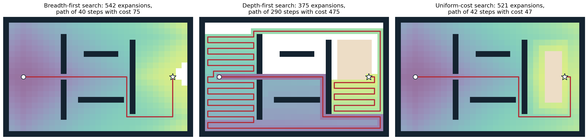
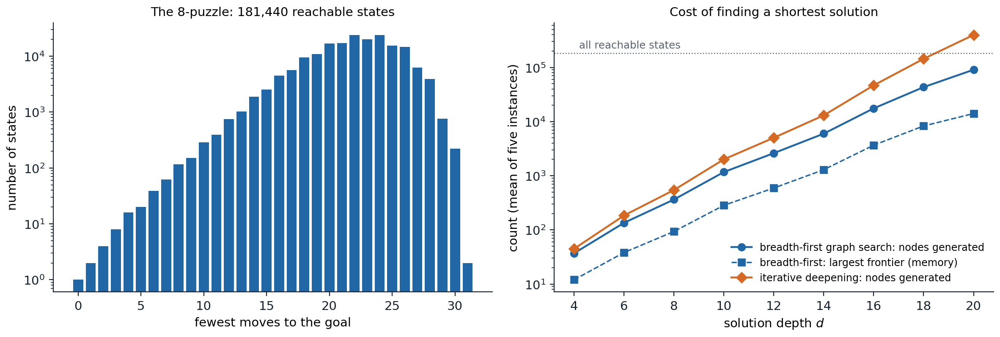

[ML Mastery Notes](../README.md) › [Artificial Intelligence](README.md)

# 1. Agents and Uninformed Search

[2. Heuristic Search →](02-heuristic-search.md)

## <a id="agents-and-rationality"></a>Agents and rationality

### <a id="agents-and-environments"></a>Agents and environments

This module treats artificial intelligence as the design of **agents**: systems that perceive an environment and act on it. At each step the agent receives a **percept**, and its behavior is described by an **agent function** that maps the whole percept sequence seen so far to an action. An **agent program** implements that function on a physical machine with limited memory and time; the function is the specification, the program is the implementation. A thermostat, a chess engine, a spam filter, a self-driving car, and a language model answering questions all fit the description, which is why it serves as a common frame for methods as different as search, logic, and probabilistic inference. Foundations chapter 1 places AI among its neighboring disciplines; this module develops its classical methods.

### <a id="rationality"></a>Rationality

Whether an agent behaves well is judged by a **performance measure** on the sequence of environment states that its actions produce, fixed by the designer and not by the agent. A **rational agent** chooses, for each percept sequence, an action that maximizes the *expected* value of the performance measure, given that percept sequence and whatever knowledge the agent was built with. Three features of the definition matter throughout the module:

- Rationality is about expectation, not outcome. An agent that crosses a street after looking both ways and is hit by a falling object has acted rationally; omniscience is not required.
- It is relative to what the agent can perceive and knows. Gathering information is itself an action, and chapter 12 computes when it is worth taking.
- It is a property of the agent function. Real programs have bounded computation, and choosing a good action *within a time budget* (**bounded rationality**) is a recurring theme: depth-limited game search (chapter 4), approximate inference (chapter 10), and satisficing rather than optimal planning (chapter 7) are all responses to it.

Specifying the performance measure is harder than it looks. A vacuum-cleaning robot rewarded for the amount of dirt it picks up can do well by dumping dirt and picking it up again; the measure should reward a clean floor, not the activity. The gap between the objective a designer writes down and the one intended returns in the RL and Safety and Frontier modules.

### <a id="kinds-of-environments"></a>Kinds of environments

The right method depends on the environment. The standard dimensions are:

- **Fully or partially observable:** whether the percept reveals the complete relevant state. Chess is fully observable; poker and driving are not.
- **Single-agent or multiagent:** whether other agents whose behavior depends on ours are present, and whether they are **competitive** or **cooperative**.
- **Deterministic or stochastic:** whether the current state and action determine the next state. An environment is **nondeterministic** when outcomes are uncertain but not described by probabilities.
- **Episodic or sequential:** whether each decision stands alone (classifying an image) or affects future decisions (a game).
- **Static or dynamic:** whether the world changes while the agent deliberates.
- **Discrete or continuous:** in states, time, percepts, and actions.
- **Known or unknown:** whether the agent (or its designer) knows the rules of the environment, its transition model. This concerns the agent's knowledge, not the world: a known environment can be partially observable, and an unknown one fully observable.

The chapters of this module move along these dimensions. Chapters 1–3 and 7 assume a single agent in a fully observable, deterministic, known, discrete environment, where the only difficulty is the size of the space of possibilities. Chapter 4 adds an adversary and chance, chapters 5–6 add partial knowledge represented in logic, and chapters 8–12 represent uncertainty with probability and choose actions by expected utility. Chapter 13 asks what happens when the agent intervenes rather than observes, and chapter 15 treats several rational agents at once. Sequential decisions under stochastic dynamics, and environments whose model must be learned from experience, belong to the RL module.

### <a id="kinds-of-agents"></a>Kinds of agents

Agent programs of increasing generality are commonly distinguished:

- **Simple reflex agents** act on the current percept through condition–action rules. They are fast but fail when the right action depends on history, as in any partially observable environment.
- **Model-based agents** maintain an internal **belief state** that summarizes the percept history, updated with a model of how the world evolves and how percepts arise. The filters of chapter 11 are the probabilistic version.
- **Goal-based agents** combine the model with a description of desirable states and *search* or *plan* for action sequences that reach them. This chapter begins their study.
- **Utility-based agents** rank outcomes by a numerical utility and maximize its expectation, which lets them trade off conflicting goals and uncertain success (chapter 12).
- **Learning agents** improve any of these components from experience, the subject of the ML, DL, and RL modules.

## <a id="problem-solving-as-search"></a>Problem solving as search

### <a id="search-problems"></a>Search problems

When the environment is fully observable, deterministic, and known, an agent can decide on a whole sequence of actions before acting, by simulating their effects with its model. The problem is described by

- a set of **states** $`\mathcal S`$ and an **initial state** $`s_0`$;
- for each state $`s`$, the finite set of applicable **actions** $`\mathcal A(s)`$;
- a **transition model** $`\mathrm{Result}(s,a)`$, the state reached by doing $`a`$ in $`s`$;
- a **goal test**, a predicate on states (or a set of goal states);
- an **action cost** $`c(s,a,s')>0`$ for each transition.

A **solution** is a sequence of actions from $`s_0`$ to a goal state, and an **optimal solution** has the least total cost among solutions. States and transitions form a directed graph, the **state space**; a solution is a path in it, and an optimal solution is a shortest path with the action costs as edge lengths. The difference from the shortest-path problems of an algorithms course is that the graph is given *implicitly*, by $`s_0`$ and $`\mathrm{Result}`$, and is usually far too large to write down; only the part the algorithm generates ever exists in memory.

**Example: the 8-puzzle.** Eight numbered tiles and a blank sit in a $`3\times3`$ frame; an action slides a tile next to the blank into it, at cost 1, and the goal is a fixed arrangement. A state is an arrangement of the tiles, so there are $`9!=362{,}880`$ states, of which exactly half are reachable from any given one, because every move preserves the parity of a permutation invariant. The 15-puzzle on a $`4\times4`$ frame has $`16!/2\approx1.05\times10^{13}`$ reachable states, and Rubik's cube about $`4.3\times10^{19}`$. These are toy problems in structure but not in size, which is the point: the methods of this chapter and the next are judged by how much of such a space they must touch.

### <a id="state-spaces-and-abstraction"></a>State spaces and abstraction

A state is an **abstraction** that keeps only what matters for the problem. A route planner's state is a city, not the weather or the contents of the car; a Pacman agent that must eat all the dots needs its position *and* the set of remaining dots, which multiplies the number of states by $`2^{\text{dots}}`$, while an agent that only needs to reach one square needs its position alone. An abstraction is valid when every abstract solution corresponds to a real one, and useful when carrying out its actions is easier than the original problem. Choosing the state is the first and often the most consequential design decision: a representation that omits something relevant produces plans that fail, and one that includes too much makes the space intractable. Chapters 3, 5, and 7 replace atomic states with **factored** ones, assignments to variables, which exposes structure that search can exploit.

### <a id="search-trees-and-the-frontier"></a>Search trees and the frontier

Search algorithms build a **search tree** whose root is the initial state and whose children are the results of applicable actions. A tree **node** is a bookkeeping structure: it holds a state, a pointer to its parent node, the action that generated it, and the **path cost** $`g(n)`$ from the root; the solution is recovered by following parent pointers from a goal node. Nodes and states differ, because one state can be reached by many paths and appears in many nodes, and a state space with a cycle has an infinite search tree.

Every algorithm in this chapter and the next is an instance of one loop. The **frontier** holds generated but not yet expanded nodes. Repeatedly remove a node from the frontier; if its state is a goal, return it; otherwise **expand** it by generating its children and adding them to the frontier. The strategies differ only in *which node is removed next*. To avoid regenerating the same state along different paths, a **graph search** also keeps a table of **reached** states and discards a child whose state was already reached by a path at least as cheap. A **tree-like search** keeps no such table; it saves memory but may generate the same state exponentially often, and it can loop forever on a cycle unless it checks at least the states on the current path.

### <a id="measuring-a-search-strategy"></a>Measuring a search strategy

A strategy is evaluated by four criteria:

- **completeness:** it finds a solution whenever one exists (and reports failure otherwise, when the space is finite);
- **cost optimality:** the solution it returns has least cost;
- **time complexity:** the number of nodes generated or expanded;
- **space complexity:** the maximum number of nodes held in memory.

Complexity is expressed with the **branching factor** $`b`$, the maximum number of children of a node; the **depth** $`d`$ of the shallowest goal; and the maximum length $`m`$ of any path, which can be infinite. The figures are worst-case counts; wall-clock time and bytes follow by multiplying with the cost per node.

## <a id="uninformed-search"></a>Uninformed search

**Uninformed** (or **blind**) strategies use only the problem definition: they can generate successors and recognize a goal, but have no estimate of how close a state is to one. The next chapter adds such estimates.

### <a id="breadth-first-search"></a>Breadth-first search

**Breadth-first search** (BFS) expands the shallowest node first, using a first-in, first-out queue as the frontier. All nodes at depth $`k`$ are expanded before any at depth $`k+1`$, so the first goal found is a shallowest one. Because a node at depth $`k+1`$ is generated only after its whole depth-$`k`$ layer, the goal test can be applied when a node is *generated* rather than when it is expanded (an **early goal test**), which saves a whole layer of work.

- BFS is complete whenever $`b`$ is finite.
- It is cost-optimal when all actions have the same cost, and more generally when path cost never decreases with depth; with varying costs the fewest-actions path need not be the cheapest.
- With the early goal test it generates $`1+b+b^2+\dots+b^d=O(b^d)`$ nodes, and every generated node stays in memory, either on the frontier or in the reached table, so its space is also $`O(b^d)`$.

Memory is the binding constraint. With $`b=10`$, a million nodes generated per second, and one kilobyte per node, a goal at depth 8 takes about 100 seconds and 100 gigabytes; at depth 10, three hours and 10 terabytes; at depth 12, almost two weeks and a petabyte. Exponential search spaces are not tamed by faster hardware, and uninformed search is limited to small problems.

### <a id="uniform-cost-search"></a>Uniform-cost search

When actions have different costs, **uniform-cost search** (UCS) expands the node with the lowest path cost $`g(n)`$, using a priority queue. It is Dijkstra's algorithm, run on an implicit graph and stopped at the first goal *removed* from the frontier. The goal test must wait until removal, because a cheaper path to the goal may still be generated after the goal first appears. When a cheaper path to an already reached state is found, the state gets the new cost and parent; with a binary heap, the old entry is left in the queue and skipped when removed (**lazy deletion**).

UCS expands nodes in order of nondecreasing path cost, so when a goal node is removed no cheaper path to any goal remains unexplored ([Appendix A](#block-ai01-appendix-a)). It is complete and cost-optimal provided every action costs at least some $`\varepsilon>0`$; zero-cost cycles could otherwise trap it. With optimal cost $`C^*`$, it explores all paths costing less than $`C^*`$, which can be as deep as $`\lfloor C^*/\varepsilon\rfloor`$, so time and space are $`O\bigl(b^{1+\lfloor C^*/\varepsilon\rfloor}\bigr)`$, far worse than $`b^d`$ when many cheap actions lead nowhere. With unit costs it reduces to BFS with a late goal test.

### <a id="depth-first-search"></a>Depth-first search

**Depth-first search** (DFS) expands the deepest node first, using a last-in, first-out stack. It dives along one path until a dead end and then backs up to the most recent node with unexplored children. Its virtue is memory: a tree-like DFS stores only the current path and the unexpanded siblings along it, $`O(bm)`$ nodes, and the **backtracking** variant, which generates one child at a time and undoes the change to a single state representation on return, stores only $`O(m)`$. Its faults are that it returns the first solution it meets, whatever its cost, and that a tree-like DFS can descend forever into an infinite branch or a cycle; checking the states on the current path removes cycles but not infinite spaces. Graph-search DFS is complete in finite spaces but gives up the memory advantage. In the worst case DFS generates $`O(b^m)`$ nodes, which is much worse than $`b^d`$ when $`m\gg d`$.

DFS is the method of choice when solutions are plentiful and deep and any solution will do, which is the situation of the constraint satisfaction problems of chapter 3; there, every complete assignment lies at the same depth and the search is a backtracking DFS over partial assignments.



*Three strategies searching a 4-connected grid from the circle to the star. Shading marks the order of expansion, from purple (early) to yellow (late), and white cells were never expanded; the beige block is a swamp where each step costs 6 instead of 1, and the goal lies at its edge. Breadth-first search expands 542 cells in rings of increasing distance and finds a 40-step path that crosses the swamp, cost 75. Depth-first search, which tries right, down, left, and up in that order, expands only 375 cells but follows a 290-step path of cost 475. Uniform-cost search expands 521 cells in contours of equal cost and finds the cheapest path, 42 steps around the swamp with cost 47.*

### <a id="depth-limited-and-iterative-deepening-search"></a>Depth-limited and iterative-deepening search

**Depth-limited search** runs DFS but treats nodes at a depth limit $`\ell`$ as having no children. It cannot run forever, but it fails when $`\ell<d`$ and may return a deep, costly solution when $`\ell\gg d`$. **Iterative deepening search** (IDS) runs depth-limited search with $`\ell=0,1,2,\dots`$ until a goal is found. It combines the memory of DFS, $`O(bd)`$, with the guarantees of BFS: it is complete for finite $`b`$ and optimal for unit costs, because the first limit at which a goal appears is the depth of the shallowest one.

Repeating the shallow levels looks wasteful but costs little, because in a tree with a constant branching factor most nodes are at the bottom. Nodes at depth $`k`$ are generated once for each limit from $`k`$ to $`d`$, so IDS generates

$$
N_{\text{IDS}}=\sum_{k=1}^{d}(d-k+1)\,b^k,\qquad N_{\text{BFS}}=\sum_{k=1}^{d}b^k,
$$

and the ratio is below $`b/(b-1)`$ for every depth, approaching it as $`d`$ grows ([Appendix B](#block-ai01-appendix-b)):

```python
# Nodes generated on a uniform tree with branching factor b when the shallowest goal is at depth d.
def bfs_nodes(b, d):
    return sum(b**k for k in range(1, d + 1))                  # every node down to depth d, once


def ids_nodes(b, d):
    return sum((d - k + 1) * b**k for k in range(1, d + 1))    # depth-k nodes are regenerated d - k + 1 times


for b, d in [(10, 5), (2, 20), (3, 12)]:
    B, I = bfs_nodes(b, d), ids_nodes(b, d)
    print(f"b={b:2d}, d={d:2d}: BFS {B:>9,}  IDS {I:>9,}  ratio {I / B:.5f}  limit b/(b-1) = {b / (b - 1):.5f}")
# b=10, d= 5: BFS   111,110  IDS   123,450  ratio 1.11106  limit b/(b-1) = 1.11111
# b= 2, d=20: BFS 2,097,150  IDS 4,194,260  ratio 1.99998  limit b/(b-1) = 2.00000
# b= 3, d=12: BFS   797,160  IDS 1,195,722  ratio 1.49998  limit b/(b-1) = 1.50000
```

With ten children per node, iterative deepening does 11% more work than BFS while using memory proportional to the depth instead of the whole layer; even with $`b=2`$ it only doubles the work. When the state space is large, the solution depth is unknown, and action costs are equal, iterative deepening is the preferred uninformed method. The analogous **iterative lengthening** for varying costs, which raises a limit on path cost, pays a much higher overhead when costs are diverse, because each new limit may admit only a few new nodes; the informed version, IDA*, appears in chapter 2.

### <a id="bidirectional-search"></a>Bidirectional search

**Bidirectional search** runs two searches, forward from the initial state and backward from the goal, and stops when the frontiers meet. Two searches to depth $`d/2`$ generate about $`2b^{d/2}`$ nodes instead of $`b^d`$: for $`b=10`$ and $`d=10`$, two hundred thousand instead of ten billion. The backward search needs a goal *state* rather than only a goal test, and a way to compute predecessors, which is easy when actions are reversible, as in route finding and sliding puzzles. The stopping rule needs care: the first meeting point need not lie on a shortest path. With unit costs, finishing the current layer and taking the best meeting point is correct; with general costs the searches may stop only when the sum of the two smallest frontier costs is at least the best path found so far.

```python
from collections import deque

GOAL = (1, 2, 3, 4, 5, 6, 7, 8, 0)                   # 0 is the blank
NEIGH = {i: [j for j in (i - 3, i + 3, i - 1 if i % 3 else -1, i + 1 if i % 3 < 2 else -1) if 0 <= j < 9]
         for i in range(9)}


def successors(s):
    z = s.index(0)
    for j in NEIGH[z]:
        t = list(s)
        t[z], t[j] = t[j], t[z]
        yield tuple(t)


def bfs(start, goal):
    """Breadth-first graph search; returns the solution length and the number of states reached."""
    depth = {start: 0}
    frontier = deque([start])
    while frontier:
        s = frontier.popleft()
        for t in successors(s):
            if t not in depth:
                depth[t] = depth[s] + 1
                if t == goal:
                    return depth[t], len(depth)
                frontier.append(t)


def bidirectional(start, goal):
    """Alternate full layers of BFS from both ends until they meet (moves are reversible)."""
    dist = [{start: 0}, {goal: 0}]
    layer = [[start], [goal]]
    best = None
    while best is None:
        side = 0 if len(layer[0]) <= len(layer[1]) else 1       # grow the smaller frontier
        new = []
        for s in layer[side]:
            for t in successors(s):
                if t not in dist[side]:
                    dist[side][t] = dist[side][s] + 1
                    new.append(t)
                    if t in dist[1 - side]:
                        total = dist[side][t] + dist[1 - side][t]
                        best = total if best is None else min(best, total)
        layer[side] = new
    return best, len(dist[0]) + len(dist[1])


start = (8, 6, 7, 2, 5, 4, 3, 0, 1)                   # one of the two hardest positions
print("one-directional BFS: length %d, states reached %d" % bfs(start, GOAL))
print("bidirectional BFS:   length %d, states reached %d" % bidirectional(start, GOAL))
# one-directional BFS: length 31, states reached 181439
# bidirectional BFS:   length 31, states reached 20220
```

For one of the two 8-puzzle positions farthest from the goal, forward BFS reaches every state but one before it finds the 31-move solution, while the bidirectional search reaches about 20,000, a ninefold saving. The saving is smaller than $`b^{d/2}`$ against $`b^d`$ suggests because the whole space holds only 181,440 states, so a one-directional search cannot grow beyond it.

### <a id="comparing-the-strategies"></a>Comparing the strategies

| Criterion | Breadth-first | Uniform-cost | Depth-first | Depth-limited | Iterative deepening | Bidirectional |
| --- | --- | --- | --- | --- | --- | --- |
| Complete? | yes$`^1`$ | yes$`^{1,2}`$ | no | no | yes$`^1`$ | yes$`^{1,4}`$ |
| Cost-optimal? | yes$`^3`$ | yes | no | no | yes$`^3`$ | yes$`^{3,4}`$ |
| Time | $`O(b^d)`$ | $`O(b^{1+\lfloor C^*/\varepsilon\rfloor})`$ | $`O(b^m)`$ | $`O(b^\ell)`$ | $`O(b^d)`$ | $`O(b^{d/2})`$ |
| Space | $`O(b^d)`$ | $`O(b^{1+\lfloor C^*/\varepsilon\rfloor})`$ | $`O(bm)`$ | $`O(b\ell)`$ | $`O(bd)`$ | $`O(b^{d/2})`$ |

Superscripts: $`^1`$ if $`b`$ is finite and the state space either has a solution or is finite; $`^2`$ if all action costs are at least $`\varepsilon>0`$; $`^3`$ if all action costs are equal; $`^4`$ if both directions use BFS or UCS. Depth-first search is complete in finite spaces when run as a graph search or with cycle checking.

## <a id="repeated-states-and-memory"></a>Repeated states and memory

The table assumes a tree. Most state spaces are graphs with many paths to each state, and the choice between graph search and tree-like search trades time against memory in a way the worst-case bounds hide. In the 8-puzzle, every move can be undone, and longer loops abound: moving the blank around a $`2\times2`$ block returns to the start after twelve moves. A tree-like search that only forbids undoing the previous move still regenerates the same states along many paths.



*Left: the 181,440 states reachable from the 8-puzzle goal, by the fewest moves needed to return to it (logarithmic scale). The count grows roughly geometrically for about 20 moves, peaks at 24 moves with 24,047 states, and then falls, because the space is finite; the two hardest positions need 31 moves. Right: the cost of finding a shortest solution for five random positions at each even depth. Breadth-first graph search, with the goal test on generation, generates about 90,500 nodes at depth 20 and holds at most about 14,000 on its frontier. Iterative deepening, which avoids only undoing the previous move, generates about 398,000 nodes at depth 20, more than twice the number of reachable states, because without a reached table it regenerates states that many paths lead to; its memory, not plotted, is a single path of at most 20 nodes and its unexpanded siblings.*

The figure also shows the finite-space effect on the left: the number of states at distance $`k`$ grows by a factor between 1.25 and 2 per move over the first fifteen moves, far below the branching factor of up to 4, because many moves lead back toward states already counted, and it collapses beyond 26 moves. Branching factors estimated from the first few layers overstate the size of a search.

In practice the two regimes combine. A **transposition table**, a bounded hash table of recently reached states, catches most duplicates at a fixed memory cost; chess programs use one within iterative deepening, and it reappears in chapter 4. Graph search is also the only safe option in a space with cycles and no depth bound.

A compact implementation makes the common structure explicit. The same loop runs breadth-first, depth-first, and uniform-cost search; only the rule for removing a node from the frontier changes.

```python
import heapq
from collections import deque

# A small road map: travel times in minutes between towns.
roads = {("A", "B"): 7, ("A", "C"): 9, ("A", "F"): 14, ("B", "C"): 10, ("B", "D"): 15,
         ("C", "D"): 11, ("C", "F"): 2, ("D", "E"): 6, ("E", "F"): 9, ("E", "G"): 5,
         ("F", "H"): 12, ("H", "G"): 3}
graph = {}
for (u, v), w in roads.items():
    graph.setdefault(u, []).append((v, w))
    graph.setdefault(v, []).append((u, w))
for u in graph:
    graph[u].sort()                     # expand neighbors in alphabetical order


def search(start, goal, kind):
    """Graph search; the frontier discipline is the only difference between strategies."""
    tie = 0
    frontier = [(0, tie, start, [start])]
    reached = {start: 0}
    expanded = []
    while frontier:
        if kind == "ucs":
            cost, _, s, path = heapq.heappop(frontier)     # cheapest path first
        elif kind == "bfs":
            cost, _, s, path = frontier.pop(0)             # oldest first
        else:
            cost, _, s, path = frontier.pop()              # newest first
        if kind == "ucs" and cost > reached[s]:
            continue                                       # stale entry: a cheaper path was found later
        expanded.append(s)
        if s == goal:
            return path, cost, expanded
        for t, w in graph[s]:
            new = cost + w
            if kind == "ucs":
                if t not in reached or new < reached[t]:
                    reached[t] = new
                    tie += 1
                    heapq.heappush(frontier, (new, tie, t, path + [t]))
            elif t not in reached:
                reached[t] = new
                tie += 1
                frontier.append((new, tie, t, path + [t]))


for kind in ["bfs", "dfs", "ucs"]:
    path, cost, expanded = search("A", "G", kind)
    print(f"{kind}: path {'-'.join(path)}, cost {cost}, expanded {''.join(expanded)}")
# bfs: path A-F-E-G, cost 28, expanded ABCFDEHG
# dfs: path A-F-H-G, cost 29, expanded AFHG
# ucs: path A-C-F-E-G, cost 25, expanded ABCFDEHG
```

Breadth-first search returns a three-road route of 28 minutes, the fewest roads but not the fastest; depth-first search commits to the last-listed neighbor, F, and finds a 29-minute route after only four expansions; uniform-cost search finds the 25-minute route through four roads. The implementation stores a whole path in every frontier entry for readability; real implementations store parent pointers, and use a `deque` for BFS, since removing the first element of a Python list takes time proportional to its length. For clarity the BFS here tests for the goal on expansion; testing on generation would stop one layer earlier.

The strategies of this chapter are exhaustive: in the worst case each examines a large fraction of the space before reaching the goal, because nothing tells them which direction is promising. Chapter 2 adds that information in the form of a heuristic estimate of the remaining cost, and shows how much of the space it can save while keeping the guarantees of uniform-cost search.

## <a id="appendices"></a>Appendices


<details>
<summary><a id="block-ai01-appendix-a"></a><b>A. Optimality of uniform-cost search</b></summary>


Assume every action costs at least $`\varepsilon>0`$ and $`b`$ is finite. Uniform-cost graph search maintains the following invariant: every state $`s`$ has an optimal path from $`s_0`$ on which some state is either on the frontier with its optimal cost $`g^*(\cdot)`$ recorded, or $`s`$ itself has already been expanded with $`g(s)=g^*(s)`$. Initially $`s_0`$ is on the frontier with cost 0. When a node $`n`$ is removed, choose an optimal path to $`n`$'s state and the first state $`u`$ on it not yet expanded; its predecessor on the path was expanded with its optimal cost, so $`u`$ was generated with cost $`g^*(u)`$ and is on the frontier. Since costs are nonnegative, $`g^*(u)\le g^*(n)\le g(n)`$, and $`n`$ was chosen as a minimum, so $`g(n)\le g^*(u)`$. Hence $`g(n)=g^*(n)`$: every state is expanded with its optimal cost, and states are expanded in nondecreasing order of $`g^*`$.

In particular, the first goal node removed has cost $`C^*`$, the optimal cost of reaching any goal: a cheaper goal would have been removed earlier. The goal test must be applied on removal, because a goal can be generated with cost above $`C^*`$ before the optimal path to it is complete.

**Completeness and complexity.** Because each action costs at least $`\varepsilon`$, only finitely many paths have cost below any bound when $`b`$ is finite, so the search reaches cost $`C^*`$ after finitely many expansions. Every path it expands has cost at most $`C^*`$ and hence at most $`\lfloor C^*/\varepsilon\rfloor`$ actions; the frontier holds their children, one level deeper, which gives the bound $`O\bigl(b^{1+\lfloor C^*/\varepsilon\rfloor}\bigr)`$.

</details>


<details>
<summary><a id="block-ai01-appendix-b"></a><b>B. The cost of iterative deepening</b></summary>


On a uniform tree, iteration $`\ell`$ of iterative deepening generates $`\sum_{k=1}^{\ell}b^k`$ nodes, and the search stops at iteration $`d`$. Summing over iterations counts depth-$`k`$ nodes $`d-k+1`$ times, which gives $`N_{\text{IDS}}=\sum_{k=1}^d(d-k+1)b^k`$. Substituting $`j=d-k`$,

$$
N_{\text{IDS}}=b^d\sum_{j=0}^{d-1}(j+1)\,b^{-j}<b^d\sum_{j=0}^{\infty}(j+1)x^{j}=\frac{b^d}{(1-x)^2},\qquad x=\frac1b,
$$

using $`\sum_{j\ge0}(j+1)x^j=(1-x)^{-2}`$ for $`|x|<1`$. Similarly $`N_{\text{BFS}}=\sum_{k=1}^db^k=b^d\sum_{j=0}^{d-1}x^j`$, which tends to $`b^d/(1-x)`$. The ratio therefore tends to $`1/(1-x)=b/(b-1)`$ as $`d\to\infty`$, and a term-by-term comparison, $`\sum_{j<d}(j+1)x^j\le\frac{1}{1-x}\sum_{j<d}x^j`$, whose difference is $`\frac{d\,x^d}{1-x}\ge0`$, shows that it stays below that limit for every $`d`$.

Both counts assume the goal test is applied when a node is generated and the goal is the last node of its layer, so that both searches generate the whole tree to depth $`d`$. When the goal lies earlier in its layer, both stop early by the same amount in the last layer, and the ratio changes little because the earlier iterations of IDS dominate the difference.

</details>


<details>
<summary><a id="block-ai01-appendix-c"></a><b>C. Early and late goal tests</b></summary>


A goal test applied when a node is generated (early) saves work only when it cannot miss a better solution:

- **Breadth-first search with unit costs.** All nodes of depth $`k`$ are generated before any node of depth $`k+1`$, and they are generated in order of depth. The first goal generated is therefore a shallowest goal, and testing on generation is safe. It avoids expanding the goal's layer, which for $`b=10`$ is about nine-tenths of the work.
- **Uniform-cost search.** A goal generated with cost $`g`$ may later be reached by a cheaper path through a node still on the frontier, because the frontier contains nodes of cost up to $`g`$. Only removal guarantees optimality, by Appendix A.
- **Depth-first and depth-limited search.** Optimality is not at stake, so the goal can be tested on generation to save a little work.

The same reasoning governs the stopping rule of bidirectional search. With unit costs, alternating full layers and stopping at the end of the layer in which the frontiers first meet is correct: any shorter path would have produced a meeting in an earlier layer. With general costs, the searches may stop only when $`\mathrm{top}_f+\mathrm{top}_b\ge\mu`$, where $`\mathrm{top}_f`$ and $`\mathrm{top}_b`$ are the smallest costs on the two frontiers and $`\mu`$ is the cost of the best path found so far.

</details>

---

[2. Heuristic Search →](02-heuristic-search.md)
