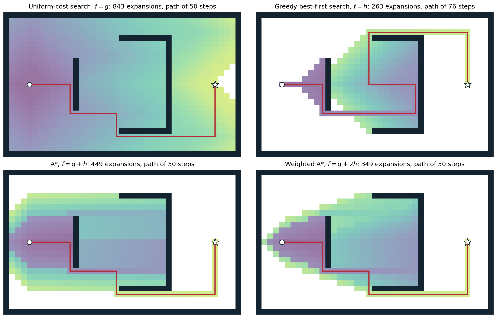
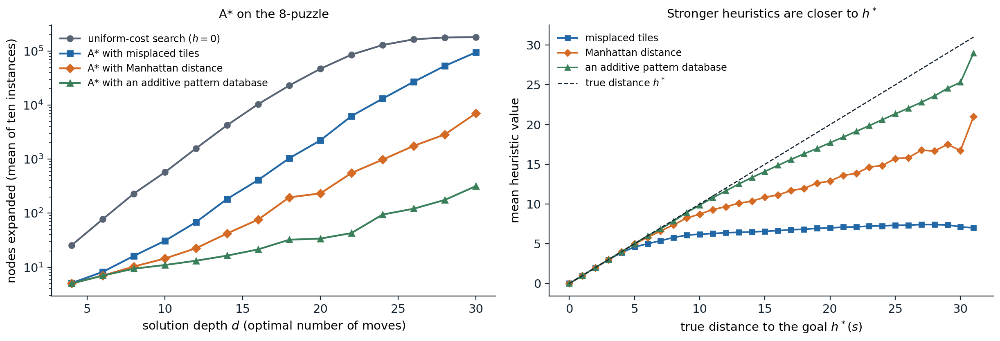

[ML Mastery Notes](../README.md) › [Artificial Intelligence](README.md)

# 2. Heuristic Search

[← 1. Agents and Uninformed Search](01-agents-and-uninformed-search.md) · [3. Constraint Satisfaction and Local Search →](03-constraint-satisfaction-and-local-search.md)

## <a id="heuristics-and-best-first-search"></a>Heuristics and best-first search

### <a id="estimating-the-distance-to-a-goal"></a>Estimating the distance to a goal

The strategies of chapter 1 search in every direction at once, because they have no idea where the goal is. A **heuristic function** $h(n)$ estimates the cost of the cheapest path from the state of node $n$ to a goal, computed from the state alone. The true cost is written $h^*(n)$, and $h(n)=0$ at goal states. Typical heuristics are the straight-line distance for route finding, which ignores roads; the number of misplaced tiles in the 8-puzzle, which ignores that tiles block each other; and the sum of the Manhattan distances of the tiles from their goal squares, which ignores only that tiles cannot pass through each other. A heuristic is domain knowledge in a form a general algorithm can use, and its quality decides whether a problem is solvable at all.

All the algorithms of this chapter are **best-first searches**: the generic loop of chapter 1 with a priority queue ordered by an **evaluation function** $f(n)$. Uniform-cost search is the case $f(n)=g(n)$, the cost of the path so far.

### <a id="greedy-best-first-search"></a>Greedy best-first search

**Greedy best-first search** expands the node that appears closest to the goal, $f(n)=h(n)$. It often finds a solution quickly, but it is not optimal: it follows the heuristic into a dead end, commits to whatever path it first finds, and ignores how much that path has already cost. As a tree-like search it can oscillate forever between two states; as a graph search it is complete in finite spaces. With a good heuristic it expands few nodes, with a misleading one it can explore the whole space, and its worst-case time and space are $O(b^m)$.

## <a id="a-search"></a>A* search

### <a id="the-evaluation-function"></a>The evaluation function

**A\*** ([Hart, Nilsson, and Raphael, 1968](https://doi.org/10.1109/TSSC.1968.300136)) orders the frontier by

$$
f(n)=g(n)+h(n),
$$

the cost of the path to $n$ plus the estimated cost from $n$ to a goal: an estimate of the cost of the cheapest solution *through* $n$. It balances the two failures above. Uniform-cost search, $h=0$, takes no account of where the goal lies; greedy search, $g$ ignored, takes no account of what the path costs. As in uniform-cost search, the goal test is applied when a node is removed from the frontier.



*Four best-first searches on a grid with unit step costs and the Manhattan distance as the heuristic, from the circle to the star; shading marks the order of expansion, from purple (early) to yellow (late), and white cells were never expanded. Uniform-cost search expands 843 cells in every direction. Greedy best-first search expands only 263, but it runs straight into the cup-shaped wall, fills it, and escapes over the top along a 76-step path. A\* expands 449 cells and finds a shortest path of 50 steps; it also explores the cup, whose cells look promising to the heuristic, but spends nothing behind the start. Weighted A\* with $f=g+2h$ expands 349 cells and here also finds a 50-step path, although it guarantees only a path within a factor of 2 of the shortest.*

### <a id="admissibility-and-consistency"></a>Admissibility and consistency

Two properties of $h$ make A\* optimal.

- $h$ is **admissible** if it never overestimates: $h(n)\le h^*(n)$ for every node. Then $f(n)$ never overestimates the cost of the best solution through $n$. The straight-line distance is admissible because a straight line is the shortest path between two points; misplaced tiles and Manhattan distance are admissible because every misplaced tile must move at least once, and at least its Manhattan distance, in any solution.
- $h$ is **consistent** (or **monotone**) if, for every node $n$ and every successor $n'$ reached by action $a$,
$$
h(n)\le c(n,a,n')+h(n'),
$$
and $h=0$ at goals. This is a triangle inequality: the estimate from $n$ is no larger than the cost of a step plus the estimate from where the step leads.

Consistency implies admissibility, by induction along an optimal path to a goal. The converse fails, but the admissible heuristics that arise in practice are usually consistent. Consistency has a direct consequence for A\*: along any path, $f$ never decreases, since

$$
f(n')=g(n)+c(n,a,n')+h(n')\ge g(n)+h(n)=f(n).
$$

### <a id="optimality-of-a"></a>Optimality of A\*

**With an admissible heuristic, tree-like A\* is cost-optimal.** Suppose A\* removes a suboptimal goal node $G_2$ with cost $g(G_2)>C^*$. Some node $n$ on an optimal solution path is still on the frontier, and admissibility gives $f(n)=g(n)+h(n)\le g(n)+h^*(n)=C^*<g(G_2)=f(G_2)$, so $n$ would have been removed first, a contradiction.

**With a consistent heuristic, A\* graph search is cost-optimal without ever reopening a state.** Because $f$ is nondecreasing along paths, the first time A\* expands a state it has found an optimal path to it, exactly as uniform-cost search does with $g$ ([Appendix A](#block-ai02-appendix-a)); the reached table can discard every later, costlier path. With an admissible but inconsistent heuristic, graph search can expand a state along a suboptimal path first. It remains optimal if it **reopens** states, moving them back to the frontier when a cheaper path is found, at the price of repeated expansions that can be exponential in number in pathological cases.

### <a id="contours-and-surely-expanded-nodes"></a>Contours and surely expanded nodes

With a consistent heuristic, A\* expands nodes in order of nondecreasing $f$, so it sweeps outward through **contours** of equal $f$, just as uniform-cost search sweeps through contours of equal $g$; the better the heuristic, the more the contours stretch toward the goal. This gives a precise account of its work:

- every node with $f(n)<C^*$ is expanded;
- no node with $f(n)>C^*$ is expanded;
- nodes with $f(n)=C^*$ may or may not be, depending on how ties are broken; breaking ties in favor of larger $g$ (deeper nodes) usually reaches the goal sooner.

A\* thus **prunes** every subtree whose root has $f(n)>C^*$ without examining it, while remaining optimal. Moreover, A\* with a consistent heuristic is **optimally efficient** in a qualified sense ([Dechter and Pearl, 1985](https://doi.org/10.1145/3828.3830)): any algorithm that extends search paths from the root, uses the same heuristic information, and is guaranteed to find optimal solutions must expand every node with $f(n)<C^*$, because it cannot rule out that such a node leads to a cheaper solution. Nothing better is possible without better information.

This does not make A\* practical everywhere. For most problems the number of states within the goal contour is still exponential in the solution length, unless the heuristic error $|h^*-h|$ grows no faster than the logarithm of $h^*$, which almost no heuristic achieves. A\* also keeps every generated node in memory, and it usually runs out of memory long before it runs out of time.

## <a id="designing-heuristics"></a>Designing heuristics

### <a id="dominance-and-the-effective-branching-factor"></a>Dominance and the effective branching factor

If $h_2(n)\ge h_1(n)$ for every $n$ and both are consistent, $h_2$ **dominates** $h_1$, and A\* with $h_2$ never expands more nodes than with $h_1$, except possibly among nodes with $f=C^*$: every node surely expanded with $h_2$ has $g(n)+h_2(n)<C^*$, hence $g(n)+h_1(n)<C^*$, and is also surely expanded with $h_1$. A larger admissible heuristic is always better, provided it is not too expensive to compute. Given several admissible heuristics, their pointwise maximum is admissible and dominates each of them (and consistent if they all are), so there is no need to choose.

A useful summary of a heuristic's quality is the **effective branching factor** $b^*$: if A\* expands $N$ nodes to find a solution at depth $d$, $b^*$ is the branching factor of a uniform tree of depth $d$ with $N+1$ nodes, $N+1=1+b^*+(b^*)^2+\dots+(b^*)^d$. A good heuristic brings $b^*$ close to 1, and $b^*$ is fairly stable across problem sizes, so a few small experiments predict the cost of larger ones.

```python
import heapq
from collections import deque

import numpy as np

GOAL = (1, 2, 3, 4, 5, 6, 7, 8, 0)
NEIGH = {i: [j for j in (i - 3, i + 3, i - 1 if i % 3 else -1, i + 1 if i % 3 < 2 else -1) if 0 <= j < 9]
         for i in range(9)}
ROWCOL = {t: divmod(GOAL.index(t), 3) for t in range(1, 9)}


def successors(s):
    z = s.index(0)
    for j in NEIGH[z]:
        t = list(s)
        t[z], t[j] = t[j], t[z]
        yield tuple(t)


def h_misplaced(s):
    return sum(1 for i, t in enumerate(s) if t and t != GOAL[i])


def h_manhattan(s):
    return sum(abs(i // 3 - ROWCOL[t][0]) + abs(i % 3 - ROWCOL[t][1]) for i, t in enumerate(s) if t)


def astar(start, h, w=1.0):
    """A* graph search (weighted by w); returns nodes expanded and solution cost."""
    g, closed, tie = {start: 0}, set(), 0
    frontier = [(w * h(start), 0, start)]
    while frontier:
        _, _, s = heapq.heappop(frontier)
        if s in closed:
            continue
        closed.add(s)
        if s == GOAL:
            return len(closed), g[s]
        for t in successors(s):
            if t not in g or g[s] + 1 < g[t]:
                g[t] = g[s] + 1
                tie += 1
                heapq.heappush(frontier, (g[t] + w * h(t), tie, t))


def branching(N, d):
    """Effective branching factor: the b with N + 1 = 1 + b + ... + b^d."""
    lo, hi = 1.0, 10.0
    for _ in range(60):
        b = (lo + hi) / 2
        lo, hi = (b, hi) if sum(b**k for k in range(d + 1)) < N + 1 else (lo, b)
    return b


# True distances of all reachable states, by breadth-first search backward from the goal.
dist, q = {GOAL: 0}, deque([GOAL])
while q:
    s = q.popleft()
    for t in successors(s):
        if t not in dist:
            dist[t] = dist[s] + 1
            q.append(t)

rng = np.random.default_rng(1)
print("depth | nodes expanded: h=0, misplaced, Manhattan | effective branching factor")
for d in [8, 16, 24]:
    pool = [s for s in dist if dist[s] == d]
    starts = [pool[i] for i in rng.choice(len(pool), 5, replace=False)]
    N = [np.mean([astar(s, h)[0] for s in starts]) for h in (lambda s: 0, h_misplaced, h_manhattan)]
    print(f"{d:5d} | {N[0]:8.0f} {N[1]:8.0f} {N[2]:8.0f} | {branching(N[0], d):.2f} {branching(N[1], d):.2f} {branching(N[2], d):.2f}")
# depth | nodes expanded: h=0, misplaced, Manhattan | effective branching factor
#     8 |      215       18       12 | 1.77 1.18 1.09
#    16 |    12739      663      127 | 1.71 1.39 1.22
#    24 |   126263    19269     1673 | 1.56 1.44 1.28
```

For solutions 24 moves long, the Manhattan distance, which dominates the count of misplaced tiles, cuts the work by a factor of about 75 relative to uniform-cost search, whose effective branching factor falls only because the finite space of 181,440 states caps its growth.

### <a id="heuristics-from-relaxed-problems"></a>Heuristics from relaxed problems

Where do admissible heuristics come from? A **relaxed problem** has fewer restrictions on the actions than the original, so its state graph is a supergraph of the original, and every solution of the original is a solution of the relaxation. The optimal cost of the relaxed problem is therefore an admissible heuristic, and, being an exact shortest-path distance in a graph, it satisfies the triangle inequality and is consistent. Writing the 8-puzzle's action as "a tile can move from square A to square B if A is adjacent to B and B is blank" and deleting conditions yields the familiar heuristics:

- delete "B is blank": a tile moves to any adjacent square, and the optimal cost is the **Manhattan distance**;
- delete both conditions: a tile moves anywhere in one step, and the optimal cost is the number of **misplaced tiles**;
- delete "A is adjacent to B": a tile can jump into the blank from anywhere, which gives Gaschnig's heuristic, never smaller than the number of misplaced tiles.

The relaxed problem must be easy to solve, ideally decomposing into independent subproblems, as the tiles do once blocking is ignored. Programs can generate relaxations automatically from a formal problem description, which is how domain-independent planners obtain their heuristics (chapter 7).

### <a id="pattern-databases"></a>Pattern databases

An **abstraction** maps each state to an abstract state by forgetting some details, so that several states share an image, and the distance between abstract states is an admissible estimate of the real distance. A **pattern database** ([Culberson and Schaeffer, 1998](https://doi.org/10.1111/0824-7935.00065)) forgets the identities of all tiles except a chosen subset, the pattern, and stores the exact cost of solving every configuration of the pattern tiles and the blank, computed once by a breadth-first search backward from the goal. At search time the heuristic is a table lookup.

A single pattern counts moves of other tiles too, so the costs of two patterns cannot be added. If each database counts only the moves of its own pattern tiles, and the patterns are **disjoint**, every move is counted at most once and the sum is admissible ([Felner, Korf, and Hanan, 2004](https://doi.org/10.1613/jair.1480)). For the 8-puzzle, two disjoint patterns of four tiles give two databases of $9\cdot8\cdot7\cdot6\cdot5=15{,}120$ entries each. For the 15-puzzle, additive databases with patterns of seven and eight tiles solve random instances optimally in a fraction of a second, where the Manhattan distance needs orders of magnitude more nodes.



*Left: nodes expanded by A\* graph search on ten random 8-puzzle positions at each even solution depth. At depth 30, uniform-cost search expands 181,330 of the 181,440 states, misplaced tiles 94,622, Manhattan distance 7,051, and an additive pattern database of tiles 1–4 and 5–8 only 317; the effective branching factors at depth 20 are 1.63, 1.38, 1.20, and 1.05. Right: the mean value of each heuristic over all reachable states at each true distance. All three are admissible and ordered, misplaced tiles ≤ Manhattan distance ≤ the true distance, and their averages over all states are 7.11, 14.0, and 19.13 against a mean true distance of 21.97.*

### <a id="learned-heuristics"></a>Learned heuristics

A heuristic can also be learned: a regression model predicts $h^*(s)$ from features of $s$, trained on solved instances or on distances obtained by searching backward from the goal. [Agostinelli et al. (2019)](https://doi.org/10.1038/s42256-019-0070-z) trained a deep network as the cost-to-go function of Rubik's cube by approximate value iteration and used it in a weighted, batched A\* that solves every test configuration, most of them optimally. A learned heuristic is not guaranteed to be admissible, so the optimality guarantee becomes approximate; the value functions of the RL module are learned heuristics of the same kind, and game programs learn evaluation functions in the same way (chapter 4).

## <a id="memory-bounded-search"></a>Memory-bounded search

### <a id="iterative-deepening-a"></a>Iterative-deepening A*

A\* keeps every generated node, and the frontier and reached table exhaust memory long before time runs out. **Iterative-deepening A\*** (IDA\*; [Korf, 1985](https://www.sciencedirect.com/science/article/pii/0004370285900840)) applies the idea of iterative deepening to the $f$ contours: each iteration is a depth-first search that cuts off every node with $f(n)$ above a bound, and the next bound is the smallest $f$ that exceeded the current one. Memory is linear in the solution depth, and with an admissible heuristic the first solution found is optimal, because each bound is at most the optimal cost. The cost is repeated work: IDA\* keeps no reached table, so it regenerates states reachable by several paths, and when $f$ takes many distinct values (real-valued costs, for example) each iteration may add only one new node.

```python
import heapq

GOAL = (1, 2, 3, 4, 5, 6, 7, 8, 0)
NEIGH = {i: [j for j in (i - 3, i + 3, i - 1 if i % 3 else -1, i + 1 if i % 3 < 2 else -1) if 0 <= j < 9]
         for i in range(9)}
ROWCOL = {t: divmod(GOAL.index(t), 3) for t in range(1, 9)}


def successors(s):
    z = s.index(0)
    for j in NEIGH[z]:
        t = list(s)
        t[z], t[j] = t[j], t[z]
        yield tuple(t)


def h(s):                                            # Manhattan distance
    return sum(abs(i // 3 - ROWCOL[t][0]) + abs(i % 3 - ROWCOL[t][1]) for i, t in enumerate(s) if t)


def ida_star(start):
    """Depth-first searches bounded by f = g + h; each bound is the smallest f that exceeded the last."""
    bound, total = h(start), 0
    while True:
        generated, next_bound = 0, float("inf")

        def dfs(s, prev, g):
            nonlocal generated, next_bound
            f = g + h(s)
            if f > bound:
                next_bound = min(next_bound, f)
                return None
            if s == GOAL:
                return g
            for t in successors(s):
                if t != prev:                          # do not undo the last move
                    generated += 1
                    found = dfs(t, s, g + 1)
                    if found is not None:
                        return found
            return None

        cost = dfs(start, None, 0)
        total += generated
        print(f"  bound {bound}: {generated} nodes generated")
        if cost is not None:
            return cost, total
        bound = next_bound


def astar_memory(start):
    """A* graph search; returns the cost and the largest number of states stored."""
    g, closed, tie, peak = {start: 0}, set(), 0, 0
    frontier = [(h(start), 0, start)]
    while frontier:
        _, _, s = heapq.heappop(frontier)
        if s in closed:
            continue
        closed.add(s)
        if s == GOAL:
            return g[s], peak
        for t in successors(s):
            if t not in g or g[s] + 1 < g[t]:
                g[t] = g[s] + 1
                tie += 1
                heapq.heappush(frontier, (g[t] + h(t), tie, t))
        peak = max(peak, len(g))


start = (8, 6, 7, 2, 5, 4, 3, 0, 1)                   # 31 moves from the goal
print("IDA*:")
cost, total = ida_star(start)
print(f"IDA* cost {cost}, {total} nodes generated, memory: one path of at most {cost} states")
cost, peak = astar_memory(start)
print(f"A* cost {cost}, at most {peak} states stored")
# IDA*:
#   bound 21: 5 nodes generated
#   bound 23: 64 nodes generated
#   bound 25: 383 nodes generated
#   bound 27: 3259 nodes generated
#   bound 29: 17903 nodes generated
#   bound 31: 1189 nodes generated
# IDA* cost 31, 22803 nodes generated, memory: one path of at most 31 states
# A* cost 31, at most 28951 states stored
```

The bounds rise in steps of two because every move changes the Manhattan distance by exactly one and $g$ by one, so $f=g+h$ keeps its parity. The last iteration stops as soon as it meets the goal, having explored only part of its contour. On this hardest position IDA\* generates fewer nodes in total than A\* stores, while holding only the current path; for the 15-puzzle, where A\* with the Manhattan distance exhausts memory, IDA\* was the first algorithm to solve random instances optimally.

### <a id="other-memory-bounded-algorithms"></a>Other memory-bounded algorithms

**Recursive best-first search** (RBFS) mimics best-first search in linear space: it follows the best child while its $f$ stays below the best alternative elsewhere in the tree, and on backing up it replaces each node's $f$ with the best $f$ of its children, so that a forgotten subtree can be re-expanded later if it becomes the best option. **Simplified memory-bounded A\*** (SMA\*) runs A\* until memory is full and then drops the worst leaf, backing its value up to its parent. Both trade time for memory more gracefully than IDA\* when $f$ has many distinct values. **Beam search** keeps only the $k$ best nodes on each level, or those within a margin of the best $f$, and discards the rest: it is neither complete nor optimal, but its cost is linear in the depth and it is the standard decoding method for sequence models, where the search space is the set of all output sequences (NLP and LLMs module).

## <a id="trading-optimality-for-speed"></a>Trading optimality for speed

### <a id="weighted-a"></a>Weighted A\*

Often a good solution found quickly is worth more than an optimal one found late. **Weighted A\*** inflates the heuristic, $f(n)=g(n)+w\,h(n)$ with $w>1$, which moves the search toward greedy best-first search ($w\to\infty$) and makes it expand far fewer nodes. With an admissible $h$, the solution it returns costs at most $w$ times the optimum ([Appendix B](#block-ai02-appendix-b)): its suboptimality is bounded, and the bound is usually loose.

```python
import heapq
from collections import deque

import numpy as np

GOAL = (1, 2, 3, 4, 5, 6, 7, 8, 0)
NEIGH = {i: [j for j in (i - 3, i + 3, i - 1 if i % 3 else -1, i + 1 if i % 3 < 2 else -1) if 0 <= j < 9]
         for i in range(9)}
ROWCOL = {t: divmod(GOAL.index(t), 3) for t in range(1, 9)}


def successors(s):
    z = s.index(0)
    for j in NEIGH[z]:
        t = list(s)
        t[z], t[j] = t[j], t[z]
        yield tuple(t)


def h(s):                                            # Manhattan distance
    return sum(abs(i // 3 - ROWCOL[t][0]) + abs(i % 3 - ROWCOL[t][1]) for i, t in enumerate(s) if t)


def weighted_astar(start, w):
    g, closed, tie = {start: 0}, set(), 0
    frontier = [(w * h(start), 0, start)]
    while frontier:
        _, _, s = heapq.heappop(frontier)
        if s in closed:
            continue
        closed.add(s)
        if s == GOAL:
            return len(closed), g[s]
        for t in successors(s):
            if t not in g or g[s] + 1 < g[t]:
                g[t] = g[s] + 1
                tie += 1
                heapq.heappush(frontier, (g[t] + w * h(t), tie, t))


dist, q = {GOAL: 0}, deque([GOAL])
while q:
    s = q.popleft()
    for t in successors(s):
        if t not in dist:
            dist[t] = dist[s] + 1
            q.append(t)
rng = np.random.default_rng(2)
pool = [s for s in dist if dist[s] >= 24]
starts = [pool[i] for i in rng.choice(len(pool), 50, replace=False)]
for w in [1, 1.5, 2, 3, 5]:
    runs = [weighted_astar(s, w) for s in starts]
    ratio = [c / dist[s] for s, (_, c) in zip(starts, runs)]
    print(f"w={w}: mean nodes expanded {np.mean([n for n, _ in runs]):6.0f}, "
          f"cost / optimal: mean {np.mean(ratio):.3f}, worst {max(ratio):.3f}")
# w=1: mean nodes expanded   3408, cost / optimal: mean 1.000, worst 1.000
# w=1.5: mean nodes expanded   1010, cost / optimal: mean 1.018, worst 1.167
# w=2: mean nodes expanded    753, cost / optimal: mean 1.083, worst 1.333
# w=3: mean nodes expanded    476, cost / optimal: mean 1.219, worst 1.667
# w=5: mean nodes expanded    325, cost / optimal: mean 1.434, worst 1.833
```

On fifty positions at least 24 moves from the goal, $w=2$ expands 4.5 times fewer nodes than A\* and returns solutions 8% longer on average, never more than a third longer, well inside the guaranteed factor of 2. Anytime variants run weighted A\* with a large $w$ to get a first solution quickly and then continue with smaller weights, using the cost of the best solution so far to prune, until time runs out or optimality is proved.

### <a id="summary-of-the-trade-offs"></a>Summary of the trade-offs

The choice among these algorithms depends on the resources and on how much the solution's quality matters:

| Algorithm | Evaluation | Optimal? | Memory | Typical use |
| --- | --- | --- | --- | --- |
| Uniform-cost search | $g$ | yes | exponential | no heuristic available |
| Greedy best-first | $h$ | no | exponential | any solution, quickly |
| A\* | $g+h$ | yes, if $h$ admissible (consistent for graph search without reopening) | exponential | optimal solutions, moderate spaces |
| Weighted A\* | $g+wh$ | within factor $w$ | exponential | good solutions, larger spaces |
| IDA\* | $g+h$ with a bound | yes, if $h$ admissible | linear | integer costs, large spaces with few duplicates |
| Beam search | $g+h$ or $h$, best $k$ kept | no | $k$ per level | very large spaces, sequence decoding |

When the problem is to *find an assignment* rather than a path, and any assignment that satisfies the constraints will do, the structure of the problem can be exploited far more directly. Chapter 3 factors states into variables and develops search that prunes by inference, and local search that dispenses with paths altogether.

## <a id="appendices"></a>Appendices


<details>
<summary><a id="block-ai02-appendix-a"></a><b>A. A\* with a consistent heuristic</b></summary>


Let $h$ be consistent. Then $f=g+h$ is nondecreasing along every path, as shown in the text. Run A\* as a graph search that never reopens a state.

**Claim:** when A\* expands a state $s$, the path it has found to $s$ is optimal, $g(s)=g^*(s)$. Suppose not, and take an optimal path from $s_0$ to $s$. Its first state not yet expanded, $u$, has a predecessor that was expanded; by induction on the order of expansion that predecessor was expanded with its optimal cost, so $u$ is on the frontier with $g(u)=g^*(u)$. Since $f$ is nondecreasing along the optimal path from $u$ to $s$,

$$
f(u)=g^*(u)+h(u)\le g^*(s)+h(s)<g(s)+h(s)=f(s),
$$

so A\* would have expanded $u$ before $s$, a contradiction. Hence every state is expanded with its optimal cost, and the sequence of expanded $f$ values is nondecreasing: when $n'$ is generated from $n$, $f(n')\ge f(n)$, and every node on the frontier has $f$ at least that of the last expanded node.

**Optimality.** The first goal expanded has cost $g(G)=f(G)$, since $h(G)=0$. Any goal with smaller cost $C^*$ has an optimal path whose frontier node $u$ satisfies $f(u)\le C^*<g(G)$, by the same monotonicity, so it would have been expanded first. Hence $g(G)=C^*$.

**Surely expanded states.** Every state $s$ with $g^*(s)+h(s)<C^*$ is expanded: the states on an optimal path to $s$ all have $f\le g^*(s)+h(s)<C^*$, and the expanded $f$ values are nondecreasing and reach $C^*$ at the goal, so each of them, and finally $s$, is removed before the goal. A node with $f(n)>C^*$ is never expanded, because the goal is removed first.

**Consistency implies admissibility.** For a node $n$ with an optimal path $n=n_0,n_1,\dots,n_k$ to a goal, applying $h(n_i)\le c(n_i,a_i,n_{i+1})+h(n_{i+1})$ for $i=0,\dots,k-1$ and $h(n_k)=0$ gives $h(n)\le\sum_i c(n_i,a_i,n_{i+1})=h^*(n)$.

**Maxima and relaxations.** If $h_1$ and $h_2$ are consistent, so is $h=\max(h_1,h_2)$: for the index $i$ attaining the maximum at $n$, $h(n)=h_i(n)\le c+h_i(n')\le c+h(n')$. An exact relaxed distance $h(n)=d_R(n,\text{goal})$ in a supergraph $R$ is consistent because shortest-path distances satisfy $d_R(n,G)\le c_R(n,n')+d_R(n',G)$ and every original edge is an edge of $R$ with the same cost.

</details>


<details>
<summary><a id="block-ai02-appendix-b"></a><b>B. The suboptimality bound of weighted A\*</b></summary>


Let $h$ be admissible, $w\ge1$, and $f_w(n)=g(n)+w\,h(n)$. Suppose weighted A\* (as a tree search, or as a graph search that reopens states) removes a goal $G$ with cost $g(G)$. At that moment, some node $u$ on an optimal solution path is on the frontier with $g(u)=g^*(u)$, for the same reason as in Appendix A of chapter 1. Because $G$ was removed first,

$$
g(G)=f_w(G)\le f_w(u)=g^*(u)+w\,h(u)\le g^*(u)+w\,h^*(u)\le w\bigl(g^*(u)+h^*(u)\bigr)=w\,C^*,
$$

using admissibility and $w\ge1$. So the solution costs at most $wC^*$.

Without reopening, a graph search can discard the optimal path to a state reached first along a costlier path, and the argument above needs care. The bound still holds for weighted A\* with a consistent heuristic and no reopening ([Likhachev, Gordon, and Thrun, 2003](https://proceedings.neurips.cc/paper/2003/hash/ee8fe9093fbbb687bef15a38facc44d2-Abstract.html)), because every state is then expanded with $g(s)\le w\,g^*(s)$; the code in the text does not reopen states, and its observed ratios respect the bound.

</details>

---

[← 1. Agents and Uninformed Search](01-agents-and-uninformed-search.md) · [3. Constraint Satisfaction and Local Search →](03-constraint-satisfaction-and-local-search.md)
