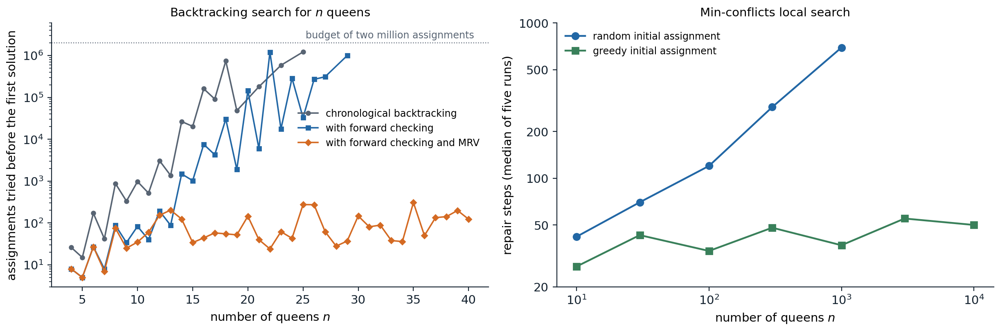
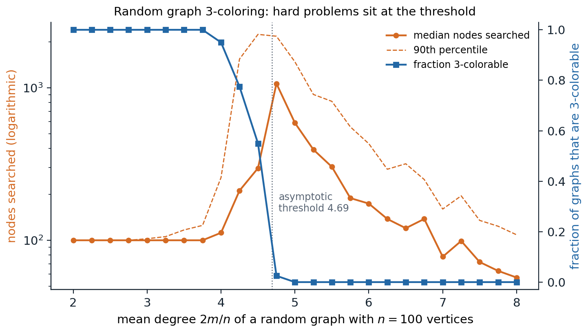

[ML Mastery Notes](../README.md) › [Artificial Intelligence](README.md)

# 3. Constraint Satisfaction and Local Search

[← 2. Heuristic Search](02-heuristic-search.md) · [4. Adversarial Search and Games →](04-adversarial-search-and-games.md)

## <a id="constraint-satisfaction-problems"></a>Constraint satisfaction problems

### <a id="variables-domains-and-constraints"></a>Variables, domains, and constraints

The search problems of chapters 1–2 treat states as black boxes: an algorithm can generate successors and test for a goal, but it cannot look inside. Many problems have states with an obvious internal structure, an assignment of values to variables, and a goal defined by constraints among them. A **constraint satisfaction problem** (CSP) consists of

- a set of **variables** $`X_1,\dots,X_n`$;
- for each variable a **domain** $`D_i`$ of possible values;
- a set of **constraints**, each specifying the allowed combinations of values for a subset of the variables, its **scope**.

An **assignment** gives values to some variables; it is **consistent** if it violates no constraint and **complete** if every variable has a value. A **solution** is a consistent, complete assignment. The path to the solution is irrelevant, only the final assignment matters, and that changes the kind of search that makes sense.

Standard examples show the range:

- **Map coloring:** regions are variables, colors are values, and neighboring regions must differ. The map of Australia's seven states and territories with three colors is the textbook instance.
- **$`n`$ queens:** one variable per column holding the row of its queen, with a constraint between every pair of columns that forbids a shared row or diagonal.
- **Sudoku:** 81 cells with domains $`\{1,\dots,9\}`$ and 27 units (rows, columns, boxes) whose cells must all differ.
- **Scheduling:** tasks are variables, start times are values, and constraints encode precedences, deadlines, and shared resources.

Constraints come in several forms. A **unary** constraint restricts one variable; a **binary** constraint relates two, and a CSP with only binary constraints has a **constraint graph** with an edge between constrained variables; a **global** constraint involves arbitrarily many, such as $`\mathrm{Alldiff}(X_1,\dots,X_k)`$. Any finite-domain constraint can be written as a table of allowed tuples, and any CSP can be converted to a binary one by introducing auxiliary variables, although dedicated global constraints are usually far more efficient. **Preferences**, or soft constraints, turn the problem into a **constraint optimization problem**, which minimizes the total cost of violated soft constraints subject to the hard ones.

### <a id="constraints-as-factors"></a>Constraints as factors

A constraint is a function of the variables in its scope that equals 1 on allowed tuples and 0 otherwise, and an assignment is a solution exactly when the product of all these functions is 1. Drawing variables and constraints as two kinds of nodes, with an edge whenever a variable appears in a constraint's scope, gives a **factor graph**. The same picture describes probabilistic models, where the factors take arbitrary nonnegative values (chapter 8); finding a solution then corresponds to finding an assignment of positive weight, and counting solutions to computing a normalizing constant. The structural ideas of this chapter, variable elimination orders, tree structure, and treewidth, reappear there as exact inference (chapter 9).

### <a id="how-hard-are-csps"></a>How hard are CSPs?

With $`n`$ variables and domains of size $`d`$ there are $`d^n`$ complete assignments. CSPs with finite domains include Boolean satisfiability (chapter 5) and graph 3-coloring, which are NP-complete, so no known algorithm solves all instances in polynomial time. Much of the art is in exploiting the structure of typical instances: propagating constraints to shrink domains before and during search, choosing what to try next, and decomposing problems whose constraint graphs are sparse. Linear constraints over integers form **integer programs**, and linear constraints over reals form **linear programs**, which are solvable in polynomial time; constraint solvers and mathematical programming solvers borrow each other's methods.

## <a id="backtracking-search"></a>Backtracking search

### <a id="depth-first-search-over-partial-assignments"></a>Depth-first search over partial assignments

A naive search formulation takes a partial assignment as a state and lets an action assign any unassigned variable any value. Its tree has $`nd`$ children at the root, $`(n-1)d`$ at the next level, and $`n!\,d^n`$ leaves, although only $`d^n`$ assignments exist. Variable assignments **commute**: the order in which they are made does not change the result, so it suffices to choose *one* variable at each node and branch only on its values. **Backtracking search** is the depth-first search that does this: choose an unassigned variable, try its values in turn, recurse on each consistent extension, and undo the assignment when every value below has failed. It keeps one partial assignment in memory and extends and retracts it in place.

Plain backtracking is slow: it discovers that a partial assignment is doomed only when some variable has no consistent value left, possibly many levels deeper than the choice that caused the failure. Three improvements make it practical: **inference** to shrink domains, **ordering** heuristics for variables and values, and **intelligent backtracking** when a failure occurs.

### <a id="arc-consistency"></a>Arc consistency

A variable $`X_i`$ is **arc consistent** with respect to $`X_j`$ if for every value in $`D_i`$ some value in $`D_j`$ satisfies the constraint between them. The **AC-3** algorithm enforces arc consistency on a whole binary CSP. It keeps a queue of arcs $`(X_i,X_j)`$; removing an arc, it deletes from $`D_i`$ every value without support in $`D_j`$, and if $`D_i`$ shrank it adds back all arcs $`(X_k,X_i)`$ into $`X_i`$, since values of the neighbors $`X_k`$ may have lost their support. It stops when the queue is empty, with every arc consistent, or when a domain becomes empty, which proves that no solution exists. With $`c`$ binary constraints and domains of size $`d`$, AC-3 runs in $`O(cd^3)`$ time ([Appendix A](#block-ai03-appendix-a)).

Arc consistency is a necessary condition for a solution, not a sufficient one. Three mutually adjacent regions with two colors are arc consistent, since each color of each region is supported by the other color of a neighbor, but they have no solution. Stronger notions consider more variables at once: a CSP is **$`k`$-consistent** if every consistent assignment to $`k-1`$ variables extends to any $`k`$-th variable. Node consistency is 1-consistency, arc consistency 2-consistency, and path consistency 3-consistency. A CSP with $`n`$ variables that is **strongly $`n`$-consistent** (that is, $`k`$-consistent for every $`k\le n`$) can be solved without any backtracking, but establishing it costs time and space exponential in $`n`$ in general.

Global constraints admit specialized propagation. If $`m`$ variables must all differ and the union of their domains has fewer than $`m`$ values, the constraint is violated, a pigeonhole argument that pairwise arc consistency misses; matching-based algorithms enforce full arc consistency on Alldiff in polynomial time. Resource constraints of the form "at most $`k`$ tasks at once" are propagated by bounds reasoning on start times.

### <a id="interleaving-search-and-inference"></a>Interleaving search and inference

Inference is most useful during search. **Forward checking** removes, after each assignment $`X=v`$, the values of unassigned neighbors of $`X`$ that conflict with $`v`$, and backtracks at once if a domain empties. **Maintaining arc consistency** (MAC) goes further and runs AC-3 after each assignment, starting from the arcs into $`X`$, so that the consequences propagate through the whole constraint graph. MAC detects failures earlier than forward checking at a higher cost per node, and it usually wins on hard problems.

### <a id="choosing-variables-and-values"></a>Choosing variables and values

The order of choices has a dramatic effect.

- **Minimum-remaining-values** (MRV), or **fail-first**: choose the variable with the fewest legal values left. A variable with an empty domain is chosen immediately and causes an immediate backtrack, and one with a single value is forced, so its consequences are propagated before any real choice is made. Among ties, the **degree heuristic** prefers the variable involved in the most constraints with unassigned variables.
- **Least-constraining value:** try first the value that removes the fewest options from the neighbors, to leave the most room for a solution.

Variable ordering is fail-first because every variable must eventually be assigned, so detecting a dead end early can only help; value ordering is **succeed-first** because only one solution is needed, so the most promising value should come first. When all solutions are needed, or none exists, value ordering is irrelevant.



*Left: assignments tried by backtracking before the first solution of the $`n`$-queens problem, with columns as variables and rows tried in increasing order, up to a budget of two million. Chronological backtracking, which checks each new queen against the placed ones, tries 876 assignments for eight queens, 1,216,775 for 25, and exceeds the budget at $`n=20`$, 22, 24, and every $`n\ge26`$. Adding forward checking reduces eight queens to 88 assignments but still exceeds the budget at $`n=28`$ and every $`n\ge30`$. Forward checking with MRV needs at most 308 assignments for every $`n`$ up to 40. Right: min-conflicts local search, the median over five runs. From a random initial assignment the number of repair steps grows roughly in proportion to $`n`$, from 42 for ten queens to 694 for a thousand; from a greedy initial assignment, which places each queen on a least-conflicted row, it stays between 27 and 55 up to ten thousand queens.*

### <a id="intelligent-backtracking"></a>Intelligent backtracking

Chronological backtracking returns to the most recent decision, which may have nothing to do with the failure. **Conflict-directed backjumping** records for each variable its **conflict set**, the earlier assignments that removed its values, and on failure jumps back to the most recent variable in that set, merging conflict sets as it goes. A further step is **constraint learning**: the combination of assignments that caused a failure is recorded as a new constraint, a **nogood**, so the same dead end is never explored again. Backjumping and learning are the heart of the conflict-driven clause-learning SAT solvers of chapter 5, which make propositional reasoning with millions of variables routine.

The effect of inference and ordering on Sudoku, a CSP with 81 variables and 810 binary constraints $`X\neq Y`$ between cells sharing a unit, shows how much they matter:

```python
from collections import deque

cells = [(r, c) for r in range(9) for c in range(9)]
units = ([[(r, c) for c in range(9)] for r in range(9)] + [[(r, c) for r in range(9)] for c in range(9)]
         + [[(r, c) for r in range(br, br + 3) for c in range(bc, bc + 3)] for br in (0, 3, 6) for bc in (0, 3, 6)])
peers = {x: set(y for u in units if x in u for y in u) - {x} for x in cells}   # binary constraints x != y


def parse(grid):
    return {x: {int(ch)} if ch != "." else set(range(1, 10)) for x, ch in zip(cells, grid)}


def ac3(D, queue=None):
    """Enforce arc consistency for the constraints x != y. Returns False if a domain empties."""
    queue = deque((x, y) for x in cells for y in peers[x]) if queue is None else queue
    while queue:
        x, y = queue.popleft()
        if len(D[y]) == 1 and D[y] <= D[x]:        # the only support for a value of x is missing
            D[x] = D[x] - D[y]
            if not D[x]:
                return False
            queue.extend((z, x) for z in peers[x] if z != y)
    return True


def solve(D, assigned, stats, mac=True, mrv=True):
    """Backtracking; after each assignment either maintain arc consistency or only forward check."""
    free = [x for x in cells if x not in assigned]
    if not free:
        return D
    x = min(free, key=lambda v: len(D[v])) if mrv else free[0]
    for v in sorted(D[x]):
        stats["nodes"] += 1
        E = {k: set(s) for k, s in D.items()}
        E[x] = {v}
        if mac:
            ok = ac3(E, deque((z, x) for z in peers[x]))
        else:
            for z in peers[x]:
                E[z].discard(v)
            ok = all(E[z] for z in peers[x])
        if ok:
            result = solve(E, assigned | {x}, stats, mac, mrv)
            if result:
                return result
    return None


def run(grid, mac, mrv):
    D = parse(grid)
    givens = {x for x in cells if len(D[x]) == 1}
    if mac:
        ac3(D)
    else:
        for x in givens:
            for z in peers[x]:
                D[z] -= D[x]
    stats = {"nodes": 0}
    sol = solve(D, givens, stats, mac, mrv)
    ok = all(len({next(iter(sol[x])) for x in u}) == 9 for u in units)
    return stats["nodes"], ok


easy = "..3.2.6..9..3.5..1..18.64....81.29..7.......8..67.82....26.95..8..2.3..9..5.1.3.."
hard = "8..........36......7..9.2...5...7.......457.....1...3...1....68..85...1..9....4.."
for name, grid in [("easy", easy), ("hard", hard)]:
    D = parse(grid)
    ac3(D)
    left = sum(len(s) > 1 for s in D.values())
    print(f"{name}: {grid.count('.')} blanks, {left} still open after AC-3")
    for mac, mrv, label in [(True, True, "MAC + MRV"), (False, True, "forward checking + MRV"),
                            (False, False, "forward checking, fixed order")]:
        nodes, ok = run(grid, mac, mrv)
        print(f"   {label:30s} {nodes:6d} assignments, valid solution: {ok}")
# easy: 49 blanks, 0 still open after AC-3
#    MAC + MRV                          49 assignments, valid solution: True
#    forward checking + MRV             49 assignments, valid solution: True
#    forward checking, fixed order      95 assignments, valid solution: True
# hard: 60 blanks, 60 still open after AC-3
#    MAC + MRV                        3366 assignments, valid solution: True
#    forward checking + MRV          10101 assignments, valid solution: True
#    forward checking, fixed order   22067 assignments, valid solution: True
```

Arc consistency alone solves the easy puzzle, and search then only confirms the forced values. On the hard puzzle it removes the given digits from their peers but fixes no blank cell, and search is needed: forward checking in row-major order makes 22,067 assignments, MRV reduces that to 10,101, and MAC with MRV to 3,366. Arc consistency on the pairwise constraints is weaker than the reasoning human solvers use, such as "this digit fits in only one cell of this row", which Alldiff propagation captures.

## <a id="problem-structure"></a>Problem structure

### <a id="independent-subproblems-and-trees"></a>Independent subproblems and trees

The constraint graph can make a problem easy regardless of its size. If it has several connected components, each is solved separately: a problem with $`n`$ variables in components of $`c`$ variables costs $`O(d^c\,n/c)`$ instead of $`O(d^n)`$, linear in $`n`$.

A **tree-structured** CSP, whose constraint graph has no cycles, can be solved in $`O(nd^2)`$ time:

1. Choose a root and order the variables so that each comes after its parent (a **topological order**).
2. For $`j=n`$ down to 2, make the arc from the parent of $`X_j`$ to $`X_j`$ consistent, deleting values of the parent that have no support in $`X_j`$ (**directed arc consistency**).
3. For $`j=1`$ to $`n`$, assign $`X_j`$ any value consistent with its parent's value.

The backward pass guarantees that each parent value that survives has a supporting value in every child, so the forward pass never needs to backtrack ([Appendix B](#block-ai03-appendix-b)). This is the constraint-satisfaction version of the message passing on trees that computes exact marginals in chapter 9.

### <a id="cutset-conditioning-and-tree-decompositions"></a>Cutset conditioning and tree decompositions

Most constraint graphs have cycles, and two methods reduce them to trees.

- **Cutset conditioning:** choose a set $`S`$ of variables whose removal leaves a tree, a **cycle cutset**. For each consistent assignment to $`S`$, prune the domains of the remaining variables and solve the resulting tree. With $`|S|=c`$, the cost is $`O\bigl(d^c(n-c)d^2\bigr)`$, fast when the cutset is small. Finding the smallest cutset is NP-hard, but good approximations exist.
- **Tree decomposition:** group the variables into overlapping clusters arranged in a tree, such that every constraint lies within some cluster and the clusters containing any given variable form a connected subtree. Solving each cluster as a single mega-variable and then the tree of clusters costs $`O(nd^{w+1})`$, where $`w+1`$ is the size of the largest cluster. The minimum of $`w`$ over all decompositions is the **treewidth** of the graph: CSPs of bounded treewidth are solvable in polynomial time.

Treewidth measures how far a graph is from a tree: a tree has treewidth 1, a cycle 2, and a $`k\times k`$ grid $`k`$. The same quantity bounds the cost of exact probabilistic inference, where it is the size of the largest factor created by variable elimination (chapter 9).

Structure can also lie in the values. **Value symmetry**, such as the interchangeability of colors in map coloring, multiplies the number of equivalent dead ends by the number of symmetries; a **symmetry-breaking constraint**, such as requiring the colors of the first regions to appear in a fixed order, removes all but one copy.

## <a id="local-search"></a>Local search

### <a id="complete-state-formulations"></a>Complete-state formulations

Local search abandons the search tree. It starts from a complete assignment, usually inconsistent, and repeatedly changes the value of one variable to reduce the number of violated constraints, keeping only the current state. It uses constant memory, works on problems far too large for systematic search, and can optimize an objective as well as satisfy constraints; in exchange it can neither prove that no solution exists nor guarantee to find one.

The **min-conflicts** heuristic chooses at random a variable involved in a violated constraint and gives it the value that violates the fewest constraints, breaking ties at random ([Minton et al., 1992](https://www.sciencedirect.com/science/article/pii/000437029290007K)). On $`n`$ queens it is spectacularly effective: from a greedy initial assignment it solves the million-queens problem in about 50 steps on average, and the right panel of the figure above shows the number of steps staying roughly constant up to ten thousand queens. The solutions of $`n`$ queens are densely distributed, so there is almost always one near any state. Min-conflicts grew out of work on scheduling observations for the Hubble Space Telescope, and local search is the standard way to repair a schedule when a constraint changes: starting from the old solution, only the affected part moves.

### <a id="hill-climbing-and-its-failures"></a>Hill climbing and its failures

**Hill climbing**, or greedy local search, moves to the best neighbor of the current state while that improves the objective, written here as a cost to minimize. It stops at a state whose neighbors are all no better, which may be

- a **local minimum**, better than its neighbors but worse than the global minimum;
- a **plateau**, a flat region where all neighbors have the same cost, possibly a shoulder from which progress is still possible;
- a **ridge**, a sequence of local minima that no single move can follow.

Standard remedies are to allow a bounded number of **sideways moves** on plateaus, to choose among improving neighbors at random (**stochastic hill climbing**), and to restart from a new random state when stuck (**random-restart hill climbing**). If each climb succeeds with probability $`p`$, the expected number of climbs is $`1/p`$, so random restarts are complete with probability approaching 1, and cheap when $`p`$ is not tiny.

### <a id="simulated-annealing"></a>Simulated annealing

**Simulated annealing** ([Kirkpatrick, Gelatt, and Vecchi, 1983](https://doi.org/10.1126/science.220.4598.671)) escapes local minima by sometimes moving uphill. At each step it picks a random neighbor; a move that lowers the cost by $`|\Delta|`$ is always accepted, and a move that raises it by $`\Delta>0`$ is accepted with probability $`e^{-\Delta/T}`$. The **temperature** $`T`$ starts high, when the search wanders almost at random, and is lowered gradually, so that it settles into deep minima. At a fixed temperature the process is a Markov chain whose stationary distribution gives state $`s`$ probability proportional to $`e^{-E(s)/T}`$, the Metropolis construction of chapter 10, and as $`T\to0`$ that distribution concentrates on the global minima ([Appendix C](#block-ai03-appendix-c)). A schedule that decreases the temperature slowly enough, logarithmically in the number of steps, finds a global minimum with probability approaching 1; practical schedules are much faster and carry no guarantee.

The eight-queens problem, with $`8^8\approx1.7\times10^7`$ states that place one queen per column and 56 neighbors per state, shows the differences on a thousand random starting states:

```python
import numpy as np

n = 8
rng = np.random.default_rng(0)


def attacks(rows):
    """Number of pairs of queens that attack each other (one queen per column)."""
    return sum(rows[i] == rows[j] or abs(rows[i] - rows[j]) == j - i for i in range(n) for j in range(i + 1, n))


def neighbors(rows):
    """All 56 states that move one queen within its column, with their costs."""
    out = []
    for col in range(n):
        for r in range(n):
            if r != rows[col]:
                s = rows.copy()
                s[col] = r
                out.append((attacks(s), s))
    return out


def hill_climb(rows, max_sideways=0):
    """Steepest descent on the number of attacking pairs; optionally allow sideways moves on plateaus."""
    cost, steps, sideways = attacks(rows), 0, 0
    while cost > 0:
        nb = neighbors(rows)
        best = min(c for c, _ in nb)
        if best > cost or (best == cost and sideways >= max_sideways):
            break                                       # local minimum or plateau budget exhausted
        sideways = sideways + 1 if best == cost else 0
        choices = [s for c, s in nb if c == best]
        rows, cost, steps = choices[rng.integers(len(choices))], best, steps + 1
    return cost == 0, steps


def annealing(rows, T0=2.0, decay=0.995, max_steps=20000):
    cost, T = attacks(rows), T0
    for step in range(max_steps):
        if cost == 0:
            return True, step
        s = rows.copy()
        s[int(rng.integers(n))] = int(rng.integers(n))  # random neighbor (may be unchanged)
        delta = attacks(s) - cost
        if delta <= 0 or rng.random() < np.exp(-delta / T):
            rows, cost = s, cost + delta
        T = max(T * decay, 0.01)
    return False, max_steps


starts = [[int(r) for r in rng.integers(n, size=n)] for _ in range(1000)]
for label, fn in [("steepest descent", lambda s: hill_climb(s)),
                  ("up to 100 sideways moves", lambda s: hill_climb(s, 100)),
                  ("simulated annealing", annealing)]:
    runs = [fn(list(s)) for s in starts]
    ok = [st for success, st in runs if success]
    bad = [st for success, st in runs if not success]
    print(f"{label:25s} solves {len(ok) / len(runs):.0%}; mean steps when solved {np.mean(ok):.1f}"
          + (f", when stuck {np.mean(bad):.1f}" if bad else ""))
# steepest descent          solves 15%; mean steps when solved 4.1, when stuck 3.0
# up to 100 sideways moves  solves 95%; mean steps when solved 18.6, when stuck 64.4
# simulated annealing       solves 97%; mean steps when solved 944.6, when stuck 20000.0
```

Steepest descent solves 15% of the instances, in about four steps, and gets stuck in the rest after about three. Allowing up to 100 consecutive sideways moves raises the success rate to 95%, at the cost of about 19 steps per success and 64 per failure. Random restarts of plain steepest descent succeed in about $`1/0.15\approx7`$ climbs, one success of about 4 steps after about $`0.85/0.15\approx5.7`$ failures of about 3 steps, so in about 21 steps in total. Simulated annealing with this schedule solves 97% within its limit of 20,000 steps, but needs about 950 steps on average on this easy landscape, where plain restarts are cheaper; its advantage appears on landscapes with deep, narrow local minima.

### <a id="populations-of-states"></a>Populations of states

**Local beam search** keeps $`k`$ states instead of one: at each step it generates all their successors and keeps the best $`k`$, so that useful information is shared among the parallel searches, which quickly abandon unpromising regions. It can lose diversity by concentrating all $`k`$ states in one region, which **stochastic beam search** counters by choosing successors at random with probability increasing in their quality. **Genetic algorithms** combine pairs of states: a population of states, encoded as strings, is repeatedly replaced by offspring formed by **crossover**, which joins parts of two parents chosen with probability increasing in their **fitness**, and **mutation**, which changes random positions. Crossover helps when the encoding places interacting variables near each other, so that good blocks survive recombination; genetic algorithms and evolution strategies remain in use for design and for hyperparameter search, although their theory is thin.

In continuous spaces, local search becomes gradient descent and its relatives (Foundations chapter 3), with random restarts playing the same role against local minima. The neural-network training of the DL module is local search on a continuous landscape that turns out to be far more benign than worst-case theory suggests.

### <a id="where-the-hard-problems-are"></a>Where the hard problems are

For random problems, difficulty is not spread evenly. Random graphs with $`n`$ vertices and $`m`$ edges are almost always 3-colorable when the mean degree $`2m/n`$ is small and almost never when it is large, with a sharp transition in between, which statistical-physics calculations place at a mean degree of about 4.69 as $`n\to\infty`$. The hardest instances for search cluster at the transition ([Cheeseman, Kanefsky, and Taylor, 1991](https://www.ijcai.org/Proceedings/91-1/Papers/052.pdf)): below it, constraints are few and solutions abundant; above it, constraints are so many that a contradiction is found quickly; near it, instances are barely solvable or barely unsolvable, and proving either takes the most search.



*Backtracking with forward checking and MRV on random graphs with 100 vertices, 40 graphs per mean degree. All graphs are 3-colorable up to mean degree 3.75, 55% at 4.5, 3% at 4.75, and none from 5 on. With 100 vertices the transition occurs somewhat below the asymptotic threshold of 4.69. The median number of assignments is 100, one per vertex without any backtracking, for sparse graphs, peaks at 1,065 at mean degree 4.75, and falls to 57 at mean degree 8, where the search proves uncolorability after assigning a few vertices of a dense core.*

The same phenomenon appears in random Boolean satisfiability, where the ratio of clauses to variables plays the role of the mean degree (chapter 5). It has a practical lesson: benchmarks of random instances say little unless they are drawn near the threshold, and real-world instances, with their structure, behave differently from random ones in both directions.

## <a id="appendices"></a>Appendices


<details>
<summary><a id="block-ai03-appendix-a"></a><b>A. AC-3: correctness and complexity</b></summary>


**Correctness.** AC-3 only deletes a value $`x\in D_i`$ when no $`y\in D_j`$ satisfies the constraint with it. Such a value appears in no solution, so deletion preserves the set of solutions. When the queue is empty, every arc is consistent: an arc $`(X_i,X_j)`$ was consistent when it was last processed, and it could only become inconsistent if $`D_j`$ shrank later, in which case $`(X_i,X_j)`$ was put back on the queue. Hence AC-3 returns the unique largest arc-consistent set of subdomains (the union of two arc-consistent subdomain systems is arc consistent, so a largest one exists), independent of the order in which arcs are processed.

**Complexity.** A binary CSP with $`c`$ constraints has $`2c`$ directed arcs. An arc $`(X_k,X_i)`$ is added to the queue only when $`D_i`$ loses a value, which happens at most $`d`$ times, so each arc is processed at most $`d+1`$ times and there are $`O(cd)`$ revisions in all. A revision compares every value of $`D_k`$ with every value of $`D_i`$, $`O(d^2)`$ checks, which gives $`O(cd^3)`$. Algorithms such as AC-4 and AC-2001 remember, for each value, where its last support was found, and achieve the optimal $`O(cd^2)`$.

</details>


<details>
<summary><a id="block-ai03-appendix-b"></a><b>B. Tree-structured CSPs without backtracking</b></summary>


Let the constraint graph be a tree, rooted at $`X_1`$ and ordered so that each variable's parent precedes it. The backward pass makes each arc $`(\mathrm{Parent}(X_j),X_j)`$ consistent for $`j=n,\dots,2`$. Processing children before parents matters: when the arc from $`X_p`$ to its child $`X_j`$ is made consistent, $`D_j`$ has already been pruned with respect to all of $`X_j`$'s own children, and no later step changes $`D_j`$, because later steps only prune domains of variables closer to the root. After the pass, every remaining value of every parent has a supporting value in each of its children's final domains.

In the forward pass, $`X_1`$ takes any remaining value. When $`X_j`$ is reached, its parent has a value from its final domain, which has a support in $`D_j`$, and $`X_j`$'s only constraint with an assigned variable is the one with its parent (the graph is a tree and the parent is the only earlier neighbor). Choosing that support is therefore consistent, and the pass never backtracks. If a domain becomes empty in the backward pass, no solution exists.

Each of the $`n-1`$ arcs is revised once in $`O(d^2)`$ time, and the forward pass costs $`O(nd)`$, for $`O(nd^2)`$ overall. For a general graph with a tree decomposition whose clusters have at most $`w+1`$ variables, each cluster becomes a variable with at most $`d^{w+1}`$ values, and constraints between neighboring clusters require agreement on shared variables. The same two passes then cost $`O(n\,d^{2(w+1)})`$ naively, and $`O(n\,d^{w+1})`$ with sorting or hashing on the shared variables.

</details>


<details>
<summary><a id="block-ai03-appendix-c"></a><b>C. Simulated annealing and the Boltzmann distribution</b></summary>


Let the state space be finite, the neighbor relation symmetric with every state having the same number $`N`$ of neighbors, and the chain able to reach any state from any other. At a fixed temperature $`T`$, simulated annealing proposes a neighbor $`s'`$ of $`s`$ with probability $`1/N`$ and accepts it with probability $`\min\bigl(1,e^{-(E(s')-E(s))/T}\bigr)`$. For the distribution $`\pi(s)\propto e^{-E(s)/T}`$ and neighbors with $`E(s')\ge E(s)`$,

```math
\pi(s)\,P(s\to s')=\frac{e^{-E(s)/T}}{Z}\cdot\frac1N\,e^{-(E(s')-E(s))/T}=\frac{e^{-E(s')/T}}{Z}\cdot\frac1N=\pi(s')\,P(s'\to s),
```

the **detailed balance** condition, which makes $`\pi`$ stationary. This is the Metropolis algorithm for sampling from $`\pi`$. As $`T\to0`$, $`\pi(s)/\pi(s^*)=e^{-(E(s)-E(s^*))/T}\to0`$ for every $`s`$ with a higher energy than a global minimum $`s^*`$, so $`\pi`$ concentrates on the global minima.

Annealing lowers $`T`$ while the chain runs, so the chain never quite reaches stationarity, and the question is how slowly $`T`$ must fall for the chain to track $`\pi`$. [Hajek (1988)](https://doi.org/10.1287/moor.13.2.311) showed that the schedule $`T_t=c/\log(1+t)`$ reaches a global minimum with probability tending to 1 if and only if $`c`$ is at least the depth of the deepest local minimum that is not global, the largest energy barrier that must be climbed to escape it. The logarithmic schedule is far too slow to run in practice, which is why practical schedules, like the geometric one in the text, are heuristics.

</details>

---

[← 2. Heuristic Search](02-heuristic-search.md) · [4. Adversarial Search and Games →](04-adversarial-search-and-games.md)
