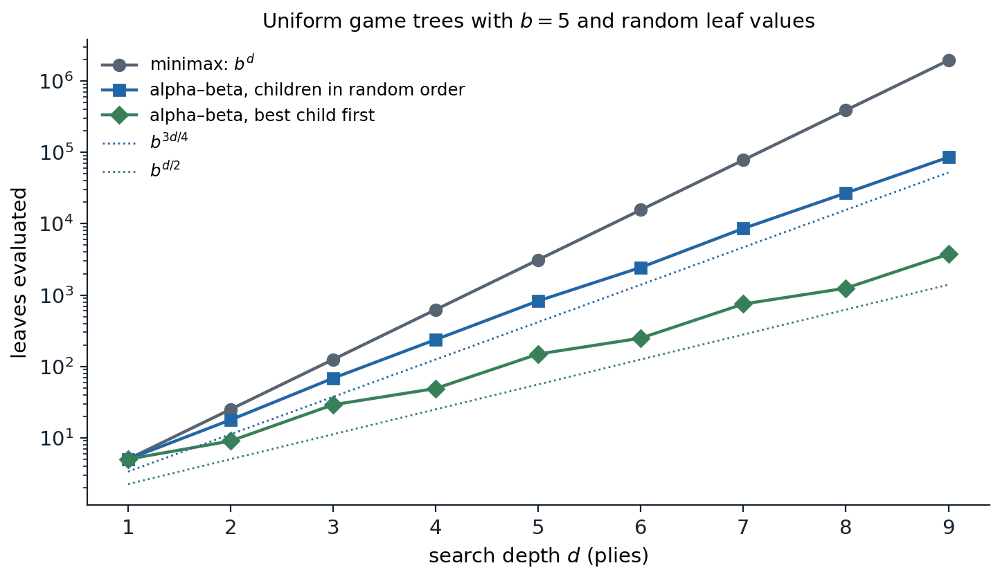
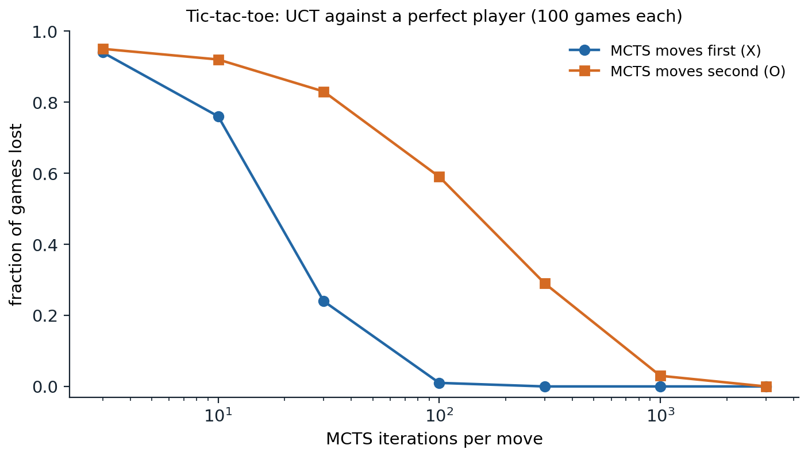

[ML Mastery Notes](../README.md) › [Artificial Intelligence](README.md)

# 4. Adversarial Search and Games

[← 3. Constraint Satisfaction and Local Search](03-constraint-satisfaction-and-local-search.md) · [5. Propositional Logic and Satisfiability →](05-propositional-logic-and-satisfiability.md)

## <a id="games-as-search-problems"></a>Games as search problems

### <a id="two-player-zero-sum-games"></a>Two-player zero-sum games

In the search problems of chapters 1–3 the agent alone decides what happens. In a game, another agent decides some of the moves and wants a different outcome. The classic setting of AI game playing is the **two-player, zero-sum, deterministic game of perfect information**: chess, checkers, Go, Othello, tic-tac-toe. The players, MAX and MIN, alternate moves, both see the whole state, and one player's gain is the other's loss. Such a game is defined by

- an initial state $s_0$ and a function $\mathrm{ToMove}(s)$ naming the player whose turn it is;
- the legal moves $\mathrm{Actions}(s)$ and the transition model $\mathrm{Result}(s,a)$;
- a **terminal test** $\mathrm{IsTerminal}(s)$ that is true when the game is over;
- a **utility function** $\mathrm{Utility}(s,p)$ giving the final payoff of terminal state $s$ to player $p$, such as $+1$, $0$, or $-1$ for a win, draw, or loss.

"Zero-sum" means that the two utilities add to a constant, so a single number, the utility for MAX, describes each outcome: MAX wants it high and MIN wants it low. The states and moves form a **game tree** whose levels alternate between the players; a level is a **ply**, a move by one player. Game trees are enormous: tic-tac-toe, with at most nine moves, already has 549,946 nodes, although only 5,478 distinct positions; chess has an average branching factor of about 35, and games often last 80 plies, so its tree has on the order of $35^{80}\approx10^{123}$ nodes. Games are therefore the clearest example of problems that must be solved with bounded computation, and they have served as a benchmark for AI since the 1950s.

### <a id="minimax"></a>Minimax

What should MAX do? A plan that fixes MAX's moves in advance is useless, because the right move depends on MIN's replies. A solution is a **strategy**, which specifies a move for every position MAX may face. The **minimax value** of a state is the utility for MAX of reaching a terminal state when both players play optimally from there on:

$$
\mathrm{Minimax}(s)=\begin{cases}\mathrm{Utility}(s,\mathrm{MAX}) & \text{if }\mathrm{IsTerminal}(s),\\ \max_{a}\mathrm{Minimax}(\mathrm{Result}(s,a)) & \text{if }\mathrm{ToMove}(s)=\mathrm{MAX},\\ \min_{a}\mathrm{Minimax}(\mathrm{Result}(s,a)) & \text{if }\mathrm{ToMove}(s)=\mathrm{MIN}.\end{cases}
$$

The **minimax decision** at the root chooses the move leading to the child of highest value. The minimax algorithm computes these values by a depth-first traversal of the whole tree, backing values up from the leaves. With branching factor $b$ and maximum depth $m$ it takes $O(b^m)$ time and $O(bm)$ space.

Minimax play is optimal against an optimal opponent: MAX is guaranteed at least the minimax value whatever MIN does, and cannot guarantee more. Against a suboptimal opponent, minimax still guarantees the value, but it may miss chances. A position where every move draws against perfect play, but where one move sets a trap that a weak opponent is likely to fall into, is not distinguished by minimax. [Expectimax](#expectimax-against-imperfect-opponents) models the opponent's actual behavior instead, and game theory (chapter 15) treats simultaneous moves and hidden information, where optimal play may require randomizing.

With more than two players, utilities become vectors, one entry per player, and each player maximizes its own entry at its nodes. Multiplayer games raise new phenomena: alliances form and dissolve because they serve the players' interests, and if the game is not zero-sum, cooperation can benefit everyone.

## <a id="alphabeta-pruning"></a>Alpha–beta pruning

### <a id="pruning-without-changing-the-answer"></a>Pruning without changing the answer

Minimax examines every node, but many cannot influence the decision. Suppose MAX already has a move worth 3, and while examining a second move MAX finds that MIN has a reply leading to 2. MIN would choose that reply or something worse for MAX, so the second move is worth at most 2, and the rest of MIN's replies need not be examined. **Alpha–beta pruning** formalizes this by passing two bounds down the tree:

- $\alpha$, the best value MAX can already guarantee along the current path;
- $\beta$, the best value MIN can already guarantee along the current path.

A MAX node updates $\alpha$ with each child's value, a MIN node updates $\beta$, and a node stops examining its children as soon as $\alpha\ge\beta$, because the player above would never allow play to reach it. The value returned at the root is exactly the minimax value; values returned from pruned subtrees are only bounds, which is enough to show that those subtrees are not chosen ([Appendix A](#block-ai04-appendix-a)).

### <a id="move-ordering"></a>Move ordering

How much alpha–beta prunes depends on the order in which children are examined. If the best move is always tried first, alpha–beta evaluates

$$
b^{\lceil d/2\rceil}+b^{\lfloor d/2\rfloor}-1
$$

leaves of a uniform tree of depth $d$, the minimum possible for any algorithm that proves the minimax value ([Knuth and Moore, 1975](https://www.sciencedirect.com/science/article/pii/0004370275900193)); that is $O(b^{d/2})$, as if the branching factor were $\sqrt b$, and it allows a search twice as deep in the same time. With children in random order, the number of leaves grows roughly as $b^{3d/4}$ for moderate $b$. Perfect ordering is impossible, since it would require knowing the values, but good ordering is cheap to approximate:

- try **captures and threats** first, as a human player would;
- use the best move found by a shallower search, which iterative deepening provides for free (the **principal variation**);
- remember **killer moves**, which caused cutoffs at the same depth elsewhere in the tree, and the **history heuristic**, which scores moves by how often they caused cutoffs.

With these, chess programs come within a small factor of the best case.



*Leaves evaluated to compute the root's minimax value in uniform trees with branching factor 5 and independent uniform random leaf values. At depth 9, minimax evaluates all 1,953,125 leaves; alpha–beta with children in random order evaluates 85,616 on average over ten trees, growing roughly as $b^{0.73d}$; and alpha–beta with the best child always first evaluates 3,749, exactly the Knuth–Moore minimum $b^{\lceil d/2\rceil}+b^{\lfloor d/2\rfloor}-1$.*

### <a id="transpositions"></a>Transpositions

Different move orders often lead to the same position, a **transposition**. A **transposition table** caches the value of each position searched, keyed by a hash of the position, so that it is searched once. With alpha–beta, the cached value may be only a bound: a node searched with window $(\alpha,\beta)$ that returned $v\le\alpha$ has true value at most $v$, and one that returned $v\ge\beta$ has true value at least $v$, so tables store a flag with each value. Tic-tac-toe shows the combined effect of pruning, ordering, and caching:

```python
import math

LINES = [(0, 1, 2), (3, 4, 5), (6, 7, 8), (0, 3, 6), (1, 4, 7), (2, 5, 8), (0, 4, 8), (2, 4, 6)]


def winner(b):
    for i, j, k in LINES:
        if b[i] != "." and b[i] == b[j] == b[k]:
            return b[i]
    return None


ORDER = [4, 0, 2, 6, 8, 1, 3, 5, 7]                   # center, corners, edges


def moves(b, ordered=False):
    return [i for i in (ORDER if ordered else range(9)) if b[i] == "."]


def utility(b):
    """+1 if X has won, -1 if O has won, 0 for a draw; None if the game is not over."""
    w = winner(b)
    if w:
        return 1 if w == "X" else -1
    return 0 if "." not in b else None


def play(b, i, p):
    return b[:i] + p + b[i + 1:]


count = {"minimax": 0, "alpha-beta": 0, "alpha-beta, ordered": 0, "ordered + table": 0}


def minimax(b, p):
    count["minimax"] += 1
    u = utility(b)
    if u is not None:
        return u
    vals = [minimax(play(b, i, p), "O" if p == "X" else "X") for i in moves(b)]
    return max(vals) if p == "X" else min(vals)


def alphabeta(b, p, alpha, beta, key, ordered=False, table=None):
    count[key] += 1
    u = utility(b)
    if u is not None:
        return u
    if table is not None and b in table:
        return table[b]
    a0, b0 = alpha, beta
    v = -math.inf if p == "X" else math.inf
    for i in moves(b, ordered):
        w = alphabeta(play(b, i, p), "O" if p == "X" else "X", alpha, beta, key, ordered, table)
        if p == "X":
            v, alpha = max(v, w), max(alpha, w)
        else:
            v, beta = min(v, w), min(beta, w)
        if alpha >= beta:
            break                                        # the other player will never allow this node
    if table is not None and a0 < v < b0:                # store only exact values
        table[b] = v
    return v


empty = "." * 9
inf = math.inf
print("minimax value of the empty board:", minimax(empty, "X"))
print("alpha-beta values:", alphabeta(empty, "X", -inf, inf, "alpha-beta"),
      alphabeta(empty, "X", -inf, inf, "alpha-beta, ordered", True),
      alphabeta(empty, "X", -inf, inf, "ordered + table", True, {}))
for k, v in count.items():
    print(f"{k:20s} {v:7d} nodes")
# minimax value of the empty board: 0
# alpha-beta values: 0 0 0
# minimax               549946 nodes
# alpha-beta             18297 nodes
# alpha-beta, ordered     7275 nodes
# ordered + table         5700 nodes
```

All four searches agree that tic-tac-toe is a draw with perfect play. Alpha–beta examines 18,297 of the 549,946 nodes of the full tree, 3.3%; trying the center first, then corners, then edges brings that to 7,275; and a table of exact values, which recognizes transposed positions, to 5,700. The table here stores only values that fell strictly inside the search window; storing bounds as well would save more.

## <a id="imperfect-real-time-decisions"></a>Imperfect real-time decisions

### <a id="evaluation-functions"></a>Evaluation functions

Chess cannot be searched to the end, so programs search to a limited depth and apply an **evaluation function** $\mathrm{Eval}(s)$, an estimate of the minimax value, at the frontier of the search. The resulting **heuristic minimax**, or H-Minimax, replaces the terminal test by a **cutoff test**, typically a depth limit chosen by iterative deepening so that a move is ready when time runs out.

A good evaluation function orders terminal states as the utility does, is cheap to compute, and, for nonterminal states, is strongly correlated with the actual chance of winning. Classical evaluation functions are **weighted linear functions of features**,

$$
\mathrm{Eval}(s)=w_1f_1(s)+w_2f_2(s)+\dots+w_kf_k(s),
$$

such as the material balance (a pawn worth 1, a knight or bishop 3, a rook 5, a queen 9), mobility, king safety, and pawn structure. The weights can be tuned by hand or learned from games, and the features can be replaced altogether by a neural network trained on positions labeled with game outcomes or with the values of deeper searches. Evaluation functions are the game-playing counterpart of the heuristics of chapter 2, and learning them is the counterpart of learning heuristics: the evaluation of a position is an estimate of its value under good play, the quantity the RL module calls a value function.

### <a id="the-horizon-effect-and-quiescence"></a>The horizon effect and quiescence

A depth cutoff introduces errors that are not random. A position in the middle of a capture sequence, where a queen has just taken a pawn and is about to be recaptured, looks excellent to a material count. The remedy is a **quiescence search**, which extends the search beyond the cutoff along captures and other forcing moves until the position is quiet. A subtler problem is the **horizon effect**: a program facing an unavoidable loss, such as the capture of a piece, can push it beyond its search horizon with delaying moves, such as checks or sacrifices of lesser pieces, which make the position look better while in fact making it worse. **Singular extensions** search more deeply along moves that are clearly better than all alternatives, which helps against it.

**Forward pruning** discards some moves at a node without searching them, which is unsafe but can pay off: **beam search** keeps only the most promising moves by the evaluation function, and **ProbCut** prunes moves whose shallow-search values make it statistically unlikely that a deeper search would select them. Programs also use **opening books** and **endgame tables**: every chess position with at most seven pieces has been solved by retrograde analysis, backward from checkmates, and the tables give perfect play there.

These techniques produced the first superhuman programs by search and hand-tuned evaluation. Deep Blue defeated the world chess champion Garry Kasparov in 1997, searching up to about 200 million positions per second ([Campbell, Hoane, and Hsu, 2002](https://www.sciencedirect.com/science/article/pii/S0004370201001291)), and checkers was **solved**, proved a draw under perfect play, after nearly two decades of computation ([Schaeffer et al., 2007](https://doi.org/10.1126/science.1144079)).

## <a id="games-of-chance"></a>Games of chance

### <a id="expectiminimax"></a>Expectiminimax

Backgammon combines skill and dice. Its game tree has **chance nodes** between the players' moves, whose children are the outcomes of a dice roll with their probabilities. Minimax generalizes to **expectiminimax**: a chance node's value is the probability-weighted average of its children's values,

$$
\mathrm{ExpectiMinimax}(s)=\sum_{r}P(r)\,\mathrm{ExpectiMinimax}(\mathrm{Result}(s,r))\quad\text{at chance nodes},
$$

with max and min at the players' nodes as before. The cost grows to $O(b^mn^m)$, where $n$ is the number of distinct chance outcomes (21 for a roll of two dice), so programs search only a few plies. Alpha–beta can be extended to chance nodes when utilities are bounded, since a bound on the average follows from bounds on the children, but it prunes much less.

Chance changes what an evaluation function must get right. In a deterministic game, minimax decisions are unchanged by any strictly increasing transformation of the evaluation function, because only the order of values matters. With chance nodes the decision depends on averages, and an order-preserving transformation can change it: two moves with outcomes $\{1,4\}$ and $\{2,2\}$, each equally likely, have averages 2.5 and 2, but after squaring the values the averages become 2 and 4 and the preference reverses. An evaluation function in a game of chance must therefore be a positive linear transformation of the probability of winning, or more generally of the expected utility (chapter 12).

### <a id="expectimax-against-imperfect-opponents"></a>Expectimax against imperfect opponents

When the opponent is not a perfect adversary, the tree can model its actual behavior. **Expectimax** replaces MIN nodes by chance nodes whose probabilities describe the opponent's choices, for example a uniformly random ghost in Pacman, or a learned model of a human player. Expectimax play exploits the opponent's weaknesses, and can take risks that minimax would avoid, but it is only as good as the model: against an opponent who is in fact adversarial, a minimax player can do better than an expectimax player that assumed randomness. Both are extreme cases of a model of the other agent, a theme that game theory (chapter 15) makes precise.

## <a id="monte-carlo-tree-search"></a>Monte Carlo tree search

### <a id="playouts-instead-of-evaluation-functions"></a>Playouts instead of evaluation functions

In Go, the branching factor is about 250 at the start of the game, and for decades no good evaluation function was known: the value of a position depends on subtle interactions of groups across the board. **Monte Carlo tree search** (MCTS) estimates the value of a state without an evaluation function, by **playouts**: simulations that play the game to the end with random or cheap heuristic moves, the average outcome of which estimates the chance of winning. Pure Monte Carlo evaluation of each move at the root is weak, because random play is a poor model of good play. MCTS grows a search tree asymmetrically, spending more playouts below the moves that look best, so that within the tree the moves increasingly resemble good play. Each iteration has four steps:

1. **Selection:** starting at the root, descend by a **selection policy** until reaching a node with an unexpanded child.
2. **Expansion:** add one new child to the tree.
3. **Simulation:** play out a game from the new child with a **playout policy**.
4. **Backpropagation:** add the outcome to the win and visit counts of every node on the path, from the viewpoint of the player who moved into each.

When time runs out, the move with the most visits is played.

### <a id="selection-with-uct"></a>Selection with UCT

The selection policy must balance **exploitation**, descending into moves with a high average reward, and **exploration**, trying moves with few visits whose average is uncertain. The **UCT** rule ([Kocsis and Szepesvári, 2006](https://doi.org/10.1007/11871842_29)) applies the UCB1 algorithm for multi-armed bandits ([Auer, Cesa-Bianchi, and Fischer, 2002](https://doi.org/10.1023/A:1013689704352)) at every node: from node $n$, choose the child $c$ maximizing

$$
\frac{W(c)}{N(c)}+C\sqrt{\frac{\ln N(n)}{N(c)}},
$$

where $W(c)/N(c)$ is the average reward of $c$ for the player who moves at $n$, $N(n)$ and $N(c)$ are visit counts, and $C$ is an exploration constant, $\sqrt2$ in the original analysis. The bonus shrinks as a child is visited and grows slowly for children that are neglected, so every child is visited infinitely often but the best ones overwhelmingly more. Kocsis and Szepesvári showed that UCT's estimate at the root converges to the minimax value and that the probability of choosing a suboptimal move goes to zero as the number of iterations grows. Bandits and the exploration–exploitation trade-off in general belong to the RL module.

```python
import math
import random
from functools import lru_cache

LINES = [(0, 1, 2), (3, 4, 5), (6, 7, 8), (0, 3, 6), (1, 4, 7), (2, 5, 8), (0, 4, 8), (2, 4, 6)]


def result(b):
    """+1 X wins, -1 O wins, 0 draw, None if the game continues."""
    for i, j, k in LINES:
        if b[i] != "." and b[i] == b[j] == b[k]:
            return 1 if b[i] == "X" else -1
    return 0 if "." not in b else None


def to_move(b):
    return "X" if b.count("X") == b.count("O") else "O"


def children(b):
    p = to_move(b)
    return {i: b[:i] + p + b[i + 1:] for i, c in enumerate(b) if c == "."}


@lru_cache(maxsize=None)
def minimax(b):
    r = result(b)
    if r is not None:
        return r
    vals = [minimax(c) for c in children(b).values()]
    return max(vals) if to_move(b) == "X" else min(vals)


def mcts(root, iterations, rng, c=1.4):
    """UCT. Statistics per state: visits N and total reward W from the viewpoint of the player who moved into it."""
    N, W = {root: 0}, {root: 0.0}
    for _ in range(iterations):
        path, b = [root], root
        # 1. selection: descend while every child has been visited
        while result(b) is None and all(ch in N for ch in children(b).values()):
            kids = list(children(b).values())
            b = max(kids, key=lambda ch: W[ch] / N[ch] + c * math.sqrt(math.log(N[b]) / N[ch]))
            path.append(b)
        # 2. expansion: add one unvisited child
        if result(b) is None:
            b = rng.choice([ch for ch in children(b).values() if ch not in N])
            N[b], W[b] = 0, 0.0
            path.append(b)
        # 3. simulation: a random playout to the end of the game
        s = b
        while result(s) is None:
            s = rng.choice(list(children(s).values()))
        r = result(s)
        # 4. backpropagation: reward +1 / 0.5 / 0 for the player who made the move into each state
        for node in path:
            N[node] += 1
            mover = "O" if to_move(node) == "X" else "X"
            W[node] += 0.5 if r == 0 else float((r == 1) == (mover == "X"))
    return {i: (N[ch], W[ch] / N[ch]) for i, ch in children(root).items() if ch in N}


position = "X.O" "..." "..."                      # X to move; O has taken a corner next to X's corner
print("minimax value of each move for X (+1 win, 0 draw, -1 loss):")
print({i: minimax(ch) for i, ch in children(position).items()})
rng = random.Random(0)
for it in [100, 1000, 10000]:
    stats = mcts(position, it, rng)
    best = max(stats, key=lambda i: stats[i][0])
    print(f"{it:5d} iterations: most visited move {best}, visits",
          {i: n for i, (n, q) in stats.items()}, f"| its mean reward {stats[best][1]:.2f}")
# minimax value of each move for X (+1 win, 0 draw, -1 loss):
# {1: -1, 3: 1, 4: 0, 5: 0, 6: 1, 7: 0, 8: 1}
#   100 iterations: most visited move 4, visits {1: 9, 3: 16, 4: 20, 5: 17, 6: 16, 7: 10, 8: 12} | its mean reward 0.82
#  1000 iterations: most visited move 6, visits {1: 27, 3: 93, 4: 175, 5: 88, 6: 403, 7: 91, 8: 123} | its mean reward 0.78
# 10000 iterations: most visited move 6, visits {1: 51, 3: 223, 4: 240, 5: 171, 6: 8655, 7: 112, 8: 548} | its mean reward 0.95
```

With X in one corner and O in an adjacent corner, three of X's seven moves win by force, 3, 6, and 8, one loses, and three draw. After 100 iterations UCT's visits are spread almost evenly and it prefers the center, which only draws; after 1,000 it prefers the winning move 6; and after 10,000 it gives that move 87% of its visits, with an average reward approaching 1. The random playouts at first mislead it, since a random opponent rarely finds the refutations, and only the growing tree corrects them.



*UCT with a given number of iterations per move against a player who always chooses a minimax-optimal move, 100 games for each budget and each side; the perfect player can never lose, so the best MCTS can achieve is a draw. Moving first, MCTS loses 94 games with three iterations per move, 24 with 30, one with 100, and none from 300 on. Moving second, where the defense is harder, it loses 59 games with 100 iterations, 29 with 300, three with 1,000, and none with 3,000.*

### <a id="from-mcts-to-alphazero"></a>From MCTS to AlphaZero

MCTS made computer Go competitive at the amateur level, and combining it with deep networks made it superhuman. AlphaGo ([Silver et al., 2016](https://doi.org/10.1038/nature16961)) guided the search with a **policy network**, a prior over moves learned from human games and self-play, and replaced most playouts by a **value network** that evaluates positions; it defeated the world-class player Lee Sedol in 2016. **AlphaZero** ([Silver et al., 2018](https://doi.org/10.1126/science.aar6404)) learned both networks from self-play alone, with no human data, and reached superhuman strength in Go, chess, and shogi with one algorithm. Its selection rule, PUCT, adds to each child's value an exploration bonus proportional to the network's prior probability of the move, $C\,P(c)\sqrt{N(n)}/(1+N(c))$, so the search explores the moves the network considers plausible. Search improves the network's move choices, and the network is trained to predict the search's choices and the game outcomes: the search acts as a policy-improvement operator, an idea developed in the RL module.

Modern chess engines show the two traditions converging. Stockfish, a descendant of the alpha–beta programs, now evaluates positions with an efficiently updatable neural network, while engines in the AlphaZero tradition use MCTS with large networks; both are far beyond human strength.

## <a id="partially-observable-games"></a>Partially observable games

In games such as poker, bridge, and Kriegspiel (chess in which the opponent's pieces are hidden), the players do not see the whole state. A player must reason about a **belief state**, the set or distribution of states consistent with what it has seen, and about what its own moves reveal to the opponent. Optimal play generally requires **randomization**: a poker player who always bets with strong hands and checks with weak ones is easy to read, so bluffing with some probability is part of good play, not a mistake. Search in the space of belief states is far larger than in the underlying game, and the solution concept is no longer the minimax value but an **equilibrium** of the game. Algorithms that minimize **counterfactual regret** compute approximate equilibria of very large imperfect-information games, and programs built on them defeated top professionals at heads-up no-limit Texas hold'em ([Brown and Sandholm, 2018](https://doi.org/10.1126/science.aao1733)) and at six-player poker. Chapter 15 develops equilibria and regret minimization for simpler games.

## <a id="appendices"></a>Appendices


<details>
<summary><a id="block-ai04-appendix-a"></a><b>A. Correctness of alpha–beta</b></summary>


Let $V(n)$ denote the minimax value of node $n$, and let $\mathrm{AB}(n,\alpha,\beta)$ be the value returned by alpha–beta called on $n$ with window $\alpha<\beta$. The invariant is:

- if $V(n)\le\alpha$, then $\mathrm{AB}(n,\alpha,\beta)\le\alpha$;
- if $V(n)\ge\beta$, then $\mathrm{AB}(n,\alpha,\beta)\ge\beta$;
- if $\alpha<V(n)<\beta$, then $\mathrm{AB}(n,\alpha,\beta)=V(n)$.

In short, the returned value equals $V(n)$ whenever $V(n)$ lies strictly inside the window, and otherwise lies on the same side of the window as $V(n)$ (a **fail-hard** or **fail-soft** bound, depending on the implementation).

**Proof by induction on height.** At a leaf the returned value is exact. Consider a MAX node with children $c_1,\dots,c_k$; the algorithm calls each child with window $(\alpha_i,\beta)$, where $\alpha_i=\max(\alpha,v_{i-1})$ and $v_{i-1}$ is the largest value returned so far, and stops if $\alpha_i\ge\beta$. By the induction hypothesis, a returned child value $w_i$ equals $V(c_i)$ if $V(c_i)\in(\alpha_i,\beta)$, is at most $\alpha_i$ if $V(c_i)\le\alpha_i$, and is at least $\beta$ if $V(c_i)\ge\beta$. Three cases:

- If some child has $V(c_i)\ge\beta$, then $V(n)\ge\beta$. Either that child returns a value at least $\beta$, which triggers a cutoff and makes the node return at least $\beta$, or an earlier cutoff already did.
- If all children have $V(c_i)\le\alpha$, every returned value is at most $\alpha$, and so is the node's value: correct, since $V(n)=\max_iV(c_i)\le\alpha$.
- Otherwise $\alpha<V(n)<\beta$. Let $c_j$ be the first child with $V(c_j)=V(n)$. Every earlier child has $V(c_i)<V(n)$ and returns either that exact value or a value at most $\alpha_i$; by induction on $i$, starting from $\alpha<V(n)$, every $\alpha_i$ with $i\le j$ is below $V(n)$. Hence $V(c_j)\in(\alpha_j,\beta)$, the child returns $V(n)$ exactly, and no cutoff occurs because $V(n)<\beta$. Later children have $V(c_i)\le V(n)=\alpha_i$ and return at most $\alpha_i$. The node returns $V(n)$.

MIN nodes are symmetric. At the root, called with $(-\infty,+\infty)$, the third case always applies, so alpha–beta returns the exact minimax value.

**The best case.** Knuth and Moore showed that any algorithm certifying the minimax value of a uniform tree must examine at least $b^{\lceil d/2\rceil}+b^{\lfloor d/2\rfloor}-1$ leaves: to prove a lower bound on MAX's value it suffices to examine one child at each MAX node and all children at each MIN node along a strategy for MAX, $b^{\lfloor d/2\rfloor}$ leaves, and symmetrically for the upper bound, $b^{\lceil d/2\rceil}$ leaves, with one leaf, on the principal variation, shared by both proofs. Alpha–beta with perfect ordering examines exactly these leaves, as the assertion in the figure script checks.

</details>


<details>
<summary><a id="block-ai04-appendix-b"></a><b>B. Why UCT explores enough</b></summary>


Consider one node whose children are the arms of a bandit, each child's playout rewards lying in $[0,1]$ with mean $\mu_c$, and let $\mu^*=\max_c\mu_c$ and $\Delta_c=\mu^*-\mu_c$. With $C=\sqrt2$, the UCB1 index of a child is its average plus $\sqrt{2\ln N/N(c)}$. By Hoeffding's inequality (Foundations chapter 4), the average of $N(c)$ rewards deviates from $\mu_c$ by more than $\sqrt{2\ln N/N(c)}$ with probability at most $N^{-4}$. So, with high probability, each index is an upper confidence bound on its mean, and the optimal child's index is at least $\mu^*$.

A suboptimal child $c$ is chosen only if its index exceeds $\mu^*$, which requires its confidence radius to exceed $\Delta_c/2$ (unless an unlikely deviation occurred), that is $N(c)<8\ln N/\Delta_c^2$. Summing the failure probabilities gives Auer et al.'s bound: the expected number of plays of $c$ in $N$ rounds is at most $8\ln N/\Delta_c^2+O(1)$. Suboptimal moves are thus played only logarithmically often, and the average reward of the node converges to $\mu^*$.

In a tree, the children's reward distributions are not fixed: they change as the subtrees below are explored, because the averages below a node drift toward the minimax values as the selection there improves. Kocsis and Szepesvári extended the analysis to this drifting setting, by induction from the leaves, and showed that the failure probability at the root decays polynomially in the number of iterations. The constants can be poor: in the worst case, some trees require a number of iterations exponential in the depth before UCT's estimates become accurate, which is one reason practical programs add priors, heuristics, or learned values.

</details>

---

[← 3. Constraint Satisfaction and Local Search](03-constraint-satisfaction-and-local-search.md) · [5. Propositional Logic and Satisfiability →](05-propositional-logic-and-satisfiability.md)
