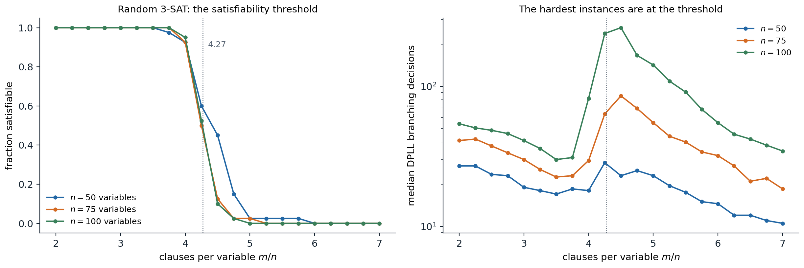
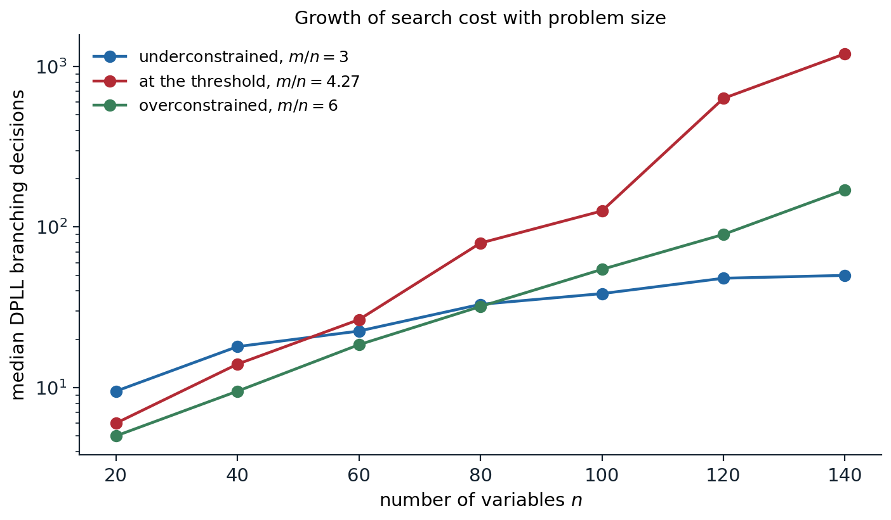

[Background Notes](../README.md) › [Artificial Intelligence](README.md)

# 5. Propositional Logic and Satisfiability

> [!WARNING]
> Work in progress: this part of the notes is still being revised.

[← 4. Adversarial Search and Games](04-adversarial-search-and-games.md) · [6. First-Order Logic and Knowledge Representation →](06-first-order-logic-and-knowledge-representation.md)

## <a id="knowledge-based-agents"></a>Knowledge-based agents

### <a id="knowledge-bases-and-inference"></a>Knowledge bases and inference

The search agents of chapters 1–4 have their knowledge built into a transition model and a heuristic, written as code for one problem. A **knowledge-based agent** keeps its knowledge as a set of **sentences** in a formal language, its **knowledge base** (KB), and decides what to do by **inference**, deriving new sentences from old ones. It interacts with the knowledge base through two operations: TELL adds what it perceives and what it is told, and ASK queries what follows. The agent's behavior can then be changed by telling it new facts rather than by reprogramming it, and the same inference procedure serves every domain. This **declarative** approach, in which the designer states what is true and a general procedure works out the consequences, is the subject of this chapter and the next.

A logic has three parts. The **syntax** says which sentences are well formed. The **semantics** defines the truth of each sentence in each **model**, a possible world fixed precisely enough to make every sentence true or false. The **proof theory** gives rules for deriving sentences from others. The central question is whether derivation tracks truth.

### <a id="entailment"></a>Entailment

A sentence $`\alpha`$ is **entailed** by a knowledge base, written $`\mathrm{KB}\models\alpha`$, if $`\alpha`$ is true in every model in which KB is true. Writing $`M(\alpha)`$ for the set of models of $`\alpha`$,

```math
\mathrm{KB}\models\alpha\quad\Longleftrightarrow\quad M(\mathrm{KB})\subseteq M(\alpha).
```

The more a knowledge base says, the fewer models it has, and the more it entails. An inference procedure $`i`$ derives sentences, written $`\mathrm{KB}\vdash_i\alpha`$. It is **sound** if it derives only entailed sentences and **complete** if it derives every entailed sentence. Soundness is essential; completeness is desirable but, as [chapter 6](06-first-order-logic-and-knowledge-representation.md) shows, not always attainable. If the knowledge base is true of the real world, every sentence derived soundly from it is also true of the world, which is what makes logical reasoning useful to an agent: conclusions about parts of the world it cannot perceive follow from what it knows.

## <a id="propositional-logic"></a>Propositional logic

### <a id="syntax-and-semantics"></a>Syntax and semantics

**Propositional logic** is the simplest logic in which these ideas can be made precise. Its **atomic sentences** are proposition symbols, such as $`P`$, $`Q`$, or $`\mathit{Raining}`$, together with the constants True and False. Complex sentences are built with the **connectives** $`\neg`$ (not), $`\wedge`$ (and), $`\vee`$ (or), $`\Rightarrow`$ (implies), and $`\Leftrightarrow`$ (if and only if). A **literal** is an atomic sentence or its negation.

A model assigns True or False to every proposition symbol, so $`n`$ symbols have $`2^n`$ models. The truth of a complex sentence follows from the truth tables of the connectives. Only one is counterintuitive: $`P\Rightarrow Q`$ is false only when $`P`$ is true and $`Q`$ false, so it is true whenever $`P`$ is false. It says "if $`P`$ is true, then I am claiming $`Q`$ is true; otherwise I am making no claim", and implies no causal or relevance connection between $`P`$ and $`Q`$.

### <a id="validity-satisfiability-and-refutation"></a>Validity, satisfiability, and refutation

A sentence is **valid**, a **tautology**, if it is true in all models, such as $`P\vee\neg P`$. It is **satisfiable** if it is true in some model, and **unsatisfiable** otherwise. Two sentences are **logically equivalent** if they have the same models. These notions are tied together by two theorems:

- **Deduction theorem:** $`\alpha\models\beta`$ if and only if $`\alpha\Rightarrow\beta`$ is valid.
- **Refutation:** $`\alpha\models\beta`$ if and only if $`\alpha\wedge\neg\beta`$ is unsatisfiable.

The second is proof by contradiction, and it turns every entailment question into a satisfiability question. Deciding satisfiability of a propositional sentence, **SAT**, was the first problem proved NP-complete ([Cook, 1971](https://doi.org/10.1145/800157.805047)), so every known complete algorithm takes exponential time in the worst case. Much of this chapter is about why that worst case rarely matters in practice.

### <a id="model-checking"></a>Model checking

The direct way to decide entailment is to enumerate all $`2^n`$ models and check that $`\alpha`$ holds wherever KB does. The enumeration is sound and complete, needs only $`O(n)`$ memory as a depth-first traversal of the assignments, and takes $`O(2^n)`$ time, which limits it to a few dozen symbols.

The following puzzle, a classic exercise, shows both model checking and the proof-based method of the next section on the same five symbols: "If the unicorn is mythical, then it is immortal, but if it is not mythical, then it is a mortal mammal. If the unicorn is either immortal or a mammal, then it is horned. The unicorn is magical if it is horned."

```python
from itertools import combinations, product

symbols = ["Mythical", "Immortal", "Mammal", "Horned", "Magical"]
# If the unicorn is mythical, it is immortal; if it is not mythical, it is a mortal mammal.
# If it is immortal or a mammal, it is horned. It is magical if it is horned.
kb = [lambda m: not m["Mythical"] or m["Immortal"],
      lambda m: m["Mythical"] or (not m["Immortal"] and m["Mammal"]),
      lambda m: not (m["Immortal"] or m["Mammal"]) or m["Horned"],
      lambda m: not m["Horned"] or m["Magical"]]

# Model checking: enumerate all 2^5 models and keep those in which the knowledge base is true.
models = [dict(zip(symbols, vals)) for vals in product([False, True], repeat=len(symbols))]
kb_models = [m for m in models if all(f(m) for f in kb)]
print(f"{len(kb_models)} of {len(models)} models satisfy the knowledge base")
for q in ["Mythical", "Horned", "Magical"]:
    if all(m[q] for m in kb_models):
        verdict = "entailed"
    elif not any(m[q] for m in kb_models):
        verdict = "its negation is entailed"
    else:
        verdict = "not determined"
    print(f"  {q}: {verdict}")

# Resolution: the same knowledge base in conjunctive normal form, as sets of literals ("-" for negation).
cnf = [{"-Mythical", "Immortal"}, {"Mythical", "-Immortal"}, {"Mythical", "Mammal"},
       {"-Immortal", "Horned"}, {"-Mammal", "Horned"}, {"-Horned", "Magical"}]
neg = lambda lit: lit[1:] if lit.startswith("-") else "-" + lit


def resolution_refutes(clauses):
    """Saturate with the resolution rule, one round at a time; True if the empty clause is derived."""
    clauses, rounds = {frozenset(c) for c in clauses}, 0
    while True:
        new = set()
        for a, b in combinations(clauses, 2):
            for lit in a:
                if neg(lit) in b:
                    r = (a - {lit}) | (b - {neg(lit)})
                    if not any(neg(x) in r for x in r):   # skip tautologies
                        new.add(frozenset(r))
        rounds += 1
        if frozenset() in new:
            return True, rounds, len(clauses | new)
        if new <= clauses:
            return False, rounds, len(clauses)
        clauses |= new


for q in ["Horned", "Mythical"]:
    refuted, rounds, size = resolution_refutes(cnf + [{neg(q)}])
    print(f"KB and not {q}: {'empty clause derived' if refuted else 'saturated without the empty clause'}"
          f" after {rounds} rounds, {size} clauses")
# 3 of 32 models satisfy the knowledge base
#   Mythical: not determined
#   Horned: entailed
#   Magical: entailed
# KB and not Horned: empty clause derived after 3 rounds, 28 clauses
# KB and not Mythical: saturated without the empty clause after 4 rounds, 23 clauses
```

Three of the 32 models satisfy the four sentences. The unicorn is horned and magical in all three, so both are entailed, whether or not it is mythical, which varies among the three models and is not determined. Resolution reaches the same conclusions: adding "not horned" to the clauses produces the empty clause, a contradiction, after three rounds; adding "not mythical" does not, and resolution stops when no new clauses appear.

## <a id="inference-by-proof"></a>Inference by proof

### <a id="inference-rules"></a>Inference rules

Model checking ignores the structure of the sentences. **Theorem proving** instead applies **inference rules** directly to sentences, which can find a short proof even when the number of models is astronomical. The best-known rule is **modus ponens**: from $`\alpha\Rightarrow\beta`$ and $`\alpha`$, infer $`\beta`$. Others are and-elimination, from $`\alpha\wedge\beta`$ infer $`\alpha`$, and all the standard logical equivalences, such as De Morgan's laws, contraposition $`(\alpha\Rightarrow\beta)\equiv(\neg\beta\Rightarrow\neg\alpha)`$, and the elimination of implication $`(\alpha\Rightarrow\beta)\equiv(\neg\alpha\vee\beta)`$. Searching for a proof is a search problem in the sense of [chapter 1](01-agents-and-uninformed-search.md): states are sets of derived sentences, actions apply rules, and the goal is the query.

Propositional logic, like the first-order logic of chapter 6, is **monotonic**: adding sentences to a knowledge base can only add to what it entails. Once a conclusion is proved, no further information can retract it; defaults and exceptions ("birds fly, but penguins do not") require nonmonotonic reasoning or the probabilistic methods of chapters 8–12.

### <a id="resolution"></a>Resolution

One rule suffices for a complete procedure if sentences are first put in a normal form. A sentence is in **conjunctive normal form** (CNF) if it is a conjunction of **clauses**, each a disjunction of literals. Every sentence can be converted to CNF by eliminating $`\Leftrightarrow`$ and $`\Rightarrow`$, moving negations inward with De Morgan's laws, and distributing $`\vee`$ over $`\wedge`$. The last step can make the formula exponentially longer; the **Tseitin transformation** instead introduces a new symbol for each subformula and produces a CNF of linear size that is satisfiable exactly when the original is (**equisatisfiable**, not equivalent), which is all refutation needs ([Appendix A](#block-ai05-appendix-a)).

The **resolution rule** takes two clauses containing complementary literals and produces a clause with all the other literals:

```math
\frac{\ell_1\vee\dots\vee\ell_k,\qquad m_1\vee\dots\vee m_n}{\ell_1\vee\dots\vee\ell_{i-1}\vee\ell_{i+1}\vee\dots\vee\ell_k\vee m_1\vee\dots\vee m_{j-1}\vee m_{j+1}\vee\dots\vee m_n}\quad\text{where }\ell_i=\neg m_j,
```

with duplicate literals removed (**factoring**). Resolution is sound: in any model, one of $`\ell_i`$ and $`m_j`$ is false, so the rest of that clause must be true. A **resolution refutation** proves $`\mathrm{KB}\models\alpha`$ by converting $`\mathrm{KB}\wedge\neg\alpha`$ to CNF and resolving pairs of clauses until the **empty clause**, a disjunction of nothing, which is false, appears. The **ground resolution theorem** states that if a set of clauses is unsatisfiable, its resolution closure contains the empty clause: resolution is **refutation complete** ([Appendix B](#block-ai05-appendix-b)).

Complete does not mean efficient. Resolution proofs can be exponentially long: the statement that $`n+1`$ pigeons cannot sit in $`n`$ holes, one per hole, has a CNF encoding of polynomial size but no resolution refutation shorter than exponential in $`n`$ ([Haken, 1985](https://www.sciencedirect.com/science/article/pii/0304397585901446)). The DPLL and CDCL solvers below are, in effect, resolution provers when they report unsatisfiability, so they inherit this limit.

### <a id="horn-clauses-and-chaining"></a>Horn clauses and chaining

Many knowledge bases need only a restricted form of clause. A **definite clause** has exactly one positive literal, and can be written as an implication with a conjunction of positive premises and one positive conclusion, $`A_1\wedge\dots\wedge A_k\Rightarrow B`$, or as a **fact** $`B`$ when $`k=0`$. A **Horn clause** has at most one positive literal; the clauses with none, $`\neg A_1\vee\dots\vee\neg A_k`$, are goals or integrity constraints. Horn clauses are closed under resolution, and entailment with them can be decided in time linear in the size of the knowledge base:

- **Forward chaining** starts from the known facts and fires every rule whose premises are all known, adding its conclusion, until the query is derived or nothing new can be added. Keeping, for each rule, a count of premises not yet known makes each rule fire at most once, and the whole procedure linear ([Appendix C](#block-ai05-appendix-c)). It is **data-driven**, like an agent that updates its beliefs as percepts arrive.
- **Backward chaining** starts from the query and works back through the rules that conclude it, proving their premises recursively. It is **goal-directed**, touching only relevant facts, and usually costs much less than linear in the size of the knowledge base.

Horn-clause reasoning is the basis of logic programming and of Datalog, the first-order versions of which appear in [chapter 6](06-first-order-logic-and-knowledge-representation.md#forward-chaining-and-datalog). Other polynomial fragments are **2-CNF**, clauses of at most two literals, solvable in linear time through the strongly connected components of an implication graph, and **XOR-SAT**, systems of parity constraints, solvable by Gaussian elimination over $`\mathbb F_2`$.

## <a id="satisfiability-solvers"></a>Satisfiability solvers

### <a id="dpll"></a>DPLL

The **Davis–Putnam–Logemann–Loveland** algorithm ([Davis, Logemann, and Loveland, 1962](https://doi.org/10.1145/368273.368557)) decides satisfiability of a CNF formula by backtracking search over truth assignments, the constraint-satisfaction backtracking of [chapter 3](03-constraint-satisfaction-and-local-search.md) specialized to Boolean variables and clauses. It improves on enumeration in three ways:

- **Early termination.** A clause is true as soon as one of its literals is true, and the formula is false as soon as one clause has all its literals false, so partial assignments are evaluated.
- **Unit propagation.** A clause with all literals but one false, a **unit clause**, forces that literal true. Assigning it can create further unit clauses, and propagating them to a fixed point is the Boolean form of forward checking and arc consistency; it performs most of the work of a modern solver.
- **Pure literals.** A symbol that appears with only one sign in the remaining clauses can be set to make those literals true without losing solutions. Modern solvers usually skip this test, because it is costly to maintain.

When no rule applies, DPLL **branches**: it chooses an unassigned variable, assigns it one value, recurses, and on failure tries the other. Branching heuristics resemble MRV: prefer variables that appear often in short clauses, whose assignment is most likely to produce unit propagations or conflicts.

### <a id="conflict-driven-clause-learning"></a>Conflict-driven clause learning

**Conflict-driven clause learning** (CDCL) solvers, from GRASP ([Marques-Silva and Sakallah, 1999](https://doi.org/10.1109/12.769433)) and Chaff ([Moskewicz et al., 2001](https://doi.org/10.1145/378239.379017)) to their current descendants, extend DPLL with the intelligent backtracking of [chapter 3](03-constraint-satisfaction-and-local-search.md#intelligent-backtracking):

- **Implication graph and learning.** Each propagated literal records the clause that forced it. When a clause becomes false, the solver traces the conflict back through these reasons to a small set of decisions and propagations that caused it, and adds a **learned clause** that forbids that combination. The learned clause is a resolvent of the clauses involved, so it is entailed and adding it is sound. The usual choice, the **first unique implication point**, yields a clause with exactly one literal from the current decision level.
- **Non-chronological backjumping.** After learning, the solver jumps back to the decision level at which the learned clause becomes a unit clause, often many levels up, and propagation immediately sets the literal it forces.
- **Activity-based branching.** The **VSIDS** heuristic keeps an activity score for each variable, raised whenever the variable takes part in a conflict and periodically decayed, and branches on the most active variable, focusing the search on the currently difficult part of the problem.
- **Restarts and clause deletion.** Solvers restart from the root frequently while keeping learned clauses and activities, which escapes early bad decisions, and delete learned clauses that are rarely used.
- **Watched literals.** Unit propagation watches only two literals per clause, since a clause can only become unit or false when one of its watched literals becomes false; this makes propagation fast enough for millions of clauses.

With these techniques, CDCL solvers routinely decide industrial instances with millions of variables and clauses, from hardware verification, software model checking, scheduling, and cryptanalysis, and they are the engine inside many planners ([chapter 7](07-automated-planning.md#planning-as-satisfiability)), theorem provers, and constraint solvers. When a CDCL solver reports unsatisfiability, its learned clauses form a resolution refutation, which can be output and checked independently.

### <a id="local-search-walksat"></a>Local search: WalkSAT

For satisfiable instances, local search over complete assignments is often much faster than systematic search. **WalkSAT** ([Selman, Kautz, and Cohen, 1994](https://cdn.aaai.org/AAAI/1994/AAAI94-051.pdf)) starts from a random assignment and repeatedly picks a random unsatisfied clause and flips one of its variables: with probability $`p`$, a random one of them (a **random walk** step); otherwise the one whose flip breaks the fewest currently satisfied clauses (a **greedy** step). The random steps prevent it from being trapped in local minima, the min-conflicts idea of [chapter 3](03-constraint-satisfaction-and-local-search.md#complete-state-formulations) with added noise. WalkSAT cannot prove unsatisfiability: when it fails to find a model within its budget, the formula may still be satisfiable.

```python
import random
from collections import Counter


def random_3sat(n, m, rng):
    return [[v * rng.choice((-1, 1)) for v in rng.sample(range(1, n + 1), 3)] for _ in range(m)]


def dpll(clauses):
    """DPLL with unit propagation. Returns (model or None, branching decisions)."""
    decisions = 0

    def assign(cls, lit):
        out = []
        for c in cls:
            if lit in c:
                continue                                   # clause satisfied
            c = [x for x in c if x != -lit]
            if not c:
                return None                                # empty clause: conflict
            out.append(c)
        return out

    def rec(cls, model):
        nonlocal decisions
        while True:                                        # unit propagation
            unit = next((c[0] for c in cls if len(c) == 1), None)
            if unit is None:
                break
            cls, model = assign(cls, unit), model + [unit]
            if cls is None:
                return None
        if not cls:
            return model
        k = min(len(c) for c in cls)                       # branch on a frequent literal of a shortest clause
        counts = Counter(x for c in cls if len(c) == k for x in c)
        lit = max(counts, key=lambda x: (counts[x] + counts.get(-x, 0), counts[x], -abs(x)))
        decisions += 1
        for choice in (lit, -lit):
            nxt = assign(cls, choice)
            if nxt is not None:
                found = rec(nxt, model + [choice])
                if found is not None:
                    return found
        return None

    return rec([list(c) for c in clauses], []), decisions


def walksat(clauses, n, rng, p=0.5, max_flips=10**6):
    """Random walk plus greedy flips minimizing the number of clauses broken. Returns (model or None, flips)."""
    val = [None] + [rng.random() < 0.5 for _ in range(n)]
    occurs = {lit: [] for v in range(1, n + 1) for lit in (v, -v)}
    for i, c in enumerate(clauses):
        for lit in c:
            occurs[lit].append(i)
    true_lit = lambda lit: val[abs(lit)] == (lit > 0)
    ntrue = [sum(true_lit(l) for l in c) for c in clauses]
    unsat = {i for i, k in enumerate(ntrue) if k == 0}
    for flip in range(max_flips):
        if not unsat:
            return val, flip
        c = clauses[rng.choice(sorted(unsat))]
        if rng.random() < p:
            v = abs(rng.choice(c))                         # random walk step
        else:                                              # greedy step: fewest clauses that become false
            breaks = lambda v: sum(ntrue[i] == 1 for i in occurs[v if val[v] else -v])
            v = min((abs(l) for l in c), key=lambda v: (breaks(v), v))
        old = v if val[v] else -v                          # the literal that becomes false
        val[v] = not val[v]
        for i in occurs[old]:
            ntrue[i] -= 1
            if ntrue[i] == 0:
                unsat.add(i)
        for i in occurs[-old]:
            ntrue[i] += 1
            unsat.discard(i)
    return None, max_flips


rng = random.Random(3)
n = 150
for ratio in [4.0, 4.6]:
    clauses = random_3sat(n, int(ratio * n), rng)
    model, decisions = dpll(clauses)
    ok = model is not None and all(any(l in set(model) for l in c) for c in clauses)
    print(f"m/n = {ratio}: DPLL {'satisfiable' if model else 'unsatisfiable'} after {decisions} decisions"
          + (f", model checked: {ok}" if model else ""))
    val, flips = walksat(clauses, n, rng, max_flips=200_000)
    if val:
        ok = all(any(val[abs(l)] == (l > 0) for l in c) for c in clauses)
        print(f"   WalkSAT: satisfying assignment after {flips} flips, checked: {ok}")
    else:
        print(f"   WalkSAT: no assignment within {flips} flips (it cannot prove unsatisfiability)")
# m/n = 4.0: DPLL satisfiable after 54 decisions, model checked: True
#    WalkSAT: satisfying assignment after 967 flips, checked: True
# m/n = 4.6: DPLL unsatisfiable after 1956 decisions
#    WalkSAT: no assignment within 200000 flips (it cannot prove unsatisfiability)
```

On a random formula with 150 variables and 600 clauses, DPLL finds a model after 54 branching decisions and WalkSAT after 967 flips, each flip far cheaper than a DPLL decision. With 690 clauses the formula is unsatisfiable: DPLL proves it after 1,956 decisions, while WalkSAT gives up after its 200,000 flips without being able to conclude anything.

### <a id="hard-and-easy-instances"></a>Hard and easy instances

Random 3-SAT formulas with $`n`$ variables and $`m`$ clauses show the phase transition of [chapter 3](03-constraint-satisfaction-and-local-search.md#where-the-hard-problems-are) in its best-studied form. When the ratio $`m/n`$ is small, almost every formula is satisfiable and easily solved; when it is large, almost every formula is unsatisfiable and quickly refuted; the transition sharpens with $`n`$ around $`m/n\approx4.27`$, a value computed by statistical-physics methods ([Mézard, Parisi, and Zecchina, 2002](https://doi.org/10.1126/science.1073287)), and the hardest instances cluster there ([Mitchell, Selman, and Levesque, 1992](https://cdn.aaai.org/AAAI/1992/AAAI92-071.pdf)).



*Random 3-SAT formulas, 40 for each size and ratio. Left: the fraction that is satisfiable falls from 1 to 0 between about 3.75 and 5 clauses per variable, and the fall steepens as the number of variables grows from 50 to 100; with 75 and 100 variables, half of the formulas at $`m/n=4.25`$ are satisfiable (0.50 and 0.52). Right: the median number of branching decisions of DPLL, on a logarithmic scale, peaks at the threshold, at 28, 86, and 262 decisions for 50, 75, and 100 variables, while on either side it stays near or below the number of variables.*



*The median number of DPLL decisions on 30 random formulas for each size. Underconstrained formulas ($`m/n=3`$) need roughly one decision per few variables, from 9.5 at 20 variables to 50 at 140, with no real search. At the threshold the cost grows exponentially, from 6 to 1,201 decisions, roughly doubling every 14 variables beyond 60. Overconstrained formulas ($`m/n=6`$) also need exponential time to refute, but with a much smaller rate, reaching 170 decisions at 140 variables.*

Industrial instances are not random: they have structure, small backdoors of variables whose assignment makes the rest easy, and modular constraint graphs, and CDCL solvers exploit exactly that. Unsatisfiable random formulas at the threshold, by contrast, remain hard for complete solvers at a few hundred variables, and message-passing algorithms from statistical physics solve satisfiable random instances with millions of variables close to the threshold, where local search struggles.

## <a id="logical-agents"></a>Logical agents

A logical agent can use propositional inference to track the state of a partially observable world and to plan. Because a propositional symbol cannot refer to a time, facts that change are written as **fluents** indexed by time step, such as $`\mathit{At}_{1,1}^0`$ and $`\mathit{At}_{2,1}^1`$, and actions as symbols such as $`\mathit{Forward}^0`$. The **transition model** must then say not only what actions change but also what they leave unchanged, the **frame problem**. Listing, for every action, every fluent it does not affect needs a number of axioms proportional to the number of actions times the number of fluents. **Successor-state axioms** avoid this by stating, for each fluent, exactly when it is true at the next step:

```math
F^{t+1}\;\Leftrightarrow\;\mathit{ActionCausesF}^t\vee\bigl(F^t\wedge\neg\mathit{ActionCausesNotF}^t\bigr).
```

With the percepts added as they arrive, asking whether a fluent is entailed at time $`t`$ performs **logical state estimation**, the deterministic counterpart of the probabilistic filtering of [chapter 11](11-temporal-probabilistic-models.md). Asking for a model of the axioms together with an initial state and a goal at time $`T`$ produces a plan: the action symbols true in the model. This is **SATPlan**, the subject of [chapter 7](07-automated-planning.md#planning-as-satisfiability).

The propositional encoding has an obvious limitation. A grid world with $`k`$ squares needs separate symbols, and separate axioms, for every square and every time step, and the knowledge base grows accordingly. Statements such as "every square adjacent to a pit is breezy" must be written out once per square. [Chapter 6](06-first-order-logic-and-knowledge-representation.md) adds objects, relations, and quantifiers to say such things once.

## <a id="appendices"></a>Appendices


<details>
<summary><a id="block-ai05-appendix-a"></a><b>A. The Tseitin transformation</b></summary>


Converting a formula to an equivalent CNF by distribution can blow up exponentially: $`(x_1\wedge y_1)\vee(x_2\wedge y_2)\vee\dots\vee(x_n\wedge y_n)`$ has $`2^n`$ clauses in CNF. The Tseitin transformation introduces a fresh symbol $`z_\phi`$ for each non-atomic subformula $`\phi`$ and adds clauses stating $`z_\phi\Leftrightarrow\phi`$ in terms of the symbols of its immediate subformulas. For $`\phi=a\wedge b`$:

```math
(\neg z\vee a)\wedge(\neg z\vee b)\wedge(z\vee\neg a\vee\neg b),
```

for $`\phi=a\vee b`$: $`(\neg z\vee a\vee b)\wedge(z\vee\neg a)\wedge(z\vee\neg b)`$, and for $`\phi=\neg a`$: $`(\neg z\vee\neg a)\wedge(z\vee a)`$. Finally, the unit clause $`z_{\text{root}}`$ asserts the whole formula.

The result has a constant number of clauses per subformula, so its size is linear in the size of the formula. It is **equisatisfiable** with the original: any model of the original extends to a model of the CNF by setting each $`z_\phi`$ to the truth value of $`\phi`$, and in any model of the CNF, by induction on the structure, each $`z_\phi`$ equals the value of $`\phi`$ under the original symbols, so $`z_{\text{root}}`$ true means the formula is true. Since refutation only asks whether $`\mathrm{KB}\wedge\neg\alpha`$ is satisfiable, equisatisfiability is enough. Only the implication $`z_\phi\Rightarrow\phi`$ is needed when $`\phi`$ occurs positively, which halves the clauses (the Plaisted–Greenbaum refinement).

</details>


<details>
<summary><a id="block-ai05-appendix-b"></a><b>B. Completeness of resolution</b></summary>


**Ground resolution theorem.** If a finite set of clauses $`S`$ is unsatisfiable, the resolution closure $`RC(S)`$, the set of all clauses derivable by repeated resolution, contains the empty clause.

**Proof.** Suppose $`RC(S)`$ does not contain the empty clause; we build a model of $`S`$. Order the symbols $`P_1,\dots,P_k`$ of $`S`$ and assign them in order: set $`P_i`$ to False if some clause of $`RC(S)`$ becomes false under the choice $`P_i=\text{True}`$ given $`P_1,\dots,P_{i-1}`$, that is, if some clause contains $`\neg P_i`$ and otherwise only literals already false; otherwise set $`P_i`$ to True.

Suppose this assignment makes some clause of $`RC(S)`$ false, and take the first step $`i`$ at which some clause becomes false. The clause must contain $`P_i`$ or $`\neg P_i`$, with all other literals false under $`P_1,\dots,P_{i-1}`$. If it becomes false because $`P_i`$ was set to False, it has the form $`C_1=(\text{false}\vee\dots\vee P_i)`$; the choice False was made because a clause $`C_2=(\text{false}\vee\dots\vee\neg P_i)`$ would have become false otherwise. Both are in $`RC(S)`$, so their resolvent is too, and it contains only literals over $`P_1,\dots,P_{i-1}`$, all false: it would have been false at an earlier step, contradicting the choice of $`i`$ (or, if it has no literals, it is the empty clause, excluded by assumption). If it becomes false because $`P_i`$ was set to True, it contains $`\neg P_i`$ and the rule would have chosen False. Hence the assignment satisfies every clause of $`RC(S)`$, and in particular of $`S`$.

Because $`S`$ has finitely many symbols, $`RC(S)`$ is finite, so saturation terminates. Resolution is refutation complete but not complete for deriving arbitrary consequences: from $`P`$ it cannot derive $`P\vee Q`$, although $`P\models P\vee Q`$; refutation proves it instead, by deriving the empty clause from $`P`$, $`\neg P`$, and $`\neg Q`$.

</details>


<details>
<summary><a id="block-ai05-appendix-c"></a><b>C. Forward chaining in linear time</b></summary>


Let the knowledge base consist of definite clauses. Keep, for each rule, a count of its premises not yet known to be true, an index from each symbol to the rules in whose premises it appears, and an agenda of symbols known to be true, initially the facts. Repeatedly remove a symbol $`p`$ from the agenda; if it was not already marked true, mark it and decrement the count of every rule with $`p`$ among its premises; a rule whose count reaches zero adds its conclusion to the agenda.

**Cost.** Each symbol is processed at most once, and each occurrence of a symbol in a premise is decremented at most once, so the total work is proportional to the number of symbols plus the total size of the rules: linear in the size of the knowledge base.

**Soundness** is immediate, since each step is an application of modus ponens. **Completeness:** when the algorithm stops, consider the model $`m`$ that makes exactly the marked symbols true. Every definite clause is true in $`m`$: a fact is marked, and a rule whose premises are all true in $`m`$ had its count reach zero, so its conclusion was marked. So $`m`$ is a model of the knowledge base. If $`q`$ is entailed, it is true in every model of the knowledge base, in particular in $`m`$, so $`q`$ was marked. The model $`m`$ is the **least model**, the set of symbols true in every model of the knowledge base, and forward chaining computes exactly it.

</details>

---

[← 4. Adversarial Search and Games](04-adversarial-search-and-games.md) · [6. First-Order Logic and Knowledge Representation →](06-first-order-logic-and-knowledge-representation.md)
