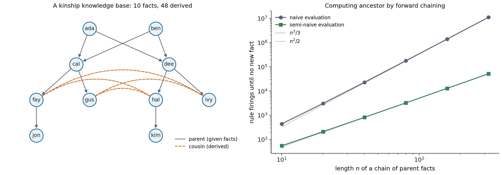

[Background Notes](../README.md) › [Artificial Intelligence](README.md)

# 6. First-Order Logic and Knowledge Representation

[← 5. Propositional Logic and Satisfiability](05-propositional-logic-and-satisfiability.md) · [7. Automated Planning →](07-automated-planning.md)

## <a id="objects-relations-and-quantifiers"></a>Objects, relations, and quantifiers

### <a id="what-propositional-logic-cannot-say"></a>What propositional logic cannot say

Propositional logic, [chapter 5](05-propositional-logic-and-satisfiability.md), describes the world with a fixed set of facts, each true or false. It has no way to talk about the things the facts concern. "Every square adjacent to a pit is breezy" must be written once per square, a rule of chess once per position of the pieces, and "every person has a mother" cannot be written at all, since it concerns infinitely many people. **First-order logic** (FOL), also called predicate logic, makes a stronger **ontological commitment**: the world consists of **objects**, which have **properties** and stand in **relations**, some of which are **functions**. Natural language is organized the same way, with nouns for objects, adjectives and verbs for properties and relations, and phrases such as "the mother of" for functions, and FOL is expressive enough to formalize most of mathematics.

Its **epistemological commitment** is unchanged: each sentence is true or false, and an agent believes it, disbelieves it, or has no opinion. Degrees of belief come in [chapter 8](08-bayesian-networks-and-markov-networks.md); probabilistic relational models, which combine both commitments, are mentioned at the end of this chapter.

### <a id="syntax"></a>Syntax

The vocabulary of a first-order language has three kinds of symbols:

- **constant symbols**, which name objects: $`\mathit{Ada}`$, $`\mathit{Two}`$;
- **predicate symbols**, which name relations: $`\mathit{Parent}`$, of two arguments, or $`\mathit{Person}`$, of one;
- **function symbols**, which name functions: $`\mathit{Mother}`$, $`\mathit{Plus}`$.

A **term** refers to an object: a constant, a variable, or a function applied to terms, such as $`\mathit{Mother}(\mathit{Ada})`$. An **atomic sentence** applies a predicate to terms, $`\mathit{Parent}(\mathit{Ada},\mathit{Cal})`$, or states that two terms are equal, $`\mathit{Mother}(\mathit{Cal})=\mathit{Ada}`$. Complex sentences combine them with the propositional connectives and with **quantifiers**:

- **universal quantification**, $`\forall x\;P`$, says that $`P`$ is true for every object $`x`$;
- **existential quantification**, $`\exists x\;P`$, says that $`P`$ is true for at least one object.

The natural connective under $`\forall`$ is $`\Rightarrow`$ and under $`\exists`$ is $`\wedge`$. "All kings are persons" is $`\forall x\;\mathit{King}(x)\Rightarrow\mathit{Person}(x)`$; writing $`\forall x\;\mathit{King}(x)\wedge\mathit{Person}(x)`$ instead says that everything is a king and a person. "Some king is wise" is $`\exists x\;\mathit{King}(x)\wedge\mathit{Wise}(x)`$; with $`\Rightarrow`$, it would be true of any world containing a non-king. The two quantifiers are dual: $`\forall x\;\neg P\equiv\neg\exists x\;P`$. The order of nested quantifiers matters: $`\forall x\,\exists y\;\mathit{Loves}(x,y)`$ says that everybody loves somebody, while $`\exists y\,\forall x\;\mathit{Loves}(x,y)`$ says that there is someone whom everybody loves.

### <a id="semantics"></a>Semantics

A **model** of a first-order language consists of a nonempty **domain** of objects and an **interpretation** that maps each constant to an object, each predicate to a relation on the domain, and each function to a total function on it. An atomic sentence is true if the objects its terms refer to stand in the relation its predicate refers to; $`\forall x\;P`$ is true if $`P`$ is true for every way of assigning a domain element to $`x`$, and $`\exists x\;P`$ if it is true for at least one. Entailment, validity, and satisfiability are defined exactly as in propositional logic, with this richer notion of model.

The richness has a price. A propositional language has finitely many models; a first-order language has infinitely many, with domains of every size, so entailment cannot be checked by enumerating models. Two conventions of databases, often adopted in logic programming, shrink the space: the **unique-names assumption** (different constants refer to different objects), the **closed-world assumption** (atomic sentences not known to be true are false), and **domain closure** (there are no objects other than those named). Under this **database semantics**, a knowledge base with facts about $`k`$ constants describes one model, which makes reasoning much simpler and makes some statements, such as "Ada has exactly two children", much shorter to write; the price is that the knowledge base must be complete about the facts it covers.

### <a id="knowledge-engineering"></a>Knowledge engineering

Writing a knowledge base for a domain is **knowledge engineering**: identify the questions it must answer, assemble the relevant knowledge, choose a vocabulary of predicates, functions, and constants (an **ontology** of the domain), encode general rules, encode the specific problem instance, and debug. Take kinship. Given facts about the predicate $`\mathit{Parent}`$, definitions introduce the other relations:

```math
\begin{aligned}
&\forall x,z\;\;\mathit{Grandparent}(x,z)\Leftrightarrow\exists y\;\mathit{Parent}(x,y)\wedge\mathit{Parent}(y,z),\\
&\forall x,y\;\;\mathit{Sibling}(x,y)\Leftrightarrow x\neq y\wedge\exists p\;\mathit{Parent}(p,x)\wedge\mathit{Parent}(p,y),\\
&\forall x,y\;\;\mathit{Ancestor}(x,y)\Leftrightarrow\mathit{Parent}(x,y)\vee\exists z\;\mathit{Parent}(x,z)\wedge\mathit{Ancestor}(z,y).
\end{aligned}
```

The choice of basic predicates is a design decision: $`\mathit{Parent}`$ plus $`\mathit{Female}`$ define $`\mathit{Mother}`$, but one could equally start from $`\mathit{Mother}`$ and $`\mathit{Father}`$. Some sentences are **axioms**, basic facts from which others follow; others are **theorems**, entailed by the axioms and useful to state only to save inference. Debugging a knowledge base is different from debugging a program: a missing axiom does not produce a crash, only a query that fails or, worse, a wrong answer that follows correctly from an incorrect axiom. The last definition above also shows a limit of first-order logic: the biconditional does not pin down $`\mathit{Ancestor}`$ as the transitive closure of $`\mathit{Parent}`$ in every model, since unintended models, for example ones with infinite chains of descendants, can satisfy it with extra ancestor pairs; transitive closure is not definable in first-order logic. The least-model semantics of Datalog, below, gives the intended meaning.

## <a id="inference-in-first-order-logic"></a>Inference in first-order logic

### <a id="propositionalization"></a>Propositionalization

The simplest inference method reduces first-order logic to propositional logic. **Universal instantiation** infers, from $`\forall x\;\alpha`$, the sentence $`\alpha`$ with $`x`$ replaced by any ground term (a term without variables). **Existential instantiation** replaces $`\exists x\;\alpha`$ by $`\alpha`$ with $`x`$ replaced by a new constant, a **Skolem constant**, that appears nowhere else; the new sentence is not equivalent to the old one, but it is satisfiable exactly when the old one is. Instantiating every universal sentence with every ground term produces a propositional knowledge base.

When function symbols are present, there are infinitely many ground terms: $`\mathit{Mother}(\mathit{Ada})`$, $`\mathit{Mother}(\mathit{Mother}(\mathit{Ada}))`$, and so on. **Herbrand's theorem** rescues completeness: if a sentence is entailed by a first-order knowledge base, it is entailed by a *finite* subset of the propositionalized knowledge base. Instantiating with terms of depth 0, then 1, then 2, and running a propositional prover at each stage therefore finds every entailment. But if a sentence is not entailed, the process may never stop. This is not a weakness of the method: entailment in first-order logic is **semidecidable** ([Church, 1936](https://www.cambridge.org/core/services/aop-cambridge-core/content/view/9461BEAD94BB16D56EC78933D7D67DEF/S0022481200038664a.pdf/a-note-on-the-entscheidungsproblem.pdf); [Turing, 1936](https://doi.org/10.1112/plms/s2-42.1.230)). Some procedure answers "yes" for every entailed sentence, but no procedure answers "no" for every non-entailed one ([Appendix B](#block-ai06-appendix-b)). **Gödel's completeness theorem** (1930) guarantees that proof systems exist that derive every entailed sentence; his better-known incompleteness theorems concern something different, the impossibility of axiomatizing all truths about the natural numbers.

### <a id="unification"></a>Unification

Propositionalization generates many useless instances. Given $`\forall x\;\mathit{King}(x)\wedge\mathit{Greedy}(x)\Rightarrow\mathit{Evil}(x)`$, $`\mathit{King}(\mathit{John})`$, and $`\mathit{Greedy}(\mathit{John})`$, it instantiates the rule for every object, when the only useful substitution, $`x/\mathit{John}`$, is obvious from the facts. **Lifted** inference works with variables directly, finding substitutions that make different sentences look identical. A **substitution** $`\theta`$ maps variables to terms, and $`\mathrm{Subst}(\theta,\alpha)`$ applies it. Two sentences **unify** if some substitution makes them identical, and **unification** computes one:

```math
\mathrm{Unify}\bigl(\mathit{Knows}(\mathit{John},x),\,\mathit{Knows}(y,\mathit{Mother}(y))\bigr)=\{y/\mathit{John},\;x/\mathit{Mother}(\mathit{John})\}.
```

Among all unifiers there is a **most general unifier** (MGU), unique up to renaming of variables, that places the fewest restrictions on the variables; every other unifier is an instance of it ([Appendix A](#block-ai06-appendix-a)). The algorithm walks both expressions in parallel, binding a variable to the corresponding subterm of the other expression. It must refuse to bind a variable to a term containing it, the **occurs check**: $`x`$ and $`f(x)`$ have no finite unifier. Variables in different sentences must also be **standardized apart**, renamed so they do not clash: $`\mathit{Knows}(\mathit{John},x)`$ and $`\mathit{Knows}(x,\mathit{Elizabeth})`$ unify once the second $`x`$ is renamed.

**Generalized modus ponens** lifts modus ponens with unification: from $`p_1',\dots,p_k'`$ and $`p_1\wedge\dots\wedge p_k\Rightarrow q`$, infer $`\mathrm{Subst}(\theta,q)`$, where $`\theta`$ unifies each $`p_i'`$ with $`p_i`$. It is sound, and it makes only the inferences that the facts support.

### <a id="forward-chaining-and-datalog"></a>Forward chaining and Datalog

A **first-order definite clause** is a disjunction of literals exactly one of which is positive, written as an implication with universally quantified variables left implicit, such as $`\mathit{Parent}(x,y)\wedge\mathit{Parent}(y,z)\Rightarrow\mathit{Grandparent}(x,z)`$. **Forward chaining** repeatedly applies generalized modus ponens to all rules and facts until no new fact appears. A knowledge base of definite clauses with no function symbols is a **Datalog** program. With no function symbols there are only finitely many ground atoms, at most $`p\cdot k^a`$ for $`p`$ predicates of arity at most $`a`$ over $`k`$ constants, so forward chaining reaches a **fixed point** after finitely many rounds; the fixed point is the least model, exactly the set of entailed atomic facts, as in the propositional case of [chapter 5](05-propositional-logic-and-satisfiability.md#block-ai05-appendix-c).

Two sources of cost dominate. The first is **matching**: finding all substitutions that satisfy the conjunction of premises is a join of relations, NP-hard in the length of the rule body in general, although rules are short in practice and database join algorithms, with indexes on the arguments, handle it well. The second is **redundant rederivation**: a naive loop reapplies every rule to every fact in every round and rederives old facts again and again. **Semi-naive evaluation** requires each rule firing in round $`t`$ to use at least one fact that was new in round $`t-1`$, since any firing that uses only older facts already happened. The **Rete** algorithm of production systems goes further, maintaining partial matches of every rule incrementally as facts are added.

```python
def is_var(t):
    return isinstance(t, str) and t[0].isupper()


def walk(t, s):
    while is_var(t) and t in s:
        t = s[t]
    return t


def unify(x, y, s):
    """Most general unifier extending substitution s, or None. Terms: variables (capitalized strings),
    constants (lowercase strings), and compound terms (tuples whose first entry is the functor)."""
    x, y = walk(x, s), walk(y, s)
    if x == y:
        return s
    if is_var(x):
        return None if occurs(x, y, s) else {**s, x: y}
    if is_var(y):
        return unify(y, x, s)
    if isinstance(x, tuple) and isinstance(y, tuple) and len(x) == len(y):
        for a, b in zip(x, y):
            s = unify(a, b, s)
            if s is None:
                return None
        return s
    return None


def occurs(v, t, s):
    t = walk(t, s)
    return t == v or (isinstance(t, tuple) and any(occurs(v, a, s) for a in t))


def resolve(t, s):
    t = walk(t, s)
    return tuple(resolve(a, s) for a in t) if isinstance(t, tuple) else t


s = unify(("knows", "john", "X"), ("knows", "Y", ("mother", "Y")), {})
print("unify knows(john, X) with knows(Y, mother(Y)):", {v: resolve(v, s) for v in s})
print("unify X with f(X) (occurs check):", unify("X", ("f", "X"), {}))

parents = [("ada", "cal"), ("ada", "dee"), ("ben", "cal"), ("ben", "dee"), ("cal", "fay"),
           ("cal", "gus"), ("dee", "hal"), ("dee", "ivy"), ("fay", "jon"), ("hal", "kim")]
facts = {("parent", p, c) for p, c in parents}
rules = [(("grandparent", "X", "Z"), [("parent", "X", "Y"), ("parent", "Y", "Z")]),
         (("sibling", "X", "Y"), [("parent", "P", "X"), ("parent", "P", "Y"), ("neq", "X", "Y")]),
         (("cousin", "X", "Y"), [("parent", "P", "X"), ("parent", "Q", "Y"), ("sibling", "P", "Q")]),
         (("ancestor", "X", "Y"), [("parent", "X", "Y")]),
         (("ancestor", "X", "Y"), [("parent", "X", "Z"), ("ancestor", "Z", "Y")])]


def matches(body, db, s, delta=None, used_delta=False):
    """All substitutions satisfying the body atoms; with delta, at least one atom must match a new fact."""
    if not body:
        if delta is None or used_delta:
            yield s
        return
    atom, rest = body[0], body[1:]
    if atom[0] == "neq":                                    # built-in inequality on bound variables
        if walk(atom[1], s) != walk(atom[2], s):
            yield from matches(rest, db, s, delta, used_delta)
        return
    for fact in db:
        s2 = unify(atom, fact, s)
        if s2 is not None:
            yield from matches(rest, db, s2, delta, used_delta or (delta is not None and fact in delta))


def forward_chain(facts, semi_naive):
    db, delta, rounds, firings = set(facts), set(facts), 0, 0
    while delta:
        rounds += 1
        new = set()
        for head, body in rules:
            for s in matches(body, db, {}, delta if semi_naive else None):
                firings += 1
                fact = tuple(walk(t, s) for t in head)
                if fact not in db:
                    new.add(fact)
        db |= new
        delta = new
    return db, rounds, firings


for semi in (False, True):
    db, rounds, firings = forward_chain(facts, semi)
    print(f"{'semi-naive' if semi else 'naive':10s}: {len(db)} facts after {rounds} rounds, {firings} rule firings")
for pred in ["grandparent", "sibling", "cousin", "ancestor"]:
    print(f"  {pred}: {sum(f[0] == pred for f in db)} facts")
print("  cousins:", sorted((f[1], f[2]) for f in db if f[0] == "cousin"))
# unify knows(john, X) with knows(Y, mother(Y)): {'Y': 'john', 'X': ('mother', 'john')}
# unify X with f(X) (occurs check): None
# naive     : 58 facts after 4 rounds, 174 rule firings
# semi-naive: 58 facts after 4 rounds, 50 rule firings
#   grandparent: 10 facts
#   sibling: 6 facts
#   cousin: 8 facts
#   ancestor: 24 facts
#   cousins: [('fay', 'hal'), ('fay', 'ivy'), ('gus', 'hal'), ('gus', 'ivy'), ('hal', 'fay'), ('hal', 'gus'), ('ivy', 'fay'), ('ivy', 'gus')]
```

From ten parent facts, forward chaining derives 48 more in three productive rounds, the fourth confirming that nothing new follows. Semi-naive evaluation performs 50 rule firings instead of 174 and derives the same facts. The difference grows with the depth of the recursion, as the figure shows for a chain of parents, where naive evaluation rederives every ancestor fact in every later round.



*Left: the kinship knowledge base of the code, ten parent facts (gray arrows) from which the rules derive ten grandparent, six sibling, eight cousin, and 24 ancestor facts; the dashed arcs show the four cousin pairs, each derived in both orders. Right: rule firings of forward chaining for the recursive ancestor rule on a chain of $`n`$ parent facts, which has $`n(n+1)/2`$ ancestor facts and needs $`n+1`$ rounds. Naive evaluation fires about $`n^3/3`$ times, 11,025,280 for $`n=320`$; semi-naive evaluation fires exactly once per derived fact, 51,360 times.*

Datalog is the language of deductive databases and of much program analysis: points-to analysis in compilers, access-control policies, and network configuration checking are written as Datalog rules and evaluated bottom-up. Its **data complexity**, the cost for a fixed program as the facts grow, is polynomial, which is why it scales to millions of facts.

### <a id="backward-chaining-and-logic-programming"></a>Backward chaining and logic programming

**Backward chaining** works from the query: to prove a goal, find a rule whose conclusion unifies with it and prove the rule's premises, recursively, with the substitution accumulated so far; a goal that unifies with a fact is proved at once. The search is an AND–OR tree: a goal is proved by *any* matching rule (OR) and a rule by *all* its premises (AND). Backward chaining is the proof method of **logic programming**, whose best-known language is Prolog: a Prolog program is a list of definite clauses, and running it means asking a query, which the interpreter answers by depth-first backward chaining (**SLD resolution**), trying rules in the order written and premises from left to right.

Depth-first search makes Prolog efficient and predictable, and also incomplete. A goal that calls itself before making progress, such as a left-recursive rule, sends it into infinite recursion even when the answer is finitely derivable:

```python
import itertools


def is_var(t):
    return isinstance(t, str) and t[0].isupper()


def walk(t, s):
    while is_var(t) and t in s:
        t = s[t]
    return t


def unify(x, y, s):
    x, y = walk(x, s), walk(y, s)
    if x == y:
        return s
    if is_var(x):
        return {**s, x: y}                      # no occurs check, as in Prolog
    if is_var(y):
        return {**s, y: x}
    if isinstance(x, tuple) and isinstance(y, tuple) and len(x) == len(y):
        for a, b in zip(x, y):
            s = unify(a, b, s)
            if s is None:
                return None
        return s
    return None


fresh = itertools.count()


def rename(clause):
    """Give the clause's variables new names, so that each use of a rule has its own variables."""
    n = next(fresh)
    r = lambda t: (t + f"_{n}" if is_var(t) else tuple(r(a) for a in t) if isinstance(t, tuple) else t)
    return r(clause[0]), [r(a) for a in clause[1]]


class TooDeep(Exception):
    pass


def solve(program, goals, s, depth, stats):
    """Depth-first backward chaining (SLD resolution): prove the goals left to right, rules in program order."""
    if not goals:
        yield s
        return
    if depth > 50:
        raise TooDeep
    for clause in program:
        head, body = rename(clause)
        s2 = unify(goals[0], head, s)
        if s2 is not None:
            stats["steps"] += 1
            yield from solve(program, body + goals[1:], s2, depth + 1, stats)


parents = [("ada", "cal"), ("ada", "dee"), ("ben", "cal"), ("ben", "dee"), ("cal", "fay"),
           ("cal", "gus"), ("dee", "hal"), ("dee", "ivy"), ("fay", "jon"), ("hal", "kim")]
facts = [(("parent", p, c), []) for p, c in parents]
right = facts + [(("ancestor", "X", "Y"), [("parent", "X", "Y")]),
                 (("ancestor", "X", "Y"), [("parent", "X", "Z"), ("ancestor", "Z", "Y")])]
left = facts + [(("ancestor", "X", "Y"), [("parent", "X", "Y")]),
                (("ancestor", "X", "Y"), [("ancestor", "X", "Z"), ("parent", "Z", "Y")])]

for name, program in [("right-recursive", right), ("left-recursive", left)]:
    for query in [("ancestor", "ada", "W"), ("ancestor", "kim", "ada")]:
        stats, answers = {"steps": 0}, []
        try:
            for s in solve(program, [query], {}, 0, stats):
                answers.append(walk("W", s) if "W" in query else "yes")
            outcome = f"{answers or 'no'} (finished)"
        except TooDeep:
            outcome = f"{answers} then the depth limit: the search does not terminate"
        print(f"{name}, {query[0]}({query[1]}, {query[2]}): {outcome}; {stats['steps']} resolution steps")
# right-recursive, ancestor(ada, W): ['cal', 'dee', 'fay', 'gus', 'jon', 'hal', 'ivy', 'kim'] (finished); 34 resolution steps
# right-recursive, ancestor(kim, ada): no (finished); 2 resolution steps
# left-recursive, ancestor(ada, W): ['cal', 'dee', 'fay', 'gus', 'hal', 'ivy', 'jon', 'kim'] then the depth limit: the search does not terminate; 466 resolution steps
# left-recursive, ancestor(kim, ada): [] then the depth limit: the search does not terminate; 101 resolution steps
```

Both programs define the same relation, and a forward chainer computes the same eight descendants of Ada from either. With the recursive call last, backward chaining lists them in 34 steps and answers "no" to the false query in two. With the recursive call first, it finds all eight answers and then recurses forever looking for more, and on the false query it never produces anything. Logic programmers avoid left recursion; **tabling** (memoization of subgoals and their answers, as in XSB Prolog) removes the problem by reusing answers to repeated subgoals, which makes backward chaining terminate on every Datalog program.

Prolog departs from logic in other ways for the sake of efficiency. It omits the occurs check, so it can derive unsound conclusions from terms such as $`x=f(x)`$. It adopts the closed-world assumption through **negation as failure**: $`\mathtt{not}\;P`$ succeeds if $`P`$ cannot be proved, which is nonmonotonic, since adding facts can make $`P`$ provable. And it has built-in arithmetic and control operators that have no logical reading.

### <a id="resolution"></a>Resolution

Neither chaining method handles full first-order logic, with disjunctive conclusions and negation. **Resolution** does ([Robinson, 1965](https://doi.org/10.1145/321250.321253)). Sentences are converted to clausal form: eliminate implications, move negations inward, standardize variables apart, **Skolemize** (replace each existential variable by a Skolem function of the universal variables in whose scope it lies, so that $`\forall x\,\exists y\;\mathit{Loves}(x,y)`$ becomes $`\forall x\;\mathit{Loves}(x,F(x))`$), drop the universal quantifiers, and distribute $`\vee`$ over $`\wedge`$. The **binary resolution** rule resolves two clauses on literals that unify with complementary signs, applying the unifier to the rest; together with **factoring**, which merges unifiable literals in one clause, it is refutation complete: if a set of clauses is unsatisfiable, resolution derives the empty clause. Equality needs extra rules, such as **paramodulation**, which rewrites with equations.

Completeness says nothing about efficiency, and first-order theorem provers depend on strategies: the **unit preference** of resolving with single-literal clauses first, the **set-of-support** restriction that every resolution involve a clause descended from the negated query, **subsumption**, which deletes clauses more specific than others already present, and orderings that restrict which literals may be resolved. Saturation-based provers such as Vampire and E prove difficult theorems automatically; interactive **proof assistants** such as Lean, Isabelle, and Coq have humans guide the proof and machines check every step, and they have verified major theorems, compilers, and operating-system kernels. Language models trained on formal proofs increasingly supply the guidance.

### <a id="decidable-fragments"></a>Decidable fragments

Because full first-order entailment is only semidecidable, many applications restrict the language to a **decidable fragment**:

- **Datalog** (no function symbols, definite clauses) is decidable, with polynomial data complexity.
- **Monadic** first-order logic (only one-argument predicates) and the **two-variable** fragment are decidable.
- **Description logics** restrict quantification to patterns such as "every child of $`x`$ is a doctor", which yields decidable and often tractable reasoning, and underlie the Web Ontology Language OWL.

The trade-off between expressiveness and tractability runs through all of knowledge representation: the more a language can say, the harder it is to reason in.

## <a id="knowledge-representation"></a>Knowledge representation

### <a id="ontologies-and-categories"></a>Ontologies and categories

An **ontology** fixes the vocabulary of a domain and the general facts about it. An **upper ontology** provides the most general concepts, such as physical objects, events, times, and measures, from which domain ontologies specialize. Much reasoning is about **categories**, which can be represented as predicates, $`\mathit{Basketball}(b)`$, or reified as objects, $`b\in\mathit{Basketballs}`$, so that one can state facts about the category itself, such as its typical size. Categories are organized into a **taxonomy** by the **subclass** relation, and properties are inherited down the taxonomy: from $`\mathit{Basketballs}\subset\mathit{Balls}`$ and "all balls are round", every basketball is round. Categories can be **disjoint**, form an **exhaustive decomposition** of a larger category, or both, a **partition**.

Other standard pieces of an upper ontology are **physical composition** ($`\mathit{PartOf}`$, transitive and reflexive), **measures**, such as $`\mathit{Length}(L_1)=\mathit{Inches}(1.5)`$, with units as functions, and **events and time**. The **situation calculus** ([McCarthy and Hayes, 1969](https://www-formal.stanford.edu/jmc/mcchay69.pdf)) represents the state after a sequence of actions as a term, $`\mathit{Result}(a,s)`$, and adapts the successor-state axioms of [chapter 5](05-propositional-logic-and-satisfiability.md#logical-agents) to first-order logic; the **event calculus** reifies events and time points to handle concurrent and continuous change. Large ontologies exist for many fields, and their construction is expensive: the medical ontology SNOMED CT defines hundreds of thousands of concepts.

### <a id="description-logics"></a>Description logics

**Description logics** are designed to describe categories and reason about them. A description such as

```math
\mathit{Parent}\sqcap\forall\,\mathit{hasChild}.\mathit{Doctor}\sqcap\exists\,\mathit{hasChild}.\mathit{Female}
```

denotes the parents all of whose children are doctors and who have at least one daughter. The principal inference tasks are **subsumption**, whether one category is necessarily a subcategory of another, **classification**, which places a new description in the taxonomy by subsumption, and **consistency**, whether a category can have members at all. Description logics are fragments of first-order logic chosen for decidability, and their complexity is well mapped: the basic logic $`\mathcal{ALC}`$ has an EXPTIME-complete subsumption problem with general axioms, while the $`\mathcal{EL}`$ family, which drops universal restrictions and negation, allows polynomial-time classification and is used for SNOMED CT. OWL 2, the ontology language of the semantic web, is based on the more expressive $`\mathcal{SROIQ}`$.

### <a id="knowledge-graphs"></a>Knowledge graphs

A **knowledge graph** stores facts as labeled edges, triples such as (Ada, parentOf, Cal), with the entities as nodes and the relations as edge labels: a database of binary atomic sentences, often with an ontology describing the relations. Wikidata, a collaboratively edited knowledge graph, holds facts about more than a hundred million items, and knowledge graphs support search engines, question answering, and recommendation. Their facts are incomplete, and **knowledge-graph embeddings** learn vector representations of entities and relations from which missing edges can be predicted, a statistical complement to logical inference, related to the graph networks of [DL chapter 13](../dl/13-graph-neural-networks.md). Large language models answer many of the same questions from knowledge absorbed in pretraining, without explicit symbols, and a major open problem is combining their breadth with the precision, verifiability, and updatability of explicit knowledge.

### <a id="defaults-and-exceptions"></a>Defaults and exceptions

Everyday knowledge is full of defaults: birds fly, meetings take place in the scheduled room, the car is where it was parked. Classical logic, being monotonic, cannot express a rule that is withdrawn when an exception appears. **Nonmonotonic logics** can. **Circumscription** ([McCarthy, 1980](https://www.sciencedirect.com/science/article/pii/0004370280900119)) minimizes the extension of "abnormality" predicates, so that $`\mathit{Bird}(x)\wedge\neg\mathit{Abnormal}(x)\Rightarrow\mathit{Flies}(x)`$ lets Tweety fly unless something shows it abnormal. **Default logic** ([Reiter, 1980](https://www.sciencedirect.com/science/article/pii/0004370280900144)) adds rules that apply when their justification is consistent with what is known. **Answer set programming** gives logic programs with negation as failure a precise stable-model semantics and solves them with SAT-like solvers. **Truth maintenance systems** record the justifications of derived beliefs so that they can be retracted efficiently when a premise changes.

The alternative is to replace defaults by probabilities: "birds fly" becomes $`P(\mathit{Flies}\mid\mathit{Bird})=0.95`$, an exception lowers the probability, and conflicting evidence is weighed rather than resolved by priority. Chapters 8–12 develop this route, and **probabilistic relational models**, such as Markov logic networks and probabilistic programs, combine it with the objects and relations of this chapter.

## <a id="appendices"></a>Appendices


<details>
<summary><a id="block-ai06-appendix-a"></a><b>A. Most general unifiers</b></summary>


A substitution $`\theta`$ is **more general** than $`\sigma`$ if $`\sigma=\theta\lambda`$ for some substitution $`\lambda`$, that is, $`\sigma`$ is obtained by further instantiating the result of $`\theta`$. A unifier $`\theta`$ of $`s`$ and $`t`$ is a **most general unifier** if every unifier of $`s`$ and $`t`$ is an instance of it.

**Theorem.** If two terms unify, the unification algorithm returns an MGU; otherwise it fails.

**Sketch.** Think of the algorithm as rewriting a set of equations $`\{s\doteq t\}`$ until it is in solved form $`\{x_1\doteq t_1,\dots,x_k\doteq t_k\}`$, where the $`x_i`$ are distinct variables not occurring in any $`t_j`$. The rules are: delete $`t\doteq t`$; decompose $`f(s_1,\dots,s_n)\doteq f(t_1,\dots,t_n)`$ into $`s_i\doteq t_i`$; fail on $`f(\dots)\doteq g(\dots)`$ with $`f\neq g`$ or different arities; orient $`t\doteq x`$ to $`x\doteq t`$; fail on $`x\doteq t`$ with $`x`$ occurring in $`t\neq x`$ (the occurs check); and eliminate, replacing $`x`$ by $`t`$ in all other equations. Each rule preserves the set of unifiers of the system, and the process terminates, because elimination reduces the number of unsolved variables and decomposition reduces the size of the terms. When it stops without failure, the solved form, read as a substitution, unifies the original terms, and any unifier $`\sigma`$ must satisfy each equation $`x_i\doteq t_i`$, so $`\sigma(x_i)=\sigma(t_i)`$, which means $`\sigma=\theta\sigma`$, an instance of $`\theta`$.

Without the occurs check, the algorithm can bind $`x`$ to $`f(x)`$, which corresponds to an infinite term. The check makes naive unification exponential in the worst case, because bound terms can share subterms and grow exponentially when written out; algorithms with shared term representations unify in linear time ([Paterson and Wegman, 1978](https://www.sciencedirect.com/science/article/pii/0022000078900430)).

</details>


<details>
<summary><a id="block-ai06-appendix-b"></a><b>B. Herbrand's theorem and semidecidability</b></summary>


Let $`S`$ be a set of clauses, after Skolemization. The **Herbrand universe** $`H_S`$ is the set of ground terms built from the constants and function symbols of $`S`$ (with one constant added if there is none), and the **Herbrand base** is the set of ground atoms over $`H_S`$. A **Herbrand interpretation** has domain $`H_S`$, interprets every term as itself, and is determined by the set of ground atoms it makes true.

**Herbrand's theorem.** $`S`$ is unsatisfiable if and only if some finite set of ground instances of clauses of $`S`$ is propositionally unsatisfiable.

*Why it holds.* If $`S`$ has a model, it has a Herbrand model: define the Herbrand interpretation that makes a ground atom true exactly when the model makes the corresponding atom true; every ground instance of every clause is then satisfied, and since Herbrand interpretations interpret universal quantifiers over ground terms, $`S`$ is satisfied. So $`S`$ is unsatisfiable if and only if the (possibly infinite) set of its ground instances is propositionally unsatisfiable, and by the **compactness theorem** of propositional logic, an infinite set of clauses is unsatisfiable only if some finite subset is.

**Semidecidability.** Enumerate the ground instances in order of increasing term depth and, at each stage, run a propositional SAT solver on the instances generated so far. If $`\mathrm{KB}\wedge\neg\alpha`$ is unsatisfiable, some finite stage is unsatisfiable and the procedure stops with "entailed". If it is satisfiable, every finite stage is satisfiable and the procedure runs forever. No procedure can do better in general: validity of first-order sentences is undecidable, by the reduction of the halting problem due to Church and Turing, so there is no bound on how long to wait before concluding non-entailment. Robinson's lifting lemma shows that first-order resolution with unification simulates every ground resolution refutation, which is how it inherits refutation completeness from the propositional case.

</details>

---

[← 5. Propositional Logic and Satisfiability](05-propositional-logic-and-satisfiability.md) · [7. Automated Planning →](07-automated-planning.md)
