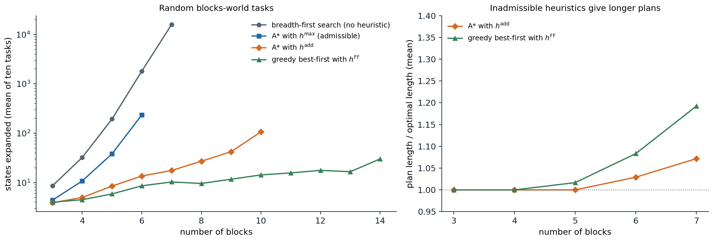

[ML Mastery Notes](../README.md) › [Artificial Intelligence](README.md)

# 7. Automated Planning

[← 6. First-Order Logic and Knowledge Representation](06-first-order-logic-and-knowledge-representation.md) · [8. Bayesian Networks and Markov Networks →](08-bayesian-networks-and-markov-networks.md)

## <a id="classical-planning"></a>Classical planning

### <a id="planning-tasks"></a>Planning tasks

A search agent of chapter 1 needs a problem-specific state representation, successor function, and heuristic. **Automated planning** asks for more generality: a single program that accepts a *description* of any problem in a standard language and finds a plan for it, with heuristics derived automatically from the description. **Classical planning** keeps the assumptions of chapter 1, a fully observable, deterministic, static environment with a single agent, and uses a **factored** representation of states: a state is a set of ground atoms, the facts true in it, and every atom not listed is false (the closed-world assumption of chapter 6).

The classical formalism is **STRIPS** ([Fikes and Nilsson, 1971](https://www.sciencedirect.com/science/article/pii/0004370271900105)). A planning task consists of

- a finite set of atoms, an initial state $`s_0`$ (a set of atoms), and a goal $`G`$, a set of atoms that must all be true at the end;
- a set of actions, each with a set of **preconditions** $`\mathrm{pre}(a)`$, an **add list** $`\mathrm{add}(a)`$, and a **delete list** $`\mathrm{del}(a)`$.

An action is applicable in $`s`$ when $`\mathrm{pre}(a)\subseteq s`$, and applying it produces

$$
\mathrm{Result}(s,a)=\bigl(s\setminus\mathrm{del}(a)\bigr)\cup\mathrm{add}(a).
$$

Everything not mentioned stays as it was, which solves the frame problem of chapter 5 by convention. A **plan** is a sequence of actions, each applicable in the state produced by its predecessors, that ends in a state containing $`G`$. The **Planning Domain Definition Language** (PDDL) writes actions as schemas with variables, such as

```lisp
(:action move
  :parameters (?b ?x ?y)
  :precondition (and (on ?b ?x) (clear ?b) (clear ?y))
  :effect (and (on ?b ?y) (clear ?x) (not (on ?b ?x)) (not (clear ?y))))
```

which a planner **grounds** into STRIPS actions by substituting objects for variables. A domain description (the schemas) is written once and reused for any number of problem instances (objects, initial state, goal). PDDL has grown to include typed objects, conditional effects, numeric fluents, action costs, durative actions, and preferences, and the International Planning Competition has compared planners on it since 1998.

The **blocks world** is the running example: blocks sit on a table or on each other, a block can be moved only if nothing is on it, and it can be moved onto the table or onto another clear block. With $`n`$ blocks there are $`n(n-1)(n-2)`$ moves between blocks and $`2n(n-1)`$ moves to and from the table.

### <a id="the-complexity-of-planning"></a>The complexity of planning

Deciding whether a STRIPS task has a plan, PlanSAT, is PSPACE-complete ([Bylander, 1994](https://www.sciencedirect.com/science/article/pii/0004370294900817)). The state space is exponential in the number of atoms, and plans can be exponentially long: the Towers of Hanoi with $`n`$ disks has a STRIPS encoding of polynomial size, and its shortest solution has $`2^n-1`$ moves. Finding an *optimal* plan is harder than finding *some* plan in many domains: a blocks-world plan is easy to find in at most $`2n`$ moves (put every block on the table, then build the goal towers), but finding a shortest one is NP-hard. Planners therefore distinguish **satisficing** planning, which seeks good plans quickly, from **optimal** planning, which must prove optimality and uses admissible heuristics.

## <a id="state-space-search"></a>State-space search

### <a id="progression"></a>Progression

**Forward search**, or **progression**, applies the search algorithms of chapters 1–2 to the state space: start from $`s_0`$, apply applicable actions, and stop at a state containing the goal. Ground planning tasks often have thousands of applicable actions per state, most of them irrelevant, so forward search depends entirely on good heuristics. It is the basis of the most successful modern planners, because heuristics derived from the task description turned out to be very informative.

### <a id="regression"></a>Regression

**Backward search**, or **regression**, starts from the goal and works toward the initial state through sets of states described by partial conditions. An action $`a`$ is **relevant** to a goal description $`g`$ if it adds some atom of $`g`$ and deletes none, and the regressed goal is

$$
\mathrm{Regress}(g,a)=\bigl(g\setminus\mathrm{add}(a)\bigr)\cup\mathrm{pre}(a):
$$

the conditions that must hold before $`a`$ so that $`g`$ holds after it. The search succeeds when the initial state satisfies the regressed description. Regression considers only relevant actions, which reduces the branching factor, and can be done with action schemas without grounding them all. Its drawback is that the regressed descriptions stand for sets of states, which makes good heuristics harder to design and duplicate detection harder, so most current planners search forward.

## <a id="heuristics-for-planning"></a>Heuristics for planning

### <a id="the-delete-relaxation"></a>The delete relaxation

The central idea of domain-independent planning heuristics, developed in HSP ([Bonet and Geffner, 2001](https://www.sciencedirect.com/science/article/pii/S0004370201001084)), is a relaxed problem in the sense of chapter 2: **ignore the delete lists**. In the relaxed task, atoms once true stay true, so states only grow, applying an action can never hurt, and whether the goal is reachable can be decided in polynomial time by applying every applicable action until nothing changes. The cost $`h^+(s)`$ of an optimal relaxed plan from $`s`$ is an admissible heuristic, since every real plan is also a relaxed plan. Computing $`h^+`$ is itself NP-hard, so practical heuristics approximate it.

### <a id="h-max-and-h-mathrm-add"></a>$`h^{\max}`$ and $`h^{\mathrm{add}}`$

Both approximations estimate a cost for each atom by a fixed-point equation over the relaxed task. With unit action costs, $`\mathrm{cost}(p)=0`$ for atoms true in $`s`$, and otherwise

$$
\mathrm{cost}(p)=\min_{a:\;p\in\mathrm{add}(a)}\Bigl(1+\bigoplus_{q\in\mathrm{pre}(a)}\mathrm{cost}(q)\Bigr),
$$

where $`\bigoplus`$ is either the maximum or the sum. The heuristic value of a state combines the goal atoms the same way.

- $`h^{\max}`$ takes maxima. It assumes that achieving the hardest precondition achieves the others along the way, so it never overestimates $`h^+`$ and is admissible ([Appendix A](#block-ai07-appendix-a)). It is usually far too small to guide the search well.
- $`h^{\mathrm{add}}`$ takes sums. It assumes the preconditions are achieved independently, ignoring positive interactions between subgoals, so it can greatly overestimate and is not admissible, but it is much more informative for satisficing search.

Both are computed by a generalized Bellman–Ford or Dijkstra iteration in time polynomial in the size of the task, and both are exact when the goal is a single atom and the actions have one precondition each.

### <a id="h-mathrm-ff-and-relaxed-plans"></a>$`h^{\mathrm{FF}}`$ and relaxed plans

The FF planner ([Hoffmann and Nebel, 2001](https://doi.org/10.1613/jair.855)) extracts an explicit **relaxed plan**: starting from the goal atoms, it chooses for each needed atom its best achiever, the action attaining the minimum in the equation above, and recursively the achievers of that action's preconditions, collecting the chosen actions. The number of distinct actions collected, $`h^{\mathrm{FF}}`$, counts shared actions once, which corrects $`h^{\mathrm{add}}`$'s double counting, and is usually close to $`h^+`$, though not admissible. The relaxed plan is also useful beyond its length: its first actions are **helpful actions**, and FF considers them first, a form of forward pruning. FF combined $`h^{\mathrm{FF}}`$ with **enforced hill-climbing**, a local search that breaks out of plateaus by breadth-first search for any better state, and dominated the 2000 planning competition.

### <a id="landmarks-and-other-heuristics"></a>Landmarks and other heuristics

A **landmark** is an atom that must be true at some point in every plan, or an action that every plan must contain; the goal atoms are trivial landmarks, and others are found by analyzing the relaxed task. Counting the landmarks not yet achieved gives an informative heuristic: the LAMA planner ([Richter and Westphal, 2010](https://doi.org/10.1613/jair.2972)) combines it with $`h^{\mathrm{FF}}`$ in a greedy search followed by weighted A\* with decreasing weights, the anytime scheme of chapter 2. For optimal planning, the **LM-cut** heuristic computes disjunctive action landmarks, sets of actions one of which every plan must use, by cuts in a graph of the relaxed task, and assigns costs to them without double counting; it is admissible and dominates $`h^{\max}`$. **Abstraction heuristics**, including the pattern databases of chapter 2 computed automatically from the task, and **cost partitioning**, which splits each action's cost among several heuristics so that their sum stays admissible, complete the toolkit of optimal planners.

A small STRIPS planner shows the relaxation heuristics at work:

```python
import heapq
from itertools import permutations

import numpy as np


def blocks_world(blocks):
    """Ground STRIPS actions (name, preconditions, add list, delete list) for moving one clear block at a time."""
    acts = []
    for b, x, y in permutations(blocks, 3):
        acts.append((f"move {b} from {x} to {y}", {("on", b, x), ("clear", b), ("clear", y)},
                     {("on", b, y), ("clear", x)}, {("on", b, x), ("clear", y)}))
    for b, x in permutations(blocks, 2):
        acts.append((f"move {b} from {x} to table", {("on", b, x), ("clear", b)},
                     {("table", b), ("clear", x)}, {("on", b, x)}))
        acts.append((f"move {b} from table to {x}", {("table", b), ("clear", b), ("clear", x)},
                     {("on", b, x)}, {("table", b), ("clear", x)}))
    return acts


def state_of(towers):
    """Atoms of a state given as towers listed bottom to top."""
    s = set()
    for t in towers:
        s |= {("table", t[0]), ("clear", t[-1])} | {("on", a, b) for b, a in zip(t, t[1:])}
    return frozenset(s)


def relaxed_costs(state, acts, combine):
    """Fixed point of cost(p) = min over achievers a of 1 + combine(cost of a's preconditions), ignoring deletes.
    combine=max gives h_max, combine=sum gives h_add. Also records each atom's best achiever."""
    cost, best = {p: 0 for p in state}, {}
    changed = True
    while changed:
        changed = False
        for a in acts:
            if all(p in cost for p in a[1]):
                c = 1 + combine(cost[p] for p in a[1])
                for q in a[2]:
                    if c < cost.get(q, np.inf):
                        cost[q], best[q], changed = c, a, True
    return cost, best


def h_max(state, goal, acts):
    cost, _ = relaxed_costs(state, acts, max)
    return max(cost.get(g, np.inf) for g in goal)


def h_add(state, goal, acts):
    cost, _ = relaxed_costs(state, acts, sum)
    return sum(cost.get(g, np.inf) for g in goal)


def h_ff(state, goal, acts):
    """Size of a relaxed plan extracted backward from the goal through best achievers (under h_add costs)."""
    cost, best = relaxed_costs(state, acts, sum)
    if any(g not in cost for g in goal):
        return np.inf
    plan, todo, seen = set(), [g for g in goal if g not in state], set()
    while todo:
        p = todo.pop()
        if p in seen or p in state:
            continue
        seen.add(p)
        plan.add(best[p][0])
        todo.extend(best[p][1])
    return len(plan)


def search(start, goal, acts, h, w_g=1):
    """Best-first graph search on f = w_g * g + h (w_g = 1: A*, w_g = 0: greedy). Returns plan length and expansions."""
    g, tie, closed = {start: 0}, 0, set()
    frontier = [(h(start, goal, acts), 0, start)]
    while frontier:
        _, _, s = heapq.heappop(frontier)
        if s in closed:
            continue
        closed.add(s)
        if goal <= s:
            return g[s], len(closed)
        for name, pre, add, dele in acts:
            if pre <= s:
                t = (s - dele) | add
                if t not in g or g[s] + 1 < g[t]:
                    g[t] = g[s] + 1
                    tie += 1
                    heapq.heappush(frontier, (w_g * g[t] + h(t, goal, acts), tie, t))


blocks = "ABCDEF"
acts = blocks_world(blocks)
start = state_of(["CAE", "FBD"])                  # two towers, bottom to top
goal = frozenset({("on", "A", "B"), ("on", "B", "C"), ("on", "C", "D"), ("on", "D", "E"), ("on", "E", "F")})
print(f"{len(acts)} ground actions; heuristic values at the start:",
      f"h_max {h_max(start, goal, acts)}, h_add {h_add(start, goal, acts)}, h_FF {h_ff(start, goal, acts)}")
for label, h, w_g in [("breadth-first (h = 0)", lambda s, g, a: 0, 1), ("A* with h_max", h_max, 1),
                      ("A* with h_add", h_add, 1), ("greedy with h_FF", h_ff, 0)]:
    length, expanded = search(start, goal, acts, h, w_g)
    print(f"{label:22s} plan of {length} moves, {expanded} states expanded")
# 180 ground actions; heuristic values at the start: h_max 3, h_add 14, h_FF 8
# breadth-first (h = 0)  plan of 8 moves, 3691 states expanded
# A* with h_max          plan of 8 moves, 829 states expanded
# A* with h_add          plan of 9 moves, 13 states expanded
# greedy with h_FF       plan of 10 moves, 12 states expanded
```

For this task of stacking six blocks from two towers into one, the shortest plan has eight moves. From the start, $`h^{\max}=3`$ badly underestimates it, $`h^{\mathrm{add}}=14`$ overestimates it, and $`h^{\mathrm{FF}}=8`$ happens to be exact. Breadth-first search expands 3,691 states and A\* with $`h^{\max}`$ 829, both finding the optimal plan; A\* with the inadmissible $`h^{\mathrm{add}}`$ expands 13 states and finds a nine-move plan, and greedy best-first search with $`h^{\mathrm{FF}}`$ expands 12 and finds a ten-move plan.



*Left: states expanded on ten random blocks-world tasks for each number of blocks, with random initial towers and random goal towers. Breadth-first search expands 194 states on average for five blocks and 15,936 for seven; A\* with the admissible $`h^{\max}`$ reduces the 1,813 states of breadth-first search on six blocks to 235, but each of its expansions costs a heuristic computation. A\* with $`h^{\mathrm{add}}`$ expands 107 states for ten blocks, and greedy best-first search with $`h^{\mathrm{FF}}`$ only 30 for fourteen. Right: the length of the plans found with the inadmissible heuristics, relative to the optimal length computed by breadth-first search. Both are optimal on the smallest tasks; for seven blocks, A\* with $`h^{\mathrm{add}}`$ finds plans 7% longer than optimal on average, and greedy search with $`h^{\mathrm{FF}}`$ 19% longer.*

## <a id="planning-as-satisfiability"></a>Planning as satisfiability

A plan of a fixed length $`T`$ can also be found by logical inference, as chapter 5 anticipated. **SATPlan** ([Kautz and Selman, 1996](https://aaai.org/papers/177-aaai96-177-pushing-the-envelope-planning-propositional-logic-and-stochastic-search/)) introduces a propositional variable $`p^t`$ for each atom $`p`$ and time step $`t=0,\dots,T`$, and $`a^t`$ for each action and step $`t<T`$, and writes clauses for

- the **initial state**: $`p^0`$ for atoms in $`s_0`$ and $`\neg p^0`$ for the others;
- the **goal**: $`g^T`$ for each goal atom;
- **preconditions and effects**: $`a^t\Rightarrow p^t`$ for each precondition, $`a^t\Rightarrow q^{t+1}`$ for each added atom, and $`a^t\Rightarrow\neg q^{t+1}`$ for each deleted one;
- **explanatory frame axioms**: an atom changes only if some action changes it, $`p^t\wedge\neg p^{t+1}\Rightarrow\bigvee_{a:\,p\in\mathrm{del}(a)}a^t`$, and similarly for atoms that become true;
- **exclusion**: at most one action per step, or, in the parallel encodings used in practice, no two actions at the same step that interfere, which allows shorter horizons.

A model of these clauses is a plan: the actions whose variables are true. The planner tries $`T=0,1,2,\dots`$ until the formula becomes satisfiable, so with one action per step the first plan found is a shortest one. The **Sussman anomaly**, a three-block task whose two goals cannot be achieved one after the other without undoing the first, is a classic test:

```python
from collections import Counter
from itertools import combinations, permutations


def blocks_world(blocks):
    acts = []
    for b, x, y in permutations(blocks, 3):
        acts.append((f"move({b},{x},{y})", {("on", b, x), ("clear", b), ("clear", y)},
                     {("on", b, y), ("clear", x)}, {("on", b, x), ("clear", y)}))
    for b, x in permutations(blocks, 2):
        acts.append((f"move({b},{x},table)", {("on", b, x), ("clear", b)}, {("table", b), ("clear", x)}, {("on", b, x)}))
        acts.append((f"move({b},table,{x})", {("table", b), ("clear", b), ("clear", x)}, {("on", b, x)},
                     {("table", b), ("clear", x)}))
    return acts


def dpll(clauses):
    """DPLL with unit propagation (chapter 5). Returns (set of true literals or None, decisions)."""
    decisions = 0

    def assign(cls, lit):
        out = []
        for c in cls:
            if lit in c:
                continue
            c = [x for x in c if x != -lit]
            if not c:
                return None
            out.append(c)
        return out

    def rec(cls, model):
        nonlocal decisions
        while True:
            unit = next((c[0] for c in cls if len(c) == 1), None)
            if unit is None:
                break
            cls, model = assign(cls, unit), model | {unit}
            if cls is None:
                return None
        if not cls:
            return model
        k = min(len(c) for c in cls)
        counts = Counter(x for c in cls if len(c) == k for x in c)
        lit = max(counts, key=lambda x: (counts[x] + counts.get(-x, 0), counts[x], -abs(x)))
        decisions += 1
        for choice in (lit, -lit):
            nxt = assign(cls, choice)
            if nxt is not None:
                found = rec(nxt, model | {choice})
                if found is not None:
                    return found
        return None

    return rec([list(c) for c in clauses], frozenset()), decisions


def satplan(init, goal, acts, T):
    """Propositional encoding of 'a plan of at most T steps exists' (at most one action per step)."""
    atoms = sorted({p for a in acts for part in a[1:] for p in part} | set(init))
    var = {}
    v = lambda *key: var.setdefault(key, len(var) + 1)
    cls = [[v(p, 0) if p in init else -v(p, 0)] for p in atoms]              # the initial state
    cls += [[v(g, T)] for g in goal]                                           # the goal
    for t in range(T):
        for name, pre, add, dele in acts:
            a = v(name, t)
            cls += [[-a, v(p, t)] for p in pre]                                # preconditions
            cls += [[-a, v(q, t + 1)] for q in add]                            # effects
            cls += [[-a, -v(q, t + 1)] for q in dele - add]
        for p in atoms:                                                        # explanatory frame axioms
            cls.append([-v(p, t), v(p, t + 1)] + [v(a[0], t) for a in acts if p in a[3]])
            cls.append([v(p, t), -v(p, t + 1)] + [v(a[0], t) for a in acts if p in a[2]])
        cls += [[-v(a[0], t), -v(b[0], t)] for a, b in combinations(acts, 2)]  # at most one action per step
    return cls, var


acts = blocks_world("ABC")
init = {("on", "C", "A"), ("table", "A"), ("table", "B"), ("clear", "B"), ("clear", "C")}   # the Sussman anomaly
goal = {("on", "A", "B"), ("on", "B", "C")}
for T in range(1, 5):
    clauses, var = satplan(init, goal, acts, T)
    model, decisions = dpll(clauses)
    print(f"T={T}: {len(var)} variables, {len(clauses)} clauses:", "satisfiable" if model else "unsatisfiable",
          f"({decisions} decisions)")
    if model:
        plan = [a[0] for t in range(T) for a in acts if var[(a[0], t)] in model]
        print("  plan:", ", ".join(plan))
        break
# T=1: 42 variables, 299 clauses: unsatisfiable (0 decisions)
# T=2: 72 variables, 584 clauses: unsatisfiable (0 decisions)
# T=3: 102 variables, 869 clauses: satisfiable (16 decisions)
#   plan: move(C,A,table), move(B,table,C), move(A,table,B)
```

For one and two steps, unit propagation alone proves the formula unsatisfiable, without any branching; with three steps the solver finds a plan after 16 decisions: put C on the table, B on C, and A on B. Planning as satisfiability inherits all the progress of SAT solvers (chapter 5) and is strong on tasks that need long chains of reasoning within a short parallel horizon. Its weakness is size: the encoding grows with the number of ground actions times the horizon, and plans that need many steps require large formulas. **Graphplan** ([Blum and Furst, 1997](https://www.sciencedirect.com/science/article/pii/S0004370296000471)), which builds a layered **planning graph** of atoms and actions reachable at each level together with mutual-exclusion relations, is a related method; the planning graph also yields the relaxation heuristics above, since ignoring the mutexes gives exactly the delete relaxation.

## <a id="other-planning-paradigms"></a>Other planning paradigms

### <a id="partial-order-planning"></a>Partial-order planning

State-space planners produce totally ordered sequences. A **partial-order planner** searches in the space of partial plans: sets of actions with ordering constraints between some pairs and **causal links** $`a\xrightarrow{p}b`$ recording that $`a`$ achieves precondition $`p`$ of $`b`$. It refines a plan by adding an action for an open precondition or resolving a **threat**, an action that could delete $`p`$ between $`a`$ and $`b`$, by ordering it before $`a`$ or after $`b`$. This **least-commitment** strategy orders actions only when it must, and it handles the Sussman anomaly naturally, where planners that achieve one subgoal at a time fail. Partial-order planning dominated the field in the 1990s; after heuristic state-space search overtook it in speed, it remained valuable where plans must be explained or executed flexibly, and its ideas persist in temporal planning and plan repair.

### <a id="hierarchical-task-networks"></a>Hierarchical task networks

Human planners think in abstract steps: "go to the conference" before "book the flight". **Hierarchical task network** (HTN) planning gives the planner a library of **methods**, each refining an abstract task into a network of subtasks, down to **primitive** actions that can be executed. The planner searches over refinements of the top-level task, using domain knowledge about how tasks are accomplished, which prunes enormous numbers of meaningless action sequences. HTN planners such as SHOP2 ([Nau et al., 2003](https://doi.org/10.1613/jair.1141)) are widely used in practice, in games, logistics, and robotics, because the methods encode expert knowledge and keep plans understandable; the price is that the planner can find only plans that the methods allow.

### <a id="planning-and-acting-in-the-real-world"></a>Planning and acting in the real world

Real tasks break classical assumptions in several ways, each with its own extensions:

- **Time and resources.** Temporal planning schedules durative actions that overlap, under deadlines and resource limits, which merges planning with the scheduling problems of chapter 3.
- **Nondeterminism and partial observability.** **Conformant** planning finds plans that work without any observation, by searching over belief states; **contingent** planning builds plans with branches on observations. When outcomes have probabilities and rewards, the problem becomes a Markov decision process, solved by the dynamic programming and reinforcement learning of the RL module.
- **Execution monitoring and replanning.** An agent executing a plan checks whether the preconditions of the remaining steps still hold and replans from the current state when they do not. Replanning is often cheaper than planning for every contingency in advance.
- **Unknown models.** When the action descriptions are not given, they can be learned from observed transitions, or planning can proceed with a learned model, as in the model-based methods of RL.

Large language models add a new ingredient. Asked directly for plans in PDDL domains, they produce plausible-looking plans that are frequently invalid, and they degrade quickly when the domain's names are obfuscated ([Valmeekam et al., 2023](https://arxiv.org/abs/2305.15771)). Paired with a planner or a plan validator, they are more useful: they can translate natural-language requests into PDDL, propose candidate plans or heuristics that a sound system then checks, and supply commonsense knowledge that a formal model omits.

## <a id="appendices"></a>Appendices


<details>
<summary><a id="block-ai07-appendix-a"></a><b>A. Properties of the relaxation heuristics</b></summary>


**Relaxed reachability is polynomial.** In the delete-relaxed task, applying an action only adds atoms. Starting from $`s`$, apply all applicable actions in parallel, repeatedly; each round either adds an atom or changes nothing, so after at most as many rounds as there are atoms the set of reachable atoms is fixed. The goal is relaxed-reachable if and only if it is contained in that set, and if it is not, no real plan exists either, so $`h^+(s)=\infty`$ correctly detects dead ends.

**$`h^{\max}\le h^+`$.** Take an optimal relaxed plan $`a_1,\dots,a_k`$ from $`s`$, $`k=h^+(s)`$. Show by induction on $`i`$ that every atom $`p`$ added by $`a_1,\dots,a_i`$ and not already in $`s`$ has $`\mathrm{cost}_{\max}(p)\le i`$: the preconditions of $`a_i`$ are in $`s`$ or added by earlier actions, so they have cost at most $`i-1`$, and $`a_i`$ is an achiever of $`p`$ with $`1+\max_q\mathrm{cost}(q)\le i`$. Every goal atom is in $`s`$ or added by the plan, so $`h^{\max}(s)=\max_g\mathrm{cost}(g)\le k`$. Since $`h^+\le h^*`$, $`h^{\max}`$ is admissible. It is also consistent: an action changes the fixed point by at most one level, which gives $`h^{\max}(s)\le1+h^{\max}(\mathrm{Result}(s,a))`$ with unit costs.

**$`h^{\mathrm{add}}`$ can overestimate.** If the goal is $`\{p_1,\dots,p_k\}`$ and one action achieves all of them, then $`h^+=1`$ but $`h^{\mathrm{add}}=k`$. The overestimate comes from counting shared subplans once per subgoal, which the relaxed-plan extraction of $`h^{\mathrm{FF}}`$ avoids by collecting a set of actions. $`h^{\mathrm{FF}}\ge h^+`$ always holds, since it counts the actions of a valid relaxed plan, and the inequality can be strict when the best achievers do not form an optimal relaxed plan.

</details>


<details>
<summary><a id="block-ai07-appendix-b"></a><b>B. Regression is sound and complete</b></summary>


Let $`g`$ be a set of atoms describing the states that contain it. For an action $`a`$ with $`\mathrm{add}(a)\cap g\neq\emptyset`$ and $`\mathrm{del}(a)\cap g=\emptyset`$, the regression $`g'=(g\setminus\mathrm{add}(a))\cup\mathrm{pre}(a)`$ satisfies, for every state $`s`$:

$$
g'\subseteq s\quad\Longrightarrow\quad a\text{ is applicable in }s\text{ and }g\subseteq\mathrm{Result}(s,a).
$$

Indeed $`\mathrm{pre}(a)\subseteq g'\subseteq s`$, and every atom of $`g`$ is either added by $`a`$ or in $`g\setminus\mathrm{add}(a)\subseteq s`$ and not deleted, since $`a`$ deletes nothing in $`g`$. Conversely, if $`a`$ is applicable in $`s`$ and $`g\subseteq\mathrm{Result}(s,a)`$, then $`g'\subseteq s`$ whenever $`a`$ deletes nothing in $`g`$: preconditions hold in $`s`$, and an atom of $`g`$ that $`a`$ does not add must already be in $`s`$. So $`g'`$ describes exactly the states from which $`a`$ leads into $`g`$ (up to actions that add and delete the same atom). By induction on plan length, backward search from $`G`$ finds a description satisfied by $`s_0`$ if and only if a plan exists, and the actions along the path, read in reverse order of discovery, form the plan. Relevance, requiring $`a`$ to add some atom of $`g`$, loses no plans that are minimal, since an action contributing nothing to $`g`$ can be removed from the end of a plan.

</details>

---

[← 6. First-Order Logic and Knowledge Representation](06-first-order-logic-and-knowledge-representation.md) · [8. Bayesian Networks and Markov Networks →](08-bayesian-networks-and-markov-networks.md)
