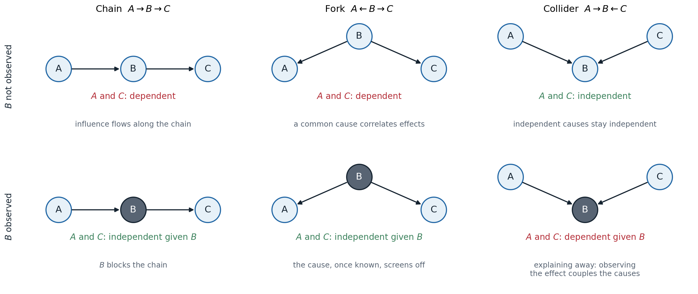
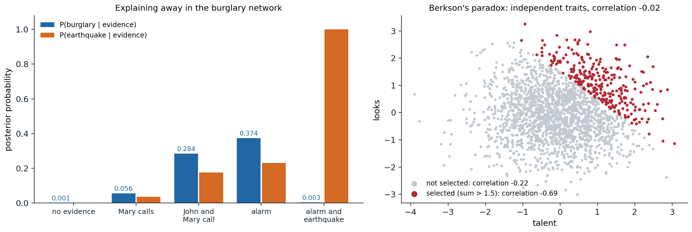

[ML Mastery Notes](../README.md) › [Artificial Intelligence](README.md)

# 8. Bayesian Networks and Markov Networks

[← 7. Automated Planning](07-automated-planning.md) · [9. Exact Inference →](09-exact-inference.md)

## <a id="representing-uncertainty"></a>Representing uncertainty

### <a id="degrees-of-belief"></a>Degrees of belief

Logical agents, chapters 5 and 6, represent what is known as true or false. Real agents are rarely in that position. A diagnostic rule such as "a toothache implies a cavity" is wrong in both directions: toothaches have other causes, and most cavities cause no pain. Listing every exception is impossible (**laziness**), the complete theory is unknown (**theoretical ignorance**), and even a complete theory could not be applied without tests that were never run (**practical ignorance**). An agent in such a domain can still act rationally if it holds **degrees of belief**, and probability theory is the calculus of degrees of belief: the probability of an event given the evidence summarizes the uncertainty from all these sources. Combined with utilities, it yields the decision theory of chapter 12.

The probabilistic vocabulary is that of Foundations chapter 4: random variables, joint and conditional distributions, the product rule, marginalization, and Bayes' rule. A **possible world** assigns a value to every variable, and a **full joint distribution** gives the probability of every world; any query, $P(X\mid e)$ for a query variable $X$ and evidence $e$, follows by summing the joint over the worlds consistent with $e$ and normalizing:

$$
P(X\mid e)=\alpha\,P(X,e)=\alpha\sum_yP(X,e,y),
$$

where $y$ ranges over the values of the remaining **hidden** variables and $\alpha$ is the normalizing constant. This **inference by enumeration** is correct and useless at scale: $n$ Boolean variables need a table of $2^n-1$ numbers, too large to store, to estimate, or to sum.

### <a id="independence-and-conditional-independence"></a>Independence and conditional independence

Structure is what makes probabilistic reasoning possible. Two variables are **independent** if $P(X,Y)=P(X)P(Y)$, and independent subsets of variables factor the joint into smaller tables. Full independence is rare; **conditional independence** is common. $X$ and $Y$ are conditionally independent given $Z$, written $X\perp Y\mid Z$, if

$$
P(X,Y\mid Z)=P(X\mid Z)\,P(Y\mid Z),\qquad\text{equivalently}\qquad P(X\mid Y,Z)=P(X\mid Z).
$$

A toothache and a probe catching in a tooth are dependent, since both indicate a cavity, but once the presence of a cavity is known, neither tells anything more about the other. When a single cause has many conditionally independent effects, the joint factors as $P(\mathit{Cause})\prod_iP(\mathit{Effect}_i\mid\mathit{Cause})$, which needs a number of parameters linear in the number of effects: the naive Bayes model of ML chapter 4. Graphical models generalize this to arbitrary patterns of conditional independence, and make the patterns visible in a graph.

## <a id="bayesian-networks"></a>Bayesian networks

### <a id="syntax-and-semantics"></a>Syntax and semantics

A **Bayesian network** is a directed acyclic graph with one node per random variable and, for each node $X_i$, a **conditional probability distribution** $P(X_i\mid\mathrm{Parents}(X_i))$, a **conditional probability table** (CPT) for discrete variables. The network represents the joint distribution

$$
P(x_1,\dots,x_n)=\prod_{i=1}^nP\bigl(x_i\mid\mathrm{parents}(X_i)\bigr).
$$

The product is a valid distribution for any choice of CPTs, and it agrees with the chain rule $P(x_1,\dots,x_n)=\prod_iP(x_i\mid x_1,\dots,x_{i-1})$ written in a topological order, exactly when each variable is conditionally independent of its other predecessors given its parents. That is the meaning of the missing arcs.

The classic example is a burglar alarm ([Pearl, 1988](https://www.sciencedirect.com/book/monograph/9780080514895/probabilistic-reasoning-in-intelligent-systems)) that can be set off by a burglary ($B$) or an earthquake ($E$); two neighbors, John ($J$) and Mary ($M$), call when they hear it, John reliably but sometimes confusing the telephone for the alarm, Mary less reliably because she listens to loud music. The network has arcs $B\to A$, $E\to A$, $A\to J$, $A\to M$. Each neighbor's call depends only on the alarm, not directly on a burglary; this is an approximation, and it is what makes the model compact.

```python
from itertools import product

# The burglary network: each node's parents and P(node = true | parents), indexed by the parents' values.
parents = {"B": [], "E": [], "A": ["B", "E"], "J": ["A"], "M": ["A"]}
cpt = {"B": {(): 0.001}, "E": {(): 0.002},
       "A": {(True, True): 0.95, (True, False): 0.94, (False, True): 0.29, (False, False): 0.001},
       "J": {(True,): 0.90, (False,): 0.05},
       "M": {(True,): 0.70, (False,): 0.01}}
order = ["B", "E", "A", "J", "M"]


def joint(x):
    """P(x) as the product of each variable's conditional probability given its parents."""
    p = 1.0
    for v in order:
        pt = cpt[v][tuple(x[u] for u in parents[v])]
        p *= pt if x[v] else 1 - pt
    return p


def query(var, evidence):
    """P(var = true | evidence) by summing the joint over all assignments consistent with the evidence."""
    num = den = 0.0
    for vals in product([True, False], repeat=len(order)):
        x = dict(zip(order, vals))
        if all(x[k] == v for k, v in evidence.items()):
            p = joint(x)
            den += p
            num += p if x[var] else 0.0
    return num / den


total = sum(joint(dict(zip(order, v))) for v in product([True, False], repeat=5))
print(f"the 32 joint probabilities sum to {total:.6f}")
print(f"parameters: network {sum(len(t) for t in cpt.values())}, full joint table {2 ** len(order) - 1}")
cases = [({}, "no evidence"), ({"J": True, "M": True}, "John and Mary call"),
         ({"A": True}, "the alarm sounds"), ({"A": True, "E": True}, "the alarm sounds and there was an earthquake")]
for ev, text in cases:
    print(f"P(burglary | {text}) = {query('B', ev):.4f}")
print(f"P(earthquake | alarm) = {query('E', {'A': True}):.4f}")
# the 32 joint probabilities sum to 1.000000
# parameters: network 10, full joint table 31
# P(burglary | no evidence) = 0.0010
# P(burglary | John and Mary call) = 0.2842
# P(burglary | the alarm sounds) = 0.3736
# P(burglary | the alarm sounds and there was an earthquake) = 0.0033
# P(earthquake | alarm) = 0.2310
```

Ten numbers specify all 32 joint probabilities. If both neighbors call, the probability of a burglary rises from one in a thousand to 28%: most alarms are false, and each neighbor also calls without an alarm now and then. The last two lines show a pattern with no analogue in logic: learning that an earthquake occurred, which raises nothing about burglaries by itself, lowers the probability of a burglary given the alarm from 37% to 0.3%, because the earthquake already explains the alarm.

### <a id="compactness"></a>Compactness

In general, a network of $n$ Boolean variables, each with at most $k$ parents, needs at most $n\,2^k$ numbers instead of $2^n-1$: for 30 variables with five parents each, 960 instead of about a billion. The saving depends on building the network in a good order. Adding variables in **causal order**, causes before effects, usually gives the sparsest networks, because causes are often independent of each other and effects depend on few causes. Adding them in diagnostic order, symptoms first, forces arcs between symptoms that share causes and makes the network larger and the probabilities harder to assess: for the burglary network, the order $M,J,A,B,E$ needs 13 numbers, and $M,J,E,B,A$ needs 31, as many as the full joint.

### <a id="local-structure"></a>Local structure

Even with few parents, a CPT grows exponentially in their number, and several **canonical distributions** avoid tabulating it:

- **Deterministic nodes** have values that are functions of their parents, such as logical OR or a sum.
- **Noisy-OR** models a cause that produces an effect unless an independent inhibitor intervenes: each true parent $U_j$ fails to cause $X$ with probability $q_j$, independently, so $P(X=\text{false}\mid u)=\prod_{j:\,u_j\text{ true}}q_j$, with $k$ parameters instead of $2^k$, plus a **leak** probability for causes not modeled. Medical diagnosis networks with hundreds of diseases and thousands of findings rely on it.
- **Context-specific independence**: a variable may depend on a parent only for some values of another parent, which a tree or rule structure represents compactly.
- **Continuous variables** use parametric families. In a **linear Gaussian** model, $X\mid u\sim\mathcal N(w^\top u+b,\sigma^2)$; a network of such nodes represents a multivariate Gaussian, whose conditioning rules are those of Foundations chapter 4. Discrete children of continuous parents use logistic or probit links.

## <a id="conditional-independence-in-bayesian-networks"></a>Conditional independence in Bayesian networks

### <a id="the-local-markov-property"></a>The local Markov property

The factorization implies, and is equivalent to, the **local Markov property**: each variable is conditionally independent of its non-descendants given its parents. A second local statement is often more useful: each variable is conditionally independent of all other variables given its **Markov blanket**, its parents, its children, and its children's other parents. The Markov blanket is what a Gibbs sampler must look at to resample a variable (chapter 10).

Which other independences hold? Three structures on three variables decide the matter.



*The three ways two variables can be connected through a third. In a chain and a fork, $A$ and $C$ are dependent, and observing $B$ (shaded) makes them independent. In a collider, $A$ and $C$ are independent, and observing $B$, or any descendant of $B$, makes them dependent.*

- **Chain** $A\to B\to C$: $A$ influences $C$ through $B$. Knowing $B$ blocks the influence: $A\perp C\mid B$.
- **Fork** $A\leftarrow B\to C$: a common cause makes its effects correlated, and knowing the cause screens them off: $A\perp C\mid B$.
- **Collider**, or **v-structure**, $A\to B\leftarrow C$: two independent causes of a common effect are independent, $A\perp C$, but observing the effect makes them dependent. Evidence for one cause makes the other less necessary, which is **explaining away**, and the same happens when a descendant of $B$ is observed.



*Left: posterior probabilities in the burglary network. A burglary and an earthquake are independent a priori; both become more probable when the neighbors call or the alarm sounds, and when the earthquake is then observed, the probability of a burglary drops from 0.374 back to 0.003. Right: Berkson's paradox, the same collider effect in data. Talent and looks are independent standard normal variables, with correlation $-0.02$ among 2,000 people; among the 272 selected because their sum exceeds 1.5, as for admission to a school that requires one or the other, the correlation is $-0.69$.*

Collider bias is a common trap in data analysis: conditioning on a variable caused by both the treatment and the outcome, or selecting a sample by such a variable, creates associations that do not exist in the population. Chapter 13 returns to it.

### <a id="d-separation"></a>d-separation

The three cases combine into a graphical criterion. A path between $X$ and $Y$, ignoring the directions of the arcs, is **blocked** by a set $Z$ of observed variables if it contains

- a chain $\to M\to$ or a fork $\leftarrow M\to$ whose middle node $M$ is in $Z$, or
- a collider $\to M\leftarrow$ such that neither $M$ nor any of its descendants is in $Z$.

$X$ and $Y$ are **d-separated** by $Z$ if every path between them is blocked. The theorem that makes the criterion useful ([Geiger, Verma, and Pearl, 1990](https://doi.org/10.1002/net.3230200504)) has two parts:

- **soundness:** if $X$ and $Y$ are d-separated by $Z$, then $X\perp Y\mid Z$ in *every* distribution that factorizes according to the graph;
- **completeness:** if they are not d-separated, then some distribution that factorizes according to the graph has $X$ and $Y$ dependent given $Z$; in fact, all but a measure-zero set of parameter values do.

d-separation can be tested in linear time, for instance by a search over paths that tracks the direction in which each node is entered. An equivalent test ([Lauritzen et al., 1990](https://doi.org/10.1002/net.3230200503)) takes the subgraph of $X$, $Y$, $Z$, and their ancestors, **moralizes** it by connecting all pairs of parents with a common child and dropping directions, deletes $Z$, and checks whether $X$ and $Y$ are still connected. The following code implements that test and compares it with numerical independence in a distribution with random CPTs:

```python
from itertools import combinations

import numpy as np

# The "Asia" network: visit to Asia, smoking, tuberculosis, lung cancer, bronchitis, either disease, X-ray, dyspnea.
parents = {"A": [], "S": [], "T": ["A"], "L": ["S"], "B": ["S"], "E": ["T", "L"], "X": ["E"], "D": ["E", "B"]}
nodes = list(parents)


def d_separated(x, y, z):
    """x and y are d-separated by z iff they are disconnected in the moralized graph of the ancestors of
    {x, y} and z, after deleting z (the criterion of Lauritzen et al.)."""
    anc, stack = set(), [x, y, *z]
    while stack:
        v = stack.pop()
        if v not in anc:
            anc.add(v)
            stack.extend(parents[v])
    nbr = {v: set() for v in anc}
    for v in anc:
        ps = parents[v]
        for p in ps:
            nbr[v].add(p)
            nbr[p].add(v)
        for p, q in combinations(ps, 2):          # marry the parents of a common child
            nbr[p].add(q)
            nbr[q].add(p)
    seen, stack = {x}, [x]
    while stack:
        for w in nbr[stack.pop()] - set(z) - seen:
            seen.add(w)
            stack.append(w)
    return y not in seen


# A joint distribution with random conditional probability tables, as an array with one axis per node.
rng = np.random.default_rng(0)
joint = np.ones([2] * len(nodes))
for i, v in enumerate(nodes):
    p_true = rng.uniform(0.05, 0.95, size=[2] * len(parents[v]))
    table = np.stack([1 - p_true, p_true], axis=-1)        # axes: parents..., v
    axes = [nodes.index(u) for u in parents[v]] + [i]
    shape = [2 if k in axes else 1 for k in range(len(nodes))]
    joint = joint * np.moveaxis(table, range(len(axes)), np.argsort(np.argsort(axes))).reshape(shape)


def independent(x, y, z):
    """Numerically check x independent of y given z: P(x, y, z) P(z) = P(x, z) P(y, z) everywhere."""
    keep = [nodes.index(v) for v in (x, y, *z)]
    p = joint.sum(axis=tuple(k for k in range(len(nodes)) if k not in keep))
    p = np.moveaxis(p, np.argsort(np.argsort(keep)), range(len(keep)))    # axes in the order x, y, z...
    pz = p.sum(axis=(0, 1), keepdims=True)
    return np.abs(p * pz - p.sum(1, keepdims=True) * p.sum(0, keepdims=True)).max() < 1e-12


total = sep = agree = 0
for x, y in combinations(nodes, 2):
    rest = [v for v in nodes if v not in (x, y)]
    for k in range(3):
        for z in combinations(rest, k):
            total += 1
            ds = d_separated(x, y, z)
            sep += ds
            agree += ds == independent(x, y, z)
print(f"{total} queries with up to two conditioning variables; {sep} d-separated;"
      f" d-separation agrees with the numerical test in {agree}")
for x, y, z in [("T", "L", ()), ("T", "L", ("E",)), ("T", "L", ("X",)), ("A", "D", ("E",)), ("L", "B", ("S",)),
                ("L", "B", ("S", "D"))]:
    given = ", ".join(z) if z else "nothing"
    print(f"  {x} and {y} given {given}: {'d-separated' if d_separated(x, y, z) else 'connected'}")
# 616 queries with up to two conditioning variables; 156 d-separated; d-separation agrees with the numerical test in 616
#   T and L given nothing: d-separated
#   T and L given E: connected
#   T and L given X: connected
#   A and D given E: connected
#   L and B given S: d-separated
#   L and B given S, D: connected
```

In the eight-variable Asia network ([Lauritzen and Spiegelhalter, 1988](https://doi.org/10.1111/j.2517-6161.1988.tb01721.x)), d-separation and the numerical test agree on all 616 queries with at most two conditioning variables: soundness guarantees independence in the 156 d-separated cases, and the random CPTs make every other case dependent, as completeness predicts for generic parameters. Tuberculosis and lung cancer are independent a priori but become dependent given the "either" node or its descendant, the X-ray; a visit to Asia is connected to dyspnea even given "either", through the path $A\to T\to E\leftarrow L\leftarrow S\to B\to D$, which the observed collider $E$ opens.

### <a id="i-maps-and-i-equivalence"></a>I-maps and I-equivalence

A graph is an **I-map** of a distribution if every independence it implies holds in the distribution. The complete graph is a trivial I-map of everything, and the useful graphs are **minimal** I-maps, from which no arc can be removed. A distribution whose independences are exactly those of the graph is **faithful** to it, and the graph is then a **perfect map**. Not every distribution has one: some independence patterns, such as those of four variables on a cycle, cannot be represented by any directed graph.

Different graphs can imply the same independences. $A\to B\to C$, $A\leftarrow B\leftarrow C$, and $A\leftarrow B\to C$ all say exactly $A\perp C\mid B$, while $A\to B\leftarrow C$ says $A\perp C$ instead. Two DAGs are **I-equivalent** if and only if they have the same skeleton (the undirected graph) and the same v-structures ([Verma and Pearl, 1990](https://arxiv.org/abs/1304.1108)). Data about the observed variables alone can therefore determine a network only up to its equivalence class, which limits what arrows can mean: learning the direction of an arc from observational data is possible only when it is part of a v-structure, or forced by the others. Chapter 13 makes the causal reading of arrows precise, and chapter 14 learns structures from data.

## <a id="markov-networks"></a>Markov networks

### <a id="potentials-and-the-gibbs-distribution"></a>Potentials and the Gibbs distribution

Some dependencies have no natural direction: neighboring pixels of an image, adjacent spins in a magnet, friends in a social network who influence each other. A **Markov network**, or **Markov random field**, is an undirected graph together with nonnegative **potential functions** (factors) $\psi_c$ on its cliques, and it represents the **Gibbs distribution**

$$
P(x)=\frac1Z\prod_c\psi_c(x_c),\qquad Z=\sum_x\prod_c\psi_c(x_c).
$$

The potentials are not probabilities; they express compatibilities, and the **partition function** $Z$ normalizes their product. Computing $Z$ is the central difficulty of undirected models: it sums over exponentially many configurations, and without it the probability of any single configuration is unknown. Writing $\psi_c=\exp(-E_c)$ gives the energy form $P(x)\propto\exp\bigl(-\sum_cE_c(x_c)\bigr)$ of statistical physics. The **Ising model** on a grid, with spins $x_i\in\{-1,+1\}$ and

$$
P(x)\propto\exp\Bigl(J\sum_{(i,j)\in\text{edges}}x_ix_j+\sum_ih_ix_i\Bigr),
$$

is the prototype: with $J>0$ neighbors prefer to agree, which makes it a model of smooth images for denoising and segmentation. The Boltzmann machines of early neural-network research are Markov networks of this form.

### <a id="independence-in-undirected-graphs"></a>Independence in undirected graphs

Separation in undirected graphs is simpler than d-separation: $X\perp Y\mid Z$ is implied whenever every path from $X$ to $Y$ passes through $Z$. The **global Markov property** states this; the **local** property says a node is independent of all others given its neighbors, its Markov blanket; and the **pairwise** property says two non-adjacent nodes are independent given all others. For positive distributions, all three are equivalent to factorization over the cliques, by the **Hammersley–Clifford theorem** ([Appendix B](#block-ai08-appendix-b)). Without positivity, the Markov properties can hold without the factorization.

### <a id="factor-graphs"></a>Factor graphs

A **factor graph** is a bipartite graph with a node for each variable and a node for each factor, and an edge between a factor and each variable in its scope. It describes a product of factors, $\prod_a f_a(x_a)$, without committing to directed or undirected semantics: a Bayesian network gives one factor per CPT, a Markov network one per potential, and the constraint networks of chapter 3 one 0/1 factor per constraint. Factor graphs are also finer grained than undirected graphs: three pairwise factors on $A,B,C$ and one factor on all three have the same undirected graph, a triangle, but different factor graphs, and different costs for inference. The message-passing algorithms of chapter 9 and chapter 10 are defined on factor graphs.

### <a id="converting-between-representations"></a>Converting between representations

A Bayesian network converts to a Markov network by **moralization**: connect the parents of each node and drop the directions. Each CPT then lives on a clique and becomes a potential, with $Z=1$. The conversion loses the independences expressed by v-structures: $A\to C\leftarrow B$ becomes a triangle, which no longer says $A\perp B$. Conversely, a Markov network converts to a Bayesian network only after **triangulation**, adding edges until every cycle of length four or more has a chord; only **chordal** graphs have directed perfect maps without v-structures. Each representation can express independences that the other cannot, and both are special cases of the factor product; chain graphs and other mixed forms combine them.

### <a id="log-linear-models"></a>Log-linear models

Writing each potential as the exponential of a weighted sum of features gives a **log-linear model**:

$$
P(x)=\frac1{Z(w)}\exp\Bigl(\sum_kw_kf_k(x_{c_k})\Bigr),
$$

an exponential family whose sufficient statistics are the features. Features can be much sparser than full potential tables, such as an indicator that two neighboring words are both capitalized. Conditioning a log-linear model on observed inputs $x$ gives a **conditional random field** (CRF), $P(y\mid x)\propto\exp\bigl(\sum_kw_kf_k(y,x)\bigr)$, which models the dependencies among outputs, such as the tags of a sentence, without modeling the inputs, the discriminative counterpart of a hidden Markov model (chapter 11). Learning log-linear models and CRFs is the subject of chapter 14.

## <a id="appendices"></a>Appendices


<details>
<summary><a id="block-ai08-appendix-a"></a><b>A. Soundness of d-separation for a chain, a fork, and a collider</b></summary>


The full proof shows that d-separation in a DAG implies the conditional independence for every distribution that factorizes over it, by induction on the number of nodes (removing a leaf that is not in $\{X,Y\}\cup Z$ does not change the marginal of the rest). The three base cases show where each rule comes from. Each uses only the factorization.

**Chain** $A\to B\to C$: $P(a,b,c)=P(a)P(b\mid a)P(c\mid b)$, so

$$
P(a,c\mid b)=\frac{P(a)P(b\mid a)}{P(b)}\,P(c\mid b)=P(a\mid b)\,P(c\mid b).
$$

**Fork** $A\leftarrow B\to C$: $P(a,b,c)=P(b)P(a\mid b)P(c\mid b)$, and dividing by $P(b)$ gives $P(a,c\mid b)=P(a\mid b)P(c\mid b)$.

**Collider** $A\to B\leftarrow C$: $P(a,b,c)=P(a)P(c)P(b\mid a,c)$, so summing over $b$ gives $P(a,c)=P(a)P(c)$, independence without evidence. Given $b$, $P(a,c\mid b)\propto P(a)P(c)P(b\mid a,c)$, which factors into a function of $a$ times a function of $c$ only when $P(b\mid a,c)$ does, which fails for a generic CPT: for an OR gate with $B$ observed true, learning that $A$ is false forces $C$ to be true.

The ancestral-moral test of the code is equivalent to d-separation: the variables outside the ancestral set of $\{X,Y\}\cup Z$ sum out of the factorization without changing it, what remains is a product of factors on the moral graph's cliques, and the undirected separation property of Appendix B applies.

</details>


<details>
<summary><a id="block-ai08-appendix-b"></a><b>B. The Hammersley–Clifford theorem</b></summary>


**Statement.** Let $P$ be a strictly positive distribution and $H$ an undirected graph. $P$ satisfies the pairwise Markov property with respect to $H$ if and only if $P$ factorizes as a product of positive potentials over the cliques of $H$.

**Factorization implies the Markov properties** (positivity not needed). If $Z$ separates $X$ from $Y$, split the variables other than $Z$ into the component $U\supseteq X$ of $H\setminus Z$ reachable from $X$ and the rest $W\supseteq Y$. No clique contains variables of both $U$ and $W$, so each potential depends on $(u,z)$ or on $(w,z)$ only, and $P(u,w,z)=f(u,z)g(w,z)$. Then $P(u,w\mid z)\propto f(u,z)g(w,z)$ factors, which gives $U\perp W\mid Z$ and hence $X\perp Y\mid Z$.

**Pairwise Markov implies factorization** (positivity needed). Fix a reference configuration $x^*$ and define, for every subset $S$ of variables, $x^S$ as the configuration equal to $x$ on $S$ and to $x^*$ elsewhere. By the Möbius inversion formula,

$$
\log P(x)=\sum_{S}\phi_S(x_S),\qquad \phi_S(x_S)=\sum_{T\subseteq S}(-1)^{|S\setminus T|}\log P(x^T),
$$

and each $\phi_S$ depends only on $x_S$. It remains to show that $\phi_S=0$ whenever $S$ contains two non-adjacent nodes $i,j$. Group the terms of $\phi_S$ in fours, by $T=W$, $W\cup\{i\}$, $W\cup\{j\}$, $W\cup\{i,j\}$ with $W\subseteq S\setminus\{i,j\}$:

$$
\log\frac{P(x^{W\cup\{i,j\}})\,P(x^{W})}{P(x^{W\cup\{i\}})\,P(x^{W\cup\{j\}})}.
$$

By the pairwise property, $x_i$ and $x_j$ are independent given all other variables, and the ratio compares the four combinations of $x_i\in\{x_i,x_i^*\}$ and $x_j\in\{x_j,x_j^*\}$ with everything else fixed; conditional independence makes it equal to 1, so each group contributes zero. Hence only subsets that are cliques have nonzero $\phi_S$, and $P(x)=\prod_{\text{cliques }C}\exp\phi_C(x_C)$. Positivity is used to take logarithms; the theorem fails without it.

</details>

---

[← 7. Automated Planning](07-automated-planning.md) · [9. Exact Inference →](09-exact-inference.md)
