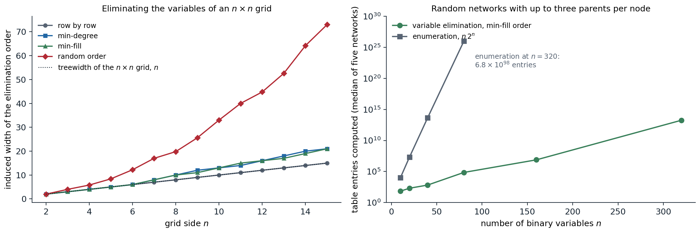

[Background Notes](../README.md) › [Artificial Intelligence](README.md)

# 9. Exact Inference

> [!WARNING]
> Work in progress: this part of the notes is still being revised.

[← 8. Bayesian Networks and Markov Networks](08-bayesian-networks-and-markov-networks.md) · [10. Approximate Inference →](10-approximate-inference.md)

## <a id="inference-tasks"></a>Inference tasks

A graphical model ([chapter 8](08-bayesian-networks-and-markov-networks.md)) is useful only if questions can be answered from it. For a distribution $`P(x)=\frac1Z\prod_af_a(x_a)`$ given as a product of factors, which covers Bayesian networks ($`Z=1`$, one factor per CPT) and Markov networks alike, the standard tasks are:

- **Marginals and conditionals:** $`P(X\mid e)`$ for a query variable $`X`$ and evidence $`e`$. Diagnosis, filtering, and prediction are all of this form.
- **The partition function** $`Z`$, or the probability of the evidence $`P(e)`$, which is the same computation with the evidence variables clamped. It is needed for learning and for comparing models.
- **MAP inference**, or the **most probable explanation**: $`\arg\max_xP(x\mid e)`$, the single most likely joint assignment of all non-evidence variables. A **marginal MAP** query maximizes over some variables and sums over others, and is harder than both.

All three are hard in general. Computing marginals in Bayesian networks is #P-hard ([Cooper, 1990](https://www.sciencedirect.com/science/article/pii/000437029090060D)), since counting the satisfying assignments of a formula reduces to it ([Appendix B](#block-ai09-appendix-b)), and even approximating a conditional probability to within a constant relative error is NP-hard ([Dagum and Luby, 1993](https://www.sciencedirect.com/science/article/pii/000437029390036B)). MAP inference is NP-hard, as it contains satisfiability. What makes inference tractable is structure: the algorithms of this chapter run in time exponential only in a measure of how far the graph is from a tree, and linear in its size. When that measure is too large, [chapter 10](10-approximate-inference.md) gives up exactness.

## <a id="variable-elimination"></a>Variable elimination

### <a id="pushing-sums-inward"></a>Pushing sums inward

Inference by enumeration sums the full joint over the hidden variables. For the burglary network,

```math
P(B\mid j,m)=\alpha\sum_e\sum_aP(B)\,P(e)\,P(a\mid B,e)\,P(j\mid a)\,P(m\mid a),
```

a sum of $`2\times2`$ terms, each a product of five numbers, for each value of $`B`$. Enumeration recomputes the same subexpressions many times: $`P(j\mid a)P(m\mid a)`$ is the same for every value of $`e`$. Moving each sum as far right as it goes,

```math
P(B\mid j,m)=\alpha\,P(B)\sum_eP(e)\sum_aP(a\mid B,e)\,P(j\mid a)\,P(m\mid a),
```

and evaluating from the inside out, storing each intermediate result, removes the repetition. This is dynamic programming, and on a network with $`n`$ variables it can turn an $`O(2^n)`$ sum into one that is linear in $`n`$.

### <a id="factors-and-their-operations"></a>Factors and their operations

**Variable elimination** carries out this idea on tables. A **factor** is a function of a set of variables, stored as a table with one entry per joint value. Three operations suffice:

- **restriction** fixes an evidence variable to its observed value, removing it from the factor;
- **product** of two factors is a factor on the union of their variables, $`h(x,y,z)=f(x,y)\,g(y,z)`$, pointwise, like a database join;
- **summing out** a variable from a factor, $`h(x)=\sum_yf(x,y)`$, marginalizes it.

The algorithm restricts every factor to the evidence, then eliminates the hidden variables one at a time in some **elimination order**: to eliminate $`Y`$, multiply all factors that mention $`Y`$ and sum $`Y`$ out of the product, replacing those factors by the result. When only the query variable remains, the product of the remaining factors, normalized, is the answer. Two refinements matter in practice. Variables that are neither ancestors of the query nor of the evidence (**barren** nodes) can be removed before starting, since they sum to one. And with several queries on the same evidence, the work of elimination can be shared, which leads to the message-passing algorithms below.

```python
import string
from itertools import product

import numpy as np


class Factor:
    """A table over named binary variables: vars is a tuple of names, table has one axis per variable."""

    def __init__(self, vars, table):
        self.vars, self.table = tuple(vars), np.asarray(table, float)

    def __mul__(self, other):
        vs = self.vars + tuple(v for v in other.vars if v not in self.vars)
        L = {v: string.ascii_letters[i] for i, v in enumerate(vs)}
        spec = "".join(L[v] for v in self.vars) + "," + "".join(L[v] for v in other.vars) + "->" + "".join(L[v] for v in vs)
        return Factor(vs, np.einsum(spec, self.table, other.table))

    def sum_out(self, v):
        return Factor([u for u in self.vars if u != v], self.table.sum(axis=self.vars.index(v)))

    def restrict(self, v, value):
        return Factor([u for u in self.vars if u != v], np.take(self.table, int(value), axis=self.vars.index(v)))


def cpt(child, parents, p_true):
    """Factor for P(child | parents) from P(child = 1 | parents), given as an array over the parents' values."""
    p = np.asarray(p_true, float)
    return Factor(tuple(parents) + (child,), np.stack([1 - p, p], axis=-1))


# The burglary network; index 1 means true.
factors = [cpt("B", [], 0.001), cpt("E", [], 0.002),
           cpt("A", ["B", "E"], [[0.001, 0.29], [0.94, 0.95]]),
           cpt("J", ["A"], [0.05, 0.90]), cpt("M", ["A"], [0.01, 0.70])]


def eliminate(factors, query, evidence, order):
    """Variable elimination: restrict to the evidence, then sum out the hidden variables one at a time."""
    fs = []
    for f in factors:
        for v, val in evidence.items():
            if v in f.vars:
                f = f.restrict(v, val)
        fs.append(f)
    largest = 0
    for v in order:
        involved = [f for f in fs if v in f.vars]
        prod = involved[0]
        for f in involved[1:]:
            prod = prod * f
        largest = max(largest, prod.table.size)
        fs = [f for f in fs if v not in f.vars] + [prod.sum_out(v)]
    result = fs[0]
    for f in fs[1:]:
        result = result * f
    table = result.table / result.table.sum()
    return table[1], largest


p, largest = eliminate(factors, "B", {"J": 1, "M": 1}, ["E", "A"])
print(f"P(burglary | John and Mary call) = {p:.4f}; largest intermediate factor has {largest} entries")

# The same query on a chain X1 -> X2 -> ... -> Xn with evidence at the end: elimination versus enumeration.
rng = np.random.default_rng(0)
n = 20
chain = [cpt("X1", [], 0.3)] + [cpt(f"X{i}", [f"X{i - 1}"], [rng.uniform(0.01, 0.05), rng.uniform(0.95, 0.99)])
                                for i in range(2, n + 1)]
p_ve, largest = eliminate(chain, "X1", {f"X{n}": 1}, [f"X{i}" for i in range(2, n)])
num = den = 0.0
for x in product([0, 1], repeat=n):                         # brute force over all 2^20 assignments
    w = 0.3 if x[0] else 0.7
    for i in range(1, n):
        q = chain[i].table[x[i - 1], 1]
        w *= q if x[i] else 1 - q
    if x[-1] == 1:
        den += w
        num += w * x[0]
print(f"chain of {n}: P(X1 | X{n} = 1) = {p_ve:.6f} by elimination (largest factor {largest} entries),"
      f" {num / den:.6f} by summing {2 ** n:,} terms")
# P(burglary | John and Mary call) = 0.2842; largest intermediate factor has 8 entries
# chain of 20: P(X1 | X20 = 1) = 0.428987 by elimination (largest factor 8 entries), 0.428987 by summing 1,048,576 terms
```

Elimination reproduces the burglary posterior of chapter 8 with no factor larger than eight entries. On a chain of twenty variables it agrees with the brute-force sum over a million assignments while never building a table with more than three variables; its cost grows linearly with the length of the chain, the brute force doubles with each variable.

### <a id="elimination-order-and-treewidth"></a>Elimination order and treewidth

The cost of variable elimination is dominated by the largest factor it creates, and that depends on the order. Eliminating a variable connects all its neighbors, because their factors are multiplied together, so the process can be simulated on the undirected graph of the model (the moral graph, for a Bayesian network): eliminating a node joins its neighbors into a clique, adding **fill-in edges**, and removes it. The **induced width** of an order is the largest number of neighbors a node has when it is eliminated; the largest factor has one more variable than that, and with domains of size $`d`$ the total cost is $`O(n\,d^{w+1})`$ for induced width $`w`$. The minimum induced width over all orders is the **treewidth** of the graph, the same quantity that governs the tree decompositions of [chapter 3](03-constraint-satisfaction-and-local-search.md#cutset-conditioning-and-tree-decompositions) ([Appendix C](#block-ai09-appendix-c)).

- Trees have treewidth 1, so inference on them is linear. Singly connected networks, **polytrees**, in which there is at most one undirected path between any two nodes, have treewidth equal to the largest number of parents, and inference is linear in the total size of the CPTs.
- An $`n\times n`$ grid has treewidth $`n`$: inference on it costs $`O(d^{n+1})`$, exponential in the side length and not in the number of variables $`n^2`$.
- Finding an optimal order is NP-hard, and greedy heuristics are used: **min-degree** eliminates the node with fewest neighbors, and **min-fill** the one whose elimination adds the fewest edges. They are fast and usually good, but not optimal.



*Left: the induced width of four elimination orders on $`n\times n`$ grids. Eliminating row by row achieves the treewidth, $`n`$; the greedy min-degree and min-fill heuristics, with ties broken by node name, are optimal up to side 6 but reach width 21 on the $`15\times15`$ grid; a random order reaches 73, which would need tables of $`2^{74}`$ entries for binary variables. Right: the total size of the factors created by variable elimination with the min-fill order, for random Bayesian networks in which each node has zero to three parents chosen at random among earlier nodes, against the $`n2^n`$ operations of enumeration. The median induced width grows from 3 at 10 variables to 42 at 320, so elimination also becomes exponential, but at 320 variables it needs about $`2\times10^{13}`$ entries against $`7\times10^{98}`$.*

Random networks with long-range connections have large treewidth, and exact inference on them is hopeless beyond a few hundred variables. Real networks built by experts, and the grids, chains, and trees of vision and speech, usually have more structure, and exact methods handle many of them.

## <a id="message-passing-on-trees"></a>Message passing on trees

### <a id="sum-product"></a>Sum-product

Variable elimination answers one query. On a tree, all marginals can be computed at twice the cost of one, by keeping the intermediate factors as **messages**. For a pairwise Markov network $`P(x)\propto\prod_i\phi_i(x_i)\prod_{(i,j)}\psi_{ij}(x_i,x_j)`$ on a tree, the message from node $`i`$ to its neighbor $`j`$ is

```math
m_{i\to j}(x_j)=\sum_{x_i}\phi_i(x_i)\,\psi_{ij}(x_i,x_j)\prod_{k\in N(i)\setminus j}m_{k\to i}(x_i),
```

the result of eliminating the whole subtree on $`i`$'s side of the edge, summarized as a function of $`x_j`$. The marginal of each node is proportional to its own potential times all incoming messages:

```math
P(x_i)\propto\phi_i(x_i)\prod_{k\in N(i)}m_{k\to i}(x_i).
```

A message can be sent once its sender has heard from all its other neighbors. Choosing a root, an upward pass from the leaves and a downward pass from the root compute all $`2(n-1)`$ messages, after which every marginal is available ([Appendix A](#block-ai09-appendix-a)). On a factor graph ([chapter 8](08-bayesian-networks-and-markov-networks.md#factor-graphs)), the same algorithm alternates two kinds of messages, variable-to-factor (the product of the other incoming messages) and factor-to-variable (the factor times the incoming messages, summed over all its other variables), and it is known as the **sum-product** algorithm ([Kschischang, Frey, and Loeliger, 2001](https://doi.org/10.1109/18.910572)). The forward–backward algorithm for hidden Markov models ([chapter 11](11-temporal-probabilistic-models.md)) and the Kalman smoother are sum-product on a chain.

### <a id="max-product-and-map-inference"></a>Max-product and MAP inference

Replacing the sum in the message by a maximum gives **max-product**, which computes **max-marginals**: for each node and value, the probability of the best joint assignment in which that node takes that value. With ties broken consistently, taking the best value of each node's max-marginal gives the most probable joint state; alternatively, the upward pass followed by **backtracking** from the root, with each node choosing the value that achieved the maximum given its parent's choice, recovers the MAP state as in dynamic programming. In log space, max-product becomes **max-sum**, and on a chain it is the Viterbi algorithm of [chapter 11](11-temporal-probabilistic-models.md).

The MAP state is not the state of individually most probable values, because the variables interact:

```python
from itertools import product

import numpy as np

rng = np.random.default_rng(1)
n, k = 10, 3                                           # a tree of 10 variables with 3 states each
parent = [None] + [int(rng.integers(i)) for i in range(1, n)]
edges = [(parent[i], i) for i in range(1, n)]
unary = rng.uniform(0.5, 2.0, (n, k))                   # node potentials
pair = {e: rng.uniform(0.2, 3.0, (k, k)) for e in edges}   # edge potentials, indexed [x_parent, x_child]
nbrs = {i: [] for i in range(n)}
for a, b in edges:
    nbrs[a].append(b)
    nbrs[b].append(a)


def psi(i, j):
    """Edge potential as a matrix indexed [x_i, x_j]."""
    return pair[(i, j)] if (i, j) in pair else pair[(j, i)].T


def messages(combine):
    """Messages m[i -> j](x_j) for every directed edge, computed leaves-first then root-first.
    combine = np.sum gives sum-product, np.max gives max-product."""
    m = {}

    def send(i, j):
        incoming = unary[i].copy()
        for u in nbrs[i]:
            if u != j:
                incoming *= m[(u, i)]
        msg = combine(incoming[:, None] * psi(i, j), axis=0)
        m[(i, j)] = msg / msg.sum()                    # normalize for numerical safety

    order = []                                         # a DFS order from the root 0
    stack = [0]
    while stack:
        v = stack.pop()
        order.append(v)
        stack.extend(c for c in nbrs[v] if c != parent[v])
    for v in reversed(order[1:]):                      # upward pass: children before parents
        send(v, parent[v])
    for v in order[1:]:                                # downward pass: parents before children
        send(parent[v], v)
    return m


def beliefs(m):
    b = unary.copy()
    for (i, j), msg in m.items():
        b[j] *= msg
    return b / b.sum(axis=1, keepdims=True)


marg = beliefs(messages(np.sum))

# Brute force over all 3^10 joint states.
states = np.array(list(product(range(k), repeat=n)))
w = np.prod(unary[np.arange(n), states], axis=1)
for a, b in edges:
    w *= pair[(a, b)][states[:, a], states[:, b]]
exact = np.array([[w[states[:, i] == s].sum() for s in range(k)] for i in range(n)]) / w.sum()
print(f"sum-product marginals agree with brute force over {len(states):,} states:", np.allclose(marg, exact, atol=1e-12))
print("marginal of variable 0:", np.round(marg[0], 4))

# Max-product: each variable's max-marginal peaks at its value in the most probable joint state (ties aside).
maxmarg = beliefs(messages(np.max))
x_map = maxmarg.argmax(axis=1)
print("MAP state by max-product:", x_map.tolist())
print("MAP state by brute force:", states[w.argmax()].tolist())
x_marg = marg.argmax(axis=1)
print("most probable value of each variable separately:", x_marg.tolist())
print(f"probability of the MAP state {w.max() / w.sum():.5f}; of the state of separate maxima"
      f" {w[np.all(states == x_marg, axis=1)][0] / w.sum():.5f}")
# sum-product marginals agree with brute force over 59,049 states: True
# marginal of variable 0: [0.2499 0.1875 0.5625]
# MAP state by max-product: [2, 1, 0, 2, 2, 1, 1, 1, 2, 2]
# MAP state by brute force: [2, 1, 0, 2, 2, 1, 1, 1, 2, 2]
# most probable value of each variable separately: [2, 1, 1, 2, 2, 1, 1, 1, 2, 2]
# probability of the MAP state 0.00248; of the state of separate maxima 0.00169
```

Two passes of 18 messages give all ten marginals exactly. Max-product finds the most probable of the 59,049 joint states, which differs from the state that picks each variable's most probable value in one variable and is almost 50% more probable. Which answer is right depends on the loss: the MAP state minimizes the probability of getting anything wrong, and the per-variable choice minimizes the expected number of wrong variables, the distinction between sequence-level and symbol-level decoding in speech recognition and error-correcting codes.

## <a id="the-junction-tree-algorithm"></a>The junction tree algorithm

Message passing is exact only on trees, but any graph can be turned into a tree of clusters. A **clique tree**, or **junction tree**, is a tree whose nodes are clusters of variables such that every factor lies in some cluster and the **running intersection property** holds: every variable shared by two clusters is present in all clusters on the path between them. The clusters produced by variable elimination, each eliminated node with its neighbors at that moment, form such a tree when connected appropriately; equivalently, triangulate the moral graph and take its maximal cliques. Neighboring clusters exchange messages over their shared variables, the **separators**, exactly as in sum-product, and after an upward and a downward pass every cluster holds the joint marginal of its variables (it is **calibrated**). This is the **junction tree algorithm** ([Lauritzen and Spiegelhalter, 1988](https://doi.org/10.1111/j.2517-6161.1988.tb01721.x)), the standard exact method for moderately sized networks. Its cost is exponential in the size of the largest cluster, the treewidth plus one, so it faces the same limits as elimination, and it pays in memory for storing all cluster tables.

Two further ideas extend exact inference. **Knowledge compilation** turns a network, once, into an **arithmetic circuit** whose evaluation answers any query in time linear in the circuit ([Darwiche, 2003](https://doi.org/10.1145/765568.765570)); circuits exploit local structure, such as determinism and context-specific independence, that treewidth ignores, and their derivatives give all marginals at once, backpropagation in another guise. **Lifted inference** exploits symmetry in relational models, treating interchangeable objects as a group instead of one by one. For Gaussian models, exact inference is linear algebra, the conditioning of [Foundations chapter 4](../foundations/04-probability-and-statistics.md#gaussian-vectors-and-conditioning), and message passing on sparse Gaussian graphs is a way to solve sparse linear systems.

## <a id="appendices"></a>Appendices


<details>
<summary><a id="block-ai09-appendix-a"></a><b>A. Sum-product is exact on trees</b></summary>


Root the tree at node $`r`$. For an edge from child $`i`$ to parent $`j`$, let $`T_i`$ be the subtree of $`i`$. **Claim:** the upward message satisfies

```math
m_{i\to j}(x_j)=\sum_{x_{T_i}}\psi_{ij}(x_i,x_j)\prod_{u\in T_i}\phi_u(x_u)\prod_{(u,v)\in T_i}\psi_{uv}(x_u,x_v),
```

the sum over all variables of the subtree of every factor that touches it. By induction on height: for a leaf, the message is $`\sum_{x_i}\phi_i(x_i)\psi_{ij}(x_i,x_j)`$, as claimed. For an internal node, the subtrees of its children are disjoint and share no factors, so the sum over $`x_{T_i}`$ factors into $`\sum_{x_i}\phi_i\psi_{ij}`$ times the product over children $`k`$ of the sums over their subtrees, which are the messages $`m_{k\to i}(x_i)`$ by the induction hypothesis. This is exactly the message formula.

At the root, $`\phi_r(x_r)\prod_{i\in N(r)}m_{i\to r}(x_r)`$ is then the sum of the unnormalized joint over all variables except $`x_r`$, which is $`Z\,P(x_r)`$. The same argument applies with any node as the root; the downward pass computes, for each node, the messages from the side of its parent, which are exactly the messages that node would receive if it were the root. Hence every belief is the exact marginal after normalization, and the sum of any node's unnormalized belief is $`Z`$.

Replacing sums by maxima throughout, the same induction shows that $`m_{i\to j}(x_j)`$ is the maximum over the subtree's variables, and the root's belief is the max-marginal $`\max_{x_{-r}}\tilde P(x)`$. The argument uses only that multiplication distributes over the aggregation, $`a\max(b,c)=\max(ab,ac)`$ for $`a\ge0`$ as for sums, so the algorithm works in any **commutative semiring**: sum-product for marginals, max-product for MAP, and Boolean or-and for constraint satisfaction, where it becomes the directed arc consistency of [chapter 3](03-constraint-satisfaction-and-local-search.md#block-ai03-appendix-b).

</details>


<details>
<summary><a id="block-ai09-appendix-b"></a><b>B. Inference is #P-hard</b></summary>


Given a 3-CNF formula with variables $`U_1,\dots,U_n`$ and clauses $`C_1,\dots,C_m`$, build a Bayesian network with root nodes $`U_i`$, each with $`P(U_i=\text{true})=1/2`$; a node $`C_j`$ for each clause, a deterministic OR of the literals it contains, with the three variables as parents; and a chain of deterministic AND nodes $`A_1,\dots,A_m`$, with $`A_1=C_1`$ and $`A_j=A_{j-1}\wedge C_j`$, so that each node has at most three parents. Then

```math
P(A_m=\text{true})=\frac{\#\{\text{satisfying assignments}\}}{2^n}.
```

The network has size polynomial in the formula, so computing this marginal exactly counts satisfying assignments, a #P-complete problem, and deciding whether it is positive decides satisfiability, an NP-complete problem. The same network shows that no algorithm can approximate the marginal within any constant relative error in polynomial time unless P = NP, because a relative approximation distinguishes zero from nonzero. Absolute error approximations, by contrast, are easy by sampling ([chapter 10](10-approximate-inference.md)), which is why relative error, and small probabilities of evidence, are the hard case.

</details>


<details>
<summary><a id="block-ai09-appendix-c"></a><b>C. Elimination orders, chordal graphs, and treewidth</b></summary>


Eliminating the vertices of a graph $`G`$ in an order $`\pi`$ and adding all fill-in edges produces the **induced graph** $`G_\pi`$. It is **chordal**: every cycle of length four or more has a chord. (In any cycle, the first vertex eliminated has its two cycle neighbors joined by a fill-in edge, a chord.) Conversely, every chordal graph has a **perfect elimination order**, one that adds no fill-in edges: repeatedly eliminate a **simplicial** vertex, whose neighbors already form a clique, which every chordal graph has. So elimination orders correspond to **triangulations** of $`G`$, chordal supergraphs, and the largest clique of the triangulation has one vertex more than the induced width.

The maximal cliques of a chordal graph can be arranged in a tree with the running intersection property, a junction tree, for instance as a maximum-weight spanning tree of the clique graph with separator sizes as weights. The **treewidth** of $`G`$ is the minimum over triangulations of the largest clique size minus one, equivalently the minimum induced width over elimination orders, and equivalently the minimum width of a tree decomposition as defined in chapter 3. Computing it is NP-hard ([Arnborg, Corneil, and Proskurowski, 1987](https://doi.org/10.1137/0608024)), but it can be computed in linear time for any fixed bound on the width, and the greedy heuristics are usually close on sparse graphs.

</details>

---

[← 8. Bayesian Networks and Markov Networks](08-bayesian-networks-and-markov-networks.md) · [10. Approximate Inference →](10-approximate-inference.md)
