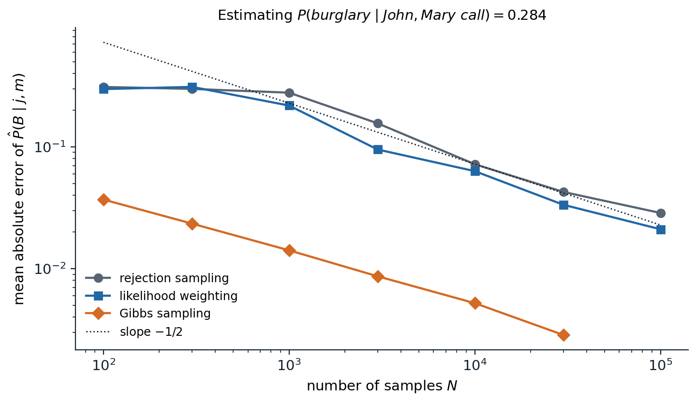
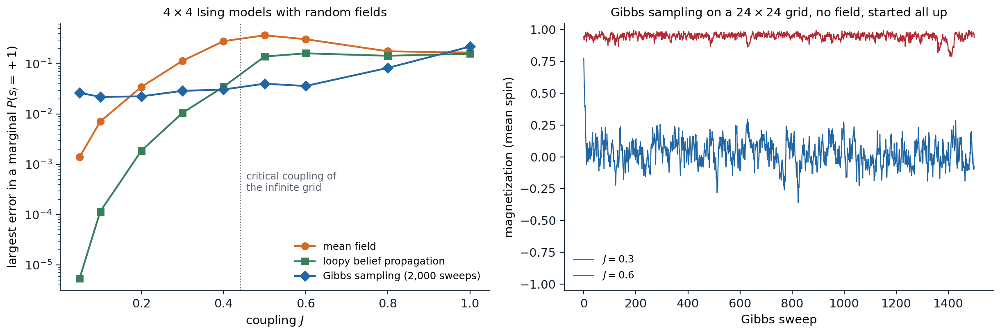

[Background Notes](../README.md) › [Artificial Intelligence](README.md)

# 10. Approximate Inference

> [!WARNING]
> Work in progress: this part of the notes is still being revised.

[← 9. Exact Inference](09-exact-inference.md) · [11. Temporal Probabilistic Models →](11-temporal-probabilistic-models.md)

## <a id="why-approximate"></a>Why approximate

Exact inference, [chapter 9](09-exact-inference.md), costs time exponential in the treewidth, and many models of interest have large treewidth: grids of pixels, dense networks built from data, relational models with many interacting objects, and models with continuous variables whose conditionals have no closed form. For them, two families of approximation are used, and they fail in different ways.

- **Sampling** (Monte Carlo) methods draw samples whose frequencies approximate the target distribution. They are **consistent**: with enough samples the answer converges to the truth, and the error of an average of $`N`$ independent samples shrinks as $`1/\sqrt N`$ regardless of the number of variables ([Foundations chapter 4](../foundations/04-probability-and-statistics.md#monte-carlo-integration)). The difficulty is obtaining samples from the right distribution, especially under unlikely evidence.
- **Variational** methods replace inference by optimization: they search a tractable family of distributions for the member closest to the target. They are fast and deterministic, but **biased**, since the answer is only as good as the family, and the error does not vanish with more computation.

The running examples are the burglary network of [chapter 8](08-bayesian-networks-and-markov-networks.md), small enough to check against exact answers, and the Ising model, the simplest model in which approximate inference is both necessary and hard.

## <a id="sampling-from-bayesian-networks"></a>Sampling from Bayesian networks

### <a id="direct-and-rejection-sampling"></a>Direct and rejection sampling

A Bayesian network is a generative process: sample each variable in topological order from its CPT, given the sampled values of its parents. This **ancestral** or **prior sampling** produces exact samples from the joint distribution, and the fraction of samples with a property estimates its probability. Conditional queries need more. **Rejection sampling** discards the samples that disagree with the evidence and uses the rest. It is consistent, but it keeps only a fraction $`P(e)`$ of the samples, which collapses as the evidence grows: in the burglary network, both neighbors call in only 0.2% of the samples, so a hundred thousand samples yield about two hundred useful ones, and with evidence on many variables $`P(e)`$ falls exponentially.

### <a id="likelihood-weighting"></a>Likelihood weighting

**Likelihood weighting** never rejects. It fixes the evidence variables to their observed values, samples the other variables in topological order as before, and gives each sample a **weight** equal to the likelihood of the evidence given the sampled parents:

```math
w=\prod_{E_i\in\text{evidence}}P\bigl(e_i\mid\mathrm{parents}(E_i)\bigr),\qquad\hat P(x\mid e)=\frac{\sum_kw_k\,\mathbb 1[x_k=x]}{\sum_kw_k}.
```

The estimate is consistent ([Appendix A](#block-ai10-appendix-a)). It is an instance of importance sampling, below, with the evidence clamped: the non-evidence variables are sampled from their priors, uninfluenced by evidence downstream. When the evidence is unlikely under the prior's typical samples, almost all the weight falls on a few samples, and the estimate is as noisy as a sample of that size.

```python
import numpy as np

# The burglary network; estimate P(B = true | J = true, M = true), whose exact value is 0.2842.
rng = np.random.default_rng(0)
N = 100_000


def sample_parents(N):
    b = rng.random(N) < 0.001
    e = rng.random(N) < 0.002
    p_a = np.where(b & e, 0.95, np.where(b, 0.94, np.where(e, 0.29, 0.001)))
    a = rng.random(N) < p_a
    return b, e, a


# Rejection sampling: sample every variable, keep the samples that agree with the evidence.
b, e, a = sample_parents(N)
j = rng.random(N) < np.where(a, 0.90, 0.05)
m = rng.random(N) < np.where(a, 0.70, 0.01)
keep = j & m
print(f"rejection sampling: kept {keep.sum()} of {N:,} samples; estimate {b[keep].mean():.4f}")

# Likelihood weighting: sample the non-evidence variables, weight each sample by P(evidence | parents).
b, e, a = sample_parents(N)
w = np.where(a, 0.90, 0.05) * np.where(a, 0.70, 0.01)
ess = w.sum() ** 2 / (w ** 2).sum()
print(f"likelihood weighting: estimate {(w * b).sum() / w.sum():.4f}; effective sample size {ess:.0f} of {N:,}")
print(f"  samples with the alarm on: {a.sum()}, carrying {w[a].sum() / w.sum():.1%} of the total weight")
# rejection sampling: kept 213 of 100,000 samples; estimate 0.2535
# likelihood weighting: estimate 0.2669; effective sample size 441 of 100,000
#   samples with the alarm on: 258, carrying 76.5% of the total weight
```

Rejection sampling keeps 213 of 100,000 samples. Likelihood weighting uses all of them, but the 258 samples in which the alarm happened to sound carry three quarters of the total weight, because the calls are 1,260 times more likely with the alarm than without it; its **effective sample size**, defined below, is 441. Both estimates are within a few hundredths of the exact 0.2842, and the effective sample sizes explain why neither is better.

### <a id="importance-sampling"></a>Importance sampling

Both methods are cases of **importance sampling**. To estimate $`\mathbb E_p[f]=\sum_xp(x)f(x)`$ when sampling from $`p`$ is hard, sample from a **proposal** $`q`$ instead, with $`q(x)>0`$ wherever $`p(x)f(x)\neq0`$, and reweight:

```math
\mathbb E_p[f]=\mathbb E_q\!\left[f(x)\frac{p(x)}{q(x)}\right]\approx\frac1N\sum_kf(x_k)\,w_k,\qquad w_k=\frac{p(x_k)}{q(x_k)}.
```

When $`p`$ is known only up to a constant, such as a posterior $`p(x\mid e)\propto p(x,e)`$, the **self-normalized** estimate $`\sum_kw_kf(x_k)/\sum_kw_k`$ uses unnormalized weights and is consistent though slightly biased. The quality of a proposal is summarized by the **effective sample size**

```math
N_{\mathrm{eff}}=\frac{\bigl(\sum_kw_k\bigr)^2}{\sum_kw_k^2},
```

which equals $`N`$ when all weights are equal and 1 when one weight dominates. The variance of importance sampling is small when $`q`$ is close to $`p`$ and enormous, even infinite, when $`q`$ has lighter tails than $`p`$. In high dimensions a product of many per-variable weight ratios almost always degenerates, which is why **sequential** importance sampling with resampling, the particle filter of [chapter 11](11-temporal-probabilistic-models.md#particle-filtering), periodically discards low-weight samples and duplicates high-weight ones.

## <a id="markov-chain-monte-carlo"></a>Markov chain Monte Carlo

### <a id="markov-chains-and-stationary-distributions"></a>Markov chains and stationary distributions

**Markov chain Monte Carlo** (MCMC) gives up independent samples. It runs a Markov chain whose states are complete assignments and whose long-run distribution is the target $`\pi`$, and uses the sequence of states as correlated samples. A chain with transition probabilities $`T(x\to x')`$ has **stationary distribution** $`\pi`$ if $`\sum_x\pi(x)T(x\to x')=\pi(x')`$: a state distributed according to $`\pi`$ stays so distributed after a step. A convenient sufficient condition is **detailed balance**,

```math
\pi(x)\,T(x\to x')=\pi(x')\,T(x'\to x)\qquad\text{for all }x,x',
```

which says that in equilibrium the flow from $`x`$ to $`x'`$ equals the flow back ([Appendix B](#block-ai10-appendix-b)). If the chain is also **ergodic**, able to reach every state from every other (irreducible) without being trapped in cycles (aperiodic), then from any starting state the distribution of the chain converges to $`\pi`$, and averages along the chain converge to expectations under $`\pi`$. The conditions are easy to verify and say nothing about how fast convergence happens, which is the whole practical question.

### <a id="gibbs-sampling"></a>Gibbs sampling

**Gibbs sampling** ([Geman and Geman, 1984](https://doi.org/10.1109/TPAMI.1984.4767596)) updates one variable at a time, resampling it from its conditional distribution given all the others. In a graphical model that conditional depends only on the variable's **Markov blanket** ([chapter 8](08-bayesian-networks-and-markov-networks.md#the-local-markov-property)):

```math
P(x_i\mid x_{-i})\propto P\bigl(x_i\mid\mathrm{parents}(X_i)\bigr)\prod_{Y_j\in\mathrm{children}(X_i)}P\bigl(y_j\mid\mathrm{parents}(Y_j)\bigr)
```

in a Bayesian network, and $`\propto\prod_{c\ni i}\psi_c(x_c)`$ in a Markov network, so each update is cheap and local. Evidence variables are simply never resampled. Each update leaves the target invariant, and cycling through the variables gives an ergodic chain when all conditionals are positive. On the burglary network, Gibbs sampling over the three unobserved variables estimates $`P(B\mid j,m)`$ far more accurately than the sampling methods above for the same number of iterations, because it samples the alarm from its posterior instead of from its prior:



*Mean absolute error of three estimates of $`P(B\mid j,m)=0.284`$, over 100 runs (20 for Gibbs sampling) for each number of samples; when rejection sampling keeps no sample, its error is counted as 0.284. Rejection sampling keeps on average 0.2 samples out of 100 and 207 out of 100,000, and its error is dominated by the lack of accepted samples until about $`10^4`$. Likelihood weighting is only slightly better: its weight concentrates on the rare samples with the alarm on. Gibbs sampling, with one sweep over burglary, earthquake, and alarm per sample and a burn-in of 100 sweeps, has errors ten times smaller, 0.0029 after 30,000 sweeps; all three errors fall roughly as $`N^{-1/2}`$ once enough samples are useful.*

Gibbs sampling fails when variables are strongly coupled. If two variables are almost always equal, changing one while holding the other fixed is almost always rejected by the conditional, and the chain moves between the two joint modes only rarely. **Blocked Gibbs** samples groups of correlated variables jointly, and **collapsed Gibbs** integrates some variables out analytically, which is how topic models are usually fitted.

### <a id="metropolishastings"></a>Metropolis–Hastings

**Metropolis–Hastings** ([Metropolis et al., 1953](https://doi.org/10.1063/1.1699114); [Hastings, 1970](https://doi.org/10.1093/biomet/57.1.97)) builds a chain for any target known up to a constant. From the current state $`x`$, propose $`x'\sim q(x'\mid x)`$, and accept with probability

```math
A(x\to x')=\min\left(1,\;\frac{\pi(x')\,q(x\mid x')}{\pi(x)\,q(x'\mid x)}\right),
```

otherwise stay at $`x`$. The normalizing constant of $`\pi`$ cancels in the ratio, and the acceptance rule enforces detailed balance for any proposal (Appendix B). Gibbs sampling is the special case whose proposal is the exact conditional, for which the acceptance probability is always 1; the simulated annealing of [chapter 3](03-constraint-satisfaction-and-local-search.md#simulated-annealing) is the case $`\pi\propto e^{-E/T}`$ with a symmetric proposal and a falling temperature.

The proposal's scale governs efficiency. Small steps are almost always accepted but move slowly; large steps are almost always rejected; the best is in between, and for random-walk proposals in high dimensions theory suggests tuning the scale for an acceptance rate of about 0.23 ([Roberts, Gelman, and Gilks, 1997](https://doi.org/10.1214/aoap/1034625254)).

```python
import numpy as np

rng = np.random.default_rng(0)
rho = 0.9
prec = np.linalg.inv(np.array([[1, rho], [rho, 1]]))     # target: a standard bivariate normal, correlation 0.9
log_p = lambda x: -0.5 * x @ prec @ x


def ess(x):
    """Effective sample size from the autocorrelations, summed until they first turn negative."""
    x = x - x.mean()
    n = len(x)
    acf = np.correlate(x, x, "full")[n - 1:] / (x @ x)
    s = 0.0
    for k in range(1, n):
        if acf[k] < 0:
            break
        s += acf[k]
    return n / (1 + 2 * s)


for step in [0.05, 0.5, 1.5, 5.0]:
    x, lp = np.zeros(2), 0.0
    xs, accepted = [], 0
    for t in range(20_000):
        prop = x + step * rng.normal(size=2)             # symmetric random-walk proposal
        lp_prop = log_p(prop)
        if np.log(rng.random()) < lp_prop - lp:          # accept with probability min(1, p(prop) / p(x))
            x, lp = prop, lp_prop
            accepted += 1
        xs.append(x[0])
    xs = np.array(xs[2000:])                             # discard a burn-in period
    print(f"step {step:4}: acceptance {accepted / 20000:.2f}, effective sample size {ess(xs):6.0f} of {len(xs)},"
          f" estimate of E[x1^2] = 1: {np.mean(xs ** 2):.3f}")
# step 0.05: acceptance 0.95, effective sample size      6 of 18000, estimate of E[x1^2] = 1: 1.302
# step  0.5: acceptance 0.54, effective sample size    264 of 18000, estimate of E[x1^2] = 1: 1.063
# step  1.5: acceptance 0.20, effective sample size    732 of 18000, estimate of E[x1^2] = 1: 1.102
# step  5.0: acceptance 0.03, effective sample size    204 of 18000, estimate of E[x1^2] = 1: 1.025
```

For a strongly correlated Gaussian, steps of 0.05 are accepted 95% of the time, but the chain diffuses so slowly that 18,000 draws are worth about six independent ones, and its estimate of $`\mathbb E[x_1^2]=1`$ is off by 30%. Steps of 1.5, accepted 20% of the time, give 732 effective samples; steps of 5, accepted 3% of the time, fall back to 204. The **effective sample size** of a chain, $`N/(1+2\sum_k\rho_k)`$ in terms of the autocorrelations $`\rho_k`$ of the sampled quantity, measures how many independent samples the correlated sequence is worth.

### <a id="mixing-and-diagnostics"></a>Mixing and diagnostics

The time a chain needs to forget its starting point, its **mixing time**, can be astronomically long, and nothing in the chain's output announces it. In the Ising model on a large grid, above the critical coupling almost all probability lies near the two states with all spins aligned, one way or the other; a Gibbs sampler started in one of them would need to flip a whole region of spins against the coupling to reach the other, and effectively never does.



*Left: approximate marginals on $`4\times4`$ Ising models with random fields $`h_i\sim\mathcal N(0,0.3^2)`$, against exact values from all 65,536 configurations, averaged over five models per coupling. Mean-field errors grow from 0.0014 at $`J=0.05`$ to 0.37 at $`J=0.5`$; loopy belief propagation is far more accurate at weak coupling, with errors of $`5\times10^{-6}`$ at $`J=0.05`$ and 0.011 at $`J=0.3`$, and also degrades once the coupling is strong; Gibbs sampling with 2,000 sweeps has errors of 0.02–0.04 up to $`J=0.6`$, which grow to 0.22 at $`J=1`$ as it starts to stick in one of the aligned states. Right: the magnetization of a $`24\times24`$ grid with no field, under Gibbs sampling started with all spins up. At $`J=0.3`$ the chain forgets its start within a few sweeps and fluctuates around 0 between $`-0.36`$ and $`0.30`$. At $`J=0.6`$ it stays between 0.79 and 0.99 for all 1,500 sweeps, although by symmetry the true mean is 0.*

Practitioners discard an initial **burn-in** segment, run several chains from dispersed starting points, and compare the variance within chains to the variance between them (the $`\hat R`$ statistic of [Gelman and Rubin, 1992](https://doi.org/10.1214/ss/1177011136)); disagreement proves non-convergence, while agreement is only evidence of it. Better samplers change the moves rather than the diagnostics. **Cluster** algorithms such as Swendsen–Wang flip whole aligned regions of an Ising model at once. **Hamiltonian Monte Carlo** ([Neal, 2011](https://arxiv.org/abs/1206.1901)) proposes distant points by simulating the dynamics of a particle on the energy surface $`-\log\pi`$, using gradients, and is the default sampler of probabilistic programming languages such as Stan for continuous models. **Parallel tempering** runs chains at several temperatures and swaps their states, letting the hot chains carry the cold ones across barriers.

## <a id="variational-inference"></a>Variational inference

### <a id="inference-as-optimization"></a>Inference as optimization

Variational methods choose a family $`\mathcal Q`$ of tractable distributions and look for the member closest to the posterior. With the target $`p(x)=\tilde p(x)/Z`$ known up to its normalizing constant, the **reverse Kullback–Leibler divergence** gives

```math
\mathrm{KL}(q\,\|\,p)=\sum_xq(x)\log\frac{q(x)}{p(x)}=\log Z-\underbrace{\Bigl(\mathbb E_q[\log\tilde p(x)]+H(q)\Bigr)}_{\mathrm{ELBO}(q)}.
```

Since the divergence is nonnegative ([Foundations chapter 5](../foundations/05-information-and-learning-theory.md#cross-entropy-divergence-and-log-loss)), the bracketed quantity is a lower bound on $`\log Z`$, the **evidence lower bound**, and maximizing it over $`q`$ minimizes the divergence without knowing $`Z`$. The same bound, with $`q`$ the distribution of the hidden variables, underlies EM ([ML chapter 14](../ml/14-gaussian-mixtures-and-expectation-maximization.md#a-lower-bound-on-the-log-likelihood)), and in the Generative AI module it becomes the training objective of variational autoencoders, where $`q`$ is produced by a network ([Generative AI chapter 3](../generative-ai/03-variational-autoencoders.md#the-evidence-lower-bound)). The reverse divergence penalizes $`q`$ for putting mass where $`p`$ has little, not for missing mass where $`p`$ has some, so its minimizers are **mode-seeking**: a unimodal $`q`$ fitted to a bimodal $`p`$ locks onto one mode and underestimates the variance.

### <a id="mean-field"></a>Mean field

The **mean-field** family makes all variables independent, $`q(x)=\prod_iq_i(x_i)`$. Maximizing the ELBO over one factor with the others fixed has a closed form ([Appendix C](#block-ai10-appendix-c)):

```math
q_i(x_i)\propto\exp\Bigl(\mathbb E_{q_{-i}}\bigl[\log\tilde p(x_i,x_{-i})\bigr]\Bigr),
```

and cycling through the factors, **coordinate ascent variational inference**, increases the ELBO monotonically to a local optimum. For the Ising model with $`\tilde p(s)=\exp\bigl(J\sum_{(i,j)}s_is_j+\sum_ih_is_i\bigr)`$ the update gives the mean-field equations of statistical physics, $`m_i=\tanh\bigl(h_i+J\sum_{j\in N(i)}m_j\bigr)`$ for the means $`m_i=\mathbb E_q[s_i]`$: each spin sees its neighbors only through their averages. Mean field is cheap and always converges, but it ignores correlations, and it is overconfident: at strong coupling, the means lock into one aligned state.

### <a id="loopy-belief-propagation"></a>Loopy belief propagation

The sum-product messages of [chapter 9](09-exact-inference.md#message-passing-on-trees) are local, so they can be computed on a graph with cycles too, iterating the message updates until they stop changing. The result, **loopy belief propagation**, is not guaranteed to converge or to be exact, but when it converges it is often remarkably accurate ([Murphy, Weiss, and Jordan, 1999](https://arxiv.org/abs/1301.6725)). It explained the success of turbo codes and low-density parity-check codes, whose decoders turned out to be loopy belief propagation on graphs with long cycles ([McEliece, MacKay, and Cheng, 1998](https://doi.org/10.1109/49.661103)). Its fixed points are the stationary points of the **Bethe free energy** ([Yedidia, Freeman, and Weiss, 2005](https://doi.org/10.1109/TIT.2005.850085)), a variational approximation that, unlike mean field, keeps pairwise marginals but only enforces their local consistency, so it is exact on trees. Damping, which averages new messages with old ones, helps convergence; convergent double-loop algorithms minimize the Bethe free energy directly, and **expectation propagation** generalizes the idea to continuous and non-conjugate models.

```python
from itertools import product

import numpy as np

L = 4                                                    # a 4 x 4 Ising model: P(s) proportional to exp(J sum s_i s_j + sum h_i s_i)
n = L * L
nb = {r * L + c: [rr * L + cc for rr, cc in ((r - 1, c), (r + 1, c), (r, c - 1), (r, c + 1))
                  if 0 <= rr < L and 0 <= cc < L] for r in range(L) for c in range(L)}
edges = [(i, j) for i in nb for j in nb[i] if i < j]
rng = np.random.default_rng(3)
h = rng.normal(0, 0.3, n)
S = 2 * np.array(list(product([0, 1], repeat=n))) - 1   # all 65,536 configurations


def exact(J):
    logw = S @ h + J * sum(S[:, i] * S[:, j] for i, j in edges)
    w = np.exp(logw - logw.max())
    return np.log(w.sum()) + logw.max(), ((S > 0) * w[:, None]).sum(0) / w.sum()


def mean_field(J, sweeps=500):
    """Coordinate ascent on the ELBO for a fully factorized q; m_i is the mean of spin i under q."""
    m = np.zeros(n)
    for _ in range(sweeps):
        for i in range(n):
            m[i] = np.tanh(h[i] + J * m[nb[i]].sum())
    p = (1 + m) / 2
    entropy = -np.sum(p * np.log(p) + (1 - p) * np.log(1 - p))
    elbo = h @ m + J * sum(m[i] * m[j] for i, j in edges) + entropy     # E_q[log unnormalized p] + H(q)
    return elbo, p


def loopy_bp(J, iters=1000):
    """Sum-product on the grid, ignoring its cycles; u[i, j] is the field that i sends to j."""
    u = {(i, j): 0.0 for i in nb for j in nb[i]}
    for it in range(iters):
        new = {(i, j): np.arctanh(np.tanh(J) * np.tanh(h[i] + sum(u[k, i] for k in nb[i] if k != j))) for i, j in u}
        change = max(abs(new[k] - u[k]) for k in u)
        u = {k: 0.5 * u[k] + 0.5 * new[k] for k in u}             # damped updates
        if change < 1e-12:
            break
    field = np.array([h[i] + sum(u[k, i] for k in nb[i]) for i in range(n)])
    return 1 / (1 + np.exp(-2 * field)), it + 1


for J in [0.1, 0.3, 0.6]:
    logZ, p = exact(J)
    elbo, p_mf = mean_field(J)
    p_bp, iters = loopy_bp(J)
    print(f"J={J}: log Z = {logZ:.4f}, mean-field ELBO = {elbo:.4f} (a lower bound);"
          f" largest marginal error: mean field {np.abs(p_mf - p).max():.4f},"
          f" loopy BP {np.abs(p_bp - p).max():.4f} after {iters} iterations")
# J=0.1: log Z = 12.3435, mean-field ELBO = 12.2519 (a lower bound); largest marginal error: mean field 0.0081, loopy BP 0.0001 after 45 iterations
# J=0.3: log Z = 13.1687, mean-field ELBO = 12.3839 (a lower bound); largest marginal error: mean field 0.1090, loopy BP 0.0107 after 93 iterations
# J=0.6: log Z = 16.7990, mean-field ELBO = 16.2644 (a lower bound); largest marginal error: mean field 0.2657, loopy BP 0.1516 after 148 iterations
```

On a $`4\times4`$ Ising model, the mean-field ELBO stays below the exact $`\log Z`$ at every coupling, as it must, by 0.09 at $`J=0.1`$ and 0.78 at $`J=0.3`$. Loopy belief propagation's marginals are about eighty times more accurate than mean field's at $`J=0.1`$ and ten times at $`J=0.3`$; at $`J=0.6`$ both are poor.

### <a id="choosing-a-method"></a>Choosing a method

| | Rejection and likelihood weighting | MCMC | Mean field | Loopy BP |
| --- | --- | --- | --- | --- |
| Exact in the limit | yes | yes | no | no (exact on trees) |
| Main failure | unlikely evidence | slow mixing, undetected | overconfidence, ignores correlations | may not converge; errors on tight cycles |
| Output | weighted samples | correlated samples | a distribution $`q`$, a bound on $`\log Z`$ | approximate marginals |
| Typical use | small networks, forward simulation | continuous models, Bayesian statistics | large models, inner loops of learning | coding, vision, networks with many weak loops |

Modern practice mixes the families: variational approximations serve as proposals for importance sampling or MCMC, stochastic gradients of the ELBO scale variational inference to large datasets and non-conjugate models ([Blei, Kucukelbir, and McAuliffe, 2017](https://doi.org/10.1080/01621459.2017.1285773)), and amortized inference trains a network to output $`q`$ for each observation, which is the step from this chapter to the Generative AI module.

## <a id="appendices"></a>Appendices


<details>
<summary><a id="block-ai10-appendix-a"></a><b>A. Likelihood weighting is consistent</b></summary>


Let $`Z`$ be the non-evidence variables and $`E=e`$ the evidence. Likelihood weighting samples each non-evidence variable from its CPT given its parents, with evidence variables clamped, so the probability of generating $`z`$ is

```math
q(z)=\prod_{Z_i\in Z}P\bigl(z_i\mid\mathrm{parents}(Z_i)\bigr),
```

with parents' values taken from $`z`$ and $`e`$. The weight is $`w(z)=\prod_{E_j}P\bigl(e_j\mid\mathrm{parents}(E_j)\bigr)`$. Their product is the full factorization, $`q(z)\,w(z)=P(z,e)`$. For any value $`x`$ of a query variable,

```math
\mathbb E_q\bigl[w\,\mathbb 1[x]\bigr]=\sum_zq(z)\,w(z)\,\mathbb 1[x\in z]=P(x,e),\qquad\mathbb E_q[w]=P(e),
```

so by the law of large numbers the ratio of the weighted count to the total weight converges to $`P(x,e)/P(e)=P(x\mid e)`$. This is importance sampling with proposal $`q`$ and weights $`w=P(z,e)/q(z)`$ for the unnormalized target $`P(z,e)`$.

</details>


<details>
<summary><a id="block-ai10-appendix-b"></a><b>B. Detailed balance, Metropolis–Hastings, and Gibbs sampling</b></summary>


**Detailed balance implies stationarity.** Summing $`\pi(x)T(x\to x')=\pi(x')T(x'\to x)`$ over $`x`$ gives $`\sum_x\pi(x)T(x\to x')=\pi(x')\sum_xT(x'\to x)=\pi(x')`$.

**Metropolis–Hastings satisfies detailed balance.** For $`x\neq x'`$, the transition probability is $`T(x\to x')=q(x'\mid x)A(x\to x')`$. Suppose, without loss of generality, that $`\pi(x')q(x\mid x')\le\pi(x)q(x'\mid x)`$, so $`A(x\to x')=\frac{\pi(x')q(x\mid x')}{\pi(x)q(x'\mid x)}`$ and $`A(x'\to x)=1`$. Then

```math
\pi(x)\,q(x'\mid x)\,A(x\to x')=\pi(x')\,q(x\mid x')=\pi(x')\,q(x\mid x')\,A(x'\to x).
```

The self-transitions satisfy detailed balance trivially. Only ratios of $`\pi`$ appear, so the normalizing constant is never needed.

**Gibbs sampling is Metropolis–Hastings with acceptance 1.** Updating variable $`i`$ proposes $`x'=(x_i',x_{-i})`$ with $`q(x'\mid x)=\pi(x_i'\mid x_{-i})`$. Then

```math
\frac{\pi(x')\,q(x\mid x')}{\pi(x)\,q(x'\mid x)}=\frac{\pi(x_i'\mid x_{-i})\pi(x_{-i})\;\pi(x_i\mid x_{-i})}{\pi(x_i\mid x_{-i})\pi(x_{-i})\;\pi(x_i'\mid x_{-i})}=1.
```

Each single-variable update therefore leaves $`\pi`$ invariant, and so does any sequence of them. A systematic sweep is not itself reversible, but it has $`\pi`$ as a stationary distribution, which is what convergence requires together with ergodicity.

</details>


<details>
<summary><a id="block-ai10-appendix-c"></a><b>C. The mean-field update</b></summary>


Write the ELBO as a function of one factor $`q_j`$ with the others fixed. With $`q=\prod_iq_i`$,

```math
\mathrm{ELBO}=\sum_{x_j}q_j(x_j)\,\mathbb E_{q_{-j}}\bigl[\log\tilde p(x)\bigr]+H(q_j)+\text{const},
```

since the entropy of a product is the sum of the entropies. Let $`\log g(x_j)=\mathbb E_{q_{-j}}[\log\tilde p(x_j,x_{-j})]`$ and $`\hat q_j=g/\sum g`$. Then the ELBO equals $`-\mathrm{KL}(q_j\,\|\,\hat q_j)+\text{const}`$, maximized uniquely by $`q_j=\hat q_j`$, which is the update in the text. Each update increases the ELBO, which is bounded above by $`\log Z`$, so coordinate ascent converges, in general to a local optimum.

**Ising model.** With $`\log\tilde p(s)=J\sum_{(i,k)}s_is_k+\sum_ih_is_i`$, the terms involving $`s_j`$ give $`\mathbb E_{q_{-j}}[\log\tilde p]=s_j\bigl(h_j+J\sum_{k\in N(j)}m_k\bigr)+\text{const}`$, so $`q_j(s_j)\propto\exp\bigl(s_j(h_j+J\sum_km_k)\bigr)`$, whose mean is $`m_j=\tanh\bigl(h_j+J\sum_{k\in N(j)}m_k\bigr)`$. The ELBO at the solution is $`\sum_ih_im_i+J\sum_{(i,k)}m_im_k+\sum_iH(q_i)`$, the quantity printed by the code.

</details>

---

[← 9. Exact Inference](09-exact-inference.md) · [11. Temporal Probabilistic Models →](11-temporal-probabilistic-models.md)
