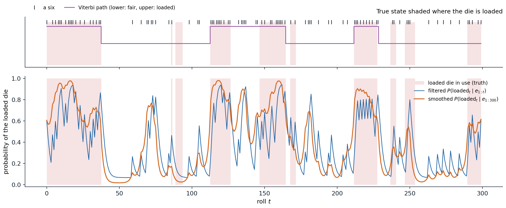
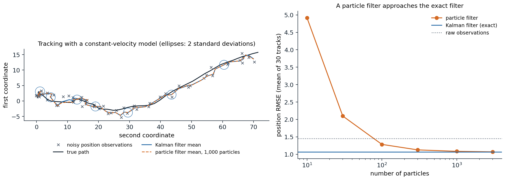

[Background Notes](../README.md) › [Artificial Intelligence](README.md)

# 11. Temporal Probabilistic Models

> [!WARNING]
> Work in progress: this part of the notes is still being revised.

[← 10. Approximate Inference](10-approximate-inference.md) · [12. Decision Theory and the Value of Information →](12-decision-theory-and-the-value-of-information.md)

## <a id="time-and-uncertainty"></a>Time and uncertainty

### <a id="states-observations-and-the-markov-assumption"></a>States, observations, and the Markov assumption

An agent in a changing, partially observable world must track a state it cannot see: the position of a robot from noisy range readings, the words behind a speech signal, the health of a patient from daily measurements. Time is discretized into **slices** $`t=0,1,2,\dots`$; each slice has unobservable **state variables** $`X_t`$ and observable **evidence variables** $`E_t`$, and $`x_{a:b}`$ denotes the values from slice $`a`$ to slice $`b`$. Two assumptions make the problem tractable:

- the **Markov assumption**: the current state depends on the past only through the previous state, $`P(X_t\mid X_{0:t-1})=P(X_t\mid X_{t-1})`$, the **transition model**;
- the **sensor Markov assumption**: the evidence depends only on the current state, $`P(E_t\mid X_{0:t},E_{1:t-1})=P(E_t\mid X_t)`$, the **sensor model**.

With **stationary** models, the same in every slice, the whole process is specified by a prior $`P(X_0)`$ and the two conditional distributions, and the joint distribution factors as

```math
P(X_{0:t},E_{1:t})=P(X_0)\prod_{i=1}^tP(X_i\mid X_{i-1})\,P(E_i\mid X_i),
```

a Bayesian network ([chapter 8](08-bayesian-networks-and-markov-networks.md)) unrolled in time. If the first-order Markov assumption is inaccurate, the state can be augmented, for example with velocity in addition to position, until it holds approximately.

### <a id="markov-chains"></a>Markov chains

Without evidence, the states form a **Markov chain**. For a discrete state with transition matrix $`T_{ij}=P(X_{t+1}=j\mid X_t=i)`$, a distribution $`p_t`$ over states evolves as $`p_{t+1}^\top=p_t^\top T`$. An irreducible, aperiodic chain on finitely many states has a unique **stationary distribution** $`\pi^\top=\pi^\top T`$, and $`p_t\to\pi`$ from any start at a geometric rate set by the second-largest eigenvalue modulus of $`T`$: the chain forgets its initial state. MCMC ([chapter 10](10-approximate-inference.md#markov-chains-and-stationary-distributions)) exploits this convergence, and PageRank is the stationary distribution of a random surfer's chain on the web graph. The same fact limits prediction: forecasts far ahead converge to the stationary distribution and carry no information about the present.

## <a id="hidden-markov-models"></a>Hidden Markov models

### <a id="the-model"></a>The model

A **hidden Markov model** (HMM) has a single discrete state variable, with transition matrix $`T`$ and, for each possible observation $`e`$, a diagonal **sensor matrix** $`O_e`$ with entries $`P(e\mid X_t=i)`$. The standard toy example is the **umbrella world**: a security guard in an underground installation wants to know whether it is raining and sees only whether the director arrives with an umbrella. Rain persists from one day to the next with probability 0.7; the umbrella appears with probability 0.9 on rainy days and 0.2 on dry ones. A more useful example, the **occasionally dishonest casino** ([Durbin et al., 1998](https://doi.org/10.1017/CBO9780511790492)), switches between a fair die and a loaded one that shows a six half the time, and the task is to infer from the rolls when the loaded die was in use.

### <a id="filtering"></a>Filtering

**Filtering**, or **state estimation**, computes the belief state $`P(X_t\mid e_{1:t})`$ from all evidence so far. It is done recursively: predict the next state from the current belief, then condition on the new evidence,

```math
P(X_{t+1}\mid e_{1:t+1})=\alpha\,P(e_{t+1}\mid X_{t+1})\sum_{x_t}P(X_{t+1}\mid x_t)\,P(x_t\mid e_{1:t}),
```

or in matrix form $`f_{t+1}=\alpha\,O_{e_{t+1}}T^\top f_t`$ for the **forward message** $`f_t`$. Each step costs $`O(S^2)`$ for $`S`$ states, independent of $`t`$, so an agent can track its world indefinitely with constant memory ([Appendix A](#block-ai11-appendix-a)). The normalizing constants give the likelihood of the evidence, $`P(e_{1:t})=\prod_s1/\alpha_s`$, which is how HMMs are compared and trained. **Prediction** runs the transition step without evidence and converges to the stationary distribution.

### <a id="smoothing"></a>Smoothing

**Smoothing** computes $`P(X_k\mid e_{1:t})`$ for a past slice $`k<t`$, using evidence that arrived later, which usually sharpens the estimate. It combines the forward message with a **backward message** $`b_k(x)=P(e_{k+1:t}\mid X_k=x)`$, computed by a recursion running back from $`b_t=\mathbf 1`$:

```math
b_k=T\,O_{e_{k+1}}\,b_{k+1},\qquad P(X_k\mid e_{1:t})=\alpha\,f_k\odot b_k.
```

The **forward–backward algorithm** computes all smoothed estimates in $`O(S^2t)`$ time; it is the sum-product algorithm of [chapter 9](09-exact-inference.md#sum-product) on a chain.

### <a id="the-most-likely-sequence"></a>The most likely sequence

**Decoding** asks for the most likely sequence of states, $`\arg\max_{x_{1:t}}P(x_{1:t}\mid e_{1:t})`$, which is not the sequence of individually most likely states: the latter can even be an impossible sequence under the transition model. The **Viterbi algorithm** ([Viterbi, 1967](https://doi.org/10.1109/TIT.1967.1054010)) replaces the sum in the forward recursion by a maximum,

```math
m_{t+1}(x_{t+1})=P(e_{t+1}\mid x_{t+1})\max_{x_t}P(x_{t+1}\mid x_t)\,m_t(x_t),
```

keeps a back pointer to the maximizing $`x_t`$ for every state, and follows the pointers back from the best final state ([Appendix B](#block-ai11-appendix-b)). It is max-product on a chain, run in log space to avoid underflow, and it is the decoder of speech recognizers, gene finders, and convolutional error-correcting codes.

```python
import numpy as np

# The umbrella world: hidden state Rain (index 0 = rain, 1 = no rain), observation Umbrella.
T = np.array([[0.7, 0.3],                   # T[i, j] = P(X_{t+1} = j | X_t = i)
              [0.3, 0.7]])
O = {True: np.array([0.9, 0.2]),            # P(umbrella | rain), P(umbrella | no rain)
     False: np.array([0.1, 0.8])}
prior = np.array([0.5, 0.5])
evidence = [True, True, False, True, True]

# Filtering: f_t proportional to O(e_t) * (T^T f_{t-1}).
f, forward = prior, []
for e in evidence:
    f = O[e] * (T.T @ f)
    f = f / f.sum()
    forward.append(f)
print("filtered P(rain_t | e_1..t):  ", np.round([x[0] for x in forward], 3))

# Smoothing: backward messages b_k(x) = P(e_{k+1..t} | x_k), combined with the forward messages.
b, smoothed = np.ones(2), [None] * len(evidence)
for k in range(len(evidence) - 1, -1, -1):
    s = forward[k] * b
    smoothed[k] = s / s.sum()
    b = T @ (O[evidence[k]] * b)
print("smoothed P(rain_k | e_1..5):   ", np.round([x[0] for x in smoothed], 3))

# Prediction beyond the evidence converges to the stationary distribution of the chain.
p = forward[-1]
for k in range(1, 21):
    p = T.T @ p
    if k in (1, 2, 5, 20):
        print(f"predicted P(rain) {k:2d} days after day 5: {p[0]:.3f}")

# Viterbi: the most likely sequence of states, by max-product in log space with back pointers.
logT = np.log(T)
m = np.log(O[evidence[0]] * (T.T @ prior))
back = []
for e in evidence[1:]:
    scores = m[:, None] + logT               # scores[i, j]: best path ending in i, then i -> j
    back.append(scores.argmax(axis=0))
    m = scores.max(axis=0) + np.log(O[e])
path = [int(m.argmax())]
for bp in reversed(back):
    path.append(int(bp[path[-1]]))
print("most likely sequence:", ["rain" if s == 0 else "dry" for s in reversed(path)])
# filtered P(rain_t | e_1..t):   [0.818 0.883 0.191 0.731 0.867]
# smoothed P(rain_k | e_1..5):    [0.867 0.82  0.307 0.82  0.867]
# predicted P(rain)  1 days after day 5: 0.647
# predicted P(rain)  2 days after day 5: 0.559
# predicted P(rain)  5 days after day 5: 0.504
# predicted P(rain) 20 days after day 5: 0.500
# most likely sequence: ['rain', 'rain', 'dry', 'rain', 'rain']
```

The filtered probability of rain rises to 0.818 after the first umbrella and 0.883 after the second, drops to 0.191 on the umbrella-less third day, and recovers. Smoothing with all five days revises the second day down to 0.820, because the dry third day makes rain on the second less likely, and the third day up to 0.307. Prediction without further evidence decays to the stationary 0.5 within a few days, and the most likely sequence is rain on every day except the third.



*Three hundred rolls of the occasionally dishonest casino, with the true parameters: the fair die is swapped for the loaded one with probability 0.05 after each roll and back with probability 0.1, and the loaded die shows a six with probability 0.5. Shading marks the 39% of rolls made with the loaded die; tick marks in the top panel mark sixes. The filtered probability of the loaded die (blue) jumps after each six and decays after other rolls; the smoothed probability (orange), which also uses later rolls, is steadier and labels 83.3% of the rolls correctly by thresholding at one half, against 77.3% for filtering. The Viterbi path (purple) labels 82.7% correctly and misses the short loaded stretches, which a single most likely sequence cannot afford.*

### <a id="learning-with-baumwelch"></a>Learning with Baum–Welch

The parameters of an HMM are usually unknown. The **Baum–Welch algorithm** ([Baum et al., 1970](https://doi.org/10.1214/aoms/1177697196)) is the EM algorithm of [ML chapter 14](../ml/14-gaussian-mixtures-and-expectation-maximization.md#em-beyond-gaussian-mixtures) for HMMs. The E-step runs forward–backward to compute the expected number of times each state is occupied, each transition is taken, and each observation is emitted from each state; the M-step sets the parameters to the normalized expected counts. Each iteration increases the likelihood of the observations, which converges to a local maximum. The forward and backward messages are rescaled at every step, since for long sequences their raw values underflow.

```python
import numpy as np

rng = np.random.default_rng(0)
# The occasionally dishonest casino: state 0 = fair die, state 1 = loaded die (a six half of the time).
A_true = np.array([[0.95, 0.05], [0.10, 0.90]])
B_true = np.array([[1 / 6] * 6, [0.1] * 5 + [0.5]])
n = 3000
states, obs = np.zeros(n, int), np.zeros(n, int)
for t in range(n):
    states[t] = rng.choice(2, p=A_true[states[t - 1]] if t else [0.5, 0.5])
    obs[t] = rng.choice(6, p=B_true[states[t]])


def forward_backward(A, B, pi, obs):
    """Scaled forward-backward. Returns state posteriors, expected transition counts, and the log-likelihood."""
    n, k = len(obs), len(pi)
    alpha, c = np.zeros((n, k)), np.zeros(n)
    alpha[0] = pi * B[:, obs[0]]
    c[0] = alpha[0].sum()
    alpha[0] /= c[0]
    for t in range(1, n):
        alpha[t] = (alpha[t - 1] @ A) * B[:, obs[t]]
        c[t] = alpha[t].sum()
        alpha[t] /= c[t]
    beta = np.ones((n, k))
    for t in range(n - 2, -1, -1):
        beta[t] = A @ (B[:, obs[t + 1]] * beta[t + 1]) / c[t + 1]
    gamma = alpha * beta
    xi = sum(alpha[t][:, None] * A * (B[:, obs[t + 1]] * beta[t + 1])[None, :] / c[t + 1] for t in range(n - 1))
    return gamma, xi, np.log(c).sum()


# Baum-Welch (EM) from a poor initial guess.
A = np.array([[0.8, 0.2], [0.2, 0.8]])
B = np.array([[1 / 6] * 6, [0.15] * 5 + [0.25]])
pi = np.array([0.5, 0.5])
for it in range(1, 201):
    gamma, xi, ll = forward_backward(A, B, pi, obs)          # E-step: expected counts
    A = xi / xi.sum(axis=1, keepdims=True)                   # M-step: normalized expected counts
    B = np.array([[gamma[obs == v, s].sum() for v in range(6)] for s in range(2)])
    B /= B.sum(axis=1, keepdims=True)
    pi = gamma[0]
    if it in (1, 2, 5, 20, 200):
        print(f"iteration {it:3d}: log-likelihood {ll:.2f}")
print("learned transitions:", np.round(A, 3).tolist())
print("learned P(six | fair), P(six | loaded):", np.round(B[:, 5], 3).tolist())
gamma, _, ll_learned = forward_backward(A, B, pi, obs)
_, _, ll_true = forward_backward(A_true, B_true, np.array([0.5, 0.5]), obs)
print(f"log-likelihood with learned parameters {ll_learned:.2f}, with the true ones {ll_true:.2f}")
print(f"posterior decoding with the learned model labels {np.mean((gamma[:, 1] > 0.5) == states):.1%} of rolls correctly")
# iteration   1: log-likelihood -5315.14
# iteration   2: log-likelihood -5294.63
# iteration   5: log-likelihood -5287.52
# iteration  20: log-likelihood -5271.40
# iteration 200: log-likelihood -5267.89
# learned transitions: [[0.951, 0.049], [0.122, 0.878]]
# learned P(six | fair), P(six | loaded): [0.159, 0.491]
# log-likelihood with learned parameters -5267.89, with the true ones -5272.29
# posterior decoding with the learned model labels 81.5% of rolls correctly
```

From three thousand rolls and a poor starting guess, Baum–Welch recovers switching probabilities of 0.049 and 0.122 (true values 0.05 and 0.1) and a loaded die that shows a six with probability 0.491. The learned parameters fit the data slightly better than the true ones, as maximum-likelihood estimates do, and posterior decoding with them labels 81.5% of the rolls correctly. The states are identified only up to relabeling: nothing in the data says which state should be called "loaded", and a different start could swap them.

## <a id="kalman-filters"></a>Kalman filters

### <a id="linear-gaussian-models"></a>Linear-Gaussian models

For continuous states such as positions and velocities, the analogue of the HMM is the **linear-Gaussian** model:

```math
x_{t+1}=Fx_t+w_t,\quad w_t\sim\mathcal N(0,Q),\qquad z_t=Hx_t+v_t,\quad v_t\sim\mathcal N(0,R).
```

Because linear maps and conditioning preserve Gaussianity ([Foundations chapter 4](../foundations/04-probability-and-statistics.md#gaussian-vectors-and-conditioning)), the belief state stays Gaussian, $`\mathcal N(\mu_t,\Sigma_t)`$, and filtering reduces to updating a mean and a covariance.

### <a id="the-kalman-filter"></a>The Kalman filter

The **Kalman filter** ([Kalman, 1960](https://doi.org/10.1115/1.3662552)) alternates two steps:

- **predict:** $`\mu^-=F\mu_t`$ and $`\Sigma^-=F\Sigma_tF^\top+Q`$; the motion model moves the estimate and the process noise inflates its uncertainty;
- **update:** with the **Kalman gain** $`K=\Sigma^-H^\top(H\Sigma^-H^\top+R)^{-1}`$, set $`\mu_{t+1}=\mu^-+K(z_{t+1}-H\mu^-)`$ and $`\Sigma_{t+1}=(I-KH)\Sigma^-`$; the estimate moves toward the observation in proportion to the relative confidence in prediction and measurement.

For a one-dimensional random walk observed with noise, the update is the precision-weighted average of prediction and observation, and the variance converges to a fixed point:

```python
import numpy as np

# A random walk observed with noise: x_{t+1} = x_t + w_t, w ~ N(0, q); z_t = x_t + v_t, v ~ N(0, r).
q, r = 0.1, 1.0
rng = np.random.default_rng(0)
x, mean, var = 0.0, 0.0, 10.0                       # a vague prior on the initial position
errors = []
for t in range(1, 201):
    x += rng.normal(0, np.sqrt(q))
    z = x + rng.normal(0, np.sqrt(r))
    var_pred = var + q                               # predict: the uncertainty grows by q
    gain = var_pred / (var_pred + r)                 # the Kalman gain weighs prediction against observation
    mean = mean + gain * (z - mean)                  # update: move toward the observation
    var = (1 - gain) * var_pred
    errors.append(mean - x)
    if t in (1, 2, 5, 10, 200):
        print(f"t={t:3d}: gain {gain:.3f}, posterior variance {var:.4f}")
steady = (-q + np.sqrt(q ** 2 + 4 * q * r)) / 2      # fixed point of var = (var + q) r / (var + q + r)
print(f"steady-state variance {steady:.4f}; squared error of the estimates over steps 21-200: {np.mean(np.square(errors[20:])):.4f}")
# t=  1: gain 0.910, posterior variance 0.9099
# t=  2: gain 0.502, posterior variance 0.5025
# t=  5: gain 0.297, posterior variance 0.2970
# t= 10: gain 0.271, posterior variance 0.2713
# t=200: gain 0.270, posterior variance 0.2702
# steady-state variance 0.2702; squared error of the estimates over steps 21-200: 0.2959
```

The gain starts near 1, when the vague prior makes the first observation almost the whole estimate, and settles at 0.270 within ten steps, at the variance predicted by the fixed-point equation. The covariance recursion does not depend on the observations at all, so it can be computed in advance, and the steady-state gain gives a fixed linear filter. The mean squared error of the estimates, 0.296 over the last 180 steps, matches the filter's own variance of 0.270 up to sampling noise: the filter knows how uncertain it is, when its model is right.



*Left: tracking an object that moves with random accelerations, observed in position with unit noise variance in each coordinate, over 60 steps. The Kalman filter's mean (blue) smooths the observations (crosses) and its two-standard-deviation ellipses contain the true path; a particle filter with 1,000 particles (dashed) is almost indistinguishable. On this track the position errors have root mean square 1.56 for the raw observations, 1.14 for the Kalman filter, and 1.14 for the particle filter. Right: averaged over 30 tracks, the Kalman filter's error is 1.06 against 1.45 for the observations; the particle filter needs about 300 particles to come within 6% of it, 1.13, and reaches 1.07 with 3,000, while with 10 particles its error is 4.9, worse than ignoring the model.*

### <a id="nonlinear-extensions"></a>Nonlinear extensions

When the dynamics or the sensor are nonlinear, the belief state is no longer Gaussian. The **extended Kalman filter** linearizes the models around the current estimate with their Jacobians, and the **unscented Kalman filter** propagates a small set of deterministically chosen sample points through the nonlinear functions and refits a Gaussian. Both work when the nonlinearity is mild over the scale of the uncertainty and fail when the posterior is multimodal, such as a robot that could be in either of two identical corridors.

## <a id="dynamic-bayesian-networks"></a>Dynamic Bayesian networks

### <a id="factored-state"></a>Factored state

A **dynamic Bayesian network** (DBN) represents the state of each slice by several variables, with arcs within a slice and from one slice to the next ([Dean and Kanazawa, 1989](https://doi.org/10.1111/j.1467-8640.1989.tb00324.x)). Every HMM is a DBN with one state variable, and every discrete DBN can be converted into an HMM whose state is the tuple of all its state variables, but the conversion is exponential: a DBN with 20 Boolean state variables, each with three parents in the previous slice, needs $`20\times2^3=160`$ transition parameters, while the equivalent HMM has a transition matrix with $`2^{20}\times2^{20}\approx10^{12}`$ entries. Kalman filters are DBNs with linear-Gaussian conditionals, and switching models, factorial HMMs, and the models of robot localization are DBNs.

Compact representation does not bring compact inference. Exact filtering in a DBN, by unrolling it and eliminating the variables of past slices, soon makes all state variables of a slice dependent on each other, because they share ancestors in the past. The forward message then needs the full joint of the state variables, exponential in their number, and approximate inference is the rule.

### <a id="particle-filtering"></a>Particle filtering

**Particle filtering**, or sequential Monte Carlo ([Gordon, Salmond, and Smith, 1993](https://doi.org/10.1049/ip-f-2.1993.0015)), represents the belief state by $`N`$ samples, **particles**, and repeats three steps each time slice:

1. **propagate:** move each particle forward by sampling from the transition model, $`x^{(i)}_{t+1}\sim P(X_{t+1}\mid x^{(i)}_t)`$;
2. **weight:** give each particle the likelihood of the new evidence, $`w^{(i)}=P(e_{t+1}\mid x^{(i)}_{t+1})`$;
3. **resample:** draw $`N`$ new particles from the current ones with probabilities proportional to the weights.

Propagation and weighting are the likelihood weighting of [chapter 10](10-approximate-inference.md#likelihood-weighting) applied one slice at a time; resampling is what keeps the method from degenerating, by discarding particles in regions the evidence has made improbable and duplicating those in probable regions, so that the population concentrates where the posterior mass is. The particle approximation is consistent as $`N\to\infty`$ for each fixed horizon, and it handles nonlinear models, discrete and continuous variables, and multimodal beliefs, which is why **Monte Carlo localization** with particle filters is the standard way for mobile robots to track their position on a map ([Thrun, Burgard, and Fox, 2005](https://mitpress.mit.edu/9780262201629/probabilistic-robotics/)). Its weaknesses are high-dimensional states, where exponentially many particles are needed to cover the posterior, and very informative observations, which leave almost all particles with negligible weight; better proposals that look at the new evidence, and **Rao–Blackwellization**, which handles some variables exactly and samples only the rest, address both.

## <a id="appendices"></a>Appendices


<details>
<summary><a id="block-ai11-appendix-a"></a><b>A. The forward and backward recursions</b></summary>


**Forward.** By the product rule and the sensor Markov assumption,

```math
P(X_{t+1}\mid e_{1:t+1})=\alpha\,P(e_{t+1}\mid X_{t+1},e_{1:t})\,P(X_{t+1}\mid e_{1:t})=\alpha\,P(e_{t+1}\mid X_{t+1})\,P(X_{t+1}\mid e_{1:t}).
```

The one-step prediction sums over the current state, using the Markov assumption $`P(X_{t+1}\mid x_t,e_{1:t})=P(X_{t+1}\mid x_t)`$:

```math
P(X_{t+1}\mid e_{1:t})=\sum_{x_t}P(X_{t+1}\mid x_t)\,P(x_t\mid e_{1:t}).
```

**Backward.** For $`k<t`$, conditioning on $`X_{k+1}`$ and using the conditional independence of $`e_{k+1}`$ and $`e_{k+2:t}`$ given $`X_{k+1}`$,

```math
P(e_{k+1:t}\mid X_k)=\sum_{x_{k+1}}P(x_{k+1}\mid X_k)\,P(e_{k+1}\mid x_{k+1})\,P(e_{k+2:t}\mid x_{k+1}),
```

which is $`b_k=TO_{e_{k+1}}b_{k+1}`$ in matrix form. Finally, since $`e_{k+1:t}`$ is independent of $`e_{1:k}`$ given $`X_k`$, Bayes' rule gives $`P(X_k\mid e_{1:t})=\alpha\,P(X_k\mid e_{1:k})\,P(e_{k+1:t}\mid X_k)=\alpha\,f_k\odot b_k`$.

</details>


<details>
<summary><a id="block-ai11-appendix-b"></a><b>B. Correctness of the Viterbi algorithm</b></summary>


Define $`m_t(x)=\max_{x_{1:t-1}}P(x_{1:t-1},X_t=x,e_{1:t})`$, the probability of the best path that ends in state $`x`$ at time $`t`$, jointly with the evidence. By the factorization of the joint,

```math
m_{t+1}(x')=\max_{x}\;\max_{x_{1:t-1}}P(x_{1:t-1},X_t=x,e_{1:t})\,P(x'\mid x)\,P(e_{t+1}\mid x')=P(e_{t+1}\mid x')\max_xP(x'\mid x)\,m_t(x),
```

because the new factors depend on the past only through $`x`$. This is the **principle of optimality** of dynamic programming: the best path to $`x'`$ at time $`t+1`$ extends the best path to some $`x`$ at time $`t`$. Recording the maximizing $`x`$ for each $`x'`$ and following these pointers back from $`\arg\max_xm_t(x)`$ reconstructs a most probable sequence, since $`\max_{x_{1:t}}P(x_{1:t}\mid e_{1:t})\propto\max_xm_t(x)`$. The cost is $`O(S^2t)`$ time and $`O(St)`$ memory for the pointers; the memory can be reduced when only a delayed decision is needed.

</details>


<details>
<summary><a id="block-ai11-appendix-c"></a><b>C. The Kalman update as Bayesian conditioning</b></summary>


Given the prediction $`x\sim\mathcal N(\mu^-,\Sigma^-)`$ and the observation model $`z=Hx+v`$ with $`v\sim\mathcal N(0,R)`$, the pair $`(x,z)`$ is jointly Gaussian with

```math
\mathbb E\begin{bmatrix}x\\z\end{bmatrix}=\begin{bmatrix}\mu^-\\H\mu^-\end{bmatrix},\qquad\mathrm{Cov}\begin{bmatrix}x\\z\end{bmatrix}=\begin{bmatrix}\Sigma^-&\Sigma^-H^\top\\H\Sigma^-&H\Sigma^-H^\top+R\end{bmatrix}.
```

Gaussian conditioning gives $`\mathbb E[x\mid z]=\mu^-+\Sigma^-H^\top(H\Sigma^-H^\top+R)^{-1}(z-H\mu^-)`$ and $`\mathrm{Cov}[x\mid z]=\Sigma^--\Sigma^-H^\top(H\Sigma^-H^\top+R)^{-1}H\Sigma^-`$, which are the update equations with the gain $`K`$. In one dimension with $`H=1`$, the posterior precision is the sum of the prior and measurement precisions, $`1/\sigma^2=1/\sigma_-^2+1/r`$, and the mean is their precision-weighted average; the gain $`K=\sigma_-^2/(\sigma_-^2+r)`$ is the fraction of the weight given to the measurement. For the random walk of the text, the fixed point of $`\sigma^2=(\sigma^2+q)r/(\sigma^2+q+r)`$ solves $`\sigma^4+q\sigma^2-qr=0`$.

</details>

---

[← 10. Approximate Inference](10-approximate-inference.md) · [12. Decision Theory and the Value of Information →](12-decision-theory-and-the-value-of-information.md)
