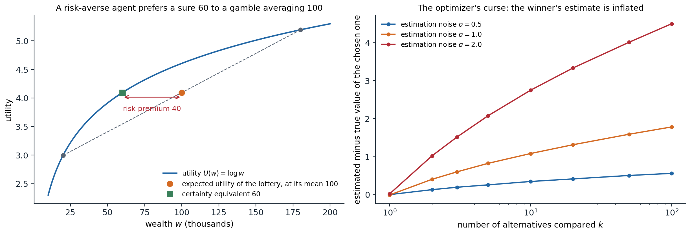
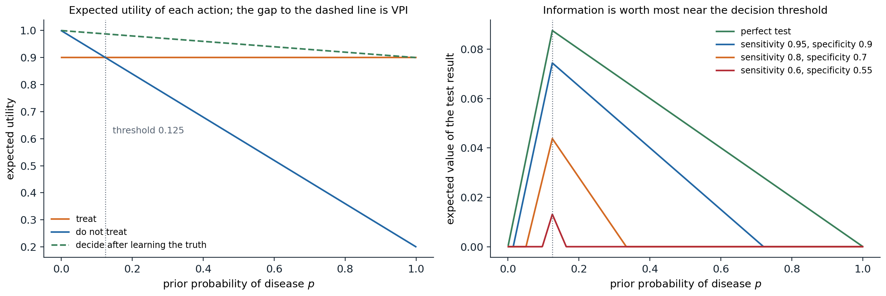

[Background Notes](../README.md) › [Artificial Intelligence](README.md)

# 12. Decision Theory and the Value of Information

[← 11. Temporal Probabilistic Models](11-temporal-probabilistic-models.md) · [13. Causal Inference →](13-causal-inference.md)

## <a id="rational-preferences"></a>Rational preferences

### <a id="beliefs-are-not-enough"></a>Beliefs are not enough

Chapters 8–11 compute what an agent should believe. To act, it also needs to know what it wants. A **decision-theoretic agent** combines the two: it holds probabilities over the outcomes of its actions and a **utility function** over outcomes, and chooses the action with the highest expected utility. This chapter asks where utilities come from, why maximizing their expectation is the rational way to combine them with probabilities, and how an agent should decide what to observe before acting. It concerns single decisions, or fixed sequences of observations and decisions; sequential decision making under uncertainty, where each action changes the situation for the next, is the subject of the RL module, which builds on the utilities and expectations defined here. Foundations chapter 4 treats decisions from the statistician's side, with losses given in advance; here the losses themselves are the object of study.

### <a id="lotteries-and-the-axioms-of-utility"></a>Lotteries and the axioms of utility

The objects of choice are **lotteries**: probability distributions over outcomes, written $`L=[p_1,S_1;\;p_2,S_2;\;\dots;\;p_n,S_n]`$, where each $`S_i`$ is an outcome or itself a lottery. A sure outcome is a lottery with one entry. The agent's preferences are a relation on lotteries: $`A\succ B`$ means $`A`$ is preferred, $`A\sim B`$ means indifference, and $`A\succsim B`$ means either. The axioms of **utility theory** ([von Neumann and Morgenstern, 1944](https://press.princeton.edu/books/paperback/9780691130613/theory-of-games-and-economic-behavior)) constrain these preferences:

- **Orderability:** for any two lotteries, exactly one of $`A\succ B`$, $`B\succ A`$, $`A\sim B`$ holds.
- **Transitivity:** if $`A\succ B`$ and $`B\succ C`$, then $`A\succ C`$.
- **Continuity:** if $`A\succ B\succ C`$, there is a $`p`$ with $`[p,A;\;1-p,C]\sim B`$.
- **Substitutability:** if $`A\sim B`$, then $`[p,A;\;1-p,C]\sim[p,B;\;1-p,C]`$; indifferent lotteries can replace each other inside more complex ones.
- **Monotonicity:** if $`A\succ B`$, then $`[p,A;\;1-p,B]\succ[q,A;\;1-q,B]`$ exactly when $`p>q`$.
- **Decomposability:** compound lotteries reduce to simple ones by the laws of probability, $`[p,A;\;1-p,[q,B;\;1-q,C]]\sim[p,A;\;(1-p)q,B;\;(1-p)(1-q),C]`$: there is no "fun in gambling" itself.

The axioms are constraints on consistency, not on tastes. An agent that violates them can be exploited. With intransitive preferences, $`A\succ B\succ C\succ A`$, it will pay a small amount to trade $`C`$ for $`B`$, then $`B`$ for $`A`$, then $`A`$ for $`C`$, and end where it started, poorer: a **money pump**. Similar **Dutch book** arguments show that beliefs violating the laws of probability can be exploited by a set of bets each of which the agent accepts.

### <a id="the-utility-theorem"></a>The utility theorem

**Theorem (von Neumann–Morgenstern).** If preferences satisfy the axioms, there is a real-valued function $`U`$ on outcomes such that

```math
A\succ B\iff U(A)>U(B),\qquad U\bigl([p_1,S_1;\dots;p_n,S_n]\bigr)=\sum_ip_i\,U(S_i).
```

The utility of a lottery is the expected utility of its outcomes, and $`U`$ is unique up to a **positive affine transformation** $`U'=aU+b`$ with $`a>0`$ ([Appendix A](#block-ai12-appendix-a)). The theorem justifies the **principle of maximum expected utility** (MEU): given evidence $`e`$, a rational agent chooses

```math
a^*=\arg\max_a\;\mathbb E[U\mid a,e]=\arg\max_a\sum_sP(\mathrm{Result}(a)=s\mid a,e)\,U(s).
```

The principle does not say that agents compute utilities or maximize them explicitly; it says that the behavior of any agent with consistent preferences can be described as if it did. It also fixes what utility numbers mean: only their ratios of differences are meaningful, which is why, unlike in deterministic games (chapter 4), a monotone but nonlinear rescaling of utilities can change decisions under uncertainty.

## <a id="utility-functions"></a>Utility functions

### <a id="the-utility-of-money"></a>The utility of money

Money is the obvious candidate for a utility, and it is a poor one. The **St. Petersburg lottery** pays $`2^k`$ dollars if the first head in a sequence of fair coin tosses appears on toss $`k`$, which happens with probability $`2^{-k}`$; its expected payoff $`\sum_k2^{-k}2^k`$ is infinite, yet nobody would pay more than a few dollars to play. Daniel Bernoulli's resolution in 1738 was that the utility of money grows more slowly than money, logarithmically in his proposal. With a concave utility of total wealth, a lottery is worth less than its expected value.

The **certainty equivalent** of a lottery is the sure amount with the same utility, and the difference between the expected value and the certainty equivalent is the **risk premium**. An agent with a concave utility is **risk-averse** (positive premium), with a linear one **risk-neutral**, and with a convex one **risk-seeking**; by Jensen's inequality, concavity is exactly what makes $`\mathbb E[U(X)]\le U(\mathbb E[X])`$. Insurance works because the risk-averse policyholder's premium exceeds the expected loss, which a large, nearly risk-neutral insurer is happy to accept. The **exponential utility** $`U(x)=-e^{-x/R}`$ has constant absolute risk aversion, with **risk tolerance** $`R`$: its certainty equivalent does not depend on current wealth, and for a normal lottery it is $`\mu-\sigma^2/(2R)`$ ([Appendix C](#block-ai12-appendix-c)).

```python
import numpy as np

# Exponential utility U(x) = -exp(-x / R), constant absolute risk aversion with risk tolerance R.
# For a normal lottery X ~ N(mu, sigma^2), the certainty equivalent is mu - sigma^2 / (2R).
rng = np.random.default_rng(0)
mu, sigma = 100.0, 40.0
x = rng.normal(mu, sigma, 1_000_000)
for R in [50.0, 200.0, 1000.0]:
    ce_mc = -R * np.log(np.mean(np.exp(-x / R)))            # solve U(CE) = E[U(X)] from samples
    print(f"risk tolerance {R:6.0f}: certainty equivalent {ce_mc:6.1f} (formula {mu - sigma ** 2 / (2 * R):6.1f})")

# The St. Petersburg lottery pays 2^k with probability 2^-k: its expected value is infinite.
k = np.arange(1, 200)
p = 0.5 ** k
print(f"expected payoff of the first 30 terms: {np.sum(p[:30] * 2.0 ** k[:30]):.0f}, and it grows without bound")
for w0 in [0.0, 1000.0, 1e6]:
    eu = np.sum(p * np.log(w0 + 2.0 ** k))                  # logarithmic utility of final wealth
    print(f"with wealth {w0:>9,.0f}, a log-utility agent values the lottery at {np.exp(eu) - w0:.2f}")
# risk tolerance     50: certainty equivalent   84.0 (formula   84.0)
# risk tolerance    200: certainty equivalent   96.0 (formula   96.0)
# risk tolerance   1000: certainty equivalent   99.2 (formula   99.2)
# expected payoff of the first 30 terms: 30, and it grows without bound
# with wealth         0, a log-utility agent values the lottery at 4.00
# with wealth     1,000, a log-utility agent values the lottery at 10.97
# with wealth 1,000,000, a log-utility agent values the lottery at 20.87
```

A normal lottery with mean 100 and standard deviation 40 is worth 84 to an agent with risk tolerance 50 and 99.2 to one with risk tolerance 1,000, as the formula predicts. The St. Petersburg lottery, whose partial expected payoff grows by one with every term, is worth four dollars to a log-utility agent with nothing else, eleven to one with a thousand, and only 21 to a millionaire: with logarithmic utility the value grows with the logarithm of wealth, while the lottery's payoffs beyond the owner's wealth count for little.



*Left: with logarithmic utility of wealth, a fifty-fifty lottery between 20 and 180 thousand has expected wealth 100 thousand but the same utility as a sure 60 thousand, a risk premium of 40 thousand. The chord between the two outcomes lies below the concave utility curve. Right: the optimizer's curse. Each of $`k`$ alternatives has a true value drawn from a standard normal distribution and an unbiased estimate with normal noise of standard deviation $`\sigma`$; choosing the alternative with the highest estimate, the chosen alternative's estimate exceeds its true value on average by 0.35, 1.08, and 2.75 for ten alternatives and $`\sigma=0.5`$, 1, and 2, and by 0.56, 1.78, and 4.50 for a hundred (20,000 trials each).*

### <a id="assessing-utilities"></a>Assessing utilities

Utilities of outcomes can be elicited by the **standard gamble**: fix a best outcome with utility 1 and a worst with utility 0, and for any outcome $`S`$ find the probability $`p`$ at which the agent is indifferent between $`S`$ for sure and the lottery $`[p,\text{best};\;1-p,\text{worst}]`$; then $`U(S)=p`$. In medicine and public policy, outcomes involving risk to life are measured in **micromorts**, one-in-a-million chances of death, and in **quality-adjusted life years** (QALYs), which weight years of life by their quality. Such assessments are unavoidable whenever resources are allocated, and making them explicit exposes them to scrutiny.

### <a id="human-judgment-departs-from-the-axioms"></a>Human judgment departs from the axioms

People systematically violate expected-utility theory. In the **Allais paradox**, most people prefer $`B`$ (3,000 for sure) to $`A`$ (4,000 with probability 0.8), and prefer $`C`$ (4,000 with probability 0.2) to $`D`$ (3,000 with probability 0.25). The first choice says $`U(3000)>0.8\,U(4000)`$; the second says $`0.2\,U(4000)>0.25\,U(3000)`$, that is, $`U(3000)<0.8\,U(4000)`$. No utility function allows both: the preference for certainty, the **certainty effect**, violates substitutability. The **Ellsberg paradox** shows aversion to ambiguity, unknown probabilities, beyond risk; **framing effects** show choices changing with whether the same outcomes are described as gains or losses. **Prospect theory** ([Kahneman and Tversky, 1979](https://doi.org/10.2307/1914185)) describes these patterns with a value function over gains and losses relative to a reference point, steeper for losses, and with decision weights that overweight small probabilities.

These findings describe human behavior; they do not make the axioms wrong as a standard. An artificial agent built to serve people must, however, take into account that the preferences people state may not be the ones they would endorse on reflection, a theme of preference learning in the Safety and Frontier module.

### <a id="the-optimizer-s-curse"></a>The optimizer's curse

Choosing the best of many options by noisy estimates of their values is biased even when every estimate is unbiased: the chosen option is likely to be one whose value was overestimated. The expected value of the chosen option is therefore lower than its estimate, the **optimizer's curse** ([Smith and Winkler, 2006](https://doi.org/10.1287/mnsc.1050.0451)), as the right panel of the figure above shows: the disappointment grows with the noise and with the number of options compared. The remedy is Bayesian: shrink each estimate toward the prior in proportion to its uncertainty before choosing. The same effect appears whenever an optimizer is pointed at an imperfect measure of what is wanted, from overfitting to a validation set by trying many models to **Goodhart's law**, "when a measure becomes a target, it ceases to be a good measure", and it is a central concern of reward modeling in the Safety and Frontier module.

## <a id="multiattribute-utility"></a>Multiattribute utility

Most decisions trade off several attributes: cost, safety, time, environmental impact. When outcomes are vectors $`x=(x_1,\dots,x_n)`$, two tools avoid assessing a utility over all combinations directly.

- **Dominance.** Option $`A`$ **strictly dominates** $`B`$ if it is at least as good on every attribute and better on one; dominated options can be discarded without knowing the utility. Under uncertainty, $`A`$ **stochastically dominates** $`B`$ on an attribute if its cumulative distribution lies nowhere above $`B`$'s, $`F_A(x)\le F_B(x)`$ for all $`x`$; then every agent whose utility increases in that attribute prefers $`A`$.
- **Independence structure.** If each set of attributes is **preferentially independent** of the rest, meaning that trade-offs among them do not depend on the fixed values of the others, the preference ordering over deterministic outcomes is represented by an additive value function $`V(x)=\sum_iV_i(x_i)`$. Under uncertainty, the stronger condition of **mutual utility independence** gives a multiplicative utility, a combination of single-attribute utilities with a few interaction constants ([Keeney and Raiffa, 1976](https://doi.org/10.1017/CBO9781139174084)).

## <a id="decision-networks"></a>Decision networks

**Decision networks**, or **influence diagrams**, extend Bayesian networks with two kinds of nodes ([Howard and Matheson, 1984](https://doi.org/10.1287/deca.1050.0020)): **decision nodes** (rectangles), whose values the agent chooses, and **utility nodes** (diamonds), deterministic functions of their parents giving the utility. Arcs into a decision node are **information arcs**: they show what the agent knows when it decides. A decision network represents a decision problem compactly, as a Bayesian network represents a joint distribution, and it is evaluated by inference:

1. set the evidence variables to their observed values;
2. for each value of the decision node, set the node to that value and compute the expected utility with any inference algorithm of chapters 9–10;
3. choose the value with the highest expected utility.

With several decisions made in sequence, each observing more, the network is evaluated backward from the last decision, as in dynamic programming. Influence diagrams are used in medical decision support, engineering reliability, and oil exploration; their sequential, repeated version is the Markov decision process of the RL module.

## <a id="the-value-of-information"></a>The value of information

### <a id="value-of-perfect-information"></a>Value of perfect information

Some actions only gather information: tests, measurements, surveys, questions. **Information value theory** ([Howard, 1966](https://doi.org/10.1109/TSSC.1966.300074)) says how much they are worth. Let $`\alpha`$ be the best action given the current evidence $`e`$, with expected utility $`\mathrm{EU}(\alpha\mid e)`$. If the agent could observe the value of a variable $`E_j`$ before deciding, it would choose the best action $`\alpha_{e_{jk}}`$ for each observed value $`e_{jk}`$. Since the value is not yet known, the expected utility of deciding after observing is averaged over the current beliefs about it, and the **value of perfect information** is

```math
\mathrm{VPI}_e(E_j)=\Bigl(\sum_kP(E_j=e_{jk}\mid e)\,\mathrm{EU}\bigl(\alpha_{e_{jk}}\mid e,E_j=e_{jk}\bigr)\Bigr)-\mathrm{EU}(\alpha\mid e).
```

It is the most the agent should pay for the observation. Information has value only because it can change a decision: if the best action is the same for every possible outcome, the VPI is zero, however much the information reduces uncertainty. The VPI has three properties ([Appendix B](#block-ai12-appendix-b)):

- **Nonnegative in expectation:** $`\mathrm{VPI}_e(E_j)\ge0`$. An observation can reveal that things are worse than hoped, but an agent that ignores information it could have had cannot expect to do better.
- **Not additive:** $`\mathrm{VPI}(E_j,E_k)\neq\mathrm{VPI}(E_j)+\mathrm{VPI}(E_k)`$ in general. Two redundant tests are worth little more than one; two complementary ones can be worth more together than apart.
- **Order-independent:** acquiring $`E_j`$ then $`E_k`$ is worth the same in total as acquiring them together or in the other order.

```python
# A decision network: take an umbrella or not, with a weather forecast that can be observed first.
P_rain = 0.3
P_forecast = {True: {"sunny": 0.1, "cloudy": 0.3, "rainy": 0.6},      # P(forecast | rain)
              False: {"sunny": 0.7, "cloudy": 0.2, "rainy": 0.1}}     # P(forecast | no rain)
U = {("take", True): 70, ("take", False): 20, ("leave", True): 0, ("leave", False): 100}
actions = ["take", "leave"]


def eu(action, p_rain):
    return p_rain * U[(action, True)] + (1 - p_rain) * U[(action, False)]


def best(p_rain):
    return max(actions, key=lambda a: eu(a, p_rain))


# Without the forecast: choose the action with the highest expected utility under the prior.
a0 = best(P_rain)
meu0 = eu(a0, P_rain)
print(f"no forecast: EU(take) = {eu('take', P_rain):.1f}, EU(leave) = {eu('leave', P_rain):.1f}; best: {a0}")

# With the forecast: for each possible forecast, update the belief and choose the best action.
meu_f = 0.0
for f in ["sunny", "cloudy", "rainy"]:
    p_f = P_rain * P_forecast[True][f] + (1 - P_rain) * P_forecast[False][f]
    post = P_rain * P_forecast[True][f] / p_f
    a = best(post)
    meu_f += p_f * eu(a, post)
    print(f"  forecast {f:6s}: P(forecast) = {p_f:.2f}, P(rain | forecast) = {post:.3f}, best: {a}")
print(f"value of the forecast: {meu_f:.2f} - {meu0:.2f} = {meu_f - meu0:.2f}")

# Perfect information about the weather: the upper bound on the value of any forecast.
meu_perfect = P_rain * max(U[(a, True)] for a in actions) + (1 - P_rain) * max(U[(a, False)] for a in actions)
print(f"value of perfect information: {meu_perfect:.2f} - {meu0:.2f} = {meu_perfect - meu0:.2f}")
# no forecast: EU(take) = 35.0, EU(leave) = 70.0; best: leave
#   forecast sunny : P(forecast) = 0.52, P(rain | forecast) = 0.058, best: leave
#   forecast cloudy: P(forecast) = 0.23, P(rain | forecast) = 0.391, best: leave
#   forecast rainy : P(forecast) = 0.25, P(rain | forecast) = 0.720, best: take
# value of the forecast: 77.00 - 70.00 = 7.00
# value of perfect information: 91.00 - 70.00 = 21.00
```

Under the prior, rain is unlikely enough that leaving the umbrella is best, with expected utility 70. A forecast of rain raises the probability of rain to 0.72, above the break-even point of 0.53, and changes the decision; the other forecasts do not. The forecast is therefore worth 7 utility units, a third of the 21 that perfect knowledge of the weather would be worth, and only its rainy outcome contributes.



*A treatment decision. Treating gives utility 0.9 whether or not the patient has the disease (a cure with side effects); not treating gives 1.0 if the patient is healthy and 0.2 if not, so treating is best when the probability of disease exceeds 0.125. Left: the expected utility of each action as a function of the prior probability of disease, and of deciding after learning the truth (dashed); the gap between the dashed line and the better action is the value of perfect information, largest at the threshold. Right: the expected value of tests of different accuracy. A perfect test is worth up to 0.0875, at the threshold; a test with sensitivity 0.95 and specificity 0.9 up to 0.0744, and nothing unless the prior lies between 0.015 and 0.719; weaker tests are worth less and over a narrower range, down to a test with sensitivity 0.6 and specificity 0.55, which is worth at most 0.0131 and only for priors between 0.097 and 0.164, where its result can move the belief across the threshold.*

### <a id="information-gathering"></a>Information gathering

An agent that can choose which observations to make can use VPI directly: repeatedly acquire the observation with the highest value minus cost, until no observation is worth its cost, then act. This **myopic** strategy considers one observation at a time and can undervalue observations that are useful only in combination, since non-additivity means that each alone may seem worthless; nonmyopic planning of observations is a sequential decision problem, a partially observable Markov decision process, and belongs to the RL module. In active learning (ML chapter 16), Bayesian optimization, and medical diagnosis, heuristics based on expected information gain or expected improvement play the role of VPI.

The same reasoning applies to computation itself: thinking is an action whose value is the expected improvement of the decision it might bring. **Metareasoning** uses this to decide which part of a search tree to expand, or when to stop deliberating, and the selection rule of Monte Carlo tree search (chapter 4) can be read as an approximation of it.

## <a id="appendices"></a>Appendices


<details>
<summary><a id="block-ai12-appendix-a"></a><b>A. The utility theorem</b></summary>


Assume the axioms and, for simplicity, finitely many outcomes, with a best outcome $`S^\top`$ and a worst $`S^\bot`$, $`S^\top\succ S^\bot`$ (if all outcomes are equivalent, any constant utility works). For each outcome $`S`$, continuity gives a probability $`u_S`$ with

```math
S\sim[u_S,S^\top;\;1-u_S,S^\bot],
```

and monotonicity makes it unique. Define $`U(S)=u_S`$. For a lottery $`L=[p_1,S_1;\dots;p_n,S_n]`$, substitutability lets each $`S_i`$ be replaced by its equivalent lottery over $`S^\top`$ and $`S^\bot`$, and decomposability reduces the result to

```math
L\sim\Bigl[\textstyle\sum_ip_iu_{S_i},\;S^\top;\;1-\sum_ip_iu_{S_i},\;S^\bot\Bigr].
```

So every lottery is equivalent to a lottery over the best and worst outcomes with probability $`\sum_ip_iU(S_i)`$ of the best, and by monotonicity and transitivity, $`L\succ L'`$ exactly when this probability is larger for $`L`$. That is the expected-utility representation. If $`U'`$ is another representation, both are increasing affine functions of the probability in the equivalent best–worst lottery, hence of each other: $`U'=aU+b`$ with $`a>0`$.

</details>


<details>
<summary><a id="block-ai12-appendix-b"></a><b>B. Information has nonnegative expected value</b></summary>


Let $`V(p)=\max_a\mathbb E_p[U\mid a]`$ be the value of acting optimally under beliefs $`p`$ about the state. Each $`\mathbb E_p[U\mid a]=\sum_sp(s)U(a,s)`$ is linear in $`p`$, and a maximum of linear functions is **convex**. Observing $`E_j`$ turns the current belief $`p`$ into a posterior $`p_k`$ with probability $`P(E_j=e_{jk})`$, and the posteriors average back to the prior, $`\sum_kP(e_{jk})\,p_k=p`$ (the law of total probability). By Jensen's inequality for the convex $`V`$,

```math
\sum_kP(e_{jk})\,V(p_k)\ge V\Bigl(\sum_kP(e_{jk})\,p_k\Bigr)=V(p),
```

which is $`\mathrm{VPI}\ge0`$. Equality holds when a single action is optimal for all the posteriors, since $`V`$ is then linear over their convex hull; this is the case where information cannot change the decision. The figure shows the convexity directly: the value of perfect information is the gap between the chord of $`V`$ over the extreme beliefs and $`V`$ itself, largest at the kink.

**Order independence** holds because observing $`E_j`$ then $`E_k`$ leads to the same final posterior distribution over the state, and hence the same expected value of acting, as observing both at once; the VPI of the pair is the telescoping sum of the two sequential values. Non-additivity follows because each value depends on the beliefs in which it is evaluated, and the first observation changes them.

</details>


<details>
<summary><a id="block-ai12-appendix-c"></a><b>C. Certainty equivalents for exponential utility</b></summary>


With $`U(x)=-e^{-x/R}`$ and $`X\sim\mathcal N(\mu,\sigma^2)`$, the moment generating function of the normal gives

```math
\mathbb E\bigl[e^{-X/R}\bigr]=\exp\Bigl(-\frac{\mu}{R}+\frac{\sigma^2}{2R^2}\Bigr),
```

so $`\mathbb E[U(X)]=U(\mathrm{CE})`$ with $`\mathrm{CE}=\mu-\sigma^2/(2R)`$. The risk premium $`\sigma^2/(2R)`$ is proportional to the variance and inversely to the risk tolerance, which is why mean–variance criteria appear in finance. More generally, for a small risk around wealth $`w`$ and any smooth utility, the risk premium is approximately $`\tfrac12\sigma^2\,r(w)`$ with the **Arrow–Pratt coefficient** $`r(w)=-U''(w)/U'(w)`$: $`1/R`$ for exponential utility, and $`1/w`$ for logarithmic utility, whose aversion to a fixed risk falls as wealth grows.

</details>

---

[← 11. Temporal Probabilistic Models](11-temporal-probabilistic-models.md) · [13. Causal Inference →](13-causal-inference.md)
