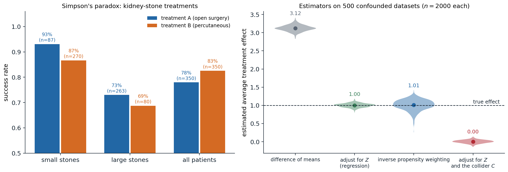
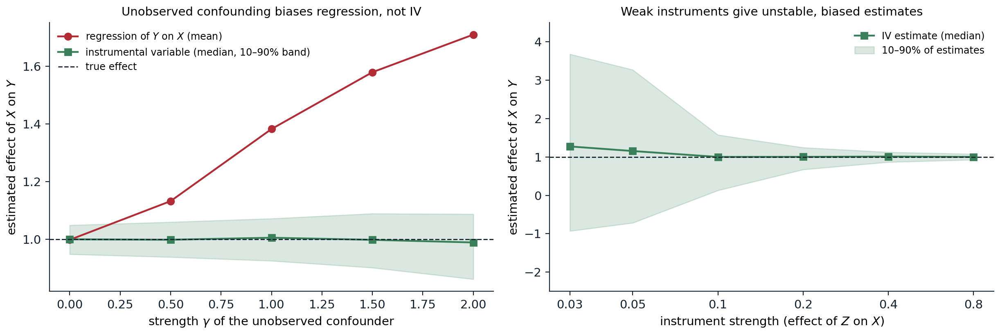

[Background Notes](../README.md) › [Artificial Intelligence](README.md)

# 13. Causal Inference

[← 12. Decision Theory and the Value of Information](12-decision-theory-and-the-value-of-information.md) · [14. Learning Graphical Models →](14-learning-graphical-models.md)

## <a id="association-and-causation"></a>Association and causation

### <a id="why-probabilities-are-not-enough"></a>Why probabilities are not enough

The models of chapters 8–12 describe what an agent observes. An agent that acts needs something more: what happens *if it does something*. The two questions have different answers whenever a common cause influences both what is done and what follows. Patients who receive a treatment may do worse than those who do not because doctors give it to the sickest; people who carry lighters get lung cancer more often because smokers carry lighters. A conditional probability $`P(y\mid x)`$ answers "what do I expect to see among cases where $`X=x`$"; a decision needs "what would happen if I *set* $`X=x`$". Causal inference is the theory of the second question: when it can be answered from data, and how.

The distinction matters for AI in both directions. Agents that act on correlations learned from passive data take actions whose consequences the data never showed, and machine-learning models trained on one distribution fail under shift when they rely on non-causal features. Conversely, an agent that can intervene, like a scientist running experiments or a reinforcement learner trying actions, can learn causal structure that no amount of passive observation reveals.

### <a id="simpson-s-paradox"></a>Simpson's paradox

A study of kidney-stone treatments ([Charig et al., 1986](https://doi.org/10.1136/bmj.292.6524.879)) compared open surgery (A) with a less invasive percutaneous procedure (B). Treatment A was more successful for small stones, 93% against 87%, and for large stones, 73% against 69%, yet less successful overall, 78% against 83%. The reversal, **Simpson's paradox**, arises because A was given mostly to large stones, which are harder to treat: stone size affects both the choice of treatment and the outcome.



*Left: success rates in the kidney-stone study, where treatment A beats B within each stone size and loses overall, because 263 of A's 350 patients had large stones against 80 of B's. Right: four estimators of an average treatment effect on 500 synthetic datasets of 2,000 units, in which a confounder $`Z`$ raises both the probability of treatment and the outcome, the true effect of the treatment is 1, and a variable $`C`$ is caused by both treatment and outcome. The difference of the outcome means between treated and untreated is 3.12 on average; regression adjustment for $`Z`$ gives 1.00 and inverse propensity weighting 1.01, the latter with almost three times the spread; adjusting for $`Z`$ and the collider $`C`$ gives 0.00.*

Which figure should guide the choice of treatment? The data alone cannot say. If stone size influences the treatment choice, as here, the stratified comparison is right. If instead the treatment affected a variable in the table, for example if the outcome were compared within levels of a post-treatment blood pressure that the treatment itself changes, the aggregated comparison would be right. The same numbers support opposite conclusions under different causal stories, which is why causal inference needs assumptions beyond the data, stated in a form that can be examined.

## <a id="potential-outcomes"></a>Potential outcomes

The **potential outcomes** framework ([Rubin, 1974](https://doi.org/10.1037/h0037350)), going back to Neyman, defines causal effects by comparing, for each unit $`i`$, the outcome $`Y_i(1)`$ it would have under treatment and the outcome $`Y_i(0)`$ it would have without. The **individual effect** $`Y_i(1)-Y_i(0)`$ is never observed, since each unit receives one treatment, which is the **fundamental problem of causal inference**. Population quantities can still be estimable, notably the **average treatment effect** $`\mathrm{ATE}=\mathbb E[Y(1)-Y(0)]`$. With the observed treatment $`X`$, the observed outcome is $`Y=Y(X)`$ (**consistency**, which presupposes no interference between units), and the naive comparison is

```math
\mathbb E[Y\mid X=1]-\mathbb E[Y\mid X=0]=\mathbb E[Y(1)\mid X=1]-\mathbb E[Y(0)\mid X=0],
```

which equals the ATE when the potential outcomes are independent of the treatment received. **Randomization** guarantees this: a coin flip cannot depend on how a unit would respond. That is why randomized controlled trials are the standard of evidence. In observational data, the substitute is **conditional ignorability**: $`\bigl(Y(1),Y(0)\bigr)\perp X\mid Z`$ for measured covariates $`Z`$, together with **positivity**, $`0<P(X=1\mid z)<1`$ for all $`z`$. Then the ATE is identified by comparing treated and untreated units with the same $`Z`$ and averaging, and the question becomes which covariates make ignorability hold. Graphs answer it.

## <a id="structural-causal-models"></a>Structural causal models

### <a id="mechanisms-and-interventions"></a>Mechanisms and interventions

A **structural causal model** (SCM) ([Pearl, 2009](https://doi.org/10.1017/CBO9780511803161)) describes each variable as determined by its direct causes and an independent noise term,

```math
V_i:=f_i\bigl(\mathrm{PA}_i,U_i\bigr),\qquad U_1,\dots,U_n\text{ independent},
```

with the direct causes drawn as arrows in a **causal graph**. The assignments are mechanisms, not equations: each can be changed without changing the others. With acyclic graphs and independent noises, an SCM induces a joint distribution that factorizes over the graph as a Bayesian network does ([chapter 8](08-bayesian-networks-and-markov-networks.md)); what the SCM adds is a meaning for interventions. The **intervention** $`\mathrm{do}(X=x)`$ replaces the mechanism of $`X`$ by the constant $`x`$, cutting all arrows into $`X`$ and leaving the other mechanisms intact. The resulting interventional distribution follows from the **truncated factorization**:

```math
P\bigl(v\mid\mathrm{do}(x)\bigr)=\prod_{i:\,V_i\notin X}P\bigl(v_i\mid\mathrm{pa}_i\bigr)\Big|_{X=x},
```

the factorization of the observational distribution with the factors of the intervened variables removed. This is the formal difference between $`P(y\mid x)`$, which filters the population to those units with $`X=x`$, and $`P(y\mid\mathrm{do}(x))`$, which changes the population so that every unit has $`X=x`$. Potential outcomes are defined within an SCM as $`Y_x(u)`$, the value of $`Y`$ in unit $`u`$ in the model modified by $`\mathrm{do}(X=x)`$, so the two frameworks describe the same objects in different notation.

### <a id="three-levels-of-causal-questions"></a>Three levels of causal questions

Pearl's **ladder of causation** distinguishes three kinds of questions, each requiring more of a model than the one below:

1. **Association**, $`P(y\mid x)`$: seeing. What does observing $`x`$ tell me about $`y`$? A joint distribution suffices.
2. **Intervention**, $`P(y\mid\mathrm{do}(x))`$: doing. What happens if I set $`x`$? It needs a causal graph, or experiments.
3. **Counterfactuals**, $`P(y_x\mid x',y')`$: imagining. Given that I observed $`x'`$ and $`y'`$, what would have happened had $`x`$ been different? It needs the functional mechanisms of an SCM, not just the graph.

## <a id="identification"></a>Identification

An interventional quantity is **identifiable** if it can be computed from the observational distribution given the causal graph. Identification is a question about the graph, not about estimation from finite data.

### <a id="confounding-and-the-backdoor-criterion"></a>Confounding and the backdoor criterion

A set of variables $`Z`$ satisfies the **backdoor criterion** relative to $`(X,Y)`$ if no variable in $`Z`$ is a descendant of $`X`$, and $`Z`$ blocks, in the sense of d-separation ([chapter 8](08-bayesian-networks-and-markov-networks.md#d-separation)), every path between $`X`$ and $`Y`$ that starts with an arrow into $`X`$, the **backdoor paths**. Then

```math
P\bigl(y\mid\mathrm{do}(x)\bigr)=\sum_zP(y\mid x,z)\,P(z),
```

the **adjustment formula** ([Appendix A](#block-ai13-appendix-a)). Backdoor paths carry the association that is due to common causes, and blocking them leaves only the causal paths from $`X`$ to $`Y`$. The criterion formalizes the rules of thumb about what to control for, and corrects some of them:

- **Adjust for confounders**, common causes of treatment and outcome.
- **Do not adjust for mediators**, variables on the causal path from $`X`$ to $`Y`$, when the total effect is wanted; that blocks part of the effect.
- **Do not adjust for colliders**, common effects of $`X`$ and $`Y`$ or of their causes: conditioning on a collider opens a path that was blocked, the explaining-away effect of chapter 8. In the figure above, adding the collider $`C`$ to an otherwise correct adjustment erases the effect entirely. Selection of a sample by such a variable, **selection bias**, has the same effect.
- More covariates are not always better. In the **M-bias** structure $`X\leftarrow A\to M\leftarrow B\to Y`$, the pretreatment variable $`M`$ is a collider, and adjusting for it creates confounding where there was none.

```python
import numpy as np

# A structural causal model: severity Z -> treatment X, Z -> recovery Y, X -> Y (all binary).
p_z = 0.5
p_x_given_z = {0: 0.2, 1: 0.8}                        # severe cases are treated more often
p_y_given_xz = {(0, 0): 0.70, (1, 0): 0.80,          # treatment helps: +0.10 in each stratum
                (0, 1): 0.30, (1, 1): 0.40}           # severity hurts: -0.40


def sample(n, rng, do_x=None):
    """Sample from the model; do_x replaces the equation for X by a constant (an intervention)."""
    z = (rng.random(n) < p_z).astype(int)
    x = (rng.random(n) < np.vectorize(p_x_given_z.get)(z)).astype(int) if do_x is None else np.full(n, do_x)
    y = (rng.random(n) < np.array([p_y_given_xz[(a, b)] for a, b in zip(x, z)])).astype(int)
    return z, x, y


rng = np.random.default_rng(0)
z, x, y = sample(200_000, rng)
assoc = y[x == 1].mean() - y[x == 0].mean()
print(f"observational: P(Y=1 | X=1) - P(Y=1 | X=0) = {assoc:+.3f}")

# The interventional contrast, by running the experiment in the model.
effect_exp = sample(200_000, rng, do_x=1)[2].mean() - sample(200_000, rng, do_x=0)[2].mean()
print(f"experimental:  P(Y=1 | do(X=1)) - P(Y=1 | do(X=0)) = {effect_exp:+.3f}")

# The backdoor adjustment formula, using only the observational sample: sum_z P(Y | X, z) P(z).
adj = sum((y[(x == 1) & (z == v)].mean() - y[(x == 0) & (z == v)].mean()) * (z == v).mean() for v in (0, 1))
print(f"backdoor adjustment from observational data: {adj:+.3f}")

# The exact answer from the truncated factorization: P(y | do(x)) = sum_z P(z) P(y | x, z).
exact = sum((p_y_given_xz[(1, v)] - p_y_given_xz[(0, v)]) * (p_z if v else 1 - p_z) for v in (0, 1))
print(f"truncated factorization (exact): {exact:+.3f}")
# observational: P(Y=1 | X=1) - P(Y=1 | X=0) = -0.144
# experimental:  P(Y=1 | do(X=1)) - P(Y=1 | do(X=0)) = +0.100
# backdoor adjustment from observational data: +0.097
# truncated factorization (exact): +0.100
```

In this model the treatment raises the recovery probability by 0.10 in every stratum, but the sickest patients are treated four times as often, and in the observational data the treated recover 14 points less often. Simulating the experiment in the model recovers the true $`+0.10`$, and so does the adjustment formula applied to the observational data alone, because severity blocks the only backdoor path.

### <a id="the-frontdoor-criterion-and-do-calculus"></a>The frontdoor criterion and do-calculus

Adjustment is not the only route. When the confounder $`U`$ of $`X`$ and $`Y`$ is unobserved but the effect of $`X`$ on $`Y`$ passes entirely through a mediator $`M`$ that $`U`$ does not affect directly ($`X\to M\to Y`$, $`X\leftarrow U\to Y`$), the **frontdoor formula** identifies the effect:

```math
P\bigl(y\mid\mathrm{do}(x)\bigr)=\sum_mP(m\mid x)\sum_{x'}P(y\mid m,x')\,P(x'),
```

by chaining two identifiable effects, of $`X`$ on $`M`$ (unconfounded) and of $`M`$ on $`Y`$ (confounded only through $`X`$, which can be adjusted for). The general tool is the **do-calculus** ([Pearl, 1995](https://doi.org/10.1093/biomet/82.4.669)), three rules for inserting and deleting observations and interventions, justified by d-separation in modified graphs:

1. **Insertion or deletion of observations:** $`P(y\mid\mathrm{do}(x),z,w)=P(y\mid\mathrm{do}(x),w)`$ if $`Y\perp Z\mid X,W`$ in the graph with the arrows into $`X`$ removed.
2. **Exchange of action and observation:** $`P(y\mid\mathrm{do}(x),\mathrm{do}(z),w)=P(y\mid\mathrm{do}(x),z,w)`$ if $`Y\perp Z\mid X,W`$ in the graph with arrows into $`X`$ and out of $`Z`$ removed.
3. **Insertion or deletion of actions:** $`P(y\mid\mathrm{do}(x),\mathrm{do}(z),w)=P(y\mid\mathrm{do}(x),w)`$ if $`Y\perp Z\mid X,W`$ in the graph with arrows into $`X`$ removed and arrows into those $`Z`$ that are not ancestors of $`W`$ removed.

A causal effect is identifiable if and only if repeated application of the rules reduces it to an expression without $`\mathrm{do}`$ ([Shpitser and Pearl, 2006](https://escholarship.org/uc/item/9598x714)), and an algorithm decides identifiability and produces the formula. When the answer is negative, no amount of observational data determines the effect without further assumptions.

## <a id="estimation"></a>Estimation

Identification yields a formula; estimating it from finite data is a statistical problem, and several estimators target the same adjusted quantity $`\mathbb E[Y\mid\mathrm{do}(X=1)]-\mathbb E[Y\mid\mathrm{do}(X=0)]`$ with a valid adjustment set $`Z`$:

- **Outcome regression** fits $`\mu_x(z)=\mathbb E[Y\mid X=x,Z=z]`$ and averages $`\mu_1(z)-\mu_0(z)`$ over the sample. It relies on the regression model being right.
- **Inverse propensity weighting** estimates the **propensity score** $`e(z)=P(X=1\mid z)`$ ([Rosenbaum and Rubin, 1983](https://doi.org/10.1093/biomet/70.1.41)) and reweights each unit by the inverse probability of the treatment it received, $`\frac1n\sum_i\bigl(\frac{X_iY_i}{e(Z_i)}-\frac{(1-X_i)Y_i}{1-e(Z_i)}\bigr)`$, creating a pseudo-population in which treatment is independent of $`Z`$ ([Appendix B](#block-ai13-appendix-b)). It relies on the propensity model and becomes unstable when some propensities are near 0 or 1, the practical face of positivity violations; the wider spread of the IPW estimates in the figure shows the cost.
- **Doubly robust** estimators ([Robins, Rotnitzky, and Zhao, 1994](https://doi.org/10.1080/01621459.1994.10476818)) combine both, $`\frac1n\sum_i\bigl(\mu_1(Z_i)-\mu_0(Z_i)+\frac{X_i(Y_i-\mu_1(Z_i))}{e(Z_i)}-\frac{(1-X_i)(Y_i-\mu_0(Z_i))}{1-e(Z_i)}\bigr)`$, and are consistent if either model is correct. Combined with flexible machine-learning models and sample splitting, they underlie **double machine learning**.

### <a id="instrumental-variables"></a>Instrumental variables

When confounders are unmeasured, adjustment is impossible, but an **instrumental variable** can still identify an effect. $`Z`$ is an instrument for the effect of $`X`$ on $`Y`$ if it affects $`X`$ (**relevance**), is independent of the unobserved confounders (**independence**), and affects $`Y`$ only through $`X`$ (**exclusion**). Classic instruments are a randomized encouragement to take a treatment, the draft lottery for military service, and genetic variants in **Mendelian randomization**. In a linear model $`Y=\beta X+\gamma U+\varepsilon`$, the **Wald estimator**

```math
\hat\beta_{\mathrm{IV}}=\frac{\widehat{\mathrm{Cov}}(Z,Y)}{\widehat{\mathrm{Cov}}(Z,X)}
```

is consistent, because $`\mathrm{Cov}(Z,Y)=\beta\,\mathrm{Cov}(Z,X)`$ when $`Z`$ is independent of $`U`$ and $`\varepsilon`$. Without linearity, an instrument identifies only the **local average treatment effect** among the units whose treatment the instrument changes ([Angrist, Imbens, and Rubin, 1996](https://doi.org/10.1080/01621459.1996.10476902)), under a monotonicity assumption. Instruments that barely affect the treatment, **weak instruments**, make the denominator small and the estimate unstable and biased toward the confounded regression.



*A linear model $`Y=X+\gamma U+\varepsilon`$ with an unobserved confounder $`U`$ that also enters $`X`$, estimated from 1,000 units, 400 repetitions per setting. Left: the regression of $`Y`$ on $`X`$ is unbiased only without confounding and reaches 1.71 at $`\gamma=2`$; the instrumental-variable estimate with a strong instrument stays at the true effect of 1, with 80% of estimates within 0.14 of it even at $`\gamma=2`$. Right: with the confounding fixed at $`\gamma=1`$ and the instrument's effect on $`X`$ reduced, the IV estimates spread out and their median drifts toward the confounded value: with effect 0.03 the median is 1.27 and the central 80% range from $`-0.93`$ to 3.67, while with effect 0.8 they stay within 0.08 of the truth.*

## <a id="counterfactuals"></a>Counterfactuals

A counterfactual question conditions on what actually happened and asks about an alternative: "the patient took the drug and died; would she have survived without it?" Answering requires the SCM's mechanisms, in three steps:

1. **Abduction:** update the distribution of the noise terms $`U`$ given the observed evidence, which pins down the unit's individual characteristics;
2. **Action:** modify the model by the counterfactual intervention $`\mathrm{do}(X=x)`$;
3. **Prediction:** compute the outcome in the modified model with the updated noise.

Counterfactuals formalize notions that interventional distributions cannot: the **probability of necessity**, that the outcome would not have occurred without the cause, which is the legal standard of "but-for" causation; the **effect of treatment on the treated**; and path-specific effects in **mediation analysis**, which split a total effect into the part through a mediator and the rest. They are generally not identifiable from experiments alone; bounds are available, and point identification needs further assumptions such as monotonicity. Counterfactual reasoning also underlies definitions of **fairness** that ask whether a decision would have changed had a protected attribute been different, and explanations that ask which small change to an input would have changed a model's output.

## <a id="causal-discovery"></a>Causal discovery

### <a id="constraint-based-discovery"></a>Constraint-based discovery

Can the graph itself be learned from data? Observational data determine the conditional independences of the distribution, and under the **faithfulness** assumption, that the distribution has no independences beyond those implied by the graph, they determine the graph up to Markov equivalence: its skeleton and v-structures ([chapter 8](08-bayesian-networks-and-markov-networks.md#i-maps-and-i-equivalence)). The **PC algorithm** ([Spirtes, Glymour, and Scheines, 2000](https://direct.mit.edu/books/monograph/2057/Causation-Prediction-and-Search)) finds this class with independence tests:

1. Start from the complete undirected graph. For conditioning sets of growing size, remove the edge $`X-Y`$ whenever $`X\perp Y\mid S`$ for some set $`S`$ of current neighbors of $`X`$ or of $`Y`$, and record $`S`$ as their **separating set**.
2. For each unshielded triple $`X-M-Y`$ (with $`X`$ and $`Y`$ nonadjacent), orient $`X\to M\leftarrow Y`$ if $`M`$ is not in their separating set, since a non-collider would have been needed to separate them.
3. Orient further edges where the opposite direction would create a new v-structure or a cycle (Meek's rules).

```python
from itertools import combinations
from math import erf, log, sqrt

import numpy as np

# Data from a linear Gaussian SCM with graph A -> C <- B, C -> D, D -> E <- B.
rng = np.random.default_rng(0)
n = 5000
A = rng.normal(size=n)
B = rng.normal(size=n)
C = 0.8 * A - 0.7 * B + rng.normal(size=n)
D = 0.9 * C + rng.normal(size=n)
E = 0.6 * D + 0.8 * B + rng.normal(size=n)
data = {"A": A, "B": B, "C": C, "D": D, "E": E}
names = list(data)
R = np.corrcoef(np.array([data[v] for v in names]))


def independent(i, j, S, alpha=0.001):
    """Fisher z-test of zero partial correlation between variables i and j given the set S."""
    idx = [i, j] + list(S)
    P = np.linalg.inv(R[np.ix_(idx, idx)])
    r = -P[0, 1] / sqrt(P[0, 0] * P[1, 1])
    z = 0.5 * log((1 + r) / (1 - r)) * sqrt(n - len(S) - 3)
    p_value = 2 * (1 - 0.5 * (1 + erf(abs(z) / sqrt(2))))
    return p_value > alpha


# 1. Skeleton: remove the edge i - j if some subset of i's other neighbors makes them independent.
k = len(names)
adj = {i: set(range(k)) - {i} for i in range(k)}
sepset = {}
for size in range(k - 1):
    for i in range(k):                                   # ordered pairs: condition on neighbors of either end
        for j in sorted(adj[i]):
            for S in combinations(sorted(adj[i] - {j}), size):
                if independent(i, j, S):
                    adj[i].discard(j)
                    adj[j].discard(i)
                    sepset[(i, j)] = sepset[(j, i)] = set(S)
                    break
print("skeleton:", sorted(f"{names[i]}-{names[j]}" for i in range(k) for j in adj[i] if i < j))
print("separating sets:", {f"{names[i]},{names[j]}": sorted(names[s] for s in S) for (i, j), S in sepset.items() if i < j})

# 2. V-structures: for nonadjacent i, j with a common neighbor m not in their separating set, orient i -> m <- j.
directed = set()
for m in range(k):
    for i, j in combinations(sorted(adj[m]), 2):
        if j not in adj[i] and m not in sepset[(i, j)]:
            directed |= {(i, m), (j, m)}
# 3. Propagate (Meek's first rule): if i -> m and m - j with i, j nonadjacent, orient m -> j.
changed = True
while changed:
    changed = False
    for i, m in list(directed):
        for j in adj[m]:
            if j != i and j not in adj[i] and (m, j) not in directed and (j, m) not in directed:
                directed.add((m, j))
                changed = True
undirected = sorted(f"{names[i]}-{names[j]}" for i in range(k) for j in adj[i]
                    if i < j and (i, j) not in directed and (j, i) not in directed)
print("oriented edges:", sorted(f"{names[i]}->{names[j]}" for i, j in directed), "| unoriented:", undirected)
# skeleton: ['A-C', 'B-C', 'B-E', 'C-D', 'D-E']
# separating sets: {'A,B': [], 'A,D': ['C'], 'B,D': ['C'], 'C,E': ['B', 'D'], 'A,E': ['B', 'D']}
# oriented edges: ['A->C', 'B->C', 'B->E', 'C->D', 'D->E'] | unoriented: []
```

From 5,000 samples of a five-variable linear Gaussian model, the tests remove exactly the five absent edges, and their separating sets reveal two colliders: $`A`$ and $`B`$ are independent without conditioning on $`C`$, so $`C`$ is a collider on $`A-C-B`$, and $`D`$ and $`B`$ both point into $`E`$. Meek's first rule then orients $`C\to D`$, since the reverse would create a v-structure at $`C`$ that the data do not show. Here the whole graph is identified; in general part of it remains undirected. The output is only as reliable as the independence tests: with less data or weaker effects, errors in early tests propagate, and violations of faithfulness, such as two paths whose effects cancel, mislead it.

### <a id="beyond-equivalence-classes"></a>Beyond equivalence classes

Additional assumptions identify more. In linear models with **non-Gaussian** noise, the full graph is identifiable, because regressing in the wrong direction leaves residuals that are uncorrelated but not independent of the regressor (LiNGAM; [Shimizu et al., 2006](https://www.jmlr.org/papers/v7/shimizu06a.html)); **additive noise models** extend the idea to nonlinear mechanisms, and allow cause and effect to be distinguished even with two variables. **Score-based** methods search over graphs for the best penalized likelihood, the structure learning of [chapter 14](14-learning-graphical-models.md#structure-learning). And **interventions** break equivalence directly: randomizing a variable orients every edge adjacent to it, and experimental design chooses which interventions to perform.

## <a id="causality-and-learning"></a>Causality and learning

Causal reasoning connects to the rest of AI in several ways, developed in later modules.

- **Distribution shift.** A predictor that relies on causes of the target is stable when the distribution of the inputs changes, while one that relies on spurious correlates, such as the hospital watermark on an X-ray, is not. **Invariant prediction** ([Peters, Bühlmann, and Meinshausen, 2016](https://doi.org/10.1111/rssb.12167)) looks for predictors whose relation to the target is the same across environments, a signature of causal structure.
- **Reinforcement learning** is interventional by construction: an agent chooses actions and observes their effects, which removes confounding from its own experience, while learning from logged data generated by another policy raises exactly the problems of this chapter, and off-policy evaluation uses inverse propensity weighting.
- **Causal representation learning** ([Schölkopf et al., 2021](https://doi.org/10.1109/JPROC.2021.3058954)) seeks representations whose variables behave as the causal variables of an SCM, so that interventions and changes of distribution act sparsely on them.
- **Safety and interpretability.** Questions about whether a model's internal feature causes its behavior are answered by interventions on the model's activations; the Safety and Frontier module uses exactly this logic in mechanistic interpretability.

## <a id="appendices"></a>Appendices


<details>
<summary><a id="block-ai13-appendix-a"></a><b>A. The adjustment formula</b></summary>


Let $`Z`$ satisfy the backdoor criterion for $`(X,Y)`$. In the graph $`G_{\overline X}`$ with the arrows into $`X`$ removed, which describes the intervened model, $`Z`$ is not affected by the intervention, since it contains no descendants of $`X`$; hence $`P(z\mid\mathrm{do}(x))=P(z)`$. Conditioning on $`Z`$,

```math
P\bigl(y\mid\mathrm{do}(x)\bigr)=\sum_zP\bigl(y\mid\mathrm{do}(x),z\bigr)\,P(z).
```

It remains to show $`P(y\mid\mathrm{do}(x),z)=P(y\mid x,z)`$, which is rule 2 of the do-calculus: exchanging the action $`\mathrm{do}(x)`$ for the observation $`x`$ is allowed when $`Y\perp X\mid Z`$ in the graph $`G_{\underline X}`$ with the arrows *out of* $`X`$ removed. In $`G_{\underline X}`$, the only paths between $`X`$ and $`Y`$ are the backdoor paths, which $`Z`$ blocks by assumption. Combining the two steps gives the adjustment formula.

A direct derivation for the case where $`Z`$ is the set of parents of $`X`$: by the truncated factorization, $`P(y\mid\mathrm{do}(x))=\sum_{\mathrm{pa}}P(y\mid x,\mathrm{pa})P(\mathrm{pa})`$, since removing the factor $`P(x\mid\mathrm{pa})`$ from the joint $`P(\mathrm{pa})P(x\mid\mathrm{pa})P(y,\text{rest}\mid x,\mathrm{pa})`$ and summing out the other variables leaves this sum. The parents of $`X`$ always satisfy the backdoor criterion when they are observed.

</details>


<details>
<summary><a id="block-ai13-appendix-b"></a><b>B. Inverse propensity weighting is unbiased</b></summary>


With ignorability given $`Z`$ and positivity, and the true propensity $`e(z)=P(X=1\mid z)`$,

```math
\mathbb E\left[\frac{XY}{e(Z)}\right]=\mathbb E\left[\frac{\mathbb E[X\,Y(1)\mid Z]}{e(Z)}\right]=\mathbb E\left[\frac{\mathbb E[X\mid Z]\;\mathbb E[Y(1)\mid Z]}{e(Z)}\right]=\mathbb E\bigl[Y(1)\bigr],
```

using consistency ($`XY=XY(1)`$), then ignorability to factor the conditional expectation, then $`\mathbb E[X\mid Z]=e(Z)`$. Symmetrically, $`\mathbb E[(1-X)Y/(1-e(Z))]=\mathbb E[Y(0)]`$, so the difference estimates the ATE without bias. Each unit's weight is the inverse of the probability that it would have received its treatment, so units of a kind that is rarely treated count more when treated, standing in for the many similar units that were not.

The variance is the problem: when $`e(z)`$ is near 0 or 1 for some $`z`$, the weights explode. Stabilized and truncated weights trade a little bias for much less variance, and the doubly robust estimator, whose correction terms have mean zero when the outcome model is right, reduces the dependence on the weights. When the propensity is estimated, as in the figure, the estimator remains consistent if the propensity model is correct.

</details>

---

[← 12. Decision Theory and the Value of Information](12-decision-theory-and-the-value-of-information.md) · [14. Learning Graphical Models →](14-learning-graphical-models.md)
