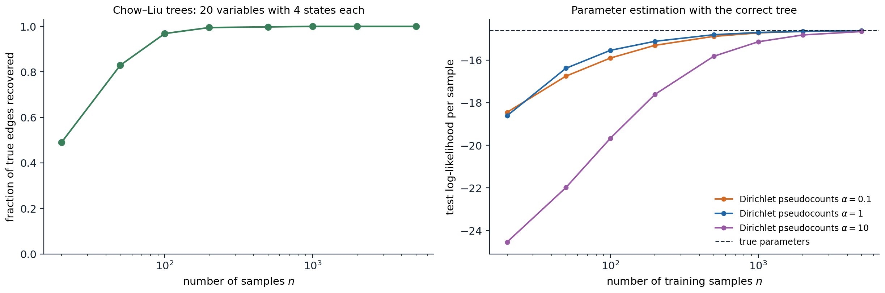

[Background Notes](../README.md) › [Artificial Intelligence](README.md)

# 14. Learning Graphical Models

> [!WARNING]
> Work in progress: this part of the notes is still being revised.

[← 13. Causal Inference](13-causal-inference.md) · [15. Game Theory and Multiagent Systems →](15-game-theory-and-multiagent-systems.md)

## <a id="learning-from-data"></a>Learning from data

The graphical models of chapters 8–11 were specified by hand: an expert drew the graph and supplied the probabilities. Most models are instead learned, fully or in part, from data, and learning a graphical model has two layers. **Parameter learning** fits the conditional probability tables or potentials for a given graph; **structure learning** chooses the graph itself. Each is easier when the data are **complete**, every variable observed in every example, and harder with hidden variables or missing values. The methods are those of statistics, maximum likelihood, Bayesian estimation, and EM ([Foundations chapter 4](../foundations/04-probability-and-statistics.md#constructing-point-estimators), [ML chapter 14](../ml/14-gaussian-mixtures-and-expectation-maximization.md)), and the graph determines how they decompose.

## <a id="parameters-from-complete-data"></a>Parameters from complete data

### <a id="maximum-likelihood-decomposes"></a>Maximum likelihood decomposes

For a Bayesian network and $`n`$ complete examples, the log-likelihood is a sum over examples of the log of a product of CPT entries, which regroups as a sum over the network's families:

```math
\log P(\mathcal D\mid\theta)=\sum_{i}\sum_{m=1}^n\log P\bigl(x_i^{(m)}\mid\mathrm{pa}_i^{(m)};\theta_i\bigr)=\sum_i\;\sum_{\mathrm{pa}}\;\sum_xN_i(x,\mathrm{pa})\log\theta_{i,x\mid\mathrm{pa}},
```

where $`N_i(x,\mathrm{pa})`$ counts the examples in which variable $`i`$ takes value $`x`$ and its parents take values $`\mathrm{pa}`$. Each CPT row is a separate multinomial, and its maximum-likelihood estimate is the normalized count, $`\hat\theta_{i,x\mid\mathrm{pa}}=N_i(x,\mathrm{pa})/N_i(\mathrm{pa})`$ ([Appendix A](#block-ai14-appendix-a)). Learning a Bayesian network from complete data is counting. The same decomposition holds for linear-Gaussian networks, where each family is a linear regression of a child on its parents.

### <a id="sparse-counts-and-bayesian-estimation"></a>Sparse counts and Bayesian estimation

A CPT with $`k`$ parents of $`d`$ values each has $`d^k`$ rows, and with modest data many rows are estimated from few examples or none. Maximum likelihood then assigns probability zero to combinations never seen in training, and a model that gives probability zero to a test case has log-likelihood $`-\infty`$. **Bayesian parameter estimation** places a **Dirichlet prior** on each row, $`\theta_{i,\cdot\mid\mathrm{pa}}\sim\mathrm{Dirichlet}(\alpha,\dots,\alpha)`$, conjugate to the multinomial; the posterior is again Dirichlet, with the counts added to the **pseudocounts**, and the posterior predictive probability is

```math
P\bigl(X_i=x\mid\mathrm{pa},\mathcal D\bigr)=\frac{N_i(x,\mathrm{pa})+\alpha}{N_i(\mathrm{pa})+d\,\alpha},
```

the Laplace smoothing of naive Bayes ([ML chapter 4](../ml/04-generative-classifiers.md#smoothing-zero-counts)) for every family. The pseudocounts express prior belief, a weak one when $`\alpha`$ is small, and they matter exactly where data are scarce.



*Tree-structured models over 20 variables with four values each, 20 random models or training sets per point. Left: the Chow–Liu algorithm recovers 49% of the true edges from 20 samples of models with weak dependencies, 83% from 50, 97% from 100, and all of them from 1,000. Right: the test log-likelihood per sample of CPTs estimated with the correct tree, on 20,000 test samples from a model with stronger dependencies. Maximum likelihood, not plotted, gives probability zero to 89% of the test samples when trained on 20 examples, 17% on 200, and 1.1% on 1,000, and so has log-likelihood $`-\infty`$ at every size shown. Pseudocounts of $`\alpha=1`$ are best from 50 samples on ($`\alpha=0.1`$ is slightly better at 20) and reach $`-14.62`$ at 5,000 samples against $`-14.60`$ for the true parameters; $`\alpha=10`$ oversmooths, and at $`n=20`$ its test log-likelihood is six nats per sample below that of $`\alpha=1`$.*

## <a id="undirected-models"></a>Undirected models

### <a id="log-linear-models-and-the-moment-matching-gradient"></a>Log-linear models and the moment-matching gradient

Undirected models do not decompose so easily, because the partition function couples all parameters. For a log-linear model, $`P(x)=\exp\bigl(w^\top f(x)\bigr)/Z(w)`$ with feature vector $`f`$ ([chapter 8](08-bayesian-networks-and-markov-networks.md#log-linear-models)), the average log-likelihood of the data is

```math
\ell(w)=w^\top\hat{\mathbb E}[f]-\log Z(w),\qquad\nabla\ell(w)=\hat{\mathbb E}[f]-\mathbb E_{w}[f],
```

because the gradient of $`\log Z`$ is the expected feature vector under the model ([Appendix B](#block-ai14-appendix-b)). The log-likelihood is concave, and at the maximum the model's expected features equal their empirical averages: **maximum likelihood is moment matching**. It is also, by convex duality, the **maximum-entropy** distribution among those that match the empirical moments. Each gradient step needs the model's expectations, an inference problem ([chapters 9](09-exact-inference.md)–[10](10-approximate-inference.md)), so learning is at least as hard as inference and usually runs it in an inner loop, exactly where exact inference is infeasible.

### <a id="pseudolikelihood-and-contrastive-methods"></a>Pseudolikelihood and contrastive methods

Several objectives avoid the partition function. **Pseudolikelihood** ([Besag, 1975](https://doi.org/10.2307/2987782)) maximizes $`\sum_i\log P(x_i\mid x_{-i};w)`$, the product of each variable's conditional given all the others, which involves only local normalizations over one variable's values. It is consistent: with enough data from the model family, its maximizer converges to the true parameters. **Contrastive divergence** approximates the model expectation by a few steps of Gibbs sampling started at the data, which trained the restricted Boltzmann machines of early deep learning; **score matching** and **noise-contrastive estimation**, which reappear in the Generative AI module ([Generative AI chapter 6](../generative-ai/06-energy-based-models-and-score-matching.md)), avoid the normalizer by matching gradients of the log-density or by classifying data against noise.

```python
from itertools import product

import numpy as np

rng = np.random.default_rng(0)
k = 6
S = np.array(list(product([-1, 1], repeat=k)))            # all 64 configurations of 6 spins
pairs = [(i, j) for i in range(k) for j in range(i + 1, k)]
features = lambda X: np.c_[X, np.stack([X[:, i] * X[:, j] for i, j in pairs], 1)]   # 6 + 15 features
F = features(S)

w_true = np.r_[rng.normal(0, 0.3, k), rng.normal(0, 0.5, len(pairs))]
p_true = np.exp(F @ w_true)
p_true /= p_true.sum()
data = S[rng.choice(len(S), 5000, p=p_true)]
data_moments = features(data).mean(0)


def log_likelihood(w):
    logits = F @ w
    logZ = np.log(np.exp(logits - logits.max()).sum()) + logits.max()
    return data_moments @ w - logZ                          # average log-likelihood of the data


# Gradient ascent: the gradient is the data moments minus the model moments (computed exactly here).
w = np.zeros(F.shape[1])
for step in range(3001):
    p = np.exp(F @ w - (F @ w).max())
    p /= p.sum()
    grad = data_moments - p @ F
    if step in (0, 10, 100, 3000):
        print(f"step {step:4d}: log-likelihood {log_likelihood(w):.4f}, largest moment mismatch {np.abs(grad).max():.4f}")
    w += 0.1 * grad
print(f"log-likelihood of the true parameters {log_likelihood(w_true):.4f}")
print(f"largest error in a learned weight: {np.abs(w - w_true).max():.3f} (5,000 samples, {len(w)} weights)")

# Pseudolikelihood: fit each spin's conditional given the others, which needs no partition function.
def neg_pseudo_ll_grad(w):
    h = w[:k]
    J = np.zeros((k, k))
    for (i, j), v in zip(pairs, w[k:]):
        J[i, j] = J[j, i] = v
    field = h + data @ J                                    # local field on each spin given the others
    r = data - np.tanh(field)                               # d/dfield of log P(x_i | x_-i) = x_i - tanh(field)
    g_h = r.mean(0)
    g_J = np.array([(r[:, i] * data[:, j] + r[:, j] * data[:, i]).mean() for i, j in pairs])
    return np.r_[g_h, g_J]


wp = np.zeros(F.shape[1])
for step in range(3000):
    wp += 0.1 * neg_pseudo_ll_grad(wp)
print(f"pseudolikelihood: largest weight error {np.abs(wp - w_true).max():.3f}; log-likelihood {log_likelihood(wp):.4f}")
# step    0: log-likelihood -4.1589, largest moment mismatch 0.9576
# step   10: log-likelihood -1.8749, largest moment mismatch 0.1419
# step  100: log-likelihood -1.7981, largest moment mismatch 0.0197
# step 3000: log-likelihood -1.7930, largest moment mismatch 0.0000
# log-likelihood of the true parameters -1.7943
# largest error in a learned weight: 0.086 (5,000 samples, 21 weights)
# pseudolikelihood: largest weight error 0.086; log-likelihood -1.7938
```

With six spins, the 64 configurations can be enumerated, so the gradient is exact: after 3,000 steps the model's expected features match the data's to four decimals, and the fitted log-likelihood slightly exceeds that of the true parameters, as a maximum-likelihood fit to a finite sample must. Pseudolikelihood, which never computes $`Z`$, reaches weights and a log-likelihood almost indistinguishable from maximum likelihood, both within 0.09 of the true weights. The difference matters for large models, where maximum likelihood is out of reach and pseudolikelihood costs the same as fitting one logistic regression per variable.

### <a id="conditional-random-fields"></a>Conditional random fields

A **conditional random field** models the conditional distribution of outputs $`y`$ given inputs $`x`$ as a log-linear model, $`P(y\mid x)\propto\exp\bigl(w^\top f(x,y)\bigr)`$, with a partition function $`Z(x)`$ for each input ([Lafferty, McCallum, and Pereira, 2001](https://repository.upenn.edu/entities/publication/c9aea099-b5c8-4fdd-901c-15b6f889e4a7)). The gradient is again empirical minus expected features, the expectation now over $`P(y\mid x)`$ for each training input. For **linear-chain** CRFs, in which each output variable interacts only with its neighbors, the expectations come from the forward–backward algorithm of [chapter 11](11-temporal-probabilistic-models.md#smoothing) and decoding uses Viterbi. Because they condition on the whole input, CRFs can use rich, overlapping features of it without modeling its distribution, and they were the leading method for sequence labeling tasks such as named-entity recognition and part-of-speech tagging until neural sequence models replaced their hand-built features with learned ones, often with a CRF layer kept on top.

## <a id="incomplete-data"></a>Incomplete data

With hidden variables or missing values, the log-likelihood sums over the unobserved values inside the logarithm and no longer decomposes. The **EM algorithm** handles this for any graphical model: the E-step runs inference to compute, for each example, the posterior over its unobserved variables, and accumulates **expected counts** $`\mathbb E[N_i(x,\mathrm{pa})]`$ of every family configuration; the M-step sets the parameters as if the expected counts were observed, the complete-data estimate above. Each iteration increases the likelihood, and it converges to a local maximum ([ML chapter 14](../ml/14-gaussian-mixtures-and-expectation-maximization.md#why-em-works)). Baum–Welch ([chapter 11](11-temporal-probabilistic-models.md#learning-with-baumwelch)) is EM for HMMs, and Gaussian mixtures are EM for a network with one hidden parent. Hidden variables make models far more compact: a hidden "disease" variable with many symptoms as children replaces a dense network among the symptoms. But they also create symmetries and local optima, and their meaning is whatever the data make of them.

## <a id="structure-learning"></a>Structure learning

### <a id="scores-and-their-decomposition"></a>Scores and their decomposition

A **score-based** approach assigns each candidate graph a score measuring how well it explains the data, and searches for the best. The maximized log-likelihood is a poor score: adding an edge never decreases it, since a model with more parents can always ignore them, so it always prefers the complete graph. Two corrections are standard:

- the **Bayesian information criterion**, $`\mathrm{BIC}(G)=\log P(\mathcal D\mid\hat\theta_G,G)-\frac{\log n}{2}\dim(G)`$, which penalizes the number of free parameters and approximates the log marginal likelihood for large $`n`$;
- the **Bayesian score** $`\log P(\mathcal D\mid G)`$, the marginal likelihood with the parameters integrated out under Dirichlet priors, which has a closed form for complete data (the BDe score).

Both **decompose** into a sum of terms, one per family, each depending only on the counts of a variable and its parents. A local change to the graph, adding, deleting, or reversing an edge, changes only one or two terms, which makes local search efficient. Finding the highest-scoring network is NP-hard in general, even when each node may have at most two parents, so practical methods are greedy **hill climbing** over edge changes with random restarts, search over variable orderings, or exact methods based on integer programming for moderate numbers of variables.

```python
from itertools import product

import numpy as np

rng = np.random.default_rng(1)
n = 1000
# Data from the chain A -> B -> C over binary variables.
A = rng.random(n) < 0.4
B = rng.random(n) < np.where(A, 0.8, 0.3)
C = rng.random(n) < np.where(B, 0.7, 0.2)
data = {"A": A.astype(int), "B": B.astype(int), "C": C.astype(int)}


def family_loglik(child, parents):
    """Maximized log-likelihood of one CPT: sum over parent configurations of count * log(frequency)."""
    ll = 0.0
    for pa in product([0, 1], repeat=len(parents)):
        mask = np.ones(n, bool)
        for p, v in zip(parents, pa):
            mask &= data[p] == v
        m = mask.sum()
        for x in (0, 1):
            c = (data[child][mask] == x).sum()
            if c:
                ll += c * np.log(c / m)
    return ll


structures = {"no edges": {"A": [], "B": [], "C": []},
              "A -> B -> C (true)": {"A": [], "B": ["A"], "C": ["B"]},
              "A -> B, A -> C": {"A": [], "B": ["A"], "C": ["A"]},
              "A -> C <- B": {"A": [], "B": [], "C": ["A", "B"]},
              "complete, A -> B -> C, A -> C": {"A": [], "B": ["A"], "C": ["A", "B"]}}
for name, g in structures.items():
    ll = sum(family_loglik(v, ps) for v, ps in g.items())   # the score decomposes over families
    dim = sum(2 ** len(ps) for ps in g.values())            # free parameters of binary CPTs
    bic = ll - 0.5 * np.log(n) * dim
    print(f"{name:31s} log-likelihood {ll:8.2f}, parameters {dim}, BIC {bic:8.2f}")
# no edges                        log-likelihood -2063.12, parameters 3, BIC -2073.48
# A -> B -> C (true)              log-likelihood -1811.95, parameters 5, BIC -1829.22
# A -> B, A -> C                  log-likelihood -1903.10, parameters 5, BIC -1920.37
# A -> C <- B                     log-likelihood -1944.60, parameters 6, BIC -1965.33
# complete, A -> B -> C, A -> C   log-likelihood -1811.90, parameters 7, BIC -1836.08
```

The likelihood of the complete graph, $`-1811.90`$, is higher than that of the true chain, $`-1811.95`$, by an amount that only reflects noise; BIC charges it two extra parameters, $`\tfrac12\log1000\approx3.45`$ each, and prefers the true chain. The other wrong structures lose on likelihood already. The chain $`A\to B\to C`$ is Markov equivalent to $`A\leftarrow B\leftarrow C`$ and $`A\leftarrow B\to C`$, which have the same score: as [chapter 13](13-causal-inference.md#constraint-based-discovery) explains, observational data cannot distinguish them.

### <a id="chowliu-trees"></a>Chow–Liu trees

When the graph is restricted to a tree, the best structure can be found exactly and quickly. The log-likelihood of a tree-structured model with maximum-likelihood parameters is, up to terms that do not depend on the tree,

```math
\log P(\mathcal D\mid\hat\theta_T,T)=n\sum_{(i,j)\in T}\hat I(X_i;X_j)-n\sum_i\hat H(X_i),
```

where $`\hat I`$ is the empirical mutual information ([Foundations chapter 5](../foundations/05-information-and-learning-theory.md#mutual-information-and-data-processing)) and $`\hat H`$ the empirical entropy. The best tree is therefore the **maximum-weight spanning tree** of the complete graph with mutual information as edge weights ([Chow and Liu, 1968](https://doi.org/10.1109/TIT.1968.1054142); [Appendix C](#block-ai14-appendix-c)), computable in $`O(k^2n)`$ time for $`k`$ variables. The figure above shows it recovering almost every edge of a 20-variable tree from a hundred samples. Chow–Liu trees are useful in their own right, as tractable density models and as the starting point for richer structures, such as mixtures of trees.

### <a id="constraint-based-learning"></a>Constraint-based learning

The alternative to scoring is to test conditional independences and assemble a graph consistent with them, the PC algorithm of [chapter 13](13-causal-inference.md#constraint-based-discovery). Constraint-based methods are fast on sparse graphs and make the independence assumptions explicit, but a single wrong test early on can propagate; score-based methods weigh all the evidence together but depend on the search. Hybrid methods, which restrict the search to edges that survive independence tests, combine the two. Whichever is used, the result is a Markov equivalence class, and learned edges should be read as causal only under the assumptions of chapter 13.

## <a id="appendices"></a>Appendices


<details>
<summary><a id="block-ai14-appendix-a"></a><b>A. Maximum likelihood for one CPT row</b></summary>


For a fixed variable $`i`$ and parent configuration $`\mathrm{pa}`$, the terms of the log-likelihood that involve the row $`\theta=\theta_{i,\cdot\mid\mathrm{pa}}`$ are $`\sum_xN_x\log\theta_x`$ with $`N_x=N_i(x,\mathrm{pa})`$, subject to $`\sum_x\theta_x=1`$. With a Lagrange multiplier $`\lambda`$, setting the derivative of $`\sum_xN_x\log\theta_x-\lambda(\sum_x\theta_x-1)`$ to zero gives $`\theta_x=N_x/\lambda`$, and the constraint gives $`\lambda=\sum_xN_x`$. Alternatively, $`\sum_xN_x\log\theta_x=-N\,H(\hat p,\theta)`$ with $`\hat p_x=N_x/N`$, a negative cross-entropy that Gibbs' inequality maximizes at $`\theta=\hat p`$. Because different rows share no parameters and appear in separate terms, maximizing each row separately maximizes the whole likelihood.

With a $`\mathrm{Dirichlet}(\alpha_1,\dots,\alpha_d)`$ prior, the posterior density is proportional to $`\prod_x\theta_x^{N_x+\alpha_x-1}`$, a $`\mathrm{Dirichlet}(N_1+\alpha_1,\dots)`$, whose mean is $`(N_x+\alpha_x)/(N+\sum_y\alpha_y)`$. The posterior mean is also the posterior predictive probability of the next observation, which is the smoothed estimate in the text.

</details>


<details>
<summary><a id="block-ai14-appendix-b"></a><b>B. The gradient of the log-partition function</b></summary>


For $`Z(w)=\sum_x\exp\bigl(w^\top f(x)\bigr)`$,

```math
\nabla_w\log Z(w)=\frac{1}{Z(w)}\sum_xf(x)\exp\bigl(w^\top f(x)\bigr)=\mathbb E_w[f],\qquad\nabla^2_w\log Z(w)=\mathrm{Cov}_w[f].
```

The Hessian is a covariance matrix, positive semidefinite, so $`\log Z`$ is convex and the average log-likelihood $`\ell(w)=w^\top\hat{\mathbb E}[f]-\log Z(w)`$ is concave; it is strictly concave when no nonzero combination of features is constant under the model. Setting $`\nabla\ell=0`$ gives $`\mathbb E_w[f]=\hat{\mathbb E}[f]`$. The Hessian also sets the step size of gradient ascent: with step $`\eta`$, the iteration is stable when $`\eta`$ is below $`2/\lambda_{\max}(\mathrm{Cov}_w[f])`$, which is why the code uses a step of 0.1 for 21 correlated $`\pm1`$ features.

**Maximum entropy.** Among all distributions $`q`$ with $`\mathbb E_q[f]=\hat{\mathbb E}[f]`$, the entropy is maximized by a member of the log-linear family: the Lagrangian of $`H(q)+w^\top(\mathbb E_q[f]-\hat{\mathbb E}[f])`$ with normalization is stationary at $`q\propto\exp(w^\top f)`$, and the dual problem is maximum likelihood. Fitting a log-linear model by maximum likelihood thus finds the least committal distribution that reproduces the chosen statistics of the data.

</details>


<details>
<summary><a id="block-ai14-appendix-c"></a><b>C. Chow–Liu optimality</b></summary>


For a tree $`T`$ rooted anywhere, with maximum-likelihood CPTs estimated from empirical frequencies $`\hat p`$, the average log-likelihood is

```math
\frac1n\log P(\mathcal D\mid\hat\theta_T,T)=\sum_i\sum_{x_i,x_{\mathrm{pa}(i)}}\hat p(x_i,x_{\mathrm{pa}(i)})\log\hat p(x_i\mid x_{\mathrm{pa}(i)}).
```

Writing $`\log\hat p(x_i\mid x_{\mathrm{pa}})=\log\frac{\hat p(x_i,x_{\mathrm{pa}})}{\hat p(x_i)\hat p(x_{\mathrm{pa}})}+\log\hat p(x_i)`$ splits each term into the empirical mutual information $`\hat I(X_i;X_{\mathrm{pa}(i)})`$ and $`-\hat H(X_i)`$. The entropies are the same for every tree, and each edge contributes its mutual information once, whichever endpoint is the parent. The best tree maximizes $`\sum_{(i,j)\in T}\hat I(X_i;X_j)`$, a maximum spanning tree problem solved exactly by Kruskal's or Prim's algorithm. Chow and Liu also showed that the resulting model minimizes the KL divergence from the empirical distribution among all tree-structured distributions.

</details>

---

[← 13. Causal Inference](13-causal-inference.md) · [15. Game Theory and Multiagent Systems →](15-game-theory-and-multiagent-systems.md)
