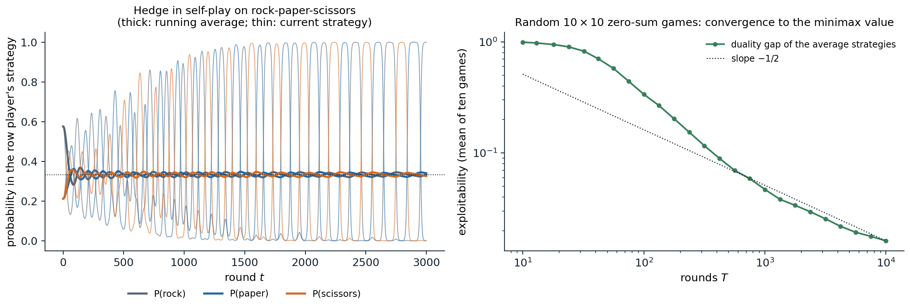

[Background Notes](../README.md) › [Artificial Intelligence](README.md)

# 15. Game Theory and Multiagent Systems

[← 14. Learning Graphical Models](14-learning-graphical-models.md)

## <a id="multiagent-decision-making"></a>Multiagent decision making

Chapter 12 treated a single agent facing uncertainty about nature. When the outcome depends on the choices of other agents, each with its own goals, an agent must reason about what they will do, knowing that they reason about it in turn. **Game theory** is the mathematics of such interactions, and it serves AI in two roles. In **agent design**, it tells an agent how to act among others, from bidding in an auction to negotiating or playing poker. In **mechanism design**, it tells the designer of a system, such as a marketplace, a voting rule, or a protocol among autonomous agents, how to set the rules so that self-interested participants produce a good outcome. Chapter 4 solved the special case of two-player, zero-sum games with perfect information and alternating moves by search; this chapter generalizes to simultaneous moves, arbitrary payoffs, and hidden information, where optimal play may require randomizing. Multiagent reinforcement learning, in which agents learn such strategies from experience, belongs to the RL module.

## <a id="normal-form-games"></a>Normal-form games

### <a id="games-strategies-and-payoffs"></a>Games, strategies, and payoffs

A game in **normal form** consists of players $`i=1,\dots,N`$, a set of **actions** (pure strategies) $`A_i`$ for each player, and a **payoff function** $`u_i(a_1,\dots,a_N)`$ for each player, giving that player's utility for every combination of actions. Two-player games are written as a pair of matrices, the row player's payoffs $`A`$ and the column player's $`B`$. Three small games illustrate the main phenomena:

- **Prisoner's dilemma.** Two suspects can cooperate (stay silent) or defect (testify). Each gets 1 year if both cooperate, 2 years if both defect, and if one defects alone the defector goes free and the other gets 3 years. Whatever the other does, defecting is better, yet mutual defection is worse for both than mutual cooperation.
- **Battle of the sexes**, a coordination game. Both players prefer being together to being apart, but disagree on where: the row player gets 2 at the first venue and 1 at the second, the column player the reverse, and both get 0 if they go to different venues.
- **Matching pennies**, a zero-sum game. Each player shows heads or tails; the row player wins 1 if they match and loses 1 otherwise. Any predictable choice can be exploited.

A **mixed strategy** $`x_i`$ is a probability distribution over $`A_i`$; payoffs of mixed profiles are expected payoffs, $`u_i(x)=\sum_ax_1(a_1)\cdots x_N(a_N)\,u_i(a)`$, justified by the utility theory of chapter 12.

### <a id="dominance-and-best-responses"></a>Dominance and best responses

Action $`a`$ **strictly dominates** $`a'`$ for player $`i`$ if it gives a higher payoff against every combination of the others' actions. A rational player never plays a dominated action, and if all players know this, dominated actions can be removed repeatedly, **iterated elimination of dominated strategies**, which sometimes leaves a single outcome. In the prisoner's dilemma defection strictly dominates, and the unique outcome, mutual defection, is not **Pareto optimal**: another outcome, mutual cooperation, is better for everyone. Individual rationality does not produce collective rationality, the central tension of multiagent systems, which repeated interaction, reputation, contracts, and mechanism design try to resolve.

A **best response** to the others' strategies $`x_{-i}`$ is a strategy maximizing $`u_i(x_i,x_{-i})`$. Some best response is always a pure action, since expected payoff is linear in $`x_i`$, and a mixed strategy is a best response exactly when every action it uses is a best response.

### <a id="nash-equilibrium"></a>Nash equilibrium

A **Nash equilibrium** is a strategy profile in which every player's strategy is a best response to the others': no player can gain by deviating alone. **Nash's theorem** ([Nash, 1950](https://doi.org/10.1073/pnas.36.1.48)) guarantees that every finite game has at least one equilibrium in mixed strategies, by a fixed-point argument. A pure equilibrium may not exist, as in matching pennies, and there may be several, as in the battle of the sexes. Mixed equilibria are computed from the **indifference principle**: each player mixes so that the *other* player is indifferent among the actions it uses, since otherwise it would drop the worse ones. In the battle of the sexes, the column player's mixture must make the row player indifferent, $`2\,y_1=1\,y_2`$, so $`y=(1/3,2/3)`$, and symmetrically $`x=(2/3,1/3)`$.

For two players, **support enumeration** guesses the sets of actions each player uses, solves the indifference equations, and checks that no unused action is better:

```python
from itertools import combinations

import numpy as np
from scipy.optimize import linprog


def support_enumeration(A, B):
    """All Nash equilibria of a nondegenerate bimatrix game (row payoffs A, column payoffs B):
    for each pair of equal-size supports, solve the indifference conditions and check best responses."""
    m, n = A.shape
    eqs = []
    for k in range(1, min(m, n) + 1):
        for I in combinations(range(m), k):
            for J in combinations(range(n), k):
                # column mix y on J makes the row player indifferent across I; row mix x on I does the same for columns
                My = np.r_[np.c_[A[np.ix_(I, J)], -np.ones(k)], np.r_[np.ones(k), 0][None]]
                Mx = np.r_[np.c_[B[np.ix_(I, J)].T, -np.ones(k)], np.r_[np.ones(k), 0][None]]
                try:
                    sy = np.linalg.solve(My, np.r_[np.zeros(k), 1])
                    sx = np.linalg.solve(Mx, np.r_[np.zeros(k), 1])
                except np.linalg.LinAlgError:
                    continue
                x, y = np.zeros(m), np.zeros(n)
                x[list(I)], y[list(J)] = sx[:k], sy[:k]
                if (x < -1e-9).any() or (y < -1e-9).any():
                    continue
                if (A @ y).max() <= sy[k] + 1e-9 and (x @ B).max() <= sx[k] + 1e-9:   # no profitable deviation
                    eqs.append((np.round(np.maximum(x, 0), 3), np.round(np.maximum(y, 0), 3), round(float(x @ A @ y), 3), round(float(x @ B @ y), 3)))
    return eqs


games = {
    "prisoner's dilemma": (np.array([[-1, -3], [0, -2]]), np.array([[-1, 0], [-3, -2]])),     # cooperate, defect
    "battle of the sexes": (np.array([[2, 0], [0, 1]]), np.array([[1, 0], [0, 2]])),
    "matching pennies": (np.array([[1, -1], [-1, 1]]), np.array([[-1, 1], [1, -1]])),
}
for name, (A, B) in games.items():
    print(name)
    for x, y, ua, ub in support_enumeration(A, B):
        print(f"  row plays {x.tolist()}, column plays {y.tolist()}; payoffs {ua}, {ub}")

# A zero-sum game by linear programming: maximize v subject to x^T A >= v for every column, x a distribution.
A = np.array([[3, -1, 2], [-2, 4, 0], [1, 0, -1]], float)
m, n = A.shape
res = linprog(np.r_[np.zeros(m), -1], A_ub=np.c_[-A.T, np.ones(n)], b_ub=np.zeros(n),
              A_eq=np.r_[np.ones(m), 0][None], b_eq=[1], bounds=[(0, None)] * m + [(None, None)])
x, v = res.x[:m], -res.fun
res2 = linprog(np.r_[np.zeros(n), 1], A_ub=np.c_[A, -np.ones(m)], b_ub=np.zeros(m),
               A_eq=np.r_[np.ones(n), 0][None], b_eq=[1], bounds=[(0, None)] * n + [(None, None)])
y, w = res2.x[:n], res2.fun
print(f"zero-sum game: max-min value {v:.4f} with x = {np.round(np.maximum(x, 0), 4).tolist()};"
      f" min-max value {w:.4f} with y = {np.round(np.maximum(y, 0), 4).tolist()}")
# prisoner's dilemma
#   row plays [0.0, 1.0], column plays [0.0, 1.0]; payoffs -2.0, -2.0
# battle of the sexes
#   row plays [1.0, 0.0], column plays [1.0, 0.0]; payoffs 2.0, 1.0
#   row plays [0.0, 1.0], column plays [0.0, 1.0]; payoffs 1.0, 2.0
#   row plays [0.667, 0.333], column plays [0.333, 0.667]; payoffs 0.667, 0.667
# matching pennies
#   row plays [0.5, 0.5], column plays [0.5, 0.5]; payoffs 0.0, 0.0
# zero-sum game: max-min value 1.0000 with x = [0.6, 0.4, 0.0]; min-max value 1.0000 with y = [0.5, 0.5, 0.0]
```

The prisoner's dilemma has only mutual defection. The battle of the sexes has two pure equilibria and a mixed one in which each player gets $`2/3`$, less than in either pure equilibrium, because the players miscoordinate with probability $`5/9`$. Matching pennies has only the uniform mixed equilibrium. For the zero-sum game at the end, linear programming gives the row player a mixture that guarantees at least 1 whatever the column player does, and the column player one that concedes at most 1: the two values coincide, as the minimax theorem below says they must.

Equilibrium is a demanding solution concept. It assumes that players know the game and each other's rationality, it says nothing about how play reaches an equilibrium, and when there are several it does not say which one will be played. Computing a Nash equilibrium is **PPAD-complete** ([Daskalakis, Goldberg, and Papadimitriou, 2009](https://doi.org/10.1137/070699652)), even for two players ([Chen, Deng, and Teng, 2009](https://doi.org/10.1145/1516512.1516516)), a complexity class believed to lack polynomial algorithms, so for large games equilibria may be intractable even when they exist. Support enumeration is exponential; the Lemke–Howson algorithm is usually faster but also exponential in the worst case.

### <a id="zero-sum-games-and-the-minimax-theorem"></a>Zero-sum games and the minimax theorem

In a two-player **zero-sum** game, $`B=-A`$, and Nash equilibria have a much simpler structure. The **minimax theorem** of von Neumann states that

```math
\max_x\min_y\;x^\top Ay=\min_y\max_x\;x^\top Ay=v,
```

the **value** of the game ([Appendix A](#block-ai15-appendix-a)). The row player can guarantee at least $`v`$ by playing its maximin strategy even if the column player knows it, and the column player can hold it to at most $`v`$. Equilibria are exactly the pairs of maximin and minimax strategies, all equilibria give the same payoff, and they are interchangeable. Unlike the general case, the value and optimal strategies are computed by a linear program in polynomial time, as in the code above. The minimax search of chapter 4 is the special case of perfect information, where the optimal strategies are pure.

## <a id="other-solution-concepts-and-learning"></a>Other solution concepts and learning

### <a id="correlated-equilibria"></a>Correlated equilibria

A traffic light tells each driver whether to go or stop. If a driver believes the other will obey, obeying is a best response, so the recommendation is self-enforcing, yet the joint behavior, alternating right of way, is not a Nash equilibrium of the game without the light. A **correlated equilibrium** ([Aumann, 1974](https://www.sciencedirect.com/science/article/pii/0304406874900378)) is a distribution over action profiles such that, when a mediator draws a profile and privately recommends each player its action, no player can gain by deviating from its recommendation. Every Nash equilibrium is a correlated equilibrium with independent recommendations, and correlated equilibria can give higher welfare: in the battle of the sexes, a fair coin that sends both players to the same venue gives each 1.5, against $`2/3`$ in the mixed Nash equilibrium. The set of correlated equilibria is defined by linear inequalities, so an optimal one can be found by linear programming. The weaker **coarse correlated equilibrium** only requires that no player prefers to ignore the mediator altogether and play a fixed action.

### <a id="no-regret-learning"></a>No-regret learning

How can players who do not know the game, or cannot compute its equilibria, reach good play? Suppose a player repeatedly chooses mixed strategies $`x^1,x^2,\dots`$ and observes the payoff vector of all its actions after each round. Its **external regret** after $`T`$ rounds is

```math
R_T=\max_{a}\sum_{t=1}^Tu^t(a)-\sum_{t=1}^Tu^t(x^t),
```

how much better it would have done by playing the best single action in hindsight. The **multiplicative weights**, or **Hedge**, algorithm plays each action with probability proportional to $`\exp\bigl(\eta\sum_{s<t}u^s(a)\bigr)`$ and has regret $`O(\sqrt{T\log n})`$ for $`n`$ actions and payoffs in a bounded range, against any sequence of payoffs, even an adversarial one ([Freund and Schapire, 1999](https://doi.org/10.1006/game.1999.0738)); **regret matching** ([Hart and Mas-Colell, 2000](https://doi.org/10.1111/1468-0262.00153)) plays actions in proportion to their positive cumulative regrets and has the same guarantee. When all players run such algorithms against each other, their **time-averaged** joint play converges to the set of coarse correlated equilibria, and with **swap regret**, which compares against every mapping from actions to actions, to the set of correlated equilibria ([Appendix B](#block-ai15-appendix-b)). In two-player zero-sum games, the average strategies converge to the minimax strategies, which gives a simple algorithm for solving large games.



*Left: both players of rock-paper-scissors run Hedge with step 0.1, the row player starting with extra weight on rock. The current strategies spiral outward and after 3,000 rounds the row player plays rock with probability 1.00, but the running averages (thick) converge to the equilibrium: $`(0.334,0.340,0.326)`$ after 3,000 rounds. Right: Hedge in self-play on ten random $`10\times10`$ zero-sum games with standard normal payoffs, over 10,000 rounds; the duality gap of the average strategies, the amount by which the best response to one player's average exceeds the best response to the other's, falls from 0.99 after 10 rounds to 0.12 after 316 and 0.016 after 10,000, roughly as $`T^{-1/2}`$.*

The figure also shows the limit of these guarantees: the time average converges, not the play itself, and in general games the day-to-day strategies can cycle or behave chaotically.

### <a id="the-price-of-anarchy"></a>The price of anarchy

Equilibria can be inefficient, and the **price of anarchy** measures how much: the ratio between the cost of the worst equilibrium and the cost of the optimal outcome. In **selfish routing**, each driver takes the route that is quickest given the others' choices. In Pigou's example, one unit of traffic travels between two points over two roads, one taking one hour regardless of use and one taking $`x`$ hours when a fraction $`x`$ of the traffic uses it. At equilibrium everyone takes the second road, since it never takes more than an hour, and the average travel time is 1; splitting the traffic evenly would give $`\frac12\cdot1+\frac12\cdot\frac12=\frac34`$. The ratio $`4/3`$ is the worst possible for any network with linear travel times ([Roughgarden and Tardos, 2002](https://doi.org/10.1145/506147.506153)). In **Braess's paradox**, adding a fast road to a network makes every driver's equilibrium trip longer. Such results bound how much is lost by letting self-interested agents, human or artificial, act without coordination.

## <a id="sequential-and-imperfect-information-games"></a>Sequential and imperfect-information games

### <a id="extensive-form-and-subgame-perfection"></a>Extensive form and subgame perfection

Games with sequential moves are described in **extensive form**, as trees with players' decisions, chance moves, and payoffs at the leaves, as in chapter 4. A game tree can be converted to normal form by listing complete strategies, one choice at every decision point, but the conversion is exponential and hides the timing. Some Nash equilibria of the normal form rely on **incredible threats**, promises to act against one's own interest at a point that is never reached. **Subgame-perfect equilibria** rule them out by requiring equilibrium play in every subgame, and in finite games of perfect information they are found by **backward induction**, which is minimax search generalized to non-zero-sum payoffs. In the **ultimatum game**, one player proposes how to split a sum and the other accepts or rejects, in which case both get nothing; backward induction predicts that the responder accepts any positive offer and the proposer offers the minimum, while human responders reject offers they consider unfair, a gap between the theory and behavior like those of chapter 12.

### <a id="imperfect-information"></a>Imperfect information

When players do not observe everything, such as the cards in poker, a player's decision points are grouped into **information sets** of states it cannot distinguish, and a strategy must choose the same action throughout an information set. Optimal strategies are generally mixed: a poker player must bluff with some probability, and must call bluffs with some probability, or be exploited. The **sequence-form** representation reduces two-player zero-sum imperfect-information games to linear programs of size linear in the game tree, and **counterfactual regret minimization** (CFR; [Zinkevich et al., 2007](https://proceedings.neurips.cc/paper/2007/hash/08d98638c6fcd194a4b1e6992063e944-Abstract.html)) runs a regret minimizer at every information set, weighting regrets by the probability of reaching it; the average strategies converge to an equilibrium. CFR and its successors, combined with abstraction of the game and search at play time, produced the programs that beat professional poker players (chapter 4).

## <a id="mechanism-design"></a>Mechanism design

### <a id="designing-the-rules"></a>Designing the rules

Mechanism design inverts the question: given the outcome a designer wants, which rules make self-interested agents produce it? A **mechanism** asks agents for messages, typically reports of their private information, their **types**, and maps the messages to an outcome and payments. It is **incentive compatible** if truthful reporting is optimal for every agent, in dominant strategies (whatever the others do) or in a Bayesian equilibrium. The **revelation principle** says that any outcome achievable in equilibrium by some mechanism is also achievable by a truthful direct mechanism, so the search can be restricted to those.

### <a id="auctions"></a>Auctions

In a **sealed-bid first-price auction**, the highest bidder wins and pays its bid, so bidders shade their bids below their values; with $`n`$ bidders whose values are independent and uniform on $`[0,1]`$, the symmetric equilibrium bid is $`\frac{n-1}{n}`$ times the value. In a **second-price**, or **Vickrey**, auction ([Vickrey, 1961](https://doi.org/10.1111/j.1540-6261.1961.tb02789.x)), the highest bidder wins and pays the second-highest bid. Bidding one's true value is then a dominant strategy ([Appendix C](#block-ai15-appendix-c)): the bid determines only whether one wins, not what one pays, and winning is desirable exactly when the price is below one's value. The English ascending auction is strategically similar.

```python
import numpy as np

rng = np.random.default_rng(0)
n_bidders, rounds = 4, 200_000
values = rng.random((rounds, n_bidders))                  # private values, independent and uniform on [0, 1]

# Second-price (Vickrey) auction with truthful bids: the highest value wins and pays the second-highest bid.
sorted_v = np.sort(values, axis=1)
revenue_second = sorted_v[:, -2].mean()

# First-price auction: in the symmetric equilibrium each bidder shades its bid to (n - 1) / n of its value.
bids = values * (n_bidders - 1) / n_bidders
revenue_first = bids.max(axis=1).mean()
print(f"expected revenue: second price {revenue_second:.4f}, first price {revenue_first:.4f},"
      f" theory (n - 1) / (n + 1) = {(n_bidders - 1) / (n_bidders + 1):.4f}")

# Is truthful bidding a best response in the second-price auction? Bidder 0 tries other bids against truthful rivals.
v0 = 0.7
others = values[:, 1:].max(axis=1)
for b in [0.5, 0.6, 0.7, 0.8, 0.9]:
    utility = np.where(b > others, v0 - others, 0.0).mean()
    print(f"second price, value 0.7, bid {b:.1f}: expected utility {utility:.4f}")
# expected revenue: second price 0.6000, first price 0.6004, theory (n - 1) / (n + 1) = 0.6000
# second price, value 0.7, bid 0.5: expected utility 0.0405
# second price, value 0.7, bid 0.6: expected utility 0.0539
# second price, value 0.7, bid 0.7: expected utility 0.0598
# second price, value 0.7, bid 0.8: expected utility 0.0510
# second price, value 0.7, bid 0.9: expected utility 0.0180
```

With four bidders, both auctions raise an expected revenue of 0.6, the theoretical $`(n-1)/(n+1)`$: bidders shade exactly enough in the first-price auction to offset paying their own bid. This is an instance of **revenue equivalence**: under independent private values and risk neutrality, all auctions that allocate the item to the highest-value bidder and give a bidder with the lowest value zero expected payment raise the same expected revenue. In the second-price auction, a bidder with value 0.7 does best by bidding 0.7, with expected utility 0.060, against 0.054 for bidding 0.6 and 0.051 for bidding 0.8. Revenue-maximizing auctions, which add reserve prices, were characterized by Myerson; online advertising auctions, which sell billions of ad slots a day, are variants of these designs.

### <a id="the-vcg-mechanism"></a>The VCG mechanism

The **Vickrey–Clarke–Groves** mechanism generalizes the second-price auction to any decision with quasi-linear utilities (value minus payment). It chooses the outcome that maximizes the total reported value, and charges each agent the harm its presence causes the others: the others' best total value without it minus their total value in the chosen outcome. Truthful reporting is then a dominant strategy, because each agent's utility becomes the total welfare minus a term it cannot influence, so it wants the mechanism to maximize welfare with its true values. VCG is the benchmark of welfare-maximizing mechanism design, although it can raise little revenue and is vulnerable to collusion.

### <a id="social-choice"></a>Social choice

Voting aggregates preferences without money. **Arrow's impossibility theorem** states that no rule for turning individual rankings of three or more alternatives into a social ranking satisfies unanimity, independence of irrelevant alternatives, and non-dictatorship together, and the **Gibbard–Satterthwaite theorem** that every non-dictatorial voting rule with three or more possible winners can be manipulated by some voter misreporting its preferences. Every aggregation method involves trade-offs, which matter for AI whenever a system must combine the preferences of many people, as in the alignment of AI systems to human values discussed in the Safety and Frontier module.

## <a id="appendices"></a>Appendices


<details>
<summary><a id="block-ai15-appendix-a"></a><b>A. The minimax theorem by linear programming duality</b></summary>


The row player's problem, maximize $`v`$ subject to $`A^\top x\ge v\mathbf 1`$, $`\mathbf 1^\top x=1`$, $`x\ge0`$, is a linear program; its optimal value is $`\max_x\min_jx^\top Ae_j=\max_x\min_yx^\top Ay`$, since for fixed $`x`$ the inner minimum over mixed $`y`$ is attained at a pure strategy. Its dual, obtained by assigning multipliers $`y_j\ge0`$ to the constraints $`x^\top Ae_j\ge v`$ and $`w`$ to the normalization, is: minimize $`w`$ subject to $`Ay\le w\mathbf 1`$, $`\mathbf 1^\top y=1`$, $`y\ge0`$, whose optimal value is $`\min_y\max_xx^\top Ay`$. Both programs are feasible and bounded, so by **strong duality** their optimal values are equal, which is the minimax theorem.

The easy inequality holds for any function: $`\max_x\min_yf(x,y)\le\min_y\max_xf(x,y)`$, since for any $`x'`$ and $`y'`$, $`\min_yf(x',y)\le f(x',y')\le\max_xf(x,y')`$. The content of the theorem is the reverse inequality, which uses the bilinearity of $`x^\top Ay`$ and the convexity of the sets of mixed strategies; for pure strategies it fails, as matching pennies shows (the pure max-min is $`-1`$ and the pure min-max is $`1`$).

</details>


<details>
<summary><a id="block-ai15-appendix-b"></a><b>B. No regret implies coarse correlated equilibrium</b></summary>


Let every player $`i`$ run an algorithm with external regret $`R_T^i\le\varepsilon T`$, and let $`\sigma_T`$ be the empirical distribution of the action profiles played over $`T`$ rounds (with the players' mixed strategies, the average of the product distributions). For any fixed action $`a_i'`$,

```math
\mathbb E_{a\sim\sigma_T}\bigl[u_i(a)\bigr]=\frac1T\sum_tu_i(a^t)\ge\frac1T\sum_tu_i(a_i',a_{-i}^t)-\varepsilon=\mathbb E_{a\sim\sigma_T}\bigl[u_i(a_i',a_{-i})\bigr]-\varepsilon,
```

which says that no player gains more than $`\varepsilon`$ by committing to a fixed action instead of following the distribution: $`\sigma_T`$ is an $`\varepsilon`$-coarse correlated equilibrium. As $`\varepsilon=O(\sqrt{\log n/T})\to0`$, the empirical distributions approach the set of coarse correlated equilibria. With swap regret, the comparison is against $`\sum_tu_i(\phi(a_i^t),a_{-i}^t)`$ for every map $`\phi:A_i\to A_i`$, which is exactly the correlated-equilibrium condition.

In a zero-sum game, apply the regret bounds of both players to the averages $`\bar x,\bar y`$: the row player's bound gives $`\max_x x^\top A\bar y\le\frac1T\sum_tx^{t\top}Ay^t+\varepsilon`$ and the column player's gives $`\min_y\bar x^\top Ay\ge\frac1T\sum_tx^{t\top}Ay^t-\varepsilon`$, so the duality gap of $`(\bar x,\bar y)`$ is at most $`2\varepsilon`$: the average strategies are $`2\varepsilon`$-optimal, as the figure shows.

</details>


<details>
<summary><a id="block-ai15-appendix-c"></a><b>C. Truthfulness of the second-price auction</b></summary>


Fix a bidder with value $`v`$ and let $`p`$ be the highest of the other bids. With bid $`b`$, the bidder's utility is $`v-p`$ if $`b>p`$ and 0 if $`b<p`$ (ties aside). Bidding $`b=v`$ gives $`\max(v-p,0)`$, the best possible outcome for any $`p`$: it wins exactly when winning is profitable. Any other bid can only change the outcome when $`p`$ lies between $`b`$ and $`v`$: bidding $`b>v`$ additionally wins when $`v<p<b`$, at a loss of $`p-v>0`$, and bidding $`b<v`$ additionally loses when $`b<p<v`$, forgoing a gain of $`v-p>0`$. So truthful bidding is weakly dominant, whatever the others bid and whatever the bidder believes about them. The same argument, applied to the welfare of the other agents instead of the price, proves truthfulness of VCG.

For the first-price auction with $`n`$ bidders and independent uniform values, suppose the others bid $`\beta v`$. A bidder with value $`v`$ bidding $`b\le\beta`$ wins when all others' values are below $`b/\beta`$, with probability $`(b/\beta)^{n-1}`$, so its expected utility is $`(v-b)(b/\beta)^{n-1}`$, maximized at $`b=\frac{n-1}{n}v`$; consistency requires $`\beta=\frac{n-1}{n}`$. The winner pays $`\frac{n-1}{n}`$ times the highest of $`n`$ values, whose expectation is $`\frac{n}{n+1}`$, so the expected revenue is $`\frac{n-1}{n+1}`$, the expected second-highest value, as in the second-price auction.

</details>

---

[← 14. Learning Graphical Models](14-learning-graphical-models.md)
