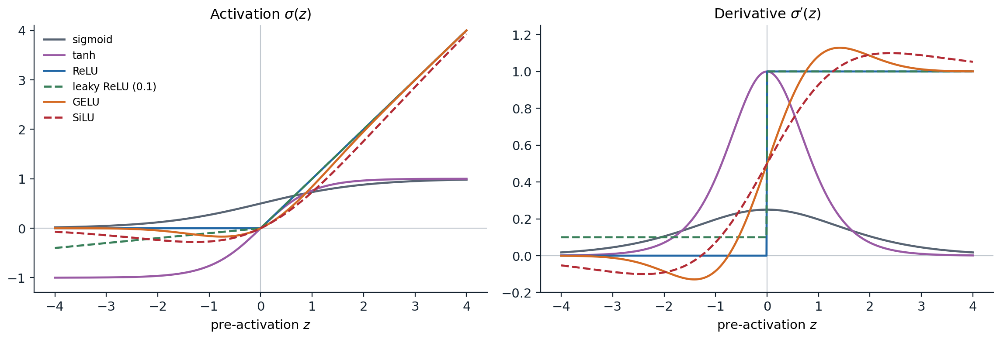
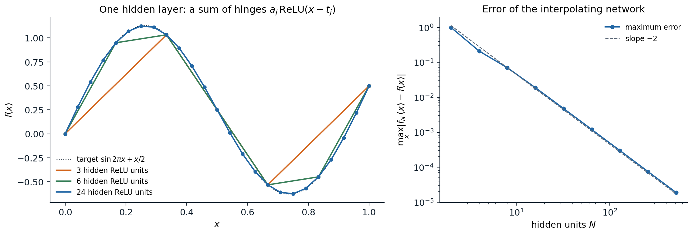
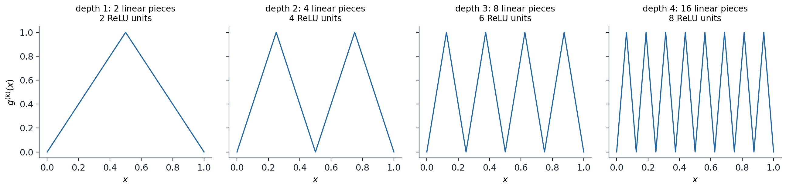
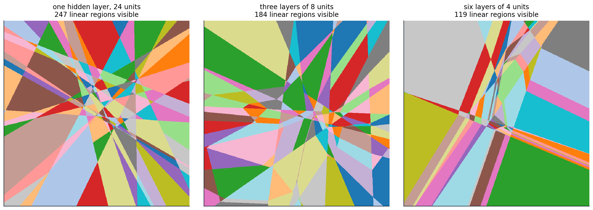
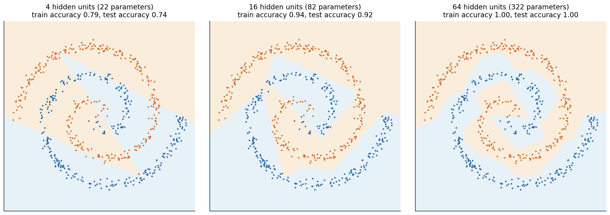

[ML Mastery Notes](../README.md) › [Deep Learning](README.md)

# 1. Deep Feedforward Networks

[2. Initialization and Signal Propagation →](02-initialization-and-signal-propagation.md)

## <a id="from-fixed-features-to-learned-features"></a>From fixed features to learned features

### <a id="what-changes-in-deep-learning"></a>What changes in deep learning

The ML module fitted models of the form $f(x)=w^\top\phi(x)+b$, where the features $\phi(x)$ were fixed in advance: the raw inputs, polynomial or spline bases, or the implicit feature map of a kernel (ML chapter 8). Given $\phi$, fitting is usually a convex problem. A **neural network** learns the features as well. It composes several parameterized maps, and training adjusts all of them to reduce the same loss. The price is a nonconvex objective; the gain is a representation adapted to the task, which can be far more economical than any fixed basis for high-dimensional inputs such as images, audio, or text.

The idea is old. The perceptron of ML chapter 2 is a single linear unit; networks with hidden layers trained by backpropagation were popularized by [Rumelhart, Hinton, and Williams (1986)](https://doi.org/10.1038/323533a0). What changed after 2010 was scale: large labeled datasets, graphics processors, and a set of techniques, developed in chapters 2–5, that make deep networks trainable. The ImageNet result of [Krizhevsky, Sutskever, and Hinton (2012)](https://papers.nips.cc/paper/2012/hash/c399862d3b9d6b76c8436e924a68c45b-Abstract.html) is the usual marker of the transition. Foundations places deep learning among the other disciplines.

### <a id="the-multilayer-perceptron"></a>The multilayer perceptron

A **multilayer perceptron** (MLP), or fully connected feedforward network, with $L$ layers maps an input $x\in\mathbb R^{d_0}$ through hidden layers of widths $d_1,\ldots,d_{L-1}$ to an output in $\mathbb R^{d_L}$:

$$
h^{(0)}=x,\qquad z^{(l)}=W^{(l)}h^{(l-1)}+b^{(l)},\qquad h^{(l)}=\sigma\bigl(z^{(l)}\bigr)\quad(l=1,\ldots,L-1),\qquad f(x)=W^{(L)}h^{(L-1)}+b^{(L)}.
$$

Here $W^{(l)}\in\mathbb R^{d_l\times d_{l-1}}$ and $b^{(l)}\in\mathbb R^{d_l}$ are the **weights** and **biases** of layer $l$, $z^{(l)}$ are its **pre-activations**, and the **activation function** $\sigma$ acts elementwise. Each coordinate of $h^{(l)}$ is a **unit** or neuron. The last layer has no nonlinearity; its outputs are the scores that the loss interprets. A network with $L-1$ hidden layers is said to have depth $L$ (counting the layers with weights), and the parameters $\theta=\{W^{(l)},b^{(l)}\}$ number

$$
\sum_{l=1}^Ld_l\,(d_{l-1}+1).
$$

For a batch of $n$ inputs stored as rows of $X\in\mathbb R^{n\times d_0}$, layer $l$ computes $H^{(l)}=\sigma\bigl(H^{(l-1)}W^{(l)\top}+\mathbf 1b^{(l)\top}\bigr)$, the row convention of Foundations. PyTorch's `nn.Linear(d_in, d_out)` stores its weight with shape `(d_out, d_in)` for this reason, as described in Foundations chapter 6.

The nonlinearity is essential. Without it, the composition of affine maps is affine, and a network of any depth computes the same functions as a single linear layer. With it, each hidden layer computes new features of the previous layer's features, and the last layer is a linear model on the learned representation $h^{(L-1)}(x)$.

### <a id="computing-gradients"></a>Computing gradients

Training minimizes an empirical risk $\widehat R_n(\theta)=\frac1n\sum_i\ell\bigl(y_i,f_\theta(x_i)\bigr)$ by stochastic gradient methods. The gradient with respect to every weight comes from one backward pass through the network, the reverse-mode differentiation derived in Foundations chapter 3. For the MLP it takes a compact form. Write $\delta^{(l)}=\partial\ell/\partial z^{(l)}$ for the gradient of the loss with respect to the pre-activations of layer $l$, as a column. Then

$$
\delta^{(l)}=\sigma'\bigl(z^{(l)}\bigr)\odot\Bigl(W^{(l+1)\top}\delta^{(l+1)}\Bigr),\qquad
\frac{\partial\ell}{\partial W^{(l)}}=\delta^{(l)}h^{(l-1)\top},\qquad
\frac{\partial\ell}{\partial b^{(l)}}=\delta^{(l)} .
$$

The backward pass multiplies by the transposed weight matrices in reverse order, scaled at each layer by the derivative of the activation. Two consequences recur in the next chapters. First, the backward pass needs every $z^{(l)}$ and $h^{(l-1)}$ from the forward pass, so memory grows with depth and batch size (chapter 11). Second, the gradient reaching early layers is a product of many matrices and derivative factors, which can shrink or grow geometrically with depth (chapter 2).

## <a id="activation-functions"></a>Activation functions

The choice of $\sigma$ affects what is easy to represent and, more importantly in practice, how gradients flow.

- The **logistic sigmoid** $1/(1+e^{-z})$ and **tanh** were standard until about 2010. Both **saturate**: for large $|z|$ their derivatives vanish, so a unit pushed far from zero stops learning. The sigmoid's derivative is at most $1/4$, which shrinks gradients by at least a factor of four per layer; tanh is centered at zero and has slope 1 at the origin.
- The **rectified linear unit** $\mathrm{ReLU}(z)=\max\{z,0\}$ ([Glorot, Bordes, and Bengio, 2011](https://proceedings.mlr.press/v15/glorot11a.html)) does not saturate for positive inputs, is cheap, and produces exact zeros. Its derivative is 0 or 1. A unit whose pre-activation is negative for every input is **dead**: it receives no gradient and cannot recover.
- **Leaky ReLU** $\max\{z,\alpha z\}$ with small $\alpha$ keeps a gradient for negative inputs; the **ELU** ([Clevert, Unterthiner, and Hochreiter, 2015](https://arxiv.org/abs/1511.07289)) is a smooth variant.
- **GELU** $z\,\Phi(z)$, with $\Phi$ the standard normal distribution function ([Hendrycks and Gimpel, 2016](https://arxiv.org/abs/1606.08415)), and **SiLU** (or Swish) $z\,\mathrm{sigmoid}(z)$ ([Ramachandran, Zoph, and Le, 2017](https://arxiv.org/abs/1710.05941)) are smooth, slightly non-monotone versions of ReLU. They are the defaults in transformers (chapter 9).



*Common activation functions and their derivatives, computed with PyTorch's autograd. Sigmoid and tanh saturate on both sides; the sigmoid's derivative never exceeds 0.25. ReLU has derivative exactly 0 for negative inputs; leaky ReLU keeps slope 0.1 there. GELU and SiLU follow ReLU for large $|z|$ but are smooth near zero and dip slightly below zero, so their derivatives are briefly negative.*

For hidden layers, ReLU and its smooth relatives are the usual choice. The choice matters less than initialization and normalization, which chapters 2 and 4 treat, but saturating activations in deep networks remain a common cause of stalled training.

## <a id="what-networks-can-represent"></a>What networks can represent

### <a id="universal-approximation"></a>Universal approximation

A network with a single hidden layer computes $f(x)=\sum_{j=1}^Na_j\,\sigma(w_j^\top x+b_j)+c$, a sum of $N$ **ridge functions**, each varying only along one direction $w_j$. How large is this class?

**Theorem (universal approximation).** Let $\sigma$ be continuous and not a polynomial. For every continuous function $g$ on a compact set $K\subset\mathbb R^d$ and every $\varepsilon>0$ there are $N$ and parameters $a_j,w_j,b_j,c$ such that

$$
\sup_{x\in K}\Bigl|g(x)-c-\sum_{j=1}^Na_j\,\sigma(w_j^\top x+b_j)\Bigr|<\varepsilon .
$$

Versions for sigmoidal activations are due to [Cybenko (1989)](https://doi.org/10.1007/BF02551274) and [Hornik, Stinchcombe, and White (1989)](https://www.sciencedirect.com/science/article/abs/pii/0893608089900208); the characterization by non-polynomiality is due to [Leshno, Lin, Pinkus, and Schocken (1993)](https://www.sciencedirect.com/science/article/abs/pii/S0893608005801315). The polynomial exception is necessary: if $\sigma$ is a polynomial of degree $p$, every such network is a polynomial of degree at most $p$ in $x$, and polynomials of bounded degree are not dense.

For ReLU in one dimension the theorem has a transparent proof. A width-$N$ network

$$
f_N(x)=g(t_0)+\sum_{j=0}^{N-1}a_j\,\mathrm{ReLU}(x-t_j)
$$

is a continuous piecewise-linear function with kinks at the $t_j$: each unit adds a hinge, and $a_j$ is the change of slope at $t_j$. Choosing $a_0$ as the slope of the first segment and $a_j$ as the difference of consecutive slopes makes $f_N$ the linear interpolant of $g$ at the knots $t_0<\cdots<t_N$. For twice-differentiable $g$ on $[0,1]$ with equally spaced knots, the interpolation error is at most $\max|g''|/(8N^2)$. [Appendix A](#block-dl1-appendix-a) proves this and extends the construction to $d$ dimensions.



*Left: one-hidden-layer ReLU networks with 3, 6, and 24 units, with weights set so that each network interpolates $\sin 2\pi x+x/2$ at equally spaced knots (dots). Right: the maximum error falls as $N^{-2}$, from 0.21 with 4 units to $1.9\times10^{-5}$ with 512.*

```python
import numpy as np

f = lambda x: np.sin(2 * np.pi * x) + 0.5 * x            # target on [0, 1]
relu = lambda z: np.maximum(z, 0)

def interpolating_network(N):
    """A width-N ReLU network that linearly interpolates f at N + 1 equally spaced knots."""
    t = np.linspace(0, 1, N + 1)                          # knots
    s = np.diff(f(t)) / np.diff(t)                        # slope of each segment
    a = np.r_[s[0], np.diff(s)]                           # output weights: change of slope at each knot
    return lambda x: f(t[0]) + relu(x[:, None] - t[None, :-1]) @ a

x = np.linspace(0, 1, 100_001)
bound = 4 * np.pi ** 2 / 8                                # max|f''| / 8, times h^2 = 1 / N^2
for N in [4, 16, 64, 256]:
    net = interpolating_network(N)
    knots = np.linspace(0, 1, N + 1)
    err = np.max(np.abs(net(x) - f(x)))
    print(f"N = {N:3d}: exact at knots {np.allclose(net(knots), f(knots))}, "
          f"max error {err:.2e}, bound {bound / N ** 2:.2e}")
# N =   4: exact at knots True, max error 2.11e-01, bound 3.08e-01
# N =  16: exact at knots True, max error 1.88e-02, bound 1.93e-02
# N =  64: exact at knots True, max error 1.20e-03, bound 1.20e-03
# N = 256: exact at knots True, max error 7.53e-05, bound 7.53e-05
```

### <a id="what-the-theorem-does-not-say"></a>What the theorem does not say

Universal approximation is an existence statement. It gives no bound on the width needed, no method for finding the weights from data, and no guarantee that the approximating network generalizes. Polynomials, splines, and Gaussian kernel expansions are universal approximators too. The theorem rules out only one worry, that a network of fixed architecture type is too restricted in principle.

The width needed can be enormous. Approximating an arbitrary function with $s$ bounded derivatives to accuracy $\varepsilon$ in $d$ dimensions requires on the order of $\varepsilon^{-d/s}$ parameters for any method whose parameters depend continuously on the target, the curse of dimensionality of ML chapter 1 in another form. Networks escape it only for restricted function classes. [Barron (1993)](https://doi.org/10.1109/18.256500) showed that if $g$ has a Fourier transform with finite first moment $C_g=\int\|\omega\|\,|\hat g(\omega)|\,d\omega$, then a sigmoidal network with $N$ hidden units achieves squared $L^2$ error at most $(2rC_g)^2/N$ on a ball of radius $r$, a rate that does not depend on $d$, although $C_g$ may. Fixed bases with $N$ terms cannot match this rate uniformly over the same class.

### <a id="depth-and-linear-regions"></a>Depth and linear regions

A ReLU network is a continuous piecewise-linear function: each pattern of active and inactive units fixes a linear map, and the input space is partitioned into **linear regions** on which the pattern is constant. A single hidden layer of $m$ units in one dimension has at most $m+1$ pieces, and in $d$ dimensions its regions are those of an arrangement of $m$ hyperplanes, at most $\sum_{i=0}^d\binom mi$. Depth multiplies instead of adding. The tent map

$$
\tau(x)=2\,\mathrm{ReLU}(x)-4\,\mathrm{ReLU}\bigl(x-\tfrac12\bigr),
$$

which maps $[0,1]$ onto itself with two pieces, uses two ReLU units. Composing it $k$ times gives a sawtooth with $2^k$ pieces from a network of depth $k$ and only $2k$ units.



*Compositions of the tent map. Each extra layer of two units doubles the number of linear pieces; a network with one hidden layer needs $2^k-1$ units to produce the same function.*

[Telgarsky (2016)](https://arxiv.org/abs/1602.04485) turned this into a **depth-separation** result: some functions computed by deep networks with a constant number of units per layer cannot be approximated by shallower networks unless those have exponentially many units. [Appendix B](#block-dl1-appendix-b) proves the one-dimensional core of the argument: a network with $L$ hidden layers of width $m$ has at most $(m+1)^L$ pieces, and any function with at most $2^{k-2}$ pieces has $L^1$ distance at least $1/16$ from the $k$-fold sawtooth. [Eldan and Shamir (2016)](https://arxiv.org/abs/1512.03965) gave a separation between depths two and three in high dimension, and [Montúfar, Pascanu, Cho, and Bengio (2014)](https://arxiv.org/abs/1402.1869) showed that the maximal number of linear regions grows exponentially with depth.

Maximal counts describe carefully constructed weights, not typical ones. [Hanin and Rolnick (2019)](https://arxiv.org/abs/1901.09021) showed that at random initialization, and empirically during training, the number of regions met along a line grows roughly linearly with the total number of units, whatever the depth. The next computation makes both points in one dimension.

```python
import numpy as np

def count_pieces(weights, biases, x):
    """Number of activation regions of a 1D-input ReLU network along the grid x."""
    h, patterns = x[:, None], []
    for W, b in zip(weights, biases):
        z = h @ W.T + b
        patterns.append(z > 0)
        h = np.maximum(z, 0)
    code = np.concatenate(patterns, axis=1)
    return 1 + int(np.sum(np.any(code[1:] != code[:-1], axis=1)))

x = (np.arange(2 ** 16) + 0.5) / 2 ** 16                   # cell midpoints avoid the dyadic kinks
tent_W, tent_b = np.array([[1.0], [1.0]]), np.array([0.0, -0.5])
mix = np.array([[2.0, -4.0]])                                # tent(x) = 2 relu(x) - 4 relu(x - 1/2)
rng = np.random.default_rng(0)
for k in [2, 4, 6, 8, 10]:
    # Sawtooth: layer j applies the two hinges to the previous tent output, a linear map of its hinges.
    Ws = [tent_W] + [tent_W @ mix] * (k - 1)
    bs = [tent_b] * k
    saw = count_pieces(Ws, bs, x)
    rand = []
    for _ in range(200):                                     # random networks with the same shape
        Ws_r = [rng.normal(size=(2, 1))] + [rng.normal(size=(2, 2)) for _ in range(k - 1)]
        bs_r = [rng.normal(scale=0.5, size=2) for _ in range(k)]
        rand.append(count_pieces(Ws_r, bs_r, x))
    print(f"depth {k:2d} ({2 * k:2d} units): sawtooth {saw:5d} pieces; one hidden layer of {2 * k} units "
          f"at most {2 * k + 1}; random depth-{k} networks: mean {np.mean(rand):.1f}, max {max(rand)}")
# depth  2 ( 4 units): sawtooth     4 pieces; one hidden layer of 4 units at most 5; random depth-2 networks: mean 2.1, max 5
# depth  4 ( 8 units): sawtooth    16 pieces; one hidden layer of 8 units at most 9; random depth-4 networks: mean 2.5, max 8
# depth  6 (12 units): sawtooth    64 pieces; one hidden layer of 12 units at most 13; random depth-6 networks: mean 2.5, max 8
# depth  8 (16 units): sawtooth   256 pieces; one hidden layer of 16 units at most 17; random depth-8 networks: mean 2.6, max 10
# depth 10 (20 units): sawtooth  1024 pieces; one hidden layer of 20 units at most 21; random depth-10 networks: mean 2.6, max 11
```

The random narrow networks are nearly linear on $[0,1]$: most units are inactive or active over the whole interval, and a layer of two units in which both are off passes nothing forward. Depth makes exponentially complex functions *possible*; it does not make them typical, and training does not seek them out. The practical case for depth is empirical: deep networks reach a given accuracy with fewer parameters and generalize better on natural data, whose structure is hierarchical and compositional. How to make deep networks trainable is the subject of chapters 2–4.



*Linear regions of three randomly initialized ReLU networks with 24 hidden units each, on the square $[-2,2]^2$; each color is one activation pattern. The single hidden layer gives an arrangement of 24 lines, which can have at most 301 regions in the whole plane. The deeper networks bend their boundaries at every layer but, at random initialization, show fewer regions in this window.*

## <a id="output-layers-and-losses"></a>Output layers and losses

The last layer produces unconstrained scores, and the loss turns them into a statement about the target. As in ML chapter 5, the losses are negative log-likelihoods of a conditional model $p_\theta(y\mid x)$ whose parameters are the network outputs, so training is maximum conditional likelihood and the loss values are in nats (Foundations chapter 5).

| Target | Output layer and model | Loss per example |
| --- | --- | --- |
| Real vector $y$ | $\mu=f(x)$; $y\sim\mathcal N(\mu,\sigma^2I)$ with fixed $\sigma$ | squared error $\frac12\|y-\mu\|^2$, up to constants |
| Real $y$ with input-dependent noise | $(\mu,s)=f(x)$, variance $e^{s}$ | $\frac12s+\frac12(y-\mu)^2e^{-s}$ |
| One of $K$ classes | logits $f(x)\in\mathbb R^K$; softmax probabilities | cross-entropy $-f_y(x)+\log\sum_ke^{f_k(x)}$ |
| Several binary labels | one logit per label; independent Bernoulli | sum of binary cross-entropies |

Two practical points follow. First, the loss should be computed from logits with a log-sum-exp, as PyTorch's `cross_entropy` does, never by taking the logarithm of computed probabilities (Foundations chapter 6). Second, the likelihood view extends to richer outputs: a network can output the parameters of a mixture ([Bishop's mixture density networks](https://research.aston.ac.uk/en/publications/mixture-density-networks/)), of a distribution over sequences (the NLP and LLMs module), or of an image distribution (the Generative AI module).

Classifiers trained with cross-entropy are not automatically calibrated; large networks tend to be overconfident, and the recalibration methods of ML chapter 5 apply unchanged.

## <a id="training-a-network"></a>Training a network

### <a id="an-example"></a>An example

Two interleaved spirals are a classic test: no linear or low-degree polynomial boundary separates them. The code below trains networks of several sizes with Adam on 600 points and measures accuracy on 4,000 fresh points, repeating each run with three random initializations.

```python
import numpy as np
import torch
from torch import nn

torch.set_num_threads(1)                      # single-threaded arithmetic makes the runs reproducible

def spirals(n, seed, noise=0.03):
    """Two interleaved spirals in the plane, labels 0 and 1."""
    r = np.random.default_rng(seed)
    t = np.sqrt(r.uniform(0, 1, n)) * 3 * np.pi
    y = r.integers(0, 2, n)
    s = np.where(y == 1, 1, -1)
    X = np.column_stack([s * t * np.cos(t), s * t * np.sin(t)]) / (3 * np.pi) + noise * r.normal(size=(n, 2))
    return torch.tensor(X, dtype=torch.float32), torch.tensor(y)

Xtr, ytr = spirals(600, seed=0)
Xte, yte = spirals(4000, seed=1)

def mlp(widths):
    layers, d = [], 2
    for w in widths:
        layers += [nn.Linear(d, w), nn.ReLU()]
        d = w
    return nn.Sequential(*layers, nn.Linear(d, 2))           # outputs are logits for the two classes

def fit(widths, seed, steps=3000):
    torch.manual_seed(seed)
    model = mlp(widths)
    opt = torch.optim.Adam(model.parameters(), lr=0.01)
    for _ in range(steps):                                   # full-batch training on the 600 points
        opt.zero_grad()
        nn.functional.cross_entropy(model(Xtr), ytr).backward()
        opt.step()
    with torch.no_grad():
        acc = (model(Xte).argmax(1) == yte).float().mean().item()
    return sum(p.numel() for p in model.parameters()), acc

for widths in [[4], [16], [64], [8, 8, 8]]:
    results = [fit(widths, seed) for seed in range(3)]
    print(f"hidden widths {str(widths):10s} {results[0][0]:4d} parameters; test accuracy over three seeds:",
          " ".join(f"{acc:.2f}" for _, acc in results))
# hidden widths [4]          22 parameters; test accuracy over three seeds: 0.74 0.61 0.75
# hidden widths [16]         82 parameters; test accuracy over three seeds: 0.92 0.95 0.96
# hidden widths [64]        322 parameters; test accuracy over three seeds: 1.00 1.00 1.00
# hidden widths [8, 8, 8]   186 parameters; test accuracy over three seeds: 0.74 0.92 0.94
```



*Decision regions of one-hidden-layer ReLU networks trained on the spirals (seed 0). Four units give a few straight cuts; sixteen give a polygonal approximation to the spiral arms; sixty-four fit the arms closely and classify the test set almost perfectly. Every boundary is made of straight segments, one per change of activation pattern.*

Two features of these results carry over to real problems. Capacity matters: the widest network fits the arms and generalizes best, and far larger networks, with many more parameters than training examples, often generalize well too, a puzzle taken up in chapter 5. And the narrow deep network, which can represent the spirals, reaches 0.92–0.94 accuracy from two initializations and 0.74 from the third: whether training finds a good solution depends on initialization, width, and the optimizer, not only on what the architecture can represent.

### <a id="nonconvexity-and-symmetry"></a>Nonconvexity and symmetry

The training objective of a network with hidden layers is nonconvex. Part of the reason is **symmetry**. Permuting the hidden units of a layer, together with the corresponding rows of $W^{(l)}$ and $b^{(l)}$ and columns of $W^{(l+1)}$, leaves the function unchanged, so every minimizer comes with $d_l!$ copies for each hidden layer. For ReLU networks there is also a continuous symmetry: $\mathrm{ReLU}(cz)=c\,\mathrm{ReLU}(z)$ for $c>0$, so multiplying a unit's incoming weights and bias by $c$ and its outgoing weights by $1/c$ changes nothing.

```python
import torch
from torch import nn

torch.manual_seed(0)
net = nn.Sequential(nn.Linear(3, 5), nn.ReLU(), nn.Linear(5, 1))
x = torch.randn(1000, 3)

twin = nn.Sequential(nn.Linear(3, 5), nn.ReLU(), nn.Linear(5, 1))
perm = torch.randperm(5)                       # relabel the hidden units
c = torch.rand(5) + 0.5                        # and rescale each one: relu(c z) = c relu(z) for c > 0
with torch.no_grad():
    twin[0].weight.copy_(c[:, None] * net[0].weight[perm])
    twin[0].bias.copy_(c * net[0].bias[perm])
    twin[2].weight.copy_(net[2].weight[:, perm] / c)
    twin[2].bias.copy_(net[2].bias)
    same = torch.allclose(net(x), twin(x), atol=1e-6)
    dist = torch.cat([(p - q).flatten() for p, q in zip(net.parameters(), twin.parameters())]).norm()
print("same function:", same, "; distance between parameter vectors:", round(dist.item(), 2))
print("equivalent parameter settings from permutations alone: 5! =", torch.arange(1, 6).prod().item())
# same function: True ; distance between parameter vectors: 1.97
# equivalent parameter settings from permutations alone: 5! = 120
```

Symmetry rules out convexity. If the loss were convex, the average of a minimizer over all permutations of a layer's units would also be a minimizer. In that average every unit of the layer has the same weights, so the layer behaves like a single unit. Whenever a wider layer fits strictly better than a single unit, the loss therefore cannot be convex. Symmetry has a second consequence: the parameters of a network are not identifiable, and individual weights have no meaning on their own. Comparisons between trained networks must be made through the functions or representations they compute.

Nonconvexity is less damaging in practice than the worst case suggests. Gradient descent is repelled by most saddle points, the loss surfaces of wide networks contain large connected sets of near-optimal parameters, and different runs typically reach solutions with similar loss. Chapter 3 examines what is known about these landscapes. The first requirement, however, is that gradients reach every layer with a useful magnitude at the start of training, which is the subject of chapter 2.

[UDL](https://udlbook.github.io/udlbook/) chapters 3–5 develop shallow networks, deep networks, and loss functions with interactive figures, and chapter 20 discusses why depth helps. [DLB](https://www.deeplearningbook.org/contents/mlp.html) chapter 6 covers feedforward networks and backpropagation. Pinkus's survey [*Approximation theory of the MLP model in neural networks*](https://www.cambridge.org/core/journals/acta-numerica/article/abs/approximation-theory-of-the-mlp-model-in-neural-networks/18072C558C8410C4F92A82BCC8FC8CF9) collects the approximation results. UMich lecture 5 and UNIGE sections 3.4 and 6.1, listed in the reading plan, cover the same material in lectures.

## <a id="appendices"></a>Appendices


<details>
<summary><a id="block-dl1-appendix-a"></a><b>A. Universal approximation with ReLU units</b></summary>


**One dimension.** Let $g$ be continuous on $[0,1]$ and let $0=t_0<t_1<\cdots<t_N=1$. Let $s_j=\bigl(g(t_{j+1})-g(t_j)\bigr)/(t_{j+1}-t_j)$ be the slope of the chord on $[t_j,t_{j+1}]$, and set $a_0=s_0$ and $a_j=s_j-s_{j-1}$ for $1\le j\le N-1$. The network

$$
f_N(x)=g(t_0)+\sum_{j=0}^{N-1}a_j\,\mathrm{ReLU}(x-t_j)
$$

has slope $a_0+\cdots+a_j=s_j$ on $[t_j,t_{j+1}]$ and value $g(t_0)$ at $t_0$, so it is the piecewise-linear interpolant of $g$. Since $g$ is uniformly continuous, the interpolant converges uniformly as the mesh $\max_j(t_{j+1}-t_j)$ tends to zero.

If $g$ is twice continuously differentiable and the knots are equally spaced with spacing $h=1/N$, then on each interval the error $e=g-f_N$ vanishes at both ends and satisfies $e''=g''$. For $x$ in $[t_j,t_{j+1}]$, the standard interpolation remainder gives $e(x)=\frac12g''(\xi)(x-t_j)(x-t_{j+1})$ for some $\xi$ in the interval, and $|(x-t_j)(x-t_{j+1})|\le h^2/4$. Hence $\|g-f_N\|_\infty\le\max|g''|\,h^2/8$.

**Several dimensions.** Let $K\subset\mathbb R^d$ be compact and $g$ continuous on $K$. Functions of the form $\sum_kc_k\cos(\omega_k^\top x+\varphi_k)$ form an algebra, because products of cosines are sums of cosines; it contains the constants and separates points. By the Stone–Weierstrass theorem it is dense in $C(K)$, so $g$ is within $\varepsilon/2$ of a finite sum $\sum_{k=1}^Mc_k\cos(\omega_k^\top x+\varphi_k)$. Each term is a continuous function of the scalar $u=\omega_k^\top x$, which ranges over a bounded interval as $x$ ranges over $K$. By the one-dimensional result, $c_k\cos(u+\varphi_k)$ is within $\varepsilon/(2M)$ of a one-hidden-layer ReLU network in $u$, and substituting $u=\omega_k^\top x$ turns each unit $\mathrm{ReLU}(u-t)$ into $\mathrm{ReLU}(\omega_k^\top x-t)$. The sum of the $M$ networks is a single one-hidden-layer network within $\varepsilon$ of $g$ on $K$.

The same argument works for any continuous $\sigma$ that can approximate a one-dimensional hinge or step with a few units, which covers the sigmoid and tanh: $\mathrm{sigmoid}(cz)$ tends to a step as $c\to\infty$.

</details>


<details>
<summary><a id="block-dl1-appendix-b"></a><b>B. Depth separation in one dimension</b></summary>


**Counting pieces.** Consider a ReLU network with scalar input, $L$ hidden layers of width at most $m$, and a linear output. Let $B_l$ be the set of breakpoints of all functions $x\mapsto h^{(l)}_j(x)$ computed in layers $1,\ldots,l$, with $B_0=\varnothing$. Every pre-activation $z^{(l+1)}_j$ is an affine combination of layer-$l$ outputs, so it is affine on each of the at most $|B_l|+1$ intervals between consecutive points of $B_l$. On each such interval, $\mathrm{ReLU}(z^{(l+1)}_j)$ adds at most one breakpoint, where $z^{(l+1)}_j$ changes sign. Hence

$$

|B_{l+1}|\le|B_l|+m\bigl(|B_l|+1\bigr),\qquad\text{so}\qquad |B_{l+1}|+1\le(m+1)\bigl(|B_l|+1\bigr),
$$

and the network output, an affine combination of the last layer, has at most $(m+1)^L$ pieces. With one hidden layer this is $m+1$.

**The sawtooth is hard to approximate with few pieces.** The $k$-fold composition $g_k$ of the tent map consists of $2^{k-1}$ triangles, each rising from 0 to 1 and falling back to 0 over an interval of length $2^{1-k}$. On each triangle, $g_k>1/2$ on the middle half of the interval and $g_k<1/2$ on the two outer quarters. Let $f$ be piecewise linear with $p$ pieces. Each piece crosses the level $1/2$ at most once, so $f-1/2$ changes sign at most $p$ times in total. Consider a triangle on whose interval $f-1/2$ does not change sign. If $f\le1/2$ there, then $|f-g_k|\ge g_k-1/2$ on the middle half, contributing at least the area of a triangle with base $2^{-k}$ and height $1/2$, which is $2^{-k-2}$. If $f\ge1/2$ there, the two outer quarters contribute the same amount. At least $2^{k-1}-p$ triangles are of this kind, so

$$
\int_0^1|f(x)-g_k(x)|\,dx\ \ge\ \bigl(2^{k-1}-p\bigr)\,2^{-k-2}.
$$

If $p\le2^{k-2}$, the right side is at least $2^{k-2}\cdot2^{-k-2}=1/16$.

**Conclusion.** The depth-$k$ network with two units per layer computes $g_k$ exactly. A network with $L$ hidden layers of width $m$ has at most $(m+1)^L$ pieces, so if $(m+1)^L\le2^{k-2}$ its $L^1$ error is at least $1/16$. Approximating $g_k$ with $L$ layers therefore needs width at least $2^{(k-2)/L}-1$, exponential in $k/L$; with one hidden layer it needs at least $2^{k-2}$ units. Telgarsky's theorem extends this to networks with several layers and to multivariate inputs.

</details>

---

[2. Initialization and Signal Propagation →](02-initialization-and-signal-propagation.md)
