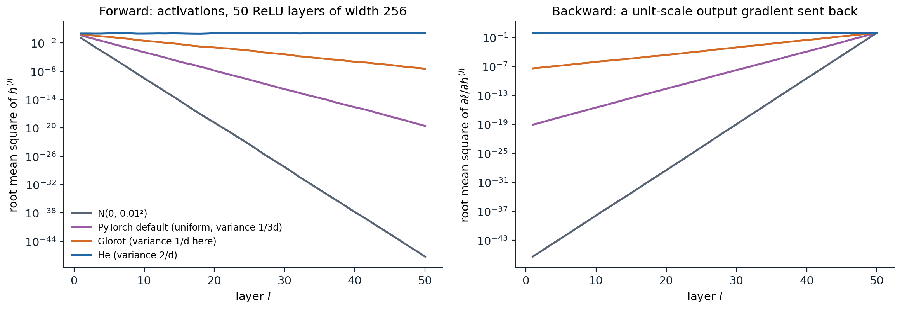
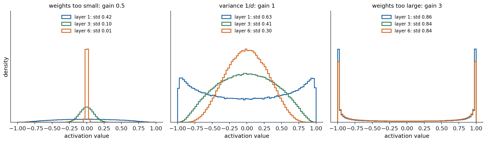
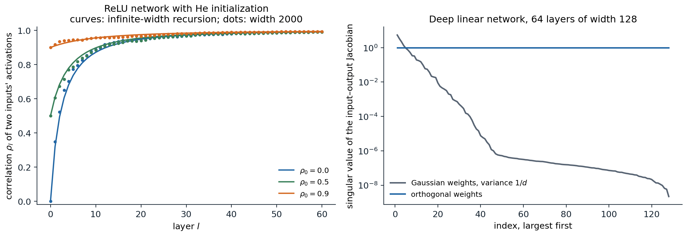

[Background Notes](../README.md) › [Deep Learning](README.md)

# 2. Initialization and Signal Propagation

[← 1. Deep Feedforward Networks](01-deep-feedforward-networks.md) · [3. Optimization for Deep Networks →](03-optimization-for-deep-networks.md)

## <a id="why-the-scale-of-the-weights-matters"></a>Why the scale of the weights matters

### <a id="products-of-many-layers"></a>Products of many layers

Training starts from random weights, and the first question is whether a signal can pass through the network at all. The forward pass applies $`L`$ weight matrices in sequence, and the backward pass of chapter 1 applies their transposes in reverse:

```math
\delta^{(l)}=\sigma'\bigl(z^{(l)}\bigr)\odot\Bigl(W^{(l+1)\top}\delta^{(l+1)}\Bigr).
```

Each layer multiplies the size of the signal by a factor that depends on the weight scale and on the activation. If that factor is $`0.9`$, fifty layers shrink the signal by $`0.9^{50}\approx0.005`$; if it is $`1.1`$, they amplify it by $`117`$. Gradients that shrink geometrically with depth leave the early layers untrained, the **vanishing gradient** problem; gradients that grow geometrically make any fixed learning rate unstable, the **exploding gradient** problem. The problem was first analyzed for recurrent networks, where depth is the length of the sequence ([Bengio, Simard, and Frasconi, 1994](https://doi.org/10.1109/72.279181); chapter 8). For feedforward networks it was a main obstacle to training deep models until about 2010.

Initialization cannot solve every trainability problem, but it controls the starting point: a network whose activations and gradients keep a stable scale through all layers at initialization can at least begin to learn. The rules below come from computing how the variance of a random signal changes from layer to layer.

### <a id="forward-propagation-of-variance"></a>Forward propagation of variance

Take a layer $`z=Wh+b`$ with $`W\in\mathbb R^{d_{\text{out}}\times d_{\text{in}}}`$, and assume the weights are independent with mean zero and variance $`\sigma_w^2`$, independent of the input $`h`$, and that the biases are zero. Each pre-activation is a sum of $`d_{\text{in}}`$ independent terms, so

```math
\operatorname{Var}(z_i)=d_{\text{in}}\,\sigma_w^2\,\mathbb E\bigl[h_j^2\bigr].
```

The activation determines $`\mathbb E[h_j^2]`$ from the distribution of the previous pre-activations. For ReLU with a pre-activation symmetric about zero, half of the mass is zeroed and $`\mathbb E[\mathrm{ReLU}(z)^2]=\frac12\operatorname{Var}(z)`$. Hence, for a ReLU network,

```math
\operatorname{Var}\bigl(z^{(l)}\bigr)=\tfrac12\,d_{l-1}\,\sigma_{w,l}^2\,\operatorname{Var}\bigl(z^{(l-1)}\bigr),
```

and the scale is preserved when $`\sigma_{w,l}^2=2/d_{l-1}`$. For an activation that is linear with unit slope near zero, such as tanh at small inputs, the same argument gives $`\sigma_w^2=1/d_{\text{in}}`$. [Appendix A](#block-dl2-appendix-a) states the assumptions precisely and derives both recursions.

### <a id="backward-propagation-of-variance"></a>Backward propagation of variance

The backward signal obeys an analogous recursion. The derivative $`\partial\ell/\partial h^{(l-1)}=W^{(l)\top}\delta^{(l)}`$ is a sum of $`d_l`$ terms, and for ReLU the factor $`\sigma'(z)\in\{0,1\}`$ keeps half of them on average:

```math
\operatorname{Var}\Bigl(\frac{\partial\ell}{\partial h^{(l-1)}}\Bigr)=\tfrac12\,d_l\,\sigma_{w,l}^2\,\operatorname{Var}\Bigl(\frac{\partial\ell}{\partial h^{(l)}}\Bigr).
```

The backward pass therefore prefers $`\sigma_w^2=2/d_{\text{out}}`$. For square layers both conditions coincide. When the widths differ, one can preserve the forward scale (fan-in mode) or the backward scale (fan-out mode), not both. The mismatch is mild: with fan-in scaling, the backward factor of layer $`l`$ is $`d_l/d_{l-1}`$, and the product over layers telescopes to the ratio of the last and first widths rather than growing geometrically with depth.

## <a id="initialization-rules"></a>Initialization rules

The variance calculations give the standard schemes. Each can be drawn from a normal distribution with the stated variance or from a uniform distribution $`U(-a,a)`$ with $`a=\sqrt{3}\times`$ standard deviation, which has the same variance.

| Scheme | Weight variance | Designed for |
| --- | --- | --- |
| LeCun ([LeCun, Bottou, Orr, and Müller, 1998](https://link.springer.com/chapter/10.1007/3-540-49430-8_2)) | $`1/d_{\text{in}}`$ | tanh and other activations with unit slope at 0 |
| Glorot, or Xavier ([Glorot and Bengio, 2010](https://proceedings.mlr.press/v9/glorot10a.html)) | $`2/(d_{\text{in}}+d_{\text{out}})`$ | a compromise between the forward and backward conditions for tanh |
| He, or Kaiming ([He, Zhang, Ren, and Sun, 2015](https://arxiv.org/abs/1502.01852)) | $`2/d_{\text{in}}`$ | ReLU; for leaky ReLU with slope $`\alpha`$, $`2/\bigl((1+\alpha^2)d_{\text{in}}\bigr)`$ |

PyTorch implements these as `nn.init.xavier_normal_`, `nn.init.kaiming_normal_`, and their uniform variants, with a `gain` argument for the activation. Its default for `nn.Linear` and `nn.Conv2d` is none of them: `kaiming_uniform_(W, a=math.sqrt(5))` gives a uniform distribution with variance $`1/(3d_{\text{in}})`$, one sixth of He's. That default was chosen for backward compatibility; it is harmless in shallow networks and in networks with normalization layers, but it shrinks the signal in a deep plain ReLU network by a factor of six in mean square per layer.

```python
import math
import torch
from torch import nn

torch.manual_seed(0)
depth, width = 30, 1024
x = torch.randn(2000, width)

def mean_square_factor(init):
    """Average factor by which E[h^2] changes per ReLU layer, and E[h^2] at the last layer."""
    h, ms = x, [x.pow(2).mean().item()]
    for _ in range(depth):
        W = init(torch.empty(width, width))
        h = torch.relu(h @ W.T)
        ms.append(h.pow(2).mean().item())
    return (ms[-1] / ms[0]) ** (1 / depth), ms[-1]

schemes = {
    "PyTorch nn.Linear default": (lambda W: nn.init.kaiming_uniform_(W, a=math.sqrt(5)), 1 / 3),
    "Glorot (Xavier) normal": (nn.init.xavier_normal_, 1.0),
    "He (Kaiming) normal": (lambda W: nn.init.kaiming_normal_(W, nonlinearity="relu"), 2.0),
}
for name, (init, v) in schemes.items():           # weight variance v / fan_in for these square layers
    factor, last = mean_square_factor(init)
    print(f"{name:26s} per-layer factor: measured {factor:.3f}, theory v/2 = {v / 2:.3f};"
          f" E[h^2] after {depth} layers {last:.1e}")
# PyTorch nn.Linear default  per-layer factor: measured 0.164, theory v/2 = 0.167; E[h^2] after 30 layers 2.8e-24
# Glorot (Xavier) normal     per-layer factor: measured 0.492, theory v/2 = 0.500; E[h^2] after 30 layers 5.9e-10
# He (Kaiming) normal        per-layer factor: measured 0.989, theory v/2 = 1.000; E[h^2] after 30 layers 7.3e-01
```



*A plain ReLU network with 50 layers of width 256 and no biases, computed in double precision. Left: the root mean square of each layer's activations for four initializations. Only He initialization keeps it near 1; the others shrink it geometrically, the small Gaussian initialization to below $`10^{-47}`$ by the last layer. Right: a unit-scale gradient sent backward from the output through the same activation patterns. It shrinks at the same geometric rate, so with any initialization but He's the first layers receive gradients many orders of magnitude smaller than the last.*

The biases are usually initialized to zero. The variance argument does not constrain them, and zero biases keep pre-activations symmetric about zero, which the ReLU calculation assumed.

## <a id="saturating-activations"></a>Saturating activations

For tanh and the sigmoid, scale matters in both directions. Weights that are too small shrink the signal toward zero, where the network behaves almost linearly and each layer contracts it further. Weights that are too large push pre-activations into the flat tails, where the derivative is nearly zero: the forward signal stays large, but almost no gradient passes back.



*Activation histograms of a six-layer tanh network of width 500 on standard normal inputs, with weight variance $`g^2/d`$ for three gains $`g`$. With $`g=0.5`$ the activations collapse toward zero, reaching a standard deviation of 0.01 by layer 6. With $`g=1`$ they decay slowly and stay spread out. With $`g=3`$ almost every unit sits at $`\pm1`$, where tanh is flat.*

[Glorot and Bengio (2010)](https://proceedings.mlr.press/v9/glorot10a.html) observed a further problem with the logistic sigmoid: its outputs are positive with mean near $`1/2`$, so the next layer's pre-activations are shifted and the top hidden layer saturates at zero early in training. Zero-centered activations such as tanh avoid this, and ReLU networks avoid saturation on the positive side altogether. Histograms of activations and of gradients per layer, as in [Karpathy's makemore lecture](https://www.youtube.com/watch?v=P6sfmUTpUmc), are the simplest diagnostic of a badly scaled network.

## <a id="beyond-variance"></a>Beyond variance

### <a id="correlations-between-inputs"></a>Correlations between inputs

Preserving the variance of each unit is not enough: the network must also keep different inputs distinguishable. For two inputs whose pre-activations at layer $`l-1`$ have correlation $`\rho`$, the next layer's correlation in an infinitely wide ReLU network with He initialization is

```math
\rho\ \mapsto\ \frac{\sqrt{1-\rho^2}+(\pi-\arccos\rho)\,\rho}{\pi},
```

the normalized **arc-cosine kernel** of [Cho and Saul (2009)](https://proceedings.neurips.cc/paper/2009/hash/5751ec3e9a4feab575962e78e006250d-Abstract.html), derived in [Appendix B](#block-dl2-appendix-b). This map pushes every correlation toward 1: each layer makes the representations of different inputs more alike. The approach is slow, with $`1-\rho_l\approx9\pi^2/(2l^2)`$ for large $`l`$, but after a few dozen layers a deep ReLU network at initialization maps all inputs to nearly parallel vectors. Its output then hardly depends on the input, and gradients for different examples point in nearly the same direction.



*Left: correlation between the activations of two inputs as a function of depth in a ReLU network with He initialization. Curves iterate the infinite-width map; dots are one random network of width 2000. Every starting correlation is driven toward 1. Right: singular values of the input–output Jacobian of a deep linear network with 64 layers of width 128. Gaussian weights with variance $`1/d`$ preserve the average squared singular value in expectation, yet the realized values range from 5.4 down to $`2\times10^{-9}`$. Orthogonal weights give a Jacobian whose singular values all equal 1.*

A mean-field theory of these maps ([Poole, Lahiri, Raghu, Sohl-Dickstein, and Ganguli, 2016](https://arxiv.org/abs/1606.05340); [Schoenholz, Gilmer, Ganguli, and Sohl-Dickstein, 2017](https://arxiv.org/abs/1611.01232)) distinguishes an **ordered** phase, where correlations converge to 1 and gradients vanish, from a **chaotic** phase, where nearby inputs decorrelate and gradients explode. Networks initialized at the boundary between them, the **edge of chaos**, propagate information through the most layers. For tanh networks the boundary is a curve in the plane of weight and bias variances. For ReLU networks, He initialization sits on the boundary and the correlation still converges, only polynomially rather than exponentially fast. The related **shattered gradients** of [Balduzzi et al. (2017)](https://arxiv.org/abs/1702.08591) describe the backward counterpart: in deep plain networks, gradients with respect to the input look increasingly like white noise, which residual connections prevent (chapter 4).

### <a id="the-whole-jacobian-not-just-its-average"></a>The whole Jacobian, not just its average

Variance calculations control the average squared singular value of the input–output Jacobian $`J=\partial f/\partial x`$. Training depends on the whole spectrum: if a few singular values are large and most are tiny, gradients reach only a few directions of the early layers. For a deep linear network with Gaussian weights, the product of $`L`$ independent random matrices has singular values that spread over many orders of magnitude as $`L`$ grows, even when their mean square is exactly 1.

**Orthogonal initialization** draws each weight matrix uniformly from the orthogonal matrices, scaled by a gain. In a linear network every singular value of $`J`$ is then exactly the product of the gains, a property called **dynamical isometry**. [Saxe, McClelland, and Ganguli (2014)](https://arxiv.org/abs/1312.6120) showed that deep linear networks with orthogonal initialization learn in a number of steps independent of depth, while Gaussian initialization slows with depth. [Pennington, Schoenholz, and Ganguli (2017)](https://arxiv.org/abs/1711.04735) showed that ReLU networks cannot achieve dynamical isometry, whereas orthogonally initialized tanh or sigmoid networks near the edge of chaos can, and that such networks train substantially faster. In PyTorch the scheme is `nn.init.orthogonal_`; it is most often used for recurrent weight matrices (chapter 8).

## <a id="dead-units-and-data-scaling"></a>Dead units and data scaling

### <a id="dead-relus"></a>Dead ReLUs

A ReLU unit is **dead** if its pre-activation is negative for every training input. It outputs zero, its incoming weights receive zero gradient, and nothing brings it back. Units die when a large update pushes their bias far negative, which is one reason large learning rates at the start of training are dangerous (chapter 3). Deep and narrow ReLU networks can also be dead at initialization with appreciable probability: if every unit of some layer is inactive for every input, the network is constant ([Lu, Shin, Su, and Karniadakis, 2019](https://arxiv.org/abs/1903.06733)). The narrow random networks of chapter 1, nearly linear on their input interval, show a milder version of the same effect. Leaky ReLU, GELU, and SiLU keep a gradient for negative inputs and do not die in this way.

### <a id="standardized-inputs"></a>Standardized inputs

The variance recursion starts from the input. If features have very different scales, the first-layer pre-activations are dominated by the largest ones, and the first layer's effective initialization is far from the intended one. Standardizing each feature to mean zero and unit variance on the training data, as in ML chapter 1, fixes this; for images, each color channel is standardized with means and standard deviations computed over the training set. Targets of regression networks benefit from the same treatment, which keeps the initial loss and gradients at a predictable scale.

A **data-dependent initialization** goes one step further: start from a random or orthogonal initialization, pass a batch of training data through the network, and rescale each layer so that its outputs have unit variance, layer by layer. This is the LSUV procedure of [Mishkin and Matas (2016)](https://arxiv.org/abs/1511.06422). Normalization layers (chapter 4) perform the same rescaling continually during training, which is why modern networks are much less sensitive to initialization than plain ones.

## <a id="initialization-and-the-optimizer"></a>Initialization and the optimizer

The following experiment trains a plain ReLU network with 20 hidden layers of width 32 on the spirals of chapter 1, with each initialization, once with SGD with momentum and once with Adam.

```python
import math
import numpy as np
import torch
from torch import nn

torch.set_num_threads(1)

def spirals(n, seed, noise=0.03):
    r = np.random.default_rng(seed)
    t = np.sqrt(r.uniform(0, 1, n)) * 3 * np.pi
    y = r.integers(0, 2, n)
    s = np.where(y == 1, 1, -1)
    X = np.column_stack([s * t * np.cos(t), s * t * np.sin(t)]) / (3 * np.pi) + noise * r.normal(size=(n, 2))
    return torch.tensor(X, dtype=torch.float32), torch.tensor(y)

X, y = spirals(600, seed=0)
inits = {"N(0, 0.01^2)": lambda W: nn.init.normal_(W, std=0.01),
         "PyTorch default": lambda W: nn.init.kaiming_uniform_(W, a=math.sqrt(5)),
         "Glorot": nn.init.xavier_normal_,
         "He": lambda W: nn.init.kaiming_normal_(W, nonlinearity="relu")}

def deep_mlp(init, depth=20, width=32):
    torch.manual_seed(0)
    layers, d = [], 2
    for _ in range(depth):
        lin = nn.Linear(d, width)
        init(lin.weight)
        nn.init.zeros_(lin.bias)
        layers += [lin, nn.ReLU()]
        d = width
    return nn.Sequential(*layers, nn.Linear(d, 2))

def train(model, opt, steps=800):
    for _ in range(steps):
        opt.zero_grad()
        loss = nn.functional.cross_entropy(model(X), y)
        loss.backward()
        opt.step()
    return loss.item()

print("20 ReLU layers of width 32 on the spirals; chance-level loss is log 2 = 0.693")
for name, init in inits.items():
    model = deep_mlp(init)
    hidden = model[:-1](X)                                    # last hidden layer at initialization
    nn.functional.cross_entropy(model(X), y).backward()
    g1 = model[0].weight.grad.norm().item()
    m_sgd = deep_mlp(init)
    loss_sgd = train(m_sgd, torch.optim.SGD(m_sgd.parameters(), lr=0.02, momentum=0.9))
    m_adam = deep_mlp(init)
    loss_adam = train(m_adam, torch.optim.Adam(m_adam.parameters(), lr=1e-3))
    print(f"{name:16s} rms of last hidden layer {hidden.pow(2).mean().sqrt().item():.0e}, "
          f"first-layer gradient norm {g1:.0e}; loss after 800 steps: SGD {loss_sgd:.3f}, Adam {loss_adam:.3f}")
# 20 ReLU layers of width 32 on the spirals; chance-level loss is log 2 = 0.693
# N(0, 0.01^2)     rms of last hidden layer 0e+00, first-layer gradient norm 0e+00; loss after 800 steps: SGD 0.693, Adam 0.693
# PyTorch default  rms of last hidden layer 1e-08, first-layer gradient norm 3e-09; loss after 800 steps: SGD 0.693, Adam 0.162
# Glorot           rms of last hidden layer 8e-05, first-layer gradient norm 5e-05; loss after 800 steps: SGD 0.693, Adam 0.000
# He               rms of last hidden layer 2e-01, first-layer gradient norm 5e-02; loss after 800 steps: SGD 0.621, Adam 0.000
```

Three observations follow. With the small Gaussian initialization, the signal underflows to exactly zero in single precision, and no optimizer can recover. With SGD, only He initialization makes progress in 800 steps, and even it is slow: a plain 20-layer network is hard to optimize with SGD even when correctly scaled, the problem residual connections address in chapter 4. Adam rescues the Glorot and PyTorch-default networks because it divides each gradient coordinate by a running estimate of its root mean square (Foundations chapter 3): a gradient that is uniformly tiny still produces steps of the intended size. That invariance is one reason adaptive methods are the default for deep networks, but it does not help when the forward signal itself has vanished.

A useful rule of thumb during training is to monitor, for each weight matrix, the ratio of the update size to the weight size, $`\|\Delta W\|/\|W\|`$. Values around $`10^{-3}`$ per step are typical of healthy training with a well-chosen learning rate; much smaller values indicate that the layer is barely learning, and much larger ones that it is being overwritten. Chapter 12 collects these diagnostics.

UDL chapter 7, UMich lecture 10, and UNIGE sections 5.5 and 6.2, listed in the reading plan, cover initialization; [Hanin (2018)](https://arxiv.org/abs/1801.03744) analyzes when finite-width ReLU networks have exploding or vanishing gradients.

## <a id="appendices"></a>Appendices


<details>
<summary><a id="block-dl2-appendix-a"></a><b>A. Variance recursions for random networks</b></summary>


**Assumptions.** In layer $`l`$, the weights $`W^{(l)}_{ij}`$ are independent with mean zero and variance $`\sigma_l^2`$, independent of everything in earlier layers, and the biases are zero. The analysis concerns a fixed input $`x`$ and the randomness of the weights.

**Forward.** Conditionally on $`h^{(l-1)}`$, the pre-activation $`z^{(l)}_i=\sum_jW^{(l)}_{ij}h^{(l-1)}_j`$ has mean zero and variance $`\sigma_l^2\|h^{(l-1)}\|^2`$. Taking expectations over the earlier layers,

```math
\mathbb E\bigl[(z^{(l)}_i)^2\bigr]=\sigma_l^2\,\mathbb E\,\|h^{(l-1)}\|^2=\sigma_l^2\,d_{l-1}\,q_{l-1},\qquad q_{l-1}=\frac1{d_{l-1}}\,\mathbb E\,\|h^{(l-1)}\|^2 .
```

Moreover $`z^{(l)}_i`$ is symmetric about zero, because $`W^{(l)}`$ and $`-W^{(l)}`$ have the same distribution and are independent of $`h^{(l-1)}`$. For ReLU, $`\mathbb E[\mathrm{ReLU}(z)^2]=\mathbb E[z^2\mathbf 1\{z>0\}]=\frac12\mathbb E[z^2]`$ for any symmetric $`z`$. Hence $`q_l=\frac12\sigma_l^2d_{l-1}q_{l-1}`$, and $`q_l`$ is constant exactly when $`\sigma_l^2=2/d_{l-1}`$. No Gaussian assumption is needed for this step. For tanh the relation is only approximate: $`\mathbb E[\tanh(z)^2]\le\mathbb E[z^2]`$ with near-equality for small $`z`$, which is why variance $`1/d_{\text{in}}`$ gives a slowly shrinking signal, as in the middle panel of the tanh figure.

**Backward.** Let $`g^{(l)}=\partial\ell/\partial h^{(l)}`$. Then $`g^{(l-1)}=W^{(l)\top}\bigl(\mathbf 1\{z^{(l)}>0\}\odot g^{(l)}\bigr)`$ for ReLU. Treating $`W^{(l)}`$ in this expression as independent of the masked vector, an approximation that becomes exact in the infinite-width limit, each coordinate of $`g^{(l-1)}`$ is a sum of $`d_l`$ terms with variance $`\sigma_l^2\,\mathbb E\bigl[\mathbf 1\{z^{(l)}_i>0\}(g^{(l)}_i)^2\bigr]`$. With the mask independent of $`g^{(l)}_i`$ and active with probability $`\frac12`$,

```math
\mathbb E\bigl[(g^{(l-1)}_j)^2\bigr]=\tfrac12\,d_l\,\sigma_l^2\,\mathbb E\bigl[(g^{(l)}_i)^2\bigr],
```

which is preserved when $`\sigma_l^2=2/d_l`$. The gradient with respect to the weights is $`\partial\ell/\partial W^{(l)}=\bigl(\mathbf 1\{z^{(l)}>0\}\odot g^{(l)}\bigr)h^{(l-1)\top}`$, the product of a backward and a forward quantity, so its scale is stable across layers exactly when both recursions are.

</details>


<details>
<summary><a id="block-dl2-appendix-b"></a><b>B. The ReLU correlation map</b></summary>


Let $`(u,v)`$ be jointly Gaussian with mean zero, unit variances, and correlation $`\rho=\cos\theta`$ for $`\theta\in[0,\pi]`$. Write $`u=\|a\|\cos\alpha`$ and $`v=\|a\|\cos(\alpha-\theta)`$ for a standard Gaussian vector $`a`$ in the plane with polar angle $`\alpha`$, uniform on $`[0,2\pi)`$ and independent of $`\|a\|`$. Then

```math
\mathbb E\bigl[\mathrm{ReLU}(u)\,\mathrm{ReLU}(v)\bigr]=\mathbb E\|a\|^2\cdot\frac1{2\pi}\int\cos\alpha\,\cos(\alpha-\theta)\,\mathbf 1\{\cos\alpha>0,\ \cos(\alpha-\theta)>0\}\,d\alpha .
```

Here $`\mathbb E\|a\|^2=2`$, and both cosines are positive on an arc of length $`\pi-\theta`$, over which $`\int\cos\alpha\cos(\alpha-\theta)\,d\alpha=\frac12\bigl[(\pi-\theta)\cos\theta+\sin\theta\bigr]`$. Hence

```math
\mathbb E\bigl[\mathrm{ReLU}(u)\,\mathrm{ReLU}(v)\bigr]=\frac{\sin\theta+(\pi-\theta)\cos\theta}{2\pi}.
```

With $`\theta=0`$ this gives $`\mathbb E[\mathrm{ReLU}(u)^2]=\frac12`$. In the infinite-width limit the pre-activations of the next layer for two inputs are jointly Gaussian with covariance proportional to the inner product of the current activations, so their correlation is the ratio

```math
\rho'=\frac{\sin\theta+(\pi-\theta)\cos\theta}{\pi}=\frac{\sqrt{1-\rho^2}+(\pi-\arccos\rho)\,\rho}{\pi}.
```

The map satisfies $`\rho'\ge\rho`$ with equality only at $`\rho=1`$. Writing $`\varepsilon=1-\rho`$ and expanding, $`\arccos(1-\varepsilon)=\sqrt{2\varepsilon}\bigl(1+\varepsilon/12\bigr)+O(\varepsilon^{5/2})`$ and $`\sqrt{1-\rho^2}=\sqrt{2\varepsilon}\bigl(1-\varepsilon/4\bigr)+O(\varepsilon^{5/2})`$, so

```math
\varepsilon'=\varepsilon-\frac{2\sqrt2}{3\pi}\,\varepsilon^{3/2}+O(\varepsilon^{5/2}).
```

Hence $`\varepsilon_l^{-1/2}`$ grows by about $`\sqrt2/(3\pi)`$ per layer, and $`\varepsilon_l\approx9\pi^2/(2l^2)`$ for large $`l`$: correlations approach 1 polynomially in depth.

</details>

---

[← 1. Deep Feedforward Networks](01-deep-feedforward-networks.md) · [3. Optimization for Deep Networks →](03-optimization-for-deep-networks.md)
