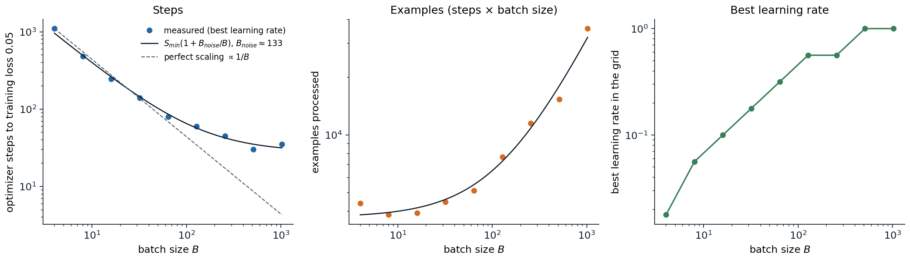
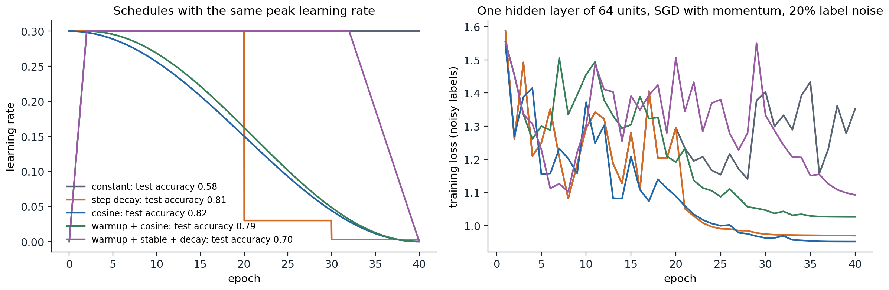
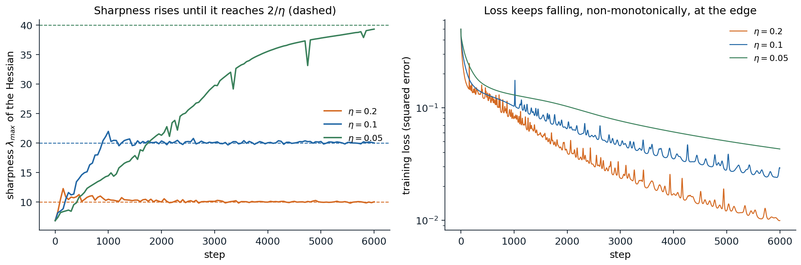
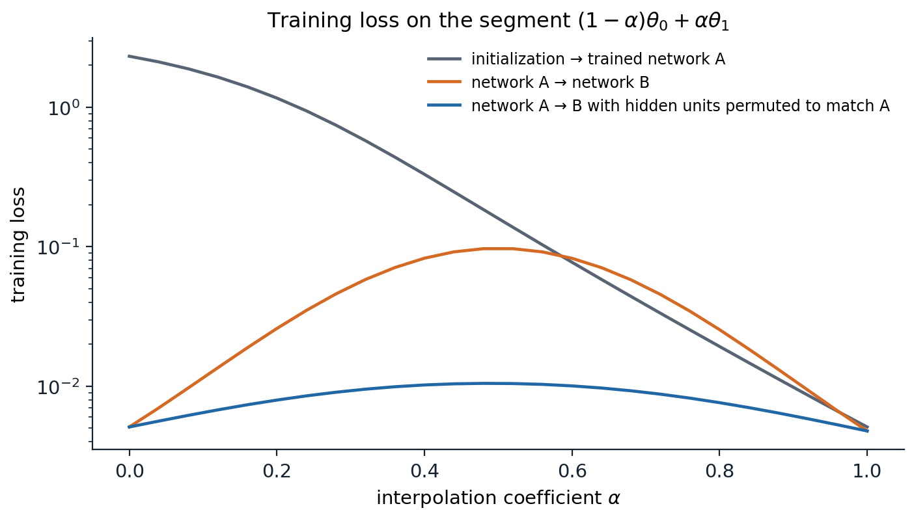

[Background Notes](../README.md) › [Deep Learning](README.md)

# 3. Optimization for Deep Networks

[← 2. Initialization and Signal Propagation](02-initialization-and-signal-propagation.md) · [4. Normalization and Residual Connections →](04-normalization-and-residual-connections.md)

## <a id="what-is-different-about-deep-networks"></a>What is different about deep networks

Foundations chapter 3 developed the optimizers used in deep learning, from gradient descent and its convergence rates through momentum, Nesterov acceleration, AdaGrad, RMSProp, Adam, and AdamW, together with the mechanics of schedules, gradient accumulation, and clipping. Its guarantees assume smoothness and often convexity. Deep networks satisfy neither in a useful sense, and they add three features that change how the same algorithms behave.

- **Nonconvexity with symmetry.** The loss has many equivalent minimizers (chapter 1), saddle points, and flat directions. The object of interest is not the global minimizer but a solution with low loss that generalizes.
- **Severe ill-conditioning.** The Hessian of a trained network has a few large eigenvalues, a bulk of eigenvalues near zero, and some negative ones ([Sagun, Evci, Güney, Dauphin, and Bottou, 2017](https://arxiv.org/abs/1706.04454); [Ghorbani, Krishnan, and Xiao, 2019](https://arxiv.org/abs/1901.10159)). A step size small enough for the sharpest direction makes progress along the flat ones very slow.
- **Stochastic gradients by design.** The data are too large for full-batch gradients, so every step uses a minibatch. The resulting noise affects which solutions are found, not only how fast.

These features shift attention from convergence proofs to empirical regularities: how the batch size and learning rate trade off, why schedules and warmup help, how the curvature evolves during training, and what the loss surface looks like between solutions. This chapter covers those regularities. The optimizer's interaction with generalization is taken up in chapter 5.

The Hessian's shape can be seen directly in a small network. Hessian-vector products cost about two backward passes and never form the matrix, which is how curvature is measured in networks with millions of parameters; for a network with 41 parameters the full Hessian can be computed for comparison.

```python
import torch
from torch import nn
from torch.func import functional_call

torch.manual_seed(0)
X = torch.randn(200, 3)
Y = torch.sin(X @ torch.tensor([1.0, -2.0, 0.5]))[:, None]
net = nn.Sequential(nn.Linear(3, 8), nn.Tanh(), nn.Linear(8, 1))          # 41 parameters
opt = torch.optim.Adam(net.parameters(), lr=0.01)
for _ in range(2000):
    opt.zero_grad()
    ((net(X) - Y) ** 2).mean().backward()
    opt.step()

names = [n for n, _ in net.named_parameters()]
shapes = [p.shape for p in net.parameters()]
flat = torch.cat([p.detach().flatten() for p in net.parameters()])

def loss_of(theta):
    """The training loss as a function of one flat parameter vector."""
    parts, i = {}, 0
    for n, s in zip(names, shapes):
        parts[n] = theta[i:i + s.numel()].reshape(s)
        i += s.numel()
    return ((functional_call(net, parts, (X,)) - Y) ** 2).mean()

H = torch.autograd.functional.hessian(loss_of, flat)                      # explicit 41 x 41 Hessian
eig = torch.linalg.eigvalsh(H)

def hvp(v):
    """Hessian-vector product by differentiating the gradient: never forms H."""
    theta = flat.clone().requires_grad_()
    (g,) = torch.autograd.grad(loss_of(theta), theta, create_graph=True)
    (Hv,) = torch.autograd.grad(g @ v, theta)
    return Hv

v = torch.randn(len(flat))
for _ in range(200):                                                       # power iteration
    v = hvp(v)
    v = v / v.norm()
lam = (v @ hvp(v)).item()
print(f"training loss {loss_of(flat).item():.4f}; {len(flat)} parameters")
print(f"largest eigenvalue: power iteration {lam:.4f}, exact {eig[-1].item():.4f}")
top = eig[-1].item()
print(f"negative eigenvalues: {int((eig < 0).sum())}; eigenvalues below 1% of the largest: "
      f"{int((eig.abs() < 0.01 * top).sum())}; median |eigenvalue| / largest: {(eig.abs().median() / top).item():.4f}")
# training loss 0.0044; 41 parameters
# largest eigenvalue: power iteration 12.4316, exact 12.4316
# negative eigenvalues: 1; eigenvalues below 1% of the largest: 24; median |eigenvalue| / largest: 0.0043
```

Even this small network, fitted to low loss, has more than half of its curvature spectrum below 1% of the top eigenvalue, and one negative eigenvalue: the fitted point is not a strict local minimum of this loss. Power iteration with Hessian-vector products recovers the top eigenvalue exactly; the same routine, applied every few hundred steps, produces the sharpness curves later in this chapter.

## <a id="minibatch-noise-and-the-batch-size"></a>Minibatch noise and the batch size

### <a id="the-noise-in-a-stochastic-gradient"></a>The noise in a stochastic gradient

A minibatch gradient $`g_B=\frac1B\sum_{i\in\mathcal B}\nabla\ell_i(\theta)`$, with examples drawn independently, is an unbiased estimate of the full gradient $`G=\nabla\widehat R_n(\theta)`$ with covariance $`\Sigma/B`$, where $`\Sigma`$ is the covariance of the per-example gradients (Foundations chapter 3). A step of size $`\eta`$ therefore moves the parameters by $`-\eta G`$ plus noise with covariance $`\eta^2\Sigma/B`$. Over many small steps, the drift scales with $`\eta`$ and the accumulated noise variance with $`\eta^2/B`$ per step, so the ratio $`\eta/B`$ acts like a temperature: SGD behaves approximately like a diffusion that samples low-loss regions, with fluctuations growing with $`\eta/B`$ ([Mandt, Hoffman, and Blei, 2017](https://arxiv.org/abs/1704.04289); [Smith and Le, 2018](https://arxiv.org/abs/1710.06451)).

This picture explains the **linear scaling rule** of [Goyal et al. (2017)](https://arxiv.org/abs/1706.02677): when the batch size is multiplied by $`k`$, multiply the learning rate by $`k`$, which keeps $`\eta/B`$ fixed and makes $`k`$ small steps approximately equal to one large step. With a gradual warmup of the learning rate, they trained ResNet-50 on ImageNet with batches of 8,192 images in one hour, matching the accuracy of batch 256. The rule has a limit. A $`k`$-fold larger step is equivalent to $`k`$ small ones only while the gradient changes little over the displacement, and beyond some batch size the learning rate cannot grow further without instability.

### <a id="the-critical-batch-size"></a>The critical batch size

[McCandlish, Kaplan, and Amodei (2018)](https://arxiv.org/abs/1812.06162) turned this into a quantitative model. Consider one step with the best learning rate for a given batch size on a locally quadratic loss with Hessian $`H`$. Averaging the gradient over $`B`$ examples removes noise, and the achievable decrease per step is a fraction $`1/(1+B_{\text{noise}}/B)`$ of the decrease with the exact gradient, where

```math
B_{\text{noise}}=\frac{\operatorname{tr}(H\Sigma)}{G^\top HG}\approx B_{\text{simple}}=\frac{\operatorname{tr}\Sigma}{\|G\|^2}
```

is the **gradient noise scale**, the batch size at which the noise and the signal in the gradient have comparable size. Consequently the number of steps $`S`$ and the number of examples $`E=SB`$ needed to reach a given loss trade off as

```math
S=S_{\min}\Bigl(1+\frac{B_{\text{noise}}}{B}\Bigr),\qquad E=E_{\min}\Bigl(1+\frac{B}{B_{\text{noise}}}\Bigr).
```

[Appendix A](#block-dl3-appendix-a) derives both relations from a quadratic model of the loss. Batches much smaller than $`B_{\text{noise}}`$ use data efficiently but need many sequential steps; batches much larger reduce the steps only to $`S_{\min}`$ while wasting examples. The **critical batch size** $`B_{\text{noise}}`$ is the natural compromise, and it grows during training as the gradient signal weakens relative to the noise.



*A one-hidden-layer network with 128 units on 1,200 handwritten digits, trained with SGD with momentum 0.9 until the training loss falls below 0.05. Each point uses the best of 13 learning rates between 0.003 and 3. Left: steps fall nearly in proportion to $`1/B`$ up to a batch of about 64 and then level off; the fitted model gives $`B_{\text{noise}}\approx133`$. Middle: the examples needed are nearly constant for small batches and grow roughly linearly beyond $`B_{\text{noise}}`$. Right: the best learning rate grows with the batch size, roughly linearly at first, until it saturates.*

The noise scale can be measured directly from per-example gradients, which `torch.func.vmap` computes in one vectorized call.

```python
import torch
from torch import nn
from torch.func import functional_call, grad, vmap
from sklearn.datasets import load_digits

torch.set_num_threads(1)
X, y = load_digits(return_X_y=True)
X, y = torch.tensor(X[:1200] / 16, dtype=torch.float32), torch.tensor(y[:1200])
torch.manual_seed(0)
model = nn.Sequential(nn.Linear(64, 128), nn.ReLU(), nn.Linear(128, 10))

def example_loss(p, x, t):
    return nn.functional.cross_entropy(functional_call(model, p, (x[None],)), t[None])

def noise_scale():
    """B_simple = tr(Sigma) / |G|^2 from the per-example gradients of the whole training set."""
    p = {k: v.detach() for k, v in model.named_parameters()}
    per_ex = vmap(grad(example_loss), in_dims=(None, 0, 0))(p, X, y)     # one gradient per example
    G = torch.cat([g.reshape(len(X), -1) for g in per_ex.values()], dim=1)
    mean = G.mean(0)
    return ((G - mean) ** 2).sum(1).mean().item() / mean.pow(2).sum().item()

opt = torch.optim.SGD(model.parameters(), lr=0.3, momentum=0.9)
gen = torch.Generator().manual_seed(0)
for step in range(301):
    if step in (0, 30, 100, 300):
        with torch.no_grad():
            L = nn.functional.cross_entropy(model(X), y).item()
        print(f"step {step:3d}: training loss {L:.3f}, gradient noise scale B_simple = {noise_scale():.0f}")
    idx = torch.randint(0, len(X), (64,), generator=gen)
    opt.zero_grad()
    nn.functional.cross_entropy(model(X[idx]), y[idx]).backward()
    opt.step()
# step   0: training loss 2.312, gradient noise scale B_simple = 79
# step  30: training loss 0.478, gradient noise scale B_simple = 20
# step 100: training loss 0.035, gradient noise scale B_simple = 139
# step 300: training loss 0.006, gradient noise scale B_simple = 469
```

During the phase that determines the steps to reach a loss of 0.05, the measured noise scale lies between about 20 and 140, consistent with the fitted value of 133 and with the saturation of the steps curve. As the loss approaches zero the gradient signal shrinks faster than its noise and the noise scale rises, which is why large-batch training is most efficient late in training. For large language models the critical batch size reaches millions of tokens.

### <a id="does-noise-help-generalization"></a>Does noise help generalization?

[Keskar et al. (2017)](https://arxiv.org/abs/1609.04836) observed that large-batch training generalized worse and converged to sharper minima, suggesting that minibatch noise steers SGD toward flat, better-generalizing regions. Later work found that much of the gap disappears when the learning rate, schedule, and training length are retuned for each batch size ([Shallue et al., 2019](https://jmlr.org/papers/v20/18-789.html)); what remains depends on the problem. The temperature $`\eta/B`$ is still a useful knob, and chapter 5 returns to the relation between flatness and generalization.

## <a id="learning-rate-schedules"></a>Learning-rate schedules

### <a id="why-the-rate-should-decay"></a>Why the rate should decay

With a constant learning rate, SGD does not converge: on a quadratic with gradient noise it settles into a stationary distribution whose width grows with $`\eta`$ (Foundations chapter 3). A large rate early makes fast progress across the landscape; a small rate late lets the iterates settle into the bottom of a basin. Every schedule in common use implements this in a different shape.

- **Step decay** divides the rate by 10 at fixed epochs, the standard for convolutional networks trained with SGD for many years.
- **Cosine decay** $`\eta_t=\eta_{\min}+\frac12(\eta_{\max}-\eta_{\min})\bigl(1+\cos(\pi t/T)\bigr)`$ ([Loshchilov and Hutter, 2017](https://arxiv.org/abs/1608.03983)) decays smoothly, slowly at first and last. It is the default for transformers, usually decaying to about a tenth of the peak.
- **Linear decay** to zero performs similarly to cosine and is sometimes better.
- **Warmup–stable–decay** (WSD) holds the peak rate for most of training and decays over the last 10–20% ([Hu et al., 2024](https://arxiv.org/abs/2404.06395)). Because the stable phase does not depend on the total length, one run can be branched into decays at several lengths, which makes it convenient for experiments on how performance scales with training length.



*Five schedules with peak rate 0.3 for a network with 64 hidden units, trained on digits with 20% of the training labels randomized so that the loss cannot reach zero. At the constant rate the training loss stays high and erratic, and the test accuracy is 0.58. Every decaying schedule lowers the loss as soon as the rate falls: step decay abruptly at epochs 20 and 30, cosine gradually. The warmup–stable–decay schedule decays only from epoch 32 and ends between the constant rate and the other schedules, with test accuracy 0.70; its advantages appear in much longer runs.*

In this example the peak rate is deliberately large, so the differences are exaggerated. With a well-tuned peak, step, cosine, and linear decay usually end close to one another, while any of them beats a constant rate. The learning rate remains the single most important hyperparameter, and its best value depends on the schedule: a schedule with a long high plateau needs a lower peak than one that decays early.

### <a id="warmup"></a>Warmup

**Warmup** increases the learning rate linearly from near zero over the first few hundred or thousand steps. It is essential for training transformers with Adam and for large-batch SGD, and it has several complementary explanations.

- Adam's second-moment estimate $`\hat v_t`$ is based on few gradients at the start, so its denominator is noisy and the effective step erratic. [Liu et al. (2020)](https://arxiv.org/abs/1908.03265) showed that warmup compensates for this variance.
- The loss surface at initialization is often sharp, and a full-size step would exceed the stability threshold $`2/\lambda_{\max}`$ discussed below. During warmup the network moves to flatter regions where the peak rate is stable ([Gilmer et al., 2022](https://arxiv.org/abs/2110.04369); [Kalra and Barkeshli, 2024](https://arxiv.org/abs/2406.09405)).
- In transformers with normalization after the residual addition, gradients near the output are large at initialization; placing normalization before the sublayers reduces the need for warmup ([Xiong et al., 2020](https://arxiv.org/abs/2002.04745); chapter 4).

In PyTorch a schedule is a function of the step count wrapped in a scheduler, which must be advanced once per optimizer update. The multiplier below implements linear warmup followed by cosine decay to a tenth of the peak.

```python
import math
import torch

def warmup_cosine(total_steps, warmup_steps, final_fraction=0.0):
    """Multiplier of the peak learning rate: linear warmup, then cosine decay to final_fraction."""
    def factor(step):
        if step < warmup_steps:
            return (step + 1) / warmup_steps
        progress = (step - warmup_steps) / max(1, total_steps - warmup_steps)
        return final_fraction + (1 - final_fraction) * 0.5 * (1 + math.cos(math.pi * min(progress, 1.0)))
    return factor

w = torch.nn.Parameter(torch.zeros(3))
opt = torch.optim.AdamW([w], lr=3e-4, weight_decay=0.1)
sched = torch.optim.lr_scheduler.LambdaLR(opt, warmup_cosine(total_steps=1000, warmup_steps=100, final_fraction=0.1))
lrs = []
for step in range(1000):
    lrs.append(opt.param_groups[0]["lr"])      # the rate used by this step's update
    opt.step()                                 # (the gradient computation would come first)
    sched.step()                               # advance the schedule once per optimizer update
print("learning rate at steps 0, 49, 99, 100, 550, 999:", [f"{lrs[s]:.2e}" for s in (0, 49, 99, 100, 550, 999)])
# learning rate at steps 0, 49, 99, 100, 550, 999: ['3.00e-06', '1.50e-04', '3.00e-04', '3.00e-04', '1.65e-04', '3.00e-05']
```

## <a id="curvature-and-stability"></a>Curvature and stability

### <a id="the-stability-threshold"></a>The stability threshold

On a quadratic, gradient descent with step $`\eta`$ diverges along any direction whose curvature exceeds $`2/\eta`$ (Foundations chapter 3). Classical analysis therefore chooses $`\eta<2/L`$ for an $`L`$-smooth loss. In a neural network the curvature is not fixed; the largest Hessian eigenvalue $`\lambda_{\max}`$, the **sharpness**, changes as the parameters move. [Cohen et al. (2021)](https://arxiv.org/abs/2103.00065) found two consistent regularities in full-batch gradient descent:

1. **Progressive sharpening.** When the step size is small relative to the curvature, the sharpness increases during training.
2. **Edge of stability.** Once it reaches $`2/\eta`$, it stops increasing and hovers just above that value. The loss keeps decreasing, but no longer monotonically: short spikes alternate with rapid descent.



*Full-batch gradient descent on a tanh network with two hidden layers of 64 units, fitting one-hot targets of 500 digits with squared error. Left: the sharpness, estimated every 50 steps by power iteration. With $`\eta=0.2`$ and $`\eta=0.1`$ it rises to $`2/\eta`$ within about a thousand steps, overshoots briefly, and then stays within a few percent of it; with $`\eta=0.05`$ it is still rising toward 40 after 6,000 steps, reaching 39.3. Right: the loss decreases in all three runs, with spikes in the two runs at the edge of stability.*

The threshold is self-enforcing: when the sharpness exceeds $`2/\eta`$, the iterates oscillate along the top eigenvector, and the oscillation moves them to a region of lower sharpness. Classical smoothness-based analysis, which assumes the curvature is below the threshold throughout, does not describe this regime, which is nevertheless where most training with large learning rates takes place. Adaptive methods show the analogous behavior for the preconditioned sharpness, the largest eigenvalue of $`P^{-1}H`$ for Adam's preconditioner $`P`$ ([Cohen et al., 2022](https://arxiv.org/abs/2207.14484)). Loss spikes in large training runs are often instabilities of this kind; warmup, lower peak rates, gradient clipping, and normalization all reduce them.

### <a id="adaptive-and-second-order-methods"></a>Adaptive and second-order methods

Adam is the default optimizer for transformers and a common choice elsewhere, while SGD with momentum remains competitive for convolutional networks. Adam's advantage on transformers is not mainly a matter of gradient noise: [Kunstner et al. (2023)](https://arxiv.org/abs/2304.13960) found that the gap persists with full-batch training and relates it to Adam's resemblance to sign descent, and [Zhang et al. (2024)](https://arxiv.org/abs/2402.16788) trace it to curvature that differs greatly between parameter blocks, which a per-coordinate step size accommodates. On smaller problems, careful tuning erases many reported differences between optimizers ([Schmidt, Schneider, and Hennig, 2021](https://arxiv.org/abs/2007.01547)), and adaptive methods sometimes generalize worse than well-tuned SGD ([Wilson et al., 2017](https://arxiv.org/abs/1705.08292)).

Richer preconditioners approximate curvature per layer rather than per coordinate. **K-FAC** ([Martens and Grosse, 2015](https://arxiv.org/abs/1503.05671)) approximates the Fisher information of each layer by a Kronecker product of the covariances of its inputs and of the backpropagated gradients; **Shampoo** ([Gupta, Koren, and Singer, 2018](https://arxiv.org/abs/1802.09568)) maintains a Kronecker-factored preconditioner for each weight matrix. **Muon** ([Jordan et al., 2024](https://kellerjordan.github.io/posts/muon/)) orthogonalizes the momentum of each weight matrix with a few Newton–Schulz iterations, so every update has all singular values near one, and has been used to train large language models ([Liu et al., 2025](https://arxiv.org/abs/2502.16982)). The [AlgoPerf benchmark](https://arxiv.org/abs/2306.07179) compares such methods by the time they need to reach a target on several workloads under fixed tuning budgets.

## <a id="loss-landscapes"></a>Loss landscapes

### <a id="minima-saddles-and-plateaus"></a>Minima, saddles, and plateaus

In low dimensions one pictures a rugged landscape full of bad local minima. High-dimensional network losses look different. Critical points with high loss are overwhelmingly saddle points, with many directions of negative curvature, rather than minima ([Dauphin et al., 2014](https://arxiv.org/abs/1406.2572)). Random-matrix models suggest that local minima concentrate in a narrow band of loss near the global minimum as networks grow ([Choromanska et al., 2015](https://arxiv.org/abs/1412.0233)). Wide networks can fit their training data exactly, so the minimum training loss is zero and the minimizers form large connected sets rather than isolated points. Gradient descent from a random initialization avoids strict saddle points almost surely ([Lee, Simchowitz, Jordan, and Recht, 2016](https://arxiv.org/abs/1602.04915)); the practical obstacles are plateaus and ill-conditioning, which are slow rather than fatal.

### <a id="straight-paths-through-parameter-space"></a>Straight paths through parameter space

A simple probe evaluates the loss on the segment $`(1-\alpha)\theta_0+\alpha\theta_1`$ between two parameter vectors. Between initialization and the trained solution the loss usually decreases monotonically along the segment ([Goodfellow, Vinyals, and Saxe, 2015](https://arxiv.org/abs/1412.6544)), although the optimizer's path is far from straight. Between two solutions found from different initializations the segment usually crosses a barrier of higher loss, yet the two solutions can be joined by simple curved paths of low loss (**mode connectivity**; [Garipov et al., 2018](https://arxiv.org/abs/1802.10026); [Draxler et al., 2018](https://arxiv.org/abs/1803.00885)).

Much of the barrier is an artifact of the permutation symmetry of chapter 1. Two networks can compute nearly the same features with their hidden units in different orders, and averaging unit 3 of one with unit 3 of the other mixes unrelated features. Permuting the units of one network to match the other before interpolating removes most of the barrier ([Entezari et al., 2022](https://arxiv.org/abs/2110.06296); [Ainsworth, Hayase, and Srinivasa, 2023](https://arxiv.org/abs/2209.04836)).



*Training loss along straight segments for one-hidden-layer networks with 512 units trained on digits. From initialization to a trained network the loss falls monotonically. Between two networks trained from different seeds, the loss at the midpoint is 0.097, about 20 times the endpoints' 0.005. After the hidden units of network B are permuted to maximize the correlation of their activations with those of network A, the peak drops to 0.010.*

These observations have practical uses. Averaging the weights of several points along one training run, as in stochastic weight averaging, works because those points lie in one connected low-loss region; so does fine-tuning several copies of one pretrained model and averaging their weights (chapter 5). One-dimensional and two-dimensional slices of the loss can also mislead: their appearance depends on the scale of the chosen directions, which [Li et al. (2018)](https://arxiv.org/abs/1712.09913) normalize filter by filter to make slices comparable.

UDL chapter 6, DLB chapter 8, UMich lectures 4 and 11, and UNIGE sections 5.2 and 5.3, listed in the reading plan, cover the optimizers and their practical use.

## <a id="appendices"></a>Appendices


<details>
<summary><a id="block-dl3-appendix-a"></a><b>A. The step-size trade-off behind the critical batch size</b></summary>


Let the loss near the current point be approximated by $`\widehat R(\theta-\eta g)\approx\widehat R(\theta)-\eta G^\top g+\frac{\eta^2}2g^\top Hg`$ for a step along a stochastic gradient $`g`$ with mean $`G`$ and covariance $`\Sigma/B`$. Taking the expectation,

```math
\mathbb E\bigl[\Delta\widehat R\bigr]=-\eta\|G\|^2+\frac{\eta^2}2\Bigl(G^\top HG+\frac{\operatorname{tr}(H\Sigma)}B\Bigr).
```

The best step size minimizes this quadratic in $`\eta`$:

```math
\eta^*(B)=\frac{\|G\|^2}{G^\top HG+\operatorname{tr}(H\Sigma)/B}=\frac{\eta_{\max}}{1+B_{\text{noise}}/B},
\qquad
\mathbb E\bigl[\Delta\widehat R\bigr]_{\min}=-\frac{\Delta_{\max}}{1+B_{\text{noise}}/B},
```

where $`\eta_{\max}=\|G\|^2/(G^\top HG)`$ and $`\Delta_{\max}=\|G\|^4/(2G^\top HG)`$ are the optimal step size and decrease with the exact gradient, and $`B_{\text{noise}}=\operatorname{tr}(H\Sigma)/(G^\top HG)`$.

Two conclusions follow. The optimal learning rate grows linearly in $`B`$ for $`B\ll B_{\text{noise}}`$ and saturates at $`\eta_{\max}`$ for $`B\gg B_{\text{noise}}`$, the pattern in the right panel of the batch-size figure. And the decrease per step is a fraction $`1/(1+B_{\text{noise}}/B)`$ of the best possible, so reaching a fixed loss takes $`S=S_{\min}(1+B_{\text{noise}}/B)`$ steps if $`B_{\text{noise}}`$ is roughly constant over the relevant stretch of training, and $`E=SB=S_{\min}(B+B_{\text{noise}})=E_{\min}(1+B/B_{\text{noise}})`$ examples with $`E_{\min}=S_{\min}B_{\text{noise}}`$. If $`H`$ is proportional to the identity, $`B_{\text{noise}}`$ reduces to $`B_{\text{simple}}=\operatorname{tr}\Sigma/\|G\|^2`$, which requires only gradients to estimate.

</details>

---

[← 2. Initialization and Signal Propagation](02-initialization-and-signal-propagation.md) · [4. Normalization and Residual Connections →](04-normalization-and-residual-connections.md)
