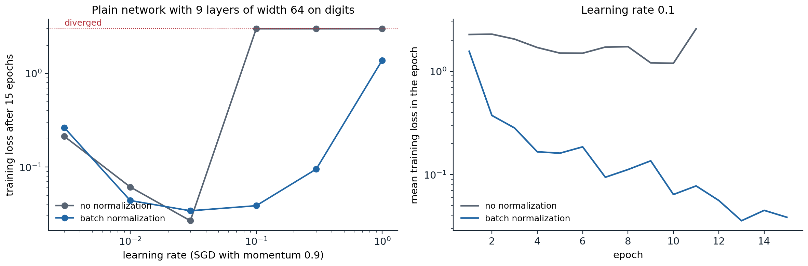
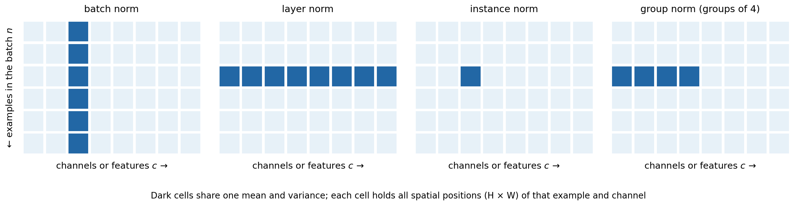
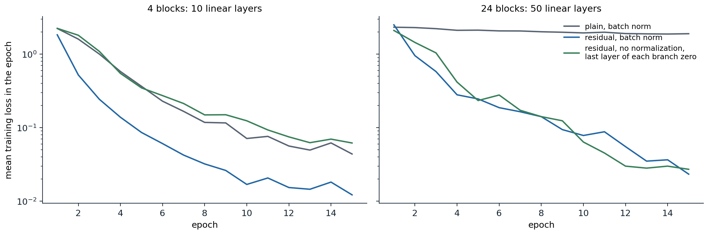
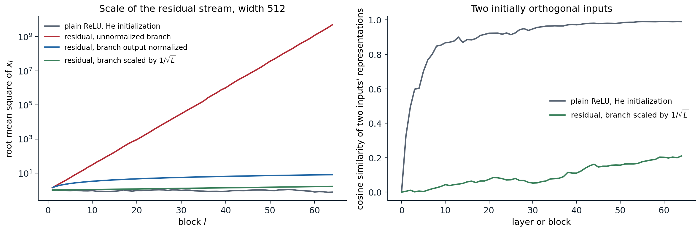

[Background Notes](../README.md) › [Deep Learning](README.md)

# 4. Normalization and Residual Connections

[← 3. Optimization for Deep Networks](03-optimization-for-deep-networks.md) · [5. Regularization and Generalization in Deep Networks →](05-regularization-and-generalization-in-deep-networks.md)

## <a id="normalizing-activations"></a>Normalizing activations

### <a id="batch-normalization"></a>Batch normalization

Chapter 2 chose the initial weights so that activations keep a stable scale. Once training starts, the weights change and that property is lost. **Normalization layers** restore it at every step by standardizing activations inside the network, which makes training far less sensitive to initialization and to the learning rate.

**Batch normalization** ([Ioffe and Szegedy, 2015](https://arxiv.org/abs/1502.03167)) standardizes each feature over the examples of a minibatch. For a batch of pre-activations $`z_1,\ldots,z_B`$ of one unit (or one channel of a convolutional layer, pooled over all spatial positions),

```math
\mu=\frac1B\sum_bz_b,\qquad \sigma^2=\frac1B\sum_b(z_b-\mu)^2,\qquad \hat z_b=\frac{z_b-\mu}{\sqrt{\sigma^2+\epsilon}},\qquad y_b=\gamma\hat z_b+\beta .
```

The learned scale $`\gamma`$ and shift $`\beta`$ let the layer represent any mean and variance, including undoing the normalization, so no expressive power is lost. The bias of the preceding linear layer is redundant, since the mean is subtracted, and is usually omitted.

At evaluation time a batch may contain a single example, and predictions should not depend on which other examples are processed with it. During training the layer therefore keeps exponential moving averages of $`\mu`$ and $`\sigma^2`$, and in evaluation mode it normalizes with those running estimates instead. The switch is `model.train()` versus `model.eval()` in PyTorch, and forgetting it is a common bug. The following code reproduces PyTorch's `BatchNorm1d` in both modes, including a detail of its running variance.

```python
import torch
from torch import nn

torch.manual_seed(0)
C, eps, momentum = 5, 1e-5, 0.1
bn = nn.BatchNorm1d(C, eps=eps, momentum=momentum)
nn.init.normal_(bn.weight)
nn.init.normal_(bn.bias)                                      # nontrivial gamma and beta
mean_run, var_run = torch.zeros(C), torch.ones(C)             # our own running statistics

def batchnorm_train(x):
    mu = x.mean(0)
    var = x.var(0, unbiased=False)                            # normalize with the biased batch variance
    xhat = (x - mu) / torch.sqrt(var + eps)
    return bn.weight * xhat + bn.bias, mu, x.var(0, unbiased=True)

for step in range(3):
    x = 3 + 2 * torch.randn(32, C, requires_grad=True)
    ours, mu, var_unbiased = batchnorm_train(x)
    theirs = bn(x)                                            # bn is in training mode by default
    mean_run = (1 - momentum) * mean_run + momentum * mu.detach()
    var_run = (1 - momentum) * var_run + momentum * var_unbiased.detach()   # running variance is unbiased
print("training-mode outputs match:", torch.allclose(ours, theirs, atol=1e-5))
print("running statistics match:", torch.allclose(mean_run, bn.running_mean), torch.allclose(var_run, bn.running_var))

bn.eval()
x_test = torch.randn(4, C)
expected = bn.weight * (x_test - mean_run) / torch.sqrt(var_run + eps) + bn.bias
print("evaluation mode uses the running statistics:", torch.allclose(bn(x_test), expected, atol=1e-5))

# The gradient of any loss with respect to the batch is orthogonal to the constant and to xhat, per channel.
bn.train()
x = torch.randn(32, C, requires_grad=True)
y = bn(x)
(g,) = torch.autograd.grad((torch.sin(y) * torch.randn_like(y)).sum(), x)
xhat = (x - x.mean(0)) / torch.sqrt(x.var(0, unbiased=False) + eps)
scale = g.abs().sum(0)
print("dL/dx sums to zero in every channel:", (g.sum(0).abs() / scale).max().item() < 1e-5,
      "; dL/dx is orthogonal to xhat:", ((g * xhat).sum(0).abs() / scale).max().item() < 1e-4)
# training-mode outputs match: True
# running statistics match: True True
# evaluation mode uses the running statistics: True
# dL/dx sums to zero in every channel: True ; dL/dx is orthogonal to xhat: True
```

The last check reflects how the gradient flows through the normalization. Because the output does not change when a constant is added to all $`z_b`$ or when they are all scaled, the gradient with respect to the batch has no component along those directions: backpropagation through batch normalization removes the part of the incoming gradient that would only shift or rescale the batch. [Appendix A](#block-dl4-appendix-a) derives the backward formula.

### <a id="why-it-helps"></a>Why it helps

The original motivation, reducing **internal covariate shift** (the change in each layer's input distribution as earlier layers train), has not held up well: [Santurkar, Tsipras, Ilyas, and Madry (2018)](https://arxiv.org/abs/1805.11604) showed that adding noise that increases the shift after normalization barely hurts, and that batch normalization instead makes the loss and its gradient smoother along the training trajectory. Three effects are well established.

- **Stable scale.** Activations entering each layer have controlled mean and variance whatever the weights, so neither poor initialization nor weight growth makes the signal vanish or explode.
- **Higher learning rates.** The smoother landscape tolerates larger steps, which speeds training and, through the larger noise, often improves generalization.
- **Regularization.** Each example is normalized with statistics of a random batch, which adds noise to its representation. This effect weakens as the batch grows.



*A plain network with nine linear layers of width 64, He initialization, trained on 1,200 digits for 15 epochs with SGD with momentum. Left: without normalization, every learning rate from 0.1 upward diverges; with batch normalization after each linear layer, training succeeds up to 0.3, and the loss at 0.1 is 0.039. Right: training curves at learning rate 0.1; the unnormalized network diverges in epoch 12.*

### <a id="scale-invariance-and-the-effective-learning-rate"></a>Scale invariance and the effective learning rate

A weight matrix followed by batch normalization has a special property: multiplying it by any $`c>0`$ leaves the network's output unchanged, since the normalization divides the scale out. Two consequences follow, both checked below. The gradient scales as $`1/c`$, so a larger weight norm means smaller gradients. And the gradient is orthogonal to the weights, so an SGD step without weight decay can only increase the norm: by Pythagoras, $`\|W_{t+1}\|^2=\|W_t\|^2+\eta^2\|g_t\|^2`$.

```python
import torch
from torch import nn

torch.manual_seed(0)
x = torch.randn(64, 10)
target = torch.randn(64, 20)
W = torch.randn(20, 10)
norm = nn.BatchNorm1d(20, affine=False)

def loss_at(W):
    W = W.clone().requires_grad_()
    loss = ((norm(x @ W.T) - target) ** 2).mean()
    (g,) = torch.autograd.grad(loss, W)
    return loss.item(), g

l1, g1 = loss_at(W)
l3, g3 = loss_at(3 * W)
print(f"loss at W and at 3W: {l1:.5f} {l3:.5f}")
print(f"gradient norm ratio |g(3W)| / |g(W)| = {(g3.norm() / g1.norm()).item():.4f}")
print("gradient orthogonal to W:", abs((g1 * W).sum().item()) < 1e-4 * (g1.norm() * W.norm()).item())

# Plain gradient descent on a scale-invariant loss can only increase |W|, since each step is orthogonal to W.
Wt, lr, steps_sq = W.clone(), 50.0, 0.0
for step in range(200):
    _, g = loss_at(Wt)
    Wt = Wt - lr * g
    steps_sq += (lr * g).pow(2).sum().item()
print(f"|W|^2 grew from {W.pow(2).sum().item():.0f} to {Wt.pow(2).sum().item():.0f}; "
      f"sum of squared step lengths {steps_sq:.0f}")
# loss at W and at 3W: 2.10979 2.10979
# gradient norm ratio |g(3W)| / |g(W)| = 0.3333
# gradient orthogonal to W: True
# |W|^2 grew from 165 to 211; sum of squared step lengths 46
```

Since only the direction $`W/\|W\|`$ matters, the relevant step size is the change in direction, about $`\eta\|g\|/\|W\|`$, and with $`\|g\|\propto1/\|W\|`$ the **effective learning rate** is proportional to $`\eta/\|W\|^2`$. Without weight decay the norm grows and the effective rate decays automatically. With weight decay, which shrinks the norm, the two forces reach an equilibrium in which weight decay mainly acts to keep the effective learning rate high, not to regularize in the classical sense ([van Laarhoven, 2017](https://arxiv.org/abs/1706.05350); [Li and Arora, 2020](https://arxiv.org/abs/1910.07454)). This is one reason the best weight decay depends on the learning rate and schedule (chapter 5).

### <a id="normalizing-over-other-axes"></a>Normalizing over other axes

Batch normalization couples the examples of a batch, which causes problems: statistics are noisy for small batches, examples influence one another's predictions, training and evaluation behave differently, and distributed training must either synchronize statistics across devices or accept per-device batches. Several alternatives compute statistics over other axes of the activation tensor with shape (batch $`N`$, channels $`C`$, spatial positions $`H\times W`$).



*The entries that share one mean and variance in four normalization schemes, for a batch of six examples with eight channels. Batch norm pools one channel over the batch; layer norm pools all channels of one example; instance norm pools one channel of one example; group norm pools a group of channels of one example. Each cell stands for all spatial positions of its example and channel.*

- **Layer normalization** ([Ba, Kiros, and Hinton, 2016](https://arxiv.org/abs/1607.06450)) standardizes each example over its features. It behaves identically in training and evaluation and does not depend on the batch, which makes it the standard choice for recurrent networks and transformers.
- **RMS normalization** ([Zhang and Sennrich, 2019](https://arxiv.org/abs/1910.07467)) divides by the root mean square of the features without subtracting the mean, $`y=\gamma\odot z/\sqrt{\frac1d\|z\|^2+\epsilon}`$. It is cheaper and performs as well in transformers, where it has largely replaced layer normalization.
- **Group normalization** ([Wu and He, 2018](https://arxiv.org/abs/1803.08494)) standardizes groups of channels within each example; **instance normalization** ([Ulyanov, Vedaldi, and Lempitsky, 2016](https://arxiv.org/abs/1607.08022)) is the case of one channel per group. Group normalization matches batch normalization for convolutional networks trained with small batches, as in detection and segmentation (chapter 14).
- **Weight normalization** ([Salimans and Kingma, 2016](https://arxiv.org/abs/1602.07868)) normalizes the weights rather than the activations, writing $`w=g\,v/\|v\|`$; it achieves the scale invariance without depending on the data.

Normalization is not indispensable. Careful initialization and signal-preserving architectures can match it, as in the normalizer-free ResNets of [Brock, De, Smith, and Simonyan (2021)](https://arxiv.org/abs/2102.06171), and [Zhu et al. (2025)](https://arxiv.org/abs/2503.10622) replaced the layer normalizations of transformers with an elementwise $`\tanh(\alpha z)`$ with learned $`\alpha`$.

## <a id="residual-connections"></a>Residual connections

### <a id="depth-without-degradation"></a>Depth without degradation

With normalization and good initialization, networks of 20 or so layers train well, but deeper plain networks still do worse, and not because of overfitting: their *training* error is higher. [He, Zhang, Ren, and Sun (2016)](https://arxiv.org/abs/1512.03385) called this the **degradation** problem. It cannot be a question of capacity, since a deeper network could copy a shallower one and set its extra layers to the identity. The difficulty is that stacks of nonlinear layers find the identity hard to learn.

A **residual block** makes the identity the default:

```math
x_{l+1}=x_l+F_l(x_l),
```

where the **residual branch** $`F_l`$ is a small network, typically two or three layers with normalization. If a block is not useful, the branch only needs to output zero. He et al. trained residual networks with 152 layers on ImageNet and over 1,000 on CIFAR-10, and residual connections are now part of almost every deep architecture, including transformers (chapter 9). Earlier, **highway networks** ([Srivastava, Greff, and Schmidhuber, 2015](https://arxiv.org/abs/1505.00387)) used gated shortcuts, and DenseNets ([Huang et al., 2017](https://arxiv.org/abs/1608.06993)) concatenate the outputs of all earlier layers instead of adding them.



*Mean training loss per epoch on digits for networks built from blocks of two linear layers of width 64, trained with SGD at learning rate 0.01. With 4 blocks, all three variants train. With 24 blocks, the plain network with batch normalization barely learns, its loss still 1.90 after 15 epochs, while both residual networks reach 0.02–0.03. A residual network without any normalization also trains when the last layer of each branch starts at zero.*

### <a id="why-the-shortcut-helps"></a>Why the shortcut helps

The Jacobian of a residual block is $`I+\partial F_l/\partial x_l`$, so the gradient reaching block $`l`$ is

```math
\frac{\partial\ell}{\partial x_l}=\frac{\partial\ell}{\partial x_L}\prod_{k=l}^{L-1}\Bigl(I+\frac{\partial F_k}{\partial x_k}\Bigr).
```

Expanding the product gives a sum over all subsets of blocks, and the term with no branch derivatives is $`\partial\ell/\partial x_L`$ itself: every block receives the output gradient directly, whatever happens in the branches. The same expansion shows the forward pass as a sum over $`2^L`$ paths of different lengths. [Veit, Wilber, and Belongie (2016)](https://arxiv.org/abs/1605.06431) found that trained residual networks behave like ensembles of relatively shallow paths: deleting a single block from a trained ResNet barely affects its accuracy, whereas deleting a layer of a plain network destroys it.

The shortcut also preserves distinctions between inputs. Chapter 2 showed that a plain ReLU network at initialization drives the representations of all inputs toward the same direction. In a residual network each block adds a modest perturbation to a stream that still carries the input, so representations stay distinct through many more layers, and the gradients remain informative rather than **shattered** ([Balduzzi et al., 2017](https://arxiv.org/abs/1702.08591)).

### <a id="the-scale-of-the-residual-stream"></a>The scale of the residual stream

Residual connections change the variance recursion of chapter 2. If the branch output is roughly independent of its input and has variance $`v_l`$, then $`\operatorname{Var}(x_{l+1})\approx\operatorname{Var}(x_l)+v_l`$. With an unnormalized branch whose variance is proportional to that of its input, the stream grows geometrically; with a normalized branch output, it grows linearly in depth; with branches scaled down by $`1/\sqrt L`$ or initialized at zero, it stays of order one.



*Random networks at initialization, width 512. Left: root mean square of the residual stream after each block. An unnormalized branch with He initialization, scaled by $`1/\sqrt2`$, multiplies the stream by about $`\sqrt2`$ per block, reaching $`5\times10^9`$ after 64 blocks. A branch whose output is standardized adds unit variance per block, so the scale grows like $`\sqrt l`$, to 8.1. Scaling each branch by $`1/\sqrt L`$ keeps it below 1.7. Right: cosine similarity of the representations of two orthogonal inputs. The plain ReLU network pushes it to 0.99 by layer 64; the scaled residual network keeps it at 0.21.*

Several initialization schemes use this insight to make each block start close to the identity:

- initializing the scale $`\gamma`$ of the last batch normalization in each branch to zero, so that every block is exactly the identity at the start ([Goyal et al., 2017](https://arxiv.org/abs/1706.02677));
- **Fixup** ([Zhang, Dauphin, and Ma, 2019](https://arxiv.org/abs/1901.09321)), which rescales the branch weights by a power of the depth and zero-initializes the last layer, and trains residual networks without normalization;
- **SkipInit** ([De and Smith, 2020](https://arxiv.org/abs/2002.10444)) and **ReZero** ([Bachlechner et al., 2020](https://arxiv.org/abs/2003.04887)), which multiply each branch by a learned scalar initialized at zero.

De and Smith also explain part of batch normalization's success in residual networks this way: normalizing the branch while the stream grows downweights each branch by about $`1/\sqrt l`$ at block $`l`$, biasing deep networks toward the identity at initialization.

### <a id="pre-normalization-and-post-normalization"></a>Pre-normalization and post-normalization

Where the normalization sits relative to the shortcut matters. The original transformer used **post-normalization**, $`x_{l+1}=\mathrm{LN}\bigl(x_l+F_l(x_l)\bigr)`$, which normalizes the stream itself after every block. **Pre-normalization**, $`x_{l+1}=x_l+F_l\bigl(\mathrm{LN}(x_l)\bigr)`$, normalizes only the branch input and leaves an uninterrupted identity path from input to output, with one final normalization before the output layer. Pre-normalization trains stably without warmup and at larger depth ([Xiong et al., 2020](https://arxiv.org/abs/2002.04745)), and it is the default in modern transformers. Post-normalization can reach slightly better results when it trains, and schemes such as DeepNet ([Wang et al., 2022](https://arxiv.org/abs/2203.00555)) rescale its shortcut to make it stable at a thousand layers. For convolutional networks, [He, Zhang, Ren, and Sun (2016)](https://arxiv.org/abs/1603.05027) made the analogous change, moving normalization and activation into the branch before each convolution ("pre-activation" ResNets), and found that it eased the training of networks with over 1,000 layers.

UDL chapter 11, UMich lecture 8, and UNIGE sections 6.4 and 6.5, listed in the reading plan, cover residual networks and normalization.

## <a id="appendices"></a>Appendices


<details>
<summary><a id="block-dl4-appendix-a"></a><b>A. Backpropagation through batch normalization</b></summary>


Fix one channel, and let $`g_b=\partial\ell/\partial y_b`$ be the incoming gradients for the batch. Since $`y_b=\gamma\hat z_b+\beta`$, the parameter gradients are $`\partial\ell/\partial\gamma=\sum_bg_b\hat z_b`$ and $`\partial\ell/\partial\beta=\sum_bg_b`$, and $`\partial\ell/\partial\hat z_b=\gamma g_b`$. Write $`s=\sqrt{\sigma^2+\epsilon}`$. Each $`\hat z_b`$ depends on every $`z_c`$ through $`\mu`$ and $`\sigma^2`$:

```math
\frac{\partial\hat z_b}{\partial z_c}=\frac1s\Bigl(\mathbf 1\{b=c\}-\frac1B\Bigr)-\frac{z_b-\mu}{s^3}\cdot\frac{\partial\sigma^2}{2\,\partial z_c},\qquad\frac{\partial\sigma^2}{\partial z_c}=\frac2B(z_c-\mu).
```

The second term used $`\sum_b(z_b-\mu)=0`$. Substituting $`z_b-\mu=s\hat z_b`$,

```math
\frac{\partial\hat z_b}{\partial z_c}=\frac1s\Bigl(\mathbf 1\{b=c\}-\frac1B-\frac1B\,\hat z_b\hat z_c\Bigr),
```

and therefore

```math
\frac{\partial\ell}{\partial z_c}=\frac{\gamma}{s}\Bigl(g_c-\frac1B\sum_bg_b-\hat z_c\cdot\frac1B\sum_bg_b\hat z_b\Bigr).
```

The bracket is $`g`$ minus its projections onto the constant vector and onto $`\hat z`$, up to the factor $`\frac1B\sum_b\hat z_b^2=\sigma^2/(\sigma^2+\epsilon)`$, which is 1 when $`\epsilon=0`$. For $`\epsilon=0`$ the gradient with respect to the batch is exactly orthogonal to $`\mathbf 1`$ and to $`\hat z`$: normalization removes the components of the incoming gradient that would change only the batch mean or scale. With $`\epsilon>0`$ the orthogonality to $`\mathbf 1`$ remains exact and that to $`\hat z`$ holds up to a relative error of order $`\epsilon/\sigma^2`$, as in the code above.

**Scale invariance.** For $`\epsilon=0`$, the layer output is unchanged when the weights $`W`$ feeding it are multiplied by $`c>0`$. Differentiating $`\ell(cW)=\ell(W)`$ with respect to $`c`$ at $`c=1`$ gives $`\langle W,\nabla\ell(W)\rangle=0`$, and differentiating with respect to $`W`$ gives $`c\,\nabla\ell(cW)=\nabla\ell(W)`$. These are the orthogonality and $`1/c`$ scaling observed in the second code block.

</details>

---

[← 3. Optimization for Deep Networks](03-optimization-for-deep-networks.md) · [5. Regularization and Generalization in Deep Networks →](05-regularization-and-generalization-in-deep-networks.md)
