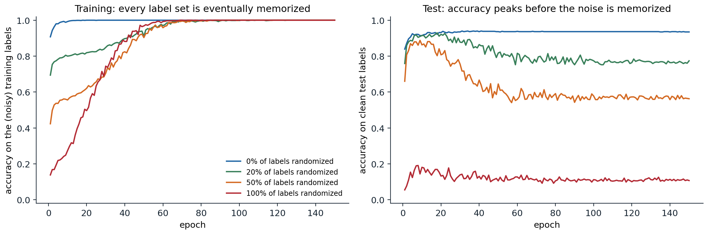
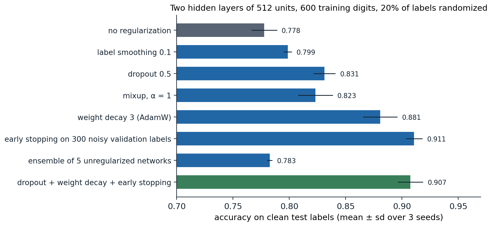
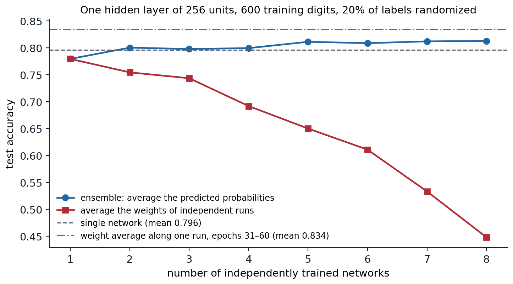

[Background Notes](../README.md) › [Deep Learning](README.md)

# 5. Regularization and Generalization in Deep Networks

> [!WARNING]
> Work in progress: this part of the notes is still being revised.

[← 4. Normalization and Residual Connections](04-normalization-and-residual-connections.md) · [6. Convolutional Networks →](06-convolutional-networks.md)

## <a id="the-generalization-puzzle"></a>The generalization puzzle

### <a id="networks-can-memorize-anything"></a>Networks can memorize anything

Classical learning theory ([Foundations chapter 5](../foundations/05-information-and-learning-theory.md#statistical-learning-theory), [ML chapter 7](../ml/07-statistical-learning-theory.md)) bounds the gap between training and test error by the capacity of the hypothesis class: VC dimension, Rademacher complexity, or a norm. For modern networks these bounds are vacuous. [Zhang, Bengio, Hardt, Recht, and Vinyals (2017)](https://arxiv.org/abs/1611.03530) made the point sharply: standard image classifiers, trained with standard settings, reach zero training error on CIFAR-10 even when every label is replaced by a random one, or when the images themselves are replaced by noise. The same architecture that generalizes well on real labels can fit labels that carry no information, so its capacity alone cannot explain its generalization. Whatever explains it must involve the data, the optimizer, and the interaction between them.



*A network with two hidden layers of 512 units, trained with Adam on 1,200 digits in which 0, 20, 50, or 100% of the labels were replaced by random ones. Left: every version eventually fits its training labels perfectly, the clean ones within a few epochs and the random ones by about epoch 70. Right: accuracy on correctly labeled test digits. With 20% and 50% noise it peaks early, at 0.93 in epoch 18 and 0.89 in epoch 9, and then falls to 0.77 and 0.56 as the network memorizes the wrong labels; with random labels it stays at chance.*

The figure shows a second regularity, documented by [Arpit et al. (2017)](https://arxiv.org/abs/1706.05394): networks fit the consistent structure in the data first and the exceptions later. On noisy labels, test accuracy is highest before memorization sets in. This is the phenomenon that early stopping exploits, and it suggests that gradient descent is biased toward simple functions that explain most of the data, with memorization of individual examples a slower, later process.

### <a id="what-the-bounds-are-missing"></a>What the bounds are missing

Two responses to the puzzle have been productive. The first measures capacity by quantities that depend on the trained weights rather than on the parameter count: norms and margins, the sharpness of the minimum, or the number of bits needed to describe the network. **PAC-Bayes bounds** ([Foundations chapter 5, Appendix C](../foundations/05-information-and-learning-theory.md#appendices)) are of this type. They bound the error of a distribution over networks centered on the trained one by the divergence between that distribution and a prior; if the loss stays low under large random perturbations of the weights, the posterior can be broad and the bound small. [Dziugaite and Roy (2017)](https://arxiv.org/abs/1703.11008) optimized such a bound directly and obtained the first nonvacuous generalization guarantees for networks on MNIST, while standard bounds exceeded 1. A large empirical study of candidate measures ([Jiang et al., 2020](https://arxiv.org/abs/1912.02178)) found that sharpness- and PAC-Bayes-based quantities predicted generalization across hyperparameter changes better than norm-based ones.

The second response studies the **implicit regularization** of the training algorithm: among the many parameter settings that fit the data, gradient descent from small random initialization finds particular ones, and their properties, rather than those of the whole class, determine generalization. The last section of this chapter returns to both ideas.

### <a id="double-descent-in-deep-networks"></a>Double descent in deep networks

[ML chapter 6](../ml/06-losses-model-selection-and-evaluation.md#beyond-the-classical-u-shape) showed that the test error of minimum-norm least squares rises sharply when the number of parameters approaches the number of examples, the **interpolation threshold**, and falls again beyond it. [Nakkiran et al. (2020)](https://arxiv.org/abs/1912.02292) found the same **double descent** in deep networks, as a function of model size, of training time, and even of the number of training examples: near the threshold, where a model can barely fit its training data, it fits the noise in the least regular way, and adding data can temporarily hurt. The peak is most pronounced with label noise and little regularization, and appropriate regularization or early stopping removes it. For large models far beyond the threshold, "bigger is better" holds in practice: larger networks trained with the same recipe generalize better, which is the regime of modern deep learning.

## <a id="explicit-regularizers"></a>Explicit regularizers

The regularizers of classical statistics carry over to deep networks, and several new ones exploit the structure of network training. The figure below compares them in a setting where regularization matters: a network much larger than needed, trained on a small dataset with noisy labels.



*Test accuracy with clean labels for a network with two hidden layers of 512 units, trained for 100 epochs with AdamW on 600 digits whose labels are 20% randomized. Without regularization it memorizes the noise and reaches 0.778. Label smoothing and an ensemble of five networks barely help here; dropout and mixup help moderately; strong weight decay helps a lot; early stopping with a validation set of 300 equally noisy labels is best, at 0.911. Combining dropout, weight decay, and early stopping gives 0.907.*

The ranking depends on the problem. With clean labels and plenty of data the differences shrink to a percent or less, and on natural images data augmentation is usually the most effective regularizer of all. What carries over is the mechanism: every method on the chart makes memorizing individual labels harder or stops training before it happens.

### <a id="weight-decay"></a>Weight decay

**Weight decay** shrinks the parameters toward zero at every step, either through an $`\ell_2`$ penalty added to the loss or as a separate multiplicative decay. For SGD the two are the same; for Adam they differ, and the decoupled form, AdamW, is the standard ([Foundations chapter 3](../foundations/03-calculus-and-optimization.md#l2-regularization-and-adamw)). Typical values are $`5\times10^{-4}`$ with SGD and 0.01–0.1 with AdamW. Biases and the scale and shift parameters of normalization layers are usually excluded.

In networks with normalization layers, weight decay acts less as a penalty on complexity and more as a control on the effective learning rate: the output is invariant to the scale of the weights feeding a normalization, so shrinking them only enlarges the effective step ([chapter 4](04-normalization-and-residual-connections.md#scale-invariance-and-the-effective-learning-rate)). Its interaction with the learning rate and schedule is strong enough that the two should be tuned together ([chapter 12](12-practical-methodology.md)).

### <a id="dropout"></a>Dropout

**Dropout** ([Srivastava et al., 2014](https://jmlr.org/papers/v15/srivastava14a.html)) sets each unit of a layer to zero independently with probability $`p`$ at every training step. In the usual **inverted** form, the surviving units are multiplied by $`1/(1-p)`$ so that each unit's expected value is unchanged, and at evaluation time the layer does nothing.

```python
import torch
from torch import nn

torch.manual_seed(0)
p = 0.3
drop = nn.Dropout(p)
x = torch.randn(4, 100_000)

drop.train()
out = drop(x)
kept = out != 0
print(f"fraction zeroed {1 - kept.float().mean().item():.3f}; survivors scaled by "
      f"{(out[kept] / x[kept]).mean().item():.4f} = 1/(1-p) = {1 / (1 - p):.4f}")
drop.eval()
print("evaluation mode is the identity:", torch.equal(drop(x), x))

# Dropout on the inputs of linear regression is, on average, a ridge penalty scaled by each feature's size.
n, d = 200, 5
X = torch.randn(n, d) * torch.tensor([0.5, 1.0, 1.0, 2.0, 4.0])
w = torch.tensor([1.0, -1.0, 0.5, 0.25, 0.1])
yv = X @ w + 0.1 * torch.randn(n)
w_eval = torch.tensor([0.8, -0.5, 0.3, 0.3, 0.2])            # any fixed weight vector
masks = (torch.rand(20_000, n, d) > p).float() / (1 - p)
mc = ((yv - ((X * masks) @ w_eval)) ** 2).mean().item()      # average over dropout masks and examples
penalty = p / (1 - p) * (w_eval ** 2 * (X ** 2).mean(0)).sum().item()
closed = ((yv - X @ w_eval) ** 2).mean().item() + penalty
print(f"expected dropout loss: Monte Carlo {mc:.3f}, squared error + penalty {closed:.3f}")
G = X.T @ X / n
w_drop = torch.linalg.solve(G + p / (1 - p) * torch.diag(torch.diag(G)), X.T @ yv / n)
w_ls = torch.linalg.solve(G, X.T @ yv / n)
print("least squares:        ", [round(v, 3) for v in w_ls.tolist()])
print("dropout minimizer:    ", [round(v, 3) for v in w_drop.tolist()])
# fraction zeroed 0.300; survivors scaled by 1.4286 = 1/(1-p) = 1.4286
# evaluation mode is the identity: True
# expected dropout loss: Monte Carlo 1.225, squared error + penalty 1.226
# least squares:         [0.989, -0.996, 0.504, 0.25, 0.1]
# dropout minimizer:     [0.609, -0.666, 0.339, 0.154, 0.072]
```

Two views explain why dropout regularizes. The first is **implicit ensembling**: each step trains a different random subnetwork, and all $`2^m`$ subnetworks of $`m`$ units share weights, so the trained network approximates an ensemble whose prediction the deterministic evaluation-time network approximates. The second is a **penalty**: for linear regression, dropping inputs is, in expectation, least squares plus the penalty $`\frac p{1-p}\sum_jw_j^2\,\overline{x_j^2}`$, a ridge penalty on each coefficient weighted by the average square of its feature ([Appendix A](#block-dl5-appendix-a)). Unlike ordinary ridge, which shrinks the coefficients of small-variance features most, this penalty does not depend on how the features are scaled; for uncorrelated features it multiplies every coefficient by about $`1-p`$, as in the output. Dropout also discourages **co-adaptation**, where units become useful only in specific combinations.

Dropout was essential for the large fully connected layers of early convolutional networks. It is used less in modern convolutional networks, where batch normalization, data augmentation, and weight decay do the same job, and in the pretraining of large language models, which see each example only about once; it remains common in fine-tuning and in small-data settings. Related methods drop larger structures: **stochastic depth** ([Huang et al., 2016](https://arxiv.org/abs/1603.09382)) skips entire residual blocks at random during training, and keeping dropout active at test time and averaging several stochastic predictions, **Monte Carlo dropout** ([Gal and Ghahramani, 2016](https://arxiv.org/abs/1506.02142)), gives a cheap estimate of predictive uncertainty.

### <a id="data-augmentation"></a>Data augmentation

**Data augmentation** trains on transformed copies of the examples: crops, flips, small rotations, and color changes for images; noise, time shifts, and masking of frequency bands for audio; synonym substitution or back-translation for text. It encodes a known invariance of the task directly in the data, which is often more effective than any penalty: a network cannot learn from 1,000 images that a horizontally flipped cat is still a cat as reliably as from 2,000 images that include the flips. The transformations must preserve the label under the test distribution. Flipping digits or rotating road signs by 180 degrees changes their meaning, and transformations that produce images unlike any test image can hurt.

Several augmentations mix examples. **Mixup** ([Zhang, Cisse, Dauphin, and Lopez-Paz, 2018](https://arxiv.org/abs/1710.09412)) trains on convex combinations $`\lambda x_i+(1-\lambda)x_j`$ with correspondingly mixed labels, $`\lambda\sim\mathrm{Beta}(\alpha,\alpha)`$, which encourages the network to behave linearly between examples and reduces memorization of corrupted labels. **CutMix** ([Yun et al., 2019](https://arxiv.org/abs/1905.04899)) pastes a rectangle from one image into another and mixes the labels by area. Automated policies such as **RandAugment** ([Cubuk, Zoph, Shlens, and Le, 2020](https://arxiv.org/abs/1909.13719)) apply random sequences of transformations with a single strength parameter. Averaging a model's predictions over several augmented versions of a test input, **test-time augmentation**, is a cheap way to gain a little accuracy.

### <a id="label-smoothing"></a>Label smoothing

**Label smoothing** ([Szegedy et al., 2016](https://arxiv.org/abs/1512.00567)) replaces the one-hot target by $`(1-\varepsilon)e_y+\varepsilon/K`$ for $`K`$ classes. With one-hot targets the cross-entropy can be decreased forever by making the correct logit larger than the others, so the logits of a network that fits its training data grow without bound; with smoothing the optimal logit gap is finite, $`\log\bigl((1-\varepsilon+\varepsilon/K)/(\varepsilon/K)\bigr)`$.

```python
import math
import torch
from torch import nn

torch.manual_seed(0)
K, eps = 10, 0.1
logits = torch.randn(8, K)
target = torch.randint(0, K, (8,))
ls = nn.functional.cross_entropy(logits, target, label_smoothing=eps)
logp = torch.log_softmax(logits, 1)
by_hand = ((1 - eps) * -logp[torch.arange(8), target] + eps * -logp.mean(1)).mean()
print("PyTorch label smoothing = (1-eps) CE + eps * uniform CE:", torch.allclose(ls, by_hand))

# The loss-minimizing logits: without smoothing the logit gap grows forever; with smoothing it stops.
for e in [0.0, 0.1]:
    z = torch.zeros(1, K, requires_grad=True)
    opt = torch.optim.Adam([z], lr=0.1)
    for step in range(5000):
        opt.zero_grad()
        nn.functional.cross_entropy(z, torch.tensor([0]), label_smoothing=e).backward()
        opt.step()
    gap = (z[0, 0] - z[0, 1:].mean()).item()
    theory = math.log((1 - e + e / K) / (e / K)) if e > 0 else float("inf")
    print(f"eps = {e}: logit gap after 5000 steps {gap:.2f}; optimal gap {theory:.2f}")
# PyTorch label smoothing = (1-eps) CE + eps * uniform CE: True
# eps = 0.0: logit gap after 5000 steps 12.99; optimal gap inf
# eps = 0.1: logit gap after 5000 steps 4.51; optimal gap 4.51
```

Label smoothing improves accuracy and calibration in large image and translation models, and it makes the penultimate-layer representations of each class form tight, well-separated clusters. It has costs: those representations lose information about similarities between classes, which makes a smoothed network a worse teacher for knowledge distillation ([Müller, Kornblith, and Hinton, 2019](https://arxiv.org/abs/1906.02629); [chapter 11](11-training-at-scale-and-efficient-inference.md)).

### <a id="early-stopping"></a>Early stopping

**Early stopping** monitors a validation metric during training and keeps the parameters with the best value. For linear models trained by gradient descent from zero, stopping early is approximately ridge regression with a penalty that decreases with the number of steps ([ML chapter 6](../ml/06-losses-model-selection-and-evaluation.md#early-stopping-as-regularization)); for networks it limits how far the parameters move from their initialization, and, as the memorization figure shows, it catches the network after it has fit the signal and before it has fit the noise. It needs only a held-out set and costs nothing extra. In large-scale pretraining, where each example is seen once and validation loss keeps falling, it is rarely needed; it matters most for fine-tuning on small datasets.

## <a id="averaging-and-ensembles"></a>Averaging and ensembles

An **ensemble** of networks trained from different random initializations, whose predicted probabilities are averaged, is one of the most reliable ways to improve accuracy and, especially, calibration and uncertainty estimates ([Lakshminarayanan, Pritzel, and Blundell, 2017](https://arxiv.org/abs/1612.01474)). Independently trained networks make partly different errors because they converge to different solutions, the same diversity that bagging creates for trees ([ML chapter 10](../ml/10-bagging-and-random-forests.md#averaging-to-reduce-variance)). Its cost is proportional to the number of members at both training and inference.

Averaging the *weights* of independent networks instead fails, because of the permutation symmetry and the loss barriers between solutions ([chapter 3](03-optimization-for-deep-networks.md#straight-paths-through-parameter-space)). Averaging weights *along a single run* works, because consecutive iterates lie in the same low-loss region. **Stochastic weight averaging** ([Izmailov et al., 2018](https://arxiv.org/abs/1803.05407)) averages the iterates visited late in training with a constant or cyclic learning rate, and tends to land in the flat center of the region the iterates explore. An **exponential moving average** of the weights, maintained throughout training and used for evaluation, is the standard lightweight version. **Model soups** ([Wortsman et al., 2022](https://arxiv.org/abs/2203.05482)) average the weights of several models fine-tuned from the same pretrained network with different hyperparameters; sharing the starting point keeps them in one basin.



*Eight networks with one hidden layer of 256 units, each trained for 60 epochs with SGD on 600 digits with 20% randomized labels. Averaging the predicted probabilities of $`k`$ independent networks raises test accuracy from 0.779 for the first to 0.813 for eight. Averaging their weights lowers it steadily, to 0.448. Averaging the weights of each single run over its last 30 epochs gives the best result, a mean of 0.834 against 0.796 for the final weights.*

## <a id="implicit-regularization"></a>Implicit regularization

### <a id="the-bias-of-gradient-descent"></a>The bias of gradient descent

Among all parameters that fit the training data, gradient methods do not choose arbitrarily. Several cases are understood exactly:

- For least squares started from zero, gradient descent converges to the minimum-norm interpolating solution ([ML chapter 6](../ml/06-losses-model-selection-and-evaluation.md#beyond-the-classical-u-shape)).
- For logistic regression on separable data, gradient descent converges in direction to the maximum-margin separator ([Soudry et al., 2018](https://jmlr.org/papers/v19/18-188.html); [ML chapter 5](../ml/05-logistic-regression-and-probabilistic-prediction.md#separation)). Homogeneous networks trained with the logistic loss have an analogous bias toward large normalized margins ([Lyu and Li, 2020](https://arxiv.org/abs/1906.05890)).
- For factorized models such as deep linear networks $`W_L\cdots W_1`$ and matrix factorization, gradient descent from small initialization is biased toward solutions of low rank ([Gunasekar et al., 2017](https://arxiv.org/abs/1705.09280); [Arora, Cohen, Hu, and Luo, 2019](https://arxiv.org/abs/1905.13655)), and the bias strengthens with depth.

Stochasticity adds further bias. Following a stochastic gradient with a finite step size is, to second order, like following the exact gradient of a modified loss that penalizes the gradient norm, $`\widehat R(\theta)+\frac\eta4\|\nabla\widehat R(\theta)\|^2`$ for full-batch gradient descent ([Barrett and Dherin, 2021](https://arxiv.org/abs/2009.11162)), plus a term proportional to $`\eta/B`$ that penalizes the variance of the minibatch gradients ([Smith, Dherin, Barrett, and De, 2021](https://arxiv.org/abs/2101.12176)). Large learning rates and small batches therefore favor regions where the loss is flat and the per-example gradients agree, one explanation of why the ratio $`\eta/B`$ affects generalization ([chapter 3](03-optimization-for-deep-networks.md#does-noise-help-generalization)).

### <a id="flat-minima"></a>Flat minima

The idea that flat minima generalize better goes back to [Hochreiter and Schmidhuber (1997)](https://direct.mit.edu/neco/article/9/1/1/6027/Flat-Minima). The intuition is description length: parameters in a wide basin can be specified with low precision, and a network that works under perturbations of its weights encodes fewer bits about its training set, the same intuition behind PAC-Bayes bounds. Flatness correlates with generalization in many experiments, but it is not a property of the function alone: [Dinh, Pascanu, Bengio, and Bengio (2017)](https://arxiv.org/abs/1703.04933) showed that the rescaling symmetry of ReLU networks can make any minimum arbitrarily sharp without changing the function, so a meaningful sharpness measure must be invariant to such reparameterizations.

**Sharpness-aware minimization** (SAM; [Foret, Kleiner, Mobahi, and Neyshabur, 2021](https://arxiv.org/abs/2010.01412)) turns the intuition into an optimizer. It minimizes the worst-case loss in a small ball, $`\max_{\|\epsilon\|\le\rho}\widehat R(\theta+\epsilon)`$. Linearizing the inner problem gives $`\epsilon^*\approx\rho\,\nabla\widehat R(\theta)/\|\nabla\widehat R(\theta)\|`$, so each SAM step computes the gradient at the perturbed point $`\theta+\epsilon^*`$ and applies it at $`\theta`$, at twice the cost of an ordinary step. SAM improves generalization in many image-classification settings, although its benefit may come less from flatness itself than from the implicit penalties its perturbation induces.

### <a id="benign-overfitting-and-late-generalization"></a>Benign overfitting and late generalization

Interpolating noisy labels, which the memorization figure shows can hurt, is sometimes harmless. **Benign overfitting** ([Bartlett, Long, Lugosi, and Tsigler, 2020](https://arxiv.org/abs/1906.11300)) occurs in overparameterized linear regression when the data have many directions of small variance: the interpolating solution absorbs the noise in those directions, where it barely affects predictions. Something similar appears to happen in wide networks on real data, where fitting a few mislabeled examples costs little test accuracy. At the other extreme, on small algorithmic tasks networks can first memorize and then, after many more steps of training with weight decay, abruptly generalize, a phenomenon called **grokking** ([Power et al., 2022](https://arxiv.org/abs/2201.02177)). Both show that fitting the training data is not the end of what training does: the implicit and explicit regularizers keep reshaping the solution long after the training loss is small.

UDL chapters 8, 9, and 20, DLB chapter 7, UMich lectures 10 and 11, and UNIGE sections 5.4 and 6.3, listed in the [reading plan](reading-plan.md#5-regularization-and-generalization), cover the material of this chapter.

## <a id="appendices"></a>Appendices


<details>
<summary><a id="block-dl5-appendix-a"></a><b>A. Dropout in linear regression</b></summary>


Let the inputs be dropped independently: $`\tilde x=m\odot x/(1-p)`$ with $`m_j\sim\mathrm{Bernoulli}(1-p)`$, so $`\mathbb E[\tilde x\mid x]=x`$ and $`\operatorname{Var}(\tilde x_j\mid x)=x_j^2\bigl(\frac1{1-p}-1\bigr)=\frac p{1-p}x_j^2`$, with the coordinates independent. For one example and a fixed weight vector $`w`$,

```math
\mathbb E_m\bigl(y-w^\top\tilde x\bigr)^2=\bigl(y-w^\top x\bigr)^2+\operatorname{Var}\bigl(w^\top\tilde x\bigr)=\bigl(y-w^\top x\bigr)^2+\frac p{1-p}\sum_jw_j^2x_j^2 .
```

Averaging over the training set gives the expected dropout objective

```math
\frac1n\|y-Xw\|^2+\frac p{1-p}\,w^\top\operatorname{diag}\Bigl(\frac1nX^\top X\Bigr)w .
```

Setting its gradient to zero gives $`\bigl(G+\frac p{1-p}\operatorname{diag}G\bigr)w=\frac1nX^\top y`$ with $`G=\frac1nX^\top X`$, the dropout minimizer in the code. If the features are rescaled, $`x_j\mapsto c_jx_j`$, the penalty on the rescaled coefficient $`w_j/c_j`$ is unchanged, so the solution transforms exactly like least squares: dropout behaves like ridge regression on standardized features. If $`G`$ is diagonal, $`w_j=(1-p)\,w_j^{\text{LS}}`$. Stochastic gradient descent with dropout minimizes this expected objective only on average; its noise adds a further implicit regularization, as discussed in the last section.

</details>

---

[← 4. Normalization and Residual Connections](04-normalization-and-residual-connections.md) · [6. Convolutional Networks →](06-convolutional-networks.md)
