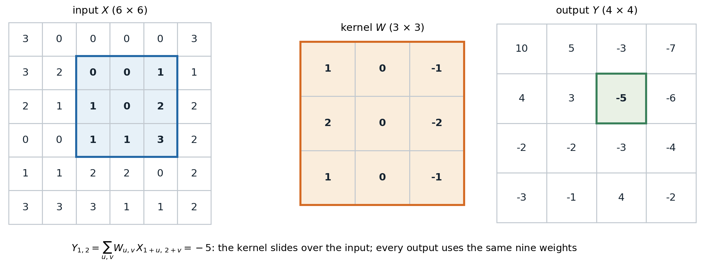
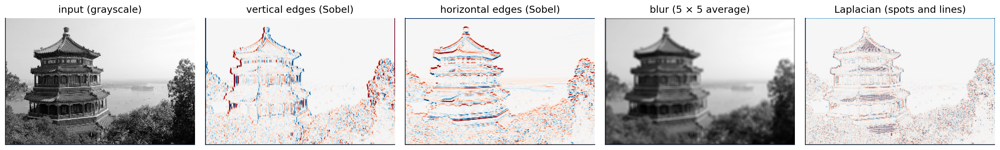
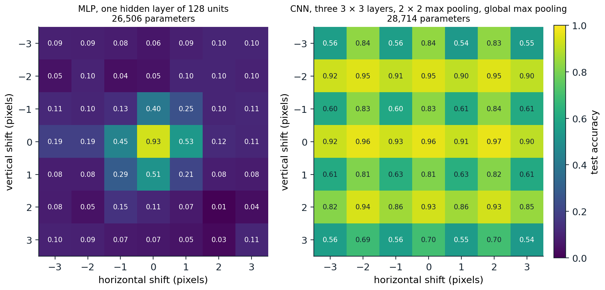
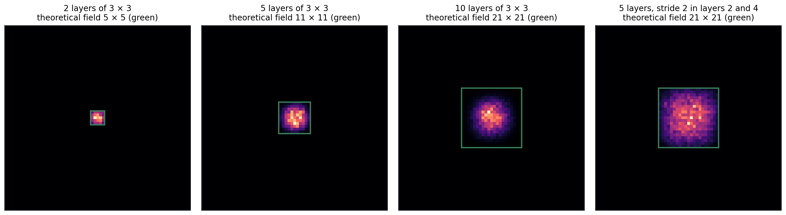

[Background Notes](../README.md) › [Deep Learning](README.md)

# 6. Convolutional Networks

[← 5. Regularization and Generalization in Deep Networks](05-regularization-and-generalization-in-deep-networks.md) · [7. Convolutional Architectures and Transfer Learning →](07-convolutional-architectures-and-transfer-learning.md)

## <a id="why-convolution"></a>Why convolution

### <a id="structure-a-fully-connected-layer-ignores"></a>Structure a fully connected layer ignores

An image is a grid of pixels, each with a few color channels. A fully connected layer treats it as an unordered vector: permuting the pixels, consistently for all images, changes nothing about what the layer can learn. It also scales badly. A $`224\times224`$ color image has 150,528 inputs, so a single fully connected layer with 1,000 units has 150 million weights, and each weight is tied to one pixel position, so a pattern learned in one corner must be learned again in every other place.

Natural images have structure that a better layer can exploit:

- **Locality.** Nearby pixels are strongly related, distant ones weakly. Edges, textures, and parts of objects are local patterns.
- **Stationarity.** The same local patterns occur anywhere in the image. An edge detector useful at one position is useful at all of them.
- **Hierarchy.** Objects are made of parts, parts of motifs, motifs of edges. Features at one scale combine into features at a larger scale.

A **convolutional layer** builds in the first two assumptions: each output depends only on a small neighborhood of the input, and the same weights are used at every position. Stacking such layers, with downsampling between them, builds in the third. The idea goes back to the neocognitron of [Fukushima (1980)](https://doi.org/10.1007/BF00344251), inspired by the simple and complex cells that [Hubel and Wiesel (1962)](https://doi.org/10.1113/jphysiol.1962.sp006837) found in the visual cortex, and to the networks that [LeCun et al. (1989)](https://doi.org/10.1162/neco.1989.1.4.541) trained by backpropagation to read handwritten zip codes. The same assumptions hold for audio (one dimension, time), video (three dimensions), and many scientific signals.

### <a id="the-convolution-operation"></a>The convolution operation

Deep-learning libraries implement **cross-correlation** and call it convolution; the true convolution flips the kernel, which makes no difference for learned weights. For a single-channel input $`X`$ and a $`k\times k`$ kernel $`W`$,

```math
Y_{i,j}=b+\sum_{u=0}^{k-1}\sum_{v=0}^{k-1}W_{u,v}\,X_{i+u,\;j+v}.
```



*One output of a $`3\times3`$ convolution. The highlighted $`3\times3`$ patch of the input is multiplied entrywise by the kernel and summed, giving the highlighted output. Sliding the kernel to every position where it fits produces a $`4\times4`$ output from a $`6\times6`$ input. This kernel responds to horizontal changes in intensity.*

With several channels, each output channel $`o`$ has one kernel per input channel, and the results are summed:

```math
Y_{o,i,j}=b_o+\sum_{c=1}^{C_{\text{in}}}\sum_{u,v}W_{o,c,u,v}\,X_{c,\;i+u,\;j+v}.
```

The weight tensor has shape $`(C_{\text{out}},C_{\text{in}},k,k)`$, independent of the image size: $`C_{\text{out}}(C_{\text{in}}k^2+1)`$ parameters. Each output channel is a **feature map**, the response of one learned detector at every position. Written as a matrix acting on the flattened input, a convolution is a sparse matrix with a banded, repeated (doubly block-Toeplitz) structure: locality makes it sparse and weight sharing makes the nonzero entries repeat. A fully connected layer is the same computation with no constraints.

Classical image processing uses fixed kernels of exactly this kind, and they show what learned first-layer filters tend to look like.



*A photograph convolved with four hand-designed kernels. The Sobel kernels respond to vertical and horizontal intensity edges, with opposite signs on the two sides of an edge (red and blue); averaging over $`5\times5`$ neighborhoods blurs; the Laplacian responds to spots and thin lines. The first layer of a trained image network learns oriented edge and color-contrast detectors of this kind.*

### <a id="padding-stride-and-dilation"></a>Padding, stride, and dilation

Three hyperparameters control the geometry of a convolution. **Padding** adds $`p`$ rows and columns of zeros around the input, so that kernels can be centered on border pixels; $`p=(k-1)/2`$ for odd $`k`$ keeps the size unchanged ("same" padding). **Stride** $`s`$ moves the kernel $`s`$ positions at a time, downsampling the output by a factor $`s`$. **Dilation** $`d`$ spaces the kernel entries $`d`$ positions apart, enlarging the region the kernel covers without adding weights ([Yu and Koltun, 2016](https://arxiv.org/abs/1511.07122)). Along each spatial dimension of size $`n`$,

```math
n_{\text{out}}=\Bigl\lfloor\frac{n+2p-d(k-1)-1}s\Bigr\rfloor+1 .
```

```python
import torch
from torch import nn

def out_size(n, k, s=1, p=0, d=1):
    return (n + 2 * p - d * (k - 1) - 1) // s + 1

x = torch.randn(1, 3, 32, 32)
for k, s, p, d in [(3, 1, 1, 1), (5, 1, 0, 1), (3, 2, 1, 1), (7, 2, 3, 1), (3, 1, 2, 2)]:
    conv = nn.Conv2d(3, 16, k, stride=s, padding=p, dilation=d)
    shape = tuple(conv(x).shape[-2:])
    params = sum(t.numel() for t in conv.parameters())
    print(f"k={k} s={s} p={p} d={d}: output {shape}, formula {out_size(32, k, s, p, d)}; "
          f"parameters {params} = 16 x (3 x {k}^2 + 1)")
# k=3 s=1 p=1 d=1: output (32, 32), formula 32; parameters 448 = 16 x (3 x 3^2 + 1)
# k=5 s=1 p=0 d=1: output (28, 28), formula 28; parameters 1216 = 16 x (3 x 5^2 + 1)
# k=3 s=2 p=1 d=1: output (16, 16), formula 16; parameters 448 = 16 x (3 x 3^2 + 1)
# k=7 s=2 p=3 d=1: output (16, 16), formula 16; parameters 2368 = 16 x (3 x 7^2 + 1)
# k=3 s=1 p=2 d=2: output (32, 32), formula 32; parameters 448 = 16 x (3 x 3^2 + 1)
```

[Dumoulin and Visin (2016)](https://arxiv.org/abs/1603.07285) illustrate every combination of these settings, including the transposed convolutions used for upsampling ([chapter 14](14-detection-and-segmentation.md)).

### <a id="channels-and-1-1-convolutions"></a>Channels and 1 × 1 convolutions

A $`1\times1`$ convolution mixes channels at each position without looking at neighbors: it is a fully connected layer applied independently at every pixel ([Lin, Chen, and Yan, 2014](https://arxiv.org/abs/1312.4400)). It changes the number of channels cheaply and adds a nonlinearity per position, and it appears in almost every modern architecture as a bottleneck or expansion layer ([chapter 7](07-convolutional-architectures-and-transfer-learning.md)).

## <a id="equivariance-pooling-and-invariance"></a>Equivariance, pooling, and invariance

### <a id="translation-equivariance"></a>Translation equivariance

A map $`f`$ is **equivariant** to a transformation $`T`$ if $`f(Tx)=T'f(x)`$ for a corresponding transformation $`T'`$ of the output, and **invariant** if $`f(Tx)=f(x)`$. Convolution is equivariant to translations: shifting the input shifts every feature map by the same amount, because the same weights are applied everywhere. Equivariance is what makes weight sharing sensible: a detector that finds a feature at one position finds it at any position. With zero padding the property fails near the borders; with circular padding it holds exactly, as the code in the next section checks.

Classification needs invariance, not equivariance: the label should not change when the object moves. Networks obtain approximate invariance by pooling. **Max pooling** replaces each $`2\times2`$ block of a feature map by its maximum, **average pooling** by its mean, and **global average pooling** reduces each whole feature map to one number, removing position information entirely before the classifier. Strided convolutions can replace pooling for downsampling ([Springenberg et al., 2015](https://arxiv.org/abs/1412.6806)).

Pooling with stride 2 is not equivariant to shifts by one pixel: the $`2\times2`$ blocks change, and the output is not a shifted copy of the original. Deep networks with several such layers are equivariant only to shifts by multiples of the product of their strides, which is why their outputs can change noticeably when an image moves by a single pixel ([Azulay and Weiss, 2019](https://arxiv.org/abs/1805.12177)). Low-pass filtering before downsampling, as in classical signal processing, reduces this aliasing ([Zhang, 2019](https://arxiv.org/abs/1904.11486)).



*Test accuracy on digits, padded to $`14\times14`$, after shifting every test image by $`(dx,dy)`$ pixels; both networks were trained on unshifted images only. The fully connected network collapses to chance for shifts of two pixels. The convolutional network, with one $`2\times2`$ max pooling and a final global max pooling, is far more robust, and its accuracy has a striped pattern: shifts by even numbers of pixels in both directions, which commute with the pooling, keep accuracy between 0.93 and 0.97, while odd vertical shifts drop it to between 0.54 and 0.84. Odd horizontal shifts cost less on these digits.*

Other symmetries can be built in the same way. **Group-equivariant networks** ([Cohen and Welling, 2016](https://arxiv.org/abs/1602.07576)) share weights across rotations and reflections as well as translations, which helps for data such as microscopy or satellite images, where orientation carries no information. Graph neural networks ([chapter 13](13-graph-neural-networks.md)) apply the same principle to permutations of the nodes of a graph.

## <a id="receptive-fields"></a>Receptive fields

The **receptive field** of a unit is the region of the input that can affect it. A stack of $`L`$ convolutions with $`3\times3`$ kernels and stride 1 has a receptive field of $`(2L+1)\times(2L+1)`$: each layer adds one pixel on each side. Downsampling multiplies the growth: after a stride-2 layer, each further $`3\times3`$ convolution adds two input pixels on each side instead of one. In general, if layer $`l`$ has kernel size $`k_l`$ and stride $`s_l`$,

```math
r_L=1+\sum_{l=1}^L(k_l-1)\prod_{i<l}s_i .
```

Two $`3\times3`$ layers cover the same $`5\times5`$ region as one $`5\times5`$ layer with fewer weights ($`2\cdot9`$ against 25 per channel pair) and an extra nonlinearity, the observation behind the VGG networks of chapter 7.

The theoretical receptive field overstates the region that actually matters. The **effective receptive field**, measured by the gradient of a central output with respect to the input, is concentrated in the middle and decays toward the edges roughly like a Gaussian, whose width grows only with the square root of the depth ([Luo, Li, Urtasun, and Zemel, 2016](https://arxiv.org/abs/1701.04128)). Downsampling enlarges it much more efficiently than extra layers at full resolution.



*Effective receptive fields of random convolutional networks with 16 channels and He initialization: the magnitude of the gradient of the central output with respect to each input pixel, averaged over 20 random networks and inputs. Green squares mark the theoretical receptive fields. With 10 layers the field is $`21\times21`$, but 26% of the gradient mass lies in the central $`5\times5`$ pixels. Five layers with two stride-2 layers reach the same theoretical size and spread the gradient more evenly.*

## <a id="computing-convolutions"></a>Computing convolutions

### <a id="convolution-as-a-matrix-product"></a>Convolution as a matrix product

Libraries rarely compute convolutions by the sliding-window definition. The **im2col** method copies every input patch into a column of a matrix, after which the whole layer is a single matrix product between the reshaped weights and the patch matrix, the operation that hardware accelerates best ([Chetlur et al., 2014](https://arxiv.org/abs/1410.0759)). Fast algorithms based on the Fourier transform or on Winograd's minimal filtering reduce the arithmetic further for particular kernel sizes ([Lavin and Gray, 2016](https://arxiv.org/abs/1509.09308)).

The backward pass consists of convolutions too. The gradient with respect to the input is a **transposed convolution** of the output gradient with the same weights, which spreads each output's gradient back over the patch it came from; the gradient with respect to the weights correlates the input patches with the output gradients. The code below checks the forward identity, the equivariance claims of the previous section, and both gradients.

```python
import torch
from torch import nn
import torch.nn.functional as F

torch.manual_seed(0)
x = torch.randn(2, 3, 10, 10)
W = torch.randn(4, 3, 3, 3)
b = torch.randn(4)

# Convolution as one matrix product: unfold every 3x3x3 patch into a column (im2col).
cols = F.unfold(x, kernel_size=3, padding=1)                   # (2, 27, 100): one column per output position
y_mm = (W.reshape(4, -1) @ cols + b[:, None]).reshape(2, 4, 10, 10)
print("im2col matrix product equals conv2d:", torch.allclose(y_mm, F.conv2d(x, W, b, padding=1), atol=1e-5))

# Translation equivariance: with circular padding, shifting the input shifts the output exactly.
conv = lambda t: F.conv2d(F.pad(t, (1, 1, 1, 1), mode="circular"), W, b)
shift = lambda t, dy, dx: torch.roll(t, shifts=(dy, dx), dims=(2, 3))
print("conv(shift(x)) == shift(conv(x)):", torch.allclose(conv(shift(x, 2, -3)), shift(conv(x), 2, -3), atol=1e-5))

# A stride-2 layer is equivariant only to shifts by multiples of the stride.
down = lambda t: F.max_pool2d(conv(t), 2)
for s in [1, 2]:
    ok = torch.allclose(down(shift(x, s, 0)), shift(down(x), s // 2, 0), atol=1e-5)
    print(f"shift by {s}: pooled output is a shifted copy: {ok}")

# Backward: the gradient with respect to the input is a transposed convolution with the same weights,
# and the gradient with respect to the weights correlates the input patches with the output gradient.
xg = x.clone().requires_grad_()
Wg = W.clone().requires_grad_()
y = F.conv2d(xg, Wg, padding=1)
g = torch.randn_like(y)
y.backward(g)
print("dL/dx is conv_transpose2d(g, W):", torch.allclose(xg.grad, F.conv_transpose2d(g, W, padding=1), atol=1e-4))
dW = torch.einsum("bop,bkp->ok", g.reshape(2, 4, -1), cols).reshape(W.shape)
print("dL/dW from the unfolded patches:", torch.allclose(Wg.grad, dW, atol=1e-4))
# im2col matrix product equals conv2d: True
# conv(shift(x)) == shift(conv(x)): True
# shift by 1: pooled output is a shifted copy: False
# shift by 2: pooled output is a shifted copy: True
# dL/dx is conv_transpose2d(g, W): True
# dL/dW from the unfolded patches: True
```

[Appendix A](#block-dl6-appendix-a) derives the two gradient formulas.

### <a id="the-cost-of-a-convolutional-layer"></a>The cost of a convolutional layer

A convolution with stride 1 on an $`H\times W`$ feature map performs $`HW\,C_{\text{out}}C_{\text{in}}k^2`$ multiply-adds: one per weight per output position. Early layers operate on large maps with few channels, late layers on small maps with many, and architectures balance the two by doubling the channels whenever they halve the resolution, which keeps the cost per layer roughly constant.

A **depthwise-separable convolution** ([Chollet, 2017](https://arxiv.org/abs/1610.02357); [Howard et al., 2017](https://arxiv.org/abs/1704.04861)) factorizes a standard convolution into a **depthwise** convolution, one $`k\times k`$ filter per input channel with no mixing across channels, followed by a **pointwise** $`1\times1`$ convolution that mixes channels. Its cost relative to a standard convolution is $`1/C_{\text{out}}+1/k^2`$.

```python
import torch
from torch import nn

C_in, C_out, k, H, W = 128, 128, 3, 56, 56
standard = nn.Conv2d(C_in, C_out, k, padding=1, bias=False)
separable = nn.Sequential(
    nn.Conv2d(C_in, C_in, k, padding=1, groups=C_in, bias=False),   # depthwise: one k x k filter per channel
    nn.Conv2d(C_in, C_out, 1, bias=False),                          # pointwise: 1 x 1 mixing across channels
)
x = torch.randn(1, C_in, H, W)
assert standard(x).shape == separable(x).shape
p_std = sum(p.numel() for p in standard.parameters())
p_sep = sum(p.numel() for p in separable.parameters())
mult_std = p_std * H * W                                            # one multiply-add per weight per position
mult_sep = p_sep * H * W
print(f"standard 3x3: {p_std:,} weights, {mult_std / 1e6:.0f}M multiply-adds")
print(f"depthwise separable: {p_sep:,} weights, {mult_sep / 1e6:.0f}M multiply-adds")
print(f"ratio {p_sep / p_std:.3f}; formula 1/C_out + 1/k^2 = {1 / C_out + 1 / k ** 2:.3f}")
# standard 3x3: 147,456 weights, 462M multiply-adds
# depthwise separable: 17,536 weights, 55M multiply-adds
# ratio 0.119; formula 1/C_out + 1/k^2 = 0.119
```

The saving, about a factor of eight for $`3\times3`$ kernels, is what makes convolutional networks practical on phones. Arithmetic is not the whole cost, however: depthwise convolutions do little work per byte of memory moved, and on accelerators they often run far below peak throughput ([chapter 11](11-training-at-scale-and-efficient-inference.md)).

## <a id="what-the-layers-learn"></a>What the layers learn

Visualizations of trained image networks confirm the hierarchy the architecture was designed for. First-layer filters are oriented edge and color-contrast detectors resembling Gabor functions. Units in intermediate layers respond to textures and simple shapes, and units in late layers to object parts and whole objects ([Zeiler and Fergus, 2014](https://arxiv.org/abs/1311.2901); [Olah, Mordvintsev, and Schubert, 2017](https://distill.pub/2017/feature-visualization/)). Because late-layer features are general-purpose descriptions of images, a network trained on one large dataset can be reused for many others, the basis of transfer learning in [chapter 7](07-convolutional-architectures-and-transfer-learning.md). Interpreting what individual units compute, and how reliable such interpretations are, belongs to the Safety and Frontier module.

UDL chapter 10, DLB chapter 9, UMich lecture 7, UNIGE sections 4.4 and 4.5, and the CS231n notes, listed in the [reading plan](reading-plan.md#6-convolutional-networks), cover convolutional layers.

## <a id="appendices"></a>Appendices


<details>
<summary><a id="block-dl6-appendix-a"></a><b>A. Gradients of a convolutional layer</b></summary>


Consider one input channel and one output channel with stride 1 and no padding; channels and padding add sums and zeros without changing the argument. The forward map is $`Y_{i,j}=\sum_{u,v}W_{u,v}X_{i+u,j+v}`$. Let $`G_{i,j}=\partial\ell/\partial Y_{i,j}`$.

**Weights.** Each weight multiplies one input entry at every output position, so

```math
\frac{\partial\ell}{\partial W_{u,v}}=\sum_{i,j}G_{i,j}\,X_{i+u,\,j+v},
```

the cross-correlation of the input with the output gradient. In im2col form, where column $`(i,j)`$ of the patch matrix holds the patch under output $`(i,j)`$, this is the product of the gradient row vector with the transposed patch matrix, as in the code.

**Input.** Entry $`X_{a,b}`$ contributes to every output $`Y_{i,j}`$ with $`i+u=a`$ and $`j+v=b`$ for some kernel position $`(u,v)`$, so

```math
\frac{\partial\ell}{\partial X_{a,b}}=\sum_{u,v}W_{u,v}\,G_{a-u,\,b-v},
```

with $`G`$ taken as zero outside its range. This is a true convolution (with the kernel flipped relative to the forward cross-correlation) of the zero-padded output gradient with $`W`$, which is exactly what a transposed convolution computes. In matrix form, if the forward pass is $`y=Mx`$ for the structured matrix $`M`$, the backward pass is $`M^\top g`$, which explains the name.

**Strides.** With stride $`s`$, the forward pass keeps every $`s`$-th output. The input gradient is then the transposed convolution with stride $`s`$: the output gradient is spread back with $`s-1`$ zeros inserted between its entries, which is also how transposed convolutions upsample by a factor $`s`$.

</details>

---

[← 5. Regularization and Generalization in Deep Networks](05-regularization-and-generalization-in-deep-networks.md) · [7. Convolutional Architectures and Transfer Learning →](07-convolutional-architectures-and-transfer-learning.md)
