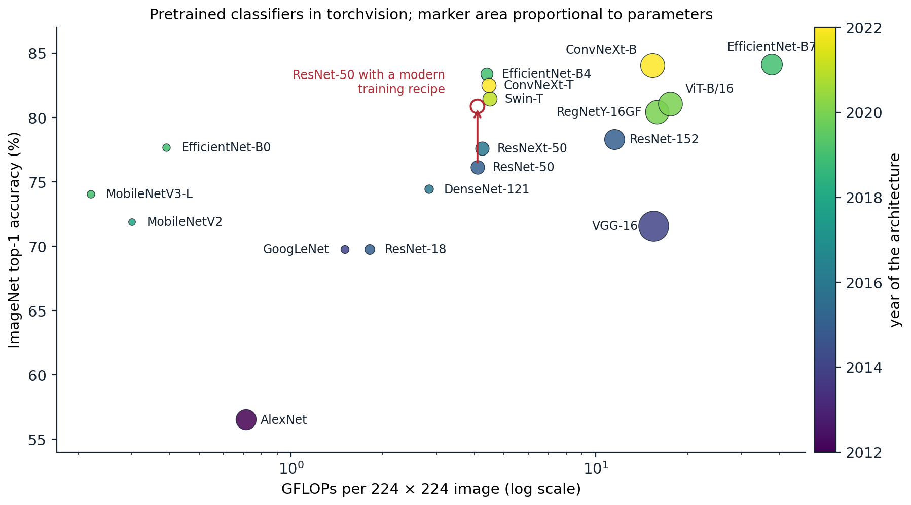
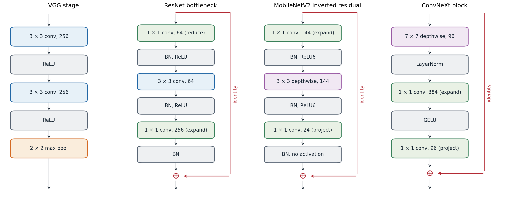

[Background Notes](../README.md) › [Deep Learning](README.md)

# 7. Convolutional Architectures and Transfer Learning

[← 6. Convolutional Networks](06-convolutional-networks.md) · [8. Recurrent Networks →](08-recurrent-networks.md)

## <a id="a-decade-of-architectures"></a>A decade of architectures

### <a id="from-lenet-to-alexnet"></a>From LeNet to AlexNet

The layers of chapter 6 can be assembled in many ways. The history of the ImageNet classification benchmark, 1.28 million training images in 1,000 classes, is largely a history of better arrangements, and the design ideas it produced are used far beyond image classification.

**LeNet-5** ([LeCun, Bottou, Bengio, and Haffner, 1998](https://doi.org/10.1109/5.726791)) established the template: alternating convolution and subsampling layers that turn a $`32\times32`$ digit into a small stack of feature maps, followed by fully connected layers. It had about 60,000 parameters and read handwritten digits and checks in production.

**AlexNet** ([Krizhevsky, Sutskever, and Hinton, 2012](https://papers.nips.cc/paper/2012/hash/c399862d3b9d6b76c8436e924a68c45b-Abstract.html)) scaled the template to ImageNet: five convolutional layers and three fully connected layers with 61 million parameters, trained on two GPUs. It combined ReLU activations, dropout in the fully connected layers, and data augmentation by crops, flips, and color perturbations, and won the 2012 competition with a top-5 error of 15.3%, against 26.2% for the next entry. Most of the ingredients were known; the combination with GPU training at scale was new, and it changed computer vision within two years.

### <a id="depth-with-small-kernels"></a>Depth with small kernels

**VGG** ([Simonyan and Zisserman, 2015](https://arxiv.org/abs/1409.1556)) asked how far a uniform design could go: only $`3\times3`$ convolutions with stride 1, grouped into five stages separated by $`2\times2`$ max pooling, with the number of channels doubling from 64 to 512. Two stacked $`3\times3`$ layers see a $`5\times5`$ region with fewer weights and an extra nonlinearity (chapter 6), and the 16- and 19-layer versions improved substantially on AlexNet. VGG-16 has 138 million parameters, most of them in its first fully connected layer, and needs about 15 billion multiply-add operations (GFLOPs, as conventionally reported) per image.

### <a id="multiple-branches-and-bottlenecks"></a>Multiple branches and bottlenecks

**GoogLeNet** ([Szegedy et al., 2015](https://arxiv.org/abs/1409.4842)) reached similar accuracy with 6.6 million parameters. Its **Inception module** applies $`1\times1`$, $`3\times3`$, and $`5\times5`$ convolutions and a pooling operation in parallel and concatenates the results, letting the network combine features at several scales; $`1\times1`$ convolutions reduce the number of channels before the expensive branches. It replaced the large fully connected layers with global average pooling, which removed most of the parameters.

### <a id="residual-networks"></a>Residual networks

**ResNet** ([He, Zhang, Ren, and Sun, 2016](https://arxiv.org/abs/1512.03385)) introduced the residual connections of chapter 4 and made depth cheap. Its deeper versions use a **bottleneck block**: a $`1\times1`$ convolution reduces the channels by a factor of four, a $`3\times3`$ convolution operates on the reduced representation, and a second $`1\times1`$ convolution expands it again before the addition. ResNet-50 has a stem (a $`7\times7`$ convolution with stride 2 and a max pooling), four stages of 3, 4, 6, and 3 bottleneck blocks with 256 to 2,048 output channels, and global average pooling followed by one linear layer; it has 25.6 million parameters and needs about 4 GFLOPs per image. It remains the most common reference architecture for vision.

Several refinements followed. **ResNeXt** ([Xie et al., 2017](https://arxiv.org/abs/1611.05431)) splits the $`3\times3`$ convolution into many groups, which adds capacity at constant cost. **DenseNet** ([Huang et al., 2017](https://arxiv.org/abs/1608.06993)) concatenates every earlier feature map within a stage instead of adding. **Squeeze-and-excitation** blocks ([Hu, Shen, and Sun, 2018](https://arxiv.org/abs/1709.01507)) compute a weight for each channel from its global average and rescale the channels, an early form of attention.

### <a id="efficient-networks"></a>Efficient networks

For phones and embedded devices, the budget is a few hundred million operations per image. **MobileNetV2** ([Sandler et al., 2018](https://arxiv.org/abs/1801.04381)) builds on the depthwise-separable convolutions of chapter 6 with an **inverted residual** block: a $`1\times1`$ convolution expands a narrow representation by a factor of six, a $`3\times3`$ depthwise convolution filters each channel, and a $`1\times1`$ convolution projects back to the narrow width, with no activation after the projection because a ReLU on a low-dimensional representation destroys information. The residual connection joins the narrow ends.

**EfficientNet** ([Tan and Le, 2019](https://arxiv.org/abs/1905.11946)) asked how to scale a network once a good small one is found. Increasing only depth, only width, or only input resolution each saturates. **Compound scaling** multiplies all three together, with depth $`\alpha^\phi`$, width $`\beta^\phi`$, and resolution $`\gamma^\phi`$, where the constants satisfy $`\alpha\beta^2\gamma^2\approx2`$ so that each unit increase of $`\phi`$ roughly doubles the cost ([Appendix A](#block-dl7-appendix-a)). The base network, EfficientNet-B0, was itself found by **neural architecture search**, an automated search over block types and sizes ([Zoph and Le, 2017](https://arxiv.org/abs/1611.01578)).

### <a id="convolutional-networks-after-transformers"></a>Convolutional networks after transformers

In 2020 vision transformers (chapter 9) matched convolutional networks when trained on large datasets, and hierarchical variants such as the Swin transformer surpassed them. **ConvNeXt** ([Liu et al., 2022](https://arxiv.org/abs/2201.03545)) then showed that much of the gap came from training recipes and design details rather than from attention. Starting from ResNet-50, it adopted, one change at a time, a transformer-style training recipe (AdamW, long schedules, heavy augmentation), a "patchify" stem that cuts the image into $`4\times4`$ patches, $`7\times7`$ depthwise convolutions, an inverted bottleneck, fewer activation and normalization layers, LayerNorm instead of batch normalization, and GELU. The result is a pure convolutional network that matches Swin transformers of the same size.



*ImageNet top-1 accuracy against computation per image for classifiers with pretrained weights in torchvision 0.29, colored by year of the architecture. Accuracy rose from 56.5% (AlexNet) to about 84% (EfficientNet-B7, ConvNeXt-B), while MobileNetV2 exceeds AlexNet's accuracy by 15 points with less than half of its computation and a seventeenth of its parameters. The red arrow marks the same ResNet-50 architecture trained with a modern recipe, which raises its accuracy from 76.1% to 80.9%.*

The red arrow carries a lesson that the architecture papers often obscured: the training recipe matters as much as the architecture. Longer training with better augmentation, label smoothing, mixup, stochastic depth, exponential moving averages of the weights, and a cosine schedule lifts ResNet-50 by almost five points ([Wightman, Touvron, and Jégou, 2021](https://arxiv.org/abs/2110.00476); [Bello et al., 2021](https://arxiv.org/abs/2103.07579)). Comparisons between architectures are meaningful only when both are trained with comparable care.



*Four building blocks, with channel counts from representative stages. A VGG stage stacks $`3\times3`$ convolutions before pooling. A ResNet bottleneck reduces the channels with a $`1\times1`$ convolution, filters with a $`3\times3`$ convolution, expands again, and adds the input. A MobileNetV2 block does the opposite: it expands a narrow representation, filters each channel separately, and projects back without a final activation. A ConvNeXt block uses a large depthwise kernel, one LayerNorm, and a transformer-like expansion by a factor of four.*

## <a id="design-principles"></a>Design principles

Across these architectures a small set of principles recurs.

- **Stages.** A network is a sequence of stages. Each begins by halving the spatial resolution, by a strided convolution or pooling, and doubling the channels, which keeps the computation per layer roughly constant while the receptive field grows. The first layers, the **stem**, reduce the resolution aggressively, since full-resolution computation is expensive.
- **Residual blocks with normalization.** Almost every architecture after 2016 is a stack of residual blocks, each containing normalization and a small number of convolutions.
- **Bottlenecks and factorization.** $`1\times1`$ convolutions change the width cheaply; depthwise and grouped convolutions separate spatial filtering from channel mixing.
- **A light head.** Global average pooling followed by one linear layer replaces large fully connected layers, reducing the parameter count and making the network applicable to inputs of any size.
- **Balanced scaling.** Depth, width, and resolution are increased together.

Convolutional networks embody strong assumptions of locality and translation equivariance, which make them efficient learners from moderate amounts of data. Transformers assume less and need more data or stronger augmentation to reach the same accuracy, but they scale further and combine easily with other modalities; chapter 9 returns to this trade-off.

## <a id="transfer-learning"></a>Transfer learning

### <a id="pretrained-features"></a>Pretrained features

A network trained on a large, diverse dataset learns features that are useful far beyond its training task. The penultimate-layer activations of an ImageNet classifier, fed to a linear classifier, were competitive with specialized methods on many vision tasks as early as 2014 ([Donahue et al., 2014](https://arxiv.org/abs/1310.1531); [Razavian et al., 2014](https://arxiv.org/abs/1403.6382)). [Yosinski, Clune, Bengio, and Lipson (2014)](https://arxiv.org/abs/1411.1792) measured how transferable each layer is by copying the first $`k`$ layers of a trained network into a network for a different set of classes: early layers, which compute edges and textures, transfer almost perfectly, while the last layers are specific to the original classes. Networks that are more accurate on ImageNet generally transfer better ([Kornblith, Shlens, and Le, 2019](https://arxiv.org/abs/1805.08974)), with exceptions: regularizers such as label smoothing, which make penultimate features cluster tightly by class (chapter 5), produce worse fixed features.

### <a id="linear-probes-and-fine-tuning"></a>Linear probes and fine-tuning

There are two standard ways to reuse a pretrained network for a new task, with a new output layer in both cases.

- **Feature extraction**, or a **linear probe**: freeze the pretrained layers and train only the new head. It is cheap, needs few labeled examples, and preserves the pretrained representation exactly; it is also the standard way to evaluate representations (chapter 10).
- **Fine-tuning**: initialize from the pretrained weights and train all layers on the new task, usually with a smaller learning rate than for training from scratch and a larger one for the new head. It generally gives the best accuracy when the target data are not tiny.

Fine-tuning can distort the pretrained features: early in training the randomly initialized head sends large, noisy gradients into the backbone, which can reduce robustness to distribution shifts that the original features handled well. Training the head first with the backbone frozen, and then fine-tuning everything, avoids this ([Kumar et al., 2022](https://arxiv.org/abs/2202.10054)).

The mechanics in PyTorch are short, but two details are easy to get wrong: a frozen backbone with batch normalization must also be kept in evaluation mode, or its running statistics will drift toward the new data even though no weight changes; and different learning rates are set with parameter groups.

```python
import torch
from torch import nn

torch.manual_seed(0)
backbone = nn.Sequential(nn.Conv2d(3, 16, 3, padding=1), nn.BatchNorm2d(16), nn.ReLU(),
                         nn.Conv2d(16, 32, 3, padding=1), nn.BatchNorm2d(32), nn.ReLU(),
                         nn.AdaptiveAvgPool2d(1), nn.Flatten())
model = nn.Sequential(backbone, nn.Linear(32, 1000))        # stands in for a network pretrained on 1,000 classes

# 1. Replace the head for a new task with 5 classes.
model[1] = nn.Linear(32, 5)

# 2. Linear probe: freeze every backbone parameter and keep its normalization statistics fixed.
for p in backbone.parameters():
    p.requires_grad_(False)
trainable = [p for p in model.parameters() if p.requires_grad]
print("trainable parameters:", sum(p.numel() for p in trainable), "of", sum(p.numel() for p in model.parameters()))

before = {k: v.clone() for k, v in backbone.state_dict().items()}
opt = torch.optim.SGD(trainable, lr=0.1)
x, y = torch.randn(64, 3, 16, 16) + 2.0, torch.randint(0, 5, (64,))    # target data with a different mean
model.train()
backbone.eval()                                              # BatchNorm must not update its running statistics
for _ in range(5):
    opt.zero_grad()
    nn.functional.cross_entropy(model(x), y).backward()
    opt.step()
same = all(torch.equal(before[k], v) for k, v in backbone.state_dict().items())
print("backbone weights and BatchNorm statistics unchanged:", same)

# 3. Full fine-tuning: unfreeze, with a smaller learning rate for the pretrained layers than for the new head.
for p in backbone.parameters():
    p.requires_grad_(True)
opt = torch.optim.AdamW([{"params": backbone.parameters(), "lr": 1e-4},
                         {"params": model[1].parameters(), "lr": 1e-3}], weight_decay=0.01)
print("learning rates per parameter group:", [g["lr"] for g in opt.param_groups])
# trainable parameters: 165 of 5349
# backbone weights and BatchNorm statistics unchanged: True
# learning rates per parameter group: [0.0001, 0.001]
```

Inputs must be preprocessed exactly as during pretraining, with the same resolution and the same channel means and standard deviations; a mismatch silently degrades the features. Assigning learning rates that increase from the first to the last layer, **discriminative fine-tuning**, is a refinement introduced for language models ([Howard and Ruder, 2018](https://arxiv.org/abs/1801.06146)).

### <a id="when-pretraining-helps"></a>When pretraining helps

Pretraining helps most when the target dataset is small and similar in kind to the pretraining data. With enough target data and training time, networks trained from scratch can match pretrained ones on tasks such as object detection, although pretraining still shortens training considerably ([He, Girshick, and Dollár, 2019](https://arxiv.org/abs/1811.08883)). When the target domain is far from natural photographs, as with medical images or satellite spectra, the gains shrink and in-domain pretraining matters more. Pretraining on larger datasets increases the gains, especially with few labeled examples ([Kolesnikov et al., 2020](https://arxiv.org/abs/1912.11370)), and pretraining without labels, the subject of chapter 10, removes the need for a large labeled source dataset altogether. The same pattern of large-scale pretraining followed by adaptation defines the language models of the NLP and LLMs module.

UMich lectures 8 and 11 and UNIGE sections 8.1, 8.2, and 8.5, listed in the reading plan, cover architectures and transfer; the PyTorch transfer-learning tutorial linked there fine-tunes a pretrained ResNet-18.

## <a id="appendices"></a>Appendices


<details>
<summary><a id="block-dl7-appendix-a"></a><b>A. Counting the cost of convolutional blocks</b></summary>


A convolution with $`k\times k`$ kernels from $`C_{\text{in}}`$ to $`C_{\text{out}}`$ channels has $`C_{\text{out}}C_{\text{in}}k^2`$ weights, ignoring biases, and on an $`H\times W`$ output performs one multiply-add per weight per position.

**Bottleneck against basic block.** Consider a block operating at 256 channels. Two $`3\times3`$ convolutions from 256 to 256 channels have $`2\cdot256\cdot256\cdot9=1{,}179{,}648`$ weights. The bottleneck block has a $`1\times1`$ convolution from 256 to 64 channels ($`16{,}384`$ weights), a $`3\times3`$ convolution from 64 to 64 ($`36{,}864`$), and a $`1\times1`$ convolution from 64 to 256 ($`16{,}384`$), a total of $`69{,}632`$, about 17 times fewer. This saving is what allowed ResNets to grow to 50–152 layers at moderate cost.

**Compound scaling.** For a fixed block design, the cost of a network scales linearly with its depth (the number of layers), quadratically with its width (since each layer's cost is proportional to $`C_{\text{in}}C_{\text{out}}`$), and quadratically with the input resolution (the number of positions $`HW`$). Multiplying depth by $`\alpha^\phi`$, width by $`\beta^\phi`$, and resolution by $`\gamma^\phi`$ therefore multiplies the cost by $`(\alpha\beta^2\gamma^2)^\phi`$. EfficientNet chose $`\alpha=1.2`$, $`\beta=1.1`$, $`\gamma=1.15`$ by a small grid search at $`\phi=1`$, which gives $`\alpha\beta^2\gamma^2\approx1.92`$, so that each step in $`\phi`$ roughly doubles the cost; B1 to B7 correspond to increasing $`\phi`$.

</details>

---

[← 6. Convolutional Networks](06-convolutional-networks.md) · [8. Recurrent Networks →](08-recurrent-networks.md)
