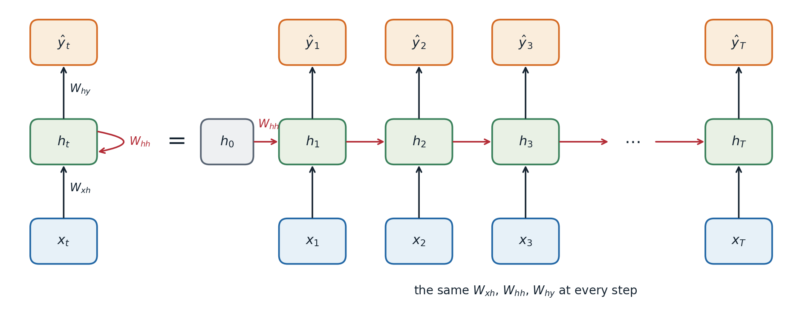
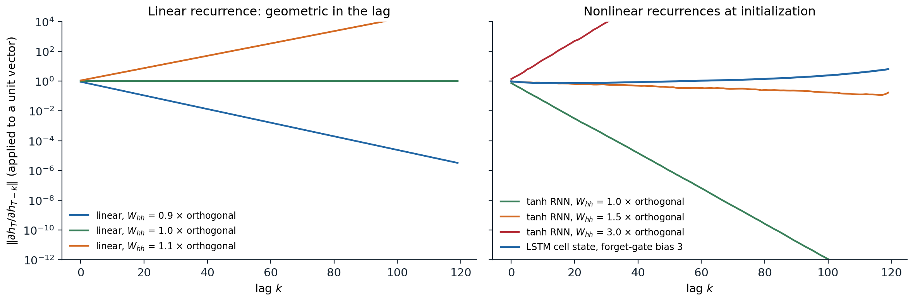
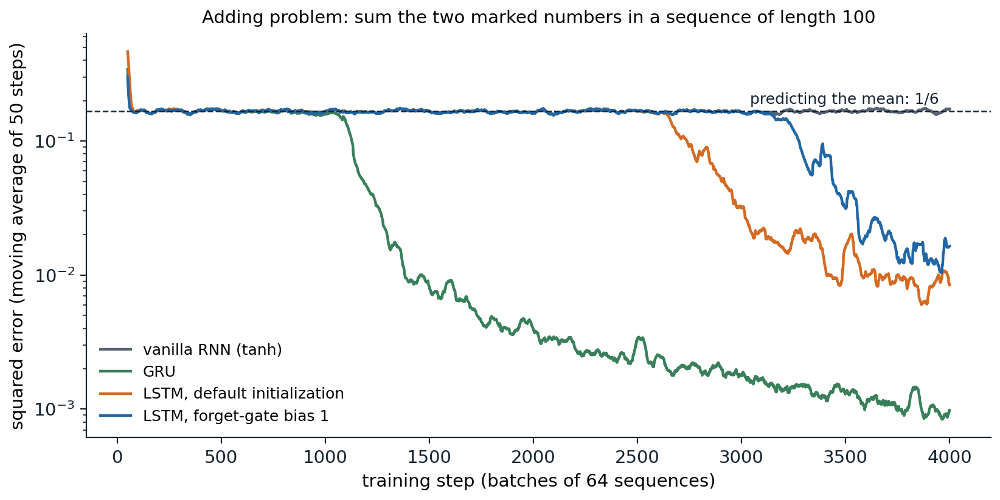

[Background Notes](../README.md) › [Deep Learning](README.md)

# 8. Recurrent Networks

[← 7. Convolutional Architectures and Transfer Learning](07-convolutional-architectures-and-transfer-learning.md) · [9. Attention and Transformers →](09-attention-and-transformers.md)

## <a id="sequences-and-shared-weights"></a>Sequences and shared weights

### <a id="sequence-tasks"></a>Sequence tasks

Many inputs are sequences: sentences, speech, sensor readings, prices, genomes, the frames of a video. Their lengths vary, and their elements depend on each other across positions. The tasks come in a few shapes:

- **many to one**: classify a whole sequence, such as a sentence's sentiment or an ECG trace;
- **many to many, aligned**: label every element, as in tagging each word with its part of speech or each audio frame with a phoneme;
- **sequence to sequence**: map one sequence to another of different length, as in translation or summarization;
- **generation**: predict each element from the previous ones, which defines a probability distribution over sequences.

A fully connected network needs a fixed input size. A one-dimensional convolutional network (chapter 6) handles any length but sees only a window as wide as its receptive field. A **recurrent neural network** (RNN) instead maintains a state that summarizes everything seen so far and updates it one element at a time, with the same weights at every step.

### <a id="the-recurrent-update"></a>The recurrent update

A simple (Elman) RNN ([Elman, 1990](https://doi.org/10.1207/s15516709cog1402_1)) computes, for inputs $`x_1,\ldots,x_T`$,

```math
h_t=\tanh\bigl(W_{hh}h_{t-1}+W_{xh}x_t+b\bigr),\qquad\hat y_t=W_{hy}h_t+c,
```

starting from a state $`h_0`$, usually zero. The hidden state $`h_t\in\mathbb R^H`$ is the network's memory. **Unrolling** the recurrence over the length of a particular sequence turns it into a deep feedforward network with one layer per time step, in which every layer shares the same weights.



*A recurrent network, folded (left) and unrolled over a sequence of length $`T`$ (right). The unrolled network is a deep network whose depth is the sequence length, with the same weights in every step.*

Weight sharing across time is to sequences what weight sharing across positions is to images: the number of parameters, $`H(d_{\text{in}}+H)`$ plus biases, does not depend on the sequence length, and a pattern learned at one position applies at every other. The code below writes the recurrence as a loop and checks it against PyTorch's `nn.RNN`.

```python
import torch
from torch import nn

torch.manual_seed(0)
d_in, H, T, B = 3, 5, 7, 2
rnn = nn.RNN(d_in, H, batch_first=True)                   # tanh recurrence
x = torch.randn(B, T, d_in)

# The same computation written as a loop over time with shared weights.
W_xh, W_hh = rnn.weight_ih_l0, rnn.weight_hh_l0
b = rnn.bias_ih_l0 + rnn.bias_hh_l0
h, outs = torch.zeros(B, H), []
for t in range(T):
    h = torch.tanh(x[:, t] @ W_xh.T + h @ W_hh.T + b)
    outs.append(h)
ours = torch.stack(outs, 1)
theirs, h_last = rnn(x)
print("loop matches nn.RNN:", torch.allclose(ours, theirs, atol=1e-6), torch.allclose(h, h_last[0], atol=1e-6))
print("parameters:", sum(p.numel() for p in rnn.parameters()), "= H(d_in + H) + 2H, for any sequence length")

# Backpropagation through time: the gradient reaching h_1 from a loss on h_T is a product of
# T - 1 Jacobians diag(1 - h_t^2) W_hh.
h0 = torch.zeros(1, H)
xs = torch.randn(1, T, d_in)
states = [h0]
for t in range(T):
    states.append(torch.tanh(xs[:, t] @ W_xh.T + states[-1] @ W_hh.T + b))
g = torch.randn(1, H)
(auto,) = torch.autograd.grad((states[-1] * g).sum(), states[1])
J = torch.eye(H)
for t in range(T, 1, -1):                                  # d h_t / d h_{t-1}, from the top down
    J = J @ (torch.diag(1 - states[t][0] ** 2) @ W_hh)
print("product of Jacobians matches autograd:", torch.allclose(g @ J, auto, atol=1e-6))
# loop matches nn.RNN: True True
# parameters: 50 = H(d_in + H) + 2H, for any sequence length
# product of Jacobians matches autograd: True
```

(PyTorch keeps two bias vectors, one for each matrix, which is why the count has $`2H`$ rather than $`H`$; only their sum matters.)

## <a id="backpropagation-through-time"></a>Backpropagation through time

### <a id="gradients-over-many-steps"></a>Gradients over many steps

Training an RNN is ordinary backpropagation on the unrolled network, called **backpropagation through time** (BPTT; [Werbos, 1990](https://doi.org/10.1109/5.58337)). The loss is usually a sum over time steps, and because the weights are shared, the gradient of each weight matrix is a sum of contributions from every step. The contribution of an input at time $`t`$ to a loss at time $`T`$ passes through the chain of state Jacobians

```math
\frac{\partial h_T}{\partial h_t}=\prod_{k=t+1}^{T}\frac{\partial h_k}{\partial h_{k-1}}=\prod_{k=t+1}^{T}\operatorname{diag}\bigl(1-h_k^2\bigr)\,W_{hh},
```

which the code above verifies. This is the product-of-Jacobians problem of chapter 2 with two aggravations: the same matrix $`W_{hh}`$ appears in every factor, and the depth equals the sequence length, often hundreds or thousands of steps. If the largest singular value of $`W_{hh}`$ times the largest activation derivative is below 1, the product shrinks geometrically in the lag $`T-t`$, and if the relevant eigenvalues exceed 1 it can grow geometrically ([Bengio, Simard, and Frasconi, 1994](https://doi.org/10.1109/72.279181); [Pascanu, Mikolov, and Bengio, 2013](https://arxiv.org/abs/1211.5063); [Appendix A](#block-dl8-appendix-a)).



*Norm of $`\partial h_T/\partial h_{T-k}`$ applied to random unit vectors, for recurrences with 64 hidden units driven by random inputs. Left: a linear recurrence with orthogonal weights scaled by 0.9, 1.0, or 1.1 multiplies the gradient by exactly that factor per step. Right: a tanh RNN with orthogonal weights of scale 1 loses a factor of $`10^{12}`$ over 100 steps, because $`\tanh'<1`$; at scale 1.5 the saturation and the larger weights roughly balance; at scale 3 the gradient explodes. The cell state of an LSTM whose forget gates start near 1 passes gradients back almost unchanged.*

Vanishing gradients mean that the network cannot learn dependencies over long gaps: the signal linking an early input to a late error is buried under the contributions of recent steps. Exploding gradients produce sudden huge updates. The standard remedy for the second is **gradient clipping** (Foundations chapter 3), which rescales the gradient whenever its norm exceeds a threshold and was introduced for RNNs for this reason. The first requires a change of architecture.

### <a id="truncated-backpropagation-through-time"></a>Truncated backpropagation through time

For very long sequences, such as a text corpus treated as one stream, BPTT over the whole sequence is too expensive. **Truncated BPTT** processes the sequence in chunks of, say, 100 steps, carrying the hidden state forward across chunk boundaries but not backpropagating through them (`h = h.detach()` in PyTorch). The network can still use information from earlier chunks through its state, but it cannot learn to store it on the basis of gradients from more than one chunk ahead.

## <a id="gated-recurrent-units"></a>Gated recurrent units

### <a id="long-short-term-memory"></a>Long short-term memory

The **long short-term memory** (LSTM) network of [Hochreiter and Schmidhuber (1997)](https://doi.org/10.1162/neco.1997.9.8.1735), with the forget gate added by [Gers, Schmidhuber, and Cummins (2000)](https://doi.org/10.1162/089976600300015015), adds a second state, the **cell** $`c_t`$, which is updated additively and controlled by multiplicative **gates**:

```math
\begin{aligned}
i_t&=\sigma(W_ix_t+U_ih_{t-1}+b_i), & f_t&=\sigma(W_fx_t+U_fh_{t-1}+b_f), & o_t&=\sigma(W_ox_t+U_oh_{t-1}+b_o),\\
g_t&=\tanh(W_gx_t+U_gh_{t-1}+b_g), & c_t&=f_t\odot c_{t-1}+i_t\odot g_t, & h_t&=o_t\odot\tanh(c_t).
\end{aligned}
```

The **input gate** $`i_t`$ decides how much of the candidate $`g_t`$ to write, the **forget gate** $`f_t`$ how much of the old cell to keep, and the **output gate** $`o_t`$ how much of the cell to expose. The key is the cell update. Its Jacobian with respect to the previous cell, along the direct path, is the diagonal matrix $`\operatorname{diag}(f_t)`$: when the forget gates are near 1, the gradient passes back through many steps without shrinking, just as through the identity path of a residual network (chapter 4). The network learns when to open and close this path. Initializing the forget-gate bias to a positive value, such as 1, makes remembering the default at the start of training ([Jozefowicz, Zaremba, and Sutskever, 2015](https://proceedings.mlr.press/v37/jozefowicz15.html)).

```python
import torch
from torch import nn

torch.manual_seed(0)
d_in, H, T, B = 4, 6, 9, 3
lstm = nn.LSTM(d_in, H, batch_first=True)
x = torch.randn(B, T, d_in)

W, U = lstm.weight_ih_l0, lstm.weight_hh_l0                 # shapes (4H, d_in) and (4H, H)
b = lstm.bias_ih_l0 + lstm.bias_hh_l0
h, c = torch.zeros(B, H), torch.zeros(B, H)
forget = []
for t in range(T):
    z = x[:, t] @ W.T + h @ U.T + b
    i, f, g, o = z.chunk(4, dim=1)                          # PyTorch's gate order: input, forget, cell, output
    i, f, o, g = torch.sigmoid(i), torch.sigmoid(f), torch.sigmoid(o), torch.tanh(g)
    c = f * c + i * g                                       # additive update of the cell state
    h = o * torch.tanh(c)
    forget.append(f)
out, (h_T, c_T) = lstm(x)
print("hand-written LSTM matches nn.LSTM:", torch.allclose(h, h_T[0], atol=1e-6), torch.allclose(c, c_T[0], atol=1e-6))
print(f"mean forget gate at initialization: {torch.stack(forget).mean().item():.2f}")
print("parameters:", sum(p.numel() for p in lstm.parameters()), "= 4 x (H(d_in + H) + 2H)")
# hand-written LSTM matches nn.LSTM: True True
# mean forget gate at initialization: 0.43
# parameters: 288 = 4 x (H(d_in + H) + 2H)
```

With PyTorch's default initialization the forget gates start near one half, so the cell state initially forgets half of itself at every step; a positive forget-gate bias is set by hand, as in the gradient figure above.

### <a id="the-gated-recurrent-unit"></a>The gated recurrent unit

The **gated recurrent unit** (GRU; [Cho et al., 2014](https://arxiv.org/abs/1406.1078)) merges the cell and hidden state and uses two gates:

```math
z_t=\sigma(W_zx_t+U_zh_{t-1}),\quad r_t=\sigma(W_rx_t+U_rh_{t-1}),\quad \tilde h_t=\tanh\bigl(W_hx_t+U_h(r_t\odot h_{t-1})\bigr),\quad h_t=(1-z_t)\odot h_{t-1}+z_t\odot\tilde h_t .
```

The **update gate** $`z_t`$ interpolates between keeping the old state and writing the candidate, playing the roles of both the input and the forget gate; the **reset gate** $`r_t`$ controls how much of the old state enters the candidate. With three weight matrices instead of four, GRUs are cheaper, and large comparisons found no consistent winner between GRUs and LSTMs across tasks ([Chung et al., 2014](https://arxiv.org/abs/1412.3555); [Greff et al., 2017](https://arxiv.org/abs/1503.04069)).

### <a id="learning-long-range-dependencies"></a>Learning long-range dependencies

The **adding problem** ([Hochreiter and Schmidhuber, 1997](https://doi.org/10.1162/neco.1997.9.8.1735)) isolates long-range memory. Each input is a sequence of random numbers in $`[0,1]`$ with a second channel marking two positions, one in each half; the target is the sum of the two marked numbers. Predicting the constant 1 gives a squared error of $`1/6`$, the variance of the sum, so any error below that requires carrying a number across tens of steps.



*Training on the adding problem with sequences of length 100, 64 hidden units, Adam, and gradient clipping. The vanilla RNN never leaves the plateau at $`1/6`$ in 4,000 steps. The GRU escapes after about 1,100 steps and reaches an error of 0.001. The LSTMs escape later, after 2,600 and 3,200 steps, and reach about 0.01. The escape from the plateau is abrupt, and its timing varies between runs and initializations.*

The long plateau is typical of long-range tasks: until the network happens to store the marked numbers, the gradient carries little information about how to do so, and progress then comes suddenly. Gated units make such learning possible within a practical budget, not easy.

## <a id="architectures-and-training"></a>Architectures and training

### <a id="stacking-bidirectionality-and-encoderdecoder-models"></a>Stacking, bidirectionality, and encoder–decoder models

RNNs are combined in a few standard ways. **Stacked** RNNs feed the state sequence of one layer as the input sequence of the next, typically two to four layers. **Bidirectional** RNNs ([Schuster and Paliwal, 1997](https://doi.org/10.1109/78.650093)) run one RNN forward and another backward over the sequence and concatenate their states, so each position's representation depends on the whole sequence; they suit tagging and classification, but not generation, where the future is unknown.

For sequence-to-sequence tasks, an **encoder–decoder** model ([Sutskever, Vinyals, and Le, 2014](https://arxiv.org/abs/1409.3215); [Cho et al., 2014](https://arxiv.org/abs/1406.1078)) reads the input with an encoder RNN, passes its final state to a decoder RNN, and generates the output one element at a time, feeding each generated element back as the next input. During training the decoder is usually given the true previous element instead of its own prediction, which is called **teacher forcing**. It makes training parallel over output positions and stable, at the cost of a mismatch between training and generation, where the model must condition on its own possibly erroneous outputs (**exposure bias**; [Bengio, Vinyals, Jaitly, and Shazeer, 2015](https://arxiv.org/abs/1506.03099)).

Squeezing an entire input sentence into one fixed-size vector is a bottleneck: translation quality of early encoder–decoder models dropped for long sentences. **Attention** lets the decoder look back at all encoder states at every step, which removed the bottleneck and led to the transformer (chapter 9).

### <a id="practical-details"></a>Practical details

- **Variable lengths.** Sequences in a batch are padded to a common length, and the padded positions are masked out of the loss; PyTorch's `pack_padded_sequence` skips them in the recurrence itself.
- **Regularization.** Dropout applied only between layers, not on the recurrent connections, works well ([Zaremba, Sutskever, and Vinyals, 2014](https://arxiv.org/abs/1409.2329)); dropping the same units at every time step also on the recurrent path is a principled alternative ([Gal and Ghahramani, 2016](https://arxiv.org/abs/1512.05287)). Layer normalization inside the recurrence stabilizes training (chapter 4).
- **Initialization.** Orthogonal recurrent weights (chapter 2) and identity initialization for ReLU RNNs ([Le, Jaitly, and Hinton, 2015](https://arxiv.org/abs/1504.00941)) preserve gradient norms at the start of training.
- **Sequential computation.** Each step depends on the previous one, so an RNN cannot be parallelized over time during training. This, more than accuracy, is why transformers displaced RNNs for large-scale training.

Language modeling with RNNs, including character-level text generation ([Graves, 2013](https://arxiv.org/abs/1308.0850); [Karpathy, 2015](https://karpathy.github.io/2015/05/21/rnn-effectiveness/)), is developed in the NLP and LLMs module.

## <a id="beyond-classical-recurrence"></a>Beyond classical recurrence

Two alternatives avoid the sequential bottleneck. **Temporal convolutional networks** stack causal, dilated one-dimensional convolutions, so each output depends only on past inputs within a receptive field that doubles with each layer; they match or beat RNNs on many sequence benchmarks ([Bai, Kolter, and Koltun, 2018](https://arxiv.org/abs/1803.01271); [van den Oord et al., 2016](https://arxiv.org/abs/1609.03499)). Transformers replace recurrence with attention (chapter 9).

A third line keeps recurrence but makes it **linear**. If the state update is $`h_t=Ah_{t-1}+Bx_t`$ with output $`y_t=Ch_t`$, the whole output is a causal convolution of the input with the kernel $`K_k=CA^kB`$, which can be computed in parallel over the sequence during training, while generation can still proceed step by step with constant memory. Because composing two affine updates gives another affine update, the states can also be computed by a **parallel prefix scan** in $`O(\log T)`$ sequential rounds ([Martin and Cundy, 2018](https://arxiv.org/abs/1709.04057)). **Structured state-space models** such as S4 ([Gu, Goel, and Ré, 2022](https://arxiv.org/abs/2111.00396)) parameterize $`A`$ so that long convolution kernels remain stable and cheap; **linear recurrent units** ([Orvieto et al., 2023](https://arxiv.org/abs/2303.06349)) show that a diagonal complex $`A`$ with eigenvalues near the unit circle suffices; and **Mamba** ([Gu and Dao, 2023](https://arxiv.org/abs/2312.00752)) makes $`A`$, $`B`$, and $`C`$ depend on the input, which restores the ability to select what to remember and makes these models competitive with transformers on language.

```python
import torch

torch.manual_seed(0)
N, T = 4, 64                                                  # state size, sequence length
a = torch.rand(N) * 0.5 + 0.45                                # diagonal transition, entries in (0.45, 0.95)
Bv, C = torch.randn(N), torch.randn(N)
x = torch.randn(T)

# Recurrent form: h_t = a * h_{t-1} + B x_t,  y_t = C . h_t   (T sequential steps)
h, y_rec = torch.zeros(N), []
for t in range(T):
    h = a * h + Bv * x[t]
    y_rec.append(C @ h)
y_rec = torch.stack(y_rec)

# Convolutional form: y = K * x with kernel K_k = C . (a^k B)   (all outputs at once)
K = (C * Bv * a ** torch.arange(T)[:, None]).sum(1)
y_conv = torch.stack([(K[:t + 1].flip(0) * x[:t + 1]).sum() for t in range(T)])
print("recurrence equals causal convolution:", torch.allclose(y_rec, y_conv, atol=1e-5))

# Scan form: the pairs (a, b) compose associatively, (a1, b1) then (a2, b2) = (a2 a1, a2 b1 + b2),
# so the states can be computed by a parallel prefix scan in O(log T) sequential rounds.
A, Bx = a.repeat(T, 1), Bv * x[:, None]                     # element t: h -> a h + B x_t
shift = 1
while shift < T:                                            # Hillis-Steele inclusive scan
    A_new, B_new = A.clone(), Bx.clone()
    A_new[shift:] = A[shift:] * A[:-shift]
    B_new[shift:] = A[shift:] * Bx[:-shift] + Bx[shift:]
    A, Bx, shift = A_new, B_new, 2 * shift
print("parallel scan gives the same states:", torch.allclose(Bx @ C, y_rec, atol=1e-5), "; rounds:", (T - 1).bit_length())
# recurrence equals causal convolution: True
# parallel scan gives the same states: True ; rounds: 6
```

The linear recurrence gives up the nonlinearity in the state update; expressiveness comes from stacking such layers with nonlinear feedforward layers between them, as in a transformer. Whether state-space models or attention will dominate long-sequence modeling is an open question, and hybrids of the two are common.

DLB chapter 10, UMich lecture 12, and UNIGE sections 12.1 and 12.2, listed in the reading plan, cover recurrent networks; [Olah's essay on LSTMs](https://colah.github.io/posts/2015-08-Understanding-LSTMs/) illustrates the gates.

## <a id="appendices"></a>Appendices


<details>
<summary><a id="block-dl8-appendix-a"></a><b>A. Vanishing and exploding gradients in a simple RNN</b></summary>


Let $`D_k=\operatorname{diag}\bigl(\sigma'(z_k)\bigr)`$ with $`z_k=W_{hh}h_{k-1}+W_{xh}x_k+b`$, so that $`\partial h_k/\partial h_{k-1}=D_kW_{hh}`$.

**Vanishing.** Suppose $`|\sigma'|\le\gamma`$ (for tanh, $`\gamma=1`$; for the logistic sigmoid, $`\gamma=1/4`$). Then $`\|D_kW_{hh}\|_2\le\gamma\,s_{\max}(W_{hh})`$, where $`s_{\max}`$ is the largest singular value, and by submultiplicativity

```math
\Bigl\|\frac{\partial h_T}{\partial h_t}\Bigr\|_2\le\bigl(\gamma\,s_{\max}(W_{hh})\bigr)^{T-t}.
```

If $`\gamma\,s_{\max}(W_{hh})<1`$, the gradient from time $`T`$ to time $`t`$ vanishes exponentially in the lag, whatever the inputs. This is the sufficient condition of [Pascanu, Mikolov, and Bengio (2013)](https://arxiv.org/abs/1211.5063).

**Exploding.** For a linear recurrence, $`D_k=I`$ and $`\partial h_T/\partial h_t=W_{hh}^{T-t}`$. If $`W_{hh}`$ has an eigenvalue $`\lambda`$ with $`|\lambda|>1`$ and the backpropagated vector has a component along the corresponding left eigenvector, that component grows like $`|\lambda|^{T-t}`$. For a nonlinear recurrence, a necessary condition for explosion is $`\gamma\,s_{\max}(W_{hh})>1`$; whether it happens depends on how often the units operate in their linear range.

**The LSTM cell path.** Along the direct path from $`c_{t-1}`$ to $`c_t`$, the Jacobian is $`\operatorname{diag}(f_t)`$, so $`\prod_k\operatorname{diag}(f_k)`$ multiplies the gradient on this path coordinate by coordinate. It neither explodes, since $`0<f_k<1`$, nor vanishes as long as the network keeps the relevant forget gates close to 1. The full Jacobian adds terms through the gates' dependence on $`h_{t-1}`$, but the direct path guarantees that long-range gradients can survive.

</details>

---

[← 7. Convolutional Architectures and Transfer Learning](07-convolutional-architectures-and-transfer-learning.md) · [9. Attention and Transformers →](09-attention-and-transformers.md)
