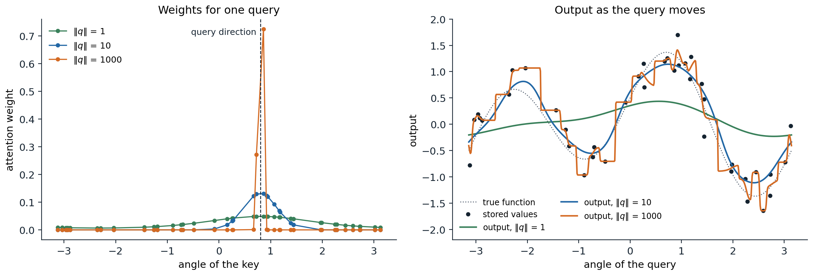
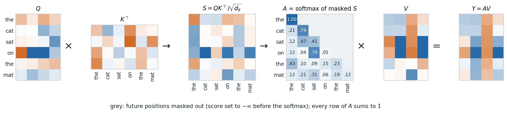
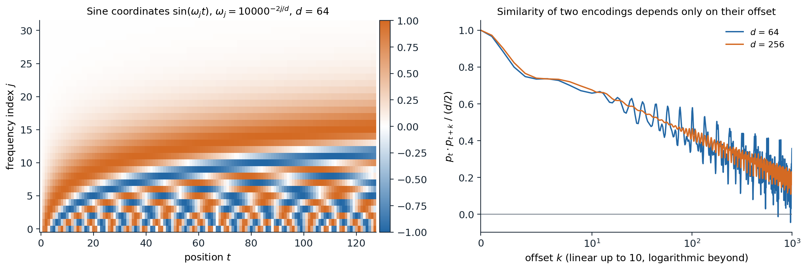
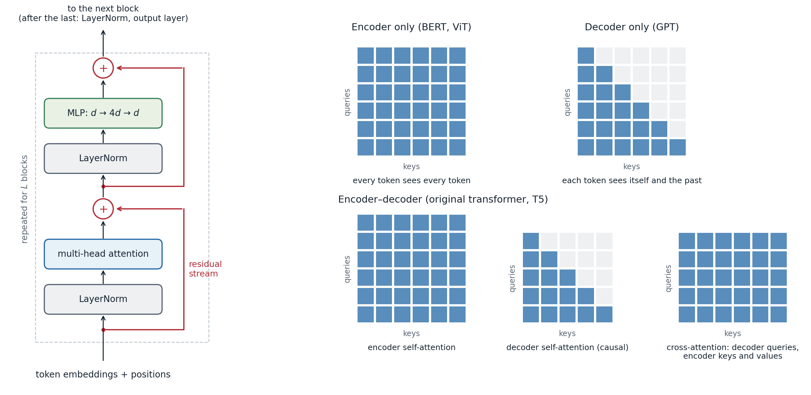
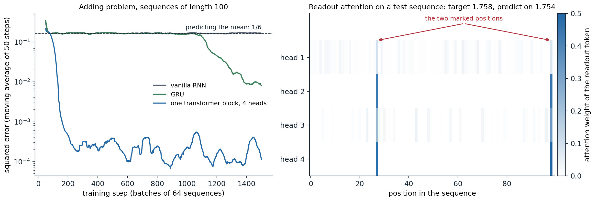
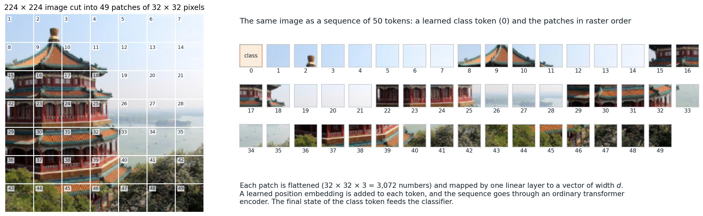

[ML Mastery Notes](../README.md) › [Deep Learning](README.md)

# 9. Attention and Transformers

[← 8. Recurrent Networks](08-recurrent-networks.md) · [10. Self-Supervised Representation Learning →](10-self-supervised-representation-learning.md)

## <a id="attention-as-a-differentiable-lookup"></a>Attention as a differentiable lookup

### <a id="soft-lookup"></a>Soft lookup

A dictionary lookup compares a **query** with a set of **keys** and returns the **value** stored under the key that matches. Attention makes this differentiable: it compares the query with every key, turns the similarity scores $`s_i=s(q,k_i)`$ into weights with a softmax, and returns the weighted average of the values,

$$
\operatorname{attend}(q;\,k_{1:n},v_{1:n})=\sum_{i=1}^n\alpha_i v_i,\qquad \alpha_i=\frac{\exp s_i}{\sum_{j}\exp s_j}.
$$

The weights are positive and sum to one, so the output is a convex combination of the values, and every weight depends smoothly on the query and the keys. When one score is much larger than the others the lookup is nearly hard; when the scores are similar, it averages.

This is the Nadaraya–Watson estimator of ML chapter 17 with the keys as inputs and the values as responses. With a Gaussian kernel of unit bandwidth, the weights are proportional to $`\exp(-\|q-k_i\|^2/2)=\exp(q^\top k_i)\exp(-\|q\|^2/2)\exp(-\|k_i\|^2/2)`$. The factor involving $`q`$ alone cancels in the normalization, and if all keys have the same norm, so does the last factor, leaving $`\alpha_i\propto\exp(q^\top k_i)`$: **dot-product attention with keys of equal norm is kernel smoothing with a Gaussian kernel**, and the norm of the query plays the role of an inverse bandwidth.



*Dot-product attention over 40 keys on the unit circle, each storing a noisy value of a smooth function. Left: the weights for one query direction. With a query of norm 1 the weights are nearly uniform; with norm 10 they form a bump about 0.3 radians wide; with norm 1,000 almost all weight goes to the two nearest keys. Right: the output as the query direction moves. A small query norm averages everything and oversmooths, a moderate one gives a smooth fit, and a large one approaches a nearest-neighbor lookup, a step function through the stored values.*

The difference from kernel smoothing is that in a network the queries, keys, and values are all computed from data by learned maps, so the network learns both what to compare and what to retrieve. Attention also appeared as a read operation on an external memory in neural Turing machines ([Graves, Wayne, and Danihelka, 2014](https://arxiv.org/abs/1410.5401)), and a single attention step is the update rule of a modern Hopfield network, an associative memory with exponentially many stable patterns ([Ramsauer et al., 2021](https://arxiv.org/abs/2008.02217)).

### <a id="attention-in-encoderdecoder-models"></a>Attention in encoder–decoder models

Attention entered deep learning to remove the bottleneck of recurrent encoder–decoder models (chapter 8), which compressed an entire source sentence into the final encoder state. [Bahdanau, Cho, and Bengio (2015)](https://arxiv.org/abs/1409.0473) kept all encoder states $`h_1,\ldots,h_n`$ and, at every output step $`t`$, let the decoder state $`s_{t-1}`$ query them:

$$
e_{ti}=w^\top\tanh(W s_{t-1}+Uh_i),\qquad \alpha_{ti}=\frac{\exp e_{ti}}{\sum_j\exp e_{tj}},\qquad c_t=\sum_i\alpha_{ti}h_i .
$$

The context vector $`c_t`$ is fed into the decoder together with the previous output word. The scores come from a small MLP ("additive" attention); [Luong, Pham, and Manning (2015)](https://arxiv.org/abs/1508.04025) found that the cheaper bilinear score $`s_{t}^\top W h_i`$ works as well. Translation quality degraded much less with sentence length, and the matrix of weights $`\alpha_{ti}`$ turned out to be a soft alignment between target and source words, learned without any alignment supervision. The same mechanism let an image captioning model attend to different regions of a convolutional feature map as it generated each word ([Xu et al., 2015](https://arxiv.org/abs/1502.03044)).

### <a id="scaled-dot-product-attention"></a>Scaled dot-product attention

Collect $`m`$ queries as the rows of $`Q\in\mathbb R^{m\times d_k}`$, $`n`$ keys as the rows of $`K\in\mathbb R^{n\times d_k}`$, and the corresponding values as the rows of $`V\in\mathbb R^{n\times d_v}`$. **Scaled dot-product attention** ([Vaswani et al., 2017](https://arxiv.org/abs/1706.03762)) computes all lookups at once with two matrix products:

$$
\operatorname{Attention}(Q,K,V)=\operatorname{softmax}\!\Bigl(\frac{QK^\top}{\sqrt{d_k}}\Bigr)V,
$$

where the softmax is applied to each row of the $`m\times n`$ score matrix. Row $`i`$ of the result is the lookup for query $`i`$. The division by $`\sqrt{d_k}`$ keeps the scores in a range where the softmax is not saturated. If the coordinates of a query and a key are independent with mean zero and variance one, their dot product has variance $`d_k`$; unscaled, the scores of wide heads would be so spread out that the softmax would put nearly all weight on one key, where its gradient with respect to the scores vanishes ([Appendix A](#block-dl9-appendix-a)).

```python
import torch

def jacobian_norm(p):
    """Frobenius norm of the softmax Jacobian diag(p) - p p^T, averaged over queries."""
    J = torch.diag_embed(p) - p[:, :, None] * p[:, None, :]
    return J.norm(dim=(1, 2)).mean()

torch.manual_seed(0)
print("unscaled -> scaled by 1/sqrt(d_k), for 100 keys per query")
for d in (16, 64, 256, 1024):
    q = torch.randn(200, 1, d)                        # 200 queries with independent N(0, 1) coordinates
    k = torch.randn(200, 100, d)                      # 100 keys for each query
    s = (q * k).sum(-1)                               # dot products, shape (200, 100)
    p_raw, p_scaled = torch.softmax(s, -1), torch.softmax(s / d ** 0.5, -1)
    print(f"d_k = {d:4d}: variance of scores {s.var():6.1f} -> {(s / d ** 0.5).var():.2f};"
          f" largest weight {p_raw.max(-1).values.mean():.2f} -> {p_scaled.max(-1).values.mean():.2f};"
          f" Jacobian norm {jacobian_norm(p_raw):.2f} -> {jacobian_norm(p_scaled):.2f}")
# unscaled -> scaled by 1/sqrt(d_k), for 100 keys per query
# d_k =   16: variance of scores   16.0 -> 1.00; largest weight 0.56 -> 0.08; Jacobian norm 0.28 -> 0.15
# d_k =   64: variance of scores   65.1 -> 1.02; largest weight 0.76 -> 0.08; Jacobian norm 0.23 -> 0.15
# d_k =  256: variance of scores  257.0 -> 1.00; largest weight 0.89 -> 0.08; Jacobian norm 0.14 -> 0.15
# d_k = 1024: variance of scores 1019.6 -> 1.00; largest weight 0.95 -> 0.08; Jacobian norm 0.06 -> 0.15
```

Without scaling, the largest weight approaches one as $`d_k`$ grows and the Jacobian that carries gradients back to the scores shrinks; with scaling, the behavior at initialization does not depend on the width of the head. The softmax is computed stably by subtracting the largest score first, as in Foundations chapter 6.

## <a id="self-attention"></a>Self-attention

### <a id="queries-keys-and-values-from-the-same-sequence"></a>Queries, keys, and values from the same sequence

In **self-attention** a sequence attends to itself. The input is a matrix $`X\in\mathbb R^{T\times d}`$ whose rows are the $`T`$ tokens, each a vector of width $`d`$, and three learned matrices produce the queries, keys, and values of every token:

$$
Q=XW_Q,\quad K=XW_K,\quad V=XW_V,\qquad Y=\operatorname{softmax}\!\Bigl(\frac{QK^\top}{\sqrt{d_k}}+M\Bigr)V .
$$

Output $`y_i`$ is a mixture of the values of all tokens, with weights determined by how well token $`i`$'s query matches each token's key. The $`T\times T`$ weight matrix $`A`$ is computed from the input, so unlike a convolution kernel or a recurrent weight matrix, the pattern of interaction between positions changes from one input to the next. The matrix $`M`$ holds a **mask**: $`M_{ij}=0`$ where token $`i`$ may attend to token $`j`$ and $`-\infty`$ where it may not, which sets the corresponding weights to exactly zero.



*Causal self-attention on six tokens with random weights, $`d=8`$ and $`d_k=4`$. The score matrix compares every query with every key; the mask removes the future, so the first token can only attend to itself; each row of the weight matrix $`A`$ is a distribution over the visible tokens; and each output row is the corresponding mixture of value rows.*

### <a id="masks"></a>Masks

Two masks are common.

- A **causal mask** ($`M_{ij}=-\infty`$ for $`j>i`$) lets each position attend only to itself and earlier positions. It is used whenever the model predicts each token from the previous ones, as in language models and the decoder of a translation model. Because output $`i`$ does not depend on later inputs, a causal model can be trained on all positions of a sequence in parallel, with one forward pass computing the predictions for every prefix; this is the attention analogue of teacher forcing in chapter 8.
- A **padding mask** hides the padded positions of shorter sequences in a batch, so that no real token attends to them.

### <a id="multiple-heads"></a>Multiple heads

A single softmax produces one mixture per position, but a token may need information of several kinds at once, from different places: the subject of its verb, the previous occurrence of the same word, the preceding token. **Multi-head attention** runs $`H`$ attention operations in parallel, each with its own projections of width $`d_k=d/H`$, concatenates their outputs, and mixes them with an output matrix $`W_O\in\mathbb R^{d\times d}`$:

$$
\operatorname{head}_h=\operatorname{softmax}\!\Bigl(\frac{XW_Q^h(XW_K^h)^\top}{\sqrt{d_k}}+M\Bigr)XW_V^h,\qquad \operatorname{MHA}(X)=\bigl[\operatorname{head}_1,\ldots,\operatorname{head}_H\bigr]W_O .
$$

The four $`d\times d`$ matrices give $`4d^2`$ parameters, whatever $`H`$ and $`T`$. Writing $`W_O`$ in blocks $`W_O^h`$ of $`d_k`$ rows shows that $`\operatorname{MHA}(X)=\sum_hA_hXW_V^hW_O^h`$: each head applies its own attention pattern $`A_h`$ and moves information through its own low-rank linear map $`W_V^hW_O^h`$, and the heads' contributions add. This decomposition, with the attention pattern determined by the bilinear form $`W_Q^h(W_K^h)^\top`$, is the starting point of mechanistic interpretability of transformers ([Elhage et al., 2021](https://transformer-circuits.pub/2021/framework/index.html)).

The code below writes multi-head self-attention out with the weights of PyTorch's `nn.MultiheadAttention` and checks two structural properties.

```python
import torch
from torch import nn

torch.manual_seed(0)
B, T, d, h = 2, 5, 16, 4                                   # batch, tokens, width, heads
mha = nn.MultiheadAttention(d, h, batch_first=True)
x = torch.randn(B, T, d)

def self_attention(x, mask=None):
    """Multi-head self-attention written out with the weights of mha."""
    W_q, W_k, W_v = mha.in_proj_weight.chunk(3)            # each (d, d)
    b_q, b_k, b_v = mha.in_proj_bias.chunk(3)
    split = lambda z: z.view(B, T, h, d // h).transpose(1, 2)        # (B, h, T, d/h)
    q, k, v = split(x @ W_q.T + b_q), split(x @ W_k.T + b_k), split(x @ W_v.T + b_v)
    s = q @ k.transpose(-2, -1) / (d // h) ** 0.5          # (B, h, T, T) scores
    if mask is not None:
        s = s.masked_fill(mask, float("-inf"))             # True marks a hidden position
    y = torch.softmax(s, dim=-1) @ v                       # (B, h, T, d/h)
    y = y.transpose(1, 2).reshape(B, T, d)                 # concatenate the heads
    return mha.out_proj(y)

ours = self_attention(x)
theirs, _ = mha(x, x, x)
print("matches nn.MultiheadAttention:", torch.allclose(ours, theirs, atol=1e-6))

perm = torch.randperm(T)
print("permuting the tokens permutes the outputs:", torch.allclose(self_attention(x[:, perm]), ours[:, perm], atol=1e-6))

causal = torch.triu(torch.ones(T, T, dtype=torch.bool), diagonal=1)    # hide the future
x2 = x.clone()
x2[:, 3:] = torch.randn(B, T - 3, d)                                   # change the last two tokens
same = torch.allclose(self_attention(x, causal)[:, :3], self_attention(x2, causal)[:, :3], atol=1e-6)
print("with a causal mask, outputs 0-2 ignore tokens 3-4:", same)
print("parameters:", sum(p.numel() for p in mha.parameters()), "= 4 d^2 + 4 d")
# matches nn.MultiheadAttention: True
# permuting the tokens permutes the outputs: True
# with a causal mask, outputs 0-2 ignore tokens 3-4: True
# parameters: 1088 = 4 d^2 + 4 d
```

The second check is **permutation equivariance**: for any permutation matrix $`P`$, $`\operatorname{MHA}(PX)=P\operatorname{MHA}(X)`$, because permuting the tokens permutes the rows and columns of every score matrix, the row-wise softmax commutes with that, and $`PAP^\top PV=PAV`$. Without a mask or positional information, self-attention treats its input as a set. In practice PyTorch's `torch.nn.functional.scaled_dot_product_attention` performs the core computation and dispatches to fused kernels (described below) when they are available.

### <a id="attention-recurrence-and-convolution"></a>Attention, recurrence, and convolution

The three ways of mixing information across positions trade off differently ([Vaswani et al., 2017](https://arxiv.org/abs/1706.03762)). For a sequence of length $`T`$ and width $`d`$:

| Layer | Operations per layer | Sequential steps | Longest path between two positions |
| --- | --- | --- | --- |
| Self-attention | $`O(T^2d)`$ | $`O(1)`$ | $`O(1)`$ |
| Recurrent | $`O(Td^2)`$ | $`O(T)`$ | $`O(T)`$ |
| Convolution, kernel width $`k`$ | $`O(kTd^2)`$ | $`O(1)`$ | $`O(T/k)`$, or $`O(\log_kT)`$ with dilation |

Attention connects every pair of positions in one layer, so the gradient between an output and a distant input passes through one step instead of up to $`T`$, and all positions are computed in parallel. The price is the $`T\times T`$ score matrix: its cost grows quadratically with the length, and its memory, if stored, grows the same way. For a layer with an MLP of width $`4d`$, a forward pass costs about $`24Td^2`$ floating-point operations in the projections and the MLP and $`4T^2d`$ in the scores and the weighted sum, so the quadratic part dominates once $`T`$ exceeds $`6d`$.

## <a id="positional-information"></a>Positional information

### <a id="absolute-position-encodings"></a>Absolute position encodings

Permutation equivariance is wrong for sequences: "dog bites man" and "man bites dog" should differ. The simplest remedy adds a vector $`p_t`$ depending on the position to each token's embedding before the first layer. [Vaswani et al. (2017)](https://arxiv.org/abs/1706.03762) used fixed **sinusoidal encodings**, with pairs of coordinates oscillating at geometrically spaced frequencies,

$$
p_{t,2j}=\sin(\omega_jt),\qquad p_{t,2j+1}=\cos(\omega_jt),\qquad \omega_j=10000^{-2j/d},\qquad j=0,\ldots,d/2-1 .
$$

Low coordinates change quickly with the position and high ones slowly, like the digits of a clock with hands of many speeds. For each frequency, the pair $`(p_{t+k,2j},p_{t+k,2j+1})`$ is the pair at position $`t`$ rotated by the angle $`\omega_jk`$, so $`p_{t+k}`$ is a fixed linear function of $`p_t`$ for every offset $`k`$, and the dot product $`p_t^\top p_{t+k}=\sum_j\cos(\omega_jk)`$ depends only on the offset. BERT and GPT-2 instead learned one vector per position, which works as well within the trained length but gives no representation for longer sequences.



*Left: the sine coordinates of the sinusoidal encoding for the first 128 positions with $`d=64`$. The fastest pair completes a cycle every $`2\pi`$ positions; the slowest barely moves over 128 positions. Right: the normalized dot product of the encodings of two positions as a function of their offset. It is 1 at offset 0, decreases with the offset, and oscillates; with more coordinates the oscillations average out.*

### <a id="relative-position-encodings"></a>Relative position encodings

Language and images have approximate translation symmetry: the relation between two tokens depends more on how far apart they are than on where they are. **Relative** schemes build the offset $`j-i`$ into the attention scores instead of adding positions to the input.

- [Shaw, Uszkoreit, and Vaswani (2018)](https://arxiv.org/abs/1803.02155) learned an embedding for each clipped offset and added it to the keys; T5 ([Raffel et al., 2020](https://arxiv.org/abs/1910.10683)) simplified this to a learned scalar bias for each head and each bucket of offsets, added to the score.
- **ALiBi** ([Press, Smith, and Lewis, 2022](https://arxiv.org/abs/2108.12409)) subtracts a fixed penalty $`m_h(i-j)`$ proportional to the distance, with a different slope $`m_h`$ for each head, which biases heads toward recent tokens at different ranges and extrapolates to sequences longer than those seen in training.
- **Rotary position embeddings** (RoPE; [Su et al., 2021](https://arxiv.org/abs/2104.09864)) rotate each coordinate pair $`j`$ of the query and the key at position $`t`$ by the angle $`\omega_jt`$, with the frequencies of the sinusoidal encoding. Because rotations compose, $`(R_mq)^\top(R_nk)=q^\top R_{n-m}k`$: the score depends on the contents and on the offset only ([Appendix B](#block-dl9-appendix-b)). RoPE is the default in current open language models.

```python
import torch

def rope(x, base=10000.0):
    """Rotate each coordinate pair (2j, 2j+1) of the row for position t by the angle t * omega_j."""
    T, d = x.shape
    omega = base ** (-torch.arange(0, d, 2, dtype=x.dtype) / d)           # d/2 frequencies
    angle = torch.arange(T, dtype=x.dtype)[:, None] * omega                # (T, d/2)
    cos, sin = angle.cos(), angle.sin()
    out = torch.empty_like(x)
    out[:, 0::2] = x[:, 0::2] * cos - x[:, 1::2] * sin
    out[:, 1::2] = x[:, 0::2] * sin + x[:, 1::2] * cos
    return out

torch.manual_seed(0)
d, T = 64, 50
q, k = torch.randn(d, dtype=torch.float64), torch.randn(d, dtype=torch.float64)
Q, K = rope(q.repeat(T, 1)), rope(k.repeat(T, 1))       # the same query and key placed at every position
S = Q @ K.T                                             # S[m, n]: query at position m, key at position n
constant = all(torch.allclose(S.diagonal(o), S.diagonal(o)[0].expand(T - abs(o))) for o in range(1 - T, T))
print("score depends only on the offset n - m:", constant)
print("rotation leaves norms unchanged:", torch.allclose(Q.norm(dim=1), q.norm().expand(T)))
print("at offset 0 the score is the unrotated q . k:", torch.isclose(S[0, 0], q @ k).item())
# score depends only on the offset n - m: True
# rotation leaves norms unchanged: True
# at offset 0 the score is the unrotated q . k: True
```

A causal mask already breaks the permutation symmetry: the first token sees one token and the last sees all of them, so a causal transformer can infer positions by counting, and decoder-only language models trained without any position encoding perform nearly as well as those with one ([Haviv et al., 2022](https://arxiv.org/abs/2203.16634)). Which encoding lets a model generalize to sequences longer than those seen in training is still studied empirically ([Kazemnejad et al., 2023](https://arxiv.org/abs/2305.19466)); in practice, models are extended to longer contexts by rescaling the RoPE frequencies and briefly training on longer sequences.

## <a id="the-transformer"></a>The transformer

### <a id="the-block"></a>The block

A **transformer** is a stack of identical blocks, each with two sublayers wrapped in residual connections and normalization (chapter 4). In the pre-normalization form used today,

$$
H=X+\operatorname{MHA}\bigl(\operatorname{LN}(X)\bigr),\qquad X'=H+\operatorname{MLP}\bigl(\operatorname{LN}(H)\bigr),
$$

where the MLP is applied to each position independently, typically $`\operatorname{MLP}(z)=W_2\,\phi(W_1z+b_1)+b_2`$ with a hidden width of $`4d`$ and GELU activation (chapter 1). The two sublayers have complementary roles: attention is the only place where positions exchange information, and the MLP, which holds two thirds of the block's parameters, transforms each position's representation separately. The MLP layers behave partly as key–value memories that store associations learned from the training data ([Geva et al., 2021](https://arxiv.org/abs/2012.14913)).



*Left: a pre-normalization transformer block. Each sublayer reads a normalized copy of the residual stream and adds its output back, so an identity path runs from the input embeddings to the output. Right: which queries may attend to which keys in the three families of transformers.*

The residual stream view of chapter 4 is especially natural here. Every attention head and every MLP reads from and writes to a shared vector at each position, and the final representation is the sum of the embeddings and of all sublayer outputs. With position encodings, transformers are universal approximators of continuous sequence-to-sequence functions on compact sets ([Yun et al., 2020](https://arxiv.org/abs/1912.10077)).

Current models change some details of the original design: RMSNorm instead of LayerNorm (chapter 4); gated MLPs such as SwiGLU, $`W_2\bigl(\operatorname{SiLU}(W_1z)\odot W_3z\bigr)`$ with hidden width about $`8d/3`$ to keep the parameter count ([Shazeer, 2020](https://arxiv.org/abs/2002.05202)); RoPE instead of added positions; and no bias vectors.

### <a id="three-families"></a>Three families

The block is used in three configurations, which differ in their masks.

- **Encoder-only** models (BERT, [Devlin et al., 2019](https://arxiv.org/abs/1810.04805); vision transformers) use unmasked self-attention, so every output depends on the whole input. They produce representations for classification, tagging, and retrieval.
- **Decoder-only** models (GPT, [Radford et al., 2019](https://cdn.openai.com/better-language-models/language_models_are_unsupervised_multitask_learners.pdf)) use causal self-attention and are trained to predict each token from the previous ones. They generate text one token at a time, and nearly all large language models have this form.
- **Encoder–decoder** models (the original transformer; T5) encode the input with unmasked self-attention and generate the output with a decoder whose blocks have three sublayers: causal self-attention, **cross-attention**, whose queries come from the decoder and whose keys and values come from the final encoder states, and the MLP. Cross-attention is the attention of the Bahdanau model, with the recurrences replaced by transformer blocks.

How these models are pretrained on text, with masked-token and next-token objectives, is developed in the NLP and LLMs module.

### <a id="a-complete-model-and-its-size"></a>A complete model and its size

The code below builds a decoder-only transformer with the shape of GPT-2 small: 12 blocks of width 768 with 12 heads, a vocabulary of 50,257 tokens, a context of 1,024 positions, learned position embeddings, and an output layer that shares its weights with the token embedding ("weight tying").

```python
import torch
from torch import nn

class Block(nn.Module):
    """Pre-normalization transformer block: x + attention(LN(x)), then x + MLP(LN(x))."""
    def __init__(self, d, heads):
        super().__init__()
        self.ln1, self.ln2 = nn.LayerNorm(d), nn.LayerNorm(d)
        self.attn = nn.MultiheadAttention(d, heads, batch_first=True)
        self.mlp = nn.Sequential(nn.Linear(d, 4 * d), nn.GELU(), nn.Linear(4 * d, d))

    def forward(self, x, mask):
        a = self.ln1(x)
        x = x + self.attn(a, a, a, attn_mask=mask, need_weights=False)[0]
        return x + self.mlp(self.ln2(x))

class GPT(nn.Module):
    """Decoder-only transformer: token and position embeddings, L causal blocks, next-token logits."""
    def __init__(self, vocab, context, d, heads, layers):
        super().__init__()
        self.tok, self.pos = nn.Embedding(vocab, d), nn.Embedding(context, d)
        self.blocks = nn.ModuleList(Block(d, heads) for _ in range(layers))
        self.ln = nn.LayerNorm(d)
        self.head = nn.Linear(d, vocab, bias=False)
        self.head.weight = self.tok.weight                  # tie the output layer to the token embedding

    def forward(self, idx):
        T = idx.shape[1]
        x = self.tok(idx) + self.pos(torch.arange(T))
        mask = torch.triu(torch.ones(T, T, dtype=torch.bool), diagonal=1)
        for block in self.blocks:
            x = block(x, mask)
        return self.head(self.ln(x))                        # (batch, T, vocab) logits

torch.manual_seed(0)
V, C, d, L = 50257, 1024, 768, 12                           # the shape of GPT-2 small
model = GPT(V, C, d, heads=12, layers=L)
n = sum(p.numel() for p in model.parameters())              # tied weights are counted once
print(f"parameters: {n:,}")
print(f"formula L(12 d^2 + 13 d) + (V + C + 2) d: {L * (12 * d * d + 13 * d) + (V + C + 2) * d:,}")
print("in the blocks:", f"{L * (12 * d * d + 13 * d) / n:.0%}", "; logits shape:", tuple(model(torch.randint(V, (1, 8))).shape))
# parameters: 124,439,808
# formula L(12 d^2 + 13 d) + (V + C + 2) d: 124,439,808
# in the blocks: 68% ; logits shape: (1, 8, 50257)
```

Each block has $`4d^2`$ attention weights and $`8d^2`$ MLP weights, plus $`13d`$ biases and normalization parameters, so a model's size is about $`12Ld^2`$ plus the embeddings. This is the published size of GPT-2 small. For large models the embeddings are a small fraction, and the forward pass costs about $`2N`$ floating-point operations per token for $`N`$ non-embedding parameters, one multiply and one add per weight, plus about $`2LTd`$ for the attention scores with a causal mask over a context of $`T`$ tokens ([Kaplan et al., 2020](https://arxiv.org/abs/2001.08361)). Training costs about three times the forward pass, which gives the rule of thumb of $`6N`$ operations per training token used in chapter 11.

### <a id="training-transformers"></a>Training transformers

The original transformer was trained with Adam, a learning rate that rose linearly for 4,000 steps and then decayed like the inverse square root of the step, dropout of 0.1, and label smoothing of 0.1. Its warmup was necessary because of post-normalization (chapter 3). Current recipes use pre-normalization, AdamW with $`\beta_2`$ between 0.95 and 0.98, weight decay of about 0.1 applied to the matrices but not to gains and biases, a short warmup followed by cosine or linear decay, gradient clipping at norm 1, and little or no dropout when the data are plentiful.

Large transformers suffer from specific instabilities. Attention logits can grow during training until the softmax collapses onto single keys, which normalizing queries and keys before the dot product ("QK-norm") prevents ([Dehghani et al., 2023](https://arxiv.org/abs/2302.05442)), and the output logits can drift, which a small penalty on the log normalizer of the output softmax ("z-loss") controls. [Wortsman et al. (2023)](https://arxiv.org/abs/2309.14322) reproduced both failures in small models trained at high learning rates, which makes the remedies testable without large budgets.

### <a id="a-long-range-task"></a>A long-range task

The adding problem of chapter 8, in which a network must sum two marked numbers in a sequence of length 100, took a GRU over a thousand steps to escape its initial plateau. A single transformer block solves it almost at once.



*Left: the adding problem with the same data, optimizer, and gradient clipping as in chapter 8. A transformer block of width 64 with 4 heads, learned position embeddings, and a learned readout token prepended to the sequence reaches an error of 0.001 by step 200 and fluctuates around $`2\times10^{-4}`$ afterwards; the GRU leaves the plateau at $`1/6`$ after about 1,050 steps and reaches 0.009 by step 1,500; the vanilla RNN never leaves it. The transformer has 56,897 parameters, the GRU 13,121. Right: the attention weights of the readout token on a test sequence. Heads 2 and 4 put nearly half their weight on each marked position; the other heads contribute more diffuse patterns.*

Two properties make this easy. The readout token reaches every position in one attention step, so the path from a marked number to the output has length one instead of up to 100, and the gradient that tells the network where to look is available from the first step. And the task needs no order: the sum depends only on the set of (value, marker) pairs, which is what attention computes naturally. Attention is not better at everything: on formal-language tasks that require tracking a state, such as the parity of a bit string, recurrent networks generalize to inputs longer than those seen in training where transformers usually fail ([Delétang et al., 2023](https://arxiv.org/abs/2207.02098)).

## <a id="efficient-attention"></a>Efficient attention

### <a id="exact-attention-with-less-memory"></a>Exact attention with less memory

A naive implementation materializes the $`T\times T`$ score matrix for every head, which for long contexts is far larger than the model: at $`T=32{,}768`$ with 32 heads it would take 69 GB per layer in 16-bit numbers. The softmax, however, does not need all scores at once. Processing the keys in blocks and keeping, for every query, the running maximum of the scores, the running sum of their exponentials, and the running weighted sum of values gives the exact result with memory linear in $`T`$ ([Milakov and Gimelshein, 2018](https://arxiv.org/abs/1805.02867); [Rabe and Staats, 2021](https://arxiv.org/abs/2112.05682); [Appendix C](#block-dl9-appendix-c)). **FlashAttention** ([Dao et al., 2022](https://arxiv.org/abs/2205.14135)) organizes this computation so that each block stays in the fast on-chip memory of a GPU and recomputes the scores in the backward pass instead of storing them; it is exact and, because attention is limited by memory traffic rather than arithmetic, several times faster (chapter 11).

```python
import torch

torch.manual_seed(0)
T, d, tile = 256, 32, 64
q, k, v = torch.randn(3, T, d, dtype=torch.float64).unbind(0)
full = torch.softmax(q @ k.T / d ** 0.5, dim=-1) @ v         # materializes all T x T scores

# Tiled attention: visit the keys in blocks and keep, for every query, a running maximum m,
# a running normalizer l, and a running weighted sum of values acc (the "online softmax").
m = torch.full((T, 1), float("-inf"), dtype=torch.float64)
l = torch.zeros(T, 1, dtype=torch.float64)
acc = torch.zeros(T, d, dtype=torch.float64)
for j in range(0, T, tile):
    s = q @ k[j:j + tile].T / d ** 0.5                        # scores for this block of keys only
    m_new = torch.maximum(m, s.max(dim=-1, keepdim=True).values)
    rescale = torch.exp(m - m_new)                            # correct what was accumulated so far
    p = torch.exp(s - m_new)
    l = l * rescale + p.sum(dim=-1, keepdim=True)
    acc = acc * rescale + p @ v[j:j + tile]
    m = m_new
print("tiled attention equals full attention:", torch.allclose(acc / l, full))
print("scores held at once:", T * tile, "instead of", T * T)

# Causal linear attention: with similarity phi(q) . phi(k) instead of exp(q . k / sqrt(d)),
# the outputs can be computed by a recurrence whose state is a d x d matrix.
phi = lambda z: torch.nn.functional.elu(z) + 1                # a positive feature map
Qf, Kf = phi(q), phi(k)
W = torch.tril(Qf @ Kf.T)                                     # parallel form: T x T weights, masked
parallel = (W @ v) / W.sum(dim=-1, keepdim=True)
S, z, outs = torch.zeros(d, d, dtype=torch.float64), torch.zeros(d, dtype=torch.float64), []
for t in range(T):                                            # recurrent form: constant memory per step
    S, z = S + torch.outer(Kf[t], v[t]), z + Kf[t]
    outs.append(Qf[t] @ S / (Qf[t] @ z))
print("linear attention, recurrence equals parallel form:", torch.allclose(torch.stack(outs), parallel))
# tiled attention equals full attention: True
# scores held at once: 16384 instead of 65536
# linear attention, recurrence equals parallel form: True
```

### <a id="generation-and-the-keyvalue-cache"></a>Generation and the key–value cache

A decoder generates one token at a time, and each new token attends to all previous ones. Their keys and values do not change, so they are stored in a **key–value cache** and each step computes only the new token's query, key, and value. The cost per generated token is then linear in the context length, but the cache grows with it: $`2Ld`$ numbers per token for a model with $`L`$ layers of width $`d`$. For a model with 80 layers of width 8,192, this is 2.6 MB per token in 16-bit numbers, or 86 GB for a context of 32,768 tokens, more than the memory of most accelerators. **Multi-query attention** ([Shazeer, 2019](https://arxiv.org/abs/1911.02150)) shares one key head and one value head among all query heads, and **grouped-query attention** ([Ainslie et al., 2023](https://arxiv.org/abs/2305.13245)) shares each key–value head among a group; Llama 2 70B, which has this shape, uses 8 key–value heads for 64 query heads ([Touvron et al., 2023](https://arxiv.org/abs/2307.09288)), dividing the cache by 8 at a small cost in quality. The memory management of such caches in serving systems is discussed in chapter 11.

### <a id="approximate-and-structured-attention"></a>Approximate and structured attention

Many methods reduce the quadratic cost itself ([Tay et al., 2022](https://arxiv.org/abs/2009.06732)).

- **Sparse and local attention** restrict each query to a subset of keys: a sliding window of nearby tokens, a strided pattern, or a few global tokens that attend everywhere ([Child et al., 2019](https://arxiv.org/abs/1904.10509); [Beltagy, Peters, and Cohan, 2020](https://arxiv.org/abs/2004.05150)). Stacking windowed layers still lets information travel far, as with the receptive fields of chapter 6.
- **Linear attention** ([Katharopoulos et al., 2020](https://arxiv.org/abs/2006.16236)) replaces $`\exp(q^\top k)`$ by $`\phi(q)^\top\phi(k)`$ for a feature map $`\phi`$. The sums over keys can then be computed once, and a causal model becomes a recurrence with a matrix state $`\sum_{j\le t}\phi(k_j)v_j^\top`$, as the code above checks. Random-feature maps can approximate the softmax kernel itself ([Choromanski et al., 2021](https://arxiv.org/abs/2009.14794)). Linear attention with decay or input-dependent gating is closely related to the linear recurrences and state-space models of chapter 8.
- **Latent bottlenecks**, as in the Perceiver ([Jaegle et al., 2021](https://arxiv.org/abs/2103.03206)), let a small set of learned latent vectors cross-attend to a long input, so the cost is linear in the input length.

Approximations have mostly lost to exact attention with efficient kernels at moderate lengths; for very long contexts, hybrids of attention layers with recurrent or windowed layers are common.

## <a id="transformers-for-images-and-other-data"></a>Transformers for images and other data

### <a id="vision-transformers"></a>Vision transformers

The **vision transformer** (ViT; [Dosovitskiy et al., 2021](https://arxiv.org/abs/2010.11929)) applies an encoder-only transformer to images with minimal changes. The image is cut into non-overlapping patches of $`16\times16`$ pixels, each patch is flattened and mapped linearly to a vector of width $`d`$, learned position embeddings are added, and a learned class token is prepended; the class token's final state feeds a linear classifier.



*A vision transformer's input. For legibility this image is cut into $`7\times7`$ patches of $`32\times32`$ pixels; the standard ViT-B/16 uses $`14\times14=196`$ patches of $`16\times16`$ pixels, so a $`224\times224`$ image becomes a sequence of 197 tokens.*

The patch embedding is a convolution whose kernel size and stride both equal the patch size (chapter 6), which is how it is implemented:

```python
import torch
from torch import nn

torch.manual_seed(0)
P, d = 16, 192                                                # patch size and width of ViT-Tiny
img = torch.randn(1, 3, 224, 224)
conv = nn.Conv2d(3, d, kernel_size=P, stride=P)               # the usual implementation of patch embedding
tokens = conv(img).flatten(2).transpose(1, 2)                 # (1, 196, d): 14 x 14 patches in raster order

patches = img.unfold(2, P, P).unfold(3, P, P)                 # (1, 3, 14, 14, P, P)
patches = patches.permute(0, 2, 3, 1, 4, 5).reshape(1, 196, 3 * P * P)
linear = patches @ conv.weight.reshape(d, -1).T + conv.bias   # one linear map applied to every flattened patch
print("strided convolution = linear map of flattened patches:", torch.allclose(tokens, linear, atol=1e-5))
print("tokens:", tuple(tokens.shape), "; parameters of the patch embedding:", sum(p.numel() for p in conv.parameters()))
# strided convolution = linear map of flattened patches: True
# tokens: (1, 196, 192) ; parameters of the patch embedding: 147648
```

Apart from the patches and the position embeddings, a ViT has none of the inductive biases of a convolutional network: no locality, no translation equivariance, no hierarchy of resolutions. It must learn these from data. Trained on ImageNet alone with the recipes of the time, ViTs were worse than ResNets of similar size; pretrained on 300 million images, they were better. **DeiT** ([Touvron et al., 2021](https://arxiv.org/abs/2012.12877)) closed most of the gap on ImageNet alone with strong augmentation, regularization, and distillation from a convolutional teacher, and torchvision's ViT-B/16, trained with a similar recipe, reaches 81.1% top-1 accuracy (chapter 7). Learned ViTs do develop locality: many heads in the lower layers attend to nearby patches, while others attend globally from the first layer, and their representations are more uniform across depth than those of ResNets ([Raghu et al., 2021](https://arxiv.org/abs/2108.08810)).

**Swin transformers** ([Liu et al., 2021](https://arxiv.org/abs/2103.14030)) reintroduce convolutional structure: attention within local windows, windows shifted between layers so that information crosses their borders, and patch merging that halves the resolution between stages. Their cost is linear in the number of pixels, and their multiscale features suit detection and segmentation (chapter 14). The ConvNeXt experiment of chapter 7 then showed that a convolutional network trained with the same recipe matches them, so architecture and training recipe must be compared together. Self-supervised pretraining of vision transformers, by masked patch prediction and by contrastive and self-distillation methods, is the subject of chapter 10.

### <a id="sets-graphs-and-several-modalities"></a>Sets, graphs, and several modalities

Because self-attention without positions is permutation equivariant, a transformer encoder followed by pooling is a natural model for sets, such as point clouds or the objects in a scene ([Lee et al., 2019](https://arxiv.org/abs/1810.00825)). Restricting attention to the neighbors of each node gives graph attention networks (chapter 13). And since any input that can be cut into tokens becomes a sequence of vectors, one transformer can process text, image patches, audio frames, and actions in the same sequence, or attend from one modality to another through cross-attention; multimodal models built this way are developed in the Generative AI and NLP and LLMs modules.

Attention weights are tempting to read as explanations, but they show where information was read from, not how it was used, and very different attention patterns can give the same predictions ([Jain and Wallace, 2019](https://arxiv.org/abs/1902.10186)). Understanding what trained transformers compute, for example heads that find an earlier occurrence of the current token and copy what followed it ("induction heads"; [Olsson et al., 2022](https://arxiv.org/abs/2209.11895)), is the subject of mechanistic interpretability in the Safety and Frontier module.

UDL chapter 12, UMich lecture 13, and UNIGE sections 13.1–13.3, listed in the reading plan, cover attention and transformers. [Phuong and Hutter (2022)](https://arxiv.org/abs/2207.09238) give precise pseudocode for every variant, and [*The Annotated Transformer*](https://nlp.seas.harvard.edu/annotated-transformer/) and Karpathy's [nanoGPT](https://github.com/karpathy/nanoGPT) are compact, complete implementations.

## <a id="appendices"></a>Appendices


<details>
<summary><a id="block-dl9-appendix-a"></a><b>A. Why the scores are divided by the square root of the key width</b></summary>


**Variance of a dot product.** Let $`q,k\in\mathbb R^{d_k}`$ have independent coordinates with mean 0 and variance 1. Then $`q^\top k=\sum_{i=1}^{d_k}q_ik_i`$ has mean $`\sum_i\mathbb E[q_i]\,\mathbb E[k_i]=0`$, and since the terms are uncorrelated with $`\mathbb E[q_i^2k_i^2]=\mathbb E[q_i^2]\,\mathbb E[k_i^2]=1`$, its variance is $`d_k`$. Dividing by $`\sqrt{d_k}`$ restores unit variance at every width.

**Saturation of the softmax.** For $`\alpha=\operatorname{softmax}(s)`$, the Jacobian is

$$
\frac{\partial\alpha_i}{\partial s_j}=\alpha_i(\delta_{ij}-\alpha_j),\qquad J=\operatorname{diag}(\alpha)-\alpha\alpha^\top .
$$

If one score exceeds the others by a margin $`\Delta`$, the corresponding weight is at least $`1/\bigl(1+(n-1)e^{-\Delta}\bigr)`$ and every entry of $`J`$ is at most of order $`(n-1)e^{-\Delta}`$. The scores of $`n`$ random keys spread over a range of order $`\sqrt{d_k}`$, so without scaling the margin between the two largest scores grows like $`\sqrt{d_k}`$, $`J`$ decays accordingly, and the gradient reaching $`W_Q`$ and $`W_K`$ through the scores is small. At the other extreme, uniform weights $`\alpha_i=1/n`$ give $`\|J\|_F\approx1/\sqrt n`$. For 100 keys the Jacobian norm is therefore about 0.1 for uniform weights, larger for moderately peaked weights (0.28 for the unscaled scores with $`d_k=16`$ in the code above), and close to 0 for nearly one-hot weights; the scaled scores give 0.15 at every width.

**During training.** The argument assumes queries and keys that are uncorrelated, as at initialization. After training, queries and keys are aligned by design, and their dot product can grow like $`d_k`$ rather than $`\sqrt{d_k}`$. This is why the hyperparameter-transfer scheme μP divides by $`d_k`$ instead ([Yang et al., 2022](https://arxiv.org/abs/2203.03466)), and why QK-norm, which fixes the norms of queries and keys, stabilizes large models.

</details>


<details>
<summary><a id="block-dl9-appendix-b"></a><b>B. Rotary embeddings depend only on the offset</b></summary>


For each coordinate pair $`j`$, let $`R(\theta)=\begin{pmatrix}\cos\theta&-\sin\theta\\\sin\theta&\cos\theta\end{pmatrix}`$, and let $`R_t`$ be the block-diagonal matrix with blocks $`R(\omega_jt)`$. RoPE replaces a query $`q`$ at position $`m`$ by $`R_mq`$ and a key $`k`$ at position $`n`$ by $`R_nk`$. Rotations are orthogonal, $`R(\theta)^\top=R(-\theta)`$, and compose by adding angles, $`R(-\alpha)R(\beta)=R(\beta-\alpha)`$, so block by block

$$
(R_mq)^\top(R_nk)=q^\top R_m^\top R_nk=q^\top R_{n-m}k .
$$

The score depends on the positions only through $`n-m`$, and since $`R_{n-m}`$ is orthogonal, the norms of queries and keys are unchanged. For $`n=m`$ the score is $`q^\top k`$.

Writing each pair as a complex number $`z_j=q_{2j}+iq_{2j+1}`$, the rotation is multiplication by $`e^{i\omega_jt}`$, and the score is $`\operatorname{Re}\sum_jz_j\bar w_je^{-i\omega_j(n-m)}`$, where $`w_j`$ are the complex coordinates of $`k`$. [Su et al. (2021)](https://arxiv.org/abs/2104.09864) bound the magnitude of this sum by a quantity that decays as the offset grows, a mild bias toward nearby tokens. The sinusoidal encoding has the same rotation structure, since $`p_{t+k}`$ is obtained from $`p_t`$ by rotating each pair through the angle $`\omega_jk`$, but its offset information reaches the scores only indirectly, through the learned projections of $`x_t+p_t`$.

</details>


<details>
<summary><a id="block-dl9-appendix-c"></a><b>C. The online softmax</b></summary>


Let the scores of one query be $`s_1,\ldots,s_T`$, processed in blocks. After the blocks containing indices $`\mathcal S`$ have been seen, the algorithm stores

$$
m=\max_{i\in\mathcal S}s_i,\qquad \ell=\sum_{i\in\mathcal S}e^{s_i-m},\qquad a=\sum_{i\in\mathcal S}e^{s_i-m}v_i .
$$

When a new block $`\mathcal B`$ arrives, set $`m'=\max\bigl(m,\max_{i\in\mathcal B}s_i\bigr)`$. Then

$$
\ell e^{m-m'}+\sum_{i\in\mathcal B}e^{s_i-m'}=\sum_{i\in\mathcal S\cup\mathcal B}e^{s_i-m'},\qquad ae^{m-m'}+\sum_{i\in\mathcal B}e^{s_i-m'}v_i=\sum_{i\in\mathcal S\cup\mathcal B}e^{s_i-m'}v_i,
$$

which are the stored quantities for $`\mathcal S\cup\mathcal B`$, so by induction they hold after the last block. Finally

$$
\frac{a}{\ell}=\frac{\sum_ie^{s_i-m}v_i}{\sum_je^{s_j-m}}=\sum_i\operatorname{softmax}(s)_iv_i ,
$$

since the common factor $`e^{-m}`$ cancels. Every exponent is at most zero, so nothing overflows, and the memory needed is one block of scores plus $`O(d)`$ numbers per query. For the backward pass, FlashAttention keeps only $`m+\log\ell`$ for each query and recomputes the scores block by block.

</details>

---

[← 8. Recurrent Networks](08-recurrent-networks.md) · [10. Self-Supervised Representation Learning →](10-self-supervised-representation-learning.md)
