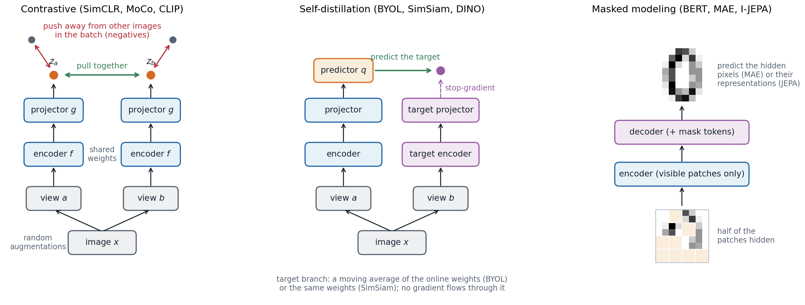
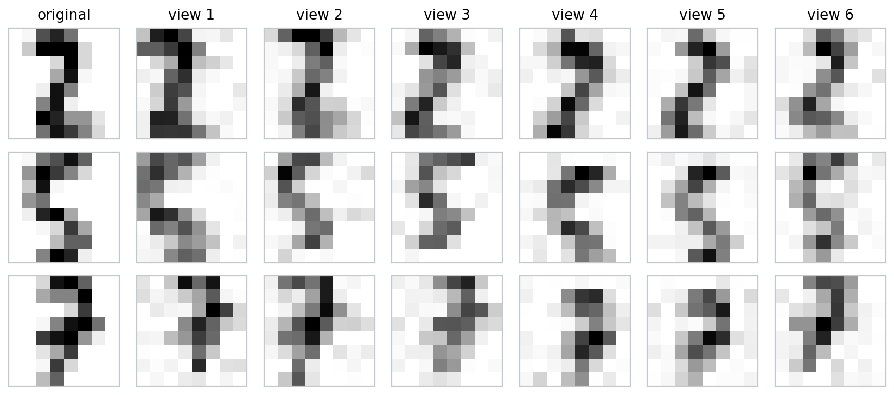
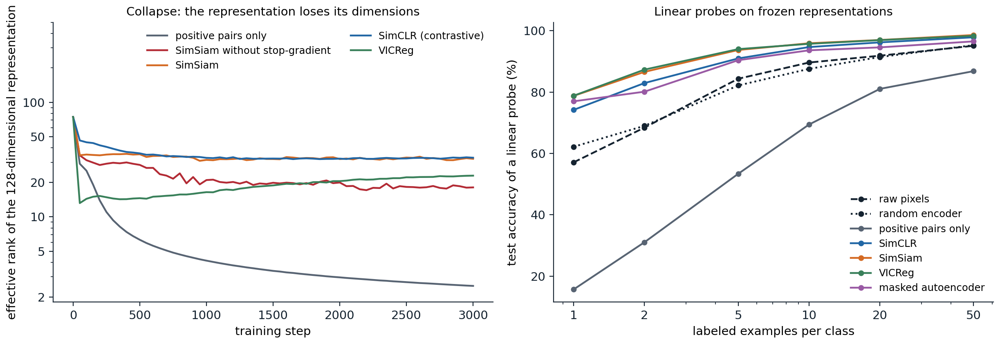
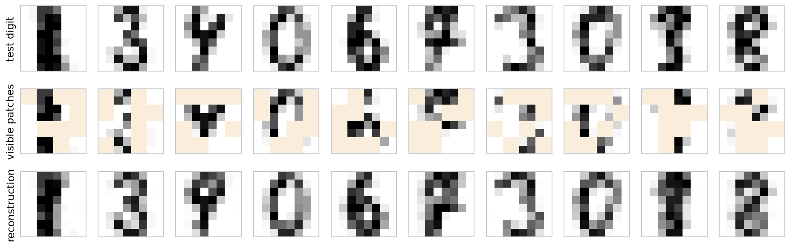

[ML Mastery Notes](../README.md) › [Deep Learning](README.md)

# 10. Self-Supervised Representation Learning

[← 9. Attention and Transformers](09-attention-and-transformers.md) · [11. Training at Scale and Efficient Inference →](11-training-at-scale-and-efficient-inference.md)

## <a id="learning-without-labels"></a>Learning without labels

### <a id="representations-and-pretext-tasks"></a>Representations and pretext tasks

Labeled data are expensive and unlabeled data are abundant. The networks of the previous chapters learned features as a by-product of supervised training, and chapter 7 showed that those features transfer: an ImageNet classifier's penultimate layer is a good input for many other tasks. **Self-supervised learning** asks whether such features can be learned without labels, by training on a **pretext task** whose targets are computed from the data themselves. The pretext task is not the goal. The goal is an encoder $`f`$ whose output $`h=f(x)`$, the **representation**, makes the tasks that matter easy to learn from few labels.

Early pretext tasks were designed by hand. A network was trained to predict the relative position of two patches of an image ([Doersch, Gupta, and Efros, 2015](https://arxiv.org/abs/1505.05192)), to solve a jigsaw puzzle of shuffled patches ([Noroozi and Favaro, 2016](https://arxiv.org/abs/1603.09246)), to color a grayscale image ([Zhang, Isola, and Efros, 2016](https://arxiv.org/abs/1603.08511)), to fill in a missing region ([Pathak et al., 2016](https://arxiv.org/abs/1604.07379)), or to recognize which of four rotations had been applied ([Gidaris, Singh, and Komodakis, 2018](https://arxiv.org/abs/1803.07728)). Each task can only be solved by understanding something about objects, and each produced useful features, but the features also specialized to the pretext task: the best layer for transfer was often in the middle of the network rather than at the end, especially in architectures without skip connections ([Kolesnikov, Zhai, and Beyer, 2019](https://arxiv.org/abs/1901.09005)). In text, predicting a word from its neighbors gave word embeddings ([Mikolov et al., 2013](https://arxiv.org/abs/1301.3781)), and predicting masked or next words became the pretraining of language models, developed in the NLP and LLMs module.

Three general families have since replaced the hand-designed tasks, and this chapter follows them in turn.



*Three families of self-supervised objectives. Contrastive methods make the embeddings of two views of the same image similar and those of different images dissimilar. Self-distillation methods predict the embedding of one view from the other, without negatives, and rely on an asymmetry between the two branches to avoid a trivial solution. Masked modeling hides part of the input and predicts it from the rest.*

### <a id="what-makes-a-representation-useful"></a>What makes a representation useful

A representation is judged by how well it serves downstream tasks, under one of a few standard protocols:

- **Linear probe**: freeze the encoder and fit a linear classifier on its outputs. This measures how much class information is linearly accessible and is cheap enough to compare many encoders.
- **$`k`$-nearest-neighbor classification** in the representation space, with no training at all (ML chapter 1).
- **Fine-tuning**: train the whole network on the downstream task, starting from the pretrained weights (chapter 7). It usually gives the best accuracy and can rank encoders differently from a linear probe.
- **Low-shot evaluation**: any of the above with only a few labeled examples per class, which is where pretraining matters most.

A good representation is invariant to what the downstream tasks ignore, such as small shifts, lighting, and background, while keeping what they need. These goals conflict: an encoder that maps everything to a constant is perfectly invariant and useless. Much of this chapter is about how each method avoids that failure, called **collapse**.

## <a id="autoencoders"></a>Autoencoders

### <a id="undercomplete-autoencoders"></a>Undercomplete autoencoders

An **autoencoder** trains an encoder $`f`$ and a decoder $`g`$ to reconstruct the input through a bottleneck,

$$
\min_{f,g}\ \mathbb E\,\bigl\|x-g\bigl(f(x)\bigr)\bigr\|^2,
$$

where $`h=f(x)`$ has fewer dimensions than $`x`$, so the network cannot copy its input and must keep the directions that matter most for reconstruction. With linear maps and squared error, the optimal encoder–decoder pair projects onto the principal subspace of the data, the subspace spanned by the top $`k`$ principal components ([Baldi and Hornik, 1989](https://www.sciencedirect.com/science/article/pii/0893608089900142); ML chapter 12; [Appendix B](#block-dl10-appendix-b)). The code below trains a linear autoencoder by gradient descent on the digits and compares it with PCA.

```python
import numpy as np
import torch
from sklearn.datasets import load_digits

X = torch.tensor(load_digits().data / 16.0)
X = X - X.mean(0)                                       # centered digits, 1797 x 64
k = 5

# Linear autoencoder: encode with a k x 64 matrix, decode with a 64 x k matrix, minimize squared error.
torch.manual_seed(0)
enc = torch.nn.Linear(64, k, bias=False).double()
dec = torch.nn.Linear(k, 64, bias=False).double()
opt = torch.optim.Adam([*enc.parameters(), *dec.parameters()], lr=1e-2)
for step in range(3000):
    loss = ((dec(enc(X)) - X) ** 2).sum(1).mean()
    opt.zero_grad()
    loss.backward()
    opt.step()

# PCA: project onto the top k right singular vectors.
U, S, Vt = torch.linalg.svd(X, full_matrices=False)
V = Vt[:k].T
pca_error = ((X - X @ V @ V.T) ** 2).sum(1).mean()
print(f"reconstruction error: autoencoder {loss.item():.3f}, PCA {pca_error.item():.3f}")

# Compare the subspaces: principal angles between the decoder's columns and the principal directions.
Q, _ = torch.linalg.qr(dec.weight.detach())
cosines = torch.linalg.svdvals(Q.T @ V)
print("cosines of the principal angles between the subspaces:", [round(c, 3) for c in cosines.tolist()])
W = dec.weight.detach()
print("decoder columns orthonormal:", torch.allclose(W.T @ W, torch.eye(k, dtype=W.dtype), atol=1e-2))
# reconstruction error: autoencoder 2.136, PCA 2.136
# cosines of the principal angles between the subspaces: [1.0, 1.0, 1.0, 1.0, 1.0]
# decoder columns orthonormal: False
```

The autoencoder finds the same subspace as PCA, but not the principal directions themselves: any invertible mixing of the code, undone by the decoder, reconstructs equally well. A nonlinear autoencoder with several layers can represent curved manifolds, and deep autoencoders pretrained layer by layer gave much better two-dimensional codes than PCA ([Hinton and Salakhutdinov, 2006](https://doi.org/10.1126/science.1127647)). But reconstruction is a weak pretext task for recognition: a code that retains enough detail to redraw every pixel spends most of its capacity on details that classification does not need.

### <a id="denoising-and-other-regularized-autoencoders"></a>Denoising and other regularized autoencoders

Instead of a bottleneck, an autoencoder can be prevented from learning the identity by other constraints: a sparsity penalty on the code, a penalty on the Jacobian of the encoder that makes the code insensitive to small input changes (**contractive** autoencoders; [Rifai et al., 2011](https://icml.cc/2011/papers/455_icmlpaper.pdf)), or corruption of the input. A **denoising autoencoder** ([Vincent et al., 2008](https://doi.org/10.1145/1390156.1390294)) receives a corrupted input $`\tilde x`$, for example with Gaussian noise added or some pixels set to zero, and must reconstruct the clean $`x`$. To do so it must learn how clean data look.

For small Gaussian noise of variance $`\sigma^2`$, the optimal denoiser moves a noisy point toward regions of higher data density: $`r(\tilde x)-\tilde x\approx\sigma^2\nabla_{\tilde x}\log p(\tilde x)`$, the **score** of the noise-smoothed data distribution ([Vincent, 2011](https://doi.org/10.1162/NECO_a_00142); [Alain and Bengio, 2014](https://arxiv.org/abs/1211.4246)). Denoising at many noise levels is the training objective of diffusion models (Generative AI chapter 7), and the variational autoencoder turns the autoencoder into a probabilistic generative model (Generative AI chapter 3). Masked autoencoders, later in this chapter, are denoising autoencoders whose corruption removes whole patches.

## <a id="contrastive-learning"></a>Contrastive learning

### <a id="instance-discrimination-and-the-infonce-loss"></a>Instance discrimination and the InfoNCE loss

Contrastive methods learn by comparison. Two random **augmentations** of the same image form a **positive pair**; views of different images are **negatives**. The encoder is trained so that each view's embedding is closer to its partner than to the negatives. Treating every image as its own class, this is **instance discrimination** ([Wu et al., 2018](https://arxiv.org/abs/1805.01978)).

**SimCLR** ([Chen et al., 2020](https://arxiv.org/abs/2002.05709)) gives the standard recipe. A batch of $`N`$ images yields $`2N`$ views; each passes through the encoder $`f`$ and a small **projection head** $`g`$ to an embedding $`z`$, normalized to unit length. For a positive pair $`(i,j)`$, the loss is

$$
\ell_{ij}=-\log\frac{\exp(z_i^\top z_j/\tau)}{\sum_{k\ne i}\exp(z_i^\top z_k/\tau)},
$$

averaged over all $`2N`$ views. This is a cross-entropy: each view must classify which of the other $`2N-1`$ views is its partner, with cosine similarities divided by a **temperature** $`\tau`$ as logits. The loss comes from noise-contrastive estimation ([Gutmann and Hyvärinen, 2010](https://proceedings.mlr.press/v9/gutmann10a.html)) and was named **InfoNCE** by [van den Oord, Li, and Vinyals (2018)](https://arxiv.org/abs/1807.03748), who used it to predict future segments of audio, text, and images from past ones.

Several details of SimCLR turned out to matter:

- **Strong augmentation.** Random cropping combined with color distortion was essential. Without color distortion, two crops of the same image can be matched by their color histograms alone, and the network learns nothing else.
- **A projection head.** The loss is applied to $`z=g(h)`$, but the representation used downstream is $`h`$. The head absorbs the invariances the loss enforces, such as invariance to color, which may be useful information downstream; $`h`$ was 10 percentage points better than $`z`$ under a linear probe.
- **Many negatives.** Larger batches helped, up to 8,192 images. **MoCo** ([He et al., 2020](https://arxiv.org/abs/1911.05722)) decouples the number of negatives from the batch size by keeping a queue of embeddings from recent batches, computed by a **momentum encoder** whose weights are an exponential moving average of the trained encoder's, so that the queued embeddings stay consistent.
- **A low temperature**, around 0.1 to 0.5, which concentrates the gradient on the hardest negatives.

With a ResNet-50, a linear probe on SimCLR features reached 69.3% top-1 accuracy on ImageNet, against 76.5% for the same network trained with labels, and a four times wider network matched the supervised ResNet-50.

### <a id="what-the-loss-measures"></a>What the loss measures

InfoNCE is a lower bound on the **mutual information** between the two views (Foundations chapter 5). If a critic $`f(x,y)`$ scores how likely $`y`$ is to be the partner of $`x`$, and the loss $`\mathcal L`$ is the cross-entropy of picking the true partner among $`N`$ candidates, then

$$
I(X;Y)\ \ge\ \log N-\mathcal L ,
$$

with near equality for the optimal critic $`f^*(x,y)=\log p(y\mid x)/p(y)`$ when $`I(X;Y)`$ is small compared with $`\log N`$ ([Poole et al., 2019](https://arxiv.org/abs/1905.06922); [Appendix A](#block-dl10-appendix-a)). Because $`\mathcal L\ge0`$, the estimate can never exceed $`\log N`$. The code below uses the optimal critic for correlated Gaussians, whose mutual information is known, to show both properties.

```python
import math
import torch

def info_nce(scores):
    """InfoNCE loss for an N x N matrix of critic scores whose diagonal holds the positive pairs."""
    return torch.nn.functional.cross_entropy(scores, torch.arange(len(scores)))

torch.manual_seed(0)
d, N = 10, 128
print(f"log N = {math.log(N):.2f}")
for mi in (1, 2, 4, 8, 16):                                   # true mutual information in nats
    rho = math.sqrt(1 - math.exp(-2 * mi / d))                # y = rho x + noise in each coordinate
    est = []
    for _ in range(50):
        x = torch.randn(N, d, dtype=torch.float64)
        y = rho * x + math.sqrt(1 - rho ** 2) * torch.randn(N, d, dtype=torch.float64)
        # the optimal critic log p(y_j | x_i) - log p(y_j), up to terms that cancel in the softmax
        f = -torch.cdist(rho * x, y) ** 2 / (2 * (1 - rho ** 2)) + (y ** 2).sum(1) / 2
        est.append(math.log(N) - info_nce(f).item())
    print(f"true mutual information {mi:2d} nats: InfoNCE estimate {sum(est) / len(est):.2f}")
# log N = 4.85
# true mutual information  1 nats: InfoNCE estimate 0.96
# true mutual information  2 nats: InfoNCE estimate 1.88
# true mutual information  4 nats: InfoNCE estimate 3.38
# true mutual information  8 nats: InfoNCE estimate 4.69
# true mutual information 16 nats: InfoNCE estimate 4.85
```

Mutual information is not, however, what makes the representations good. Two views of an image share a great deal of information, most of it useless for recognition, and invertible encoders preserve all of it; bounds with fewer negatives or estimators that track mutual information more closely do not give better features ([Tschannen et al., 2020](https://arxiv.org/abs/1907.13625); [McAllester and Stratos, 2020](https://arxiv.org/abs/1811.04251)). The architecture of the encoder, the augmentations, and the critic's form decide what is learned.

[Wang and Isola (2020)](https://arxiv.org/abs/2005.10242) give a more useful description. As the number of negatives grows, the InfoNCE loss minus $`\log N`$ approaches the sum of two terms ([Appendix C](#block-dl10-appendix-c)):

$$
\underbrace{-\frac1\tau\,\mathbb E\bigl[z_a^\top z_b\bigr]}_{\text{alignment}}\;+\;\underbrace{\mathbb E_x\log\mathbb E_{x'}\exp\bigl(z(x)^\top z(x')/\tau\bigr)}_{\text{uniformity}} .
$$

The first pulls positive pairs together; the second is smallest when the embeddings of different images spread uniformly over the sphere. Alignment alone is minimized by collapse; uniformity is what prevents it.

### <a id="choosing-the-views"></a>Choosing the views

The augmentations define the invariances. Whatever differs between two views is treated as noise to be ignored; whatever they share is what the representation keeps. For natural images, crops teach invariance to position and scale and encourage the network to relate parts to wholes, and color distortion removes color as a shortcut. For another domain, such as medical images or satellite data, the augmentations must be redesigned, and a poor choice removes exactly the information the downstream task needs ([Tian et al., 2020](https://arxiv.org/abs/2005.10243)).



*Random views of three digits used in the experiments of this chapter: rotations of up to 17 degrees, rescaling by up to 15%, shifts of up to one pixel, and pixel noise. At a resolution of $`8\times8`$ every transformation also blurs the digit.*

This view-centered picture has a theoretical counterpart. Define a graph whose vertices are all possible augmented images, with edges weighted by the probability that two of them are views of the same image. Minimizing a contrastive loss is then close to computing the top eigenvectors of this graph's normalized adjacency matrix, a spectral embedding in the sense of ML chapter 13, and if classes are rarely connected by augmentations, a linear probe on the embedding classifies well ([HaoChen et al., 2021](https://arxiv.org/abs/2106.04156); [Arora et al., 2019](https://arxiv.org/abs/1902.09229)).

### <a id="contrasting-modalities"></a>Contrasting modalities

The two views need not come from the same modality. **CLIP** ([Radford et al., 2021](https://arxiv.org/abs/2103.00020)) trained an image encoder and a text encoder on 400 million image–caption pairs collected from the web, with a symmetric InfoNCE loss: in a batch of pairs, each image must pick out its caption and each caption its image. The shared embedding space allows **zero-shot classification**: embed the text "a photo of a {class name}" for every class and assign an image to the class whose text embedding is most similar. Without any ImageNet training images, CLIP matched the accuracy of a supervised ResNet-50 on ImageNet and was much more robust to shifts in the image distribution. Language supervision of this kind, and its role in generative models, returns in the NLP and LLMs and Generative AI modules.

## <a id="learning-without-negatives"></a>Learning without negatives

### <a id="collapse"></a>Collapse

If only positive pairs are used, the objective "make the two views' embeddings equal" has a trivial solution: map every input to the same vector. This **complete collapse** is the global minimum of every purely attractive loss. A subtler failure is **dimensional collapse**: the embeddings vary along only a few directions, which wastes the capacity of the representation, and it affects contrastive methods too ([Jing et al., 2022](https://arxiv.org/abs/2110.09348)). The code below evaluates three losses on a healthy batch of embeddings and on a collapsed one.

```python
import torch
import torch.nn.functional as F

def negative_cosine(z1, z2):
    """Pull the two views together and nothing else."""
    return -F.cosine_similarity(z1, z2).mean()

def info_nce(z1, z2, tau=0.2):
    """SimCLR's loss: each view must pick out its partner among the 2N - 1 other embeddings in the batch."""
    z = F.normalize(torch.cat([z1, z2]), dim=1)
    s = (z @ z.T / tau).fill_diagonal_(float("-inf"))
    n = len(z1)
    return F.cross_entropy(s, torch.cat([torch.arange(n, 2 * n), torch.arange(n)]))

def vicreg(z1, z2, lam=25.0, mu=25.0, nu=1.0):
    """Invariance + variance (each coordinate's std at least 1) + covariance (decorrelated coordinates)."""
    def variance(z):
        return F.relu(1 - torch.sqrt(z.var(0) + 1e-4)).mean()
    def covariance(z):
        z = z - z.mean(0)
        c = z.T @ z / (len(z) - 1)
        return (c - torch.diag(torch.diag(c))).pow(2).sum() / z.shape[1]
    return lam * F.mse_loss(z1, z2) + mu * (variance(z1) + variance(z2)) + nu * (covariance(z1) + covariance(z2))

torch.manual_seed(0)
N, d = 256, 32
base = torch.randn(N, d)                                       # a healthy embedding of N images
spread = (base + 0.1 * torch.randn(N, d), base + 0.1 * torch.randn(N, d))
collapsed = (torch.ones(N, d), torch.ones(N, d))               # every image mapped to the same vector
for name, (z1, z2) in [("spread", spread), ("collapsed", collapsed)]:
    print(f"{name:9s}: negative cosine {negative_cosine(z1, z2):6.3f}, InfoNCE {info_nce(z1, z2):5.2f},"
          f" VICReg {vicreg(z1, z2):5.2f}")
print(f"InfoNCE of a collapsed batch = log(2N - 1) = {torch.log(torch.tensor(2.0 * N - 1)):.2f}")
# spread   : negative cosine -0.990, InfoNCE  1.85, VICReg  1.54
# collapsed: negative cosine -1.000, InfoNCE  6.24, VICReg 49.50
# InfoNCE of a collapsed batch = log(2N - 1) = 6.24
```

The purely attractive loss prefers the collapsed batch; InfoNCE and VICReg penalize it heavily. Methods without negatives must therefore prevent collapse by other means: an asymmetry between the two branches, or an explicit penalty on the statistics of the batch.

### <a id="asymmetric-architectures"></a>Asymmetric architectures

**BYOL** ([Grill et al., 2020](https://arxiv.org/abs/2006.07733)) trains an online network to predict, through an extra **predictor** MLP $`q`$, the embedding that a **target network** produces for the other view. The target network is not trained by gradient descent; its weights are an exponential moving average of the online weights. The loss, a negative cosine similarity, has collapsed solutions, yet BYOL does not collapse in practice, and it reached 74.3% under a ResNet-50 linear probe, above the contrastive methods of the time. **SimSiam** ([Chen and He, 2021](https://arxiv.org/abs/2011.10566)) showed that the moving average is not essential: the same network can produce the target, as long as no gradient flows through it (a **stop-gradient**) and a predictor is present. Removing either the stop-gradient or the predictor collapses the representation.

Why this works is only partly understood. [Tian, Chen, and Ganguli (2021)](https://arxiv.org/abs/2102.06810) analyzed the learning dynamics of linear networks: with the stop-gradient and the predictor, collapse remains a solution, but under common conditions the dynamics move away from it, and the predictor aligns with the eigenspaces of the correlation matrix of the representations, so that directions of large variance are reinforced rather than suppressed. Batch normalization in the heads also plays a role, since it couples the examples of a batch much as negatives do.

**DINO** ([Caron et al., 2021](https://arxiv.org/abs/2104.14294)) casts the same idea as **self-distillation**: a student network matches the softmax output of a momentum teacher over a large number of output dimensions (65,536 in the paper), with global crops given to the teacher and both global and small local crops to the student. Collapse is avoided by **centering** the teacher's outputs (subtracting a running mean, which prevents one dimension from dominating) and **sharpening** them (a low temperature, which prevents a uniform output). Its predecessor SwAV ([Caron et al., 2020](https://arxiv.org/abs/2006.09882)) clustered the embeddings onto a few thousand learned prototypes and enforced equal use of the prototypes through an optimal-transport assignment. Vision transformers trained with DINO develop attention maps that segment objects without any supervision.

### <a id="redundancy-reduction"></a>Redundancy reduction

A second approach penalizes collapse directly. **Barlow Twins** ([Zbontar et al., 2021](https://arxiv.org/abs/2103.03230)) drives the cross-correlation matrix between the embeddings of the two views, computed over the batch, toward the identity: diagonal entries of 1 make each coordinate invariant to the augmentation, and off-diagonal entries of 0 make different coordinates carry different information. **VICReg** ([Bardes, Ponce, and LeCun, 2022](https://arxiv.org/abs/2105.04906)) separates the three requirements into an invariance term (mean squared distance between the two views), a variance term (a hinge keeping the standard deviation of each coordinate above 1), and a covariance term (penalizing off-diagonal covariances), as in the code above. The distinction from contrastive learning is less sharp than it looks: contrastive losses repel samples, redundancy-reduction losses decorrelate dimensions, and under reasonable conditions the two are equivalent up to normalization ([Garrido et al., 2023](https://arxiv.org/abs/2206.02574)).

### <a id="an-experiment-on-digits"></a>An experiment on digits

The figure below trains the same encoder, a three-layer MLP with a 128-dimensional output, with five objectives on the 1,078 training digits, using the views shown earlier. Collapse is measured by the **effective rank** of the representation, the exponential of the entropy of its normalized singular values ([Roy and Vetterli, 2007](https://www.eurasip.org/Proceedings/Eusipco/Eusipco2007/Papers/a5p-h05.pdf); [Garrido et al., 2023](https://arxiv.org/abs/2210.02885)), which equals $`r`$ for $`r`$ equal singular values and 1 for a representation that varies along one direction.



*Left: effective rank of the representation over 3,000 steps of training. With only an attractive loss it falls from 75 at initialization to 2.5. SimSiam without the stop-gradient partly collapses, to 18. SimSiam, SimCLR, and VICReg level off between 23 and 33. Right: test accuracy of a standardized linear probe fit on $`k`$ labeled training digits per class, averaged over 10 random draws of the labeled examples. With one label per class, raw pixels give 57%, a randomly initialized encoder 62%, the collapsed representation 16%, SimCLR, SimSiam, and VICReg between 74% and 79%, and the masked autoencoder 77%. With 50 labels per class, SimCLR, SimSiam, and VICReg exceed 97%, the masked autoencoder reaches 96.5%, and raw pixels 95%.*

Two observations generalize. The benefit of pretraining is largest when labels are scarce and shrinks as they become plentiful. And a representation can lose most of its effective dimensions while retaining information in directions of tiny variance: after standardization, the linear probe recovers 87% accuracy from the collapsed representation with 50 labels per class, but with one label per class it has too little signal to find those directions.

## <a id="masked-modeling"></a>Masked modeling

### <a id="masked-autoencoders"></a>Masked autoencoders

BERT ([Devlin et al., 2019](https://arxiv.org/abs/1810.04805)) pretrained transformers by hiding 15% of the words of a text and predicting them, and masked prediction became the dominant pretraining for language encoders. Its transfer to images took several years, because pixels are redundant: a missing patch can be interpolated from its neighbors without understanding the image. The **masked autoencoder** (MAE; [He et al., 2022](https://arxiv.org/abs/2111.06377)) made it work with three choices:

- **A high masking ratio.** Hiding 75% of the patches of an image removes so much that the network cannot interpolate and must model objects and scenes.
- **An asymmetric design.** The encoder, a vision transformer (chapter 9), processes only the visible patches, a quarter of the sequence, which makes pretraining several times cheaper. A small decoder receives the encoded visible patches together with a learned **mask token** at every hidden position and reconstructs the pixels.
- **A loss on the hidden patches only**, with the pixel values of each patch normalized to zero mean and unit variance, which emphasizes edges and texture over overall brightness.

After pretraining, the decoder is discarded. MAE features are best used by fine-tuning, where a ViT-Huge reached 87.8% on ImageNet using no data beyond ImageNet itself; under a linear probe they are weaker than contrastive features, because reconstruction keeps information that classification does not need, and the features are less linearly organized by class.



*A small masked autoencoder on test digits. Each $`8\times8`$ digit is cut into 16 patches of $`2\times2`$ pixels, half are hidden (tinted), and a three-layer transformer encoder with a one-layer decoder, trained for 4,000 steps on the training digits, fills them in. The squared error per hidden pixel on these ten digits is 0.038, against a pixel variance of 0.142.*

### <a id="predicting-representations-instead-of-pixels"></a>Predicting representations instead of pixels

Pixels are not the only possible target. BEiT ([Bao et al., 2022](https://arxiv.org/abs/2106.08254)) predicts discrete codes of the hidden patches produced by a pretrained image tokenizer. data2vec ([Baevski et al., 2022](https://arxiv.org/abs/2202.03555)) and iBOT ([Zhou et al., 2022](https://arxiv.org/abs/2111.07832)) predict the representations that a momentum teacher computes for the hidden patches, which combines masked modeling with self-distillation. **I-JEPA** ([Assran et al., 2023](https://arxiv.org/abs/2301.08243)) predicts, from a large visible context block, the target encoder's representations of several other blocks of the image, with no augmentations at all. Predicting in representation space lets the model ignore unpredictable pixel detail, and such joint-embedding predictive architectures are one proposal for learning models of the world from video.

DINOv2 ([Oquab et al., 2023](https://arxiv.org/abs/2304.07193)) combined self-distillation on whole images with masked prediction of patch representations, trained on 142 million automatically curated images, and produced frozen features that work across classification, segmentation, and depth estimation without fine-tuning. Together with CLIP, such models are used as general-purpose visual backbones, the image counterpart of pretrained language models.

UNIGE sections 7.2 and 7.3 and the *Cookbook of Self-Supervised Learning* of [Balestriero et al. (2023)](https://arxiv.org/abs/2304.12210), listed in the reading plan, cover autoencoders and the families of self-supervised methods, with the training details that make them work; [Lilian Weng's survey](https://lilianweng.github.io/posts/2021-05-31-contrastive/) collects the contrastive objectives.

## <a id="appendices"></a>Appendices


<details>
<summary><a id="block-dl10-appendix-a"></a><b>A. InfoNCE is a lower bound on mutual information</b></summary>


Let $`(X,Y)\sim p(x,y)`$, and form $`N`$ candidates $`Y_1,\ldots,Y_N`$ by placing the true partner $`Y`$ at a uniformly random position $`K`$ and filling the other positions with independent draws from $`p(y)`$. A critic $`f`$ defines a guess for the position,

$$
q(k\mid X,Y_{1:N})=\frac{e^{f(X,Y_k)}}{\sum_{j=1}^Ne^{f(X,Y_j)}},
$$

and the InfoNCE loss is $`\mathcal L=-\mathbb E\log q(K\mid X,Y_{1:N})`$.

**Step 1: a cross-entropy bounds an entropy.** For any conditional distribution $`q`$, $`-\mathbb E\log q(K\mid X,Y_{1:N})\ge H(K\mid X,Y_{1:N})`$, because the difference is an expected Kullback–Leibler divergence (Foundations chapter 5). Hence

$$
\log N-\mathcal L\le\log N-H(K\mid X,Y_{1:N})=H(K)-H(K\mid X,Y_{1:N})=I(K;X,Y_{1:N}).
$$

**Step 2: the position carries at most $`I(X;Y)`$.** The candidates alone reveal nothing about $`K`$, since marginally they are $`N`$ independent draws from $`p(y)`$ whatever $`K`$ is; so $`I(K;X,Y_{1:N})=I(K;X\mid Y_{1:N})`$. By the chain rule, $`I(X;K,Y_{1:N})=I(X;Y_{1:N})+I(X;K\mid Y_{1:N})\ge I(K;X\mid Y_{1:N})`$. And $`X`$ depends on $`(K,Y_{1:N})`$ only through the true partner $`Y_K`$, so $`I(X;K,Y_{1:N})=I(X;Y)`$. Combining,

$$
\log N-\mathcal L\ \le\ I(X;Y).
$$

**The optimal critic.** The posterior of the position is $`p(k\mid x,y_{1:N})\propto p(y_k\mid x)\prod_{j\ne k}p(y_j)\propto p(y_k\mid x)/p(y_k)`$, which is $`q`$ with $`f^*(x,y)=\log p(y\mid x)/p(y)`$ plus any function of $`x`$. With this critic Step 1 is an equality, and the only gap is Step 2, which is small when $`I(X;Y)\ll\log N`$. Since $`\mathcal L\ge0`$, the estimate never exceeds $`\log N`$: measuring large mutual information requires exponentially many negatives ([McAllester and Stratos, 2020](https://arxiv.org/abs/1811.04251)).

</details>


<details>
<summary><a id="block-dl10-appendix-b"></a><b>B. Linear autoencoders and principal components</b></summary>


Let the centered data matrix $`X\in\mathbb R^{n\times p}`$ have singular value decomposition $`X=USV^\top`$, and consider an encoder $`E\in\mathbb R^{k\times p}`$ and a decoder $`D\in\mathbb R^{p\times k}`$. The reconstruction $`XE^\top D^\top`$ has rank at most $`k`$, so by the Eckart–Young theorem its squared error is at least $`\sum_{i>k}s_i^2`$, the error of projecting onto the top $`k`$ right singular vectors $`V_k`$ (Foundations chapter 2). The minimum is attained whenever $`D E=V_kV_k^\top`$, for example by $`E=A^{-1}V_k^\top`$ and $`D=V_kA`$ for any invertible $`k\times k`$ matrix $`A`$. The decoder's columns then span the principal subspace, but they are orthonormal principal directions only if $`A`$ is orthogonal and ordered, which gradient descent has no reason to produce; the code above finds exactly this.

[Baldi and Hornik (1989)](https://www.sciencedirect.com/science/article/pii/0893608089900142) also showed that this loss has no spurious local minima: every critical point other than the global minima projects onto a subspace spanned by some other set of $`k`$ eigenvectors and is a saddle point, so gradient descent from a generic starting point reaches the principal subspace.

</details>


<details>
<summary><a id="block-dl10-appendix-c"></a><b>C. Alignment and uniformity</b></summary>


Write the InfoNCE loss for a view $`x`$ with positive $`x^+`$ and $`M`$ negatives $`x_1^-,\ldots,x_M^-`$, with unit-norm embeddings $`z`$:

$$
\mathcal L_M=-\frac1\tau\,\mathbb E\bigl[z(x)^\top z(x^+)\bigr]+\mathbb E\log\Bigl(e^{z(x)^\top z(x^+)/\tau}+\sum_{i=1}^Me^{z(x)^\top z(x_i^-)/\tau}\Bigr).
$$

Subtract $`\log M`$. Inside the second logarithm, $`\frac1M\sum_ie^{z(x)^\top z(x_i^-)/\tau}`$ converges to $`\mathbb E_{x'}e^{z(x)^\top z(x')/\tau}`$ by the law of large numbers, and the single positive term, bounded by $`e^{1/\tau}`$, becomes negligible after division by $`M`$. Hence

$$
\lim_{M\to\infty}\bigl(\mathcal L_M-\log M\bigr)=-\frac1\tau\,\mathbb E\bigl[z(x)^\top z(x^+)\bigr]+\mathbb E_x\log\mathbb E_{x'}e^{z(x)^\top z(x')/\tau}.
$$

The first term is minimized when positive pairs coincide. The second is a log-partition function over the negatives; by Jensen's inequality it is at least $`\frac1\tau\mathbb E_{x,x'}[z(x)^\top z(x')]=\frac1\tau\bigl\|\mathbb E\,z\bigr\|^2`$, which is minimized when the mean embedding is zero, and [Wang and Isola (2020)](https://arxiv.org/abs/2005.10242) show that its minimizers are uniform distributions on the sphere when these exist. A collapsed encoder makes the second term $`1/\tau`$, its maximum.

</details>

---

[← 9. Attention and Transformers](09-attention-and-transformers.md) · [11. Training at Scale and Efficient Inference →](11-training-at-scale-and-efficient-inference.md)
