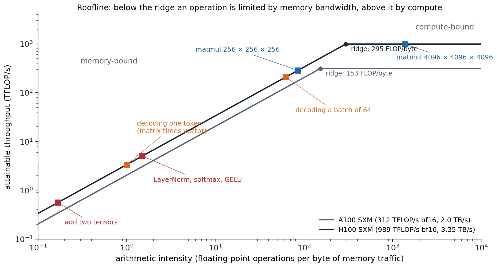
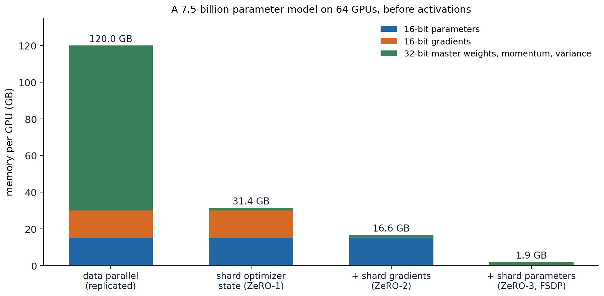
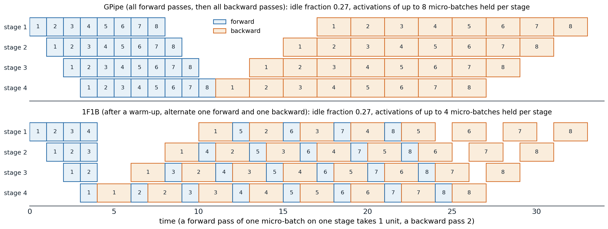
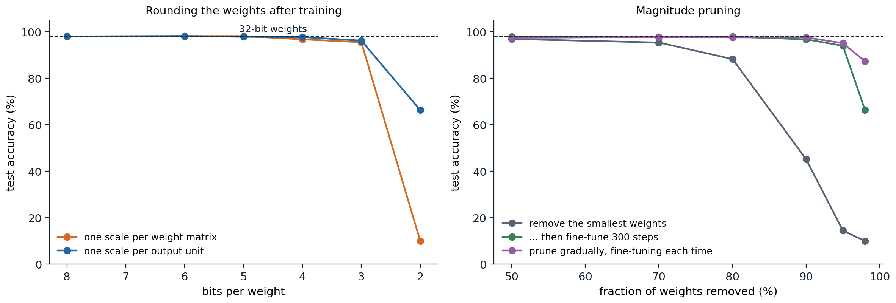

[Background Notes](../README.md) › [Deep Learning](README.md)

# 11. Training at Scale and Efficient Inference

[← 10. Self-Supervised Representation Learning](10-self-supervised-representation-learning.md) · [12. Practical Methodology →](12-practical-methodology.md)

## <a id="where-the-time-goes"></a>Where the time goes

### <a id="compute-memory-traffic-and-overhead"></a>Compute, memory traffic, and overhead

The cost of training a network is usually counted in floating-point operations: about $`6N`$ per training example (or token) for a network with $`N`$ parameters, $`2N`$ for the forward pass and $`4N`$ for the backward pass, which computes gradients with respect to both activations and weights ([chapter 9](09-attention-and-transformers.md#a-complete-model-and-its-size)). Llama 3 405B, trained on 15.6 trillion tokens, needed $`6\times405\times10^9\times15.6\times10^{12}\approx3.8\times10^{25}`$ operations, the figure its authors report ([Llama Team, 2024](https://arxiv.org/abs/2407.21783)). Dividing by the throughput of the hardware gives the time, but only if the hardware runs at its peak, and it rarely does.

An accelerator such as a GPU spends time in three ways ([He, 2022](https://horace.io/brrr_intro.html)):

- **Compute.** Matrix multiplications run on specialized units (tensor cores) at hundreds of teraflops in 16-bit precision. Everything else, including activations, normalization, and softmax, runs on general units at a small fraction of that rate.
- **Memory traffic.** Operands live in high-bandwidth memory (HBM), tens of gigabytes read at a few terabytes per second, and must be brought into small on-chip memories to be used. An operation that performs few computations per byte it reads is limited by this bandwidth, not by arithmetic.
- **Overhead.** Launching each operation from Python, dispatching it through the framework, and synchronizing devices cost microseconds each, which dominate when the operations are small.

The **roofline model** ([Williams, Waterman, and Patterson, 2009](https://doi.org/10.1145/1498765.1498785)) summarizes the first two. An operation with **arithmetic intensity** $`I`$, measured in floating-point operations per byte moved between memory and the processor, can run at most at $`\min(P,\;B\cdot I)`$, where $`P`$ is the peak compute rate and $`B`$ the memory bandwidth. The **ridge point** $`P/B`$ separates memory-bound operations from compute-bound ones.



*The roofline of two data-center GPUs with dense 16-bit arithmetic, using the manufacturer's peak figures, and the arithmetic intensity of common operations with 2-byte numbers. Elementwise operations are far below the ridge. A multiplication of two $`n\times n`$ matrices has intensity $`n/3`$, so it becomes compute-bound only for $`n`$ in the hundreds. Generating one token at a time multiplies each weight matrix by a single vector, with intensity about 1; processing 64 sequences at once raises it to about 62.*

The multiplication of an $`m\times k`$ matrix by a $`k\times n`$ matrix performs $`2mkn`$ operations and moves at least $`2(mk+kn+mn)`$ bytes in 16-bit precision, so large matrix products reuse each number many times and are compute-bound, while elementwise operations touch each number once and are memory-bound ([Appendix A](#block-dl11-appendix-a)). This has practical consequences. Matrix dimensions should be large and multiples of 64 or 128, which tensor cores process in tiles. And the many small elementwise operations of a network, which account for a small fraction of its operations, can account for a large fraction of its time.

### <a id="fusion-and-compilation"></a>Fusion and compilation

The remedy for memory-bound sequences of operations is **fusion**: computing, say, a bias addition, a GELU, and a dropout in one pass that reads the input once and writes the output once, instead of three passes that each read and write the whole tensor. FlashAttention ([chapter 9](09-attention-and-transformers.md#exact-attention-with-less-memory)) is fusion taken further: the whole attention computation, including the softmax, runs block by block in on-chip memory, so the $`T\times T`$ score matrix never travels to HBM. Compilers such as XLA and PyTorch's [`torch.compile`](https://pytorch.org/docs/stable/torch.compiler.html) trace a model, fuse elementwise operations automatically, and generate kernels, for example in the Triton language ([Tillet, Kung, and Cox, 2019](https://doi.org/10.1145/3315508.3329973)). Capturing a sequence of kernel launches as a CUDA graph and replaying it removes most of the launch overhead for small models.

### <a id="measuring-efficiency"></a>Measuring efficiency

The standard measure of training efficiency is **model FLOPs utilization** (MFU): the operations the model needs per second, $`6N`$ times the tokens processed per second, divided by the hardware's peak ([Chowdhery et al., 2022](https://arxiv.org/abs/2204.02311)). Recomputation and other overhead do not count as useful work. Large training runs typically reach between 30% and 50%. PaLM 540B reached 46% on TPUs, and Llama 3 405B 38–43% on up to 16,384 H100 GPUs. The rest is lost to memory-bound operations, communication between devices, pipeline idle time, and failures.

## <a id="numerical-precision"></a>Numerical precision

### <a id="floating-point-formats"></a>Floating-point formats

A floating-point number stores a sign, an exponent, and a fraction (mantissa) ([Foundations chapter 6](../foundations/06-numerical-computing-with-numpy-and-pytorch.md#data-types-and-mathematical-domains)). The exponent's width sets the range of representable magnitudes and the fraction's width the relative precision. Deep learning uses four formats:

| Format | Exponent bits | Fraction bits | Largest value | Relative precision |
| --- | --- | --- | --- | --- |
| float32 | 8 | 23 | $`3.4\times10^{38}`$ | $`1.2\times10^{-7}`$ |
| float16 | 5 | 10 | 65,504 | $`9.8\times10^{-4}`$ |
| bfloat16 | 8 | 7 | $`3.4\times10^{38}`$ | $`7.8\times10^{-3}`$ |
| float8 (E4M3 / E5M2) | 4 / 5 | 3 / 2 | 448 / 57,344 | $`0.125`$ / $`0.25`$ |

Halving the bits halves memory and memory traffic, and tensor cores run 16-bit arithmetic at many times the 32-bit rate. **bfloat16** keeps float32's exponent, and therefore its range, with a coarse fraction; **float16** has more precision but a narrow range, so small values underflow to zero and large ones overflow. Float8 formats ([Micikevicius et al., 2022](https://arxiv.org/abs/2209.05433)) are used for the matrix multiplications of the largest training runs, with per-tensor or per-block scaling factors.

```python
import torch

for dtype in (torch.float32, torch.float16, torch.bfloat16):
    fi = torch.finfo(dtype)
    print(f"{str(dtype):15s} bits {fi.bits:2d}  largest {fi.max:9.2e}  smallest normal {fi.tiny:9.2e}  epsilon {fi.eps:.1e}")

# Small gradients underflow in float16 but survive in bfloat16, which has float32's exponent range.
g = torch.tensor([1e-3, 1e-6, 1e-8])
print("1e-3, 1e-6, 1e-8 in float16: ", [f"{v:.2e}" for v in g.half().float().tolist()])
print("1e-3, 1e-6, 1e-8 in bfloat16:", [f"{v:.2e}" for v in g.bfloat16().float().tolist()])

# Loss scaling: multiply the loss by S before backpropagation, divide the gradients by S afterwards.
S = 2.0 ** 16
print("scaled by 2^16 in float16, then unscaled:", [f"{v:.2e}" for v in ((g * S).half().float() / S).tolist()])

# Accumulating many small terms in a low-precision number stalls; accumulate in float32 instead.
x = torch.full((10000,), 1e-4)
acc16 = torch.tensor(0.0, dtype=torch.bfloat16)
for v in x.bfloat16():
    acc16 = acc16 + v
print(f"sum of 10,000 copies of 1e-4: bfloat16 accumulator {acc16.item():.4f}, float32 accumulator {x.sum().item():.4f}")
# torch.float32   bits 32  largest  3.40e+38  smallest normal  1.18e-38  epsilon 1.2e-07
# torch.float16   bits 16  largest  6.55e+04  smallest normal  6.10e-05  epsilon 9.8e-04
# torch.bfloat16  bits 16  largest  3.39e+38  smallest normal  1.18e-38  epsilon 7.8e-03
# 1e-3, 1e-6, 1e-8 in float16:  ['1.00e-03', '1.01e-06', '0.00e+00']
# 1e-3, 1e-6, 1e-8 in bfloat16: ['9.99e-04', '9.98e-07', '1.00e-08']
# scaled by 2^16 in float16, then unscaled: ['1.00e-03', '1.00e-06', '1.00e-08']
# sum of 10,000 copies of 1e-4: bfloat16 accumulator 0.0312, float32 accumulator 1.0000
```

In float16, $`10^{-6}`$ is below the smallest normal number and is stored with reduced precision as a subnormal, and $`10^{-8}`$ becomes zero. The bfloat16 accumulator stops growing at 0.0312: once the running sum is large enough, adding $`10^{-4}`$ changes it by less than half a unit in its last place, so the sum is rounded back to itself.

### <a id="mixed-precision-training"></a>Mixed-precision training

**Mixed-precision training** ([Micikevicius et al., 2018](https://arxiv.org/abs/1710.03740)) runs matrix multiplications and most activations in 16-bit precision while keeping what needs precision in 32 bits:

- a **master copy of the weights** in float32, to which the updates are applied, because an update $`\eta g`$ is often smaller than the spacing of 16-bit numbers near the weight and would be rounded away, as the accumulator above was;
- **accumulation** of the products inside a matrix multiplication in float32, which tensor cores do in hardware;
- numerically sensitive operations, such as softmax, normalization, and the loss, in float32.

With float16, gradients of small magnitude underflow, so the loss is multiplied by a **loss scale** $`S`$ before backpropagation and the gradients are divided by $`S`$ before the update, as in the code above. **Dynamic loss scaling** increases $`S`$ periodically and halves it, skipping the update, whenever an overflow produces infinite gradients. With bfloat16, whose range equals float32's, no loss scaling is needed, which is why bfloat16 is now the default for training. In PyTorch, `torch.autocast` chooses the precision of each operation and `torch.amp.GradScaler` implements dynamic loss scaling ([PyTorch AMP documentation](https://pytorch.org/docs/stable/amp.html)).

## <a id="memory"></a>Memory

### <a id="what-must-be-stored"></a>What must be stored

Training with Adam in mixed precision stores, for every parameter, 16-bit weights (2 bytes) and gradients (2 bytes), and in 32 bits the master weights, the first moment, and the second moment (12 bytes): 16 bytes per parameter ([Rajbhandari et al., 2020](https://arxiv.org/abs/1910.02054)). A model with 7 billion parameters therefore needs 112 GB before storing any activations, more than the memory of a single 80 GB GPU.

**Activations** stored for the backward pass add a term proportional to the batch size and the sequence length. For a transformer layer with hidden width $`h`$, $`a`$ heads, sequence length $`s`$, and batch size $`b`$, [Korthikanti et al. (2022)](https://arxiv.org/abs/2205.05198) count $`sbh(34+5as/h)`$ bytes in 16-bit precision; the second term is the attention scores and softmax outputs, which FlashAttention does not store.

```python
def training_memory_gb(params, gpus=1, stage=0, optimizer_bytes=12):
    """Bytes per GPU for 16-bit parameters and gradients plus 32-bit Adam state (master weights, m, v),
    with the ZeRO stage deciding which of the three is sharded across the data-parallel GPUs."""
    p = 2 * params / (gpus if stage >= 3 else 1)
    g = 2 * params / (gpus if stage >= 2 else 1)
    o = optimizer_bytes * params / (gpus if stage >= 1 else 1)
    return (p + g + o) / 1e9

def activation_memory_gb(layers, seq, batch, hidden, heads, flash=False):
    """Activations stored for the backward pass of a transformer in 16-bit precision, per Korthikanti et al.:
    s b h (34 + 5 a s / h) bytes per layer, where the second term holds the attention scores."""
    per_layer = seq * batch * hidden * (34 + (0 if flash else 5 * heads * seq / hidden))
    return layers * per_layer / 1e9

print("7.5B parameters on 64 GPUs, GB per GPU by ZeRO stage 0-3:",
      [round(training_memory_gb(7.5e9, 64, st), 1) for st in range(4)])
print("7B parameters on one GPU:", round(training_memory_gb(7e9), 1), "GB before activations")
cfg = dict(layers=32, seq=4096, batch=1, hidden=4096, heads=32)        # a 7B-parameter transformer
print("activations for one 4,096-token sequence:", round(activation_memory_gb(**cfg), 1), "GB;",
      "without stored attention scores:", round(activation_memory_gb(**cfg, flash=True), 1), "GB")
# 7.5B parameters on 64 GPUs, GB per GPU by ZeRO stage 0-3: [120.0, 31.4, 16.6, 1.9]
# 7B parameters on one GPU: 112.0 GB before activations
# activations for one 4,096-token sequence: 104.2 GB; without stored attention scores: 18.3 GB
```

The stages of sharding in the first line are explained below. For long sequences, activations exceed everything else, and they are the first target for reduction.

### <a id="trading-computation-for-memory"></a>Trading computation for memory

**Activation checkpointing** (also called rematerialization; [Chen et al., 2016](https://arxiv.org/abs/1604.06174)) stores the activations only at the boundaries of selected segments of the network and recomputes the rest during the backward pass, one segment at a time. For a chain of $`L`$ layers, checkpointing every $`\sqrt L`$ layers reduces the stored activations from $`O(L)`$ to $`O(\sqrt L)`$ at the cost of one extra forward pass ([Appendix B](#block-dl11-appendix-b)). In transformers the usual choice is to checkpoint each block, or only the cheap-to-recompute, memory-hungry parts such as attention scores (**selective recomputation**).

```python
import torch
from torch import nn
from torch.utils.checkpoint import checkpoint

torch.manual_seed(0)
blocks = nn.ModuleList(nn.Sequential(nn.Linear(256, 1024), nn.GELU(), nn.Linear(1024, 256)) for _ in range(8))
x = torch.randn(64, 256, requires_grad=True)

def forward(x, ckpt):
    for block in blocks:
        x = x + (checkpoint(block, x, use_reentrant=False) if ckpt else block(x))
    return x.square().mean()

def run(ckpt):
    """Return the gradient and the bytes of activations that autograd saved for the backward pass."""
    saved = {}
    weights = {p.data_ptr() for p in blocks.parameters()}
    def pack(t):
        if t.data_ptr() not in weights:                                   # count activations, not weights
            saved[(t.data_ptr(), t.shape)] = t.numel() * t.element_size()  # each stored tensor once
        return t
    with torch.autograd.graph.saved_tensors_hooks(pack, lambda t: t):
        loss = forward(x, ckpt)
    (grad,) = torch.autograd.grad(loss, x)
    return grad, sum(saved.values())

g_plain, bytes_plain = run(False)
g_ckpt, bytes_ckpt = run(True)
print("same gradient with checkpointing:", torch.allclose(g_plain, g_ckpt))
print(f"activations saved for backward: {bytes_plain / 2**20:.2f} MiB without, {bytes_ckpt / 2**20:.2f} MiB with checkpointing")
# same gradient with checkpointing: True
# activations saved for backward: 4.56 MiB without, 0.56 MiB with checkpointing
```

Without checkpointing, each block keeps its input, the input of the GELU, and the input of the second linear layer; with checkpointing, it keeps only its input and recomputes the other two during the backward pass. Two other techniques trade time for memory. **Gradient accumulation** runs several small batches forward and backward and sums their gradients before one optimizer step, which gives the gradient of a large batch with the activation memory of a small one. **Offloading** moves optimizer state or parameters to CPU memory between uses, at the cost of transfers over a slower connection.

## <a id="parallelism"></a>Parallelism

### <a id="data-parallelism"></a>Data parallelism

In **data parallelism** every device holds a full copy of the model and processes a different slice of each batch. Because the loss is an average over examples, the average of the devices' gradients is the gradient of the whole batch, so after an **all-reduce** that sums the gradients across devices, every replica applies the same update and the copies stay identical.

The all-reduce is usually implemented as a **ring** ([Sergeev and Del Balso, 2018](https://arxiv.org/abs/1802.05799)): the gradient is cut into $`W`$ chunks for $`W`$ devices; in a **reduce-scatter** phase each device passes one chunk to its neighbor and adds the chunk it receives, so that after $`W-1`$ steps each device holds the complete sum of one chunk; in an **all-gather** phase the completed chunks travel around the ring. Each device sends $`2(W-1)/W`$ times the gradient's size, almost independently of $`W`$, which is optimal for bandwidth ([Appendix C](#block-dl11-appendix-c)).

```python
import numpy as np
import torch
from torch import nn

# Data parallelism: each of W workers computes the gradient on its shard of the batch; averaging the
# shard gradients gives the full-batch gradient (for a loss that is a mean over examples).
torch.manual_seed(0)
model = nn.Sequential(nn.Linear(20, 64), nn.Tanh(), nn.Linear(64, 1))
x, y = torch.randn(96, 20), torch.randn(96, 1)
loss_fn = nn.MSELoss()
full = torch.autograd.grad(loss_fn(model(x), y), list(model.parameters()))
W = 4
shards = [torch.autograd.grad(loss_fn(model(xs), ys), list(model.parameters()))
          for xs, ys in zip(x.chunk(W), y.chunk(W))]
averaged = [sum(gs) / W for gs in zip(*shards)]
print("average of shard gradients equals full-batch gradient:",
      all(torch.allclose(a, b, atol=1e-7) for a, b in zip(averaged, full)))

# Ring all-reduce: every worker ends with the sum, and each sends only 2 (W - 1) / W of the vector.
def ring_all_reduce(vectors):
    W = len(vectors)
    chunks = [np.array_split(v.copy(), W) for v in vectors]
    sent = 0
    for step in range(W - 1):                     # reduce-scatter: worker i accumulates chunk (i - step - 1)
        for i in range(W):
            c = (i - step - 1) % W
            chunks[i][c] += chunks[(i - 1) % W][c]
            sent += chunks[(i - 1) % W][c].size
    for step in range(W - 1):                     # all-gather: pass the finished chunks around the ring
        for i in range(W):
            c = (i - step) % W
            chunks[i][c] = chunks[(i - 1) % W][c].copy()
            sent += chunks[i][c].size
    return [np.concatenate(ch) for ch in chunks], sent / W

rng = np.random.default_rng(0)
vecs = [rng.normal(size=1000) for _ in range(W)]
out, per_worker = ring_all_reduce(vecs)
print("every worker holds the sum:", all(np.allclose(o, sum(vecs)) for o in out))
print("numbers sent per worker:", per_worker, "= 2 (W - 1) / W x 1000")
# average of shard gradients equals full-batch gradient: True
# every worker holds the sum: True
# numbers sent per worker: 1500.0 = 2 (W - 1) / W x 1000
```

Frameworks such as PyTorch's `DistributedDataParallel` start the all-reduce of each layer's gradients as soon as the backward pass has produced them, overlapping communication with the computation of earlier layers. Data parallelism multiplies the batch size by the number of devices, and beyond the **critical batch size** of [chapter 3](03-optimization-for-deep-networks.md#the-critical-batch-size), a larger batch no longer reduces the number of steps proportionally. Large-batch training therefore relies on scaling the learning rate with the batch size and on warmup ([Goyal et al., 2017](https://arxiv.org/abs/1706.02677)), and data parallelism alone cannot use arbitrarily many devices.

### <a id="sharded-data-parallelism"></a>Sharded data parallelism

Plain data parallelism replicates the 16 bytes per parameter on every device. The **Zero Redundancy Optimizer** (ZeRO; [Rajbhandari et al., 2020](https://arxiv.org/abs/1910.02054)) removes the redundancy in three stages, each device keeping only its $`1/W`$ share of:

1. the optimizer state; each device updates only its share of the parameters, and the updated parameters are then all-gathered;
2. also the gradients, which are reduce-scattered instead of all-reduced, so each device receives only the summed gradients it needs;
3. also the parameters themselves, which are all-gathered layer by layer just before they are used in the forward and backward passes and freed afterwards.



*Memory per GPU for the parameters, gradients, and Adam state of a 7.5-billion-parameter model trained in mixed precision on 64 GPUs, the example of the ZeRO paper. Sharding the optimizer state alone cuts the memory from 120 GB to 31.4 GB; sharding everything leaves 1.9 GB per GPU.*

Stages 1 and 2 cost no more communication than a plain all-reduce, since an all-reduce is a reduce-scatter followed by an all-gather; stage 3 adds an all-gather of the parameters in the backward pass, about 1.5 times the communication of plain data parallelism. PyTorch implements stage 3 as **fully sharded data parallelism** (FSDP; [Zhao et al., 2023](https://arxiv.org/abs/2304.11277)). Sharding makes the model's state scale down with the number of devices, but every device still processes whole layers and stores the activations of its share of the batch.

### <a id="tensor-parallelism"></a>Tensor parallelism

**Tensor parallelism** splits individual layers across devices. In a transformer MLP $`y=\operatorname{GELU}(xA)B`$, splitting $`A`$ by columns and $`B`$ by rows lets each device compute $`\operatorname{GELU}(xA_i)B_i`$ from the full input without communicating, because the GELU acts on each hidden unit separately; one all-reduce then sums the partial outputs ([Shoeybi et al., 2019](https://arxiv.org/abs/1909.08053)). Attention splits the same way, by heads. Each transformer block then needs two all-reduces in the forward pass and two in the backward pass.

```python
import torch

# Megatron-style tensor parallelism for an MLP y = GELU(x A) B on 2 devices: split A by columns and
# B by rows. Each device computes GELU(x A_i) B_i with no communication; one all-reduce (a sum) finishes.
torch.manual_seed(0)
d, T = 64, 10
x = torch.randn(T, d, dtype=torch.float64)
A = torch.randn(d, 4 * d, dtype=torch.float64) / d ** 0.5
B = torch.randn(4 * d, d, dtype=torch.float64) / (4 * d) ** 0.5
gelu = torch.nn.functional.gelu

full = gelu(x @ A) @ B
A1, A2 = A.chunk(2, dim=1)                    # columns of A: each device gets half the hidden units
B1, B2 = B.chunk(2, dim=0)                    # matching rows of B
partial = [gelu(x @ A1) @ B1, gelu(x @ A2) @ B2]
print("sum of the two partial outputs equals the full MLP:", torch.allclose(partial[0] + partial[1], full))

# Splitting A by rows instead would need a sum *before* the nonlinearity, i.e. a second communication.
wrong = gelu(x[:, :d // 2] @ A[:d // 2]) + gelu(x[:, d // 2:] @ A[d // 2:])
print("GELU of partial sums equals GELU of the sum:", torch.allclose(wrong, gelu(x @ A)))
# sum of the two partial outputs equals the full MLP: True
# GELU of partial sums equals GELU of the sum: False
```

Tensor parallelism divides the parameters, gradients, optimizer state, and most activations of each layer, but it communicates inside every layer, so it is used within a server whose GPUs are connected by fast links (NVLink, 900 GB/s per H100), typically across 8 GPUs. **Sequence parallelism** extends it by also splitting along the sequence the operations that are not split by tensor parallelism, such as normalization and dropout ([Korthikanti et al., 2022](https://arxiv.org/abs/2205.05198)).

### <a id="pipeline-parallelism"></a>Pipeline parallelism

**Pipeline parallelism** assigns consecutive groups of layers to different devices, which pass activations forward and gradients backward. With one batch, only one device would be busy at a time. **GPipe** ([Huang et al., 2019](https://arxiv.org/abs/1811.06965)) splits the batch into $`m`$ **micro-batches** that flow through the $`p`$ stages one after another, so the stages work on different micro-batches at the same time. The stages are still idle while the pipeline fills and drains, a **bubble** that occupies a fraction $`(p-1)/(m+p-1)`$ of the time ([Appendix C](#block-dl11-appendix-c)), so $`m`$ must be several times $`p`$.



*Two schedules for 4 pipeline stages and 8 micro-batches, with backward passes taking twice as long as forward passes. Both leave the stages idle 27% of the time, which equals $`(p-1)/(m+p-1)=3/11`$. GPipe keeps the activations of all 8 micro-batches until their backward passes; the one-forward-one-backward (1F1B) schedule starts backward passes as early as possible and never holds more than 4.*

The **1F1B** schedule ([Narayanan et al., 2019](https://arxiv.org/abs/1806.03377)) has the same bubble but bounds the activations in flight by the number of stages instead of the number of micro-batches. **Interleaved** schedules give each device several non-consecutive groups of layers, which shrinks the bubble further at the cost of more communication ([Narayanan et al., 2021](https://arxiv.org/abs/2104.04473)). Pipeline parallelism communicates only activations at stage boundaries, so it works across servers with slower connections.

### <a id="combining-the-forms-of-parallelism"></a>Combining the forms of parallelism

Large runs combine all of these. Llama 3 405B used tensor parallelism of degree 8 within each server, pipeline parallelism of degree 16, sharded data parallelism across the remaining devices, and, for long sequences, **context parallelism**, which splits the sequence across devices and passes keys and values between them ([Llama Team, 2024](https://arxiv.org/abs/2407.21783); [Liu, Zaharia, and Abbeel, 2023](https://arxiv.org/abs/2310.01889)). **Mixture-of-experts** models replace each MLP by many expert MLPs and route each token to one or two of them, which multiplies the parameter count at a nearly constant cost per token ([Shazeer et al., 2017](https://arxiv.org/abs/1701.06538); [Fedus, Zoph, and Shazeer, 2022](https://arxiv.org/abs/2101.03961)); **expert parallelism** places the experts on different devices and sends tokens to them with all-to-all communication ([Lepikhin et al., 2021](https://arxiv.org/abs/2006.16668)). The *Ultra-Scale Playbook* and *How to Scale Your Model*, listed in the reading plan, work through how to choose the degrees of each form for a given model and cluster.

How to divide a compute budget between model size and data, the subject of scaling laws, is developed in the NLP and LLMs module.

## <a id="efficient-inference"></a>Efficient inference

### <a id="what-changes-at-inference"></a>What changes at inference

A trained model is run many more times than it was trained, often under a latency budget and on cheaper hardware. Inference needs no gradients, optimizer state, or stored activations, so memory is dominated by the weights and, for generative transformers, the key–value cache ([chapter 9](09-attention-and-transformers.md#generation-and-the-keyvalue-cache)). Generating one token at a time multiplies every weight matrix by a single vector, an operation with arithmetic intensity near 1, so decoding is memory-bound: its speed is set by how fast the weights can be read. Serving systems therefore batch many requests together, which reuses each weight read for every sequence in the batch, and manage the growing caches of requests of different lengths ([Kwon et al., 2023](https://arxiv.org/abs/2309.06180)). Every byte removed from the weights speeds up memory-bound decoding directly, which is why the three compression methods below matter.

### <a id="quantization"></a>Quantization

**Quantization** stores weights, and sometimes activations, as low-bit integers. Uniform symmetric quantization with $`b`$ bits maps a real number $`w`$ to an integer

```math
q=\operatorname{clamp}\Bigl(\operatorname{round}\bigl(w/s\bigr),\,-q_{\max},\,q_{\max}\Bigr),\qquad q_{\max}=2^{b-1}-1,
```

and represents it as $`sq`$. The **scale** $`s`$ is chosen so that the largest magnitude maps to $`q_{\max}`$. It can be shared by a whole tensor, by each output channel (each row of a weight matrix), or by each group of, say, 128 consecutive weights; finer granularity costs a few bytes for the scales and protects small weights from being rounded to zero because of a large weight elsewhere ([Nagel et al., 2021](https://arxiv.org/abs/2106.08295)). If both weights and activations are quantized, the matrix product runs in integer arithmetic with exact 32-bit accumulation, and the scales are applied once to the result ([Jacob et al., 2018](https://arxiv.org/abs/1712.05877)).

```python
import torch

def quantize(w, bits=8, per_channel=True):
    """Symmetric quantization: integers in [-(2^(b-1) - 1), 2^(b-1) - 1] times a scale per row (or per tensor)."""
    qmax = 2 ** (bits - 1) - 1
    scale = (w.abs().amax(dim=1, keepdim=True) if per_channel else w.abs().max()) / qmax
    q = torch.clamp(torch.round(w / scale), -qmax, qmax).to(torch.int32)
    return q, scale

torch.manual_seed(0)
W = torch.randn(256, 512) * 0.02              # 256 output units, 512 inputs
W[7] *= 50                                    # one output unit with much larger weights
X = torch.randn(64, 512)                      # a batch of 64 inputs

for per_channel in (False, True):
    q, s = quantize(W, 8, per_channel)
    err = ((q * s - W).norm() / W.norm()).item()
    others = ((q[8:] * s[8:] if per_channel else q[8:] * s) - W[8:]).norm() / W[8:].norm()
    print(f"{'per-row  ' if per_channel else 'per-tensor'} scale: relative weight error {err:.4f},"
          f" on the ordinary rows {others.item():.4f}")

# Integer arithmetic: quantize the inputs too (one scale per input vector), multiply integers exactly,
# and rescale once at the end.
qw, sw = quantize(W, 8, per_channel=True)
qx, sx = quantize(X, 8, per_channel=True)
Y_int = (qx.to(torch.int64) @ qw.to(torch.int64).T).float() * sx * sw.T
Y = X @ W.T
print(f"int8 x int8 product vs float product: relative error {((Y_int - Y).norm() / Y.norm()).item():.4f}")
print("storage: 32-bit", W.numel() * 4, "bytes; 8-bit", W.numel() + 4 * W.shape[0], "bytes including the scales")
# per-tensor scale: relative weight error 0.1203, on the ordinary rows 0.3837
# per-row   scale: relative weight error 0.0079, on the ordinary rows 0.0074
# int8 x int8 product vs float product: relative error 0.0115
# storage: 32-bit 524288 bytes; 8-bit 132096 bytes including the scales
```

With a single scale, the one large row forces a step size so coarse that the ordinary rows lose 38% of their norm to rounding; with a scale per row, every row keeps its relative precision.

**Post-training quantization** rounds a trained model, possibly using a small calibration set to choose scales for the activations. **Quantization-aware training** simulates the rounding during training or fine-tuning, passing gradients through the rounding as if it were the identity (the **straight-through estimator**), so the weights adapt to the grid. Eight-bit weights and activations lose almost nothing for most networks. Large language models are harder: a few feature dimensions of their activations take values a hundred times larger than the rest, which ruins per-tensor activation quantization ([Dettmers et al., 2022](https://arxiv.org/abs/2208.07339)). The remedies are to keep those dimensions in 16 bits, to move the difficulty from activations to weights by rescaling ([Xiao et al., 2023](https://arxiv.org/abs/2211.10438)), or to quantize only the weights, to 4 bits with per-group scales, choosing the rounding with second-order information ([Frantar et al., 2023](https://arxiv.org/abs/2210.17323)) or protecting the weights that multiply large activations ([Lin et al., 2024](https://arxiv.org/abs/2306.00978)).

### <a id="pruning"></a>Pruning

**Pruning** removes weights. The simplest criterion removes those with the smallest magnitudes, and with fine-tuning afterwards networks can often lose most of their weights with little loss of accuracy ([Han et al., 2015](https://arxiv.org/abs/1506.02626)). Pruning gradually, a little more at a time with training in between, works better than pruning once ([Zhu and Gupta, 2017](https://arxiv.org/abs/1710.01878)).



*An MLP with two hidden layers of 256 units (85,002 parameters), trained on the digits to 98.1% test accuracy, then compressed. Left: rounding the trained weights. Down to 5 bits nothing is lost; at 3 bits a scale per output unit keeps 96.2% and one scale per matrix 95.5%; at 2 bits one scale per matrix gives chance accuracy and a scale per unit 66%. Right: removing the smallest weights without retraining costs 1 point at 50% sparsity but leaves 45% accuracy at 90%; 300 steps of fine-tuning restore 96.8% at 90% and 94% at 95%; pruning gradually, with fine-tuning after each step, keeps 95.1% at 95% and 87% at 98%.*

**Unstructured** sparsity, with zeros scattered anywhere, compresses storage but rarely speeds up dense hardware, which cannot skip scattered zeros efficiently. **Structured** pruning removes whole channels, heads, or layers, which gives a smaller dense network, and GPUs since the A100 accelerate a middle ground, **2:4 sparsity**, in which two of every four consecutive weights are zero ([Mishra et al., 2021](https://arxiv.org/abs/2104.08378)). Large language models can be pruned to 50% unstructured sparsity in one shot with a second-order criterion and little loss ([Frantar and Alistarh, 2023](https://arxiv.org/abs/2301.00774)).

The **lottery ticket hypothesis** ([Frankle and Carbin, 2019](https://arxiv.org/abs/1803.03635)) observed that a pruned network can be retrained from the original initialization of its surviving weights to the full network's accuracy, while the same sparse structure with a new random initialization cannot. Such "winning tickets" suggest that dense training is in part a search for a good sparse subnetwork, although finding them still requires training the dense network first. Comparisons of pruning methods are notoriously inconsistent across papers, and simple magnitude pruning remains a strong baseline ([Blalock et al., 2020](https://arxiv.org/abs/2003.03033)).

### <a id="distillation"></a>Distillation

**Knowledge distillation** ([Hinton, Vinyals, and Dean, 2015](https://arxiv.org/abs/1503.02531); earlier [Buciluǎ, Caruana, and Niculescu-Mizil, 2006](https://doi.org/10.1145/1150402.1150464)) trains a small **student** to imitate a large **teacher**. The student matches the teacher's predicted distribution rather than only the labels, and both distributions are softened by dividing the logits by a **temperature** $`T>1`$:

```math
\mathcal L=\alpha\,T^2\,\mathrm{KL}\Bigl(\operatorname{softmax}(z_t/T)\,\Big\|\,\operatorname{softmax}(z_s/T)\Bigr)+(1-\alpha)\,\mathrm{CE}\bigl(y,\operatorname{softmax}(z_s)\bigr).
```

The softened teacher reveals which wrong classes it finds plausible, information absent from one-hot labels (the "dark knowledge"), so each example teaches the student about the similarity structure of the classes. The factor $`T^2`$ compensates for the gradients of the softened term shrinking like $`1/T^2`$.

```python
import torch
import torch.nn.functional as F

def distillation_loss(student_logits, teacher_logits, labels, T=4.0, alpha=0.9):
    """Hinton et al.: KL divergence between temperature-softened distributions, scaled by T^2, plus hard labels."""
    soft = F.kl_div(F.log_softmax(student_logits / T, dim=-1), F.log_softmax(teacher_logits / T, dim=-1),
                    log_target=True, reduction="batchmean")
    return alpha * T ** 2 * soft + (1 - alpha) * F.cross_entropy(student_logits, labels)

teacher = torch.tensor([[9.0, 5.0, 4.0, -2.0, -3.0]])          # confident, but class 1 and 2 are "close" to 0
for T in (1, 4):
    print(f"teacher probabilities at T = {T}:", [round(p, 3) for p in F.softmax(teacher / T, dim=-1)[0].tolist()])

# The gradient of the soft term with respect to the student's logits shrinks like 1/T^2 for large T,
# which the factor T^2 undoes, so the balance with the hard-label term does not depend on T.
torch.manual_seed(0)
teacher, student = torch.randn(256, 10) * 3, torch.randn(256, 10)
for T in (1, 2, 4, 8, 16):
    s = student.clone().requires_grad_()
    soft = F.kl_div(F.log_softmax(s / T, -1), F.log_softmax(teacher / T, -1), log_target=True, reduction="batchmean")
    (g,) = torch.autograd.grad(soft, s)
    print(f"T = {T:2d}: gradient norm {g.norm():.2e}, times T^2 {g.norm() * T ** 2:.3f}")
labels = teacher.argmax(-1)
print("combined loss at T = 4:", round(distillation_loss(student, teacher, labels).item(), 3))
# teacher probabilities at T = 1: [0.976, 0.018, 0.007, 0.0, 0.0]
# teacher probabilities at T = 4: [0.566, 0.208, 0.162, 0.036, 0.028]
# T =  1: gradient norm 4.69e-02, times T^2 0.047
# T =  2: gradient norm 1.51e-02, times T^2 0.060
# T =  4: gradient norm 3.95e-03, times T^2 0.063
# T =  8: gradient norm 9.60e-04, times T^2 0.061
# T = 16: gradient norm 2.36e-04, times T^2 0.060
# combined loss at T = 4: 4.173
```

Distillation compressed BERT by 40% while keeping 97% of its language-understanding performance ([Sanh et al., 2019](https://arxiv.org/abs/1910.01108)), and small language models are now routinely trained on the outputs of larger ones, as discussed in [NLP chapter 10](../nlp-llms/10-fine-tuning-and-parameter-efficient-adaptation.md#distillation). Distillation, quantization, and pruning combine: a distilled student can itself be quantized.

Other techniques reduce the cost of generation specifically. In **speculative decoding** a small draft model proposes several tokens, and the large model checks them all in one parallel forward pass, accepting a prefix, with a sampling rule that leaves the large model's output distribution unchanged ([Leviathan, Kalman, and Matias, 2023](https://arxiv.org/abs/2211.17192)); since decoding is memory-bound, checking several tokens costs little more than generating one.

UMich lecture 9, UNIGE section 6.6, the [*Ultra-Scale Playbook*](https://huggingface.co/spaces/nanotron/ultrascale-playbook), and Google DeepMind's [*How to Scale Your Model*](https://jax-ml.github.io/scaling-book/), listed in the [reading plan](reading-plan.md#11-training-at-scale-and-efficient-inference), cover hardware and scale.

## <a id="appendices"></a>Appendices


<details>
<summary><a id="block-dl11-appendix-a"></a><b>A. Arithmetic intensity of matrix products</b></summary>


Multiplying $`A\in\mathbb R^{m\times k}`$ by $`B\in\mathbb R^{k\times n}`$ computes $`mn`$ dot products of length $`k`$, each with $`k`$ multiplications and $`k`$ additions: $`2mkn`$ floating-point operations. With $`\beta`$ bytes per number, it must at least read both inputs and write the output, $`\beta(mk+kn+mn)`$ bytes. The arithmetic intensity is therefore at most

```math
I=\frac{2mkn}{\beta(mk+kn+mn)} .
```

- **Square matrices**, $`m=k=n`$: $`I=2n^3/(3\beta n^2)=2n/(3\beta)`$, which is $`n/3`$ for 16-bit numbers. The product is compute-bound on an H100 (ridge point 295) for $`n`$ above about 900, and on an A100 (ridge 153) for $`n`$ above about 460.
- **A weight matrix times a batch of $`B`$ vectors**, $`m=B`$, $`k=n=d`$ with $`B\ll d`$: $`I=2Bd^2/\bigl(\beta(2Bd+d^2)\bigr)\approx 2B/\beta=B`$ for 16-bit numbers, since reading the $`d^2`$ weights dominates. Generating one token ($`B=1`$) has intensity about 1; the throughput of decoding grows almost linearly with the batch size until $`B`$ approaches the ridge point.
- **Elementwise addition** of two $`n`$-vectors: $`n`$ operations and $`3\beta n`$ bytes, $`I=1/(3\beta)=1/6`$.

These are upper bounds: if the operands do not fit in on-chip memory, a naive implementation reads them several times, and tiling the computation so that each block is reused as often as possible is the main work of a matrix-multiplication kernel.

</details>


<details>
<summary><a id="block-dl11-appendix-b"></a><b>B. The memory of activation checkpointing</b></summary>


Consider a chain of $`L`$ layers, each producing an activation of unit size. Ordinary backpropagation stores all $`L`$ activations. Split the chain into segments of $`k`$ layers and store only the $`L/k`$ activations at segment boundaries during the forward pass. In the backward pass, process the segments from the last to the first: recompute the $`k`$ activations inside the current segment from its stored input, backpropagate through it, and discard them. The peak memory is

```math
M(k)=\frac Lk+k,
```

minimized at $`k=\sqrt L`$ with $`M=2\sqrt L`$. Every layer's forward computation is done twice, so the extra cost is one forward pass, about a third of the cost of a training step. Applying the idea recursively inside segments reduces memory to $`O(\log L)`$ at a cost of $`O(\log L)`$ forward passes ([Chen et al., 2016](https://arxiv.org/abs/1604.06174)); in practice, frameworks checkpoint at the granularity of transformer blocks, where the $`L`$ stored block inputs are small compared with the activations inside each block.

</details>


<details>
<summary><a id="block-dl11-appendix-c"></a><b>C. Communication of all-reduce and the pipeline bubble</b></summary>


**Ring all-reduce.** Let each of $`W`$ devices hold a vector of $`n`$ numbers, cut into $`W`$ chunks of $`n/W`$. In each of the $`W-1`$ reduce-scatter steps, every device sends one chunk to its successor and adds the chunk it receives; after these steps each device holds one chunk summed over all devices. In each of the $`W-1`$ all-gather steps, every device forwards a completed chunk. Each device sends $`2(W-1)\cdot n/W`$ numbers in total. [Patarasuk and Yuan (2009)](https://doi.org/10.1016/j.jpdc.2008.09.002) proved that no all-reduce algorithm can send less data per device, so the ring is optimal in bandwidth. The latency term, $`2(W-1)`$ sequential steps, grows with $`W`$, which is why large clusters use hierarchical or tree-based variants.

**The pipeline bubble.** Let a forward pass of one micro-batch on one stage take $`t_f`$ and a backward pass $`t_b`$, with $`p`$ stages and $`m`$ micro-batches. In GPipe the last stage starts its first forward pass after $`(p-1)t_f`$, and the first stage starts its last backward pass after the last stage has finished its $`m`$ backward passes plus a further $`(p-1)t_b`$ of backward propagation. The total time is $`(m+p-1)(t_f+t_b)`$, while each stage is busy for $`m(t_f+t_b)`$, so the idle fraction is

```math
\frac{(m+p-1)-m}{m+p-1}=\frac{p-1}{m+p-1}.
```

1F1B reorders the work of each stage without changing the length of the fill and drain phases, so its bubble is the same, while the number of micro-batches whose activations a stage holds is at most $`p`$ rather than $`m`$.

</details>

---

[← 10. Self-Supervised Representation Learning](10-self-supervised-representation-learning.md) · [12. Practical Methodology →](12-practical-methodology.md)
