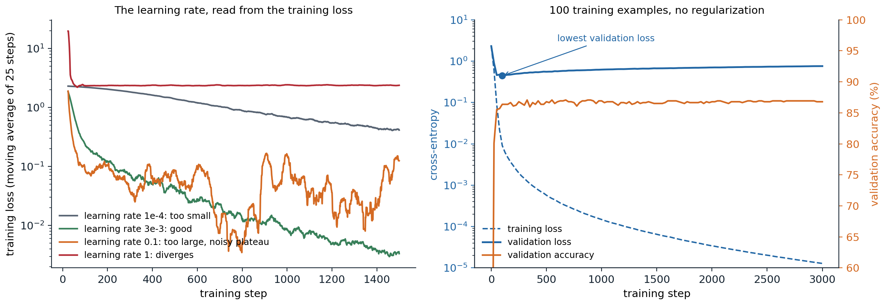
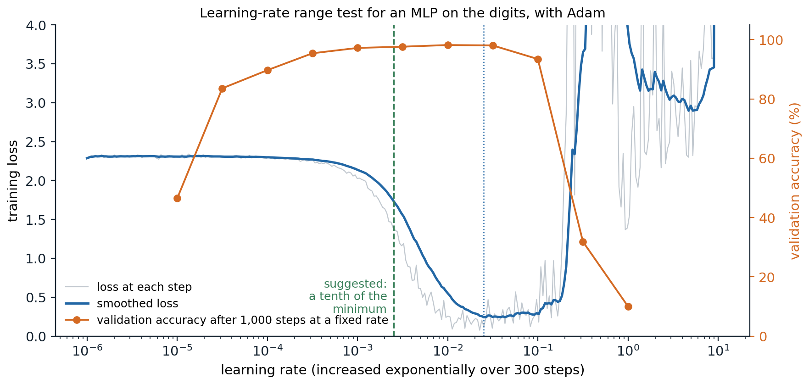
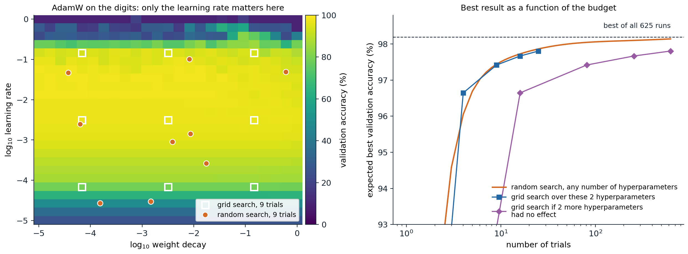

[Background Notes](../README.md) › [Deep Learning](README.md)

# 12. Practical Methodology

[← 11. Training at Scale and Efficient Inference](11-training-at-scale-and-efficient-inference.md) · [13. Graph Neural Networks →](13-graph-neural-networks.md)

## <a id="a-workflow-for-training-networks"></a>A workflow for training networks

### <a id="start-simple"></a>Start simple

Most of the effort in applied deep learning goes into finding out why a network does not work as well as expected, and the failures are rarely loud. A bug in the data pipeline or the loss usually does not crash the program; the network trains anyway, a little worse, and the loss curve looks plausible ([Karpathy, 2019](https://karpathy.github.io/2019/04/25/recipe/)). The defense is a workflow that makes each step checkable before the next is added.

1. **Understand the data.** Look at many examples and their labels. Check the class balance, duplicates between training and test sets, corrupted or mislabeled examples, and whether the inputs carry information about the label that will not exist at deployment, the leakage of [ML chapter 6](../ml/06-losses-model-selection-and-evaluation.md#leakage-and-the-fitting-pipeline).
2. **Fix the evaluation first.** Choose the metric, split the data into training, validation, and test sets in a way that reflects deployment (by time, by user, or by patient when examples are grouped), and do not look at the test set until the end.
3. **Establish baselines.** A constant prediction (the majority class, the mean), a linear model or gradient-boosted trees on simple features ([ML chapter 11](../ml/11-boosting.md)), and a published architecture with its published training recipe. The baselines tell you what "good" means for this problem and catch evaluation bugs: a network that does not beat logistic regression on tabular data is not unusual, but one that does worse than the constant prediction is broken.
4. **Get a small model working end to end**, then grow it. Change one thing at a time and record every run.

Start from a known recipe rather than inventing one: an architecture and optimizer settings that worked on a similar problem are more likely to be close to right than any first guess, and deviations can then be tested one at a time.

### <a id="sanity-checks"></a>Sanity checks

A few checks catch most bugs before any real training.

- **The initial loss.** With small random weights a classifier's predictions are close to uniform, so the cross-entropy at initialization should be close to $`\log C`$ for $`C`$ classes. A much larger value means the output layer's initialization is too large, or that the loss is computed on the wrong quantities.
- **Overfitting a single batch.** A network with enough parameters must be able to drive the training loss on a few dozen examples to nearly zero. If it cannot, something in the model, the loss, or the optimizer is wrong, and no amount of data will fix it.
- **The loss floor.** The loss a correct setup can reach is usually known: zero for a classifier on a batch it can memorize, the noise variance for regression on noisy data. A loss that stalls at another value indicates a bug even when the accuracy looks fine, as in the second run below.
- **What the model actually sees.** Plot the tensors exactly as they enter the network, after loading, augmentation, and normalization, together with their labels. Mismatched labels, images with channels in the wrong order, and normalization applied twice are all visible there and nowhere else.

```python
import math
import torch
import torch.nn.functional as F
from torch import nn
from sklearn.datasets import load_digits

torch.set_num_threads(1)                      # results do not depend on the number of cores

X, y = load_digits(return_X_y=True)
X, y = torch.tensor(X / 16.0, dtype=torch.float32), torch.tensor(y)

def make():
    torch.manual_seed(0)
    return nn.Sequential(nn.Linear(64, 128), nn.ReLU(), nn.Linear(128, 10))

# Check 1: at initialization the predictions are nearly uniform, so the loss should be close to log(10).
with torch.no_grad():
    print(f"initial loss {F.cross_entropy(make()(X), y).item():.3f}; log(10) = {math.log(10):.3f}")

# Check 2: a correct model and training loop can drive the loss on 32 examples to nearly zero.
def overfit(loss_fn, steps=500):
    net = make()
    opt = torch.optim.Adam(net.parameters(), lr=1e-2)
    xb, yb = X[:32], y[:32]
    for _ in range(steps):
        loss = loss_fn(net(xb), yb)
        opt.zero_grad()
        loss.backward()
        opt.step()
    with torch.no_grad():
        return loss_fn(net(xb), yb).item(), (net(xb).argmax(1) == yb).float().mean().item()

print("correct loss:          final training loss %.3f, accuracy %.2f" % overfit(F.cross_entropy))
# A classic bug: applying softmax before a loss that expects logits (it applies log-softmax itself).
# The accuracy still reaches 1, but the loss cannot fall below log(1 + 9/e).
buggy = lambda out, t: F.cross_entropy(out.softmax(1), t)
print("softmax applied twice: final training loss %.4f, accuracy %.2f" % overfit(buggy))
print(f"floor of the buggy loss: log(1 + 9/e) = {math.log(1 + 9 / math.e):.4f}")
# initial loss 2.310; log(10) = 2.303
# correct loss:          final training loss 0.000, accuracy 1.00
# softmax applied twice: final training loss 1.4612, accuracy 1.00
# floor of the buggy loss: log(1 + 9/e) = 1.4612
```

`F.cross_entropy` applies a log-softmax to its input, so the buggy version computes the softmax of probabilities, whose values lie in $`[0,1]`$. The best it can do is put probability $`e^1/(e^1+9e^0)`$ on the correct class, which gives the floor $`\log(1+9/e)`$. The network still learns to classify, and the only symptom is a loss that refuses to fall below 1.46. Custom layers with hand-written backward passes should also be checked against finite differences with `torch.autograd.gradcheck` ([Foundations chapter 6](../foundations/06-numerical-computing-with-numpy-and-pytorch.md#directional-derivatives-and-output-sensitivities)).

## <a id="monitoring-training"></a>Monitoring training

### <a id="reading-learning-curves"></a>Reading learning curves

The training and validation losses, plotted against the number of steps, are the main instruments. Their shapes point to specific problems.



*Left: training loss of a one-hidden-layer MLP on the digits with Adam at four learning rates, averaged over 25 steps. At $`10^{-4}`$ the loss falls steadily but slowly and is still 0.42 after 1,500 steps; at $`3\times10^{-3}`$ it reaches 0.003; at 0.1 it drops fast and then fluctuates around 0.1 without improving; at 1 it jumps to 20 in the first steps and settles near the loss of a constant prediction, $`\log10`$. Right: a two-hidden-layer MLP with 512 units trained on only 100 examples. The training loss falls to $`10^{-5}`$, the validation loss reaches its minimum of 0.44 after 100 steps and then rises to 0.76, while the validation accuracy stays near 87%.*

- **The loss decreases slowly and steadily**: the learning rate is too small, or the model is underpowered; try a larger rate first.
- **The loss falls fast and then stalls at a noisy level**: the learning rate is too large for the final phase; decay it ([chapter 3](03-optimization-for-deep-networks.md#why-the-rate-should-decay)).
- **The loss explodes or becomes NaN**: the learning rate is too large, the initialization is wrong, a numerical operation overflows (a logarithm of zero, a float16 overflow; [chapter 11](11-training-at-scale-and-efficient-inference.md#mixed-precision-training)), or a batch contains corrupted data. Occasional spikes in long runs call for warmup, gradient clipping, and the stabilizers of [chapter 9](09-attention-and-transformers.md#training-transformers).
- **Training and validation losses are both high and close**: the model underfits; train longer or make it larger.
- **The validation loss rises while the training loss keeps falling**: the model overfits. More data, augmentation, and regularization help ([chapter 5](05-regularization-and-generalization-in-deep-networks.md#explicit-regularizers)), and early stopping at the validation minimum is the simplest remedy ([chapter 5](05-regularization-and-generalization-in-deep-networks.md#early-stopping)).

The right panel shows a subtlety. Validation loss and validation accuracy can disagree: after step 100 the network becomes more confident on every validation example, including the ones it gets wrong, which raises the cross-entropy while the fraction of correct answers stays the same. Whether to stop early on the loss or on the accuracy depends on whether calibrated probabilities matter ([ML chapter 5](../ml/05-logistic-regression-and-probabilistic-prediction.md)). Also note that the training loss is often measured with dropout and augmentation switched on, which makes it look worse than the validation loss for reasons that have nothing to do with generalization.

### <a id="looking-inside-the-network"></a>Looking inside the network

When the curves show a problem without explaining it, statistics of the internal quantities help. Forward hooks record activations, and the gradients and updates can be compared layer by layer:

- the **standard deviation of each layer's activations**, which should stay of order one through the network ([chapter 2](02-initialization-and-signal-propagation.md));
- the **fraction of dead units**, ReLUs that output zero for every input of a batch ([chapter 2](02-initialization-and-signal-propagation.md#dead-relus));
- the **gradient norm of each layer**, to find where gradients vanish or explode;
- the **ratio of the update size to the weight size**, $`\|\Delta W\|/\|W\|`$, for each layer. A common rule of thumb for SGD puts a healthy value near $`10^{-3}`$; much smaller means the layer barely learns, much larger means it is being overwritten.

```python
import torch
from torch import nn
from sklearn.datasets import load_digits

digits = load_digits()
X = torch.tensor(digits.data / 16.0, dtype=torch.float32)[:256]
X = (X - X.mean(0)) / (X.std(0) + 1e-6)
y = torch.tensor(digits.target)[:256]

def deep_mlp(init_scale):
    torch.manual_seed(0)
    layers = []
    for d_in in [64] + [256] * 7:
        lin = nn.Linear(d_in, 256)
        nn.init.normal_(lin.weight, std=init_scale * (2 / d_in) ** 0.5)   # init_scale = 1 is He initialization
        nn.init.zeros_(lin.bias)
        layers += [lin, nn.ReLU()]
    return nn.Sequential(*layers, nn.Linear(256, 10))

def inspect(net):
    """Record activation statistics with forward hooks, then gradient and update sizes after one SGD step."""
    stds = []
    hooks = [m.register_forward_hook(lambda m, i, o: stds.append(o.std().item()))
             for m in net if isinstance(m, nn.ReLU)]
    loss = nn.functional.cross_entropy(net(X), y)
    for h in hooks:
        h.remove()
    net.zero_grad()
    loss.backward()
    linears = [m for m in net if isinstance(m, nn.Linear)][:-1]         # the hidden layers
    before = [m.weight.detach().clone() for m in linears]
    torch.optim.SGD(net.parameters(), lr=0.1).step()
    ratios = [((m.weight - b).norm() / b.norm()).item() for m, b in zip(linears, before)]
    return stds, ratios

for scale in (1.0, 0.5, 2.0):
    stds, ratios = inspect(deep_mlp(scale))
    print(f"init scale {scale}: activation std in layers 1, 3, 5, 7:", [f"{s:.2g}" for s in stds[::2]],
          "| update/weight in layers 1 and 8:", f"{ratios[0]:.0e}, {ratios[-1]:.0e}")
# init scale 1.0: activation std in layers 1, 3, 5, 7: ['0.76', '0.74', '0.71', '0.66'] | update/weight in layers 1 and 8: 1e-03, 3e-03
# init scale 0.5: activation std in layers 1, 3, 5, 7: ['0.38', '0.092', '0.022', '0.0051'] | update/weight in layers 1 and 8: 2e-05, 3e-05
# init scale 2.0: activation std in layers 1, 3, 5, 7: ['1.5', '5.9', '23', '84'] | update/weight in layers 1 and 8: 1e-01, 8e-01
```

With He initialization the activations keep a standard deviation near 0.7 through eight layers and the update ratio is about $`10^{-3}`$. Halving the initial weights halves the signal at every layer, down to 0.005 at layer 7, and makes the updates 50 to 100 times smaller; doubling them makes the signal grow to 84 at layer 7 and the updates as large as a tenth of the weights in the first layer and most of them in the last. Tools such as TensorBoard and Weights & Biases log these statistics during training as histograms.

## <a id="choosing-hyperparameters"></a>Choosing hyperparameters

### <a id="what-to-tune"></a>What to tune

Not all hyperparameters matter equally. For a given architecture and optimizer, the **learning rate** is almost always the most important, followed by its schedule, the batch size, weight decay, and other regularization ([Godbole et al., 2023](https://github.com/google-research/tuning_playbook)). The batch size is usually set by the hardware, as large as fits, below the critical batch size of [chapter 3](03-optimization-for-deep-networks.md#the-critical-batch-size), and the learning rate is then retuned, since the best rate grows with the batch size. Adam's defaults for $`\beta_1`$, $`\beta_2`$, and $`\epsilon`$ rarely need tuning at small scale.

The *Deep Learning Tuning Playbook* organizes tuning around the question being asked. When testing whether a change helps, for example a new activation function, that change is the **scientific** hyperparameter; hyperparameters whose best value may depend on it, such as the learning rate, are **nuisance** hyperparameters that must be retuned for each setting to make the comparison fair; the rest are **fixed**. Comparing a new method with a tuned learning rate against a baseline with an untuned one is one of the most common ways to report an improvement that does not exist.

### <a id="the-learning-rate-range-test"></a>The learning-rate range test

A quick way to find a sensible learning rate is to train for a few hundred steps while increasing the rate exponentially, from far too small to far too large, and to plot the loss against the rate ([Smith, 2017](https://arxiv.org/abs/1506.01186)). The loss is flat while the rate is too small, falls once it becomes effective, and blows up when it becomes too large. A rate somewhat below the point where the loss is lowest, often a tenth of it, is a good starting value.



*A range test with Adam on the digits: 300 steps with the learning rate rising from $`10^{-6}`$ to 10. The smoothed loss is lowest at a rate of about 0.025, and a tenth of that, 0.0025, is the suggestion. The orange curve checks the heuristic with full runs of 1,000 steps at fixed rates: validation accuracy is 97% to 98% for rates from $`10^{-3}`$ to $`3\times10^{-2}`$, including the suggestion, and falls to 32% at 0.3 and to chance at 1.*

The test measures which rates make progress in the first few hundred steps, not which rate is best for a long run with a schedule, so its answer is a starting point for a small search rather than a replacement for one.

### <a id="search-strategies"></a>Search strategies

**Grid search** tries every combination of a few values for each hyperparameter; **random search** samples each trial's values independently, usually uniformly on a logarithmic scale for learning rates and weight decays. With the same budget, random search is usually better ([Bergstra and Bengio, 2012](https://jmlr.org/papers/v13/bergstra12a.html)). The reason is that typically only a few hyperparameters matter much, and which ones is not known in advance. A $`3\times3`$ grid tries only three values of each hyperparameter, while nine random trials try nine distinct values of each, so random search explores the important direction more finely. The advantage is small when the good range of the important hyperparameter is wide compared with the grid spacing, and it grows quickly with the number of hyperparameters that do not matter ([Appendix A](#block-dl12-appendix-a)).



*Left: validation accuracy of 625 runs of AdamW on a $`25\times25`$ grid of learning rates and weight decays, each trained for 400 steps. At the best learning rate, accuracy varies by 3.2 points across weight decays, against 88 points across learning rates, so the problem is nearly one-dimensional. Nine grid trials test three learning rates; nine random trials test nine. Right: the best accuracy found as a function of the number of trials, averaged over random placements of the grid and over random draws of the random trials, using the 625 runs as the population of possible outcomes. With two hyperparameters the two strategies do equally well in expectation (97.4% with 9 trials), because good learning rates span two orders of magnitude. If two further hyperparameters had no effect, a grid of 16 trials would test only two learning rates and reach 96.6%, and it would need 81 trials to reach the 97.4% that random search reaches with 9.*

Several refinements go further:

- **Quasi-random** sequences, such as Halton or Sobol sequences, spread the trials more evenly than independent sampling while keeping its advantages; the *Tuning Playbook* recommends them for exploration.
- **Bayesian optimization** fits a probabilistic model of the validation score as a function of the hyperparameters, often a Gaussian process ([ML chapter 15](../ml/15-gaussian-processes.md)), and chooses each new trial where the model predicts a good score or is uncertain ([Snoek, Larochelle, and Adams, 2012](https://arxiv.org/abs/1206.2944)).
- **Early stopping of poor trials.** Successive halving and **Hyperband** ([Li et al., 2018](https://arxiv.org/abs/1603.06560)) start many trials with a small budget, keep the best fraction, and give the survivors more, since learning curves that are far behind early rarely catch up.
- **Population-based training** ([Jaderberg et al., 2017](https://arxiv.org/abs/1711.09846)) trains a population of models in parallel and periodically replaces the worst with copies of the best with perturbed hyperparameters, which yields a hyperparameter schedule rather than a single value.

For very large models, tuning at full scale is unaffordable. Parameterizations such as μP ([Yang et al., 2022](https://arxiv.org/abs/2203.03466)) scale the initialization and per-layer learning rates with the width so that the best hyperparameters found on a small model remain close to optimal for a large one.

## <a id="noise-comparisons-and-reproducibility"></a>Noise, comparisons, and reproducibility

### <a id="how-much-a-single-run-tells-you"></a>How much a single run tells you

Training is random: the initialization, the order of the minibatches, dropout, and augmentation all depend on the seed, and on GPUs even the order of floating-point additions can vary from run to run. Two runs of the same configuration therefore reach different results, and a difference between two configurations means something only if it is large compared with this spread ([Bouthillier et al., 2021](https://arxiv.org/abs/2103.03098)).

```python
import numpy as np
import torch
import torch.nn.functional as F
from torch import nn
from sklearn.datasets import load_digits
from sklearn.model_selection import train_test_split

torch.set_num_threads(1)                      # results do not depend on the number of cores

X, y = load_digits(return_X_y=True)
Xtr, Xva, ytr, yva = (torch.tensor(a) for a in train_test_split(X / 16.0, y, test_size=0.4, random_state=0, stratify=y))
Xtr, Xva = Xtr.float(), Xva.float()

def train(lr, seed, steps=300):
    """The seed controls both the initialization and the order of the minibatches."""
    torch.manual_seed(seed)
    net = nn.Sequential(nn.Linear(64, 128), nn.ReLU(), nn.Linear(128, 10))
    opt = torch.optim.Adam(net.parameters(), lr=lr)
    g = torch.Generator().manual_seed(seed)
    for _ in range(steps):
        idx = torch.randint(0, len(Xtr), (32,), generator=g)
        loss = F.cross_entropy(net(Xtr[idx]), ytr[idx])
        opt.zero_grad()
        loss.backward()
        opt.step()
    with torch.no_grad():
        return (net(Xva).argmax(1) == yva).float().mean().item()

print("same seed, same result:", train(1e-3, 0) == train(1e-3, 0))
results = {lr: np.array([train(lr, seed) for seed in range(10)]) for lr in (1e-3, 2e-3, 3e-3)}
for lr, accs in results.items():
    print(f"learning rate {lr:.0e}: accuracy over 10 seeds {100 * accs.mean():.1f} +- {100 * accs.std(ddof=1):.1f}%,"
          f" range {100 * accs.min():.1f} to {100 * accs.max():.1f}%")
a, b = results[2e-3], results[3e-3]
wins = np.mean([x > z for x in a for z in b])
print(f"single-run comparisons in which 2e-3 beats 3e-3: {wins:.0%}")
# same seed, same result: True
# learning rate 1e-03: accuracy over 10 seeds 93.7 +- 0.5%, range 92.8 to 94.2%
# learning rate 2e-03: accuracy over 10 seeds 95.2 +- 0.4%, range 94.4 to 95.8%
# learning rate 3e-03: accuracy over 10 seeds 95.8 +- 0.6%, range 94.4 to 96.4%
# single-run comparisons in which 2e-3 beats 3e-3: 15%
```

On average the learning rate $`3\times10^{-3}`$ beats $`2\times10^{-3}`$ by 0.6 points, but the spread across seeds is about as large, and a comparison of one run of each would rank them the wrong way 15% of the time. Differences of a few tenths of a point between single runs, which fill many results tables, are well within this noise. The remedies are cheap in principle: run several seeds, report means with an estimate of their uncertainty, and compare configurations with paired tests where possible ([ML chapter 6](../ml/06-losses-model-selection-and-evaluation.md#comparing-two-classifiers)). The tuning budget also matters: a method that needs more trials to tune looks better when every method gets many trials than when every method gets few, so the expected best validation score as a function of the number of trials is a fairer summary than a single best number ([Dodge et al., 2019](https://arxiv.org/abs/1909.03004); [Appendix B](#block-dl12-appendix-b)).

### <a id="silent-bugs"></a>Silent bugs

Some bugs produce plausible numbers. Two of the most common:

```python
import torch
from torch import nn

# Silent bug 1: a prediction of shape (N, 1) minus a target of shape (N,) broadcasts to (N, N).
torch.manual_seed(0)
pred, target = torch.randn(8, 1), torch.randn(8)
print("shape of pred - target:", tuple((pred - target).shape))
print(f"mean squared error: broadcast (wrong) {((pred - target) ** 2).mean():.3f},"
      f" aligned {((pred.squeeze(1) - target) ** 2).mean():.3f}")
# nn.MSELoss warns about this case; a manual formula does not.

# Silent bug 2: evaluating a network with dropout (or batch normalization) in training mode.
net = nn.Sequential(nn.Linear(10, 50), nn.ReLU(), nn.Dropout(0.5), nn.Linear(50, 1))
x = torch.randn(4, 10)
print("training mode, two calls agree:", torch.equal(net(x), net(x)))
net.eval()                                    # dropout off, batch norm uses running statistics
with torch.no_grad():
    print("evaluation mode, two calls agree:", torch.equal(net(x), net(x)))
# shape of pred - target: (8, 8)
# mean squared error: broadcast (wrong) 1.851, aligned 2.095
# training mode, two calls agree: False
# evaluation mode, two calls agree: True
```

Others that recur:

- forgetting `optimizer.zero_grad()`, so gradients accumulate across steps;
- data leakage: normalizing with statistics computed on the whole dataset, near-duplicate examples in training and test sets, or features computed from the future;
- augmentations or random crops applied at evaluation time, or evaluation-time preprocessing that differs from training;
- stepping a learning-rate scheduler once per epoch when it was written for steps, or the reverse;
- applying weight decay to normalization gains and biases, which usually should be excluded;
- labels shifted by one relative to the inputs after a shuffle or a join;
- a loss averaged over padded positions of variable-length sequences ([Foundations chapter 6](../foundations/06-numerical-computing-with-numpy-and-pytorch.md#masks-and-the-denominator-of-an-average)).

### <a id="reproducibility"></a>Reproducibility

A result should be reproducible by its author at least. That requires:

- **Seeds** for every source of randomness: Python's `random`, NumPy, PyTorch, and the workers of data loaders, which each need their own seed derived from the main one.
- **Deterministic kernels** where exact repetition matters: `torch.use_deterministic_algorithms(True)` makes PyTorch use deterministic implementations or raise an error, at some cost in speed. Results can still differ across hardware and library versions.
- **A record of everything**: the code version (a commit hash), the configuration, the library versions, the hardware, and the data version, stored with the metrics and the checkpoints. Experiment trackers such as TensorBoard, Weights & Biases, and MLflow do this bookkeeping.

The final evaluation on the test set should happen once, after all choices have been made on the validation set; every decision made after looking at test results turns the test set into a second validation set and biases the final estimate upward ([ML chapter 6](../ml/06-losses-model-selection-and-evaluation.md#selection-bias-and-nested-cross-validation)).

UMich lecture 11, UNIGE section 5.6, Karpathy's *Recipe for Training Neural Networks*, and the *Deep Learning Tuning Playbook*, listed in the [reading plan](reading-plan.md#12-practical-methodology), cover the practice of training; DLB chapter 11 gives an earlier, still useful account.

## <a id="appendices"></a>Appendices


<details>
<summary><a id="block-dl12-appendix-a"></a><b>A. Why random search beats grid search when few hyperparameters matter</b></summary>


Suppose the validation score depends on only one of $`D`$ hyperparameters, each scaled to $`[0,1]`$, and call a trial good if its value of the important hyperparameter falls in an interval of length $`q`$, for example the best 5% of the range.

**Random search** with $`n`$ independent trials finds at least one good trial with probability

```math
1-(1-q)^n .
```

For $`q=0.05`$ this is 37% with 9 trials, 64% with 20, and 95% with 59, whatever $`D`$ is.

**Grid search** with $`n=k^D`$ trials places only $`k=n^{1/D}`$ distinct values along each axis, spaced $`1/k`$ apart. With the grid placed at a random offset, the probability that one of them falls in the interval is $`\min(1,kq)=\min(1,n^{1/D}q)`$. For $`D=2`$ and $`n=9`$ this is 15%, and reaching 95% requires $`k\ge19`$, that is 361 trials instead of 59. The gap grows with $`D`$: the grid spends its budget on combinations of unimportant values.

If several hyperparameters matter, random search still tries $`n`$ distinct values of each, so its projection onto any subset of important hyperparameters is as dense as possible, while the grid's projection onto $`m`$ important ones has only $`n^{m/D}`$ distinct points.

</details>


<details>
<summary><a id="block-dl12-appendix-b"></a><b>B. Expected best score after $`n`$ trials</b></summary>


Let $`V_1,\ldots,V_n`$ be the validation scores of $`n`$ independent random trials with distribution function $`F`$. The best score $`\max_iV_i`$ has distribution function $`F^n`$, since the maximum is at most $`v`$ exactly when every trial is. Given $`N`$ observed trials with sorted scores $`v_{(1)}\le\cdots\le v_{(N)}`$, replacing $`F`$ by the empirical distribution function $`\hat F(v_{(i)})=i/N`$ gives the estimate

```math
\mathbb E\Bigl[\max_{i\le n}V_i\Bigr]\approx\sum_{i=1}^Nv_{(i)}\Bigl[\Bigl(\frac iN\Bigr)^n-\Bigl(\frac{i-1}N\Bigr)^n\Bigr],
```

the expected maximum of $`n`$ draws with replacement from the observed scores. This is the random-search curve in the figure above, computed from the 625 runs, and the quantity [Dodge et al. (2019)](https://arxiv.org/abs/1909.03004) recommend reporting as a function of $`n`$, so that a method's advantage can be judged at the budget a reader can afford.

</details>

---

[← 11. Training at Scale and Efficient Inference](11-training-at-scale-and-efficient-inference.md) · [13. Graph Neural Networks →](13-graph-neural-networks.md)
