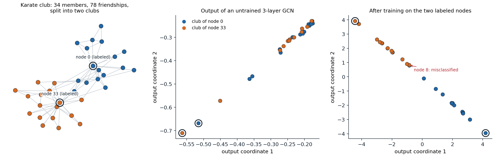
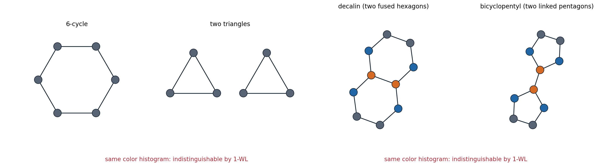
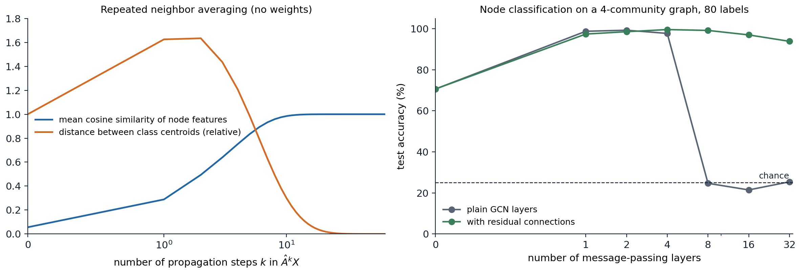

[Background Notes](../README.md) › [Deep Learning](README.md)

# 13. Graph Neural Networks

> [!WARNING]
> Work in progress: this part of the notes is still being revised.

[← 12. Practical Methodology](12-practical-methodology.md) · [14. Detection and Segmentation →](14-detection-and-segmentation.md)

## <a id="graphs-as-inputs"></a>Graphs as inputs

### <a id="graph-data"></a>Graph data

Many data are relations between entities: atoms joined by bonds, users who follow each other, papers that cite each other, roads between intersections, the elements of a mesh. A **graph** $`G=(V,E)`$ has $`n`$ nodes and a set of edges, stored as an **adjacency matrix** $`A\in\{0,1\}^{n\times n}`$ with $`A_{uv}=1`$ when $`u`$ and $`v`$ are joined; each node usually carries a feature vector, the rows of $`X\in\mathbb R^{n\times d}`$, and edges may carry features too. The **degree** of a node is its number of neighbors, and $`D`$ is the diagonal matrix of degrees.

Learning tasks come at three levels:

- **node-level**: classify each user or paper, often with labels for only a few nodes of one large graph and predictions for the rest (**transductive** learning, related to the semi-supervised methods of [ML chapter 16](../ml/16-semi-supervised-and-active-learning.md));
- **edge-level**: predict missing links, such as future friendships or interactions between drugs;
- **graph-level**: predict a property of a whole graph, such as the toxicity or solubility of a molecule, from a dataset of many small graphs (**inductive** learning).

### <a id="permutation-symmetry"></a>Permutation symmetry

The numbering of the nodes is arbitrary. Renumbering them with a permutation matrix $`P`$ changes the data to $`PAP^\top`$ and $`PX`$ but not the graph, so a sensible model must respect it:

- a node-level model must be **permutation equivariant**, $`f(PAP^\top,PX)=Pf(A,X)`$: renumbering the nodes renumbers the predictions;
- a graph-level model must be **permutation invariant**, $`f(PAP^\top,PX)=f(A,X)`$.

A fully connected network applied to the flattened adjacency matrix has neither property, needs a fixed number of nodes, and would have to learn the $`n!`$ equivalent orderings from data. The situation parallels convolutional networks, which build in translation equivariance ([chapter 6](06-convolutional-networks.md)), and transformers without position encodings, which build in permutation equivariance over a set of tokens ([chapter 9](09-attention-and-transformers.md#queries-keys-and-values-from-the-same-sequence)). A graph neural network builds in permutation equivariance while letting only neighboring nodes interact.

## <a id="message-passing"></a>Message passing

### <a id="the-framework"></a>The framework

Almost all graph neural networks are **message-passing** networks ([Gilmer et al., 2017](https://arxiv.org/abs/1704.01212); [Battaglia et al., 2018](https://arxiv.org/abs/1806.01261)). Each node $`v`$ keeps a state $`h_v^{(l)}`$, initialized with its features, and every layer updates all nodes in parallel:

```math
m_v^{(l)}=\bigoplus_{u\in\mathcal N(v)}\psi^{(l)}\bigl(h_v^{(l)},h_u^{(l)},e_{uv}\bigr),\qquad h_v^{(l+1)}=\phi^{(l)}\bigl(h_v^{(l)},m_v^{(l)}\bigr).
```

Each neighbor $`u`$ sends a **message** computed by a learned function $`\psi`$ from the two states and the edge features; the messages are combined by an **aggregation** $`\bigoplus`$ that ignores their order, such as a sum, mean, or maximum; and a learned **update** $`\phi`$ combines the result with the node's own state. Because $`\psi`$ and $`\phi`$ are shared by all nodes and the aggregation is symmetric, the layer is permutation equivariant and works on graphs of any size. After $`L`$ layers, a node's state depends on its $`L`$-hop neighborhood, its receptive field. For graph-level tasks a **readout** sums or averages the final node states into one vector.

### <a id="graph-convolutional-networks"></a>Graph convolutional networks

The **graph convolutional network** (GCN) of [Kipf and Welling (2017)](https://arxiv.org/abs/1609.02907) is the simplest widely used instance. With $`\tilde A=A+I`$, which adds a self-loop to every node, and its degree matrix $`\tilde D`$, one layer computes

```math
H^{(l+1)}=\sigma\bigl(\hat AH^{(l)}W^{(l)}\bigr),\qquad \hat A=\tilde D^{-1/2}\tilde A\tilde D^{-1/2}.
```

Each node averages the transformed states of itself and its neighbors, with the weight $`1/\sqrt{\tilde d_u\tilde d_v}`$ on the edge between $`u`$ and $`v`$, and applies a nonlinearity. The symmetric normalization keeps high-degree nodes from dominating and makes $`\hat A`$ a symmetric matrix with eigenvalues in $`(-1,1]`$.

The name comes from spectral graph theory. The eigenvectors of the graph Laplacian $`L=I-D^{-1/2}AD^{-1/2}`$ play the role of a Fourier basis on the graph, and the eigenvectors with small eigenvalues vary slowly along edges, which is why spectral clustering uses them ([ML chapter 13](../ml/13-clustering.md#beyond-k-means-and-hierarchies)). A graph convolution multiplies each frequency component by a learned response. Early spectral networks ([Bruna et al., 2014](https://arxiv.org/abs/1312.6203)) learned the response directly, which required an eigendecomposition and did not transfer between graphs; ChebNet ([Defferrard, Bresson, and Vandergheynst, 2016](https://arxiv.org/abs/1606.09375)) used polynomials of the Laplacian, which act locally, and the GCN is the first-order case with a simplified normalization ([Appendix A](#block-dl13-appendix-a)). Since $`\hat A`$ keeps low frequencies and damps high ones, a GCN layer is a low-pass filter: it smooths features along the graph.

```python
import networkx as nx
import torch
from torch import nn

class GCNLayer(nn.Module):
    """H' = D^-1/2 (A + I) D^-1/2 H W: average over each node and its neighbors, then a shared linear map."""
    def __init__(self, d_in, d_out):
        super().__init__()
        self.lin = nn.Linear(d_in, d_out, bias=False)

    def forward(self, A, H):
        A_tilde = A + torch.eye(len(A))
        d = A_tilde.sum(1)
        return (A_tilde / torch.sqrt(d[:, None] * d[None, :])) @ self.lin(H)

torch.manual_seed(0)
layer = GCNLayer(8, 4)
for n in (10, 1000):                                          # the same weights work for any number of nodes
    G = nx.gnp_random_graph(n, 0.3 if n == 10 else 0.01, seed=0)
    A = torch.tensor(nx.to_numpy_array(G), dtype=torch.float32)
    print(f"{n:4d} nodes: output shape {tuple(layer(A, torch.randn(n, 8)).shape)}")
print("parameters:", sum(p.numel() for p in layer.parameters()))

# Relabeling the nodes (A -> P A P^T, H -> P H) relabels the output rows in the same way.
G = nx.gnp_random_graph(10, 0.3, seed=0)
A, H = torch.tensor(nx.to_numpy_array(G), dtype=torch.float32), torch.randn(10, 8)
P = torch.eye(10)[torch.randperm(10)]
print("permutation equivariant:", torch.allclose(layer(P @ A @ P.T, P @ H), P @ layer(A, H), atol=1e-6))
# A fully connected layer on the flattened adjacency matrix has no such property.
mlp = nn.Linear(100, 4)
print("MLP on flattened A invariant:", torch.allclose(mlp((P @ A @ P.T).flatten()), mlp(A.flatten())))
#   10 nodes: output shape (10, 4)
# 1000 nodes: output shape (1000, 4)
# parameters: 32
# permutation equivariant: True
# MLP on flattened A invariant: False
```

Real implementations store $`A`$ as a sparse list of edges and compute the aggregation with scatter operations, so a layer costs time proportional to the number of edges; libraries such as PyTorch Geometric and DGL provide them.

### <a id="learning-from-two-labels"></a>Learning from two labels

Zachary's karate club ([Zachary, 1977](https://doi.org/10.1086/jar.33.4.3629752)) is a social network of 34 members that split into two clubs after a dispute between the instructor (node 0) and the administrator (node 33). A GCN with no node features, only the graph, trained with the labels of those two nodes alone, recovers the split of almost everyone else, because the graph convolution spreads the label information along edges.



*Left: the karate club graph, colored by the club each member joined. Middle: the two-dimensional output of a three-layer GCN with random weights and one-hot node features. Nodes that are close in the graph already receive similar outputs, but the clubs overlap. Right: after training the same architecture with a linear classifier on the two labeled nodes, 33 of the 34 members are assigned correctly; the exception, node 8, has friends in both clubs.*

### <a id="sampling-and-attention"></a>Sampling and attention

Two extensions made message passing practical at scale and more flexible. **GraphSAGE** ([Hamilton, Ying, and Leskovec, 2017](https://arxiv.org/abs/1706.02216)) learns aggregation functions that apply to unseen nodes and graphs, and computes each node's state from a fixed-size random sample of its neighbors, so minibatch training works on graphs with billions of edges; a variant recommends items on Pinterest ([Ying et al., 2018](https://arxiv.org/abs/1806.01973)).

**Graph attention networks** (GAT; [Veličković et al., 2018](https://arxiv.org/abs/1710.10903)) replace the fixed weights $`1/\sqrt{\tilde d_u\tilde d_v}`$ by attention weights computed from the two nodes' states, normalized by a softmax over each node's neighbors, with several heads. A GAT layer is a transformer's self-attention with the attention mask set to the adjacency matrix. Conversely, **graph transformers** let every node attend to every other and encode the graph structure as positional information, for example eigenvectors of the Laplacian or shortest-path distances added as attention biases ([Dwivedi and Bresson, 2021](https://arxiv.org/abs/2012.09699); [Ying et al., 2021](https://arxiv.org/abs/2106.05234)), which removes the locality of message passing at quadratic cost.

## <a id="what-message-passing-can-and-cannot-do"></a>What message passing can and cannot do

### <a id="expressive-power-and-the-weisfeilerlehman-test"></a>Expressive power and the Weisfeiler–Lehman test

Can a message-passing network tell any two non-isomorphic graphs apart? It cannot. The **Weisfeiler–Lehman test** (1-WL) is a classical heuristic for graph isomorphism: give every node the same color, then repeatedly recolor each node by the pair (its color, the multiset of its neighbors' colors); if the two graphs end with different color histograms they are not isomorphic. Message passing has the same structure, with learned states in place of colors, and [Xu et al. (2019)](https://arxiv.org/abs/1810.00826) and [Morris et al. (2019)](https://arxiv.org/abs/1810.02244) proved that **no message-passing network can distinguish two graphs that 1-WL cannot**. Conversely, a network whose aggregation is injective on multisets matches 1-WL; the **graph isomorphism network** (GIN) achieves this with sum aggregation followed by an MLP, $`h_v'=\mathrm{MLP}\bigl((1+\epsilon)h_v+\sum_{u\in\mathcal N(v)}h_u\bigr)`$. Mean and maximum aggregation are weaker: they cannot count ([Appendix B](#block-dl13-appendix-b)).



*Two pairs of graphs that 1-WL color refinement cannot distinguish; colors show the refinement after it has stabilized. In a 6-cycle and in two separate triangles every node has two neighbors, so all nodes keep one color. Decalin and bicyclopentyl, two molecules with ten carbon atoms, give the same histogram of four, four, and two nodes of each color, although one contains two hexagons and the other two pentagons.*

```python
import networkx as nx
import torch
from torch import nn

def wl_histogram(G, rounds=3):
    """1-WL color refinement: a node's new color encodes its color and the multiset of its neighbors' colors."""
    color = {v: 0 for v in G}
    for _ in range(rounds):
        signature = {v: (color[v], tuple(sorted(color[u] for u in G[v]))) for v in G}
        palette = {s: k for k, s in enumerate(sorted(set(signature.values())))}
        color = {v: palette[signature[v]] for v in G}
    return sorted(color.values())

hexagon = nx.cycle_graph(6)
triangles = nx.disjoint_union(nx.cycle_graph(3), nx.cycle_graph(3))
print("1-WL color histograms equal:", wl_histogram(hexagon) == wl_histogram(triangles))

# Any message-passing network with the same weights gives the two graphs the same embedding.
torch.manual_seed(0)
mlps = nn.ModuleList(nn.Sequential(nn.Linear(4, 4), nn.ReLU(), nn.Linear(4, 4)) for _ in range(3))

def gin_embedding(G):
    A = torch.tensor(nx.to_numpy_array(G), dtype=torch.float32)
    h = torch.ones(len(A), 4)                               # identical initial features
    for mlp in mlps:
        h = mlp(h + A @ h)                                  # GIN update: own state plus sum over neighbors
    return h.sum(0)                                         # sum readout
print("GIN embeddings equal:", torch.allclose(gin_embedding(hexagon), gin_embedding(triangles)))

# A structural count separates them: the number of triangles is trace(A^3) / 6.
for name, G in [("hexagon", hexagon), ("two triangles", triangles)]:
    A = torch.tensor(nx.to_numpy_array(G))
    print(f"{name}: {int(torch.trace(A @ A @ A).item()) // 6} triangles")

# Mean aggregation loses multiplicities: neighbors {a, b} and {a, a, b, b} have the same mean, different sums.
a, b = torch.tensor([1.0, 0.0]), torch.tensor([0.0, 1.0])
print("mean equal:", torch.equal(torch.stack([a, b]).mean(0), torch.stack([a, a, b, b]).mean(0)),
      "| sum equal:", torch.equal(torch.stack([a, b]).sum(0), torch.stack([a, a, b, b]).sum(0)))
# 1-WL color histograms equal: True
# GIN embeddings equal: True
# hexagon: 0 triangles
# two triangles: 2 triangles
# mean equal: True | sum equal: False
```

Message passing therefore cannot count triangles or cycles, which matter in chemistry (rings) and social networks (clustering). Several remedies go beyond 1-WL: higher-order networks that pass messages between tuples of nodes, as powerful as the $`k`$-dimensional WL test but with cost growing like $`n^k`$ ([Morris et al., 2019](https://arxiv.org/abs/1810.02244); [Maron et al., 2019](https://arxiv.org/abs/1905.11136)); features that count substructures such as cycles around each node ([Bouritsas et al., 2022](https://arxiv.org/abs/2006.09252)); and random or positional node features that break symmetries, at the cost of exact invariance ([Abboud et al., 2021](https://arxiv.org/abs/2010.01179)). In practice, the expressive power needed depends on the task, and many benchmarks are solved well by simple message passing.

### <a id="oversmoothing-and-oversquashing"></a>Oversmoothing and oversquashing

Deep message-passing networks run into two problems of their own. **Oversmoothing**: each GCN layer averages over neighborhoods, and repeated averaging drives all node states in a connected graph toward the same vector, up to degree scaling, so that nodes become indistinguishable ([Li, Han, and Wu, 2018](https://arxiv.org/abs/1801.07606); [Oono and Suzuki, 2020](https://arxiv.org/abs/1905.10947)). The powers $`\hat A^k`$ converge to a rank-one matrix at a rate set by the second-largest eigenvalue in absolute value ([Appendix C](#block-dl13-appendix-c)).

```python
import networkx as nx
import numpy as np

# Repeated propagation with the normalized adjacency converges to a rank-one matrix: every node's
# features become the same multiple of one vector (proportional to sqrt(degree + 1)).
G = nx.karate_club_graph()
A = nx.to_numpy_array(G, weight=None) + np.eye(34)
d = A.sum(1)
A_hat = A / np.sqrt(np.outer(d, d))
eig = np.sort(np.abs(np.linalg.eigvalsh(A_hat)))[::-1]
print(f"largest eigenvalues in absolute value: {eig[0]:.3f}, {eig[1]:.3f}")

u = np.sqrt(d) / np.linalg.norm(np.sqrt(d))                  # eigenvector for the eigenvalue 1
X = np.random.default_rng(0).normal(size=(34, 5))
limit = np.outer(u, u @ X)
for k in (1, 4, 16, 64):
    Xk = np.linalg.matrix_power(A_hat, k) @ X
    rel = np.linalg.norm(Xk - limit) / np.linalg.norm(limit)
    print(f"k = {k:2d}: distance from the rank-one limit {rel:.2e}; bound {eig[1] ** k * np.linalg.norm(X - limit) / np.linalg.norm(limit):.2e}")
# largest eigenvalues in absolute value: 1.000, 0.896
# k =  1: distance from the rank-one limit 2.59e+00; bound 5.87e+00
# k =  4: distance from the rank-one limit 9.27e-01; bound 4.23e+00
# k = 16: distance from the rank-one limit 2.06e-01; bound 1.13e+00
# k = 64: distance from the rank-one limit 1.06e-03; bound 5.87e-03
```

A few rounds of averaging help, because they pool noisy features over nodes that tend to share a label; many rounds destroy the differences between classes.



*A graph of 400 nodes in four communities (edge probability 0.1 within and 0.01 between), with 16 node features that carry a weak class signal under strong noise. Left: propagating the features with $`\hat A`$ and no weights. The distance between the class centroids of the normalized features grows by 60% in the first two steps, as averaging removes noise, then collapses, while the mean cosine similarity of all node pairs rises from 0.06 to 0.96 after 8 steps and to 1 after 32. Right: test accuracy of trained networks of increasing depth with 80 labeled nodes, averaged over three seeds. Without message passing the features alone give 71%; one to four layers give between 97% and 99.6%, with or without residual connections; at 8 layers and beyond, plain GCNs fall to chance, while networks with residual connections keep 94% or more even at 32 layers.*

The collapse of the plain networks at depth 8 is not only oversmoothing: eight steps of averaging still leave some class information, and part of the failure is the difficulty of optimizing a deep network without residual connections or normalization ([Cong, Ramezani, and Mahdavi, 2021](https://arxiv.org/abs/2110.15174)). The remedies are those of [chapter 4](04-normalization-and-residual-connections.md): residual connections, connections back to the input features ([Chen et al., 2020](https://arxiv.org/abs/2007.02133)), and normalization.

**Oversquashing** is the opposite problem. For a node to use information from $`L`$ hops away, messages from a neighborhood that can grow exponentially with $`L`$ must pass through fixed-size vectors and through the few edges that connect parts of the graph, so distant information is compressed away ([Alon and Yahav, 2021](https://arxiv.org/abs/2006.05205)). Adding edges across bottlenecks ("rewiring"; [Topping et al., 2022](https://arxiv.org/abs/2111.14522)), a virtual node connected to all nodes, and global attention in graph transformers all shorten these paths.

### <a id="applications-and-symmetric-architectures"></a>Applications and symmetric architectures

Graph networks predict molecular properties and helped find new antibiotics by screening millions of molecules ([Stokes et al., 2020](https://doi.org/10.1016/j.cell.2020.01.021)), estimate travel times in Google Maps from road-segment graphs ([Derrow-Pinion et al., 2021](https://arxiv.org/abs/2108.11482)), simulate fluids and deformable materials as particles connected to their neighbors ([Sanchez-Gonzalez et al., 2020](https://arxiv.org/abs/2002.09405)), and forecast the weather on a mesh over the globe ([Lam et al., 2023](https://arxiv.org/abs/2212.12794)). For atoms in space, the network must also respect rotations and translations of the coordinates: **equivariant** graph networks build this in, updating vectors that rotate with the input ([Satorras, Hoogeboom, and Welling, 2021](https://arxiv.org/abs/2102.09844)). Convolutional networks, transformers, and graph networks are all instances of one idea, architectures derived from the symmetries of their domain, which the *geometric deep learning* program of [Bronstein et al. (2021)](https://arxiv.org/abs/2104.13478) develops systematically.

UDL chapter 13 and lectures 6 to 9 of Stanford CS224W, listed in the [reading plan](reading-plan.md#13-graph-neural-networks-optional), cover graph neural networks.

## <a id="appendices"></a>Appendices


<details>
<summary><a id="block-dl13-appendix-a"></a><b>A. From spectral filters to the GCN layer</b></summary>


Let $`L=I-D^{-1/2}AD^{-1/2}=U\Lambda U^\top`$ be the normalized Laplacian of a graph, with eigenvalues $`0\le\lambda_i\le2`$ and orthonormal eigenvectors, the graph's Fourier basis. A spectral filter with response $`g`$ maps a signal $`x\in\mathbb R^n`$ to $`Ug(\Lambda)U^\top x`$. Choosing $`g`$ as a polynomial of degree $`K`$, $`g(\Lambda)=\sum_{k=0}^K\theta_k\Lambda^k`$, gives $`\sum_k\theta_kL^kx`$, which needs no eigendecomposition and mixes only nodes within $`K`$ hops, since $`(L^k)_{uv}=0`$ when $`u`$ and $`v`$ are more than $`k`$ edges apart. ChebNet uses Chebyshev polynomials of the rescaled Laplacian for numerical stability.

Kipf and Welling take $`K=1`$, approximate $`\lambda_{\max}\approx2`$, and tie the two coefficients, $`\theta=\theta_0=-\theta_1`$. Then

```math
\theta_0x+\theta_1(L-I)x=\theta\bigl(I+D^{-1/2}AD^{-1/2}\bigr)x .
```

The matrix $`I+D^{-1/2}AD^{-1/2}`$ has eigenvalues in $`[0,2]`$, and repeated application can make activations grow or vanish. The **renormalization trick** replaces it by $`\tilde D^{-1/2}(A+I)\tilde D^{-1/2}`$, whose eigenvalues lie in $`(-1,1]`$. For multichannel features, the scalar $`\theta`$ becomes a matrix $`W`$, giving $`\hat AHW`$. As a filter, $`\hat A=I-\tilde L`$, where $`\tilde L`$ is the normalized Laplacian of the graph with self-loops, has response $`1-\tilde\lambda`$: it passes the smooth components ($`\tilde\lambda`$ near 0) and damps the oscillating ones, the low-pass behavior behind oversmoothing.

</details>


<details>
<summary><a id="block-dl13-appendix-b"></a><b>B. Sum, mean, and maximum as aggregators</b></summary>


An aggregator maps the multiset of neighbor states to a vector. For message passing to be as powerful as 1-WL, it must be **injective**: different multisets must give different results, because 1-WL distinguishes any two different multisets of colors.

- **Sum** is injective on multisets from a countable set: [Xu et al. (2019)](https://arxiv.org/abs/1810.00826) show that there is a function $`f`$ such that $`\sum_{x\in S}f(x)`$ is unique for every finite multiset $`S`$ of bounded size (for example, $`f(x)=N^{-c(x)}`$ for an enumeration $`c`$ of the colors and a bound $`N`$ on the multiset size, which encodes the counts as digits), and an MLP can approximate such $`f`$, followed by another MLP for the update.
- **Mean** identifies multisets with the same proportions: $`\{a,b\}`$ and $`\{a,a,b,b\}`$ have the same mean. It captures the distribution of neighbor states but not the degree, which can be adequate when proportions matter more than counts.
- **Maximum** identifies multisets with the same underlying set: $`\{a,b\}`$ and $`\{a,b,b,b\}`$ give the same coordinatewise maximum. It captures which kinds of neighbors are present.

**The 1-WL bound.** By induction on the layer: if two nodes, in the same or different graphs, have the same 1-WL color after $`l`$ rounds, they have the same state after $`l`$ layers of any message-passing network, because both are computed by the same functions from equal inputs (equal colors mean equal previous colors and equal multisets of neighbor colors, hence, by the induction hypothesis, equal previous states and equal multisets of neighbor states). Equal color histograms therefore give equal multisets of final states and equal readouts.

</details>


<details>
<summary><a id="block-dl13-appendix-c"></a><b>C. Why repeated averaging converges</b></summary>


For a connected graph, $`\hat A=\tilde D^{-1/2}\tilde A\tilde D^{-1/2}`$ is symmetric with eigenvalues $`1=\mu_1>|\mu_2|\ge\cdots\ge|\mu_n|`$. The top eigenvalue is 1 with eigenvector $`u\propto\tilde D^{1/2}\mathbf 1`$, since $`\hat A\tilde D^{1/2}\mathbf 1=\tilde D^{-1/2}\tilde A\mathbf 1=\tilde D^{-1/2}\tilde d=\tilde D^{1/2}\mathbf 1`$. It is simple because the graph is connected (Perron–Frobenius), and every other eigenvalue is larger than $`-1`$ because the self-loops make the graph non-bipartite. Writing $`X=uu^\top X+R`$ with $`u^\top R=0`$,

```math
\hat A^kX=uu^\top X+\hat A^kR,\qquad\|\hat A^kR\|\le|\mu_2|^k\|R\|,
```

so $`\hat A^kX`$ approaches the rank-one matrix $`uu^\top X`$, in which the features of node $`v`$ are $`\sqrt{\tilde d_v}`$ times a common vector, geometrically fast. The rate $`|\mu_2|`$ is close to 1 for graphs with bottlenecks, which converge slowly, and small for well-connected graphs, which smooth out in a few steps. A GCN interleaves the averaging with weight matrices and nonlinearities, which can counteract it, but [Oono and Suzuki (2020)](https://arxiv.org/abs/1905.10947) show that with ReLU and weights of bounded norm the distance to the corresponding low-dimensional subspace still shrinks exponentially with depth.

</details>

---

[← 12. Practical Methodology](12-practical-methodology.md) · [14. Detection and Segmentation →](14-detection-and-segmentation.md)
