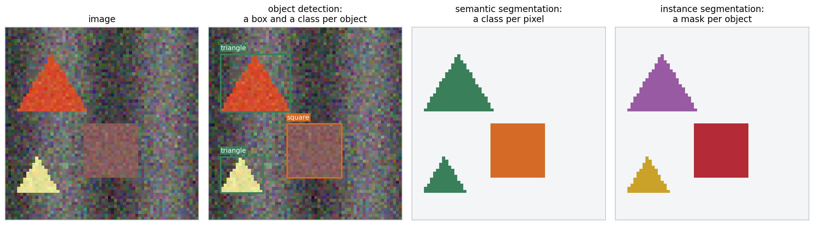
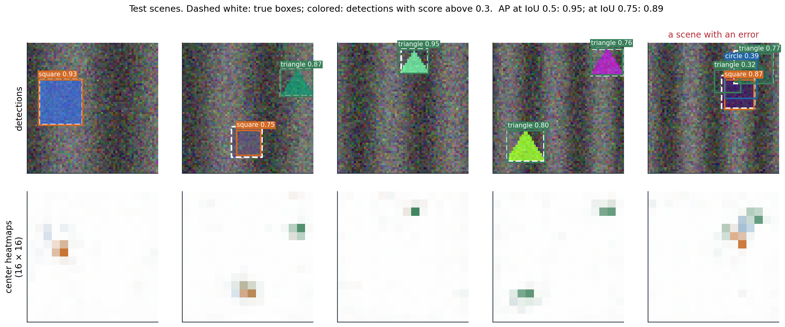
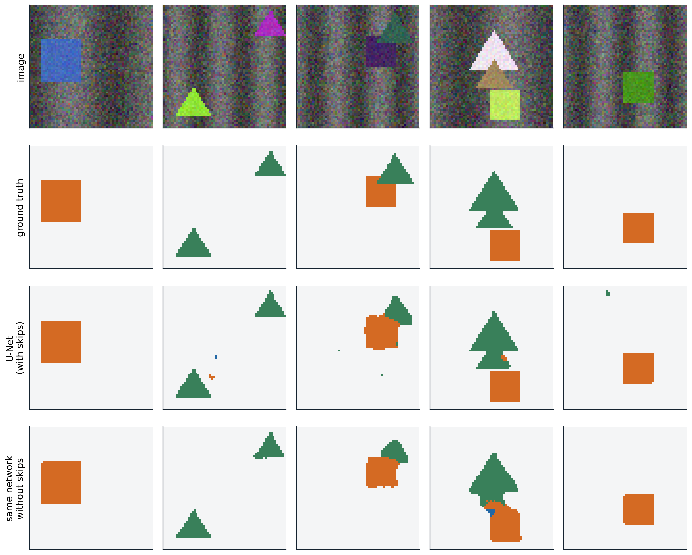

[Background Notes](../README.md) › [Deep Learning](README.md)

# 14. Detection and Segmentation

[← 13. Graph Neural Networks](13-graph-neural-networks.md) · [15. Infinite Width and the Neural Tangent Kernel →](15-infinite-width-and-the-neural-tangent-kernel.md)

## <a id="from-labels-to-locations"></a>From labels to locations

### <a id="four-tasks"></a>Four tasks

Image classification answers what an image contains. Many applications also need to know where: a car must locate pedestrians, a radiologist wants the outline of a tumor, a robot must find the handle it will grasp. Four tasks answer the question at increasing levels of detail.

- **Object detection** outputs a **bounding box**, a class, and a confidence score for every object, however many there are.
- **Semantic segmentation** assigns a class to every pixel, without distinguishing objects of the same class.
- **Instance segmentation** outputs a separate pixel mask for every object.
- **Panoptic segmentation** ([Kirillov et al., 2019](https://arxiv.org/abs/1801.00868)) combines the last two: every pixel gets a class, and pixels of countable objects ("things", such as people and cars) also get an instance identity, while amorphous regions ("stuff", such as sky and road) do not.



*The same synthetic scene annotated for three of the tasks. The two triangles share a class in the semantic segmentation but are separate objects in the detection and in the instance segmentation. The scenes of this chapter's experiments are $`64\times64`$ images of circles, squares, and triangles on a textured background.*

These are **dense prediction** tasks: the output has spatial structure, a variable number of objects or a label per pixel, rather than a single vector. Two design questions follow. How does a network with a fixed output size produce a variable number of objects? And how does a network that downsamples its input to gain a large receptive field ([chapter 6](06-convolutional-networks.md#receptive-fields)) produce outputs at full resolution?

### <a id="measuring-localization"></a>Measuring localization

Detections are compared with ground-truth boxes by their **intersection over union** (IoU), the area of the overlap divided by the area of the union. A detection counts as a true positive if its IoU with an unmatched ground-truth object of the same class exceeds a threshold, conventionally 0.5; each object can be matched once, so duplicate detections count as false positives. Sorting a class's detections by confidence and accumulating true and false positives traces a precision–recall curve ([ML chapter 6](../ml/06-losses-model-selection-and-evaluation.md#roc-and-precisionrecall-curves)), and the area under it is the **average precision** (AP). The mean over classes is **mAP**. The PASCAL VOC benchmark ([Everingham et al., 2010](https://doi.org/10.1007/s11263-009-0275-4)) used an IoU threshold of 0.5; the COCO benchmark ([Lin et al., 2014](https://arxiv.org/abs/1405.0312)) averages AP over thresholds from 0.5 to 0.95, which rewards precise boxes ([Appendix A](#block-dl14-appendix-a)). Semantic segmentation is measured by the IoU of the predicted and true pixel sets of each class, averaged over classes (**mIoU**).

```python
import torch

def box_iou(a, b):
    """Intersection over union of every box in a (n x 4) with every box in b (m x 4); boxes are (x0, y0, x1, y1)."""
    area = lambda x: (x[:, 2] - x[:, 0]) * (x[:, 3] - x[:, 1])
    lt = torch.maximum(a[:, None, :2], b[None, :, :2])          # top-left corners of the intersections
    rb = torch.minimum(a[:, None, 2:], b[None, :, 2:])          # bottom-right corners
    inter = (rb - lt).clamp(min=0).prod(-1)
    return inter / (area(a)[:, None] + area(b)[None, :] - inter)

def nms(boxes, scores, threshold=0.5):
    """Greedy non-maximum suppression: keep the best box, drop boxes overlapping it by more than threshold, repeat."""
    order = scores.argsort(descending=True)
    keep = []
    while len(order) > 0:
        best = order[0]
        keep.append(best.item())
        overlap = box_iou(boxes[best][None], boxes[order[1:]])[0]
        order = order[1:][overlap <= threshold]
    return keep

boxes = torch.tensor([[10, 10, 50, 50], [12, 12, 52, 48], [8, 14, 48, 54],      # three detections of one object
                      [60, 60, 90, 95], [62, 58, 92, 92],                       # two of another
                      [30, 30, 70, 70]], dtype=torch.float32)                   # one overlapping both a little
scores = torch.tensor([0.9, 0.8, 0.75, 0.6, 0.85, 0.3])
print("IoU of boxes 0 and 1:", round(box_iou(boxes[:1], boxes[1:2]).item(), 3))
print("IoU of boxes 0 and 5:", round(box_iou(boxes[:1], boxes[5:6]).item(), 3))
print("kept after NMS:", nms(boxes, scores))

# Average precision for one class: sort detections by score, mark each true or false positive,
# and integrate precision over recall (here with the 101-point interpolation used by COCO).
is_tp = torch.tensor([1, 1, 0, 1, 0, 1, 0, 0, 1, 0], dtype=torch.float32)   # sorted by decreasing score
n_objects = 6
tp, fp = is_tp.cumsum(0), (1 - is_tp).cumsum(0)
recall, precision = tp / n_objects, tp / (tp + fp)
ap = sum((precision[recall >= t].max() if (recall >= t).any() else torch.tensor(0.0)) for t in torch.linspace(0, 1, 101)) / 101
print("recall:", [round(r, 2) for r in recall.tolist()])
print("precision:", [round(p, 2) for p in precision.tolist()])
print(f"average precision: {ap.item():.3f}")
# IoU of boxes 0 and 1: 0.818
# IoU of boxes 0 and 5: 0.143
# kept after NMS: [0, 4, 5]
# recall: [0.17, 0.33, 0.33, 0.5, 0.5, 0.67, 0.67, 0.67, 0.83, 0.83]
# precision: [1.0, 1.0, 0.67, 0.75, 0.6, 0.67, 0.57, 0.5, 0.56, 0.5]
# average precision: 0.662
```

**Non-maximum suppression** (NMS), in the same code, is the standard post-processing step of most detectors: they produce many overlapping candidates for each object, and NMS keeps the highest-scoring one and removes candidates that overlap it by more than a threshold. Box 5, which overlaps both objects only a little, survives. NMS can wrongly remove a second object that overlaps the first heavily, as in crowds; soft-NMS decays the scores of overlapping boxes instead of removing them ([Bodla et al., 2017](https://arxiv.org/abs/1704.04503)).

## <a id="detectors"></a>Detectors

### <a id="two-stage-detectors"></a>Two-stage detectors

The first successful deep detector, **R-CNN** ([Girshick et al., 2014](https://arxiv.org/abs/1311.2524)), proposed about 2,000 candidate regions per image with a classical segmentation algorithm, warped each to a fixed size, classified it with a CNN, and refined its box by regression. Running the CNN 2,000 times per image was slow. **Fast R-CNN** ([Girshick, 2015](https://arxiv.org/abs/1504.08083)) ran the backbone once on the whole image and cut each region's features out of the shared feature map with **RoI pooling**, which max-pools the region into a fixed grid of cells. **Faster R-CNN** ([Ren et al., 2015](https://arxiv.org/abs/1506.01497)) replaced the external proposals by a **region proposal network**: at every position of the feature map, a small convolutional head scores a set of **anchor boxes** of several sizes and aspect ratios as object or background and regresses corrections to their coordinates. The best proposals then go to the second stage, which classifies them and refines their boxes.

Objects vary in size by two orders of magnitude, and deep features are coarse. The **feature pyramid network** (FPN; [Lin et al., 2017](https://arxiv.org/abs/1612.03144)) adds a top-down path that upsamples the coarse, semantically strong features and adds them to finer features from the backbone through lateral connections, and it assigns small objects to fine levels and large objects to coarse ones. Box coordinates are regressed as offsets relative to an anchor or a proposal, normalized by its size, with a smooth $`L_1`$ loss or losses based on IoU itself ([Rezatofighi et al., 2019](https://arxiv.org/abs/1902.09630)).

### <a id="one-stage-detectors-and-the-focal-loss"></a>One-stage detectors and the focal loss

**One-stage** detectors predict classes and boxes directly from the feature map in a single pass: YOLO ([Redmon et al., 2016](https://arxiv.org/abs/1506.02640)) from a coarse grid, SSD ([Liu et al., 2016](https://arxiv.org/abs/1512.02325)) from anchors on several feature maps. They were faster but less accurate than two-stage detectors, and [Lin et al. (2017)](https://arxiv.org/abs/1708.02002) traced the gap to class imbalance. A dense detector evaluates tens of thousands of candidate locations per image, nearly all background and easy to classify; their small losses add up to dominate the gradient. The **focal loss** multiplies the cross-entropy by $`(1-p_t)^\gamma`$, where $`p_t`$ is the predicted probability of the true class, which down-weights well-classified examples. With it, the one-stage RetinaNet matched two-stage detectors in accuracy ([Appendix B](#block-dl14-appendix-b)).

```python
import torch
from scipy.optimize import linear_sum_assignment

# Focal loss: a one-stage detector scores ~10^4 candidate locations per image, almost all easy background.
def focal(p_true, gamma):
    """Loss on examples whose predicted probability of the true class is p_true; gamma = 0 is cross-entropy."""
    return -(1 - p_true) ** gamma * torch.log(p_true)

easy = torch.full((10000,), 0.99)            # background locations already classified with confidence 0.99
hard = torch.full((10,), 0.3)                # a few objects, still poorly classified
for gamma in (0, 2):
    e, h = focal(easy, gamma).sum(), focal(hard, gamma).sum()
    print(f"gamma = {gamma}: share of the loss from the 10,000 easy examples {e / (e + h):.1%}")

# DETR's matching: assign predictions to ground-truth objects one-to-one at minimum total cost.
torch.manual_seed(0)
pred_boxes = torch.rand(5, 4)                # 5 predictions (cx, cy, w, h) for an image with 3 objects
true_boxes = pred_boxes[[3, 0, 4]] + 0.02 * torch.randn(3, 4)
cost = torch.cdist(pred_boxes, true_boxes, p=1)          # L1 box distance; DETR adds class and IoU terms
rows, cols = linear_sum_assignment(cost.numpy())
print("prediction matched to each object:", dict(sorted((int(c), int(r)) for r, c in zip(rows, cols))))
perm = torch.randperm(5)                     # the matched loss does not depend on the order of the predictions
r2, c2 = linear_sum_assignment(cost[perm].numpy())
print("same total cost after shuffling predictions:", bool(torch.isclose(cost[rows, cols].sum(), cost[perm][r2, c2].sum())))
# gamma = 0: share of the loss from the 10,000 easy examples 89.3%
# gamma = 2: share of the loss from the 10,000 easy examples 0.2%
# prediction matched to each object: {0: 3, 1: 0, 2: 4}
# same total cost after shuffling predictions: True
```

Anchors bring hyperparameters, their sizes and aspect ratios, that must be tuned for each dataset. **Anchor-free** detectors avoid them. FCOS ([Tian et al., 2019](https://arxiv.org/abs/1904.01355)) predicts, at each location inside an object, the distances to the four sides of its box. CenterNet ([Zhou, Wang, and Krähenbühl, 2019](https://arxiv.org/abs/1904.07850)) represents each object by its center: the network outputs one heatmap per class whose peaks mark object centers, and at each peak it regresses the box's width and height. Local maxima of the heatmap replace NMS. The figure below trains a small detector of this kind.



*A center-based detector with six convolutional layers and an output stride of 4, trained for 1,500 steps on 2,000 synthetic scenes with a focal loss on the heatmaps and an $`L_1`$ loss on sizes and offsets. Top: detections on test scenes; bottom: the three class heatmaps, colored by class. On 200 test scenes, mAP is 0.95 at an IoU threshold of 0.5 and 0.89 at 0.75: the detector finds the objects reliably, and its boxes are less precise than its classifications. At a score threshold of 0.3, 143 of the 200 scenes are detected without any error; in the rightmost scene, a dark triangle partly hidden behind a square draws two extra detections.*

### <a id="detection-as-set-prediction"></a>Detection as set prediction

NMS and anchors are hand-designed components outside the learned model. **DETR** ([Carion et al., 2020](https://arxiv.org/abs/2005.12872)) removed both by treating detection as the prediction of a set. A CNN backbone produces a feature map, a transformer encoder processes it as a sequence of tokens ([chapter 9](09-attention-and-transformers.md)), and a decoder turns a fixed number of learned **object queries**, for example 100, into 100 predictions, each a class (possibly "no object") and a box. During training, the predictions are matched one-to-one to the ground-truth objects by the **Hungarian algorithm**, which finds the assignment of minimum total cost, and the loss is computed on the matched pairs; unmatched predictions are trained to output "no object". The matching makes the loss independent of the order of the predictions, as the code above checks, and discourages duplicates, since two predictions for the same object cannot both be matched. The decoder's self-attention lets predictions coordinate.

DETR matched Faster R-CNN on COCO but needed very long training and did poorly on small objects. Deformable DETR ([Zhu et al., 2021](https://arxiv.org/abs/2010.04159)) attends only to a few learned sampling points around each query's reference location, on several feature levels, which converges ten times faster; later variants with denoising training and better query initialization became the most accurate detectors ([Zhang et al., 2023](https://arxiv.org/abs/2203.03605)).

## <a id="segmentation"></a>Segmentation

### <a id="fully-convolutional-networks-and-upsampling"></a>Fully convolutional networks and upsampling

A **fully convolutional network** (FCN; [Long, Shelhamer, and Darrell, 2015](https://arxiv.org/abs/1411.4038)) turns a classifier into a segmenter by replacing its fully connected layers with $`1\times1`$ convolutions, which gives a coarse map of class scores, and upsampling that map to the input resolution, with a per-pixel cross-entropy loss. Upsampling can use fixed interpolation or a learned **transposed convolution**, the adjoint of a strided convolution ([chapter 6](06-convolutional-networks.md#computing-convolutions); [Dumoulin and Visin, 2016](https://arxiv.org/abs/1603.07285)):

```python
import torch
import torch.nn.functional as F

torch.manual_seed(0)
x = torch.randn(1, 1, 8, 8)
w = torch.randn(1, 1, 3, 3)

# A strided convolution halves the resolution; the transposed convolution with the same weights maps back.
y = F.conv2d(x, w, stride=2, padding=1)                                     # 8 x 8 -> 4 x 4
z = torch.randn_like(y)
up = F.conv_transpose2d(z, w, stride=2, padding=1, output_padding=1)        # 4 x 4 -> 8 x 8
print("shapes:", tuple(x.shape[2:]), "->", tuple(y.shape[2:]), "->", tuple(up.shape[2:]))
# It is the adjoint (transpose) of the strided convolution: <conv(x), z> = <x, conv_transpose(z)>.
print("adjoint identity holds:", torch.allclose((y * z).sum(), (x * up).sum(), atol=1e-5))

# Uneven overlap: with kernel 3 and stride 2, output pixels receive 1, 2, or 4 contributions,
# which produces checkerboard artifacts unless the network learns to compensate.
counts = F.conv_transpose2d(torch.ones(1, 1, 4, 4), torch.ones(1, 1, 3, 3), stride=2, padding=1, output_padding=1)
print(counts[0, 0, :4, :4].int().tolist())
# Kernel 2 with stride 2 (as in U-Net) tiles the output exactly: every pixel receives one contribution.
print("kernel 2, stride 2, counts:", torch.unique(F.conv_transpose2d(torch.ones(1, 1, 4, 4), torch.ones(1, 1, 2, 2), stride=2)).tolist())
# shapes: (8, 8) -> (4, 4) -> (8, 8)
# adjoint identity holds: True
# [[1, 2, 1, 2], [2, 4, 2, 4], [1, 2, 1, 2], [2, 4, 2, 4]]
# kernel 2, stride 2, counts: [1.0]
```

When the kernel size is not a multiple of the stride, output pixels receive unequal numbers of contributions, which shows up as checkerboard artifacts in generated images; resizing followed by an ordinary convolution avoids them ([Odena, Dumoulin, and Olah, 2016](https://distill.pub/2016/deconv-checkerboard/)).

### <a id="encoderdecoders-with-skip-connections"></a>Encoder–decoders with skip connections

Upsampling a coarse map cannot restore detail that the downsampling discarded. The FCN added predictions from earlier, finer layers; **U-Net** ([Ronneberger, Fischer, and Brox, 2015](https://arxiv.org/abs/1505.04597)), designed for biomedical images with few training examples, made this systematic. A contracting path of convolutions and poolings is mirrored by an expanding path of upsamplings and convolutions, and at every resolution the expanding path concatenates the feature maps of the contracting path. The deep features say what is in a region, the skipped features say exactly where its edges are.



*Semantic segmentation of test scenes by a small U-Net with three poolings to $`8\times8`$, trained for 800 steps, and by the same network without its skip connections. With skips, the mean IoU over the three shape classes is 0.895 and 93.1% of the pixels within one pixel of a class boundary are correct; without skips, 0.881 and 86.5%. The shapes are simple and large, so even the network without skips finds them, and the difference lies mostly at the boundaries.*

A second way to keep resolution is not to lose it. **Dilated** (atrous) convolutions ([chapter 6](06-convolutional-networks.md#padding-stride-and-dilation); [Yu and Koltun, 2016](https://arxiv.org/abs/1511.07122)) enlarge the receptive field without downsampling, and DeepLab ([Chen et al., 2018](https://arxiv.org/abs/1606.00915)) combines them with parallel branches at several dilation rates to capture context at several scales. When a class covers few pixels, as a small lesion does, the per-pixel cross-entropy is dominated by the background, and losses based on the overlap itself, such as the **Dice loss** ([Milletari, Navab, and Ahmadi, 2016](https://arxiv.org/abs/1606.04797)), are common ([Appendix C](#block-dl14-appendix-c)).

### <a id="instance-panoptic-and-promptable-segmentation"></a>Instance, panoptic, and promptable segmentation

**Mask R-CNN** ([He et al., 2017](https://arxiv.org/abs/1703.06870)) extends Faster R-CNN with a third head that predicts a binary mask for each detected object inside its box. It replaced RoI pooling with **RoIAlign**, which samples the feature map by bilinear interpolation at exact, unrounded positions; the rounding in RoI pooling misaligned the features by up to a feature-map cell, which was harmless for classification but not for pixel masks. **Mask2Former** ([Cheng et al., 2022](https://arxiv.org/abs/2112.01527)) unified semantic, instance, and panoptic segmentation in the DETR style: a set of queries each predicts a class and a mask, matched to the ground-truth segments by the Hungarian algorithm.

The **Segment Anything Model** ([Kirillov et al., 2023](https://arxiv.org/abs/2304.02643)) segments whatever a user indicates with a point, a box, or a rough mask, including objects of classes never named in training. It was trained on 1.1 billion masks on 11 million images, collected with a data engine in which the model itself proposed masks for annotators to correct. **Open-vocabulary detectors** such as OWL-ViT ([Minderer et al., 2022](https://arxiv.org/abs/2205.06230)) and Grounding DINO ([Liu et al., 2023](https://arxiv.org/abs/2303.05499)) detect objects described by text, by matching region features against text embeddings as CLIP matches images ([chapter 10](10-self-supervised-representation-learning.md#contrasting-modalities)). As in classification, dense prediction has moved from task-specific models trained on fixed label sets toward large pretrained models that are prompted or fine-tuned.

UMich lectures 15 and 16 and UNIGE sections 7.1, 8.3, and 8.4, listed in the [reading plan](reading-plan.md#14-detection-and-segmentation-optional), cover detection and segmentation.

## <a id="appendices"></a>Appendices


<details>
<summary><a id="block-dl14-appendix-a"></a><b>A. Variants of average precision</b></summary>


For one class, sort the detections by decreasing score and let $`P_k`$ and $`R_k`$ be the precision and recall after the first $`k`$. The raw precision–recall curve zigzags: precision drops at each false positive and recovers at the next true positive. All benchmarks first replace it by its **interpolated** version, $`P_{\text{interp}}(r)=\max_{k:R_k\ge r}P_k`$, the best precision achievable at recall $`r`$ or more, which is non-increasing.

- **PASCAL VOC 2007** averaged $`P_{\text{interp}}`$ at the 11 recall levels $`0,0.1,\ldots,1`$.
- **PASCAL VOC 2010 and later** used the exact area under $`P_{\text{interp}}`$ over all recall levels reached.
- **COCO** averages $`P_{\text{interp}}`$ at 101 recall levels $`0,0.01,\ldots,1`$, as in the code above, and reports AP averaged over ten IoU thresholds $`0.5,0.55,\ldots,0.95`$ and over classes as its main metric, written AP or AP@[.5:.95], together with AP$`_{50}`$ and AP$`_{75}`$ and AP for small, medium, and large objects.

Recall levels beyond the maximum recall contribute zero, so objects that are never detected lower AP directly. Because detections are matched greedily in order of score, AP rewards well-calibrated rankings: a correct detection with a low score counts after the false positives that outrank it.

</details>


<details>
<summary><a id="block-dl14-appendix-b"></a><b>B. The focal loss</b></summary>


For a binary label with predicted probability $`p`$ of the positive class, let $`p_t=p`$ for a positive example and $`1-p`$ for a negative one. The cross-entropy is $`-\log p_t`$, and the **focal loss** is

```math
\mathrm{FL}(p_t)=-\alpha_t(1-p_t)^\gamma\log p_t ,
```

where $`\alpha_t`$ is $`\alpha`$ for positives and $`1-\alpha`$ for negatives. The modulating factor $`(1-p_t)^\gamma`$ is close to 1 for misclassified examples ($`p_t`$ small) and vanishes for well-classified ones: with $`\gamma=2`$, an example with $`p_t=0.9`$ contributes 100 times less than under cross-entropy, and one with $`p_t=0.99`$ contributes $`10^4`$ times less. The weight $`\alpha`$ balances positives and negatives; RetinaNet used $`\gamma=2`$ and $`\alpha=0.25`$.

**Initializing for imbalance.** If the classifier starts at $`p=0.5`$ everywhere, the loss of the many background locations produces a huge gradient in the first steps and destabilizes training. RetinaNet instead initializes the bias $`b`$ of the final sigmoid so that every location starts with a small probability $`\pi`$ of being an object: $`\sigma(b)=\pi`$ gives $`b=-\log\bigl((1-\pi)/\pi\bigr)`$, which is $`-2.19`$ for $`\pi=0.1`$, the value used by the detector in this chapter's figure.

CenterNet's variant, used in that detector, treats the heatmap as soft targets: negatives near an object center are down-weighted by $`(1-y)^\beta`$, where $`y`$ is the value of the Gaussian bump at that location, so that locations adjacent to a center are not penalized as strongly as distant background.

</details>


<details>
<summary><a id="block-dl14-appendix-c"></a><b>C. The Dice loss</b></summary>


For a binary mask with predicted probabilities $`p_i`$ and labels $`y_i\in\{0,1\}`$ over pixels $`i`$, the **Dice coefficient** of hard predictions is $`2|P\cap Y|/(|P|+|Y|)`$, the F1 score of the pixel classification. Its soft version and the loss are

```math
\mathrm{Dice}=\frac{2\sum_ip_iy_i+\epsilon}{\sum_ip_i+\sum_iy_i+\epsilon},\qquad\mathcal L_{\text{Dice}}=1-\mathrm{Dice},
```

with a small $`\epsilon`$ for empty masks. Dice and IoU are monotone functions of each other for hard masks, $`\mathrm{Dice}=2\,\mathrm{IoU}/(1+\mathrm{IoU})`$, so optimizing one optimizes the other. Unlike the pixel-averaged cross-entropy, the Dice loss is normalized by the size of the object, so a small structure matters as much as a large one, which is why it is popular for medical segmentation; it is often added to the cross-entropy, which gives smoother gradients early in training.

</details>

---

[← 13. Graph Neural Networks](13-graph-neural-networks.md) · [15. Infinite Width and the Neural Tangent Kernel →](15-infinite-width-and-the-neural-tangent-kernel.md)
