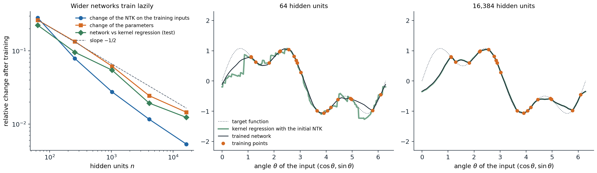
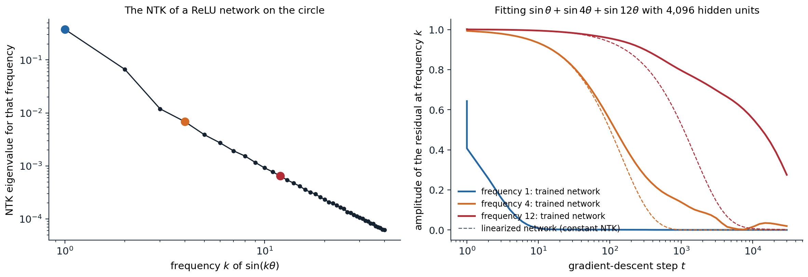

[Background Notes](../README.md) › [Deep Learning](README.md)

# 15. Infinite Width and the Neural Tangent Kernel

[← 14. Detection and Segmentation](14-detection-and-segmentation.md)

## <a id="wide-networks-at-initialization"></a>Wide networks at initialization

### <a id="from-random-networks-to-gaussian-processes"></a>From random networks to Gaussian processes

Deep networks are hard to analyze because their outputs are nonlinear functions of millions of parameters. One tractable limit is infinite width. Consider a network whose weights are drawn independently with variance proportional to the inverse fan-in, as in chapter 2. Each unit of the first hidden layer is a fixed function of the input with random weights, and each unit of the next layer sums $`n`$ such terms with independent random weights. As $`n\to\infty`$, the central limit theorem makes every pre-activation, as a function of the input, a Gaussian process (ML chapter 15). [Neal (1996)](https://doi.org/10.1007/978-1-4612-0745-0) showed this for one hidden layer, and [Lee et al. (2018)](https://arxiv.org/abs/1711.00165) and [Matthews et al. (2018)](https://arxiv.org/abs/1804.11271) for deep networks, in which the kernel follows a recursion over layers:

```math
K^{(l+1)}(x,x')=\sigma_w^2\,\mathbb E_{(u,v)\sim\mathcal N(0,\Sigma^{(l)})}\bigl[\phi(u)\,\phi(v)\bigr]+\sigma_b^2,\qquad \Sigma^{(l)}=\begin{pmatrix}K^{(l)}(x,x)&K^{(l)}(x,x')\\K^{(l)}(x,x')&K^{(l)}(x',x')\end{pmatrix}.
```

This is the **neural network Gaussian process** (NNGP) kernel. For ReLU the expectation has a closed form, the arc-cosine kernel ([Cho and Saul, 2009](https://proceedings.neurips.cc/paper/2009/hash/5751ec3e9a4feab575962e78e006250d-Abstract.html); [Appendix A](#block-dl15-appendix-a)), and in terms of correlations it is the map $`\rho\mapsto\bigl(\sqrt{1-\rho^2}+(\pi-\arccos\rho)\rho\bigr)/\pi`$ that chapter 2 used to study how depth makes inputs look alike. The recursion describes a single wide network as well as an average over networks, because a sum of many independent terms concentrates:

```python
import math
import torch

def relu_correlation(rho):
    """Arc-cosine kernel map: the correlation of ReLU(u) and ReLU(v) for jointly Gaussian u, v with correlation rho."""
    return (math.sqrt(1 - rho ** 2) + (math.pi - math.acos(rho)) * rho) / math.pi

def correlations(n, depth, x, seed):
    """Cosine similarity of the two inputs' representations after each layer of one random ReLU network."""
    torch.manual_seed(seed)
    h, out = x, []
    for _ in range(depth):
        W = torch.randn(h.shape[1], n) * math.sqrt(2 / h.shape[1])   # He initialization, no biases
        h = torch.relu(h @ W)
        out.append((h[0] @ h[1] / (h[0].norm() * h[1].norm())).item())
    return out

torch.manual_seed(0)
x = torch.randn(2, 100)                                        # two random inputs
rho = (x[0] @ x[1] / (x[0].norm() * x[1].norm())).item()
depth, limit = 6, []
for _ in range(depth):
    rho = relu_correlation(rho)
    limit.append(rho)
print("infinite width:", [f"{r:.3f}" for r in limit])
for n in (100, 1000, 4000):
    errs = [max(abs(a - b) for a, b in zip(correlations(n, depth, x, s), limit)) for s in range(5)]
    print(f"width {n:4d}: largest deviation from the limit, mean over 5 networks {sum(errs) / 5:.3f}")
# infinite width: ['0.264', '0.461', '0.583', '0.666', '0.725', '0.769']
# width  100: largest deviation from the limit, mean over 5 networks 0.152
# width 1000: largest deviation from the limit, mean over 5 networks 0.033
# width 4000: largest deviation from the limit, mean over 5 networks 0.017
```

The deviations shrink roughly like $`1/\sqrt n`$. The NNGP kernel gives an exactly solvable model of a Bayesian neural network: exact Bayesian inference with an infinitely wide network and a Gaussian prior on its weights is Gaussian-process regression with this kernel. But it describes networks before training, or trained only in their last layer. What gradient descent does to all the layers is the subject of the tangent kernel.

## <a id="training-in-the-infinite-width-limit"></a>Training in the infinite-width limit

### <a id="linearization-and-the-tangent-kernel"></a>Linearization and the tangent kernel

Write the network as $`f(x;\theta)`$ with parameters $`\theta\in\mathbb R^P`$, trained by gradient descent on a loss over training inputs $`x_1,\ldots,x_N`$. Near the initialization $`\theta_0`$, the first-order Taylor expansion

```math
f(x;\theta)\approx f(x;\theta_0)+\nabla_\theta f(x;\theta_0)^\top(\theta-\theta_0)
```

is a **linear model** in the parameters with fixed features $`\nabla_\theta f(x;\theta_0)`$, one per parameter. Gradient flow on the squared loss $`\frac1{2N}\sum_i\bigl(f(x_i)-y_i\bigr)^2`$ moves the parameters by $`\dot\theta=-\frac\eta N\sum_i\nabla_\theta f(x_i)\bigl(f(x_i)-y_i\bigr)`$, and by the chain rule the function at any input moves by

```math
\frac{d}{dt}f(x)=-\frac\eta N\sum_{i=1}^N\Theta(x,x_i)\bigl(f(x_i)-y_i\bigr),\qquad \Theta(x,x')=\nabla_\theta f(x)^\top\nabla_\theta f(x') .
```

$`\Theta`$ is the **neural tangent kernel** (NTK; [Jacot, Gabriel, and Hongler, 2018](https://arxiv.org/abs/1806.07572)): the inner product of the parameter gradients at two inputs. It says how much a gradient step that reduces the error at $`x_i`$ also changes the output at $`x`$. This equation is exact for any network, but $`\Theta`$ depends on $`\theta`$ and therefore changes during training, which makes the dynamics nonlinear.

### <a id="the-kernel-stays-constant"></a>The kernel stays constant

Jacot et al. showed that in the infinite-width limit, with the **NTK parameterization**, in which each layer's weights are standard normal and the layer's output is divided by $`\sqrt{\text{fan-in}}`$, two things happen. At initialization, $`\Theta`$ converges to a deterministic kernel that can be computed by a recursion like the NNGP one. And during training it stays constant, because each individual weight moves by only $`O(1/\sqrt n)`$ while their combined effect on the output is of order one ([Appendix B](#block-dl15-appendix-b)). Then the linearization is exact, and training a wide network is training a linear model with fixed features ([Lee et al., 2019](https://arxiv.org/abs/1902.06720)). [Chizat, Oyallon, and Bach (2019)](https://arxiv.org/abs/1812.07956) called this **lazy training**: the network fits the data without changing its internal representation.

The code below checks the tangent-kernel equation for one step of gradient descent, and then shows what training the linearized model to convergence produces.

```python
import torch

torch.set_default_dtype(torch.float64)

def network(n, seed):
    """f(x) = a . relu(W x) / sqrt(n) with N(0, 1) weights (the NTK parameterization); x has 3 coordinates."""
    g = torch.Generator().manual_seed(seed)
    return [torch.randn(n, 3, generator=g), torch.randn(n, generator=g)]

def f(params, X):
    W, a = params
    return torch.relu(X @ W.T) @ a / W.shape[0] ** 0.5

def jacobian(params, X):
    """One row per input: the gradient of f(x) with respect to all parameters, flattened."""
    rows = []
    for x in X:
        p = [q.clone().requires_grad_() for q in params]
        rows.append(torch.cat([g.flatten() for g in torch.autograd.grad(f(p, x[None])[0], p)]))
    return torch.stack(rows)

g = torch.Generator().manual_seed(0)
X, y, X_test = torch.randn(5, 3, generator=g), torch.randn(5, generator=g), torch.randn(4, 3, generator=g)
lr = 0.5

# 1. One gradient step changes the outputs by -lr K (f - y) / N, with K the empirical NTK, to first order.
for n in (100, 10000):
    params = network(n, seed=1)
    J = jacobian(params, X)
    r = f(params, X) - y
    predicted = -lr * (J @ J.T) @ r / len(y)
    p = [q.clone().requires_grad_() for q in params]
    loss = 0.5 * ((f(p, X) - y) ** 2).mean()
    stepped = [q - lr * gq for q, gq in zip(params, torch.autograd.grad(loss, p))]
    actual = f(stepped, X) - f(params, X)
    print(f"width {n:5d}: relative error of the kernel prediction for one step {((actual - predicted).norm() / actual.norm()).item():.4f}")

# 2. Gradient descent on the linearized model f0 + J (theta - theta0) converges to kernel regression with the NTK.
params = network(50, seed=2)
J, J_test = jacobian(params, X), jacobian(params, X_test)
f0, f0_test = f(params, X), f(params, X_test)
delta = torch.zeros(J.shape[1])
for _ in range(20000):
    delta -= lr * J.T @ (f0 + J @ delta - y) / len(y)
kernel_regression = f0_test + J_test @ J.T @ torch.linalg.solve(J @ J.T, y - f0)
print("linearized model after training equals kernel regression:", torch.allclose(f0_test + J_test @ delta, kernel_regression, atol=1e-6))
print("and its parameter change is the minimum-norm interpolating one:",
      torch.allclose(delta, torch.linalg.pinv(J) @ (y - f0), atol=1e-6))
# width   100: relative error of the kernel prediction for one step 0.0849
# width 10000: relative error of the kernel prediction for one step 0.0008
# linearized model after training equals kernel regression: True
# and its parameter change is the minimum-norm interpolating one: True
```

### <a id="training-as-kernel-regression"></a>Training as kernel regression

With a constant kernel, the dynamics on the training inputs are linear, $`\dot{\mathbf f}=-\frac\eta N\Theta(\mathbf f-\mathbf y)`$, where $`\mathbf f`$ and $`\mathbf y`$ stack the outputs and targets and $`\Theta`$ is the $`N\times N`$ kernel matrix. The solution is

```math
\mathbf f_t=\mathbf y+e^{-\eta\Theta t/N}(\mathbf f_0-\mathbf y),
```

and at a test input, as $`t\to\infty`$ and if $`\Theta`$ is invertible,

```math
f_\infty(x)=f_0(x)+\Theta(x,X)\,\Theta^{-1}(\mathbf y-\mathbf f_0),
```

kernel regression with the NTK, started from the network's initial function ([Appendix C](#block-dl15-appendix-c)). Among all parameter changes that fit the data, gradient descent on the linear model finds the one of minimum norm, as the code verifies. Two conclusions follow. First, if the smallest eigenvalue of $`\Theta`$ on the training inputs is positive, which holds for distinct inputs and many architectures, the training loss converges to zero exponentially fast: sufficiently wide networks provably reach zero training loss by gradient descent, despite the nonconvexity of the loss in their parameters ([Du et al., 2019](https://arxiv.org/abs/1810.02054); [Allen-Zhu, Li, and Song, 2019](https://arxiv.org/abs/1811.03962)). Second, the function a wide network learns is determined by its kernel, so its generalization can be studied with the tools of kernel methods (ML chapter 8).



*Networks with one hidden ReLU layer in the NTK parameterization, trained by full-batch gradient descent for 4,000 steps on 20 points of the function $`\sin\theta+\frac12\sin3\theta`$ of the angle of an input on the unit circle. Left: from 64 to 16,384 hidden units, the relative change of the parameters falls from 0.26 to 0.015 (a fitted slope of $`-0.54`$ on the log–log scale, close to $`-1/2`$), the relative change of the NTK on the training inputs from 0.28 to 0.005, and the relative distance between the trained network and kernel regression with its initial NTK from 0.23 to 0.012. Middle and right: with 64 units, the trained network is smoother than the jagged kernel prediction of its initial finite-width NTK; with 16,384 units the two curves coincide.*

### <a id="spectral-bias"></a>Spectral bias

The linear dynamics decompose along the eigenvectors of the kernel matrix: the component of the residual along an eigenvector with eigenvalue $`\lambda_k`$ decays like $`e^{-\eta\lambda_kt/N}`$. For inputs on a circle or a sphere and a kernel that depends only on the angle between inputs, the eigenvectors are Fourier modes, or spherical harmonics, and for ReLU networks the eigenvalues fall quickly with the frequency. Networks therefore learn the smooth, low-frequency components of a target first and the high-frequency details later, if ever, a **spectral bias** observed empirically before it was explained by the kernel ([Rahaman et al., 2019](https://arxiv.org/abs/1806.08734); [Cao et al., 2021](https://arxiv.org/abs/1912.01198)).



*Left: the eigenvalue of the empirical NTK of a network with 4,096 hidden units, evaluated on 256 equally spaced points of the circle, for the Fourier mode $`\sin k\theta`$ (measured by its Rayleigh quotient). It falls by a factor of about 56 from frequency 1 to 4 and 590 from 1 to 12. Right: training the network by gradient descent on the sum of three sinusoids of frequencies 1, 4, and 12, and the same gradient descent on its linearization with the initial NTK (dashed). The residual at frequency 1 halves within one step and at frequency 4 within about 130 steps, close to the linearized network. At frequency 12 the linearization predicts 1,100 steps and the network takes 14,900: over 30,000 steps the kernel itself changes, by 0.74 in spectral norm, about a thousand times the eigenvalue of frequency 12, so the constant-kernel approximation, accurate for the fast directions, fails for the slow ones even at this width.*

The figure also shows a limit of the kernel picture. The linearization is accurate in relative terms, but the eigenvalues of high-frequency modes are so small that even a change of the kernel of a few percent exceeds them, and over a long training run the network departs from its linearization precisely in the directions it learns last.

Spectral bias is one explanation of why early stopping regularizes (ML chapter 6): stopping before convergence keeps the low-frequency fit and leaves out the high-frequency components, which are more likely to be noise. It also explains why coordinate networks that represent images or scenes as functions of position struggle with fine detail unless their inputs are first mapped to Fourier features of many frequencies, which reshapes the kernel ([Tancik et al., 2020](https://arxiv.org/abs/2006.10739)).

## <a id="what-the-kernel-limit-explains-and-what-it-misses"></a>What the kernel limit explains and what it misses

### <a id="the-missing-piece-feature-learning"></a>The missing piece: feature learning

In the lazy regime a network is a kernel machine with a kernel fixed at initialization. Its hidden representations do not change, so it cannot learn features, and everything that depends on learned features, such as transfer learning (chapter 7) and the self-supervised representations of chapter 10, is absent from the theory. Empirically, practical networks are far from lazy:

- On CIFAR-10, kernel regression with the exact NTK of a convolutional network reaches 77% accuracy ([Arora et al., 2019](https://arxiv.org/abs/1904.11955)), while the same networks trained normally reach well above 90%.
- For a trained network, the empirical NTK changes rapidly early in training and then aligns with the task, so the kernel at the end of training is much better for the task than the kernel at initialization ([Fort et al., 2020](https://arxiv.org/abs/2010.15110)).
- There are simple problems, such as learning a function of a few directions of a high-dimensional input, that a two-layer network learns with far fewer samples in the feature-learning regime than any kernel method can ([Ghorbani et al., 2019](https://arxiv.org/abs/1906.08899)).

Whether a network trains lazily depends on its scale, not only on its width. [Chizat, Oyallon, and Bach (2019)](https://arxiv.org/abs/1812.07956) showed that multiplying the output of any model by a large factor $`\alpha`$ (and centering it at initialization) forces lazy training, whereas small output scales lead to the **rich regime**, in which features move ([Woodworth et al., 2020](https://arxiv.org/abs/2002.09277)).

### <a id="other-infinite-width-limits"></a>Other infinite-width limits

The NTK limit is one of several. For two-layer networks with the output scaled by $`1/n`$ instead of $`1/\sqrt n`$, the **mean-field** limit describes the hidden units as a population of particles whose distribution evolves by a nonlinear partial differential equation, and the features move by an amount of order one ([Mei, Montanari, and Nguyen, 2018](https://arxiv.org/abs/1804.06561); [Chizat and Bach, 2018](https://arxiv.org/abs/1805.09545); [Rotskoff and Vanden-Eijnden, 2018](https://arxiv.org/abs/1805.00915)). [Yang and Hu (2021)](https://arxiv.org/abs/2011.14522) classified how the initialization variance and the learning rate of each layer can scale with the width and identified the **maximal update parameterization** (μP), the unique scaling in which every layer's features change by an amount of order one as the width grows. In μP, the best hyperparameters become nearly independent of the width, which allows tuning a small model and transferring the settings to a large one ([Yang et al., 2022](https://arxiv.org/abs/2203.03466); chapter 12).

The lesson is that "infinite width" does not define one theory: the limit depends on how the parameterization scales, and the choice decides whether features are learned. Corrections to the infinite-width limit can also be computed as a series in $`1/n`$ and in the ratio of depth to width, which quantifies how far a finite network departs from its kernel ([Roberts, Yaida, and Hanin, 2022](https://arxiv.org/abs/2106.10165)). Kernels computed from infinite-width networks remain useful as baselines, as tools for small-data problems, and for analyzing architectures, and the Neural Tangents library computes them for many architectures ([Novak et al., 2020](https://arxiv.org/abs/1912.02803)).

[Lilian Weng's derivation of the main results](https://lilianweng.github.io/posts/2022-09-08-ntk/), listed in the reading plan, complements this chapter; the scaling questions return in the Safety and Frontier module, where the theory of deep learning is taken further.

## <a id="appendices"></a>Appendices


<details>
<summary><a id="block-dl15-appendix-a"></a><b>A. The NNGP recursion and the arc-cosine kernel</b></summary>


**The recursion.** Let the pre-activations of layer $`l+1`$ be $`z^{(l+1)}_j(x)=\frac{\sigma_w}{\sqrt n}\sum_{k=1}^nW_{jk}\,\phi\bigl(z^{(l)}_k(x)\bigr)+\sigma_bb_j`$ with independent standard normal $`W_{jk}`$ and $`b_j`$. Conditional on layer $`l`$, each $`z^{(l+1)}_j`$ is a Gaussian process with covariance

```math
\mathbb E\bigl[z^{(l+1)}_j(x)z^{(l+1)}_j(x')\,\big|\,z^{(l)}\bigr]=\frac{\sigma_w^2}n\sum_{k=1}^n\phi\bigl(z^{(l)}_k(x)\bigr)\phi\bigl(z^{(l)}_k(x')\bigr)+\sigma_b^2 .
```

If, inductively, the units $`z^{(l)}_k`$ are independent and identically distributed Gaussian processes with kernel $`K^{(l)}`$, the average over $`k`$ converges by the law of large numbers to $`\sigma_w^2\,\mathbb E[\phi(u)\phi(v)]+\sigma_b^2`$ with $`(u,v)`$ Gaussian with covariance $`\Sigma^{(l)}`$, which is the recursion in the text. Different units $`j`$ of layer $`l+1`$ use independent weights, so they are independent. (Making the limit rigorous for all layers at once requires more care; taking the widths to infinity one layer at a time gives the result directly.)

**ReLU.** Let $`u,v`$ have variances $`q_1,q_2`$ and correlation $`\rho=\cos\alpha`$. Writing them as $`u=\sqrt{q_1}\,g_1`$ and $`v=\sqrt{q_2}\,(\rho g_1+\sqrt{1-\rho^2}g_2)`$ with independent standard normals and integrating in polar coordinates gives

```math
\mathbb E\bigl[\max(u,0)\max(v,0)\bigr]=\frac{\sqrt{q_1q_2}}{2\pi}\bigl(\sin\alpha+(\pi-\alpha)\cos\alpha\bigr).
```

For $`\rho=1`$ this is $`q/2`$, so $`\sigma_w^2=2`$ preserves the variance, which is He initialization. Dividing by $`q/2`$ gives the correlation map $`\rho\mapsto\bigl(\sqrt{1-\rho^2}+(\pi-\arccos\rho)\rho\bigr)/\pi`$ used in the code. Its fixed point is $`\rho=1`$ with slope 1 there, which is why correlations of deep ReLU networks creep toward 1 slowly, polynomially in depth rather than exponentially.

</details>


<details>
<summary><a id="block-dl15-appendix-b"></a><b>B. Why the tangent kernel stays constant</b></summary>


Take the one-hidden-layer network $`f(x)=\frac1{\sqrt n}\sum_{j=1}^na_j\phi(w_j^\top x)`$ in the NTK parameterization, with all $`a_j,w_j`$ of order one at initialization. The gradient with respect to $`a_j`$ is $`\phi(w_j^\top x)/\sqrt n`$ and with respect to $`w_j`$ is $`a_j\phi'(w_j^\top x)x/\sqrt n`$, so every coordinate of $`\nabla_\theta f`$ is $`O(1/\sqrt n)`$ while the kernel

```math
\Theta(x,x')=\frac1n\sum_{j=1}^n\Bigl[\phi(w_j^\top x)\phi(w_j^\top x')+a_j^2\phi'(w_j^\top x)\phi'(w_j^\top x')\,x^\top x'\Bigr]
```

is an average of $`n`$ terms of order one, which converges to its expectation, a deterministic kernel.

During training, the loss decreases by an amount of order one, and each step changes each parameter by the learning rate times a gradient coordinate of order $`1/\sqrt n`$. Over the whole of training, $`\|\theta_t-\theta_0\|`$ stays of order one (the output changes by order one along directions where the kernel is of order one), so each individual $`w_j`$ moves by $`O(1/\sqrt n)`$. Each term of the average then changes by $`O(1/\sqrt n)`$, and so does $`\Theta`$. In relative terms, the parameters move by $`\|\theta_t-\theta_0\|/\|\theta_0\|=O(1/\sqrt n)`$, since $`\|\theta_0\|`$ is of order $`\sqrt n`$, as the figure measures.

The same argument fails in the mean-field parameterization, where the output is divided by $`n`$: the gradient coordinates are then $`O(1/n)`$, so the learning rate must be scaled up by $`n`$ to train at all, after which each parameter moves by an amount of order one, and the kernel changes.

</details>


<details>
<summary><a id="block-dl15-appendix-c"></a><b>C. Solving the kernel dynamics</b></summary>


With a constant kernel, the vector of training outputs obeys $`\dot{\mathbf f}=-\frac\eta N\Theta(\mathbf f-\mathbf y)`$, a linear system whose solution is $`\mathbf f_t-\mathbf y=e^{-\eta\Theta t/N}(\mathbf f_0-\mathbf y)`$. Diagonalizing $`\Theta=\sum_k\lambda_kv_kv_k^\top`$, the residual's component along $`v_k`$ decays like $`e^{-\eta\lambda_kt/N}`$, which gives the spectral bias. At a test input,

```math
\dot f_t(x)=-\frac\eta N\Theta(x,X)(\mathbf f_t-\mathbf y)=-\frac\eta N\Theta(x,X)e^{-\eta\Theta t/N}(\mathbf f_0-\mathbf y),
```

and integrating from 0 to $`t`$,

```math
f_t(x)=f_0(x)+\Theta(x,X)\,\Theta^{-1}\bigl(I-e^{-\eta\Theta t/N}\bigr)(\mathbf y-\mathbf f_0),
```

which tends to kernel regression without regularization as $`t\to\infty`$. At finite $`t`$, the factor $`I-e^{-\eta\Theta t/N}`$ acts like the spectral filter of ridge regression, $`\Theta(\Theta+\lambda I)^{-1}`$, suppressing the eigen-directions with $`\lambda_k\ll N/(\eta t)`$: early stopping is approximately a kernel ridge penalty that decreases as training continues. Because $`f_0`$ is a random function (the NNGP at initialization), the predictions of an ensemble of infinitely wide networks are Gaussian, with mean $`\Theta(x,X)\Theta^{-1}\mathbf y`$ and a variance determined by both the NNGP and the NTK ([Lee et al., 2019](https://arxiv.org/abs/1902.06720)).

</details>

---

[← 14. Detection and Segmentation](14-detection-and-segmentation.md)
