[Background Notes](../README.md) › [Foundations](README.md)

# 1. Terminology and Mathematical Language

[2. Linear Algebra →](02-linear-algebra.md)

## <a id="disciplines"></a>Disciplines

### <a id="artificial-intelligence"></a>Artificial intelligence

[Artificial intelligence (AI)](https://en.wikipedia.org/wiki/Artificial_intelligence) is the capability of computational systems to perform tasks typically associated with human intelligence, such as learning, reasoning, problem-solving, perception, and decision-making.

The same term names the field of research that studies how to build such systems. Its methods include search, logical reasoning, planning, and learning from data. These methods can be combined: a system may learn to recognize objects and then use a planning algorithm to decide what to do.

**Example: Deep Blue and chess.** On 10 February 1996, IBM's Deep Blue won a game against reigning world chess champion Garry Kasparov under standard tournament time controls. Kasparov recovered to win that six-game match 4–2. In the May 1997 rematch, Deep Blue won the match itself, 3½–2½. Its central mechanism was game-tree search: examine possible moves and replies, score positions using chess-specific knowledge, and use those scores to choose a move. Searching over consequences is one way to produce intelligent behavior; a chess program can do this with fixed, human-designed rules and an evaluation function.

*[Copyrighted photograph not reproduced here ([source](https://www.rtve.es/deportes/20210210/ajedrez-kasparov-deep-blue-aniversario/2074420.shtml)).]*

*Kasparov on the left, with Deep Blue's computer terminal on the right, during the 1996 match in Philadelphia.*

Deep Blue illustrates the search-based tradition of AI. There is a historical qualification: most of its evaluation features and weights were designed or tuned by hand, but automated training helped tune some evaluation weights. It was therefore not wholly free of learning. The system paper describes both its search architecture and this limited training component: [Campbell, Hoane, and Hsu, “Deep Blue” (2002), §§2 and 7.3](https://research.ibm.com/publications/deep-blue).

### <a id="machine-learning"></a>Machine learning

[Machine learning (ML)](https://en.wikipedia.org/wiki/Machine_learning) is a field of study within AI concerned with the development and study of statistical algorithms that can learn from data and generalize to unseen data, and thus perform tasks without having every task-specific rule explicitly programmed.

Statistics and mathematical optimization are important foundations of machine learning.

**Example: learning to identify an iris species.** Suppose we collect flowers whose species are known and measure their petals. A [decision tree](https://en.wikipedia.org/wiki/Decision_tree_learning) can learn a sequence of questions that separates the labeled examples. The tree below was fitted to the petal measurements in the [Iris dataset](https://archive.ics.uci.edu/dataset/53/iris). Its learning algorithm selected the splitting questions, numerical thresholds, and labels at the leaves from the data.

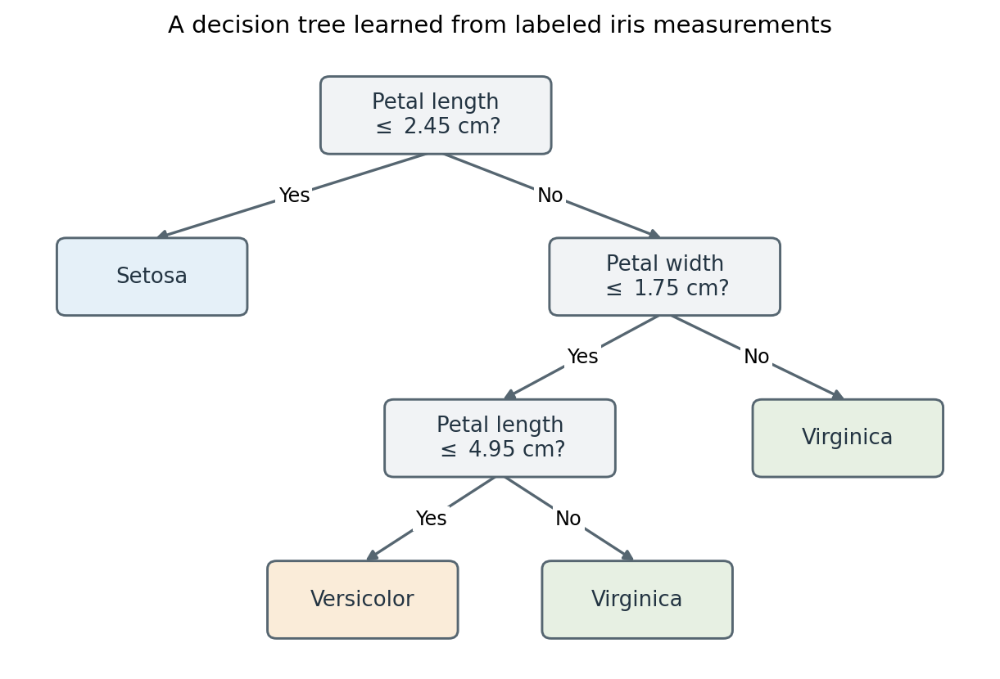

*For a new flower with petal length 4.5 cm and width 1.2 cm, the answers No, Yes, Yes lead to “Versicolor.” The tree misclassifies four of its 150 training flowers.*

This is machine learning without [deep learning](https://en.wikipedia.org/wiki/Deep_learning): the learned model is a small tree of tests. The tree has a depth, but “deep learning” conventionally refers to learning layered representations in [neural networks](https://en.wikipedia.org/wiki/Neural_network_%28machine_learning%29), not merely to having a tree with many branches. Once the tree is fitted, applying its questions to a new flower is prediction; the thresholds do not change during that computation.

### <a id="deep-learning"></a>Deep learning

In machine learning, deep learning (DL) uses multilayered neural networks for tasks such as [classification](https://en.wikipedia.org/wiki/Statistical_classification), [regression](https://en.wikipedia.org/wiki/Regression_analysis), and [representation learning](https://en.wikipedia.org/wiki/Representation_learning) (also called feature learning). The adjective "deep" refers to composing many layers of transformations.

**Example: recognizing a handwritten digit.** A digit recognizer receives an image and predicts one of the labels 0 through 9. In a neural network, the input pixels pass through learned transformations before producing the output. With several hidden layers, the representation at one layer becomes the input to the next. The network's weights can be trained jointly from labeled images.

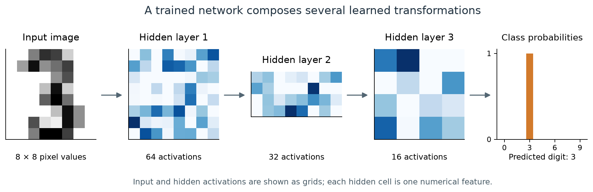

*An actual prediction by a small trained network: 64 input values pass through hidden layers with 64, 32, and 16 units, then produce ten class probabilities. The image was held out from training. Each blue cell shows one unit's activation; darker blue means a larger value within that layer. The hidden vectors are arranged as grids for display, not as spatial pictures of detected strokes.*

The hidden activations are learned [features](https://en.wikipedia.org/wiki/Feature_%28machine_learning%29) of the image, although individual units need not have an easily named meaning. The last layer uses them to distinguish digits. This example uses a fully connected network and the [UCI optical digits data distributed with scikit-learn](https://scikit-learn.org/stable/modules/generated/sklearn.datasets.load_digits.html). A historically influential document-recognition system used convolutional networks: [LeCun et al., “Gradient-Based Learning Applied to Document Recognition” (1998)](https://bottou.org/papers/lecun-98h).

The ten outputs form a probability distribution over the labels: they are nonnegative and sum to one. For a clearly written digit, nearly all of the probability falls on one class, as above. When an image resembles two digits, the network divides its probability between them.

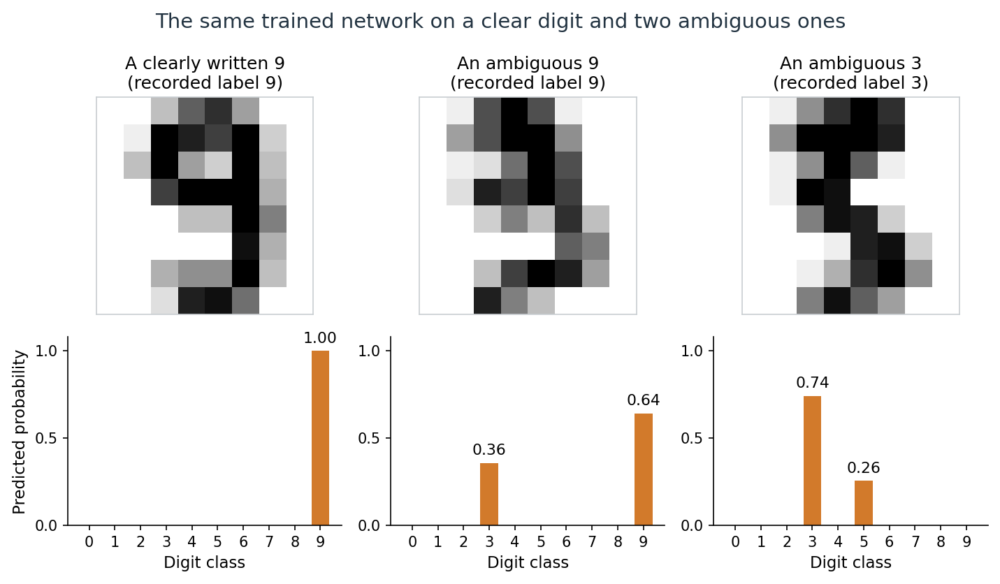

*The network gives probability 1.00 to the clear 9. The middle image, recorded as a 9, receives 0.64 for 9 and 0.36 for 3; the right image, recorded as a 3, receives 0.74 for 3 and 0.26 for 5. The network has the architecture above but was trained separately, and all three images were held out from training.*

These are the network's estimates for an $`8\times8`$ image, not the fraction of people who would read it each way. Whether predicted probabilities agree with observed frequencies is the question of calibration. Simpler methods, such as nearest neighbors, recognize these small images about as well as the network; [Appendix A](#block-terminology-appendix-a) compares them and summarizes why deep networks prevailed on harder images.

## <a id="learning-from-experience"></a>Learning from experience

Tom M. Mitchell, [*Machine Learning* (1997)](https://www.cs.cmu.edu/~tom/mlbook.html):

> A computer program is said to learn from experience _E_ with respect to some class of tasks _T_ and performance measure _P_ if its performance at tasks in _T_, as measured by _P_, improves with experience _E_.

An ML system can be described along several dimensions. The learning paradigm specifies the available feedback; the learning setting specifies when examples arrive and the model is updated; the task specifies the required result. Models and algorithms describe the mathematical objects and procedures used to obtain that result.

| Dimension | Question | Examples |
| --- | --- | --- |
| Learning paradigm | What feedback is available? | [Supervised](https://en.wikipedia.org/wiki/Supervised_learning), [unsupervised](https://en.wikipedia.org/wiki/Unsupervised_learning), [reinforcement learning](https://en.wikipedia.org/wiki/Reinforcement_learning) |
| Learning setting | When does learning occur? | Offline or online learning |
| Task | What result is required? | A class label, numerical prediction, grouping, or distribution |
| Model and algorithm | What is represented, and how is it learned? | A linear predictor fitted by [gradient descent](https://en.wikipedia.org/wiki/Gradient_descent) |
| Learning, prediction, and action | What is the system doing at a particular point? | Updating a model, computing an output, or acting on it |

These descriptions can apply together. For example, a classifier can be trained by supervised learning on an offline dataset and then used to make predictions as new inputs arrive. [Statistical learning theory](https://en.wikipedia.org/wiki/Statistical_learning_theory) studies how learning algorithms use data to construct predictors and how well those predictors generalize to unseen examples.

### <a id="learning-paradigms"></a>Learning paradigms

The usual broad distinction is between learning from labeled examples, learning from unlabeled data, and learning through interaction and rewards. [Self-supervision](https://en.wikipedia.org/wiki/Self-supervised_learning) and related settings further specify how a learning signal is obtained.

#### <a id="supervised-learning"></a>Supervised learning

Supervised learning (SL) learns an input-output relationship from [labeled data](https://en.wikipedia.org/wiki/Labeled_data): each training input is paired with an observed target. The supervision is supplied by these targets, which may contain noise or annotation errors. For example, a model can learn to identify cats from images labeled "cat" or "not cat".

The goal of supervised learning is for the trained model to accurately predict the output for new, unseen data. This requires the learned model to effectively *generalize* beyond its training examples. Its *generalization error* is its expected loss on new examples from the relevant distribution; held-out data is used to estimate this quantity.

Supervised learning is commonly used for tasks such as classification (predicting a category, e.g., spam or not spam), regression (predicting a numerical value, e.g., a house price), and conditional [density estimation](https://en.wikipedia.org/wiki/Density_estimation) (predicting the probability distribution of the output given an input, denoted by $`p(y \mid x)`$).

#### <a id="unsupervised-learning"></a>Unsupervised learning

Unsupervised learning finds structure in unlabeled data. It can be a goal in itself, such as discovering groups, or a way to learn representations for another task.

Examples of unsupervised methods include [clustering algorithms](https://en.wikipedia.org/wiki/Cluster_analysis) like [k-means](https://en.wikipedia.org/wiki/K-means_clustering), [dimensionality reduction](https://en.wikipedia.org/wiki/Dimensionality_reduction) techniques like [principal component analysis (PCA)](https://en.wikipedia.org/wiki/Principal_component_analysis), and models such as [Boltzmann machines](https://en.wikipedia.org/wiki/Boltzmann_machine) and [autoencoders](https://en.wikipedia.org/wiki/Autoencoder). Many modern unsupervised methods train neural network architectures by gradient descent, using an objective suited to learning from unlabeled data.

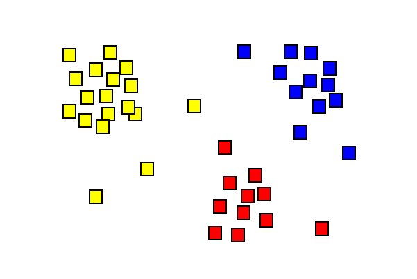

*Clustering groups nearby observations. The colors show an example grouping; they need not have been supplied as training labels. The result depends on the representation and the chosen notion of similarity.*

#### <a id="self-supervision-and-related-settings"></a>Self-supervision and related settings

In self-supervised learning, a training signal is constructed from the data itself. For example, a language model can receive the beginning of a sentence and learn to predict the next token, whose identity is already present in the original text. The prediction problem has an input and a target, but a person does not need to annotate each pair separately. This is useful for distinguishing the form of the prediction task from the way its supervision is obtained.

[Semi-supervised learning](https://pages.cs.wisc.edu/~jerryzhu/research/ssl/semireview.html) combines labeled and unlabeled data. [Weak supervision](https://cs.nju.edu.cn/zhouzh/zhouzh.files/publication/nsr18.pdf) uses incomplete, imprecise, or noisy supervision; semi-supervised learning is often included under this broader term. Self-supervision is often grouped with unsupervised learning because it does not require externally supplied labels, although the constructed prediction problem has inputs and targets.

#### <a id="reinforcement-learning"></a>Reinforcement learning

In machine learning and [optimal control](https://en.wikipedia.org/wiki/Optimal_control), reinforcement learning (RL) is concerned with how an intelligent agent should take actions in an environment to maximize expected cumulative reward. It is closely related to approximate dynamic programming.

While supervised learning and unsupervised learning algorithms respectively attempt to discover patterns in labeled and unlabeled data, reinforcement learning uses experience consisting of actions, rewards, and observations or states. During online interaction, the agent makes decisions between trying new actions to learn more about the environment (exploration), or using current knowledge of the environment to take the best action (exploitation). The search for the optimal balance between these two strategies is known as the [exploration–exploitation dilemma](https://en.wikipedia.org/wiki/Exploration–exploitation_dilemma).

A standard mathematical framework is a [Markov decision process](https://en.wikipedia.org/wiki/Markov_decision_process). Classical [dynamic programming](https://en.wikipedia.org/wiki/Dynamic_programming) methods for solving an MDP use its transition and reward model. Model-free RL learns without explicitly constructing that model; model-based RL uses a model, which may itself be learned from experience. RL includes both small tabular problems and large problems requiring function approximation. [Sutton and Barto, Chapters 3–4](http://incompleteideas.net/book/RLbook2020.pdf)

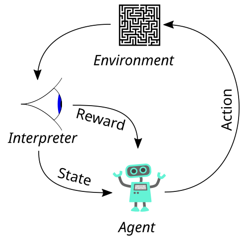

*The agent–environment loop: actions affect the environment, and observations and rewards provide feedback.*

**How RL differs from supervised and unsupervised learning.** In supervised and unsupervised learning, the data are given, and the model's outputs do not change them. An RL agent's actions change the states and rewards it observes next, so in online RL the data are produced by the behavior being learned. Its reward also says how good the chosen action was, not which action would have been best. [Appendix B](#block-terminology-appendix-b) compares the three paradigms in more detail.

### <a id="online-and-offline-learning"></a>Online and offline learning

In **offline learning**, training uses a dataset collected beforehand, and the fitted model is then used without updating it during prediction. New versions can still be trained periodically. Fitting a model and applying the fitted model are separate activities.

In [online learning](https://en.wikipedia.org/wiki/Online_machine_learning), the learner updates as examples become available in sequence. In a typical supervised setting, it predicts an output, receives the corresponding feedback, and uses that feedback to improve subsequent predictions. Feedback can be delayed. For example, a demand predictor could update after each day's actual demand becomes known. This sequential prediction-and-feedback formulation is developed in Shalev-Shwartz and Ben-David, [*Understanding Machine Learning*, Chapter 21](https://www.cs.huji.ac.il/~shais/UnderstandingMachineLearning/understanding-machine-learning-theory-algorithms.pdf#page=287).

| Offline learning | Online learning |
| --- | --- |
| Fits a model using a previously collected dataset | Updates a model as further examples arrive |
| Keeps the deployed model fixed between training runs | Interleaves prediction and model updates |
| Can revisit stored examples over multiple passes | Often processes an evolving stream with limited storage |

The online/offline distinction concerns learning from data over time; it does not refer to whether the computer is connected to the internet. Either setting can use supervised signals. Clustering and other unsupervised methods can also have online variants.

**Batch learning and mini-batches.** Offline learning is also called batch learning. However, using [mini-batch stochastic gradient descent](https://en.wikipedia.org/wiki/Stochastic_gradient_descent) does not by itself make a system online: an offline training run can process a fixed dataset in small batches over many passes. The training setting and the size of each optimization step are separate choices.

**Reinforcement learning and interaction.** For RL, the online/offline distinction concerns who collected the interaction data. In online RL, the agent gathers its own experience: it acts with its current policy, observes the consequences, updates the policy, and acts again. The data change as the policy changes. In [offline reinforcement learning](https://arxiv.org/abs/2005.01643), the agent receives a fixed log of states, actions, and rewards recorded while some other policy was acting, such as past treatment decisions by clinicians, and it cannot try new actions. This is still RL: the goal is a policy that chooses actions to maximize cumulative reward, and that policy will generally act differently from the one that produced the log. The main difficulty is evaluating actions that the log rarely or never contains; see Offline Reinforcement Learning. Thus RL is not synonymous with online learning. Conversely, online supervised learning is not RL: an online spam filter receives newly labeled emails, but its predictions do not choose which emails arrive next.

## <a id="tasks-models-and-learning-algorithms"></a>Tasks, models, and learning algorithms

### <a id="from-problems-to-abstract-tasks"></a>From problems to abstract tasks

A practical problem includes an application, its constraints, and a criterion for success. An **abstract task** describes a reusable mathematical part of that problem. Classification and regression are examples of such tasks. A solution to the abstract task must still be integrated into the surrounding application.

An **instance** is one example being considered. A **feature** is an attribute used to represent it, and a **target** is the output to be predicted. For instance, an email may be represented by word counts and sender information, with a target label indicating spam or legitimate mail. A supervised dataset can be written as

```math
D=\{(x_i,y_i)\}_{i=1}^{n},
```

where $`x_i\in\mathcal X`$ is the input representation and $`y_i\in\mathcal Y`$ is its target. Here $`D`$ is an indexed collection: repeated examples are allowed. The input must contain only information available at prediction time. An unlabeled dataset contains the inputs without supplied targets. A task formulation determines what belongs in these spaces and what counts as a useful output.

### <a id="tasks"></a>Tasks

| Task | Required result | Example |
| --- | --- | --- |
| Classification | Assign an input to a category; a probabilistic classifier can also estimate class probabilities | Classify an email as spam or legitimate |
| Regression | Predict a numerical value or vector | Predict electricity demand from time and temperature |
| Clustering | Group examples according to a chosen notion of similarity | Discover groups of documents without topic labels |
| Dimensionality reduction | Construct a representation using fewer dimensions | Map a large feature vector to a small set of coordinates |
| Density estimation | Estimate a probability density, or a probability mass function for discrete data | Estimate the distribution of waiting times between a geyser's eruptions |
| [Anomaly detection](https://en.wikipedia.org/wiki/Anomaly_detection) | Identify examples that differ from expected patterns | Flag unusual sensor readings |
| Sequential decision-making | Choose actions while accounting for their future consequences | Choose a sequence of moves in a game |

Tasks and learning paradigms describe different aspects of a problem. Classification is commonly supervised, but targets can also be constructed through self-supervision. Anomaly detection can use labeled anomalies, examples of normal behavior, or entirely unlabeled data. A task name alone does not specify how training feedback is obtained.

#### <a id="classification"></a>Classification

In the iris example, the input is a pair of measurements, $`x=(x_1,x_2)^\top`$, and the target is one of three species. A classifier partitions the input space into regions assigned to different labels. Its **decision boundary** separates regions where its predicted label changes.

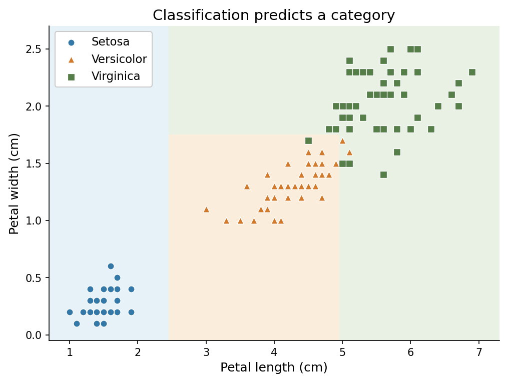

*Marker colors and shapes give observed species; background colors give the tree's predictions. Each question draws one axis-parallel boundary, so the Versicolor region is bounded by both measurements. A marker in a differently colored region is misclassified; one of the four, a Versicolor at 4.8 cm by 1.8 cm, is hidden beneath two Virginica flowers with the same measurements. These flowers were used to fit the tree, so the plot does not measure generalization.*

#### <a id="regression"></a>Regression

Suppose the input is an apartment's floor area and the target is its monthly rent. Regression predicts a numerical quantity, here measured in dollars per month. In the illustration, fitting a line gives an estimated rent for any supplied area within the modeled range; the observed rents need not lie exactly on that line.

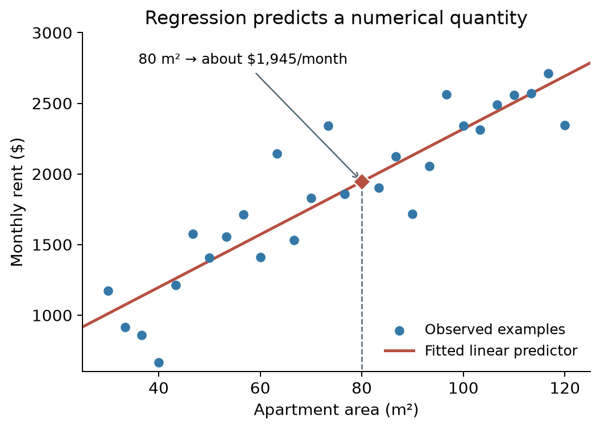

*Synthetic apartment data and a fitted linear predictor. At 80 square meters, the predicted rent is about 1,945 dollars per month. The points and prices are illustrative, not market observations.*

Both examples use numerical inputs. The distinction lies in the required output: a species label for classification and a rent estimate for regression. Encoding species as 0, 1, and 2 would not make the first task regression; those numbers would still name categories.

#### <a id="density-estimation"></a>Density estimation

Density estimation describes how observations are spread out, rather than predicting one value. The [Old Faithful geyser](https://en.wikipedia.org/wiki/Old_Faithful) in Yellowstone National Park erupts at irregular intervals. A classic dataset records 272 waiting times between eruptions. A [kernel density estimate](https://en.wikipedia.org/wiki/Kernel_density_estimation), a smoothed version of the histogram, turns them into an estimated density $`\hat p(w)`$ for the waiting time $`w`$.

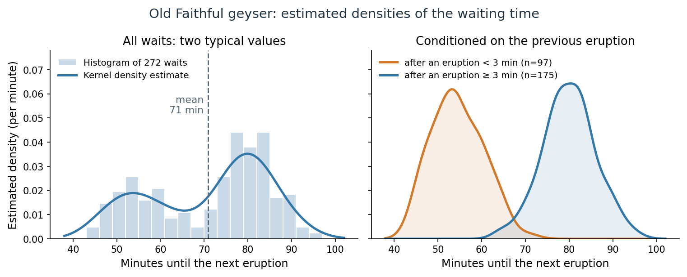

*Left: 272 waiting times between eruptions, with a kernel density estimate; the dashed line marks the mean. Right: separate estimates for waits after eruptions shorter and longer than 3 minutes, each enclosing area one. Data: R's `faithful` dataset ([Härdle, 1991](https://doi.org/10.1007/978-1-4612-4432-5); [Azzalini and Bowman, 1990](https://doi.org/10.2307/2347385)).*

The estimated density answers questions that a single predicted number cannot. The probability of waiting between 50 and 60 minutes is the area under $`\hat p`$ over that interval. The density has two peaks, near 54 and 80 minutes. The mean wait, 71 minutes, falls between them: only 17% of the recorded waits lie between 66 and 76 minutes, compared with 43% between 75 and 85. Conditioning on the length of the previous eruption separates the two groups. After a short eruption, 90% of the recorded waits lie between 46 and 64 minutes; after a long one, between 70 and 90 minutes. Estimating $`p(w\mid\text{previous eruption length})`$ is **conditional density estimation**. The eruption forecasts posted for visitors use the same relationship: the predicted wait depends on the length of the previous eruption.

Density estimation has other common uses:

- **Anomaly detection.** Fit a density to observations from normal operation, then flag new observations to which it assigns very low density, such as unusual card transactions or sensor readings.
- **Generating new examples.** A model of a distribution can be sampled. A language model is a density estimator for text: it assigns a probability $`p(x_1,\ldots,x_T)=\prod_{t=1}^Tp(x_t\mid x_1,\ldots,x_{t-1})`$ to a token sequence, and generating text means sampling from it.
- **Classification through class-conditional densities.** Estimating $`p(x\mid y)`$ for each class and combining the estimates with Bayes' rule gives a classifier; this is the generative approach described under models below.

Kernel density estimation is developed in Smoothing, Density Estimation, and Basis Expansions; density models for images and text are the subject of the Generative AI module.

### <a id="models-and-model-classes"></a>Models and model classes

A **predictive model** represents a relationship between inputs and outputs. A prediction rule is a function $`f:\mathcal X\to\widehat{\mathcal Y}`$, where $`\widehat{\mathcal Y}`$ is the prediction space. This may differ from the target space $`\mathcal Y`$: a binary target lies in $`\{0,1\}`$, while a predicted probability lies in $`[0,1]`$. A probabilistic model can specify a conditional distribution $`p_\theta(y\mid x)`$. A [statistical model](https://en.wikipedia.org/wiki/Statistical_model) has the more specific meaning of a family of probability distributions together with assumptions about the data.

A **model class**, or hypothesis space, is the collection of candidate models considered by a learning procedure. Writing $`\theta`$ for the model parameters and $`\Theta`$ for their allowed values, a parameterized family is

```math
\mathcal H=\{f_\theta:\theta\in\Theta\}.
```

For example, a one-feature linear model family is $`f_{a,b}(x)=a+bx`$, where $`a`$ is the intercept and $`b`$ is the slope. Specifying the family leaves $`a`$ and $`b`$ open. Fitting the model produces values $`\hat a,\hat b`$ and therefore a particular **trained model** $`f_{\hat a,\hat b}`$. With a vector input, the same idea becomes $`f_\theta(x)=w^\top x+b_0`$, with $`\theta=(w,b_0)`$. These are affine functions, conventionally included under linear models. The word model is often used for both the family and the fitted instance; the distinction matters when discussing what is chosen before training and what is learned from data.

In the apartment example above, each choice of intercept and slope gives a candidate line. The red line is the fitted member of this family; its coefficients were selected from the observations.

#### <a id="parametric-and-nonparametric-models"></a>Parametric and nonparametric models

A **parametric** model class is described by a finite number of parameters, and that number is fixed before any data are seen: in the notation above, $`\Theta\subseteq\mathbb R^p`$ for a fixed $`p`$. The line $`f_{a,b}(x)=a+bx`$ has two parameters whether it is fitted to 28 apartments or to 28,000. Logistic regression and a neural network with a fixed architecture are also parametric in this sense, even when the network has millions of weights.

A **nonparametric** model has no fixed-size parameter vector: its complexity can grow with the amount of data. A nearest-neighbor classifier stores the whole training set and consults it at prediction time. The kernel density estimate for Old Faithful places a small bump at every observation. A decision tree grown until its leaves are pure can add splits as observations accumulate; the iris tree above, limited to four leaves, has a fixed maximum size instead. *Nonparametric* does not mean “without parameters” or “without choices”: the number of neighbors, the kernel bandwidth, and a limit on tree size are hyperparameters, described next.

The distinction reflects a tradeoff. A parametric class makes a strong assumption about the form of the relationship. When the assumption is roughly right, its few parameters can be estimated accurately from little data, and the fitted model is compact. A nonparametric method assumes less and can follow almost any relationship given enough data, but it needs more observations, and its predictions can be more expensive to compute. Two ways to estimate a conditional average develops this comparison.

#### <a id="parameters-and-hyperparameters"></a>Parameters and hyperparameters

Parameters and [hyperparameters](https://en.wikipedia.org/wiki/Hyperparameter_%28machine_learning%29) play different roles. Model parameters, such as fitted coefficients or neural-network weights, are learned during training. Hyperparameters specify choices such as network width, learning rate, or regularization strength. They can themselves be selected by a separate tuning procedure, often using validation data.

#### <a id="neural-networks"></a>Neural networks

A neural network (NN) or artificial neural network (ANN) is a computational model inspired by the structure and functions of biological neural networks.

A neural network consists of connected computational units called artificial neurons. Neurons and their connections are loosely inspired by biological neurons and synapses; the mathematical model is a substantial simplification. Each artificial neuron receives signals from connected neurons, then processes them and sends a signal to other connected neurons. The "signal" is a real number, and a typical neuron applies an [activation function](https://en.wikipedia.org/wiki/Activation_function) to a weighted sum of its inputs plus a bias. The activation is usually nonlinear, although some layers use a linear activation. The strength of the signal at each connection is determined by a weight, which adjusts as part of the training process.

Groups of neurons are aggregated into layers. Each layer performs a transformation on its inputs. In a feedforward network, signals travel from the first layer (the input layer) to the last layer (the output layer), typically passing through multiple intermediate layers (hidden layers). A network with several hidden layers is commonly described as deep, but there is [no universally agreed depth threshold](https://www.deeplearningbook.org/contents/intro.html). Deep neural networks are capable of learning sophisticated hierarchical representations.

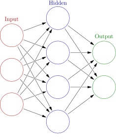

*A feedforward network with three input units (red), four hidden units (blue), and two output units (green). Arrows show the direction of computation; this example has one hidden layer.*

**Example: a small neural spam classifier.** The three input units could hold an email's link count, fraction of capital letters, and word count, suitably scaled. Each hidden unit combines all three numbers and applies a nonlinear activation. The two output units could give scores for “legitimate” and “spam”; selecting the larger score produces a class prediction. Training on labeled emails adjusts the weights and biases throughout the network. This diagram has only one hidden layer and illustrates a shallow neural network; the digit recognizer above has three.

The network architecture specifies a model class; training selects values for its weights and biases. Deep networks can be trained using supervised, semi-supervised, unsupervised, self-supervised, or reinforcement learning.

#### <a id="representation-learning"></a>Representation learning

A **representation** is the collection of features used to describe an input. Representation learning fits a transformation $`z=g_\phi(x)`$ from data, where $`\phi`$ denotes its learned parameters and $`z`$ is the resulting feature vector. The representation can then be used for prediction, similarity comparisons, visualization, or another task. Choosing word counts by hand specifies features; fitting a transformation that discovers useful combinations of those counts learns a representation.

**Example: learning one coordinate from two measurements.** PCA learns directions of variation in observed data. If two centered measurements vary mostly along one line, a single coordinate along that line can retain much of their variation. With sample mean $`\mu\in\mathbb R^2`$ and learned unit direction $`w\in\mathbb R^2`$, the coordinate is $`z=w^\top(x-\mu)\in\mathbb R`$. Both $`\mu`$ and $`w`$ are obtained from the training observations.

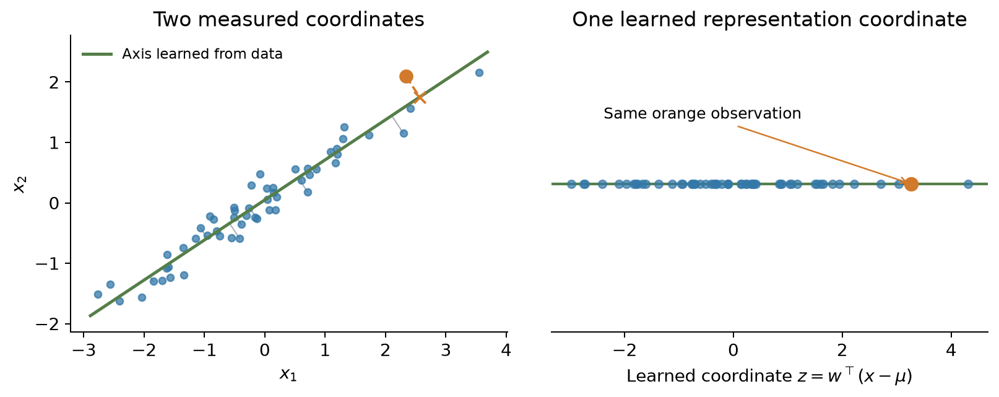

*Synthetic observations represented in two coordinates (left) and by their coordinate along a learned principal axis (right). The orange observation is projected onto the line and encoded by one number. Variation perpendicular to the line is discarded.*

This is a linear form of representation learning that needs neither class labels nor a neural network. PCA selects directions by retained variance; those directions need not be the most useful ones for a later prediction task. Neural networks can instead learn nonlinear representations, such as the hidden activations of the digit recognizer. Representation learning also need not reduce dimension: learned features can have fewer, the same number of, or more coordinates than the input.

#### <a id="generative-and-discriminative-models"></a>Generative and discriminative models

[Generative and discriminative models](https://en.wikipedia.org/wiki/Generative_model) describe another distinction. In classification, a generative approach can model the joint distribution $`p(x,y)`$, while a discriminative approach models $`p(y\mid x)`$ or a decision boundary directly. Generative modeling also includes learning distributions over observations from which new examples can be generated. Both approaches can support classification; this distinction is separate from the task and the online/offline setting.

Generation can also be **conditional**: a model can represent a distribution over output sequences given a prompt, then generate a response from that distribution. This broader use of generative modeling should be distinguished from the classical joint-versus-conditional classifier comparison above. Translation is one example of conditional sequence generation: [Sutskever, Vinyals, and Le, *Sequence to Sequence Learning with Neural Networks*](https://arxiv.org/abs/1409.3215).

### <a id="learning-algorithms"></a>Learning algorithms

An [algorithm](https://en.wikipedia.org/wiki/Algorithm) specifies a computational procedure. A **learning algorithm** uses the available data and feedback to construct or update a model. In a simple supervised formulation, with the model class and training choices understood,

```math
\mathcal A:D_{\mathrm{train}}\longmapsto\hat f\in\mathcal H.
```

Here $`D_{\mathrm{train}}`$ contains the examples used for fitting. For a randomized algorithm, the output also depends on randomness, which this notation suppresses. The algorithm is the procedure that produces the fitted model. Applying that fitted model to an input is a further computation. Different training algorithms can fit the same model family, and a general optimization algorithm can be used with many different families.

#### <a id="losses-and-objectives"></a>Losses and objectives

A [loss function](https://en.wikipedia.org/wiki/Loss_function) assigns a cost to a target and a prediction. Here the **target is the first argument**: $`\ell(y,\hat y)`$. For numerical prediction, squared error is $`\ell(y,\hat y)=(y-\hat y)^2`$. Argument order is a convention, so it should be stated even when a particular loss is symmetric.

For a population distribution $`\mathcal D`$ over input–target pairs, the corresponding **population risk** is

```math
R(f)=\mathbb E_{(x,y)\sim\mathcal D}\big[\ell(y,f(x))\big].
```

For a nonempty index set $`I\subseteq\{1,\ldots,n\}`$, the **empirical risk** is the average loss on those examples:

```math
\widehat R_I(f)=\frac{1}{|I|}\sum_{i\in I}\ell(y_i,f(x_i)).
```

Taking $`I=\{1,\ldots,n\}`$ gives the average over all of $`D`$. For a training split, $`\widehat R_{\mathrm{train}}`$ is shorthand for $`\widehat R_{I_{\mathrm{train}}}`$; validation and test risk are defined similarly. The subscript records which examples are being evaluated.

The [empirical risk minimization](https://en.wikipedia.org/wiki/Empirical_risk_minimization) principle selects a model with low average **training** loss within the chosen class. Its idealized formulation is

```math
\hat f\in\operatorname*{arg\,min}_{f\in\mathcal H}\widehat R_{\mathrm{train}}(f).
```

This defines an optimization objective; an actual algorithm determines how to seek its solution. Practical training may only approximate the minimum and may add regularization. Generalization concerns performance on new examples, which is not established merely by obtaining a small training loss.

The finite dataset $`D`$ and the population distribution $`\mathcal D`$ are different objects. An alternative parameter-based notation uses $`L(\theta;D)`$ for an empirical objective and $`\mathcal L(\theta)`$ for population risk. For an unregularized average loss, $`L(\theta;D)=\widehat R_{\{1,\ldots,n\}}(f_\theta)`$ and $`\mathcal L(\theta)=R(f_\theta)`$. Here $`\ell`$ denotes the loss on one example throughout.

#### <a id="optimization-and-gradients"></a>Optimization and gradients

Gradient descent is one optimization algorithm for differentiable objectives. It updates parameters in a direction intended to reduce the objective. In neural networks, [backpropagation](https://en.wikipedia.org/wiki/Backpropagation) computes the required derivatives efficiently; an optimizer uses those derivatives to update the parameters. The network architecture, training objective, derivative computation, and update rule therefore have distinct roles.

The mathematical notes use **numerator-layout derivatives**. For $`f:\mathbb R^d\to\mathbb R^m`$, the Jacobian $`J_f=\partial f/\partial x`$ has entries $`(J_f)_{ij}=\partial f_i/\partial x_j`$ and shape $`m\times d`$. For a scalar objective $`L`$, the derivative $`D_xL`$ is a row, while its Euclidean gradient $`\nabla_xL=(D_xL)^\top`$ is a column. Thus $`dL=(D_xL)\,dx=\nabla_xL^\top dx`$, and a gradient update uses $`\theta\leftarrow\theta-\eta\nabla_\theta L`$. For a matrix parameter, the gradient is defined by the Frobenius inner product and is stored in the parameter's shape. Calculus and Optimization develops how these derivatives are evaluated; Numerical Computing with NumPy and PyTorch gives their implementation in arrays and tensors.

#### <a id="training-validation-and-test-data"></a>Training, validation, and test data

Training data is used to fit the model and data-dependent preprocessing; validation data guides choices such as hyperparameters and decision thresholds; test data evaluates the completed procedure after those choices are fixed. A [data split](https://en.wikipedia.org/wiki/Training,_validation,_and_test_data_sets) should reflect the intended use: for example, predicting future observations often calls for a chronological split. Information that would be unavailable at prediction time, or improper use of held-out answers during fitting or selection, can cause [data leakage](https://en.wikipedia.org/wiki/Leakage_%28machine_learning%29).

## <a id="learning-prediction-and-action"></a>Learning, prediction, and action

A fitted model is one component of a system. Learning changes that component; prediction computes its output; a decision rule determines what action follows.

### <a id="learning"></a>Learning

**Learning**, or training, changes a model using data or feedback. In the supervised notation above, the learning algorithm takes $`D_{\mathrm{train}}`$ and returns $`\hat f`$. For a neural network, this usually includes adjusting its weights. Learning can take place in a separate offline phase or through updates interleaved with use.

### <a id="prediction-and-inference"></a>Prediction and inference

**Prediction** applies the learned model to an input, for example $`\hat y=\hat f(x)\in\widehat{\mathcal Y}`$. A prediction need not concern the future: classifying an existing photograph is also prediction. Depending on the task, the output may be a category, a number, a probability distribution, or a structured object.

In deployed ML systems, this use of a trained model is commonly called [inference](https://developers.google.com/machine-learning/glossary#inference). Computing an output need not update the model. Inference can be performed in advance for many inputs or on demand as requests arrive. An offline-trained model can therefore provide online, real-time predictions.

The broader term **statistical inference** concerns what data reveal about unknown quantities, including parameters and their uncertainty. Fitting a model can itself be part of statistical inference, whereas deployment inference applies an already fitted model. Estimation, sampling uncertainty, likelihood, intervals, tests, and Bayesian inference are developed in Probability and Statistics.

### <a id="action-and-decision-making"></a>Action and decision-making

An **action** is a choice made by the surrounding system or a person, possibly using a prediction. In [decision theory](https://en.wikipedia.org/wiki/Decision_theory), the choice also depends on the consequences and costs of possible outcomes. An estimated probability of spam might lead to a warning, a move to a spam folder, or a request for human review. The same prediction can therefore lead to different actions under different costs or policies.

A learned policy in RL can select an action directly, so there need not be a separately exposed prediction stage. Taking an action based on a supervised model also does not by itself make the learning procedure reinforcement learning; RL concerns learning behavior using rewards and the consequences of actions.

For a predictive component used in a larger system, the relationship can be summarized as:

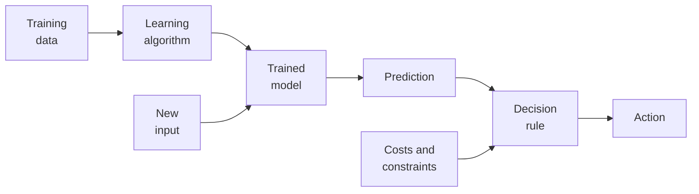

### <a id="example-a-spam-filter"></a>Example: a spam filter

Suppose an email service trains [logistic regression](https://en.wikipedia.org/wiki/Logistic_regression) on previously labeled messages, freezes the fitted parameters, and uses the model to score incoming mail.

| Description | Role in this example |
| --- | --- |
| Practical problem | Help a user manage unwanted email |
| Abstract task | Binary classification |
| Learning paradigm | Supervised learning from labeled emails |
| Learning setting | Offline training on a collected dataset |
| Input and target | Email features $`x`$ and label $`y\in\{0,1\}`$ |
| Model family | Logistic regression, representing a probability of spam |
| Training objective | Average binary cross-entropy, optionally with regularization |
| Training algorithm | For example, gradient descent on that objective |
| Trained model | The fitted coefficients and the prediction rule they define |
| Prediction | The fitted model outputs $`\widehat p(x)=\hat f(x)=p_{\hat\theta}(y=1\mid x)`$ |
| Action | A decision rule uses that probability to flag or route the message |

Here the observed target $`y`$ is a class label and the prediction $`\widehat p(x)`$ is a probability conditional on the message features. A threshold can convert $`\widehat p(x)`$ to a class label before the service decides what action to take.

If later user corrections are incorporated through model updates as feedback arrives, the learning setting becomes online. Receiving and scoring new emails alone leaves the model unchanged. If corrections are accumulated for a separate nightly training run, each resulting deployed model can still be used in an offline-training workflow.

## <a id="appendices"></a>Appendices


<details>
<summary><a id="block-terminology-appendix-a"></a><b>A. Digit recognition with and without deep networks</b></summary>

Deep networks were not the only way to recognize digits, and on easy data they are not clearly better. On the $`8\times8`$ digits of [Deep learning](#deep-learning), with the same held-out quarter of 450 images, a 1-nearest-neighbor rule that simply returns the label of the most similar training image under Euclidean pixel distance is correct on 98.9% of test images. The network is correct on 98.0%, and a linear classifier (logistic regression) on 97.8%. The differences amount to four or five of 450 test images, well within what a different split or random seed could produce. Learning Problems and Nearest Neighbors develops the nearest-neighbor rule.

Clustering alone does worse. Grouping the training images into 10 [k-means](https://en.wikipedia.org/wiki/K-means_clustering) clusters and naming each cluster by its most common training label classifies 78.4% of the test images correctly. Pixel similarity does not know which differences matter. In this run, one cluster contains mostly 9s but also many 8s, 5s, and 3s; another holds 1s and 8s in nearly equal numbers. Two clusters are named 1, so with only ten clusters one digit receives none: no cluster is named 8, and every 8 is misclassified. With 50 clusters, several per digit, the accuracy rises to 95.3%. Keeping every training image as its own prototype is the nearest-neighbor rule. Clustering develops these methods.

The larger [MNIST benchmark](https://yann.lecun.com/exdb/mnist/) contains $`28\times28`$ grayscale digits: 60,000 training images and 10,000 test images written by different people. Published results tell a similar story. A linear classifier on the pixels misclassifies 12.0% of the test digits, k-nearest neighbors on raw pixels 5.0%, and the LeNet-5 convolutional network 0.95%. Clustering the images without labels matches only about 53% of them to the right digit. The table lists these and other approaches.

| Method on MNIST | Error | Source |
| --- | --- | --- |
| k-means with 10 clusters, no labels; clusters matched to digits afterward | 46.5% | [Xie, Girshick, and Farhadi (2016)](https://arxiv.org/abs/1511.06335), Table 2 |
| Linear classifier on pixels | 12.0% | [LeCun et al. (1998)](https://bottou.org/papers/lecun-98h) |
| k-nearest neighbors, Euclidean distance on pixels | 5.0% | LeCun et al. (1998) |
| Neural network with one hidden layer of 300 units | 4.7% | LeCun et al. (1998) |
| k-nearest neighbors on deskewed images | 2.4% | LeCun et al. (1998) |
| k-nearest neighbors with tangent distance | 1.1% | LeCun et al. (1998) |
| LeNet-5 convolutional network | 0.95% | LeCun et al. (1998) |
| Support vector machine on deskewed images, trained with shifted copies | 0.56% | [DeCoste and Schölkopf (2002)](https://doi.org/10.1023/A:1012454411458) |
| Committee of 35 convolutional networks | 0.23% | [Cireşan, Meier, and Schmidhuber (2012)](https://arxiv.org/abs/1202.2745) |

*The first row is from Xie et al.: clustering error on all 70,000 images after the best one-to-one matching of clusters to digits. The other rows are test error rates listed on the MNIST page. Deskewing straightens slanted digits before comparison. Tangent distance treats an image and its slightly shifted, rotated, or thickened versions as close. The last row also trained on distorted copies of the training images.*

Three observations explain the shift toward deep networks.

- **Nearest neighbors was competitive on digits.** Raw pixel distance gives about 5 errors per 100 test digits. Building knowledge of handwriting variation into the distance, as tangent distance does, brings k-nearest neighbors to the level of the early convolutional network. That knowledge was designed by hand for digits.
- **A stored dataset is an expensive model.** A nearest-neighbor rule keeps all 60,000 training images and compares every new image with each of them. A trained network is a fixed-size function whose prediction cost does not grow with the training set.
- **Pixel distances fail on natural photographs.** Two photographs of the same kind of object can differ in position, lighting, background, and pose, so their pixel values need not be close. On the ten-class [CIFAR-10](https://www.cs.toronto.edu/~kriz/cifar.html) images, a nearest-neighbor rule on pixels is correct only about 35–39% of the time, compared with about 95% for convolutional networks ([CS231n notes](https://cs231n.github.io/classification/)). In the 2012 ImageNet competition, a deep convolutional network reached a top-5 error of 15.3%, while the next-best team, using hand-designed image features, reached 26.2% ([Krizhevsky, Sutskever, and Hinton, 2012](https://proceedings.neurips.cc/paper_files/paper/2012/hash/c399862d3b9d6b76c8436e924a68c45b-Abstract.html); [ILSVRC 2012 results](https://image-net.org/challenges/LSVRC/2012/results.html)).

Deep networks respond to all three observations. They learn their features from data, as in the hidden layers of the digit recognizer, instead of relying on invariances designed by hand for one kind of image. Distances between learned features can reflect the differences that matter for the task. Once trained, a network's prediction cost does not depend on the number of training examples. Large labeled datasets and GPU training made such networks practical. Similarity search did not disappear: modern retrieval systems often apply nearest-neighbor search to features computed by a trained network. The limits of raw distances in many dimensions are developed in The curse of dimensionality.

</details>


<details>
<summary><a id="block-terminology-appendix-b"></a><b>B. How reinforcement learning differs from supervised and unsupervised learning</b></summary>

In supervised and unsupervised learning, the dataset is given to the learner. The model's predictions do not change which inputs are observed or what their targets are. In RL, actions have consequences: an action changes the next state, and the reward reports how well the chosen action turned out. It does not reveal what the best action would have been. In online RL, the agent's own actions determine what it experiences next, so the data are produced by the behavior being learned. As the policy changes, the agent visits different states and collects different rewards, and those observations drive the next update. Offline RL, described in [Online and offline learning](#online-and-offline-learning), learns from a fixed log instead, but its goal is still a policy whose actions would change what happens next.

| | Supervised learning | Unsupervised learning | Reinforcement learning |
| --- | --- | --- | --- |
| Training signal | A target for each input | No targets; structure among the inputs | A reward for the action actually taken, possibly delayed |
| Source of the data | A dataset collected independently of the model | A dataset collected independently of the model | The agent's own interaction with its environment, or a log of another policy's interaction (offline RL) |
| What is learned | A prediction rule | A grouping, representation, or distribution | A policy, which chooses actions |
| Can the learner's outputs change its later data? | No | No | Yes in online RL, where actions change later states and rewards; no in offline RL, which learns from a fixed log |

Two difficulties follow. To learn how good an action is, the agent must see it tried, usually by trying it itself; this is the exploration problem described in [Reinforcement learning](#reinforcement-learning). A reward can also arrive many steps after the action that made it possible, so the agent must work out which earlier choices deserve the credit. Active learning is an intermediate case: a supervised learner chooses which inputs to have labeled, so it influences its data, but its feedback is still a correct label rather than a reward.

</details>

---

[2. Linear Algebra →](02-linear-algebra.md)
