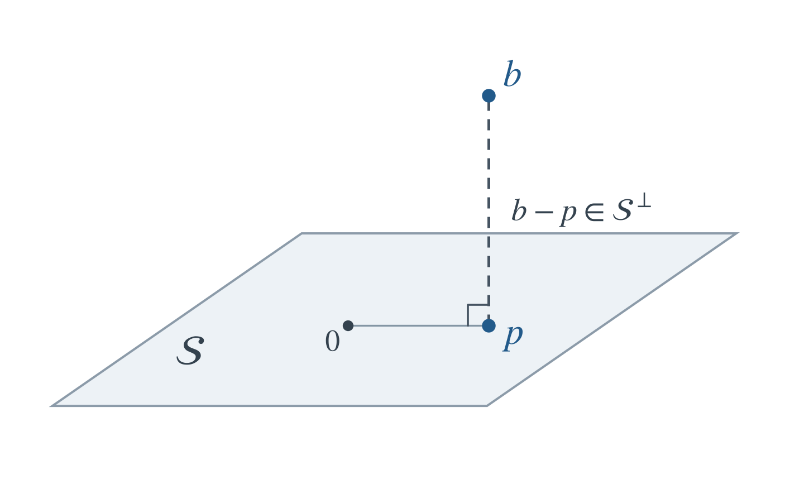
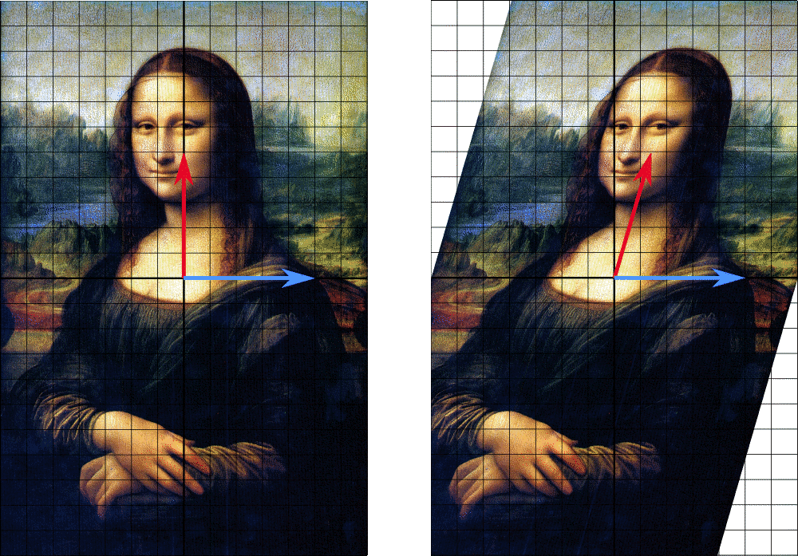
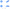
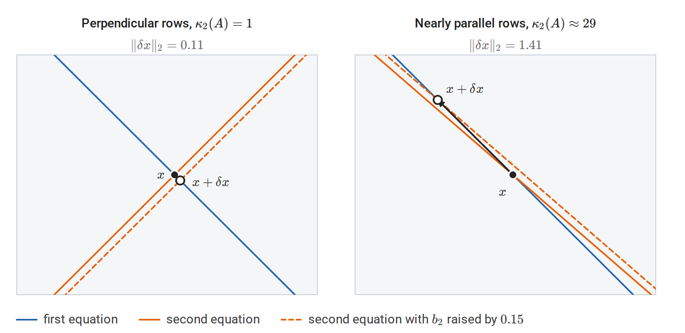
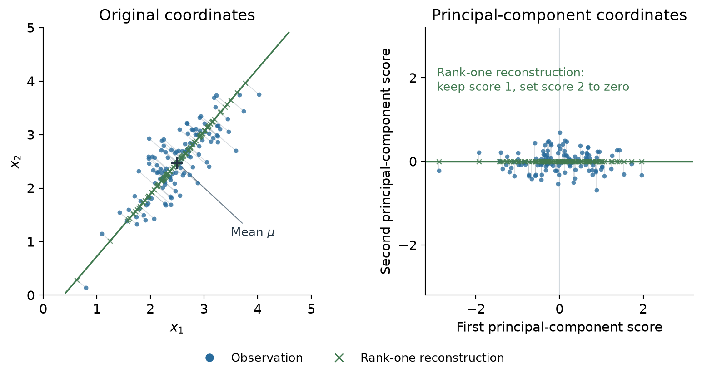

[ML Mastery Notes](../README.md) › [Foundations](README.md)

# 2. Linear Algebra

[← 1. Terminology and Mathematical Language](01-terminology-and-mathematical-language.md) · [3. Calculus and Optimization →](03-calculus-and-optimization.md)

## <a id="vectors-matrices-and-linear-maps"></a>Vectors, matrices, and linear maps

A **vector space** over a field $\mathbb F$ is a set $V$ with vector addition and scalar multiplication satisfying the usual associativity, commutativity of addition, identity, inverse, and distributivity axioms. The elements need not be coordinate lists: polynomials of degree at most $k$, real-valued functions on a fixed set, and $m\times n$ real matrices are also vector spaces. Coordinates describe a vector after a basis has been chosen. A **subspace** is a subset containing zero and closed under addition and scalar multiplication.

Scalars are real and vectors are columns unless stated otherwise. The main notation is:

| Symbol | Meaning | Shape |
| --- | --- | --- |
| $A$ | A linear map represented by a matrix | $m\times n$ |
| $x$ | An input vector | $n\times1$ |
| $b$ | An output or right-hand-side vector | $m\times1$ |
| $A_{ij}$ | Row $i$, column $j$ entry | Scalar |
| $A^\top$ | Transpose | $n\times m$ |
| $I_n$ | Identity matrix on $\mathbb R^n$ | $n\times n$ |

Lowercase letters generally denote vectors and uppercase letters matrices; individual indexed entries are scalars. Calligraphic letters such as $\mathcal X$ denote higher-order arrays when their axes need to be explicit. Matrix rank is written $\operatorname{rank}(A)$; the number of axes of an array is called its **order**.

The matrix $A$ represents a **linear map** $x\mapsto Ax$ from $\mathbb R^n$ to $\mathbb R^m$. Linearity means

$$
A(\alpha x+\beta z)=\alpha Ax+\beta Az.
$$

If $a_1,\ldots,a_n$ are the columns of $A$, then

$$
Ax=\sum_{j=1}^n x_j a_j.
$$

Thus a matrix-vector product is a linear combination of columns. Equivalently, each output coordinate is the inner product of one row with the input. The map $x\mapsto Ax+b$ is **affine**; it is linear only when $b=0$.

For $B\in\mathbb R^{n\times p}$, the product $AB\in\mathbb R^{m\times p}$ represents composition: apply $B$ first, then $A$. Its entries are $(AB)_{ij}=\sum_k A_{ik}B_{kj}$. Matrix multiplication is associative and distributive but generally not commutative. Transposition reverses the order:

$$
(AB)^\top=B^\top A^\top.
$$

For vectors, $x^\top y$ is a scalar **inner product**, whereas $xy^\top$ is an **outer product**, a matrix of rank one when both vectors are nonzero.

**NumPy shapes.** The examples use NumPy arrays. A one-dimensional array with shape `(n,)` stores vector coordinates without an explicit row or column axis. Its transpose has the same shape. Use `(n, 1)` when a column axis matters. For arrays, `@` denotes matrix multiplication and `*` denotes elementwise multiplication. [`np.array`](https://numpy.org/doc/stable/reference/generated/numpy.array.html) builds an array from nested lists, and [`np.outer`](https://numpy.org/doc/stable/reference/generated/numpy.outer.html) forms the outer product $xy^\top$. Functions discussed in the text are linked to their documentation where they first appear. [Appendix G](#block-la-appendix-g) lists every function used in the chapter's examples, including those that appear only in code. [NumPy linear algebra reference](https://numpy.org/doc/stable/reference/routines.linalg.html)

```python
import numpy as np

A = np.array([[1., 2.], [3., 4.], [5., 6.]])
x = np.array([2., -1.])
print(A @ x)                       # [0. 2. 4.]
print(x.shape, x.T.shape)           # (2,) (2,)
print((A @ x[:, None]).shape)       # (3, 1)
print(x @ x)                       # 5.0
print(np.outer(x, x))              # [[ 4. -2.], [-2.  1.]]
```

For a dataset, $X\in\mathbb R^{N\times d}$ will denote $N$ observations stored as rows, each with $d$ features. This storage convention is consistent with treating an individual feature vector as a column: row $i$ of $X$ is $x_i^\top$. Predictions from coefficients $w\in\mathbb R^d$ are $Xw\in\mathbb R^N$.

## <a id="inner-products-and-norms"></a>Inner products and norms

### <a id="inner-products-and-orthogonality"></a>Inner products and orthogonality

An **inner product** on a real vector space is bilinear, symmetric, and positive definite. In Euclidean space,

$$
\langle x,y\rangle=x^\top y,\qquad
\|x\|_2=\sqrt{x^\top x}.
$$

Vectors are **orthogonal** when their inner product is zero. For any subset $\mathcal S$ of a Euclidean space, its **orthogonal complement** is

$$
\mathcal S^\perp=\{y:\langle y,s\rangle=0\text{ for every }s\in\mathcal S\}.
$$

This is a subspace even when $\mathcal S$ is not. An **orthonormal** family consists of mutually orthogonal unit vectors. For nonzero vectors, the angle satisfies

$$
\cos\theta=\frac{x^\top y}{\|x\|_2\|y\|_2}.
$$

The **Cauchy-Schwarz inequality** is

$$

|x^\top y|\le\|x\|_2\|y\|_2,
$$

with equality exactly when one vector is a scalar multiple of the other (including when either is zero). For orthogonal $x,y$, the Pythagorean identity gives $\|x+y\|_2^2=\|x\|_2^2+\|y\|_2^2$.

The transpose represents the **adjoint** of a linear map for Euclidean inner products:

$$
\langle Ax,y\rangle=\langle x,A^\top y\rangle,
\qquad x\in\mathbb R^n,\quad y\in\mathbb R^m.
$$

Thus $A$ maps input vectors into the output space, while $A^\top$ maps output-space vectors into the input space in the way required by this pairing. The transpose need not invert $A$. This identity is also the linear-algebra basis of backward gradient propagation.

A square matrix $Q$ is **orthogonal** if $Q^\top Q=I$, equivalently $Q^{-1}=Q^\top$. Such matrices preserve lengths and angles. A rectangular $Q\in\mathbb R^{m\times r}$ can have orthonormal columns, $Q^\top Q=I_r$, but then $QQ^\top$ is generally a projection, not $I_m$.

### <a id="vector-and-matrix-norms"></a>Vector and matrix norms

A **norm** measures size and satisfies positivity, absolute homogeneity, and the triangle inequality. Common vector norms are

$$
\|x\|_p=\left(\sum_i|x_i|^p\right)^{1/p}\quad(1\le p<\infty),
\qquad
\|x\|_\infty=\max_i|x_i|.
$$

For example,

$$
\|x\|_\infty\le\|x\|_2\le\|x\|_1,
\qquad
\|x\|_1\le\sqrt n\,\|x\|_2.
$$

The **induced matrix norm** is $\|A\|_p=\max_{x\ne0}\|Ax\|_p/\|x\|_p$. In particular, $\|A\|_1$ is the largest absolute column sum, $\|A\|_\infty$ the largest absolute row sum, and the **spectral norm** is

$$
\|A\|_2=\max_{\|x\|_2=1}\|Ax\|_2.
$$

The **Frobenius inner product** and **Frobenius norm** are

$$
\langle A,B\rangle_F=\sum_{i,j}A_{ij}B_{ij},
\qquad
\|A\|_F=\sqrt{\sum_{i,j}A_{ij}^2}.
$$

They treat a matrix as a vector of entries. The spectral norm measures the largest amplification of an input vector; the Frobenius norm is the square root of the sum of squared entries. Their expressions in singular values appear below.

## <a id="span-bases-rank-and-the-four-subspaces"></a>Span, bases, rank, and the four subspaces

### <a id="span-and-coordinates"></a>Span and coordinates

The **span** of vectors $v_1,\ldots,v_k$ is

$$
\operatorname{span}\{v_1,\ldots,v_k\}
=\left\{\sum_{i=1}^k c_i v_i:c_i\in\mathbb R\right\}.
$$

The vectors are **linearly independent** if $\sum_i c_i v_i=0$ implies every $c_i=0$. A **basis** is a linearly independent spanning set. Coordinates relative to a basis are unique; all bases of a finite-dimensional space have the same size, its **dimension**.

If the columns of an invertible matrix $P$ form a basis, then a vector with coordinates $z$ in that basis has standard coordinates $x=Pz$. A square linear map with standard matrix $A$ consequently has matrix $P^{-1}AP$ in the new basis. Changing coordinates changes the representation, while preserving the underlying map.

### <a id="the-four-fundamental-subspaces"></a>The four fundamental subspaces

The **rank** of a linear map is the dimension of its image, the space of attainable outputs. Let $r=\operatorname{rank}(A)$. Row rank and column rank are equal, and $r\le\min(m,n)$.

| Subspace | Definition | Ambient space | Dimension |
| --- | --- | --- | --- |
| Column space $\operatorname{col}(A)$ | All outputs $Ax$ | $\mathbb R^m$ | $r$ |
| Nullspace $\ker A$ | Inputs satisfying $Ax=0$ | $\mathbb R^n$ | $n-r$ |
| Row space $\operatorname{row}(A)$ | $\operatorname{col}(A^\top)$ | $\mathbb R^n$ | $r$ |
| Left nullspace $\ker A^\top$ | Vectors satisfying $A^\top y=0$ | $\mathbb R^m$ | $m-r$ |

The **rank-nullity theorem** states

$$
\operatorname{rank}(A)+\dim\ker A=n.
$$

One proof starts with a basis of $\ker A$ and extends it to a basis of the domain. The images of the added basis vectors form a basis of the image: they span every output, and any dependence among them would yield an extra nullspace direction. Hence the dimensions add to $n$.

The orthogonality relations are

$$
\operatorname{row}(A)=(\ker A)^\perp,
\qquad
\operatorname{col}(A)=(\ker A^\top)^\perp.
$$

Indeed, $Az=0$ says precisely that $z$ is orthogonal to every row. Taking dimensions gives equality with the orthogonal complement. Therefore

$$
\mathbb R^n=\operatorname{row}(A)\oplus\ker A,
\qquad
\mathbb R^m=\operatorname{col}(A)\oplus\ker A^\top.
$$

Here $\oplus$ denotes a **direct sum**: every vector has a unique decomposition as a sum of one vector from each subspace. These two decompositions are also orthogonal.

### <a id="solvability-and-identifiability"></a>Solvability and identifiability

The system $Ax=b$ is **consistent** exactly when $b\in\operatorname{col}(A)$. If $x_0$ is one solution, every solution is

$$
x=x_0+z,\qquad z\in\ker A.
$$

The solution set is an affine subspace. A consistent system has a unique solution exactly when $\ker A=\{0\}$, or equivalently $A$ has full column rank. Full row rank means that every right-hand side has a solution. A square matrix is invertible exactly when it has full rank.

For a feature matrix $X$, a nonzero $z\in\ker X$ means $X(w+z)=Xw$: the observed inputs cannot distinguish these coefficient vectors. The fitted values can be unique even when the coefficients are not.

**Example.** The columns of

$$
A=\begin{pmatrix}1&2&3\\0&1&1\end{pmatrix}
$$

satisfy $a_3=a_1+a_2$, so $(-1,-1,1)^\top\in\ker A$. The first two columns are independent, giving rank two and nullity one. Every vector in $\mathbb R^2$ is an attainable output, but its preimage is a line.

```python
import numpy as np

A = np.array([[1., 2., 3.], [0., 1., 1.]])
z = np.array([-1., -1., 1.])
print(np.linalg.matrix_rank(A))    # 2
print(A @ z)                      # [0. 0.]
```

[`np.linalg.matrix_rank`](https://numpy.org/doc/stable/reference/generated/numpy.linalg.matrix_rank.html) estimates **numerical rank** by counting singular values above a tolerance. Exact rank is discontinuous: an arbitrarily small perturbation can turn a singular matrix into an invertible one. A numerical rank therefore also depends on the scale and precision of the calculation.

Two useful identities are

$$
\ker(A^\top A)=\ker A,
\qquad
\operatorname{col}(AA^\top)=\operatorname{col}(A).
$$

For the first, $x^\top A^\top Ax=\|Ax\|_2^2$ shows that the two kernels coincide. Apply the same reasoning to $A^\top$ for the second: $\ker(AA^\top)=\ker A^\top$, and taking orthogonal complements gives the column-space equality.

## <a id="trace-determinant-and-changes-of-basis"></a>Trace, determinant, and changes of basis

For a square matrix,

$$
\operatorname{tr}(A)=\sum_i A_{ii}.
$$

The Frobenius pairing can therefore also be written as

$$
\langle A,B\rangle_F=\operatorname{tr}(A^\top B).
$$

Trace is linear and **cyclic**:

$$
\operatorname{tr}(AB)=\operatorname{tr}(BA),
\qquad
\operatorname{tr}(ABC)=\operatorname{tr}(BCA)=\operatorname{tr}(CAB),
$$

whenever the products are defined. Cyclicity does not permit arbitrary reordering. For example, $\operatorname{tr}(ABC)$ need not equal $\operatorname{tr}(ACB)$.

The **determinant** $\det A$ is the signed volume scale of the linear map. It satisfies

$$
\det(AB)=\det A\det B,\qquad
\det A^\top=\det A,\qquad
\det A^{-1}=\frac1{\det A}
$$

when the inverse exists. A square matrix is invertible exactly when its determinant is nonzero, but a floating-point determinant is not a reliable way to diagnose near singularity; singular values reveal the relevant scales.

Similarity, $B=P^{-1}AP$, preserves rank, trace, and determinant. For example, trace invariance follows from cyclicity: $\operatorname{tr}(P^{-1}AP)=\operatorname{tr}(APP^{-1})=\operatorname{tr}(A)$. Numerically, [`np.linalg.slogdet`](https://numpy.org/doc/stable/reference/generated/numpy.linalg.slogdet.html) returns the sign and $\log|\det A|$ without first forming a potentially overflowing or underflowing determinant.

## <a id="linear-systems-and-matrix-factorizations"></a>Linear systems and matrix factorizations

An expression involving $A^{-1}b$ specifies a solution mathematically. Computing that solution normally requires solving $Ax=b$, not constructing every entry of $A^{-1}$.

### <a id="gaussian-elimination-and-lu"></a>Gaussian elimination and LU

Gaussian elimination eliminates variables by row operations. With row pivoting, a nonsingular square matrix has a factorization

$$
PA=LU,
$$

where $P$ is a permutation matrix, $L$ is unit lower triangular, and $U$ is upper triangular. To solve $Ax=b$, solve $Ly=Pb$ by forward substitution and $Ux=y$ by back substitution. Pivoting avoids zero pivots and reduces the risk of large intermediate errors.

Dense factorization costs $O(n^3)$, while a solve with already available triangular factors costs $O(n^2)$ per right-hand side. Reusing a factorization is valuable when the matrix is fixed. [`np.linalg.solve`](https://numpy.org/doc/stable/reference/generated/numpy.linalg.solve.html) handles a square full-rank system, including several right-hand sides in the columns of a matrix. It factors the matrix internally with pivoted LU.

### <a id="cholesky"></a>Cholesky

A real symmetric **positive definite** matrix satisfies $x^\top Ax>0$ for every nonzero $x$. It has a unique Cholesky factorization

$$
A=LL^\top,
$$

with $L$ lower triangular and positive diagonal. The entries follow the recursion

$$
L_{kk}=\sqrt{A_{kk}-\sum_{s<k}L_{ks}^2},
\qquad
L_{ik}=\frac{A_{ik}-\sum_{s<k}L_{is}L_{ks}}{L_{kk}}\quad(i>k).
$$

Solving $Ax=b$ then consists of $Ly=b$ and $L^\top x=y$. A symmetric matrix is **positive semidefinite** when $x^\top Ax\ge0$ for every $x$. This weaker condition does not guarantee a Cholesky factor with strictly positive diagonal: singular matrices require a different treatment.

```python
import numpy as np

A = np.array([[4., 2.], [2., 3.]])
b = np.array([1., 2.])
L = np.linalg.cholesky(A)
y = np.linalg.solve(L, b)
x = np.linalg.solve(L.T, y)
print(np.allclose(L @ L.T, A))      # True
print(np.allclose(A @ x, b))        # True
```

The two calls to `solve` make the factorization visible; a specialized triangular solver avoids treating the triangular factors as general matrices. [`np.linalg.cholesky`](https://numpy.org/doc/stable/reference/generated/numpy.linalg.cholesky.html) returns the lower-triangular factor and assumes symmetry rather than checking both matrix triangles. Positive definiteness and symmetry are properties to establish from the problem, not consequences of calling the routine. [`np.allclose`](https://numpy.org/doc/stable/reference/generated/numpy.allclose.html) returns `True` when every entry of two arrays agrees within a relative and absolute tolerance; [`np.isclose`](https://numpy.org/doc/stable/reference/generated/numpy.isclose.html) makes the same comparison entry by entry. Exact equality is rarely the right test for floating-point results.

### <a id="gram-schmidt-and-qr"></a>Gram-Schmidt and QR

For independent columns $a_1,\ldots,a_n$, Gram-Schmidt repeatedly removes components already represented:

$$
\widetilde q_j=a_j-\sum_{i<j}(q_i^\top a_j)q_i,
\qquad
q_j=\frac{\widetilde q_j}{\|\widetilde q_j\|_2}.
$$

Collecting the projection coefficients gives the **reduced QR factorization**

$$
A=QR,\qquad Q\in\mathbb R^{m\times n},\quad
Q^\top Q=I_n,\quad R\in\mathbb R^{n\times n},
$$

where $m\ge n$, $A$ has full column rank, and $R$ is invertible and upper triangular. Classical Gram-Schmidt explains the geometry; Householder QR is a standard stable numerical construction. Rank-deficient matrices also have QR factorizations, but the triangular factor is then singular and these full-rank formulas need adjustment.

| Problem | Useful factorization | Reason |
| --- | --- | --- |
| General nonsingular square system | Pivoted LU | Reduces the solve to triangular systems |
| Symmetric positive definite system | Cholesky | Exploits symmetry and positive definiteness |
| Full-column-rank least squares | QR | Uses orthogonal transformations without forming $A^\top A$ |
| Rank-deficient least squares or rank diagnosis | SVD | Exposes zero and small singular values |
| Symmetric quadratic forms | Symmetric eigendecomposition | Resolves the matrix into orthogonal directions |

## <a id="orthogonal-projections-and-least-squares"></a>Orthogonal projections and least squares

### <a id="projection-onto-a-subspace"></a>Projection onto a subspace

For a subspace $\mathcal S\subseteq\mathbb R^m$, every $b$ has a unique decomposition

$$
b=p+r,\qquad p\in\mathcal S,\quad r\in\mathcal S^\perp.
$$

The vector $p$ is the **orthogonal projection** of $b$ onto $\mathcal S$. For any $z\in\mathcal S$,

$$
\|b-z\|_2^2=\|r\|_2^2+\|p-z\|_2^2,
$$

so $p$ is the unique closest vector in $\mathcal S$.



*The shaded plane represents a two-dimensional subspace $\mathcal S$ through the origin. The point $b$ projects to $p\in\mathcal S$, and the dashed segment represents the perpendicular residual $b-p\in\mathcal S^\perp$. Thus $p=\operatorname{proj}_{\mathcal S}b$ is the closest point in the subspace to $b$.*

For a nonzero vector $a$, projection onto its span is

$$
\operatorname{proj}_a(b)=\frac{a^\top b}{a^\top a}a.
$$

If the columns of $Q$ form an orthonormal basis of $\mathcal S$, the projection matrix is $P=QQ^\top$. More generally, if $A$ has independent columns spanning $\mathcal S$,

$$
P=A(A^\top A)^{-1}A^\top.
$$

A square matrix is an orthogonal projector exactly when

$$
P^2=P,\qquad P^\top=P.
$$

Idempotence alone allows oblique projections, in which the residual need not be orthogonal to the target subspace. An orthogonal projector preserves vectors in $\mathcal S$ and sends vectors in $\mathcal S^\perp$ to zero.

### <a id="least-squares-as-projection"></a>Least squares as projection

The **least-squares problem** is

$$
\min_x\|Ax-b\|_2^2.
$$

Its fitted vector $A\hat x$ is the projection of $b$ onto $\operatorname{col}(A)$. Orthogonality of the residual to every column yields the **normal equations**

$$
A^\top(b-A\hat x)=0,
\qquad A^\top A\hat x=A^\top b.
$$

These equations hold even when $A$ is rank deficient. If $A$ has full column rank, they have the unique solution

$$
\hat x=(A^\top A)^{-1}A^\top b.
$$

For $A=QR$ with full column rank,

$$
\|Ax-b\|_2^2
=\|Rx-Q^\top b\|_2^2+\|(I-QQ^\top)b\|_2^2.
$$

The second term is independent of $x$, so the solution follows from $R\hat x=Q^\top b$. Using orthogonal transformations avoids explicitly forming $A^\top A$, which can magnify numerical errors.

**Example.** For $A=[(1,0,1)^\top,(0,1,1)^\top]$ and $b=(1,2,2)^\top$, least squares gives $\hat x=(2/3,5/3)^\top$. The residual is $(1/3,1/3,-1/3)^\top$, orthogonal to both columns.

```python
import numpy as np

A = np.array([[1., 0.], [0., 1.], [1., 1.]])
b = np.array([1., 2., 2.])
x_hat, residual_sums, rank, s = np.linalg.lstsq(A, b, rcond=None)
Q, R = np.linalg.qr(A, mode="reduced")
x_qr = np.linalg.solve(R, Q.T @ b)
residual = b - A @ x_hat
print(np.round(x_hat, 6))          # [0.666667 1.666667]
print(np.allclose(A.T @ residual, 0.))  # True
print(np.allclose(x_hat, x_qr))    # True
```

[`np.linalg.lstsq`](https://numpy.org/doc/stable/reference/generated/numpy.linalg.lstsq.html) also handles rectangular and rank-deficient systems, choosing the minimum-norm solution when several minimizers exist. Its returned residual array can be empty for underdetermined or rank-deficient inputs; this does not mean the residual vector is zero. Compute `b - A @ x_hat` when the actual residual is needed. [`np.linalg.qr`](https://numpy.org/doc/stable/reference/generated/numpy.linalg.qr.html) with `mode="reduced"` returns the reduced factors $Q\in\mathbb R^{m\times n}$ and $R\in\mathbb R^{n\times n}$ used above; [`np.round`](https://numpy.org/doc/stable/reference/generated/numpy.round.html) rounds the values only for printing.

For a regression design matrix $X$, the **hat matrix** is the projector $H=X(X^\top X)^{-1}X^\top$ when $X$ has full column rank. It maps observed responses to fitted responses, $\hat y=Hy$.

## <a id="eigenvalues-spectral-theory-and-positive-semidefiniteness"></a>Eigenvalues, spectral theory, and positive semidefiniteness

### <a id="eigenvalues-and-diagonalization"></a>Eigenvalues and diagonalization

An **eigenpair** of a square matrix is a scalar $\lambda$ and nonzero vector $v$ satisfying $Av=\lambda v$. Eigenvalues are roots of $\det(A-\lambda I)=0$. Real matrices can have complex eigenvalues; a planar rotation by $90^\circ$ has no real eigenvector.

A matrix is **diagonalizable** over a field if it has a basis of eigenvectors over that field. Writing those eigenvectors as columns of $P$ gives

$$
A=P\Lambda P^{-1},\qquad A^k=P\Lambda^kP^{-1}.
$$

The algebraic multiplicity of an eigenvalue is its multiplicity as a characteristic-polynomial root; its geometric multiplicity is $\dim\ker(A-\lambda I)$. Diagonalizability requires a splitting characteristic polynomial and equality of these multiplicities for every eigenvalue. Distinct eigenvalues suffice. For example, $\begin{pmatrix}1&1\\0&1\end{pmatrix}$ has only a one-dimensional eigenspace and is not diagonalizable.



*A horizontal shear moves the red arrow off its line but leaves the blue arrow, along the horizontal axis, unchanged. Horizontal vectors are the only eigenvectors, with eigenvalue $1$, which is why a shear such as $\begin{pmatrix}1&1\\0&1\end{pmatrix}$ is not diagonalizable.*

Similarity preserves the characteristic polynomial because

$$
\det(P^{-1}AP-\lambda I)=\det\big(P^{-1}(A-\lambda I)P\big)=\det(A-\lambda I).
$$

If the eigenvalues are $\lambda_1,\ldots,\lambda_n$, counted with algebraic multiplicity over $\mathbb C$, then

$$
\operatorname{tr}(A)=\sum_i\lambda_i,
\qquad
\det A=\prod_i\lambda_i.
$$

These identities do not require diagonalizability. For an orthogonal projector onto $\mathcal S$, vectors in $\mathcal S$ are eigenvectors with eigenvalue one, and vectors in $\mathcal S^\perp$ have eigenvalue zero. Consequently $\operatorname{tr}(P)=\operatorname{rank}(P)=\dim\mathcal S$.

If $Av=\lambda v$, then $p(A)v=p(\lambda)v$ for any polynomial $p$. In particular, adding $tI$ shifts eigenvalues by $t$. If $A$ is invertible, its inverse has the same eigenvectors with reciprocal eigenvalues.

### <a id="the-symmetric-spectral-theorem"></a>The symmetric spectral theorem

Every real symmetric matrix has an orthonormal eigenbasis:

$$
A=Q\Lambda Q^\top=\sum_{i=1}^n\lambda_iq_iq_i^\top,
\qquad Q^\top Q=I.
$$

A short existence argument maximizes $x^\top Ax$ on the unit sphere. A maximizer exists by compactness; the stationary condition gives $Ax=\lambda x$. Symmetry makes the orthogonal complement of this eigenvector invariant, so induction supplies an orthonormal eigenbasis.

For a unit vector $x=\sum_i c_iq_i$,

$$
x^\top Ax=\sum_i\lambda_i c_i^2,
\qquad \sum_i c_i^2=1.
$$

The quadratic form is a weighted average of eigenvalues. Consequently the **Rayleigh quotient** $R_A(x)=x^\top Ax/(x^\top x)$ satisfies

$$
\lambda_{\min}(A)\le R_A(x)\le\lambda_{\max}(A),
$$

and both bounds are attained by eigenvectors. More generally, for $\lambda_1\ge\cdots\ge\lambda_n$, the Courant-Fischer characterization is

$$
\lambda_k=\max_{\dim\mathcal S=k}
\ \min_{\substack{x\in\mathcal S\\\|x\|_2=1}}x^\top Ax.
$$

It describes successive eigenvalues through the best available subspaces.

```python
import numpy as np

A = np.array([[2., 1.], [1., 2.]])
eigenvalues, Q = np.linalg.eigh(A)
print(eigenvalues)                 # [1. 3.]
print(np.allclose(A, (Q * eigenvalues) @ Q.T))  # True
print(np.allclose(Q.T @ Q, np.eye(2)))         # True
```

[`np.linalg.eigh`](https://numpy.org/doc/stable/reference/generated/numpy.linalg.eigh.html) is for real symmetric or complex Hermitian matrices. It returns eigenvalues in ascending order and corresponding eigenvectors as columns. The sign of an eigenvector is arbitrary, and a repeated eigenvalue allows different orthonormal bases of its eigenspace. Comparisons should therefore concern subspaces or reconstruction, rather than a particular printed eigenvector. For a general square matrix, [`np.linalg.eig`](https://numpy.org/doc/stable/reference/generated/numpy.linalg.eig.html) returns eigenvalues in no particular order, possibly complex, with eigenvector columns that need not be orthogonal. [`np.eye`](https://numpy.org/doc/stable/reference/generated/numpy.eye.html) returns the identity matrix used in the check.

### <a id="positive-semidefinite-matrices"></a>Positive semidefinite matrices

A real symmetric matrix is **positive semidefinite** (PSD), written $A\succeq0$, if $x^\top Ax\ge0$ for every $x$. It is **positive definite** (PD), written $A\succ0$, if the inequality is strict for every nonzero $x$.

For symmetric $A$, the following are equivalent:

- $A\succeq0$.
- Every eigenvalue is nonnegative.
- $A=B^\top B$ for some real matrix $B$.
- $A$ is a Gram matrix, $A_{ij}=\langle v_i,v_j\rangle$, for some vectors.

The implication from factorization follows from $x^\top B^\top Bx=\|Bx\|_2^2$. Conversely, the spectral theorem constructs $B=\Lambda^{1/2}Q^\top$. Positive definiteness is equivalent to strictly positive eigenvalues, or to $B$ having independent columns.

PSD is not an entrywise property. The matrix $\begin{pmatrix}1&2\\2&1\end{pmatrix}$ has positive entries but eigenvalues $3,-1$. The matrix $\begin{pmatrix}1&-1\\-1&1\end{pmatrix}$ is PSD despite its negative off-diagonal entries. Likewise, $A\succeq B$ means $A-B\succeq0$, not $A_{ij}\ge B_{ij}$.

For a symmetric matrix, **Sylvester's criterion** says that positive definiteness is equivalent to all leading principal minors being positive. PSD requires all principal minors to be nonnegative; checking only leading principal minors is insufficient.

If $A\succeq0$, its unique symmetric PSD square root is

$$
A^{1/2}=Q\Lambda^{1/2}Q^\top.
$$

When $A\succ0$, the inverse square root is also defined. A Cholesky factor $L$ satisfies $LL^\top=A$, but it need not satisfy $L^2=A$ and need not equal this symmetric square root.

### <a id="power-iteration"></a>Power iteration

For symmetric $A$, power iteration applies

$$
w_{t+1}=Av_t,\qquad
v_{t+1}=w_{t+1}/\|w_{t+1}\|_2.
$$

If $|\lambda_1|>|\lambda_2|\ge\cdots$ and $v_0$ has a nonzero component along the leading eigenvector, then

$$
A^t v_0=\lambda_1^t c_1q_1+\sum_{i>1}\lambda_i^t c_iq_i.
$$

The direction approaches the leading eigendirection at a rate governed by $|\lambda_2/\lambda_1|^t$. The vector's sign can alternate when the leading eigenvalue is negative. The method finds the eigenvalue of largest magnitude, which need not be the largest algebraic eigenvalue. Ties in magnitude remove this simple convergence guarantee.

## <a id="singular-value-decomposition-and-the-pseudoinverse"></a>Singular value decomposition and the pseudoinverse

### <a id="svd-and-the-geometry-of-a-linear-map"></a>SVD and the geometry of a linear map

Every real $m\times n$ matrix has a **singular value decomposition**

$$
A=U\Sigma V^\top,
$$

with $U\in\mathbb R^{m\times m}$ and $V\in\mathbb R^{n\times n}$ orthogonal and $\Sigma\in\mathbb R^{m\times n}$ rectangular diagonal. Let $q=\min(m,n)$ and order the singular values as

$$
\sigma_1\ge\cdots\ge\sigma_r>0,
\qquad \sigma_{r+1}=\cdots=\sigma_q=0,
$$

where $r=\operatorname{rank}(A)$. The compact rank-$r$ form is

$$
A=U_r\Sigma_rV_r^\top=\sum_{i=1}^r\sigma_i u_i v_i^\top.
$$

The columns $u_i$ of $U$ are the **left singular vectors**, the columns $v_i$ of $V$ are the **right singular vectors**, and the $\sigma_i$ are the **singular values**. Left singular vectors lie in the output space $\mathbb R^m$; right singular vectors lie in the input space $\mathbb R^n$. The names record the side on which each vector meets $A$:

$$
Av_i=\sigma_iu_i,
\qquad
u_i^\top A=\sigma_iv_i^\top,
\qquad i=1,\ldots,q.
$$

Read from right to left, $A=U\Sigma V^\top$ describes the map in three steps. $V^\top x$ gives the coordinates of $x$ along the right singular vectors; $\Sigma$ multiplies the $i$th coordinate by $\sigma_i$; and $U$ places the result along the corresponding left singular vectors. For $i\le q$, the right singular vector $v_i$ is sent to $\sigma_iu_i$. Right singular vectors with $\sigma_i=0$, and the extra ones $v_{m+1},\ldots,v_n$ when $n>m$, are sent to zero. SVD exists for rectangular and singular matrices; it does not require an eigenbasis of $A$.



The shear matrix $M=\begin{pmatrix}1&1\\0&1\end{pmatrix}$ sends a unit disc to an ellipse. The lower path separates this map into a rotation $V^\ast$, scaling by $\Sigma$, and a rotation $U$; the ellipse's semiaxis lengths are the singular values. The figure's $M$ plays the role of $A$ in the text, and $V^\ast=V^\top$ because the matrices are real.

Transposing the second relation gives $A^\top u_i=\sigma_iv_i$. Together with $Av_i=\sigma_iu_i$, this implies that the right singular vectors $v_i$ are eigenvectors of $A^\top A$ and the left singular vectors $u_i$ are eigenvectors of $AA^\top$, with eigenvalues $\sigma_i^2$ for the nonzero modes. They also provide an existence proof: diagonalize $A^\top A$, and for $\sigma_i>0$ define $u_i=Av_i/\sigma_i$. These vectors are orthonormal; completing the bases yields the full SVD.

In the full SVD, $v_1,\ldots,v_r$ span the row space and the remaining right singular vectors span the nullspace. Similarly, $u_1,\ldots,u_r$ span the column space and the remaining left singular vectors span the left nullspace.

The norm identities become

$$
\begin{aligned}
\|A\|_2&=\sigma_1,\\
\|A\|_F^2&=\sum_i\sigma_i^2,\\
\|A\|_*&=\sum_i\sigma_i.
\end{aligned}
$$

The last quantity is the **nuclear norm**, often used in low-rank regularization. For a symmetric matrix, singular values are the absolute values of its eigenvalues; they coincide with the eigenvalues themselves only in the PSD case.

```python
import numpy as np

A = np.array([[1., 2., 3.], [0., 1., 1.]])
U, s, Vt = np.linalg.svd(A, full_matrices=False)
print(U.shape, s.shape, Vt.shape)  # (2, 2) (2,) (2, 3)
print(np.allclose((U * s) @ Vt, A))  # True
print(np.allclose(np.linalg.norm(A, "fro"), np.linalg.norm(s)))  # True
```

[`np.linalg.svd`](https://numpy.org/doc/stable/reference/generated/numpy.linalg.svd.html) returns singular values in descending order and returns $V^\top$, not $V$, for real input. The left singular vectors are the columns of `U`, and the right singular vectors are the rows of `Vt`. With `full_matrices=False`, the reduced factors retain $q=\min(m,n)$ directions, including numerical zero singular values; this is not automatically the compact rank-$r$ form. For a wide matrix, a full SVD is needed if the entire right-nullspace basis is wanted from its factors. [`np.linalg.norm`](https://numpy.org/doc/stable/reference/generated/numpy.linalg.norm.html) computes vector norms and, with `"fro"` or `2`, the Frobenius and spectral matrix norms.

For leading right singular vectors, the operator $v\mapsto A^\top(Av)$ applies $A^\top A$ without explicitly constructing the Gram matrix.

### <a id="moore-penrose-pseudoinverse"></a>Moore-Penrose pseudoinverse

The **Moore-Penrose pseudoinverse** replaces nonzero singular values by their reciprocals:

$$
A^+=V_r\Sigma_r^{-1}U_r^\top.
$$

It is the unique matrix satisfying

$$
AA^+A=A,\qquad A^+AA^+=A^+,
\qquad (AA^+)^\top=AA^+,\qquad (A^+A)^\top=A^+A.
$$

In particular,

$$
AA^+=U_rU_r^\top=P_{\operatorname{col}(A)},
\qquad A^+A=V_rV_r^\top=P_{\operatorname{row}(A)}.
$$

For every $b$, $\hat x=A^+b$ is a least-squares minimizer and has the smallest Euclidean norm among all minimizers. To see this, rotate into singular coordinates: $z=V^\top x$, $c=U^\top b$. The nonzero modes require $z_i=c_i/\sigma_i$. Nullspace coordinates cannot improve the residual, so setting them to zero uniquely minimizes the norm. All minimizers are $A^+b+z$ with $z\in\ker A$.

Two special cases are

$$
A^+=(A^\top A)^{-1}A^\top\quad\text{(full column rank)},
\qquad
A^+=A^\top(AA^\top)^{-1}\quad\text{(full row rank)}.
$$

```python
import numpy as np

A = np.array([[1., 2., 3.], [0., 1., 1.]])
b = np.array([1., 2.])
x_min = np.linalg.pinv(A) @ b
z = np.array([-1., -1., 1.])
print(np.allclose(A @ x_min, b))       # True
print(np.allclose(A @ (x_min + z), b)) # True
print(np.isclose(x_min @ z, 0.))      # True
print(np.linalg.norm(x_min) < np.linalg.norm(x_min + z))  # True
```

An exact pseudoinverse discards zero singular values, but a tiny nonzero singular value still creates a large reciprocal. Numerical implementations apply a cutoff: [`np.linalg.pinv`](https://numpy.org/doc/stable/reference/generated/numpy.linalg.pinv.html) computes $A^+$ from the SVD and treats singular values below a relative tolerance as zero. The chosen cutoff determines which directions are treated as unresolved. This decision should reflect precision and, where relevant, noise scale.

### <a id="best-low-rank-approximation"></a>Best low-rank approximation

For $k<r$, the truncated SVD

$$
A_k=\sum_{i=1}^k\sigma_i u_i v_i^\top
$$

is a best approximation among matrices of rank at most $k$, in both spectral and Frobenius norms. The **Eckart-Young theorem** gives

$$
\|A-A_k\|_2=\sigma_{k+1},
\qquad
\|A-A_k\|_F^2=\sum_{i>k}\sigma_i^2.
$$

For the spectral lower bound, any rank-at-most-$k$ matrix $B$ has a null vector of unit length in $\operatorname{span}(v_1,\ldots,v_{k+1})$: the two subspaces must intersect by dimension counting. On that vector, $\|(A-B)x\|_2=\|Ax\|_2\ge\sigma_{k+1}$, and $A_k$ attains the bound.

For the Frobenius bound, fix a $k$-dimensional candidate column space with projector $P$. Its best approximation to each column of $A$ is the projection, so the best matrix with that column-space constraint is $PA$. The captured squared norm is

$$
\|PA\|_F^2=\sum_i\sigma_i^2\|Pu_i\|_2^2.
$$

Extend the list of squared singular values by zeros to a full left singular basis. Then the weights $\|Pu_i\|_2^2$ lie in $[0,1]$ and sum to $\operatorname{tr}(P)=k$. The sum is largest when all weight lies on the $k$ largest singular values, giving the stated error. Repeated singular values at the truncation boundary can make the best approximation nonunique.

## <a id="conditioning-and-numerical-computation"></a>Conditioning and numerical computation

### <a id="sensitivity-and-numerical-stability"></a>Sensitivity and numerical stability

For invertible square $A$, the spectral **condition number** is

$$
\kappa_2(A)=\|A\|_2\|A^{-1}\|_2
=\frac{\sigma_{\max}(A)}{\sigma_{\min}(A)}.
$$

The singular values $\sigma_i$ are the stretching factors from the SVD. The ratio of largest to smallest of the $\min(m,n)$ singular values is also used for full-rank rectangular matrices; it is infinite when the matrix is rank deficient. A wide matrix can therefore have finite condition number despite having a nullspace: the ratio concerns the nonzero singular directions, and does not make an underdetermined system uniquely solvable. The perturbation bound below is for an invertible square system.

For a fixed invertible $A$, perturbing a nonzero right-hand side in $Ax=b$ gives the bound

$$
\frac{\|\delta x\|_2}{\|x\|_2}
\le\kappa_2(A)\frac{\|\delta b\|_2}{\|b\|_2}.
$$

This is a worst-case bound: the direction of the perturbation matters. **Conditioning** is sensitivity of the mathematical problem. **Numerical stability** concerns whether an algorithm introduces errors comparable to small perturbations of its inputs. A stable algorithm can still have a large forward error on an ill-conditioned problem.



*Both systems have the solution $x=(1,1)$, and each line is one equation. Raising $b_2$ by $0.15$ shifts the orange line: with perpendicular rows the solution moves by $0.11$, and with nearly parallel rows it slides $1.41$ along the other line. Relative to $\|x\|_2$ and $\|b\|_2$, the change is amplified by $1$ and by about $20$, within the bound $\kappa_2(A)$.*

```python
import numpy as np

A = np.diag([1., 1e-8])
b = np.array([1., 0.])
delta_b = np.array([0., 1e-8])
x = np.linalg.solve(A, b)
x_changed = np.linalg.solve(A, b + delta_b)
print(np.linalg.cond(A))           # 100000000.0
print(x, x_changed)               # [1. 0.] [1. 1.]
```

Here a perturbation of size $10^{-8}$ in the right-hand side produces a change of size one in the solution. [`np.diag`](https://numpy.org/doc/stable/reference/generated/numpy.diag.html) builds the diagonal matrix, and [`np.linalg.cond`](https://numpy.org/doc/stable/reference/generated/numpy.linalg.cond.html) computes $\kappa_2$ from the singular values by default. The often-used estimate of losing about $\log_{10}\kappa_2(A)$ digits is a worst-case numerical heuristic, not a guarantee for every input.

For full-column-rank $A$, the squared singular values of $A$ are the eigenvalues of $A^\top A$, so

$$
\kappa_2(A^\top A)=\kappa_2(A)^2.
$$

Thus forming the normal equations can square the condition number. QR and SVD avoid this explicit Gram-matrix construction. For example, a matrix with condition number $10^6$ gives a normal-equation matrix with condition number $10^{12}$ in exact arithmetic.

### <a id="sparse-matrices-and-implicit-operators"></a>Sparse matrices and implicit operators

A sparse matrix has relatively few nonzero entries. With an appropriate sparse representation, a matrix-vector product costs $O(\operatorname{nnz}(A))$ rather than the $O(mn)$ cost for a dense $m\times n$ matrix. Diagonal, banded, low-rank, and block structure can also reduce cost. A factorization may introduce **fill-in**, so a sparse input does not guarantee sparse factors.

For very large problems, a linear map may be represented by a function that computes $Av$, without storing $A$. Iterative algorithms can use this operation directly.

## <a id="covariance-whitening-and-pca"></a>Covariance, whitening, and PCA

### <a id="covariance-as-a-quadratic-form"></a>Covariance as a quadratic form

For a random column vector $z\in\mathbb R^d$ with finite second moments and mean $\mu$, its covariance matrix is

$$
\Sigma=\mathbb E[(z-\mu)(z-\mu)^\top].
$$

For every deterministic $v$,

$$
v^\top\Sigma v=\operatorname{Var}(v^\top z)\ge0.
$$

Thus covariance matrices are symmetric PSD. A covariance matrix is singular exactly when some nonzero linear combination $v^\top z$ has zero variance, meaning it is almost surely constant. This includes exact redundancy among variables.

Conversely, every symmetric PSD matrix is a covariance matrix. Given $\Sigma=Q\Lambda Q^\top$, take $g\sim\mathcal N(0,I)$ and set $z=\mu+Q\Lambda^{1/2}g$. Then $\operatorname{Cov}(z)=\Sigma$, including when some eigenvalues are zero. In the singular case, the distribution lies in a lower-dimensional affine subspace.

If all marginal variances are positive, define $D=\operatorname{diag}(\sqrt{\Sigma_{11}},\ldots,\sqrt{\Sigma_{dd}})$. The **correlation matrix** is $D^{-1}\Sigma D^{-1}$; it is PSD and has ones on its diagonal. Correlation with a zero-variance variable is undefined.

For $N\ge2$ observations stored in $X\in\mathbb R^{N\times d}$, let $X_c$ be the matrix after subtracting the mean of each column. The sample covariance is

$$
S=\frac1{N-1}X_c^\top X_c.
$$

Its rank is at most $\min(N-1,d)$, since $\mathbf1^\top X_c=0$. In particular, $d\ge N$ forces singularity regardless of the numerical method used to invert it.

### <a id="whitening-and-mahalanobis-distance"></a>Whitening and Mahalanobis distance

For $\Sigma\succ0$, a **whitening transformation** $W$ satisfies $W\Sigma W^\top=I$. Two choices are $W=\Sigma^{-1/2}$ and $W=L^{-1}$ when $\Sigma=LL^\top$. The transformed centered random vector $W(z-\mu)$ has identity covariance. Whitening is not unique: premultiplication by any orthogonal matrix gives another whitening transformation.

The **Mahalanobis distance** is

$$
d_\Sigma(z,\mu)
=\sqrt{(z-\mu)^\top\Sigma^{-1}(z-\mu)}
=\|\Sigma^{-1/2}(z-\mu)\|_2.
$$

It is Euclidean distance after accounting for covariance. An eigendirection with small variance receives a larger distance penalty for the same displacement. The ellipsoid

$$
\{z:(z-\mu)^\top\Sigma^{-1}(z-\mu)\le c^2\},\qquad c>0,
$$

is the image of a radius-$c$ ball under $u\mapsto\mu+\Sigma^{1/2}u$. Its volume is therefore the ball's volume multiplied by $\sqrt{\det\Sigma}$. This connects the determinant's volume interpretation with covariance geometry.

```python
import numpy as np

Sigma = np.array([[2., 1.], [1., 2.]])
lam, Q = np.linalg.eigh(Sigma)
W = (Q / np.sqrt(lam)) @ Q.T
delta = np.array([1., -1.])
distance = np.sqrt(delta @ np.linalg.solve(Sigma, delta))
print(np.allclose(W @ Sigma @ W.T, np.eye(2)))  # True
print(np.isclose(distance, np.linalg.norm(W @ delta)))  # True
```

An invertible transformation cannot turn singular covariance into full-dimensional identity covariance, because rank is preserved. For rank-$r$ covariance, whitening can instead be defined on the $r$ positive-eigenvalue directions. Small eigenvalues also make whitening sensitive to noise; truncation or regularization changes the geometry deliberately.

For correlated Gaussian simulation, draw independent standard normal column vectors $g$ and form $z=\mu+Lg$. With observations stored as rows, the corresponding array operation is `samples = mu + standard_normals @ L.T`. This transpose follows from the row-storage convention.

### <a id="principal-component-analysis"></a>Principal component analysis

The variance along a unit direction $v$ is

$$
\frac1{N-1}\|X_cv\|_2^2=v^\top Sv.
$$

The Rayleigh quotient therefore identifies the leading principal direction as a top eigenvector of $S$. Subsequent directions maximize variance subject to being orthogonal to the earlier directions.

If $X_c=U\Sigma_XV^\top$, the principal directions are the right singular vectors, and their variances are $\sigma_i^2/(N-1)$. For the first $k$ directions,

$$
Z_k=X_cV_k\quad\text{(scores)},
\qquad
\widehat X_c=Z_kV_k^\top\quad\text{(reconstruction)}.
$$

Their combined explained-variance ratio is

$$
\frac{\sum_{i=1}^k\sigma_i^2}{\sum_i\sigma_i^2},
$$

provided total variance is positive. Eckart-Young also shows that this reconstruction minimizes squared reconstruction error among rank-at-most-$k$ approximations to the centered data.



*A synthetic sample of 120 observations, shown in original and principal-component coordinates. Green crosses give the rank-one reconstructions. Keeping the first score and setting the second to zero removes variation perpendicular to the principal line; this sample retains about $90.7\%$ of its variance. The NumPy example below uses a smaller four-point dataset.*

```python
import numpy as np

X = np.array([[1., 1.], [2., 1.], [3., 2.], [4., 4.]])
mean = X.mean(axis=0)
Xc = X - mean
U, s, Vt = np.linalg.svd(Xc, full_matrices=False)
variance = s**2 / (len(X) - 1)
ratio = variance / variance.sum()
scores = Xc @ Vt[:1].T
X_rank1 = scores @ Vt[:1] + mean
print(round(ratio[0], 6))          # 0.956813
print(np.isclose(np.linalg.norm(X - X_rank1, "fro")**2, s[1]**2))  # True
```

Centering distinguishes covariance PCA from an uncentered matrix approximation. Standardizing each feature additionally changes the notion of distance and is a modeling choice. A large variance direction need not be useful for prediction; a small variance direction can carry important target information. Nearly tied eigenvalues can also make individual principal directions unstable while their joint subspace remains meaningful.

## <a id="random-geometry-and-the-johnson-lindenstrauss-lemma"></a>Random geometry and the Johnson-Lindenstrauss lemma

Random projection can reduce the number of coordinates needed to represent a finite dataset while approximately preserving its pairwise distances.

**Johnson-Lindenstrauss lemma, Gaussian form.** Fix $N\ge2$ points $x_1,\ldots,x_N\in\mathbb R^d$, a tolerance $0<\varepsilon<1$, and a failure probability $0<\delta<1$. Independently of these points, draw $R\in\mathbb R^{k\times d}$ with independent entries $R_{ab}\sim\mathcal N(0,1/k)$. For a sufficiently large universal constant $C$, choosing

$$
k\ge C\varepsilon^{-2}\log(N/\delta)
$$

ensures that, with probability at least $1-\delta$, every pair satisfies

$$
(1-\varepsilon)\|x_i-x_j\|_2^2
\le\|Rx_i-Rx_j\|_2^2
\le(1+\varepsilon)\|x_i-x_j\|_2^2.
$$

Here $\log$ is the natural logarithm. The required dimension depends logarithmically on the number of points, independently of the original dimension $d$. This yields dimension reduction when the chosen $k<d$.

The intuition is that the squared length of $Rv$ averages independent random measurements of a fixed vector $v$. The scaling preserves its expected squared length; concentration controls its fluctuations. A union bound then controls all pairwise differences at once.

The guarantee is for the fixed finite set, not for every vector in $\mathbb R^d$: when $k<d$, $R$ must have a nontrivial nullspace. The bound controls **squared distances**; distances themselves have factors $\sqrt{1\pm\varepsilon}$. Close nearest-neighbor rankings may still change. The Gaussian map is conventionally called a random projection, although it is not an orthogonal projector.

PCA learns directions that minimize reconstruction error; JL uses a data-independent map to preserve pairwise geometry. The explicit dimension bound, proof, and NumPy experiment are in [Appendix C](#block-la-appendix-c).

## <a id="arrays-and-gradients-basic-conventions"></a>Arrays and gradients: basic conventions

In numerical computing, a **tensor** is an array with a specified shape. A scalar has no axes, a vector has one, and a matrix has two. An array of shape $(2,3,4)$ has three axes and $2\cdot3\cdot4=24$ entries. Its **order** is three; this is different from matrix rank or tensor decomposition rank.

The main distinction for derivatives is between a linear response and a gradient. For $f:\mathbb R^n\to\mathbb R^m$, the numerator-layout Jacobian has shape $m\times n$ and entries $J_{ij}=\partial f_i/\partial x_j$. A small input change $h$ produces the first-order output change $Jh$; for $f(x)=Ax$, the Jacobian is simply $A$.

For a scalar objective $L(x)$, the derivative is a row and the gradient is a column:

$$
D_xL=(\nabla_xL)^\top,
\qquad dL=(\nabla_xL)^\top dx.
$$

For a matrix parameter $X$, the same convention uses the Frobenius pairing,

$$
dL=\langle\nabla_XL,dX\rangle_F.
$$

Thus the gradient of a scalar loss has the same shape as its parameter. For example, $L(X)=\|X\|_F^2$ has gradient $2X$. A derivative of an array-valued output generally needs both output and input indices; this is why its full Jacobian can be much larger than the parameter itself.

Tensor operations and rank are developed in [Appendix A](#block-la-appendix-a); the general derivative shape rule, contractions, and backward gradients are in [Appendix B](#block-la-appendix-b).

## <a id="quadratic-objectives-and-useful-gradients"></a>Quadratic objectives and useful gradients

### <a id="quadratic-forms-and-curvature"></a>Quadratic forms and curvature

The column-gradient convention gives the identities

$$
\begin{aligned}
\nabla_x(a^\top x)&=a,\\
\nabla_x(x^\top Ax)&=(A+A^\top)x,\\
\nabla_x\|Ax-b\|_2^2&=2A^\top(Ax-b).
\end{aligned}
$$

The least-squares Hessian (the matrix of second partial derivatives) is $2A^\top A\succeq0$, and it is positive definite exactly when the columns of $A$ are independent. This confirms convexity and the full-column-rank uniqueness criterion through curvature.

**Ridge regularization** adds a quadratic penalty:

$$
L_\lambda(x)=\|Ax-b\|_2^2+\lambda\|x\|_2^2,
\qquad\lambda>0.
$$

The solution satisfies

$$
(A^\top A+\lambda I)\hat x_\lambda=A^\top b.
$$

The matrix is positive definite even if $A$ is rank deficient. In singular coordinates,

$$
\hat x_\lambda
=\sum_{i=1}^r\frac{\sigma_i}{\sigma_i^2+\lambda}(u_i^\top b)v_i.
$$

Least squares multiplies a resolved singular direction by $1/\sigma_i$; ridge replaces this with $\sigma_i/(\sigma_i^2+\lambda)$, suppressing small singular directions. The parameter $\lambda$ here corresponds to the unnormalized sum-of-squares objective as written; adding a factor $1/N$ to the data term changes its relative scale.

A stable way to express the same problem is the augmented least-squares system

$$
\min_x\left\|
\begin{pmatrix}A\\\sqrt\lambda I\end{pmatrix}x-
\begin{pmatrix}b\\0\end{pmatrix}
\right\|_2^2.
$$

```python
import numpy as np

A = np.array([[1., 1.], [2., 2.], [3., 3.]])
b = np.array([1., 2., 2.])
lam = 0.5
A_aug = np.vstack([A, np.sqrt(lam) * np.eye(A.shape[1])])
b_aug = np.concatenate([b, np.zeros(A.shape[1])])
x_ridge = np.linalg.lstsq(A_aug, b_aug, rcond=None)[0]
print(np.allclose((A.T @ A + lam * np.eye(2)) @ x_ridge, A.T @ b))  # True
```

Here [`np.vstack`](https://numpy.org/doc/stable/reference/generated/numpy.vstack.html) stacks $A$ above $\sqrt\lambda I$, and [`np.concatenate`](https://numpy.org/doc/stable/reference/generated/numpy.concatenate.html) appends the zero block to $b$.

## <a id="appendices"></a>Appendices


<details>
<summary><a id="block-la-appendix-a"></a><b>A. Tensor operations, rank, and Kronecker products</b></summary>

### <a id="order-shape-and-entries"></a>Order, shape, and entries

In numerical computing, a **tensor** is an array with a specified number of axes. A scalar has order zero, a vector has order one, and a matrix has order two. An order-$r$ tensor has coordinates

$$
\mathcal X\in\mathbb R^{n_1\times\cdots\times n_r},
\qquad
\mathcal X_{i_1,\ldots,i_r},\quad 1\le i_j\le n_j.
$$

Its **shape** is the tuple $(n_1,\ldots,n_r)$, its **order** is the number $r$ of axes, and its number of scalar entries is $\prod_{j=1}^r n_j$. These are distinct quantities. For example, a tensor of shape $(2,3,4)$ has order three and 24 entries.

| Object | Shape | Order | Number of entries |
| --- | --- | --- | --- |
| Scalar $a$ | $()$ | 0 | 1 |
| Vector $x$ | $(n)$ | 1 | $n$ |
| Matrix $A$ | $(m,n)$ | 2 | $mn$ |
| Tensor $\mathcal X$ | $(n_1,\ldots,n_r)$ | $r$ | $\prod_j n_j$ |

Here an axis means one independent index. The vector-space dimension of all arrays of a fixed shape is the number of entries, not the number of axes. A vector and a column matrix also have different array shapes: `(n,)` versus `(n, 1)`, even when they store the same coordinates.

**Tensor order is not matrix rank.** A matrix always has order two; its rank measures the dimension of its image. One notion of higher-order tensor rank is the smallest number of outer products needed to represent a tensor, which is again different from its number of axes.

The more abstract definition comes from tensor products of vector spaces. Once bases are fixed, an element of $V_1\otimes\cdots\otimes V_r$ has an array of coefficients. Linear maps also involve dual spaces: a map $V\to W$ belongs to $W\otimes V^\ast$. Euclidean inner products identify a space with its dual, which makes array notation convenient here. Under a change of basis, the coefficients transform according to their respective input or output roles.

### <a id="outer-products-and-contractions"></a>Outer products and contractions

The outer product of $u\in\mathbb R^m$, $v\in\mathbb R^n$, and $w\in\mathbb R^p$ has entries

$$
\mathcal T_{ijk}=u_i v_j w_k,
\qquad \operatorname{shape}(\mathcal T)=(m,n,p).
$$

An outer product concatenates the axes without summing. A **contraction** pairs compatible indices and sums over them. Matrix multiplication is a contraction:

$$
C_{ij}=\sum_{k=1}^n A_{ik}B_{kj}.
$$

The index $k$ is summed out; $i,j$ remain as the output axes. Similarly, contracting $\mathcal T\in\mathbb R^{m\times n\times p}$ with $w\in\mathbb R^p$ gives

$$
Z_{ij}=\sum_{k=1}^p\mathcal T_{ijk}w_k,
\qquad Z\in\mathbb R^{m\times n}.
$$

For equal-shaped tensors, the Euclidean inner product contracts every axis:

$$
\langle\mathcal X,\mathcal H\rangle_F
=\sum_{i_1,\ldots,i_r}\mathcal X_{i_1,\ldots,i_r}\mathcal H_{i_1,\ldots,i_r}.
$$

NumPy's [`einsum`](https://numpy.org/doc/stable/reference/generated/numpy.einsum.html) makes the surviving and contracted indices explicit. Labels after `->` specify the output axes; labels omitted from the output are summed. [`tensordot`](https://numpy.org/doc/stable/reference/generated/numpy.tensordot.html) performs the same contraction by naming the axes to sum.

```python
import numpy as np

T = np.arange(24.).reshape(2, 3, 4)
w = np.array([1., 0., -1., 2.])
Z = np.einsum("ijk,k->ij", T, w)
print(T.ndim, T.shape, T.size)    # 3 (2, 3, 4) 24
print(Z.shape)                   # (2, 3)
print(np.allclose(Z, np.tensordot(T, w, axes=([2], [0]))))  # True
```

### <a id="tensor-rank"></a>Tensor rank

A nonzero outer product $u^{(1)}\otimes\cdots\otimes u^{(r)}$ is a **rank-one tensor**. The **CP rank** of $\mathcal X$, over the real field used here, is the smallest integer $R$ for which

$$
\mathcal X=\sum_{j=1}^R
u_j^{(1)}\otimes\cdots\otimes u_j^{(r)},
\qquad u_j^{(a)}\in\mathbb R^{n_a}.
$$

The zero tensor has rank zero. For order two, this is ordinary matrix rank: the SVD supplies a decomposition with $\operatorname{rank}(A)$ outer products, and a sum of $R$ rank-one matrices has image dimension at most $R$. For higher orders, CP rank and tensor order remain distinct. This definition and its extensions are developed by Kolda and Bader in [*Tensor Decompositions and Applications*](https://www.kolda.net/publication/koba09/).

For example, let $e_1,e_2$ be the coordinate vectors in $\mathbb R^2$. The tensor

$$
\mathcal T=e_1\otimes e_1\otimes e_1+e_2\otimes e_2\otimes e_2
$$

has shape $(2,2,2)$, order three, and CP rank two. It has a two-term representation. It cannot have a one-term representation because the matrix slices obtained by fixing its third index are $\operatorname{diag}(1,0)$ and $\operatorname{diag}(0,1)$; for a single outer product, all such slices would be scalar multiples of the same matrix.

The rank of a matrix obtained by grouping tensor indices into rows and columns is a different quantity. It is at most the CP rank, since each tensor outer product becomes a matrix outer product, but need not determine the CP rank. In particular, an array library's count of axes measures order, not this decomposition rank.

### <a id="reshaping-and-permutation-of-axes"></a>Reshaping and permutation of axes

A **reshape** changes how a fixed list of entries is indexed. A permutation of axes changes the roles of indices: transposition is the two-axis example. Neither operation adds or discards entries, but they are generally different operations. For example, reshaping a $2\times3$ matrix into $3\times2$ does not generally produce its transpose.

**Vectorization** stacks all entries into a vector. Throughout, $\operatorname{vec}(X)$ stacks a matrix's columns, matching `X.reshape(-1, order="F")`. Other conventions are equally valid when used consistently.

### <a id="kronecker-products"></a>Kronecker products

For $A\in\mathbb R^{m\times n}$ and $B\in\mathbb R^{p\times q}$, the **Kronecker product** $A\otimes B$ is the $mp\times nq$ block matrix whose $(i,j)$ block is $A_{ij}B$. It represents a tensor product of linear maps in product bases. For compatible dimensions,

$$
(A\otimes B)(C\otimes D)=(AC)\otimes(BD).
$$

If $A,B$ are square and invertible, $(A\otimes B)^{-1}=A^{-1}\otimes B^{-1}$. For square factors, the eigenvalues of their Kronecker product are pairwise products of their eigenvalues.

For $A\in\mathbb R^{m\times n}$, $X\in\mathbb R^{n\times p}$, and $B\in\mathbb R^{p\times q}$,

$$
\boxed{\operatorname{vec}(AXB)=(B^\top\otimes A)\operatorname{vec}(X).}
$$

The left side has $mq$ entries, and the matrix $B^\top\otimes A$ has shape $mq\times np$. This identity expresses a linear map on matrices as an ordinary matrix-vector product.

```python
import numpy as np

A = np.array([[1., 2.], [0., 1.]])
X = np.array([[1., 2.], [3., 4.]])
B = np.array([[2., 0.], [1., 3.]])
left = (A @ X @ B).reshape(-1, order="F")
right = np.kron(B.T, A) @ X.reshape(-1, order="F")
print(np.allclose(left, right))    # True
```

</details>


<details>
<summary><a id="block-la-appendix-b"></a><b>B. Tensor derivatives and matrix gradients</b></summary>


### <a id="the-derivative-acts-on-a-perturbation"></a>The derivative acts on a perturbation

For a differentiable map $f$ between finite-dimensional Euclidean spaces, the derivative at $X$ is the linear map that gives the first-order response to a small change $H$:

$$
f(X+H)=f(X)+Df(X)[H]+o(\|H\|_F).
$$

The input $X$ may be a scalar, vector, matrix, or higher-order tensor. The perturbation $H$ has the same shape as $X$, and $Df(X)[H]$ has the same shape as $f(X)$. The remainder notation means that its norm divided by $\|H\|_F$ tends to zero as $H\to0$. The derivative is linear in $H$, even when $f$ is nonlinear in $X$.

The entries are treated as independent real coordinates. If the parameter is constrained, for example to symmetric matrices, its allowed perturbations or independent coordinates must respect that constraint.

For example, $f(x)=Ax$ has derivative $Df(x)[h]=Ah$. For a matrix input, $f(X)=AXB$ has derivative $Df(X)[H]=AHB$. These formulas describe the derivative's action without building a large array of partial derivatives.

### <a id="the-general-shape-rule"></a>The general shape rule

Suppose the input and output have shapes

$$
\begin{aligned}
\mathcal X&\in\mathbb R^{n_1\times\cdots\times n_r},\\
\mathcal Y=f(\mathcal X)&\in\mathbb R^{m_1\times\cdots\times m_s}.
\end{aligned}
$$

In **numerator layout**, the Jacobian coefficient array lists output indices first and input indices second:

$$
\mathcal J_{a_1\ldots a_s,\,b_1\ldots b_r}
=\frac{\partial\mathcal Y_{a_1\ldots a_s}}
{\partial\mathcal X_{b_1\ldots b_r}}.
$$

Consequently,

$$
\boxed{
\operatorname{shape}(\mathcal J)
=\big(\underbrace{m_1,\ldots,m_s}_{\text{output axes}},
\underbrace{n_1,\ldots,n_r}_{\text{input axes}}\big).
}
$$

**The numbers of axes add; the numbers of entries multiply.** An order-$r$ input and order-$s$ output give an order-$(r+s)$ Jacobian array. It contains $(\prod_a m_a)(\prod_b n_b)$ scalar partial derivatives.

| Input shape | Output shape | Full Jacobian shape |
| --- | --- | --- |
| $(n)$ | $(m)$ | $(m,n)$ |
| $(n,p)$ | $(m)$ | $(m,n,p)$ |
| $(n,p)$ | $(m,q)$ | $(m,q,n,p)$ |
| $(n_1,n_2,n_3)$ | $(m_1,m_2)$ | $(m_1,m_2,n_1,n_2,n_3)$ |
| $(n,p)$ | scalar $()$ | $(n,p)$: the scalar contributes no output axes |

For example, an input of shape $(2,3)$ and output of shape $(4,5)$ give a full Jacobian of shape $(4,5,2,3)$: order four and 120 entries. After vectorization, this is a $20\times6$ matrix. A consistent flattening only changes the indexing of the same linear map.

### <a id="applying-a-derivative-is-a-contraction"></a>Applying a derivative is a contraction

Use $\alpha$ as a shorthand for the entire output-index tuple and $\beta$ for the entire input-index tuple. These are **multi-indices**, not additional axes. The first-order output change is

$$
(Df(\mathcal X)[\mathcal H])_\alpha
=\sum_\beta\mathcal J_{\alpha\beta}\mathcal H_\beta.
$$

All input axes are contracted; the output axes remain. In flattened coordinates this is the **Jacobian-vector product** $Jh$. If $\mathcal H$ is a direction and $\varepsilon$ is a small scalar step, then

$$
f(\mathcal X+\varepsilon\mathcal H)
=f(\mathcal X)+\varepsilon Df(\mathcal X)[\mathcal H]+o(|\varepsilon|).
$$

Thus $Df(\mathcal X)[\mathcal H]$ is the output's rate of change along the chosen input direction; multiplying it by $\varepsilon$ gives the predicted output change. This is the quantity propagated as a tangent in forward-mode automatic differentiation.

### <a id="a-scalar-loss-and-its-gradient"></a>A scalar loss and its gradient

For $L:\mathbb R^n\to\mathbb R$, the numerator-layout derivative is a row, while its Euclidean gradient is a column:

$$
\underbrace{D_xL}_{1\times n}
=\underbrace{(\nabla_xL)^\top}_{1\times n},
\qquad
dL=(D_xL)\,dx=\nabla_xL^\top dx.
$$

For a tensor input, the analogous gradient satisfies

$$
dL=\langle\nabla_{\mathcal X}L,d\mathcal X\rangle_F
=\sum_\beta(\nabla_{\mathcal X}L)_\beta\,d\mathcal X_\beta.
$$

Thus **the gradient of a scalar loss has the same shape as its input**. If the input has $P$ entries, the flattened derivative is a $1\times P$ row and the flattened gradient is its $P\times1$ transpose. Reshaping the latter gives the input-shaped gradient tensor. A scalar has shape $()$ and contributes no output axes to the coefficient array; representing the same derivative as a matrix introduces a single row. Both representations follow the same numerator convention.

The distinction is between a derivative that acts on perturbations and the gradient that represents this action through a chosen inner product. The same-shape gradient convention here uses the Euclidean/Frobenius inner product.

### <a id="worked-matrix-example-y-axb"></a>Worked matrix example: $Y=AXB$

Let

$$
A\in\mathbb R^{m\times n},\quad X\in\mathbb R^{n\times p},\quad
B\in\mathbb R^{p\times q},\quad Y\in\mathbb R^{m\times q}.
$$

Then $Y_{ij}=\sum_{k,\ell}A_{ik}X_{k\ell}B_{\ell j}$, so

$$
\boxed{\frac{\partial Y_{ij}}{\partial X_{k\ell}}=A_{ik}B_{\ell j}.}
$$

The full Jacobian has shape $(m,q,n,p)$. Contracting its input indices against $H$ gives $AHB$. Column vectorization gives its matrix representation $J=B^\top\otimes A$.

```python
import numpy as np

A = np.array([[1., 2., 0.], [0., 1., -1.]])  # (2, 3)
X = np.arange(6.).reshape(3, 2)               # (3, 2)
B = np.array([[1., 0., 2., -1.], [0., 1., 1., 2.]])  # (2, 4)
H = np.ones_like(X)
J = np.einsum("ik,lj->ijkl", A, B)
dY = np.einsum("ijkl,kl->ij", J, H)
print(J.shape)                                # (2, 4, 3, 2)
print(np.allclose(dY, A @ H @ B))             # True
J_matrix = J.reshape(8, 6, order="F")
print(np.allclose(J_matrix, np.kron(B.T, A)))  # True
```

This example deliberately materializes $J$ to make the axes visible. Computing $AHB$ directly is normally cheaper.

### <a id="elementwise-maps-still-have-full-jacobians"></a>Elementwise maps still have full Jacobians

For $Y_{ij}=X_{ij}^2$,

$$
\frac{\partial Y_{ij}}{\partial X_{k\ell}}
=2X_{ij}\,\delta_{ik}\delta_{j\ell},
$$

where $\delta_{ab}$ is one when $a=b$ and zero otherwise. The full Jacobian has four axes, but nearly all entries are zero. Its action is simply $Df(X)[H]=2X\odot H$, where $\odot$ denotes elementwise multiplication. The input-shaped array $2X$ stores the diagonal coefficients efficiently; it is not the full matrix-to-matrix Jacobian.

If the output is instead the scalar $L(X)=\sum_{i,j}X_{ij}^2$, then $\nabla_XL=2X$ is the full gradient. The sum over output entries changes what is being differentiated.

Batch axes follow the same rule. If $X$ has shape $(N,d)$ and $Y$ has shape $(N,h)$, the full Jacobian has shape $(N,h,N,d)$. When each output example depends only on the corresponding input example, cross-example derivatives are zero. Storing only the $N$ nonzero blocks gives an array of shape $(N,h,d)$; this is a collection of per-example Jacobians, not the shape of the full derivative. Operations coupling examples need not have this block structure.

### <a id="the-chain-rule-and-backward-gradients"></a>The chain rule and backward gradients

For $\mathcal Y=f(\mathcal X)$ and $\mathcal Z=g(\mathcal Y)$, contraction over every intermediate index gives

$$
\frac{\partial\mathcal Z_\gamma}{\partial\mathcal X_\beta}
=\sum_\alpha
\frac{\partial\mathcal Z_\gamma}{\partial\mathcal Y_\alpha}
\frac{\partial\mathcal Y_\alpha}{\partial\mathcal X_\beta}.
$$

After flattening, this is $J_{g\circ f}=J_gJ_f$. If the final output is a scalar loss and $G=\nabla_{\mathcal Y}L$, then

$$
(\nabla_{\mathcal X}L)_\beta
=\sum_\alpha\mathcal J_{\alpha\beta}G_\alpha.
$$

Now the **output** axes are contracted and the **input** axes remain. This is the adjoint derivative applied to $G$, or the reshaped $J^\top g$ operation used in reverse-mode differentiation. Written with row derivatives, the same operation is the vector-Jacobian product $g^\top J$.

For $Y=AXB$ and an output gradient $G\in\mathbb R^{m\times q}$,

$$
\nabla_X L=A^\top G B^\top\in\mathbb R^{n\times p}.
$$

For the concrete loss $L(X)=\tfrac12\|AXB-C\|_F^2$, take $G=AXB-C$. A directional finite difference checks the derivative without constructing its full Jacobian:

```python
import numpy as np

rng = np.random.default_rng(0)
A = rng.normal(size=(2, 3))
X = rng.normal(size=(3, 2))
B = rng.normal(size=(2, 4))
C = rng.normal(size=(2, 4))
H = rng.normal(size=X.shape)
grad = A.T @ (A @ X @ B - C) @ B.T
loss = lambda Z: 0.5 * np.sum((A @ Z @ B - C)**2)
h = 1e-6
finite_difference = (loss(X + h * H) - loss(X - h * H)) / (2 * h)
print(grad.shape)                 # (3, 2)
print(np.isclose(finite_difference, np.sum(grad * H), rtol=1e-5))  # True
```

### <a id="second-derivatives"></a>Second derivatives

For a scalar loss on an order-$r$ tensor, the Hessian coefficient array has **two copies of the input shape**:

$$
\mathcal H_{\beta\eta}
=\frac{\partial^2L}{\partial\mathcal X_\beta\partial\mathcal X_\eta},
\qquad
\operatorname{shape}(\mathcal H)
=(n_1,\ldots,n_r,n_1,\ldots,n_r).
$$

It has order $2r$ and becomes a $P\times P$ matrix after flattening, where $P=\prod_j n_j$. For continuous second partial derivatives, it is symmetric under exchange of the two complete index groups, $\mathcal H_{\beta\eta}=\mathcal H_{\eta\beta}$. Contracting one input group with a perturbation produces an input-shaped Hessian-vector product.

### <a id="quadratic-differentials"></a>Quadratic differentials

Expanding the differential gives

$$
d(x^\top Ax)=(dx)^\top Ax+x^\top A\,dx
=\big((A+A^\top)x\big)^\top dx.
$$

This gives $\nabla_x(x^\top Ax)=(A+A^\top)x$, including the symmetric case $2Ax$.

### <a id="matrix-gradient-identities"></a>Matrix gradient identities

For a matrix parameter $A$, the gradient convention is

$$
dL=\langle\nabla_A L,dA\rangle_F
=\operatorname{tr}((\nabla_A L)^\top dA).
$$

The identities below follow by expressing each differential in this form:

$$
\begin{aligned}
\nabla_A\operatorname{tr}(AB)&=B^\top,\\
\nabla_A\operatorname{tr}(A^\top B)&=B,\\
\nabla_A\|A\|_F^2&=2A.
\end{aligned}
$$

For invertible real square $A$,

$$
d\log|\det A|=\operatorname{tr}(A^{-1}dA),
\qquad
\nabla_A\log|\det A|=A^{-\top}.
$$

On the positive definite cone the absolute value is unnecessary.

</details>


<details>
<summary><a id="block-la-appendix-c"></a><b>C. Random geometry, concentration proof, and NumPy experiment</b></summary>

### <a id="random-directions-in-high-dimension"></a>Random directions in high dimension

Let $x,y\in\mathbb R^d$ be independent random vectors whose coordinates are iid from a fixed distribution with mean zero, variance one, and finite fourth moment. Then

$$
\mathbb E\|x\|_2^2=d,
\qquad
\mathbb E[x^\top y]=0,
\qquad
\mathbb E[(x^\top y)^2]=d.
$$

The squared norms concentrate near $d$ as $d$ grows, while the root-mean-square size of the inner product is $\sqrt d$. Their normalized inner product is therefore typically of order $d^{-1/2}$. Near orthogonality is a property of this random model, rather than of all high-dimensional vectors.

Random projections exploit a related concentration phenomenon: for a fixed vector, averaging sufficiently many independent random measurements gives an accurate estimate of its squared length.

### <a id="a-finite-set-can-retain-its-geometry-in-fewer-dimensions"></a>A finite set can retain its geometry in fewer dimensions

Let $x_1,\ldots,x_N\in\mathbb R^d$ be a **fixed** set of points, with $N\ge2$. Choose a distortion tolerance $0<\varepsilon<1$ and a failure probability $0<\delta<1$. Let $M=\binom N2$ be the number of pairs and choose an integer

$$
\boxed{k\ge\frac{8}{\varepsilon^2}\log\frac{2M}{\delta}.}
$$

Here $\log$ denotes the natural logarithm. Draw $R\in\mathbb R^{k\times d}$ independently of the points, with independent entries

$$
R_{ab}\sim\mathcal N(0,1/k),\qquad f(x)=Rx.
$$

With probability at least $1-\delta$, **every pair** satisfies

$$
(1-\varepsilon)\|x_i-x_j\|_2^2
\le\|Rx_i-Rx_j\|_2^2
\le(1+\varepsilon)\|x_i-x_j\|_2^2.
$$

This is a Gaussian form of the **Johnson-Lindenstrauss lemma**. The required dimension is

$$
k=O\!\left(\varepsilon^{-2}\log(N/\delta)\right),
$$

independent of the ambient dimension $d$. The displayed constant is a sufficient, conservative choice. It gives dimensionality reduction when the resulting $k<d$; the bound itself does not promise a reduction for every parameter choice.

### <a id="proof-concentration-for-one-vector-then-a-union-bound"></a>Proof: concentration for one vector, then a union bound

Fix a nonzero vector $v$, independently of $R$. Each coordinate of $Rv$ is Gaussian with variance $\|v\|_2^2/k$, and the coordinates are independent. Therefore

$$
Q:=\frac{k\|Rv\|_2^2}{\|v\|_2^2}\sim\chi_k^2,
\qquad
\mathbb E\|Rv\|_2^2=\|v\|_2^2.
$$

Here $\chi_k^2$ denotes the distribution of the sum of squares of $k$ independent standard normal variables. The $1/\sqrt k$ scaling preserves the expected squared norm. To control a particular draw, use concentration. For a chi-square random variable,

$$
\mathbb E[e^{tQ}]=(1-2t)^{-k/2},\qquad t<1/2.
$$

For any nonnegative random variable $Z$ and $a>0$, Markov's inequality gives $\Pr(Z\ge a)\le\mathbb E[Z]/a$. Apply it to $e^{tQ}$, using $t>0$ for the upper tail and $t<0$ for the lower tail, and optimize $t$. This gives the Chernoff bounds

$$
\begin{aligned}
\Pr\{Q\ge k(1+\varepsilon)\}
&\le e^{-\frac{k}{2}(\varepsilon-\log(1+\varepsilon))},\\
\Pr\{Q\le k(1-\varepsilon)\}
&\le e^{-\frac{k}{2}(-\varepsilon-\log(1-\varepsilon))}.
\end{aligned}
$$

For $0<\varepsilon<1$,

$$
\begin{aligned}
\varepsilon-\log(1+\varepsilon)&\ge\varepsilon^2/4,\\
-\varepsilon-\log(1-\varepsilon)&\ge\varepsilon^2/2.
\end{aligned}
$$

Combining the tails yields

$$
\Pr\!\left\{\left|\frac{\|Rv\|_2^2}{\|v\|_2^2}-1\right|>\varepsilon\right\}
\le2e^{-k\varepsilon^2/8}.
$$

Now apply this statement to each difference $v=x_i-x_j$. There are at most $M$ nonzero differences; coincident points stay coincident automatically. By the union bound,

$$
\Pr\{\text{some pair violates the distance bound}\}
\le2M e^{-k\varepsilon^2/8}\le\delta.
$$

The union bound states that the probability of a union of events is at most the sum of their probabilities; the pairwise events need not be independent. The logarithm of the number of points appears because exponentially small failure probabilities must cover quadratically many pairs.

### <a id="meaning-and-limitations"></a>Meaning and limitations

The guarantee concerns a finite set selected before the map is drawn. It cannot hold for every vector in $\mathbb R^d$ when $k<d$: rank-nullity forces $R$ to have a nonzero null vector. A vector chosen after observing $R$ could lie in that nullspace.

The term *random projection* is conventional here. The Gaussian matrix need not have orthogonal rows, and the rectangular map is not an idempotent orthogonal projector. It combines random directions with a scaling that preserves squared lengths in expectation.

JL controls relative **squared-distance** error. Taking square roots gives factors $\sqrt{1-\varepsilon}$ and $\sqrt{1+\varepsilon}$ for distances. Approximate distances need not preserve exact nearest-neighbor rankings when competitors are close, nor do they guarantee that every downstream prediction is unchanged.

PCA chooses a subspace from the data to minimize squared reconstruction error. The JL construction draws a map independently of the data and controls all pairwise distance distortions in the specified set. These are different objectives.

### <a id="numpy-example"></a>NumPy example

The experiment below measures the largest distortion across all pairs for two random maps. The second dimension is selected using the sufficient bound above.

```python
import numpy as np

rng = np.random.default_rng(7)
N, d = 40, 800
X = rng.normal(size=(N, d))       # observations are rows
i, j = np.triu_indices(N, k=1)
before = np.sum((X[i] - X[j])**2, axis=1)
epsilon, delta = 0.5, 0.05
M = N * (N - 1) // 2
sufficient_k = int(np.ceil(8 * np.log(2 * M / delta) / epsilon**2))

for k in [100, sufficient_k]:
    R = rng.normal(size=(k, d)) / np.sqrt(k)
    Y = X @ R.T
    after = np.sum((Y[i] - Y[j])**2, axis=1)
    distortion = np.max(np.abs(after / before - 1))
    print(f"k={k}: maximum distortion={distortion:.3f}")
# k=100: maximum distortion=0.598
# k=332: maximum distortion=0.342
```

The first draw exceeds the chosen tolerance $\varepsilon=0.5$; the second stays within it. These measured outcomes illustrate particular draws. The probability statement comes from the proof, and successful measurements at a smaller $k$ would not establish a uniform guarantee.

</details>


<details>
<summary><b>D. Block matrices and low-rank updates</b></summary>

### <a id="schur-complements"></a>Schur complements

Partition a matrix as

$$
M=\begin{pmatrix}A&B\\C&D\end{pmatrix},
\qquad S=D-CA^{-1}B.
$$

Here $A\in\mathbb R^{n\times n}$ is invertible, $D\in\mathbb R^{m\times m}$, $B\in\mathbb R^{n\times m}$, and $C\in\mathbb R^{m\times n}$. The matrix $S\in\mathbb R^{m\times m}$ is the **Schur complement** of $A$. Its meaning follows from eliminating $x$ in the block system

$$
Ax+By=a,\qquad Cx+Dy=d.
$$

Substitution gives $Sy=d-CA^{-1}a$, followed by $x=A^{-1}(a-By)$. In computations these inverse actions can be evaluated through solves.

Block elimination also gives

$$
\det M=\det A\det S.
$$

If $S$ is invertible, then

$$
M^{-1}=\begin{pmatrix}
A^{-1}+A^{-1}BS^{-1}CA^{-1}&-A^{-1}BS^{-1}\\
-S^{-1}CA^{-1}&S^{-1}
\end{pmatrix}.
$$

For symmetric $M$ with $C=B^\top$ and $A\succ0$,

$$
M\succeq0\iff S\succeq0,
\qquad
M\succ0\iff S\succ0.
$$

The reason is the completion of the square:

$$
\begin{pmatrix}x\\y\end{pmatrix}^\top M
\begin{pmatrix}x\\y\end{pmatrix}
=(x+A^{-1}By)^\top A(x+A^{-1}By)+y^\top Sy.
$$

For jointly Gaussian random vectors $(u,v)$ with $\Sigma_{vv}\succ0$, the conditional covariance is

$$
\operatorname{Cov}(u\mid v)
=\Sigma_{uu}-\Sigma_{uv}\Sigma_{vv}^{-1}\Sigma_{vu}.
$$

The subtracted PSD term describes the variance explained by observing $v$. For a general non-Gaussian joint distribution, this expression need not be the conditional covariance; it is still the covariance of the residual from the best affine predictor under the usual finite-second-moment assumptions.

### <a id="woodbury-and-sherman-morrison"></a>Woodbury and Sherman-Morrison

For $A\in\mathbb R^{n\times n}$, $U\in\mathbb R^{n\times k}$, $C\in\mathbb R^{k\times k}$ and $V\in\mathbb R^{k\times n}$, the **Woodbury identity** is

$$
(A+UCV)^{-1}
=A^{-1}-A^{-1}U(C^{-1}+VA^{-1}U)^{-1}VA^{-1},
$$

assuming the displayed inverses exist. When $k\ll n$ and solves with $A$ are already cheap, it converts an updated system into a smaller $k\times k$ solve.

The rank-one case is **Sherman-Morrison**:

$$
(A+uv^\top)^{-1}
=A^{-1}-\frac{A^{-1}uv^\top A^{-1}}{1+v^\top A^{-1}u},
$$

provided $A$ is invertible and the denominator is nonzero. Applying the formula to a right-hand side avoids constructing the inverse:

```python
import numpy as np

A = np.array([[3., 1.], [1., 2.]])
u = np.array([1., -1.])
b = np.array([2., 1.])
x0 = np.linalg.solve(A, b)
z = np.linalg.solve(A, u)
x = x0 - z * (u @ x0) / (1 + u @ z)
print(np.allclose((A + np.outer(u, u)) @ x, b))  # True
```

Here the update is $uu^\top$ and $A\succ0$, so the denominator is positive. Low-rank updates recur in online least squares, covariance updates, and Gaussian models. A nearly zero denominator in the general formula signals sensitivity, even though the algebraic identity remains valid when the denominator is nonzero.

</details>


<details>
<summary><b>E. Majorization, diagonals, and eigenvalues</b></summary>

For vectors $a,b\in\mathbb R^n$, write their coordinates in decreasing order. The relation **majorization**, $a\prec b$, means

$$
\sum_{i=1}^k a_{[i]}\le\sum_{i=1}^k b_{[i]}
\quad(1\le k<n),
\qquad
\sum_i a_i=\sum_i b_i.
$$

It says that $a$ is a more averaged distribution of the same total mass. For symmetric $A=Q\Lambda Q^\top$, its diagonal vector $d$ satisfies

$$
d_i=\sum_j q_{ij}^2\lambda_j.
$$

The matrix $D_{ij}=q_{ij}^2$ is **doubly stochastic**: entries are nonnegative and every row and column sums to one. The **Birkhoff-von Neumann theorem** expresses every doubly stochastic matrix as a convex combination of permutation matrices, yielding $d\prec\lambda$.

The **Schur-Horn theorem** also gives the converse: a real vector $d$ can be the diagonal of a real symmetric matrix with eigenvalues $\lambda$ exactly when $d\prec\lambda$. This converse is stronger than the mixing observation; not every doubly stochastic matrix is obtained by squaring entries of an orthogonal matrix.

For example, a symmetric matrix with eigenvalues $(3,1)$ may have diagonal $(2,2)$: $\begin{pmatrix}2&1\\1&2\end{pmatrix}$ does. It cannot have diagonal $(4,0)$, since the first majorization inequality would fail.

</details>


<details>
<summary><b>F. Stochastic matrices and Markov chains</b></summary>

A **row-stochastic matrix** has nonnegative entries and satisfies $P\mathbf1=\mathbf1$. Thus $1$ is an eigenvalue with right eigenvector $\mathbf1$. If a probability distribution is represented by a column $\pi_t$, its evolution is $\pi_{t+1}=P^\top\pi_t$. A stationary distribution satisfies

$$
P^\top\pi=\pi,\qquad \pi_i\ge0,\qquad\mathbf1^\top\pi=1.
$$

Here $P_{ij}$ is the probability of moving from state $i$ to state $j$ in one step. A finite chain is **irreducible** if every state can reach every other state in some number of steps. It is **aperiodic** if the greatest common divisor of possible positive return times is one for each state. A finite irreducible chain has a unique stationary distribution; aperiodicity additionally ensures convergence to it from every starting distribution. Other eigenvalues affect convergence, but the existence of eigenvalue one by itself is insufficient. A chain is **reversible** with respect to $\pi$ when detailed balance holds: $\pi_iP_{ij}=\pi_jP_{ji}$. For positive stationary probabilities, this identity makes $\operatorname{diag}(\pi)^{1/2}P\operatorname{diag}(\pi)^{-1/2}$ symmetric, connecting Markov dynamics to the symmetric spectral theorem.

</details>


<details>
<summary><a id="block-la-appendix-g"></a><b>G. NumPy functions used in this chapter</b></summary>

All examples begin with `import numpy as np`. Linear-algebra routines are in `np.linalg`. Array methods such as `.T`, `.shape`, and `.reshape` are described in the [array reference](https://numpy.org/doc/stable/reference/arrays.ndarray.html).

| Function | What it does in this chapter | First use |
| --- | --- | --- |
| **Arrays and checks** | | |
| [`np.array`](https://numpy.org/doc/stable/reference/generated/numpy.array.html) | Build an array from nested lists | [Vectors, matrices, and linear maps](#vectors-matrices-and-linear-maps) |
| [`np.outer`](https://numpy.org/doc/stable/reference/generated/numpy.outer.html) | Outer product $xy^\top$ | [Vectors, matrices, and linear maps](#vectors-matrices-and-linear-maps) |
| [`np.eye`](https://numpy.org/doc/stable/reference/generated/numpy.eye.html) | Identity matrix $I_n$ | [The symmetric spectral theorem](#the-symmetric-spectral-theorem) |
| [`np.diag`](https://numpy.org/doc/stable/reference/generated/numpy.diag.html) | Build a diagonal matrix from a vector, or extract a diagonal | [Sensitivity and numerical stability](#sensitivity-and-numerical-stability) |
| [`np.allclose`](https://numpy.org/doc/stable/reference/generated/numpy.allclose.html), [`np.isclose`](https://numpy.org/doc/stable/reference/generated/numpy.isclose.html) | Compare floating-point results up to a relative and absolute tolerance; `isclose` compares entry by entry and `allclose` asks whether every entry agrees | [Cholesky](#cholesky) |
| [`np.round`](https://numpy.org/doc/stable/reference/generated/numpy.round.html) | Round values for display | [Least squares as projection](#least-squares-as-projection) |
| [`np.vstack`](https://numpy.org/doc/stable/reference/generated/numpy.vstack.html), [`np.concatenate`](https://numpy.org/doc/stable/reference/generated/numpy.concatenate.html) | Stack arrays vertically, or join them along an existing axis | [Quadratic forms and curvature](#quadratic-forms-and-curvature) |
| [`np.arange`](https://numpy.org/doc/stable/reference/generated/numpy.arange.html), [`np.zeros`](https://numpy.org/doc/stable/reference/generated/numpy.zeros.html), [`np.ones_like`](https://numpy.org/doc/stable/reference/generated/numpy.ones_like.html) | Evenly spaced values; arrays of zeros or ones with a given shape | [Quadratic forms and curvature](#quadratic-forms-and-curvature) and appendices |
| [`np.einsum`](https://numpy.org/doc/stable/reference/generated/numpy.einsum.html) | Contract labeled indices, as in $\sum_k A_{ik}B_{kj}$ | [Appendix A](#block-la-appendix-a) |
| [`np.tensordot`](https://numpy.org/doc/stable/reference/generated/numpy.tensordot.html) | Contract specified axes of two arrays | [Appendix A](#block-la-appendix-a) |
| [`np.kron`](https://numpy.org/doc/stable/reference/generated/numpy.kron.html) | Kronecker product $A\otimes B$ | [Appendix A](#block-la-appendix-a) |
| [`np.random.default_rng`](https://numpy.org/doc/stable/reference/random/generator.html) | Create a seeded random-number generator | [Appendix B](#block-la-appendix-b) |
| [`np.triu_indices`](https://numpy.org/doc/stable/reference/generated/numpy.triu_indices.html) | Row and column indices of the entries above the diagonal, that is, all pairs $i<j$ | [Appendix C](#block-la-appendix-c) |
| [Elementwise math](https://numpy.org/doc/stable/reference/routines.math.html): `np.sqrt`, `np.abs`, `np.log`, `np.ceil`; reductions [`np.sum`](https://numpy.org/doc/stable/reference/generated/numpy.sum.html), [`np.max`](https://numpy.org/doc/stable/reference/generated/numpy.max.html) | Apply a scalar function to every entry; sum or maximize over entries or along an axis | Throughout |
| **`np.linalg` routines** | | |
| [`np.linalg.matrix_rank`](https://numpy.org/doc/stable/reference/generated/numpy.linalg.matrix_rank.html) | Numerical rank: counts singular values above a tolerance | [Solvability and identifiability](#solvability-and-identifiability) |
| [`np.linalg.slogdet`](https://numpy.org/doc/stable/reference/generated/numpy.linalg.slogdet.html) | Sign of $\det A$ and $\log\lvert\det A\rvert$, without forming the determinant | [Trace, determinant, and changes of basis](#trace-determinant-and-changes-of-basis) |
| [`np.linalg.solve`](https://numpy.org/doc/stable/reference/generated/numpy.linalg.solve.html) | Solve $Ax=b$ for square, full-rank $A$ | [Gaussian elimination and LU](#gaussian-elimination-and-lu) |
| [`np.linalg.cholesky`](https://numpy.org/doc/stable/reference/generated/numpy.linalg.cholesky.html) | Lower-triangular Cholesky factor $L$ with $A=LL^\top$ | [Cholesky](#cholesky) |
| [`np.linalg.lstsq`](https://numpy.org/doc/stable/reference/generated/numpy.linalg.lstsq.html) | Least-squares solution; minimum-norm when minimizers are not unique | [Least squares as projection](#least-squares-as-projection) |
| [`np.linalg.qr`](https://numpy.org/doc/stable/reference/generated/numpy.linalg.qr.html) | QR factorization; `mode="reduced"` returns the reduced factors | [Least squares as projection](#least-squares-as-projection) |
| [`np.linalg.eigh`](https://numpy.org/doc/stable/reference/generated/numpy.linalg.eigh.html) | Eigenvalues (ascending) and orthonormal eigenvectors of a symmetric matrix | [The symmetric spectral theorem](#the-symmetric-spectral-theorem) |
| [`np.linalg.eig`](https://numpy.org/doc/stable/reference/generated/numpy.linalg.eig.html) | Eigenvalues and eigenvectors of a general square matrix; results may be complex and eigenvectors need not be orthogonal | Mentioned with `eigh`; not used in the examples |
| [`np.linalg.svd`](https://numpy.org/doc/stable/reference/generated/numpy.linalg.svd.html) | Singular value decomposition; returns $U$, the singular values, and $V^\top$ | [SVD and the geometry of a linear map](#svd-and-the-geometry-of-a-linear-map) |
| [`np.linalg.norm`](https://numpy.org/doc/stable/reference/generated/numpy.linalg.norm.html) | Vector norms and matrix norms such as Frobenius (`"fro"`) and spectral (`2`) | [SVD and the geometry of a linear map](#svd-and-the-geometry-of-a-linear-map) |
| [`np.linalg.pinv`](https://numpy.org/doc/stable/reference/generated/numpy.linalg.pinv.html) | Moore–Penrose pseudoinverse, with a cutoff for small singular values | [Moore-Penrose pseudoinverse](#moore-penrose-pseudoinverse) |
| [`np.linalg.cond`](https://numpy.org/doc/stable/reference/generated/numpy.linalg.cond.html) | Condition number, by default $\sigma_{\max}/\sigma_{\min}$ | [Sensitivity and numerical stability](#sensitivity-and-numerical-stability) |

</details>

---

[← 1. Terminology and Mathematical Language](01-terminology-and-mathematical-language.md) · [3. Calculus and Optimization →](03-calculus-and-optimization.md)
