[ML Mastery Notes](../README.md) › [Foundations](README.md)

# 3. Calculus and Optimization

[← 2. Linear Algebra](02-linear-algebra.md) · [4. Probability and Statistics →](04-probability-and-statistics.md)

## <a id="derivatives-and-local-approximation"></a>Derivatives and local approximation

A derivative describes how a function changes under a small change in its input. For a scalar function,

```math
f'(x)=\lim_{h\to0}\frac{f(x+h)-f(x)}h,
\qquad
f(x+h)=f(x)+f'(x)h+o(|h|).
```

The notation $`o(|h|)`$ means an error whose ratio to $`|h|`$ tends to zero. The derivative supplies the best first-order, linear approximation near $`x`$.

The notation $`O(\|h\|^p)`$ instead means an error bounded by a constant times $`\|h\|^p`$ for sufficiently small $`h`$. For sequences, $`O(1/T)`$ describes a bound up to a fixed multiplicative constant as $`T`$ grows.

Vectors are columns throughout. A partial derivative varies one coordinate while holding the others fixed. For a differentiable $`f:\mathbb R^d\to\mathbb R`$, the **gradient** collects these derivatives:

```math
\nabla f(x)=
\begin{bmatrix}\partial f/\partial x_1\\\vdots\\\partial f/\partial x_d\end{bmatrix},
\qquad
f(x+h)=f(x)+\nabla f(x)^\top h+o(\|h\|).
```

Unless stated otherwise, $`\|\cdot\|`$ is the Euclidean norm. Matrix norms are induced Euclidean operator norms unless specified otherwise. The inner product $`\nabla f(x)^\top h`$ is the predicted change in the function. When the gradient is nonzero, the unit direction $`-\nabla f(x)/\|\nabla f(x)\|`$ gives the greatest first-order decrease.

For a differentiable vector-valued map $`F:\mathbb R^d\to\mathbb R^m`$, the derivative is represented by the **Jacobian**:

```math
(J_F)_{ij}=\frac{\partial F_i}{\partial x_j},
\qquad J_F\in\mathbb R^{m\times d},
\qquad dF=J_F\,dx.
```

The local approximation is $`F(x+h)=F(x)+J_F(x)h+o(\|h\|)`$. Differentiability requires it to work for every sufficiently small perturbation. Existence of coordinate partial derivatives alone is insufficient; continuous partial derivatives in a neighborhood are sufficient.

The Jacobian uses **numerator layout**: output coordinates index rows and input coordinates index columns. For a scalar output, the derivative $`Df`$ is a row, while the gradient is its transpose:

```math
Df(x)=\nabla f(x)^\top,
\qquad df=\nabla f(x)^\top dx.
```

For a scalar loss depending on a matrix $`W`$, its gradient has the same shape as $`W`$. The defining identity is

```math
d\ell=\langle\nabla_W\ell,dW\rangle_F
=\sum_{i,j}\frac{\partial\ell}{\partial W_{ij}}\,dW_{ij}.
```

The same entrywise pairing applies to higher-order tensors. The general derivative-array convention is developed in Linear Algebra.

## <a id="the-chain-rule-and-backpropagation"></a>The chain rule and backpropagation

If $`G:\mathbb R^d\to\mathbb R^m`$ and $`F:\mathbb R^m\to\mathbb R^p`$, the chain rule is

```math
J_{F\circ G}(x)=J_F(G(x))J_G(x).
```

For a scalar loss $`\ell`$ depending on $`z=G(x)`$, this becomes

```math
\nabla_x\ell=J_G(x)^\top\nabla_z\ell.
```

Thus a gradient at the output of an operation can be propagated to its input. **Backpropagation** repeatedly applies this rule through a network. If a value is used along several paths, the contributions from those paths add.

### <a id="example-one-layer-with-a-tanh-activation"></a>Example: one layer with a tanh activation

Let $`x\in\mathbb R^d`$ be an input, $`W\in\mathbb R^{m\times d}`$ the weight matrix, $`b\in\mathbb R^m`$ a bias, and $`y\in\mathbb R^m`$ a fixed target. Define

```math
z=Wx+b,
\qquad a=\tanh z,
\qquad \ell=\frac12\|a-y\|^2.
```

Here $`z`$ is the **pre-activation**, the vector before applying the nonlinearity; $`a`$ is the output. The function $`\tanh`$ acts on each coordinate separately.

First differentiate the loss with respect to the output:

```math
\nabla_a\ell=a-y.
```

Next propagate through $`a_i=\tanh z_i`$. Since $`da_i/dz_i=1-a_i^2`$, define

```math
\boxed{
\delta:=\nabla_z\ell,
\qquad
\delta_i=\frac{\partial\ell}{\partial z_i}
=(a_i-y_i)(1-a_i^2).
}
```

**The vector $`\delta`$ measures the sensitivity of the loss to each pre-activation.** It combines the output residual $`a-y`$ with the local slope of $`\tanh`$. In vector notation, $`\delta=(a-y)\odot(1-a\odot a)`$, where $`\odot`$ means entrywise multiplication.

Finally, propagate through $`z=Wx+b`$:

```math
\nabla_W\ell=\delta x^\top,
\qquad
\nabla_b\ell=\delta,
\qquad
\nabla_x\ell=W^\top\delta.
```

For instance, $`\partial z_i/\partial W_{ij}=x_j`$, so $`\partial\ell/\partial W_{ij}=\delta_i x_j`$. The matrix gradient therefore has shape $`m\times d`$, matching $`W`$. When training this layer, $`W,b`$ are parameters and $`x`$ is held fixed; the input gradient is useful when propagating further into an earlier layer.

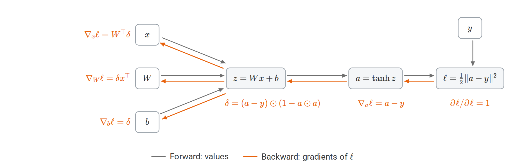

*Values move forward through the three operations, and gradients of $`\ell`$ move back along the same edges. The single vector $`\delta`$ yields the weight, bias, and input gradients.*

## <a id="automatic-differentiation"></a>Automatic differentiation

**Automatic differentiation (AD)** evaluates derivatives by composing the derivative rules of a program's elementary operations. Addition, multiplication, matrix products, and nonlinear functions each supply a local rule; the chain rule connects them. The resulting derivative concerns the real-valued computation represented by the program, evaluated using its computed intermediate values.

Finite differences infer a derivative from nearby function evaluations and introduce a perturbation size and truncation error. Symbolic differentiation transforms expressions into derivative expressions. AD propagates derivative information through a computation while retaining its intermediate structure. It can therefore differentiate a long composition without expanding it into a single formula, and has no finite-difference truncation error. These distinctions and the two accumulation modes are developed in Baydin et al.'s [*Automatic Differentiation in Machine Learning: a Survey*](https://jmlr.org/papers/v18/17-468.html).

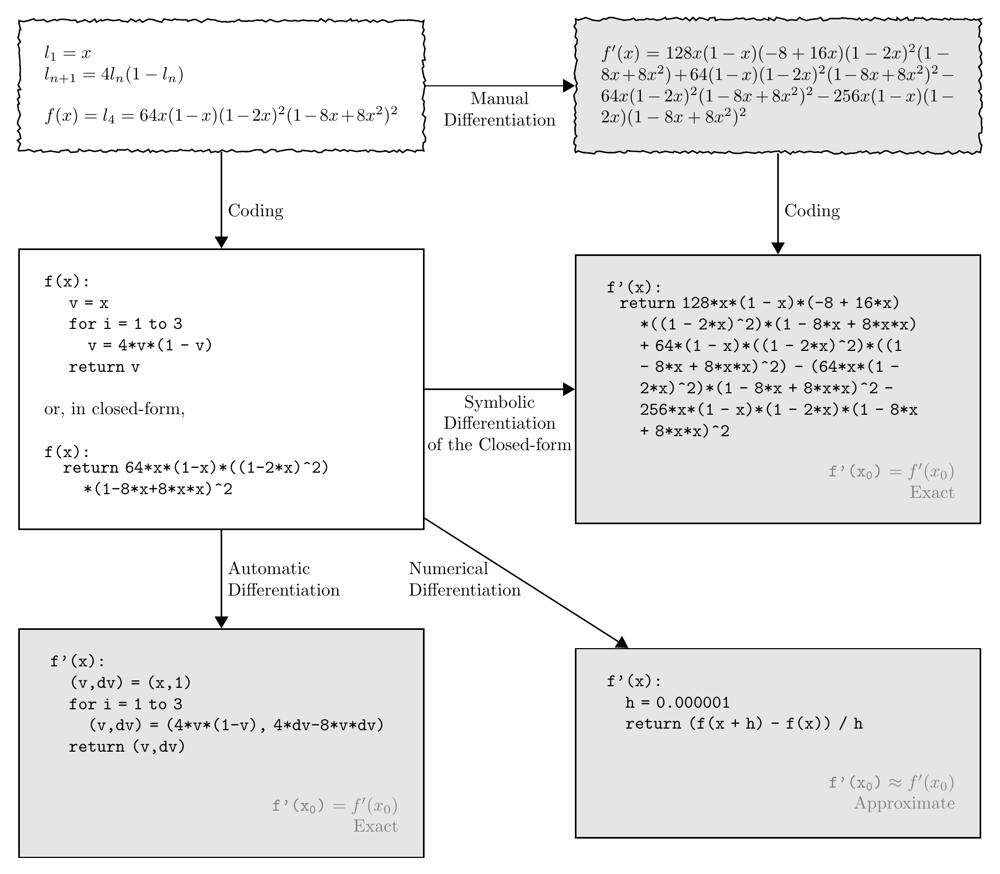

*For the truncated logistic map $`l_4`$, symbolic differentiation of the closed form produces a long expression, a finite difference only approximates the derivative, and AD transforms the program itself and is exact up to rounding. Figure 2 of Baydin et al.*

Andrej Karpathy's [*The spelled-out intro to neural networks and backpropagation: building micrograd*](https://www.youtube.com/watch?v=VMj-3S1tku0) (2 h 25 min) develops these ideas by implementing a scalar reverse-mode engine and training a small network. The accompanying [lecture notebook](https://github.com/karpathy/nn-zero-to-hero/blob/master/lectures/micrograd/micrograd_lecture_first_half_roughly.ipynb) and [micrograd code](https://github.com/karpathy/micrograd) expose the graph, local derivative rules, and gradient accumulation directly.

### <a id="computational-graphs-and-local-derivative-rules"></a>Computational graphs and local derivative rules

A **computational graph** records which operations depend on which values. Nodes may represent scalars, vectors, or tensors. A node is evaluated only after its inputs are available; this gives a topological order. An executed finite loop can be represented by successive copies of its operations. A shared intermediate appears once but may supply several later operations.

For a node $`z=\phi(a,b)`$, the local differential is

```math
dz=J_{\phi,a}\,da+J_{\phi,b}\,db.
```

For scalar multiplication, $`z=ab`$, this reads $`dz=b\,da+a\,db`$. Every differentiation mode uses this same rule. What changes is the information propagated through it and the direction of traversal. The ordinary values computed by the program are called **primal values**, distinguishing them from derivative information.

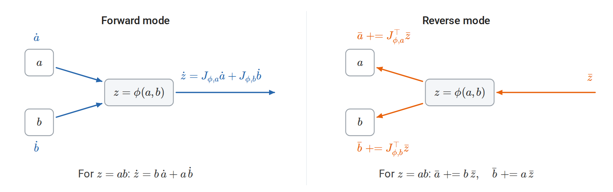

*Tangents travel with the evaluation, from inputs to output; adjoints travel against it and accumulate with $`\mathrel{+}=`$. Both directions use the same local Jacobians $`J_{\phi,a}`$ and $`J_{\phi,b}`$.*

### <a id="forward-mode-sensitivity-to-a-chosen-input-change"></a>Forward mode: sensitivity to a chosen input change

Suppose a program computes $`F(x)`$. In addition to its value, we may want the first-order effect of a particular change to its inputs. For $`F:\mathbb R^d\to\mathbb R^m`$, specify that change by a direction $`v\in\mathbb R^d`$ and consider the path $`x(\tau)=x+\tau v`$. The scalar $`\tau`$ measures how far we move along this path. For instance, $`v=(1,-1)^\top`$ means increasing the first input and decreasing the second by the same amount.

Every intermediate value $`z`$ then changes with $`\tau`$. Its **tangent** is its rate of change at the original input:

```math
\dot z=\left.\frac{d}{d\tau}z(x+\tau v)\right|_{\tau=0}.
```

Equivalently, $`z(x+\tau v)=z(x)+\tau\dot z+o(|\tau|)`$. Thus $`z`$ records the current value and $`\dot z`$ records its sensitivity to the chosen input change. All dots refer to this same $`\tau`$; $`\dot z`$ has the same shape as $`z`$. It is $`\tau\dot z`$ that approximates the actual change in $`z`$.

Forward-mode AD computes the pair $`(z,\dot z)`$ at each operation. Initialize $`\dot x=v`$, set the tangents of fixed constants to zero, and use the local chain rule in the ordinary evaluation order:

```math
\dot z=J_{\phi,a}\dot a+J_{\phi,b}\dot b.
```

For a scalar product $`z=ab`$, this becomes $`\dot z=b\dot a+a\dot b`$: changes in either factor contribute. The intermediate tangents let each operation pass this sensitivity to the next. At the output,

```math
\dot F=J_F(x)v\in\mathbb R^m.
```

This **Jacobian–vector product (JVP)** supplies the approximation $`F(x+\tau v)\approx F(x)+\tau J_F(x)v`$. AD obtains its coefficient from local derivative rules, without evaluating the program at a nearby input or choosing a finite-difference step size. The direction $`v`$ specifies the sensitivity question; it need not be a unit vector or an optimizer update.

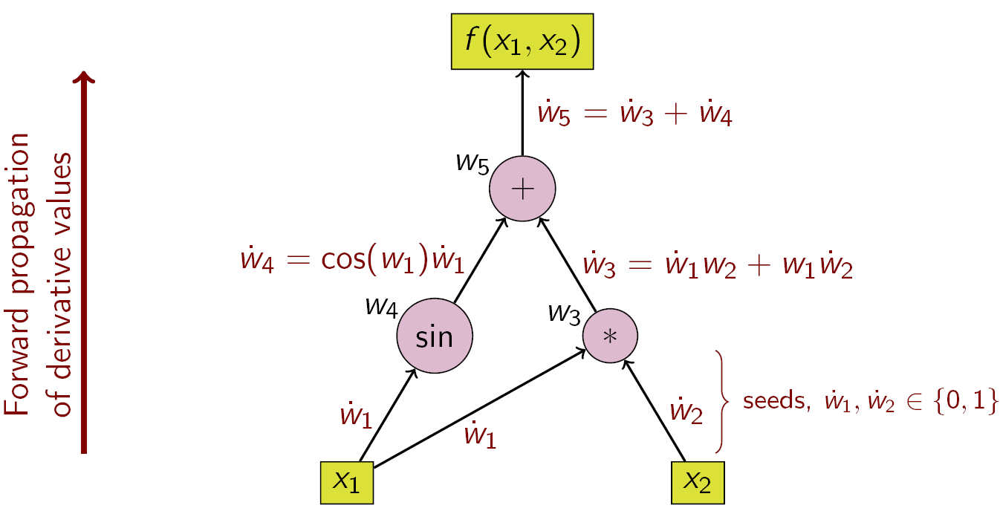

*Here $`f(x_1,x_2)=x_1x_2+\sin x_1`$, with intermediate values $`w_1,\dots,w_5`$. Tangents flow upward from the seeds $`\dot w_1,\dot w_2`$, which choose the input direction; $`\dot w_1=1`$, $`\dot w_2=0`$ gives $`\partial f/\partial x_1`$.*

Choosing $`v=e_j`$ isolates the $`j`$th input and returns the $`j`$th Jacobian column. For scalar $`f`$, one direction gives the scalar $`\dot f=\nabla f(x)^\top v`$; separate coordinate seeds recover the full gradient. Forward mode is useful when only a few input directions matter, including sensitivities to a scalar parameter or matrix-free derivative products; [Choosing between forward and reverse mode](#choosing-between-forward-and-reverse-mode) below gives concrete cases.

An **ordinary forward pass** evaluates values such as activations and a loss. **Forward-mode differentiation** additionally propagates tangents. A usual neural-network training step evaluates values forward and uses reverse mode to obtain all parameter gradients of its scalar loss; it does not require a separate forward tangent for every parameter.

### <a id="reverse-mode-sensitivity-of-a-chosen-output"></a>Reverse mode: sensitivity of a chosen output

After computing the primal values, choose an output seed $`u\in\mathbb R^m`$ and the scalar quantity $`u^\top F(x)`$, with $`u`$ fixed. Reverse mode asks how each input affects this chosen output quantity. An intermediate's **adjoint** $`\bar z`$ is the gradient of that scalar objective with respect to $`z`$, represented using the same shape as $`z`$. Initialize the output adjoint to $`u`$, all other adjoints to zero, and traverse the graph in reverse order. The node $`z=\phi(a,b)`$ contributes

```math
\bar a\mathrel{+}=J_{\phi,a}^\top\bar z,
\qquad
\bar b\mathrel{+}=J_{\phi,b}^\top\bar z.
```

The final input adjoint is

```math
\bar x=J_F(x)^\top u\in\mathbb R^d.
```

The usual name **vector–Jacobian product (VJP)** refers to $`u^\top J_F`$; with column vectors, the returned adjoint represents its transpose $`J_F^\top u`$. For a scalar loss, seeding $`\bar f=1`$ returns the entire column gradient $`\nabla f(x)`$.

The addition in $`\mathrel{+}=`$ is essential. When a value feeds several operations, each outgoing path contributes to its sensitivity. Overwriting one contribution with another loses part of the chain rule. Backpropagation through a neural network is this reverse accumulation applied to its loss computation.

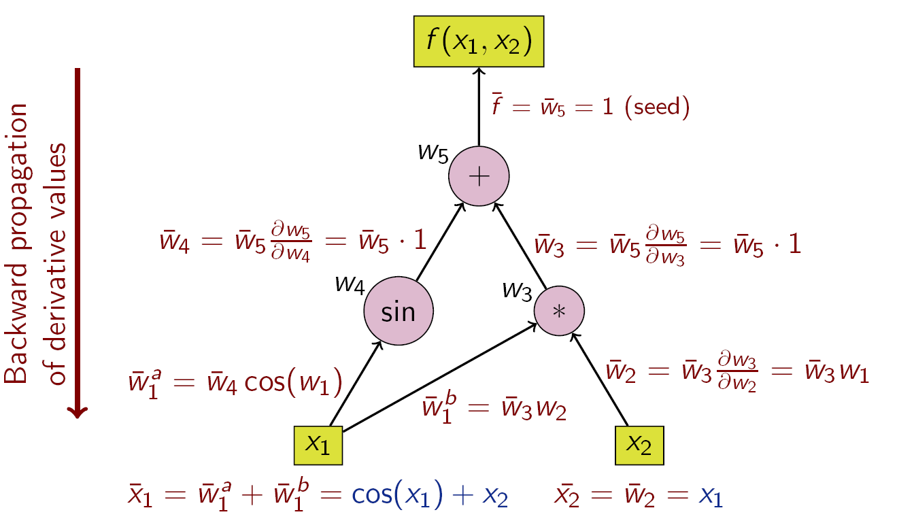

*For the same function, reverse mode starts from the seed $`\bar f=\bar w_5=1`$ at the output. Because $`x_1`$ feeds both the sine and the product, its adjoint is the sum of two contributions, $`\bar w_1^a`$ and $`\bar w_1^b`$.*

### <a id="a-shared-intermediate-differentiated-both-ways"></a>A shared intermediate, differentiated both ways

Consider the scalar program

```math
s=x_1x_2,\qquad r=\sin s,\qquad f(x)=s+r.
```

Its graph makes the two uses of $`s`$ explicit:

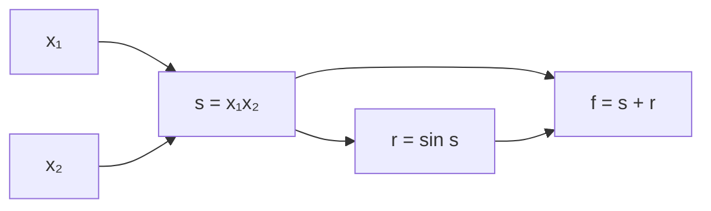
```mermaid

flowchart LR
    X1["x₁"] --> S["s = x₁x₂"]
    X2["x₂"] --> S
    S --> R["r = sin s"]
    S --> F["f = s + r"]
    R --> F
```

At $`x=(2,3)^\top`$, choose $`v=(1,-1)^\top`$. The question is how $`f`$ changes along $`(x_1,x_2)=(2+\tau,3-\tau)`$. Seed $`\dot x_1=1`$ and $`\dot x_2=-1`$. Forward mode evaluates

```math
\begin{aligned}
s&=6,&\dot s&=3(1)+2(-1)=1,\\
r&=\sin6,&\dot r&=\cos6\,\dot s=\cos6,\\
f&=6+\sin6,&\dot f&=1+\cos6.
\end{aligned}
```

The current output is $`f(x)\approx5.72058`$ and its tangent is $`\dot f\approx1.96017`$. In particular,

```math
f(2+\tau,3-\tau)
=f(2,3)+(1+\cos6)\tau+o(|\tau|).
```

A small positive $`\tau`$ therefore increases the output by approximately $`1.96017\tau`$. Each intermediate tangent was needed to compute this final slope through the product, sine, and addition.

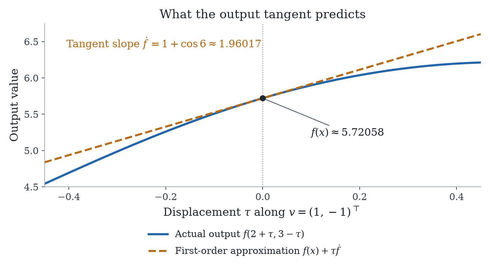

*The horizontal axis moves along the chosen input direction. Forward AD computes the slope of the orange tangent line at $`\tau=0`$. Multiplying that slope by a small displacement predicts the output change; the blue curve shows the actual output along the path.*

For the reverse pass, start with $`\bar f=1`$. The final addition contributes $`1`$ to both $`\bar s`$ and $`\bar r`$. The sine operation then adds $`\cos6\,\bar r`$ to $`\bar s`$, giving $`\bar s=1+\cos6`$. Finally, the product contributes

```math
\nabla f(x)=\bar x
=(1+\cos6)\begin{bmatrix}3\\2\end{bmatrix}.
```

The two answers agree through $`\dot f=\bar x^\top v`$: forward mode answers one directional-sensitivity question, while reverse mode gives all input sensitivities of this scalar output in one reverse traversal.

### <a id="backpropagation-in-pytorch"></a>Backpropagation in PyTorch

For the tanh layer above, automatic differentiation recovers the same $`\delta`$, weight gradient, and bias gradient:

```python
import torch

W = torch.tensor([[0.4, -0.2], [0.1, 0.3]],
                 dtype=torch.float64, requires_grad=True)
b = torch.zeros(2, dtype=torch.float64, requires_grad=True)
x = torch.tensor([1., 2.], dtype=torch.float64)
y = torch.tensor([0.2, -0.1], dtype=torch.float64)

z = W @ x + b
a = torch.tanh(z)
loss = 0.5*((a - y)**2).sum()
grad_W, grad_b, delta = torch.autograd.grad(loss, (W, b, z))

assert torch.allclose(delta, (a - y)*(1 - a*a))
assert torch.allclose(grad_W, torch.outer(delta, x))
assert torch.allclose(grad_b, delta)
print("gradient with respect to z:", delta)
```

[`torch.tensor`](https://docs.pytorch.org/docs/stable/generated/torch.tensor.html) creates a tensor from data. The argument `dtype=torch.float64` requests double precision, and `requires_grad=True` tells PyTorch's automatic differentiation engine, *autograd*, to record the operations applied to that tensor. [`torch.zeros`](https://docs.pytorch.org/docs/stable/generated/torch.zeros.html), [`torch.tanh`](https://docs.pytorch.org/docs/stable/generated/torch.tanh.html), and [`torch.outer`](https://docs.pytorch.org/docs/stable/generated/torch.outer.html) behave like their NumPy counterparts, and [`torch.allclose`](https://docs.pytorch.org/docs/stable/generated/torch.allclose.html) compares tensors within a tolerance. [`torch.autograd.grad`](https://docs.pytorch.org/docs/stable/generated/torch.autograd.grad.html) runs reverse mode from `loss` and returns derivatives with respect to the requested inputs, here including the intermediate `z`. A usual training loop instead calls [`loss.backward()`](https://docs.pytorch.org/docs/stable/generated/torch.Tensor.backward.html), which adds each parameter's gradient to its [`.grad`](https://docs.pytorch.org/docs/stable/generated/torch.Tensor.grad.html) field. At a nondifferentiable point, such as the kink of ReLU, a framework uses a specified convention; the returned value does not establish the existence of an ordinary derivative there. [Appendix I](#block-calculus-appendix-i) lists every library function used in the chapter's examples, with links to their documentation.

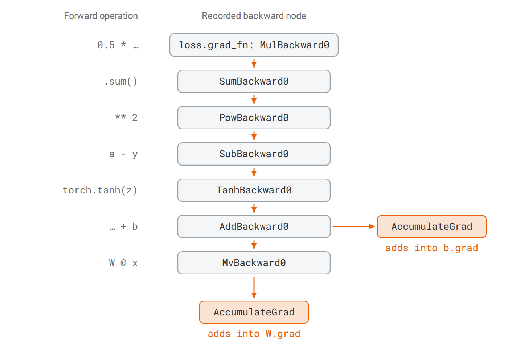

*PyTorch records these nodes for the code above; they can be read from `loss.grad_fn` and its `next_functions`. No node is recorded for `x` or `y`, which do not require gradients. `loss.backward()` adds the results into `W.grad` and `b.grad`; `torch.autograd.grad` returns them instead.*

### <a id="choosing-between-forward-and-reverse-mode"></a>Choosing between forward and reverse mode

Both modes follow the program's own operations, so their cost is tied to the cost of evaluating the function once. Write $`\operatorname{cost}(F)`$ for the number of elementary operations in one evaluation of $`F`$. Each local derivative rule costs at most a small constant multiple of the operation it differentiates. Consequently:

- one **forward-mode pass** computes $`F(x)`$ together with one Jacobian–vector product $`J_F(x)v\in\mathbb R^m`$;
- one **reverse-mode pass** computes $`F(x)`$ and then one vector–Jacobian product $`J_F(x)^\top u\in\mathbb R^d`$;
- each costs $`c\cdot\operatorname{cost}(F)`$ operations for a modest constant $`c`$. [Baydin et al.](https://arxiv.org/abs/1502.05767) report $`c<6`$, typically between 2 and 3.

Neither pass forms the Jacobian. They differ in which question one pass answers. A forward pass answers “how do *all outputs* change when the input moves along the one direction $`v`$?” A reverse pass answers “how does the *one* output combination $`u^\top F`$ depend on *every* input?” Building the full $`m\times d`$ Jacobian therefore takes $`d`$ forward passes, one per input coordinate, each giving a column; or $`m`$ reverse passes, one per output coordinate, each giving a row.

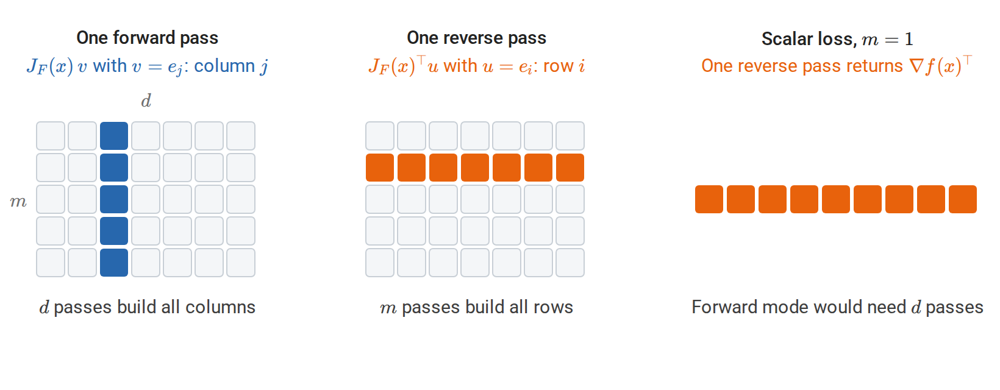

*One forward pass returns one column of the $`m\times d`$ Jacobian, and one reverse pass returns one row. For a scalar loss the Jacobian is a single row, so one reverse pass returns the whole gradient.*

| Shape of $`F:\mathbb R^d\to\mathbb R^m`$ | Forward passes for the full Jacobian | Reverse passes | Preferred mode |
| --- | --- | --- | --- |
| Scalar loss of many parameters, $`m=1\ll d`$ | $`d`$ | $`1`$ | Reverse |
| Few inputs, many outputs, $`d\ll m`$ | $`d`$ | $`m`$ | Forward |
| $`d`$ and $`m`$ comparable | $`d`$ | $`m`$ | Either; memory often decides |

**Example.** A network whose loss depends on $`d=10^6`$ parameters is a map $`\mathbb R^{10^6}\to\mathbb R`$. One reverse pass returns the entire gradient at the cost of a few loss evaluations. Forward mode would need $`10^6`$ passes, one per parameter. This is why neural networks are trained with reverse mode, that is, backpropagation.

**Memory.** Reverse mode runs backward through the computation, so it needs the intermediate values of the forward evaluation; storing all of them can take memory proportional to the length of the computation. Checkpointing stores only selected intermediate values and recomputes the others during the backward pass, trading extra work for less memory; see [Appendix C](#block-calculus-appendix-c). Forward mode carries each tangent alongside its value and can discard intermediates as soon as they have been used.

**When forward mode is used.** Forward mode is the natural choice when only a few input directions matter:

- **Sensitivity to a few parameters.** The change in an entire simulated trajectory, a rendered image, or a whole vector of predictions when one physical constant or one hyperparameter changes is obtained from one forward pass per parameter. [Franceschi et al. (2017)](https://arxiv.org/abs/1703.01785) compute hyperparameter gradients this way when there are few hyperparameters and a long training run.
- **Matrix-free solvers.** Newton–Krylov and related methods for systems $`F(x)=0`$ need only products $`J_F(x)v`$, never the full Jacobian.
- **Hessian–vector products.** Applying forward mode to a reverse-mode gradient computation gives $`H(x)v`$ for a few times the cost of a gradient, without forming the $`d\times d`$ Hessian ([Pearlmutter, 1994](https://doi.org/10.1162/neco.1994.6.1.147)). Such products drive Newton-type methods and are used to measure the curvature of neural-network losses. Appendix C contains a PyTorch version.
- **Long computations with few inputs.** Because it need not store intermediate values, forward mode can be used when the memory required by reverse mode is prohibitive and the number of input directions is small.

[Appendix C](#block-calculus-appendix-c) contains explicit NumPy traversals of both modes, the tensor-valued rules, PyTorch's `jvp` and `vjp` interfaces, and a cost table.

## <a id="curvature-and-taylor-s-theorem"></a>Curvature and Taylor's theorem

The **Hessian** of a scalar function is the Jacobian of its gradient:

```math
H(x)=\nabla^2f(x),
\qquad
H_{ij}(x)=\frac{\partial}{\partial x_j}
\left(\frac{\partial f}{\partial x_i}\right).
```

If the second partial derivatives are continuous in a neighborhood, mixed partials agree and $`H(x)`$ is symmetric. The second directional derivative along $`v`$ is $`v^\top H(x)v`$. Positive eigenvalues describe upward curvature, negative eigenvalues downward curvature, and eigenvalues near zero weak curvature in the corresponding directions. A symmetric matrix $`H`$ is **positive semidefinite**, written $`H\succeq0`$, when $`v^\top Hv\ge0`$ for every $`v`$. It is **positive definite**, written $`H\succ0`$, when this inequality is strict for every nonzero $`v`$. The notation $`A\preceq B`$ means $`B-A\succeq0`$.

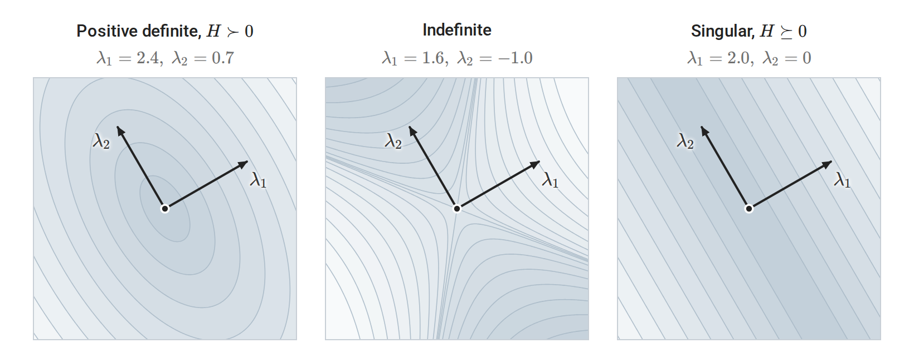

*The three Hessians share their eigenvectors; darker regions have smaller values of $`\tfrac12h^\top Hh`$. Along an eigenvector with eigenvalue $`\lambda`$ the value is $`\tfrac12\lambda\|h\|^2`$, so positive eigenvalues curve upward, a negative eigenvalue curves downward, and a zero eigenvalue leaves a flat direction.*

### <a id="the-quadratic-approximation"></a>The quadratic approximation

A function is **$`C^k`$** when its derivatives through order $`k`$ exist and are continuous. For a $`C^2`$ scalar function near $`x`$,

```math
f(x+h)=f(x)+\nabla f(x)^\top h
+\frac12h^\top H(x)h+o(\|h\|^2).
```

The gradient supplies the linear change; the Hessian supplies its first curvature correction. For a quadratic function this expansion is exact, with no remainder.

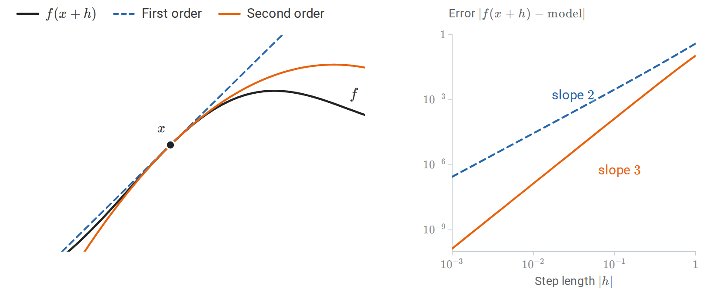

*The second-order model of $`f(x)=\sin x+x/2`$ at $`x=0.6`$ follows the curve farther than the tangent does. On logarithmic axes (right), halving the step divides the first-order error by about $`4`$ and the second-order error by about $`8`$.*

The fundamental theorem of calculus applied along $`x+th`$ also gives

```math
f(x+h)-f(x)=\int_0^1\nabla f(x+th)^\top h\,dt.
```

This identity connects derivative bounds to approximation errors and underlies the descent lemma below. The segment must stay inside the domain. [Appendix A](#block-calculus-appendix-a) develops arbitrary-order Taylor formulas, the integral remainder and its proof, convergence of Taylor series, and tensor-valued expansions.

## <a id="optimization-problems-and-notation"></a>Optimization problems and notation

The rest of the chapter is about minimizing a function. It addresses three questions:

1. **What is a minimizer, and how can one be recognized?** This section defines minimizers; [Optimality conditions](#optimality-conditions) relates them to gradients and Hessians.
2. **What makes a function easy or hard to minimize?** [Convexity, Lipschitz conditions, and curvature](#convexity-lipschitz-conditions-and-curvature) introduces the properties that the guarantees rely on.
3. **How fast do specific methods make progress?** The sections from [Gradient descent and step sizes](#gradient-descent-and-step-sizes) onward analyze gradient descent, Newton's method, stochastic gradients, and adaptive optimizers under those properties.

In the layer example, $`x`$ denoted the input. From here onward, $`x`$ denotes the parameters being optimized; a neural network can be represented by concatenating its trainable tensors. An optimization problem has the form

```math
\min_{x\in C} f(x),
```

where $`C`$ is the **feasible set**; this set is unrelated to the smoothness classes $`C^k`$. An unconstrained problem has $`C=\mathbb R^d`$. A **global minimizer** $`x_\star`$ satisfies $`f(x_\star)\le f(x)`$ for every $`x\in C`$; a **local minimizer** satisfies this only for feasible points in some neighborhood. A strict minimizer gives a strict inequality for other points in that neighborhood.

The **infimum** $`f_{\inf}=\inf_{x\in C}f(x)`$ is the greatest lower bound on the objective values; it need not be attained. For instance, $`e^x`$ on $`\mathbb R`$ has infimum zero and no minimizer. Even when an algorithm's objective values converge to the infimum, its iterates may diverge.

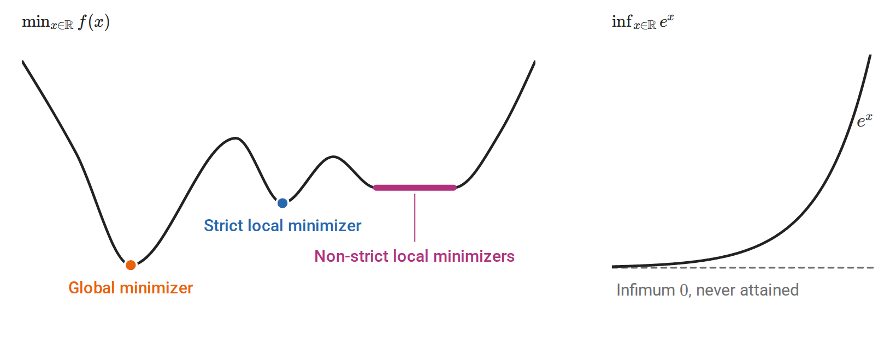

*A function can have strict and non-strict local minimizers besides its global one (left). On $`\mathbb R`$, $`e^x`$ approaches its infimum $`0`$ without attaining it (right).*

A continuous objective attains its minimum on a nonempty compact feasible set. Existence on unbounded domains requires additional assumptions; see [Appendix B](#block-calculus-appendix-b).

When a minimum is attained, write $`f_\star=f(x_\star)`$, $`R_0=\|x_0-x_\star\|`$, and $`\Delta_0=f(x_0)-f_\star`$. For nonconvex stationarity bounds, only a finite lower bound $`f_{\inf}`$ is needed; there we use $`\Delta_0=f(x_0)-f_{\inf}`$.

### <a id="optimization-notation"></a>Optimization notation

The convergence statements and optimizer equations use the following conventions. An update with index $`t=0`$ starts at $`x_0`$ and produces $`x_1`$. Each symbol is also defined where it is first used, so the table is for reference rather than memorization.

| Symbol | Meaning |
| --- | --- |
| $`x_t`$ | Parameter vector before update $`t`$ |
| $`\eta_t`$ | Step size or learning rate; positive in the convergence theorems unless specified otherwise |
| $`g_t`$ | Exact gradient, gradient estimate, or selected subgradient, as specified by the method |
| $`x_\star,f_\star`$ | A minimizer and its objective value, when a minimum exists |
| $`G`$ | Function Lipschitz bound or selected-subgradient norm bound; stochastic second-moment bounds use $`\mathbb E\|g_t\|^2\le G^2`$ |
| $`L`$ | Positive Lipschitz bound for the gradient; any valid positive upper bound may be used |
| $`\mu`$ | Strong-convexity constant |
| $`\rho`$ | Lipschitz constant of the Hessian |
| $`\sigma^2`$ | Bound on stochastic-gradient noise variance |
| $`\beta,\beta_1,\beta_2`$ | Momentum or moving-average coefficients |
| $`\varepsilon`$ | Target optimization accuracy |
| $`\epsilon_{\mathrm{opt}}`$ | Positive damping constant in an optimizer denominator |

Bounds on gradients, gradient noise, and function values are separate assumptions.

## <a id="convexity-lipschitz-conditions-and-curvature"></a>Convexity, Lipschitz conditions, and curvature

Three properties determine how much a gradient method can guarantee:

- **Convexity** makes local information global. A tangent never lies above a convex function, so a point with zero gradient is a global minimizer.
- **Smoothness** with constant $`L`$ bounds how fast the gradient can change. It determines how large a step can be trusted: roughly $`1/L`$.
- **Strong convexity** with constant $`\mu`$ makes the function curve upward at least as fast as a parabola. The size of the gradient then indicates how far the current point is from the minimizer.

The ratio $`\kappa=L/\mu`$ of the two curvature bounds will govern the speed of gradient descent.

### <a id="convex-and-strongly-convex-functions"></a>Convex and strongly convex functions

A set $`C`$ is **convex** if $`(1-t)x+ty\in C`$ whenever $`x,y\in C`$ and $`0\le t\le1`$. A function on a convex domain is convex if

```math
f((1-t)x+ty)\le(1-t)f(x)+tf(y).
```

Its graph lies below every chord. Equivalently, its epigraph $`\{(x,a):f(x)\le a\}`$ is convex. The function is **strictly convex** if the chord inequality is strict whenever $`x\ne y`$ and $`0<t<1`$. For differentiable $`f`$, ordinary convexity is equivalent to

```math
f(y)\ge f(x)+\nabla f(x)^\top(y-x).
```

Thus tangent affine functions are global lower bounds. For $`C^2`$ functions on an open convex domain, convexity is equivalent to $`\nabla^2f(x)\succeq0`$ everywhere.

A function is **$`\mu`$-strongly convex**, with $`\mu>0`$, if $`x\mapsto f(x)-\tfrac\mu2\|x\|^2`$ is convex. In the differentiable case,

```math
f(y)\ge f(x)+\nabla f(x)^\top(y-x)
+\frac\mu2\|y-x\|^2.
```

For $`C^2`$ functions this is equivalent to $`\nabla^2f(x)\succeq\mu I`$. Strong convexity implies strict convexity and hence uniqueness of a minimizer when one exists. Strict convexity alone supplies no uniform positive curvature: $`x^4`$ is strictly convex but has zero second derivative at zero and is not strongly convex on $`\mathbb R`$.

Let $`f`$ be differentiable and $`\mu`$-strongly convex on $`\mathbb R^d`$, with minimizer $`x_\star`$ and $`f_\star=f(x_\star)`$. For every $`x`$,

```math
\frac\mu2\|x-x_\star\|^2
\le f(x)-f_\star
\le\frac{\|\nabla f(x)\|^2}{2\mu}.
```

These inequalities say that three measures of being far from optimal control one another: the distance $`\|x-x_\star\|`$, the objective gap $`f(x)-f_\star`$, and the gradient size $`\|\nabla f(x)\|`$. Both follow from the strong-convexity inequality above, used in two different ways.

**Left inequality: a small gap forces a small distance.** Use the strong-convexity inequality with the minimizer as base point, replacing $`x`$ by $`x_\star`$ and $`y`$ by $`x`$. Since $`\nabla f(x_\star)=0`$, the linear term vanishes:

```math
f(x)\ge f_\star+\frac\mu2\|x-x_\star\|^2.
```

The function lies above a parabola of curvature $`\mu`$ centered at the minimizer.

**Right inequality: a small gradient forces a small gap.** Now fix $`x`$ and read the strong-convexity inequality as a lower bound that holds for every $`y`$:

```math
f(y)\ge q_x(y):=f(x)+\nabla f(x)^\top(y-x)+\frac\mu2\|y-x\|^2.
```

Take the minimum of both sides over $`y`$. The left side's minimum is $`f_\star`$. The quadratic $`q_x`$ is minimized where its gradient $`\nabla f(x)+\mu(y-x)`$ vanishes, at $`y=x-\nabla f(x)/\mu`$, and its minimum value is $`f(x)-\|\nabla f(x)\|^2/(2\mu)`$. Hence $`f_\star\ge f(x)-\|\nabla f(x)\|^2/(2\mu)`$, which rearranges to the right inequality.

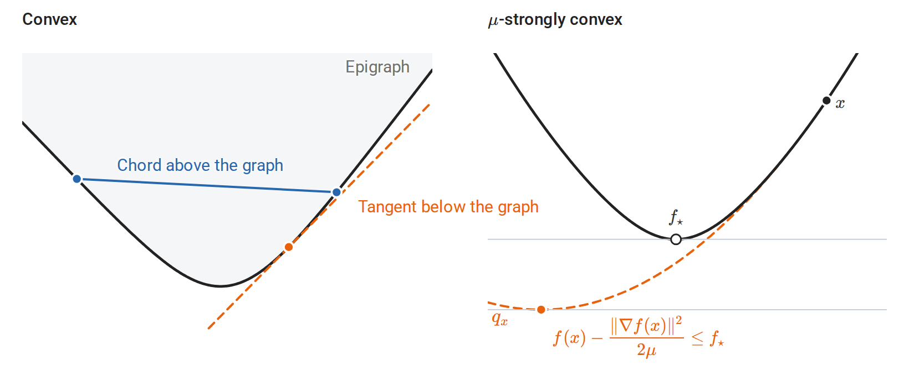

*A convex function lies below its chords and above its tangents, and its epigraph is convex (left). For a strongly convex function with $`\mu=0.5`$ (right), the quadratic lower bound $`q_x`$ has minimum $`f(x)-\|\nabla f(x)\|^2/(2\mu)`$, which lies below $`f_\star`$: this is the right inequality.*

Combining the two inequalities gives $`\|x-x_\star\|\le\|\nabla f(x)\|/\mu`$. The right inequality has two uses later. It justifies stopping when the gradient is small, because for a strongly convex objective a small gradient certifies a small objective gap. It is also the step that turns the descent lemma into geometric convergence of gradient descent. Without strong convexity, a small gradient need not mean a small gap. The convex function $`f(x)=\sqrt{1+x^2}/100`$ has $`|f'(x)|<0.01`$ everywhere, yet $`f(1000)-f_\star\approx9.99`$.

The geometric definitions and their equivalences are developed in Boyd and Vandenberghe's [*Convex Optimization*, Chapters 2–3](https://web.stanford.edu/~boyd/cvxbook/bv_cvxbook.pdf). The arguments here use the Euclidean norm; changing the norm changes the constants and the associated geometry.

### <a id="three-different-lipschitz-assumptions"></a>Three different Lipschitz assumptions

A Lipschitz bound limits how fast a quantity can change with the input. The three conditions below apply such a bound to the function value, the gradient, and the Hessian, respectively.

| Condition | Inequality | Interpretation |
| --- | --- | --- |
| $`f`$ is $`G`$-Lipschitz | $`\lvert f(x)-f(y)\rvert\le G\|x-y\|`$ | Function values cannot change faster than linearly |
| $`f`$ is $`L`$-smooth | $`\|\nabla f(x)-\nabla f(y)\|\le L\|x-y\|`$ | The gradient cannot change too quickly |
| Hessian is $`\rho`$-Lipschitz | $`\|\nabla^2f(x)-\nabla^2f(y)\|\le\rho\|x-y\|`$ | The curvature cannot change too quickly |

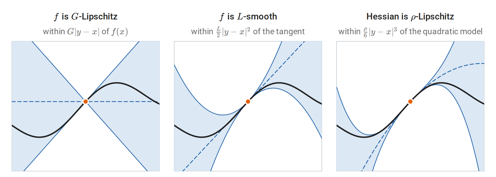

*For $`f(y)=\sin 1.2y+0.3y`$ and the orange point $`x`$, the smallest valid constants are $`G=1.5`$, $`L=1.44`$, and $`\rho=1.728`$. Each assumption confines the graph to its shaded region: a cone around the value $`f(x)`$, a quadratic band around the tangent, or a cubic band around the second-order Taylor model.*

In optimization, **smooth** usually means a Lipschitz gradient, with a stated constant $`L`$. Merely being $`C^\infty`$ does not imply any global Lipschitz bound. The function $`x^4`$ is $`C^\infty`$ but has unbounded curvature on $`\mathbb R`$.

On an open convex domain, a differentiable function with $`\|\nabla f(x)\|\le G`$ is $`G`$-Lipschitz, by integration along segments; the converse follows from directional derivatives. For a $`C^2`$ function, $`L`$-smoothness is equivalent to

```math
\|\nabla^2f(x)\|\le L,
\quad\text{or equivalently}\quad
-LI\preceq\nabla^2f(x)\preceq LI.
```

It does not require convexity. Combining smoothness and strong convexity gives

```math
\mu I\preceq\nabla^2f(x)\preceq LI,
\qquad
\kappa=\frac L\mu\ge1,
```

where $`\kappa`$ is a curvature condition number.

**Examples.** The function $`|x|`$ is globally 1-Lipschitz and nonsmooth. The function $`x^2/2`$ is globally 1-smooth and 1-strongly convex, but is not globally Lipschitz as a function. The function $`\sin x`$ has a 1-Lipschitz gradient but is not convex. A quadratic has a constant Hessian, so its Hessian Lipschitz constant is zero.

Always attach a **domain** to a Lipschitz claim. The function $`x^4`$ is smooth on each bounded interval with a constant depending on that interval. A strongly convex function on all of $`\mathbb R^d`$ cannot also be globally Lipschitz as a function. Bounded-gradient assumptions in constrained strongly convex results therefore concern the relevant feasible region.

## <a id="optimality-conditions"></a>Optimality conditions

For an unconstrained differentiable function, an interior local minimum must satisfy $`\nabla f(x_\star)=0`$. For $`C^2`$ functions, a necessary second-order condition is $`\nabla^2f(x_\star)\succeq0`$. Conversely,

```math
\nabla f(x_\star)=0,
\qquad
\nabla^2f(x_\star)\succ0
```

imply a strict local minimum. A positive semidefinite Hessian alone is inconclusive: $`x^4`$, $`-x^4`$, and $`x^3`$ all have zero first and second derivatives at zero but different local behavior.

A **stationary point** has zero gradient. It can be a minimum, maximum, or saddle. A negative Hessian eigenvalue at a stationary point gives a direction of decrease; an indefinite Hessian gives both increasing and decreasing directions. For a differentiable convex function, every stationary point is globally optimal.

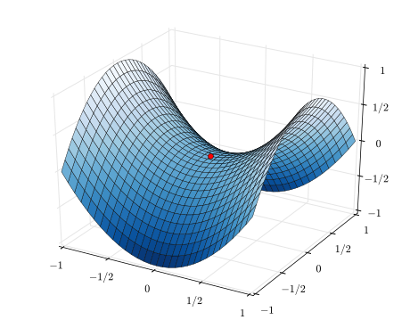

*On the graph of $`z=x^2-y^2`$ the gradient vanishes at the origin, and the Hessian $`\operatorname{diag}(2,-2)`$ is indefinite: the surface curves upward along $`x`$ and downward along $`y`$.*

Over a convex feasible set $`C`$, the first-order condition for a differentiable convex objective is

```math
\nabla f(x_\star)^\top(x-x_\star)\ge0
\qquad\text{for every }x\in C.
```

The gradient need not vanish at a constrained optimum. For example, minimizing $`f(x)=x`$ over $`x\ge0`$ gives $`x_\star=0`$ with $`f'(x_\star)=1`$.

## <a id="gradient-descent-and-step-sizes"></a>Gradient descent and step sizes

An iterative method chooses a direction $`p_t`$ and a step size $`\eta_t>0`$:

```math
x_{t+1}=x_t+\eta_t p_t.
```

A **descent direction** satisfies $`\nabla f(x_t)^\top p_t<0`$. Differentiability ensures decrease for sufficiently small steps along such a direction. It does not say that a unit step decreases the function, or that a sequence of decreasing values reaches the global minimum.

Gradient descent uses $`p_t=-\nabla f(x_t)`$. Its update also minimizes a local linear model with a quadratic movement penalty:

```math
x_{t+1}=\arg\min_z\left\{
\nabla f(x_t)^\top(z-x_t)+\frac{1}{2\eta_t}\|z-x_t\|^2
\right\}.
```

To see why, complete the square:

```math
\nabla f(x_t)^\top(z-x_t)+\frac{1}{2\eta_t}\|z-x_t\|^2
=\frac{1}{2\eta_t}\bigl\|z-\bigl(x_t-\eta_t\nabla f(x_t)\bigr)\bigr\|^2-\frac{\eta_t}{2}\|\nabla f(x_t)\|^2.
```

The last term does not depend on $`z`$, so the minimizer is $`z=x_t-\eta_t\nabla f(x_t)`$, the gradient step. Equivalently, adding the constant $`f(x_t)`$, gradient descent replaces $`f`$ near $`x_t`$ by the quadratic model

```math
\widehat f_t(z)=f(x_t)+\nabla f(x_t)^\top(z-x_t)+\frac{1}{2\eta_t}\|z-x_t\|^2
```

and moves to the model's minimizer. The model has the correct value and slope at $`x_t`$, and it curves upward equally in every direction, with curvature $`1/\eta_t`$. The step size is therefore the reciprocal of an assumed curvature: a small step assumes that $`f`$ bends sharply and moves cautiously. If the assumed curvature is at least the true curvature bound $`L`$, the model lies above $`f`$, as the descent lemma below shows, so moving to its minimizer cannot increase $`f`$. [Newton's method](#newton-s-method) uses the same idea with the Hessian in place of the uniform curvature $`1/\eta_t`$.

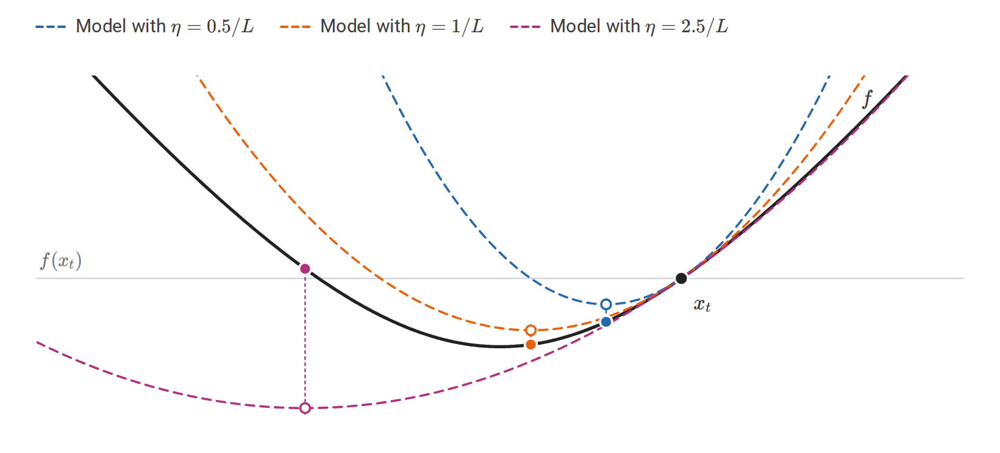

*Each dashed model matches the value and slope of $`f(x)=\log\cosh x+0.1x^2`$ at $`x_t`$ and has curvature $`1/\eta`$; the gradient step moves to its minimizer (open circle). Here $`L=1.2`$. With $`\eta\le1/L`$ the model lies above $`f`$ and $`f`$ decreases; with $`\eta=2.5/L`$ the step lands above $`f(x_t)`$.*

### <a id="the-descent-lemma"></a>The descent lemma

Smoothness makes the upper-model picture precise. If the gradient cannot change faster than $`L`$, then $`f`$ cannot bend away from its tangent faster than a parabola of curvature $`L`$, in either direction.

**Theorem.** If $`f`$ has an $`L`$-Lipschitz gradient on a convex domain, then for any segment in that domain,

```math
\left|f(y)-f(x)-\nabla f(x)^\top(y-x)\right|
\le\frac L2\|y-x\|^2.
```

**Proof.** Put $`s=y-x`$ and subtract the linear term from the integral formula:

```math
f(y)-f(x)-\nabla f(x)^\top s
=\int_0^1(\nabla f(x+ts)-\nabla f(x))^\top s\,dt.
```

The integrand has absolute value at most $`Lt\|s\|^2`$. Integrating gives the bound. $`\square`$

For a gradient step $`y=x-\eta\nabla f(x)`$, the upper bound becomes

```math
\boxed{
f(x-\eta\nabla f(x))
\le f(x)-\eta\left(1-\frac{L\eta}{2}\right)\|\nabla f(x)\|^2.
}
```

Consequently, $`0<\eta<2/L`$ gives strict descent whenever the gradient is nonzero. The common choice $`0<\eta\le1/L`$ gives the simpler bound

```math
f(x_{t+1})\le f(x_t)-\frac\eta2\|\nabla f(x_t)\|^2.
```

In words, each such step lowers the objective by at least a fixed multiple of the squared gradient norm: large gradients guarantee large progress, and progress slows only where the gradient is small. Each gradient-descent convergence proof in the next section starts from this inequality.

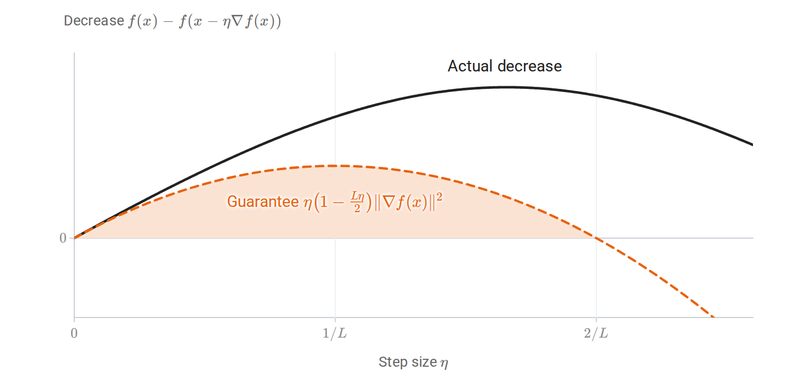

*For one gradient step on $`f(x)=\log\cosh x`$ from $`x=1.5`$, with $`L=1`$, the guarantee is largest at $`\eta=1/L`$ and reaches zero at $`\eta=2/L`$. The actual decrease is larger because $`f`$ curves less than $`L`$ away from the origin.*

At $`\eta=2/L`$ the guarantee can fail to give progress; above it divergence is possible. These are sufficient bounds using a global $`L`$, not necessary limits for every particular point or direction.

### <a id="quadratics-expose-the-stability-threshold"></a>Quadratics expose the stability threshold

For $`f(x)=\tfrac12x^\top Qx-b^\top x`$ with $`Q\succ0`$, let $`x_\star=Q^{-1}b`$ and $`e_t=x_t-x_\star`$. Then

```math
e_{t+1}=(I-\eta Q)e_t.
```

In a Hessian eigenvector with eigenvalue $`\lambda_i`$, the error is multiplied by $`1-\eta\lambda_i`$. Convergence from every initial point occurs exactly when $`0<\eta<2/\lambda_{\max}(Q)`$. Small-curvature directions may decay slowly while large-curvature directions oscillate.

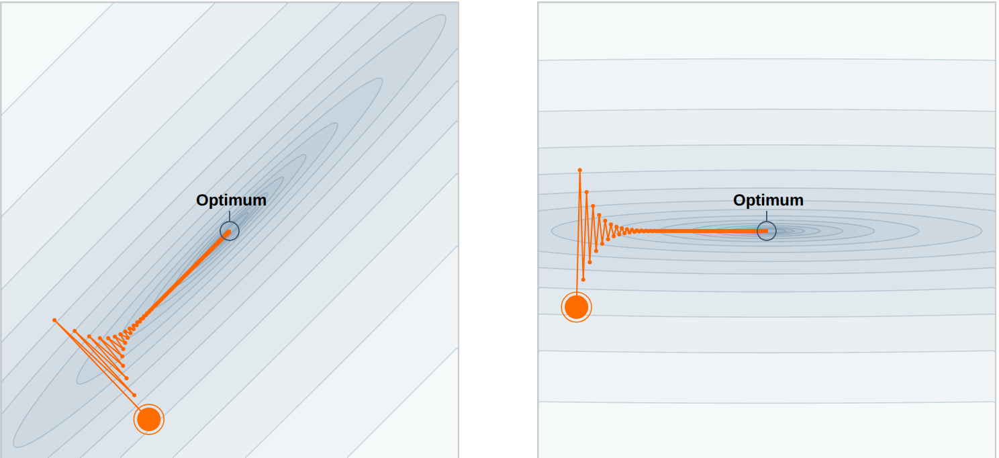

*In the Hessian's eigenvector coordinates (right), gradient descent on a quadratic splits into independent coordinates: the steep one oscillates because $`1-\eta\lambda_{\max}<0`$, while the flat one creeps toward the optimum. The left panel shows the same run in the original coordinates. From Gabriel Goh's [Why Momentum Really Works](https://distill.pub/2017/momentum/) (Distill, 2017).*

```python
import numpy as np

Q = np.diag([1., 20.])
x0 = np.array([1., 1.])
L = np.linalg.eigvalsh(Q)[-1]

for eta in [0.5/L, 1/L, 1.9/L, 2/L, 2.1/L]:
    x = x0.copy()
    for _ in range(80):
        x -= eta * (Q @ x)
    value = 0.5 * x @ Q @ x
    print(f"eta={eta:.3f}, f={value:.6g}, x={x}")
```

[`np.linalg.eigvalsh`](https://numpy.org/doc/stable/reference/generated/numpy.linalg.eigvalsh.html) returns the eigenvalues of a symmetric matrix in ascending order, so its last entry is $`L=\lambda_{\max}(Q)=20`$. At $`2/L`$, the second coordinate changes sign without shrinking. At $`2.1/L`$, its magnitude grows. The objective is a sum over directions, so a step that is safe for the low-curvature coordinate can still destabilize the other coordinate.

### <a id="backtracking-when-the-smoothness-constant-is-unknown"></a>Backtracking when the smoothness constant is unknown

A **line search** chooses a step using function evaluations. For a descent direction $`p`$, **Armijo backtracking** starts at a trial step and repeatedly multiplies it by $`\tau\in(0,1)`$ until

```math
f(x+\eta p)\le f(x)+c\eta\nabla f(x)^\top p,
\qquad 0<c<1.
```

Differentiability guarantees acceptance at a sufficiently small step. At a zero gradient, gradient descent stops. [Appendix D](#block-calculus-appendix-d) gives the accepted-step bound, convergence argument, and an executable example.

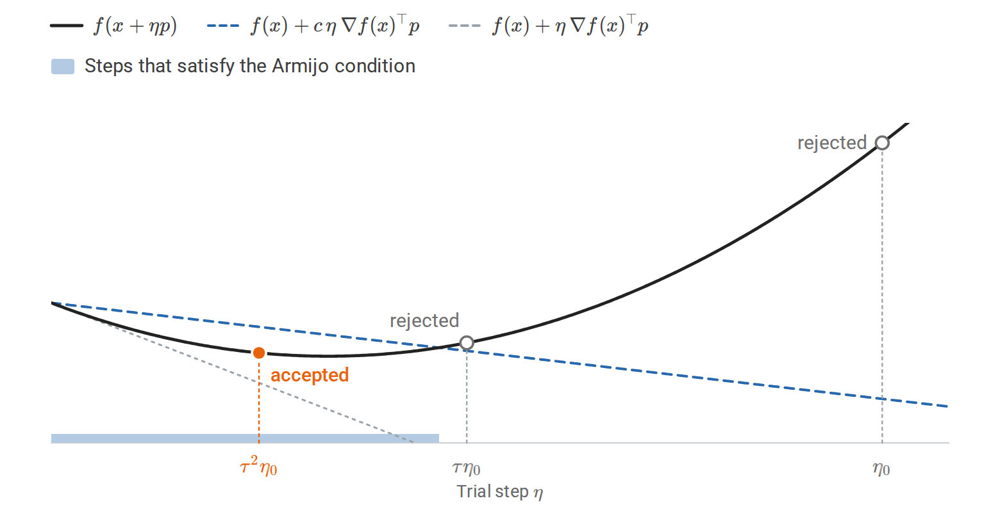

*With $`c=0.3`$, $`\tau=\tfrac12`$, and $`\eta_0=1`$, backtracking rejects two trial steps and accepts the third, the first for which $`f(x+\eta p)`$ lies on or below the dashed line. The shaded interval marks every step that would pass.*

## <a id="convergence-of-gradient-descent"></a>Convergence of gradient descent

The three theorems below use the same algorithm and the same descent inequality; they differ only in their assumptions, and each stronger assumption buys a stronger conclusion:

| Assumption on $`f`$ | What gradient descent with $`\eta=1/L`$ guarantees |
| --- | --- |
| $`L`$-smooth, bounded below | Some iterate has a small gradient: $`\min_{t<T}\|\nabla f(x_t)\|^2\le2L\Delta_0/T`$ |
| Also convex | The objective gap itself shrinks like $`1/T`$ |
| Also $`\mu`$-strongly convex | The objective gap shrinks by the factor $`1-\mu/L`$ at every update |

There are several different claims an analysis might establish:

- **Objective convergence:** $`f(x_t)\to f_\star`$.
- **Iterate convergence:** $`x_t\to x_\star`$.
- **First-order stationarity:** $`\|\nabla f(x_t)\|\to0`$.
- **Finite-time complexity:** a bound on the number of iterations needed to make a specified error at most $`\varepsilon`$.

They are not interchangeable. A bound on the smallest gradient norm seen so far is also different from a bound on the last iterate. The deterministic results below use exact gradients; their constants and conclusions change with noise.

### <a id="smooth-functions-without-convexity"></a>Smooth functions without convexity

**Theorem.** Let $`f:\mathbb R^d\to\mathbb R`$ be $`L`$-smooth and bounded below by $`f_{\inf}`$. For gradient descent with fixed $`0<\eta\le1/L`$,

```math
\sum_{t=0}^{T-1}\|\nabla f(x_t)\|^2\le\frac{2\Delta_0}{\eta},
\qquad
\boxed{
\min_{0\le t<T}\|\nabla f(x_t)\|^2
\le\frac{2\Delta_0}{\eta T}.
}
```

**Proof.** Sum the descent inequality over $`t`$; the objective differences telescope, and $`f(x_T)\ge f_{\inf}`$. The smallest of $`T`$ nonnegative terms is at most their average. $`\square`$

For $`\eta=1/L`$, finding an iterate with $`\|\nabla f(x_t)\|\le\varepsilon`$ needs at most $`O(L\Delta_0/\varepsilon^2)`$ iterations. The squared gradient has an $`O(1/T)`$ bound; the gradient norm has an $`O(1/\sqrt T)`$ bound. The finite sum over all iterations also implies $`\|\nabla f(x_t)\|\to0`$.

This does not establish global optimality, avoidance of saddles, or convergence of the iterates. Starting exactly at a nonoptimal stationary point leaves gradient descent there. Bounded iterates have stationary accumulation points by continuity of the gradient, but further assumptions are needed to obtain a single limiting point.

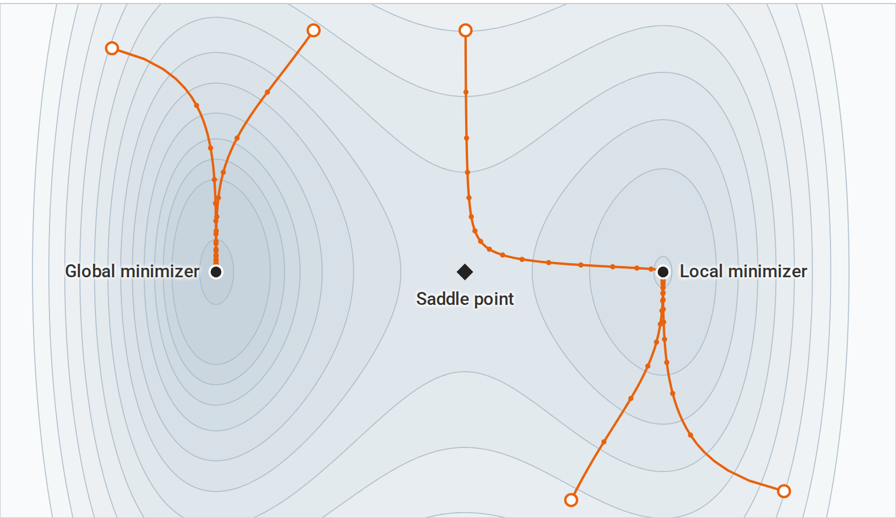

*Five runs of gradient descent with $`\eta=0.02`$ on $`f(x,y)=(x^2-1)^2+0.3x+1.2y^2`$ start at the open circles; dots mark every sixth update. Every path reaches a stationary point, but the start decides which one: three of the five end at the local minimizer.*

Varying steps require additional care: even positive steps can shrink so quickly that gradient descent stops short of a stationary point. Appendix D gives the bound and a simple counterexample.

### <a id="smooth-convex-functions"></a>Smooth convex functions

**Theorem.** Let $`f`$ be convex and $`L`$-smooth on $`\mathbb R^d`$, with a minimizer $`x_\star`$. For fixed $`0<\eta\le1/L`$ and $`T\ge1`$,

```math
\boxed{f(x_T)-f_\star\le\frac{R_0^2}{2\eta T}.}
```

In particular, $`\eta=1/L`$ gives $`LR_0^2/(2T)`$.

**Proof.** Convexity bounds $`f(x_t)-f_\star\le\nabla f(x_t)^\top(x_t-x_\star)`$. Combining it with smoothness at $`x_{t+1}`$ and using $`x_t-x_{t+1}=\eta\nabla f(x_t)`$ yields

```math
f(x_{t+1})-f_\star
\le\frac{\|x_t-x_\star\|^2-\|x_{t+1}-x_\star\|^2}{2\eta}.
```

Summing bounds the sum of the first $`T`$ objective gaps by $`R_0^2/(2\eta)`$. The objective values decrease, so the last gap is no larger than their average. $`\square`$

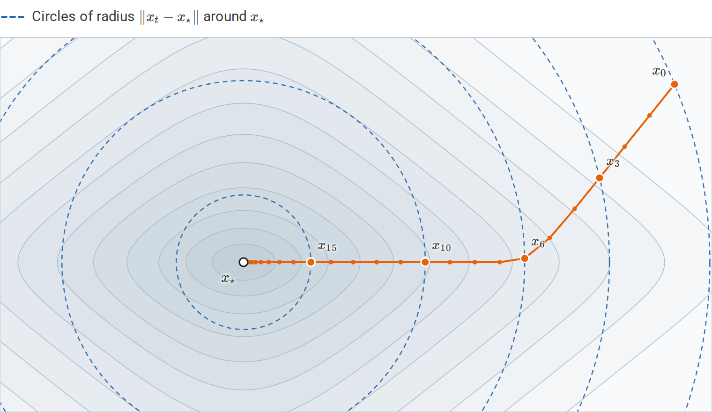

*On the convex, not strongly convex function $`\log\cosh(1.2x_1)+\tfrac12\log\cosh(3x_2)`$, gradient descent with $`\eta=1/L`$ never moves away from $`x_\star`$. Each dashed circle is centered at $`x_\star`$ and passes through one iterate, and every later iterate lies inside it. The proof's telescoping sum adds up these decreases in squared distance.*

Convexity supplies a link from a local gradient to a global objective gap. Without it, the same distance argument does not work. For further first-order complexity results, see Bubeck's [*Convex Optimization: Algorithms and Complexity*, Chapter 3](https://arxiv.org/abs/1405.4980).

### <a id="smooth-strongly-convex-functions"></a>Smooth strongly convex functions

Let $`f`$ be $`L`$-smooth and $`\mu`$-strongly convex on $`\mathbb R^d`$, with $`0<\mu\le L`$ and minimizer $`x_\star`$. Strong convexity implies $`\|\nabla f(x)\|^2\ge2\mu(f(x)-f_\star)`$, the right inequality of [Convex and strongly convex functions](#convex-and-strongly-convex-functions): a large gap forces a large gradient, and hence a large guaranteed decrease. With $`\eta=1/L`$, the descent lemma therefore gives

```math
f(x_{t+1})-f_\star
\le\left(1-\frac\mu L\right)(f(x_t)-f_\star),
```

and hence

```math
\boxed{
f(x_T)-f_\star
\le\left(1-\frac\mu L\right)^T\Delta_0
\le e^{-T/\kappa}\Delta_0.
}
```

This is **linear**, or **geometric**, convergence: each iteration contracts the error by a fixed factor. It does not mean that error decreases linearly as a function of time. To obtain objective gap at most $`\varepsilon<\Delta_0`$ requires $`O(\kappa\log(\Delta_0/\varepsilon))`$ iterations. The distance also converges because $`\|x_T-x_\star\|^2\le2(f(x_T)-f_\star)/\mu`$.

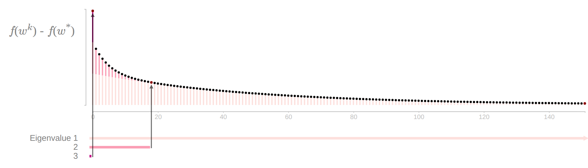

*Here gradient descent with $`\eta=1/L`$ runs on a quadratic whose Hessian has eigenvalues $`0.01`$, $`0.1`$, and $`1`$, so $`\kappa=100`$. The colored bars split the objective gap by eigendirection, and the bars below show how long each component takes to become negligible. The stiffest component vanishes after one step; the flattest shrinks by the factor $`1-\mu/L=0.99`$ per step and sets the rate. From Goh (2017), with the step-size slider set to $`1`$; Goh writes $`w`$ for the parameters.*

## <a id="newton-s-method"></a>Newton's method

Gradient descent models $`f`$ with the same curvature $`1/\eta`$ in every direction. Newton's method instead uses the curvature that the Hessian assigns to each direction, through the local quadratic approximation

```math
m_t(s)=f(x_t)+\nabla f(x_t)^\top s+\tfrac12s^\top H(x_t)s.
```

When $`H(x_t)\succ0`$, its minimizer solves

```math
H(x_t)p_t=-\nabla f(x_t),
\qquad
x_{t+1}=x_t+p_t.
```

Solve the linear system instead of explicitly computing $`H^{-1}`$. A positive definite quadratic objective is solved in one exact Newton step. For a general objective, the accuracy of the quadratic model determines how far the step can be trusted.

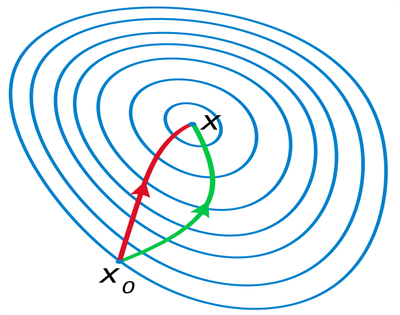

*Started from the same $`x_0`$ with small steps, Newton's method (red) accounts for curvature and heads more directly to the minimizer than gradient descent (green).*

If the Hessian is positive definite and $`\rho`$-Lipschitz near a minimizer, with smallest eigenvalue at least $`\mu>0`$, then sufficiently close full Newton steps satisfy

```math
\|x_{t+1}-x_\star\|\le\frac{\rho}{2\mu}\|x_t-x_\star\|^2.
```

This is **local quadratic convergence of the distance**, distinct from an $`O(1/T^2)`$ objective bound. Farther away, a line search or trust region controls how much of the quadratic model to trust. An indefinite Hessian may give a direction that increases the objective. [Appendix F](#block-calculus-appendix-f) gives the precise neighborhood assumptions, proof, and curvature approximations.

## <a id="constraints-and-nonsmooth-objectives"></a>Constraints and nonsmooth objectives

The smooth unconstrained setting has useful extensions. **Projected gradient descent** takes a gradient step and projects the parameters back onto a nonempty closed convex feasible set $`C`$:

```math
x_{t+1}=\Pi_C(x_t-\eta_t\nabla f(x_t)),
\qquad \Pi_C(z)=\arg\min_{u\in C}\|u-z\|^2.
```

For a convex function with kinks, a **subgradient** supplies a supporting affine lower bound, $`f(y)\ge f(x)+g^\top(y-x)`$. Subgradient methods generally need different step schedules and averaging to obtain their guarantees. A **proximal step** instead keeps a nonsmooth penalty intact while approximating the differentiable part of the objective. [Appendix E](#block-calculus-appendix-e) develops these methods, their convergence bounds, soft-thresholding, and constrained optimality conditions.

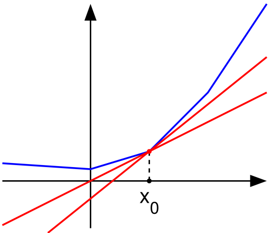

*At the kink $`x_0`$ of this convex piecewise-linear function, the one-sided slopes are $`0.3`$ and $`1`$. Each red line through $`(x_0,f(x_0))`$ stays below the graph, so its slope, $`0.5`$ or $`0.8`$, is a subgradient; so is every slope in $`[0.3,1]`$.*

## <a id="stochastic-gradients-and-convergence-in-expectation"></a>Stochastic gradients and convergence in expectation

An objective may be an expectation or a large finite sum:

```math
f(x)=\mathbb E_\xi[\ell(x;\xi)],
\qquad\text{or}\qquad
f(x)=\frac1n\sum_{i=1}^n\ell_i(x).
```

Computing a full gradient can be expensive. **Stochastic gradient descent (SGD)** uses a random estimate $`g_t`$:

```math
x_{t+1}=x_t-\eta_tg_t.
```

Let $`\mathcal F_t`$ represent all information available before drawing the gradient estimate at iteration $`t`$. A standard assumption is **conditional unbiasedness** with bounded conditional variance:

```math
\mathbb E[g_t\mid\mathcal F_t]=\nabla f(x_t),
\qquad
\mathbb E[\|g_t-\nabla f(x_t)\|^2\mid\mathcal F_t]\le\sigma^2.
```

For an expected loss, identifying $`\nabla f`$ with the expected sample gradient requires interchanging differentiation and expectation; sufficient conditions appear in Appendix B. For a finite average, sampling an index uniformly and independently of the past gives an unbiased sample gradient. Averaging $`B`$ conditionally independent estimates reduces the variance bound to $`\sigma^2/B`$. Sampling and dependence assumptions matter; random reshuffling is not identical to fresh independent sampling at each step.

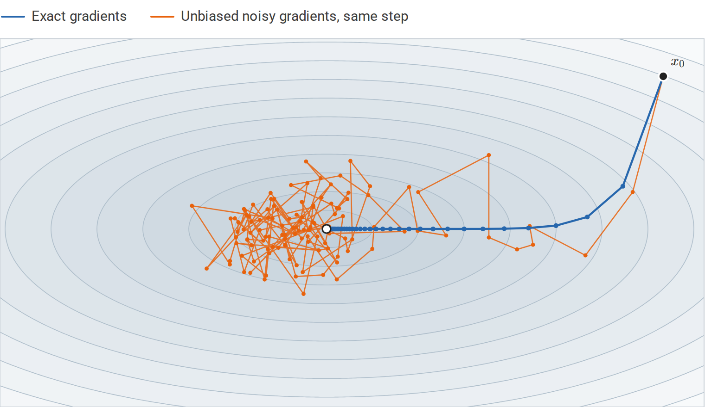

*With the same constant step $`\eta=0.12`$ on $`\tfrac12(x_1^2+6x_2^2)`$, SGD follows the general route of gradient descent but keeps fluctuating around $`x_\star`$. Its gradients add independent zero-mean noise with standard deviation $`2.2`$ in each coordinate.*

### <a id="a-basic-stochastic-convergence-bound"></a>A basic stochastic convergence bound

For an $`L`$-smooth objective bounded below, a constant step $`0<\eta\le1/L`$ gives

```math
\frac1T\sum_{t=0}^{T-1}\mathbb E\|\nabla f(x_t)\|^2
\le\frac{2\Delta_0}{\eta T}+L\eta\sigma^2.
```

The first term falls with the number of updates; the second reflects gradient noise. Reducing the step lowers the noise contribution but slows initial progress. For a planned horizon $`T`$, choosing $`\eta=1/(L\sqrt T)`$ gives an $`O(1/\sqrt T)`$ bound on the average expected **squared** gradient norm. It is neither a last-iterate guarantee nor a global optimality guarantee.

A constant step can leave persistent fluctuations around the optimum. Near a minimizer the true gradient is small, but the noise in its estimate is not, so every update still moves the iterate by a random amount proportional to $`\eta`$. On $`f(x)=x^2/2`$ with gradient noise of variance $`\sigma^2`$, the exact limiting mean square is $`\eta\sigma^2/(2-\eta)`$ for $`0<\eta<2`$. Appendix D derives both results, the convex bounds, and the classical diminishing-step conditions.

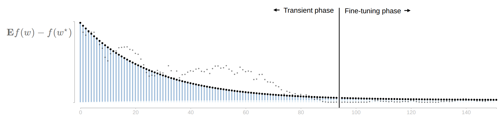

*For SGD on a quadratic, with momentum off and a step size near $`1.9`$, each bar splits the expected objective gap into the part plain gradient descent would also have (darker, decaying geometrically) and the variance added by gradient noise (lighter, growing from zero). Once the first part has decayed, the gap levels off; small dots follow a single run. From Goh (2017), with the momentum slider set to $`0`$.*

## <a id="stateful-optimizers-and-adaptive-scaling"></a>Stateful optimizers and adaptive scaling

The optimizers in this section modify gradient descent in two ways. Momentum methods average gradients over time, to damp oscillation and build speed along consistent directions. Adaptive methods rescale each coordinate by the recent size of its gradients, so that coordinates with very different gradient scales take comparable steps. Adam and AdamW do both.

| Method | State stored per parameter | Main idea |
| --- | --- | --- |
| Momentum (heavy ball) | One gradient buffer | Average recent gradients; persistent directions accumulate and alternating ones cancel |
| Nesterov acceleration | One extra vector, the previous iterate | Evaluate the gradient at an extrapolated point; faster worst-case rate on convex problems |
| AdaGrad | One accumulator | Divide each coordinate's step by the root of its accumulated squared gradients |
| RMSProp | One moving average | Like AdaGrad, but with an exponential average that forgets old gradients |
| Adam | Two moving averages | Momentum on the direction plus RMSProp scaling, with bias correction |
| AdamW | Two moving averages | Adam with weight decay applied separately from the adaptive scaling |

An optimizer maps gradients and stored state to a parameter update. Automatic differentiation supplies derivatives of the loss computation; the optimizer decides how those derivatives affect the parameters. Its state can contain past gradients, squared gradients, curvature estimates, and a step counter. Two runs at the same parameter vector can therefore take different steps if their optimizer states differ.

Here $`g_t`$ is the current batch gradient at $`x_t`$, unless a look-ahead point is specified. Parameter tensors retain their shapes; vector formulas apply entrywise across their entries.

Squares, square roots, and divisions in adaptive updates are coordinatewise. Their denominator constant is $`\epsilon_{\mathrm{opt}}>0`$, and fixed moving-average coefficients satisfy $`\beta,\beta_1,\beta_2\in[0,1)`$.

### <a id="momentum-as-a-gradient-filter"></a>Momentum as a gradient filter

A common gradient-buffer convention is

```math
u_{t+1}=\beta u_t+g_t,
\qquad
x_{t+1}=x_t-\eta_tu_{t+1},
\qquad
u_0=0,\quad 0\le\beta<1.
```

Unrolling the recurrence gives $`u_{t+1}=\sum_{j=0}^t\beta^{t-j}g_j`$. Directions that persist across updates reinforce each other, while rapidly alternating directions partially cancel. The effective memory length is of order $`1/(1-\beta)`$ updates.

Some libraries instead use $`u_{t+1}=\beta u_t+(1-\beta)g_t`$, an exponential moving average of the gradients. With zero initialization, the two buffers differ by the factor $`1-\beta`$, so a learning rate tuned for one convention does not carry over to the other.

With a constant learning rate $`\eta`$ and $`x_{-1}=x_0`$, the first convention is the **heavy-ball** method: each update adds a fraction $`\beta`$ of the previous displacement,

```math
x_{t+1}=x_t-\eta g_t+\beta(x_t-x_{t-1}).
```

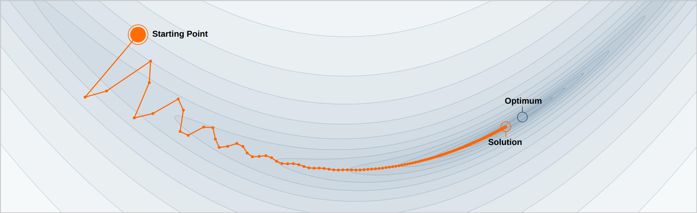

*With $`\beta=0.99`$ and step size $`0.02`$, heavy-ball momentum first overshoots across a long, curved valley; the accumulated velocity then carries the iterates along its floor. From Goh's [Why Momentum Really Works](https://distill.pub/2017/momentum/), whose step size $`\alpha`$ is the $`\eta`$ used here.*

With a changing learning rate, a gradient buffer and a fixed displacement coefficient define different recurrences. [Appendix G](#block-calculus-appendix-g) gives both forms and the Nesterov look-ahead variant, which evaluates the gradient at an extrapolated point. Acceleration guarantees require a specified extrapolation rule, described next.

### <a id="nesterov-acceleration"></a>Nesterov acceleration

Acceleration evaluates gradients at an extrapolated point. For a convex $`L`$-smooth $`f`$ on $`\mathbb R^d`$ with a minimizer, set $`y_0=x_0`$, $`a_0=1`$, and

```math
\begin{aligned}
x_{t+1}&=y_t-\frac1L\nabla f(y_t),\\
a_{t+1}&=\frac{1+\sqrt{1+4a_t^2}}2,\\
y_{t+1}&=x_{t+1}+\frac{a_t-1}{a_{t+1}}(x_{t+1}-x_t).
\end{aligned}
```

This is the smooth case of FISTA. It gives $`f(x_T)-f_\star\le2LR_0^2/(T+1)^2`$, improving the general convex gradient-descent rate. Its objective values need not decrease at every step. The guarantee belongs to this specified rule and its assumptions; adding an arbitrary momentum buffer does not establish it. Appendix E gives the composite version and its reference.

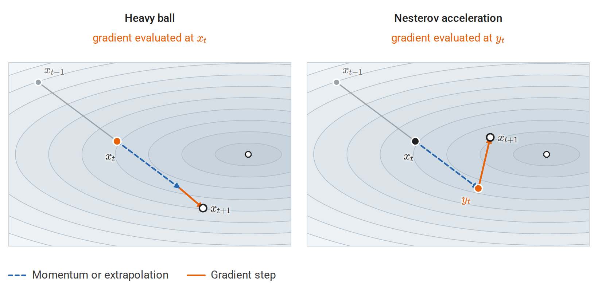

*Both methods start from the same $`x_{t-1}`$ and $`x_t`$, with extrapolation coefficient $`0.8`$ and step $`0.5`$. Heavy ball uses the gradient at $`x_t`$; the accelerated method first extrapolates to $`y_t`$ and uses the gradient there, which pulls back the overshoot.*

### <a id="adagrad-and-rmsprop"></a>AdaGrad and RMSProp

**AdaGrad** accumulates squared gradients and uses a separate scale for each coordinate:

```math
v_{t+1}=v_t+g_t\odot g_t,
\qquad
x_{t+1}=x_t-\eta_t
\frac{g_t}{\sqrt{v_{t+1}}+\epsilon_{\mathrm{opt}}},
\qquad v_0=0.
```

Coordinates with a large accumulated squared gradient receive smaller effective steps. Coordinates that are rarely updated can retain relatively large steps. Since the accumulator never decreases, its memory does not adapt to a new scale as quickly as a moving average. The original analysis connects this geometry to online convex optimization: [Duchi, Hazan, and Singer (2011)](https://jmlr.org/papers/v12/duchi11a.html).

**RMSProp** replaces the cumulative sum by an exponential moving average:

```math
v_{t+1}=\beta_2v_t+(1-\beta_2)(g_t\odot g_t),
\qquad
x_{t+1}=x_t-\eta_t
\frac{g_t}{\sqrt{v_{t+1}}+\epsilon_{\mathrm{opt}}},
\qquad v_0=0.
```

This tracks recent squared-gradient scale. The displayed form is uncentered RMSProp without a separate momentum buffer. Centered variants estimate a variance by subtracting a squared mean; the quantity $`v_t`$ itself is an uncentered second moment, not a variance. The [PyTorch RMSProp specification](https://docs.pytorch.org/docs/stable/generated/torch.optim.RMSprop.html) states these implementation choices explicitly.

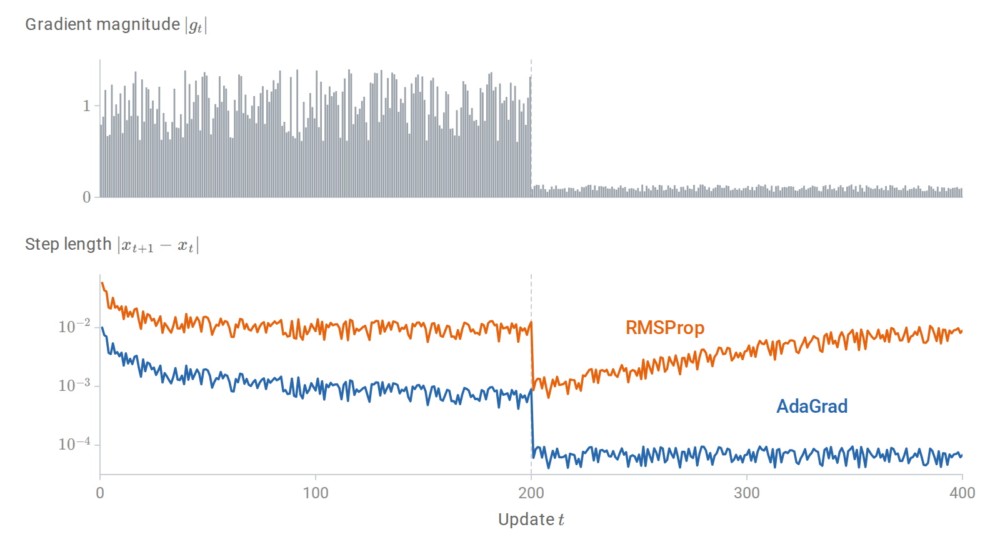

*When the gradients of one coordinate shrink tenfold after 200 updates ($`\eta=0.01`$), AdaGrad's accumulated sum keeps its steps small, while RMSProp with $`\beta_2=0.97`$ forgets the old scale and its steps recover. The large first RMSProp steps come from the zero initial average.*

### <a id="adam-and-bias-correction"></a>Adam and bias correction

**Adam** combines an exponential average of gradients with an exponential average of their squares:

```math
\begin{aligned}
m_{t+1}&=\beta_1m_t+(1-\beta_1)g_t,\\
v_{t+1}&=\beta_2v_t+(1-\beta_2)(g_t\odot g_t),
\qquad m_0=v_0=0.
\end{aligned}
```

The two averages have different roles. The first retains a signed direction; the second measures coordinatewise magnitude. It does not estimate the Hessian and it does not, without subtracting the square of the mean, estimate gradient variance.

Zero initialization gives both averages too little total weight early in the run. With fixed coefficients, the accumulated weights after update $`t`$ are $`1-\beta_1^{t+1}`$ and $`1-\beta_2^{t+1}`$.

The **bias corrections** divide by these weights:

```math
\widehat m_{t+1}=\frac{m_{t+1}}{1-\beta_1^{t+1}},
\qquad
\widehat v_{t+1}=\frac{v_{t+1}}{1-\beta_2^{t+1}}.
```

The Adam step is

```math
\boxed{x_{t+1}=x_t-\eta_t
\frac{\widehat m_{t+1}}
{\sqrt{\widehat v_{t+1}}+\epsilon_{\mathrm{opt}}}.}
```

For the first update ($`t=0`$), the denominators are $`1-\beta_1`$ and $`1-\beta_2`$. Correction removes the initialization deficit in the weights; it does not remove the lag of a moving average or make the final ratio unbiased. The original method is due to [Kingma and Ba (2015)](https://arxiv.org/abs/1412.6980).

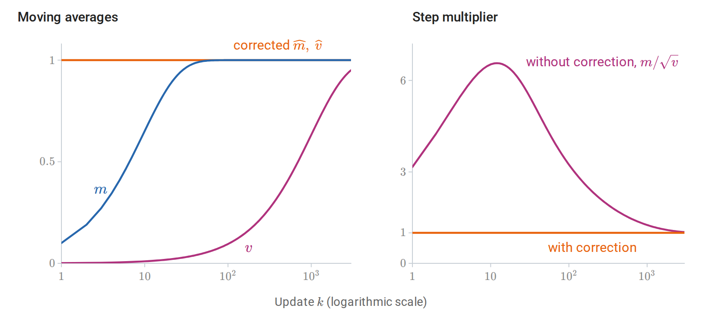

*For a constant gradient $`g=1`$ with $`\beta_1=0.9`$ and $`\beta_2=0.999`$, the uncorrected $`v`$ lags far behind $`m`$, and the ratio $`m/\sqrt v`$ would make early steps up to about $`6.6`$ times too large. After correction the ratio is $`1`$ from the first update.*

For a single fresh update, $`\widehat m_1=g_0`$ and $`\widehat v_1=g_0^2`$. When a coordinate's gradient magnitude is large relative to $`\epsilon_{\mathrm{opt}}`$, its first update is approximately $`-\eta_0\operatorname{sign}(g_{0,i})`$. This illustrates how different Adam's scaling is from ordinary gradient descent.

Although each denominator is positive, the direction $`\widehat m_{t+1}`$ can differ from the current gradient. Even with exact gradients, a particular Adam update need not be a descent step. Classical SGD convergence bounds also do not transfer automatically through a gradient-dependent preconditioner. [Reddi, Kale, and Kumar](https://research.google/pubs/on-the-convergence-of-adam-and-beyond/) give convex counterexamples to unconditional Adam convergence and develop AMSGrad, which modifies the second-moment rule. Guarantees depend on the variant, schedule, and assumptions.

### <a id="l2-regularization-and-adamw"></a>L2 regularization and AdamW

For an explicit penalty $`r(x)=\tfrac\lambda2\|x\|^2`$ with $`\lambda\ge0`$, plain SGD—or exact gradient descent when $`g_t=\nabla f(x_t)`$—gives

```math
x_{t+1}=x_t-\eta_t(g_t+\lambda x_t)
=(1-\eta_t\lambda)x_t-\eta_tg_t.
```

In this unpreconditioned, momentum-free case, adding an L2 penalty is the same algebraic update as multiplicative weight decay. With a diagonal preconditioner $`P_t`$, the regularized-gradient update instead contains $`-\eta_t\lambda P_tx_t`$, so coordinates decay at different rates. For Adam, adding $`\lambda x_t`$ to the gradient also changes both moment histories.

**AdamW** computes moments from the loss gradient and applies **decoupled weight decay**:

```math
\boxed{
x_{t+1}=(1-\eta_t\lambda)x_t
-\eta_t\frac{\widehat m_{t+1}}
{\sqrt{\widehat v_{t+1}}+\epsilon_{\mathrm{opt}}}.
}
```

Here $`\lambda`$ is the decay coefficient in this convention; some descriptions parameterize shrinkage differently. Decoupling means that the adaptive denominator does not scale the shrinkage term. It does not mean that total shrinkage is independent of the learning-rate schedule: without gradient updates, it is $`\prod_{t<T}(1-\eta_t\lambda)`$. See [Loshchilov and Hutter (2019)](https://arxiv.org/abs/1711.05101).

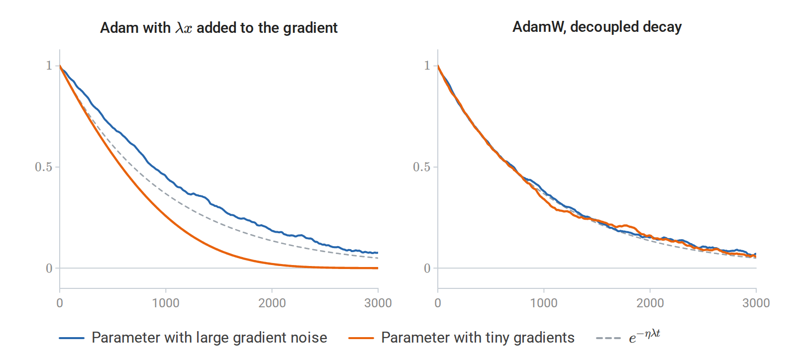

*Two parameters start at $`1`$, and their loss gradients are pure zero-mean noise of scale $`1`$ and $`10^{-3}`$; $`\eta=10^{-3}`$, $`\lambda=1`$, and $`(\beta_1,\beta_2)=(0.9,0.999)`$. With the penalty inside the gradient, the adaptive denominator rescales the decay, and the parameter with tiny gradients is pulled to zero much faster. AdamW shrinks both at the rate $`e^{-\eta\lambda t}`$.*

Parameter groups can have different learning rates and decay coefficients. Excluding biases or normalization parameters from decay is a modeling choice, not part of the mathematical definition. Because Adam's state remembers past gradients, a parameter whose current gradient is zero can still move by more than the decay; only decay moves it when its stored first moment is also zero.

## <a id="optimizer-paths-on-a-quadratic"></a>Optimizer paths on a quadratic

Consider

```math
f(x)=\frac12(x_1^2+20x_2^2),\qquad
\nabla f(x)=\begin{bmatrix}x_1\\20x_2\end{bmatrix},
\qquad x_\star=0.
```

The Hessian eigenvalues are $`1`$ and $`20`$, so $`L=20`$, $`\mu=1`$, and $`\kappa=20`$. Each contour line joins points with the same objective value; darker bands have smaller values. The narrow direction has larger curvature. Every run below starts at $`x_0=(3,1)^\top`$ and takes 40 updates with exact gradients and zero initial optimizer buffers.

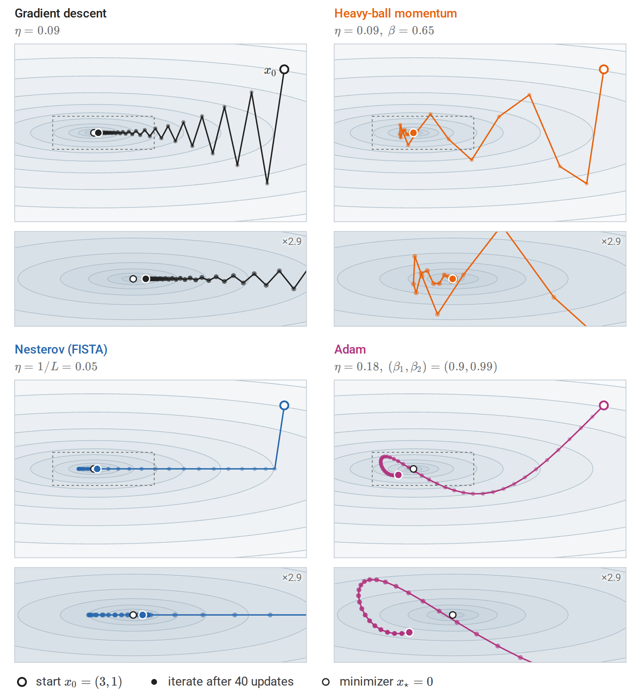

*The dashed box in each panel is magnified about three times in the strip below it. Dots darken with time; the open circle is the start and the filled circle the iterate after 40 updates. Gradient descent and heavy-ball momentum use $`\eta=0.09`$, momentum with the unnormalized buffer and $`\beta=0.65`$. Nesterov uses the displayed smooth FISTA recurrence with $`1/L=0.05`$. Adam uses $`\eta=0.18`$, $`(\beta_1,\beta_2)=(0.9,0.99)`$, $`\epsilon_{\mathrm{opt}}=10^{-8}`$, and no weight decay.*

Gradient descent multiplies the two error coordinates by $`0.91`$ and $`-0.8`$, respectively: slow movement down the valley accompanies alternating movement across it. Momentum combines current gradients with past directions and can overshoot the minimizer. Here the accelerated method removes the second coordinate in its first step because $`1-20/L=0`$; later extrapolation acts along the first coordinate. Adam's coordinatewise normalization changes its direction and its scale relative to the raw gradient.

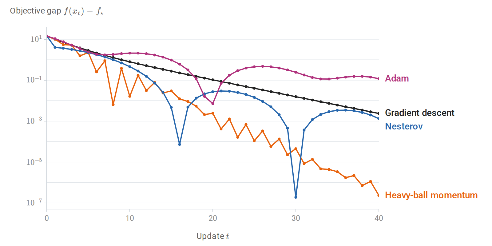

*On a logarithmic axis, the objective gaps of the same runs show oscillation near the minimum that is hard to see in the contours. These finite runs illustrate particular settings; they do not rank the methods across problems. Learning rates differ, and the horizontal axis counts updates rather than elapsed time.*

[Appendix H](#block-calculus-appendix-h) contains the code for these trajectories. Full Newton would solve this positive definite quadratic in one exact step; on a large problem, constructing and solving with the Hessian has a different cost from a gradient evaluation.

## <a id="schedules-batches-and-clipping"></a>Schedules, batches, and clipping

A **learning-rate schedule** specifies $`\eta_t`$ as training progresses. Common choices include constant steps, step decay, warmup followed by cosine decay, and inverse-square-root decay. A **microbatch** is processed in one forward/backward computation; an optimizer update changes parameters and stored state; an epoch is one pass through the dataset. A schedule's clock can count updates, examples, or tokens, so its unit must be specified.

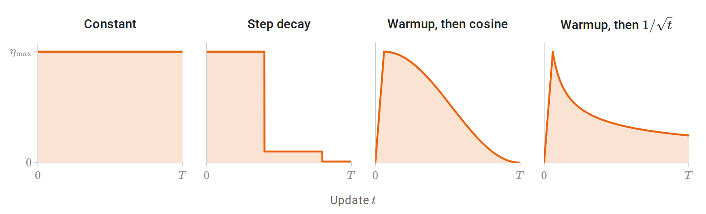

*The schedules are drawn as multiples of their peak rate over $`T`$ updates. Step decay divides the rate by $`10`$ every $`0.4T`$; both warmups rise linearly over $`0.06T`$ before cosine or inverse-square-root decay.*

**Gradient accumulation** combines microbatch gradients before a single parameter update. If microbatch $`j`$ has summed loss $`S_j`$ over $`n_j`$ scored items, the effective-batch mean gradient is

```math
g_t=\frac{\sum_j\nabla S_j(x_t)}{\sum_j n_j}.
```

All microbatches use the same parameters. An unweighted average of microbatch means is correct only when their counts agree. The optimizer's moments, step counter, and weight decay advance once per accumulated update. Changing the batch size also changes the number of updates per epoch and the duration of momentum memory in examples.

**Global norm clipping** replaces $`g_t`$ by $`g_t\min\{1,c/\|g_t\|\}`$ for threshold $`c>0`$, with zero mapped to zero. It preserves direction and caps the gradient magnitude. Applying it once after accumulation differs from clipping each microbatch first. For AdamW it bounds the gradient entering the moments, rather than directly bounding the final parameter displacement.

Appendix G contains schedule formulas, an accumulation-and-clipping example, distributed averaging, and additional optimizer families. A basic forward/backward/update loop is developed in Numerical Computing with NumPy and PyTorch.

## <a id="convergence-rates-and-their-scope"></a>Convergence rates and their scope

Bounds such as $`O(1/T)`$ and $`O(1/\sqrt T)`$ are called **sublinear rate bounds**; a bound $`e_T\le Mq^T`$ with a constant $`M>0`$ and $`q\in(0,1)`$ is **geometric**. These are upper bounds, so a particular problem may converge faster. For a positive error sequence tending to zero, local **superlinear** convergence means $`e_{t+1}/e_t\to0`$; local **quadratic** convergence means $`e_{t+1}\le M'e_t^2`$ eventually, for some constant $`M'`$. Every rate must specify its error quantity.

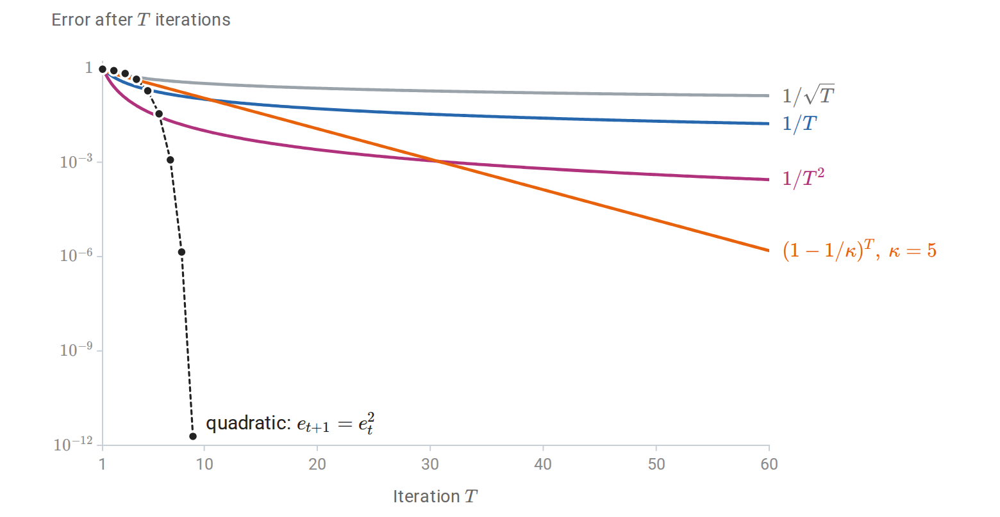

*On a logarithmic axis, a geometric rate is a straight line that eventually falls below every sublinear rate, and a quadratic rate doubles the number of correct digits at each step. The curves match the rates in the table below.*

In the table, $`R_0`$ is the initial distance to a minimizer, $`\Delta_0`$ is an initial objective gap or gap to a finite lower bound, and $`\kappa=L/\mu`$. Constants refer to the domains required by the preceding theorems.

| Assumptions | Method and steps | Quantity bounded | Guarantee |
| --- | --- | --- | --- |
| $`L`$-smooth; bounded below; possibly nonconvex | Gradient descent, $`\eta=1/L`$ | $`\min_{t<T}\|\nabla f(x_t)\|^2`$ | $`2L\Delta_0/T`$ |
| Convex and $`L`$-smooth; minimizer exists | Gradient descent, $`\eta=1/L`$ | $`f(x_T)-f_\star`$ | $`LR_0^2/(2T)`$ |
| Smooth and $`\mu`$-strongly convex | Gradient descent, $`\eta=1/L`$ | $`f(x_T)-f_\star`$ | $`(1-\mu/L)^T\Delta_0`$ |
| Convex and $`L`$-smooth; minimizer exists | Displayed Nesterov/FISTA recurrence | $`f(x_T)-f_\star`$ | $`2LR_0^2/(T+1)^2`$ |
| Locally positive definite, Lipschitz Hessian; close initial point | Exact full Newton steps | Distance $`e_t=\|x_t-x_\star\|`$ | $`e_{t+1}\le\rho e_t^2/(2\mu)`$ |
| Smooth, bounded below; unbiased gradients with variance $`\sigma^2`$ | SGD, $`\eta=1/(L\sqrt T)`$ | Average expected squared gradient | $`(2L\Delta_0+\sigma^2)/\sqrt T`$ |

**Step sizes.** A constant safe step can converge exactly for deterministic smooth objectives. Nonsmooth or noisy updates often require averaging or diminishing steps because their error bounds also contain accumulated squared-step terms. Diminishing steps alone do not guarantee convergence: the total step length must permit continued progress.

**Stopping criteria.** A stopping criterion should match the theorem. An ordinary gradient norm measures unconstrained first-order stationarity; constrained problems require a measure that accounts for feasible directions (Appendix E). A small change in objective or a small step can also result from an excessively small learning rate. Objective accuracy, gradient accuracy, and parameter accuracy require different certificates.

**Cost per iteration.** Iteration complexity counts updates or oracle calls. It does not by itself measure elapsed work: a stochastic gradient, full gradient, proximal solve, and Hessian factorization can have very different costs. Likewise, a proof requiring global smoothness cannot be applied merely because a Hessian is bounded at the starting point. Local assumptions suffice only when the analysis also keeps all required iterates and trial segments inside the region where those assumptions hold.

## <a id="appendices"></a>Appendices


<details>
<summary><a id="block-calculus-appendix-a"></a><b>A. Taylor's theorem and tensor expansions</b></summary>


### <a id="finite-taylor-polynomials-and-the-integral-remainder"></a>Finite Taylor polynomials and the integral remainder

Let $`f`$ be $`C^{p+1}`$ on an open interval containing the segment from $`a`$ to $`a+h`$, where $`p\ge0`$. Its Taylor polynomial of degree $`p`$ is

```math
P_p(a;h)=\sum_{k=0}^p\frac{f^{(k)}(a)}{k!}h^k.
```

**Taylor's theorem with integral remainder** is the exact identity

```math
\boxed{
\begin{aligned}
f(a+h)&=P_p(a;h)+R_p(a;h),\\
R_p(a;h)&=\frac{h^{p+1}}{p!}\int_0^1(1-t)^p f^{(p+1)}(a+th)\,dt.
\end{aligned}
}
```

The parameterized form works for positive or negative $`h`$. Equivalently,

```math
R_p(a;h)=\frac1{p!}\int_a^{a+h}(a+h-u)^p f^{(p+1)}(u)\,du,
```

where the integral has its usual orientation when $`h<0`$. A finite Taylor formula is an equality with a remainder, even when the infinite Taylor series does not represent the function.

**Proof from the fundamental theorem of calculus.** Set $`g(t)=f(a+th)`$. For $`p=0`$,

```math
g(1)=g(0)+\int_0^1g'(t)\,dt.
```

For $`p\ge1`$, integration by parts gives

```math
\int_0^1\frac{(1-t)^p}{p!}g^{(p+1)}(t)\,dt
=-\frac{g^{(p)}(0)}{p!}
+\int_0^1\frac{(1-t)^{p-1}}{(p-1)!}g^{(p)}(t)\,dt.
```

Repeatedly applying this identity reduces the remainder to $`g(1)-\sum_{k=0}^p g^{(k)}(0)/k!`$. Since $`g^{(k)}(t)=h^k f^{(k)}(a+th)`$, this is the stated formula. $`\square`$

If $`|f^{(p+1)}(u)|\le M_{p+1}`$ on the segment, integration immediately yields

```math
\boxed{|R_p(a;h)|\le\frac{M_{p+1}}{(p+1)!}|h|^{p+1}.}
```

The integral mean-value theorem also gives the **Lagrange remainder**

```math
R_p(a;h)=\frac{f^{(p+1)}(\xi)}{(p+1)!}h^{p+1}
```

for some point $`\xi`$ on the segment. This single intermediate point is a scalar-valued result; a vector-valued function need not admit one common $`\xi`$ for every component. The integral formula remains valid componentwise.

### <a id="approximation-near-a-point-and-convergence-of-a-series"></a>Approximation near a point and convergence of a series

There are two different limits. For a fixed degree $`p`$, the bound above controls the approximation as $`h\to0`$. For fixed $`h`$, convergence of Taylor polynomials to the function as $`p\to\infty`$ requires $`R_p(a;h)\to0`$.

A sufficient condition is

```math
\frac{M_{p+1}|h|^{p+1}}{(p+1)!}\longrightarrow0.
```

For $`f(x)=e^x`$, all derivatives equal $`e^x`$, so on a fixed segment one may take $`M_{p+1}=e^{a+\max\{h,0\}}`$, independently of $`p`$. Factorial growth then forces the remainder to zero. More generally, if for every $`k\ge1`$ the derivatives throughout a neighborhood obey $`|f^{(k)}(u)|\le Ck!R^{-k}`$ with fixed $`C,R>0`$, the remainder is bounded by $`C(|h|/R)^{p+1}`$ whenever the segment lies in that neighborhood. Thus the series represents $`f(a+h)`$ for $`|h|<R`$ there. The bounds must control derivatives along the segment, not only their values at the expansion point.

A function is **real analytic** near a point when it agrees there with a convergent power series. Infinite differentiability alone is insufficient. The function

```math
f(x)=\begin{cases}e^{-1/x^2},&x\ne0,\\0,&x=0\end{cases}
```

is $`C^\infty`$, and every derivative at zero vanishes: each derivative away from zero is a polynomial in $`1/x`$ multiplied by $`e^{-1/x^2}`$, which tends to zero faster than any inverse power grows. Its Taylor series at zero is identically zero, yet $`f(x)>0`$ for $`x\ne0`$. Here the Taylor series converges, but to the wrong function away from zero.

### <a id="multivariable-derivatives-as-multilinear-maps"></a>Multivariable derivatives as multilinear maps

For $`F:\mathbb R^d\to\mathbb R^m`$, $`D^kF(x)`$ takes $`k`$ perturbation vectors and returns an output vector. It is linear in each perturbation separately. For example,

```math
DF(x)[h]=J_F(x)h,\qquad
\bigl(D^2F(x)[h,v]\bigr)_i
=\sum_{j,\ell=1}^d
\frac{\partial^2F_i(x)}{\partial x_j\partial x_\ell}h_jv_\ell.
```

For a scalar $`f`$, $`D^2f(x)[h,v]=h^\top\nabla^2f(x)v`$. With continuous mixed derivatives, $`D^kF`$ is symmetric in its $`k`$ input slots. This is symmetry of the perturbation arguments; it does not require any symmetry among output coordinates.

Assume $`F`$ is $`C^{p+1}`$ on an open set containing $`\{x+th:0\le t\le1\}`$. Restrict it to this line: $`g(t)=F(x+th)`$. Repeated application of the chain rule gives

```math
g^{(k)}(t)=D^kF(x+th)[h,\ldots,h].
```

Applying the scalar integration argument to each component gives

```math
\boxed{
\begin{aligned}
F(x+h)&=\sum_{k=0}^p\frac1{k!}D^kF(x)[h,\ldots,h]+R_p(x;h),\\
R_p(x;h)&=\frac1{p!}\int_0^1(1-t)^p
D^{p+1}F(x+th)[h,\ldots,h]\,dt.
\end{aligned}
}
```

The $`k=0`$ term means $`F(x)`$; the derivative of order $`k`$ receives exactly $`k`$ copies of $`h`$. Under Euclidean norms define the multilinear operator norm by

```math
\|D^kF(x)\|_{\mathrm{op}}
=\sup_{\|v_1\|,\ldots,\|v_k\|\le1}
\|D^kF(x)[v_1,\ldots,v_k]\|.
```

A bound $`\|D^{p+1}F\|_{\mathrm{op}}\le M_{p+1}`$ along the segment gives

```math
\|R_p(x;h)\|\le\frac{M_{p+1}}{(p+1)!}\|h\|^{p+1}.
```

This is the same error bound with an appropriate norm. The preceding derivative-growth criterion also proves convergence of the multivariable Taylor series when these operator-norm bounds hold uniformly along the segment.

In coordinate notation, let $`\alpha=(\alpha_1,\ldots,\alpha_d)`$ be a tuple of nonnegative integers, with $`|\alpha|=\sum_j\alpha_j`$, $`\alpha!=\prod_j\alpha_j!`$, $`h^\alpha=\prod_jh_j^{\alpha_j}`$, and $`\partial^\alpha=\partial_1^{\alpha_1}\cdots\partial_d^{\alpha_d}`$. The same polynomial is

```math
\sum_{k=0}^p\frac{D^kF(x)[h,\ldots,h]}{k!}
=\sum_{|\alpha|\le p}\frac{\partial^\alpha F(x)}{\alpha!}h^\alpha.
```

The coefficient $`1/\alpha!`$ accounts for the ways repeated coordinate derivatives appear in the multilinear expansion. In two variables the quadratic term is $`\tfrac12 f_{11}h_1^2+f_{12}h_1h_2+\tfrac12 f_{22}h_2^2`$.

### <a id="tensor-inputs-and-outputs-the-shape-rule"></a>Tensor inputs and outputs: the shape rule

Let the input tensor $`X`$ have shape $`(n_1,\ldots,n_r)`$ and the output $`F(X)`$ have shape $`(m_1,\ldots,m_s)`$. With output indices first, the coefficient array for the $`k`$th derivative has shape

```math
\boxed{
(m_1,\ldots,m_s,\underbrace{n_1,\ldots,n_r,\ldots,n_1,\ldots,n_r}_{k\text{ input-index groups}}).
}
```

Its order is $`s+kr`$. Each differentiation adds one complete input-index group. An entry is $`\partial^k F_b/(\partial X_{a_1}\cdots\partial X_{a_k})`$, where $`b`$ and the $`a_j`$ each denote tuples of indices. For a scalar output there are no output axes: its gradient has the input's shape, and its Hessian has two copies of that shape. For vector inputs and outputs this reduces to a Jacobian of shape $`m\times d`$ and a second derivative of shape $`m\times d\times d`$.

To evaluate $`D^kF(X)[E_1,\ldots,E_k]`$, contract input-index group $`j`$ against the entries of $`E_j`$. The result retains only the output shape. In the Taylor polynomial, all perturbations equal $`E`$. Consequently,

```math
F(X+E)=\sum_{k=0}^p\frac1{k!}D^kF(X)[E,\ldots,E]+R_p(X;E).
```

The terms of degrees one and two are $`DF(X)[E]`$ and $`\tfrac12D^2F(X)[E,E]`$. Under the same $`C^{p+1}`$ assumption along $`X+tE`$, the integral remainder above applies unchanged, using the Frobenius norm on tensor entries and its induced multilinear norm. Flattening tensors merely changes the array representation of these maps; it does not change the derivative or the approximation. Computing contractions directly often avoids constructing the large derivative array.

**Example: squaring a matrix.** For $`F(X)=X^2`$ with $`X\in\mathbb R^{n\times n}`$,

```math
DF(X)[E]=XE+EX,\qquad
D^2F(X)[E,K]=EK+KE.
```

The first derivative array has four axes and the second has six, but their actions need only matrix multiplication. Taylor's formula is exact at degree two:

```math
(X+E)^2=X^2+(XE+EX)+\frac12(EE+EE).
```

Replacing $`XE+EX`$ by $`2XE`$ would incorrectly assume that $`X`$ and $`E`$ commute.

```python
import numpy as np

X = np.array([[1., 2.], [0., -1.]])
E = np.array([[0.1, 0.], [0.2, -0.1]])
linear = X @ E + E @ X
quadratic = E @ E
assert np.allclose((X + E) @ (X + E), X @ X + linear + quadratic)
```

### <a id="remainders-under-weaker-regularity"></a>Remainders under weaker regularity

For $`p\ge1`$, $`C^p`$ regularity suffices for the local statement $`R_p(x;h)=o(\|h\|^p)`$, even without a $`(p+1)`$st derivative. Expanding to order $`p-1`$ with an integral remainder and subtracting the constant $`p`$th derivative gives

```math
R_p(x;h)=\frac1{(p-1)!}\int_0^1(1-t)^{p-1}
\bigl(D^pF(x+th)-D^pF(x)\bigr)[h,\ldots,h]\,dt.
```

Continuity of $`D^pF`$ makes its difference uniformly small on a shrinking segment. If the supremum of that difference in operator norm is $`\omega(\|h\|)\to0`$, then $`\|R_p(x;h)\|\le\omega(\|h\|)\|h\|^p/p!`$. This proves the little-$`o`$ assertion. A full treatment of higher derivatives as multilinear maps appears in [Conrad, *Higher derivatives and Taylor's formula via multilinear maps*, §4](https://math.stanford.edu/~conrad/diffgeomPage/handouts/taylor).

For scalar $`f`$, a $`\rho`$-Lipschitz Hessian gives the especially useful bounds

```math
\left|f(x+h)-f(x)-\nabla f(x)^\top h-\frac12h^\top H(x)h\right|
\le\frac\rho6\|h\|^3,
```

```math
\|\nabla f(x+h)-\nabla f(x)-H(x)h\|\le\frac\rho2\|h\|^2.
```

For the first, use $`\|H(x+th)-H(x)\|\le\rho t\|h\|`$ in the integral formula and $`\int_0^1t(1-t)\,dt=1/6`$. For the second, integrate $`(H(x+th)-H(x))h`$ and use $`\int_0^1t\,dt=1/2`$. The gradient bound is the estimate used in Newton's local convergence proof.

</details>


<details>
<summary><a id="block-calculus-appendix-b"></a><b>B. Analysis and implicit differentiation</b></summary>


### <a id="limits-continuity-and-asymptotic-notation"></a>Limits, continuity, and asymptotic notation

For $`F:\mathbb R^d\to\mathbb R^m`$, the statement

```math
\lim_{x\to a}F(x)=b
```

means that for every $`\varepsilon>0`$ there is a $`\delta>0`$ such that $`0<\|x-a\|<\delta`$ implies $`\|F(x)-b\|<\varepsilon`$. All approaches to $`a`$ must give the same limit. Checking only coordinate directions is insufficient. For example, $`xy/(x^2+y^2)`$ approaches zero along the coordinate axes but equals $`1/2`$ along $`y=x\ne0`$.

The map is **continuous** at $`a`$ if its limit there equals $`F(a)`$. It is **uniformly continuous** on a set if the same $`\delta`$ works at every point. Continuity on a compact set implies uniform continuity. In finite-dimensional Euclidean space, compactness is equivalent to being closed and bounded.

A sequence $`x_t`$ converges to $`x_\star`$ if $`\|x_t-x_\star\|\to0`$. A **subsequence** selects an increasing sequence of indices. Every bounded sequence in $`\mathbb R^d`$ has a convergent subsequence; a bounded sequence need not itself converge. This distinction matters when an optimization argument establishes the existence of a stationary accumulation point without establishing convergence of all iterates.

### <a id="orders-of-approximation"></a>Orders of approximation

As $`h\to0`$,

```math
r(h)=O(\|h\|^p)
\quad\Longleftrightarrow\quad
|r(h)|\le C\|h\|^p
\text{ for all sufficiently small }h,
```

whereas $`r(h)=o(\|h\|^p)`$ means $`r(h)/\|h\|^p\to0`$. The distinction is between a bounded ratio and a ratio tending to zero. The same notation describes sequences as $`t\to\infty`$: $`a_t=O(1/t)`$ is an upper bound up to a constant and does not assert an exact asymptotic equivalent.

Some common local expansions are

```math
\begin{aligned}
e^u&=1+u+\tfrac12u^2+O(u^3),\\
\log(1+u)&=u-\tfrac12u^2+O(u^3),\\
(1+u)^\alpha&=1+\alpha u+\tfrac12\alpha(\alpha-1)u^2+O(u^3),\\
\frac{1}{1-u}&=1+u+u^2+O(u^3).
\end{aligned}
```

These are local statements with appropriate domains. For example, $`\log(1+u)`$ requires $`u>-1`$, and the infinite geometric series requires $`|u|<1`$.

### <a id="useful-inequalities"></a>Useful inequalities

Three inequalities recur in convergence proofs. The third assumes that $`f`$ is convex:

```math
|a^\top b|\le\|a\|\|b\|,
\qquad
a^\top b\le\frac{\gamma}{2}\|a\|^2+
\frac{1}{2\gamma}\|b\|^2\quad(\gamma>0),
```

```math
f\!\left(\sum_i w_i x_i\right)\le\sum_i w_i f(x_i),
\qquad w_i\ge0,\quad\sum_iw_i=1.
```

These are Cauchy–Schwarz, a scaled Young inequality, and Jensen's inequality. Also, $`1-u\le e^{-u}`$ converts geometric decay into exponential bounds, while $`\sum_{t=0}^{T-1}q^t\le1/(1-q)`$ for $`0\le q<1`$ controls accumulated errors under a contraction.

### <a id="existence-of-minimizers"></a>Existence of minimizers

Two basic existence results are useful:

- A continuous function on a nonempty compact set attains its minimum and maximum.
- A continuous **coercive** function on $`\mathbb R^d`$ attains a minimum. Coercivity means $`f(x)\to+\infty`$ whenever $`\|x\|\to\infty`$; it makes sublevel sets bounded.

Lower semicontinuity is enough in place of continuity for minimum-existence statements on compact sets. It means $`f(x)\le\liminf_{y\to x}f(y)`$: the value cannot jump upward at a limit point.

### <a id="derivatives-of-common-expressions"></a>Derivatives of common expressions

For a symmetric square matrix $`Q`$ and an arbitrary matrix $`A`$ of compatible dimensions,

```math
\begin{aligned}
\nabla_x(a^\top x)&=a,&
\nabla_x\tfrac12x^\top Qx&=Qx,\\
\nabla_x\tfrac12\|Ax-b\|^2&=A^\top(Ax-b),&
\nabla_x^2\tfrac12\|Ax-b\|^2&=A^\top A.
\end{aligned}
```

Without symmetry, $`\nabla_x(x^\top Qx)=(Q+Q^\top)x`$. For the sigmoid and softplus,

```math
\sigma(u)=\frac1{1+e^{-u}},
\qquad
\sigma'(u)=\sigma(u)(1-\sigma(u)),
\qquad
\frac{d}{du}\log(1+e^u)=\sigma(u).
```

For $`f(z)=\log\sum_i e^{z_i}`$, let $`p_i=e^{z_i}/\sum_j e^{z_j}`$. Then

```math
\nabla f(z)=p,
\qquad
\nabla^2 f(z)=\operatorname{diag}(p)-pp^\top.
```

The Hessian is positive semidefinite because
$`v^\top\nabla^2f(z)v=\sum_i p_iv_i^2-(\sum_i p_iv_i)^2\ge0`$.

### <a id="the-hessian-of-a-composition"></a>The Hessian of a composition

For a composition $`f(G(x))`$, the Hessian has two contributions:

```math
\nabla^2(f\circ G)
=J_G^\top(\nabla^2 f)J_G
+\sum_{i=1}^m(\partial_i f)\nabla^2G_i,
```

where derivatives of $`f`$ are evaluated at $`G(x)`$. Dropping the second term is generally an approximation; it is exact when $`G`$ is affine.

### <a id="implicit-and-inverse-function-theorems"></a>Implicit and inverse function theorems

Suppose $`F:\mathbb R^d\times\mathbb R^m\to\mathbb R^m`$ is continuously differentiable, $`F(x_0,y_0)=0`$, and $`D_yF(x_0,y_0)`$ is invertible. The **implicit function theorem** gives a locally defined differentiable map $`y=g(x)`$ satisfying $`F(x,g(x))=0`$, with

```math
J_g(x)=-[D_yF(x,g(x))]^{-1}D_xF(x,g(x)).
```

The formula follows by differentiating the identity: $`D_xF+D_yF\,J_g=0`$. In a computation, solve the resulting linear system rather than explicitly forming the inverse.

If $`F:\mathbb R^d\to\mathbb R^d`$ is continuously differentiable near $`x_0`$ and has an invertible Jacobian there, the **inverse function theorem** similarly gives a local inverse with

```math
J_{F^{-1}}(F(x))=J_F(x)^{-1}.
```

These are local conclusions. A nonsingular Jacobian everywhere does not, by itself, imply a globally one-to-one map.

**Differentiating an optimum.** Suppose $`x_\star(\theta)`$ is a smooth branch of stationary points of $`f(x,\theta)`$, and $`\nabla_{xx}^2f`$ is invertible there. Differentiating $`\nabla_x f(x_\star(\theta),\theta)=0`$ gives

```math
\frac{\partial x_\star}{\partial\theta}
=-[\nabla_{xx}^2f]^{-1}
\frac{\partial(\nabla_x f)}{\partial\theta}.
```

For $`f(x,\lambda)=\tfrac12\|Ax-b\|^2+\tfrac\lambda2\|x\|^2`$ with $`\lambda>0`$, this becomes

```math
(A^\top A+\lambda I)x_\star=A^\top b,
\qquad
\frac{dx_\star}{d\lambda}=-(A^\top A+\lambda I)^{-1}x_\star.
```

The derivative describes how an exact solution changes with a parameter. Differentiating a finite number of optimization iterations describes a different map.

### <a id="integration-and-differentiation-under-an-integral"></a>Integration and differentiation under an integral

For continuous $`f`$ and an antiderivative $`F`$ satisfying $`F'=f`$, the fundamental theorem of calculus states

```math
\frac{d}{dx}\int_a^x f(t)\,dt=f(x),
\qquad
\int_a^b F'(t)\,dt=F(b)-F(a).
```

Substitution and integration by parts are the integral counterparts of the chain and product rules. Sufficient assumptions for the following formulas are that $`f`$ is continuous and $`g,u,v`$ are continuously differentiable on the relevant intervals:

```math
\int_a^b f(g(t))g'(t)\,dt=\int_{g(a)}^{g(b)}f(u)\,du,
```

```math
\int_a^b u(t)v'(t)\,dt
=[uv]_a^b-\int_a^b u'(t)v(t)\,dt.
```

For a continuously differentiable one-to-one transformation $`y=T(x)`$ with nonsingular Jacobian and a continuously differentiable inverse, multidimensional change of variables gives

```math
\int_{T(U)}q(y)\,dy
=\int_U q(T(x))\,|\det J_T(x)|\,dx
```

when the integrals exist. The determinant measures local volume scaling; its absolute value removes orientation.

Differentiating an integral requires justification. One useful sufficient condition is that $`h(z,\theta)`$ is differentiable in $`\theta`$ near the point of interest, is integrable at one nearby parameter, and its parameter derivatives are bounded there by an integrable function of $`z`$. Then, for a fixed measure $`P`$,

```math
\nabla_\theta\int h(z,\theta)\,dP(z)
=\int\nabla_\theta h(z,\theta)\,dP(z).
```

This identity connects gradients of expected losses to expectations of sample gradients. If the distribution itself depends on $`\theta`$, its derivative also contributes. For a differentiable positive density $`p_\theta`$ on a fixed support, under suitable domination,

```math
\nabla_\theta\int h(z,\theta)p_\theta(z)\,dz
=\mathbb E_\theta\!\left[
\nabla_\theta h(z,\theta)
+h(z,\theta)\nabla_\theta\log p_\theta(z)
\right].
```

Moving integration boundaries can add boundary terms. For example,

```math
\frac{d}{d\theta}\int_{a(\theta)}^{b(\theta)}h(z,\theta)\,dz
=h(b(\theta),\theta)b'(\theta)
-h(a(\theta),\theta)a'(\theta)
+\int_{a(\theta)}^{b(\theta)}\partial_\theta h(z,\theta)\,dz.
```

</details>


<details>
<summary><a id="block-calculus-appendix-c"></a><b>C. Autodiff examples and extensions</b></summary>


### <a id="explicit-forward-and-reverse-traversals"></a>Explicit forward and reverse traversals

For $`f(x)=x_1x_2+\sin(x_1x_2)`$ at $`x=(2,3)^\top`$ and direction $`v=(1,-1)^\top`$, the following code spells out both traversals; NumPy supplies arithmetic, while the derivative rules are written explicitly.

```python
import numpy as np

x = np.array([2.0, 3.0])
v = np.array([1.0, -1.0])
s = x[0] * x[1]
r = np.sin(s)
value = s + r

# Sensitivity along x(tau) = [2 + tau, 3 - tau].
dot_s = x[1] * v[0] + x[0] * v[1]
dot_r = np.cos(s) * dot_s
dot_f = dot_s + dot_r

# Reverse: accumulate both contributions at the shared node s.
bar_s = 0.0
bar_r = 1.0
bar_s += 1.0
bar_s += np.cos(s) * bar_r
gradient = bar_s * np.array([x[1], x[0]])

assert np.isclose(dot_f, gradient @ v)
print(round(value, 8), round(dot_f, 8), gradient.round(8))
# 5.7205845 1.96017029 [5.88051086 3.92034057]

tau = 0.01
x_new = x + tau * v
s_new = x_new[0] * x_new[1]
actual_change = s_new + np.sin(s_new) - value
predicted_change = tau * dot_f
print("predicted change:", predicted_change)
print("actual change:", actual_change)
# Approximately 0.019602 versus 0.019419.
```

Exposing the two intermediate outputs as $`F(x)=(s,\sin s)^\top`$ lets one program demonstrate both products. The seed $`u=(1,1)^\top`$ recovers the gradient of $`f(x)=u^\top F(x)`$. PyTorch's [`jvp`](https://docs.pytorch.org/docs/stable/generated/torch.func.jvp.html) returns an output and tangent; [`vjp`](https://docs.pytorch.org/docs/stable/generated/torch.func.vjp.html) returns an output and a function that maps an output seed to input adjoints; [`grad`](https://docs.pytorch.org/docs/stable/generated/torch.func.grad.html) turns a scalar-valued function into a function that returns its gradient. [`torch.stack`](https://docs.pytorch.org/docs/stable/generated/torch.stack.html) joins the two outputs into one tensor. One-dimensional arrays below represent mathematical column vectors.

```python
import torch
from torch.func import grad, jvp, vjp

def F(x):
    s = x[0] * x[1]
    return torch.stack((s, torch.sin(s)))

def f(x):
    return F(x).sum()

x = torch.tensor([2.0, 3.0], dtype=torch.float64)
v = torch.tensor([1.0, -1.0], dtype=torch.float64)
u = torch.ones(2, dtype=torch.float64)
_, Jv = jvp(F, (x,), (v,))
_, pullback = vjp(F, x)
(JTu,) = pullback(u)
gradient = grad(f)(x)

assert torch.allclose(gradient, JTu)
assert torch.allclose(u @ Jv, JTu @ v)
print(Jv, JTu)
# tensor([1.0000, 0.9602], dtype=torch.float64)
# tensor([5.8805, 3.9203], dtype=torch.float64)
```

The identity $`u^\top(J_Fv)=(J_F^\top u)^\top v`$ checks consistency between the two traversals without constructing $`J_F`$. Agreement does not by itself prove that both implementations are correct; an analytic derivative or an independent directional finite difference provides an additional check.

### <a id="tensor-operations-and-the-layer-example"></a>Tensor operations and the layer example

For the earlier network, take $`W\in\mathbb R^{m\times d}`$, $`x\in\mathbb R^d`$, and $`b,z,a,y\in\mathbb R^m`$. Specify simultaneous changes along $`W+\tau\dot W`$, $`x+\tau\dot x`$, and $`b+\tau\dot b`$. Holding an argument fixed means setting its tangent to zero. The forward tangent equations are

```math
\dot z=\dot W x+W\dot x+\dot b,
\qquad
\dot a=(1-a\odot a)\odot\dot z,
\qquad
\dot\ell=(a-y)^\top\dot a,
```

where the target $`y`$ is fixed. Reverse accumulation starts at $`\bar\ell=1`$, gives $`\bar a=a-y`$, and then $`\bar z=\delta`$. The already derived gradients have shapes

```math
\bar W=\delta x^\top\in\mathbb R^{m\times d},
\quad
\bar b=\delta\in\mathbb R^m,
\quad
\bar x=W^\top\delta\in\mathbb R^d.
```

Each adjoint matches its primal's shape. The transpose-Jacobian action for a matrix input is understood through the Frobenius inner product, so no giant vectorized Jacobian is needed. If a bias or weight is reused across several examples, its adjoint sums those examples' contributions. Broadcasting reverses to summation over the dimensions along which values were copied.

### <a id="work-and-memory"></a>Work and memory

Let $`\operatorname{cost}(F)`$ be the number of elementary operations in one evaluation of $`F`$, and assume each local JVP or VJP has cost proportional to its primal operation. One JVP costs $`O(\operatorname{cost}(F))`$; one VJP, including the primal evaluation, also costs $`O(\operatorname{cost}(F))`$. The full dense Jacobian has different costs:

| Quantity | Forward accumulation | Reverse accumulation |
| --- | --- | --- |
| $`J_F\in\mathbb R^{m\times d}`$ | $`d`$ input seeds; $`O(d\operatorname{cost}(F))`$ work | $`m`$ output seeds; $`O(m\operatorname{cost}(F))`$ work |
| $`\nabla f`$ for scalar $`f`$ | $`d`$ coordinate seeds | One scalar output seed |

Thus small input dimension favors forward mode for a full Jacobian; small output dimension favors reverse mode. These counts concern arithmetic work: batching seeds may improve hardware use while increasing memory demand. A requested product needs only its own seed, whatever the Jacobian's size.

Reverse mode also needs intermediate values from the forward computation. A **tape** records operations and the values needed by their reverse rules; keeping them all can require memory proportional to the computation. **Checkpointing** saves selected states and recomputes others during the backward pass, trading additional work for less storage. Recomputed sections must reproduce the relevant original values, including random draws and mutable state.

### <a id="higher-derivatives-without-a-full-hessian"></a>Higher derivatives without a full Hessian

Derivative computations can themselves be differentiated when their operations support the required derivatives. For twice continuously differentiable $`f`$, use the Hessian $`H(x)=\nabla^2f(x)`$. With $`v`$ held fixed,

```math
H(x)v=D(\nabla f)(x)[v]
=\nabla_x\bigl(\nabla f(x)^\top v\bigr).
```

The first expression applies forward mode to a gradient computation; the second differentiates a directional derivative. They agree because $`H`$ is symmetric. A **Hessian–vector product** has $`d`$ entries and can be evaluated without allocating the $`d\times d`$ Hessian. This supplies curvature information to methods that need matrix products rather than every matrix entry. The [PyTorch derivative-transform example](https://docs.pytorch.org/tutorials/intermediate/jacobians_hessians.html#computing-hessian-vector-products) implements this composition directly.

For the scalar example $`f(x)=x_1x_2+\sin(x_1x_2)`$:

```python
import torch
from torch.func import grad, jvp

def f(x):
    s = x[0]*x[1]
    return s + torch.sin(s)

x = torch.tensor([2., 3.], dtype=torch.float64)
v = torch.tensor([1., -1.], dtype=torch.float64)
_, Hv = jvp(grad(f), (x,), (v,))

# Independent analytic product for f(x) = s + sin(s), s = x[0]*x[1].
s = x[0] * x[1]
q = torch.stack((x[1], x[0]))
expected = -torch.sin(s) * q * (q @ v) + (1 + torch.cos(s)) * v.flip(0)
assert torch.allclose(Hv, expected, atol=1e-12, rtol=1e-12)
print(Hv)
# tensor([-1.1219, 2.5190], dtype=torch.float64)
```

Higher derivatives require a differentiable first-derivative computation. Discarded dependencies, unsupported derivative rules, or custom rules that only implement a first derivative can prevent this composition.

### <a id="nondifferentiable-operations-and-stopped-dependencies"></a>Nondifferentiable operations and stopped dependencies

AD cannot create an ordinary derivative where none exists. At a ReLU kink or a tied maximum, a library may choose a convention; that returned number is not evidence of differentiability. Along a discrete branch, differentiation follows the operations selected by that execution. This gives the derivative on a region with unchanged control flow, when the executed operations are differentiable, but says nothing by itself about a boundary where the branch changes. PyTorch documents its conventions in [Autograd mechanics](https://docs.pytorch.org/docs/stable/notes/autograd.html#gradients-for-non-differentiable-functions).

Discrete index selection illustrates a separate limitation: the index is often locally constant and may jump. A selected array value can have a derivative with respect to the array entries even though the selection index has no useful ordinary derivative. Differentiating a fixed number of solver iterations similarly concerns those iterations; obtaining a derivative of the exact solution requires a separate argument.

A **stop-gradient** operation preserves its forward value but assigns zero derivative to the stopped dependence. Writing $`\operatorname{sg}(x)`$ for this operation, the expression $`x\,\operatorname{sg}(x)`$ has forward value $`x^2`$ but AD derivative $`x`$, because one factor is treated as fixed. This deliberately changes the derivative computation; it is not the ordinary derivative of the identity-valued map $`\operatorname{sg}(x)=x`$. In PyTorch, [`detach()`](https://docs.pytorch.org/docs/stable/generated/torch.Tensor.detach.html) expresses such a stopped dependence. It is useful when an algorithm specifies a fixed target, but it must agree with the objective being differentiated.

</details>


<details>
<summary><a id="block-calculus-appendix-d"></a><b>D. Further convergence analysis</b></summary>


### <a id="line-search-and-accepted-step-bounds"></a>Line search and accepted-step bounds

When $`L`$ is unknown or a global bound is conservative, a **line search** chooses the step using function evaluations. An exact line search minimizes $`\eta\mapsto f(x+\eta p)`$ over admissible positive steps, but solving this one-dimensional problem exactly can be expensive. Backtracking instead asks for sufficient decrease.

Fix a trial step $`\bar\eta>0`$, a shrinkage factor $`\tau\in(0,1)`$, and $`c\in(0,1)`$. Starting at $`\bar\eta`$, repeatedly replace $`\eta`$ by $`\tau\eta`$ until the **Armijo condition** holds:

```math
f(x+\eta p)\le f(x)+c\eta\nabla f(x)^\top p.
```

For a descent direction, differentiability ensures eventual acceptance. At a zero gradient, gradient descent stops rather than running a line search. If $`f`$ is $`L`$-smooth along the trial segments, the descent lemma guarantees acceptance whenever

```math
\eta\le\frac{2(1-c)(-\nabla f(x)^\top p)}{L\|p\|^2}.
```

For $`p=-\nabla f(x)`$, the first accepted step therefore satisfies

```math
\eta\ge\min\left\{\bar\eta,\frac{2\tau(1-c)}L\right\}.
```

The step cannot shrink arbitrarily close to zero under a fixed global smoothness bound and fixed line-search parameters. If $`f`$ is also bounded below, summing the Armijo decreases shows that the gradient norms tend to zero, with an $`O(1/T)`$ bound on their smallest squared norm.

```python
import numpy as np

q = np.array([1., 10.])

def f(x):
    # Evaluate log(cosh(x)).
    return np.sum(np.logaddexp(x, -x) - np.log(2.)) + 0.05*np.sum(q*x*x)

def grad(x):
    return np.tanh(x) + 0.1*q*x

x = np.array([4., -3.])
values, accepted_steps = [f(x)], []
for _ in range(60):
    g = grad(x)
    if np.linalg.norm(g) < 1e-8:
        break
    eta = 10.0
    for _ in range(80):
        candidate = x - eta*g
        if f(candidate) <= f(x) - 1e-4*eta*(g @ g):
            break
        eta *= 0.5
    else:
        raise RuntimeError("No acceptable step found")
    x = candidate
    values.append(f(x))
    accepted_steps.append(eta)

print("x:", x, "gradient norm:", np.linalg.norm(grad(x)))
print("first accepted steps:", accepted_steps[:8])
assert np.all(np.diff(values) <= 1e-12)
```

The example checks actual decrease instead of estimating a curvature constant.

### <a id="line-searches-for-general-directions"></a>Line searches for general directions

Here $`\tau\in(0,1)`$ is the backtracking shrinkage factor and $`c\in(0,1)`$ is the Armijo constant.

For more general directions, a sufficient uniform condition is

```math
-\nabla f(x_t)^\top p_t\ge a\|\nabla f(x_t)\|^2,
\qquad
\|p_t\|\le b\|\nabla f(x_t)\|,
\qquad a,b>0.
```

The same argument gives a step lower bound $`\min\{\bar\eta,2\tau(1-c)a/(Lb^2)\}`$ and stationarity. Merely choosing directions of strict descent, without controlling their scale and angle, does not supply this guarantee.

### <a id="wolfe-conditions"></a>Wolfe conditions

The **Wolfe conditions** supplement Armijo with a curvature condition,

```math
\nabla f(x+\eta p)^\top p\ge c_2\nabla f(x)^\top p,
\qquad 0<c<c_2<1.
```

This prevents accepting a step so short that the slope remains almost unchanged. The **strong Wolfe curvature condition** is

```math
|\nabla f(x+\eta p)^\top p|\le c_2|\nabla f(x)^\top p|.
```

It is imposed together with Armijo. Such searches generally require bracketing and interpolation rather than only shrinking a trial step.

### <a id="preconditioning-and-other-movement-geometries"></a>Preconditioning and other movement geometries

In gradient descent's local model, replacing the Euclidean squared movement penalty by $`(z-x_t)^\top M(z-x_t)`$ with $`M\succ0`$ gives

```math
x_{t+1}=x_t-\eta_t M^{-1}\nabla f(x_t).
```

This is **preconditioned gradient descent**. The corresponding direction is a descent direction because $`g^\top M^{-1}g>0`$ when $`g\ne0`$. Under $`z=M^{1/2}x`$, it becomes ordinary gradient descent on the transformed objective; the relevant smoothness and convexity constants come from the transformed Hessian $`M^{-1/2}HM^{-1/2}`$.

More generally, the direction minimizing $`g^\top p`$ subject to $`\|p\|\le1`$ achieves value $`-\|g\|_\ast`$, where $`\|g\|_\ast = \sup_{\|p\|\le1} g^\top p`$ is the dual norm. Under an $`\ell_1`$ movement constraint it can move along the coordinate with largest gradient magnitude; under an $`\ell_\infty`$ constraint it is $`-\operatorname{sign}(g)`$. A claim of “steepest” descent therefore depends on the norm.

### <a id="a-sharper-strongly-convex-contraction"></a>A sharper strongly convex contraction

For a $`C^2`$ function with $`\mu I\preceq H(x)\preceq LI`$ everywhere, choosing $`\eta=2/(L+\mu)`$ gives the sharper distance contraction

```math
\|x_{t+1}-x_\star\|
\le\frac{L-\mu}{L+\mu}\|x_t-x_\star\|.
```

Indeed, $`\nabla f(x_t)-\nabla f(x_\star)=\overline H_t(x_t-x_\star)`$ with $`\overline H_t=\int_0^1H(x_\star+s(x_t-x_\star))\,ds`$, whose eigenvalues remain in $`[\mu,L]`$. The update acts by $`I-\eta\overline H_t`$. Balancing its two extreme eigenvalue magnitudes gives the stated step and contraction.

### <a id="varying-steps-and-continued-progress"></a>Varying steps and continued progress

For an $`L`$-smooth function bounded below by $`f_{\inf}`$, gradient descent with steps $`0<\eta_t\le1/L`$ satisfies $`f(x_{t+1})\le f(x_t)-\eta_t\|\nabla f(x_t)\|^2/2`$. Summing this inequality gives

```math
\min_{0\le t<T}\|\nabla f(x_t)\|^2
\le\frac{2\Delta_0}{\sum_{t<T}\eta_t}.
```

Thus $`\sum_t\eta_t=\infty`$ guarantees that the best gradient norm tends to zero. Steps with a finite sum can stop making meaningful progress before stationarity; a schedule that shrinks too fast is not automatically convergent.

On $`f(x)=x^2/2`$, choosing $`\eta_t=1/(t+2)^2`$ gives

```math
x_T=x_0\prod_{n=2}^{T+1}\left(1-\frac1{n^2}\right)
=x_0\frac{T+2}{2(T+1)}\longrightarrow\frac{x_0}{2}.
```

The iterates converge, but generally to the wrong point.

### <a id="the-polyakojasiewicz-condition"></a>The Polyak–Łojasiewicz condition

The geometric objective proof used only

```math
\frac12\|\nabla f(x)\|^2\ge\mu(f(x)-f_\star),
```

the **Polyak–Łojasiewicz (PL) inequality**. An $`L`$-smooth function satisfying this inequality globally has the same gradient-descent objective rate even without convexity. The condition rules out nonoptimal stationary points, but it does not imply a unique minimizer or strong convexity. A rank-deficient least-squares problem is a simple convex example satisfying PL without strong convexity when it has some positive curvature directions. See [Karimi, Nutini, and Schmidt (2016)](https://arxiv.org/abs/1608.04636) for relationships among these conditions.

### <a id="gradient-flow-and-discretization"></a>Gradient flow and discretization

The continuous-time equation

```math
\dot x(t)=-\nabla f(x(t))
```

is **gradient flow**. Along a differentiable solution,

```math
\frac{d}{dt}f(x(t))=-\|\nabla f(x(t))\|^2.
```

Under a PL inequality, the objective gap is at most $`e^{-2\mu t}\Delta_0`$. Gradient descent is its explicit Euler discretization. Continuous-time decrease does not guarantee that an arbitrary discrete step is stable: the quadratic example shows exactly where the step-size restriction enters.

### <a id="strong-convexity-without-smoothness"></a>Strong convexity without smoothness

Let $`f`$ be $`\mu`$-strongly convex on a nonempty closed convex feasible set $`C`$, with minimizer $`x_\star\in C`$ and $`x_0\in C`$. Use projected subgradient steps as in Appendix E, with selected subgradients satisfying $`\|g_t\|\le G`$. Strong convexity adds $`\tfrac\mu2\|x_t-x_\star\|^2`$ to the supporting lower bound. The schedule

```math
\eta_t=\frac{2}{\mu(t+2)},
\qquad
\widetilde x_T=\frac{2}{T(T+1)}\sum_{t=0}^{T-1}(t+1)x_t
```

gives

```math
\boxed{f(\widetilde x_T)-f_\star\le\frac{2G^2}{\mu(T+1)}.}
```

To see the cancellation, put $`D_t=\|x_t-x_\star\|`$ and rearrange the one-step inequality as

```math
f(x_t)-f_\star
\le\frac{\mu t}{4}D_t^2
-\frac{\mu(t+2)}4D_{t+1}^2
+\frac{G^2}{\mu(t+2)}.
```

Multiplication by $`t+1`$ makes consecutive squared-distance coefficients cancel. Summing leaves at most $`TG^2/\mu`$, then division by $`T(T+1)/2`$ and Jensen give the bound. Strong convexity by itself does not give the smooth case's geometric rate for arbitrary subgradient updates.

### <a id="gradients-with-holder-continuity"></a>Gradients with Hölder continuity

Lipschitz gradients are one point in a larger regularity family. Suppose

```math
\|\nabla f(x)-\nabla f(y)\|
\le L_\nu\|x-y\|^\nu,
\qquad 0<\nu\le1.
```

This is **Hölder continuity** of the gradient. The case $`\nu=1`$ is ordinary smoothness. For $`\nu<1`$, the gradient may change more sharply over short distances. For example, $`f(x)=\tfrac23|x|^{3/2}`$ is differentiable with $`f'(x)=\operatorname{sign}(x)\sqrt{|x|}`$; its gradient is globally $`1/2`$-Hölder but is not Lipschitz near zero.

The integral argument for the descent lemma now gives

```math
f(x+s)\le f(x)+\nabla f(x)^\top s
+\frac{L_\nu}{1+\nu}\|s\|^{1+\nu}.
```

For $`g=\nabla f(x)\ne0`$, minimize this upper model along the unit direction $`-g/\|g\|`$. The optimal step length is $`(\|g\|/L_\nu)^{1/\nu}`$, giving

```math
\boxed{
x_{t+1}=x_t-\eta_t\nabla f(x_t),
\qquad
\eta_t=L_\nu^{-1/\nu}
\|\nabla f(x_t)\|^{(1-\nu)/\nu}.
}
```

Stop at a zero gradient. Substitution gives

```math
f(x_t)-f(x_{t+1})
\ge\frac{\nu}{1+\nu}L_\nu^{-1/\nu}
\|\nabla f(x_t)\|^{(1+\nu)/\nu}.
```

If this Hölder bound holds globally and $`f`$ is bounded below, telescoping proves

```math
\boxed{
\min_{t<T}\|\nabla f(x_t)\|
\le\left(
\frac{(1+\nu)L_\nu^{1/\nu}\Delta_0}{\nu T}
\right)^{\nu/(1+\nu)}.
}
```

For $`\nu=1`$, the step reduces to $`1/L`$ and the result recovers the smooth nonconvex bound. For $`\nu<1`$, the multiplier decreases as the gradient gets small. A fixed step can fail near the minimizer because there is no finite local Lipschitz-gradient constant there. This argument remains a stationarity result without convexity. Related adaptive methods are studied by [Bolte, Glaudin, Pauwels, and Serrurier (2020)](https://arxiv.org/abs/2007.08810).

```python
import numpy as np

def grad(x):
    return np.sign(x) * np.sqrt(abs(x))

x_fixed = x_adaptive = 1.0
nu, L_nu = 0.5, np.sqrt(2.0)
for _ in range(40):
    x_fixed -= 0.4*grad(x_fixed)
    g = grad(x_adaptive)
    if g != 0:
        eta = L_nu**(-1/nu) * abs(g)**((1-nu)/nu)
        x_adaptive -= eta*g

print("fixed step:", x_fixed, "Hölder step:", x_adaptive)
```

Here the adaptive update happens to halve $`x`$ at each iteration, faster than the general worst-case bound. The global Hölder constant $`\sqrt2`$ accounts for points on opposite sides of zero.

### <a id="restarting-acceleration-under-strong-convexity"></a>Restarting acceleration under strong convexity

Acceleration under strong convexity can also be obtained by **restarting** the FISTA scheme in Appendix E. Suppose $`F`$ is strongly convex, and choose a valid parameter $`0<\mu\le L`$; decreasing a strong-convexity parameter preserves the property. Then $`\|x-x_\star\|^2\le2(F(x)-F_\star)/\mu`$. After a block of $`K\ge1`$ accelerated steps from $`x`$,

```math
F(x_K)-F_\star\le\frac{4L}{\mu(K+1)^2}(F(x)-F_\star).
```

Choosing $`K+1\ge\sqrt{8L/\mu}`$ halves the objective gap per block. Restarting with $`a_0=1`$ after every block therefore gives $`O(\sqrt\kappa\log(\Delta_0/\varepsilon))`$ iterations for objective error $`\varepsilon`$. This elementary derivation makes the extra strong-convexity assumption and the restart length explicit.

### <a id="heavy-ball-stability"></a>Heavy-ball stability

The **heavy-ball method** uses

```math
x_{t+1}=x_t-\eta\nabla f(x_t)+\beta(x_t-x_{t-1}).
```

It differs from the accelerated scheme in Appendix E, which evaluates the gradient at an extrapolated point. On a quadratic, each eigen-direction obeys the scalar recurrence

```math
e_{t+1}^{(i)}=(1-\eta\lambda_i+\beta)e_t^{(i)}-\beta e_{t-1}^{(i)}.
```

Stability depends on the roots of this recurrence. Parameters optimized for quadratic objectives do not automatically give convergence on all smooth strongly convex functions; [Lessard, Recht, and Packard](https://arxiv.org/abs/1408.3595) give a counterexample and a systematic stability analysis.

### <a id="coordinate-descent"></a>Coordinate descent

Coordinate descent updates one coordinate or block at a time. If

```math
f(x+he_i)\le f(x)+h\partial_i f(x)+\frac{L_i}{2}h^2,
```

the coordinate step $`h=-\partial_i f(x)/L_i`$ decreases $`f`$ by at least $`(\partial_i f(x))^2/(2L_i)`$. Suppose $`f`$ is $`\mu`$-strongly convex and each $`L_i>0`$. Choosing coordinate $`i`$ with probability $`L_i/\sum_jL_j`$ gives

```math
\mathbb E[f(x_{t+1})-f_\star\mid x_t]
\le\left(1-\frac\mu{\sum_jL_j}\right)(f(x_t)-f_\star).
```

The proof sums the coordinate decreases and applies the strong-convexity gradient bound. One coordinate step may be much cheaper than a full gradient step; the relevant comparison includes work per iteration.

### <a id="stochastic-descent-smooth-nonconvex-objectives"></a>Stochastic descent: smooth nonconvex objectives

The stochastic results use the conditional unbiasedness and variance assumptions of the main SGD section; $`\mathcal F_t`$ records the history before sampling $`g_t`$.

Assume $`f`$ is $`L`$-smooth and bounded below. Conditional expectation in the descent lemma, together with

```math
\mathbb E[\|g_t\|^2\mid\mathcal F_t]
=\|\nabla f(x_t)\|^2
+\mathbb E[\|g_t-\nabla f(x_t)\|^2\mid\mathcal F_t],
```

gives, for deterministic steps $`0<\eta_t\le1/L`$,

```math
\mathbb E[f(x_{t+1})\mid\mathcal F_t]
\le f(x_t)-\frac{\eta_t}{2}\|\nabla f(x_t)\|^2
+\frac{L\eta_t^2\sigma^2}{2}.
```

Taking expectations and telescoping yields

```math
\boxed{
\frac{\sum_{t<T}\eta_t\mathbb E\|\nabla f(x_t)\|^2}
{\sum_{t<T}\eta_t}
\le\frac{2\Delta_0+L\sigma^2\sum_{t<T}\eta_t^2}
{\sum_{t<T}\eta_t}.
}
```

For a fixed step $`\eta`$, the right side is $`2\Delta_0/(\eta T)+L\eta\sigma^2`$. Smaller steps reduce the noise term but slow the initial progress. This is an average expected squared-gradient bound. Equivalently, choose an index $`R`$ independently after the run with probability $`\eta_t/\sum_{j<T}\eta_j`$; then it bounds $`\mathbb E\|\nabla f(x_R)\|^2`$. It does not assert the same rate for the final iterate.

For a known horizon, $`\eta=1/(L\sqrt T)`$ gives

```math
\mathbb E\|\nabla f(x_R)\|^2
\le\frac{2L\Delta_0+\sigma^2}{\sqrt T}.
```

Thus the generic stochastic bound needs $`O(\varepsilon^{-4})`$ sample-gradient iterations to obtain $`\mathbb E\|\nabla f(x_R)\|^2\le\varepsilon^2`$, with problem constants suppressed. This compares with $`O(\varepsilon^{-2})`$ exact-gradient iterations for smooth nonconvex descent; their costs per iteration differ. A foundational analysis is [Ghadimi and Lan (2013)](https://arxiv.org/abs/1309.5549).

### <a id="stochastic-descent-convex-objectives-and-diminishing-steps"></a>Stochastic descent: convex objectives and diminishing steps

Let $`f`$ be convex, let $`C`$ be nonempty, closed, and convex with a minimizer $`x_\star\in C`$, and start from $`x_0\in C`$. Conditionally unbiased gradients with bounded **second moment** $`\mathbb E[\|g_t\|^2\mid\mathcal F_t]\le G^2`$ allow the expected-distance version of the subgradient proof in Appendix E. For projected SGD with positive deterministic steps and $`\bar x_T=\sum_{t<T}\eta_t x_t/\sum_{t<T}\eta_t`$,

```math
\mathbb E[f(\bar x_T)]-f_\star
\le\frac{R_0^2+G^2\sum_{t<T}\eta_t^2}{2\sum_{t<T}\eta_t}.
```

This assumption bounds the full stochastic gradient, whereas the previous variance assumption bounds only the noise around the true gradient. Under strong convexity and the same second-moment bound, the schedule $`2/[\mu(t+2)]`$ and weights $`t+1`$ derived above give $`2G^2/[\mu(T+1)]`$ expected objective error.

The classical **Robbins–Monro step conditions** are

```math
\sum_t\eta_t=\infty,
\qquad
\sum_t\eta_t^2<\infty.
```

They allow indefinitely accumulating progress while limiting accumulated noise. Schedules $`\eta_t=a/(t+1)^p`$ with $`1/2<p\le1`$ satisfy them. Full almost-sure convergence statements also require assumptions on stability, noise, and the objective; these two sums alone are not a theorem about every stochastic algorithm. The development and role of stochastic approximation are discussed in [Bottou, Curtis, and Nocedal (2018)](https://arxiv.org/abs/1606.04838).

For $`\eta_t=a/\sqrt{t+1}`$, the squared-step sum grows like $`\log T`$, so substitution in the displayed nonconvex bound gives $`O(\log T/\sqrt T)`$. The horizon-based constant schedule above gives $`O(1/\sqrt T)`$ by a different substitution.

**Example: fixed steps leave a noise level.** On $`f(x)=x^2/2`$, let $`g_t=x_t+\xi_t`$ with independent zero-mean noise of variance $`\sigma^2`$. A constant step obeys

```math
\mathbb E[x_{t+1}^2]
=(1-\eta)^2\mathbb E[x_t^2]+\eta^2\sigma^2.
```

For $`0<\eta<2`$, the limiting mean square is $`\eta\sigma^2/(2-\eta)`$. This is an exact noise floor for this example, rather than merely a term in an upper bound.

```python
import numpy as np

rng = np.random.default_rng(12)
runs, T, sigma, eta = 4000, 2000, 0.5, 0.1
x_fixed = np.full(runs, 3.0)
x_decay = x_fixed.copy()
for t in range(T):
    noise = sigma*rng.normal(size=runs)
    x_fixed -= eta*(x_fixed + noise)
    x_decay -= (x_decay + noise)/(t + 2)

print("fixed-step mean square:", np.mean(x_fixed**2))
print("fixed-step theoretical limit:", eta*sigma**2/(2-eta))
print("diminishing-step mean square:", np.mean(x_decay**2))
```

Sharing noise between the two runs makes comparison easier; each method separately still receives independent noise across iterations. The diminishing-step recursion in this example averages the noise and drives the mean square toward zero.

</details>


<details>
<summary><a id="block-calculus-appendix-e"></a><b>E. Nonsmooth and constrained optimization</b></summary>


### <a id="subgradients-and-their-convergence"></a>Subgradients and their convergence

For a convex function, a vector $`g`$ is a **subgradient** at $`x`$ if

```math
f(y)\ge f(x)+g^\top(y-x)\qquad\text{for every }y.
```

The set of such vectors is $`\partial f(x)`$. If $`f`$ is differentiable, this set is $`\{\nabla f(x)\}`$; for $`f(x)=|x|`$, it is $`\{1\}`$ for $`x>0`$, $`\{-1\}`$ for $`x<0`$, and $`[-1,1]`$ at zero. A convex function has a global minimum at $`x`$ exactly when $`0\in\partial f(x)`$.

If a finite convex function is $`G`$-Lipschitz on all of $`\mathbb R^d`$, every subgradient has norm at most $`G`$. For functions restricted to a constraint set, boundary subgradients can include unbounded normal components. Constrained subgradient results below state the bound on the selected subgradients explicitly.

For a convex objective with kinks, a **subgradient step** replaces the gradient by any selected $`g_t\in\partial f(x_t)`$. Over a nonempty closed convex set $`C`$,

```math
x_{t+1}=\Pi_C(x_t-\eta_tg_t),
\qquad
\Pi_C(z)=\arg\min_{u\in C}\tfrac12\|u-z\|^2.
```

Euclidean projection onto such a set exists, is unique, and is nonexpansive: $`\|\Pi_C(u)-\Pi_C(v)\|\le\|u-v\|`$. For the unconstrained case, $`\Pi_C`$ is the identity.

Unlike a smooth gradient step, a subgradient step need not decrease the objective. A subgradient gives a supporting lower bound; it does not give a smooth upper model. At a kink, different subgradients can even point in opposing directions.

### <a id="the-basic-subgradient-bound"></a>The basic subgradient bound

Assume a minimizer $`x_\star\in C`$ exists, $`x_0\in C`$, and all chosen subgradients satisfy $`\|g_t\|\le G`$. Nonexpansiveness and the subgradient inequality give

```math
\begin{aligned}
\|x_{t+1}-x_\star\|^2
&\le\|x_t-\eta_tg_t-x_\star\|^2\\
&\le\|x_t-x_\star\|^2
-2\eta_t(f(x_t)-f_\star)+\eta_t^2G^2.
\end{aligned}
```

Let $`S_T=\sum_{t=0}^{T-1}\eta_t`$ and define the weighted average

```math
\bar x_T=\frac1{S_T}\sum_{t=0}^{T-1}\eta_t x_t.
```

Convexity bounds the function value at a weighted average by the weighted average of the function values (Jensen's inequality). Combining this with the telescoped distance bound gives

```math
\boxed{
f(\bar x_T)-f_\star
\le\frac{R_0^2+G^2\sum_{t<T}\eta_t^2}{2\sum_{t<T}\eta_t}.
}
```

The same upper bound applies to the best objective value among $`x_0,\ldots,x_{T-1}`$. It is not, as stated, a last-iterate bound.

For a planned horizon $`T`$, use a step constant throughout the run,

```math
\eta=\frac{R_0}{G\sqrt T},
\qquad
f(\bar x_T)-f_\star\le\frac{R_0G}{\sqrt T}.
```

A known upper bound on $`R_0`$ can replace $`R_0`$ in the tuning and guarantee. A fixed $`\eta`$ independent of the horizon instead gives

```math
f(\bar x_T)-f_\star
\le\frac{R_0^2}{2\eta T}+\frac{\eta G^2}{2}.
```

The second term need not disappear as $`T`$ grows. Diminishing steps with $`\eta_t\to0`$ and $`\sum_t\eta_t=\infty`$ make the weighted-average bound vanish. Indeed, $`\sum_{t<T}\eta_t^2/\sum_{t<T}\eta_t\to0`$ by separating a finite prefix from a tail of uniformly small steps. With $`\eta_t=a/\sqrt{t+1}`$, this particular bound is $`O(\log T/\sqrt T)`$; a horizon-based constant step and an iteration-dependent schedule are different choices.

**Example: oscillation at a kink.** A constant-step method on $`|x|`$ typically crosses zero forever.

```python
import numpy as np

def subgradient_run(T, schedule):
    x, weighted_sum, total_weight = 0.95, 0.0, 0.0
    tail = []
    for t in range(T):
        eta = schedule(t)
        weighted_sum += eta*x       # Average the pre-update iterates.
        total_weight += eta
        x -= eta*np.sign(x)         # Choose subgradient 0 at x=0.
        if t >= T - 6:
            tail.append(x)
    return x, weighted_sum/total_weight, np.array(tail)

for label, schedule in [
    ("constant", lambda t: 0.2),
    ("diminishing", lambda t: 0.5/(t + 1)**0.75),
]:
    last, average, tail = subgradient_run(4000, schedule)
    print(label, "last:", last, "average:", average, "tail:", tail)
```

### <a id="projected-gradient-descent"></a>Projected gradient descent

For a smooth objective over a nonempty closed convex set $`C`$, starting from $`x_0\in C`$,

```math
x_{t+1}=\Pi_C(x_t-\eta\nabla f(x_t)).
```

The **gradient mapping**

```math
\mathcal G_\eta(x)=\frac1\eta\left(x-\Pi_C(x-\eta\nabla f(x))\right)
```

replaces the ordinary gradient as a stationarity measure. Its zero set is the constrained first-order condition. At a boundary optimum the gradient can be nonzero while the gradient mapping vanishes.

For a box $`C=\{x:\ell_i\le x_i\le u_i\}`$, projection clips each coordinate. For a Euclidean ball of radius $`r`$ centered at zero, projection is $`z\mapsto z\min\{1,r/\|z\|\}`$, with zero mapped to zero.

```python
import numpy as np

q = np.array([1., 3., 8.])
b = np.array([2., -3., 4.])
eta = 1/q.max()
x = np.zeros(3)
for _ in range(200):
    x = np.clip(x - eta*(q*x - b), 0., 1.)

gradient = q*x - b
mapping = (x - np.clip(x - eta*gradient, 0., 1.))/eta
print("solution:", x)
print("gradient:", gradient, "gradient mapping:", mapping)
assert np.allclose(x, np.clip(b/q, 0., 1.))
```

### <a id="proximal-gradient"></a>Proximal gradient

Consider the composite objective

```math
F(x)=f(x)+r(x),
```

where $`f:\mathbb R^d\to\mathbb R`$ is differentiable and $`L`$-smooth, while $`r`$ may be nonsmooth. Defining $`f`$ on all of $`\mathbb R^d`$ also makes it available at the extrapolated points used by acceleration, which can leave the domain of $`r`$. For a proper closed convex $`r`$, its **proximal map** is

```math
\operatorname{prox}_{\eta r}(z)
=\arg\min_u\left\{r(u)+\frac{1}{2\eta}\|u-z\|^2\right\}.
```

Here *proper* means finite somewhere and never $`-\infty`$; *closed* means its epigraph is closed. Values of $`+\infty`$ are allowed to represent constraints. The quadratic term makes this minimizer unique.

Proximal gradient minimizes a local model of the smooth term while keeping the entire nonsmooth term:

```math
x_{t+1}=\operatorname{prox}_{\eta r}
\left(x_t-\eta\nabla f(x_t)\right).
```

The proximal optimality condition is

```math
0\in\partial r(x_{t+1})+\nabla f(x_t)
+\frac{x_{t+1}-x_t}{\eta}.
```

At a fixed point this becomes $`0\in\nabla f(x)+\partial r(x)`$. Defining $`\mathcal G_\eta`$ using the proximal map rather than projection gives the corresponding composite gradient mapping. Projection is the special case $`r=I_C`$, where $`I_C(x)=0`$ on $`C`$ and $`+\infty`$ elsewhere.

For $`r(x)=\lambda\|x\|_1`$, the minimization separates into scalar problems. Solving each one gives **soft-thresholding**:

```math
\operatorname{prox}_{\eta\lambda\|\cdot\|_1}(z)_i
=\operatorname{sign}(z_i)\max\{|z_i|-\eta\lambda,0\}.
```

Small coordinates become exactly zero. A subgradient step on the same penalty generally does not have this property. Further proximal identities are collected in Parikh and Boyd's [*Proximal Algorithms*](https://web.stanford.edu/~boyd/papers/pdf/prox_algs.pdf).

**Convex convergence.** If $`f`$ is also convex, $`F`$ has a minimizer, $`x_0\in\operatorname{dom}r`$, and $`0<\eta\le1/L`$, then

```math
F(x_T)-F_\star\le\frac{\|x_0-x_\star\|^2}{2\eta T}.
```

To prove it, combine the proximal optimality condition, the subgradient inequality for $`r`$, convexity of $`f`$, and its smooth upper bound. For any $`u\in\operatorname{dom}r`$, the result is

```math
F(x_{t+1})-F(u)
\le\frac{\|x_t-u\|^2-\|x_{t+1}-u\|^2}{2\eta}
-\left(\frac1{2\eta}-\frac L2\right)\|x_{t+1}-x_t\|^2.
```

Take $`u=x_t`$ to obtain monotonicity and $`u=x_\star`$ to telescope. Projected gradient inherits the same rate by choosing the indicator penalty.

### <a id="nesterov-acceleration-and-fista"></a>Nesterov acceleration and FISTA

Accelerated methods evaluate gradients at an extrapolated point. For the same convex composite setting, **FISTA** starts with $`x_0`$, $`y_0=x_0`$, $`a_0=1`$, and, for $`t\ge0`$, updates

```math
\begin{aligned}
x_{t+1}&=\operatorname{prox}_{r/L}
\left(y_t-\frac1L\nabla f(y_t)\right),\\
a_{t+1}&=\frac{1+\sqrt{1+4a_t^2}}2,\\
y_{t+1}&=x_{t+1}+\frac{a_t-1}{a_{t+1}}(x_{t+1}-x_t).
\end{aligned}
```

It satisfies

```math
\boxed{F(x_T)-F_\star\le\frac{2L\|x_0-x_\star\|^2}{(T+1)^2}.}
```

Thus acceleration improves the general convex objective rate from $`O(1/T)`$ to $`O(1/T^2)`$. With $`r=0`$, the update is a Nesterov accelerated gradient scheme. The proof uses a potential combining objective error and a squared distance; the recurrence $`a_{t+1}^2-a_{t+1}=a_t^2`$ makes the terms telescope. A proof using this potential is given in [Beck and Teboulle (2009), Theorem 4.4](https://doi.org/10.1137/080716542).

Standard FISTA can have nonmonotone objective values. Its guarantee depends on the specified extrapolation, convexity, and valid smoothness bound; arbitrary momentum does not inherit the result.

**Example: a smooth quadratic plus an $`\ell_1`$ penalty.**

```python
import numpy as np

rng = np.random.default_rng(4)
A = rng.normal(size=(80, 30))/np.sqrt(80)
A *= np.geomspace(1., 12., 30)
truth = np.zeros(30)
truth[:4] = [2., -1., 0.5, 1.5]
b = A @ truth + 0.02*rng.normal(size=80)
lam = 0.05
L = np.linalg.norm(A, 2)**2

def objective(x):
    return 0.5*np.sum((A @ x - b)**2) + lam*np.abs(x).sum()

def prox_step(z):
    u = z - (A.T @ (A @ z - b))/L
    return np.sign(u)*np.maximum(np.abs(u) - lam/L, 0.)

def run(accelerated, T=400):
    x = np.zeros(A.shape[1])
    y, a = x.copy(), 1.0
    values = [objective(x)]
    for _ in range(T):
        old_x = x.copy()
        x = prox_step(y)
        if accelerated:
            next_a = (1 + np.sqrt(1 + 4*a*a))/2
            y = x + ((a - 1)/next_a)*(x - old_x)
            a = next_a
        else:
            y = x.copy()
        values.append(objective(x))
    return x, np.array(values)

x_pg, values_pg = run(False)
x_fast, values_fast = run(True)
print("proximal gradient:", values_pg[-1], "FISTA:", values_fast[-1])
print("nonzero coordinates:", np.count_nonzero(np.abs(x_fast) > 1e-8))
assert np.all(np.diff(values_pg) <= 1e-10)
```

### <a id="lagrange-multipliers-and-kkt"></a>Lagrange multipliers and KKT

Consider a continuously differentiable objective and constraints

```math
\min_x f(x)
\quad\text{subject to}\quad
c_i(x)\le0\ (i=1,\ldots,m),
\quad h_j(x)=0\ (j=1,\ldots,p).
```

The **Lagrangian** is

```math
\mathcal L(x,\lambda,\nu)
=f(x)+\sum_i\lambda_i c_i(x)+\sum_j\nu_jh_j(x),
\qquad \lambda_i\ge0.
```

At a local optimum, under a constraint qualification such as linear independence of the active constraint gradients and equality gradients, there exist multipliers satisfying the **Karush–Kuhn–Tucker conditions**:

```math
\begin{aligned}
\nabla_x\mathcal L(x_\star,\lambda_\star,\nu_\star)&=0
&&\text{stationarity},\\
c_i(x_\star)\le0,\quad h_j(x_\star)&=0
&&\text{primal feasibility},\\
\lambda_{\star,i}&\ge0
&&\text{dual feasibility},\\
\lambda_{\star,i}c_i(x_\star)&=0
&&\text{complementary slackness}.
\end{aligned}
```

An inactive inequality has a zero multiplier. An active inequality may have a positive or zero multiplier. For convex $`f,c_i`$ and affine $`h_j`$, any point and multipliers satisfying KKT certify global optimality. A constraint qualification is needed to guarantee the existence of such multipliers at an optimum, rather than for this sufficiency statement.

The **dual function** $`q(\lambda,\nu)=\inf_x\mathcal L(x,\lambda,\nu)`$ is concave, even when the primal problem is not convex. For feasible $`x`$ and $`\lambda\ge0`$, $`q(\lambda,\nu)\le f(x)`$: **weak duality**. The dual problem maximizes this lower bound. **Strong duality** means that the best lower bound equals the primal infimum. In the convex setting, Slater's condition—strict feasibility of the inequalities at a point in the relative interior of the common domain, with affine equalities satisfied—is a standard sufficient condition when the optimum is finite.

**Example: an equality-constrained quadratic.** If $`Q\succ0`$, $`A`$ has full row rank, and

```math
\min_x\ \tfrac12x^\top Qx-b^\top x
\quad\text{subject to }Ax=c,
```

the KKT equations form one linear system:

```math
\begin{bmatrix}Q&A^\top\\A&0\end{bmatrix}
\begin{bmatrix}x_\star\\\nu_\star\end{bmatrix}
=\begin{bmatrix}b\\c\end{bmatrix}.
```

```python
import numpy as np

Q = np.diag([1., 4., 9.])
b = np.array([1., 2., 3.])
A = np.ones((1, 3))
c = np.array([1.])
K = np.block([[Q, A.T], [A, np.zeros((1, 1))]])
solution = np.linalg.solve(K, np.concatenate([b, c]))
x_star, multiplier = solution[:3], solution[3:]
print(x_star, multiplier)
assert np.allclose(A @ x_star, c)
assert np.allclose(Q @ x_star - b + A.T @ multiplier, 0)
```

The KKT matrix is generally indefinite even though the optimization problem is convex. Positive definiteness of the objective Hessian does not imply positive definiteness of the entire saddle-point system.

</details>


<details>
<summary><a id="block-calculus-appendix-f"></a><b>F. Newton and curvature approximations</b></summary>


### <a id="local-quadratic-convergence"></a>Local quadratic convergence

**Theorem.** Let $`\nabla f(x_\star)=0`$. On the closed ball $`\{x:\|x-x_\star\|\le R\}`$ contained in an open $`C^2`$ domain, assume

```math
H(x)\succeq\mu I,
\qquad
\|H(x)-H(y)\|\le\rho\|x-y\|,
\qquad\mu>0.
```

For an exact Newton step from $`x`$ in this ball,

```math
\boxed{\|x_+-x_\star\|\le\frac\rho{2\mu}\|x-x_\star\|^2.}
```

If $`\rho>0`$ and $`\|x_0-x_\star\|\le\min\{R,\mu/\rho\}`$, all iterates remain in the ball and converge quadratically. When $`\rho=0`$, the Hessian is constant there and one step reaches $`x_\star`$.

**Proof.** Write $`e=x-x_\star`$. Integrating the Hessian along the segment gives

```math
\nabla f(x)=\int_0^1H(x_\star+te)e\,dt.
```

Subtract the Newton update from $`e`$:

```math
e_+=H(x)^{-1}\int_0^1
\left(H(x)-H(x_\star+te)\right)e\,dt.
```

Use $`\|H(x)^{-1}\|\le1/\mu`$ and integrate $`\rho(1-t)\|e\|^2`$. This proves the quadratic bound. In the stated initial neighborhood it also gives $`\|e_+\|\le\|e\|/2`$, preserving the neighborhood inductively. $`\square`$

**Quadratic convergence** is the local distance relation $`\|e_{t+1}\|\le C\|e_t\|^2`$ for error vectors $`e_t=x_t-x_\star`$; it is not a global $`O(1/T^2)`$ objective bound. Newton's local theorem requires both nonsingular positive curvature and control of how the Hessian changes.

### <a id="damping-and-trust-regions"></a>Damping and trust regions

For a positive definite Hessian and $`\nabla f(x)\ne0`$, $`\nabla f(x)^\top p=-p^\top Hp<0`$, so a Newton direction is a descent direction. A **damped Newton method** uses $`x_+=x+\eta p`$ with a line search. With Armijo constant $`c<1/2`$, sufficiently close to a minimum with positive definite Hessian the full Newton step is accepted, recovering the local quadratic regime.

For an indefinite Hessian, the Newton direction need not decrease $`f`$, and the quadratic model may have no minimum. One alternative replaces $`H`$ by $`H+\lambda I\succ0`$. A **trust-region method** instead minimizes the quadratic model subject to $`\|s\|\le r_t`$, and adjusts the radius according to how well predicted decrease matches actual decrease. Detailed analyses are in Nocedal and Wright's [*Numerical Optimization*, Chapters 3–6](https://users.iems.northwestern.edu/~nocedal/book/toc.html).

**Example: the local convergence rate.** For $`f(x)=x^4/4+x^2/2-x`$, the gradient is $`x^3+x-1`$ and the Hessian is $`3x^2+1>0`$.

```python
import numpy as np

def grad(x):
    return x**3 + x - 1

def hess(x):
    return 3*x*x + 1

# A separate bisection computation supplies a reference minimizer.
lo, hi = 0.0, 1.0
for _ in range(60):
    mid = (lo + hi)/2
    if grad(mid) < 0:
        lo = mid
    else:
        hi = mid
x_star = (lo + hi)/2

x = 0.9
for _ in range(6):
    error = abs(x - x_star)
    next_x = x - grad(x)/hess(x)
    next_error = abs(next_x - x_star)
    if error > 1e-7:   # Print the ratios before the error becomes extremely small.
        print("error:", error, "next_error/error^2:", next_error/error**2)
    x = next_x
assert abs(grad(x)) < 1e-12
```

The bounded error ratio illustrates quadratic convergence near the minimizer. The theorem supplies the general guarantee; a numerical trace alone cannot establish it.

### <a id="gaussnewton-and-quasi-newton-methods"></a>Gauss–Newton and quasi-Newton methods

**Gauss–Newton.** For nonlinear least squares $`f(x)=\tfrac12\|r(x)\|^2`$,

```math
\nabla f=J_r^\top r,
\qquad
\nabla^2f=J_r^\top J_r+\sum_i r_i\nabla^2r_i.
```

Gauss–Newton drops the second term and solves $`J_r^\top J_r p=-J_r^\top r`$. It is accurate when residuals are small or the residual map is nearly affine. Levenberg–Marquardt adds a positive damping term, $`(J_r^\top J_r+\lambda I)p=-J_r^\top r`$. Neither approximation automatically inherits Newton's exact local theorem.

**BFGS.** A quasi-Newton method learns curvature from changes in gradients. Let $`B_t`$ approximate the inverse Hessian, $`s_t=x_{t+1}-x_t`$, $`y_t=\nabla f(x_{t+1})-\nabla f(x_t)`$, and $`q_t=1/(y_t^\top s_t)`$. The inverse-BFGS update is

```math
B_{t+1}=(I-q_ts_ty_t^\top)B_t(I-q_ty_ts_t^\top)+q_ts_ts_t^\top.
```

It satisfies the secant equation $`B_{t+1}y_t=s_t`$ and preserves positive definiteness when $`B_t\succ0`$ and $`y_t^\top s_t>0`$. Wolfe line search with a descent direction supplies this curvature condition; Armijo alone does not. L-BFGS stores a limited number of $`(s_t,y_t)`$ pairs instead of a dense matrix. Superlinear convergence results require additional smoothness, curvature, and line-search assumptions, and do not follow merely from the secant equation.

</details>


<details>
<summary><a id="block-calculus-appendix-g"></a><b>G. Optimizer details and training mechanics</b></summary>


As in the main optimizer section, $`g_t`$ is the current gradient, $`\beta_1,\beta_2\in[0,1)`$, and $`\epsilon_{\mathrm{opt}}>0`$; array products and quotients are coordinatewise.

### <a id="adam-bias-correction"></a>Adam bias correction

Zero initialization gives the averages too little total weight early in the run. If all gradient means equal a fixed vector $`\bar g`$, then

```math
\mathbb E[m_{t+1}]
=(1-\beta_1)\sum_{j=0}^t\beta_1^{t-j}\bar g
=(1-\beta_1^{t+1})\bar g.
```

**A complete NumPy AdamW update.** The function uses the state before update $`t`$ and returns the state after that update.

```python
import numpy as np

def adamw_step(x, g, m, v, t, eta=0.05, beta1=0.9, beta2=0.999,
               eps=1e-8, weight_decay=0.01):
    m_next = beta1*m + (1 - beta1)*g
    v_next = beta2*v + (1 - beta2)*g*g
    m_hat = m_next/(1 - beta1**(t + 1))
    v_hat = v_next/(1 - beta2**(t + 1))
    x_next = (1 - eta*weight_decay)*x - eta*m_hat/(np.sqrt(v_hat) + eps)
    return x_next, m_next, v_next

x = np.array([2., -1.])
m, v = np.zeros_like(x), np.zeros_like(x)
q = np.array([1., 100.])
initial_value = 0.5*np.sum(q*x*x)
for t in range(250):
    g = q*x
    x, m, v = adamw_step(x, g, m, v, t)
print("initial objective:", initial_value, "final:", 0.5*np.sum(q*x*x))

# With fresh moments, coupled L2 and decoupled decay already differ.
x0 = np.array([1., 2.])
zeros = np.zeros_like(x0)
coupled, _, _ = adamw_step(x0, 0.1*x0, zeros, zeros, 0,
                           eta=0.01, weight_decay=0.)
decoupled, _, _ = adamw_step(x0, zeros, zeros, zeros, 0,
                             eta=0.01, weight_decay=0.1)
print("Adam with L2:", coupled, "AdamW:", decoupled)
assert np.allclose(decoupled, 0.999*x0)
assert not np.allclose(coupled, decoupled)
```

The example establishes the update algebra, rather than a general convergence theorem for AdamW. Its decay rule also differs from the Euclidean proximal map of an L2 penalty, $`z\mapsto z/(1+\eta\lambda)`$: explicit shrinkage and a proximal step are distinct operations.

### <a id="momentum-conventions-and-look-ahead-updates"></a>Momentum conventions and look-ahead updates

For the gradient-buffer convention $`u_{t+1}=\beta u_t+g_t`$, $`x_{t+1}=x_t-\eta_tu_{t+1}`$, eliminate $`u_t=(x_{t-1}-x_t)/\eta_{t-1}`$. When $`t\ge1`$ and $`\eta_{t-1}>0`$, the resulting displacement recurrence is

```math
x_{t+1}=x_t-\eta_tg_t
+\beta\frac{\eta_t}{\eta_{t-1}}(x_t-x_{t-1}).
```

Thus a fixed coefficient in a gradient buffer and a fixed coefficient on parameter displacement define different algorithms under a changing schedule.

A conceptual **Nesterov look-ahead** update can be written with a displacement buffer $`d_t`$:

```math
\begin{aligned}
y_t&=x_t+\beta d_t,\\
g_t^{\mathrm{look}}&=\nabla f_{\mathcal B_t}(y_t),\\
d_{t+1}&=\beta d_t-\eta_tg_t^{\mathrm{look}},\\
x_{t+1}&=x_t+d_{t+1},
\qquad d_0=0.
\end{aligned}
```

Here $`f_{\mathcal B_t}`$ is the current batch loss. The gradient is evaluated after extrapolation. Library implementations may use a reparameterized buffer and a different apparent update order. The deterministic accelerated rates in the main text and Appendix E apply to their specified extrapolation rules and assumptions; a stochastic momentum option alone does not establish those rates. The displacement formulations are compared by [Sutskever et al. (2013)](https://proceedings.mlr.press/v28/sutskever13.pdf).

### <a id="adadelta"></a>AdaDelta

**AdaDelta** additionally tracks squared parameter updates. One basic form is

```math
\begin{aligned}
v_{t+1}&=\beta_2v_t+(1-\beta_2)g_t^2,\\
\delta_t&=-\frac{\sqrt{a_t+\epsilon_{\mathrm{opt}}}}
{\sqrt{v_{t+1}+\epsilon_{\mathrm{opt}}}}\odot g_t,\\
x_{t+1}&=x_t+\delta_t,\\
a_{t+1}&=\beta_2a_t+(1-\beta_2)\delta_t^2,
\end{aligned}
```

with $`a_0=v_0=0`$. The past update scale enters the numerator and the recent gradient scale the denominator. This is the base update without an extra learning-rate multiplier; implementations can add one. See [Zeiler (2012)](https://arxiv.org/abs/1212.5701).

The placement of the positive damping constant is part of an algorithm's definition. For example, $`\sqrt{v}+\epsilon_{\mathrm{opt}}`$ and $`\sqrt{v+\epsilon_{\mathrm{opt}}}`$ are different expressions, especially near zero. The same named method can have implementation variants, so the equations determine the convention.

### <a id="other-optimizer-families"></a>Other optimizer families

The main design choices are what history to retain, what geometry to use for the update, and how much state to store.

| Family | Main idea | Distinction from coordinatewise Adam |
| --- | --- | --- |
| [Adafactor](https://arxiv.org/abs/1804.04235) | Approximate a matrix's second-moment array using row and column statistics | Can reduce an $`m\times n`$ second-moment state to $`O(m+n)`$ entries; optional first-moment state is a separate cost |
| [LARS](https://arxiv.org/abs/1708.03888) and [LAMB](https://arxiv.org/abs/1904.00962) | Scale layer or parameter-block directions using ratios involving parameter and update norms | Introduce a blockwise trust ratio in addition to the base update |
| [Lion](https://arxiv.org/abs/2302.06675) | Take the sign of a momentum-related direction and maintain one momentum state | Uses a sign direction without Adam's second-moment tensor |
| [Shampoo](https://arxiv.org/abs/1802.09568) | Build structured preconditioners from gradient outer products along tensor axes | Retains matrix information and requires matrix-root computations |
| [K-FAC](https://arxiv.org/abs/1503.05671) | Approximate blocks of a Fisher-information matrix by Kronecker factors | Uses an approximate natural-gradient geometry; it is not simply a diagonal second-moment rule |
| [Muon](https://github.com/KellerJordan/Muon) | Transform a momentum-based matrix update toward its polar factor | Changes the singular values of the update; implementations handle different parameter shapes with explicitly chosen rules |

For example, if a matrix direction has a thin SVD $`M=U\Sigma V^\top`$, its polar direction replaces nonzero singular values by one: $`U_rV_r^\top`$, where $`r`$ is the rank. This is the idealized matrix transformation underlying Muon; practical implementations use approximate iterations and additional scaling. It acts on the **update**, not by constraining the weight matrix itself to remain orthogonal.

These families have different convergence theories and computational costs. Factoring optimizer state, approximating curvature, and changing update geometry are separate operations, even when they are combined in one implementation.

### <a id="the-clock-of-an-update"></a>The clock of an update

A **microbatch** is a portion of data processed in one forward/backward computation. An **optimizer update** changes parameters and optimizer state, potentially after several microbatches. An **epoch** is a pass through a finite dataset. A schedule can be indexed by updates, examples, or scored tokens; its clock is part of the algorithm.

Let $`k=t+1\in\{1,\ldots,T\}`$ count optimizer updates. For $`1\le W<T`$ and $`0\le\eta_{\min}\le\eta_{\max}`$, one warmup-and-cosine schedule is

```math
\eta_t=
\begin{cases}
\eta_{\max}\,k/W,&1\le k\le W,\\[2mm]
\eta_{\min}+\dfrac{\eta_{\max}-\eta_{\min}}2
\left[1+\cos\left(\pi\dfrac{k-W}{T-W}\right)\right],&W<k\le T.
\end{cases}
```

It starts at $`\eta_{\max}/W`$, reaches $`\eta_{\max}`$ at update $`W`$, and ends at $`\eta_{\min}`$. Indexing the initial value at zero is another valid convention, but changes the endpoints. A cosine schedule is a prescribed finite-horizon rule; it is not the same construction as the step sizes in a convergence theorem.

Other choices include a constant step, step decay $`\eta_t=\eta_0\gamma^{\lfloor t/K\rfloor}`$, exponential decay $`\eta_t=\eta_0e^{-at}`$, linear decay, and inverse-square-root decay after warmup. Warmup limits early updates while model and optimizer statistics are changing. It does not make an otherwise invalid step size safe by theorem.

Larger batches reduce gradient noise under the relevant sampling assumptions, but they do not imply a universal linear or square-root learning-rate scaling law. Changing batch size also changes the number of updates per data pass, the duration of momentum memory in examples or tokens, and the number of times weight decay is applied.

### <a id="gradient-accumulation-and-the-correct-denominator"></a>Gradient accumulation and the correct denominator

Suppose the objective for one effective batch is an average over scored items or tokens. Microbatch $`j`$ contains $`n_j`$ such terms, and its **summed** loss and gradient at the fixed parameter vector $`x_t`$ are

```math
S_j(x_t)=\sum_{i\in\mathcal B_j}\ell_i(x_t),
\qquad
G_j=\nabla S_j(x_t).
```

The gradient of the full effective-batch mean is

```math
\boxed{g_t=\frac{\sum_{j=1}^KG_j}{\sum_{j=1}^Kn_j}.}
```

Equivalently, microbatch means must be weighted by their counts. An unweighted average of means is correct only when the counts match. Masked or padding tokens contribute neither loss nor count when the intended objective averages only scored tokens. The denominator specifies the objective: averaging over sequences is a different choice from averaging over tokens.

Every backward pass in an accumulation window uses the same parameters. The moments, bias-correction counter, decay, and parameters advance once after the window. Taking $`K`$ optimizer steps is generally different from accumulating $`K`$ gradients and taking one step, especially for nonlinear moment updates and clipping.

Exact equivalence to a single large batch also requires splitting the computation to preserve its mathematical loss. Batch-dependent operations and changing random samples such as dropout masks can make the computations differ. For an additive deterministic loss, the accumulated gradient equals the large-batch gradient before clipping.

### <a id="global-norm-clipping"></a>Global norm clipping

For a threshold $`c>0`$, **global norm clipping** transforms a finite gradient by

```math
\widetilde g_t=
\begin{cases}
g_t,&\|g_t\|\le c,\\
c\,g_t/\|g_t\|,&\|g_t\|>c.
\end{cases}
```

All parameter tensors are regarded as blocks of one vector: $`\|g_t\|^2=\sum_j\|g_t^{(j)}\|_F^2`$. A small damping constant can be added to the norm denominator in code.

This operation preserves direction and caps magnitude. It is the Euclidean projection of the gradient onto a ball, but it is not projection of the parameter vector onto a feasible set. Componentwise clipping and clipping each parameter tensor independently produce different directions or relative scales.

Because clipping is nonlinear,

```math
\operatorname{clip}\!\left(\frac1K\sum_jg_j\right)
\ne\frac1K\sum_j\operatorname{clip}(g_j)
```

in general. Clipping the normalized, accumulated gradient once defines a different algorithm from clipping each microbatch first. Likewise, $`\mathbb E[\operatorname{clip}(g_t)\mid\mathcal F_t]`$ need not equal $`\nabla f(x_t)`$ even when $`g_t`$ is unbiased, so the earlier SGD theorem does not apply unchanged.

For plain SGD, clipping at $`c`$ bounds the update norm by $`\eta_t c`$. For AdamW, it bounds the gradient supplied to the moments; adaptive scaling, old momentum, and decay mean it does not directly impose that bound on the final parameter update.

**Example: accumulation followed by one clipped update.** Unequal microbatches use the global denominator. The assertion checks the accumulated gradient before clipping, and the optimizer advances once. The code uses [`torch.optim.AdamW`](https://docs.pytorch.org/docs/stable/generated/torch.optim.AdamW.html); [`zero_grad`](https://docs.pytorch.org/docs/stable/generated/torch.optim.Optimizer.zero_grad.html) clears stored gradients, each `backward` call adds to `x.grad`, [`clip_grad_norm_`](https://docs.pytorch.org/docs/stable/generated/torch.nn.utils.clip_grad_norm_.html) rescales the accumulated gradient in place and returns its norm before clipping, and [`step`](https://docs.pytorch.org/docs/stable/generated/torch.optim.Optimizer.step.html) applies one update.

```python
import torch

A = torch.tensor([[1., 2.], [3., -1.], [2., 0.], [-1., 1.], [0., 4.]],
                 dtype=torch.float64)
b = torch.tensor([1., 0., 2., -1., 3.], dtype=torch.float64)
x = torch.tensor([0.3, -0.2], dtype=torch.float64, requires_grad=True)
cuts = [slice(0, 2), slice(2, 5)]       # Unequal microbatch counts.

full_loss = 0.5*((A @ x - b)**2).mean()
full_gradient = torch.autograd.grad(full_loss, x)[0]
optimizer = torch.optim.AdamW([x], lr=0.01, weight_decay=0.1)
optimizer.zero_grad(set_to_none=True)
for cut in cuts:
    summed_loss = 0.5*((A[cut] @ x - b[cut])**2).sum()
    (summed_loss/len(b)).backward()    # Global count, not this slice's count.
assert torch.allclose(x.grad, full_gradient)
print("full and accumulated gradients:", full_gradient, x.grad)

raw_norm = torch.nn.utils.clip_grad_norm_([x], max_norm=1.0)
optimizer.step()                      # One moment and parameter update.
print("raw gradient norm:", raw_norm.item(), "new parameters:", x.detach())
```

### <a id="distributed-gradient-aggregation"></a>Distributed gradient aggregation

For $`D`$ data-parallel workers with gradient sums $`G_{r,j}`$ and counts $`n_{r,j}`$, the global mean is

```math
g_t=\frac{\sum_{r=1}^D\sum_{j=1}^KG_{r,j}}
{\sum_{r=1}^D\sum_{j=1}^Kn_{r,j}}.
```

An all-reduce sum computes the numerator; an averaging collective includes an extra factor $`1/D`$ that must be accounted for. Averaging local means works only for equal local denominators. A reduce-scatter returns a shard of the reduced result, so no worker need hold the complete gradient vector. These are different storage and communication arrangements for the same mathematical mean.

For the global clipping norm of sharded gradients, the sum of squared norms includes each distinct parameter block once across the relevant workers; replicated copies must not be double-counted.

</details>


<details>
<summary><a id="block-calculus-appendix-h"></a><b>H. Code for optimizer trajectories and simplified plots</b></summary>


The four runs use the same objective, start, and 40-update horizon. This code reproduces the plotted iterates; `histories[name][t]` is $`x_t`$. It uses exact gradients, so none of these curves includes sampling noise. The settings are illustrative, and the unnormalized momentum convention matches the main equations.

```python
import numpy as np
import matplotlib.pyplot as plt

Q = np.diag([1., 20.])
x0 = np.array([3., 1.])
T = 40
histories = {}
for name, eta in [("GD", .09), ("Momentum", .09),
                  ("Nesterov", .05), ("Adam", .18)]:
    x = x0.copy()
    u = np.zeros_like(x)
    m, v = u.copy(), u.copy()
    y, a = x.copy(), 1.0
    path = [x.copy()]
    for t in range(T):
        g = Q @ x
        if name == "GD":
            x = x - eta*g
        elif name == "Momentum":
            u = .65*u + g
            x = x - eta*u
        elif name == "Nesterov":
            old_x = x.copy()
            x = y - eta*(Q @ y)
            next_a = (1 + np.sqrt(1 + 4*a*a))/2
            y = x + (a - 1)/next_a*(x - old_x)
            a = next_a
        else:
            m = .9*m + .1*g
            v = .99*v + .01*g*g
            m_hat = m/(1 - .9**(t + 1))
            v_hat = v/(1 - .99**(t + 1))
            x = x - eta*m_hat/(np.sqrt(v_hat) + 1e-8)
        path.append(x.copy())
    histories[name] = np.array(path)

xx, yy = np.meshgrid(np.linspace(-1.25, 3.35, 300),
                     np.linspace(-1.4, 1.4, 250))
levels = [.05, .2, .5, 1, 2, 4, 8, 14, 22]
fig, axes = plt.subplots(2, 2, figsize=(9, 6), sharex=True, sharey=True)
for ax, (name, path) in zip(axes.flat, histories.items()):
    ax.contour(xx, yy, (xx**2 + 20*yy**2)/2,
               levels=levels, colors="0.8")
    ax.plot(path[:, 0], path[:, 1], "o-", markersize=3)
    ax.plot(0, 0, "k*")
    ax.set(title=name, xlabel="x1", ylabel="x2")
    ax.set_aspect("equal")
fig.tight_layout()

fig, ax = plt.subplots(figsize=(8, 4))
for name, path in histories.items():
    values = .5*np.einsum("ti,ij,tj->t", path, Q, path)
    ax.semilogy(np.arange(T + 1), values, label=name)
    print(name, "final objective:", values[-1])
ax.set(xlabel="Optimizer updates", ylabel="Objective gap")
ax.legend()
fig.tight_layout()
plt.show()
```

For this positive definite quadratic, $`f_\star=0`$, so the plotted objective is also the exact objective gap. All panels use the same contour levels and coordinate scale. The coordinates are unrotated principal directions of the Hessian; a rotated problem can change coordinatewise adaptive updates. The example is intended to explain update geometry and transient behavior, rather than establish performance on a broader class of losses.

</details>


<details>
<summary><a id="block-calculus-appendix-i"></a><b>I. PyTorch, NumPy, and Matplotlib functions used in this chapter</b></summary>

Each entry links to the official documentation. The examples begin with `import torch` or `import numpy as np`.

| Function | What it does in this chapter | First use |
| --- | --- | --- |
| **PyTorch** | | |
| [`torch.tensor`](https://docs.pytorch.org/docs/stable/generated/torch.tensor.html) | Build a tensor from data. `dtype=torch.float64` requests double precision; `requires_grad=True` tells autograd to record operations so derivatives with respect to this tensor can be computed | [Backpropagation in PyTorch](#backpropagation-in-pytorch) |
| [`torch.zeros`](https://docs.pytorch.org/docs/stable/generated/torch.zeros.html) | Tensor filled with zeros | [Backpropagation in PyTorch](#backpropagation-in-pytorch) |
| [`torch.tanh`](https://docs.pytorch.org/docs/stable/generated/torch.tanh.html) | Elementwise hyperbolic tangent, differentiable by autograd | [Backpropagation in PyTorch](#backpropagation-in-pytorch) |
| [`torch.outer`](https://docs.pytorch.org/docs/stable/generated/torch.outer.html) | Outer product $`\delta x^\top`$ of two vectors | [Backpropagation in PyTorch](#backpropagation-in-pytorch) |
| [`torch.allclose`](https://docs.pytorch.org/docs/stable/generated/torch.allclose.html) | `True` when two tensors agree within a relative and absolute tolerance | [Backpropagation in PyTorch](#backpropagation-in-pytorch) |
| [`torch.autograd.grad`](https://docs.pytorch.org/docs/stable/generated/torch.autograd.grad.html) | Reverse-mode derivatives of an output with respect to requested inputs, returned as a tuple; nothing is stored in `.grad` | [Backpropagation in PyTorch](#backpropagation-in-pytorch) |
| [`Tensor.backward`](https://docs.pytorch.org/docs/stable/generated/torch.Tensor.backward.html) | Reverse-mode pass from a scalar, **adding** the results to each leaf tensor's `.grad` | [Backpropagation in PyTorch](#backpropagation-in-pytorch) |
| [`Tensor.grad`](https://docs.pytorch.org/docs/stable/generated/torch.Tensor.grad.html) | The gradient accumulated by `backward` | [Backpropagation in PyTorch](#backpropagation-in-pytorch) |
| [`torch.optim.RMSprop`](https://docs.pytorch.org/docs/stable/generated/torch.optim.RMSprop.html) | PyTorch's RMSProp optimizer and its exact update rule | [AdaGrad and RMSProp](#adagrad-and-rmsprop) |
| [`torch.func.jvp`](https://docs.pytorch.org/docs/stable/generated/torch.func.jvp.html), [`torch.func.vjp`](https://docs.pytorch.org/docs/stable/generated/torch.func.vjp.html), [`torch.func.grad`](https://docs.pytorch.org/docs/stable/generated/torch.func.grad.html) | Function transforms: a value with a Jacobian–vector product; a value with a function that maps output seeds to input adjoints; a function returning the gradient | [Appendix C](#block-calculus-appendix-c) |
| [`torch.stack`](https://docs.pytorch.org/docs/stable/generated/torch.stack.html) | Join tensors along a new axis | [Appendix C](#block-calculus-appendix-c) |
| [`torch.ones`](https://docs.pytorch.org/docs/stable/generated/torch.ones.html), [`torch.sin`](https://docs.pytorch.org/docs/stable/generated/torch.sin.html), [`torch.cos`](https://docs.pytorch.org/docs/stable/generated/torch.cos.html) | Tensor filled with ones; elementwise sine and cosine | [Appendix C](#block-calculus-appendix-c) |
| [`Tensor.flip`](https://docs.pytorch.org/docs/stable/generated/torch.Tensor.flip.html) | Reverse the order of entries along an axis | [Appendix C](#block-calculus-appendix-c) |
| [`Tensor.detach`](https://docs.pytorch.org/docs/stable/generated/torch.Tensor.detach.html) | Same values, with the derivative history removed (a stop-gradient) | [Appendix C](#block-calculus-appendix-c) |
| [`torch.optim.AdamW`](https://docs.pytorch.org/docs/stable/generated/torch.optim.AdamW.html) | AdamW optimizer with decoupled weight decay | [Appendix G](#block-calculus-appendix-g) |
| [`Optimizer.zero_grad`](https://docs.pytorch.org/docs/stable/generated/torch.optim.Optimizer.zero_grad.html), [`Optimizer.step`](https://docs.pytorch.org/docs/stable/generated/torch.optim.Optimizer.step.html) | Clear stored gradients; apply one update to the parameters and optimizer state | [Appendix G](#block-calculus-appendix-g) |
| [`torch.nn.utils.clip_grad_norm_`](https://docs.pytorch.org/docs/stable/generated/torch.nn.utils.clip_grad_norm_.html) | Global norm clipping, in place; returns the norm before clipping | [Appendix G](#block-calculus-appendix-g) |
| [`Tensor.item`](https://docs.pytorch.org/docs/stable/generated/torch.Tensor.item.html) | Python number from a one-element tensor | [Appendix G](#block-calculus-appendix-g) |
| **NumPy** | | |
| [`np.array`](https://numpy.org/doc/stable/reference/generated/numpy.array.html), [`np.diag`](https://numpy.org/doc/stable/reference/generated/numpy.diag.html) | Build an array; build a diagonal matrix | [Quadratics expose the stability threshold](#quadratics-expose-the-stability-threshold) |
| [`np.linalg.eigvalsh`](https://numpy.org/doc/stable/reference/generated/numpy.linalg.eigvalsh.html) | Eigenvalues of a symmetric matrix in ascending order | [Quadratics expose the stability threshold](#quadratics-expose-the-stability-threshold) |
| [`np.allclose`](https://numpy.org/doc/stable/reference/generated/numpy.allclose.html), [`np.isclose`](https://numpy.org/doc/stable/reference/generated/numpy.isclose.html), [`np.all`](https://numpy.org/doc/stable/reference/generated/numpy.all.html) | Tolerance-based comparisons; test whether every entry is `True` | Appendices A–D |
| [`np.logaddexp`](https://numpy.org/doc/stable/reference/generated/numpy.logaddexp.html) | $`\log(e^a+e^b)`$ computed without overflow | [Appendix D](#block-calculus-appendix-d) |
| [`np.diff`](https://numpy.org/doc/stable/reference/generated/numpy.diff.html) | Differences of consecutive entries | [Appendix D](#block-calculus-appendix-d) |
| [`np.linalg.norm`](https://numpy.org/doc/stable/reference/generated/numpy.linalg.norm.html) | Euclidean and other vector or matrix norms | [Appendix D](#block-calculus-appendix-d) |
| [`np.random.default_rng`](https://numpy.org/doc/stable/reference/random/generator.html) | Seeded random-number generator | [Appendix D](#block-calculus-appendix-d) |
| [`np.clip`](https://numpy.org/doc/stable/reference/generated/numpy.clip.html), [`np.maximum`](https://numpy.org/doc/stable/reference/generated/numpy.maximum.html), [`np.sign`](https://numpy.org/doc/stable/reference/generated/numpy.sign.html) | Limit values to an interval; entrywise maximum; sign of each entry | [Appendix D](#block-calculus-appendix-d), [E](#block-calculus-appendix-e) |
| [`np.block`](https://numpy.org/doc/stable/reference/generated/numpy.block.html), [`np.concatenate`](https://numpy.org/doc/stable/reference/generated/numpy.concatenate.html), [`np.linalg.solve`](https://numpy.org/doc/stable/reference/generated/numpy.linalg.solve.html) | Assemble a block matrix; join arrays; solve a square linear system | [Appendix E](#block-calculus-appendix-e) |
| [`np.geomspace`](https://numpy.org/doc/stable/reference/generated/numpy.geomspace.html), [`np.linspace`](https://numpy.org/doc/stable/reference/generated/numpy.linspace.html), [`np.meshgrid`](https://numpy.org/doc/stable/reference/generated/numpy.meshgrid.html), [`np.arange`](https://numpy.org/doc/stable/reference/generated/numpy.arange.html) | Geometrically or evenly spaced values; coordinate grids for contour plots | [Appendix E](#block-calculus-appendix-e), [H](#block-calculus-appendix-h) |
| [`np.einsum`](https://numpy.org/doc/stable/reference/generated/numpy.einsum.html) | Index contraction, used for $`x_t^\top Qx_t`$ along a whole path | [Appendix H](#block-calculus-appendix-h) |
| [Elementwise math](https://numpy.org/doc/stable/reference/routines.math.html) and reductions | `np.sqrt`, `np.abs`, `np.sin`, `np.cos`, `np.tanh`, `np.log`; `np.sum`, `np.mean`, `np.count_nonzero`; `np.zeros`, `np.zeros_like`, `np.ones`, `np.full` create arrays | Throughout the appendices |
| [`matplotlib.pyplot`](https://matplotlib.org/stable/api/pyplot_summary.html) | Contour and line plots of optimizer paths | [Appendix H](#block-calculus-appendix-h) |

</details>

---

[← 2. Linear Algebra](02-linear-algebra.md) · [4. Probability and Statistics →](04-probability-and-statistics.md)
