[ML Mastery Notes](../README.md) › [Foundations](README.md)

# 4. Probability and Statistics

[← 3. Calculus and Optimization](03-calculus-and-optimization.md) · [5. Information and Learning Theory →](05-information-and-learning-theory.md)

## <a id="probability"></a>Probability

### <a id="probability-spaces-and-random-variables"></a>Probability spaces and random variables

Probability theory starts from a mathematical model of an experiment whose outcome is uncertain: tossing a coin, sampling users, or initializing a network with random weights. The model has three ingredients: a set of possible outcomes, a collection of events, and an assignment of probabilities to those events. This section motivates them from observed frequencies, states Kolmogorov's axioms, and defines random variables as maps out of the resulting probability space. Most later calculations use these definitions only implicitly; [Appendix A](#block-probability-appendix-a) collects the measure-theoretic details behind them.

#### <a id="from-relative-frequencies-to-axioms"></a>From relative frequencies to axioms

Repeat an experiment $`n`$ times under the same conditions, and let $`N_n(A)`$ count the repetitions in which an event $`A`$ occurs. The **relative frequency** $`f_n(A)=N_n(A)/n`$ has three properties at every $`n`$. Writing $`\Omega`$ for the event that some outcome occurs,

$$
0\le f_n(A)\le1,
\qquad
f_n(\Omega)=1,
\qquad
f_n(A\cup B)=f_n(A)+f_n(B)\quad\text{when $`A`$ and $`B`$ cannot occur together.}
$$

For many physical and computational experiments, $`f_n(A)`$ also settles near a fixed number as $`n`$ grows. The **frequentist interpretation** identifies the probability of $`A`$ with this long-run value.

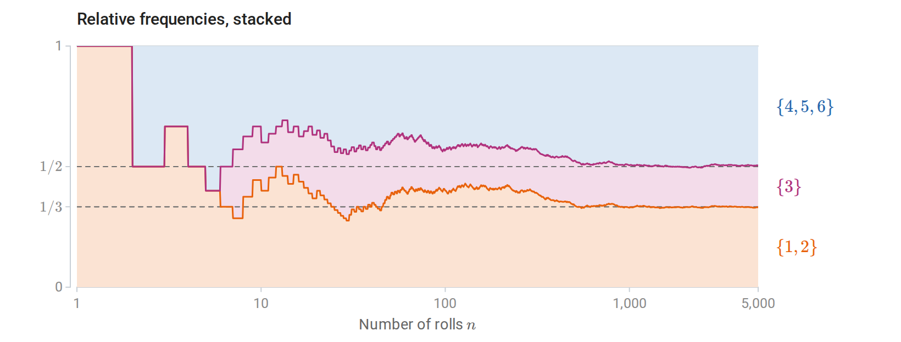

*Relative frequencies of three disjoint events in $`5{,}000`$ rolls of a fair die. At every $`n`$ they add to one, and each settles near its probability: $`1/3`$ for a roll of $`1`$ or $`2`$, $`1/6`$ for a three, and $`1/2`$ for $`4`$, $`5`$, or $`6`$.*

Defining probability as a limit of relative frequencies is hard to make precise. The limit need not exist for an arbitrary sequence of outcomes, and saying which infinite sequences count as random requires much of the theory being defined. Kolmogorov's 1933 monograph *Grundbegriffe der Wahrscheinlichkeitsrechnung* took a different route. It keeps the properties above as **axioms** for an abstract assignment of probabilities, strengthens additivity to countably many events, and leaves open what probabilities mean. The frequency interpretation then returns as a theorem: under the axioms, the law of large numbers proves that relative frequencies over independent repetitions converge, with probability one, to the probability of the event. The same axioms serve Bayesian inference, where probabilities express degrees of belief rather than long-run frequencies.

#### <a id="sample-spaces-and-events"></a>Sample spaces and events

**Definition (sample space and events).** The **sample space** $`\Omega`$ is the set of possible outcomes $`\omega`$ of an experiment. An **event** is a subset $`A\subseteq\Omega`$, and it **occurs** when the realized outcome belongs to $`A`$. The events that receive probabilities form a collection $`\mathcal F`$, called a **σ-algebra**, that contains $`\Omega`$ and is closed under complements and countable unions.

Set operations express logical ones: $`A^c=\Omega\setminus A`$ is "not $`A`$", $`A\cap B`$ is "$`A`$ and $`B`$", $`A\cup B`$ is "$`A`$ or $`B`$", and $`A\subseteq B`$ means that $`A`$ implies $`B`$. Events $`A`$ and $`B`$ are **disjoint**, or mutually exclusive, when $`A\cap B=\varnothing`$. Closure under countable unions matters because statements about limits combine countably many events. For example, "the running average eventually stays within $`\varepsilon`$ of $`\mu`$" is a countable union of countable intersections.

For a finite or countable sample space, $`\mathcal F`$ contains every subset. For outcomes in $`\mathbb R^d`$, it is the **Borel σ-algebra**, the smallest σ-algebra containing all intervals, or all boxes. It contains every open and closed set and every set obtained from these by countably many set operations. It cannot simply contain every subset, because no uniform law on an interval can assign a probability to all of them ([Appendix A](#block-probability-appendix-a)).

#### <a id="probability-measures"></a>Probability measures

**Definition (probability measure).** A **probability measure** on $`(\Omega,\mathcal F)`$ is a function $`P:\mathcal F\to[0,1]`$ that satisfies **Kolmogorov's axioms**:

1. $`P(\Omega)=1`$;
2. **countable additivity**: for pairwise disjoint events $`A_1,A_2,\ldots\in\mathcal F`$,

$$
P\Big(\bigcup_{i=1}^\infty A_i\Big)=\sum_{i=1}^\infty P(A_i).
$$

The triple $`(\Omega,\mathcal F,P)`$ is a **probability space**.

Every other rule of probability follows from these axioms. Taking every $`A_i=\varnothing`$ gives $`P(\varnothing)=0`$, so countable additivity includes finite additivity. For events $`A`$ and $`B`$ it follows that

$$
P(A^c)=1-P(A),
\qquad
A\subseteq B\ \Rightarrow\ P(A)\le P(B),
\qquad
P(A\cup B)=P(A)+P(B)-P(A\cap B).
$$

The last identity splits $`A\cup B`$ into the disjoint pieces $`A\setminus B`$, $`A\cap B`$, and $`B\setminus A`$. The **union bound** states that $`P(\bigcup_i A_i)\le\sum_iP(A_i)`$ for any countable collection of events, without an independence assumption. If each of $`m`$ possible failures has probability at most $`\alpha/m`$, the probability of any failure is at most $`\alpha`$. Countable additivity also makes probability continuous along increasing or decreasing sequences of events, which is what lets probabilities pass to limits ([Appendix A](#block-probability-appendix-a)).

Two constructions cover most models in these notes. On a finite or countable $`\Omega`$, nonnegative weights $`p(\omega)`$ that sum to one define $`P(A)=\sum_{\omega\in A}p(\omega)`$; equal weights on a finite $`\Omega`$ give the classical rule of the next subsection. On $`\mathbb R^d`$, a nonnegative function $`p`$ with integral one, a **density**, defines $`P(A)=\int_Ap(x)\,dx`$. The uniform law on $`[0,1]`$, which gives each interval its length, is the simplest example.

Under the uniform law, each single outcome has probability zero, although every outcome is possible. An event of probability zero is a **null event**; it need not be empty. A statement that holds outside a null event holds **almost surely** (a.s.), or with probability one.

#### <a id="equally-likely-outcomes-and-counting"></a>Equally likely outcomes and counting

When $`\Omega`$ is finite and every outcome is equally likely, probabilities are ratios of counts:

$$
P(A)=\frac{|A|}{|\Omega|}.
$$

The assumption of equal weights carries the whole argument. When the ordered outcomes of an experiment are equally likely, its unordered selections with replacement and its occupancy patterns generally are not, so the sample space must be chosen before counting. Choosing $`k`$ items from $`n`$ distinct items gives four standard counts:

| | Order matters | Order does not matter |
|---|---|---|
| With replacement | $`n^k`$ | $`\binom{n+k-1}{k}`$ |
| Without replacement | $`n!/(n-k)!`$ | $`\binom nk`$ |

The **multinomial coefficient** $`n!/(n_1!\cdots n_m!)`$ counts the ways to divide $`n`$ distinct items into labeled groups of sizes $`n_1,\ldots,n_m`$.

Drawing two cards from a standard deck shows why the replacement convention matters. With replacement, $`P(\text{two aces})=(4/52)^2\approx0.0059`$. Without replacement, the product rule of the next section gives $`(4/52)(3/51)\approx0.0045`$: the first draw changes the deck faced by the second. For more than two events, **inclusion–exclusion** extends the formula for $`P(A\cup B)`$ by alternately adding and subtracting intersections; [Appendix B](#block-probability-appendix-b) states it and uses it to count permutations with no fixed point.

#### <a id="random-variables-and-their-laws"></a>Random variables and their laws

An outcome can be complicated, such as a sequence of tosses, an image, or a whole sampled dataset, and most questions concern numerical summaries of it. A random variable is such a summary, with one requirement: every question about its value must be an event, so that it has a probability.

**Definition (random variable).** Let $`(\Omega,\mathcal F,P)`$ be a probability space, and let $`E`$ be a set of values with a σ-algebra $`\mathcal E`$, such as $`\mathbb R^d`$ with its Borel sets. A **random variable** with values in $`E`$ is a function $`X:\Omega\to E`$ that is **measurable**:

$$
X^{-1}(B)=\{\omega\in\Omega:X(\omega)\in B\}\in\mathcal F
\qquad\text{for every }B\in\mathcal E.
$$

It is a **real random variable** when $`E=\mathbb R`$, and a **random vector** when $`E=\mathbb R^d`$.

A random variable is an ordinary function; the randomness lies in which outcome $`\omega`$ occurs. The event $`X^{-1}(B)`$ is written $`\{X\in B\}`$, and its probability $`P(X\in B)`$. Measurability guarantees that these probabilities are defined, and it holds for every function met in practice: sums, products, continuous functions, and limits of random variables are again random variables ([Appendix A](#block-probability-appendix-a)).

**Definition (law).** The **distribution**, or **law**, of $`X`$ is the probability measure $`P_X`$ on $`(E,\mathcal E)`$ given by

$$
P_X(B)=P(X\in B)=P\big(X^{-1}(B)\big),
\qquad B\in\mathcal E.
$$

The law is the **pushforward** of $`P`$ through $`X`$, and it makes $`(E,\mathcal E,P_X)`$ a probability space of its own. Most calculations need only the law, so the underlying $`\Omega`$ usually stays in the background. Variables with the same law are **equal in distribution**, written $`X\overset{d}{=}Y`$, even if they are defined on different probability spaces or never take equal values. For one toss of a fair coin, the indicators of heads and of tails are equal in distribution, but they never agree.

For two tosses of a fair coin, $`\Omega=\{HH,HT,TH,TT\}`$, $`\mathcal F`$ contains all subsets, and $`P`$ gives each outcome probability $`1/4`$. The number of heads $`X`$ maps $`\Omega`$ to $`\{0,1,2\}`$. The preimages of the three values are $`\{TT\}`$, $`\{HT,TH\}`$, and $`\{HH\}`$, so the law of $`X`$ assigns them $`1/4`$, $`1/2`$, and $`1/4`$. Several outcomes can give the same value. Counting the possible values of $`X`$ and treating them as equally likely would give a different model: probability weights come from assumptions about the experiment, rather than from the names of its outcomes.

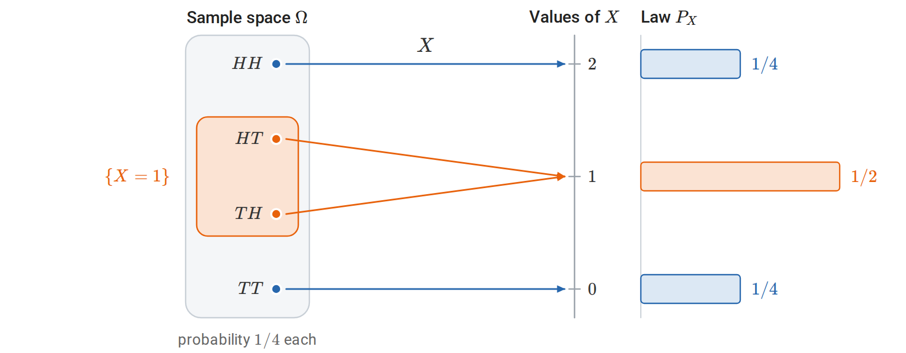

*The number of heads in two fair tosses, as a map from the sample space to the real line. The event $`\{X=1\}`$ is the preimage $`\{HT,TH\}`$, and the law of $`X`$ collects the probability of each preimage.*

Capital letters denote random quantities; lowercase letters denote their realized values. A sample is $`D=(Z_1,\ldots,Z_n)`$, and its observed value is $`(z_1,\ldots,z_n)`$. The underlying data-generating law will be written $`P_\ast`$; a statistical model proposes a family of laws $`\{P_\theta:\theta\in\Theta\}`$.

An observation may itself be a pair $`Z=(X,Y)`$ containing an input vector and a target. Its joint law describes both how inputs occur and how targets vary with those inputs. A conditional model for $`Y\mid X`$ describes only the second component. Specifying a distribution is a mathematical assumption; deciding whether it describes the observed data adequately is part of statistical modeling.

#### <a id="mass-density-and-cumulative-probability"></a>Mass, density, and cumulative probability

**Definition (mass function and density).** A real random variable $`Z`$ is **discrete** if $`P(Z\in S)=1`$ for some countable set $`S`$. Its **probability mass function** is $`p_Z(z)=P(Z=z)`$, with $`\sum_{z\in S}p_Z(z)=1`$. It is **absolutely continuous** if there is a **probability density function** $`p_Z\ge0`$ such that

$$
P(Z\in B)=\int_B p_Z(z)\,dz
\qquad\text{for every }B\in\mathcal B(\mathbb R),
$$

and in particular $`\int_{\mathbb R}p_Z(z)\,dz=1`$.

The notation $`p`$ will denote either a mass function or a density; the support and sum or integral identify which one is meant. A density measures probability per unit of the variable. Its height can exceed one: a uniform variable on $`(0,1/2)`$ has density $`2`$, and $`P(0<Z\le0.2)=2(0.2)=0.4`$. An individual point has probability zero under an absolutely continuous law, even where its density is positive. Some laws combine point masses and a continuous component, so a single ordinary density need not describe every distribution.

**Definition (distribution function).** The **cumulative distribution function** (CDF) of a real random variable $`Z`$ is

$$
F_Z(z)=P(Z\le z),\qquad z\in\mathbb R.
$$

It is nondecreasing and right-continuous, with limits zero and one at the two ends of the real line, and it determines the law $`P_Z`$ completely ([Appendix A](#block-probability-appendix-a)). Conversely, every nondecreasing, right-continuous function with these limits is the CDF of some random variable; the inverse-CDF construction later in the chapter builds one from a uniform variable. For a density, $`F_Z(z)=\int_{-\infty}^z p_Z(u)\,du`$ and $`F_Z'(z)=p_Z(z)`$ almost everywhere. CDF differences give interval probabilities:

$$
P(a<Z\le b)=F_Z(b)-F_Z(a),\qquad a<b.
$$

Define the left limit $`F_Z(z^-)=\lim_{u\uparrow z}F_Z(u)=P(Z<z)`$. The jump at $`z`$ is therefore

$$
P(Z=z)=F_Z(z)-F_Z(z^-).
$$

These identities apply to continuous, discrete, and mixed laws. For the uniform example, integrating the density gives

$$
F_Z(z)=
\begin{cases}
0,&z\le0,\\
2z,&0<z<1/2,\\
1,&z\ge1/2.
\end{cases}
$$

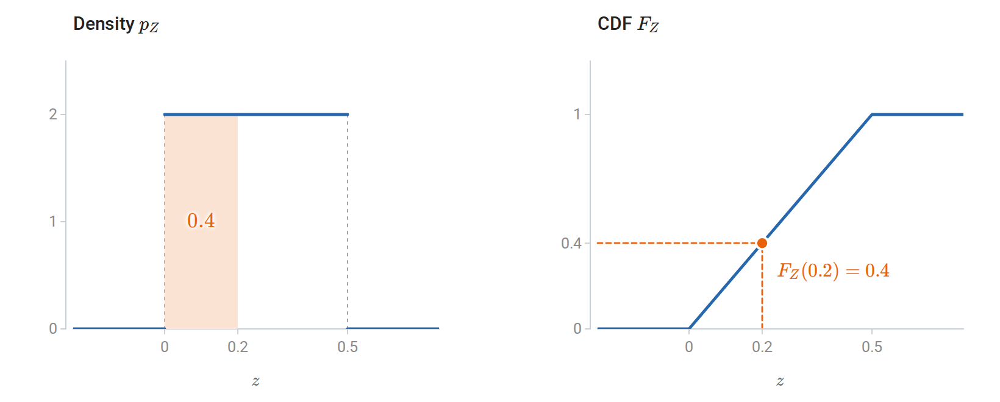

*The shaded area under the Unif$`(0,1/2)`$ density, $`2\times0.2=0.4`$, is the height of the CDF at $`0.2`$.*

The generalized **quantile** is

$$
F_Z^{-1}(q)=\inf\{z:F_Z(z)\ge q\},\qquad 0<q<1.
$$

The median is a $`1/2`$ quantile. The survival function $`1-F_Z(z)`$ gives $`P(Z>z)`$ and is useful for tail probabilities.

Blitzstein and Hwang's [*Introduction to Probability*](https://probabilitybook.net/) gives a systematic treatment of these objects, conditioning, and distribution families.

### <a id="conditioning-and-dependence"></a>Conditioning and dependence

**Definition (conditional probability).** For an event $`B`$ with $`P(B)>0`$, the **conditional probability** of $`A`$ given $`B`$ is

$$
P(A\mid B)=\frac{P(A\cap B)}{P(B)}.
$$

Conditioning restricts attention to outcomes consistent with the observation and renormalizes their weights. For fixed $`B`$, the map $`A\mapsto P(A\mid B)`$ is again a probability measure on $`(\Omega,\mathcal F)`$, so every rule of the previous section applies to conditional probabilities. Rearranging gives the product rule, $`P(A\cap B)=P(A\mid B)P(B)`$. If positive-probability events $`B_1,\ldots,B_k`$ partition the sample space up to a null set, summing over the disjoint cases gives **total probability**. When $`P(A)>0`$, it also gives **Bayes' rule**. Zero-probability partition cells can be omitted:

$$
P(A)=\sum_j P(A\mid B_j)P(B_j),\qquad
P(B_j\mid A)=\frac{P(A\mid B_j)P(B_j)}{\sum_iP(A\mid B_i)P(B_i)}.
$$

For example, suppose one percent of messages are spam. A filter flags $`90\%`$ of spam and $`5\%`$ of ordinary messages. Among $`10{,}000`$ messages, the expected flagged counts are $`90`$ spam and $`495`$ ordinary messages. Therefore

$$
P(\text{spam}\mid\text{flagged})
=\frac{0.90(0.01)}{0.90(0.01)+0.05(0.99)}
\approx0.154.
$$

The prevalence, or **base rate**, matters alongside the filter's behavior within each class. Reversing the conditioning event changes the question.

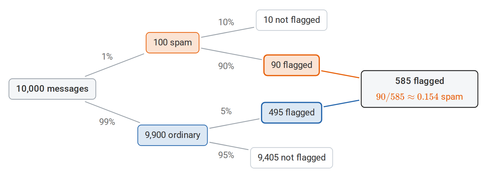

*Of 10,000 messages, 585 are flagged, and only 90 of those are spam.*

Bayes' rule is often clearest in **odds form**. For two hypotheses $`H_1,H_2`$ and data $`D`$,

$$
\frac{P(H_1\mid D)}{P(H_2\mid D)}
=\frac{P(H_1)}{P(H_2)}\cdot\frac{P(D\mid H_1)}{P(D\mid H_2)}.
$$

Posterior odds are prior odds multiplied by the **likelihood ratio**. In the filter example, the prior odds of spam are $`1/99`$, and a flag multiplies them by $`0.90/0.05=18`$. The posterior odds $`18/99`$ correspond to the probability $`18/117\approx0.154`$ found above. The likelihood ratio measures what the observation says; the prior odds say how rare the hypothesis was to begin with.

#### <a id="joint-laws-marginalization-and-the-chain-rule"></a>Joint laws, marginalization, and the chain rule

A joint distribution describes variables together. If $`(X,Y)`$ has a joint mass function, then $`p_X(x)=\sum_y p_{X,Y}(x,y)`$; for a joint density, replace the sum with an integral. This operation is **marginalization**. A conditional density is

$$
p_{Y\mid X}(y\mid x)=\frac{p_{X,Y}(x,y)}{p_X(x)},\qquad p_X(x)>0.
$$

It remains meaningful for continuous $`X`$, even though $`P(X=x)=0`$: it describes the conditional law through densities, rather than dividing two point probabilities. Conditional laws are only determined up to changes on sets of conditioning values having probability zero.

Repeated factorization gives the **probability chain rule**:

$$
p(z_1,\ldots,z_n)=p(z_1)\prod_{i=2}^n p(z_i\mid z_1,\ldots,z_{i-1}).
$$

This identity requires no independence. An autoregressive language model uses this factorization to describe a sequence by distributions for successive tokens.

For a small discrete example, suppose two binary variables have joint probabilities

| | $`Y=0`$ | $`Y=1`$ |
|---|---:|---:|
| $`X=0`$ | $`0.4`$ | $`0.1`$ |
| $`X=1`$ | $`0.2`$ | $`0.3`$ |

Summing rows gives $`P(X=0)=P(X=1)=0.5`$; summing the second column gives $`P(Y=1)=0.4`$. Within the $`X=1`$ row, renormalization gives $`P(Y=1\mid X=1)=0.3/0.5=0.6`$. The variables are dependent because knowing $`X=1`$ changes the probability of $`Y=1`$. Conversely, total probability recovers $`0.4`$ as $`0.2(0.5)+0.6(0.5)`$. Marginalization and conditioning are distinct operations on the same joint law.

#### <a id="independence-and-exchangeability"></a>Independence and exchangeability

**Definition (independence).** Events $`A`$ and $`B`$ are **independent** if $`P(A\cap B)=P(A)P(B)`$. Events $`A_1,\ldots,A_n`$ are **mutually independent** if

$$
P\Big(\bigcap_{i\in S}A_i\Big)=\prod_{i\in S}P(A_i)
\qquad\text{for every subset }S\subseteq\{1,\ldots,n\}.
$$

Random variables $`X_1,\ldots,X_n`$ are **independent** if $`P(X_1\in B_1,\ldots,X_n\in B_n)=\prod_iP(X_i\in B_i)`$ for all measurable sets $`B_1,\ldots,B_n`$: any events determined by different variables are independent, and the joint law is the product of the marginal laws. An infinite family is independent when every finite subfamily is. Independence of two variables is written $`X\perp Y`$.

When $`P(B)>0`$, independence of $`A`$ and $`B`$ says that $`P(A\mid B)=P(A)`$: learning that $`B`$ occurred leaves the probability of $`A`$ unchanged. For variables with a joint density or mass function, independence is the factorization $`p_{X,Y}(x,y)=p_X(x)p_Y(y)`$ almost everywhere, and for real variables it is equivalent to factorization of the joint CDF. Independence is different from disjointness: two disjoint events of positive probability are dependent, since observing one rules out the other.

The variables $`Z_1,\ldots,Z_n`$ are **independent and identically distributed**, abbreviated iid, when their joint law is the product of one common marginal law. Pairwise independence alone does not imply joint independence. For independent fair bits $`U,V`$, the triple $`(U,V,U\mathbin{\oplus}V)`$ is pairwise independent, but the third bit is determined by the first two.

The two parts of iid make separate claims. Variables can be independent with different distributions, as when measurements have different known noise variances. They can also have identical marginal distributions while being dependent, as with repeated measurements of the same individual. Sampling without replacement from a finite population creates dependence even when every sampled position has the same marginal law. Independence is often a useful approximation; whether it is appropriate depends on how data were collected.

A sequence is **exchangeable** when its joint law is unchanged by any permutation of the indices. Iid sequences are exchangeable, and so are draws without replacement from a finite population, even though those draws are dependent. Permutation tests later in the chapter rest on exactly this symmetry.

**Conditional independence**, $`X\perp Y\mid C`$, means that their conditional joint law factors given $`C`$. For example, repeated observations may be independent after conditioning on a shared parameter but dependent when that parameter is integrated out. A $`\operatorname{Bernoulli}(q)`$ variable equals one with probability $`q`$ and zero with probability $`1-q`$. If $`Q`$ is random and $`X,Y\mid Q`$ are independent $`\operatorname{Bernoulli}(Q)`$ variables, observing $`X=1`$ favors larger values of $`Q`$, which in turn favor $`Y=1`$. A common random success probability can therefore create marginal dependence. Conditional independence is a property of the specified joint model; it does not, by itself, establish a causal relationship.

#### <a id="simpson-s-paradox"></a>Simpson's paradox

Conditioning on a third variable can reverse a comparison. The table gives success counts for two kidney-stone treatments, split by stone size ([Charig et al., 1986](https://doi.org/10.1136/bmj.292.6524.879)):

| Stones | Treatment A | Treatment B |
|---|---:|---:|
| Small | $`81/87\approx0.93`$ | $`234/270\approx0.87`$ |
| Large | $`192/263\approx0.73`$ | $`55/80\approx0.69`$ |
| All | $`273/350=0.78`$ | $`289/350\approx0.83`$ |

Treatment A has the higher success rate for small stones and for large stones, yet the lower rate overall. There is no arithmetic error. Writing $`S`$ for success, $`T`$ for treatment, and $`G`$ for stone size, total probability expresses each overall rate as a weighted average of the group rates:

$$
P(S\mid T=t)=\sum_g P(S\mid T=t,G=g)\,P(G=g\mid T=t).
$$

The weights differ between treatments: $`263`$ of the $`350`$ patients given A had large stones, the harder cases, against $`80`$ of the $`350`$ given B. This reversal is **Simpson's paradox**.

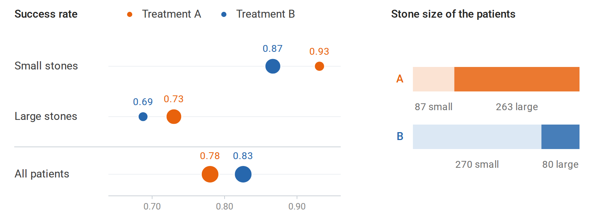

*Treatment A succeeds more often within each stone size, but three quarters of its patients had large stones.*

Which comparison answers a question depends on how treatments were assigned and on what the question is. Here stone size influenced the choice of treatment and also the chance of success, so the within-size comparisons are the relevant ones for choosing a treatment. The probabilities alone do not settle whether a variable should be conditioned on; that judgment requires assumptions about how the data arose.

### <a id="expectations-variation-and-conditional-averages"></a>Expectations, variation, and conditional averages

**Definition (expectation).** The **expectation** of a real random variable $`Z`$ is its probability-weighted average, the integral of $`Z`$ over the sample space:

$$
\mathbb EZ=\int_\Omega Z(\omega)\,P(d\omega).
$$

The integral is the Lebesgue integral of $`Z`$ with respect to $`P`$. It is always defined for $`Z\ge0`$, possibly as $`+\infty`$, and a general $`Z`$ is **integrable** when $`\mathbb E|Z|<\infty`$, in which case its expectation is finite. [Appendix A](#block-probability-appendix-a) defines this integral, compares it with the Riemann integral, and proves that it equals an integral over the values of $`Z`$, as in the next paragraph.

The integral over $`\Omega`$ can be moved to the law of $`Z`$: for measurable $`g`$ with $`\mathbb E|g(Z)|<\infty`$, $`\mathbb E[g(Z)]=\int_{\mathbb R}g(z)\,P_Z(dz)`$, an integral over the real line ([Appendix A](#block-probability-appendix-a)). This **law of the unconscious statistician** becomes a sum or an ordinary integral for a mass function or a density:

$$
\mathbb E[g(Z)]=\sum_z g(z)p_Z(z)
\quad\text{or}\quad
\mathbb E[g(Z)]=\int g(z)p_Z(z)\,dz.
$$

For a law with neither a mass function nor a density, the same integral is taken against the CDF and written $`\int g(z)\,dF_Z(z)`$. In every case there is no need to first find the distribution of $`g(Z)`$. Expectations are linear: $`\mathbb E[\sum_i a_iZ_i]=\sum_i a_i\mathbb E Z_i`$ whenever each $`Z_i`$ is integrable. Independence is unnecessary. In particular, an indicator $`\mathbf1_A`$ equals one on $`A`$ and zero elsewhere, so $`\mathbb E\mathbf1_A=P(A)`$. Expected counts are therefore sums of event probabilities, including when the counted events are dependent.

For a uniformly random ordering of $`n`$ items, let $`I_i`$ indicate that item $`i`$ stays in its original position. The number of fixed points $`\sum_iI_i`$ has expectation $`n\cdot(1/n)=1`$ for every $`n`$, although the indicators are dependent. Indicators also give the **tail-sum formula**. A variable with values in $`\{0,1,2,\ldots\}`$ satisfies $`X=\sum_{k\ge1}\mathbf1\{X\ge k\}`$, so

$$
\mathbb EX=\sum_{k\ge1}P(X\ge k),
\qquad\text{and}\qquad
\mathbb EX=\int_0^\infty P(X>t)\,dt
$$

for any nonnegative variable.

For $`\mu=\mathbb E Z`$ and finite second moment,

$$
\operatorname{Var}(Z)=\mathbb E[(Z-\mu)^2]
=\mathbb E[Z^2]-\mu^2,
\qquad \operatorname{SD}(Z)=\sqrt{\operatorname{Var}(Z)}.
$$

Variance has squared units; standard deviation has the same units as $`Z`$. For finite second moments,

$$
\operatorname{Cov}(X,Y)=\mathbb E[(X-\mathbb EX)(Y-\mathbb EY)],
$$

and correlation divides this by the two standard deviations, when both are positive. Covariance measures linear association. Independence implies zero covariance, but the converse fails: for $`X\sim\operatorname{Unif}(-1,1)`$ and $`Y=X^2`$, symmetry gives $`\operatorname{Cov}(X,Y)=0`$ although $`Y`$ is determined by $`X`$.

Expanding a squared sum gives

$$
\operatorname{Var}\!\left(\sum_i a_iZ_i\right)
=\sum_i a_i^2\operatorname{Var}(Z_i)
+2\sum_{i<j}a_i a_j\operatorname{Cov}(Z_i,Z_j).
$$

Thus averaging iid observations with variance $`\sigma^2`$ gives variance $`\sigma^2/n`$. Correlation changes this reduction; duplicating the same observation $`n`$ times does not supply $`n`$ independent pieces of information.

For instance, if each observation has variance $`\sigma^2`$ and every distinct pair has correlation $`\rho`$, then

$$
\operatorname{Var}(\bar Z_n)=\frac{\sigma^2}{n}\bigl(1+(n-1)\rho\bigr).
$$

For fixed positive $`\rho`$, this variance approaches $`\rho\sigma^2`$ rather than zero. This calculation is one reason to distinguish the number of recorded rows from the amount of independent information. It also shows why an iid standard-error formula can be misleading for clustered or temporally correlated observations.

For a column vector $`Z\in\mathbb R^d`$, define

$$
\mu=\mathbb EZ,\qquad
\Sigma=\mathbb E[(Z-\mu)(Z-\mu)^\top].
$$

The covariance matrix is symmetric positive semidefinite because $`a^\top\Sigma a=\operatorname{Var}(a^\top Z)\ge0`$. An affine transformation satisfies $`\mathbb E[AZ+b]=A\mu+b`$ and $`\operatorname{Cov}(AZ+b)=A\Sigma A^\top`$.

#### <a id="conditional-expectation-and-total-variance"></a>Conditional expectation and total variance

**Definition (conditional expectation).** For an integrable $`Y`$, let $`m(x)=\mathbb E[Y\mid X=x]`$ be the mean of the conditional law of $`Y`$ given $`X=x`$. With a conditional density,

$$
m(x)=\int y\,p_{Y\mid X}(y\mid x)\,dy,
$$

and with a conditional mass function the integral becomes a sum. The **conditional expectation** $`\mathbb E[Y\mid X]`$ is the random variable $`m(X)`$. It is a function of $`X`$ rather than a number: its value depends on the observed $`X`$.

The **tower property**, or law of total expectation, says

$$
\mathbb E[\mathbb E(Y\mid X)]=\mathbb EY.
$$

It follows by integrating first over $`y`$ and then over $`x`$. [Appendix A](#block-probability-appendix-a) gives the general definition, which needs no density and can condition on any body of information, such as a whole past. It characterizes $`m(X)`$ as the function of $`X`$ whose average over every event determined by $`X`$ equals that of $`Y`$.

Assume now that $`\mathbb E[Y^2]<\infty`$. Write $`Y= m(X)+R`$, where $`R=Y-m(X)`$ satisfies $`\mathbb E[R\mid X]=0`$. Expanding $`(Y-\mathbb EY)^2=(m(X)-\mathbb EY+R)^2`$ and taking expectations eliminates the cross term, yielding the **law of total variance**:

$$
\boxed{\operatorname{Var}(Y)
=\mathbb E[\operatorname{Var}(Y\mid X)]
+\operatorname{Var}(\mathbb E[Y\mid X]).}
$$

The first term measures average variation within groups defined by $`X`$; the second measures variation between their means. The same residual argument shows that, for any square-integrable prediction rule $`h(X)`$,

$$
\mathbb E[(Y-h(X))^2]
=\mathbb E[\operatorname{Var}(Y\mid X)]
+\mathbb E[(m(X)-h(X))^2].
$$

More explicitly, $`Y-h(X)=R+[m(X)-h(X)]`$. After squaring, the cross term has expectation

$$
\mathbb E\{R[m(X)-h(X)]\}
=\mathbb E\{[m(X)-h(X)]\mathbb E[R\mid X]\}=0.
$$

The factor depending only on $`X`$ can be taken outside the inner conditional expectation. This **orthogonality** of the residual to functions of $`X`$ is stronger than having zero ordinary covariance with $`X`$. A population linear predictor that minimizes expected squared error has residuals orthogonal to its chosen features in expectation. Ordinary least squares on one sample instead gives empirical orthogonality to the columns of its design matrix. The true conditional mean removes every square-integrable predictable component.

Consequently, the conditional mean minimizes expected squared prediction error. This is a population statement: estimating that mean from finite data remains a statistical problem.

There is also a **law of total covariance**:

$$
\operatorname{Cov}(U,V)
=\mathbb E[\operatorname{Cov}(U,V\mid C)]
+\operatorname{Cov}(\mathbb E[U\mid C],\mathbb E[V\mid C]).
$$

It follows by subtracting the conditional means and expanding, just as for total variance. Returning to the shared random probability $`Q`$, conditionally independent Bernoulli draws $`U,V\mid Q`$ have conditional covariance zero and conditional means both equal to $`Q`$. Consequently, $`\operatorname{Cov}(U,V)=\operatorname{Var}(Q)`$. Variation in a shared hidden variable explains their positive marginal association.

For a concrete mixture, let $`C`$ indicate group membership, with $`P(C=1)=0.3`$ and $`P(C=0)=0.7`$. Let $`G`$ be an independent standard Normal variable, which has mean zero and variance one, and set $`Y=2C+G`$. Conditional on $`C`$, the mean of $`Y`$ is $`2C`$ and its variance is one. Thus $`\mathbb EY=0.6`$ and $`\operatorname{Var}(Y)=1+4(0.3)(0.7)=1.84`$. Simulation reproduces both sources of variation:

```python
import numpy as np

rng = np.random.default_rng(7)
c = rng.binomial(1, 0.3, size=200_000)
conditional_mean = 2.0 * c
y = conditional_mean + rng.normal(size=c.size)
print("mean:", y.mean(), "theory:", 0.6)
print("variance:", y.var(), "theory:", 1.84)
print("within + between:", 1.0 + conditional_mean.var())
```

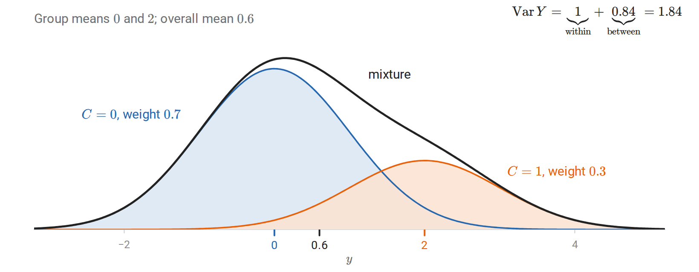

*The mixture $`Y=2C+G`$: its variance $`1.84`$ is the within-group variance $`1`$ plus the variance $`0.84`$ of the group means $`0`$ and $`2`$.*

#### <a id="two-moment-inequalities"></a>Two moment inequalities

Two useful moment inequalities are **Cauchy–Schwarz**, $`|\mathbb E[UV]|\le\sqrt{\mathbb E[U^2]\mathbb E[V^2]}`$, and **Jensen's inequality**, $`\phi(\mathbb EZ)\le\mathbb E[\phi(Z)]`$ for convex $`\phi`$ when the relevant expectations exist. Jensen explains why applying a nonlinear function before averaging generally changes the result; for example, $`\mathbb E[Z^2]\ge(\mathbb EZ)^2`$.

For differentiable convex $`\phi`$, Jensen follows directly from the supporting-line inequality $`\phi(z)\ge\phi(\mu)+\phi'(\mu)(z-\mu)`$ with $`\mu=\mathbb EZ`$: expectation removes the linear term. The direction reverses for concave functions. In particular, averaging positive quantities and then taking a logarithm is at least as large as averaging their logarithms, provided the relevant expectations exist. Expectation preserves linear operations, while convexity controls certain nonlinear ones.

### <a id="distribution-families"></a>Distribution families

A distribution family specifies its support, parameters, and probability rule. Write $`\operatorname{Gamma}(\alpha,\lambda)`$ with **shape** $`\alpha>0`$ first and **rate** $`\lambda>0`$ second, and $`\operatorname{Beta}(\alpha,\beta)`$ with its two positive **shape parameters**. The gamma convention is shape–rate throughout these notes; another common convention uses shape and scale, where scale is $`1/\lambda`$. For a normal law, the second argument of $`\mathcal N(\mu,\sigma^2)`$ is the variance, not the standard deviation. Geometric and negative binomial variables count the failures before the first or the $`r`$th success; some sources count trials instead, which adds $`1`$ or $`r`$.

#### <a id="discrete-observations"></a>Discrete observations

| Distribution | Probability mass and support | Mean; variance |
|---|---|---|
| $`\operatorname{Bernoulli}(q)`$, $`0\le q\le1`$ | $`p(0)=1-q`$, $`p(1)=q`$ | $`q`$; $`q(1-q)`$ |
| $`\operatorname{Binomial}(n,q)`$ | $`p(k)=\binom nkq^k(1-q)^{n-k}`$, $`k=0,\ldots,n`$ | $`nq`$; $`nq(1-q)`$ |
| $`\operatorname{Geometric}(q)`$, $`0<q\le1`$ | $`p(k)=(1-q)^kq`$, $`k=0,1,\ldots`$ | $`(1-q)/q`$; $`(1-q)/q^2`$ |
| $`\operatorname{NegBinomial}(r,q)`$ | $`p(k)=\binom{k+r-1}{k}q^r(1-q)^k`$, $`k=0,1,\ldots`$ | $`r(1-q)/q`$; $`r(1-q)/q^2`$ |
| $`\operatorname{Hypergeometric}(N,K,n)`$ | $`p(k)=\binom Kk\binom{N-K}{n-k}\big/\binom Nn`$ | $`nK/N`$; $`n\frac KN\big(1-\frac KN\big)\frac{N-n}{N-1}`$ |
| $`\operatorname{Poisson}(\lambda)`$, $`\lambda>0`$ | $`p(k)=e^{-\lambda}\lambda^k/k!`$, $`k=0,1,\ldots`$ | $`\lambda`$; $`\lambda`$ |
| $`\operatorname{Categorical}(q_1,\ldots,q_K)`$ | $`P(Z=k)=q_k`$, $`q_k\ge0`$, $`\sum_kq_k=1`$ | For the one-hot vector $`U`$, $`\mathbb EU=q`$, $`\operatorname{Cov}(U)=\operatorname{diag}(q)-qq^\top`$ |

A binomial variable counts successes in $`n`$ independent Bernoulli trials. The categorical distribution describes a class or token, while its one-hot representation is a random vector. Counts of the $`K`$ outcomes across $`n`$ iid categorical draws have a **multinomial distribution**:

$$
P(N_1=n_1,\ldots,N_K=n_K)
=\frac{n!}{\prod_k n_k!}\prod_kq_k^{n_k},
\qquad \sum_k n_k=n.
$$

The binomial formula follows by counting which $`k`$ of the $`n`$ trials succeed. Each such sequence has probability $`q^k(1-q)^{n-k}`$, and there are $`\binom nk`$ such sequences. Its moments follow more simply by writing the count as a sum of indicators: linearity gives mean $`nq`$, and independence removes covariance terms to give variance $`nq(1-q)`$. The same random variable can therefore be analyzed through its probability mass function or through its construction, whichever makes a calculation clearer.

A **geometric** variable counts the failures before the first success in independent trials with success probability $`q`$. Since $`P(X\ge k)=(1-q)^k`$, it is **memoryless**:

$$
P(X\ge a+b\mid X\ge a)=P(X\ge b).
$$

Failures already observed do not change the distribution of the remaining wait. The number of failures before the $`r`$th success is a sum of $`r`$ independent geometric counts and has the **negative binomial** distribution.

Sampling without replacement changes the binomial. Draw $`n`$ items from a population of $`N`$ items, $`K`$ of which are successes. The number of successes drawn is **hypergeometric**. Its mean $`nK/N`$ matches the binomial mean with $`q=K/N`$, but its variance carries the **finite-population correction** $`(N-n)/(N-1)`$. The draws are negatively dependent: each success drawn leaves fewer behind. The correction is negligible when $`n`$ is a small fraction of $`N`$.

The Poisson family is the law of rare events. If $`X_n\sim\operatorname{Binomial}(n,\lambda/n)`$ with $`\lambda`$ fixed, then for each $`k`$,

$$
\binom nk\Big(\frac\lambda n\Big)^k\Big(1-\frac\lambda n\Big)^{n-k}\longrightarrow e^{-\lambda}\frac{\lambda^k}{k!}.
$$

Many independent opportunities, each unlikely, produce a moderate total count. Independent Poisson counts add their rates. Conversely, if $`X\sim\operatorname{Poisson}(\lambda)`$ and $`Y\sim\operatorname{Poisson}(\mu)`$ are independent, then $`X\mid X+Y=m\sim\operatorname{Binomial}(m,\lambda/(\lambda+\mu))`$. Equality of mean and variance is a modeling restriction, not a property of counts in general; counts whose variance exceeds their mean are called **overdispersed**.

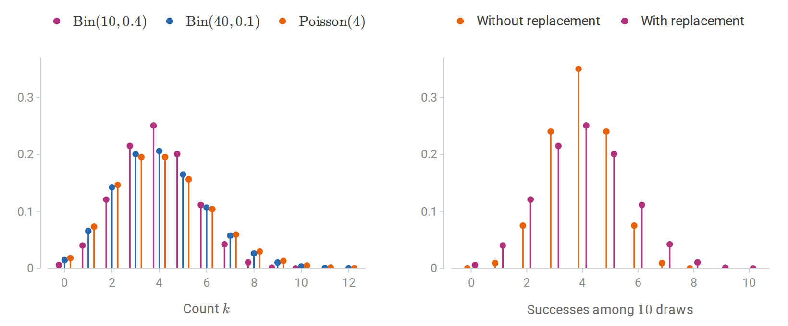

*Binomial counts with mean $`4`$ approach the Poisson$`(4)`$ law as the number of trials grows (left). Ten draws without replacement from twenty items, eight of them successes, vary less than ten draws with replacement (right).*

#### <a id="continuous-observations-and-uncertain-probabilities"></a>Continuous observations and uncertain probabilities

| Distribution | Density and support | Mean; variance |
|---|---|---|
| $`\operatorname{Unif}(a,b)`$, $`a<b`$ | $`1/(b-a)`$ on $`(a,b)`$ | $`(a+b)/2`$; $`(b-a)^2/12`$ |
| Normal $`\mathcal N(\mu,\sigma^2)`$, $`\sigma>0`$ | $`(\sqrt{2\pi}\sigma)^{-1}\exp(-(z-\mu)^2/(2\sigma^2))`$ on $`\mathbb R`$ | $`\mu`$; $`\sigma^2`$ |
| $`\operatorname{Exp}(\lambda)`$, rate $`\lambda>0`$ | $`\lambda e^{-\lambda z}`$ on $`z\ge0`$ | $`1/\lambda`$; $`1/\lambda^2`$ |
| $`\operatorname{Gamma}(\alpha,\lambda)`$, $`\alpha,\lambda>0`$ | $`\lambda^\alpha z^{\alpha-1}e^{-\lambda z}/\Gamma(\alpha)`$ on $`z>0`$ | $`\alpha/\lambda`$; $`\alpha/\lambda^2`$ |
| $`\operatorname{Beta}(\alpha,\beta)`$, $`\alpha,\beta>0`$ | $`z^{\alpha-1}(1-z)^{\beta-1}/B(\alpha,\beta)`$ on $`(0,1)`$ | $`\alpha/(\alpha+\beta)`$; $`\alpha\beta/[(\alpha+\beta)^2(\alpha+\beta+1)]`$ |

The normalizing functions are

$$
\Gamma(\alpha)=\int_0^\infty t^{\alpha-1}e^{-t}\,dt,
\qquad
B(\alpha,\beta)=\frac{\Gamma(\alpha)\Gamma(\beta)}{\Gamma(\alpha+\beta)}.
$$

The gamma function $`\Gamma(\alpha)`$ is distinct from the distribution name $`\operatorname{Gamma}(\alpha,\lambda)`$. Setting the shape to one gives $`\operatorname{Gamma}(1,\lambda)=\operatorname{Exp}(\lambda)`$.

The [SciPy gamma distribution](https://docs.scipy.org/doc/scipy/reference/generated/scipy.stats.gamma.html) uses shape and **scale**: the law written here as $`\operatorname{Gamma}(\alpha,\lambda)`$ is `gamma(a=alpha, scale=1/rate)` in SciPy. [NumPy draws it](https://numpy.org/doc/stable/reference/random/generated/numpy.random.Generator.gamma.html) with `rng.gamma(shape=alpha, scale=1/rate, size=...)`. For example, shape $`3`$ and rate $`2`$ give mean $`3/2`$ and variance $`3/4`$:

```python
import numpy as np
from scipy.stats import gamma

alpha, rate = 3.0, 2.0
law = gamma(a=alpha, scale=1.0 / rate)
print("mean and variance:", law.mean(), law.var())  # 1.5, 0.75
assert np.allclose([law.mean(), law.var()], [alpha/rate, alpha/rate**2])
```

The exponential distribution is the continuous memoryless law:

$$
P(Z>s+t\mid Z>s)=\frac{e^{-\lambda(s+t)}}{e^{-\lambda s}}=P(Z>t),
$$

and among continuous distributions on $`[0,\infty)`$ it is the only one with this property. It is the limit of a geometric waiting time when time is divided into short intervals, each containing an event with probability about $`\lambda`$ times its length. For independent $`Z_i\sim\operatorname{Exp}(\lambda_i)`$, the minimum satisfies $`P(\min_iZ_i>t)=\prod_ie^{-\lambda_it}`$, so it is $`\operatorname{Exp}(\sum_i\lambda_i)`$, and $`Z_j`$ is the smallest with probability $`\lambda_j/\sum_i\lambda_i`$. Sums of independent gamma variables with a common rate add their shapes: $`\operatorname{Gamma}(\alpha_1,\lambda)+\operatorname{Gamma}(\alpha_2,\lambda)`$ is $`\operatorname{Gamma}(\alpha_1+\alpha_2,\lambda)`$. In particular, a sum of $`k`$ independent $`\operatorname{Exp}(\lambda)`$ variables is $`\operatorname{Gamma}(k,\lambda)`$.

These facts fit together in the **Poisson process**, a model for events occurring at rate $`\lambda`$ in continuous time. The gaps between successive events are iid $`\operatorname{Exp}(\lambda)`$, so the time of the $`k`$th event is $`\operatorname{Gamma}(k,\lambda)`$. The number of events in any interval of length $`t`$ is $`\operatorname{Poisson}(\lambda t)`$, and counts in disjoint intervals are independent. The waiting-time and counting descriptions are two views of one model: the first event comes after time $`t`$ exactly when the interval $`[0,t]`$ contains no event, and both probabilities equal $`e^{-\lambda t}`$. [Appendix D](#block-probability-appendix-d) adds renewal processes, Markov chains, and martingales, the other basic models of randomness that unfolds over time.

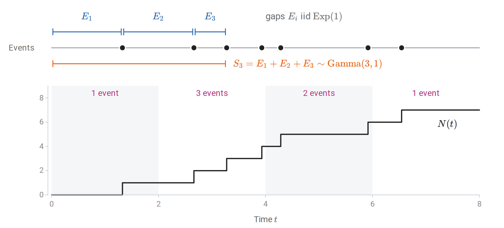

*One run of a rate-$`1`$ Poisson process. The gaps between events are exponential, the count $`N(t)`$ rises by one at each event, and the counts in the four windows of length $`2`$ are independent Poisson$`(2)`$ draws.*

A beta distribution models a probability or fraction on $`(0,1)`$. It also arises from ratios: for independent $`X\sim\operatorname{Gamma}(\alpha,\lambda)`$ and $`Y\sim\operatorname{Gamma}(\beta,\lambda)`$, the fraction $`X/(X+Y)`$ is $`\operatorname{Beta}(\alpha,\beta)`$ and is independent of the total $`X+Y`$ ([Appendix B](#block-probability-appendix-b)).

The **Dirichlet distribution** generalizes beta to a random probability vector $`Q\sim\operatorname{Dirichlet}(\alpha_1,\ldots,\alpha_K)`$. For $`q_k>0`$, $`\sum_kq_k=1`$, and $`\alpha_k>0`$, its density in the first $`K-1`$ coordinates is

$$
p_Q(q_1,\ldots,q_{K-1})
=\frac{\Gamma(\alpha_0)}{\prod_k\Gamma(\alpha_k)}\prod_kq_k^{\alpha_k-1},
\quad q_K=1-\sum_{k<K}q_k,\quad \alpha_0=\sum_k\alpha_k.
$$

Its mean is $`\mathbb E Q_k=\alpha_k/\alpha_0`$. The total $`\alpha_0`$ controls concentration around the mean when the ratios $`\alpha_k/\alpha_0`$ are held fixed. Normalizing independent $`\operatorname{Gamma}(\alpha_k,1)`$ variables by their sum gives a $`\operatorname{Dirichlet}(\alpha_1,\ldots,\alpha_K)`$ vector; with every $`\alpha_k=1`$, it is uniform on the simplex.

Unlike a Normal law, whose shape is fixed and only shifts and stretches with its parameters, gamma and beta distributions change shape. A gamma density with shape $`\alpha\le1`$ is largest at zero, while larger shapes move its mode away from zero and make it more symmetric. For the beta family, $`\alpha=\beta=1`$ gives a uniform density, $`\alpha=\beta>1`$ concentrates toward the middle, $`\alpha=\beta<1`$ places more density near the endpoints, and unequal parameters tilt it toward one end.

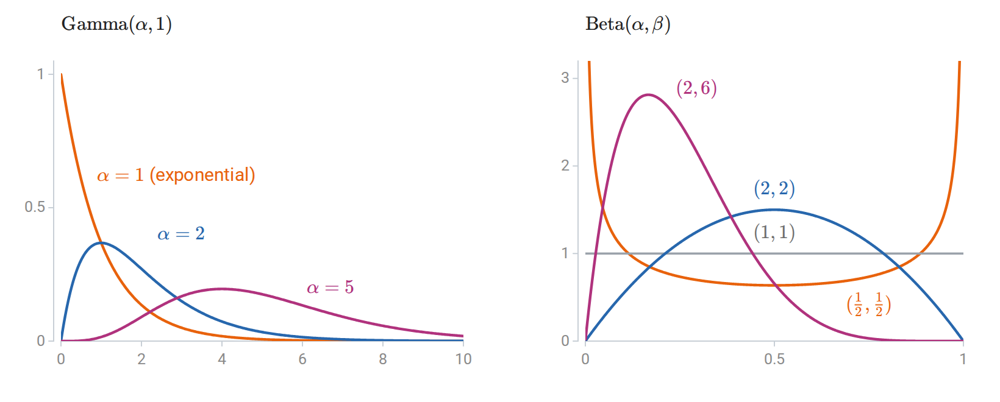

*Gamma densities with rate $`1`$ (left) and beta densities (right). The shape parameters change the form of each density, not only its location and scale.*

#### <a id="distributions-derived-from-normal-samples"></a>Distributions derived from Normal samples

Several distributions arise from Normal samples and reappear throughout inference. If $`G_1,\ldots,G_\nu`$ are iid standard normals, then $`V=\sum_iG_i^2\sim\chi^2_\nu=\operatorname{Gamma}(\nu/2,1/2)`$, with mean $`\nu`$ and variance $`2\nu`$. If $`G\sim\mathcal N(0,1)`$ independently of $`V`$, then $`G/\sqrt{V/\nu}`$ has **Student's $`t`$ distribution** with $`\nu`$ degrees of freedom. It has heavier tails than a normal; its mean is zero for $`\nu>1`$ and its variance is $`\nu/(\nu-2)`$ for $`\nu>2`$. As $`\nu\to\infty`$, it approaches $`\mathcal N(0,1)`$. The $`t_1`$ law is the **Cauchy** distribution, with density $`1/[\pi(1+x^2)]`$; it is also the law of a ratio of two independent standard normals, and it has neither a finite mean nor a finite variance. Moment assumptions in limit theorems therefore matter.

For independent $`U\sim\chi^2_m`$ and $`V\sim\chi^2_k`$, the ratio $`(U/m)/(V/k)`$ has the **$`F`$ distribution** $`F_{m,k}`$, used in variance-ratio and regression tests. If $`G\sim\mathcal N(\mu,\sigma^2)`$, then $`L=e^G`$ is **lognormal**, with mean $`e^{\mu+\sigma^2/2}`$. A lognormal variable has finite moments of every order, yet its right tail is heavy enough that $`\mathbb E[e^{sL}]`$ is infinite for every $`s>0`$.

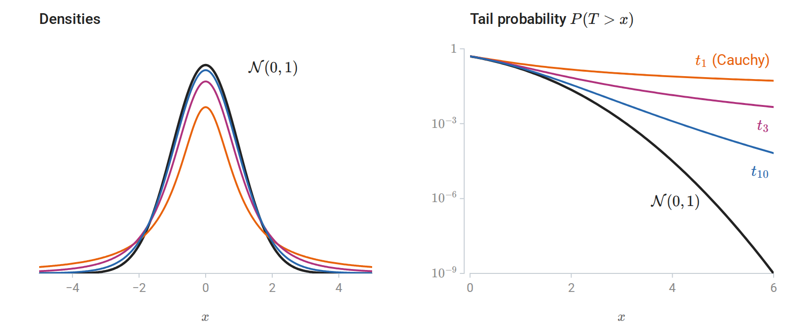

*Student $`t`$ densities approach the standard Normal as the degrees of freedom grow (left). On a logarithmic scale (right), their tail probabilities stay far above the Normal tail.*

For $`Z\sim\mathcal N(\mu,\sigma^2)`$, standardizing gives $`(Z-\mu)/\sigma\sim\mathcal N(0,1)`$. Thus $`P(Z\le z)=\Phi((z-\mu)/\sigma)`$, where $`\Phi`$ is the standard normal CDF: all one-dimensional normal probabilities reduce to one reference CDF. Write $`\Phi^{-1}(q)`$ for its $`q`$ quantile.

#### <a id="moment-generating-functions"></a>Moment generating functions

The **moment generating function** (MGF) of $`Z`$ is $`M_Z(s)=\mathbb E[e^{sZ}]`$, where this expectation is finite. When it is finite on an open interval around zero, it determines the distribution, and its derivatives at zero are the moments: $`M_Z^{(k)}(0)=\mathbb E[Z^k]`$. Its most useful property concerns sums. For independent $`X`$ and $`Y`$,

$$
M_{X+Y}(s)=\mathbb E[e^{sX}e^{sY}]=M_X(s)\,M_Y(s).
$$

| Distribution | $`M(s)`$ |
|---|---|
| $`\operatorname{Bernoulli}(q)`$ | $`1-q+qe^s`$ |
| $`\operatorname{Binomial}(n,q)`$ | $`(1-q+qe^s)^n`$ |
| $`\operatorname{Poisson}(\lambda)`$ | $`\exp\{\lambda(e^s-1)\}`$ |
| $`\operatorname{Gamma}(\alpha,\lambda)`$, $`s<\lambda`$ | $`\{\lambda/(\lambda-s)\}^\alpha`$ |
| $`\mathcal N(\mu,\sigma^2)`$ | $`\exp(\mu s+\sigma^2s^2/2)`$ |

Multiplying entries of this table proves several facts stated above: independent binomials with a common $`q`$ add their trial counts, Poisson counts add their rates, common-rate gammas add their shapes, and independent Normals add their means and variances. Not every distribution has an MGF that is finite near zero; the Cauchy and lognormal laws do not. The **characteristic function** $`\mathbb E[e^{isZ}]`$, with $`i=\sqrt{-1}`$, always exists and serves the same purposes; [Appendix C](#block-probability-appendix-c) uses it to prove the central limit theorem. Exponential moments also give the sharp tail bounds later in this chapter.

### <a id="functions-of-random-variables"></a>Functions of random variables

Many quantities are computed from other random variables: a total, a transformed measurement, a sorted value. Their distributions follow from the joint law by the probability bookkeeping above, and three cases recur: sums, smooth invertible maps, and order statistics.

#### <a id="sums-and-convolution"></a>Sums and convolution

If $`X`$ and $`Y`$ are independent with densities $`p_X`$ and $`p_Y`$, then $`S=X+Y`$ has density

$$
p_S(s)=\int p_X(x)\,p_Y(s-x)\,dx.
$$

This is the **convolution** of the two densities: to reach the total $`s`$, the first term takes some value $`x`$ and the second must equal $`s-x`$. For integer-valued variables, the integral becomes a sum. Two independent $`\operatorname{Unif}(0,1)`$ variables have the triangular density $`\min(s,2-s)`$ on $`[0,2]`$, and each further term smooths the density again. Repeated convolution is why sums of many independent terms become approximately Normal, the subject of the central limit theorem below. Moment generating functions turn convolution into multiplication, which is often the easier calculation.

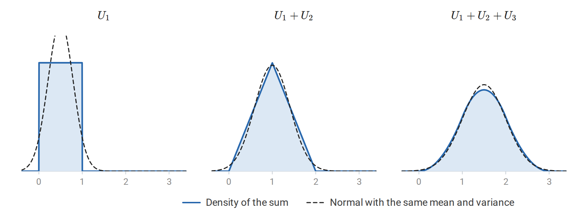

*Adding independent uniform variables smooths the density: two give a triangle, and three already lie close to the Normal density with the same mean and variance (dashed).*

#### <a id="change-of-variables"></a>Change of variables

Let $`Y=g(X)`$, where $`g`$ is strictly increasing and differentiable with a differentiable inverse. The events $`\{X\le x\}`$ and $`\{Y\le g(x)\}`$ coincide, so $`F_Y(y)=F_X(g^{-1}(y))`$. Differentiating gives

$$
p_Y(y)=p_X(g^{-1}(y))\left|\frac{d}{dy}g^{-1}(y)\right|
=\frac{p_X(x)}{|g'(x)|},\qquad x=g^{-1}(y).
$$

The absolute value makes the same formula hold for decreasing maps. The formula conserves probability: a short interval of length $`dx`$ near $`x`$ carries probability $`p_X(x)\,dx`$, and $`g`$ maps it to an interval of length $`|g'(x)|\,dx`$ near $`y`$. Where $`g`$ stretches intervals, density falls; where it compresses them, density rises.

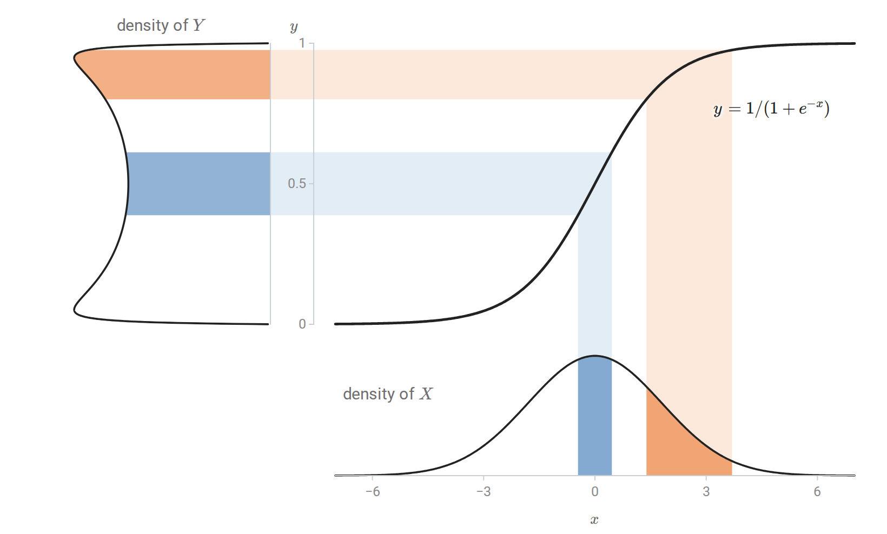

*Passing $`X\sim\mathcal N(0,1.8^2)`$ through the logistic function. The two shaded bands carry equal probability; the flat end of the curve squeezes its band of $`x`$ values into a short range of $`y`$, so the density of $`Y`$ piles up near $`0`$ and $`1`$.*

The same argument works in $`d`$ dimensions. Suppose $`g:\mathbb R^d\to\mathbb R^d`$ is invertible and continuously differentiable with a continuously differentiable inverse on the relevant open domains. With the numerator-layout Jacobian $`J_g(x)=(\partial g_i/\partial x_j)_{ij}`$, the transformed density is

$$
p_Y(y)=p_X(g^{-1}(y))\left|\det J_{g^{-1}}(y)\right|
=\frac{p_X(x)}{|\det J_g(x)|},\qquad x=g^{-1}(y).
$$

The determinant corrects for local volume change: a region expanded by a factor $`c`$ must have its density divided by $`c`$ to preserve probability. For a map with several inverse branches, add the contributions of the branches. For $`Y=X^2`$ and $`y>0`$,

$$
p_Y(y)=\frac{p_X(\sqrt y)+p_X(-\sqrt y)}{2\sqrt y}.
$$

These formulas assume an absolutely continuous $`X`$; point masses require separate accounting. Maps between spaces of different dimensions need an extra step, given in [Appendix B](#block-probability-appendix-b). Change of variables reappears with MAP estimates in Bayesian inference, and generative models use it to turn simple noise into complicated data.

#### <a id="the-cdf-transform-and-inverse-cdf-sampling"></a>The CDF transform and inverse-CDF sampling

The CDF is itself a useful transformation. If $`F`$ is continuous and $`X\sim F`$, then $`U=F(X)`$ is uniform on $`(0,1)`$: $`P(F(X)\le u)=u`$ for $`0<u<1`$. Conversely, let $`U\sim\operatorname{Unif}(0,1)`$ and let $`F^{-1}`$ be the generalized quantile function. Since $`F^{-1}(u)\le x`$ exactly when $`u\le F(x)`$,

$$
P\{F^{-1}(U)\le x\}=P\{U\le F(x)\}=F(x),
$$

so $`F^{-1}(U)`$ has CDF $`F`$. This converse holds for discrete and mixed laws as well. It is **inverse-CDF sampling**: uniform random numbers become draws from any distribution whose quantile function can be evaluated. For $`\operatorname{Exp}(\lambda)`$, solving $`u=1-e^{-\lambda x}`$ gives $`F^{-1}(u)=-\log(1-u)/\lambda`$.

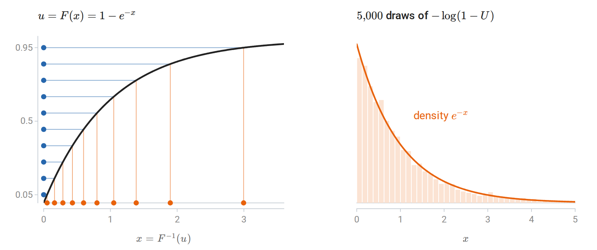

*Evenly spaced levels $`u`$ map through the Exp$`(1)`$ quantile function to values that crowd where the density is high (left). Applied to uniform random numbers, the same map produces exponential draws (right).*

#### <a id="order-statistics"></a>Order statistics

Sorting iid observations $`X_1,\ldots,X_n`$ with CDF $`F`$ gives the **order statistics** $`X_{(1)}\le\cdots\le X_{(n)}`$. The extremes have simple laws, because the maximum is at most $`x`$ exactly when every observation is:

$$
P(X_{(n)}\le x)=F(x)^n,\qquad P(X_{(1)}>x)=[1-F(x)]^n.
$$

When $`F`$ has density $`p`$, the $`k`$th smallest value has density

$$
p_{X_{(k)}}(x)=\frac{n!}{(k-1)!\,(n-k)!}\,F(x)^{k-1}[1-F(x)]^{n-k}\,p(x):
$$

$`k-1`$ observations fall below $`x`$, one falls at $`x`$, and $`n-k`$ fall above it, and the factorials count the ways to choose which. For uniform observations on $`(0,1)`$, $`X_{(k)}\sim\operatorname{Beta}(k,n+1-k)`$, with mean $`k/(n+1)`$. Sample medians and other sample quantiles are order statistics, and so is the sample maximum that estimates an unknown endpoint in [Appendix E](#block-probability-appendix-e). Gaps between order statistics, extremes, and records appear in [Appendix B](#block-probability-appendix-b).

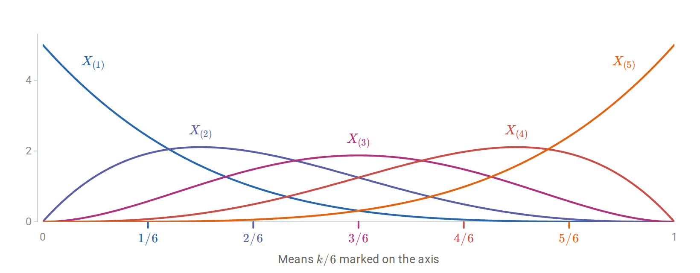

*The sorted values of five uniform observations have Beta$`(k,6-k)`$ densities, with means $`k/6`$.*

### <a id="gaussian-vectors-and-conditioning"></a>Gaussian vectors and conditioning

A vector $`Z\in\mathbb R^d`$ is **jointly Gaussian** if every linear combination $`a^\top Z`$ is Gaussian, allowing constant combinations. With mean $`\mu`$ and positive definite covariance $`\Sigma`$, its density is

$$
p(z)=\frac{\exp[-\tfrac12(z-\mu)^\top\Sigma^{-1}(z-\mu)]}
{(2\pi)^{d/2}\det(\Sigma)^{1/2}}.
$$

The quadratic form measures distance relative to the covariance: directions with greater variance are penalized less. If $`Z\sim\mathcal N(\mu,\Sigma)`$, then $`AZ+b\sim\mathcal N(A\mu+b,A\Sigma A^\top)`$. A singular covariance describes a Gaussian supported on a lower-dimensional affine subspace; the full-dimensional density above does not apply.

An explicit construction links this distribution to linear algebra. If $`G`$ has independent standard normal coordinates and $`LL^\top=\Sigma`$, then $`Z=\mu+LG`$ has the desired Gaussian law. For positive definite $`\Sigma`$, a Cholesky factor supplies such an $`L`$. The inverse map $`L^{-1}(Z-\mu)`$ produces independent standard normal coordinates. For general non-Gaussian vectors, the same covariance transformation can make the coordinates uncorrelated, but it need not make them independent.

Partition a jointly Gaussian vector and its parameters as

$$
\begin{pmatrix}X\\Y\end{pmatrix}
\sim\mathcal N\!\left(
\begin{pmatrix}\mu_X\\\mu_Y\end{pmatrix},
\begin{pmatrix}\Sigma_{XX}&\Sigma_{XY}\\\Sigma_{YX}&\Sigma_{YY}\end{pmatrix}
\right).
$$

If $`\Sigma_{XX}`$ is invertible, then

$$
Y\mid X=x\sim\mathcal N\!\left(
\mu_Y+\Sigma_{YX}\Sigma_{XX}^{-1}(x-\mu_X),
\Sigma_{YY}-\Sigma_{YX}\Sigma_{XX}^{-1}\Sigma_{XY}
\right).
$$

To see the structure, define $`A=\Sigma_{YX}\Sigma_{XX}^{-1}`$ and $`R=Y-\mu_Y-A(X-\mu_X)`$. Direct calculation gives $`\operatorname{Cov}(R,X)=0`$. Jointly Gaussian blocks with zero cross-covariance are independent, so conditioning on $`X`$ changes the affine term but leaves $`R`$ unchanged in distribution. Calculating $`\operatorname{Cov}(R)`$ gives the displayed conditional covariance. Thus Gaussian conditional means are affine and conditional variances do not depend on the observed value $`x`$.

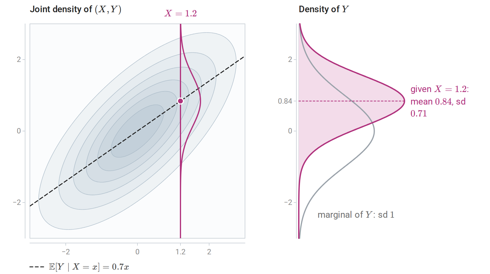

*A standard bivariate Normal pair with correlation $`0.7`$. Conditioning on $`X=1.2`$ takes a vertical slice: the conditional law of $`Y`$ is centered on the line $`\mathbb E[Y\mid X=x]=0.7x`$, and its standard deviation $`\sqrt{1-0.7^2}\approx0.71`$ is the same for every $`x`$ and smaller than the marginal standard deviation $`1`$.*

The joint-Gaussian assumption is essential: normal marginal distributions alone do not imply a joint Gaussian law. Murphy's [*Probabilistic Machine Learning: An Introduction*](https://probml.github.io/pml-book/book1.html), Chapters 2–3, develops these probability models and their multivariate structure.

### <a id="averages-limit-theorems-and-concentration"></a>Averages, limit theorems, and concentration

For iid $`Z_1,\ldots,Z_n`$ with mean $`\mu`$ and finite variance $`\sigma^2`$, let $`\bar Z_n=n^{-1}\sum_iZ_i`$. Then $`\mathbb E\bar Z_n=\mu`$ and $`\operatorname{Var}(\bar Z_n)=\sigma^2/n`$. These exact identities are the starting point for both asymptotic approximations and finite-sample bounds.

#### <a id="modes-of-convergence"></a>Modes of convergence

Limit theorems describe a sequence of random variables $`T_1,T_2,\ldots`$ that settles down, and there are several senses of settling:

- **almost surely**: the numbers $`T_n(\omega)`$ converge to $`T(\omega)`$ for every outcome $`\omega`$ in an event of probability one;
- **in probability**, $`T_n\xrightarrow{p}T`$: $`P(|T_n-T|>\varepsilon)\to0`$ for every $`\varepsilon>0`$;
- **in mean square**: $`\mathbb E[(T_n-T)^2]\to0`$, and more generally **in $`L^r`$** when $`\mathbb E|T_n-T|^r\to0`$;
- **in distribution**, $`T_n\Rightarrow T`$: the CDFs converge, $`F_{T_n}(t)\to F_T(t)`$, at every point $`t`$ where $`F_T`$ is continuous.

Almost-sure convergence and $`L^r`$ convergence each imply convergence in probability, which in turn implies convergence in distribution. None of the reverse implications holds in general, with one exception: convergence in distribution to a constant implies convergence in probability to it. Convergence in distribution concerns only the laws of the $`T_n`$, so the variables need not be defined on one probability space. [Appendix C](#block-probability-appendix-c) gives examples that separate these notions.

#### <a id="laws-of-large-numbers-and-the-central-limit-theorem"></a>Laws of large numbers and the central limit theorem

The iid **strong law of large numbers** states that

$$
\mathbb E|Z_1|<\infty
\quad\Longrightarrow\quad
\bar Z_n\longrightarrow\mu\quad\text{almost surely}.
$$

It implies convergence in probability, the **weak law of large numbers**. Finite variance is sufficient but not necessary for either law.

The iid **central limit theorem** (CLT), assuming $`0<\sigma^2<\infty`$, states

$$
\frac{\sqrt n(\bar Z_n-\mu)}{\sigma}\Rightarrow\mathcal N(0,1).
$$

The law of large numbers describes where the average settles. The CLT describes the distribution of its fluctuations after rescaling. It does not say that individual observations become Gaussian. Its usual practical approximation is $`\bar Z_n\approx\mathcal N(\mu,\sigma^2/n)`$, and there is no universal sample size at which this approximation becomes accurate. Strong skewness and rare large observations can require much larger samples.

The assumptions cannot be inferred from a large dataset alone. If $`Z_i=Z_1`$ for every $`i`$, the mean never changes, even if every marginal distribution has finite variance. At the other extreme, iid Cauchy observations remain Cauchy when averaged, so no finite population mean exists for the average to approach. These examples fail for different reasons: dependence in the first and lack of integrability in the second. Many extensions of the limit theorems allow controlled dependence or weaker tail assumptions, but their conclusions require corresponding hypotheses.

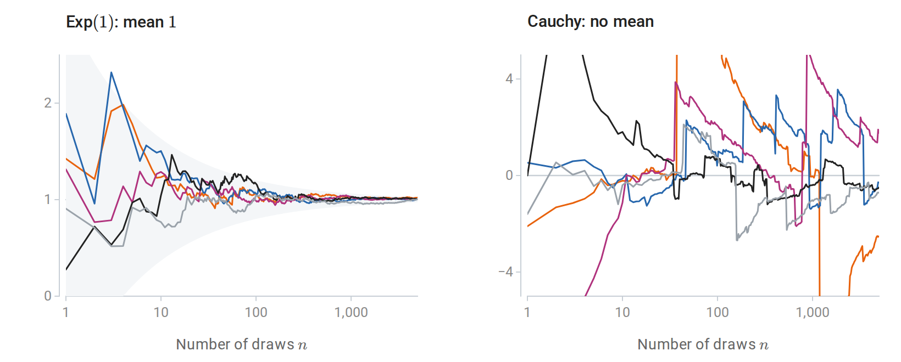

*Running averages of independent Exp$`(1)`$ draws settle at the mean $`1`$, inside a band that narrows like $`1/\sqrt n`$ (left). Running averages of Cauchy draws keep jumping, because the Cauchy law has no mean (right).*

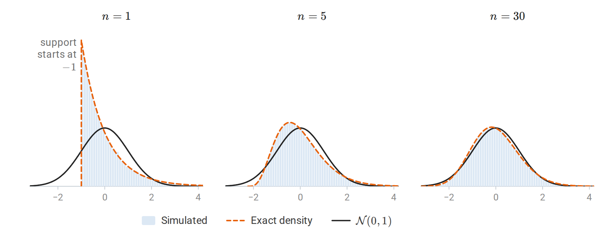

*The standardized mean $`T_n=\sqrt n(\bar Z_n-1)`$ of $`n`$ Exp$`(1)`$ observations loses its skew as $`n`$ grows. The histograms summarize 50,000 simulated datasets per panel; the dashed curves are the exact densities, and the solid curve is the standard Normal density.*

For $`n=1`$, no averaging has occurred: $`T_1=Z_1-1`$ is a shifted exponential variable, whose density jumps from zero to one at $`t=-1`$. For general $`n`$, the support begins at $`-\sqrt n`$, since every observation is nonnegative. The exact curves follow from $`\sum_iZ_i\sim\operatorname{Gamma}(n,1)`$; as $`n`$ grows, the standardized distribution becomes less skewed and its central region approaches the Normal curve.

The following simulation compares the central probability of standardized means with the standard normal value $`P(|G|\le1)\approx0.6827`$:

```python
import numpy as np

rng = np.random.default_rng(11)
repetitions = 30_000
for n in (1, 5, 30, 100):
    samples = rng.exponential(scale=1.0, size=(repetitions, n))
    standardized = np.sqrt(n) * (samples.mean(axis=1) - 1.0)
    print(n, "central probability:", np.mean(np.abs(standardized) <= 1))
```

Here the exponential mean and standard deviation both equal one. Each row is a new sample; variation across rows approximates a sampling distribution.

#### <a id="bounds-with-explicit-assumptions"></a>Bounds with explicit assumptions

The limit theorems describe what happens as the sample grows. The inequalities below hold at every sample size under stated assumptions, and each follows from Markov's inequality.

**Markov's inequality.** For $`W\ge0`$ and $`a>0`$,

$$
P(W\ge a)\le\frac{\mathbb EW}{a}.
$$

The proof is $`W\ge a\mathbf1_{\{W\ge a\}}`$, followed by expectation. Applying this to $`W=(Z-\mu)^2`$ gives **Chebyshev's inequality**:

$$
P(|Z-\mu|\ge\varepsilon)\le\frac{\sigma^2}{\varepsilon^2}.
$$

For iid averages, it gives $`P(|\bar Z_n-\mu|\ge\varepsilon)\le\sigma^2/(n\varepsilon^2)`$, proving the weak law when the variance is finite. These bounds hold for every sample size but can be loose. [Appendix C](#block-probability-appendix-c) gives a one-sided refinement, Cantelli's inequality.

**Chernoff bounds.** Markov's inequality applied to $`e^{sW}`$ and to $`e^{-sW}`$ with $`s>0`$ gives

$$
P(W\ge t)\le\inf_{s>0}e^{-st}M_W(s),
\qquad
P(W\le t)\le\inf_{s>0}e^{st}M_W(-s).
$$

For a sum of independent terms, the MGF is a product, so these bounds decay exponentially in the number of terms. For $`W\sim\operatorname{Binomial}(n,q)`$ with mean $`\mu=nq`$, bounding each factor $`1-q+qe^s`$ of the MGF by $`e^{q(e^s-1)}`$ and then minimizing gives

$$
\begin{aligned}
P\{W\ge(1+\delta)\mu\}&\le\left(\frac{e^\delta}{(1+\delta)^{1+\delta}}\right)^{\mu}, &&\delta>0,\\
P\{W\le(1-\delta)\mu\}&\le\left(\frac{e^{-\delta}}{(1-\delta)^{1-\delta}}\right)^{\mu}\le e^{-\mu\delta^2/2}, &&0<\delta<1.
\end{aligned}
$$

With $`n=1000`$ and $`q=0.01`$, the probability of at least $`20`$ events, twice the mean of $`10`$, is at most $`(e/4)^{10}\approx0.021`$. Chebyshev's inequality gives only $`9.9/10^2\approx0.099`$, and the exact probability is about $`0.0033`$. Near the mean, the exponent of a Chernoff bound is close to the Gaussian exponent $`t^2/(2\sigma^2)`$ of the Normal approximation. Far from the mean it can grow much more slowly, and the Normal approximation then understates the tail by orders of magnitude.

**Hoeffding's inequality.** If $`Z_i`$ are independent and $`a_i\le Z_i\le b_i`$ almost surely, then for $`t>0`$ and $`\sum_i(b_i-a_i)^2>0`$,

$$
P\!\left(\left|\sum_i(Z_i-\mathbb EZ_i)\right|\ge t\right)
\le2\exp\!\left(-\frac{2t^2}{\sum_i(b_i-a_i)^2}\right).
$$

For iid observations in $`[0,1]`$, this becomes $`P(|\bar Z_n-\mu|\ge\varepsilon)\le2e^{-2n\varepsilon^2}`$. Thus $`n\ge\log(2/\alpha)/(2\varepsilon^2)`$ guarantees an error below $`\varepsilon`$ with probability at least $`1-\alpha`$. Unlike the CLT approximation, this conclusion is a finite-sample guarantee under the stated boundedness and independence assumptions. Evaluating a fixed classifier's zero-one loss on iid test examples fits this setting; choosing the classifier using the same examples changes the dependence structure and needs additional analysis.

Hoeffding's inequality is a Chernoff bound that uses only the ranges of the summands, so it needs no other knowledge of their distributions. The price is that it is far from tight when the variances are much smaller than the ranges allow, as for indicators of rare events. [Appendix C](#block-probability-appendix-c) proves it, compares it with the Chernoff bound computed from the exact distribution, describes the Gaussian and exponential regimes of Chernoff bounds, and gives bounds that also use the variances of the summands, such as Bernstein's inequality, together with their extensions to random matrices.

### <a id="monte-carlo-integration"></a>Monte Carlo integration

For an expectation $`I=\mathbb E[h(Z)]`$ that is difficult to integrate analytically, **Monte Carlo** draws iid samples and computes $`\widehat I_n=n^{-1}\sum_i h(Z_i)`$. If $`h(Z)`$ has finite variance $`v`$, then

$$
\mathbb E\widehat I_n=I,\qquad
\operatorname{Var}(\widehat I_n)=v/n.
$$

The usual error scale is therefore $`\sqrt{v/n}`$. Multiplying the sample count by four halves this scale. The exponent $`n^{-1/2}`$ does not depend on the dimension of $`Z`$, although the variance and cost of generating samples can depend strongly on dimension.

For example, $`I=\int_0^1e^{-u^2}\,du=\mathbb E[e^{-U^2}]`$ for $`U\sim\operatorname{Unif}(0,1)`$:

```python
import numpy as np

rng = np.random.default_rng(19)
u = rng.uniform(size=100_000)
values = np.exp(-(u ** 2))
estimate = values.mean()
estimated_se = values.std(ddof=1) / np.sqrt(values.size)
print("integral estimate:", estimate)
print("estimated standard error:", estimated_se)
```

The **standard error** describes variation of the estimate across repeated simulations. It differs from the standard deviation of the integrand values themselves. This distinction carries directly into statistics, where the observations come from data collection and their law is unknown.

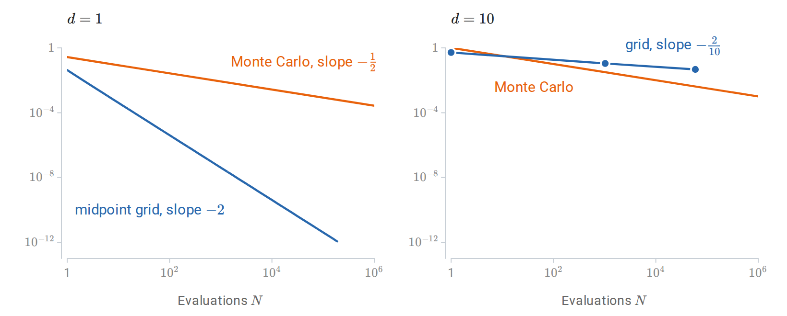

*Relative error in integrating $`\prod_je^{-u_j^2}`$ over the unit cube in $`d=1`$ and $`d=10`$ dimensions. A midpoint grid with $`m`$ points per coordinate uses $`N=m^d`$ evaluations, and its error falls like $`N^{-2/d}`$; the Monte Carlo root-mean-square error falls like $`N^{-1/2}`$ in every dimension.*

When the integrand is concentrated where $`Z`$ rarely falls, plain Monte Carlo wastes most of its draws. **Importance sampling** draws from a proposal density $`q`$ instead and reweights:

$$
\mathbb E_p[h(Z)]=\mathbb E_q\!\left[h(Z)\frac{p(Z)}{q(Z)}\right]
\approx\frac1n\sum_{i=1}^n h(Z_i)\frac{p(Z_i)}{q(Z_i)},
\qquad Z_i\overset{\mathrm{iid}}{\sim}q.
$$

The estimator is unbiased when $`q>0`$ wherever $`h\,p\ne0`$. To estimate the Normal tail probability $`P(G>4)\approx3.2\times10^{-5}`$, plain sampling needs about $`32{,}000`$ draws per tail event, while drawing from $`\mathcal N(4,1)`$ puts half the draws in the tail. The weighted terms $`h\,p/q`$ can have a large or infinite variance when $`q`$ has lighter tails than $`|h|\,p`$, and the estimate then becomes unstable. The same reweighting reappears in approximate inference and in evaluating one policy with data collected under another.

Simulation also distinguishes uncertainty about data from computational error. If a fully specified model permits sampling, Monte Carlo error can be reduced by drawing more samples from that model. More simulated data cannot correct a model that poorly represents the real process. In statistical applications, the sampling distribution of an estimator may itself be approximated by simulation; there are then two layers of repetition, one corresponding to hypothetical datasets and one to the computer's finite approximation of that distribution.

## <a id="statistics"></a>Statistics

### <a id="data-models-and-inferential-targets"></a>Data, models, and inferential targets

Probability describes observations generated from a specified law. **Statistical inference** uses observations to learn about a law that is incompletely known. Estimation, confidence intervals, tests, and posterior distributions answer different versions of this question. Their interpretation depends on the population of interest and on how the data were obtained.

A **population** is the collection of units or possible observations to which a conclusion refers. It can be finite, such as the messages received during one month, or represented by a distribution for possible observations. A **sample** is the collection actually observed. Write

$$
D=(Z_1,\ldots,Z_n),\qquad Z_i\sim P_*,
$$

where $`P_\ast`$ is the true population distribution. Chapter 1 writes this distribution as $`\mathcal D`$ when it defines population risk; this chapter uses $`P_\ast`$ to keep it visibly distinct from the dataset $`D`$. Capital letters denote random observations; $`z_i`$ denotes a realized value. The dataset $`D`$ is random before collection. After collection, its realized values are fixed, although the same symbol is often used when the distinction is clear. An observation may be a scalar, a vector, or an input–target pair $`Z_i=(X_i,Y_i)`$.

#### <a id="sampling-assumptions-and-study-design"></a>Sampling assumptions and study design

The assumption $`Z_1,\ldots,Z_n\overset{\mathrm{iid}}{\sim}P_\ast`$ says both that observations are independent and that they have the same distribution. Neither follows from storing observations in separate rows. Two measurements on one person can be dependent. Observations collected before and after a change may have different distributions. A random sample from one population need not represent another population.

Sampling design determines what the dataset can reveal. Uniform random sampling from a finite population produces a different joint law from sampling independently with replacement. Unequal inclusion probabilities can require weighting. Repeated measurements, clustered samples, and time series require uncertainty calculations that retain their dependence. Increasing the number of rows does not eliminate selection bias or make correlated observations independent.

Random **sampling** supports inference from the sample to a population. Random **assignment** of treatments supports causal comparisons within an experiment. These are different sources of randomness. Observational associations can be estimated precisely without identifying a causal effect. For example, the difference between the mean outcomes of two self-selected groups is a descriptive contrast; interpreting it as the effect of group membership requires additional assumptions.

#### <a id="models-and-identifiability"></a>Models and identifiability

A **statistical model** is a family of candidate probability laws,

$$
\mathcal P=\{P_\theta:\theta\in\Theta\}.
$$

The parameter $`\theta`$ indexes a law, and $`p_\theta`$ denotes its mass function or density. A model with a fixed, finite-dimensional parameter space is **parametric**. A **nonparametric** model allows an unknown distribution or function without a fixed finite-dimensional restriction. A **semiparametric** model contains a finite-dimensional parameter of interest together with an infinite-dimensional component. All three kinds impose assumptions.

A model is **correctly specified** if $`P_\ast=P_{\theta_\ast}`$ for some $`\theta_\ast\in\Theta`$. Otherwise it is **misspecified**. A model is **identifiable** when $`P_{\theta_1}=P_{\theta_2}`$ implies $`\theta_1=\theta_2`$. If two parameter values generate exactly the same observable distribution, no amount of data can distinguish them. A particular target can nevertheless be identifiable even when the full parameter is not: only parameter values that give different target values must be distinguishable.

Suppose the model is $`Z\sim\mathcal N(a+b,1)`$. The distribution identifies $`a+b`$, but it cannot identify $`a`$ and $`b`$ separately. This is a property of the model, rather than a failure of an estimation algorithm.

#### <a id="estimands-statistics-and-estimators"></a>Estimands, statistics, and estimators

An **estimand** is the quantity the analysis aims to learn. It can be a parameter or a functional of a distribution:

$$
\tau=T(P_*).
$$

Examples are a population mean, a quantile, the difference between two means, or the expected loss of a fixed predictor. Defining the population and the estimand comes before selecting a formula for estimating it.

| Object | Meaning | Bernoulli example |
| --- | --- | --- |
| Estimand $`\tau`$ | Unknown population quantity | Success probability $`p`$ |
| Statistic $`t(D)`$ | Computable function of the sample, without unknown parameters | $`\sum_i Z_i`$ or $`\overline Z`$ |
| Estimator $`\widehat\tau=t(D)`$ | Statistic used to estimate a specified target | $`\widehat p=\overline Z`$ |
| Estimate $`t(z_1,\ldots,z_n)`$ | Realized numerical value | $`18/100=0.18`$ |

The same statistic can serve different purposes. A sample average estimates a probability for Bernoulli data, a rate for Poisson counts, or a mean for general numerical observations. The algebra can be identical while the units, sampling distribution, and interpretation change. A **nuisance parameter** is an unknown component needed to describe the model but not itself the target; the unknown variance is a nuisance parameter when estimating a Normal mean.

**Point estimation** returns one value. **Interval estimation** returns a range with an uncertainty interpretation. A statistical procedure can also return a test decision or a probability distribution. Frequentist inference evaluates procedures through repeated sampling with the population law held fixed. Bayesian inference introduces a probability distribution for unknown parameters and conditions it on the observed data. The likelihood connects both approaches.

### <a id="empirical-distributions-and-the-plug-in-principle"></a>Empirical distributions and the plug-in principle

The **empirical distribution** places probability $`1/n`$ on each observed value, counting repetitions:

$$
\widehat P_n=\frac1n\sum_{i=1}^n\delta_{Z_i},
$$

where $`\delta_z`$ is the point mass at $`z`$. It replaces an unknown distribution by a distribution constructed entirely from the sample. For scalar observations, its cumulative distribution function is

$$
\widehat F_n(x)=\frac1n\sum_{i=1}^n\mathbf1\{Z_i\le x\}.
$$

Under iid sampling, each indicator is Bernoulli with probability $`F_\ast(x)`$, so, at each fixed $`x`$,

$$
\mathbb E[\widehat F_n(x)]=F_*(x),\qquad
\operatorname{Var}(\widehat F_n(x))=\frac{F_*(x)(1-F_*(x))}{n}.
$$

The law of large numbers gives pointwise convergence. The Glivenko–Cantelli theorem strengthens this to simultaneous convergence over all thresholds: $`\sup_x|\widehat F_n(x)-F_\ast(x)|\to0`$ almost surely. Estimating a distribution therefore has a concrete meaning even without fitting a named family.

The **Dvoretzky–Kiefer–Wolfowitz inequality** makes the uniform convergence quantitative at every sample size:

$$
P\Big(\sup_x|\widehat F_n(x)-F_*(x)|>\varepsilon\Big)\le2e^{-2n\varepsilon^2}.
$$

Setting the right side equal to $`\alpha`$ gives a band of half-width $`\sqrt{\log(2/\alpha)/(2n)}`$ around $`\widehat F_n`$ that contains the entire population CDF with probability at least $`1-\alpha`$.

The **plug-in principle** estimates $`T(P_\ast)`$ by $`T(\widehat P_n)`$. For the population mean and variance, it gives

$$
\widehat\mu=\overline Z=\frac1n\sum_i Z_i,
\qquad
\widehat v_n=\frac1n\sum_i(Z_i-\overline Z)^2.
$$

The plug-in estimate of a quantile $`F_\ast^{-1}(q)`$ is $`\widehat F_n^{-1}(q)`$, using the generalized inverse defined above. For observations $`2,4,4,7,10`$, this gives median $`4`$ and $`0.8`$-quantile $`7`$. Software sometimes interpolates between order statistics, so finite-sample quantile conventions can differ.

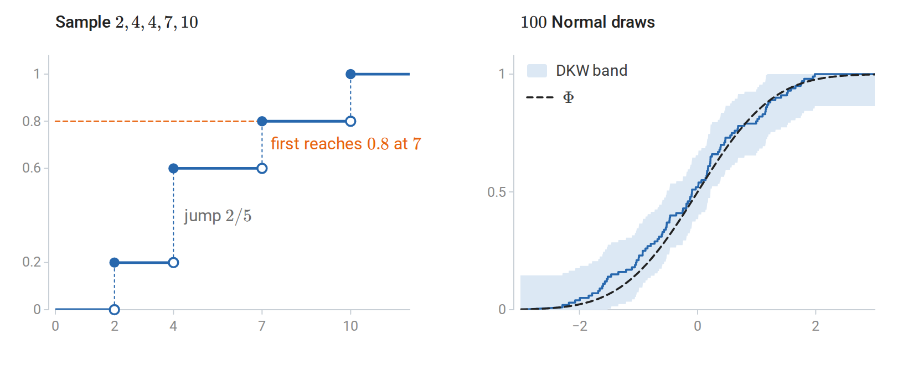

*The empirical CDF of $`2,4,4,7,10`$ jumps by $`1/5`$ at each value, by $`2/5`$ at the repeated value $`4`$, and first reaches $`0.8`$ at $`7`$ (left). For 100 standard Normal draws, the 95% DKW band of half-width $`0.136`$ contains the whole population CDF (right).*

The target determines which summary is meaningful. The data $`0,0,1,1,100`$ have mean $`20.4`$ and median $`1`$. The median is less sensitive to the largest observation, but it estimates a different population quantity. Robustness describes stability under departures from a model or contamination; it does not make different estimands interchangeable. The empirical-distribution viewpoint, estimation, and testing are developed together in Wasserman's [*All of Statistics*](https://www.stat.cmu.edu/~larry/all-of-statistics/), especially Chapters 6–10.

### <a id="sampling-distributions-and-estimator-accuracy"></a>Sampling distributions and estimator accuracy

The **sampling distribution** of $`\widehat\tau=t(D)`$ is its distribution over repeated datasets generated by the sampling model. It differs from the distribution of an individual observation and from the empirical distribution within one dataset. These three distributions answer different questions: variation among units, variation among estimates, and the observed frequencies in one sample.

#### <a id="bias-variance-and-mean-squared-error"></a>Bias, variance, and mean squared error

For a scalar estimand $`\tau`$ and an estimator with finite second moment, define

$$
\operatorname{Bias}(\widehat\tau)=\mathbb E[\widehat\tau]-\tau,
\qquad
\operatorname{SE}(\widehat\tau)=\sqrt{\operatorname{Var}(\widehat\tau)}.
$$

The expectation holds the population law fixed and averages over datasets. An estimator is **unbiased** if this bias is zero throughout the model. Its **standard error** is the standard deviation of its sampling distribution. An **estimated standard error** replaces unknown features of that distribution by estimates.

The **mean squared error** is

$$
\operatorname{MSE}(\widehat\tau)
=\mathbb E[(\widehat\tau-\tau)^2]
=\operatorname{Var}(\widehat\tau)
+\operatorname{Bias}(\widehat\tau)^2.
$$

To obtain the decomposition, write $`\widehat\tau-\tau=(\widehat\tau-\mathbb E\widehat\tau)+(\mathbb E\widehat\tau-\tau)`$, expand the square, and observe that the cross term has expectation zero. Bias and variance contribute differently. A modest increase in bias can be worthwhile if it produces a larger decrease in variance.

For iid observations with mean $`\mu`$ and finite variance $`\sigma^2`$,

$$
\mathbb E[\overline Z]=\mu,
\qquad
\operatorname{Var}(\overline Z)=\frac{\sigma^2}{n}.
$$

The observation standard deviation $`\sigma`$ measures variation among individual values; the standard error $`\sigma/\sqrt n`$ measures variation among sample means. Multiplying the sample size by four halves this standard error. For dependent observations, however,

$$
\operatorname{Var}(\overline Z)
=\frac1{n^2}\sum_{i,j=1}^n\operatorname{Cov}(Z_i,Z_j),
$$

so positive correlations can substantially increase uncertainty.

The plug-in variance $`\widehat v_n`$ is biased. The identity

$$
\sum_i(Z_i-\overline Z)^2
=\sum_i(Z_i-\mu)^2-n(\overline Z-\mu)^2
$$

gives $`\mathbb E[\widehat v_n]=(n-1)\sigma^2/n`$. Thus

$$
S^2=\frac1{n-1}\sum_i(Z_i-\overline Z)^2
$$

is unbiased when $`n\ge2`$. Both denominators yield consistent variance estimators. Unbiasedness is one criterion, rather than a universal reason to prefer one estimator.

For iid vector observations $`Z_i\in\mathbb R^d`$ with finite second moments, the corresponding **sample covariance matrix** is

$$
\widehat\Sigma=\frac1{n-1}\sum_{i=1}^n(Z_i-\overline Z)(Z_i-\overline Z)^\top.
$$

It is unbiased for the population covariance matrix. The empirical-distribution plug-in version uses denominator $`n`$. If the centered observations form the rows of a matrix $`X_c\in\mathbb R^{n\times d}`$, then $`\widehat\Sigma=X_c^\top X_c/(n-1)`$. The **sample correlation** between coordinates $`j`$ and $`k`$ is $`\widehat\Sigma_{jk}/\sqrt{\widehat\Sigma_{jj}\widehat\Sigma_{kk}}`$ when both sample variances are positive. These estimates summarize variation and linear association within the observed sample; their accuracy depends on the sampling assumptions and sample size.

A scalar example illustrates the bias–variance tradeoff. If $`\widehat p=K/n`$ with $`K\sim\operatorname{Binomial}(n,p)`$, the smoothed estimator $`(K+1)/(n+2)`$ has bias $`(1-2p)/(n+2)`$ and variance $`np(1-p)/(n+2)^2`$. Comparing the two mean squared errors shows that smoothing helps exactly when $`p(1-p)>n/[4(2n+1)]`$: for a central range of $`p`$ the reduction in variance outweighs the squared bias, while near $`p=0`$ or $`1`$ the sample proportion is better.

```python
import numpy as np

rng = np.random.default_rng(7)
n, repetitions = 20, 100_000
for p in (0.02, 0.5):
    counts = rng.binomial(n, p, size=repetitions)
    estimators = {"sample proportion": counts / n,
                  "smoothed": (counts + 1) / (n + 2)}
    for name, estimates in estimators.items():
        bias = estimates.mean() - p
        variance = estimates.var()  # empirical distribution denominator
        mse = np.mean((estimates - p) ** 2)
        assert np.isclose(mse, variance + bias**2)
        print(p, name, "bias", round(bias, 4), "MSE", round(mse, 5))
```

Each entry of `estimates` comes from a fresh dataset. The simulation therefore approximates a sampling distribution, rather than the spread of observations in one sample.

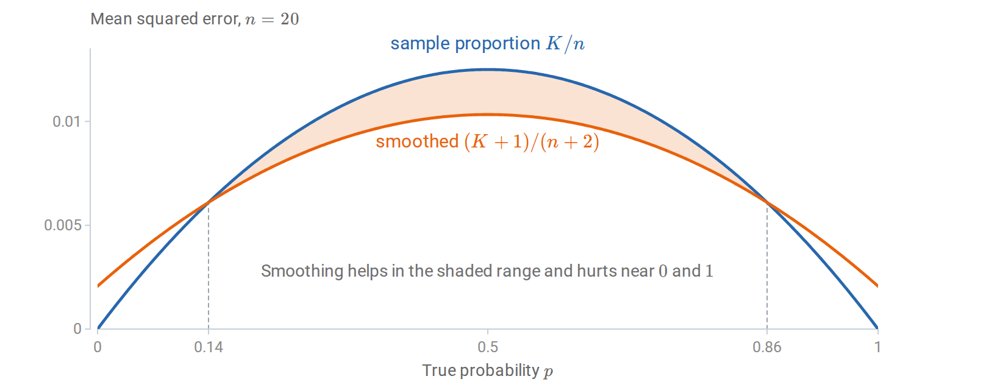

*With $`n=20`$, smoothing toward $`1/2`$ lowers the mean squared error for $`0.14<p<0.86`$ and raises it near the endpoints.*

#### <a id="exact-distributions-for-normal-samples"></a>Exact distributions for Normal samples

Most sampling distributions are known only approximately, but Normal samples have exact results at every sample size. For iid $`\mathcal N(\mu,\sigma^2)`$ observations and $`n\ge2`$,

$$
\overline Z\sim\mathcal N\Big(\mu,\frac{\sigma^2}{n}\Big),
\qquad
\frac{(n-1)S^2}{\sigma^2}\sim\chi^2_{n-1},
\qquad \overline Z\ \text{and}\ S^2\ \text{are independent}.
$$

There is a geometric reason for these identities. Standardize the sample to a vector $`G=(Z-\mu\mathbf1)/\sigma`$ with independent standard Normal coordinates, where $`Z=(Z_1,\ldots,Z_n)^\top`$ and $`\mathbf1`$ is the all-ones vector. Its projection onto the direction $`\mathbf1/\sqrt n`$ is $`\sqrt n(\overline Z-\mu)/\sigma`$. Its orthogonal projection onto the $`(n-1)`$-dimensional residual subspace has squared norm $`\sum_i(Z_i-\overline Z)^2/\sigma^2`$. Orthogonal Gaussian components are independent, and the residual squared norm is a sum of $`n-1`$ independent squared standard Normals. This gives both the chi-square law and the independence.

Consequently, the **studentized mean** has an exact Student $`t`$ distribution:

$$
\frac{\overline Z-\mu}{S/\sqrt n}\sim t_{n-1},
$$

since it is a standard Normal divided by the square root of an independent $`\chi^2_{n-1}/(n-1)`$. The independence of $`\overline Z`$ and $`S^2`$ is special to Normal samples, and the same projection argument gives the exact theory of Normal linear regression later in the chapter. Write $`z_q=\Phi^{-1}(q)`$, $`t_{\nu,q}`$, and $`\chi^2_{\nu,q}`$ for the $`q`$ quantiles of the standard Normal, $`t_\nu`$, and $`\chi^2_\nu`$ distributions.

#### <a id="consistency-asymptotic-normality-and-the-delta-method"></a>Consistency, asymptotic normality, and the delta method

An estimator sequence is **consistent** if $`\widehat\tau_n\xrightarrow{p}\tau`$. This is a large-sample property. Unbiasedness is a statement about an expectation at a fixed sample size. An unbiased estimator need not become more accurate: using $`Z_1`$ to estimate $`\mu`$ is unbiased but ignores every additional observation. Conversely, $`\widehat v_n`$ is biased for each finite $`n`$ and consistent.

An estimator is **asymptotically Normal at rate $`\sqrt n`$** if

$$
\sqrt n(\widehat\tau_n-\tau)\Rightarrow\mathcal N(0,V),
$$

with $`0<V<\infty`$. The asymptotic variance $`V`$ is the variance of the scaled limiting distribution. The resulting Normal approximation has variance $`V/n`$; the stronger conclusion $`n\operatorname{Var}(\widehat\tau_n)\to V`$ requires additional control of moments. **Slutsky's theorem** allows a quantity converging in probability to a constant to replace that constant in sums, products, and ratios of distributional limits, with a nonzero limiting denominator for ratios. No independence between the converging quantities is required. If $`\widehat V\xrightarrow{p}V`$, it gives

$$
\frac{\widehat\tau_n-\tau}{\sqrt{\widehat V/n}}
\Rightarrow\mathcal N(0,1).
$$

This **studentization** replaces an unknown scale by a consistent estimate. It is the basis of many intervals and tests. A large sample alone does not guarantee the approximation: finite variance, suitable dependence assumptions, and regularity of the estimator matter.

The **delta method** applies a local linear approximation to a random estimator. If $`\widehat\theta_n\in\mathbb R^d`$ satisfies

$$
\sqrt n(\widehat\theta_n-\theta)\Rightarrow\mathcal N(0,V)
$$

and $`g:\mathbb R^d\to\mathbb R^k`$ is differentiable at $`\theta`$, then

$$
\sqrt n\{g(\widehat\theta_n)-g(\theta)\}
\Rightarrow
\mathcal N\!\left(0,J_g(\theta)VJ_g(\theta)^\top\right).
$$

Here the numerator-layout Jacobian has shape $`k\times d`$. The result follows by expanding $`g(\widehat\theta_n)-g(\theta)`$ as $`J_g(\theta)(\widehat\theta_n-\theta)`$ plus a remainder negligible on the $`n^{-1/2}`$ scale. For scalar $`g`$, the variance is $`\nabla g(\theta)^\top V\nabla g(\theta)`$, with a column gradient.

For a Bernoulli proportion with fixed $`0<p<1`$ and $`g(p)=\log[p/(1-p)]`$, $`g'(p)=1/[p(1-p)]`$. The delta method gives the **asymptotic standard-error approximation**

$$
\operatorname{SE}_{\mathrm{asymp}}\{g(\widehat p)\}
\approx\frac1{\sqrt{np(1-p)}}.
$$

Replacing $`p`$ by $`\widehat p`$ gives an estimated standard error when $`0<\widehat p<1`$; at $`\widehat p=0`$ or $`1`$ the log-odds estimate is undefined. If $`J_g(\theta)=0`$, the first-order limit is degenerate and a higher-order expansion is needed.

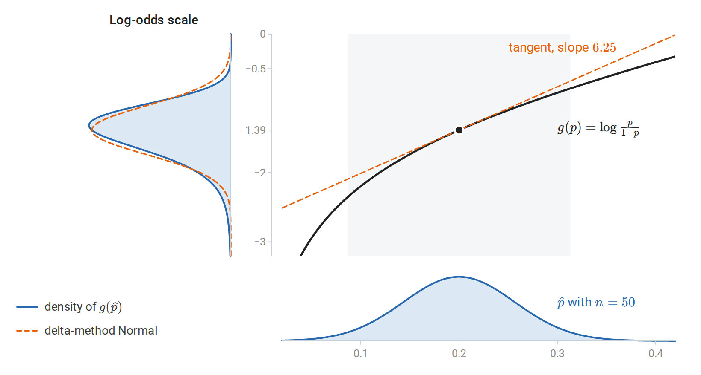

*The delta method for the log-odds of a proportion near $`p=0.2`$. Over the spread of $`\widehat p`$ the logit is nearly linear, so the log-odds are approximately Normal, with standard deviation multiplied by the slope $`1/[p(1-p)]=6.25`$.*

The sample median is asymptotically Normal as well. If the population has a unique median $`m`$ at which its density $`p_Z`$ is continuous and positive, then $`\sqrt n(\widehat m_n-m)\Rightarrow\mathcal N(0,1/[4p_Z(m)^2])`$. The variance depends on the density at the median: a flat density there means that small changes in the data move the median far.

### <a id="constructing-point-estimators"></a>Constructing point estimators

Maximum likelihood is the main general-purpose way to construct estimators, and the one most directly connected to training with log loss. The method of moments, which matches sample averages to model expectations, is a simpler alternative described in [Appendix E](#block-probability-appendix-e).

#### <a id="likelihood-and-maximum-likelihood"></a>Likelihood and maximum likelihood

The **likelihood** evaluates a model on the observed data, treating the parameter as variable. Under iid sampling,

$$
L_n(\theta)=\prod_{i=1}^n p_\theta(z_i),
\qquad
\log L_n(\theta)=\sum_{i=1}^n\log p_\theta(z_i).
$$

For dependent observations, the appropriate joint density or conditional factorization replaces the iid product. $`L_n`$ is not a probability distribution over $`\theta`$ and need not integrate to one. Likelihood values are compared across parameters for the same observed data. Multiplying every likelihood value by the same positive, parameter-independent constant changes none of those comparisons.

The **maximum likelihood estimator** satisfies

$$
\widehat\theta_{\mathrm{MLE}}
\in\operatorname*{arg\,max}_{\theta\in\Theta}\log L_n(\theta).
$$

A maximum can be nonunique or fail to exist. Solving a derivative equation finds an interior stationary point, which still must be checked against boundaries and other candidates. Minimizing average negative log-likelihood gives the same maximizer; this is the connection between likelihood estimation and empirical risk minimization with log loss. Here $`L_n`$ denotes likelihood, whereas $`\ell(y,a)`$ elsewhere denotes a prediction loss.

For Bernoulli observations, let $`k=\sum_i z_i`$. Then

$$
\log L_n(p)=k\log p+(n-k)\log(1-p),
\qquad
\frac{d}{dp}\log L_n(p)=\frac{k}{p}-\frac{n-k}{1-p}.
$$

For $`0<k<n`$, setting the derivative to zero gives $`\widehat p=k/n`$. The log-likelihood is strictly concave on $`(0,1)`$, so this is its unique maximum. If all observations are failures or all are successes, the maximum is respectively $`0`$ or $`1`$ when those endpoints belong to the parameter space.

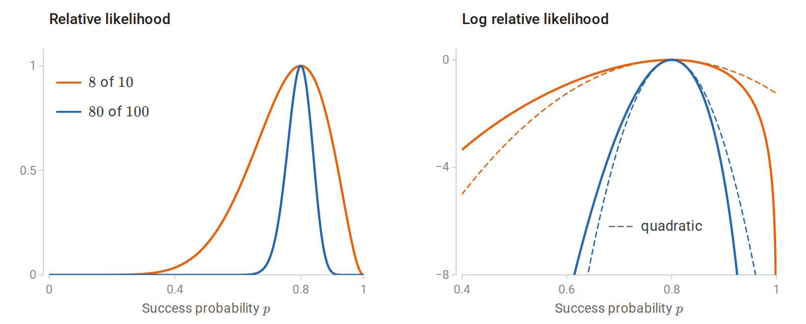

*Eight successes in ten trials and eighty in a hundred give the same estimate, $`0.8`$, but the larger sample's likelihood is more sharply peaked; each curve is divided by its maximum. On the log scale (right), dashed parabolas share each curve's peak and curvature, and that curvature is the observed information of the next subsection.*

For iid $`\mathcal N(\mu,v)`$ observations, writing $`v=\sigma^2>0`$ for the variance,

$$
\log L_n(\mu,v)
=-\frac n2\log(2\pi v)-\frac1{2v}\sum_i(z_i-\mu)^2.
$$

Differentiating first in $`\mu`$ gives $`\widehat\mu=\overline z`$. Substituting that value and differentiating in $`v`$ gives $`\widehat v=n^{-1}\sum_i(z_i-\overline z)^2`$, provided the residual sum of squares is positive. The MLE uses denominator $`n`$ because likelihood maximization and unbiasedness are different requirements. If all observations coincide, the likelihood increases without bound as $`v\downarrow0`$, so this model has no positive-variance MLE for that dataset.

MLE is equivariant under one-to-one reparameterizations: if $`\phi=g(\theta)`$, its MLE is $`g(\widehat\theta)`$. Likelihood maximization identifies a fitted probability law, and changing its coordinates does not change that law.

For iid $`\operatorname{Exp}(\lambda)`$ observations, $`\log L_n(\lambda)=n\log\lambda-\lambda\sum_iz_i`$, which is maximized at $`\widehat\lambda=1/\overline z`$. By equivariance, the MLE of the mean $`1/\lambda`$ is $`\overline z`$.

The Bernoulli, Normal, and exponential models above are **exponential families**, as are the Poisson and several other families of this chapter. Their likelihoods depend on the data only through a low-dimensional sufficient statistic, such as $`\sum_iz_i`$, and their maximum likelihood estimates set the model's expected value of that statistic equal to its sample average. [Appendix E](#block-probability-appendix-e) develops sufficiency and exponential families.

Why should maximizing likelihood recover the parameter? By the law of large numbers, $`n^{-1}\log L_n(\theta)\to\mathbb E_{P_\ast}[\log p_\theta(Z)]`$ for each fixed $`\theta`$. When the model is correct, $`P_\ast=P_{\theta_\ast}`$, and

$$
\mathbb E_{\theta_*}[\log p_{\theta_*}(Z)]-\mathbb E_{\theta_*}[\log p_\theta(Z)]
=D_{\mathrm{KL}}(P_{\theta_*}\,\|\,P_\theta)\ge0,
$$

the Kullback–Leibler divergence of chapter 5. For an identifiable model it is zero only at $`\theta=\theta_\ast`$, so the limiting average log-likelihood is maximized at the true parameter. Turning this pointwise limit into **consistency** of the maximizer requires control that is uniform over $`\theta`$, which standard regularity conditions supply.

#### <a id="score-information-and-asymptotic-uncertainty"></a>Score, information, and asymptotic uncertainty

The **score** is the column gradient $`U_n(\theta)=\nabla_\theta\log L_n(\theta)`$. The **observed information** is its negative derivative,

$$
J_n(\theta)=-\nabla_\theta^2\log L_n(\theta).
$$

For one observation, write $`s_\theta(Z)=\nabla_\theta\log p_\theta(Z)`$. The **Fisher information** is

$$
I_1(\theta)=\mathbb E_\theta[s_\theta(Z)s_\theta(Z)^\top].
$$

Under conditions permitting differentiation under the integral, with parameter-independent support,

$$
\mathbb E_\theta[s_\theta(Z)]=0,
\qquad
I_1(\theta)=-\mathbb E_\theta[\nabla_\theta^2\log p_\theta(Z)].
$$

The first identity follows by differentiating $`\int p_\theta(z)\,dz=1`$. Differentiating again gives the second. Independence makes information add: $`I_n(\theta)=nI_1(\theta)`$. Curvature measures how rapidly the log-likelihood changes locally; greater information corresponds to smaller uncertainty in regular estimation problems.

In a correctly specified regular model with an interior true parameter, a consistent MLE typically satisfies

$$
\sqrt n(\widehat\theta-\theta_*)
\Rightarrow\mathcal N(0,I_1(\theta_*)^{-1}).
$$

The conditions include identifiability, smoothness, finite nonsingular information, and sufficient control of derivatives and sample averages. A Taylor expansion of the score equation explains the result:

$$
0=U_n(\widehat\theta)
\approx U_n(\theta_*)-nI_1(\theta_*)(\widehat\theta-\theta_*).
$$

The score is a sum of iid mean-zero vectors. Its CLT produces the Normal limit, and the inverse curvature translates score fluctuations into parameter fluctuations. The limiting Normal approximation has covariance $`I_1(\theta_\ast)^{-1}/n`$, estimated by $`[nI_1(\widehat\theta)]^{-1}`$ or, when justified, $`J_n(\widehat\theta)^{-1}`$. Boundary and parameter-dependent-support problems can have different limits and rates. The Cramér–Rao bound, which turns information into a lower bound on the variance of unbiased estimators, is in [Appendix E](#block-probability-appendix-e).

#### <a id="when-the-model-is-only-an-approximation"></a>When the model is only an approximation

Even a misspecified family can provide a useful fitted description. Under suitable consistency conditions, maximum likelihood then targets

$$
\theta^\dagger\in\operatorname*{arg\,max}_{\theta\in\Theta}
\mathbb E_{P_*}[\log p_\theta(Z)],
$$

rather than a true parameter whose model distribution equals $`P_\ast`$. This population optimum is sometimes called the **pseudo-true parameter**. Equivalently, $`\theta^\dagger`$ minimizes the Kullback–Leibler divergence $`D_{\mathrm{KL}}(P_\ast\,\|\,P_\theta)`$ over the model: it indexes the member of the family closest to the population in that sense. For example, fitting a Normal distribution to a non-Normal population still targets its mean and variance when these are finite. A useful estimator can therefore outlive an inaccurate distributional assumption, but its uncertainty calculation must be reconsidered.

Under misspecification, the information identity need not equate log-likelihood curvature with score variability. Inverse curvature alone can therefore give incorrect standard errors. A sandwich covariance estimate accounts for both quantities under suitable iid regularity assumptions; its formula and limitations appear in [Appendix E](#block-probability-appendix-e).

### <a id="confidence-intervals-and-repeated-sampling-coverage"></a>Confidence intervals and repeated-sampling coverage

A $`1-\alpha`$ **confidence procedure** returns a random set $`C(D)`$ such that

$$
P_\theta\{\tau(\theta)\in C(D)\}\ge1-\alpha
$$

for every parameter value covered by its guarantee. Exact procedures satisfy this at the stated sample size; asymptotic procedures approach the nominal coverage under their assumptions. In repeated sampling, the target is fixed and the interval changes. After observation, a particular interval either contains the target or does not. The confidence level describes the generating procedure rather than a posterior probability for that realized interval.

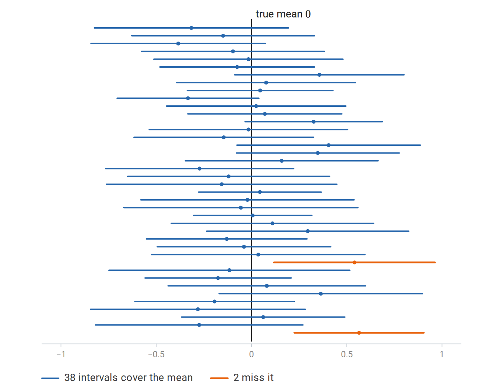

*Exact 95% Student $`t`$ intervals from forty samples of size $`20`$ drawn from $`\mathcal N(0,1)`$. Thirty-eight of them cover the true mean $`0`$; the 95% describes the procedure over many repetitions, not any single interval.*

A **pivot** is a function of the sample and unknown parameters whose distribution does not depend on those unknown parameters. Inverting a probability statement about a pivot often yields a confidence interval.

#### <a id="means-normal-and-student-intervals"></a>Means: Normal and Student intervals

If observations are iid $`\mathcal N(\mu,\sigma^2)`$ with known $`\sigma`$, then $`(\overline Z-\mu)/(\sigma/\sqrt n)`$ is exactly standard Normal. Rearranging its central probability statement gives

$$
\overline Z\pm z_{1-\alpha/2}\frac{\sigma}{\sqrt n}.
$$

For unknown variance, the exact results for Normal samples make the studentized mean a pivot with the $`t_{n-1}`$ distribution. The same rearrangement gives the exact interval

$$
\overline Z\pm t_{n-1,1-\alpha/2}\frac S{\sqrt n}.
$$

The heavier tails of $`t`$ account for estimating the scale. For iid non-Normal observations with finite nonzero variance, studentized means have a large-sample Normal limit; the same $`t`$ formula is then an approximation rather than an exact finite-sample statement. The chi-square pivot $`(n-1)S^2/\sigma^2`$ gives a similarly exact interval for a Normal variance, but that interval relies heavily on Normal tails and does not become approximately valid for other distributions ([Appendix F](#block-probability-appendix-f)). NIST gives the [mean-interval derivation and interpretation](https://www.itl.nist.gov/div898/handbook/eda/section3/eda352.htm).

For two measurements $`A_i,B_i`$ on each independently sampled unit, analyze $`W_i=B_i-A_i`$. The paired mean difference has estimated standard error $`S_W/\sqrt n`$. This incorporates within-unit covariance: $`\operatorname{Var}(B-A)=\operatorname{Var}(B)+\operatorname{Var}(A)-2\operatorname{Cov}(A,B)`$. Treating paired measurements as independent discards that information.

For genuinely independent groups, the estimated standard error of $`\overline B-\overline A`$ is $`\sqrt{S_B^2/n_B+S_A^2/n_A}`$. A large-sample Normal interval follows from the CLT. The Welch $`t`$ approximation improves the small-sample treatment without imposing equal population variances; its degrees of freedom depend on both estimated variances and sample sizes.

More generally, an asymptotically Normal estimator with an estimated standard error gives the **Wald interval** $`\widehat\tau\pm z_{1-\alpha/2}\widehat{\operatorname{SE}}(\widehat\tau)`$. Its accuracy is only as good as the Normal approximation and the standard error.

#### <a id="proportions-and-score-inversion"></a>Proportions and score inversion

The Wald approximation $`\widehat p\pm z_{1-\alpha/2}\sqrt{\widehat p(1-\widehat p)/n}`$ can perform poorly for small samples or probabilities near $`0`$ and $`1`$. If no successes occur, it collapses to $`[0,0]`$, despite substantial uncertainty.

The **Wilson interval** asks, for each candidate $`p`$, whether the observed proportion is unusually far from that value relative to the sampling variation implied by $`p`$. Keeping the candidates that are not rejected gives an interval. For $`0<p<1`$, its Normal approximation retains values satisfying

$$
\frac{|\widehat p-p|}{\sqrt{p(1-p)/n}}\le z,
\qquad z=z_{1-\alpha/2}.
$$

Equivalently, solve $`n(\widehat p-p)^2\le z^2p(1-p)`$ over $`0\le p\le1`$, including the degenerate boundary cases by continuity. This avoids division by zero at the endpoints. Solving the quadratic inequality yields

$$
\frac{\widehat p+z^2/(2n)
\ \pm\ z\sqrt{\widehat p(1-\widehat p)/n+z^2/(4n^2)}}
{1+z^2/n}.
$$

The endpoints stay in $`[0,1]`$. This is an approximate interval obtained by inverting a score test ([Appendix F](#block-probability-appendix-f)), and its finite-sample coverage is not uniformly at least the nominal level. **Clopper–Pearson intervals** invert exact binomial tails and provide at least nominal coverage, generally with some conservatism because counts are discrete. NIST develops [both proportion-interval constructions](https://www.itl.nist.gov/div898/handbook/prc/section2/prc241.htm).

```python
import numpy as np
from scipy.stats import norm, binomtest

k, n, alpha = 18, 100, 0.05
phat = k / n
z = norm.ppf(1 - alpha / 2)
denom = 1 + z*z / n
center = (phat + z*z / (2*n)) / denom
halfwidth = z * np.sqrt(phat*(1-phat)/n + z*z/(4*n*n)) / denom
print("estimate:", phat)
print("estimated SE:", np.sqrt(phat*(1-phat)/n))
print("Wilson:", (center-halfwidth, center+halfwidth))
exact = binomtest(k, n).proportion_ci(confidence_level=1-alpha, method="exact")
print("Clopper–Pearson:", (exact.low, exact.high))
```

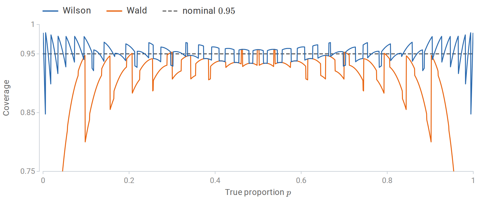

*Exact coverage of nominal 95% intervals for a binomial proportion with $`n=30`$. The Wald interval's coverage oscillates and collapses near the endpoints; the Wilson interval stays close to $`0.95`$ except very near $`0`$ or $`1`$.*

### <a id="bootstrap-approximation-of-sampling-uncertainty"></a>Bootstrap approximation of sampling uncertainty

Analytic standard errors can be difficult for medians, correlations, and other statistics. The **nonparametric bootstrap** applies the plug-in principle to the sampling distribution itself. Replace $`P_\ast`$ by $`\widehat P_n`$, sample $`n`$ observations independently from that empirical distribution, and recompute the estimator. Sampling from $`\widehat P_n`$ is exactly sampling the observed rows with replacement.

Let $`\widehat\tau^\ast`$ denote an estimate from such a bootstrap sample. Conditional on the observed dataset, the bootstrap attempts to approximate

$$
\operatorname{Law}_{P_*}(\widehat\tau-\tau)
\quad\text{by}\quad
\operatorname{Law}_{\widehat P_n}(\widehat\tau^*-\widehat\tau).
$$

There are two approximations: replacing the population by the empirical distribution, and estimating the resulting law using finitely many simulations. Increasing the number of bootstrap replicates improves the second approximation but does not provide additional original observations. The foundational construction is due to [Efron (1979)](https://doi.org/10.1214/aos/1176344552).

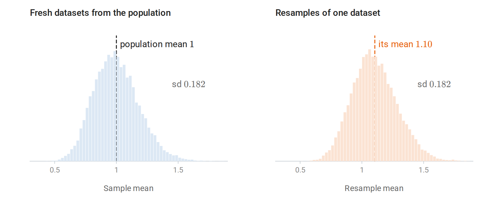

*The sampling distribution of the mean of $`30`$ Exp$`(1)`$ observations, from fresh datasets (left), and the bootstrap distribution from resampling one of those datasets (right). The bootstrap distribution is centered at that dataset's mean rather than at the population mean $`1`$, but its spread and skew are close.*

For $`B`$ replicates $`\widehat\tau^{\ast(1)},\ldots,\widehat\tau^{\ast(B)}`$, their sample standard deviation $`\widehat{\operatorname{SE}}_{\mathrm{boot}}`$ estimates the standard error of $`\widehat\tau`$, and $`\widehat\tau\pm z_{1-\alpha/2}\widehat{\operatorname{SE}}_{\mathrm{boot}}`$ is the **normal bootstrap interval**. The replicates' $`\alpha/2`$ and $`1-\alpha/2`$ quantiles form a **percentile interval**. If those quantiles are $`q^\ast_{\alpha/2}`$ and $`q^\ast_{1-\alpha/2}`$, a **basic interval** is

$$
[2\widehat\tau-q^*_{1-\alpha/2},\ 2\widehat\tau-q^*_{\alpha/2}].
$$

It inverts the bootstrap distribution of the centered error. Studentized and bias-corrected-and-accelerated methods refine these constructions; none is automatically reliable for every statistic and sample size.

The bootstrap is most useful when no convenient formula exists. The sample median's approximate variance $`1/[4np_Z(m)^2]`$ requires the population density at the median, which is hard to estimate well. The standard deviation of resampled medians avoids that step. Resampled medians take only a few distinct values determined by the observed sample, however (the observations themselves when $`n`$ is odd), so for small $`n`$ their distribution is lumpy and the resulting intervals are coarse.

For paired measurements, the observational unit is a pair. Resampling the two columns independently destroys their association. The following example keeps each pair intact and estimates the mean within-unit change.

```python
import numpy as np

rng = np.random.default_rng(18)
n, replicates = 120, 4000
baseline = rng.normal(10, 3, size=n)
followup = baseline + 0.7 + rng.normal(0, 1.5, size=n)
pairs = np.column_stack([baseline, followup])
change = pairs[:, 1] - pairs[:, 0]
estimate = change.mean()

indices = rng.integers(0, n, size=(replicates, n))
resampled = pairs[indices]  # shape: (replicates, observations, 2)
boot = (resampled[:, :, 1] - resampled[:, :, 0]).mean(axis=1)
lower, upper = np.quantile(boot, [0.025, 0.975])
print("mean change:", estimate)
print("analytic SE:", change.std(ddof=1) / np.sqrt(n))
print("bootstrap SE:", boot.std(ddof=1))
print("percentile interval:", (lower, upper))
print("basic interval:", (2*estimate-upper, 2*estimate-lower))
```

The synthetic measurements share a baseline effect. Keeping the rows paired preserves that effect's cancellation in the difference. For a correlation or another statistic involving both columns, the same row-resampling principle preserves their joint empirical distribution.

Ordinary iid bootstrap theory works well for many smooth statistics under adequate moment and regularity assumptions. A sample median additionally requires suitable behavior of the density near the population median. Maxima and support endpoints can fail because empirical resamples never contain a value beyond the observed maximum. Infinite-variance means can fail because their limiting behavior is not captured by ordinary Normal and iid-bootstrap approximations. Time series and clusters require appropriate block or cluster resampling. A bootstrap calculation reproduces the assumptions encoded in its resampling scheme; it cannot correct selection bias.

A **parametric bootstrap** instead simulates data from a fitted model $`P_{\widehat\theta}`$ and refits each simulated dataset. It can use structure unavailable to empirical resampling, but its validity depends more directly on the fitted family. Both forms approximate repeated data collection, rather than drawing a Bayesian posterior for the parameter. The **jackknife**, a deterministic leave-one-out relative of the bootstrap, appears in [Appendix E](#block-probability-appendix-e).

### <a id="hypothesis-tests-evidence-and-power"></a>Hypothesis tests, evidence, and power

A **hypothesis** is a restriction on the population distribution. In a parametric model, write

$$
H_0:\theta\in\Theta_0,
\qquad
H_1:\theta\in\Theta_1,
$$

with disjoint sets. A simple hypothesis specifies one distribution; a composite hypothesis allows several. A test chooses a rejection region, often through a scalar statistic that measures departure from the null.

A **Type I error** rejects a true null. A **Type II error** fails to reject at a specified alternative. A level-$`\alpha`$ test satisfies

$$
\sup_{\theta\in\Theta_0}P_\theta(\text{reject }H_0)\le\alpha.
$$

Its **power function** is $`\operatorname{Power}(\theta)=P_\theta(\text{reject }H_0)`$, and its Type II error probability at an alternative is $`1-\operatorname{Power}(\theta)`$. Power is a function of the alternative, not a single property of the test independent of effect size.

**Test–interval duality** says that keeping every target value whose level-$`\alpha`$ test is not rejected produces a $`1-\alpha`$ confidence set when the tests are valid. The Wilson interval above is one example, and any family of valid tests yields intervals in this way. The interpretation is still coverage; inversion does not turn a p-value into a posterior probability. [Appendix F](#block-probability-appendix-f) shows that likelihood-ratio tests are most powerful for simple hypotheses and describes the Wald, likelihood-ratio, and score tests of regular likelihood theory.

#### <a id="what-a-p-value-states"></a>What a p-value states

For a simple null and a statistic $`T`$ whose larger values indicate stronger disagreement, the tail probability

$$
p_{\mathrm{val}}=P_{H_0}\{T(D')\ge T(D_{\mathrm{obs}})\}
$$

uses a hypothetical fresh dataset $`D'`$ drawn under the null. Two-sided tests choose an appropriate measure of extremeness, often an absolute standardized difference. A valid p-value obeys

$$
P_\theta(p_{\mathrm{val}}\le u)\le u
\qquad(0\le u\le1,\ \theta\in\Theta_0).
$$

This property justifies rejecting when $`p_{\mathrm{val}}\le\alpha`$. Continuous exact-null p-values are often uniform; discreteness can make them conservative. Composite hypotheses require validity across nuisance parameters, possibly through conditioning, a pivot, or a worst-case calculation.

The p-value is a probability calculated under the null, not the probability that the null is true. A large p-value can reflect a small effect, large noise, or insufficient data. Failing to reject equality does not establish practical equivalence. Equivalence is a different hypothesis, requiring a prespecified tolerance for negligible differences.

For example, suppose the observations are Normal with known $`\sigma`$, so that $`T=\sqrt n(\overline Z-\mu_0)/\sigma`$ is standard Normal under $`H_0:\mu=\mu_0`$, and the observed value of $`T`$ is $`2.10`$. The two-sided p-value is

$$
P_{H_0}(|T|\ge2.10)=2[1-\Phi(2.10)]\approx0.036.
$$

A level-$`0.05`$ test rejects, and a level-$`0.01`$ test does not. The value $`0.036`$ is not the probability that the null hypothesis is true.

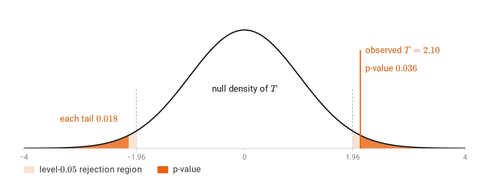

*The two-sided p-value for an observed statistic of $`2.10`$ is the null probability beyond $`\pm2.10`$, which lies inside the level-$`0.05`$ rejection region beyond $`\pm1.96`$.*

For $`K\sim\operatorname{Binomial}(n,p)`$, testing $`p=p_0`$ against $`p>p_0`$ gives the exact p-value

$$
\sum_{j=k}^n {n\choose j}p_0^j(1-p_0)^{n-j}.
$$

No large-sample Normal approximation is needed. For a two-sided discrete test, “at least as extreme” must be specified; doubling the smaller tail and summing outcomes with probability no greater than the observed outcome can produce different valid conventions. SciPy documents its exact binomial implementation in [`binomtest`](https://docs.scipy.org/doc/scipy/reference/generated/scipy.stats.binomtest.html).

#### <a id="effect-sizes-and-sample-size"></a>Effect sizes and sample size

In a Normal mean problem with known $`\sigma`$, a two-sided level-$`\alpha`$ test rejects when $`|\overline Z-\mu_0|>z_{1-\alpha/2}\sigma/\sqrt n`$. At a true mean $`\mu=\mu_0+\Delta`$, define $`d=\sqrt n\Delta/\sigma`$ and $`z=z_{1-\alpha/2}`$. Its power is

$$
\operatorname{Power}(\mu)=1-\Phi(z-d)+\Phi(-z-d).
$$

The standardized shift grows as $`\sqrt n`$. A tiny nonzero effect can therefore become statistically significant with enough data, while an important effect can be missed by a small noisy sample. Reporting an effect estimate and uncertainty interval conveys information that a thresholded test result discards.

For a one-sided Normal test against a prespecified positive difference $`\Delta`$, with $`0<\alpha,\beta<1/2`$, achieving power $`1-\beta`$ requires

$$
n\ge\frac{\sigma^2(z_{1-\alpha}+z_{1-\beta})^2}{\Delta^2},
$$

rounded up to an integer. The calculation specifies an alternative and assumes known variance; planning with an estimated scale adds uncertainty. Choosing the direction of a one-sided test after looking at the sign of the data invalidates its stated error rate.

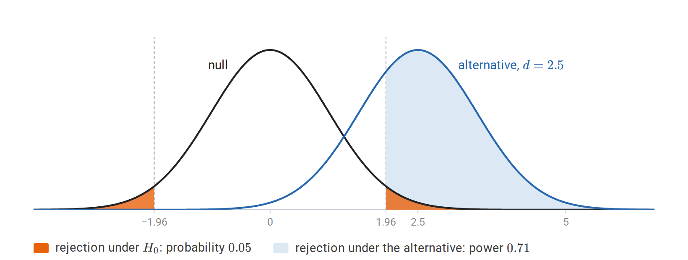

*The standardized statistic under the null and under an alternative with standardized shift $`d=2.5`$. The two-sided rejection region has probability $`0.05`$ under the null and about $`0.71`$ under this alternative; the rest of the alternative's probability is the Type II error.*

#### <a id="comparing-two-proportions"></a>Comparing two proportions

A common experiment compares success rates in two independent groups, such as the conversion rates of users randomly shown two versions of a web page. With $`K_A\sim\operatorname{Binomial}(n_A,p_A)`$ and $`K_B\sim\operatorname{Binomial}(n_B,p_B)`$, the estimated difference $`\widehat p_B-\widehat p_A`$ has variance $`p_A(1-p_A)/n_A+p_B(1-p_B)/n_B`$. Under $`H_0:p_A=p_B`$, both groups share one rate, estimated by the **pooled proportion** $`\widehat p=(K_A+K_B)/(n_A+n_B)`$, and

$$
Z=\frac{\widehat p_B-\widehat p_A}{\sqrt{\widehat p(1-\widehat p)\,(1/n_A+1/n_B)}}
$$

is approximately standard Normal for large samples. With $`200`$ conversions among $`2{,}000`$ users in group A and $`250`$ among $`2{,}000`$ in group B, $`\widehat p=0.1125`$, $`Z\approx2.50`$, and the two-sided p-value is about $`0.012`$. An interval for the difference is not computed under the null, so it uses the unpooled variance: here $`0.025\pm0.020`$. The calculation assumes independent users, random assignment, and a sample size fixed in advance. Checking the p-value repeatedly and stopping at the first significant result inflates the Type I error rate. The same test is Pearson's chi-square test of independence for the $`2\times2`$ table of counts; [Appendix F](#block-probability-appendix-f) gives chi-square tests for general tables.

#### <a id="permutation-and-randomization-tests"></a>Permutation and randomization tests

Some null hypotheses imply an exact symmetry. For two independent iid samples from the same distribution, pooled observations are **exchangeable** under the null: relabeling which observations belong to which group leaves their joint law unchanged. Comparing the observed statistic with all allowed relabelings gives an exact permutation test, with conservatism possible because the reference distribution is discrete.

Equality of two population means alone does not imply exchangeability. If two groups have different variances or shapes, an unstudentized label-permutation test need not test only equality of means at its nominal level. The symmetry being used is an assumption that needs its own justification.

In a paired randomized experiment, swapping treatment labels within pairs gives the randomization distribution under a sharp null of no effect on any unit. For observational paired differences, sign flipping is justified by independent differences whose null distribution is symmetric about zero. Mean zero alone is insufficient. With $`n`$ pairs there are $`2^n`$ possible sign patterns, making exact enumeration practical for small samples.

```python
import itertools
import numpy as np

# Illustrative paired differences. The null assumes independent,
# symmetric distributions about zero (or a valid paired randomization).
differences = np.array([1.2, 0.7, -0.1, 0.8, 1.0, 0.4, -0.2, 0.9])
observed = abs(differences.mean())
signs = np.array(list(itertools.product([-1, 1], repeat=len(differences))))
null_statistics = np.abs((signs * differences).mean(axis=1))
p_value = np.mean(null_statistics >= observed - 1e-12)
print("mean difference:", differences.mean())
print("exact two-sided sign-flip p-value:", p_value)
```

The calculation conditions on the observed magnitudes and enumerates every sign pattern. The tolerance includes computationally tied values. For a random subset of permutations, including the observed arrangement through the conventional $`(b+1)/(B+1)`$ calculation avoids zero p-values and yields a valid Monte Carlo test under the appropriate random-permutation construction. The official [SciPy permutation-test documentation](https://docs.scipy.org/doc/scipy/reference/generated/scipy.stats.permutation_test.html) distinguishes independent-sample, paired, and pairing permutations.

Bootstrap and permutation procedures generate different reference worlds. The ordinary bootstrap estimates sampling fluctuations around the fitted empirical distribution. A permutation test generates a reference distribution by a symmetry that holds under its null. Resampling code can look similar even though the probability arguments differ.

#### <a id="multiple-comparisons-and-selection"></a>Multiple comparisons and selection

If $`m`$ true nulls each have rejection probability exactly $`\alpha`$ and their test decisions are independent, the probability of at least one false rejection is $`1-(1-\alpha)^m`$. At $`m=20`$ and $`\alpha=0.05`$, it is about $`0.64`$. If each rejection probability is only bounded above by $`\alpha`$, the same expression is an upper bound under independence. Repeatedly trying analyses and reporting only the smallest p-value creates a related selection problem.

The **familywise error rate** is $`P(V\ge1)`$, where $`V`$ counts false rejections. Bonferroni rejects an individual hypothesis only when its valid p-value is at most $`\alpha/m`$. The union bound gives familywise control under arbitrary dependence. Holm's procedure sorts p-values $`p_{(1)}\le\cdots\le p_{(m)}`$, compares $`p_{(j)}`$ sequentially to $`\alpha/(m-j+1)`$, and stops at the first failure. It also controls familywise error and is at least as powerful as Bonferroni.

The **false discovery rate** is instead

$$
\operatorname{FDR}=\mathbb E\!\left[\frac{V}{\max(R,1)}\right],
$$

where $`R`$ is the total number of rejections. The [Benjamini–Hochberg procedure](https://doi.org/10.1111/j.2517-6161.1995.tb02031.x) finds the largest $`k`$ with $`p_{(k)}\le qk/m`$ and rejects the first $`k`$ hypotheses; it rejects none if no such $`k`$ exists. For valid independent p-values it controls FDR at most $`q`$. Extensions permit specified positive-dependence conditions, but arbitrary dependence is not covered by the ordinary guarantee. FDR control bounds an expected proportion and does not promise that each realized rejection set contains at most a fraction $`q`$ of errors.

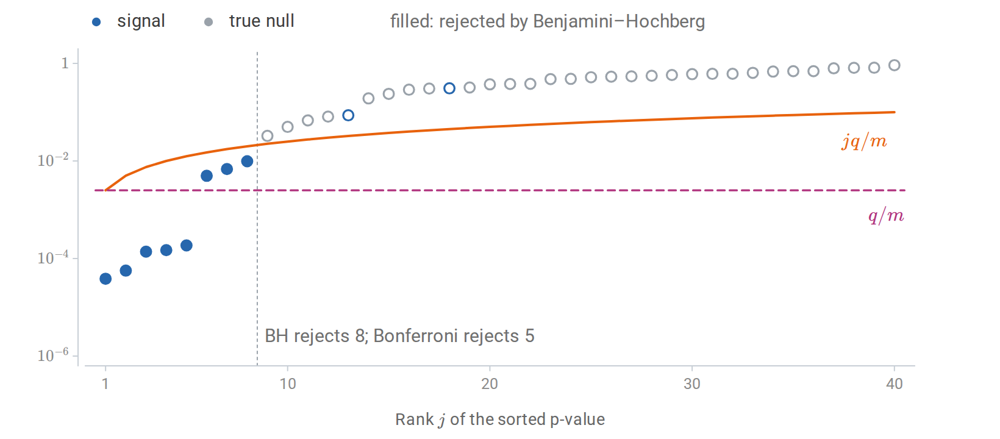

*Forty sorted p-values, thirty from true null hypotheses and ten from real effects. Benjamini–Hochberg at $`q=0.1`$ rejects every hypothesis up to the last p-value below the line $`jq/m`$, eight here, all of them real effects; Bonferroni at level $`0.1`$ rejects only the five below $`0.1/m`$.*

Selection can occur across features, outcomes, subgroups, model versions, stopping times, and analysis choices. A reported standard error or p-value generally describes a fixed procedure under its assumptions. Reusing the same data to choose a promising result and then evaluating it as if it had been prespecified changes that procedure. Independent evaluation data, appropriate multiplicity adjustments, and methods designed for sequential or selective inference address different versions of this problem.

### <a id="bayesian-inference"></a>Bayesian inference

Frequentist analysis studies how a procedure behaves when the data are repeatedly sampled at a fixed parameter. Bayesian analysis also specifies a probability distribution for uncertainty about that parameter. Both begin with a sampling model; they answer different probability questions.

Let $`D=(Z_1,\ldots,Z_n)`$ denote the random sample, $`L_n(\theta)=p_\theta(D)`$ its likelihood, and $`\pi(\theta)`$ a **prior density**. Conditioning on the observed value of $`D`$, Bayes' rule gives the **posterior density**

$$
\pi(\theta\mid D)
=\frac{L_n(\theta)\pi(\theta)}{m(D)},
\qquad
m(D)=\int L_n(u)\pi(u)\,du.
$$

The denominator is the **marginal likelihood**, or evidence. It normalizes the posterior; the integral averages likelihood values using the prior. For discrete parameters, replace the integral by a sum. A proper prior integrates to one, and the posterior requires $`0<m(D)<\infty`$.

The prior and likelihood have distinct roles: the prior describes parameter uncertainty before observing $`D`$; the likelihood describes how different parameter values explain the same observed data. Neither alone is the posterior. Priors can encode substantive knowledge or regularize poorly identified parameters. Conclusions depend on these choices, especially with limited data. [*Bayesian Data Analysis*, Chapters 1–3](https://sites.stat.columbia.edu/gelman/book/) develops this framework and its elementary models.

#### <a id="bernoulli-observations-and-a-beta-prior"></a>Bernoulli observations and a Beta prior

Suppose $`Z_i\mid\theta\sim\operatorname{Bernoulli}(\theta)`$ independently, with $`s=\sum_i Z_i`$ successes. Choose $`\theta\sim\operatorname{Beta}(\alpha_0,\beta_0)`$, where $`\alpha_0,\beta_0>0`$ are the prior shape parameters. Subscript $`0`$ denotes the prior; subscript $`n`$ will denote the posterior after $`n`$ observations. Multiplication gives

$$
\pi(\theta\mid D)
\propto \theta^s(1-\theta)^{n-s}
\theta^{\alpha_0-1}(1-\theta)^{\beta_0-1}
=\theta^{\alpha_0+s-1}(1-\theta)^{\beta_0+n-s-1}.
$$

Therefore

$$
\theta\mid D\sim\operatorname{Beta}(\alpha_0+s,\beta_0+n-s).
$$

The prior is **conjugate** because updating stays within its distribution family; Gamma priors for Poisson counts and Dirichlet priors for categories work the same way ([Appendix H](#block-probability-appendix-h)). The posterior mean is

$$
\mathbb E[\theta\mid D]
=\frac{\alpha_0+s}{\alpha_0+\beta_0+n}
=\frac{\alpha_0+\beta_0}{\alpha_0+\beta_0+n}\frac{\alpha_0}{\alpha_0+\beta_0}
+\frac{n}{\alpha_0+\beta_0+n}\frac{s}{n}.
$$

This is a weighted average of the prior mean and the sample proportion. For this formula, $`\alpha_0+\beta_0`$ measures the prior's weight relative to the sample size; the pseudo-count interpretation depends on whether one is discussing the mean or the mode.

Writing $`\alpha_n=\alpha_0+s`$ and $`\beta_n=\beta_0+n-s`$, the posterior variance is

$$
\operatorname{Var}(\theta\mid D)
=\frac{\alpha_n \beta_n}{(\alpha_n+\beta_n)^2(\alpha_n+\beta_n+1)}.
$$

The estimate and its uncertainty are separate outputs. Observing eight successes in ten trials and eighty successes in a hundred trials gives similar evidence about the location of $`\theta`$, but substantially different posterior concentration. A point estimate alone conceals that difference.

For example, a $`\operatorname{Beta}(2,2)`$ prior and eight successes in ten trials yield a $`\operatorname{Beta}(10,4)`$ posterior. The likelihood is maximized at $`0.8`$, while the posterior mean is $`10/14\approx0.714`$: the prior pulls the estimate toward $`0.5`$.

A **credible set** $`C(D)`$ satisfies

$$
P\{\theta\in C(D)\mid D\}\ge1-\alpha
$$

under the specified prior and model. An equal-tailed interval uses posterior quantiles $`\alpha/2`$ and $`1-\alpha/2`$; for a continuous posterior its probability is exactly $`1-\alpha`$. Discrete posteriors can prevent exact equality. Its probability concerns the uncertain parameter after conditioning on the observed sample. A confidence interval instead guarantees repeated-sampling coverage for a fixed parameter. A credible interval need not have its nominal frequentist coverage at every parameter value.

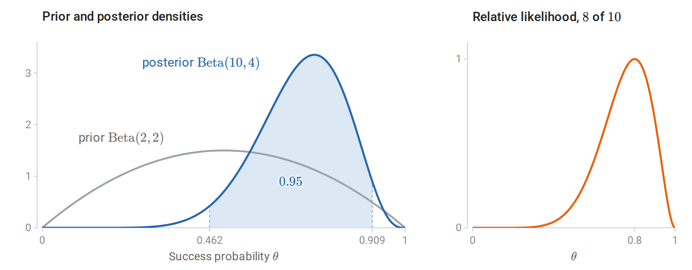

*A Beta$`(2,2)`$ prior updated by eight successes in ten trials becomes a Beta$`(10,4)`$ posterior; the shaded 95% equal-tailed credible interval runs from $`0.462`$ to $`0.909`$. Updating multiplies the prior by the likelihood (right) and renormalizes.*

The following computes a posterior interval with the [Beta distribution implementation in SciPy](https://docs.scipy.org/doc/scipy/reference/generated/scipy.stats.beta.html). Here `ppf` means inverse CDF; these are posterior quantiles.

```python
import numpy as np
from scipy.stats import beta as beta_dist

alpha_0, beta_0 = 2.0, 2.0
successes, n = 8, 10
alpha_n = alpha_0 + successes
beta_n = beta_0 + n - successes
posterior = beta_dist(alpha_n, beta_n)
credible_interval = posterior.ppf([0.025, 0.975])
predictive_success = posterior.mean()
print("Posterior mean:", predictive_success)
print("95% credible interval:", credible_interval)
assert np.isclose(predictive_success, 10 / 14)
assert np.isclose(np.diff(posterior.cdf(credible_interval))[0], 0.95)
```

#### <a id="prediction-and-shrinkage"></a>Prediction and shrinkage

Inference about $`\theta`$ is different from prediction of a new observation. If $`Z_{\mathrm{new}}`$ and $`D`$ are conditionally independent given $`\theta`$, the **posterior predictive distribution** is

$$
p(z_{\mathrm{new}}\mid D)
=\int p_\theta(z_{\mathrm{new}})\pi(\theta\mid D)\,d\theta.
$$

For the Bernoulli example, its success probability is $`\mathbb E[\theta\mid D]`$. Future trials are independent conditional on $`\theta`$, but generally dependent after averaging over their shared uncertain parameter. A **posterior predictive interval** $`A(D)`$ satisfies $`P\{Z_{\mathrm{new}}\in A(D)\mid D\}\ge1-\alpha`$. It concerns the next observation, including its own variability, rather than only an unknown parameter.

For a continuous example, let $`Z_i\mid\mu\sim\mathcal N(\mu,\sigma^2)`$ independently, with known $`\sigma^2>0`$, and let $`\mu\sim\mathcal N(m_0,v_0)`$ with $`v_0>0`$. Completing the square in the posterior exponent gives

$$
\mu\mid D\sim\mathcal N(m_n,v_n),
\qquad
v_n^{-1}=v_0^{-1}+n\sigma^{-2},
\qquad
m_n=v_n\left(\frac{m_0}{v_0}+\frac{n\bar Z}{\sigma^2}\right).
$$

Here inverse variance, called **precision**, adds across the prior and observations. The posterior mean shrinks $`\bar Z`$ toward $`m_0`$ according to their relative uncertainty. More data increase the weight on $`\bar Z`$. The predictive distribution is

$$
Z_{\mathrm{new}}\mid D\sim\mathcal N(m_n,\sigma^2+v_n).
$$

The extra $`\sigma^2`$ is future observation noise. More generally, total variance gives

$$
\operatorname{Var}(Z_{\mathrm{new}}\mid D)
=\mathbb E_{\theta\mid D}[\operatorname{Var}(Z_{\mathrm{new}}\mid\theta)]
+\operatorname{Var}_{\theta\mid D}[\mathbb E(Z_{\mathrm{new}}\mid\theta)].
$$

The terms describe variation within a specified parameter value and uncertainty across parameter values. They are often called **aleatoric** and **epistemic** uncertainty. This decomposition is model-dependent; it does not automatically include uncertainty about an incorrectly specified model.

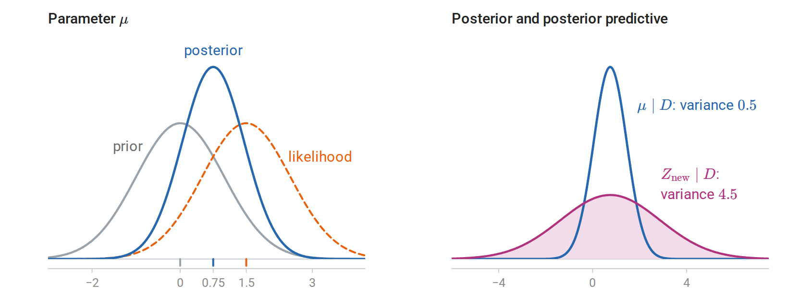

*A $`\mathcal N(0,1)`$ prior for $`\mu`$ and four observations with $`\sigma=2`$ and mean $`1.5`$ give the posterior $`\mathcal N(0.75,0.5)`$, halfway between prior and data because their precisions are equal (left). The posterior predictive distribution of a new observation is much wider than the posterior for $`\mu`$ (right).*

Posterior predictive checks and prior sensitivity analysis examine whether the model and prior are adequate for the data at hand; [Appendix H](#block-probability-appendix-h) describes both.

#### <a id="posterior-means-and-map-estimates"></a>Posterior means and MAP estimates

A posterior distribution can be summarized in several ways. The posterior mean minimizes posterior squared-error loss. A **maximum a posteriori** estimate is a maximizer of the posterior density:

$$
\widehat\theta_{\mathrm{MAP}}
\in\operatorname*{arg\,max}_\theta
\{\log L_n(\theta)+\log\pi(\theta)\}.
$$

Thus a negative log prior becomes a penalty. For example, a Gaussian prior on coefficients yields a quadratic penalty. MAP retains one point and does not propagate parameter uncertainty into prediction. Unlike posterior probabilities, a density mode is not preserved under a change of parameterization, so a MAP estimate depends on the coordinates chosen ([Appendix H](#block-probability-appendix-h)).

### <a id="decisions-loss-and-risk"></a>Decisions, loss, and risk

An estimate, a prediction, and a test result are all actions chosen from data. Let $`a`$ be an action, $`d(D)`$ a **decision rule**, and $`\ell(\tau(\theta),a)`$ the loss when the estimand is $`\tau(\theta)`$. Its **frequentist risk** is

$$
R(\theta,d)
=\mathbb E_\theta[\ell(\tau(\theta),d(D))].
$$

The expectation varies the sample while holding $`\theta`$ fixed. Under squared-error loss, risk is MSE; the sample mean in the known-variance Normal model has risk $`\sigma^2/n`$. Unbiasedness alone cannot rank all estimators, because a biased estimator can have smaller MSE.

Given a prior, the **Bayes risk** averages this sampling risk:

$$
r(\pi,d)=\int R(\theta,d)\pi(\theta)\,d\theta.
$$

Interchanging expectations shows that it is minimized by minimizing posterior expected loss for each observed sample:

$$
d^*(D)\in\operatorname*{arg\,min}_a
\mathbb E[\ell(\tau(\theta),a)\mid D].
$$

For a scalar target $`T=\tau(\theta)`$, the principal cases are:

| Loss | Posterior optimal action |
|---|---|
| $`(T-a)^2`$ | Posterior mean $`\mathbb E[T\mid D]`$ |
| $`\lvert T-a\rvert`$ | Any posterior median |
| $`\mathbf 1\{T\ne a\}`$, with discrete $`T`$ | A value of greatest posterior probability |

For squared loss, write

$$
\mathbb E[(T-a)^2\mid D]
=\operatorname{Var}(T\mid D)
+\big(\mathbb E[T\mid D]-a\big)^2.
$$

Only the second term depends on $`a`$, proving the first row. For a continuous target, exact zero-one loss gives expected loss one for every individual action under a continuous posterior; it does **not** justify MAP without changing the loss or taking a suitable small-neighborhood limit.

An action also depends on its costs. Suppose $`Y\in\{0,1\}`$ and $`p=P(Y=1\mid\text{available information})`$. With false-positive cost $`c_{\mathrm{FP}}>0`$, false-negative cost $`c_{\mathrm{FN}}>0`$, and zero cost for correct decisions, predicting one costs $`c_{\mathrm{FP}}(1-p)`$ in expectation. Predicting zero costs $`c_{\mathrm{FN}}p`$. Therefore the optimal threshold is

$$
p\ge\frac{c_{\mathrm{FP}}}{c_{\mathrm{FP}}+c_{\mathrm{FN}}}.
$$

The familiar threshold $`1/2`$ is a consequence of equal costs.

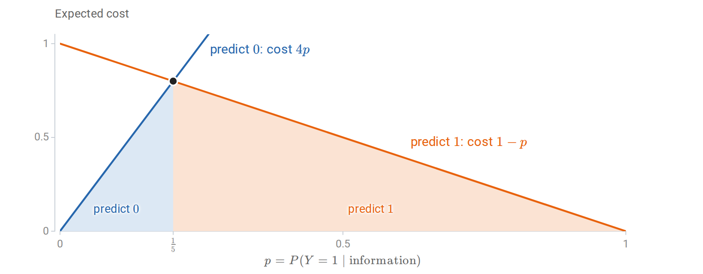

*Expected cost of each decision when a false negative costs four times as much as a false positive. Predicting $`1`$ becomes the cheaper action once $`p`$ exceeds $`1/5`$.*

A rule chosen without a prior can be judged by its worst case, or by whether any other rule does at least as well at every parameter value. [Appendix H](#block-probability-appendix-h) defines these minimax and admissibility criteria and describes Stein's paradox, in which shrinkage dominates the natural unbiased estimator of a mean vector.

### <a id="regression-as-statistical-inference"></a>Regression as statistical inference

Regression concerns the conditional distribution of a response $`Y`$ given a covariate vector $`X`$. Its **regression function** is $`m(x)=\mathbb E[Y\mid X=x]`$. A linear conditional-mean model assumes $`m(x)=x^\top\beta`$. This is an assumption about a conditional expectation, not a claim that the covariates or responses must themselves have Normal marginal distributions.

For observed covariate column vectors $`x_i\in\mathbb R^d`$, define the **design matrix** $`\mathbf X\in\mathbb R^{n\times d}`$ with rows $`x_i^\top`$. Stack the random responses into $`\mathbf Y\in\mathbb R^n`$, with observed realization $`y`$. The model is

$$
\mathbf Y=\mathbf X\beta+\varepsilon,
\qquad
\mathbb E[\varepsilon\mid \mathbf X]=0.
$$

An intercept is represented by a column of ones and counts among the $`d`$ coefficients. Conditioning on $`\mathbf X`$ separates variation in the responses from variation in the observed design. Each coefficient describes a conditional comparison for this particular set of covariates; changing the covariate set can change its meaning.

#### <a id="least-squares-and-coefficient-uncertainty"></a>Least squares and coefficient uncertainty

Assume $`\mathbf X`$ has full column rank. Ordinary least squares minimizes $`\|\mathbf Y-\mathbf X\beta\|^2`$ and satisfies

$$
\mathbf X^\top \mathbf X\widehat\beta=\mathbf X^\top \mathbf Y,
\qquad
\widehat\beta=(\mathbf X^\top \mathbf X)^{-1}\mathbf X^\top \mathbf Y.
$$

Geometrically, $`\mathbf X\widehat\beta`$ is the orthogonal projection of $`\mathbf Y`$ onto the column space of $`\mathbf X`$. Statistically,

$$
\widehat\beta-\beta=(\mathbf X^\top \mathbf X)^{-1}\mathbf X^\top\varepsilon.
$$

This identity gives conditional unbiasedness. Writing $`\Omega=\operatorname{Cov}(\varepsilon\mid \mathbf X)`$ gives

$$
\operatorname{Cov}(\widehat\beta\mid \mathbf X)
=(\mathbf X^\top \mathbf X)^{-1}\mathbf X^\top\Omega \mathbf X(\mathbf X^\top \mathbf X)^{-1}.
$$

If $`\Omega=\sigma^2I_n`$, the covariance simplifies to $`\sigma^2(\mathbf X^\top \mathbf X)^{-1}`$. Under these mean and covariance assumptions, the **Gauss–Markov theorem** says that OLS has smallest covariance among estimators that are linear in $`\mathbf Y`$ and unbiased for every $`\beta`$. It does not claim superiority to every biased estimator, and it does not require Normal errors. [Appendix G](#block-probability-appendix-g) proves it and develops the projection geometry of the fit.

Exact small-sample inference adds the assumption $`\varepsilon\mid \mathbf X\sim\mathcal N(0,\sigma^2I_n)`$ and requires $`n>d`$. Set

$$
\widehat\sigma^2=\frac{\|\mathbf Y-\mathbf X\widehat\beta\|^2}{n-d},
\qquad
\widehat{\operatorname{SE}}(\widehat\beta_j)
=\widehat\sigma\sqrt{[(\mathbf X^\top \mathbf X)^{-1}]_{jj}}.
$$

Then $`(\widehat\beta_j-\beta_j)/\widehat{\operatorname{SE}}(\widehat\beta_j)`$ has a Student $`t`$ distribution with $`n-d`$ degrees of freedom. Consequently,

$$
\widehat\beta_j\pm t_{n-d,1-\alpha/2}\widehat{\operatorname{SE}}(\widehat\beta_j)
$$

is an exact marginal confidence interval. These intervals are not automatically simultaneous statements about all coefficients.

The degrees of freedom have a geometric explanation. Fitting $`d`$ linearly independent columns leaves residuals in an $`(n-d)`$-dimensional orthogonal subspace. Under spherical Gaussian noise, the fitted component and residual component are independent, and the squared residual length divided by $`\sigma^2`$ has a $`\chi^2_{n-d}`$ distribution. A standardized Normal coefficient error divided by the independent estimated noise scale therefore has the stated $`t`$ distribution. Without Gaussian errors this exact argument no longer applies; large-sample inference needs its own assumptions.

With $`\mathrm{RSS}=\|\mathbf Y-\mathbf X\widehat\beta\|^2`$ and $`\mathrm{TSS}=\sum_i(Y_i-\overline Y)^2`$, the **coefficient of determination** $`R^2=1-\mathrm{RSS}/\mathrm{TSS}`$ is the fraction of the sample variation around the mean explained by a model with an intercept. It never decreases when a column is added, so a larger $`R^2`$ alone does not justify a larger model. The $`F`$ test of [Appendix G](#block-probability-appendix-g) asks whether added columns improve a nested model by more than chance would.

#### <a id="estimating-a-mean-versus-predicting-an-observation"></a>Estimating a mean versus predicting an observation

At a fixed covariate vector $`x_0`$, define

$$
\widehat m(x_0)=x_0^\top\widehat\beta,
\qquad
h_0=x_0^\top(\mathbf X^\top \mathbf X)^{-1}x_0.
$$

Under the Gaussian model, a confidence interval for the conditional mean and a prediction interval for an independent future response are, respectively,

$$
\underbrace{\widehat m(x_0)\pm t_{n-d,1-\alpha/2}\widehat\sigma\sqrt{h_0}}_{\text{mean response}},
\qquad
\underbrace{\widehat m(x_0)\pm t_{n-d,1-\alpha/2}\widehat\sigma\sqrt{1+h_0}}_{\text{future observation}}.
$$

The prediction interval is wider because a new observation contains its own random error. The extra one represents this error variance in units of $`\sigma^2`$. These are pointwise intervals at a specified $`x_0`$, not simultaneous bands for every covariate value. The [NIST discussion of mean-response uncertainty](https://www.itl.nist.gov/div898/handbook/pmd/section5/pmd511.htm) illustrates their repeated-sampling interpretation. With only an intercept, $`h_0=1/n`$ and $`\widehat\sigma`$ is the sample standard deviation $`S_Y`$ of the responses, so a new response from a Normal population has the prediction interval $`\overline Y\pm t_{n-1,1-\alpha/2}S_Y\sqrt{1+1/n}`$, with exact coverage jointly over the sample and the new observation.

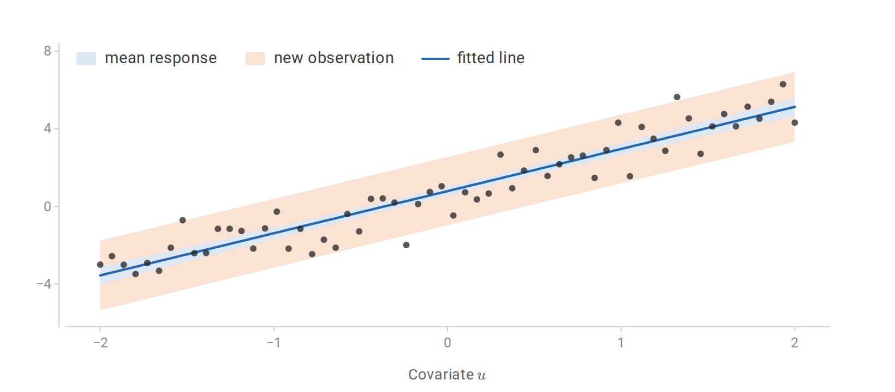

*Pointwise 95% intervals for the mean response (inner band) and for a new observation (outer band), computed from the data and fitted line of the NumPy example below. Both bands widen away from the center of the observed covariates.*

```python
import numpy as np
from scipy.stats import t

rng = np.random.default_rng(7)
u = np.linspace(-2, 2, 60)
X = np.column_stack([np.ones(u.size), u])
y = X @ np.array([1.0, 2.0]) + rng.normal(size=u.size)
beta_hat = np.linalg.lstsq(X, y, rcond=None)[0]
n, d = X.shape
s2 = np.sum((y - X @ beta_hat) ** 2) / (n - d)
x0 = np.array([1.0, 1.5])
mean_hat = x0 @ beta_hat
h0 = x0 @ np.linalg.solve(X.T @ X, x0)
critical = t.ppf(0.975, df=n - d)
mean_halfwidth = critical * np.sqrt(s2 * h0)
prediction_halfwidth = critical * np.sqrt(s2 * (1 + h0))
print("Mean interval:", mean_hat + np.array([-1, 1]) * mean_halfwidth)
print("Prediction interval:", mean_hat + np.array([-1, 1]) * prediction_halfwidth)
assert prediction_halfwidth > mean_halfwidth
```

The formulas express assumptions as well as calculations. Heteroskedastic errors can leave OLS unbiased while invalidating the constant-variance standard errors. Correlated observations likewise require an appropriate covariance estimate. Near-collinear covariates inflate coefficient uncertainty. Residual patterns can reveal omitted nonlinear structure or changing noise variance; a small training residual sum of squares does not establish that these assumptions hold. [Appendix G](#block-probability-appendix-g) collects diagnostics for these problems, including leverage, variance inflation, and robust standard errors.

#### <a id="omitted-variables-and-the-best-linear-approximation"></a>Omitted variables and the best linear approximation

A coefficient's meaning depends on the other covariates in the model. Suppose $`Y=\beta_0+\beta_1X+\beta_2W+\varepsilon`$ with $`\mathbb E[\varepsilon\mid X,W]=0`$, but $`Y`$ is regressed on $`X`$ alone, with an intercept. The population slope of that shorter regression is

$$
\frac{\operatorname{Cov}(X,Y)}{\operatorname{Var}(X)}
=\beta_1+\beta_2\frac{\operatorname{Cov}(X,W)}{\operatorname{Var}(X)}.
$$

The second term is **omitted-variable bias**. It vanishes only if the omitted variable has no effect on $`Y`$ or is uncorrelated with $`X`$. The short regression still estimates a well-defined quantity, the best linear predictor of $`Y`$ from $`X`$ alone, but not the coefficient $`\beta_1`$ of the longer model. [Appendix G](#block-probability-appendix-g) gives the general form of this bias and the attenuation caused by measurement error in a covariate, and it shows that each coefficient of a multiple regression is a partial association.

If the conditional mean is nonlinear, a best linear approximation can still be a useful estimand. With finite second moments and invertible $`\mathbb E[XX^\top]`$, its population coefficient is

$$
\beta^*=\operatorname*{arg\,min}_\beta\mathbb E[(Y-X^\top\beta)^2]
=\mathbb E[XX^\top]^{-1}\mathbb E[XY].
$$

Its residual is orthogonal to the covariates in expectation. This weaker property does not imply a correctly specified linear conditional mean, so the preceding exact Gaussian intervals cannot simply be carried over unchanged.

Finally, an observational coefficient measures association under the chosen conditioning set. Interpreting it as the effect of an intervention requires additional causal assumptions. Statistical significance alone supplies no such argument. [Appendix G](#block-probability-appendix-g) describes two designs that state such assumptions explicitly, instrumental variables and difference-in-differences.

### <a id="from-inference-to-learning"></a>From inference to learning

Let a fresh pair $`(X,Y)`$ have the true distribution $`P_\ast`$, and let $`f(X)`$ be a prediction. Its population risk and the corresponding empirical risk are

$$
R_*(f)=\mathbb E_{P_*}[\ell(Y,f(X))],
\qquad
\widehat R_n(f)=\frac1n\sum_{i=1}^n\ell(Y_i,f(X_i)).
$$

Conditioning on $`X=x`$ reduces prediction to the decision problem above. Squared loss is minimized by $`\mathbb E[Y\mid X=x]`$; absolute loss by a conditional median; classification under zero-one loss by a class of greatest conditional probability. The phrase **Bayes predictor** refers to these population-optimal rules even when no prior over parameters is used. [*The Elements of Statistical Learning*, Section 2.4](https://hastie.su.domains/ElemStatLearn/) develops this decision-theoretic view.

For a fixed $`f`$ chosen independently of an iid evaluation sample, the empirical risk estimates population risk without selection bias. When the same data select $`f`$, its training loss generally understates its future prediction loss. Held-out evaluation estimates predictive performance; a coefficient standard error quantifies a different uncertainty. Neither automatically answers the other's question.

## <a id="appendices"></a>Appendices


<details>
<summary><a id="block-probability-appendix-a"></a><b>A. Probability: measure-theoretic foundations</b></summary>


The main text defines probability spaces, random variables, and expectations, and then works with them without further technicalities. This appendix supplies the details behind those definitions. Durrett's [*Probability: Theory and Examples*](https://sites.math.duke.edu/~rtd/PTE/pte.html), Chapter 1, develops them fully.

#### <a id="algebras-and-borel-sets"></a>σ-algebras and Borel sets

**Definition (σ-algebra).** A collection $`\mathcal F`$ of subsets of $`\Omega`$ is a **σ-algebra** if

1. $`\Omega\in\mathcal F`$;
2. $`A\in\mathcal F`$ implies $`A^c\in\mathcal F`$;
3. $`A_1,A_2,\ldots\in\mathcal F`$ implies $`\bigcup_{i=1}^\infty A_i\in\mathcal F`$.

The pair $`(\Omega,\mathcal F)`$ is a **measurable space**, and the members of $`\mathcal F`$ are its **measurable sets**. A σ-algebra also contains $`\varnothing=\Omega^c`$, and by De Morgan's laws it is closed under countable intersections.

Probabilities cannot always be assigned to every subset. No countably additive assignment of lengths to all subsets of $`[0,1)`$ gives the whole interval length one and is unchanged by shifts that wrap around modulo one (Vitali, 1905). The uniform law therefore lives on a smaller σ-algebra.

The **σ-algebra generated** by a collection $`\mathcal C`$ of subsets, written $`\sigma(\mathcal C)`$, is the smallest σ-algebra containing $`\mathcal C`$: the intersection of all σ-algebras that contain it. The **Borel σ-algebra** $`\mathcal B(\mathbb R)`$ is generated by the intervals $`(a,b]`$, or equivalently by the half-lines $`(-\infty,x]`$, and $`\mathcal B(\mathbb R^d)`$ is generated by the open sets of $`\mathbb R^d`$. Open and closed sets, countable sets, and preimages of Borel sets under continuous functions are all Borel sets.

#### <a id="continuity-construction-and-uniqueness"></a>Continuity, construction, and uniqueness

Countable additivity is equivalent to finite additivity together with **continuity** along monotone sequences of events:

$$
A_1\subseteq A_2\subseteq\cdots\ \Rightarrow\ P\Big(\bigcup_nA_n\Big)=\lim_{n\to\infty}P(A_n),
\qquad
A_1\supseteq A_2\supseteq\cdots\ \Rightarrow\ P\Big(\bigcap_nA_n\Big)=\lim_{n\to\infty}P(A_n).
$$

For an increasing sequence, write the union as the disjoint union of $`A_1,A_2\setminus A_1,A_3\setminus A_2,\ldots`$ and apply countable additivity; complements give the decreasing case. Applied to the shrinking events $`\{Z\le z+1/k\}`$, continuity shows that every CDF is right-continuous. Applied to the growing events $`\{Z\le z-1/k\}`$, it gives the left limit $`F_Z(z^-)=P(Z<z)`$.

Two general theorems construct and identify probability measures. The **Carathéodory extension theorem** extends a countably additive assignment on an algebra of simple sets, such as finite disjoint unions of intervals, to the σ-algebra those sets generate. Extending the length $`P((a,b])=b-a`$ in this way gives **Lebesgue measure** on the Borel sets of $`[0,1]`$, the uniform law of the main text. The **π–λ theorem** gives uniqueness: two probability measures that agree on a collection closed under finite intersections agree on the σ-algebra it generates. The half-lines $`(-\infty,z]`$ form such a collection and generate $`\mathcal B(\mathbb R)`$, so a CDF determines its law.

#### <a id="measurable-functions"></a>Measurable functions

The definition of a random variable is a special case of a **measurable map** between measurable spaces $`(\Omega,\mathcal F)`$ and $`(E,\mathcal E)`$: a function whose preimages of sets in $`\mathcal E`$ lie in $`\mathcal F`$. It suffices to check the preimages of a generating collection, because the sets with measurable preimages form a σ-algebra. In particular, a real function $`X`$ is measurable exactly when $`\{X\le x\}\in\mathcal F`$ for every $`x`$. Compositions of measurable maps are measurable, continuous functions are Borel measurable, and sums, products, maxima, and pointwise limits of real random variables are random variables. Functions written down by formula therefore qualify.

#### <a id="the-information-in-a-random-variable"></a>The information in a random variable

The events of the form $`\{X\in B\}`$ with $`B\in\mathcal E`$ make up a σ-algebra $`\sigma(X)\subseteq\mathcal F`$, the **σ-algebra generated by $`X`$**. It contains exactly the events that can be decided by observing $`X`$. For the number of heads $`X`$ in two tosses, "the two tosses differ", $`\{HT,TH\}`$, belongs to $`\sigma(X)`$, while "the first toss is heads", $`\{HH,HT\}`$, does not. The **Doob–Dynkin lemma** states that a real random variable $`W`$ is $`\sigma(X)`$-measurable exactly when $`W=h(X)`$ for some measurable function $`h`$.

More generally, a σ-algebra $`\mathcal G\subseteq\mathcal F`$ represents information: its events are those whose occurrence can be decided from that information. An increasing sequence $`\mathcal F_0\subseteq\mathcal F_1\subseteq\cdots`$, called a **filtration**, describes information that accumulates over time, as in the martingales of [Appendix D](#block-probability-appendix-d).

#### <a id="the-lebesgue-integral"></a>The Lebesgue integral

The Riemann integral of a bounded $`f`$ on $`[a,b]`$ partitions the domain into intervals $`a=x_0<x_1<\cdots<x_n=b`$ and forms the upper and lower sums

$$
U=\sum_i\sup_{[x_{i-1},x_i]}f\;(x_i-x_{i-1}),
\qquad
L=\sum_i\inf_{[x_{i-1},x_i]}f\;(x_i-x_{i-1}).
$$

The function is integrable when the infimum of the upper sums over all partitions equals the supremum of the lower sums. This construction needs a domain that can be cut into intervals, which a sample space of coin-toss sequences or images does not have. The **Lebesgue integral** partitions the range instead: it groups the points of the domain by the value of $`f`$ and weights each value by the measure of the set on which $`f`$ takes it. It therefore needs only a measure on the domain.

**Definition (Lebesgue integral).** Let $`(S,\mathcal S,\mu)`$ be a measure space.

1. A **simple function** $`s=\sum_{k=1}^m a_k\mathbf 1_{A_k}`$, with $`a_k\ge0`$ and $`A_k\in\mathcal S`$, has $`\int s\,d\mu=\sum_k a_k\,\mu(A_k)`$. The value does not depend on how $`s`$ is written as such a sum.
2. A measurable $`f\ge0`$ has $`\int f\,d\mu=\sup\big\{\int s\,d\mu:\ s\text{ simple},\ 0\le s\le f\big\}`$, possibly $`+\infty`$.
3. A measurable $`f`$ is **integrable** when $`\int|f|\,d\mu<\infty`$, and then $`\int f\,d\mu=\int f^+\,d\mu-\int f^-\,d\mu`$, where $`f^+=\max(f,0)`$ and $`f^-=\max(-f,0)`$.

Over a set $`A\in\mathcal S`$, $`\int_Af\,d\mu=\int f\mathbf 1_A\,d\mu`$. The forms $`\int_S f\,d\mu`$, $`\int_S f(s)\,\mu(ds)`$, and $`\int_S f(s)\,d\mu(s)`$ all denote the same number. The variable $`s`$ is bound, and $`\mu(ds)`$ names the measure of integration; neither $`ds`$ nor $`\mu(ds)`$ has a meaning of its own. The expectation of the main text is the case $`(S,\mathcal S,\mu)=(\Omega,\mathcal F,P)`$:

$$
\mathbb EZ=\int_\Omega Z(\omega)\,P(d\omega)=\int_\Omega Z\,dP.
$$

The **monotone convergence theorem** states that if $`0\le f_1\le f_2\le\cdots`$ and $`f_n\to f`$ pointwise, then $`\int f_n\,d\mu\to\int f\,d\mu`$. The dyadic simple functions

$$
s_n=\sum_{k=0}^{n2^n-1}\frac k{2^n}\,\mathbf 1\Big\{\frac k{2^n}\le f<\frac{k+1}{2^n}\Big\}+n\,\mathbf 1\{f\ge n\}
$$

increase to $`f`$, so the theorem turns the supremum in step 2 into a limit of slicings of the range:

$$
\int f\,d\mu=\lim_{n\to\infty}\Big[\sum_{k=0}^{n2^n-1}\frac k{2^n}\,\mu\Big(\frac k{2^n}\le f<\frac{k+1}{2^n}\Big)+n\,\mu(f\ge n)\Big].
$$

Measurability of $`f`$ is exactly what makes these sets measurable. Linearity passes from simple functions to general ones through such limits. An equivalent form for $`f\ge0`$ is $`\int f\,d\mu=\int_0^\infty\mu(f>t)\,dt`$, a one-dimensional integral of a nonincreasing function.

On $`[a,b]`$ with Lebesgue measure $`\lambda`$, every continuous function, and more generally every Riemann-integrable Borel function, is Lebesgue integrable with the same integral, so $`\int_a^bf(x)\,dx`$ keeps its meaning. The converse fails. On $`[0,1]`$, the indicator $`\mathbf 1_{\mathbb Q}`$ has upper sums $`1`$ and lower sums $`0`$ for every partition, so it has no Riemann integral; it is a simple function, with $`\int\mathbf 1_{\mathbb Q}\,d\lambda=\lambda(\mathbb Q)=0`$ because $`\mathbb Q`$ is countable. For an enumeration $`q_1,q_2,\ldots`$ of the rationals in $`[0,1]`$, it is also the increasing limit of the indicators of $`\{q_1,\ldots,q_n\}`$, each with Riemann integral $`0`$. The Riemann integral is not closed under such limits, while the Lebesgue integral is; this is the source of the monotone and dominated convergence theorems ([Appendix C](#block-probability-appendix-c)). Absolute integrability is part of the definition, so a conditionally convergent improper integral such as $`\int_0^\infty(\sin x/x)\,dx=\pi/2`$ is not a Lebesgue integral. The requirement $`\mathbb E|Z|<\infty`$ for an expectation comes from this.

#### <a id="expectation-as-an-integral-over-the-law"></a>Expectation as an integral over the law

**Proposition (change of variables).** Let $`X:(\Omega,\mathcal F)\to(E,\mathcal E)`$ be a random variable with law $`P_X`$, and let $`g:E\to\mathbb R`$ be measurable, with $`g\ge0`$ or $`\mathbb E|g(X)|<\infty`$. Then

$$
\int_\Omega g(X(\omega))\,P(d\omega)=\int_E g(x)\,P_X(dx).
$$

*Proof.* For $`g=\mathbf 1_B`$ with $`B\in\mathcal E`$, $`g(X(\omega))=\mathbf 1_{X^{-1}(B)}(\omega)`$, so both sides equal $`P(X^{-1}(B))=P_X(B)`$. Linearity extends the identity to simple $`g`$. For measurable $`g\ge0`$, take simple $`g_n\uparrow g`$; the compositions $`g_n\circ X`$ are simple and increase to $`g\circ X`$, and monotone convergence on both sides gives the identity. Integrable $`g`$ follows by splitting $`g=g^+-g^-`$. ∎

For a real random variable and $`g(z)=z`$, the proposition gives

$$
\mathbb EZ=\int_\Omega Z(\omega)\,P(d\omega)=\int_{\mathbb R}z\,P_Z(dz),
$$

a Lebesgue integral over the real line against the law of $`Z`$. This is the precise form of the informal $`\int z\,P(Z\in[z,z+dz])`$. It takes one of three concrete forms:

- If $`Z`$ has a density, then $`P_Z(B)=\int_Bp_Z(z)\,dz`$ for every Borel $`B`$, and $`\int z\,P_Z(dz)=\int_{-\infty}^\infty z\,p_Z(z)\,dz`$. The same three steps prove this, starting from indicators.
- If $`Z`$ is discrete, $`P_Z`$ puts mass $`p_Z(z)`$ on each point of a countable set, and the integral is $`\sum_zz\,p_Z(z)`$.
- In general, $`P_Z((a,b])=F_Z(b)-F_Z(a)`$, and the integral is written $`\int z\,dF_Z(z)`$. For continuous $`g`$ and a bounded interval, $`\int_{(a,b]}g\,dP_Z`$ is the limit of the Riemann–Stieltjes sums $`\sum_ig(t_i)\,[F_Z(x_i)-F_Z(x_{i-1})]`$, with $`t_i\in[x_{i-1},x_i]`$, as the mesh of the partition $`a=x_0<\cdots<x_n=b`$ tends to zero, and $`\mathbb E[g(Z)]`$ is its limit as $`a\to-\infty`$ and $`b\to\infty`$ when $`g(Z)`$ is integrable.

The law of the unconscious statistician in the main text is the proposition with $`E=\mathbb R`$ or $`\mathbb R^d`$, so every expectation of a single variable can be computed on its value space. The integral over $`\Omega`$ is still the one to use when several variables are combined. Linearity, $`\mathbb E[X+Y]=\int(X+Y)\,dP=\int X\,dP+\int Y\,dP`$, is a property of the integral on $`\Omega`$; computed from laws alone, it would need the joint law of $`(X,Y)`$.

A direct computation on $`\Omega`$ can also be easier than finding a law. For fair coin tosses $`\omega=(\omega_1,\omega_2,\ldots)\in\{0,1\}^{\mathbb N}`$ and $`Z(\omega)=\sum_i\omega_i2^{-i}`$, the partial sums $`Z_n=\sum_{i\le n}\omega_i2^{-i}`$ are simple and increase to $`Z`$, with $`\int Z_n\,dP=\sum_{i\le n}2^{-i}/2=(1-2^{-n})/2`$. Monotone convergence gives $`\mathbb EZ=1/2`$ without using the fact that $`Z`$ is uniform on $`[0,1]`$.

#### <a id="conditional-expectation-given-a-algebra"></a>Conditional expectation given a σ-algebra

**Definition (conditional expectation given a σ-algebra).** For an integrable $`Y`$ and a σ-algebra $`\mathcal G\subseteq\mathcal F`$, the **conditional expectation** $`\mathbb E[Y\mid\mathcal G]`$ is a $`\mathcal G`$-measurable, integrable random variable with the same average as $`Y`$ over every event in $`\mathcal G`$:

$$
\mathbb E\big[\mathbb E[Y\mid\mathcal G]\,\mathbf1_A\big]=\mathbb E[Y\mathbf1_A]\qquad\text{for every }A\in\mathcal G.
$$

It exists by the Radon–Nikodym theorem and is unique up to a null event. Conditioning on $`X`$ takes $`\mathcal G=\sigma(X)`$. By the Doob–Dynkin lemma, $`\mathbb E[Y\mid\sigma(X)]=m(X)`$ for a measurable $`m`$, and when a conditional density exists, $`m`$ is the function $`x\mapsto\int y\,p_{Y\mid X}(y\mid x)\,dy`$ of the main text. The definition needs no density, and it also covers conditioning on an infinite sequence of variables or on a whole past.

Three properties follow from the definition and carry the calculations of the main text:

- The tower property $`\mathbb E[\mathbb E(Y\mid\mathcal G)]=\mathbb EY`$ is the case $`A=\Omega`$. For nested σ-algebras $`\mathcal G\subseteq\mathcal H`$, $`\mathbb E[\mathbb E(Y\mid\mathcal H)\mid\mathcal G]=\mathbb E[Y\mid\mathcal G]`$.
- Known factors come out: if $`W`$ is $`\mathcal G`$-measurable and $`WY`$ is integrable, then $`\mathbb E[WY\mid\mathcal G]=W\,\mathbb E[Y\mid\mathcal G]`$.
- When $`\mathbb E[Y^2]<\infty`$, $`\mathbb E[Y\mid\mathcal G]`$ is the orthogonal projection of $`Y`$ onto the square-integrable $`\mathcal G`$-measurable variables. This is the orthogonality of the residual behind the law of total variance and the optimality of the conditional mean.

</details>


<details>
<summary><a id="block-probability-appendix-b"></a><b>B. Probability: counting, transformations, and order statistics</b></summary>


#### <a id="inclusionexclusion"></a>Inclusion–exclusion

For events $`A_1,\ldots,A_n`$,

$$
P\Big(\bigcup_{i=1}^nA_i\Big)=\sum_iP(A_i)-\sum_{i<j}P(A_i\cap A_j)+\sum_{i<j<k}P(A_i\cap A_j\cap A_k)-\cdots+(-1)^{n+1}P(A_1\cap\cdots\cap A_n).
$$

An outcome that lies in exactly $`r\ge1`$ of the events is counted $`\binom r1-\binom r2+\cdots\pm\binom rr=1`$ times, as it should be. For a uniformly random ordering of $`n`$ items, let $`A_i`$ be the event that item $`i`$ stays in place. Any $`k`$ specified items all stay in place with probability $`(n-k)!/n!`$, and there are $`\binom nk`$ such sets, so the $`k`$th sum equals $`1/k!`$. Hence

$$
P(\text{no item stays in place})=\sum_{k=0}^n\frac{(-1)^k}{k!}\longrightarrow e^{-1}\approx0.368.
$$

#### <a id="maps-between-spaces-of-different-dimension"></a>Maps between spaces of different dimension

The change-of-variables formula of the main text needs an invertible map between spaces of equal dimension. For $`Y=g(X)`$ with $`g:\mathbb R^d\to\mathbb R^m`$ and $`m<d`$, add $`d-m`$ auxiliary coordinates $`V`$ so that $`(Y,V)=h(X)`$ is invertible, apply the square formula, and integrate out $`V`$. If $`m>d`$, the image typically lies on a lower-dimensional surface, and $`Y`$ has no ordinary density on $`\mathbb R^m`$.

The gamma–beta relation of the main text is a standard example. For independent $`X_k\sim\operatorname{Gamma}(\alpha_k,\lambda)`$, $`k=1,\ldots,K`$, set $`S=\sum_kX_k`$ and $`Q_k=X_k/S`$. The inverse map $`x_k=sq_k`$, with $`q_K=1-\sum_{k<K}q_k`$, has Jacobian determinant $`s^{K-1}`$ with respect to $`(q_1,\ldots,q_{K-1},s)`$. The joint density of $`(Q,S)`$ is therefore proportional to

$$
\Big(\prod_kq_k^{\alpha_k-1}\Big)\,s^{\sum_k\alpha_k-1}e^{-\lambda s},
$$

which factors into a Dirichlet density for $`Q`$ and a gamma density for $`S`$. Thus $`Q\sim\operatorname{Dirichlet}(\alpha_1,\ldots,\alpha_K)`$, independently of $`S\sim\operatorname{Gamma}(\sum_k\alpha_k,\lambda)`$. For $`K=2`$, $`X_1/(X_1+X_2)\sim\operatorname{Beta}(\alpha_1,\alpha_2)`$.

#### <a id="spacings-extremes-and-records"></a>Spacings, extremes, and records

The order-statistic density of the main text comes from a count. For small $`dx`$, the probability that $`k-1`$ observations fall below $`x`$, one falls in $`[x,x+dx]`$, and $`n-k`$ fall above $`x+dx`$ is

$$
\frac{n!}{(k-1)!\,(n-k)!}F(x)^{k-1}\,p(x)\,dx\,[1-F(x)]^{n-k}
$$

up to terms of smaller order than $`dx`$; the factorials count the ways to choose which observations play each role.

For iid $`\operatorname{Unif}(0,1)`$ observations, the unordered sample is uniform on the unit cube, and the $`n!`$ possible orderings divide the cube into regions of equal volume $`1/n!`$. The sorted vector is therefore uniform on $`\{0<x_1<\cdots<x_n<1\}`$ with density $`n!`$. Define the gaps $`Y_1=X_{(1)}`$, $`Y_k=X_{(k)}-X_{(k-1)}`$ for $`2\le k\le n`$, and $`Y_{n+1}=1-X_{(n)}`$. The map from $`(y_1,\ldots,y_n)`$ to the sorted values, $`x_k=y_1+\cdots+y_k`$, is triangular with unit diagonal, so its Jacobian determinant is $`1`$. The gap vector is uniform on the simplex: $`(Y_1,\ldots,Y_{n+1})\sim\operatorname{Dirichlet}(1,\ldots,1)`$. By the gamma normalization above, the gaps can be simulated as $`n+1`$ iid $`\operatorname{Exp}(1)`$ variables divided by their sum.

Extremes need rescaling to have a nondegenerate limit. For the maximum $`M_n`$ of $`n`$ uniform observations and fixed $`t\ge0`$,

$$
P\{n(1-M_n)>t\}=\Big(1-\frac tn\Big)^n\longrightarrow e^{-t},
$$

so $`n(1-M_n)\Rightarrow\operatorname{Exp}(1)`$: the maximum sits about $`1/n`$ below the endpoint. Extreme-value theory classifies the possible limits of rescaled maxima for other distributions.

For iid continuous observations, the $`k`$th observation is a new record high with probability $`1/k`$, because each of the first $`k`$ observations is equally likely to be the largest. The expected number of records among the first $`n`$ is $`\sum_{k=1}^n1/k\approx\log n`$: records keep occurring, but ever more rarely.

</details>


<details>
<summary><a id="block-probability-appendix-c"></a><b>C. Probability: transforms, concentration, and limits</b></summary>


#### <a id="characteristic-functions-and-the-central-limit-theorem"></a>Characteristic functions and the central limit theorem

The **characteristic function** $`\varphi_Z(s)=\mathbb E[e^{isZ}]`$ exists for every distribution, because $`|e^{isZ}|=1`$. It determines the distribution, and independent sums multiply characteristic functions just as they multiply MGFs. **Lévy's continuity theorem** turns convergence of characteristic functions into convergence in distribution: if $`\varphi_{T_n}(s)\to\varphi_T(s)`$ for every $`s`$, then $`T_n\Rightarrow T`$.

This gives a short proof of the central limit theorem. Let $`Y_i=(Z_i-\mu)/\sigma`$, so that $`\mathbb EY_i=0`$ and $`\mathbb EY_i^2=1`$. A second-order expansion gives $`\varphi_Y(u)=1-u^2/2+o(u^2)`$ as $`u\to0`$. For $`T_n=n^{-1/2}\sum_iY_i`$, independence gives

$$
\varphi_{T_n}(s)=\Big[\varphi_Y\Big(\frac s{\sqrt n}\Big)\Big]^n
=\Big[1-\frac{s^2}{2n}+o\Big(\frac1n\Big)\Big]^n\longrightarrow e^{-s^2/2},
$$

which is the characteristic function of $`\mathcal N(0,1)`$.

#### <a id="cantelli-s-inequality-and-medians"></a>Cantelli's inequality and medians

Chebyshev's inequality bounds both tails at once. For $`Z`$ with mean $`\mu`$ and variance $`\sigma^2`$, a one-sided version, **Cantelli's inequality**, states that for $`t>0`$

$$
P(Z-\mu\ge t)\le\frac{\sigma^2}{\sigma^2+t^2}.
$$

For any $`u\ge0`$, the event $`\{Z-\mu\ge t\}`$ implies $`(Z-\mu+u)^2\ge(t+u)^2`$, so Markov's inequality bounds its probability by $`(\sigma^2+u^2)/(t+u)^2`$; the choice $`u=\sigma^2/t`$ minimizes this bound. For $`t>\sigma`$ the bound is below $`1/2`$, so no median exceeds $`\mu+\sigma`$. Applying the same bound to $`-Z`$ shows that every median lies within one standard deviation of the mean.

#### <a id="exponential-moments-and-hoeffding-s-inequality"></a>Exponential moments and Hoeffding's inequality

As in the main text, applying Markov's inequality to $`e^{sW}`$ and optimizing over $`s`$ gives the **Chernoff bound**

$$
P(W\ge t)\le\inf_{s>0}e^{-st}\mathbb E[e^{sW}].
$$

Independence turns the exponential moment of a sum into a product. For a centered bounded variable $`W\in[a,b]`$, **Hoeffding's lemma** gives

$$
\mathbb E[e^{sW}]\le\exp\!\left(\frac{s^2(b-a)^2}{8}\right),\qquad s\in\mathbb R.
$$

One proof sets $`\psi(s)=\log\mathbb E[e^{sW}]`$. Its second derivative is the variance of $`W`$ under exponentially tilted probabilities proportional to $`e^{sW}`$. Any distribution on $`[a,b]`$ has variance at most $`(b-a)^2/4`$: subtract the midpoint, use the bound on its squared distance, and recall that variance is no larger than the mean squared distance from any fixed point. Thus $`\psi''(s)\le(b-a)^2/4`$, while $`\psi(0)=\psi'(0)=0`$. Integrating twice proves the lemma.

For $`S=\sum_i(Z_i-\mathbb EZ_i)`$ with independent bounded summands, write $`C=\sum_i(b_i-a_i)^2`$. The lemma and independence yield $`P(S\ge t)\le\inf_{s>0}\exp(-st+s^2C/8)`$. The minimizer is $`s=4t/C`$, giving $`e^{-2t^2/C}`$. Apply the same argument to $`-S`$ and use the union bound for the two-sided form. If $`C=0`$, the centered sum is identically zero.

A centered variable is called **sub-Gaussian with variance proxy $`v`$** if $`\mathbb E e^{sW}\le e^{vs^2/2}`$ for every real $`s`$. Independent centered sub-Gaussian variables have a sum with proxy equal to the sum of their proxies. A variance proxy is an upper bound compatible with this exponential-moment condition; it need not equal the actual variance.

For a binomial count, the Chernoff optimization can be carried out exactly. For $`W\sim\operatorname{Binomial}(n,q)`$ and $`q<a<1`$, minimizing $`e^{-sna}(1-q+qe^s)^n`$ over $`s>0`$ gives

$$
P(W\ge na)\le\exp\{-n\,D(a\,\|\,q)\},
\qquad
D(a\,\|\,q)=a\log\frac aq+(1-a)\log\frac{1-a}{1-q},
$$

where $`D(a\,\|\,q)`$ is the Kullback–Leibler divergence between Bernoulli laws with success probabilities $`a`$ and $`q`$, in nats because the bound exponentiates it with base $`e`$. For $`0<a<q`$, the same optimization over $`s<0`$ gives the lower-tail bound $`P(W\le na)\le\exp\{-n\,D(a\,\|\,q)\}`$. Weakening these bounds gives the multiplicative forms quoted in the main text.

#### <a id="hoeffding-s-inequality-as-a-worst-case-chernoff-bound"></a>Hoeffding's inequality as a worst-case Chernoff bound

Hoeffding's inequality is the Chernoff bound with the exact exponential moment replaced by the upper bound of Hoeffding's lemma. For any particular distribution with the given ranges, the Chernoff bound computed from the exact MGF is therefore at least as tight: the exact MGF is no larger at any $`s`$, so its infimum is no larger. Chernoff's method also covers unbounded summands with a finite MGF near zero, such as Gaussian, exponential, and Poisson variables, which Hoeffding's inequality does not.

What Hoeffding's inequality offers is that it needs less information. It uses only the ranges, so it holds uniformly over every distribution with those ranges, whereas the exact Chernoff bound depends on the distribution, for example on a classifier's unknown error rate. Among variables in $`[0,1]`$ with mean $`q`$, the $`\operatorname{Bernoulli}(q)`$ variable has the largest MGF, because $`e^{sx}\le1-x+xe^s`$ on $`[0,1]`$ by convexity. For iid sums, the worst case of the exact Chernoff bound over this class is therefore the binomial bound $`e^{-nD(q+\varepsilon\,\|\,q)}`$ above. Pinsker's inequality $`D(q+\varepsilon\,\|\,q)\ge2\varepsilon^2`$, which is nearly an equality for $`q`$ near $`1/2`$, recovers Hoeffding's exponent $`2n\varepsilon^2`$.

Hoeffding's exponent is the Gaussian one with variance $`\sum_i(b_i-a_i)^2/4`$, the largest variance that variables with these ranges can have. It is close to the exact Chernoff bound for fair coins, whose variance attains this maximum, and far from it for rare events, whose variance $`q(1-q)`$ is much smaller than $`1/4`$.

The range-only argument also extends to dependent sums. Applying Hoeffding's lemma to each increment given the past gives the **Azuma–Hoeffding inequality** for martingales with bounded increments ([Appendix D](#block-probability-appendix-d)). The same idea gives the **bounded-differences inequality** of McDiarmid: if $`f(Z_1,\ldots,Z_n)`$ changes by at most $`c_i`$ when only the $`i`$th of the independent variables $`Z_i`$ changes, then $`P(f-\mathbb Ef\ge t)\le e^{-2t^2/\sum_ic_i^2}`$.

#### <a id="sub-exponential-tails-and-bernstein-s-inequality"></a>Sub-exponential tails and Bernstein's inequality

Bounded and Gaussian variables are sub-Gaussian. Squares and products of sub-Gaussian variables have heavier, **sub-exponential** tails: a centered $`W`$ is sub-exponential with parameters $`(\nu,b)`$ if $`\mathbb Ee^{sW}\le e^{\nu^2s^2/2}`$ for $`|s|\le1/b`$, which implies

$$
P(|W|\ge t)\le2\exp\Big[-\frac12\min\Big(\frac{t^2}{\nu^2},\frac tb\Big)\Big].
$$

The tail is Gaussian for small $`t`$ and exponential for large $`t`$. Sample variances, chi-square statistics, and quadratic forms in sub-Gaussian vectors behave this way.

When the variances of bounded summands are much smaller than their ranges, **Bernstein's inequality** is sharper than Hoeffding's. For independent centered $`W_i`$ with $`|W_i|\le b`$ and $`\sum_i\operatorname{Var}(W_i)=v`$,

$$
P\Big(\Big|\sum_iW_i\Big|\ge t\Big)\le2\exp\Big(-\frac{t^2/2}{v+bt/3}\Big).
$$

For $`t`$ small relative to $`v/b`$, this is close to the Gaussian rate $`e^{-t^2/(2v)}`$, which is set by the variance rather than the range.

#### <a id="gaussian-and-exponential-regimes"></a>Gaussian and exponential regimes

The exponent of the best upper-tail Chernoff bound for a centered sum $`W`$ is $`I(t)=\sup_{s>0}[st-\psi(s)]`$, where $`\psi(s)=\log\mathbb Ee^{sW}`$. For a sum with variance $`\sigma^2`$, $`\psi(s)\approx\sigma^2s^2/2`$ near $`s=0`$, and the optimal $`s\approx t/\sigma^2`$ gives the Gaussian exponent $`t^2/(2\sigma^2)`$ of the Normal approximation. Larger deviations need larger $`s`$, so the far regime is set by how fast $`\psi`$ grows, that is, by the tails of the individual summands:

- **Sub-Gaussian summands**, such as Gaussian or bounded variables, keep $`\psi`$ at most quadratic. The tail is at least as light as a Gaussian tail at every $`t`$, but with a variance proxy that can be much larger than $`\sigma^2`$.
- **Summands with exponential tails** make $`\psi`$ finite only below some $`s_{\max}`$. The optimal $`s`$ approaches $`s_{\max}`$, and the exponent grows only linearly, like $`s_{\max}t`$. For a sum of $`k`$ independent $`\operatorname{Exp}(1)`$ variables centered at its mean, $`s_{\max}=1`$ and $`I(t)=t-k\log(1+t/k)`$: about $`t^2/(2k)`$ for $`t\ll k`$ and about $`t`$ for $`t\gg k`$.
- **Bounded but skewed summands**, such as indicators of rare events, are sub-Gaussian only with a proxy far above their variance. Their $`\psi(s)\approx\mu(e^s-1-s)`$ grows exponentially in $`s`$, and the exponent is about $`t\log(t/\mu)`$ for $`\mu\ll t\ll n`$, between linear and quadratic. This is the Poisson regime of the binomial example in the main text.
- **Summands without a finite MGF**, such as lognormal, Pareto, or Student $`t`$ variables, give no useful Chernoff bound. Large deviations of such sums typically come from a single large summand, and bounds must use moments instead.

For sub-exponential sums, the exponent is therefore roughly the smaller of a Gaussian and an exponential exponent, and the bound is the larger of the two tail bounds. Bernstein's inequality makes this precise up to a factor of two. With $`A=t^2/(2v)`$ and $`B=3t/(2b)`$, its exponent is

$$
\frac{t^2/2}{v+bt/3}=\Big(\frac1A+\frac1B\Big)^{-1},
$$

which lies between $`\tfrac12\min(A,B)`$ and $`\min(A,B)`$. The Normal approximation keeps the Gaussian exponent at every $`t`$, so far from the mean it can understate a tail by many orders of magnitude.

Lower tails behave differently. For independent nonnegative summands, the inequality $`e^{-x}\le1-x+x^2/2`$ for $`x\ge0`$ gives $`\mathbb Ee^{-sZ_i}\le\exp(-s\mathbb EZ_i+s^2\mathbb EZ_i^2/2)`$, and optimizing over $`s`$ gives

$$
P(W\le\mathbb EW-t)\le\exp\Big(-\frac{t^2}{2\sum_i\mathbb EZ_i^2}\Big).
$$

The lower tail of a sum of nonnegative terms is therefore always Gaussian-type, with no exponential regime, because the sum cannot fall below zero. For the binomial, the main text's lower-tail bound has exponent at least $`\mu\delta^2/2=t^2/(2\mu)`$ for a shortfall $`t=\delta\mu`$. With $`n=1000`$ and $`q=0.01`$, at most $`5`$ events has probability at most $`0.22`$, against an exact value of about $`0.066`$.

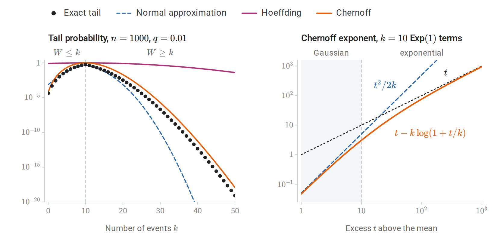

*For the number of events in $`1{,}000`$ trials of probability $`0.01`$ (left), Hoeffding's bound hardly decreases, the Normal approximation falls far below the exact upper tail, and the Chernoff bound stays close to the exact tail on both sides of the mean. The Chernoff exponent for a sum of ten Exp$`(1)`$ variables (right) grows like $`t^2`$ near the mean and like $`t`$ beyond $`t\approx k`$.*

#### <a id="matrix-bounds-and-high-dimension"></a>Matrix bounds and high dimension

A version of Bernstein's inequality holds for sums of random matrices, at the cost of a dimension factor. For independent, centered, symmetric $`d\times d`$ random matrices $`S_i`$ with spectral norms $`\|S_i\|\le L`$ and $`v=\|\sum_i\mathbb E[S_i^2]\|`$, the **matrix Bernstein inequality** gives

$$
P\Big(\Big\|\sum_iS_i\Big\|\ge t\Big)\le2d\exp\Big(-\frac{t^2/2}{v+Lt/3}\Big).
$$

The dimension enters only through the factor $`d`$, so the typical deviation grows only logarithmically with dimension: it is of order $`\sqrt{v\log d}+L\log d`$. Bounds of this kind control how quickly sample covariance matrices approach their population values. A simpler high-dimensional fact comes from the chi-square law: for $`G\sim\mathcal N(0,I_d)`$, $`\|G\|^2\sim\chi^2_d`$ has mean $`d`$ and variance $`2d`$, so $`\|G\|/\sqrt d\xrightarrow{p}1`$ as $`d`$ grows. A standard Gaussian vector in high dimension lies near the sphere of radius $`\sqrt d`$, far from the origin where its density is largest. Vershynin's [*High-Dimensional Probability*](https://webapps.math.uci.edu/~rvershyn/papers/HDP-book/HDP-book.html) develops these tools and their applications.

#### <a id="almost-sure-convergence-and-the-borelcantelli-lemmas"></a>Almost-sure convergence and the Borel–Cantelli lemmas

Almost-sure statements concern infinitely many events at once. Write $`\{A_n\text{ i.o.}\}`$ for the event that infinitely many of the events $`A_n`$ occur. The **first Borel–Cantelli lemma** states that if $`\sum_nP(A_n)<\infty`$, then $`P(A_n\text{ i.o.})=0`$. For every $`N`$,

$$
P(A_n\text{ i.o.})\le P\Big(\bigcup_{n\ge N}A_n\Big)\le\sum_{n\ge N}P(A_n),
$$

and the right side tends to zero. The **second lemma** is a partial converse: if the events are independent and $`\sum_nP(A_n)=\infty`$, then $`P(A_n\text{ i.o.})=1`$.

Applied to $`A_n=\{|T_n-T|>\varepsilon\}`$, the first lemma shows that summable deviation probabilities give almost-sure convergence. Convergence in probability alone does not. Let the events $`A_n`$ be independent with $`P(A_n)=1/n`$, and set $`T_n=\mathbf1_{A_n}`$. Then $`T_n\xrightarrow{p}0`$, but the probabilities have an infinite sum, so by the second lemma $`T_n=1`$ infinitely often: $`T_n`$ does not converge to zero almost surely.

#### <a id="passing-limits-through-functions-and-expectations"></a>Passing limits through functions and expectations

If $`T_n\Rightarrow T`$ and $`g`$ is continuous, the **continuous mapping theorem** gives $`g(T_n)\Rightarrow g(T)`$. **Slutsky's theorem** states that if also $`S_n\xrightarrow{p}c`$, then $`T_n+S_n\Rightarrow T+c`$ and $`T_nS_n\Rightarrow cT`$, with a corresponding ratio result when $`c\ne0`$. The two sequences need not be independent. These results justify replacing fixed nuisance quantities by consistent estimates in many asymptotic calculations.

Convergence of random variables does not automatically imply convergence of their expectations. A useful sufficient condition is **dominated convergence**: if $`T_n\to T`$ almost surely and $`|T_n|\le H`$ for every $`n`$, with $`\mathbb EH<\infty`$, then $`\mathbb ET_n\to\mathbb ET`$. Without control of tails, rare increasingly large values can prevent convergence of means. For example, let $`U\sim\operatorname{Unif}(0,1)`$ and $`T_n=n\mathbf1_{\{U\le1/n\}}`$. Then $`T_n\to0`$ almost surely, while $`\mathbb ET_n=1`$ for all $`n`$.

</details>


<details>
<summary><a id="block-probability-appendix-d"></a><b>D. Markov chains, Poisson processes, and martingales</b></summary>


A **stochastic process** is a collection of random variables indexed by time and defined on one probability space. The processes below are the simplest models of dependence over time. Later modules use them for sequence models, reinforcement learning, and sampling algorithms.

#### <a id="markov-chains"></a>Markov chains

A sequence $`X_0,X_1,\ldots`$ on a finite or countable state space is a **Markov chain** if the next state depends on the past only through the present:

$$
P(X_{t+1}=j\mid X_t=i,X_{t-1},\ldots,X_0)=P(X_{t+1}=j\mid X_t=i)=P_{ij}.
$$

The **transition matrix** $`P`$ has nonnegative entries and rows summing to one, and the $`k`$-step transition probabilities are the entries of $`P^k`$. If the row vector $`\pi_t`$ holds the distribution of $`X_t`$, then $`\pi_{t+1}=\pi_tP`$. A **stationary distribution** satisfies $`\pi P=\pi`$. A finite chain in which every state can reach every other state has exactly one stationary distribution; if the chain is also aperiodic, the distribution of $`X_t`$ converges to it from any starting state. The **detailed balance** condition $`\pi_iP_{ij}=\pi_jP_{ji}`$ implies stationarity, and Markov chain Monte Carlo methods are constructed to satisfy it for a target distribution. A random walk on a connected undirected graph, which moves to a uniformly chosen neighbor, has stationary probabilities proportional to the vertex degrees.

**First-step analysis** computes hitting probabilities and times by conditioning on the first move. For a fair random walk on $`\{0,1,\ldots,N\}`$ started at $`k`$, the probability $`h_k`$ of reaching $`N`$ before $`0`$ satisfies $`h_0=0`$, $`h_N=1`$, and $`h_k=\tfrac12h_{k-1}+\tfrac12h_{k+1}`$, so $`h_k=k/N`$. The expected time $`m_k`$ until the walk reaches either end satisfies $`m_0=m_N=0`$ and $`m_k=1+\tfrac12m_{k-1}+\tfrac12m_{k+1}`$, so $`m_k=k(N-k)`$.

#### <a id="poisson-and-renewal-processes"></a>Poisson and renewal processes

The Poisson process of the main text has a further symmetry: given that exactly $`n`$ events occur in $`[0,T]`$, their times are distributed as $`n`$ iid $`\operatorname{Unif}(0,T)`$ points in sorted order. Replacing its exponential gaps by any iid positive gaps $`T_1,T_2,\ldots`$ with finite mean gives a **renewal process**. Its number of events $`N(t)`$ up to time $`t`$ satisfies $`N(t)/t\to1/\mathbb ET_1`$ almost surely. The argument is a law-of-large-numbers sandwich: the time of event $`N(t)`$ is at most $`t`$, the time of event $`N(t)+1`$ exceeds $`t`$, and both are sums of gaps whose averages converge to $`\mathbb ET_1`$.

#### <a id="martingales"></a>Martingales

A sequence $`M_0,M_1,\ldots`$ is a **martingale** with respect to the information $`\mathcal F_t`$ available at time $`t`$ if $`\mathbb E|M_t|<\infty`$ and $`\mathbb E[M_{t+1}\mid\mathcal F_t]=M_t`$: given the past, the expected next value is the current one. A gambler's fortune in a sequence of fair bets is the standard example. By the tower property, $`\mathbb EM_t=\mathbb EM_0`$ at every fixed time $`t`$. The **optional stopping theorem** extends this to a random stopping time $`\tau`$ under conditions such as a bounded $`\tau`$, or bounded increments together with $`\mathbb E\tau<\infty`$. The conditions matter. A fair walk started at $`0`$ and stopped when it first reaches $`+1`$ ends at $`1`$ with probability one, so $`\mathbb EM_\tau=1\ne0`$; this stopping time is finite with probability one but has infinite mean.

</details>


<details>
<summary><a id="block-probability-appendix-e"></a><b>E. Statistics: estimation theory</b></summary>


#### <a id="method-of-moments"></a>Method of moments

The **method of moments** matches expectations implied by a model to averages observed in the sample. Choose functions $`h_1,\ldots,h_k`$ and solve

$$
\mathbb E_{\widehat\theta}[h_j(Z)]
=\frac1n\sum_{i=1}^n h_j(Z_i),\qquad j=1,\ldots,k.
$$

The choices $`h_1(z)=z`$ and $`h_2(z)=z^2`$ match the first two raw moments. Matching Bernoulli or Poisson means gives $`\widehat p=\overline Z`$ or $`\widehat\lambda=\overline Z`$. In an Exponential model parameterized by its rate $`\lambda`$, the mean is $`1/\lambda`$, so $`\widehat\lambda=1/\overline Z`$.

The method becomes an application of the law of large numbers followed by inversion. If the moment map is identifiable and its inverse is continuous at the population moments, consistency follows. A differentiable inverse and a suitable multivariate CLT also give asymptotic normality through the delta method. The selected moments may fail to identify the parameter, or the sample equations may have no admissible solution. Even when solutions exist, different moment choices can have different variances.

Two-parameter families need two moments. A $`\operatorname{Gamma}(\alpha,\lambda)`$ model has mean $`\alpha/\lambda`$ and variance $`\alpha/\lambda^2`$; matching them to $`\overline Z`$ and $`\widehat v_n`$ gives $`\widehat\lambda=\overline Z/\widehat v_n`$ and $`\widehat\alpha=\overline Z^2/\widehat v_n`$. Matching fails when the sample moments are incompatible with the family. Every beta law with mean $`m`$ has variance below $`m(1-m)`$, so a sample of fractions with $`\widehat v_n\ge\overline Z(1-\overline Z)`$ has no beta method-of-moments fit.

#### <a id="sufficiency-and-raoblackwellization"></a>Sufficiency and Rao–Blackwellization

A statistic $`S(D)`$ is **sufficient** for $`\theta`$ if the conditional distribution of the full data given $`S(D)`$ does not depend on $`\theta`$. Under the usual dominated-model assumptions, the factorization criterion expresses this as

$$
p_\theta(z_1,\ldots,z_n)=g_\theta(S(z_1,\ldots,z_n))h(z_1,\ldots,z_n),
$$

where $`h`$ is independent of $`\theta`$. All parameter dependence in the likelihood is retained by $`S`$.

For iid Bernoulli observations, $`S=\sum_i Z_i`$ is sufficient. Conditional on $`S=k`$, all binary sequences with $`k`$ successes have the same probability, independent of $`p`$. For iid Poisson counts, the likelihood $`\lambda^{\sum_iz_i}e^{-n\lambda}/\prod_iz_i!`$ depends on $`\lambda`$ only through $`\sum_iz_i`$, so $`\sum_iZ_i`$ is sufficient. For iid Normal observations with unknown mean and variance, $`(\sum_i Z_i,\sum_i Z_i^2)`$ is sufficient. Sufficiency is relative to the chosen model: discarding order is appropriate under an iid model, but can discard information about temporal dependence in a richer model.

Conditioning an estimator on a sufficient statistic gives a useful improvement principle. If $`\widetilde\tau=\mathbb E[\widehat\tau\mid S]`$, sufficiency makes this conditional expectation computable without knowing $`\theta`$. The tower property preserves its expectation, while total variance gives $`\operatorname{Var}(\widetilde\tau)\le\operatorname{Var}(\widehat\tau)`$. This **Rao–Blackwellization** preserves bias and cannot increase MSE.

#### <a id="exponential-families-and-moment-matching"></a>Exponential families and moment matching

Many of the families in the main text share one algebraic form. An **exponential family** has densities or mass functions

$$
p_\eta(z)=h(z)\exp\{\eta^\top t(z)-A(\eta)\},
\qquad
A(\eta)=\log\int h(z)e^{\eta^\top t(z)}\,d\nu(z),
$$

with **natural parameter** $`\eta`$, a vector $`t(z)`$ of sufficient-statistic contributions, a base function $`h`$ that does not depend on $`\eta`$, and a log-normalizer $`A`$ that makes the total probability one. Here $`\nu`$ is a fixed reference measure, and the integral includes summation as a discrete special case. The support is assumed independent of $`\eta`$. The Poisson law has $`t(z)=z`$, $`\eta=\log\lambda`$, and $`A(\eta)=e^\eta`$, and the Bernoulli law is worked out below. Normal, gamma, beta, categorical, and Dirichlet laws are also exponential families; uniform laws with an unknown endpoint are not, because their support depends on the parameter.

When differentiation under the integral is valid,

$$
\nabla A(\eta)=\mathbb E_\eta[t(Z)],
\qquad
\nabla^2 A(\eta)=\operatorname{Cov}_\eta(t(Z)).
$$

The Hessian is positive semidefinite, so $`A`$ is convex. The score for one observation is $`t(Z)-\nabla A(\eta)`$, and its Fisher information is exactly $`\nabla^2A(\eta)`$. For an iid sample,

$$
\log L_n(\eta)
=\eta^\top\sum_i t(z_i)-nA(\eta)+\sum_i\log h(z_i).
$$

Factorization proves that $`\sum_i t(Z_i)`$ is sufficient. The log-likelihood is concave, and any interior MLE obeys

$$
\mathbb E_{\widehat\eta}[t(Z)]
=\frac1n\sum_i t(z_i).
$$

Thus maximum likelihood is moment matching for the natural statistic. This does not guarantee an interior solution; boundary datasets can put the desired mean statistic beyond what finite natural parameters achieve.

For Bernoulli data, $`t(z)=z`$, $`\eta=\log[p/(1-p)]`$, and $`A(\eta)=\log(1+e^\eta)`$. Therefore $`A'(\eta)=p`$ and $`A''(\eta)=p(1-p)`$. Fisher information depends on parameterization: in the $`p`$ coordinate it is $`1/[p(1-p)]`$, while in the log-odds coordinate it is $`p(1-p)`$. The derivative $`dp/d\eta=p(1-p)`$ accounts for the transformation. Information is a local quadratic form, rather than a coordinate-independent numerical value for a scalar parameter.

Exponential families also have conjugate priors, which make Bayesian updating exact ([Appendix H](#block-probability-appendix-h)). Generalized linear models, including logistic regression, connect the natural parameter to a linear function of inputs.

#### <a id="the-cramerrao-bound"></a>The Cramér–Rao bound

The scalar **Cramér–Rao bound** makes the information–variance connection precise. If an estimator $`\widehat\tau`$ is unbiased for a differentiable target $`\tau(\theta)`$ in a regular scalar model, then

$$
\operatorname{Var}_\theta(\widehat\tau)
\ge\frac{[\tau'(\theta)]^2}{I_n(\theta)}.
$$

Indeed, differentiating unbiasedness gives $`\operatorname{Cov}_\theta(\widehat\tau,U_n)=\tau'(\theta)`$, and Cauchy–Schwarz gives the inequality. For Bernoulli data, $`I_1(p)=1/[p(1-p)]`$, and $`\widehat p`$ attains the bound $`p(1-p)/n`$ for $`0<p<1`$. Biased estimators are not subject to this particular bound. The maximum likelihood estimator's limiting covariance $`I_1(\theta_\ast)^{-1}/n`$ from the main text attains the bound only asymptotically.

#### <a id="completeness-and-optimal-unbiased-estimators"></a>Completeness and optimal unbiased estimators

Rao–Blackwellization improves an estimator by conditioning it on a sufficient statistic. Completeness says when the result is the best unbiased estimator. A statistic $`S`$ is **complete** if $`\mathbb E_\theta[g(S)]=0`$ for every $`\theta`$ forces $`g(S)=0`$ with probability one under every $`\theta`$: no nontrivial function of $`S`$ has expectation zero throughout the model. For an exponential family in a minimal representation whose natural parameters fill an open set, the natural statistic $`\sum_it(Z_i)`$ is complete.

The **Lehmann–Scheffé theorem** states that an unbiased estimator that is a function of a complete sufficient statistic has the smallest variance among all unbiased estimators, at every parameter value, and is the unique such estimator. Rao–Blackwellizing any unbiased estimator onto a complete sufficient statistic therefore produces this uniformly minimum-variance unbiased estimator. For Bernoulli data, $`\overline Z`$ is unbiased and a function of the complete sufficient statistic $`\sum_iZ_i`$, so no unbiased estimator of $`p`$ has smaller variance.

A statistic is **ancillary** if its distribution does not depend on $`\theta`$. **Basu's theorem** states that a complete sufficient statistic is independent of every ancillary statistic. For Normal data with known variance, $`\overline Z`$ is complete and sufficient for $`\mu`$, while $`S^2`$ is unchanged when every observation is shifted by the same amount and is therefore ancillary. Hence $`\overline Z`$ and $`S^2`$ are independent, a second proof of the fact behind the $`t`$ interval.

#### <a id="misspecification-and-sandwich-covariance"></a>Misspecification and sandwich covariance

For iid observations from $`P_\ast`$, maximum likelihood in a possibly misspecified family targets a population maximizer $`\theta^\dagger`$ of $`\mathbb E_{P_\ast}[\log p_\theta(Z)]`$. Write $`s_\theta(Z)=\nabla_\theta\log p_\theta(Z)`$ for one observation's score.

At an interior optimum, define the population curvature and score variability

$$
A=-\mathbb E_{P_*}[\nabla_\theta^2\log p_{\theta^\dagger}(Z)],
\qquad
B=\mathbb E_{P_*}[s_{\theta^\dagger}(Z)s_{\theta^\dagger}(Z)^\top].
$$

Under iid sampling and the appropriate differentiability, moment, consistency, and nonsingularity conditions, the same score expansion gives asymptotic covariance $`A^{-1}BA^{-1}/n`$ for the estimator. This is the **sandwich covariance**. Under correct specification, the information identity gives $`A=B=I_1`$, recovering inverse Fisher information. Under misspecification, equating curvature with score variance can produce incorrect standard errors.

The empirical sandwich estimates $`A`$ by average negative Hessians and $`B`$ by average outer products of scores at the fitted parameter. It addresses this form of variance misspecification. It does not change the estimand or repair omitted variables, dependence, or selection bias; those require assumptions and methods matched to their own structure.

#### <a id="influence-functions-and-robustness"></a>Influence functions and robustness

A statistical functional $`T(P)`$ can be perturbed by mixing a small amount of mass at a point $`z`$ into the population. Its **influence function**, when this derivative exists, is

$$
\operatorname{IF}(z;T,P)
=\left.\frac{d}{d\varepsilon}
T\big((1-\varepsilon)P+\varepsilon\delta_z\big)
\right|_{\varepsilon=0^+}.
$$

This is a derivative with respect to the distribution. It measures the first-order effect of an infinitesimal contamination at $`z`$, rather than the effect of changing a parameter coordinate.

For the mean, the contaminated mean is $`(1-\varepsilon)\mu+\varepsilon z`$, so $`\operatorname{IF}(z;\mu,P)=z-\mu`$. Its unbounded magnitude expresses the mean's sensitivity to extreme observations. For a quantile $`q_u=F^{-1}(u)`$, assume a continuous positive density at $`q_u`$. At points away from $`q_u`$, differentiating the defining equation for the contaminated quantile gives

$$
\operatorname{IF}(z;q_u,P)
=\frac{u-\mathbf1\{z\le q_u\}}{p(q_u)}.
$$

The numerator is bounded, but a small density at the target quantile makes the sensitivity large. The graph of the CDF is then nearly flat near its crossing of level $`u`$.

Many regular estimators admit an **asymptotically linear expansion**

$$
\widehat\tau-\tau
=\frac1n\sum_{i=1}^n\operatorname{IF}(Z_i;T,P_*)
+o_p(n^{-1/2}).
$$

Here $`R_n=o_p(a_n)`$ means $`R_n/a_n\xrightarrow{p}0`$. If the influence values have mean zero and finite variance, the CLT gives asymptotic variance $`\mathbb E[\operatorname{IF}(Z;T,P_\ast)^2]`$. For a median with positive density at its unique population value $`m`$, this yields $`1/[4p(m)^2]`$, and hence an approximate estimator variance $`1/[4np(m)^2]`$.

This representation explains why otherwise complicated statistics can have simple asymptotic distributions and why empirical resampling often works. Its validity must be proved for the statistic and population under consideration. Differentiability as an ordinary finite-dimensional formula is not by itself enough to establish differentiability as a functional of a probability distribution.

#### <a id="a-nonregular-endpoint-problem"></a>A nonregular endpoint problem

Let $`Z_i\overset{\mathrm{iid}}{\sim}\operatorname{Unif}(0,\theta)`$ with $`\theta>0`$, and write $`M_n=\max_i Z_i`$. The likelihood is

$$
L_n(\theta)=\theta^{-n}\mathbf1\{\theta\ge M_n\},
$$

so $`\widehat\theta=M_n`$. The maximum comes from the support constraint, rather than a vanishing score. For $`0\le x\le\theta`$,

$$
P_\theta(M_n\le x)=\left(\frac{x}{\theta}\right)^n,
\qquad
\mathbb E_\theta[M_n]=\frac{n}{n+1}\theta.
$$

The MLE is biased downward. Multiplying by $`(n+1)/n`$ removes its bias, but both versions have a faster rate than the usual $`n^{-1/2}`$ parameter error. For fixed $`t\ge0`$ and sufficiently large $`n`$,

$$
P_\theta\!\left(\frac{n(\theta-M_n)}{\theta}>t\right)
=\left(1-\frac tn\right)^n\longrightarrow e^{-t}.
$$

The scaled error converges to $`\operatorname{Exp}(1)`$. Parameter-dependent support invalidates the regular score and information argument.

This example also exposes ordinary-bootstrap failure. Almost surely the observed maximum is unique. In an empirical resample of size $`n`$, it appears with probability $`1-(1-1/n)^n\to1-e^{-1}`$. Hence the bootstrap maximum equals $`M_n`$ with a nonvanishing probability, producing an atom at zero in the bootstrap centered error. The real limiting error is continuous. Increasing the number of resamples reveals this incorrect reference distribution more accurately without fixing it.

#### <a id="jackknife-approximation"></a>Jackknife approximation

For an estimator $`\widehat\tau=t(D)`$, let $`\widehat\tau_{(-i)}`$ be the same estimator computed after deleting observation $`i`$, and set $`\overline\tau_{(-)}=n^{-1}\sum_i\widehat\tau_{(-i)}`$. The **jackknife** variance estimate is

$$
\widehat{\operatorname{Var}}_{\mathrm{jack}}(\widehat\tau)
=\frac{n-1}{n}\sum_{i=1}^n
(\widehat\tau_{(-i)}-\overline\tau_{(-)})^2.
$$

For the sample mean, $`\widehat\tau_{(-i)}=(n\overline Z-Z_i)/(n-1)`$ and $`\overline\tau_{(-)}=\overline Z`$. Substituting gives exactly $`S^2/n`$, the usual estimated variance of the mean. More generally, deletion effects approximate influence values for smooth statistics. The jackknife can be convenient when recomputing an estimator is inexpensive and a closed-form standard error is unavailable. Nonsmooth statistics such as sample maxima and some quantile estimators do not satisfy the smoothness reasoning behind the ordinary jackknife.

The jackknife also estimates bias. With $`\widehat{\operatorname{bias}}_{\mathrm{jack}}=(n-1)(\overline\tau_{(-)}-\widehat\tau)`$, the corrected estimate $`\widehat\tau-\widehat{\operatorname{bias}}_{\mathrm{jack}}=n\widehat\tau-(n-1)\overline\tau_{(-)}`$ removes bias of order $`1/n`$. Applied to the plug-in variance $`\widehat v_n`$, it returns exactly $`S^2`$.

</details>


<details>
<summary><a id="block-probability-appendix-f"></a><b>F. Statistics: intervals and tests</b></summary>


#### <a id="an-exact-interval-for-a-normal-variance"></a>An exact interval for a Normal variance

The chi-square pivot $`(n-1)S^2/\sigma^2`$ gives an exact interval for a Normal variance,

$$
\left[\frac{(n-1)S^2}{\chi^2_{n-1,1-\alpha/2}},\ \frac{(n-1)S^2}{\chi^2_{n-1,\alpha/2}}\right].
$$

Unlike the $`t`$ interval for a mean, this interval depends strongly on the Normal shape of the tails, and it does not become approximately valid for other distributions as $`n`$ grows.

#### <a id="most-powerful-tests-and-the-neymanpearson-lemma"></a>Most powerful tests and the Neyman–Pearson lemma

For two completely specified distributions with joint densities $`f_0(D)`$ and $`f_1(D)`$, the **Neyman–Pearson lemma** identifies a most powerful test of a given size: reject for sufficiently large likelihood ratio $`f_1(D)/f_0(D)`$. Outcomes where the ratio equals the threshold may require randomized rejection to attain size exactly $`\alpha`$. More generally a test function $`\varphi(D)\in[0,1]`$ specifies a rejection probability conditional on the dataset.

The likelihood ratio ranks datasets by how much more strongly they support the specified alternative than the null. Rejecting at the largest ratios uses the allowed false-rejection probability where it produces the greatest power. The result is for a specified alternative.

The proof is a short comparison. Let $`\varphi_\ast`$ reject where $`f_1>cf_0`$, with threshold $`c\ge0`$ and boundary randomization chosen for size $`\alpha`$. This also specifies rejection when $`f_0=0<f_1`$. Let $`\varphi`$ be any test of size at most $`\alpha`$. By construction,

$$
(\varphi_* - \varphi)(f_1-cf_0)\ge0
$$

at every dataset: above the threshold $`\varphi_\ast=1`$, and below it $`\varphi_\ast=0`$. Integrating gives

$$
\mathbb E_1[\varphi_*]-\mathbb E_1[\varphi]
\ge c\{\mathbb E_0[\varphi_*]-\mathbb E_0[\varphi]\}\ge0.
$$

Thus its power is at least that of every competitor with the same error constraint.

A test that is most powerful against every alternative in a composite set is **uniformly most powerful**. Such tests rarely exist against two-sided alternatives, but they do exist for one-sided hypotheses when the model has a **monotone likelihood ratio** in a statistic $`T`$: for $`\theta_1>\theta_0`$, the ratio $`p_{\theta_1}(D)/p_{\theta_0}(D)`$ is a nondecreasing function of $`T(D)`$. The Neyman–Pearson test then rejects for large $`T`$ whichever alternative $`\theta_1>\theta_0`$ is considered; this is the **Karlin–Rubin theorem**. One-parameter exponential families have a monotone likelihood ratio in $`\sum_it(Z_i)`$ when the natural parameter increases with $`\theta`$.

#### <a id="wald-likelihood-ratio-and-score-tests"></a>Wald, likelihood-ratio, and score tests

Regular likelihood theory supplies three related tests. For a scalar null $`\theta=\theta_0`$ with no nuisance parameters,

| Test | Statistic | Where the model is evaluated |
| --- | --- | --- |
| Wald | $`(\widehat\theta-\theta_0)^2/\widehat{\operatorname{SE}}(\widehat\theta)^2`$ | At the unrestricted estimate |
| Likelihood ratio | $`2[\log L_n(\widehat\theta)-\log L_n(\theta_0)]`$ | At the unrestricted estimate and the null |
| Score | $`U_n(\theta_0)^2/I_n(\theta_0)`$ | At the null |

Under the null and regularity conditions, each converges to $`\chi^2_1`$. Testing $`r`$ independent smooth restrictions in a regular finite-dimensional model generally gives $`\chi^2_r`$, with nuisance parameters handled by the appropriate constrained fits and information matrices. These procedures become locally equivalent asymptotically but can differ substantially in finite samples. Boundaries, unidentified parameters, and growing parameter dimension require separate analysis.

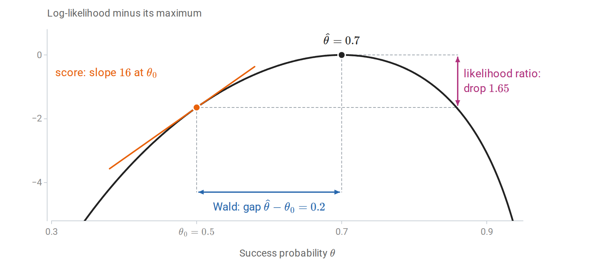

*Three measures of how far the maximum likelihood estimate lies from a null value $`\theta_0`$ on one log-likelihood curve: the horizontal gap (Wald), the drop in height (likelihood ratio), and the slope at the null (score).*

The chi-square limit of the likelihood-ratio statistic is **Wilks' theorem**, and the next subsection sketches why it holds.

#### <a id="why-the-likelihood-ratio-statistic-is-chi-square"></a>Why the likelihood-ratio statistic is chi-square

Near its maximum, a regular log-likelihood is approximately quadratic,

$$
\log L_n(\theta)\approx\log L_n(\widehat\theta)-\tfrac12(\theta-\widehat\theta)^\top J_n(\widehat\theta)(\theta-\widehat\theta),
$$

and $`\widehat\theta`$ is approximately $`\mathcal N(\theta_\ast,J_n(\widehat\theta)^{-1})`$. In coordinates where $`J_n`$ becomes the identity, the estimate is approximately a standard Normal vector centered at the truth, and log-likelihood differences are half squared Euclidean distances. A null hypothesis that imposes $`r`$ smooth restrictions confines the parameter to a surface through the truth, approximately an affine subspace of codimension $`r`$, and the restricted maximum is approximately the projection of the estimate onto it. Twice the drop in log-likelihood is then the squared length of the component of a standard Normal vector along $`r`$ orthogonal directions, which has the $`\chi^2_r`$ distribution.

#### <a id="goodness-of-fit-and-contingency-tables"></a>Goodness of fit and contingency tables

Counts in $`k`$ categories are often tested against specified category probabilities $`q_1,\ldots,q_k`$. With observed counts $`O_j`$ and expected counts $`E_j=nq_j`$, **Pearson's chi-square statistic** is

$$
X^2=\sum_{j=1}^k\frac{(O_j-E_j)^2}{E_j}.
$$

Under the null and for large expected counts, it is approximately $`\chi^2_{k-1}`$; one degree of freedom is lost because the counts must sum to $`n`$. Each estimated parameter used to compute the $`E_j`$ removes one more.

For an $`r\times c`$ table of counts $`O_{ij}`$ with row totals $`n_{i+}`$ and column totals $`n_{+j}`$, independence of the row and column variables predicts $`E_{ij}=n_{i+}n_{+j}/n`$. The same statistic is then approximately $`\chi^2_{(r-1)(c-1)}`$. A common rule of thumb asks for expected counts of at least about five; exact or permutation tests handle sparse tables. For a $`2\times2`$ table, $`X^2`$ equals the square of the pooled two-proportion statistic $`Z`$ of the main text, so the two tests agree:

```python
import numpy as np
from scipy.stats import norm, chi2_contingency

conversions = np.array([200, 250])
users = np.array([2000, 2000])
rates = conversions / users
pooled = conversions.sum() / users.sum()
z = (rates[1] - rates[0]) / np.sqrt(pooled * (1 - pooled) * (1 / users).sum())
print("z:", z, "two-sided p:", 2 * norm.sf(abs(z)))
se_diff = np.sqrt((rates * (1 - rates) / users).sum())
print("95% interval for the difference:",
      rates[1] - rates[0] + np.array([-1, 1]) * norm.ppf(0.975) * se_diff)

table = np.column_stack([conversions, users - conversions])
chi2, p, dof, expected = chi2_contingency(table, correction=False)
print("Pearson chi-square:", chi2, "z squared:", z**2, "p:", p)
```

The [SciPy `chi2_contingency` documentation](https://docs.scipy.org/doc/scipy/reference/generated/scipy.stats.chi2_contingency.html) describes the continuity correction that it applies by default to $`2\times2`$ tables; it is switched off here to match the $`z`$ statistic.

#### <a id="rank-based-and-distribution-free-tests"></a>Rank-based and distribution-free tests

Replacing observations by signs or ranks gives tests whose null distributions do not depend on the population distribution. The **sign test** for a median $`m_0`$ counts observations above $`m_0`$; for continuous data the count is $`\operatorname{Binomial}(n,1/2)`$ under the null. The **Wilcoxon signed-rank test** also uses the ranks of $`|Z_i-m_0|`$ and tests symmetry about $`m_0`$. The **Mann–Whitney**, or Wilcoxon rank-sum, test compares two independent samples through the ranks of the pooled observations and is sensitive to one population tending to produce larger values than the other. The **Kolmogorov–Smirnov** statistic $`\sup_x|\widehat F_n(x)-F_0(x)|`$ tests a fully specified continuous distribution $`F_0`$ and has the same null distribution for every such $`F_0`$. The rank and sign tests are permutation tests applied to ranks or signs; they trade some power under Normal models for validity under weaker assumptions.

</details>


<details>
<summary><a id="block-probability-appendix-g"></a><b>G. Linear regression: geometry, diagnostics, and identification</b></summary>


The main text treats linear regression as a model for a conditional mean and gives its least-squares estimator, exact Gaussian intervals, and prediction intervals. This appendix collects the geometry behind those results, the partial-regression view of a coefficient, per-observation diagnostics, corrections for non-spherical errors, and the assumptions needed before a coefficient can be read causally. The notation is that of the main text: $`\mathbf X\in\mathbb R^{n\times d}`$ has full column rank and includes any intercept column, $`\widehat\beta=(\mathbf X^\top\mathbf X)^{-1}\mathbf X^\top\mathbf Y`$, and $`\widehat\sigma^2=\mathrm{RSS}/(n-d)`$.

#### <a id="projection-geometry-and-the-variance-decomposition"></a>Projection geometry and the variance decomposition

The fitted vector is $`\widehat{\mathbf Y}=\mathbf X\widehat\beta=\mathbf H\mathbf Y`$, with the **hat matrix** $`\mathbf H=\mathbf X(\mathbf X^\top\mathbf X)^{-1}\mathbf X^\top`$. The residual vector is $`\mathbf e=\mathbf Y-\widehat{\mathbf Y}=\mathbf M\mathbf Y`$, with the **residual maker** $`\mathbf M=\mathbf I-\mathbf H`$. Both matrices are symmetric and idempotent: $`\mathbf H`$ is the orthogonal projection onto the column space of $`\mathbf X`$, and $`\mathbf M`$ is the projection onto its orthogonal complement. The normal equations say $`\mathbf X^\top\mathbf e=0`$, so the residuals are orthogonal to every column and to the fitted vector: $`\widehat{\mathbf Y}^\top\mathbf e=\widehat\beta^\top\mathbf X^\top\mathbf e=0`$. The trace $`\operatorname{tr}\mathbf H=\operatorname{tr}[(\mathbf X^\top\mathbf X)^{-1}\mathbf X^\top\mathbf X]=d`$ counts the fitted coefficients. For any linear smoother $`\widehat{\mathbf Y}=\mathbf S\mathbf Y`$, such as ridge regression, $`\operatorname{tr}\mathbf S`$ is called its **effective degrees of freedom**.

With one covariate and an intercept, the normal equations give

$$
\widehat\beta_1=\frac{\sum_i(x_i-\bar x)(Y_i-\bar Y)}{\sum_i(x_i-\bar x)^2},
\qquad
\widehat\beta_0=\bar Y-\widehat\beta_1\bar x.
$$

The slope is the sample covariance of covariate and response divided by the sample variance of the covariate, and the fitted line passes through $`(\bar x,\bar Y)`$. When the model contains an intercept, the column of ones is one of the columns orthogonal to $`\mathbf e`$, so the residuals sum to zero. Since $`\widehat{\mathbf Y}-\bar Y\mathbf 1`$ then lies in the column space and $`\mathbf e`$ is orthogonal to it, Pythagoras splits the total variation:

$$
\mathrm{TSS}=\sum_i(Y_i-\bar Y)^2
=\sum_i(\widehat Y_i-\bar Y)^2+\sum_i(Y_i-\widehat Y_i)^2
=\mathrm{ESS}+\mathrm{RSS}.
$$

Hence $`R^2=1-\mathrm{RSS}/\mathrm{TSS}=\mathrm{ESS}/\mathrm{TSS}`$ lies in $`[0,1]`$. Chapter 2 develops this projection geometry.

#### <a id="proof-of-the-gaussmarkov-theorem"></a>Proof of the Gauss–Markov theorem

Assume $`\mathbb E[\varepsilon\mid\mathbf X]=0`$ and $`\operatorname{Cov}(\varepsilon\mid\mathbf X)=\sigma^2I_n`$. Any estimator that is linear in $`\mathbf Y`$ can be written $`\widetilde\beta=[(\mathbf X^\top\mathbf X)^{-1}\mathbf X^\top+\mathbf D]\mathbf Y`$ for a $`d\times n`$ matrix $`\mathbf D`$ that may depend on $`\mathbf X`$. Its conditional mean is $`\beta+\mathbf D\mathbf X\beta`$, so unbiasedness for every $`\beta`$ forces $`\mathbf D\mathbf X=0`$. The cross terms then vanish, and

$$
\operatorname{Cov}(\widetilde\beta\mid\mathbf X)
=\sigma^2(\mathbf X^\top\mathbf X)^{-1}+\sigma^2\mathbf D\mathbf D^\top.
$$

Since $`\mathbf D\mathbf D^\top`$ is positive semidefinite, every linear combination $`a^\top\widetilde\beta`$ has conditional variance at least that of $`a^\top\widehat\beta`$, with equality for every $`a`$ only when $`\mathbf D=0`$.

#### <a id="the-f-test-for-nested-regressions"></a>The F test for nested regressions

To test whether $`q`$ added columns improve a nested linear model, compare the residual sum of squares $`\mathrm{RSS}_0`$ of the smaller model with the residual sum of squares $`\mathrm{RSS}`$ of the full model with $`d`$ columns:

$$
F=\frac{(\mathrm{RSS}_0-\mathrm{RSS})/q}{\mathrm{RSS}/(n-d)}.
$$

Under the Gaussian model and the null hypothesis that the added coefficients are zero, $`F\sim F_{q,n-d}`$ exactly: by the projection argument of the main text, the numerator and denominator are independent scaled chi-square variables with $`q`$ and $`n-d`$ degrees of freedom. For a single added coefficient, $`F`$ is the square of its $`t`$ statistic. More generally, $`r`$ linearly independent restrictions $`\mathbf A\beta=\mathbf b`$ are tested in the same way, with $`\mathrm{RSS}_0`$ from the fit under the restrictions and $`q`$ replaced by $`r`$.

#### <a id="partial-regression-and-the-frischwaughlovell-theorem"></a>Partial regression and the Frisch–Waugh–Lovell theorem

Partition the columns as $`\mathbf X=[\mathbf X_1\ \mathbf X_2]`$, with coefficient blocks $`\beta_1`$ and $`\beta_2`$, and let $`\mathbf M_1=\mathbf I-\mathbf X_1(\mathbf X_1^\top\mathbf X_1)^{-1}\mathbf X_1^\top`$ be the residual maker of $`\mathbf X_1`$. The **Frisch–Waugh–Lovell theorem** states that the block $`\widehat\beta_2`$ of the full least-squares fit equals the coefficient from regressing $`\mathbf M_1\mathbf Y`$ on $`\mathbf M_1\mathbf X_2`$:

$$
\widehat\beta_2=\big[(\mathbf M_1\mathbf X_2)^\top\mathbf M_1\mathbf X_2\big]^{-1}(\mathbf M_1\mathbf X_2)^\top\mathbf M_1\mathbf Y.
$$

The first block of the normal equations gives $`\widehat\beta_1=(\mathbf X_1^\top\mathbf X_1)^{-1}\mathbf X_1^\top(\mathbf Y-\mathbf X_2\widehat\beta_2)`$. Substituting this into the second block, $`\mathbf X_2^\top\mathbf X_1\widehat\beta_1+\mathbf X_2^\top\mathbf X_2\widehat\beta_2=\mathbf X_2^\top\mathbf Y`$, gives $`\mathbf X_2^\top\mathbf M_1\mathbf X_2\widehat\beta_2=\mathbf X_2^\top\mathbf M_1\mathbf Y`$. Because $`\mathbf M_1`$ is symmetric and idempotent, these are the normal equations of the residualized regression.

The matrix $`\mathbf M_1\mathbf X_2`$ is the part of $`\mathbf X_2`$ that $`\mathbf X_1`$ does not explain linearly, and $`\mathbf M_1\mathbf Y`$ is the corresponding part of the response. A multiple-regression coefficient is therefore a **partial** association: it describes how the response and a covariate vary together after the linear influence of the other covariates has been removed from both. This is why a coefficient changes meaning when the covariate set changes. Taking $`\mathbf X_1`$ to be the intercept column, $`\mathbf M_1`$ subtracts means, so the slopes of a model with an intercept can be computed from centered data.

The theorem also explains collinearity. Under spherical errors, $`\operatorname{Cov}(\widehat\beta_2\mid\mathbf X)=\sigma^2(\mathbf X_2^\top\mathbf M_1\mathbf X_2)^{-1}`$. For a single column $`x_j`$ with the others, including the intercept, in $`\mathbf X_1`$, the quantity $`x_j^\top\mathbf M_1x_j`$ is the residual sum of squares from regressing $`x_j`$ on the other columns, which equals $`(1-R_j^2)\sum_i(x_{ij}-\bar x_j)^2`$. Hence

$$
\operatorname{Var}(\widehat\beta_j\mid\mathbf X)=\frac{\sigma^2}{(1-R_j^2)\sum_i(x_{ij}-\bar x_j)^2},
$$

and the **variance inflation factor** $`\mathrm{VIF}_j=1/(1-R_j^2)`$ is the factor by which correlation with the other columns inflates this variance.

#### <a id="leverage-residuals-and-influence"></a>Leverage, residuals, and influence

The **leverage** of observation $`i`$ is the diagonal entry $`h_{ii}=x_i^\top(\mathbf X^\top\mathbf X)^{-1}x_i`$ of $`\mathbf H`$. It depends only on the covariates, and it is also the self-sensitivity $`\partial\widehat Y_i/\partial Y_i`$ of the fit. Cauchy–Schwarz in the inner product defined by $`\mathbf X^\top\mathbf X`$ gives the variational form

$$
h_{ii}=\max_{a\ne0}\frac{(x_i^\top a)^2}{\sum_{j=1}^n(x_j^\top a)^2},
$$

the largest share of a direction's total squared response that observation $`i`$ supplies on its own. Consequently $`0\le h_{ii}\le1`$, and $`\sum_ih_{ii}=\operatorname{tr}\mathbf H=d`$, so the average leverage is $`d/n`$. The matrix determinant lemma gives $`\det(\mathbf X^\top\mathbf X-x_ix_i^\top)=(1-h_{ii})\det(\mathbf X^\top\mathbf X)`$: a row with leverage near one carries a direction that the other rows barely cover, and $`h_{ii}=1`$ means the design loses full rank without it.

Leverage also governs the residuals. Since $`\mathbf M\mathbf X=0`$, $`\mathbf e=\mathbf M\varepsilon`$, and under spherical errors

$$
\operatorname{Cov}(\mathbf e\mid\mathbf X)=\sigma^2\mathbf M,
\qquad
\operatorname{Var}(e_i\mid\mathbf X)=\sigma^2(1-h_{ii}).
$$

Even with homoskedastic errors the residuals are heteroskedastic: the fit is pulled toward high-leverage responses, so their residuals are the least variable. Dividing each residual by its own estimated standard deviation gives the **internally studentized residual** $`r_i=e_i/(\widehat\sigma\sqrt{1-h_{ii}})`$. Its scale estimate includes observation $`i`$, so an outlier partly masks itself. The **externally studentized residual** uses instead the estimate $`\widehat\sigma_{(i)}`$ computed without observation $`i`$, and under Gaussian errors it has an exact $`t_{n-d-1}`$ distribution.

Deleting observation $`i`$ is a rank-one downdate of $`\mathbf X^\top\mathbf X`$, and the Sherman–Morrison formula gives the change in coefficients without refitting:

$$
\widehat\beta-\widehat\beta_{(i)}=\frac{(\mathbf X^\top\mathbf X)^{-1}x_i\,e_i}{1-h_{ii}}.
$$

The fitted vector moves by $`\mathbf X(\widehat\beta-\widehat\beta_{(i)})`$, whose squared length is $`h_{ii}e_i^2/(1-h_{ii})^2`$. Scaling by $`d\widehat\sigma^2`$ gives **Cook's distance**,

$$
D_i=\frac{\|\widehat{\mathbf Y}-\widehat{\mathbf Y}_{(i)}\|^2}{d\,\widehat\sigma^2}
=\frac{r_i^2}{d}\cdot\frac{h_{ii}}{1-h_{ii}}.
$$

Influence is thus a squared studentized residual times a leverage ratio. It is typically large when an observation is both poorly fit and unusual in its covariates, although extreme leverage alone can also make it large, since $`h_{ii}/(1-h_{ii})`$ is unbounded. A high-leverage point that lies on the fitted surface is not currently pulling the fit, although small changes in its response would move it; a large residual near the center of the design barely moves the coefficients. For example, with $`n=50`$, $`d=2`$, $`h_{ii}=0.30`$, and $`e_i=2\widehat\sigma`$, one finds $`r_i=2/\sqrt{0.7}\approx2.39`$ and $`D_i=2\times0.30/0.49\approx1.22`$. Rules such as $`h_{ii}>2d/n`$ or $`D_i>4/n`$ are screening heuristics. A flagged observation deserves investigation, not automatic deletion.

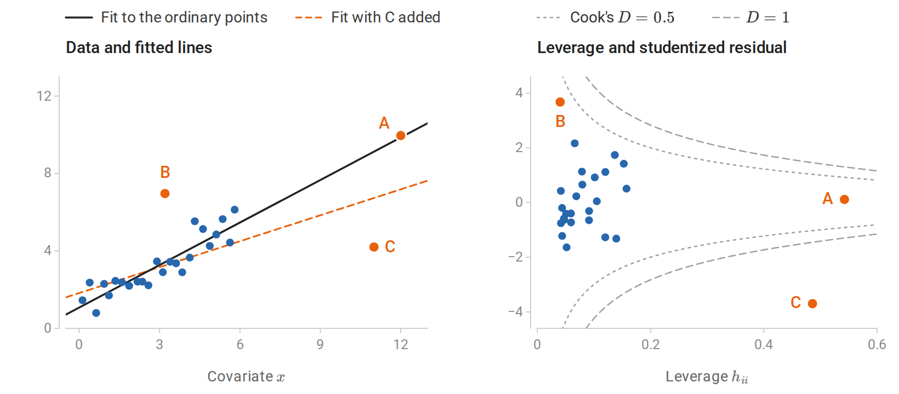

*Each unusual point is added to the $`24`$ ordinary points on its own. A has high leverage but lies on the fitted line, so its Cook's distance is $`0.01`$. B is poorly fit but central, with distance $`0.29`$. C combines high leverage with a large residual, has distance $`6.5`$, and pulls the line toward itself.*

#### <a id="robust-standard-errors-and-weighted-least-squares"></a>Robust standard errors and weighted least squares

If $`\operatorname{Cov}(\varepsilon\mid\mathbf X)=\Omega`$ is not a multiple of the identity, OLS remains unbiased under $`\mathbb E[\varepsilon\mid\mathbf X]=0`$, but $`\sigma^2(\mathbf X^\top\mathbf X)^{-1}`$ is the wrong covariance. The main text's sandwich $`(\mathbf X^\top\mathbf X)^{-1}\mathbf X^\top\Omega\mathbf X(\mathbf X^\top\mathbf X)^{-1}`$ is correct, and replacing $`\Omega`$ by $`\operatorname{diag}(e_i^2)`$ gives the **heteroskedasticity-robust** estimate

$$
\widehat{\operatorname{Cov}}_{\mathrm{HC}}(\widehat\beta)
=(\mathbf X^\top\mathbf X)^{-1}\mathbf X^\top\operatorname{diag}(e_1^2,\ldots,e_n^2)\mathbf X(\mathbf X^\top\mathbf X)^{-1}.
$$

Its variants rescale the squared residuals. Dividing by $`1-h_{ii}`$ removes the leverage bias $`\mathbb E e_i^2=\sigma^2(1-h_{ii})`$ under homoskedasticity, and dividing by $`(1-h_{ii})^2`$ over-corrects on purpose to give conservative standard errors in small samples. Heteroskedasticity-and-autocorrelation-consistent (Newey–West) estimates extend the same form to serially correlated errors. The structure matches the misspecification sandwich of [Appendix E](#block-probability-appendix-e).

When the error variances are known up to a common scale, $`\operatorname{Var}(\varepsilon_i\mid x_i)=\sigma^2/w_i`$, **weighted least squares** gives more weight to the more precise observations:

$$
\widehat\beta_{\mathrm{WLS}}=(\mathbf X^\top\mathbf W\mathbf X)^{-1}\mathbf X^\top\mathbf W\mathbf Y,
\qquad
\mathbf W=\operatorname{diag}(w_1,\ldots,w_n).
$$

**Generalized least squares** handles a full covariance $`\Omega`$ known up to scale, $`\widehat\beta_{\mathrm{GLS}}=(\mathbf X^\top\Omega^{-1}\mathbf X)^{-1}\mathbf X^\top\Omega^{-1}\mathbf Y`$. It is OLS after multiplying the model by $`\Omega^{-1/2}`$, which whitens the errors, so the Gauss–Markov theorem applied to the whitened model shows that GLS is the best linear unbiased estimator. With an estimated $`\Omega`$ these optimality properties hold only approximately.

#### <a id="omitted-variables-measurement-error-and-instruments"></a>Omitted variables, measurement error, and instruments

The main text's omitted-variable formula has a general population form. Suppose $`Y=X^\top\beta+W^\top\gamma+u`$, where $`X`$ includes an intercept, $`\mathbb E[XX^\top]`$ is invertible, and $`\mathbb E[Xu]=0`$. If $`W`$ is omitted, the population least-squares coefficient from regressing $`Y`$ on $`X`$ is

$$
\beta+\big(\mathbb E[XX^\top]\big)^{-1}\mathbb E[XW^\top]\gamma.
$$

The bias is the coefficient of the omitted variables regressed on the included ones, multiplied by their effect. Classical measurement error in a single covariate biases its slope toward zero. If $`Y=\alpha+\beta X+\varepsilon`$ with $`\operatorname{Cov}(X,\varepsilon)=0`$, but the observed covariate is $`\widetilde X=X+U`$ with noise $`U`$ independent of $`X`$ and $`\varepsilon`$, then $`\operatorname{Cov}(\widetilde X,Y)=\beta\operatorname{Var}(X)`$ while $`\operatorname{Var}(\widetilde X)=\operatorname{Var}(X)+\operatorname{Var}(U)`$. The least-squares slope therefore converges to

$$
\beta\,\frac{\operatorname{Var}(X)}{\operatorname{Var}(X)+\operatorname{Var}(U)},
$$

a shrinkage called **attenuation**. With several covariates, the mismeasured one's coefficient is attenuated and the others can be biased in either direction.

Both are cases of **endogeneity**: a covariate correlated with the error term, through an omitted confounder, measurement error, or simultaneous determination of covariate and response. Least squares then converges to the best linear predictor, which differs from the structural coefficient $`\beta`$. Unlike a wrong variance model, which distorts only standard errors, endogeneity changes the estimand, and more data do not remove the bias.

An **instrumental variable** $`Z`$ supplies variation in the covariate that is unrelated to the error. It must be *relevant*, $`\operatorname{Cov}(Z,X)\ne0`$, and *exogenous*, $`\operatorname{Cov}(Z,\varepsilon)=0`$. Exogeneity requires both exclusion, meaning that $`Z`$ affects $`Y`$ only through $`X`$, and the absence of common causes of $`Z`$ and $`Y`$. Taking the covariance of $`Y=\alpha+\beta X+\varepsilon`$ with $`Z`$ gives $`\operatorname{Cov}(Z,Y)=\beta\operatorname{Cov}(Z,X)`$, and the sample analogue is

$$
\widehat\beta_{\mathrm{IV}}=\frac{\widehat{\operatorname{Cov}}(Z,Y)}{\widehat{\operatorname{Cov}}(Z,X)}.
$$

With several instruments and controls, **two-stage least squares** first regresses $`X`$ on the instruments and controls, then regresses $`Y`$ on the fitted values and the controls, using only the instrument-driven variation in $`X`$. A weak instrument makes the denominator nearly zero, so any small violation of exclusion is magnified into a large bias and the variance grows. Instrument relevance must be checked, while exogeneity generally cannot be verified from the data and rests on an argument about how they were generated.

A second design compares changes over time. If a treatment reaches one group at a known date, the **difference-in-differences** estimate is the treated group's change in mean outcome minus the control group's change,

$$
\big(\bar Y^{\mathrm{treat}}_{\mathrm{post}}-\bar Y^{\mathrm{treat}}_{\mathrm{pre}}\big)-\big(\bar Y^{\mathrm{ctrl}}_{\mathrm{post}}-\bar Y^{\mathrm{ctrl}}_{\mathrm{pre}}\big).
$$

It identifies the average effect on the treated under **parallel trends**: without treatment, the two groups' means would have changed by the same amount. It equals the coefficient of a treatment-by-period interaction in a regression with group and period indicators.

Adding controls is not a universal remedy. Conditioning on a variable on the causal path from covariate to response, or on a common effect of the two, can bias a coefficient as much as omitting a confounder. Which variables to include is a question about the causal structure, not about goodness of fit.

#### <a id="computing-least-squares-fits"></a>Computing least-squares fits

Forming $`(\mathbf X^\top\mathbf X)^{-1}`$ explicitly squares the condition number, since $`\kappa(\mathbf X^\top\mathbf X)=\kappa(\mathbf X)^2`$ in the Euclidean norm, so weakly determined directions become much worse. A QR factorization $`\mathbf X=\mathbf Q\mathbf R`$ reduces the problem to the triangular system $`\mathbf R\widehat\beta=\mathbf Q^\top\mathbf Y`$ and is stable for full-rank problems. The singular value decomposition also reveals rank deficiency and the directions responsible for instability. Ridge regression replaces the factor $`1/s_j`$ applied along each singular direction with $`s_j/(s_j^2+\lambda)`$, which damps the weakest directions. Chapter 2 treats these computations.

</details>


<details>
<summary><a id="block-probability-appendix-h"></a><b>H. Bayesian models, computation, and decision criteria</b></summary>


#### <a id="counts-and-a-gamma-prior"></a>Counts and a Gamma prior

The Beta–Bernoulli calculation of the main text works for counts as well. If $`Z_i\mid\lambda\sim\operatorname{Poisson}(\lambda)`$ independently and $`\lambda\sim\operatorname{Gamma}(a_0,b_0)`$ with shape $`a_0`$ and rate $`b_0`$, then

$$
\pi(\lambda\mid D)\propto\lambda^{\sum_iz_i}e^{-n\lambda}\,\lambda^{a_0-1}e^{-b_0\lambda},
\qquad
\lambda\mid D\sim\operatorname{Gamma}\Big(a_0+\sum_iz_i,\ b_0+n\Big).
$$

The prior acts like $`a_0`$ events observed over $`b_0`$ units of exposure. The posterior mean $`(a_0+\sum_iz_i)/(b_0+n)`$ is again a weighted average, of the prior mean $`a_0/b_0`$ and the sample mean, with weights $`b_0`$ and $`n`$. Beta–Bernoulli and Gamma–Poisson updating are instances of one rule: every exponential family has a conjugate prior whose parameters behave like pseudo-observations.

#### <a id="categorical-observations-and-dirichlet-smoothing"></a>Categorical observations and Dirichlet smoothing

The Beta–Bernoulli update extends to $`K`$ categories. Let $`\theta=(\theta_1,\ldots,\theta_K)`$ be category probabilities, with $`\theta_k\ge0`$ and $`\sum_k\theta_k=1`$. A Dirichlet prior with parameters $`\alpha_k>0`$ has density proportional to $`\prod_k\theta_k^{\alpha_k-1}`$ on this simplex. If $`N_k`$ counts observations in category $`k`$, then

$$
\theta\mid D\sim\operatorname{Dirichlet}(\alpha_1+N_1,\ldots,\alpha_K+N_K),
\qquad
P(Z_{\mathrm{new}}=k\mid D)
=\frac{\alpha_k+N_k}{\sum_j\alpha_j+n}.
$$

Every category receives positive predictive probability even if its count is zero. With $`\alpha_k=1`$, this is additive-one smoothing. The probability mass assigned to unseen categories comes from a stated prior, and the total amount depends on the number of categories. In language models with a very large vocabulary, this dependence makes naive additive-one smoothing a consequential choice.

#### <a id="hierarchical-models-and-partial-pooling"></a>Hierarchical models and partial pooling

Suppose group $`j`$ has observations governed by a parameter $`\theta_j`$. A hierarchical model couples these parameters through a shared distribution:

$$
Z_{ij}\mid\theta_j\sim p(\cdot\mid\theta_j),
\qquad
\theta_j\mid\eta\sim\pi(\cdot\mid\eta),
\qquad
\eta\sim\pi_0.
$$

The hyperparameter $`\eta`$ controls similarities between groups. Groups with little data borrow information through the shared distribution; groups with extensive data can remain more distinct. This is **partial pooling**, intermediate between fitting every group independently and forcing every group to share one parameter. **Empirical Bayes** instead estimates hyperparameters from the data and then conditions on their estimates. A plug-in analysis generally omits hyperparameter uncertainty unless it is accounted for separately.

#### <a id="choosing-and-checking-a-prior"></a>Choosing and checking a prior

A prior can encode substantive knowledge, regularize a weakly identified parameter, or serve as a default. A density that is flat in one parameterization is not flat in another, so "uninformative" depends on the coordinates. The **Jeffreys prior** $`\pi(\theta)\propto\sqrt{\det I_1(\theta)}`$ transforms consistently under reparameterization; for a Bernoulli probability it is $`\operatorname{Beta}(1/2,1/2)`$. Some default priors are **improper**, with infinite total mass. Their posteriors can still be proper, but this must be checked before posterior probabilities are used.

Two models can be compared through the ratio of their marginal likelihoods, the **Bayes factor** $`m_1(D)/m_0(D)`$, which multiplies the prior odds of the models just as a likelihood ratio multiplies the odds of two simple hypotheses. Bayes factors can depend strongly on the priors for the parameters within each model, even when the posteriors for those parameters barely do, and improper priors leave them undefined.

Posterior prediction also provides a way to examine model fit. Draw a parameter from the posterior, then draw a replicated dataset from that parameter's sampling model. Compare relevant features of these replicated data with the observations: tail behavior, dispersion, dependence, or other structure the model should explain. A narrow posterior can coexist with a poor predictive fit. Concentration within a model is not evidence that the model family contains the truth.

Prior sensitivity addresses a different issue. If several substantively plausible priors produce materially different conclusions, the sample has not resolved the corresponding uncertainty. Reporting only one posterior can obscure this dependence. Neither posterior predictive checks nor prior sensitivity analysis turns the model into an assumption-free description.

#### <a id="map-estimates-and-parameterization"></a>MAP estimates and parameterization

A posterior density, and therefore its mode, depends on the parameterization. Under a smooth invertible change of coordinates $`\phi=h(\theta)`$ with a smooth inverse, the change-of-variables formula gives

$$
\pi_\phi(\phi\mid D)
=\pi_\theta(h^{-1}(\phi)\mid D)
\left|\det J_{h^{-1}}(\phi)\right|.
$$

The Jacobian factor means that transforming a MAP estimate need not give the MAP estimate in the new coordinates. Posterior probabilities remain consistent when transformed correctly. Likewise, a posterior mean is optimal for squared error in the coordinates in which that loss is defined.

#### <a id="large-sample-agreement-with-likelihood-inference"></a>Large-sample agreement with likelihood inference

In a regular finite-dimensional model with a prior that is continuous and positive near the true parameter, the **Bernstein–von Mises theorem** states that the posterior is approximately $`\mathcal N(\widehat\theta,[nI_1(\theta_\ast)]^{-1})`$ for large $`n`$. The prior's influence fades, and equal-tailed credible intervals approximately coincide with Wald confidence intervals, so each approximately has the other's probability interpretation. The agreement can fail at boundaries, with weakly identified or high-dimensional parameters, and under misspecification, where the posterior concentrates around the pseudo-true parameter with a spread that need not match the estimator's sampling variability.

#### <a id="computing-with-an-intractable-posterior"></a>Computing with an intractable posterior

Conjugate formulas are exceptions. A posterior may be evaluable up to an unknown normalizing constant while its expectations remain difficult to calculate. Several methods address different parts of this problem:

- Numerical quadrature approximates integrals directly and is most practical in low dimension.
- A Laplace approximation expands the log posterior near a smooth interior mode with negative definite Hessian. It uses a Gaussian approximation whose covariance is the inverse of the negative Hessian at that mode.
- Markov chain Monte Carlo constructs a Markov chain targeting the posterior; averages approximate posterior expectations under appropriate convergence conditions. Successive draws are dependent, so their count is not their effective sample size.
- Variational inference chooses an approximating distribution from a tractable family by optimization. Its uncertainty can differ systematically from that of the exact posterior.

Computational convergence does not establish statistical adequacy. A well-computed posterior can still depend strongly on its prior or fit observed data poorly. The detailed algorithms belong with probabilistic modeling and approximate inference.

#### <a id="minimax-risk-admissibility-and-stein-s-paradox"></a>Minimax risk, admissibility, and Stein's paradox

Bayes risk averages over a prior. A **minimax** rule instead minimizes worst-case risk:

$$
d_{\mathrm{mm}}\in\operatorname*{arg\,min}_d\sup_\theta R(\theta,d).
$$

A rule $`d_1`$ **dominates** $`d_0`$ if $`R(\theta,d_1)\le R(\theta,d_0)`$ for every $`\theta`$, with a strict inequality somewhere. A rule is **admissible** if no other allowed rule dominates it. These are properties of a decision problem, including its parameter space, permitted actions, and loss. Changing the loss can change which procedure is optimal.

These notions explain why variance and bias must be considered together. A shrinkage estimator can sacrifice unbiasedness to improve its risk. Such a comparison concerns expected loss over repeated samples; it does not assert that the shrinkage estimate is closer to the truth in every realized dataset.

The best-known example is **Stein's paradox**. For $`X\sim\mathcal N(\theta,I_k)`$ and loss $`\|a-\theta\|^2`$, the natural estimator $`X`$ has risk $`k`$ at every $`\theta`$. When $`k\ge3`$, the **James–Stein estimator**

$$
\widehat\theta_{\mathrm{JS}}=\Big(1-\frac{k-2}{\|X\|^2}\Big)X
$$

has smaller risk at every $`\theta`$, so $`X`$ is inadmissible. The improvement is largest near the point toward which it shrinks, here the origin, and vanishes as $`\|\theta\|\to\infty`$. Shrinkage borrows strength across coordinates even when they describe unrelated quantities, the frequentist counterpart of partial pooling; the gain concerns the total loss over all coordinates, not each coordinate separately.

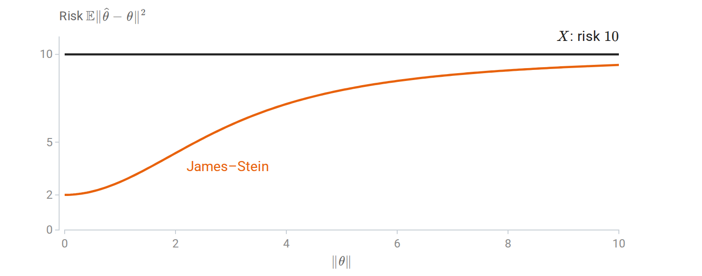

*Risk of $`X`$ and of the James–Stein estimator with $`k=10`$ coordinates. Shrinkage lowers the risk at every $`\theta`$, most of all near the origin.*

</details>

---

[← 3. Calculus and Optimization](03-calculus-and-optimization.md) · [5. Information and Learning Theory →](05-information-and-learning-theory.md)
