[Background Notes](../README.md) › [Foundations](README.md)

# 5. Information and Learning Theory

[← 4. Probability and Statistics](04-probability-and-statistics.md) · [6. Numerical Computing with NumPy and PyTorch →](06-numerical-computing-with-numpy-and-pytorch.md)

## <a id="uncertainty-prediction-and-compression"></a>Uncertainty, prediction, and compression

### <a id="surprise-and-entropy"></a>Surprise and entropy

A probabilistic prediction assigns probabilities to the possible observations. Information theory measures three things about such an assignment: how uncertain the outcome is, how much observing one variable reveals about another, and how short a description of the observations can be. One idea links the three. An outcome of high probability should receive a short description and a rare outcome a long one, so the length of a good description measures how surprising the outcome was. Shannon's [*A Mathematical Theory of Communication* (1948)](https://doi.org/10.1002/j.1538-7305.1948.tb01338.x) founded this quantitative theory of sources, coding, and noisy communication. It measures the uncertainty of distributions over messages, not their meaning or importance.

Descriptions are binary strings, so lengths are counted in bits. In this chapter, unless another base is shown, $`\log`$ means $`\log_2`$ and information is measured in **bits**. The natural logarithm $`\ln`$ appears only where the constant $`e`$ is intrinsic to a result: derivatives, Gaussian divergences, exponential tail bounds, and the PAC-Bayes bound. Quantities computed with $`\ln`$ are in **nats**, and one bit equals $`\ln2\approx0.693`$ nats. Changing the base rescales every information quantity by the same factor, so identities between them hold in either unit. Numerical libraries compute log losses with $`\ln`$, and the other chapters, which work throughout with densities, derivatives, and exponentials, write $`\log`$ for the natural logarithm.

**Definition (surprisal and entropy).** Let $`X`$ have probability mass function $`p`$ on a finite alphabet $`\mathcal X`$. The **surprisal**, or self-information, of an outcome with $`p(x)>0`$ is $`\imath_p(x)=-\log p(x)`$. The **Shannon entropy** of $`X`$ is its expected surprisal,

```math
H(X)=H(p)=\mathbb E\,\imath_p(X)=-\sum_{x\in\mathcal X}p(x)\log p(x),
\qquad 0\log0:=0.
```

An outcome of probability one has zero surprisal, rarer outcomes have larger surprisal, and the surprisals of independent outcomes add, because $`-\log[p(x)p(y)]=-\log p(x)-\log p(y)`$. An outcome to which $`p`$ assigns probability zero would carry infinite surprisal; this will matter when a model's probabilities are scored on outcomes that actually occur. Entropy averages the surprisal before the outcome is seen, and the number of possible outcomes bounds it: for $`K`$ outcomes,

```math
0\le H(X)\le\log K.
```

The lower bound holds term by term, since every surprisal is nonnegative. For the upper bound, let $`S=\{x:p(x)>0\}`$ and apply Jensen's inequality to the concave logarithm:

```math
H(X)=\mathbb E\log\frac1{p(X)}
\le\log\mathbb E\frac1{p(X)}
=\log|S|\le\log K.
```

Equality at the upper bound requires the uniform distribution on all $`K`$ outcomes, and equality at zero requires a deterministic outcome. The alphabet size therefore sets a ceiling, and the distribution determines how much of it is used. For probabilities $`(1/2,1/4,1/8,1/8)`$, the surprisals are $`(1,2,3,3)`$ bits, and their average,

```math
H(X)=\tfrac12(1)+\tfrac14(2)+\tfrac18(3)+\tfrac18(3)
=1.75\text{ bits},
```

falls below the ceiling of $`\log4=2`$ bits.

The simplest case is a variable with two outcomes. A $`\operatorname{Bernoulli}(r)`$ variable has entropy given by the **binary entropy function**

```math
h_{\mathrm B}(r)=-r\log r-(1-r)\log(1-r).
```

It is symmetric about $`r=1/2`$, where it reaches its ceiling of one bit, and falls to zero at either endpoint. A highly imbalanced binary source therefore carries much less than one bit per observation, which the section on codes will exploit.

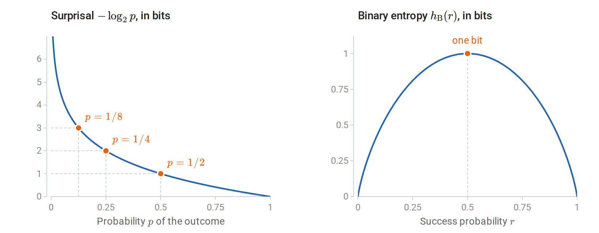

*An outcome of probability $`1/8`$ carries three bits of surprisal (left). Binary entropy, its average for a two-outcome variable, is zero at the deterministic endpoints and largest, one bit, for a fair bit (right).*

The downward curvature of $`h_{\mathrm B}`$ reflects a general property: entropy is **concave** as a function of the probability vector. Indeed, $`-u\log u`$ has second derivative $`-1/(u\ln2)<0`$ for $`u>0`$, and summing preserves concavity. Thus, for $`0\le\lambda\le1`$,

```math
H(\lambda p+(1-\lambda)q)\ge\lambda H(p)+(1-\lambda)H(q).
```

Mixing sources cannot make an observation less uncertain than the sources are on average. If an experiment chooses one of two sources at random and hides the choice, the observation also carries the uncertainty about which source produced it. Two sources that always emit different fixed symbols each have entropy zero, for example, but choosing equally between them produces one bit.

### <a id="joint-and-conditional-uncertainty"></a>Joint and conditional uncertainty

Prediction involves at least two variables: one that is observed and one to be predicted. Entropy extends to such pairs in two ways.

**Definition (joint and conditional entropy).** For a joint law $`p(x,y)`$,

```math
H(X,Y)=-\sum_{x,y}p(x,y)\log p(x,y),
\qquad
H(Y\mid X)=\sum_xp(x)H(Y\mid X=x).
```

The joint entropy is the entropy of the pair treated as a single variable. The conditional entropy is the uncertainty left in $`Y`$ once $`X`$ is known, averaged over the values of $`X`$. The averaging matters: a particular observation $`X=x`$ can leave $`Y`$ more uncertain than it was beforehand, and only the average satisfies $`H(Y\mid X)\le H(Y)`$, as the section on mutual information will show.

Substituting $`p(x,y)=p(x)p(y\mid x)`$ into the definition of $`H(X,Y)`$ relates the two through the **entropy chain rule**:

```math
H(X,Y)=H(X)+H(Y\mid X)
=H(Y)+H(X\mid Y).
```

The uncertainty of a pair is the uncertainty of one variable plus what remains of the other once the first is known. Applying the rule repeatedly splits the entropy of a sequence into the uncertainty of each term given its predecessors,

```math
H(X_1,\ldots,X_n)=\sum_{t=1}^nH(X_t\mid X_1,\ldots,X_{t-1}),
```

where the first term is $`H(X_1)`$. Two extreme cases bracket the possibilities. Independent variables have additive entropies, because the earlier terms leave the uncertainty of each later one unchanged. At the other extreme, $`H(Y\mid X)=0`$ when $`Y`$ is determined by $`X`$; conversely, on finite alphabets, zero conditional entropy means that $`Y`$ is a function of $`X`$ outside events of probability zero.

A noisy copy of a bit lies between these extremes. Let $`X`$ be a fair bit and $`Y=X\oplus N`$, where $`N`$ is an independent $`\operatorname{Bernoulli}(\eta)`$ bit and $`\oplus`$ denotes addition modulo two, so that $`N`$ flips $`X`$ with probability $`\eta`$. Both $`X`$ and $`Y`$ are fair, with one bit of entropy each, but

```math
H(Y\mid X)=h_{\mathrm B}(\eta),
\qquad H(X,Y)=1+h_{\mathrm B}(\eta).
```

At $`\eta=0`$, $`X`$ determines $`Y`$; at $`\eta=1/2`$, $`Y`$ is independent of $`X`$. The marginal entropies are one bit in both cases, so the dependence appears only in the joint and conditional entropies. This noisy bit returns below, first to illustrate mutual information and later as a communication channel and a Markov chain.

### <a id="codes-compression-and-typical-sequences"></a>Codes, compression, and typical sequences

The opening paragraph claimed that surprisal measures description length. Codes make the claim precise.

**Definition (prefix code).** A binary **prefix code** assigns a finite bit string, its codeword, to each symbol, with no codeword a prefix of another.

Because no codeword begins another, a decoder can read concatenated codewords without separators: it reads bits until they form a codeword and then starts afresh. Short codewords are a scarce resource, and the **Kraft inequality** says how scarce. Coding only the symbols of positive probability, the lengths $`\ell(x)`$ of any prefix code satisfy

```math
\sum_x2^{-\ell(x)}\le1.
```

To see why, draw binary strings as paths in a binary tree, each bit choosing a branch. A codeword of length $`\ell`$ ends at depth $`\ell`$ and claims every extension below it, a fraction $`2^{-\ell}`$ of all long strings. Since no codeword is a prefix of another, these claims are disjoint, so their fractions sum to at most one. The converse also holds: any nonnegative integer lengths satisfying the Kraft inequality are the codeword lengths of some prefix code, with the usual convention of an empty codeword for a single symbol. Codewords can be assigned in order of increasing length, and the inequality guarantees that an unclaimed node remains at each required depth.

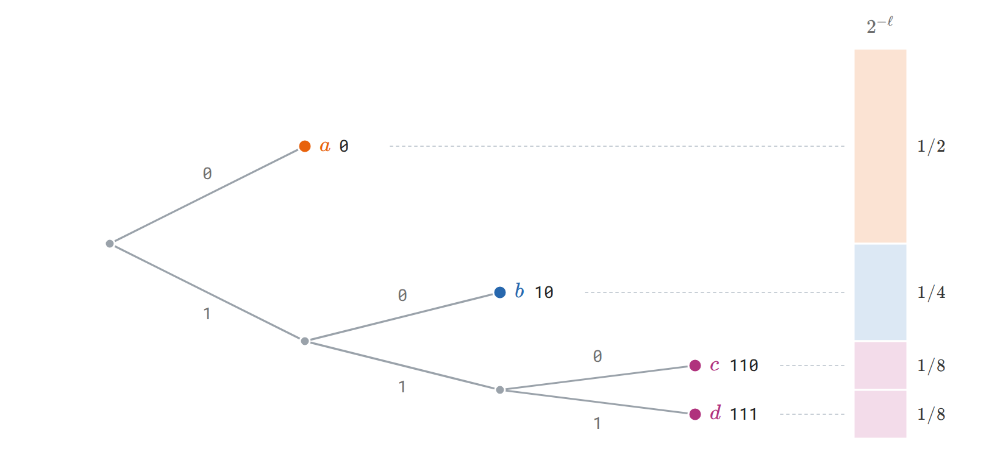

*The code $`0,10,110,111`$ for symbols $`a,b,c,d`$ as paths in a binary tree, with $`0`$ for an upper branch. A codeword of length $`\ell`$ claims the fraction $`2^{-\ell}`$ of all binary extensions, and prefix-free codewords claim disjoint pieces, so the fractions sum to at most one. For probabilities $`1/2,1/4,1/8,1/8`$, each length equals the surprisal in bits.*

The Kraft inequality makes coding a budgeting problem: short codewords for some symbols force long codewords for others. Entropy is a floor on the average length, reachable to within one bit. The expected length $`L=\mathbb E\ell(X)`$ of a prefix code satisfies the source-coding bounds

```math
H(X)\le L,
\qquad
\text{some prefix code satisfies }L<H(X)+1.
```

The lower bound follows from Jensen's inequality and then the Kraft inequality:

```math
L-H(X)
=\mathbb E\left[-\log_2\frac{2^{-\ell(X)}}{p(X)}\right]
\ge-\log_2\sum_{x:p(x)>0}2^{-\ell(x)}\ge0.
```

The upper bound comes from rounding surprisals up. The lengths $`\ell(x)=\lceil-\log_2p(x)\rceil`$ satisfy the Kraft inequality because $`2^{-\ell(x)}\le p(x)`$, so by the converse some prefix code has exactly these lengths. Each length exceeds the ideal length $`-\log p(x)`$ by less than one bit, so this code has $`L<\sum_xp(x)[-\log p(x)+1]=H(X)+1`$.

When every probability is a power of $`1/2`$, the surprisals are whole numbers and the lower bound is attained. The four-symbol example has codewords $`0,10,110,111`$ with lengths $`1,2,3,3`$, equal to the surprisals, and averages exactly $`1.75`$ bits per symbol, whereas a fixed two-bit code ignores the unequal probabilities. For a general known distribution, **Huffman coding** constructs an optimal prefix code by repeatedly merging the two least probable symbols.

The rounding loss in the upper bound, less than one bit per symbol, matters most when the entropy per symbol is small. A $`\operatorname{Bernoulli}(0.1)`$ bit has entropy $`h_{\mathrm B}(0.1)\approx0.469`$ bits, yet every prefix code for single bits spends at least one bit per symbol. Coding **blocks** of symbols spreads the rounding loss. Treat $`n`$ iid symbols $`X_{1:n}`$ as one symbol from an alphabet of size $`K^n`$. Its entropy is $`nH(X)`$ by the chain rule, so the source-coding bound gives a prefix code for blocks with expected length below $`nH(X)+1`$ bits, that is, below $`H(X)+1/n`$ bits per original symbol. As the blocks grow, the rate approaches the entropy.

These results concern average length under a known source law, and they have three limits. A rare message can receive a longer codeword than a fixed-length code would give it. No lossless code can shorten every message: there are $`2^m`$ binary strings of length $`m`$ but only $`2^m-1`$ strings of length less than $`m`$, so some message of length $`m`$ is not shortened. Compression succeeds on average by exploiting a nonuniform distribution. Finally, the encoder and decoder must share the probability model; a model fitted to the message itself must also be transmitted, a cost the entropy bound does not include.

Long blocks also show directly why $`H(X)`$ bits per symbol is the right rate. The surprisal of an iid sequence is a sum of iid surprisals, each with mean $`H(X)`$, so the law of large numbers gives

```math
-\frac1n\log p(X_{1:n})
=\frac1n\sum_{i=1}^n[-\log p(X_i)]
\longrightarrow H(X)
\quad\text{almost surely}.
```

This is the iid **asymptotic equipartition property** (AEP): a long sequence almost surely has probability close to $`2^{-nH(X)}`$. Collecting the sequences for which this holds within a tolerance gives the typical set.

**Definition (typical set).** For $`\varepsilon>0`$, the **typical set** $`\mathcal T_{n,\varepsilon}`$ consists of the length-$`n`$ sequences whose surprisal per symbol is within $`\varepsilon`$ of the entropy:

```math
\mathcal T_{n,\varepsilon}
=\left\{x_{1:n}:
\left|-\frac1n\log p(x_{1:n})-H(X)\right|\le\varepsilon\right\}.
```

Write $`H`$ for $`H(X)`$. By the AEP, $`P(X_{1:n}\in\mathcal T_{n,\varepsilon})\to1`$ as $`n\to\infty`$. By the definition, every typical sequence has probability between $`2^{-n(H+\varepsilon)}`$ and $`2^{-n(H-\varepsilon)}`$. Summing these bounds over the set gives $`1\ge P(X_{1:n}\in\mathcal T_{n,\varepsilon})\ge|\mathcal T_{n,\varepsilon}|\,2^{-n(H+\varepsilon)}`$ and $`P(X_{1:n}\in\mathcal T_{n,\varepsilon})\le|\mathcal T_{n,\varepsilon}|\,2^{-n(H-\varepsilon)}`$, so

```math
P(X_{1:n}\in\mathcal T_{n,\varepsilon})\,2^{n(H-\varepsilon)}
\le |\mathcal T_{n,\varepsilon}|\le 2^{n(H+\varepsilon)}.
```

About $`2^{nH}`$ sequences therefore carry almost all the probability, out of $`K^n=2^{n\log K}`$ possible ones; unless the source is uniform, they are a vanishing fraction of all sequences. This gives a second compression scheme: number the typical sequences with a fixed-length index of about $`n(H+\varepsilon)`$ bits and give up on the rest, which fails only with the small probability $`P(X_{1:n}\notin\mathcal T_{n,\varepsilon})`$. It reaches the rate $`H`$ with a different guarantee from block prefix codes, which decode every sequence exactly and control the average length instead. Cover and Thomas's [*Elements of Information Theory*, Chapters 3–5](https://onlinelibrary.wiley.com/doi/book/10.1002/047174882X) develops both.

The $`\operatorname{Bernoulli}(0.1)`$ source makes these sets concrete. For $`n=100`$ and $`\varepsilon=0.13`$ bits, the typical set consists of the sequences with $`6`$ to $`14`$ ones. It contains about $`2^{55.5}`$ sequences and $`87\%`$ of the probability, so a $`56`$-bit index describes most sequences, against $`100`$ bits for writing them out. The typical set does not contain the most probable sequence. The all-zero sequence is more probable than any other, but its surprisal per symbol, $`-\log0.9\approx0.152`$ bits, differs from the entropy of $`0.469`$ bits by $`0.317`$, so it is not typical for any $`\varepsilon<0.317`$. It is a single sequence, whereas about $`1.7\times10^{13}`$ sequences have exactly ten ones, and together they are far more probable. Typicality describes where the probability lies, not which single outcome is most likely.

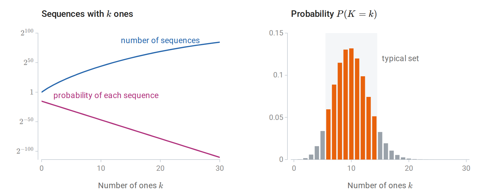

*For $`100`$ draws of a Bernoulli$`(0.1)`$ bit, the all-zero sequence is the most probable single sequence, with probability $`0.9^{100}\approx2.7\times10^{-5}`$, but sequences with more ones are far more numerous (left). The number of ones therefore concentrates near ten (right). The shaded typical set, where the surprisal per symbol is within $`0.13`$ bits of the entropy, holds $`87\%`$ of the probability.*

### <a id="cross-entropy-divergence-and-log-loss"></a>Cross-entropy, divergence, and log loss

Entropy measures the uncertainty of an outcome when its true law is used for prediction or coding. In practice the true law $`p`$ is unknown and a model $`q`$ takes its place. Two quantities measure the cost of that substitution.

**Definition (cross-entropy and KL divergence).** Suppose observations follow $`p`$ but a model predicts $`q`$. The **cross-entropy** $`H(p,q)=-\sum_xp(x)\log q(x)`$ is the expected negative log probability that the model assigns; it is infinite if $`q(x)=0`$ at an outcome with $`p(x)>0`$. The **Kullback–Leibler divergence** is its excess over the entropy:

```math
D_{\mathrm{KL}}(p\Vert q)
=\sum_{x:p(x)>0}p(x)\log\frac{p(x)}{q(x)},
\qquad
H(p,q)=H(p)+D_{\mathrm{KL}}(p\Vert q).
```

Both quantities can be read in terms of prediction and in terms of coding. In prediction, $`-\log q(x)`$ is the **log loss** of the forecast $`q`$ when $`x`$ occurs, and the cross-entropy is its expectation. In coding, $`-\log q(x)`$ is the ideal codeword length for a code designed for $`q`$, so the cross-entropy is the expected length when that code is used on data from $`p`$, and the divergence is the number of extra bits per symbol caused by designing the code for the wrong law.

The extra cost is never negative. **Gibbs' inequality** states $`D_{\mathrm{KL}}(p\Vert q)\ge0`$, with equality exactly when $`p=q`$. To prove it in the finite-support case, write $`S=\{x:p(x)>0\}`$. Concavity of $`\log`$ gives

```math
-D_{\mathrm{KL}}(p\Vert q)
=\mathbb E_p\log\frac{q(X)}{p(X)}
\le\log\sum_{x\in S}q(x)\le0.
```

Equality requires $`q/p`$ to be constant on $`S`$ and $`q`$ to put all its probability there, and normalization then forces the constant to equal one. The case of infinite divergence satisfies the inequality trivially.

Consequently, predicting with the true law uniquely minimizes the expected log loss. The decomposition $`H(p,q)=H(p)+D_{\mathrm{KL}}(p\Vert q)`$ separates the irreducible uncertainty $`H(p)`$, which no forecast can remove, from the penalty for an incorrect model. For a Bernoulli source with true success probability $`r=0.2`$, a forecast $`s`$ has cross-entropy

```math
-0.2\log s-0.8\log(1-s),
```

which is smallest at $`s=0.2`$. A hard prediction, $`s=0`$ or $`s=1`$, has infinite expected loss, because it assigns probability zero to outcomes that occur. Classification accuracy depends only on the side of $`1/2`$ on which $`s`$ falls, so it cannot distinguish the hard forecast $`s=0`$ from the correct $`s=0.2`$; log loss rewards calibrated confidence.

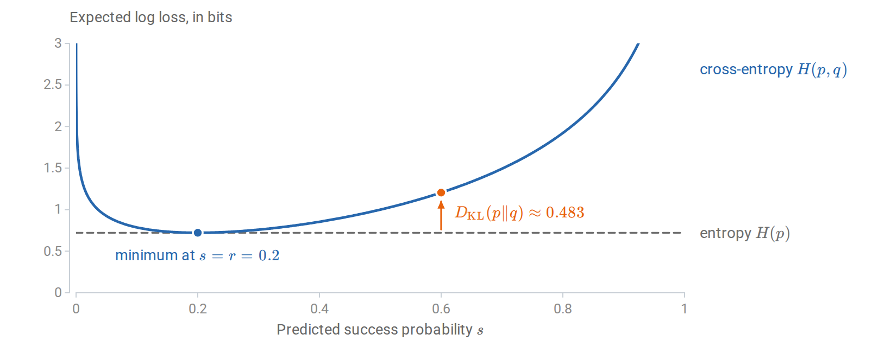

*For $`p=\operatorname{Bernoulli}(0.2)`$ and $`q=\operatorname{Bernoulli}(s)`$, the cross-entropy exceeds the entropy by $`D_{\mathrm{KL}}(p\Vert q)`$, about $`0.483`$ bits at $`s=0.6`$. The curve is cut at three bits; it diverges at both endpoints.*

The coding reading can be checked on the four-symbol example. A fixed two-bit code is the ideal code for the uniform model $`q=(1/4,1/4,1/4,1/4)`$. Used on data from $`p=(1/2,1/4,1/8,1/8)`$, it costs $`H(p,q)=2`$ bits per symbol, which exceeds the entropy $`1.75`$ bits by $`D_{\mathrm{KL}}(p\Vert q)=0.25`$ bits:

```python
import numpy as np
from scipy.special import xlogy

p = np.array([0.5, 0.25, 0.125, 0.125])
q = np.full(4, 0.25)
entropy = -xlogy(p, p).sum()       # xlogy(0, 0) = 0
cross_entropy = -xlogy(p, q).sum()
kl = cross_entropy - entropy
print("entropy, cross-entropy, KL in bits:")
print(np.array([entropy, cross_entropy, kl]) / np.log(2))
# [1.75, 2.00, 0.25]
assert np.isclose(cross_entropy, entropy + kl)
```

Fitting a model means choosing $`q`$ from some family to make the divergence small, and here the order of the arguments matters. The first argument is the law under which the average is taken, and reversing the arguments generally changes the value, so KL is not a metric. For $`p=(0.9,0.1)`$ and $`q=(0.5,0.5)`$, $`D_{\mathrm{KL}}(p\Vert q)\approx0.531`$ bits, while $`D_{\mathrm{KL}}(q\Vert p)\approx0.737`$ bits: in the second direction, half the averaging weight falls on an outcome to which $`p`$ assigns only probability $`0.1`$. When the family cannot match $`p`$, the two directions prefer different compromises. Minimizing $`D_{\mathrm{KL}}(p\Vert q)`$ penalizes $`q`$ for missing any region where $`p`$ has mass, so the fit spreads out to cover $`p`$. Minimizing $`D_{\mathrm{KL}}(q\Vert p)`$ penalizes $`q`$ for placing mass where $`p`$ has little, so the fit concentrates where $`p`$ is large. Maximum likelihood minimizes the first direction, as shown next, while variational inference commonly minimizes the second.

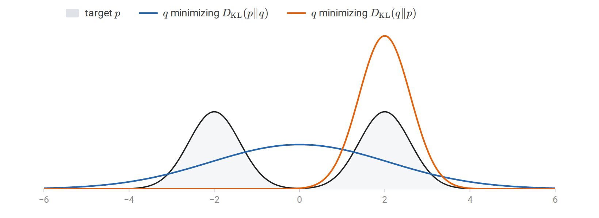

*Fitting one Gaussian $`q`$ to a mixture $`p`$ of two well-separated Gaussians. Minimizing $`D_{\mathrm{KL}}(p\Vert q)`$, which averages over $`p`$, matches the mean and variance of $`p`$ and covers both modes. Minimizing $`D_{\mathrm{KL}}(q\Vert p)`$, which averages over $`q`$ and heavily penalizes mass where $`p`$ is small, settles on one mode.*

To see that maximum likelihood minimizes the first direction, let $`P_\ast`$ be the unknown law of the observations and $`q_\theta`$ a family of models. Maximum likelihood minimizes the average negative log likelihood of iid observations,

```math
\widehat L_n(\theta)=-\frac1n\sum_{i=1}^n\log q_\theta(Z_i),
```

which estimates the population objective $`L(\theta)=\mathbb E_{P_\ast}[-\log q_\theta(Z)]=H(P_\ast,q_\theta)`$. Since $`H(P_\ast)`$ does not depend on $`\theta`$, minimizing $`L`$ is the same as minimizing $`D_{\mathrm{KL}}(P_\ast\Vert q_\theta)`$: maximum likelihood targets the member of the family closest to $`P_\ast`$ in the first direction. For discrete data, the sample objective is exactly the cross-entropy between the empirical frequencies and the model. For continuous data it is an average of negative log *densities*, and the decomposition holds between population densities ([Appendix A](#block-information-appendix-a)).

Supervised prediction applies the same decomposition to conditional laws. Let $`Y`$ be discrete and $`X`$ discrete or continuous. Applying the identity to the conditional law of $`Y`$ given each value of $`X`$ and averaging yields

```math
\begin{aligned}
\mathbb E_{P_*}[-\log q(Y\mid X)]
&=H_{P_*}(Y\mid X)\\
&\quad+\mathbb E_X D_{\mathrm{KL}}\bigl(p_*(\cdot\mid X)\Vert q(\cdot\mid X)\bigr).
\end{aligned}
```

Without restrictions, the minimizer is the true conditional law, $`q(\cdot\mid x)=p_\ast(\cdot\mid x)`$ for almost every $`x`$. A restricted model family may be unable to represent this law, and finite data may not identify its best approximation accurately; these questions of approximation and estimation are the subject of learning theory, later in this chapter.

For a single observation, the conditional log loss takes familiar forms. For a binary label $`y\in\{0,1\}`$ and predicted success probability $`s(x)`$, it is

```math
\ell(y,s(x))=-y\log s(x)-(1-y)\log[1-s(x)].
```

For $`K`$ classes and a probability vector $`q(x)`$, it is $`-\log q_y(x)=-\sum_{k=1}^K\mathbf1\{y=k\}\log q_k(x)`$, the cross-entropy between the **one-hot** vector $`(\mathbf1\{y=k\})_k`$ of the observed label and the prediction. As a target distribution the one-hot vector has entropy zero, although the random label it encodes can have positive entropy; the loss of one observation is a single draw whose average is the expected loss above. Numerical libraries evaluate these losses with $`\ln`$, so reported values are in nats; dividing by $`\ln2`$ converts them to bits and changes no minimizer.

### <a id="mutual-information-and-data-processing"></a>Mutual information and data processing

The noisy-bit example showed that marginal entropies cannot detect dependence. Mutual information measures dependence directly, as the divergence of the joint law from independence.

**Definition (mutual information).** The **mutual information** between discrete variables is

```math
I(X;Y)=D_{\mathrm{KL}}(p_{X,Y}\Vert p_Xp_Y).
```

The reference law $`p_Xp_Y`$ keeps both marginals but makes the variables independent. Expanding the logarithm expresses mutual information through entropies:

```math
I(X;Y)=H(X)+H(Y)-H(X,Y)
=H(Y)-H(Y\mid X).
```

Mutual information is symmetric, and by Gibbs' inequality it is nonnegative and zero exactly when $`X`$ and $`Y`$ are independent. The second form therefore proves the promised inequality $`H(Y\mid X)\le H(Y)`$: on average, conditioning reduces entropy. By the previous section, $`H(Y)`$ is the smallest expected log loss for predicting $`Y`$ without $`X`$ and $`H(Y\mid X)`$ the smallest with it, so $`I(X;Y)`$ is also the improvement in optimal expected log loss from observing $`X`$. For the noisy bit, $`I(X;Y)=1-h_{\mathrm B}(\eta)`$, or $`0.531`$ bits at $`\eta=0.1`$.

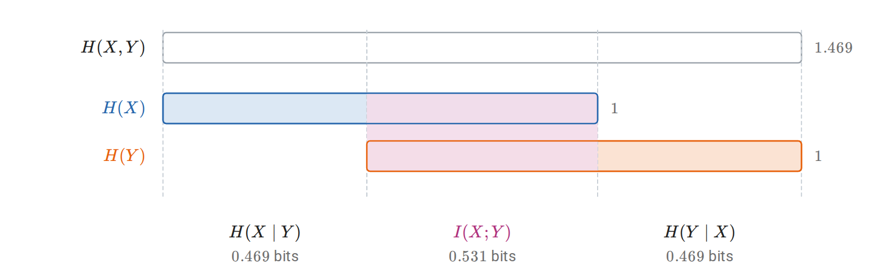

*Entropies, in bits, of a fair bit $`X`$ and its copy $`Y`$ through a channel that flips it with probability $`0.1`$. The joint entropy splits into $`H(X\mid Y)`$, $`I(X;Y)`$, and $`H(Y\mid X)`$, and the two marginal entropies overlap exactly in the mutual information.*

Prediction usually uses several inputs, so we also need the information one variable carries about another once a third is known. The **conditional mutual information** is

```math
I(X;Y\mid C)
=\mathbb E_C D_{\mathrm{KL}}\bigl(p_{X,Y\mid C}\Vert p_{X\mid C}p_{Y\mid C}\bigr).
```

It is nonnegative and vanishes exactly under conditional independence, up to conditioning values of probability zero. It satisfies a chain rule: the information that a pair $`(Y,C)`$ carries about $`X`$ is the information in $`C`$ plus the additional information in $`Y`$ once $`C`$ is known,

```math
I(X;Y,C)=I(X;C)+I(X;Y\mid C).
```

Unlike entropy, mutual information can increase under conditioning. If $`U,V`$ are independent fair bits and $`Y=U\oplus V`$, then $`I(U;Y)=0`$ while $`I(U;Y\mid V)`$ is one bit: either input alone says nothing about the output, but together they determine it. A feature can therefore be useless on its own and decisive in combination, and screening features one at a time by their association with a target can miss such joint structure. The following code computes both quantities from the joint law.

```python
import numpy as np
from scipy.special import xlogy

def entropy(probabilities):
    p = np.asarray(probabilities, dtype=float).ravel()
    return -xlogy(p, p).sum() / np.log(2)  # bits

joint = np.zeros((2, 2, 2))  # axes U, V, Y
for u in range(2):
    for v in range(2):
        joint[u, v, u ^ v] = 0.25

h_u = entropy(joint.sum(axis=(1, 2)))
h_v = entropy(joint.sum(axis=(0, 2)))
h_y = entropy(joint.sum(axis=(0, 1)))
h_uy = entropy(joint.sum(axis=1))
h_uv = entropy(joint.sum(axis=2))
h_vy = entropy(joint.sum(axis=0))
i_u_y = h_u + h_y - h_uy
i_u_y_given_v = h_uv + h_vy - h_v - entropy(joint)
print(i_u_y, i_u_y_given_v)  # 0.0, 1.0 bits
```

The chain rule also answers a question central to representation learning: can processing an input create information about a target? Write $`X\to Y\to Z`$ when $`X\perp Z\mid Y`$, so that once $`Y`$ is known, $`Z`$ carries no further dependence on $`X`$. This three-variable **Markov property** covers any processing $`Z=g(Y)`$, and randomized processing whose extra randomness is independent of $`X`$ given $`Y`$; it is a statement about conditional independence, not about causation. The **data-processing inequality** states

```math
X\to Y\to Z\quad\Longrightarrow\quad I(X;Z)\le I(X;Y).
```

Indeed, expanding $`I(X;Y,Z)`$ by the chain rule in both orders gives

```math
I(X;Y)+\underbrace{I(X;Z\mid Y)}_{0}
=I(X;Z)+I(X;Y\mid Z)\ge I(X;Z).
```

A representation computed from an input therefore cannot contain more information about a target than the input does. Its value lies elsewhere: it can make existing information easier for a restricted predictor to use, discard irrelevant variation, or reduce computational cost. A representation $`T=g(X)`$ loses nothing when $`I(Y;X\mid T)=0`$, which is equivalent to $`P(Y\mid X)=P(Y\mid T)`$ almost surely. [Appendix A](#block-information-appendix-a) gives mutual information its operational meaning in communication, as the capacity of a noisy channel, and in lossy compression.

### <a id="continuous-variables-and-maximum-entropy"></a>Continuous variables and maximum entropy

Everything so far used finite alphabets. A continuous variable has uncountably many values, and its entropy needs care.

**Definition (differential entropy).** For a density $`p`$ on $`\mathbb R^d`$, the **differential entropy** is

```math
h(X)=-\int p(x)\log p(x)\,dx,
```

when this integral is well-defined.

Differential entropy is not a number of bits needed to describe $`X`$. It can be negative: a uniform variable on an interval of length $`a`$ has $`h(X)=\log a`$, which is negative for $`a<1`$. It also depends on the measurement units, because density values do. Quantization explains both facts. If $`X_\Delta`$ records which bin of width $`\Delta`$ contains $`X`$, the bin probabilities are approximately $`p(x_k)\Delta`$ when, for example, the density is continuous and bounded away from zero on a bounded interval, and a Riemann-sum calculation gives

```math
H(X_\Delta)\approx-\sum_kp(x_k)\Delta\log[p(x_k)\Delta]
\approx h(X)+\log(1/\Delta).
```

The entropy of the discrete measurement grows without bound as the bins shrink, because an exact real number would take infinitely many bits to describe. Differential entropy is the finite offset that remains after subtracting the resolution term $`\log(1/\Delta)`$.

The dependence on units follows the change-of-variables formula. If $`Y=g(X)`$ for an invertible differentiable map with nonsingular Jacobian almost everywhere, and the relevant expectations are finite, then

```math
h(Y)=h(X)+\mathbb E\log|\det J_g(X)|.
```

For a scalar variable, $`h(aX+b)=h(X)+\log|a|`$ when $`a\ne0`$; scaling a vector $`X\in\mathbb R^d`$ by $`a\ne0`$ adds $`d\log|a|`$. The Gaussian case, needed below, follows from its density: for a nondegenerate Gaussian vector,

```math
X\sim\mathcal N(\mu,\Sigma),\quad\Sigma\succ0
\quad\Longrightarrow\quad
h(X)=\frac12\log\bigl((2\pi e)^d\det\Sigma\bigr).
```

A singular covariance has no density on the full space, so the formula does not extend to $`\det\Sigma=0`$.

Divergence and mutual information do not share these defects. They extend to general laws through density ratios ([Appendix A](#block-information-appendix-a)), remain nonnegative, and do not depend on the coordinates: KL is unchanged when the same invertible map is applied to both laws, and mutual information when each variable is transformed invertibly on its own, because the Jacobian factors cancel in the ratio. For continuous variables, mutual information should be computed as a divergence rather than by subtracting differential entropies, because the entropy difference can be undefined: a deterministic copy $`Y=X`$ has no joint density, yet its mutual information is well defined, and infinite, although $`h(X)`$ is finite. For jointly Gaussian scalar variables with positive variances and correlation $`c`$, where $`|c|<1`$, substituting the Gaussian entropy formula gives

```math
I(X;Y)=-\frac12\log(1-c^2).
```

The variances cancel, as the invariance requires, leaving a function of the dependence alone. Within the Gaussian family, zero correlation therefore means independence. Outside it, zero correlation need not mean zero mutual information: covariance measures one moment of the joint law, while mutual information compares the whole joint law with independence.

Differential entropy remains useful for comparing distributions in the same coordinates, and its main use is the principle of **maximum entropy**: among the distributions that satisfy given constraints, choose the most uncertain. The constraints and the reference measure are part of the problem. On a finite set with no further constraints, the maximizer is uniform. Among densities on $`\mathbb R^d`$ with mean $`\mu`$ and positive definite covariance $`\Sigma`$, the Gaussian has the largest differential entropy:

```math
h(X)\le\frac12\log\bigl((2\pi e)^d\det\Sigma\bigr).
```

To see why, let $`g`$ be the Gaussian density with that mean and covariance. Its log density is a constant plus a quadratic form, so any $`p`$ with the same mean and covariance has $`-\mathbb E_p\log g(X)=h(g)`$, and therefore

```math
0\le D_{\mathrm{KL}}(p\Vert g)=h(g)-h(p).
```

The argument applies when $`h(p)`$ is finite, and the bound holds trivially when $`h(p)=-\infty`$; equality requires $`p=g`$. On $`[0,\infty)`$ with a fixed positive mean $`m`$, the same reasoning makes the exponential density $`m^{-1}e^{-x/m}`$ the maximizer. Some constraint on scale is essential: without one, spreading a density by a factor $`a`$ raises its entropy by $`\log a`$, so the entropy is unbounded.

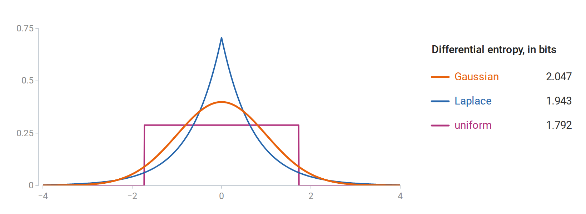

*Three densities with mean zero and variance one. The Gaussian has the largest differential entropy, $`2.047`$ bits, against $`1.943`$ for the Laplace and $`1.792`$ for the uniform density.*

The Gaussian and the exponential have discrete analogues of a general form. On a finite alphabet, constraints $`\mathbb E_pT_j(X)=m_j`$ lead, when a positive maximizer and suitable multipliers exist, to

```math
p_\lambda(x)=\frac{\exp\{\sum_j\lambda_jT_j(x)\}}{Z(\lambda)},
\qquad
Z(\lambda)=\sum_x\exp\{\sum_j\lambda_jT_j(x)\}.
```

Setting the derivative of the Lagrangian to zero gives this form, and the constraints determine the multipliers; boundary constraints may force zero probabilities and require restricting the support. This is the [exponential-family](04-probability-and-statistics.md#exponential-families-and-moment-matching) form, and the choice of constrained moments determines which family appears: fixing a mean and covariance gives the Gaussian, and fixing a mean on $`[0,\infty)`$ gives the exponential. These are characterizations of distributions under stated information, not evidence that real observations follow them. MacKay's [*Information Theory, Inference, and Learning Algorithms*](https://www.inference.org.uk/mackay/itila/book.html) develops the connections among these distributional ideas, inference, and coding.

### <a id="sequences-entropy-rates-and-language-model-loss"></a>Sequences, entropy rates, and language-model loss

A language model assigns probabilities to sequences of tokens by predicting one token at a time. Two questions connect this to the ideas above: how the per-token losses used in training relate to the probability of a whole sequence, and how small those losses can be when tokens depend on each other.

The first question has an exact answer. The chain rule of probability factors any model's probability of a sequence into next-token predictions,

```math
q(x_{1:T})=\prod_{t=1}^Tq(x_t\mid x_{<t}),
\qquad
-\log q(x_{1:T})=\sum_{t=1}^T-\log q(x_t\mid x_{<t}),
```

where the first factor $`q(x_1\mid x_{<1})`$ means $`q(x_1)`$. The negative log likelihood of a sequence is therefore the sum of its next-token log losses, and minimizing the average next-token loss is maximum likelihood for whole sequences.

The same sum is a description length. By the source-coding results above, an outcome of probability $`q`$ ideally takes $`-\log q`$ bits, so $`-\log q(x_{1:T})`$ is the ideal length of a codeword for the whole sequence. **Arithmetic coding** attains it: an encoder and a decoder that share the model, and agree on the sequence length, process the sequence one token at a time using the predictions $`q(x_t\mid x_{<t})`$, and produce a lossless code less than two bits longer than $`-\log q(x_{1:T})`$. A model with an average loss of $`L`$ bits per token therefore compresses text to about $`L`$ bits per token, apart from the cost of transmitting the model itself. The correspondence runs both ways: by the Kraft inequality, the codeword lengths $`\ell`$ of any prefix code define probabilities proportional to $`2^{-\ell}`$, so a compressor is also a predictor. Because the length depends on the probability assigned to what actually occurs, good compression requires well-judged confidence, not only a correct most likely token.

The average loss is usually reported as a perplexity. With $`L_T=-\frac1T\log q(x_{1:T})`$ bits per token,

```math
\operatorname{PPL}=2^{L_T}
=\left[\prod_{t=1}^T\frac1{q(x_t\mid x_{<t})}\right]^{1/T}.
```

With the loss in nats, as software reports it, the same number is $`e^{L_T}`$. A predictor that is uniform over $`K`$ tokens has perplexity $`K`$, so perplexity reads as an effective number of equally likely choices per token; it is a geometric mean of reciprocal probabilities, not a count of candidates. Because the loss is measured per token, perplexities are comparable only on the same text with the same tokenization.

The second question concerns the true process. If a model used the true law $`p`$, its expected loss per token would be $`\frac1TH(X_{1:T})`$. For iid tokens this is the marginal entropy $`H(X_1)`$. Dependence lowers it: the chain rule gives $`H(X_{1:T})=\sum_{t=1}^TH(X_t\mid X_{<t})`$, and conditioning on the past reduces entropy on average, so context makes each token more predictable than its marginal law suggests.

**Definition (entropy rate).** The **entropy rate** of a process $`X_1,X_2,\ldots`$ is $`\overline H=\lim_{T\to\infty}\frac1TH(X_{1:T})`$, when the limit exists. It is the uncertainty per token that no predictor can remove.

The simplest process with dependence is a Markov chain ([chapter 4, Appendix D](04-probability-and-statistics.md#block-probability-appendix-d)), in which only the current token matters for the next.

**Definition (Markov chain and stationary law).** A finite-state, time-homogeneous **Markov chain** has a transition matrix $`K`$, with nonnegative entries and rows summing to one, such that

```math
P(X_{t+1}=j\mid X_1,\ldots,X_t)=P(X_{t+1}=j\mid X_t)=K_{X_tj}.
```

A probability row vector $`\pi`$ is **stationary** if $`\pi K=\pi`$. A chain started from $`\pi`$ has law $`\pi`$ at every time, and its joint law is unchanged by shifts in time.

For a chain started from $`\pi`$, the Markov property reduces each term $`H(X_t\mid X_{<t})`$ of the chain rule to $`H(X_t\mid X_{t-1})`$. Given the current state $`i`$, which occurs with probability $`\pi_i`$, the next state has law $`K_{i\cdot}`$ and entropy $`H(K_{i\cdot})`$. Hence

```math
H(X_{1:T})=H(\pi)+(T-1)\sum_i\pi_iH(K_{i\cdot}),
\qquad
\overline H=\sum_i\pi_iH(K_{i\cdot})=-\sum_{i,j}\pi_iK_{ij}\log K_{ij}.
```

The entropy rate is the uncertainty of the next state given the current one, averaged over how often each state occurs. For a finite chain that is irreducible and aperiodic, $`\pi`$ is unique and the chain approaches it from any starting state, so the same rate describes long sequences however they start.

For a symmetric binary chain that switches state with probability $`\eta`$, $`\pi=(1/2,1/2)`$ and every row has entropy $`h_{\mathrm B}(\eta)`$, so $`\overline H=h_{\mathrm B}(\eta)`$. Each bit on its own is fair and carries one bit of entropy, but at $`\eta=0.1`$ the sequence adds only about $`0.469`$ bits per step, because the next bit usually repeats the current one. At $`\eta=1/2`$ consecutive bits are independent and the rate is one bit. At $`\eta=0`$ and $`\eta=1`$ the current bit determines the next, and the rate is zero despite the uniform marginals.

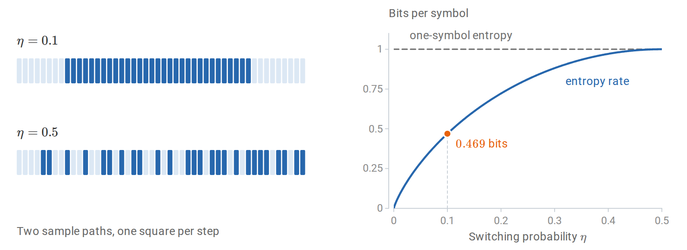

*Sample paths of a symmetric binary chain with switching probability $`\eta`$ (left). At $`\eta=0.1`$ long runs make the next bit predictable, while at $`\eta=0.5`$ the bits are independent. Every bit has one bit of marginal entropy, but the entropy rate $`h_{\mathrm B}(\eta)`$ is only $`0.469`$ bits at $`\eta=0.1`$ (right).*

A model predicts such a chain well to the extent that its transition matrix $`Q`$ matches $`K`$. Applying the cross-entropy decomposition to each row and averaging over the current state gives the expected log loss per transition,

```math
-\sum_{i,j}\pi_iK_{ij}\log Q_{ij}
=\overline H+\sum_i\pi_iD_{\mathrm{KL}}(K_{i\cdot}\Vert Q_{i\cdot}),
```

the entropy rate plus the model's error in each context, weighted by how often that context occurs. The loss is infinite if $`Q`$ gives probability zero to a transition that occurs. A model that ignores the current state uses the same prediction in every row; the best such prediction is $`\pi`$, and its loss is the marginal entropy $`H(\pi)`$. The gap $`H(\pi)-\overline H=H(X_t)-H(X_t\mid X_{t-1})=I(X_{t-1};X_t)`$ is the information that the previous token carries about the next. For the symmetric chain at $`\eta=0.1`$ it is $`1-0.469=0.531`$ bits, the mutual information of the noisy-bit example, because each step passes the current bit through that binary channel.

The following simulation checks these values on a path of 20,000 steps.

```python
import numpy as np

rng = np.random.default_rng(7)
K = np.array([[0.9, 0.1], [0.1, 0.9]])
pi = np.array([0.5, 0.5])
path = np.empty(20_000, dtype=int)
path[0] = rng.choice(2, p=pi)
for t in range(1, len(path)):
    path[t] = rng.choice(2, p=K[path[t - 1]])

# Transition loss excludes the initial token in both models.
markov_loss = -np.log2(K[path[:-1], path[1:]]).mean()  # bits
independent_loss = -np.log2(pi[path[1:]]).mean()
entropy_rate = -(pi[:, None] * K * np.log2(K)).sum()
print("theoretical rate:", entropy_rate, "bits")
print("observed losses:", markov_loss, independent_loss)
print("perplexities:", 2.0 ** np.array([markov_loss, independent_loss]))
# Rate ≈ 0.469 bits; the Markov predictor beats the marginal predictor.
```

The Markov predictor's loss is close to $`0.469`$ bits per step, a perplexity of about $`1.38`$; the predictor that ignores context has a loss of one bit and a perplexity of $`2`$.

A language model performs the same computation with a richer context. The chain rule holds for any model, and the expected loss of each token splits in the same way,

```math
\mathbb E[-\log q(X_t\mid X_{<t})]
=H(X_t\mid X_{<t})
+\mathbb E\,D_{\mathrm{KL}}\bigl(p(\cdot\mid X_{<t})\,\Vert\,q(\cdot\mid X_{<t})\bigr),
```

where the expectation averages over contexts as they occur. Models differ in how much of the past their predictions can use and in how closely they approximate the true conditional laws. The entropy of natural text is unknown, so a lower held-out loss on the same text shows a smaller divergence term without revealing how much of it remains.

## <a id="statistical-learning-theory"></a>Statistical learning theory

The first part of the chapter measured how well a given probability model predicts. Learning theory asks what can be said when the prediction rule is itself chosen from data: when does fitting a sample support conclusions about observations not yet seen?

### <a id="learning-a-rule-from-a-sample"></a>Learning a rule from a sample

A statistical model describes a possible law of the observations. A learning algorithm uses observations to choose a rule, whose performance is then judged on further observations from the same law. The link between the two is **risk**, the expected loss of the chosen rule under that law.

Let $`Z`$ denote one observation, with unknown law $`P_\ast`$, and let the training sample be $`D=(Z_1,\ldots,Z_n)`$ with $`Z_i\stackrel{\mathrm{iid}}{\sim}P_\ast`$. In supervised learning, $`Z=(X,Y)`$ consists of an input and a target. A **hypothesis class** $`\mathcal H`$ is a nonempty set of candidate prediction rules $`h:\mathcal X\to\mathcal A`$, where the action space $`\mathcal A`$ may contain labels, real numbers, or probability distributions. A **learner** $`A`$ maps a sample to a rule $`A(D)`$. It is called proper when $`A(D)\in\mathcal H`$; an improper learner may return a rule outside the class against which it is compared.

**Definition (risk).** Write $`\ell(h,z)`$ for the loss incurred by rule $`h`$ on observation $`z`$; for supervised prediction this is usually $`\ell(h,(x,y))=L(y,h(x))`$, where $`L`$ is the cost of an action. The **population risk** and **empirical risk** of $`h`$ are

```math
R_*(h)=\mathbb E_{Z\sim P_*}[\ell(h,Z)],
\qquad
\widehat R_n(h)=\frac1n\sum_{i=1}^n\ell(h,Z_i).
```

The loss encodes what counts as a good prediction. Examples are $`\mathbf1\{h(x)\ne y\}`$ for classification, $`(y-h(x))^2`$ for numerical prediction, and the log loss $`-\log q_h(y\mid x)`$ of the cross-entropy section for predicting a conditional distribution. Taking $`Z=X`$ and $`\ell(h,x)=-\log p_h(x)`$ covers density estimation as well. Learning theory therefore concerns more than classification, although bounded classification losses give the most transparent results.

Risk involves two levels of randomness. For a fixed rule, $`R_\ast(h)`$ is a number determined by $`P_\ast`$. The risk $`R_\ast(A(D))`$ of a fitted rule is random, because the rule depends on the training sample, and its expectation $`\mathbb E_DR_\ast(A(D))`$ averages over possible samples. The inner expectation evaluates a fitted rule on a fresh observation; the outer one evaluates the learning procedure.

The learner can compute the empirical risk but not the population risk, so the central question is when the first reliably indicates the second. The concentration bounds that answer it rest on standing assumptions.


> **Standing assumptions for concentration bounds**
>
> Unless a result states otherwise, the bounds below assume:
>
> - iid observations;
> - bounded loss, $`0\le\ell\le1`$;
> - a hypothesis class fixed before seeing the sample;
> - measurable suprema and selected rules.
>
> These are theorem assumptions, rather than automatic properties of machine learning problems. Successive tokens from one dependent sequence are not an iid sample merely because the training objective sums their losses.


Squared loss and log loss are unbounded in general, so applying these bounded-loss theorems to them requires further restrictions or a different concentration argument ([Appendix B](#block-information-appendix-b)). Shalev-Shwartz and Ben-David's [*Understanding Machine Learning*](https://doi.org/10.1017/CBO9781107298019) develops this framework in Chapters 2–8, including the distinction between having enough observations and having an efficient algorithm.

#### <a id="the-best-possible-rule-and-the-best-available-rule"></a>The best possible rule and the best available rule

Judging a fitted rule requires a benchmark, and there are two natural ones: the best rule of any kind, and the best rule in the class.

**Definition (Bayes risk).** The **Bayes risk** is the infimum of the population risk over all measurable rules:

```math
R_*^{\mathrm{Bayes}}=\inf_h R_*(h).
```

The name does not refer to a prior on parameters; it refers to the optimal decision under the actual joint law. (In statistical decision theory, “Bayes risk” also denotes risk averaged over a parameter prior, as in the preceding chapter's [decision-theory section](04-probability-and-statistics.md#decisions-loss-and-risk).) When a minimizing rule exists, it can be built one input at a time: for each $`x`$, choose the action $`a`$ that minimizes the conditional expected loss $`\mathbb E[L(Y,a)\mid X=x]`$.

For binary classification with $`\eta(x)=P_\ast(Y=1\mid X=x)`$, predicting one at $`x`$ has conditional error $`1-\eta(x)`$ and predicting zero has error $`\eta(x)`$. A Bayes classifier therefore predicts one where $`\eta(x)\ge1/2`$, and

```math
R_*^{\mathrm{Bayes}}=\mathbb E\min\{\eta(X),1-\eta(X)\}.
```

Other losses call for other optimal predictions. For squared loss the conditional mean is optimal, and for log loss the true conditional distribution is, because the excess conditional loss is a KL divergence. The loss thus determines what an optimal prediction means, and a numerical estimate, a probability, and a thresholded decision derived from the same fitted model can have different risks.

A learner restricted to $`\mathcal H`$ cannot do better than the best risk in the class,

```math
R_*^{\mathcal H}=\inf_{h\in\mathcal H}R_*(h).
```

Its excess over the Bayes risk, $`R_\ast^{\mathcal H}-R_\ast^{\mathrm{Bayes}}`$, is the **approximation error**. A class of straight lines, for example, may approximate a curved conditional mean poorly even with unlimited data. Enlarging the class cannot increase $`R_\ast^{\mathcal H}`$, but a finite sample must then single out a good rule from more possibilities.

The natural way to single one out is to minimize the empirical risk. An **empirical risk minimizer** minimizes $`\widehat R_n`$ over $`\mathcal H`$. Exact minimizers need not exist, and numerical algorithms may stop early, so it is enough to require that the returned rule $`\widetilde h\in\mathcal H`$ satisfy

```math
\widehat R_n(\widetilde h)
\le\inf_{h\in\mathcal H}\widehat R_n(h)+\eta_{\mathrm{opt}},
\qquad \eta_{\mathrm{opt}}\ge0,
```

where $`\eta_{\mathrm{opt}}`$ is an empirical optimization tolerance. How well this works depends on the largest discrepancy between empirical and population risk over the class,

```math
\Delta_n=\sup_{h\in\mathcal H}|R_*(h)-\widehat R_n(h)|.
```

Moving from population to empirical risk and back costs at most $`\Delta_n`$ each time, so, without requiring either infimum to be attained,

```math
\begin{aligned}
R_*(\widetilde h)
&\le\widehat R_n(\widetilde h)+\Delta_n\\
&\le\inf_{h\in\mathcal H}\widehat R_n(h)+\eta_{\mathrm{opt}}+\Delta_n\\
&\le R_*^{\mathcal H}+2\Delta_n+\eta_{\mathrm{opt}}.
\end{aligned}
```

Subtracting the Bayes risk bounds the excess risk of the returned rule by three contributions:

```math
\boxed{
R_*(\widetilde h)-R_*^{\mathrm{Bayes}}
\le
\underbrace{R_*^{\mathcal H}-R_*^{\mathrm{Bayes}}}_{\text{approximation}}
+\underbrace{2\Delta_n}_{\text{estimation control}}
+\underbrace{\eta_{\mathrm{opt}}}_{\text{optimization}}.
}
```

The three terms bound the excess risk; they do not partition it, and an approximate empirical minimizer can even have lower population risk than an exact one. The approximation term depends on the class and the law of the data, the optimization term on the algorithm, and the estimation term on the class and the sample size. Most of the remaining sections are about controlling $`\Delta_n`$.

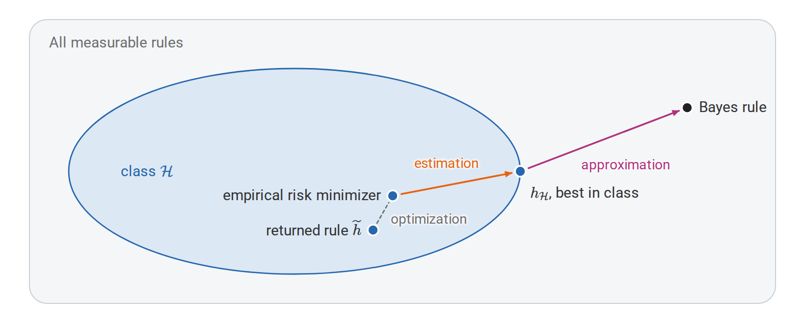

*The three contributions to the excess risk of a returned rule. Approximation compares the best rule in the class with the Bayes rule, estimation is controlled by the uniform deviation $`\Delta_n`$, and optimization is the tolerance $`\eta_{\mathrm{opt}}`$ of the empirical minimization. The picture is schematic: the three terms bound the excess risk rather than partition it.*

#### <a id="regularization-and-the-comparison-class"></a>Regularization and the comparison class

The first two terms pull the size of the class in opposite directions. A richer class may contain a better population predictor, reducing approximation error, but it offers more rules that fit the particular sample well by chance, which can only increase $`\Delta_n`$. This is one possible source of overfitting. The size of the class is not the only lever, however: which of many nearly equivalent rules the algorithm returns also matters, especially when many rules fit the observations exactly.

Regularization makes a preference among rules explicit instead of fixing a class once and for all. A constrained version minimizes $`\widehat R_n(h)`$ over $`\{h:J(h)\le r\}`$, where $`J`$ measures a property such as a coefficient norm; a penalized version minimizes

```math
\widehat R_n(h)+\lambda J(h),\qquad\lambda\ge0.
```

The penalty belongs to the fitting criterion, not to the loss by which future predictions are judged. Under suitable convexity and constraint qualifications, Lagrange multipliers relate the constrained and penalized forms, although a given $`r`$ and a given $`\lambda`$ need not define the same problem. When the empirical loss is a *sum* rather than an average, the same numerical $`\lambda`$ expresses a different balance as $`n`$ changes. A penalty expresses a preference whose statistical effect still needs an argument; [Appendix B](#block-information-appendix-b) gives an elementary risk bound for penalized minimization.

### <a id="from-concentration-to-generalization"></a>From concentration to generalization

Controlling $`\Delta_n`$ starts from a single rule. For a fixed $`h`$, chosen independently of $`D`$, the empirical risk is an average of $`n`$ independent losses in $`[0,1]`$, and Hoeffding's inequality gives

```math
P\bigl(|\widehat R_n(h)-R_*(h)|>\varepsilon\bigr)
\le2e^{-2n\varepsilon^2}.
```

This does not apply to the rule a learner returns. The rule $`A(D)`$ is chosen using the same losses that are averaged, and selection favors rules whose sampling errors happened to be favorable: every empirical risk may be unbiased on its own, while the smallest of many is optimistic. The remedy is a statement that holds for all rules in the class at once, and therefore for whichever one is selected.

For a finite class with $`|\mathcal H|=M`$, a union bound supplies it:

```math
\begin{aligned}
P(\Delta_n>\varepsilon)
&=P\left(\bigcup_{h\in\mathcal H}
\{|\widehat R_n(h)-R_*(h)|>\varepsilon\}\right)\\
&\le\sum_{h\in\mathcal H}2e^{-2n\varepsilon^2}
=2M e^{-2n\varepsilon^2}.
\end{aligned}
```

Setting the right side equal to $`\delta\in(0,1)`$ and solving for $`\varepsilon`$ shows that, with probability at least $`1-\delta`$,

```math
\forall h\in\mathcal H:\quad
|R_*(h)-\widehat R_n(h)|
\le\varepsilon_n(M,\delta)
:=\sqrt{\frac{\ln(2M/\delta)}{2n}}.
```

On this event $`\Delta_n\le\varepsilon_n(M,\delta)`$, so the decomposition of the previous section bounds the excess risk of approximate empirical risk minimization over $`R_\ast^{\mathcal H}`$ by $`2\varepsilon_n(M,\delta)+\eta_{\mathrm{opt}}`$. The class size enters only through $`\ln M`$: the statistical price of searching among $`M`$ candidates grows with the logarithm of their number.

A small example shows these quantities at work. Let $`X`$ be uniform on the integers $`0,\ldots,100`$, with $`P(Y=1\mid X=x)=0.15`$ below $`55`$ and $`0.85`$ at or above $`55`$. The class consists of the $`102`$ thresholds $`h_t(x)=\mathbf1\{x\ge t\}`$, $`t=0,\ldots,101`$, and the best of them is $`t=55`$, with risk $`0.15`$. Because the domain is finite, population risks can be computed exactly by summation rather than estimated from a test sample. The code draws $`80`$ observations and selects the threshold with the smallest training error.

```python
import numpy as np

rng = np.random.default_rng(7)
domain = np.arange(101)
prob_one = np.where(domain >= 55, 0.85, 0.15)
thresholds = np.arange(102)
predictions = domain[None, :] >= thresholds[:, None]
population = np.where(predictions, 1 - prob_one, prob_one).mean(axis=1)

n = 80
indices = rng.integers(0, len(domain), size=n)
labels = rng.random(n) < prob_one[indices]
empirical = (predictions[:, indices] != labels).mean(axis=1)
chosen = empirical.argmin()  # smallest threshold in an empirical tie

print("chosen threshold:", thresholds[chosen])
print("training risk:", empirical[chosen])
print("population risk:", population[chosen])
print("best population risk:", population.min())
```

The sample selects threshold $`53`$, with training risk $`0.125`$ and population risk about $`0.164`$. Two different gaps appear. The **generalization gap** compares the rule's population risk with its training risk, $`0.164-0.125\approx0.039`$; the **excess risk** compares its population risk with the optimum, $`0.164-0.150=0.014`$; here the Bayes rule is threshold $`55`$, so the best risk in the class and the Bayes risk coincide.

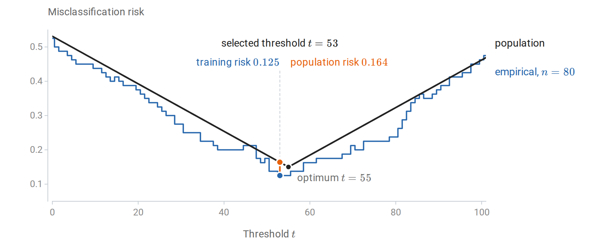

*Exact population risk and empirical risk of every threshold for the sample in the code above. The sample selects threshold $`53`$, whose training risk $`0.125`$ understates its population risk $`0.164`$; the population optimum is $`55`$.*

The bound is far more cautious than the realized generalization gap of $`0.039`$. For $`M=102`$ candidates, $`n=80`$ observations, and $`\delta=0.05`$, it gives $`\varepsilon_n\approx0.228`$. It must hold simultaneously for all thresholds and for all but a fraction $`\delta`$ of possible samples, whereas the realized gap concerns one threshold on one sample. A sample-size bound guarantees an event of specified probability; it does not predict the error on a particular dataset, and it need not be nearly attained.

#### <a id="countable-classes-and-description-length"></a>Countable classes and description length

The union bound charged every rule the same price, $`\ln M`$. The same argument can charge rules unequally, which also extends it to countable classes. Give each member of the class a positive weight $`w(h)`$, fixed independently of $`D`$, with $`\sum_h w(h)\le1`$. Apply the fixed-rule bound to each $`h`$ with failure probability $`\delta w(h)`$ and sum over $`h`$: with probability at least $`1-\delta`$, simultaneously for all $`h`$,

```math
|R_*(h)-\widehat R_n(h)|
\le
\sqrt{\frac{\ln(2/\delta)+\ln(1/w(h))}{2n}}.
```

Rules with larger weight receive tighter bounds. The coding section supplies natural weights: for a prefix code that describes each rule with $`L(h)`$ bits, the Kraft inequality permits $`w(h)=2^{-L(h)}`$, and the complexity term becomes $`L(h)\ln2`$. A rule with a short description, fixed before the data are seen, therefore needs a smaller allowance for sampling error. The code must account for everything used to specify the selected rule, including choices made while constructing it; assigning a short code to the observed winner afterward does not satisfy the premise.

The bound also suggests how to choose a rule. Let $`b(h)`$ denote the square-root term above, and choose $`\widehat h`$ to minimize $`\widehat R_n(h)+b(h)`$. On the simultaneous event,

```math
R_*(\widehat h)\le\inf_{h\in\mathcal H}\{R_*(h)+2b(h)\},
```

with an added tolerance for approximate minimization. The proof chains three inequalities: $`R_\ast(\widehat h)\le\widehat R_n(\widehat h)+b(\widehat h)`$, then the minimizing property, then $`\widehat R_n(h)\le R_\ast(h)+b(h)`$ for any competitor $`h`$. **Structural risk minimization** applies this principle to a sequence of classes: assign failure probabilities to the classes, derive a uniform bound within each, and minimize empirical risk plus the resulting complexity penalty. The penalty trades fitting accuracy against the difficulty of comparing the available rules reliably. PAC-Bayes bounds extend the same idea from single rules to distributions over rules ([Appendix C](#block-information-appendix-c)).

### <a id="pac-learning-and-its-limits"></a>PAC learning and its limits

The bounds so far control the gap between empirical and population risk. The PAC framework turns such bounds into a statement about learning itself: how many observations suffice for a learner to reach a target accuracy, whatever the law of the data.

The cleanest version assumes that the class contains a perfect rule. In binary classification, the **realizable** case assumes that some $`h_0\in\mathcal H`$ has zero population error. This requires both that labels are almost surely determined by the input and that the class contains a correct rule. A rule with zero training error is called **consistent**. Consistency on one sample is observable, whereas realizability is an assumption about the unknown law.

**Definition (PAC learnability).** A class is **probably approximately correct**, or PAC, learnable in the realizable setting if there are a learner $`A`$ and a sample-size function $`n_{\mathcal H}(\varepsilon,\delta)`$ such that, for every realizable data law, every $`\varepsilon,\delta\in(0,1)`$, and every iid sample $`D`$ of size $`n\ge n_{\mathcal H}(\varepsilon,\delta)`$,

```math
P_D\bigl(R_*(A(D))\le\varepsilon\bigr)\ge1-\delta.
```

The two parameters play different roles. The accuracy $`\varepsilon`$ concerns errors on fresh observations; the confidence $`\delta`$ allows a small fraction of unlucky training samples on which the guarantee fails. The quantifiers also matter: one learner and one sample-size function must work for every permitted law, so the guarantee cannot depend on the unknown law being favorable. Valiant's [*A Theory of the Learnable*](https://doi.org/10.1145/1968.1972) introduced a computational approach to learnability in 1984; the modern iid PAC framework formalizes a widely used version of this question.

For a finite class, realizability allows a sharper argument than the two-sided Hoeffding bound. A fixed rule with risk greater than $`\varepsilon`$ is consistent with all $`n`$ observations with probability at most

```math
(1-\varepsilon)^n\le e^{-n\varepsilon}.
```

By a union bound, the probability that *any* such bad rule in $`\mathcal H`$ is consistent is at most $`M e^{-n\varepsilon}`$. Every consistent learner that returns a member of $`\mathcal H`$ therefore succeeds once

```math
n\ge\frac{\ln M+\ln(1/\delta)}{\varepsilon}.
```

The rate $`1/\varepsilon`$ reflects how quickly a rule with appreciable error is exposed when every observation it gets wrong rules it out.

Without realizability the target changes. In the **agnostic** setting, no rule need be perfect, and the learner is asked to compete with the best member of the class:

```math
P_D\bigl(R_*(A(D))\le R_*^{\mathcal H}+\varepsilon\bigr)
\ge1-\delta.
```

For exact empirical risk minimization over a finite class, the uniform bound of the previous section gives the sufficient condition

```math
n\ge\frac{2\ln(2M/\delta)}{\varepsilon^2}.
```

The slower rate $`1/\varepsilon^2`$ reflects the difficulty of estimating small differences between noisy average losses. Assumptions about the noise or the geometry of the problem can improve it, and realizability is the clearest example. Realizability does not say that every member of the class is correct, and an agnostic guarantee promises accurate competition with the specified class, not Bayes-optimal prediction when the class has approximation error.

A sample-size guarantee also says nothing about computation. Searching a class of $`2^d`$ rules can require exponential time even though the number of observations needed grows only with $`d`$. Efficient learnability additionally bounds the running time in terms of the representation size and the accuracy parameters.

#### <a id="why-some-restriction-is-unavoidable"></a>Why some restriction is unavoidable

Every guarantee above restricts the class of rules. The restriction cannot be dropped: without some assumption linking observed and unobserved labels, no learner can guarantee small error for every target.

Consider a domain of $`2n`$ equally likely points. Choose each point's label independently and uniformly, once, to obtain a deterministic target function. A training sample of size $`n`$ visits at most $`n`$ distinct points, so the unvisited points carry at least half the population mass. Given the sample, their labels are still independent fair bits, and any learner errs on each of them with probability $`1/2`$. Averaged over random targets and samples, the error is therefore at least $`1/4`$, so for every learner there is a fixed target function on which its expected error is at least $`1/4`$.

Each target in this construction is perfectly predictable if known; the obstacle is only that the observed labels say nothing about the unobserved ones. This **no-free-lunch** argument shows why broad learning guarantees need assumptions about a useful class, representation, smoothness, or other structure. It does not assert that all algorithms perform equally on a particular structured problem. [Appendix C](#block-information-appendix-c) gives information-theoretic lower bounds of a related kind, which show how many observations any estimator needs.

### <a id="infinite-classes-and-vc-dimension"></a>Infinite classes and VC dimension

The finite-class bounds grow with $`\ln M`$, and weighting extends them only to countable classes. They say nothing about uncountable classes, such as thresholds with a real-valued parameter. Yet on a finite sample only the distinct labelings a class can produce matter, and an infinite class may produce few of them. For a binary-valued class $`\mathcal H`$, the set of label patterns on inputs $`x_1,\ldots,x_m`$ is

```math
\mathcal H|_{x_{1:m}}
=\{(h(x_1),\ldots,h(x_m)):h\in\mathcal H\}.
```

**Definition (growth function and VC dimension).** The **growth function** is $`\Pi_{\mathcal H}(m)=\sup_{x_{1:m}}\operatorname{card}(\mathcal H|_{x_{1:m}})`$. A set of $`m`$ points is **shattered** if its pattern set contains all $`2^m`$ binary vectors. The **Vapnik–Chervonenkis dimension**, written $`\operatorname{VCdim}(\mathcal H)`$, is the largest size of a shattered set, or infinity if arbitrarily large finite sets can be shattered.

Shattering asks whether every labeling of some suitable point set is possible; it does not require every point set to have this property. Two examples on the real line show how the definitions work. For thresholds $`h_t(x)=\mathbf1\{x\ge t\}`$, distinct ordered points admit only $`m+1`$ patterns, a block of zeros followed by a block of ones. One point can be labeled either way, but two ordered points cannot receive the pattern $`(1,0)`$, so the VC dimension is one, although the threshold takes infinitely many values. For interval indicators $`h_{a,b}(x)=\mathbf1\{a\le x\le b\}`$, the positive labels form one consecutive block. Two points admit all four labelings, but three ordered points cannot receive $`(1,0,1)`$, so the VC dimension is two. On $`m`$ ordered points there are $`1+m(m+1)/2`$ patterns: the all-zero pattern and one for each nonempty consecutive block. The code enumerates these patterns and compares them with the $`2^m`$ needed for shattering.

```python
import numpy as np

for m in (1, 2, 3, 4):
    positions = np.arange(m)
    threshold_patterns = {
        tuple((positions >= cut).astype(int)) for cut in range(m + 1)
    }
    interval_patterns = {tuple(np.zeros(m, dtype=int))}
    for left in range(m):
        for right in range(left, m):
            interval_patterns.add(
                tuple(((positions >= left) & (positions <= right)).astype(int))
            )
    print(m, len(threshold_patterns), len(interval_patterns), 2**m)
```

The counts reach $`2^m`$ up to one point for thresholds and up to two points for intervals. The enumeration is exhaustive for these two classes; sampling a few parameter values of an arbitrary class would not prove a bound on its VC dimension.

In higher dimensions, geometry determines the VC dimension. Affine halfspaces $`h_{w,b}(x)=\mathbf1\{w^\top x+b\ge0\}`$ in $`\mathbb R^d`$ have VC dimension $`d+1`$. The vertices of a nondegenerate simplex can be shattered, which gives the lower bound. For the upper bound, Radon's theorem partitions any $`d+2`$ points into two groups whose convex hulls intersect; labeling the two groups oppositely prevents any affine separation. Here the VC dimension happens to equal the number of parameters, but in general the parameter count is neither the definition of capacity nor a reliable substitute for it.

| Three points: labeling 1 | Three points: labeling 2 | Three points: labeling 3 | Four-point obstruction |
| --- | --- | --- | --- |
| 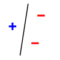 | 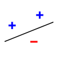 | 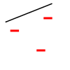 | 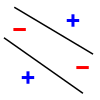 |

*Affine halfspaces in the plane have VC dimension three. The first three panels show three of the eight possible labelings of the same noncollinear triple; all eight can be separated. In the fourth, opposite corners have matching labels, and no single line separates the two classes. This one obstruction illustrates the geometry; Radon's argument above establishes that **every** four-point configuration has an unachievable labeling. Images: MithrandirMage, based on BAxelrod, with later simplifications by Jarvisa (panels 1, 2, and 4), CC BY-SA 3.0; full attribution appears in [Figure sources](sources/figure-sources.md).*

A finite VC dimension limits the number of patterns on every larger set as well. If $`v=\operatorname{VCdim}(\mathcal H)<\infty`$, the **Sauer–Shelah bound** gives

```math
\Pi_{\mathcal H}(m)\le\sum_{j=0}^{\min(v,m)}\binom mj,
\qquad
\Pi_{\mathcal H}(m)\le\left(\frac{em}{v}\right)^v
\quad\text{when }1\le v\le m,
```

so the number of patterns, $`2^m`$ up to $`m=v`$, grows only polynomially beyond it.

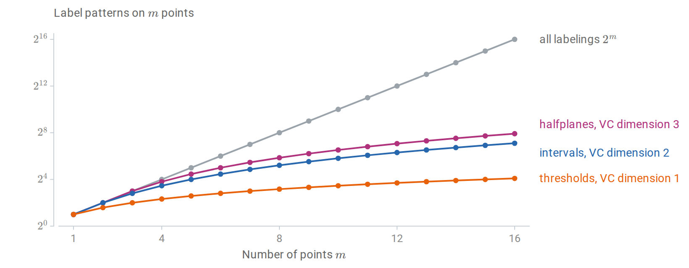

*Label patterns that three classes can produce on $`m`$ points, on a base-2 logarithmic axis. Each class realizes all $`2^m`$ labelings up to its VC dimension and then grows only polynomially, as the Sauer–Shelah bound requires. The halfplane count $`m^2-m+2`$ is for points in general position.*

Polynomial growth restores the finite-class argument, with the logarithm of the number of patterns, roughly $`v\ln(en/v)`$, taking the place of $`\ln M`$. Under the measurability and iid assumptions, with probability at least $`1-\delta`$,

```math
\Delta_n\le
C\sqrt{\frac{v\ln(en/v)+\ln(2/\delta)}{n}},
\qquad n\ge v\ge1,
```

for a universal constant $`C`$ and the zero–one loss of the binary class. The rate is valid in general, though neither its constants nor its logarithmic factor are the sharpest known. The substitution needs care, because the patterns are counted on the same sample whose losses are averaged. Vapnik and Chervonenkis's [1971 paper](https://doi.org/10.1137/1116025) handled this by comparing the sample with an independent second sample before counting patterns; [Appendix B](#block-information-appendix-b) gives a version of the argument through Rademacher complexity. Together with a matching lower bound, this shows that finite VC dimension characterizes distribution-free PAC learnability of binary classes under the standard measurability conditions.

### <a id="rademacher-complexity-and-margins"></a>Rademacher complexity and margins

VC dimension measures the worst case over all input sets and applies only to binary classes. Rademacher complexity measures, on the observed sample, how well a class of real-valued functions can correlate with random noise.

**Definition (Rademacher complexity).** Let $`\mathcal G`$ be a class of real-valued functions on observations, and let $`\sigma_1,\ldots,\sigma_n`$ be independent random signs with $`P(\sigma_i=1)=P(\sigma_i=-1)=1/2`$. The **empirical Rademacher complexity** is

```math
\widehat{\mathfrak R}_D(\mathcal G)
=\mathbb E_\sigma\left[
\sup_{g\in\mathcal G}\frac1n\sum_{i=1}^n\sigma_i g(Z_i)
\right].
```

The sample is held fixed inside this expectation. For each draw of random signs, the supremum picks the function in the class that best matches them, and the expectation averages the result over sign patterns. Since the signs are pure noise, a large value means the class can fit noise on this sample. The population version is $`\mathfrak R_n(\mathcal G)=\mathbb E_D\widehat{\mathfrak R}_D(\mathcal G)`$. This convention has normalization $`1/n`$ and no absolute value inside the supremum; other conventions change constants.

Two extreme classes show why the order of operations matters. A class with a single fixed function has empirical Rademacher complexity zero, because the signs have mean zero. A class that can assign arbitrary values in $`\{0,1\}`$ to the distinct observed points has complexity $`1/2`$: for each sign pattern it assigns one to the positive signs and zero to the negative ones. Taking the supremum *after* averaging over signs would give zero for both classes, and would therefore miss exactly the ability to fit noise that the definition is meant to measure.

To bound generalization, apply the definition to the **loss class** $`\mathcal G=\{z\mapsto\ell(h,z):h\in\mathcal H\}`$. If $`0\le g\le1`$ for every $`g\in\mathcal G`$, then with probability at least $`1-\delta`$, simultaneously for all $`h`$,

```math
R_*(h)\le\widehat R_n(h)
+2\mathfrak R_n(\mathcal G)
+\sqrt{\frac{\ln(1/\delta)}{2n}}.
```

The proof combines symmetrization, which bounds the expected largest discrepancy by twice the expected Rademacher complexity, with a bounded-differences inequality; both steps appear in [Appendix B](#block-information-appendix-b). Bartlett and Mendelson's [*Rademacher and Gaussian Complexities*](https://jmlr.org/papers/v3/bartlett02a.html) develops this approach. The theorem concerns the class of losses, so a complexity bound for raw prediction scores must still be carried over to the chosen loss, as the next subsection does for linear classifiers.

#### <a id="norm-bounds-for-linear-scores"></a>Norm bounds for linear scores

For linear scores with bounded weights, the Rademacher complexity has an explicit bound. For the class $`\mathcal F_B=\{x\mapsto w^\top x:\|w\|_2\le B\}`$, the supremum over $`w`$ is attained in the direction of $`\sum_i\sigma_ix_i`$, so

```math
\begin{aligned}
\widehat{\mathfrak R}_{x_{1:n}}(\mathcal F_B)
&=\frac Bn\mathbb E_\sigma\left\|\sum_i\sigma_i x_i\right\|_2\\
&\le\frac Bn\sqrt{\mathbb E_\sigma\left\|\sum_i\sigma_i x_i\right\|_2^2}
=\frac Bn\sqrt{\sum_i\|x_i\|_2^2}.
\end{aligned}
```

The inequality is Jensen's, and the final equality holds because the cross terms have mean zero. If $`\|X\|_2\le r_x`$ almost surely, the result is at most $`Br_x/\sqrt n`$. The ambient dimension does not appear explicitly, although it may still affect the weight norm or input radius that a problem requires. The following computation estimates the expectation over signs for a fixed sample, solving the inner supremum exactly through the norm formula, and compares it with the two bounds.

```python
import numpy as np

rng = np.random.default_rng(12)
n, d, B = 80, 6, 2.0
X = rng.normal(size=(n, d))
X /= np.maximum(np.linalg.norm(X, axis=1, keepdims=True), 1.0)
signs = rng.choice([-1.0, 1.0], size=(5000, n))
estimate = B * np.linalg.norm(signs @ X, axis=1).mean() / n
sample_bound = B * np.sqrt(np.square(X).sum()) / n
radius_bound = B / np.sqrt(n)  # every row has norm at most one
print(estimate, sample_bound, radius_bound)
```

The first number is a Monte Carlo estimate and fluctuates slightly; the other two are deterministic upper bounds on the complexity. All three scale linearly with $`B`$, and for inputs of bounded norm they typically decrease like $`1/\sqrt n`$ as observations are added.

These bounds concern scores, while classification is judged by the zero–one loss, which is not Lipschitz and cannot be handled directly. Margins bridge the gap. For $`Y\in\{-1,1\}`$, the **margin** of a score $`f`$ is $`Yf(X)`$: it is positive when the score has the correct sign, and its size measures confidence on the score scale. For a margin level $`\rho>0`$, the ramp loss

```math
\phi_\rho(s)=\min\{1,\max\{0,1-s/\rho\}\}
```

upper-bounds $`\mathbf1\{s\le0\}`$, vanishes for $`s\ge\rho`$, and is $`1/\rho`$-Lipschitz.

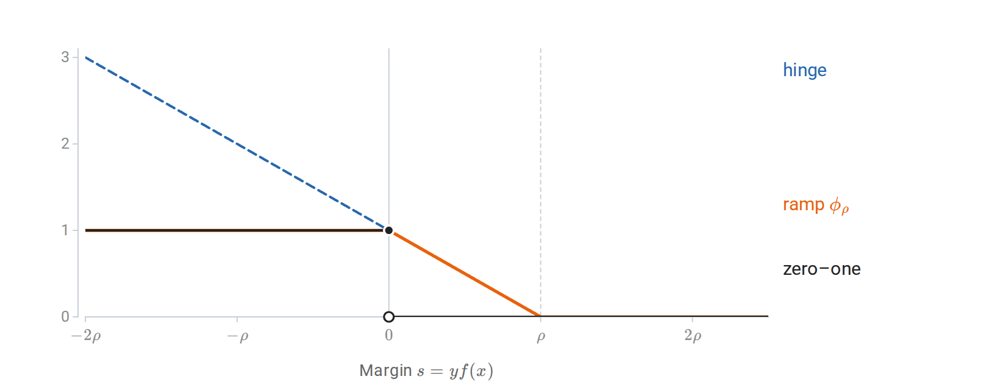

*Losses as functions of the margin $`s=yf(x)`$, in units of the margin level $`\rho`$. The ramp loss lies above the zero–one loss, vanishes beyond $`\rho`$, and has slope at most $`1/\rho`$; the hinge loss $`\max\{0,1-s/\rho\}`$ keeps growing for negative margins.*

The contraction inequality for Rademacher complexity carries a bound for the scores over to the ramp losses, at the cost of the Lipschitz factor $`1/\rho`$. For fixed $`B`$ and $`\rho`$, all linear scores with $`\|w\|_2\le B`$ therefore satisfy, with probability at least $`1-\delta`$,

```math
P_*(Yw^\top X\le0)
\le\frac1n\sum_i\phi_\rho(Y_iw^\top X_i)
+\frac{2Br_x}{\rho\sqrt n}
+\sqrt{\frac{\ln(1/\delta)}{2n}}.
```

The left side counts a zero score as an error, so it bounds the classification error under either convention for ties. The complexity term depends on the ratio $`Br_x/\rho`$, which is dimensionless because both $`Br_x`$ and $`\rho`$ are measured on the score scale; scaling the weights and the requested margin together does not improve the bound. Because the bound depends on $`Br_x/\rho`$ rather than on the number of parameters, controlling norms can matter even when that number is large. Choosing $`B`$ or $`\rho`$ from many possibilities after seeing the data must be paid for, for example through structural risk minimization. Mohri, Rostamizadeh, and Talwalkar's [*Foundations of Machine Learning*](https://cs.nyu.edu/~mohri/mlbook/) treats growth functions, Rademacher complexity, contraction, and margin bounds further in Chapters 3 and 5.

### <a id="the-learning-algorithm-can-control-generalization"></a>The learning algorithm can control generalization

Every bound so far holds uniformly over a class, including rules that the algorithm would never select. **Algorithmic stability** takes the opposite approach: it ignores the class and asks how much the rule the algorithm actually returns changes when one training observation changes.

**Definition (uniform replacement stability).** Let $`D`$ and $`D'`$ have the same size and differ in one observation. A deterministic learner has **uniform replacement stability** $`\beta_n`$ if

```math
\sup_z|\ell(A(D),z)-\ell(A(D'),z)|\le\beta_n
```

for every such pair of samples.

The requirement concerns the loss at every possible observation $`z`$, not only at the replaced one. Intuitively, a stable learner cannot memorize any single observation, so its training loss cannot be much more optimistic than its population loss. Precisely, for iid data and integrable losses, replacement stability implies

```math
\left|\mathbb E_D\left[R_*(A(D))-\widehat R_n(A(D))\right]\right|
\le\beta_n.
```

This bounds the expected *signed* gap. It is not, by itself, a bound on the expected absolute gap or a high-probability guarantee; Bousquet and Elisseeff's [*Stability and Generalization*](https://jmlr.org/papers/v2/bousquet02a.html) studies stability notions that give such stronger statements under additional assumptions.

Strongly convex regularization is a standard source of stability. Suppose $`w`$ ranges over a closed convex subset of Euclidean space, each loss $`\ell(w,z)`$ is convex and $`L_\ell`$-Lipschitz in $`w`$, and the regularized objective has a minimizer,

```math
w_D=\arg\min_w\left\{
\frac1n\sum_i\ell(w,Z_i)+\frac\lambda2\|w\|_2^2
\right\},\qquad\lambda>0.
```

The objective is $`\lambda`$-strongly convex, and replacing one observation gives

```math
\|w_D-w_{D'}\|_2\le\frac{2L_\ell}{\lambda n},
\qquad
\beta_n\le\frac{2L_\ell^2}{\lambda n}.
```

Strong convexity turns a small change in the average objective into a small change of its minimizer, and Lipschitz continuity turns a small change of parameters into a small change of losses; the proof is in [Appendix B](#block-information-appendix-b). For a linear score with bounded inputs, a loss that is Lipschitz in the score is Lipschitz in $`w`$ with an extra factor of the input radius. Regularized logistic regression with inputs of norm at most $`r_x`$ therefore satisfies the assumptions, with $`\beta_n\le2r_x^2/(\lambda n)`$ ([Appendix B](#block-information-appendix-b) also shows how its unbounded loss is controlled). Squared loss is not globally Lipschitz on an unrestricted parameter domain, so the theorem does not cover unrestricted least squares merely because a quadratic penalty is present.

Stability alone does not make predictions useful: a learner that always returns the same poor rule is perfectly stable. It must be combined with control of the training error or a comparison with a good rule. Increasing $`\lambda`$ improves the stability bound but may prevent the fit from capturing real structure, another form of the tradeoff between fitting the sample and being sensitive to its accidents. [Appendix B](#block-information-appendix-b) also contrasts these guarantees, which assume iid data, with regret bounds for online learning, which hold for arbitrary sequences.

### <a id="what-the-guarantees-say-about-evaluation"></a>What the guarantees say about evaluation

The same arguments clarify what a held-out evaluation does and does not establish. A fitted rule evaluated on a genuinely independent sample is fixed *conditional on its training data*, so the fixed-rule concentration bound applies conditionally, and hence unconditionally. That protection disappears when evaluation results are used to choose among many rules: the evaluation data then serve as selection data, exactly as the training data did before. A finite family of candidates can again be covered by a union bound, while adaptive searches need assumptions that account for their dependence on the reused data.

A guarantee also concerns a particular law. If evaluation or deployment observations follow $`Q`$ while training observations follow $`P_\ast`$, a bound on $`R_\ast(h)`$ does not automatically control $`R_Q(h)`$. For a loss with values in $`[0,1]`$, the simplest comparison is

```math
|R_Q(h)-R_*(h)|\le\operatorname{TV}(Q,P_*),
```

where the total variation distance is $`\sup_B|Q(B)-P_\ast(B)|`$. The bound follows from the variational characterization of total variation for functions in $`[0,1]`$, and it becomes uninformative when the two laws differ substantially. A change in the input distribution alone can change the risk, because errors need not occur equally often in all input regions. Dependent observations likewise require arguments adapted to their dependence.

Class size, description length, VC dimension, Rademacher complexity, margins, and stability thus measure different aspects of one statistical question: how much agreement with an observed sample supports claims about new observations. A bound can be mathematically correct and numerically vacuous, for example when it bounds a probability by a number larger than one. Such a bound still identifies which assumptions and quantities matter, but only empirical evaluation establishes the performance of a particular fitted procedure.

## <a id="appendices"></a>Appendices


<details>
<summary><a id="block-information-appendix-a"></a><b>A. Channels, compression with distortion, and general divergence</b></summary>

#### <a id="channels-and-capacity"></a>Channels and capacity

The noisy bit of the main text is the simplest example of a noisy channel, and mutual information measures how much information such a channel can carry. A discrete memoryless channel is specified by a conditional law $`W(y\mid x)`$, applied independently at each use. For an input law $`p(x)`$, the joint law is $`p(x)W(y\mid x)`$, and the channel's **capacity**, in bits per use, is the largest mutual information any input law achieves:

```math
C=\max_{p} I(X;Y).
```

The maximum is over input laws on the fixed input alphabet. Capacity has an operational meaning. A block code sends one of $`N`$ equally likely messages through $`n`$ uses of the channel, at a rate of $`(\log N)/n`$ bits per use. The channel coding theorem states that every rate below $`C`$ admits codes whose probability of decoding error tends to zero as the block length grows, while rates above $`C`$ do not. The guarantee concerns long blocks of channel uses, not the reliability of any single use.

For the binary symmetric channel $`Y=X\oplus N`$, with independent $`\operatorname{Bernoulli}(\eta)`$ noise, $`H(Y\mid X)=h_{\mathrm B}(\eta)`$ for every input law, and $`H(Y)`$ is at most one bit, so

```math
I(X;Y)=H(Y)-h_{\mathrm B}(\eta)\le1-h_{\mathrm B}(\eta).
```

A fair input attains the bound, because its output is also fair, so the capacity is $`1-h_{\mathrm B}(\eta)`$ bits. At $`\eta=1/2`$ the output reveals nothing about the input. At $`\eta=1`$ every bit is flipped, and the receiver can simply flip it back, so the capacity is again one bit: what costs capacity is uncertainty about the alteration, not the alteration itself.

#### <a id="lossy-compression-and-ratedistortion"></a>Lossy compression and rate–distortion

Mutual information also governs compression when exact recovery is not required. **Rate–distortion theory** specifies a distortion function $`d(x,\widehat x)\ge0`$ and an allowed expected distortion $`D`$. For an iid finite-alphabet source with law $`p`$, the rate–distortion function is

```math
R(D)=\inf_{q(\widehat x\mid x):\,\mathbb E d(X,\widehat X)\le D}
I(X;\widehat X).
```

The joint law in the expectation and mutual information is $`p(x)q(\widehat x\mid x)`$. Under the standard finite-alphabet, bounded-distortion assumptions, $`R(D)`$ is the smallest number of bits per source symbol with which long block codes can reproduce the source within average distortion $`D`$. The distortion measure is an explicit choice about which errors matter; entropy alone cannot supply it.

For a fair binary source with Hamming distortion $`d(x,\widehat x)=\mathbf1\{x\ne\widehat x\}`$,

```math
R(D)=1-h_{\mathrm B}(D),\quad 0\le D\le\tfrac12,
\qquad R(D)=0\text{ for }D\ge\tfrac12.
```

To see the lower bound, let $`E=\mathbf1\{X\ne\widehat X\}`$. Given $`\widehat X`$, knowing $`E`$ determines $`X`$, so $`H(X\mid\widehat X)\le H(E)\le h_{\mathrm B}(D)`$ when the error probability is at most $`D\le1/2`$, and therefore $`I(X;\widehat X)=1-H(X\mid\widehat X)\ge1-h_{\mathrm B}(D)`$. A reproduction that differs from the source by independent bit flips of probability $`D`$ attains equality. Tolerating a fraction $`D`$ of errors thus saves exactly $`h_{\mathrm B}(D)`$ bits per symbol.

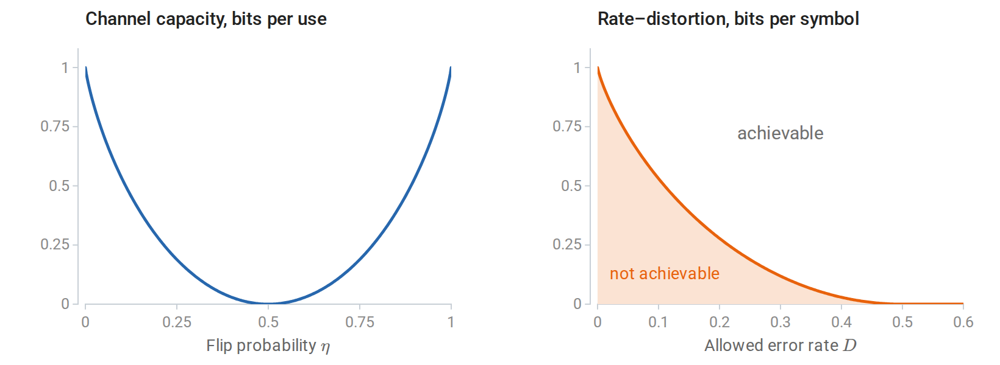

*Capacity of the binary symmetric channel, $`1-h_{\mathrm B}(\eta)`$ bits per use, vanishes at $`\eta=1/2`$ and returns to one bit at $`\eta=1`$ (left). For a fair binary source, the rate–distortion function $`1-h_{\mathrm B}(D)`$ bits separates achievable rates from unachievable ones and reaches zero at $`D=1/2`$ (right).*

#### <a id="general-kl-total-variation-and-changes-of-coordinates"></a>General KL, total variation, and changes of coordinates

The main text applied KL divergence and mutual information to continuous variables through densities. The general definitions need no densities. For probability measures $`P,Q`$, write $`P\ll Q`$ when every $`Q`$-null event is also $`P`$-null. Then

```math
D_{\mathrm{KL}}(P\Vert Q)
=\int\log\left(\frac{dP}{dQ}\right)dP
\quad\text{if }P\ll Q,
```

and $`+\infty`$ otherwise. The Radon–Nikodym derivative $`dP/dQ`$ is a generalized probability-density ratio. If both laws have densities $`p,q`$ relative to the same reference measure, this reduces to $`\int p\log(p/q)`$. A mixture of discrete and continuous components requires a reference measure that describes both.

Divergence controls a more familiar distance between laws. For distributions on a finite alphabet, the **total variation distance** is

```math
\operatorname{TV}(P,Q)=\sup_A|P(A)-Q(A)|
=\frac12\sum_x|p(x)-q(x)|.
```

**Pinsker's inequality**, with KL measured in nats, states

```math
\operatorname{TV}(P,Q)\le\sqrt{\frac12D_{\mathrm{KL}}(P\Vert Q)}.
```

Small KL divergence therefore guarantees similar probabilities for every event, and, since $`|\mathbb E_Pf-\mathbb E_Qf|\le\operatorname{TV}(P,Q)`$ for any $`0\le f\le1`$, similar risks for every bounded loss. The converse fails: a small probability assigned to an event that the other law rules out keeps the total variation small but makes the divergence infinite.

The invariance claimed in the main text follows from the density ratio. If a bijection $`g`$ is differentiable with a nonsingular Jacobian, both transformed densities acquire the same Jacobian factor, which cancels in their ratio, so $`D_{\mathrm{KL}}(P\Vert Q)=D_{\mathrm{KL}}(P_g\Vert Q_g)`$. A map that is not invertible can merge distinctions between the laws and can only decrease the divergence, a general form of data processing. Changing measurement units therefore changes differential entropy but leaves divergence unchanged, and mutual information is likewise unchanged by separate invertible transformations of its two variables.

One consequence concerns maximum likelihood for continuous data. Its objective is an empirical average of log densities, not a divergence from the empirical distribution. The empirical distribution has point masses, which a density model assigns probability zero, so $`D_{\mathrm{KL}}(\widehat P_n\Vert Q)=\infty`$ for every continuous $`Q`$. The useful identity $`\mathbb E_{P_\ast}[-\log q(Z)]=h(P_\ast)+D_{\mathrm{KL}}(P_\ast\Vert Q)`$ holds between population densities when the integrals exist, and maximum likelihood does not require a finite divergence from the empirical measure.

</details>


<details>
<summary><a id="block-information-appendix-b"></a><b>B. Generalization proofs and online learning</b></summary>

#### <a id="applying-bounded-loss-theorems-to-unbounded-losses"></a>Applying bounded-loss theorems to unbounded losses

The bounds of the main text assume losses in $`[0,1]`$. For discrete log loss, a uniform restriction $`q_h(y\mid x)\ge a>0`$ gives $`0\le-\log q_h(y\mid x)\le\log(1/a)`$, which can be rescaled to $`[0,1]`$. With $`K`$ possible labels such a restriction requires $`a\le1/K`$, and it changes the permitted model class. Inserting a small constant inside a numerical logarithm does not establish the theorem's assumptions for the original objective. Alternatively, bounds can be derived under tail or moment conditions on the loss.

#### <a id="a-risk-bound-for-penalized-minimization"></a>A risk bound for penalized minimization

The main text left open what a penalty guarantees. Suppose an exact penalized minimizer $`\widehat h_\lambda`$ exists, and a uniform deviation bound $`\Delta_n`$ holds on the containing class. For every comparison rule $`h`$,

```math
R_*(\widehat h_\lambda)
\le R_*(h)+\lambda J(h)-\lambda J(\widehat h_\lambda)+2\Delta_n
\le R_*(h)+\lambda J(h)+2\Delta_n
```

when $`J\ge0`$. The first inequality follows by comparing the two penalized empirical objectives, then converting each empirical risk to population risk. This elementary bound is informative only when the containing class has a useful uniform bound. More refined arguments exploit a smaller norm ball containing the fitted solution, or analyze the stability of the fitting algorithm.

#### <a id="symmetrization-and-a-rademacher-bound"></a>Symmetrization and a Rademacher bound

This subsection proves the Rademacher bound of the main text in two steps: symmetrization bounds the expected largest deviation, and a bounded-differences inequality turns the expectation into a high-probability statement. Let $`\mathcal G`$ be a fixed measurable class of functions in $`[0,1]`$, and introduce an independent **ghost sample** $`D'=(Z_1',\ldots,Z_n')`$ with the same law as $`D`$. Write $`Pg=\mathbb E g(Z)`$ and $`P_ng=n^{-1}\sum_i g(Z_i)`$. Since $`Pg=\mathbb E_{D'}P_n'g`$, moving the supremum outside an expectation gives

```math
\mathbb E_D\sup_g(Pg-P_ng)
\le\mathbb E_{D,D'}\sup_g(P_n'g-P_ng).
```

Independently swapping $`Z_i`$ and $`Z_i'`$ leaves their joint law unchanged. Encoding each swap with an independent random sign therefore yields

```math
\mathbb E_{D,D'}\sup_g\frac1n\sum_i[g(Z_i')-g(Z_i)]
=\mathbb E_{D,D',\sigma}\sup_g\frac1n\sum_i\sigma_i[g(Z_i')-g(Z_i)].
```

The supremum of a difference is at most the sum of the two separate suprema. The signs and their negatives have the same distribution, so both resulting terms equal $`\mathfrak R_n(\mathcal G)`$. Hence

```math
\mathbb E_D\sup_g(Pg-P_ng)\le2\mathfrak R_n(\mathcal G).
```

The ghost sample replaces the unknown expectation by a second sample, and the random signs encode the symmetry between the two samples; they are a proof device, not labels that the learning problem must supply. For the second step, let $`\Phi(D)=\sup_g(Pg-P_ng)`$. Replacing one observation changes $`\Phi`$ by at most $`1/n`$, because all $`g`$ take values in $`[0,1]`$. The **bounded-differences inequality** states that a function of independent observations with coordinate change bounds $`c_i`$ satisfies

```math
P\bigl(\Phi-\mathbb E\Phi\ge t\bigr)
\le\exp\left(-\frac{2t^2}{\sum_i c_i^2}\right).
```

Taking $`c_i=1/n`$ proves the one-sided bound in the main text. Empirical Rademacher complexity also changes by at most $`1/n`$ under one replacement. Applying bounded differences to it in the opposite direction and allocating failure probability $`\delta/2`$ to each event gives a version computed from the observed sample:

```math
\forall g\in\mathcal G:\quad
Pg\le P_ng+2\widehat{\mathfrak R}_D(\mathcal G)
+3\sqrt{\frac{\ln(2/\delta)}{2n}}.
```

This is a simultaneous statement for a class fixed independently of the sample. Substituting a newly selected class into it requires a further selection argument.

#### <a id="why-a-finite-vc-dimension-gives-a-deviation-rate"></a>Why a finite VC dimension gives a deviation rate

The VC rate of the main text follows by bounding the Rademacher complexity through a count of label patterns. The count enters through a bound for finitely many vectors. For a finite collection $`V\subset\mathbb R^n`$ with $`\max_{v\in V}\|v\|_2\le r`$, a moment-generating-function argument gives the **finite-class Rademacher bound**

```math
\mathbb E_\sigma\max_{v\in V}\frac1n\sum_i\sigma_i v_i
\le\frac{r\sqrt{2\ln|V|}}{n}.
```

For one vector, independence and $`\cosh u\le e^{u^2/2}`$ bound the moment generating function by $`e^{t^2\|v\|^2/2}`$. Replacing an exponential of a maximum by the sum of exponentials contributes $`\ln|V|`$, and optimizing over $`t>0`$ proves the displayed result.

On a fixed labeled sample, zero–one loss vectors of a binary class have norm at most $`\sqrt n`$ and number at most $`\Pi_{\mathcal H}(n)`$. Thus

```math
\widehat{\mathfrak R}_D(\mathcal G)
\le\sqrt{\frac{2\ln\Pi_{\mathcal H}(n)}{n}}
\le\sqrt{\frac{2v\ln(en/v)}{n}},\qquad n\ge v\ge1.
```

This bound holds for every sample, so it also bounds expected complexity. Applying the main Rademacher theorem to $`\mathcal G`$ and to $`1-\mathcal G`$, with failure budgets $`\delta/2`$, gives the explicit, generally nonoptimal bound

```math
\Delta_n\le
2\sqrt{\frac{2v\ln(en/v)}{n}}
+\sqrt{\frac{\ln(2/\delta)}{2n}}.
```

This supplies one valid set of constants for the rate in the main text. The independent second sample of Vapnik and Chervonenkis appears here inside symmetrization, after which the patterns are counted on the observed sample, conditional on it.

#### <a id="replacement-stability-of-regularized-convex-minimization"></a>Replacement stability of regularized convex minimization

This subsection proves the stability bound for regularized convex minimization and then its consequence for the expected generalization gap. Let $`F_D(w)=n^{-1}\sum_i\ell(w,Z_i)+(\lambda/2)\|w\|^2`$, with the assumptions in the main text. Write $`u=w_D`$, $`v=w_{D'}`$, and $`d=\|u-v\|`$. Strong convexity at the respective constrained minimizers gives

```math
F_D(v)-F_D(u)\ge\frac\lambda2d^2,
\qquad
F_{D'}(u)-F_{D'}(v)\ge\frac\lambda2d^2.
```

On adding, every shared observation and the regularizer cancel. If only coordinate $`i`$ differs, Lipschitz continuity gives

```math
\lambda d^2
\le\frac1n\bigl[
\ell(v,Z_i)-\ell(u,Z_i)
+\ell(u,Z_i')-\ell(v,Z_i')\bigr]
\le\frac{2L_\ell}{n}d.
```

For $`d>0`$, divide by $`\lambda d`$; the zero case already satisfies the desired bound. The loss difference at any evaluation point is then at most $`L_\ell d\le2L_\ell^2/(\lambda n)`$.

For the expected generalization statement, let $`Z_i'`$ be an independent observation and let $`D^{(i)}`$ replace $`Z_i`$ by $`Z_i'`$. Exchangeability of $`Z_i`$ and $`Z_i'`$ yields

```math
\mathbb E_D[R_*(A(D))-\widehat R_n(A(D))]
=\frac1n\sum_i\mathbb E_{D,Z_i'}[
\ell(A(D^{(i)}),Z_i)-\ell(A(D),Z_i)].
```

Uniform replacement stability bounds the absolute value of each summand by $`\beta_n`$. This proof explains both the iid requirement and why the conclusion concerns the signed expectation. Stronger tail control requires additional work.

For example, logistic loss $`\ell(w,(x,y))=\ln(1+e^{-yw^\top x})`$, with $`y\in\{-1,1\}`$ and $`\|x\|\le r_x`$, has gradient norm at most $`r_x`$. It is convex and $`r_x`$-Lipschitz in $`w`$. Exact minimization with the displayed quadratic penalty therefore has replacement stability at most $`2r_x^2/(\lambda n)`$. The loss is not globally bounded over all $`w`$, but comparison with the objective at $`w=0`$ bounds the fitted norm by $`\sqrt{2\ln2/\lambda}`$ on the unrestricted Euclidean parameter space. This controls the fitted losses and their expectations. The stability result and the bounded-loss uniform-convergence result thus have different routes to a valid generalization statement.

#### <a id="online-regret-and-its-connection-to-statistical-learning"></a>Online regret and its connection to statistical learning

Uniform convergence and stability both assume iid data. Online learning drops that assumption. At each round $`t`$, the learner chooses $`w_t`$, then observes a loss function $`f_t`$ and updates; the losses may form an arbitrary, even adversarial, sequence. The **regret** relative to one fixed comparator $`u`$ is

```math
\operatorname{Reg}_T(u)=\sum_{t=1}^T[f_t(w_t)-f_t(u)].
```

Regret compares cumulative performance on the encountered sequence with that of a single rule chosen in hindsight. It involves no sampling law and is not a population generalization gap, even when the update resembles stochastic gradient descent. Zinkevich's [*Online Convex Programming and Generalized Infinitesimal Gradient Ascent*](https://www.martin.zinkevich.org/publications/ICML03.pdf) established the convex framework and the gradient-based analysis that follows.

Suppose the feasible set $`\mathcal W`$ is closed and convex, each $`f_t`$ is convex, a chosen subgradient $`g_t\in\partial f_t(w_t)`$ satisfies $`\|g_t\|\le G`$, and $`\|w_1-u\|\le R`$. **Projected online gradient descent** with constant step size $`\eta>0`$ uses

```math
w_{t+1}=\operatorname{Proj}_{\mathcal W}(w_t-\eta g_t).
```

Nonexpansiveness of Euclidean projection, followed by expansion of the square, gives

```math
g_t^\top(w_t-u)
\le\frac{\|w_t-u\|^2-\|w_{t+1}-u\|^2}{2\eta}
+\frac\eta2\|g_t\|^2.
```

Convexity bounds $`f_t(w_t)-f_t(u)`$ by the left side. Summing telescopes the distance terms:

```math
\operatorname{Reg}_T(u)
\le\frac{R^2}{2\eta}+\frac{\eta G^2T}{2}.
```

For $`R,G>0`$, choosing $`\eta=R/(G\sqrt T)`$ gives regret at most $`RG\sqrt T`$, so average regret tends to zero. The bound concerns the best fixed comparator if the distance assumption holds uniformly over comparators.

Regret bounds still yield statistical guarantees when the data are iid. When $`f_t(w)=\ell(w,Z_t)`$ with iid $`Z_t\sim P_\ast`$, and $`w_t`$ depends only on earlier observations and independent algorithmic randomness, $`Z_t`$ is independent of $`w_t`$. Consequently $`\mathbb E f_t(w_t)=\mathbb E R_\ast(w_t)`$. If loss is convex in $`w`$, the average parameter $`\bar w_T=T^{-1}\sum_t w_t`$ obeys, for every fixed comparator $`u`$,

```math
\mathbb E R_*(\bar w_T)-R_*(u)
\le\frac1T\sum_t\mathbb E[R_*(w_t)-R_*(u)]
\le\frac{RG}{\sqrt T}.
```

This **online-to-batch conversion** turns a deterministic sequence guarantee into an expected statistical guarantee using independence and convexity. The average-loss calculation would not have the same justification if $`w_t`$ were chosen after observing $`Z_t`$. Nonconvex prediction classes require a different averaging argument, such as returning a randomly selected iterate, and do not inherit the parameter-average inequality automatically.

</details>


<details>
<summary><a id="block-information-appendix-c"></a><b>C. Information limits and PAC-Bayes</b></summary>

#### <a id="information-limits-for-estimation"></a>Information limits for estimation

The main text bounded how many observations suffice for learning. This appendix first bounds how many are necessary for any estimator, and then returns to upper bounds through PAC-Bayes. Suppose an unknown index $`V`$ is uniform on $`\{1,\ldots,M\}`$, where $`M\ge2`$. Conditional on $`V=v`$, the observed sample $`D=(Z_1,\ldots,Z_n)`$ has law $`P_v^{\otimes n}`$. A decision rule $`\widehat V(D)`$ tries to recover the index. Its error probability is $`P_e=\Pr\{\widehat V\ne V\}`$, averaged over the index and the observations.

**Fano's inequality** states that

```math
H(V\mid D)\le h_{\mathrm B}(P_e)+P_e\log(M-1),
```

where $`h_{\mathrm B}`$ is the binary entropy function of the main text, in bits. The original reference is Fano's [*Transmission of Information*](https://mitpress.mit.edu/9780262561693/transmission-of-information/).

To prove the inequality, introduce the error indicator $`E=\mathbf1\{\widehat V\ne V\}`$. It is determined by $`(V,D)`$, so the entropy chain rule gives

```math
H(V\mid D)=H(E,V\mid D)
=H(E\mid D)+H(V\mid E,D).
```

The first term is at most $`H(E)=h_{\mathrm B}(P_e)`$. When $`E=0`$, the index equals the decision and has no remaining uncertainty. When $`E=1`$, at most $`M-1`$ indices remain possible. Averaging over these two cases proves the result. A randomized rule can be handled by adjoining its independent random seed to $`D`$; this leaves $`I(V;D)`$ unchanged.

Since $`H(V)=\log M`$, we have $`H(V\mid D)=\log M-I(V;D)`$. Using $`h_{\mathrm B}(P_e)\le1`$ yields the convenient weaker form

```math
\boxed{P_e\ge1-\frac{I(V;D)+1}{\log M}.}
```

If the observations reveal substantially less than $`\log M`$ bits about the index, every decision rule makes many errors. The weaker bound can be uninformative for small $`M`$; the original binary-entropy form retains more information.

The same bound limits continuous estimation, by reducing it to recovering an index. Choose parameters $`\theta_1,\ldots,\theta_M`$ in a metric space with

```math
d(\theta_v,\theta_w)\ge2s\quad(v\ne w),\qquad s>0.
```

Such a collection is called a **$`2s`$-packing**. Given any estimator $`\widehat\theta(D)`$, decode the nearest packing point. If $`d(\widehat\theta,\theta_V)<s`$, the triangle inequality guarantees correct decoding. Consequently,

```math
\sup_v P_v^{\otimes n}
\{d(\widehat\theta,\theta_v)\ge s\}
\ge P_e
\ge1-\frac{I(V;D)+1}{\log M}.
```

The maximum error is at least the average error under the uniform index. Multiplying the right side by $`s`$ gives a lower bound on worst-case expected distance, and multiplying by $`s^2`$ gives one for expected squared distance. These bounds apply to every estimator, regardless of its computational cost. The packing chooses targets that are separated in the loss while their observation laws remain difficult to distinguish. [Scarlett and Cevher's chapter](https://arxiv.org/abs/1901.00555) develops this reduction and its variants.

#### <a id="bounding-information-through-kl-divergence"></a>Bounding information through KL divergence

Applying Fano's bound requires an upper bound on $`I(V;D)`$, and divergences between observation laws supply one. Let $`\overline P_n=M^{-1}\sum_v P_v^{\otimes n}`$ be the mixture law of the full sample. Then

```math
I(V;D)=\frac1M\sum_{v=1}^M
D_{\mathrm{KL}}(P_v^{\otimes n}\|\overline P_n).
```

For any reference law $`Q_n`$ for which the following divergences are finite, expanding the logarithmic density ratio gives

```math
\frac1M\sum_v D_{\mathrm{KL}}(P_v^{\otimes n}\|Q_n)
=I(V;D)+D_{\mathrm{KL}}(\overline P_n\|Q_n).
```

KL nonnegativity therefore bounds $`I(V;D)`$ by the average divergence to a convenient reference law. The reference need not be one of the candidate observation laws.

For independent observations under both laws,

```math
D_{\mathrm{KL}}(P^{\otimes n}\|Q^{\otimes n})
=nD_{\mathrm{KL}}(P\|Q).
```

Indeed, the log likelihood ratio of the sample is the sum of the individual log likelihood ratios, and expectation distributes over that sum. This identity concerns two product laws. It does **not** assert $`I(V;D)=nI(V;Z_1)`$: observations that are independent conditional on $`V`$ can be dependent after averaging over their shared unknown index. In particular, $`I(V;D)\le H(V)=\log M`$ for every $`n`$.

For a concrete calculation, let $`P_\theta=\mathcal N(\theta,\sigma^2I_d)`$ with known $`\sigma>0`$. Because Gaussian densities are exponentials, this divergence is naturally measured in nats; expanding the quadratic terms gives

```math
D_{\mathrm{KL}}(P_\theta\|P_\eta)
=\frac{\|\theta-\eta\|_2^2}{2\sigma^2},
\qquad
D_{\mathrm{KL}}(P_\theta^{\otimes n}\|P_\eta^{\otimes n})
=\frac{n\|\theta-\eta\|_2^2}{2\sigma^2}.
```

Taking $`Q_n=P_0^{\otimes n}`$ for a packing inside a radius-$`r`$ ball centered at zero gives $`I(V;D)\le nr^2/(2\sigma^2)`$ nats, that is, $`nr^2/(2\sigma^2\ln2)`$ bits in Fano's bound. Thus an estimation lower bound follows whenever many well-separated means fit into a ball whose observation laws stay close to the reference. The two ingredients play different roles: the geometry of the parameter space, measured by the metric $`d(\cdot,\cdot)`$, determines how many points $`M`$ fit at separation $`s`$, while the divergence between observation laws determines how well the sample can tell them apart.

#### <a id="pac-bayes-choosing-a-distribution-over-predictors"></a>PAC-Bayes: choosing a distribution over predictors

The description-length bound of the main text fixes a weight for each rule in advance and bounds the risk of the single rule chosen. PAC-Bayes bounds the risk of a randomized choice instead: a distribution over rules, chosen after seeing the data. The argument rests on exponential moments, so $`e`$ is intrinsic: logarithms in this subsection are natural and KL divergences are in nats.

Now return to $`D=(Z_1,\ldots,Z_n)\sim P_\ast^{\otimes n}`$ and a finite or countable hypothesis class $`\mathcal H`$. Let $`0\le\ell(h,z)\le1`$, with

```math
R_*(h)=\mathbb E_{Z\sim P_*}\ell(h,Z),
\qquad
\widehat R_n(h)=\frac1n\sum_{i=1}^n\ell(h,Z_i).
```

Fix a probability distribution $`\Pi_0`$ on $`\mathcal H`$ independently of this sample. After seeing $`D`$, a learning procedure may choose any distribution $`\rho`$ on $`\mathcal H`$. These are conventionally called the **prior** and **posterior**, but $`\rho`$ need not be obtained by Bayes' rule. They are distributions over predictors; $`P_\ast`$ is the distribution of observations. This distinction is central to the PAC-Bayesian framework developed in [McAllester's work](https://arxiv.org/abs/1307.2118).

For $`\delta\in(0,1)`$ and any $`\lambda>0`$ fixed before observing $`D`$, with probability at least $`1-\delta`$ over $`D`$, **simultaneously for every** $`\rho`$,

```math
\boxed{
\mathbb E_{h\sim\rho}R_*(h)
\le\mathbb E_{h\sim\rho}\widehat R_n(h)
+\frac{D_{\mathrm{KL}}(\rho\|\Pi_0)+\ln(1/\delta)}{\lambda}
+\frac{\lambda}{8n}.
}
```

The useful case has finite KL divergence, which requires $`\rho(h)=0`$ wherever $`\Pi_0(h)=0`$. The bound follows from three short steps.

First, Hoeffding's exponential bound for the average of $`n`$ independent variables in $`[0,1]`$ gives, for each fixed $`h`$,

```math
\mathbb E_D\exp\{\lambda[R_*(h)-\widehat R_n(h)]\}
\le\exp\left(\frac{\lambda^2}{8n}\right).
```

Average over the sample-independent prior and apply Markov's inequality. With probability at least $`1-\delta`$,

```math
\ln\mathbb E_{h\sim\Pi_0}
e^{\lambda[R_*(h)-\widehat R_n(h)]}
\le\frac{\lambda^2}{8n}+\ln(1/\delta).
```

Finally, the **change-of-measure inequality** says

```math
\mathbb E_\rho g(h)
\le D_{\mathrm{KL}}(\rho\|\Pi_0)
+\ln\mathbb E_{\Pi_0}e^{g(h)}.
```

For finite KL and bounded $`g`$, it follows directly from Jensen's inequality:

```math
\begin{aligned}
\mathbb E_\rho g-D_{\mathrm{KL}}(\rho\|\Pi_0)
&=\mathbb E_\rho\ln\frac{e^g\Pi_0(h)}{\rho(h)}\\
&\le\ln\sum_{h:\rho(h)>0}\Pi_0(h)e^{g(h)}\\
&\le\ln\mathbb E_{\Pi_0}e^g.
\end{aligned}
```

Set $`g(h)=\lambda[R_\ast(h)-\widehat R_n(h)]`$ and divide by $`\lambda`$. The probability event controls a single prior average; the last inequality is deterministic and valid for every $`\rho`$ on that event. This explains why choosing the posterior after seeing the data is allowed. [Seeger's PAC-Bayes paper](https://jmlr.org/papers/v3/seeger02a.html) develops related bounds using this variational approach; the displayed fixed-$`\lambda`$ version follows from the derivation above.

The bound controls the **Gibbs predictor**: sample $`h\sim\rho`$ independently of a fresh test observation and incur its loss. It does not automatically control the classifier obtained by averaging predictions and then taking a majority vote. With convex loss and predictions in a convex space, Jensen's inequality can transfer a Gibbs-risk upper bound to the averaged prediction. Zero–one classification loss does not have this convexity.

For example, take $`n=1000`$, a uniform prior on $`100`$ hypotheses, $`\delta=0.05`$, and $`\lambda=200`$, all fixed in advance. If a procedure chooses any five hypotheses after training and puts equal posterior mass on them, then

```math
D_{\mathrm{KL}}(\rho\|\Pi_0)
=\sum_{j=1}^{5}\frac15\ln\frac{1/5}{1/100}
=\ln20.
```

The bound adds $`(\ln20+\ln20)/200+200/8000\approx0.055`$ to their average empirical risk. An average training loss of $`0.08`$ therefore gives a Gibbs-risk upper bound of approximately $`0.135`$ on the event in the theorem. The posterior may favor hypotheses discovered by a complicated search: simultaneity covers that search, provided the class and prior were fixed independently of the sample.

For fixed $`\lambda`$, the part of the bound that depends on the posterior has an explicit minimizer:

```math
\rho_\lambda(h)
=\frac{\Pi_0(h)e^{-\lambda\widehat R_n(h)}}{C_\lambda},
\qquad
C_\lambda=\sum_{h\in\mathcal H}\Pi_0(h)e^{-\lambda\widehat R_n(h)}.
```

Expanding its logarithm gives

```math
\mathbb E_\rho\widehat R_n
+\frac{D_{\mathrm{KL}}(\rho\|\Pi_0)}{\lambda}
=\frac{D_{\mathrm{KL}}(\rho\|\rho_\lambda)-\ln C_\lambda}{\lambda}.
```

The KL term is minimized at $`\rho=\rho_\lambda`$. This exponential weighting balances empirical fit against departure from the prior. Its resemblance to a Bayesian posterior does not impose a likelihood model: the exponent contains the chosen loss. Conversely, using an unbounded negative log likelihood would require a different concentration argument from the bounded-loss proof given here.

There is also a distinction between choosing $`\rho`$ and choosing $`\lambda`$. The theorem permits every posterior on one event, but establishes that event only for the fixed $`\lambda`$. Substituting a sample-dependent minimizer of the displayed expression requires an additional argument. For example, choose $`K`$ positive values in advance, use failure probability $`\delta/K`$ for each, and take a union bound. Then every value is valid simultaneously, replacing $`\ln(1/\delta)`$ by $`\ln(K/\delta)`$, and selection after seeing the sample is justified.

The KL penalty connects generalization with description length. For a point mass on $`h`$, it equals $`\ln[1/\Pi_0(h)]`$; for a spread-out posterior, it measures the change from the prior as a whole. A prior concentrated around hypotheses suggested by earlier, independent information can therefore be useful. A prior constructed from the same sample is not covered by this proof: its dependence breaks the step that averages fixed-hypothesis concentration bounds. Likewise, a compressed parameter file provides a generalization guarantee only when a valid encoding and a corresponding learning bound have been established. The theorem makes these requirements precise through the prior, the loss, and the sampling assumptions.

</details>

---

[← 4. Probability and Statistics](04-probability-and-statistics.md) · [6. Numerical Computing with NumPy and PyTorch →](06-numerical-computing-with-numpy-and-pytorch.md)
