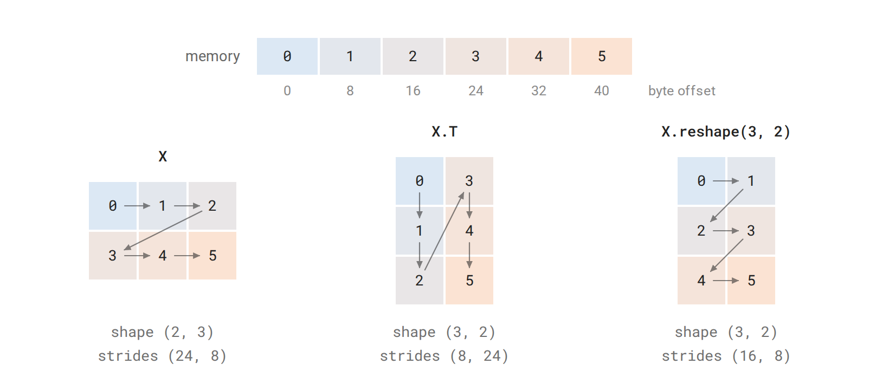
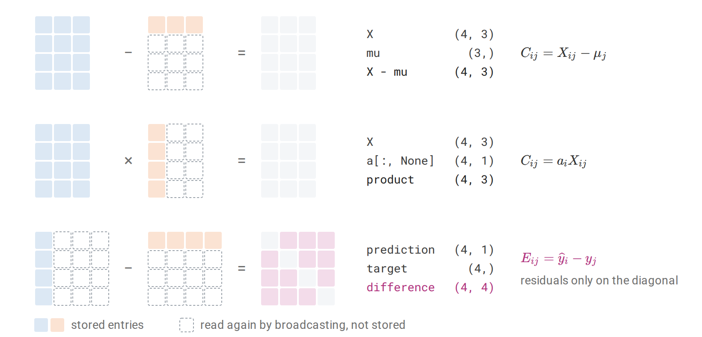
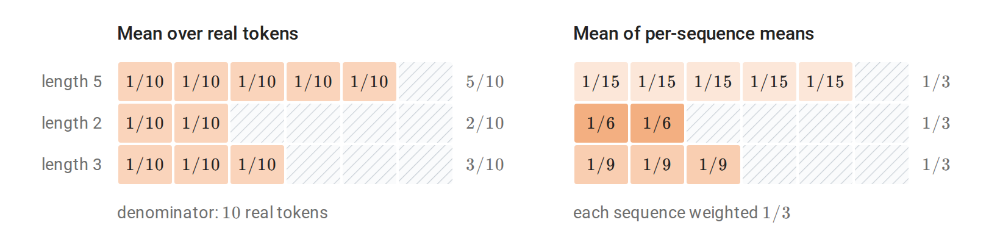
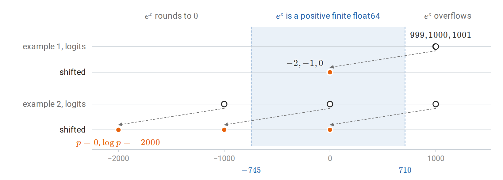
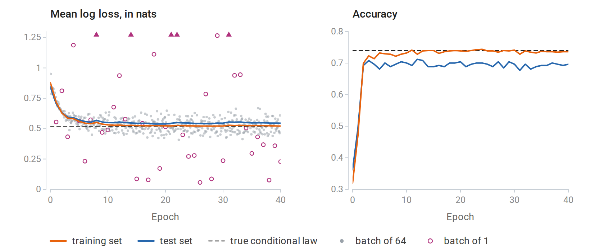
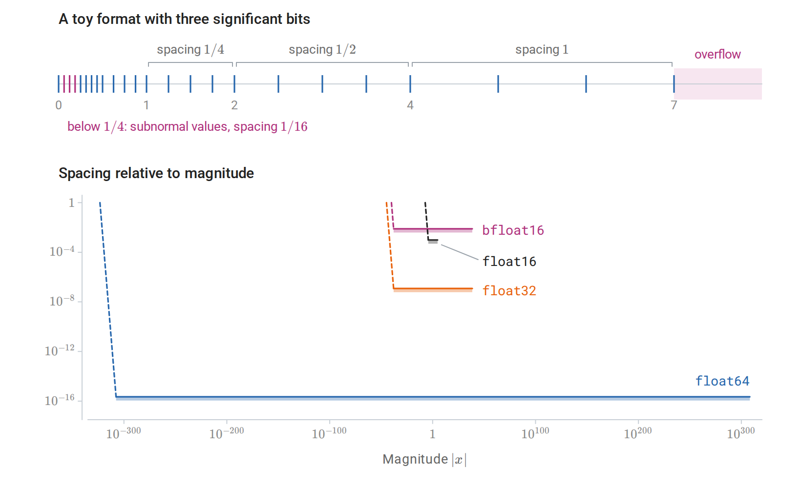

[ML Mastery Notes](../README.md) › [Foundations](README.md)

# 6. Numerical Computing with NumPy and PyTorch

[← 5. Information and Learning Theory](05-information-and-learning-theory.md)

## <a id="arrays-and-numerical-computation"></a>Arrays and numerical computation

### <a id="mathematical-objects-and-array-representations"></a>Mathematical objects and array representations

The earlier chapters work with vectors, matrices, functions, and probability distributions, while programs work with arrays of numbers. This chapter is about the translation between the two. Its first part covers arrays and the operations that combine them, the second covers tensors that PyTorch can differentiate and the modules that hold trainable parameters, and the third fits and evaluates a complete predictor. At each step the translation has to settle details that an equation leaves implicit: which axis holds which index, what kind of number is stored, and how the entries are laid out in memory.

**Definition (array, shape, and order).** An **array** of **shape** $`(d_1,\ldots,d_k)`$ assigns a value of one common data type to every index tuple $`(i_1,\ldots,i_k)`$ with $`1\le i_j\le d_j`$; NumPy and PyTorch number the same positions from zero. The number of axes $`k`$ is the array's **order**, reported as `ndim`, and its **size** is the number of entries, $`\prod_{j=1}^k d_j`$. An array of order zero holds one value.

Software documentation sometimes calls the number of axes the "rank". These notes keep the linear-algebra meaning of rank instead: an array of shape `(4, 3)` has order two, while its matrix rank can be anything from zero to three. Tensor rank for arrays of higher order is yet another notion, discussed in Linear Algebra.

In ML code, "tensor" simply means an array of any order. An array can hold the coordinates of a mathematical tensor in chosen bases, but it can just as well hold an image, a list of token identifiers, or a table of unrelated measurements. Its shape records how many axes there are and how long they are, not what the axes mean or how the entries would transform under a change of basis.

Mathematical expressions in these notes keep vectors as columns, while datasets are stored with one observation per row: for $`N`$ observations with $`d`$ features, the design matrix $`X\in\mathbb R^{N\times d}`$ holds $`x_i^\top`$ in row $`i`$. A shared affine map with $`W\in\mathbb R^{m\times d}`$ and $`b\in\mathbb R^m`$ therefore has two equivalent forms, one for a single observation and one for the whole dataset:

$$
z_i=Wx_i+b,
\qquad
Z=XW^\top+\mathbf 1_Nb^\top.
$$

The output $`Z`$ has shape $`N\times m`$, with $`z_i^\top`$ in row $`i`$. The transpose in the dataset form comes only from storing observations as rows; $`x_i`$ and $`z_i`$ are still column vectors. The table lists the shapes used for common objects.

| Mathematical role | NumPy shape | Meaning |
| --- | --- | --- |
| Scalar $`a`$ | `()` | A zero-dimensional array |
| Coordinates of $`x\in\mathbb R^d`$ | `(d,)` | One axis, with no stored row/column orientation |
| Explicit column $`x`$ | `(d, 1)` | Two axes, the second of length one |
| Explicit row $`x^\top`$ | `(1, d)` | Two axes, the first of length one |
| Dataset $`X`$ | `(N, d)` | Observation axis followed by feature axis |
| Sequence batch $`\mathcal X`$ | `(B, T, d)` | Example, position, feature |

A one-dimensional array of shape `(d,)` has no orientation, so `x.T` returns it unchanged. To obtain an explicit column or row, insert an axis of length one with `x[:, None]` or `x[None, :]`. This changes no values, but it changes how later operations line up the coordinates, as the section on broadcasting shows.

Because shapes carry so much of the meaning, it helps to state them for every operation one writes or reads.

**Definition (shape contract).** A **shape contract** for an array operation states the shape of each input and output together with the meaning of each axis.

For example, a position-wise feature map takes `(B, T, d)` to `(B, T, m)`: it applies the same map to the feature vector at every example and position. The contract alone does not guarantee this, because an operation that mixes information across positions, such as the attention layers of later chapters, or across examples, such as batch normalization during training, has the same input and output shapes. Nor do two axes of equal length become interchangeable: if $`T=d`$, exchanging them preserves the shape but not the meaning. The contract fixes the axes, and the defining formula says which coordinates interact.

#### <a id="data-types-and-mathematical-domains"></a>Data types and mathematical domains

Every array also has a **data type**, reported as `dtype` in the [NumPy array object](https://numpy.org/doc/stable/reference/arrays.ndarray.html) and shared by all of its entries, for example `float64`, `int64`, or `bool`. The type should match the mathematical domain of the values: integers for class labels and token identifiers, floating-point numbers for measured features and real-valued parameters, and Booleans for predicates. An integer code is only a name. That classes $`7`$ and $`8`$ have adjacent codes says nothing about the classes being similar; any relation between categories has to come from the model that consumes the codes.

NumPy's [numerical data types](https://numpy.org/doc/stable/user/basics.types.html) have fixed widths, which gives them limits that the mathematical domains lack. Integer arithmetic can overflow, and assigning a fractional value into an integer array truncates the value instead of turning the array into a floating-point array. An explicit conversion such as `X.astype(np.float64)` should therefore come before any calculation that needs real arithmetic. Conversion cannot restore digits that were already lost: a result computed in `float32` and then converted to `float64` keeps its `float32` rounding error.

The choice between `float32` and `float64` trades accuracy against memory and speed. A dense array of $`M`$ entries needs $`4M`$ bytes of element storage in `float32` and $`8M`$ in `float64`, plus metadata and any temporary arrays. The small calculations in this chapter use `float64`, so that identities can be checked to many digits. [Appendix A](#block-numerical-appendix-a) describes which numbers each format can represent and how rounding errors accumulate.

### <a id="indexing-shared-storage-and-rearrangement"></a>Indexing, shared storage, and rearrangement

Taking part of an array raises two questions: which entries the result contains, and whether it shares their storage with the original. The second question matters because a write to shared storage changes both arrays.

**Definition (view and copy).** A **view** is an array that refers to storage owned by another array, through its own shape, data type, and memory layout. A **copy** owns separate element storage.

For numeric arrays, basic slicing such as `X[:3]` returns a view, whereas indexing with an integer array or a Boolean mask returns a copy. Assignment is different from selection: `X[[0, 2]] = 0` writes into `X` itself, because it modifies the indexed entries rather than creating a new array. NumPy's [copies and views](https://numpy.org/doc/stable/user/basics.copies.html) documentation gives the complete rules.

Indexing also determines whether an axis survives. `X[0]` returns the first observation as a one-dimensional array of shape `(d,)`, while `X[0:1]` keeps the observation axis and returns shape `(1, d)`. The second form is the one to use when a function expects a batch, even a batch of one example.

To see how a view can present the same numbers in a different arrangement, consider how an array is stored. Memory is a single line of bytes, so an array with several axes needs a rule that locates each entry on that line.

**Definition (strides).** An array with **strides** $`(s_1,\ldots,s_k)`$, measured in bytes, stores the entry with zero-based index $`(i_1,\ldots,i_k)`$ at the byte offset $`o+\sum_{j=1}^k i_js_j`$ in its storage, where $`o`$ is the position of its first entry.

A contiguous `float64` array of shape `(3, 4)`, stored row by row, has strides `(32, 8)`: the next entry of a row lies eight bytes further on, and the next row lies four entries, or 32 bytes, further on. PyTorch's `stride()` counts the same displacements in entries rather than bytes, giving `(4, 1)`. A transpose exchanges the axes together with their strides, so it can be a view that moves no numbers at all.

A reshape is a different operation. It keeps the entries in their traversal order, row by row by default, and regroups that sequence into a new shape. If a matrix has rows $`(0,1,2)`$ and $`(3,4,5)`$, its transpose has rows $`(0,3)`$, $`(1,4)`$, and $`(2,5)`$, while its reshape to `(3, 2)` has rows $`(0,1)`$, $`(2,3)`$, and $`(4,5)`$. Both results have the same shape, but only the first is the transpose. The difference matters whenever example, time, and feature axes are merged or split: equal entry counts show that a reshape is possible, but only the traversal order shows what the result means. A reshape returns a view when the layout allows it and a copy otherwise, and `np.shares_memory` reports whether two particular arrays overlap in storage.



*The six entries of a $`2\times3`$ `float64` array occupy consecutive eight-byte slots, and the arrows in each grid follow memory order. The transpose reads the same slots with its strides exchanged, so memory order runs down its columns. The reshape to $`(3,2)`$ keeps memory order along its rows and only regroups the entries.*

```python
import numpy as np

X = np.arange(12, dtype=np.float64).reshape(3, 4)
one_row = X[0:1]                 # Shape (1, 4); a view.
selected = X[[0, 2]]             # Shape (2, 4); a copy.
assert one_row.shape == (1, 4)
assert np.shares_memory(X, one_row)
assert not np.shares_memory(X, selected)

one_row[0, 0] = -1
assert X[0, 0] == -1
assert selected[0, 0] == 0

transposed = X.T
assert transposed.shape == (4, 3)
assert np.shares_memory(X, transposed)
assert transposed[2, 1] == X[1, 2]
print(X.strides, transposed.strides)
print(X[0].shape, one_row.shape)
```

The strides print as `(32, 8)` and `(8, 32)`, and the two selected rows have shapes `(4,)` and `(1, 4)`. The write through the view `one_row` changed `X`, while the copy `selected` kept the old value. In data preparation this is the practical point: modifying a slice of a stored dataset modifies the dataset itself whenever the slice is a view.

### <a id="broadcasting-and-reductions"></a>Broadcasting and reductions

Elementwise operations such as `+` and `*` combine entries with equal indices, so they need operands of the same shape. Broadcasting extends them to operands that lack an axis or have length one along it, by reusing their entries along that axis.

**Definition (broadcasting).** Two shapes are **broadcast-compatible** if, after the shorter is padded on the left with ones to equal length, each pair of corresponding dimensions is equal or contains a one. The result takes, in each position, the dimension that differs from one, or one if both are one, and an operand of length one along an axis supplies its single entry at every index of that axis.

Because shapes are aligned from the right, `(N, d)` can be combined with `(d,)` and also with `(N, 1)`, but the two combinations mean different things. With feature offsets $`\mu\in\mathbb R^d`$, the expression `X - mu` computes

$$
C_{ij}=X_{ij}-\mu_j,
$$

reusing the same offsets for every observation. With one multiplier per observation, $`a\in\mathbb R^N`$, the vector must first be made a column, and `X * a[:, None]` computes $`C_{ij}=a_iX_{ij}`$. Writing the indexed formula first shows which index each operand carries, and therefore where an axis of length one is needed. NumPy's [broadcasting rules](https://numpy.org/doc/stable/user/basics.broadcasting.html) never consult the meaning of the axes, so this check is the programmer's job. Broadcasting does not physically repeat the smaller operand, although the output has the full broadcast shape.

The opposite operation removes an axis by aggregating along it.

**Definition (reduction).** A **reduction** along an axis aggregates, by a sum, mean, maximum, or similar operation, all entries that share their other indices, and removes that axis from the result.

The feature means are a reduction over the observation axis,

$$
\mu_j=\frac1N\sum_{i=1}^N X_{ij},
$$

so `X.mean(axis=0)` has shape `(d,)`. With `keepdims=True` the [mean reduction](https://numpy.org/doc/stable/reference/generated/numpy.mean.html) returns shape `(1, d)` instead, keeping the reduced axis with length one so that the result broadcasts back against `X`. Similarly, `X.mean(axis=1, keepdims=True)` has shape `(N, 1)` and holds one mean per observation.

Broadcasting is also behind one of the most common silent errors. Suppose predictions have shape `(N, 1)` and targets have shape `(N,)`. Aligned from the right, the two shapes broadcast to `(N, N)`, so their difference is the matrix of all pairwise differences,

$$
E_{ij}=\widehat y_i-y_j,
$$

rather than the vector of residuals $`e_i=\widehat y_i-y_i`$. Averaging the squared entries still returns a scalar, so nothing fails; the program simply minimizes a different objective.



*Shapes are aligned from the right. Feature offsets of shape $`(3,)`$ are reused for every observation, and a column of multipliers of shape $`(4,1)`$ is reused for every feature. Predictions of shape $`(4,1)`$ minus targets of shape $`(4,)`$ form every pairwise difference, and only the diagonal of that result holds the intended residuals.*

```python
import numpy as np

X = np.array([[1., 4.], [3., 8.], [5., 12.]])
mu = X.mean(axis=0, keepdims=True)
centered = X - mu
assert mu.shape == (1, 2)
np.testing.assert_allclose(centered.mean(axis=0), 0.)

weights = np.array([1., 2., 3.])
weighted_sum = (X * weights[:, None]).sum(axis=0)
np.testing.assert_allclose(weighted_sum, weights @ X)

prediction = np.array([[1.], [2.], [3.]])
target = np.array([1., 2., 3.])
wrong = prediction - target
residual = prediction[:, 0] - target
assert wrong.shape == (3, 3)
assert residual.shape == target.shape
print(wrong.shape, np.mean(wrong**2))
print(residual.shape, np.mean(residual**2))
```

In the last example every prediction equals its target, so the mean squared error is zero, yet the all-pairs version returns $`4/3`$. The first part of the code checks the reductions: after the feature means are subtracted, each column of `centered` has mean zero, and the weighted sum over observations agrees with the matrix product `weights @ X`.

#### <a id="masks-and-the-denominator-of-an-average"></a>Masks and the denominator of an average

Reductions over padded data need one more ingredient. When sequences of different lengths share a batch of shape `(B, T)`, the shorter sequences are padded to length $`T`$, and a Boolean **mask** records which positions are real: $`M_{bt}=1`$ for a real token and $`M_{bt}=0`$ for padding. If $`\ell_{bt}`$ is a finite loss at each position, the average over real tokens is

$$
\overline\ell
=\frac{\sum_{b,t}M_{bt}\ell_{bt}}{\sum_{b,t}M_{bt}},
\qquad \sum_{b,t}M_{bt}>0.
$$

Dividing by $`BT`$ instead would count every padding position as a token with zero loss, so the average would shrink as padding increases. There is also a second legitimate choice. Averaging within each sequence first and then across sequences gives every sequence equal weight, whereas the token average gives longer sequences more weight. The two are different objectives, and the denominator is where the choice between them is made.



*A batch stores three sequences of lengths $`5`$, $`2`$, and $`3`$ in six positions, and each real position shows the weight its loss receives. The token mean weights every real token equally, so the longest sequence supplies half of the average. The mean of per-sequence means weights each sequence equally, so a token of the shortest sequence counts two and a half times as much as a token of the longest. Dividing the token sum by all $`18`$ stored positions would scale the token mean by $`10/18`$.*

Multiplying by a mask does not remove invalid values. In floating-point arithmetic $`0\times\infty`$ and $`0\times\mathrm{NaN}`$ are both `NaN`, so an infinite or undefined loss at a padding position spoils the masked sum. The [selection operation](https://numpy.org/doc/stable/reference/generated/numpy.where.html) `np.where(mask, f(X), 0)` has the same weakness for a different reason: NumPy evaluates `f(X)` at every entry before selecting, so `f` is still applied outside its domain. In a differentiated program the discarded values can even make the gradient `NaN`: the selection sends a zero gradient to the discarded branch, and the chain rule multiplies that zero by the function's infinite derivative there, as for $`\log`$ at zero. The safe order is to make the inputs valid first, for example with `np.where(mask, X, 1)` before a logarithm, then apply the function, and then mask its result.

### <a id="products-contractions-and-batches"></a>Products, contractions, and batches

Array code uses two kinds of multiplication that are easy to confuse. For NumPy arrays, `*` is elementwise, so `X * X` squares every entry, while `@` is matrix multiplication, summing over a shared inner index, so `X.T @ X` forms all inner products between features. For two-dimensional inputs, the [matrix multiplication operation](https://numpy.org/doc/stable/reference/generated/numpy.matmul.html) has the contract

$$
(m,d)\ @\ (d,k)\longrightarrow(m,k).
$$

For inputs with more axes, `@` treats the last two axes as matrices and the leading axes as a batch. Thus `(B, m, d) @ (B, d, k)` computes $`B`$ separate matrix products, and a single `(d, k)` matrix on the right is broadcast to every member of the batch. A batch of vectors of shape `(B, d)`, however, is just a matrix to `@`. To apply a different matrix $`A_b\in\mathbb R^{m\times d}`$ to each vector $`x_b`$, with `A` of shape `(B, m, d)`, each vector must first become a column: `(A @ x[..., None])[..., 0]`.

All of these products follow one pattern.

**Definition (index contraction).** An **index contraction** multiplies entries of arrays whose axes carry index labels and sums over every label that does not appear in the output.

[Einstein summation in NumPy](https://numpy.org/doc/stable/reference/generated/numpy.einsum.html) writes contractions directly in this form. In `np.einsum("ij,jk->ik", A, B)`, which computes $`C_{ik}=\sum_jA_{ij}B_{jk}`$, the output labels are `i,k` and the omitted label `j` is summed. The output labels also fix the order of the result's axes.

For a batch of sequences $`\mathcal X\in\mathbb R^{B\times T\times d}`$ and $`W\in\mathbb R^{m\times d}`$, a shared affine map applied at every example and position is

$$
\mathcal Z_{rto}=\sum_{j=1}^d\mathcal X_{rtj}W_{oj}+b_o,
\qquad 1\le r\le B.
$$

The formula writes $`r`$ for the example index because $`b`$ already denotes the bias; the code below uses the label `b` for the batch axis in its einsum strings and calls the bias `bias`. In einsum form the map is `"bti,oi->bto"`: the feature label is summed, while the example and position labels remain. Position-wise squared lengths contract the feature index of $`\mathcal X`$ with itself:

$$
S_{rt}=\sum_{j=1}^d\mathcal X_{rtj}^2.
$$

```python
import numpy as np

rng = np.random.default_rng(13)
X = rng.normal(size=(2, 3, 4))
W = rng.normal(size=(5, 4))
bias = rng.normal(size=5)

Z = X @ W.T + bias
Z_indexed = np.einsum("bti,oi->bto", X, W) + bias
np.testing.assert_allclose(Z, Z_indexed)
assert Z.shape == (2, 3, 5)

squared_norm = np.einsum("bti,bti->bt", X, X)
np.testing.assert_allclose(squared_norm, (X * X).sum(axis=-1))

A = rng.normal(size=(2, 5, 4))
x = rng.normal(size=(2, 4))
z = np.einsum("bij,bj->bi", A, x)
np.testing.assert_allclose(z, (A @ x[..., None])[..., 0])
print(Z.shape, squared_norm.shape, z.shape)
```

The printed shapes are `(2, 3, 5)`, `(2, 3)`, and `(2, 5)`. The first computation applies one weight matrix at every example and position, while the last applies a different matrix to each example. The two lines of code look alike; the index labels are what reveal which parameters are shared.

Index notation also suggests a way to test a translation from formula to code: compute the same indexed sum with explicit loops on a small input, and compare. The test is most informative with unequal dimensions, such as $`(B,T,d,m)=(2,3,4,5)`$, because an accidental exchange of two axes then produces a shape error or a wrong value instead of passing unnoticed. A second test with an axis of length one checks that a batch or feature axis is not squeezed away by accident. Such tests establish what the code computes; how fast it computes it is a separate question, answered by benchmarking.

Vectorization, which replaces a Python loop by a single array operation, removes interpreter overhead but not arithmetic, and it can increase memory use. For example, the broadcast expression `X[:, None, :] - X[None, :, :]` materializes all pairwise differences between $`N`$ vectors as an $`N\times N\times d`$ array. If only the squared distances are needed, the identity $`\|x_i-x_j\|^2=\|x_i\|^2+\|x_j\|^2-2x_i^\top x_j`$ obtains them from the matrix product `X @ X.T` with $`N\times N`$ memory, at some loss of accuracy for nearly equal points. If only a sum over pairs is needed, processing the rows in blocks keeps memory bounded.

### <a id="solving-equations-and-measuring-error"></a>Solving equations and measuring error

Mathematical notation writes the solution of $`Ax=b`$ as $`A^{-1}b`$, but a program that only needs the solution should not compute the inverse. Solving the system directly through a factorization takes less arithmetic and is usually more accurate. [`np.linalg.solve`](https://numpy.org/doc/stable/reference/generated/numpy.linalg.solve.html) solves a square nonsingular system, and [`np.linalg.lstsq`](https://numpy.org/doc/stable/reference/generated/numpy.linalg.lstsq.html) solves least-squares problems and also reports the effective rank and the singular values.

For $`X\in\mathbb R^{N\times d}`$, least squares minimizes $`\|Xw-y\|_2`$. When $`X`$ has full column rank the minimizer is unique; otherwise the minimizers form an affine set, and the routine returns the one of smallest Euclidean norm. Whether $`X`$ is rank deficient is itself decided numerically: singular values below a tolerance are treated as zero. That decision describes the data at a given precision; it does not prove the exact rank of a matrix whose entries have been rounded.

The normal equations $`X^\top Xw=X^\top y`$ look like a simpler route, but forming $`X^\top X`$ squares the condition number: for $`X`$ of full column rank, $`\kappa_2(X^\top X)=\kappa_2(X)^2`$. Since the error bound at the end of this section grows with the condition number, this can lose about twice as many digits. `lstsq` works with $`X`$ itself, through its singular value decomposition, and so does not introduce this squaring itself. Linear Algebra explains the projection and SVD pictures behind this approach.

```python
import numpy as np

A = np.array([[3., 1.], [1., 2.]])
b = np.array([1., 0.])
x = np.linalg.solve(A, b)
np.testing.assert_allclose(A @ x, b, atol=1e-14)

t = np.linspace(-1., 1., 5)
X = np.column_stack([np.ones_like(t), t])
y = 1. + 2. * t + np.array([.1, -.1, 0., -.1, .1])
w, _, rank, singular_values = np.linalg.lstsq(X, y, rcond=None)
residual = X @ w - y
assert rank == 2
np.testing.assert_allclose(X.T @ residual, 0., atol=1e-13)
print(x, w)
print(np.linalg.norm(residual), singular_values)
```

The system solution is $`(0.4,-0.2)^\top`$. The fitted coefficients are $`(1,2)^\top`$, with residual norm $`0.2`$. The line does not pass through every point, so checking $`Xw=y`$ would fail; the assertion checks instead the condition that defines a least-squares solution, the orthogonality $`X^\top(Xw-y)=0`$ of the residual to the columns of $`X`$.

Once a solution has been computed, its quality can be judged in two ways: by how well it satisfies the equation, or by how far it lies from the exact answer.

**Definition (residual and forward error).** Let $`A`$ be invertible, $`b\ne0`$, and $`x=A^{-1}b`$. For a computed vector $`\widehat x`$, the **residual** is $`r=b-A\widehat x`$ and the **forward error** is $`\widehat x-x`$.

The computed vector solves the perturbed system $`A\widehat x=b-r`$ exactly, so its error is $`\widehat x-x=-A^{-1}r`$ and $`\|\widehat x-x\|_2\le\|A^{-1}\|_2\|r\|_2`$. Dividing by $`\|x\|_2`$ and using $`\|b\|_2\le\|A\|_2\|x\|_2`$ gives the perturbation bound of Linear Algebra:

$$
\frac{\|\widehat x-x\|_2}{\|x\|_2}
\le\kappa_2(A)\frac{\|r\|_2}{\|b\|_2}.
$$

A small residual therefore guarantees a small error only when $`A`$ is well conditioned. For an ill-conditioned system, such as the nearly parallel lines drawn in that chapter, a vector can almost satisfy the equation and still lie far from the solution. The two factors of the bound have different sources. The condition number belongs to the problem, and no algorithm can change it. The residual depends on the algorithm: a numerically stable method, such as the LU factorization with partial pivoting behind `solve`, delivers a residual close to the rounding level in practice, and the condition number then bounds how much that residual can be amplified.

### <a id="stable-probability-calculations"></a>Stable probability calculations

Floating-point numbers have a limited range, and exponentials leave it quickly: in `float64`, $`e^z`$ overflows for $`z`$ above about $`710`$. This causes failures even when the final answer is an ordinary number. If class logits are $`z\in\mathbb R^K`$, the softmax probabilities are

$$
p_k=\frac{e^{z_k}}{\sum_{j=1}^K e^{z_j}},
$$

and a logit of $`1000`$ makes both the numerator and the denominator overflow to infinity, giving the undefined ratio $`\infty/\infty`$, although the probabilities themselves are unremarkable.

The remedy is to shift the logits. Adding the same constant $`c`$ to every logit leaves the probabilities unchanged, because the factor $`e^c`$ cancels between numerator and denominator. Subtracting the largest logit, $`m=\max_jz_j`$, gives the shifted logits $`u_j=z_j-m`$ and

$$
p_k=\frac{e^{u_k}}{\sum_je^{u_j}}.
$$

For finite logits, every shifted logit is at most zero, so each $`e^{u_j}`$ lies in $`[0,1]`$ and cannot overflow. The largest equals one, so the denominator is at least one and cannot underflow to zero either.

Log losses need one more step, because a very small probability can still round to zero after the shift, and its logarithm is then $`-\infty`$. The loss should therefore be computed from **log probabilities**, obtained directly without forming the probabilities first. Taking logarithms in the shifted formula gives

$$
\log p_k=u_k-\operatorname{LSE}(u),
\qquad
\operatorname{LSE}(z)=\log\sum_je^{z_j}
=m+\operatorname{LSE}(u),
$$

where the **log-sum-exp** of the shifted logits is safe to compute because its sum lies between $`1`$ and $`K`$. As in NumPy and PyTorch, $`\log`$ in this chapter is the natural logarithm, so log losses are in nats; dividing by $`\ln2`$ converts them to the bits used in Information and Learning Theory.

For a class label $`y`$, the negative log-likelihood is $`-\log p_y=\operatorname{LSE}(z)-z_y`$, which is finite whenever the logits are, even when $`p_y`$ itself underflows. Its gradient is simple too. The partial derivative of $`\operatorname{LSE}`$ with respect to $`z_k`$ is $`e^{z_k}/\sum_je^{z_j}=p_k`$, so the gradient of the loss with respect to the logits is $`p-e_y`$, where $`e_y`$ is the coordinate vector of class $`y`$. SciPy provides [`logsumexp`](https://docs.scipy.org/doc/scipy/reference/generated/scipy.special.logsumexp.html) and [`softmax`](https://docs.scipy.org/doc/scipy/reference/generated/scipy.special.softmax.html) implementations.

```python
import numpy as np
from scipy.special import logsumexp, softmax

logits = np.array([[1000., 1001., 999.], [-1000., 0., 1000.]])
labels = np.array([1, 0])
shifted = logits - logits.max(axis=1, keepdims=True)
log_p = shifted - logsumexp(shifted, axis=1, keepdims=True)
p = np.exp(log_p)
losses = -log_p[np.arange(labels.size), labels]

np.testing.assert_allclose(p.sum(axis=1), 1.)
np.testing.assert_allclose(p, softmax(logits, axis=1))
assert np.isfinite(log_p).all() and np.isfinite(losses).all()
np.testing.assert_allclose(losses[1], 2000.)
print(np.round(p, 6))
print(np.round(losses, 6))
```

The first row has probabilities approximately $`(0.244728,0.665241,0.090031)`$ and loss $`0.407606`$. In the second row the probability of the target class, $`e^{-2000}`$, underflows to zero, so taking the logarithm of the stored probability would give $`-\infty`$; the log probability $`-2000`$ and the loss $`2000`$ computed directly are ordinary numbers.



*In `float64`, $`e^z`$ is positive and finite only for $`z`$ between about $`-745`$ and $`710`$. The first logit vector lies beyond the overflow edge, and subtracting its maximum moves it to $`(-1,0,-2)`$. In the second, the shift sends two logits below the underflow edge: their probabilities round to zero, while their log probabilities, $`-2000`$ and $`-1000`$, remain ordinary numbers.*

## <a id="tensors-differentiation-and-trainable-models"></a>Tensors, differentiation, and trainable models

### <a id="a-tensor-as-data-and-as-part-of-a-computation"></a>A tensor as data and as part of a computation

A PyTorch tensor plays the role of a NumPy array, and the operations of the first part (elementwise arithmetic, broadcasting, reductions, matrix multiplication, and axis rearrangement) carry over with nearly the same names. A tensor records three properties. Its **shape** gives the lengths of its axes, its **dtype** specifies how entries are represented, and its **device** identifies the hardware where the data live. A batch $`X\in\mathbb R^{B\times d}`$ might therefore have shape `(B, d)`, dtype `torch.float64`, and device `cpu`. Moving a tensor to a GPU changes where it is stored and computed on, but not its values, whereas converting a floating type to an integer type changes which values it can hold.

What PyTorch adds for learning is automatic differentiation. Operations on a floating-point tensor created with `requires_grad=True` are tracked: PyTorch records them, so that derivatives with respect to the tensor can be computed later. Integer tensors cannot require gradients, which fits their use. Class labels are observed data, held fixed while the loss is differentiated with respect to real-valued parameters.

Passing data between NumPy and PyTorch raises the view-or-copy question of the first part again. [`torch.from_numpy`](https://docs.pytorch.org/docs/stable/generated/torch.from_numpy.html) returns a CPU tensor that shares storage with a compatible NumPy array, so a change to either is visible in the other. [`torch.tensor`](https://docs.pytorch.org/docs/stable/generated/torch.tensor.html) copies its input into a new tensor with no autograd history. It is the right way to create data. Applied to a tensor that is already part of a computation, however, it produces a copy cut off from that computation, and no gradient flows back through it.

```python
import numpy as np
import torch

a = np.array([1.0, 2.0, 3.0], dtype=np.float64)
shared = torch.from_numpy(a)
copied = torch.tensor(a, dtype=torch.float64)
a[0] = 10.0

assert shared[0].item() == 10.0
assert copied[0].item() == 1.0
assert shared.device.type == "cpu"
assert shared.dtype == torch.float64
print(shared.tolist(), copied.tolist())
# [10.0, 2.0, 3.0] [1.0, 2.0, 3.0]
```

The NumPy assignment changed `shared` but not `copied`. Shared storage avoids a copy, but it also lets code outside PyTorch change the data of a tensor that PyTorch is using. PyTorch does not see NumPy writes, so if an input changes while a gradient computation that saved it is unfinished, the gradient can be silently wrong. When independent ownership is needed, an explicit copy makes that requirement visible in the code.

The operands of an operation must live on the same device, and matrix multiplication also requires them to have the same dtype. The method `x.to(device=..., dtype=...)` returns a tensor with the requested properties. It does not modify `x`, and it returns `x` itself when no conversion is needed, so its result must be assigned, as in `x = x.to(...)`. (Modules are the exception: `model.to(...)` converts the module's parameters in place.) The examples here use CPU tensors in `float64` so that results can be compared with the formulas to many digits. Large networks usually train in lower precision to save memory and time, which changes the rounding but not the shapes or the derivative identities.

### <a id="computational-graphs-and-accumulated-gradients"></a>Computational graphs and accumulated gradients

Training needs the gradient of a scalar loss $`L(\theta)`$ with respect to parameters that are themselves arrays. The convention is that a gradient has the same shape as its parameter. A matrix parameter $`W`$ receives a matrix gradient $`\nabla_W L`$, defined by

$$
dL=\langle\nabla_W L,dW\rangle_F,
$$

which is the gradient convention of Calculus and Optimization. Code therefore never needs to flatten the parameters into a single vector.

To compute such gradients, PyTorch records the computation while it runs.

**Definition (computational graph and leaf).** An operation is **tracked** when gradient recording is enabled and at least one of its inputs requires gradients. While tracked operations execute, PyTorch records a **computational graph**: a directed acyclic graph that links each result to the tensors it was computed from and to the derivative rule of the operation. A tensor that requires gradients but was not produced by a tracked operation, such as a parameter or an input created with `requires_grad=True`, is a **leaf**; by convention, every tensor that does not require gradients also counts as a leaf.

Reverse differentiation traverses this graph backward from the loss, as in Calculus and Optimization. By default it stores gradients only for leaves that require them, in their `.grad` attributes; intermediate results receive no `.grad`, which saves memory. The [`is_leaf` documentation](https://docs.pytorch.org/docs/stable/generated/torch.Tensor.is_leaf.html) states the convention precisely.

Calling [`backward`](https://docs.pytorch.org/docs/stable/generated/torch.Tensor.backward.html) on a scalar loss starts this traversal from the derivative of the loss with respect to itself, which is one. The resulting gradients are **added** to whatever the leaves' `.grad` attributes already hold, rather than replacing it. Accumulation is useful when a gradient is assembled from pieces, for example from several small batches whose losses are propagated backward one at a time, but it means that `.grad` must be cleared before each new update. For example, $`L(w)=\tfrac12\|w\|^2`$ has gradient $`w`$, so two backward calls on two fresh evaluations at $`w=(2,-1)^\top`$ leave $`2w`$ in the gradient:

```python
import torch

w = torch.tensor([2.0, -1.0], dtype=torch.float64,
                 requires_grad=True)
for _ in range(2):
    loss = 0.5 * w.square().sum()  # A fresh graph each time.
    loss.backward()

assert w.is_leaf
assert torch.allclose(w.grad, 2 * w.detach())
print(w.grad.tolist())
# [4.0, -2.0]

w.grad = None
(0.5 * w.square().sum()).backward()
assert torch.allclose(w.grad, w.detach())
print(w.grad.tolist())
# [2.0, -1.0]
```

Neither backward call changed $`w`$; only its gradient buffer changed. Computing a gradient and using it are separate steps. `backward` supplies the gradient, and an optimizer, introduced below, decides how to change the parameters. Likewise, setting `w.grad = None` discards the stored gradient without touching $`w`$.

Each evaluation builds its own graph. After `backward`, PyTorch releases the intermediate values saved in that graph, and the next batch builds a fresh graph when the model is evaluated again, so ordinary training never needs `retain_graph=True`. Memory grows instead when graphs are kept alive unintentionally. Keeping the loss tensors themselves, for example by adding them to a running total, keeps their graphs alive and can retain the intermediate tensors behind them. A log needs only the numbers, which `loss.item()` provides.

The graph contains only operations that PyTorch executed on tensors. Moving part of a calculation to NumPy, to a Python number obtained with `.item()`, or to a freshly constructed tensor cuts the recorded path at that point, and no gradient flows back through the cut. These conversions are the right tool for reporting results and the wrong one inside a loss. Autograd also differentiates only the branch that the program actually took. At a kink, such as the absolute value at zero, it returns a conventional value (zero in that case) where no derivative exists; differentiation does not smooth a discontinuous or nondifferentiable function.

### <a id="directional-derivatives-and-output-sensitivities"></a>Directional derivatives and output sensitivities

A gradient is the derivative of a scalar output. For a map $`F:\mathbb R^d\to\mathbb R^m`$ with several outputs, Calculus and Optimization introduced two derivative products, the Jacobian–vector product (JVP) and the vector–Jacobian product (VJP). In numerator layout their shapes are

$$
J_F(x)\in\mathbb R^{m\times d},
\qquad J_F(x)v\in\mathbb R^m,
\qquad J_F(x)^\top u\in\mathbb R^d.
$$

An input direction $`v\in\mathbb R^d`$ asks how all the outputs respond to one particular perturbation of the inputs. An output seed $`u\in\mathbb R^m`$ asks instead how each input affects the single scalar $`u^\top F(x)`$. With column vectors, the VJP is represented by $`J_F(x)^\top u`$.

Consider the example from the calculus chapter,

$$
F(x)=\begin{bmatrix}x_1x_2\\\sin(x_1x_2)\end{bmatrix},
\qquad x=\begin{bmatrix}2\\3\end{bmatrix},
\qquad v=\begin{bmatrix}1\\-1\end{bmatrix}.
$$

Its Jacobian and the product with $`v`$ are

$$
J_F(x)=
\begin{bmatrix}3&2\\3\cos6&2\cos6\end{bmatrix},
\qquad J_F(x)v=\begin{bmatrix}1\\\cos6\end{bmatrix}.
$$

Moving the inputs to $`(2+\tau,3-\tau)`$ therefore changes the two outputs by approximately $`\tau(1,\cos6)^\top`$: the JVP is a first-order prediction of how the outputs move along the chosen direction.

PyTorch's [`torch.func.jvp`](https://docs.pytorch.org/docs/stable/generated/torch.func.jvp.html) evaluates the value together with this product. [`torch.func.vjp`](https://docs.pytorch.org/docs/stable/generated/torch.func.vjp.html) returns the value together with a function, called a *pullback*, that maps an output seed to $`J_F(x)^\top u`$. These functional transforms take the function and the point as arguments, so the inputs need not be marked with `requires_grad=True`.

```python
import torch
from torch.func import jvp, vjp

def F(x):
    s = x[0] * x[1]
    return torch.stack((s, torch.sin(s)))

x = torch.tensor([2.0, 3.0], dtype=torch.float64)
v = torch.tensor([1.0, -1.0], dtype=torch.float64)
u = torch.ones(2, dtype=torch.float64)
value, Jv = jvp(F, (x,), (v,))
_, pullback = vjp(F, x)
(JTu,) = pullback(u)

c = torch.cos(torch.tensor(6.0, dtype=torch.float64))
assert torch.allclose(Jv, torch.stack((torch.ones_like(c), c)))
assert torch.allclose(JTu, (1 + c) * x.flip(0))
assert torch.allclose(u @ Jv, JTu @ v)
print(Jv.tolist(), JTu.tolist())
# Approximately [1.0, 0.960170] and [5.880511, 3.920341].
```

Here $`u=(1,1)^\top`$ selects the sum of the two outputs, so the pullback returns the gradient of $`x_1x_2+\sin(x_1x_2)`$. The last assertion checks the identity $`u^\top J_Fv=(J_F^\top u)^\top v`$: the forward and reverse products compute the same scalar sensitivity in two different ways.

The familiar `backward` call computes the same VJP. For an already evaluated nonscalar tensor `y = F(x)`, `y.backward(u)` uses `u` as the output seed and adds $`J_F(x)^\top u`$ into `x.grad`, provided `x` is a leaf that requires gradients; an intermediate tensor keeps its gradient only if `retain_grad()` was called on it. Without a seed, `y.backward()` fails when `y` has several entries, because there is then no single scalar to differentiate. A reduction supplies one: `y.sum().backward()` uses the all-ones seed, and `y.mean().backward()` uses the seed whose entries all equal one over the number of entries. The reduction applied to `y` therefore decides which scalar is differentiated.

[Appendix B](#block-numerical-appendix-b) extends these products to full Jacobians of array-valued maps, to Hessian–vector products, and to numerical gradient checks.

### <a id="where-derivative-tracking-ends"></a>Where derivative tracking ends

The same model is evaluated for several purposes: to compute a training loss, to measure held-out performance, to draw a figure, or to produce a fixed target for another calculation. Only the first needs a graph that leads back to the parameters. PyTorch has three ways to limit derivative tracking, and a fourth mechanism, evaluation mode, that is often used alongside them but concerns the behavior of layers instead.

The operation [`detach`](https://docs.pytorch.org/docs/stable/generated/torch.Tensor.detach.html) returns a tensor with the same values and storage but without derivative history. If $`z=g(\theta)`$ and a later loss uses `z.detach()`, the loss is differentiated as if $`z`$ were a constant, so no gradient reaches $`\theta`$ through $`g`$. That is correct when $`z`$ is meant to be held fixed and an error otherwise. Because the storage is shared, `z.detach().clone()` is needed for an independent copy.

The context manager [`torch.no_grad`](https://docs.pytorch.org/docs/stable/generated/torch.no_grad.html) turns off graph recording for the operations inside its block, which saves the memory and time a graph would cost. It is the usual setting for computing predictions that will not be differentiated and for updating parameters by hand. It does not detach tensors that were created before the block.

The call `model.eval()` has nothing to do with gradients. It switches the modules whose behavior differs between training and evaluation to their evaluation behavior: dropout stops randomly zeroing activations, and batch normalization uses its stored running statistics instead of statistics of the current batch. Gradients still flow in evaluation mode, as they must when a trained model is differentiated with respect to its inputs. Held-out evaluation usually combines the two: `model.eval()` for the right layer behavior and a no-grad block for efficiency.

Finally, [`torch.inference_mode`](https://docs.pytorch.org/docs/stable/generated/torch.autograd.grad_mode.inference_mode.html) is a stricter no-grad block. It also skips bookkeeping that only a later differentiation would need, in exchange for restrictions on how its results can be used afterwards. The table summarizes the four mechanisms.

| Mechanism | Derivative recording | Layer behavior | Typical use |
| --- | --- | --- | --- |
| `z.detach()` | The result has no history, so its uses send no gradient back through `z` | Unchanged | Treating a computed value as fixed |
| `torch.no_grad()` | Not recorded inside the block | Unchanged | Measuring predictions; manual parameter updates |
| `model.eval()` | Unchanged | Evaluation behavior, such as no dropout | Held-out prediction, together with `no_grad` |
| `torch.inference_mode()` | Not recorded; results restricted in later autograd use | Unchanged | Prediction that never feeds a later derivative |

[Appendix C](#block-numerical-appendix-c) records the restrictions of inference mode and an exception to the no-grad rule.

### <a id="models-and-registered-parameters"></a>Models and registered parameters

A parameterized predictor $`f_\theta`$ consists of a computation together with the values $`\theta`$ that training will change. PyTorch's [`nn.Module`](https://docs.pytorch.org/docs/stable/generated/torch.nn.Module.html) keeps the two together, so that the parameters can be found, moved to a device, saved, and handed to an optimizer.

**Definition (parameters and buffers).** The **parameters** of a module are the `nn.Parameter` tensors assigned as attributes of it or of its submodules, where assigning a module to an attribute registers it as a submodule; `model.parameters()` returns them recursively. Its **buffers** are tensors registered with `register_buffer`: state that belongs to the model and moves with it, without being a parameter. Buffers are included in the model's `state_dict`, and hence saved with it, unless registered with `persistent=False`.

A tensor stored as an ordinary attribute is neither, even if it requires gradients. It is not returned by `model.parameters()`, so an optimizer built from that list never updates it, and it is neither moved by `model.to(...)` nor included in the model's `state_dict`.

The basic example is the affine layer. For one example $`x\in\mathbb R^d`$ it computes $`z=Wx+b`$, with $`W\in\mathbb R^{m\times d}`$ and $`b\in\mathbb R^m`$, and for a row batch $`X\in\mathbb R^{B\times d}`$ it computes, as in the first section,

$$
Z=XW^\top+\mathbf 1_B b^\top\in\mathbb R^{B\times m}.
$$

The layer [`nn.Linear(d, m)`](https://docs.pytorch.org/docs/stable/generated/torch.nn.Linear.html) stores exactly this $`m\times d`$ matrix $`W`$, which is why its batch computation multiplies by the transpose.

The following module registers a weight and a bias as parameters and an input offset as a buffer. The offset stands for a preprocessing constant, such as a feature mean estimated on training data, which belongs to the model but is not trained.

```python
import torch
from torch import nn

class AffineMap(nn.Module):
    def __init__(self):
        super().__init__()
        self.weight = nn.Parameter(torch.tensor(
            [[1.0, 2.0], [-1.0, 0.5]], dtype=torch.float64))
        self.bias = nn.Parameter(torch.zeros(2, dtype=torch.float64))
        self.register_buffer("offset", torch.tensor(
            [1.0, -1.0], dtype=torch.float64))

    def forward(self, X):
        return (X - self.offset) @ self.weight.T + self.bias

model = AffineMap()
X = torch.tensor([[2.0, 1.0], [0.0, 2.0]], dtype=torch.float64)
Z = model(X)
assert set(dict(model.named_parameters())) == {"weight", "bias"}
assert set(dict(model.named_buffers())) == {"offset"}
assert Z.shape == (2, 2)
assert torch.allclose(Z, torch.tensor(
    [[5.0, 0.0], [5.0, 2.5]], dtype=torch.float64))
print(Z.detach().tolist())
# [[5.0, 0.0], [5.0, 2.5]]
```

The module defines only a computation. The same affine map could produce regression predictions, a binary classification score, or one score per class; which of these it is depends on the loss applied to its outputs, the subject of the next section. The same holds for a neural network, which composes such maps with nonlinear functions: its outputs acquire a statistical meaning only through the loss.

Because a single weight matrix serves the whole batch, its gradient collects contributions from every observation. If the scalar loss has output gradient $`\Delta=\nabla_Z L\in\mathbb R^{B\times m}`$, the affine layer without the offset gives

$$
\nabla_W L=\Delta^\top X,
\qquad
\nabla_b L=\Delta^\top\mathbf 1_B,
\qquad
\nabla_X L=\Delta W.
$$

For the module above, $`X`$ is replaced by its offset version $`X-\mathbf 1_B\,\mathrm{offset}^\top`$ in the weight gradient. In coordinates, $`\partial L/\partial W_{kj}=\sum_{i=1}^B\Delta_{ik}X_{ij}`$, with one term from each observation that uses the weight $`W_{kj}`$. The bias is broadcast to every observation in the forward computation, so its gradient sums over observations. This is a general rule: the reverse derivative of broadcasting along an axis is a sum along that axis.

The third formula, the gradient with respect to the input, answers a different question from the first two. Updating $`W`$ with $`X`$ held fixed is learning a predictor. Differentiating with respect to $`X`$ with $`W`$ held fixed measures how a trained predictor responds to changes in its input, as when computing saliency maps or adversarial examples. Both are gradients of the same computation; the choice of differentiation variables decides which question is answered.

### <a id="from-model-outputs-to-a-scalar-loss"></a>From model outputs to a scalar loss

A training objective has to specify two things: the loss of each observation and how those losses are combined into one number. The usual combination is the mean over a batch of size $`B`$,

$$
L_B(\theta)=\frac1B\sum_{i=1}^B\ell_i(\theta),
\qquad
\nabla L_B(\theta)=\frac1B\sum_{i=1}^B\nabla\ell_i(\theta).
$$

Replacing the mean by a sum multiplies the gradient by $`B`$. For plain SGD this has the same effect as multiplying the learning rate by $`B`$ (adaptive methods such as Adam largely undo such a rescaling), and for any optimizer it changes the relative weight of a regularization term added to the loss. The reduction is thus part of the objective. (The mathematical notation $`\ell(y,\hat y)`$ puts the target first, while PyTorch loss functions receive the model output first and the target second.)

For classification with $`C`$ mutually exclusive classes, the model produces **logits** $`s_i\in\mathbb R^C`$, unconstrained real scores that define probabilities through the softmax,

$$
p_{ic}=\frac{\exp(s_{ic})}{\sum_{k=1}^{C}\exp(s_{ik})}.
$$

For an observed class $`y_i`$, the negative log-likelihood is

$$
\ell_i=-\log p_{i,y_i}
=\log\sum_{c=1}^{C}\exp(s_{ic})-s_{i,y_i},
$$

the log-sum-exp form of the first part. It is the cross-entropy between the one-hot target and the predicted distribution, the log loss of Information and Learning Theory measured in nats. Its derivative with respect to one logit is $`\partial\ell_i/\partial s_{ic}=p_{ic}-\mathbf 1\{c=y_i\}`$, the probability error, and the mean over a batch adds a factor $`1/B`$.

[`CrossEntropyLoss`](https://docs.pytorch.org/docs/stable/generated/torch.nn.CrossEntropyLoss.html) and its functional form `F.cross_entropy` take logits, not probabilities, and compute the log-sum-exp internally, so tiny probabilities are never formed. For ordinary integer labels, the scores have shape `(B, C)` and the targets have shape `(B,)`, dtype `torch.long`, and values `0` through `C - 1`. A common mistake is to apply softmax before the loss. The loss then treats the probabilities as logits and applies softmax a second time, which defines a different objective.

```python
import torch
import torch.nn.functional as F

scores = torch.tensor([[2.0, 0.0, -1.0], [0.0, 1.0, 2.0]],
                      dtype=torch.float64, requires_grad=True)
labels = torch.tensor([0, 2], dtype=torch.long)
per_example = F.cross_entropy(scores, labels, reduction="none")
manual = torch.logsumexp(scores, dim=1) - scores[
    torch.arange(labels.numel()), labels]
assert torch.allclose(per_example, manual)

loss = per_example.mean()
loss.backward()
expected = scores.detach().softmax(dim=1)
expected[torch.arange(labels.numel()), labels] -= 1.0
expected /= labels.numel()
assert torch.allclose(scores.grad, expected)
print(per_example.detach().tolist(), loss.item())
# Approximately [0.169846, 0.407606] and 0.288726.
```

The two assertions check the two formulas above: the per-example losses equal the log-sum-exp of the scores minus the score of the observed class, and the logit gradient of the mean loss equals the probability error divided by the batch size. Cross-entropy also accepts a probability vector per observation as its target; [Appendix C](#block-numerical-appendix-c) states that contract.

It is worth being precise about what `backward` computed here. The unreduced losses form a vector of $`B`$ numbers, and its Jacobian $`J`$ with respect to $`d`$ scalar parameters has shape $`B\times d`$. The gradient of the mean loss is the vector–Jacobian product $`J^\top(\mathbf 1_B/B)\in\mathbb R^d`$, which `backward` computes without ever forming $`J`$. In particular, each parameter's `.grad` holds only the averaged gradient, not one gradient per example.

Accuracy is not used as a training objective for a concrete reason. The predicted class, the index of the largest score, does not change under small changes of the scores except at ties, so its derivative is zero almost everywhere and gives no signal for fitting the scores. Cross-entropy depends smoothly on the scores through the assigned probabilities, including how much probability goes to incorrect classes. The two therefore measure different properties of the same predictions, and the training loss can keep falling while the accuracy stays flat.

With two classes a single logit $`s`$ suffices, with $`p=\sigma(s)=1/(1+e^{-s})`$ the probability of class one and loss $`-y\log p-(1-y)\log(1-p)`$ for $`y\in\{0,1\}`$. [`BCEWithLogitsLoss`](https://docs.pytorch.org/docs/stable/generated/torch.nn.BCEWithLogitsLoss.html) computes this loss stably from the logit. Its targets are floating tensors of the same shape as the logits, unlike the integer class indices of `CrossEntropyLoss`.

Regression raises the same denominator question as masked averages. If predictions and targets have shape `(B, m)`, the default [`MSELoss`](https://docs.pytorch.org/docs/stable/generated/torch.nn.MSELoss.html) averages all $`Bm`$ squared residuals, whereas the objective $`\tfrac1B\sum_i\|\hat y_i-y_i\|^2`$ is $`m`$ times that mean. When the outputs are pixels, tokens, or measurements with missing entries, it is safest to request the unreduced loss with `reduction="none"`, sum the intended terms, and divide by the intended count.

The table collects these contracts for unweighted losses, ordinary labels, and the default mean reduction.

| Task | Model output | Target | PyTorch loss | Mean denominator |
| --- | --- | --- | --- | --- |
| Scalar binary classification | Logits `(B,)`, floating | `(B,)`, floating, values 0 or 1 | `BCEWithLogitsLoss` | $`B`$ |
| Multiclass classification | Logits `(B, C)`, floating | `(B,)`, `torch.long`, class indices | `CrossEntropyLoss` | $`B`$ |
| Vector regression | Predictions `(B, m)`, floating | `(B, m)`, floating | `MSELoss` | $`Bm`$ |

## <a id="from-an-objective-to-a-fitted-predictor"></a>From an objective to a fitted predictor

### <a id="the-objective-gradient-and-update"></a>The objective, gradient, and update

A training program assembles the pieces of the previous parts, and each mathematical choice has its own component in the code. The prediction family is a `Module`, which computes predictions and holds the parameters. The empirical objective is a loss, which turns predictions and targets into a number. Its derivative comes from autograd, which differentiates the recorded computation. The update rule is an optimizer, which changes the parameters using the resulting gradients. The running example is logistic regression.

For binary observations $`(x_i,y_i)`$ with $`y_i\in\{0,1\}`$, consider the linear logit

$$
s_i=w^\top x_i+b,
\qquad p_i=\sigma(s_i)=\frac1{1+e^{-s_i}}.
$$

The Bernoulli negative log-likelihood can be written as

$$
\ell_i(w,b)=\log(1+e^{s_i})-y_i s_i.
$$

Substituting $`p_i=\sigma(s_i)`$ and $`1-p_i=\sigma(-s_i)`$ shows that this equals the familiar $`-y_i\log p_i-(1-y_i)\log(1-p_i)`$; the form in terms of the logit is the one that can be computed stably. Differentiating gives $`\partial\ell_i/\partial s_i=\sigma(s_i)-y_i=p_i-y_i`$, and the chain rule through $`s_i=w^\top x_i+b`$ gives the gradients of the mean loss over a batch of size $`B`$:

$$
\nabla_w L_B=\frac1B X_B^\top(p-y),
\qquad
\frac{\partial L_B}{\partial b}=\frac1B\sum_{i=1}^B(p_i-y_i).
$$

Here $`X_B`$ has shape $`B\times d`$ and the residual $`p-y`$ has $`B`$ entries, so the weight gradient has the same $`d`$ coordinates as $`w`$. An `nn.Linear(d, 1)` layer stores these coefficients as a $`1\times d`$ weight tensor, and its stored gradient has the same $`1\times d`$ shape.

In [PyTorch's optimizer interface](https://docs.pytorch.org/docs/stable/optim.html), one update consists of three calls. [`zero_grad(set_to_none=True)`](https://docs.pytorch.org/docs/stable/generated/torch.optim.Optimizer.zero_grad.html) discards the gradients accumulated so far, `loss.backward()` computes the gradient of the current batch's loss, and `optimizer.step()` changes the parameters. For plain SGD without momentum or weight decay, the step replaces each parameter by its old value minus the learning rate times its gradient. Optimizers such as Adam also keep state between steps, such as running averages of past gradients, and `zero_grad` leaves that state intact. [Appendix C](#block-numerical-appendix-c) explains why an absent gradient differs from a zero one.

The batches can be drawn in two ways. If each batch is sampled uniformly from a fixed dataset, its mean gradient is an unbiased estimate of the gradient on the full dataset, which is the setting of the convergence results in Calculus and Optimization. Data loaders more often reshuffle the dataset at every pass and then traverse it without replacement. Later batches of a pass then depend on the examples already used, so a theorem that assumes independent sampling does not apply to this scheme as stated.

### <a id="a-complete-numerical-example"></a>A complete numerical example

Let $`z\sim\mathcal N(0,I_3)`$ and define observed features by

$$
x=\begin{pmatrix}10\\-3\\0.5\end{pmatrix}
+\operatorname{diag}(2,0.5,4)z,
\qquad
P(Y=1\mid z)=\sigma(1.2z_1-0.8z_2+0.5z_3-0.3).
$$

The features have deliberately different offsets and scales, which the fitted model will have to standardize. The labels remain random even given the features, so no classifier can reach zero population error. The model is nevertheless correctly specified: $`z`$ is an affine function of $`x`$, so the true logit is also affine in $`x`$, and logistic regression can represent the true conditional probability exactly. The best achievable log loss and accuracy are therefore known, and the fit can be compared with them.

The model standardizes each feature with the mean and standard deviation of the training set. These constants are part of the fitted predictor: they are estimated after the data are split, from the training observations only, and test inputs are transformed with the same training constants. This keeps the test set out of every fitted quantity, which is what makes the held-out evaluation meaningful. The standard deviation uses denominator $`N`$, describing the spread of the training sample itself, and this requires the explicit `correction=0`: [`torch.std`](https://docs.pytorch.org/docs/stable/generated/torch.std.html) divides by $`N-1`$ by default, whereas [`np.std`](https://numpy.org/doc/stable/reference/generated/numpy.std.html) divides by $`N`$ through its default `ddof=0`. A feature that is constant on the training set would have scale zero, so it is given scale one instead; after centering it is zero on the training sample. The model stores the mean and scale as buffers, so they move and are saved with it without becoming optimizer parameters.

The training loop draws its batches through a [dataset and data loader](https://docs.pytorch.org/docs/stable/data.html). `TensorDataset` pairs corresponding rows of the feature and label tensors, and `DataLoader` groups them into batches of $`64`$, reshuffled at every **epoch**, one complete pass through the training set. The training size $`769=12\cdot64+1`$ deliberately leaves a final batch with a single observation, which tests the shapes. The linear layer's output has shape `(B, 1)`, and `squeeze(-1)` in `forward` removes only that last axis, so a batch of one keeps its batch axis and still matches its target of shape `(1,)`. A plain `squeeze()` would also remove the batch axis and return a scalar.

```python
import torch
from torch import nn
from torch.utils.data import DataLoader, TensorDataset

dtype = torch.float64
data_rng = torch.Generator().manual_seed(7)
torch.manual_seed(11)  # model initialization


def sample(n):
    z = torch.randn(n, 3, generator=data_rng, dtype=dtype)
    x = z * torch.tensor([2.0, 0.5, 4.0], dtype=dtype)
    x = x + torch.tensor([10.0, -3.0, 0.5], dtype=dtype)
    logits = z @ torch.tensor([1.2, -0.8, 0.5], dtype=dtype) - 0.3
    y = torch.bernoulli(torch.sigmoid(logits), generator=data_rng)
    return x, y


X_train, y_train = sample(769)
X_test, y_test = sample(257)
mean = X_train.mean(dim=0)
scale = X_train.std(dim=0, correction=0)
scale = torch.where(scale > 0, scale, torch.ones_like(scale))


class StandardizedLogistic(nn.Module):
    def __init__(self, mean, scale):
        super().__init__()
        self.register_buffer("mean", mean.clone())
        self.register_buffer("scale", scale.clone())
        self.linear = nn.Linear(mean.numel(), 1, dtype=mean.dtype)

    def forward(self, x):
        z = (x - self.mean) / self.scale
        return self.linear(z).squeeze(-1)  # preserves the batch axis


model = StandardizedLogistic(mean, scale)
loader = DataLoader(
    TensorDataset(X_train, y_train), batch_size=64, shuffle=True,
    generator=torch.Generator().manual_seed(17), num_workers=0,
)
loss_fn = nn.BCEWithLogitsLoss()
optimizer = torch.optim.SGD(model.parameters(), lr=0.1)


def evaluate(x, y):
    model.eval()
    loss_sum, correct, count = 0.0, 0, 0
    with torch.no_grad():
        for xb, yb in DataLoader(TensorDataset(x, y), batch_size=128):
            logits = model(xb)
            loss_sum += nn.functional.binary_cross_entropy_with_logits(
                logits, yb, reduction="sum").item()
            correct += ((logits >= 0) == (yb >= 0.5)).sum().item()
            count += yb.numel()
    return loss_sum / count, correct / count


initial_train_loss = evaluate(X_train, y_train)[0]
for epoch in range(40):
    model.train()
    for xb, yb in loader:
        optimizer.zero_grad(set_to_none=True)
        logits = model(xb)
        assert logits.shape == yb.shape
        loss = loss_fn(logits, yb)
        loss.backward()
        optimizer.step()

train_loss, train_accuracy = evaluate(X_train, y_train)
test_loss, test_accuracy = evaluate(X_test, y_test)
assert train_loss < initial_train_loss
print("training loss, initial -> final:", initial_train_loss, train_loss)
print("training accuracy:", train_accuracy)
print("test loss and accuracy:", test_loss, test_accuracy)
```

The learning rate and the budget of forty epochs were fixed before the test data were used. Had they been chosen by comparing performance, the comparison would have needed a separate validation set, with the test set kept for the final assessment of the chosen procedure. The code reports the training loss before and after fitting, and then the final loss and accuracy on both datasets. Its fixed seeds make the calculation repeatable in a fixed software environment, but the test scores remain estimates from $`257`$ observations and carry sampling uncertainty.

In the CPU environment of the computing setup, the training loss falls from $`0.879`$ to $`0.521`$ nats and the final training accuracy is $`0.736`$; the test loss and accuracy are $`0.545`$ and $`0.696`$. For comparison, the true conditional probabilities have population log loss $`0.520`$ nats, and the classifier that thresholds them at $`1/2`$ has population accuracy $`0.740`$. No predictor does better in expectation over new observations, although scores on a finite sample can exceed these values by chance.



*Mini-batch losses scatter around the loss of the whole training set, and the one-example final batch of each epoch scatters most; triangles mark its values above $`1.3`$. Both full-data losses level off near the population optimum of $`0.520`$ nats, and training accuracy approaches the optimum of $`0.740`$. The test curves, from only $`257`$ observations, end slightly worse on both scores; they are shown for illustration and played no part in choosing the epoch budget.*

Two details of the evaluation function deserve comment. First, it computes accuracy from logits without applying the sigmoid: $`\sigma(s)\ge1/2`$ exactly when $`s\ge0`$, so thresholding the logit at zero is thresholding the probability at $`1/2`$. The loss uses the whole predicted probability, while accuracy uses only the side of this threshold, so the two scores assess different properties of the same predictions. Second, the evaluation also works in batches of $`128`$, and since $`769=6\cdot128+1`$ and $`257=2\cdot128+1`$, each dataset again ends with a batch of one. The mean loss over a dataset must weight each batch by its size: if batches have sizes $`B_1,\ldots,B_K`$ and mean losses $`L_1,\ldots,L_K`$, the dataset mean is

$$
L_{\mathrm{data}}=\frac{\sum_{k=1}^K B_kL_k}{\sum_{k=1}^K B_k}.
$$

An unweighted average of the batch means would give the single final observation as much influence as a full batch. The function therefore accumulates sums of losses and counts of observations, and divides only at the end. Weighted losses and ignored labels call for the same care with their denominators.

The final evaluation also differs from the average of the mini-batch losses seen during training. Those losses were computed at different parameter values, since the parameters change after every batch, so their average summarizes the training trajectory rather than any single model. The final evaluation holds the fitted parameters fixed and scores one predictor on every observation. It runs under `model.eval()` and `torch.no_grad()`. For a linear model neither changes the numbers, but a network with dropout or batch normalization needs evaluation mode for correct predictions, and any model benefits from not recording a graph.

### <a id="the-state-of-a-fitted-computation"></a>The state of a fitted computation

Using the fitted predictor later requires its parameter values and every learned transformation needed to interpret a new input: here the linear coefficients, the intercept, and the normalization constants. Some parts of its specification are not stored in any tensor, such as the order of the features and the meaning of each label value, and these must be recorded separately.

A module's [`state_dict`](https://docs.pytorch.org/docs/stable/generated/torch.nn.Module.html#torch.nn.Module.state_dict) collects its parameters and persistent buffers, which for this example are `linear.weight`, `linear.bias`, `mean`, and `scale`. Loading it into a model with the same architecture restores their values. The dictionary refers to the model's live tensors rather than copying them, so a snapshot kept in memory while training continues must be cloned, or made with a deep copy; otherwise later updates change the snapshot too.

Resuming training needs more state than prediction does. An optimizer with momentum needs its accumulated velocity, and Adam needs its moment estimates and step counts. An exact continuation can also depend on the state of the random-number generators and on the position in the data order. The model's state suffices for prediction, provided the architecture and preprocessing conventions are kept with it.

Even this small program uses three sources of randomness: drawing the observations, initializing the coefficients, and shuffling the batches. Giving each its own generator or seed makes the roles explicit, and one source can be changed without disturbing the others. A seed makes a run repeatable only within a fixed environment. PyTorch's [reproducibility documentation](https://docs.pytorch.org/docs/stable/notes/randomness.html) describes how devices, algorithms, and software versions can change results, so a record of an experiment should include the library versions, the device, and any settings that select deterministic algorithms, along with the seeds.

The chapter has now followed one computation from start to finish. Observations become arrays with declared axes, the model maps them to predictions, a reduction defines a scalar objective, automatic differentiation computes its gradient, the optimizer updates the fitted state, and an evaluation on held-out data estimates how the resulting predictor performs on new observations.

## <a id="appendices"></a>Appendices


<details>
<summary><a id="block-numerical-appendix-a"></a><b>A. Floating-point arithmetic and numerical error</b></summary>


#### <a id="representable-numbers"></a>Representable numbers

A floating-point format stores finitely many numbers using a sign, a significand, and an exponent.

**Definition (binary floating-point format).** A binary format with **precision** $`p`$ and exponents $`e_{\min}\le e\le e_{\max}`$ represents zero, two infinities, not-a-number values, and the finite numbers $`\pm m\,2^{e-p+1}`$ with integer $`m`$. A **normal** number has $`2^{p-1}\le m<2^p`$ and $`e_{\min}\le e\le e_{\max}`$; a **subnormal** number has $`0<m<2^{p-1}`$ and $`e=e_{\min}`$. The **machine epsilon** $`\varepsilon=2^{1-p}`$ is the gap between one and the next larger representable number, and the **unit roundoff** of round-to-nearest arithmetic is $`u=\varepsilon/2`$.

Within each interval $`[2^e,2^{e+1})`$ of the normal range, the representable numbers are evenly spaced by $`\varepsilon\,2^e`$, so their spacing relative to magnitude stays between $`\varepsilon/2`$ and $`\varepsilon`$. Subnormal numbers keep the fixed spacing $`\varepsilon\,2^{e_{\min}}`$ all the way down to zero, so their relative accuracy degrades gradually. The precision $`p`$ thus sets the relative spacing, while the exponent range sets the largest and smallest magnitudes, and the table shows that the two vary independently.

| Format | $`p`$ | $`\varepsilon`$ | Smallest normal | Largest finite |
| --- | --- | --- | --- | --- |
| `float64` | 53 | $`2.2\times10^{-16}`$ | $`2.2\times10^{-308}`$ | $`1.8\times10^{308}`$ |
| `float32` | 24 | $`1.2\times10^{-7}`$ | $`1.2\times10^{-38}`$ | $`3.4\times10^{38}`$ |
| `bfloat16` | 8 | $`7.8\times10^{-3}`$ | $`1.2\times10^{-38}`$ | $`3.4\times10^{38}`$ |
| `float16` | 11 | $`9.8\times10^{-4}`$ | $`6.1\times10^{-5}`$ | $`65504`$ |



*Representable numbers are evenly spaced between consecutive powers of two, and the spacing doubles from one such interval to the next (top, a toy format with $`p=3`$, so $`\varepsilon=1/4`$). For the four formats in the table (bottom), the height of each band is the relative spacing, between $`\varepsilon/2`$ and $`\varepsilon`$, and its width is the normal range; dashed segments are the subnormal ranges. `bfloat16` has the range of `float32` with far coarser spacing, and `float16` has finer spacing than `bfloat16` over a much narrower range.*

The range, in turn, limits the values a calculation can produce. In `float64`, for example, $`e^z`$ overflows for $`z`$ above about $`709.78`$, the logarithm of the largest finite number, and rounds to zero for $`z`$ below about $`-745.13`$, where $`e^z`$ is less than half the smallest subnormal number.

#### <a id="rounding-error-and-its-accumulation"></a>Rounding error and its accumulation

For a normalized result in the ordinary range, correctly rounded elementary arithmetic is often modeled as

$$
\operatorname{fl}(a\circ b)=(a\circ b)(1+\delta),
\qquad |\delta|\le u,
$$

where $`\circ`$ is an elementary arithmetic operation and $`u`$ is the unit roundoff. This relative-error model needs modification near underflow and does not cover overflow or invalid operations. NumPy's [`finfo`](https://numpy.org/doc/stable/reference/generated/numpy.finfo.html) reports $`\varepsilon`$ as `eps`, together with the representable range. The model bounds the error of a single operation; the error of a whole calculation depends on how these single errors accumulate.

For a sequential sum of $`n`$ terms, the accumulation gives a standard absolute-error bound of the form

$$
\left|\operatorname{fl}\!\left(\sum_{i=1}^n a_i\right)
-\sum_{i=1}^n a_i\right|
\le\gamma_{n-1}\sum_{i=1}^n|a_i|,
\qquad
\gamma_k=\frac{ku}{1-ku},
$$

under the elementary model, with $`ku<1`$ and no overflow or harmful underflow. The bound is absolute. If large positive and negative terms nearly cancel, the true sum can be much smaller than $`\sum_i|a_i|`$, and the relative error can then be large. Pairwise and compensated summation reduce the error, and NumPy reductions often sum pairwise rather than sequentially. Because floating-point addition is not associative, any change in the order of summation, including NumPy's, can change the last few digits of a result. Higham's [*Accuracy and Stability of Numerical Algorithms*](https://epubs.siam.org/doi/book/10.1137/1.9780898718027), Chapters 2–4, develops this arithmetic model and its error bounds.

#### <a id="checking-computed-results"></a>Checking computed results

A computed quantity can often be checked by a mathematical identity with an appropriate scale: orthogonality of a least-squares residual, normalization of probabilities, or agreement between two expressions for a contraction. `np.testing.assert_allclose(actual, desired, rtol=r, atol=a)` compares entries using a tolerance of the form $`a+r|\text{desired}|`$. The absolute term matters near zero, where a relative comparison alone would demand an impossible exact match. A tolerance should reflect the arithmetic type, the conditioning of the problem, and the scale of the expected answer; a tolerance tighter than the arithmetic can deliver only makes correct code fail.

#### <a id="formulas-suited-to-the-arithmetic"></a>Formulas suited to the arithmetic

Some formulas lose accuracy even without overflowing. Near zero, subtracting one from $`e^x`$ can erase significant digits, so `np.expm1(x)` computes $`e^x-1`$ more accurately. Similarly, `np.log1p(x)` evaluates $`\log(1+x)`$ without first discarding a very small $`x`$ in the addition. Both compute the same mathematical function as the naive expression, arranged so that rounding does not destroy the answer.

The shifted softmax and log-sum-exp calculations have a more detailed rounding-error analysis in Blanchard, Higham, and Higham, [*Accurate Computation of the Log-Sum-Exp and Softmax Functions*](https://arxiv.org/abs/1909.03469). They conclude that the shifted formulas are about as accurate as the unshifted ones, and that the shifted softmax, which divides by the sum, is typically more accurate than the division-free variant $`\exp(z_k-\operatorname{LSE}(z))`$.

</details>


<details>
<summary><a id="block-numerical-appendix-b"></a><b>B. Full derivative arrays and curvature products</b></summary>


#### <a id="derivative-arrays-of-array-valued-functions"></a>Derivative arrays of array-valued functions

The [Jacobian transforms](https://docs.pytorch.org/docs/stable/generated/torch.func.jacrev.html) extend the same conventions to array-valued inputs and outputs. If $`F:\mathbb R^{a\times b}\to\mathbb R^{c\times d}`$, its derivative array has shape $`(c,d,a,b)`$:

$$
\mathcal J_{ijpq}=\frac{\partial F_{ij}}{\partial X_{pq}},
\qquad
(DF(X)[V])_{ij}=\sum_{p,q}\mathcal J_{ijpq}V_{pq}.
$$

The output axes come first and the input axes follow. A scalar output has no axes, so its derivative array has the shape of the input and stores the same partial derivatives as the gradient. (After the input is flattened into $`q`$ coordinates, the numerator-layout Jacobian is a $`1\times q`$ row and the gradient is its $`q\times1`$ transpose, a distinction that a one-dimensional array does not record.) For general outputs, flattening the output axes and the input axes recovers a matrix Jacobian, but a derivative product avoids allocating that full matrix.

`jacrev` forms a full Jacobian using reverse-mode derivative products; [`jacfwd`](https://docs.pytorch.org/docs/stable/generated/torch.func.jacfwd.html) uses forward-mode products. For $`F:\mathbb R^d\to\mathbb R^m`$, constructing all columns requires $`d`$ forward seeds and constructing all rows requires $`m`$ reverse seeds, although implementations can batch this work. Comparing $`d`$ with $`m`$ therefore suggests which mode is cheaper, but actual speed also depends on the operations involved, on memory, and on batching.

#### <a id="hessianvector-products"></a>Hessian–vector products

For a twice differentiable scalar function, the Hessian is the Jacobian of its gradient. A [gradient transform](https://docs.pytorch.org/docs/stable/generated/torch.func.grad.html) composed with a JVP computes

$$
\nabla^2 f(x)v=D(\nabla f)(x)[v]
$$

without forming the dense Hessian. On a quadratic $`f(x)=\tfrac12x^\top Ax`$ with symmetric $`A`$, the result is exactly $`Av`$:

```python
import torch
from torch.func import grad, jacfwd, jacrev, jvp

A = torch.tensor([[3.0, 1.0], [1.0, 2.0]], dtype=torch.float64)
x = torch.tensor([2.0, -1.0], dtype=torch.float64)
v = torch.tensor([1.0, 2.0], dtype=torch.float64)

def quadratic(x):
    return 0.5 * x @ A @ x

gradient, Hv = jvp(grad(quadratic), (x,), (v,))
assert torch.allclose(gradient, A @ x)
assert torch.allclose(Hv, A @ v)
assert torch.allclose(jacrev(grad(quadratic))(x), A)
assert torch.allclose(jacfwd(grad(quadratic))(x), A)
print(gradient.tolist(), Hv.tolist())
# [5.0, 0.0] [5.0, 5.0]
```

The two full-Hessian computations confirm the convention in two dimensions. For a model with millions of parameters, a Hessian–vector product is often feasible when storing every second derivative is not. Both kinds of computation rely on the derivative rules of the executed operations, so at a kink, where no classical Hessian exists, they return values fixed by those rules.

#### <a id="a-gradient-check-is-a-local-comparison"></a>A gradient check is a local comparison

At a smooth point, compare an AD gradient $`g`$ with the centered directional difference

$$
\frac{f(x+hv)-f(x-hv)}{2h}\approx g^\top v.
$$

The comparison uses two independent calculations of the same local quantity, so a disagreement larger than the error of the finite difference points to an incorrect custom derivative or a missing dependency. Agreement in one direction at one point, however, does not establish agreement in other directions or at other inputs, and several random directions and points give much stronger evidence. PyTorch's [`gradcheck`](https://docs.pytorch.org/docs/stable/generated/torch.autograd.gradcheck.gradcheck.html) automates numerical comparisons and is designed around double-precision inputs by default. At nondifferentiable points, the numerical comparison may fail even when the framework follows its specified derivative convention.

</details>


<details>
<summary><a id="block-numerical-appendix-c"></a><b>C. Autograd modes, probability targets, and absent gradients</b></summary>


#### <a id="inference-mode-and-a-no-grad-exception"></a>Inference mode and a no-grad exception

Tensors newly allocated inside `torch.inference_mode()` are *inference tensors*: they cannot be saved for a later backward computation, and they cannot be modified in place outside inference mode. A no-grad context is the simpler choice when an evaluated result will later appear as fixed data in a new differentiable calculation.

Inside `torch.no_grad()`, the results of operations do not require gradients even when their inputs do. Factory functions called with an explicit `requires_grad=True`, such as `torch.zeros(3, requires_grad=True)`, are the exception: the created leaf still requires gradients. The block affects only reverse-mode recording, so forward-mode derivatives are still computed inside it.

#### <a id="probability-targets-for-cross-entropy"></a>Probability targets for cross-entropy

Instead of class indices, [`CrossEntropyLoss`](https://docs.pytorch.org/docs/stable/generated/torch.nn.CrossEntropyLoss.html) accepts a floating target $`q`$ with the same shape as the logits, one probability vector per row. The loss of row $`i`$ is then $`-\sum_cq_{ic}\log p_{ic}`$, the cross-entropy $`H(q_i,p_i)`$ of Information and Learning Theory. Each target row should have nonnegative entries summing to one, and then the logit gradient is $`p_i-q_i`$, divided by $`B`$ under the mean reduction. PyTorch does not enforce these constraints, so a correctly shaped target can still define an unintended loss.

#### <a id="absent-and-zero-gradients"></a>Absent and zero gradients

With `zero_grad(set_to_none=True)`, a parameter that the loss did not use receives no gradient in the next backward pass, so its `.grad` stays `None`, and optimizers such as SGD and Adam skip it in `step`. A stored zero gradient behaves differently: the update can still move the parameter through momentum or weight decay. An absent gradient thus means that the parameter played no part in the loss, while a zero gradient is a computed derivative whose value happens to be zero.

</details>

---

[← 5. Information and Learning Theory](05-information-and-learning-theory.md)
