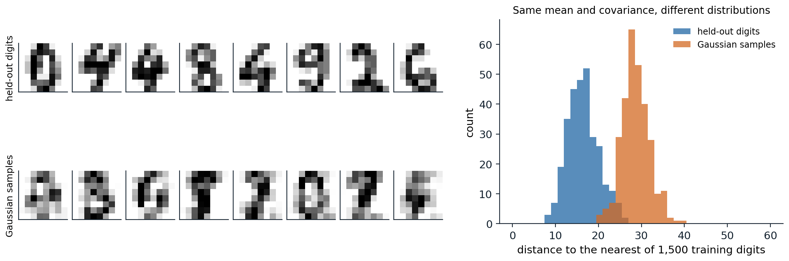
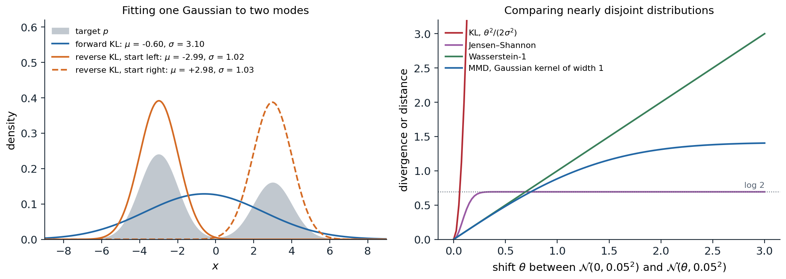

[Background Notes](../README.md) › [Generative AI](README.md)

# 1. Foundations of Generative Modeling

> [!WARNING]
> Work in progress: this part of the notes is still being revised.

[2. Autoregressive Models →](02-autoregressive-models.md)

## <a id="what-a-generative-model-does"></a>What a generative model does

### <a id="three-tasks"></a>Three tasks

A **generative model** is a probability distribution $`p_\theta`$ fitted to examples $`x_1,\dots,x_n`$ drawn from an unknown data distribution $`p_{\mathrm{data}}`$, such as images, sounds, molecules, or text. The earlier modules used probabilistic models to predict a label from an input; here the object of interest is the distribution of the input itself. A fitted model can be put to three different uses, and the families of models in this module differ in which of them they make cheap.

- **Evaluating the density.** Computing $`p_\theta(x)`$ for a given $`x`$ scores how typical it is, which serves for compression, for detecting anomalous inputs, and for comparing models by their held-out likelihood.
- **Sampling.** Drawing new $`x\sim p_\theta`$ produces images, audio, or designs that resemble the data without copying it, and conditional models $`p_\theta(x\mid y)`$ produce them to order, for a class label, a caption, or a partial observation to be completed.
- **Inferring structure.** Models with latent variables $`z`$ explain each $`x`$ by a small set of underlying factors, and the posterior $`p_\theta(z\mid x)`$ gives a representation that can be used for other tasks or to edit the data.

A model can be excellent at one task and useless at another. An adversarial network (chapter 5) samples well but has no density to evaluate; an autoregressive model (chapter 2) evaluates densities exactly but samples slowly, one dimension at a time; a diffusion model (chapter 7) samples well and can evaluate densities only through an expensive computation. Much of the design of the families that follow comes from trading these abilities against each other.

### <a id="why-high-dimensions-are-hard"></a>Why high dimensions are hard

Data of interest are high-dimensional. A $`64\times64`$ color image has $`64\cdot64\cdot3=12{,}288`$ intensities, each with 256 possible values, so a table of probabilities over all images would need $`256^{12288}`$ entries. Nonparametric estimators do not rescue the situation: the error of a kernel density estimate decays like $`n^{-4/(4+d)}`$, hopeless for $`d`$ in the thousands ([ML chapter 17](../ml/17-smoothing-density-estimation-and-basis-expansions.md#higher-dimensions)).

What makes the problem possible is that natural data occupy a tiny part of the space. An image with independently random pixels looks like static, never like a photograph; photographs concentrate near a set of much lower dimension, often described as a union of curved manifolds, the **manifold hypothesis** ([Bengio, Courville, and Vincent, 2013](https://arxiv.org/abs/1206.5538)). The dimension of such a set can be estimated from how the number of neighbors of a point grows with distance, as a $`k`$-dimensional set contains a number of points within radius $`r`$ that grows like $`r^k`$. [Pope et al. (2021)](https://arxiv.org/abs/2104.08894) estimated intrinsic dimensions of 7 to 13 for handwritten digits in 784 pixels and 26 to 43 for ImageNet photographs with over 100,000 pixel values. The code estimates the intrinsic dimension of the 8-by-8 handwritten digits bundled with scikit-learn by the maximum-likelihood method of [Levina and Bickel (2004)](https://papers.nips.cc/paper_files/paper/2004/hash/74934548253bcab8490ebd74afed7031-Abstract.html), and compares them with samples from a Gaussian that has the same mean and covariance.

```python
import numpy as np
from sklearn.datasets import load_digits

X = load_digits().data                                   # 1,797 images of 8x8 pixels, values 0-16
rng = np.random.default_rng(0)


def mle_dimension(X, k=10):
    """Levina-Bickel maximum-likelihood estimate from the distances to the k nearest neighbors of each point
    (averaging the inverse estimates over points, as MacKay and Ghahramani suggested)."""
    sq = (X ** 2).sum(1)
    D = np.sqrt(np.maximum(sq[:, None] + sq[None, :] - 2 * X @ X.T, 0))
    np.fill_diagonal(D, np.inf)
    T = np.sort(D, axis=1)[:, :k]                        # distances to the k nearest neighbors
    inv = np.log(T[:, -1:] / T[:, :-1]).mean(1)          # mean log ratio for each point
    return 1 / inv.mean()


# A Gaussian with the same mean and covariance as the digits: same second-order statistics, no manifold.
G = rng.multivariate_normal(X.mean(0), np.cov(X.T), size=len(X))
eig = np.sort(np.linalg.eigvalsh(np.cov(X.T)))[::-1]
share = np.cumsum(eig) / eig.sum()
print(f"{X.shape[0]} digit images in {X.shape[1]} dimensions")
print(f"principal components needed for 90% of the variance: {np.searchsorted(share, 0.90) + 1}, "
      f"for 99%: {np.searchsorted(share, 0.99) + 1}")
for k in [5, 10, 20]:
    print(f"k = {k:2d} neighbors: intrinsic dimension of digits {mle_dimension(X, k):5.1f}, "
          f"of the matched Gaussian {mle_dimension(G, k):5.1f}")
# 1797 digit images in 64 dimensions
# principal components needed for 90% of the variance: 21, for 99%: 41
# k =  5 neighbors: intrinsic dimension of digits   8.1, of the matched Gaussian  19.5
# k = 10 neighbors: intrinsic dimension of digits   7.4, of the matched Gaussian  18.2
# k = 20 neighbors: intrinsic dimension of digits   6.8, of the matched Gaussian  17.0
```

The digits need 21 principal directions to capture 90% of their variance, but locally they behave like a set of about 7 or 8 dimensions: moving from one digit to a nearby one changes only a few underlying factors, such as the stroke's thickness, slant, and position. The Gaussian with the same covariance appears to have about 18 dimensions by the same estimator (less than 64 because its variance is concentrated in a few dozen directions and the estimator is biased downward with 1,797 points), more than twice as many as the digits. Matching the mean and covariance, which is all a Gaussian can do, is far from matching the distribution. The figure shows the difference.



*Left: eight of 297 held-out digits (top) and eight samples from a Gaussian with the mean and covariance of the other 1,500 digits (bottom); intensities are clipped to the digits' range of 0 to 16. Right: the distance from each held-out digit and each Gaussian sample to the nearest of the 1,500 training digits. The median distance is 16.3 for held-out digits and 28.4 for Gaussian samples, and only 3.4% of the Gaussian samples come closer than the 95th percentile of the held-out digits: the Gaussian puts its mass in a region that real digits do not occupy.*

Two consequences shape the rest of the module. A model must represent distributions concentrated near low-dimensional sets while assigning density in the full space, and densities of such distributions become extremely peaked, which is why adding a little noise to the data, a trick that recurs from dequantization (chapter 4) to diffusion (chapter 7), helps so much. And the choice of how to measure the distance between the model and the data, the subject of most of this chapter, matters more than in low dimensions, because distributions on thin sets barely overlap.

### <a id="how-models-represent-distributions"></a>How models represent distributions

A neural network outputs numbers, not distributions, so every generative model needs a way to turn a network into a distribution over high-dimensional $`x`$. Five ways dominate, and each defines a family.

| Family | Representation | Density | Sampling | Chapters |
| --- | --- | --- | --- | --- |
| Autoregressive | $`p(x)=\prod_ip(x_i\mid x_{<i})`$, each factor a network output | exact | sequential, one dimension or token at a time | 2, 12 |
| Latent variable | $`p(x)=\int p(x\mid z)p(z)\,dz`$ with a simple prior | lower bound | one network pass | 3, 12 |
| Invertible map | $`x=f(z)`$ with $`f`$ invertible, $`z`$ from a simple prior | exact | one network pass | 4 |
| Implicit | $`x=G(z)`$, trained only through samples | none | one network pass | 5 |
| Energy and score | $`p(x)\propto e^{-E(x)}`$, or the gradient $`\nabla_x\log p(x)`$ | unnormalized | iterative, many network passes | 6–9 |

Diffusion and flow-matching models, the most successful family today, belong to the last row by their training and to the fourth by their sampling: they learn a gradient field or a velocity field and generate by integrating it, turning noise into data in many small steps.

## <a id="learning-by-maximum-likelihood"></a>Learning by maximum likelihood

### <a id="maximum-likelihood-minimizes-the-forward-kl-divergence"></a>Maximum likelihood minimizes the forward KL divergence

When the model's density can be evaluated, the natural objective is the **log-likelihood** of the training data, $`\frac1n\sum_i\log p_\theta(x_i)`$, an unbiased estimate of $`\mathbb E_{p_{\mathrm{data}}}[\log p_\theta(x)]`$. Since

```math
\mathrm{KL}(p_{\mathrm{data}}\,\|\,p_\theta)=\mathbb E_{p_{\mathrm{data}}}[\log p_{\mathrm{data}}(x)]-\mathbb E_{p_{\mathrm{data}}}[\log p_\theta(x)],
```

and the first term does not depend on $`\theta`$, maximizing the expected log-likelihood is the same as minimizing the **forward** Kullback–Leibler divergence from the data to the model, the cross-entropy of [Foundations chapter 5](../foundations/05-information-and-learning-theory.md#cross-entropy-divergence-and-log-loss). Maximum likelihood is consistent, statistically efficient for well-specified models, and gives a single number, the held-out log-likelihood, with which to compare models ([Appendix A](#block-gen01-appendix-a)).

For images, the log-likelihood is reported in **bits per dimension**: the negative log-likelihood in bits divided by the number of dimensions, so that a model of 8-bit images that assigned equal probability to all intensities would score 8 bits per dimension. It is the image counterpart of bits per character for text ([NLP chapter 2](../nlp-llms/02-n-gram-language-models-and-perplexity.md#held-out-likelihood)). Pixel values are discrete, while most models define densities over continuous values; adding uniform noise to each integer intensity, **dequantization**, makes the comparison fair, since the log-likelihood of a continuous model on the noisy data is a lower bound on the log-likelihood of the discrete model it implies ([Theis, van den Oord, and Bethge, 2016](https://arxiv.org/abs/1511.01844)). Without dequantization, a continuous model can put arbitrarily high density on the finitely many values that occur and report meaningless likelihoods.

### <a id="mode-covering-and-mode-seeking"></a>Mode covering and mode seeking

The direction of the divergence decides what the model does when it cannot fit the data exactly. The forward divergence $`\mathrm{KL}(p_{\mathrm{data}}\,\|\,p_\theta)`$ averages $`\log(p_{\mathrm{data}}/p_\theta)`$ over the data, so it becomes infinite if the model gives zero density anywhere the data occur: its minimizers **cover** all the data, spreading mass over regions between the modes if they must. The **reverse** divergence $`\mathrm{KL}(p_\theta\,\|\,p_{\mathrm{data}})`$ averages over the model's own samples, so it punishes samples in places where the data are rare and ignores data the model never produces: its minimizers are **mode-seeking**, concentrating on part of the data and producing plausible but less diverse samples ([Minka, 2005](https://www.microsoft.com/en-us/research/publication/divergence-measures-and-message-passing/)). Variational inference minimizes the reverse divergence and inherits this behavior ([AI chapter 10](../ai/10-approximate-inference.md#inference-as-optimization)). The code fits a single Gaussian to a mixture of two separated Gaussians in both directions.

```python
import numpy as np
from scipy.optimize import minimize

# Target: a mixture of two well-separated Gaussians. Model: a single Gaussian N(m, s^2).
x = np.linspace(-12, 12, 24001)
dx = x[1] - x[0]


def normal(x, m, s):
    return np.exp(-0.5 * ((x - m) / s) ** 2) / (s * np.sqrt(2 * np.pi))


p = 0.6 * normal(x, -3, 1) + 0.4 * normal(x, 3, 1)


def kl(a, b):                                            # KL(a || b) by numerical integration on the grid
    mask = a > 1e-300
    return np.sum(a[mask] * (np.log(a[mask]) - np.log(b[mask] + 1e-300))) * dx


def fit(direction, m0):
    def loss(theta):
        q = normal(x, theta[0], np.exp(theta[1]))
        return kl(p, q) if direction == "forward" else kl(q, p)
    r = minimize(loss, [m0, 0.0], method="Nelder-Mead", options={"xatol": 1e-6, "fatol": 1e-9, "maxiter": 4000})
    return r.x[0], np.exp(r.x[1]), r.fun


mean = np.sum(x * p) * dx
print(f"target 0.6 N(-3, 1) + 0.4 N(3, 1): mean {mean:+.2f}, standard deviation {np.sqrt(np.sum((x - mean) ** 2 * p) * dx):.2f}")
for direction, m0 in [("forward", 0.0), ("reverse", -1.0), ("reverse", 1.0)]:
    m, s, d = fit(direction, m0)
    print(f"{direction:7s} KL, starting at m = {m0:+.0f}: fitted mean {m:+.2f}, standard deviation {s:.2f}, divergence {d:.3f}")
# target 0.6 N(-3, 1) + 0.4 N(3, 1): mean -0.60, standard deviation 3.10
# forward KL, starting at m = +0: fitted mean -0.60, standard deviation 3.10, divergence 0.464
# reverse KL, starting at m = -1: fitted mean -2.99, standard deviation 1.02, divergence 0.507
# reverse KL, starting at m = +1: fitted mean +2.98, standard deviation 1.03, divergence 0.911
```

The forward fit matches the mixture's mean and standard deviation exactly, which is what maximum likelihood does for a Gaussian model, and puts its peak between the modes, where the data are rare. The reverse fit settles on one mode, whichever is closer to its starting point, with a divergence close to $`-\log0.6=0.51`$ or $`-\log0.4=0.92`$, the cost of ignoring the other mode entirely. For sample quality, the reverse behavior is often preferable: a model that produces sharp examples of some kinds of images looks better than one that produces blurry averages of all kinds. The tension between likelihood, which rewards coverage, and sample quality, which rewards precision, runs through the whole module, and chapter 13 shows that good likelihoods and good samples can come apart.

## <a id="comparing-distributions-without-likelihoods"></a>Comparing distributions without likelihoods

### <a id="f-divergences"></a>f-divergences

Both KL divergences belong to the family of **f-divergences**,

```math
D_f(p\,\|\,q)=\mathbb E_{q}\Bigl[f\Bigl(\frac{p(x)}{q(x)}\Bigr)\Bigr],\qquad f\text{ convex},\ f(1)=0,
```

which compare the densities pointwise through their ratio. Choosing $`f(t)=t\log t`$ gives the forward KL divergence $`\mathrm{KL}(p\,\|\,q)`$, $`f(t)=-\log t`$ the reverse, $`f(t)=\frac12|t-1|`$ the total variation distance, and a symmetric combination the **Jensen–Shannon divergence**,

```math
\mathrm{JS}(p,q)=\tfrac12\mathrm{KL}\bigl(p\,\big\|\,m\bigr)+\tfrac12\mathrm{KL}\bigl(q\,\big\|\,m\bigr),\qquad m=\tfrac12(p+q),
```

which is bounded by $`\log2`$ and which the original adversarial network minimizes (chapter 5). Every f-divergence has a variational form as a maximum over functions of the difference between expectations under $`p`$ and under $`q`$ ([Appendix B](#block-gen01-appendix-b)), and this form lets a divergence be estimated, and minimized, from samples alone, with a neural network in the role of the function; this is the principle behind adversarial training in general ([Nowozin, Cseke, and Tomioka, 2016](https://arxiv.org/abs/1606.00709)).

Divergences built on density ratios behave badly when the two distributions barely overlap, which, by the manifold hypothesis, is the normal situation early in training: a model's samples and the data lie near different thin sets. Where the supports are disjoint, the ratio is zero or infinite, the KL divergence is infinite, and the Jensen–Shannon divergence equals $`\log2`$ however near or far the sets are, so it provides no signal about which direction to move ([Arjovsky and Bottou, 2017](https://arxiv.org/abs/1701.04862)).

### <a id="integral-probability-metrics"></a>Integral probability metrics

An **integral probability metric** compares distributions through the expectations of test functions instead of density ratios:

```math
d_{\mathcal F}(p,q)=\sup_{f\in\mathcal F}\Bigl|\mathbb E_p[f(x)]-\mathbb E_q[f(x)]\Bigr|.
```

With $`\mathcal F`$ the functions with Lipschitz constant at most 1, it is the **Wasserstein-1 distance**, the minimum average distance that mass must travel to transform $`q`$ into $`p`$, which grows with how far apart the distributions are even when they do not overlap ([Arjovsky, Chintala, and Bottou, 2017](https://arxiv.org/abs/1701.07875)). With $`\mathcal F`$ the unit ball of a reproducing-kernel Hilbert space, it is the **maximum mean discrepancy** (MMD), which has a closed-form estimate from samples in terms of kernel evaluations ([Gretton et al., 2012](https://jmlr.org/papers/v13/gretton12a.html); [Appendix C](#block-gen01-appendix-c)). The figure compares the behaviors.



*Left: the best single Gaussian for the target $`0.6\,\mathcal N(-3,1)+0.4\,\mathcal N(3,1)`$ under the forward and reverse KL divergences, as in the code; the reverse fit depends on where the optimization starts. Right: divergences between two narrow Gaussians, $`\mathcal N(0,0.05^2)`$ and $`\mathcal N(\theta,0.05^2)`$, as the shift $`\theta`$ grows, computed by numerical integration or in closed form. At $`\theta=1`$, the KL divergence is 200, the Jensen–Shannon divergence has saturated at $`\log2\approx0.693`$, the Wasserstein-1 distance is 1, and the MMD with a Gaussian kernel of width 1 is 0.884. Only the Wasserstein distance keeps growing in proportion to the shift; the MMD grows smoothly but saturates at the scale of its kernel.*

A model trained by gradient descent needs a divergence whose gradient points toward the data wherever the model currently is. The KL divergence explodes, the Jensen–Shannon divergence is flat, and the Wasserstein distance and the MMD with a suitable kernel provide useful gradients, which is why chapter 5's Wasserstein GANs train more stably than the original. Diffusion models sidestep the problem differently: by adding noise of many sizes to the data, they make the noisy data distribution overlap everything, so that the model always receives a signal.

### <a id="classifiers-as-density-ratio-estimators"></a>Classifiers as density-ratio estimators

The link between divergences and classification goes deeper. Suppose samples from $`p`$ are labeled 1 and equally many samples from $`q`$ are labeled 0. The Bayes-optimal classifier's probability of label 1 is $`p(x)/(p(x)+q(x))`$, so its log-odds is $`\log p(x)-\log q(x)`$: a classifier trained to tell data from model samples estimates the log density ratio, the quantity every f-divergence is built from, without evaluating either density ([Mohamed and Lakshminarayanan, 2016](https://arxiv.org/abs/1610.03483); [Sugiyama, Suzuki, and Kanamori, 2012](https://doi.org/10.1017/CBO9781139035613)). The same idea underlies noise-contrastive estimation of energy-based models (chapter 6), the negative sampling of word vectors ([NLP chapter 3](../nlp-llms/03-word-embeddings.md#negative-sampling)), and tests of whether two samples come from the same distribution ([Lopez-Paz and Oquab, 2017](https://arxiv.org/abs/1610.06545)). The code trains a logistic regression on polynomial features to distinguish a mixture of two Gaussians from a single Gaussian with the same mean and covariance, and uses its logit to estimate their KL divergence.

```python
import numpy as np
from sklearn.linear_model import LogisticRegression
from sklearn.preprocessing import PolynomialFeatures, StandardScaler
from sklearn.pipeline import make_pipeline
from scipy.stats import multivariate_normal as mvn

rng = np.random.default_rng(0)
# "Data" p: two Gaussians at (-2, 0) and (2, 0). "Model" q: one Gaussian with the same mean and covariance.
p_parts = [mvn([-2, 0], np.eye(2)), mvn([2, 0], np.eye(2))]
q = mvn([0, 0], np.diag([5.0, 1.0]))
log_p = lambda z: np.log(0.5 * p_parts[0].pdf(z) + 0.5 * p_parts[1].pdf(z))


def sample_p(n):
    return np.where(rng.random((n, 1)) < 0.5, -2, 2) * np.array([1, 0]) + rng.standard_normal((n, 2))


n = 5000
Xp, Xq = sample_p(n), q.rvs(n, random_state=rng)
clf = make_pipeline(PolynomialFeatures(4), StandardScaler(), LogisticRegression(C=10, max_iter=5000))
clf.fit(np.vstack([Xp, Xq]), np.r_[np.ones(n), np.zeros(n)])   # label 1 = sample from p

# With equal class sizes, the optimal classifier's logit is log p(x) - log q(x).
Zp, Zq = sample_p(20000), q.rvs(20000, random_state=rng)
est, true = clf.decision_function(Zp), log_p(Zp) - q.logpdf(Zp)
print(f"classifier accuracy on fresh samples: "
      f"{(np.mean(clf.predict(Zp) == 1) + np.mean(clf.predict(Zq) == 0)) / 2:.3f}")
print(f"correlation of estimated and true log p/q: {np.corrcoef(est, true)[0, 1]:.3f}")
print(f"KL(p || q): from the classifier {est.mean():.3f}, exact (Monte Carlo) {true.mean():.3f}")
# classifier accuracy on fresh samples: 0.621
# correlation of estimated and true log p/q: 0.868
# KL(p || q): from the classifier 0.154, exact (Monte Carlo) 0.178
```

The classifier is right only 62% of the time, since the two distributions overlap heavily, yet its logit tracks the true log ratio with a correlation of 0.87, and averaging it over samples from $`p`$ estimates the divergence as 0.154 against an exact 0.178. The estimate is biased low because a classifier of limited capacity smooths the ratio. An adversarial network is this procedure run as a game: the classifier estimates how the model's samples differ from the data, and the model changes to make the classifier's job harder.

## <a id="choosing-a-model"></a>Choosing a model

### <a id="the-generative-learning-trilemma"></a>The generative learning trilemma

No family is best at everything. [Xiao, Kreis, and Vahdat (2022)](https://arxiv.org/abs/2112.07804) described a **trilemma** among high sample quality, coverage of the modes of the data, and fast sampling: adversarial networks produce sharp samples in one pass but tend to drop modes; likelihood-based models such as variational autoencoders and flows cover the data and sample quickly but produce less sharp samples; diffusion models achieve both quality and coverage at the cost of many network evaluations per sample. Much recent work attacks the third corner, with distillation and consistency models (chapter 8), straighter flows (chapter 9), and generation in compressed latent spaces (chapter 11).

A second trade-off is between quality and diversity within one model. Sampling at lower temperature, truncating the tails of the latent distribution of an adversarial network, or strengthening the guidance of a diffusion model (chapter 10) all concentrate samples on the model's most typical outputs, improving their average quality and reducing their variety, the same trade-off as temperature and truncation in language-model decoding ([NLP chapter 8](../nlp-llms/08-decoding-and-text-generation.md#temperature)). In the language of divergences, these adjustments move the effective objective from covering toward seeking modes.

### <a id="a-map-of-the-module"></a>A map of the module

The families were developed over four decades, and each chapter follows one of them from its first formulation to its current form.

| Year | Model | Idea | Chapter |
| --- | --- | --- | --- |
| 1985 | Boltzmann machine ([Ackley, Hinton, and Sejnowski](https://doi.org/10.1207/s15516709cog0901_7)) | An energy-based model of binary data, trained with sampling | 6 |
| 1995 | Helmholtz machine ([Dayan et al.](https://doi.org/10.1162/neco.1995.7.5.889)) | A generative network paired with a recognition network | 3 |
| 2011 | NADE ([Larochelle and Murray](https://proceedings.mlr.press/v15/larochelle11a.html)) | Neural autoregressive density estimation | 2 |
| 2013 | Variational autoencoder ([Kingma and Welling](https://arxiv.org/abs/1312.6114)) | Amortized variational inference with reparameterized gradients | 3 |
| 2014 | Generative adversarial network ([Goodfellow et al.](https://arxiv.org/abs/1406.2661)) | A generator trained against a learned discriminator | 5 |
| 2014 | NICE ([Dinh, Krueger, and Bengio](https://arxiv.org/abs/1410.8516)) | Invertible networks with tractable Jacobians | 4 |
| 2015 | Diffusion probabilistic model ([Sohl-Dickstein et al.](https://arxiv.org/abs/1503.03585)) | Learning to reverse a gradual noising process | 7 |
| 2016 | PixelRNN and PixelCNN ([van den Oord et al.](https://arxiv.org/abs/1601.06759)) | Autoregressive models of pixels | 2 |
| 2019 | Noise-conditional score network ([Song and Ermon](https://arxiv.org/abs/1907.05600)) | Learning the score at many noise levels | 6 |
| 2020 | Denoising diffusion probabilistic model ([Ho, Jain, and Abbeel](https://arxiv.org/abs/2006.11239)) | Diffusion trained as denoising, with high-quality samples | 7 |
| 2022 | Latent diffusion ([Rombach et al.](https://arxiv.org/abs/2112.10752)) | Diffusion in the latent space of an autoencoder | 11 |
| 2023 | Flow matching ([Lipman et al.](https://arxiv.org/abs/2210.02747)) | Regressing a velocity field that transports noise to data | 9 |

Chapters 2–5 develop the families that model the data in one pass through a network; chapter 6 introduces energies and scores, and chapters 7–9 build the diffusion and flow models on them. Chapters 10–12 turn these models into the conditional, large-scale, and multimodal systems in current use, and chapter 13 asks how any of them should be evaluated.

## <a id="appendices"></a>Appendices


<details>
<summary><a id="block-gen01-appendix-a"></a><b>A. Maximum likelihood, the KL divergence, and dequantization</b></summary>


**Consistency.** For i.i.d. data, $`\frac1n\sum_i\log p_\theta(x_i)\to\mathbb E_{p_{\mathrm{data}}}[\log p_\theta(x)]`$ by the law of large numbers, and $`\mathbb E_{p_{\mathrm{data}}}[\log p_\theta]=-H(p_{\mathrm{data}})-\mathrm{KL}(p_{\mathrm{data}}\,\|\,p_\theta)`$. The KL divergence is nonnegative and zero only when $`p_\theta=p_{\mathrm{data}}`$ almost everywhere, so if the model family contains the data distribution, the population maximizer of the likelihood recovers it. With a misspecified family, the maximizer is the member closest in forward KL, the **information projection** of the data onto the family; for Gaussians it matches the mean and covariance, as in the code.

**Bits per dimension.** For $`x\in\{0,\dots,255\}^D`$, the average code length of an optimal code built from the model is $`-\log_2P_\theta(x)`$ bits, so the bits per dimension $`-\log_2P_\theta(x)/D`$ measures compression, and a model that did no better than uniform would need 8. For continuous densities on data scaled to $`[0,1]^D`$, the discrete probability of the bin of width $`1/256`$ around $`x`$ is approximately $`p_\theta(x)\,256^{-D}`$, so the bits per dimension are $`-\log_2p_\theta(x)/D+8`$.

**Dequantization.** Let $`y=x+u`$ with $`u`$ uniform on $`[0,1)^D`$, and let $`p`$ be a density on $`\mathbb R^D`$. Define the discrete model $`P(x)=\int_{[0,1)^D}p(x+u)\,du`$. By Jensen's inequality,

```math
\mathbb E_u[\log p(x+u)]\le\log\mathbb E_u[p(x+u)]=\log P(x),
```

so the average continuous log-likelihood of dequantized data is a lower bound on the discrete log-likelihood of the implied model, and maximizing it cannot exploit the discreteness of the data. Learned dequantization noise, fitted by a variational bound, tightens the gap.

</details>


<details>
<summary><a id="block-gen01-appendix-b"></a><b>B. The variational form of f-divergences</b></summary>


The convex conjugate of $`f`$ is $`f^*(u)=\sup_t\bigl(ut-f(t)\bigr)`$, and because $`f`$ is convex and lower semicontinuous, $`f(t)=\sup_u\bigl(ut-f^*(u)\bigr)`$. Substituting into the definition,

```math
D_f(p\,\|\,q)=\mathbb E_q\Bigl[\sup_u\Bigl(u\,\tfrac{p(x)}{q(x)}-f^*(u)\Bigr)\Bigr]\ge\sup_{T}\Bigl(\mathbb E_p[T(x)]-\mathbb E_q[f^*(T(x))]\Bigr),
```

where the supremum is over functions $`T`$, with equality when $`T(x)=f'\bigl(p(x)/q(x)\bigr)`$. The right side involves only expectations, so it can be estimated from samples of $`p`$ and $`q`$, and maximizing it over a network $`T`$ gives an estimate of the divergence and, at the optimum, of the density ratio. For the KL divergence, $`f(t)=t\log t`$, $`f^*(u)=e^{u-1}`$, and the bound is $`\mathbb E_p[T]-\mathbb E_q[e^{T-1}]`$.

For the Jensen–Shannon divergence, write $`T`$ in terms of a classifier $`D(x)\in(0,1)`$. The quantity

```math
V(D)=\mathbb E_p[\log D(x)]+\mathbb E_q[\log(1-D(x))]
```

is maximized pointwise by $`D^*(x)=p(x)/(p(x)+q(x))`$, and substituting gives $`V(D^*)=2\,\mathrm{JS}(p,q)-\log4`$. This is the value of the discriminator in the original adversarial network, which chapter 5 develops.

</details>


<details>
<summary><a id="block-gen01-appendix-c"></a><b>C. Maximum mean discrepancy and Wasserstein distances</b></summary>


**MMD.** Let $`k`$ be a positive-definite kernel with feature map $`\phi`$ into a Hilbert space $`\mathcal H`$, so that $`k(x,y)=\langle\phi(x),\phi(y)\rangle`$. Over the unit ball of $`\mathcal H`$, the supremum of $`\mathbb E_p[f]-\mathbb E_q[f]`$ is attained by $`f`$ proportional to $`\mu_p-\mu_q`$, where $`\mu_p=\mathbb E_p[\phi(x)]`$ is the **mean embedding**, so

```math
\mathrm{MMD}^2(p,q)=\|\mu_p-\mu_q\|^2=\mathbb E[k(x,x')]+\mathbb E[k(y,y')]-2\,\mathbb E[k(x,y)],
```

with $`x,x'\sim p`$ and $`y,y'\sim q`$ independent. Averaging the kernel over pairs of distinct samples gives an unbiased estimate. For characteristic kernels such as the Gaussian, $`\mathrm{MMD}=0`$ only when $`p=q`$. For the two Gaussians of the figure, $`\mathcal N(0,s^2)`$ and $`\mathcal N(\theta,s^2)`$, with $`k(x,y)=e^{-(x-y)^2/2h^2}`$, each expectation is a Gaussian integral and

```math
\mathrm{MMD}^2=\frac{2h}{\sqrt{h^2+2s^2}}\Bigl(1-e^{-\theta^2/2(h^2+2s^2)}\Bigr),
```

which grows quadratically for small shifts and saturates once $`\theta`$ exceeds the kernel width.

**Wasserstein distances.** The Wasserstein-$`p`$ distance is $`W_p(p,q)=\bigl(\inf_\gamma\mathbb E_{(x,y)\sim\gamma}\|x-y\|^p\bigr)^{1/p}`$, the infimum over couplings $`\gamma`$ with marginals $`p`$ and $`q`$. The Kantorovich–Rubinstein duality gives $`W_1(p,q)=\sup_{\|f\|_{\mathrm{Lip}}\le1}\mathbb E_p[f]-\mathbb E_q[f]`$, an integral probability metric. For a shift of a distribution by $`\theta`$, $`W_1=|\theta|`$, because transporting every point by $`\theta`$ is optimal. Between Gaussians the squared $`W_2`$ distance has a closed form,

```math
W_2^2\bigl(\mathcal N(\mu_1,\Sigma_1),\mathcal N(\mu_2,\Sigma_2)\bigr)=\|\mu_1-\mu_2\|^2+\operatorname{tr}\Bigl(\Sigma_1+\Sigma_2-2\bigl(\Sigma_1^{1/2}\Sigma_2\Sigma_1^{1/2}\bigr)^{1/2}\Bigr),
```

which chapter 13 applies to features of images as the Fréchet inception distance.

</details>

---

[2. Autoregressive Models →](02-autoregressive-models.md)
