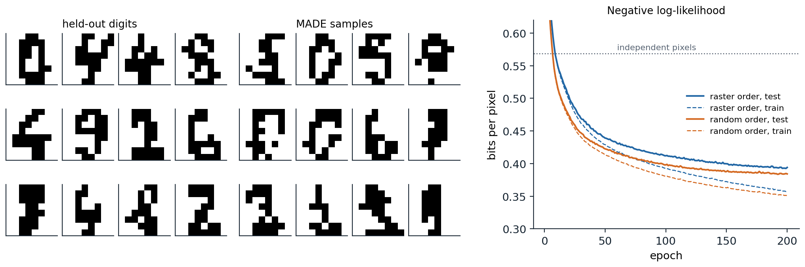
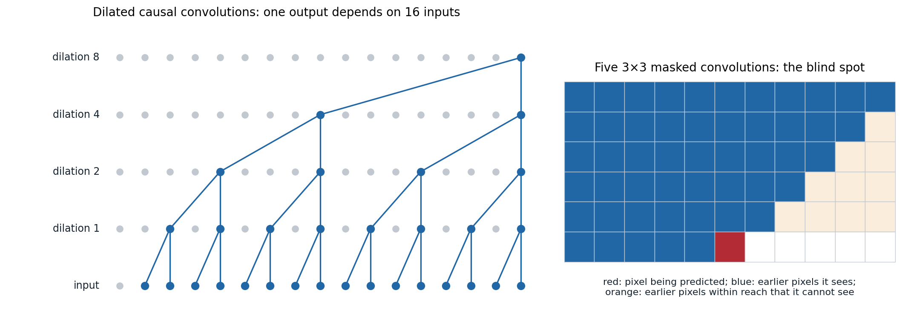

[ML Mastery Notes](../README.md) › [Generative AI](README.md)

# 2. Autoregressive Models

[← 1. Foundations of Generative Modeling](01-foundations-of-generative-modeling.md) · [3. Variational Autoencoders →](03-variational-autoencoders.md)

## <a id="one-dimension-at-a-time"></a>One dimension at a time

### <a id="the-chain-rule-for-any-data"></a>The chain rule for any data

Every distribution over a vector $`x=(x_1,\dots,x_D)`$ factorizes by the chain rule of probability,

$$
p(x)=\prod_{i=1}^Dp(x_i\mid x_1,\dots,x_{i-1}),
$$

for any ordering of the dimensions. An **autoregressive model** represents each conditional with a network that reads the preceding dimensions, $`p_\theta(x_i\mid x_{<i})`$. Because each conditional is an ordinary distribution over one variable, a categorical over 256 intensities or a small mixture over a real number, the model's density is exact and cheap to evaluate: one pass computes all $`D`$ conditionals, whose log-probabilities add up to $`\log p_\theta(x)`$. Maximum likelihood training is then as simple as classification. Sampling, by contrast, is sequential: $`x_1`$ is drawn, then $`x_2`$ given $`x_1`$, and so on, so a $`D`$-dimensional sample needs $`D`$ steps.

The language models of NLP chapter 4 are autoregressive models of text, where the ordering is given by reading order. This chapter treats the same idea for data without a natural order, such as images, and for data with very long sequences, such as audio. It covers how to share parameters across the $`D`$ conditionals, how to enforce the autoregressive structure inside a network, and what the exact likelihood is and is not good for.

### <a id="from-logistic-regressions-to-nade"></a>From logistic regressions to NADE

The simplest autoregressive model of binary data gives each conditional its own logistic regression, $`p(x_i=1\mid x_{<i})=\sigma\bigl(b_i+\sum_{j<i}W_{ij}x_j\bigr)`$, a model called the **fully visible sigmoid belief network** ([Neal, 1992](https://www.sciencedirect.com/science/article/pii/0004370292900656); [Frey, Hinton, and Dayan, 1996](https://papers.nips.cc/paper_files/paper/1995/hash/55b1927fdafef39c48e5b73b5d61ea60-Abstract.html)). It has $`O(D^2)`$ parameters and linear conditionals. [Bengio and Bengio (2000)](https://papers.nips.cc/paper_files/paper/1999/hash/e6384711491713d29bc63fc5eeb5ba4f-Abstract.html) replaced each logistic regression with a small network, and the **neural autoregressive distribution estimator** (NADE; [Larochelle and Murray, 2011](https://proceedings.mlr.press/v15/larochelle11a.html)) made this efficient by sharing one hidden layer across all conditionals:

$$
h_i=\sigma\bigl(c+W_{:,<i}\,x_{<i}\bigr),\qquad p(x_i=1\mid x_{<i})=\sigma\bigl(b_i+V_i^\top h_i\bigr).
$$

Since $`h_{i+1}`$ differs from $`h_i`$ only by the contribution of $`x_i`$, all $`D`$ hidden vectors cost $`O(DH)`$ to compute, the same as one hidden layer of an ordinary network. NADE outperformed mixture models and restricted Boltzmann machines on most of the benchmark likelihoods of its time, and a variant trained on random orderings, so that one network can condition on any subset of dimensions, anticipated the any-order models of chapter 12 ([Uria et al., 2016](https://jmlr.org/papers/v17/16-272.html)).

### <a id="masked-autoencoders"></a>Masked autoencoders

A network that outputs all $`D`$ conditionals in one pass must be prevented from looking at the answer: output $`i`$ may depend on $`x_{<i}`$ but not on $`x_i`$ or later dimensions. The **masked autoencoder for distribution estimation** (MADE; [Germain et al., 2015](https://arxiv.org/abs/1502.03509)) enforces this in an ordinary feedforward autoencoder by zeroing weights. Each input $`i`$ is given its position $`m(i)`$ in the ordering, and each hidden unit $`k`$ a random degree $`m(k)`$ between 1 and $`D-1`$. A hidden unit may connect only to units of lower or equal degree in the layer below, and output $`i`$ only to hidden units of degree less than $`m(i)`$. Every path from input $`j`$ to output $`i`$ then passes through degrees that can only increase from $`m(j)`$ and must end below $`m(i)`$, so output $`i`$ depends only on inputs that come earlier in the ordering ([Appendix A](#block-gen02-appendix-a)). The code trains a MADE with two hidden layers on the scikit-learn digits, binarized to 64 black-or-white pixels, once with the pixels in raster order and once in a random order.

```python
import numpy as np
import torch
from torch import nn
from sklearn.datasets import load_digits

torch.manual_seed(0)
rng = np.random.default_rng(0)
X = (load_digits().data > 7).astype(np.float32)          # 1,797 binarized 8x8 digits, 64 pixels
perm = rng.permutation(len(X))
train, test = torch.tensor(X[perm[:1500]]), torch.tensor(X[perm[1500:]])
D, H = 64, 256


class MaskedLinear(nn.Linear):
    def __init__(self, d_in, d_out, mask):
        super().__init__(d_in, d_out)
        self.register_buffer("mask", torch.tensor(mask, dtype=torch.float32))

    def forward(self, x):
        return nn.functional.linear(x, self.weight * self.mask, self.bias)


def made(order):
    """order[i] is the position of pixel i in the ordering (1..D). Hidden units get degrees in 1..D-1;
    a unit of degree k may see inputs at positions <= k, and output i may see hidden units of degree < order[i]."""
    h1, h2 = rng.integers(1, D, H), rng.integers(1, D, H)
    return nn.Sequential(MaskedLinear(D, H, h1[:, None] >= order[None, :]), nn.ReLU(),
                         MaskedLinear(H, H, h2[:, None] >= h1[None, :]), nn.ReLU(),
                         MaskedLinear(H, D, order[:, None] > h2[None, :]))    # logits of p(x_i = 1 | earlier)


def nll_bits(model, x):                                   # negative log-likelihood per pixel, in bits
    return nn.functional.binary_cross_entropy_with_logits(model(x), x, reduction="none").sum(1) / np.log(2) / D


def fit(order, epochs=150):
    model = made(order)
    opt = torch.optim.Adam(model.parameters(), lr=1e-3, weight_decay=1e-4)
    for _ in range(epochs):
        for idx in torch.randperm(len(train)).split(100):
            loss = nll_bits(model, train[idx]).mean()
            opt.zero_grad()
            loss.backward()
            opt.step()
    return model


p = train.mean(0).clamp(1e-3, 1 - 1e-3)                  # baseline: independent pixels
print(f"independent pixels: {-(test * torch.log2(p) + (1 - test) * torch.log2(1 - p)).mean():.3f} bits per pixel")
raster = np.arange(1, D + 1)
for name, order in [("raster order", raster), ("random order", rng.permutation(raster))]:
    model = fit(order)
    with torch.no_grad():
        print(f"MADE, {name}: train {nll_bits(model, train).mean():.3f}, test {nll_bits(model, test).mean():.3f}")

with torch.no_grad():                                     # sampling from the last model: one pixel per pass
    x = torch.zeros(1000, D)
    for i in np.argsort(order):
        x[:, i] = torch.bernoulli(torch.sigmoid(model(x)[:, i]))
print(f"1,000 samples, 64 network passes: mean ink {x.mean():.3f} (data {train.mean():.3f}); "
      f"test likelihood of the samples under the model {nll_bits(model, x).mean():.3f} bits per pixel")
# independent pixels: 0.568 bits per pixel
# MADE, raster order: train 0.373, test 0.400
# MADE, random order: train 0.360, test 0.389
# 1,000 samples, 64 network passes: mean ink 0.324 (data 0.323); test likelihood of the samples under the model 0.403 bits per pixel
```

Modeling each pixel independently costs 0.568 bits per pixel on held-out digits; the MADE reaches about 0.40, a third less, by predicting each pixel from those before it. The random ordering works as well as raster order here, because a network with enough capacity can represent any factorization of the same distribution; with limited capacity some orderings fit better than others, and averaging the predictions of models trained with several orderings is a cheap ensemble. Sampling takes one network pass per pixel, 64 in all, and the samples have the right proportion of ink and nearly the same likelihood under the model as real test digits (0.403 against 0.389 bits per pixel), a rough check that they are typical of it. The figure shows samples and the learning curves.



*Left: 12 held-out binarized digits and 12 samples from the random-order MADE of the code. Right: negative log-likelihood per pixel during training for 200 epochs, on the 1,500 training digits (dashed) and the 297 held-out digits (solid), for raster and random orderings; the dotted line is the independent-pixel model's 0.568 bits. After 200 epochs the held-out values are 0.394 for raster order and 0.384 for the random order, and the gap between training and held-out curves shows the beginning of overfitting on this small dataset.*

## <a id="autoregressive-models-of-images"></a>Autoregressive models of images

### <a id="pixelrnn-and-pixelcnn"></a>PixelRNN and PixelCNN

For natural images, the conditionals must capture long-range structure: whether a pixel belongs to a sky or a face depends on pixels far above it. [van den Oord, Kalchbrenner, and Kavukcuoglu (2016)](https://arxiv.org/abs/1601.06759) proposed two architectures that read the image in raster order, row by row and, within a pixel, red, then green, then blue. **PixelRNN** runs two-dimensional LSTMs over the image, so each pixel's conditional can depend on everything above and to its left. **PixelCNN** uses convolutions with **masked kernels**: in the first layer, mask A zeroes the kernel weights at the current pixel and at all later positions, so no pixel sees itself; later layers use mask B, which also allows the center, since the features there already depend only on earlier pixels. Each pixel's intensity is predicted with a 256-way softmax. The recurrent version reached 3.00 bits per dimension on CIFAR-10 against 3.14 for the convolutional one, but the convolutional version was far faster to train, because all conditionals are computed in parallel with no recurrence.

Stacked masked convolutions have a **blind spot**: because each $`3\times3`$ mask looks only up and to the left, the receptive field grows diagonally and never covers a triangle of earlier pixels up and to the right of the current one ([Appendix C](#block-gen02-appendix-c)). The **gated PixelCNN** ([van den Oord et al., 2016](https://arxiv.org/abs/1606.05328)) removed it with two stacks, a vertical stack that sees all rows above and a horizontal stack that sees the current row to the left, combined at every layer. It added gated activations $`\tanh(W_fx)\odot\sigma(W_gx)`$, which let the network modulate its features multiplicatively as LSTMs do, matched the recurrent model at 3.03 bits per dimension, and could be conditioned on a class label or an embedding of a face to generate images of a given kind. **PixelCNN++** ([Salimans et al., 2017](https://arxiv.org/abs/1701.05517)) replaced the softmax over 256 values with a **discretized mixture of logistic distributions**, which knows that intensity 128 is close to 129 and needs far fewer parameters per pixel ([Appendix B](#block-gen02-appendix-b)), and reached 2.92 bits per dimension.

### <a id="transformers-over-pixels"></a>Transformers over pixels

Self-attention gives every pixel direct access to every earlier pixel, with a causal mask in place of masked convolutions (DL chapter 9). Its cost grows with the square of the number of pixels, so the **Image Transformer** ([Parmar et al., 2018](https://arxiv.org/abs/1802.05751)) restricted attention to local neighborhoods and reached 2.90 bits per dimension on CIFAR-10, and the **Sparse Transformer** ([Child et al., 2019](https://arxiv.org/abs/1904.10509)) factorized attention into strided patterns with cost $`O(n\sqrt n)`$ and reached 2.80. **Image GPT** ([Chen et al., 2020](https://proceedings.mlr.press/v119/chen20s.html)) trained large GPT-2 transformers to predict pixels, reduced to a palette of 512 colors found by k-means, and found that the representations learned by next-pixel prediction were good features for classification: a linear classifier on them reached 96.3% accuracy on CIFAR-10, the self-supervised result that language models had led to expect (NLP chapter 5).

## <a id="autoregressive-models-of-audio"></a>Autoregressive models of audio

### <a id="wavenet"></a>WaveNet

Raw audio is a one-dimensional sequence with tens of thousands of samples per second, and its structure spans scales from the shape of a single waveform period, a few milliseconds, to words and prosody over seconds. **WaveNet** ([van den Oord et al., 2016](https://arxiv.org/abs/1609.03499)) modeled speech at 16,000 samples per second with a stack of **dilated causal convolutions**: causal, so that each output depends only on past samples, and dilated, so that layer $`\ell`$ skips $`2^\ell`$ samples between the taps of its kernel. The receptive field doubles with each layer while the cost grows only linearly. Each sample was compressed with **μ-law companding**, $`f(x)=\operatorname{sign}(x)\ln(1+\mu|x|)/\ln(1+\mu)`$ with $`\mu=255`$, and quantized to 256 levels predicted by a softmax. The code checks what these two choices buy.

```python
import numpy as np

rng = np.random.default_rng(0)
# A stand-in for speech: amplitudes near zero are common and large ones rare (Laplace distributed).
x = np.clip(rng.laplace(0, 0.05, 160_000), -1, 1)       # ten seconds at 16 kHz, in [-1, 1]


def mu_law(x, mu=255):
    return np.sign(x) * np.log1p(mu * np.abs(x)) / np.log1p(mu)


def mu_law_inverse(y, mu=255):
    return np.sign(y) * ((1 + mu) ** np.abs(y) - 1) / mu


def quantize(y, levels=256):                              # uniform quantization of [-1, 1] into 256 bins
    return (np.round((y + 1) / 2 * (levels - 1)) / (levels - 1)) * 2 - 1


def snr_db(x, x_hat):
    return 10 * np.log10(np.mean(x ** 2) / np.mean((x - x_hat) ** 2))


print(f"256 levels, uniform:  signal-to-noise ratio {snr_db(x, quantize(x)):.1f} dB")
print(f"256 levels, mu-law:   signal-to-noise ratio {snr_db(x, mu_law_inverse(quantize(mu_law(x)))):.1f} dB")

# Receptive field of WaveNet-style stacks of causal convolutions with kernel size 2.
for dilations in [[1] * 10, [2 ** k for k in range(10)], [2 ** k for k in range(10)] * 3]:
    field = 1 + sum(dilations)
    print(f"{len(dilations):2d} layers, dilations {dilations[0]}..{dilations[-1]}: receptive field {field:5d} samples "
          f"= {1000 * field / 16000:.1f} ms at 16 kHz")
# 256 levels, uniform:  signal-to-noise ratio 29.9 dB
# 256 levels, mu-law:   signal-to-noise ratio 37.7 dB
# 10 layers, dilations 1..1: receptive field    11 samples = 0.7 ms at 16 kHz
# 10 layers, dilations 1..512: receptive field  1024 samples = 64.0 ms at 16 kHz
# 30 layers, dilations 1..512: receptive field  3070 samples = 191.9 ms at 16 kHz
```

On a signal whose amplitudes, like speech, are mostly small, μ-law spends more of its 256 levels near zero and improves the signal-to-noise ratio of 8-bit quantization from 29.9 to 37.7 dB. Ten layers of ordinary convolutions of width 2 see 11 samples; ten layers with dilations doubling from 1 to 512 see 1,024 samples, 64 ms, and WaveNet repeated this block to reach about 192 ms. The figure shows the dilation pattern and, for comparison, the blind spot of masked image convolutions.



*Left: the dependencies of one output of a stack of causal convolutions with kernel size 2 and dilations 1, 2, 4, and 8. Each layer doubles the span of inputs, and the output depends on exactly 16 consecutive inputs, with no gaps. Right: the pixels visible to one output of a stack of five $`3\times3`$ masked convolutions, one with mask A and four with mask B, within the reach of five layers. Of the earlier pixels in that window, 50 are visible (blue) and 10 in a triangle up and to the right are not (orange); the gated PixelCNN's vertical and horizontal stacks close this blind spot.*

Conditioned on linguistic features from text, WaveNet's speech was rated much closer to human speech than the best concatenative and parametric synthesizers of the time, closing over half of the gap in listening tests for both US English and Mandarin. Its sequential sampling was too slow for production: 16,000 network evaluations for each second of speech. **Parallel WaveNet** ([van den Oord et al., 2018](https://arxiv.org/abs/1711.10433)) distilled the trained model into a student network that generates all samples in parallel, an inverse autoregressive flow (chapter 4), trained to match the teacher's distribution, and ran more than 20 times faster than real time. **WaveRNN** ([Kalchbrenner et al., 2018](https://arxiv.org/abs/1802.08435)) instead made the sequential model small and sparse enough to generate 24 kHz audio four times faster than real time on a GPU and in real time on a mobile CPU. Many current speech models generate sequences of discrete tokens from neural audio codecs instead of raw samples (chapter 12).

## <a id="what-exact-likelihood-buys"></a>What exact likelihood buys

### <a id="strengths"></a>Strengths

Autoregressive models are the most direct realization of maximum likelihood: the objective is exact, training is stable and parallel, and there is no auxiliary network, bound, or game. Their held-out log-likelihood is an honest measure of how well they model the data, and it translates directly into compression: an arithmetic coder driven by the model's conditionals encodes each image in about as many bits as its negative log-likelihood. For the same reason, autoregressive models held the state of the art on likelihood benchmarks for years, and every other family is compared against them in bits per dimension. Their conditionals are also exactly what is needed to fill in the rest of an image given its top half, or to continue a sound.

### <a id="weaknesses"></a>Weaknesses

**Sequential sampling.** Generating an image of $`D`$ pixels takes $`D`$ network passes. Caching the activations of earlier positions, as language models cache keys and values (NLP chapter 8), reduces the cost of each pass but not their number. Grouping pixels that can be generated together, for example predicting a whole subsampled image at each scale, reduces the number of passes from $`O(D)`$ to $`O(\log D)`$ at some cost in likelihood ([Reed et al., 2017](https://arxiv.org/abs/1703.03664)).

**The wrong emphasis.** Maximum likelihood rewards modeling every pixel precisely, and most of the bits of an image go to imperceptible texture and noise, not to the structure that people notice. Autoregressive models of pixels with excellent likelihoods produced images with good local texture but weak global structure, and models with worse likelihoods produced better-looking samples (chapter 13).

**Likelihood is not typicality.** High likelihood under a model does not mean an input is typical of the training data. [Nalisnick et al. (2019)](https://arxiv.org/abs/1810.09136) found that PixelCNNs, flows, and VAEs trained on CIFAR-10 photographs assign higher likelihood to images of house numbers from SVHN, which they have never seen, than to CIFAR-10's own test images, because SVHN images are simpler and smoother. Likelihood thresholds are therefore unreliable detectors of unusual inputs, and in high dimensions the most probable region of a distribution is not where its samples lie.

### <a id="autoregression-today"></a>Autoregression today

For text, autoregressive models are the dominant approach, and for images they returned in a different form: instead of pixels, they predict **discrete tokens** produced by a learned image tokenizer, a few hundred per image instead of tens of thousands of intensities, and the tokenizer's decoder restores the detail (chapter 12). Recent variants also change what is predicted at each step: **visual autoregressive modeling** predicts an entire image at the next finer scale at each step ([Tian et al., 2024](https://arxiv.org/abs/2404.02905)), and **masked autoregressive models** predict continuous tokens in a random order with a small diffusion model for each token's distribution ([Li et al., 2024](https://arxiv.org/abs/2406.11838)). The boundary between autoregressive and diffusion models is thinner than their origins suggest: diffusion generates coarse structure before fine detail, a form of autoregression over frequencies (chapter 15).

## <a id="appendices"></a>Appendices


<details>
<summary><a id="block-gen02-appendix-a"></a><b>A. Why MADE's masks enforce the autoregressive property</b></summary>


Give input $`j`$ the degree $`m^{(0)}(j)`$, its position in the ordering, and each hidden unit $`k`$ of layer $`\ell`$ a degree $`m^{(\ell)}(k)\in\{1,\dots,D-1\}`$. The masks are

$$
M^{(\ell)}_{kk'}=\mathbb 1\bigl[m^{(\ell)}(k)\ge m^{(\ell-1)}(k')\bigr]\ \text{for hidden layers},\qquad M^{\mathrm{out}}_{ik}=\mathbb 1\bigl[m^{(0)}(i)>m^{(L)}(k)\bigr],
$$

and each weight matrix is multiplied elementwise by its mask. Along any path from input $`j`$ to output $`i`$ with nonzero weights, the degrees satisfy $`m^{(0)}(j)\le m^{(1)}(k_1)\le\dots\le m^{(L)}(k_L)<m^{(0)}(i)`$, so the output for dimension $`i`$ can depend on $`x_j`$ only if $`j`$ comes strictly earlier in the ordering. Degrees below the minimum or above $`D-1`$ would create units connected to nothing, which is why they are drawn from $`\{1,\dots,D-1\}`$. A hidden unit of degree $`k`$ sees exactly the first $`k`$ inputs in the ordering, so the number of connections depends on the distribution of degrees; drawing them uniformly gives about half the weights of the unmasked network. Resampling the ordering and the degrees during training yields an ensemble of autoregressive models in one set of weights.

</details>


<details>
<summary><a id="block-gen02-appendix-b"></a><b>B. Output distributions for pixels and audio</b></summary>


**Softmax.** A 256-way softmax over intensities is the most flexible output and was used by PixelCNN and WaveNet, but it treats the values as unrelated categories and needs 256 logits per dimension, and it must learn from data that intensity 128 is similar to 129.

**Discretized logistic mixture.** PixelCNN++ models an intensity $`x\in\{0,\dots,255\}`$, scaled to $`[-1,1]`$ with bin half-width $`\delta=1/255`$, by a mixture of $`K`$ logistic distributions with means $`\mu_k`$, scales $`s_k`$, and weights $`\pi_k`$, integrated over the bin:

$$
P(x)=\sum_{k=1}^K\pi_k\Bigl[\sigma\Bigl(\frac{x+\delta-\mu_k}{s_k}\Bigr)-\sigma\Bigl(\frac{x-\delta-\mu_k}{s_k}\Bigr)\Bigr],
$$

with the edge bins extended to $`\pm\infty`$ so that the probabilities sum to one and the extreme values 0 and 255, common in images, get their own mass. A handful of components, a few numbers each, replace 256 logits per intensity, and nearby intensities share probability automatically.

**μ-law.** For audio in $`[-1,1]`$, $`f(x)=\operatorname{sign}(x)\ln(1+\mu|x|)/\ln(1+\mu)`$ is nearly linear with slope $`\mu/\ln(1+\mu)\approx46`$ near zero and logarithmic for large $`|x|`$. Uniform quantization of $`f(x)`$ therefore uses fine steps for quiet sounds and coarse steps for loud ones, matching the roughly logarithmic sensitivity of hearing and the concentration of speech amplitudes near zero. The inverse is $`f^{-1}(y)=\operatorname{sign}(y)\bigl((1+\mu)^{|y|}-1\bigr)/\mu`$.

</details>


<details>
<summary><a id="block-gen02-appendix-c"></a><b>C. Receptive fields of dilated and masked convolutions</b></summary>


**Dilated convolutions.** A causal convolution with kernel size $`k`$ and dilation $`d`$ makes output $`t`$ depend on inputs $`t,t-d,\dots,t-(k-1)d`$. Stacking layers adds their spans: the receptive field of $`L`$ layers is $`1+(k-1)\sum_\ell d_\ell`$. With $`k=2`$ and $`d_\ell=2^{\ell-1}`$ for $`\ell=1,\dots,L`$, it is $`2^L`$, and every input in that span is reached by exactly one path, so the stack computes a function of all $`2^L`$ inputs with $`L`$ layers and $`2L`$ weights per channel pair. Repeating the block $`R`$ times multiplies the field to about $`R\cdot2^L`$ while adding capacity.

**Masked convolutions.** With a $`3\times3`$ kernel and mask A, the first layer sees the three pixels of the row above and the pixel to the left; mask B adds the center. Composing $`L`$ such layers reaches offsets $`(\Delta y,\Delta x)`$ with $`-L\le\Delta y\le0`$. Each layer can move the dependency one row up and at most one column to the right, or one column to the left within a row, so a pixel $`|\Delta y|`$ rows above can be reached only if it lies at most $`|\Delta y|`$ columns to the right, however many layers are stacked. The unreachable earlier pixels, those with $`\Delta x>|\Delta y|`$, form a triangle up and to the right, the blind spot, which in the gated PixelCNN paper can cover as much as a quarter of the potential receptive field. A vertical stack whose features at row $`y`$ summarize all rows above, with no horizontal restriction, and a horizontal stack that adds the current row to the left, together see every earlier pixel within the receptive field.

</details>

---

[← 1. Foundations of Generative Modeling](01-foundations-of-generative-modeling.md) · [3. Variational Autoencoders →](03-variational-autoencoders.md)
