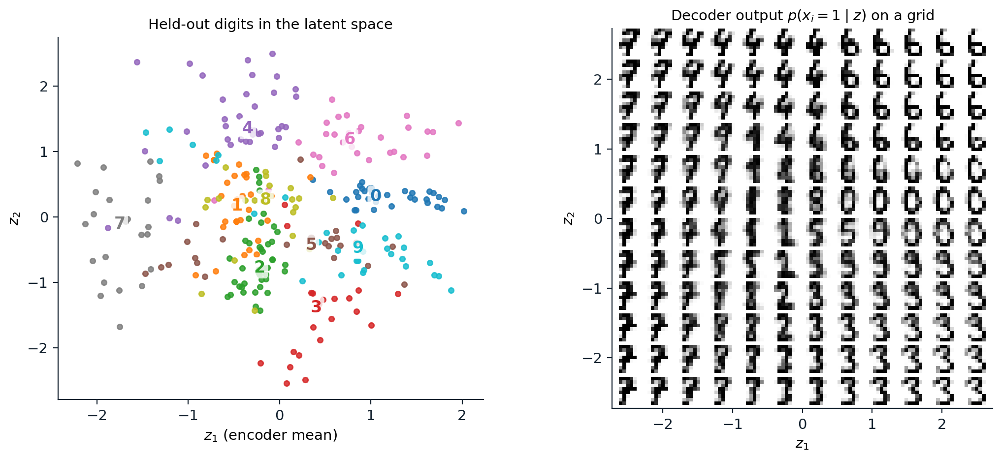
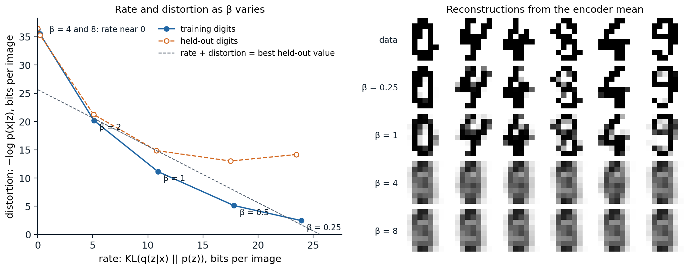

[ML Mastery Notes](../README.md) › [Generative AI](README.md)

# 3. Variational Autoencoders

[← 2. Autoregressive Models](02-autoregressive-models.md) · [4. Normalizing Flows →](04-normalizing-flows.md)

## <a id="latent-variable-models"></a>Latent-variable models

### <a id="explaining-data-with-hidden-causes"></a>Explaining data with hidden causes

A handwritten digit is determined by a few underlying factors: which digit it is, the slant, the thickness of the stroke, the writer's habits. A **latent-variable model** makes such factors explicit. It draws a latent vector $`z`$ from a simple prior $`p(z)`$, usually a standard Gaussian, and then draws the data from a conditional distribution $`p_\theta(x\mid z)`$ computed by a network, the **decoder**:

```math
p_\theta(x)=\int p_\theta(x\mid z)\,p(z)\,dz .
```

Earlier modules met the simplest cases. A Gaussian mixture has a discrete $`z`$, the component (ML chapter 14), and probabilistic PCA has a Gaussian $`z`$ and a linear decoder with Gaussian noise (ML chapter 12). In both, the integral and the posterior $`p(z\mid x)`$ are tractable, and EM fits the model. With a neural decoder, the model can represent complicated distributions, since a simple distribution pushed through a flexible function can be almost anything; but the integral has no closed form, the posterior is intractable, and both maximum likelihood and EM break down.

Sampling remains easy: draw $`z\sim p(z)`$ and decode. The difficulty is entirely in learning, which needs $`\log p_\theta(x)`$ or its gradient for each training example. A Monte Carlo average over samples of $`z`$ from the prior would be unbiased for $`p_\theta(x)`$ but useless in practice, because almost every $`z`$ drawn at random decodes to something unlike the particular $`x`$, and the average would be dominated by rare lucky draws.

### <a id="the-evidence-lower-bound"></a>The evidence lower bound

Variational inference replaces the intractable posterior with an approximation $`q(z\mid x)`$ and bounds the log-likelihood (AI chapter 10). For any $`q`$,

```math
\log p_\theta(x)=\underbrace{\mathbb E_{q(z\mid x)}\bigl[\log p_\theta(x\mid z)\bigr]-\mathrm{KL}\bigl(q(z\mid x)\,\big\|\,p(z)\bigr)}_{\mathrm{ELBO}(x)}+\mathrm{KL}\bigl(q(z\mid x)\,\big\|\,p_\theta(z\mid x)\bigr),
```

and since the last term is nonnegative, the first two form the **evidence lower bound** ([Appendix A](#block-gen03-appendix-a)). Its two terms have a direct reading. The first is a **reconstruction** term: sample a latent code for $`x`$ from $`q`$ and measure how well the decoder reproduces $`x`$ from it. The second is a **regularizer**: the codes for each $`x`$ should not stray far from the prior, which is what makes sampling from the prior produce sensible data. Maximizing the bound over the model raises the likelihood; maximizing it over $`q`$ tightens the bound, by bringing $`q`$ closer to the true posterior.

### <a id="amortized-inference"></a>Amortized inference

Classical variational inference fits a separate $`q`$ to every data point by optimization. A **variational autoencoder** (VAE; [Kingma and Welling, 2014](https://arxiv.org/abs/1312.6114); [Rezende, Mohamed, and Wierstra, 2014](https://arxiv.org/abs/1401.4082)) instead trains a second network, the **encoder**, to output the parameters of $`q_\phi(z\mid x)`$ for any $`x`$, typically a Gaussian with mean $`\mu_\phi(x)`$ and diagonal covariance $`\operatorname{diag}\sigma^2_\phi(x)`$. One forward pass replaces an optimization per data point, an idea called **amortized inference** that goes back to the Helmholtz machine ([Dayan et al., 1995](https://doi.org/10.1162/neco.1995.7.5.889)). The encoder and decoder are trained jointly on the ELBO, and the result looks like an autoencoder (DL chapter 10) with two changes: the code is a distribution rather than a point, and it is pulled toward the prior. Amortization has a price, since one network may not find the best $`q`$ for every $`x`$; this **amortization gap** is often a larger source of looseness in the bound than the restriction to Gaussians ([Cremer, Li, and Duvenaud, 2018](https://arxiv.org/abs/1801.03558)).

## <a id="training"></a>Training

### <a id="the-reparameterization-trick"></a>The reparameterization trick

Training needs the gradient of $`\mathbb E_{q_\phi(z\mid x)}[f(z)]`$ with respect to the encoder's parameters $`\phi`$, where the distribution itself depends on $`\phi`$. The general-purpose **score-function** estimator, also called REINFORCE ([Williams, 1992](https://doi.org/10.1007/BF00992696)), uses $`\nabla_\phi\mathbb E_q[f]=\mathbb E_q\bigl[f(z)\nabla_\phi\log q_\phi(z)\bigr]`$, which needs only samples and log-probabilities, but its variance is large. For a Gaussian, the **reparameterization trick** writes the sample as a deterministic function of the parameters and independent noise,

```math
z=\mu_\phi(x)+\sigma_\phi(x)\odot\epsilon,\qquad\epsilon\sim\mathcal N(0,I),
```

so that $`\mathbb E_q[f(z)]=\mathbb E_\epsilon\bigl[f(\mu_\phi+\sigma_\phi\odot\epsilon)\bigr]`$ and the gradient passes through $`f`$ by ordinary backpropagation ([Appendix B](#block-gen03-appendix-b)). The code compares the two estimators on a one-dimensional example with a known gradient.

```python
import numpy as np

rng = np.random.default_rng(0)
# Gradient with respect to mu of E[f(z)] for z ~ N(mu, sigma^2), with f(z) = (z - 3)^2.
# Exact: d/dmu [(mu - 3)^2 + sigma^2] = 2 (mu - 3).
mu, sigma, n, trials = 0.5, 1.0, 16, 10000
eps = rng.standard_normal((trials, n))
z = mu + sigma * eps
f = (z - 3) ** 2
score_fn = (f * (z - mu) / sigma ** 2).mean(1)                        # f(z) * d/dmu log q(z)
baseline = ((f - f.mean(1, keepdims=True)) * (z - mu) / sigma ** 2).mean(1) * n / (n - 1)
reparam = (2 * (z - 3)).mean(1)                                        # d/dmu f(mu + sigma * eps)
print(f"exact gradient {2 * (mu - 3):.2f}; estimates from {n} samples, over {trials:,} repetitions:")
for name, g in [("score function", score_fn), ("score function with baseline", baseline),
                ("reparameterization", reparam)]:
    print(f"{name:29s} mean {g.mean():6.2f}, standard deviation {g.std():5.2f}")
# exact gradient -5.00; estimates from 16 samples, over 10,000 repetitions:
# score function                mean  -5.02, standard deviation  2.98
# score function with baseline  mean  -5.02, standard deviation  2.01
# reparameterization            mean  -5.00, standard deviation  0.50
```

All three estimators are unbiased, but with 16 samples the score-function estimate has a standard deviation of 2.98, a baseline that subtracts the average value of $`f`$ brings it to 2.01, and the reparameterized estimate has 0.50, six times smaller. The reparameterized gradient uses the derivative of $`f`$, which tells it in which direction to move the sample, while the score-function estimator only learns whether a sample was good or bad. In a VAE, where $`f`$ involves a decoder with millions of parameters and $`z`$ has many dimensions, the difference decides whether training works. Discrete latent variables cannot be reparameterized this way, and chapter 12 describes the relaxations and straight-through estimators used for them.

### <a id="a-vae-on-digits"></a>A VAE on digits

The code trains a VAE with an 8-dimensional latent space on the binarized digits of chapter 2, with the same training and held-out split, a Bernoulli decoder, and the Gaussian KL divergence computed in closed form. It then estimates the held-out log-likelihood with the importance-weighted bound of [Burda, Grosse, and Salakhutdinov (2016)](https://arxiv.org/abs/1509.00519), which averages $`K`$ importance weights $`p_\theta(x,z_k)/q_\phi(z_k\mid x)`$ inside the logarithm and tightens as $`K`$ grows ([Appendix C](#block-gen03-appendix-c)).

```python
import numpy as np
import torch
from torch import nn
from sklearn.datasets import load_digits

torch.manual_seed(0)
rng = np.random.default_rng(0)
X = (load_digits().data > 7).astype(np.float32)          # the binarized digits of chapter 2, same split
perm = rng.permutation(len(X))
train, test = torch.tensor(X[perm[:1500]]), torch.tensor(X[perm[1500:]])
D, Z, H = 64, 8, 256

enc = nn.Sequential(nn.Linear(D, H), nn.ReLU(), nn.Linear(H, H), nn.ReLU(), nn.Linear(H, 2 * Z))
dec = nn.Sequential(nn.Linear(Z, H), nn.ReLU(), nn.Linear(H, H), nn.ReLU(), nn.Linear(H, D))


def log_px_given_z(x, z):                                 # Bernoulli decoder, summed over pixels
    return -nn.functional.binary_cross_entropy_with_logits(dec(z), x.expand_as(dec(z)), reduction="none").sum(-1)


def elbo(x):
    mu, log_var = enc(x).chunk(2, -1)
    z = mu + torch.exp(0.5 * log_var) * torch.randn_like(mu)          # reparameterization
    kl = 0.5 * (mu ** 2 + log_var.exp() - 1 - log_var).sum(-1)         # KL(q(z|x) || N(0, I)) in closed form
    return log_px_given_z(x, z) - kl, kl


opt = torch.optim.Adam([*enc.parameters(), *dec.parameters()], lr=1e-3)
for epoch in range(300):
    for idx in torch.randperm(len(train)).split(100):
        loss = -elbo(train[idx])[0].mean()
        opt.zero_grad()
        loss.backward()
        opt.step()


def iwae(x, K):
    """Importance-weighted estimate of log p(x) with K samples from the encoder (K = 1 is the ELBO)."""
    mu, log_var = enc(x).chunk(2, -1)
    std = torch.exp(0.5 * log_var)
    z = mu + std * torch.randn(K, *mu.shape)                           # K x batch x Z
    log_q = torch.distributions.Normal(mu, std).log_prob(z).sum(-1)
    log_prior = torch.distributions.Normal(0.0, 1.0).log_prob(z).sum(-1)
    log_w = log_px_given_z(x, z) + log_prior - log_q
    return torch.logsumexp(log_w, 0) - np.log(K)


to_bits = lambda nats: -nats / np.log(2) / D                           # nats per image -> bits per pixel
with torch.no_grad():
    value, kl = elbo(test)
    print(f"test ELBO {to_bits(value.mean()):.3f} bits per pixel, of which the KL term (rate) is "
          f"{kl.mean() / np.log(2):.1f} bits per image")
    for K in [1, 10, 100, 1000]:
        print(f"importance-weighted bound, K = {K:4d}: {to_bits(torch.cat([iwae(x, K) for x in test.split(50)]).mean()):.3f}")
# test ELBO 0.401 bits per pixel, of which the KL term (rate) is 10.7 bits per image
# importance-weighted bound, K =    1: 0.405
# importance-weighted bound, K =   10: 0.378
# importance-weighted bound, K =  100: 0.371
# importance-weighted bound, K = 1000: 0.368
```

The ELBO on held-out digits is 0.401 bits per pixel, of which the KL term accounts for 10.7 bits per image: the encoder transmits about 11 bits of information about each digit through its latent code. The importance-weighted bound tightens from 0.405 with one sample (again the ELBO, estimated with a different draw) to 0.368 with 1,000, so the ELBO underestimates the model's log-likelihood by about 0.03 bits per pixel, about 2 bits per image. The VAE's likelihood is better than the MADE's 0.389 bits per pixel on the same held-out digits in chapter 2, though both models are small and neither result would carry over to large images without architectural work. The figure shows a model with a two-dimensional latent space, where the latent space can be plotted directly.



*A VAE with a two-dimensional latent space trained on the 1,500 binarized training digits (held-out distortion 22.0 bits and rate 6.2 bits per image). Left: the encoder means of the 297 held-out digits, colored by their true label, which the model never saw; the numerals mark each class's median. Right: the decoder's pixel probabilities for latent codes on a $`12\times12`$ grid from $`-2.5`$ to $`2.5`$. Classes occupy regions of the prior's high-density area, and moving across the grid morphs one digit into another, for example 7 into 9 into 4 along the top-left.*

### <a id="decoders-and-blurry-samples"></a>Decoders and blurry samples

The decoder's likelihood defines what counts as a good reconstruction. A Gaussian decoder with fixed variance makes the reconstruction term a squared error, and a decoder that cannot say exactly which of several plausible details an image has will predict their average, which is blurry. Sampling from the decoder's Gaussian would add pixel noise rather than detail, so VAE images are usually shown as the decoder's mean, and the samples of plain VAEs on natural images are noticeably blurrier than those of adversarial or diffusion models. The Bernoulli decoder used here is appropriate for binary pixels; applying it to continuous intensities, a common shortcut, does not define a proper density ([Loaiza-Ganem and Cunningham, 2019](https://arxiv.org/abs/1907.06845)). Latent diffusion models (chapter 11) keep the VAE's encoder and decoder but replace the pixel-wise likelihood with perceptual and adversarial losses and a very weak KL term, using the autoencoder only as a compressor.

## <a id="what-the-latent-code-carries"></a>What the latent code carries

### <a id="rate-and-distortion"></a>Rate and distortion

The negative ELBO splits into a **distortion** $`D=\mathbb E_q[-\log p_\theta(x\mid z)]`$, how badly $`x`$ is reconstructed from its code, and a **rate** $`R=\mathrm{KL}(q_\phi(z\mid x)\,\|\,p(z))`$, how many nats of information the code carries beyond the prior, the terms of lossy compression ([Alemi et al., 2018](https://arxiv.org/abs/1711.00464)). The ELBO weighs them equally, but many combinations of rate and distortion give the same sum, and the **β-VAE** ([Higgins et al., 2017](https://openreview.net/forum?id=Sy2fzU9gl)) weighs the rate by a factor $`\beta`$ to choose among them. Larger $`\beta`$ compresses more; Higgins et al. reported that it encouraged **disentangled** codes, in which each latent dimension controls one factor of variation, although [Locatello et al. (2019)](https://arxiv.org/abs/1811.12359) proved that unsupervised disentanglement is impossible without inductive biases on the model and the data, and found that the random seed mattered as much as the method. The figure trains VAEs with six values of $`\beta`$.



*VAEs with 8-dimensional latent spaces trained on the binarized digits with the rate weighted by β from 0.25 to 8, 300 epochs each. Left: distortion against rate, in bits per image, on the training digits (solid) and the held-out digits (dashed). As β grows, the rate falls from 23.9 to 0 bits and the training distortion rises from 2.5 to 36.3 bits. The held-out negative ELBO is lowest at β = 1, 25.6 bits (rate 10.8, distortion 14.9); at β = 0.25 the model reconstructs training digits almost perfectly but held-out digits poorly (distortion 14.2), with a held-out negative ELBO of 37.6 bits. At β = 4 and 8 the rate collapses to 0.2 and 0 bits. Right: reconstructions of six held-out digits from their encoder means; with the collapsed codes, every input decodes to the same average digit.*

### <a id="posterior-collapse"></a>Posterior collapse

The right side of the figure shows the failure called **posterior collapse**: when using the latent code costs more than it saves, the encoder outputs the prior for every input, the KL term drops to zero, and the decoder models the data without $`z`$. Strong weighting of the KL term causes it here. The more common cause in practice is a **powerful decoder**: an autoregressive decoder can model the data well on its own, so a small reduction in distortion does not pay for any rate, and the latent is ignored. [Bowman et al. (2016)](https://arxiv.org/abs/1511.06349) found this with LSTM decoders of sentences, which set the KL term to zero in every run unless it was annealed from zero at the start of training and the decoder's inputs were randomly dropped. Other remedies set a minimum rate for groups of latent dimensions, the **free bits** of [Kingma et al. (2016)](https://arxiv.org/abs/1606.04934), constrain the posterior so its KL cannot vanish ([Razavi et al., 2019](https://arxiv.org/abs/1901.03416)), or train the encoder more aggressively than the decoder early on, since collapse often begins when the encoder lags behind ([He et al., 2019](https://arxiv.org/abs/1901.05534)).

### <a id="the-prior-and-the-aggregate-posterior"></a>The prior and the aggregate posterior

The KL term also creates a mismatch that affects sampling. Averaged over the data, the rate equals the mutual information between $`x`$ and $`z`$ plus the divergence between the **aggregate posterior** $`q(z)=\mathbb E_{p_{\mathrm{data}}}[q_\phi(z\mid x)]`$ and the prior ([Hoffman and Johnson, 2016](http://approximateinference.org/2016/accepted/HoffmanJohnson2016.pdf)). If the encoded data do not fill the prior, sampling from the prior lands in holes that no training example occupies and decodes to implausible images. Learned priors that match the aggregate posterior, such as a mixture of posteriors of learned pseudo-inputs ([Tomczak and Welling, 2018](https://arxiv.org/abs/1705.07120)) or an autoregressive model or diffusion model over the latents, close the gap, and generating in a latent space with a second generative model is the principle of latent diffusion (chapter 11) and of the discrete-token models of chapter 12.

## <a id="extensions"></a>Extensions

### <a id="conditional-and-semi-supervised-vaes"></a>Conditional and semi-supervised VAEs

Conditioning both the encoder and decoder on an observed variable $`y`$, a class label, part of an image, or a text, gives a **conditional VAE** that models $`p(x\mid y)`$ with a latent $`z`$ for the remaining variation, for example the many plausible completions of a partly hidden image ([Sohn, Lee, and Yan, 2015](https://proceedings.neurips.cc/paper/2015/hash/8d55a249e6baa5c06772297520da2051-Abstract.html)). Treating the label as a latent variable when it is missing gives a semi-supervised classifier that learns from unlabeled examples through the generative model ([Kingma et al., 2014](https://arxiv.org/abs/1406.5298)).

### <a id="hierarchical-vaes"></a>Hierarchical VAEs

A single layer of Gaussian latents limits how complex the posterior and the prior can be. **Hierarchical VAEs** stack several layers of latents, $`p(z_L)\,p(z_{L-1}\mid z_L)\cdots p(x\mid z_1)`$, with encoders that share computation with the generative path, as in the ladder VAE ([Sønderby et al., 2016](https://arxiv.org/abs/1602.02282)). Making them deep required careful architecture and stabilization. **NVAE** ([Vahdat and Kautz, 2020](https://arxiv.org/abs/2007.03898)) reached 2.91 bits per dimension on CIFAR-10 and was the first VAE to generate natural images as large as $`256\times256`$, and **very deep VAEs** ([Child, 2021](https://arxiv.org/abs/2011.10650)), with dozens of stochastic layers, outperformed PixelCNN in log-likelihood on all natural-image benchmarks with fewer parameters and sampling thousands of times faster. A diffusion model is itself a hierarchical VAE with a fixed encoder, the noising process, in which every latent layer has the dimension of the data; chapter 7 derives its training objective as an ELBO.

## <a id="appendices"></a>Appendices


<details>
<summary><a id="block-gen03-appendix-a"></a><b>A. The evidence lower bound and the Gaussian KL divergence</b></summary>


**Two derivations.** Jensen's inequality gives the bound directly: $`\log p_\theta(x)=\log\mathbb E_{q(z\mid x)}\bigl[p_\theta(x,z)/q(z\mid x)\bigr]\ge\mathbb E_q\bigl[\log p_\theta(x,z)-\log q(z\mid x)\bigr]`$. The exact identity shows what is lost. Since $`p_\theta(z\mid x)=p_\theta(x,z)/p_\theta(x)`$,

```math
\mathrm{KL}\bigl(q\,\|\,p_\theta(z\mid x)\bigr)=\mathbb E_q[\log q(z\mid x)-\log p_\theta(x,z)]+\log p_\theta(x)=\log p_\theta(x)-\mathrm{ELBO},
```

so the gap equals the divergence of $`q`$ from the true posterior. Writing $`\log p_\theta(x,z)=\log p_\theta(x\mid z)+\log p(z)`$ splits the ELBO into reconstruction and KL terms. Maximizing the ELBO over $`\theta`$ and $`\phi`$ jointly therefore trades off fitting the data against keeping the posterior simple: the model is pushed toward decoders whose posteriors are close to Gaussian.

**Gaussian KL.** For $`q=\mathcal N(\mu,\operatorname{diag}\sigma^2)`$ and $`p=\mathcal N(0,I)`$ in $`d`$ dimensions,

```math
\mathrm{KL}(q\,\|\,p)=\frac12\sum_{j=1}^d\bigl(\mu_j^2+\sigma_j^2-1-\log\sigma_j^2\bigr),
```

which is zero only when $`\mu=0`$ and $`\sigma=1`$. Each dimension contributes separately: a dimension whose $`\mu_j`$ is always near zero and $`\sigma_j`$ near one carries no information and costs nothing, which is how a VAE switches off latent dimensions it does not need.

</details>


<details>
<summary><a id="block-gen03-appendix-b"></a><b>B. Score-function and reparameterized gradients</b></summary>


**Score function.** For a density $`q_\phi(z)`$ differentiable in $`\phi`$, $`\nabla_\phi\mathbb E_{q_\phi}[f(z)]=\int f(z)\nabla_\phi q_\phi(z)\,dz=\mathbb E_{q_\phi}\bigl[f(z)\nabla_\phi\log q_\phi(z)\bigr]`$. Because $`\mathbb E_q[\nabla_\phi\log q_\phi]=0`$, any constant $`b`$ can be subtracted from $`f`$ without bias, and choosing $`b\approx\mathbb E_q[f]`$ reduces the variance; with $`n`$ samples, using the mean of the others as $`b`$ keeps the estimate unbiased. For the example in the code, $`z\sim\mathcal N(\mu,\sigma^2)`$ and $`\nabla_\mu\log q=(z-\mu)/\sigma^2`$.

**Reparameterization.** If $`z=g_\phi(\epsilon)`$ with $`\epsilon`$ from a fixed distribution, then $`\mathbb E_{q_\phi}[f(z)]=\mathbb E_\epsilon[f(g_\phi(\epsilon))]`$ and $`\nabla_\phi\mathbb E=\mathbb E_\epsilon\bigl[\nabla_zf\,\partial g_\phi/\partial\phi\bigr]`$, which requires $`f`$ to be differentiable. In the example, $`\nabla_\mu f(\mu+\sigma\epsilon)=2(z-3)`$, whose variance $`4\sigma^2`$ does not depend on how far $`\mu`$ is from the optimum, while the score-function estimate's variance grows with $`f`$ itself. Location-scale families, and any distribution sampled by a differentiable transformation of fixed noise, can be reparameterized; discrete distributions cannot, which motivates the Gumbel-softmax relaxation and the learned baselines of score-function estimators for discrete latents ([Mnih and Gregor, 2014](https://arxiv.org/abs/1402.0030)).

</details>


<details>
<summary><a id="block-gen03-appendix-c"></a><b>C. The importance-weighted bound</b></summary>


With $`z_1,\dots,z_K`$ drawn independently from $`q(z\mid x)`$ and weights $`w_k=p_\theta(x,z_k)/q(z_k\mid x)`$, each $`w_k`$ has expectation $`p_\theta(x)`$, so by Jensen's inequality

```math
\mathcal L_K=\mathbb E\Bigl[\log\frac1K\sum_{k=1}^Kw_k\Bigr]\le\log p_\theta(x).
```

$`\mathcal L_1`$ is the ELBO. The bounds increase with $`K`$: the average of $`K+1`$ weights equals the average, over the $`K+1`$ ways to leave one out, of the averages of $`K`$ weights, and Jensen's inequality applied to the logarithm gives $`\mathcal L_{K+1}\ge\mathcal L_K`$. If the weights are bounded, the average converges to $`p_\theta(x)`$ by the law of large numbers and $`\mathcal L_K\to\log p_\theta(x)`$, with a bias of order $`\operatorname{Var}(w)/(2Kp^2)`$ for large $`K`$. Training on $`\mathcal L_K`$ instead of the ELBO gives the importance-weighted autoencoder, whose encoder is no longer forced to cover only one region of a multimodal posterior. Evaluating trained models with large $`K`$ is the standard way to report the log-likelihood of VAEs, as in the code.

</details>

---

[← 2. Autoregressive Models](02-autoregressive-models.md) · [4. Normalizing Flows →](04-normalizing-flows.md)
