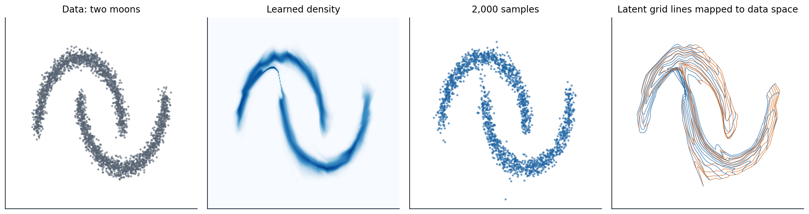

[ML Mastery Notes](../README.md) › [Generative AI](README.md)

# 4. Normalizing Flows

[← 3. Variational Autoencoders](03-variational-autoencoders.md) · [5. Generative Adversarial Networks →](05-generative-adversarial-networks.md)

## <a id="invertible-generative-models"></a>Invertible generative models

### <a id="the-change-of-variables-formula"></a>The change-of-variables formula

A **normalizing flow** generates data by pushing a simple random variable through an invertible function: draw $z$ from a base distribution $p_Z$, usually a standard Gaussian, and output $x=f(z)$. Because $f$ is invertible, every $x$ comes from exactly one $z=f^{-1}(x)$, and the density of $x$ follows from the **change-of-variables formula**:

$$
p_X(x)=p_Z\bigl(f^{-1}(x)\bigr)\,\Bigl|\det\frac{\partial f^{-1}(x)}{\partial x}\Bigr|,\qquad
\log p_X(x)=\log p_Z(z)-\log\Bigl|\det\frac{\partial f(z)}{\partial z}\Bigr|.
$$

The determinant measures how much $f$ expands volume near $z$ (Foundations chapter 2): where $f$ stretches a region, the same probability is spread over more volume and the density falls. A flow therefore has everything the other families lack in some combination. Its log-likelihood is exact and can be maximized directly, as for autoregressive models; sampling takes one pass through $f$, as for a VAE's decoder; and the latent code of any data point is computed exactly by $f^{-1}$, with no approximate posterior. The price is in the architecture: $f$ must be invertible, its Jacobian determinant must be cheap to compute, and $z$ must have the same dimension as $x$.

### <a id="composing-transformations"></a>Composing transformations

A composition of invertible maps is invertible, and the log-determinants of the pieces add:

$$
x=f_K\circ\dots\circ f_1(z)\quad\Longrightarrow\quad\log p_X(x)=\log p_Z(z)-\sum_{k=1}^K\log\Bigl|\det\frac{\partial f_k}{\partial z_{k-1}}\Bigr|,
$$

where $z_0=z$ and $z_k=f_k(z_{k-1})$. Deep flows are built from many simple layers, each of which is easy to invert and whose determinant is easy to compute. In one dimension, any continuous distribution is a flow: the inverse of its cumulative distribution function maps a uniform variable to it, and composing with the Gaussian CDF maps a Gaussian to it. In many dimensions, a flow must be both expressive enough to warp a Gaussian into, for example, the distribution of faces, and structured enough that an exact determinant of a $D\times D$ Jacobian costs far less than the $O(D^3)$ of a general matrix. The name comes from the reverse direction: $f^{-1}$ transforms the data step by step until its distribution is a standard normal ([Tabak and Vanden-Eijnden, 2010](https://doi.org/10.4310/CMS.2010.v8.n1.a11); [Rezende and Mohamed, 2015](https://arxiv.org/abs/1505.05770)).

## <a id="designing-invertible-layers"></a>Designing invertible layers

### <a id="coupling-layers"></a>Coupling layers

The most widely used construction makes the Jacobian triangular, so that its determinant is the product of its diagonal. A **coupling layer** splits the input into two parts, leaves the first unchanged, and transforms the second with parameters computed from the first:

$$
x_A=z_A,\qquad x_B=z_B\odot\exp\bigl(s(z_A)\bigr)+t(z_A).
$$

The functions $s$ and $t$ can be arbitrary networks, because they never need to be inverted: given $x$, the first part is $z_A=x_A$, and then $z_B=\bigl(x_B-t(x_A)\bigr)\odot\exp\bigl(-s(x_A)\bigr)$. The Jacobian is triangular with ones for the unchanged part and $\exp(s)$ for the transformed part, so $\log|\det|=\sum_js_j(z_A)$, one sum, however complicated the networks. **NICE** ([Dinh, Krueger, and Bengio, 2015](https://arxiv.org/abs/1410.8516)) used additive coupling, $s=0$, which preserves volume, followed by a final diagonal scaling; **RealNVP** ([Dinh, Sohl-Dickstein, and Bengio, 2017](https://arxiv.org/abs/1605.08803)) added the scale $s$, split images by checkerboard and channel masks, and alternated which part is transformed so that every dimension is changed in some layer. **Glow** ([Kingma and Dhariwal, 2018](https://arxiv.org/abs/1807.03039)) replaced the fixed permutations between couplings with learned invertible $1\times1$ convolutions, which mix channels with a matrix whose determinant is cheap in an LU parameterization, and generated $256\times256$ faces whose attributes could be changed by moving along directions in the latent space.

The code fits a flow of eight affine coupling layers to two-dimensional data shaped like two interlocking moons, and checks the two properties that make a flow a flow: it can be inverted exactly, and the log-determinant from the coupling formula equals that of the full Jacobian.

```python
import numpy as np
import torch
from torch import nn
from sklearn.datasets import make_moons

torch.manual_seed(0)
X, _ = make_moons(3000, noise=0.06, random_state=0)
X = (X - X.mean(0)) / X.std(0)
train, test = torch.tensor(X[:2000], dtype=torch.float32), torch.tensor(X[2000:], dtype=torch.float32)


class Coupling(nn.Module):
    """Affine coupling: keep one coordinate, scale and shift the other by functions of the kept one."""
    def __init__(self, keep):
        super().__init__()
        self.keep = keep
        self.net = nn.Sequential(nn.Linear(1, 64), nn.ReLU(), nn.Linear(64, 64), nn.ReLU(), nn.Linear(64, 2))

    def forward(self, z):                                  # latent -> data direction
        a, b = z[:, self.keep:self.keep + 1], z[:, 1 - self.keep:2 - self.keep]
        s, t = self.net(a).chunk(2, -1)
        s = torch.tanh(s)                                  # bounded log-scales keep training stable
        out = torch.empty_like(z)
        out[:, self.keep:self.keep + 1], out[:, 1 - self.keep:2 - self.keep] = a, b * torch.exp(s) + t
        return out, s.sum(-1)                              # log |det dx/dz|

    def inverse(self, x):                                  # data -> latent direction
        a, b = x[:, self.keep:self.keep + 1], x[:, 1 - self.keep:2 - self.keep]
        s, t = self.net(a).chunk(2, -1)
        s = torch.tanh(s)
        out = torch.empty_like(x)
        out[:, self.keep:self.keep + 1], out[:, 1 - self.keep:2 - self.keep] = a, (b - t) * torch.exp(-s)
        return out, -s.sum(-1)                             # log |det dz/dx|


layers = nn.ModuleList([Coupling(k % 2) for k in range(8)])
base = torch.distributions.MultivariateNormal(torch.zeros(2), torch.eye(2))


def log_prob(x):                                           # change of variables, summed over layers
    total = torch.zeros(len(x))
    for layer in reversed(layers):
        x, ld = layer.inverse(x)
        total = total + ld
    return base.log_prob(x) + total


opt = torch.optim.Adam(layers.parameters(), lr=2e-3)
for step in range(3000):
    idx = torch.randint(len(train), (256,))
    loss = -log_prob(train[idx]).mean()
    opt.zero_grad()
    loss.backward()
    opt.step()

with torch.no_grad():
    gauss = torch.distributions.MultivariateNormal(train.mean(0), torch.cov(train.T))
    print(f"held-out log-likelihood per point: flow {log_prob(test).mean():.3f}, "
          f"single Gaussian {gauss.log_prob(test).mean():.3f} nats")
    z = test.clone()                                       # invertibility: data -> latent -> data
    for layer in reversed(layers):
        z, _ = layer.inverse(z)
    x = z
    for layer in layers:
        x, _ = layer(x)
    print(f"inverting and re-applying the flow reproduces every point to within 1e-5: {(x - test).abs().max() < 1e-5}")
# The log-determinant from the coupling formula agrees with the Jacobian computed by automatic differentiation.
x0 = test[:1].clone()
def to_latent(x):
    for layer in reversed(layers):
        x, _ = layer.inverse(x)
    return x
J = torch.autograd.functional.jacobian(lambda v: to_latent(v.view(1, 2)).view(2), x0.view(2))
with torch.no_grad():
    formula = log_prob(x0) - base.log_prob(to_latent(x0))
print(f"log |det J| for one point: autograd {torch.linalg.slogdet(J)[1]:.4f}, coupling formula {formula.item():.4f}")
# held-out log-likelihood per point: flow -1.430, single Gaussian -2.733 nats
# inverting and re-applying the flow reproduces every point to within 1e-5: True
# log |det J| for one point: autograd 1.1771, coupling formula 1.1771
```

The flow's held-out log-likelihood is $-1.43$ nats per point against $-2.73$ for the best single Gaussian, a gain of 1.3 nats, meaning the flow assigns the held-out points on average about 3.7 times the density. Inverting and re-applying it reproduces the data to rounding error, and the log-determinant computed by automatic differentiation of the whole 8-layer map, $1.1771$, is the one the model computes cheaply as a sum of scales. The figure shows what the flow learned.



*The flow of the code, eight affine coupling layers fitted to 2,000 standardized points from two moons. From left to right: the 3,000 data points; the learned density on a grid; 2,000 samples, drawn by pushing Gaussian noise through the flow; and the images of the vertical (blue) and horizontal (orange) lines of a latent grid from $-2.5$ to $2.5$. The flow stretches and folds the plane to lay the Gaussian's mass along the moons, and because a continuous invertible map cannot split one connected region into two, it leaves a thin filament of density joining the moons. The filament carries little mass: 0.2% of samples lie farther than 0.25 from every training point, against none of the held-out points.*

### <a id="building-flows-for-images"></a>Building flows for images

Image flows add several components around the coupling layers. A **squeeze** operation reshapes each $2\times2\times c$ block of pixels into a $1\times1\times4c$ vector, trading spatial resolution for channels so that couplings can mix nearby pixels. A **multi-scale** architecture factors out half of the dimensions after each few layers and sends them directly to the Gaussian base, while the rest continue to be transformed at a coarser scale. The factored-out dimensions model fine detail, the dimensions that go through the whole network model global structure, and the computation per layer halves at every scale, which is essential when the latent has as many dimensions as the image. **Activation normalization**, a per-channel affine layer initialized so that the first batch has zero mean and unit variance, replaced batch normalization in Glow, whose statistics would make the density of an image depend on the other images in its batch.

Sampling from a flow's Gaussian at reduced **temperature**, multiplying $z$ by a factor below one, concentrates samples near the mode and trades diversity for quality, as truncation does for adversarial networks and lower temperature for language models; Glow's face samples used a temperature of 0.7. Because the latent code of every image is computed exactly, flows support manipulations that approximate-inference models support only loosely: interpolating between the codes of two faces gives a smooth sequence of faces, and adding the average difference between the codes of faces with and without an attribute, such as a smile, adds that attribute to any face.

### <a id="autoregressive-flows"></a>Autoregressive flows

An autoregressive model with Gaussian conditionals is also a flow. If $x_i=\mu_i(x_{<i})+\sigma_i(x_{<i})\,z_i$, then $z_i=(x_i-\mu_i)/\sigma_i$, the Jacobian is triangular, and $\log|\det|=\sum_i\log\sigma_i$. The **masked autoregressive flow** (MAF; [Papamakarios, Pavlakou, and Murray, 2017](https://arxiv.org/abs/1705.07057)) computes all the $\mu_i$ and $\sigma_i$ from $x$ in one pass with a MADE (chapter 2), so evaluating the density is fast, but sampling needs $D$ sequential passes, since each $x_i$ depends on the ones before. The **inverse autoregressive flow** (IAF; [Kingma et al., 2016](https://arxiv.org/abs/1606.04934)) makes the parameters functions of the earlier noise variables instead, $x_i=\mu_i(z_{<i})+\sigma_i(z_{<i})z_i$, so sampling takes one pass and evaluating the density of an arbitrary $x$ takes $D$. The two are the same construction run in opposite directions. MAF suits density estimation; IAF suits generation and variational posteriors, where the model samples and evaluates the density of its own samples, whose $z$ it knows. This asymmetry made Parallel WaveNet possible: a slow autoregressive WaveNet was distilled into a fast IAF student (chapter 2). A coupling layer is the special case of an autoregressive flow with two blocks, which is why RealNVP is fast in both directions but less expressive per layer.

### <a id="more-expressive-layers"></a>More expressive layers

Affine transformations of each dimension are simple, and many layers are needed to build complex distributions. **Neural spline flows** ([Durkan et al., 2019](https://arxiv.org/abs/1906.04032)) replace the affine map in each coupling or autoregressive layer with a monotonic rational-quadratic spline whose knots are computed by the network, which is invertible in closed form and far more flexible per layer. **Residual flows** keep the ordinary residual block $x=z+g(z)$ and make it invertible by constraining $g$ to have Lipschitz constant below 1, so that $z$ can be recovered by fixed-point iteration; the log-determinant is expanded as a power series whose terms are estimated with random vectors ([Behrmann et al., 2019](https://arxiv.org/abs/1811.00995); [Chen et al., 2019](https://arxiv.org/abs/1906.02735)).

### <a id="continuous-time-flows"></a>Continuous-time flows

Taking many small residual steps to the limit gives a flow defined by an ordinary differential equation, $dz/dt=v_\theta(z,t)$, run from $t=0$ to $t=1$ ([Chen et al., 2018](https://arxiv.org/abs/1806.07366)). Any sufficiently smooth velocity field defines an invertible map, since the ODE can be integrated backward, so there is no architectural constraint on $v_\theta$. The log-density changes along a trajectory according to the **instantaneous change of variables**,

$$
\frac{d\log p\bigl(z(t)\bigr)}{dt}=-\operatorname{tr}\Bigl(\frac{\partial v_\theta}{\partial z}\bigl(z(t),t\bigr)\Bigr),
$$

a trace instead of a determinant ([Appendix B](#block-gen04-appendix-b)). A trace of a $D\times D$ Jacobian still costs $D$ backward passes to compute exactly, and **FFJORD** ([Grathwohl et al., 2019](https://arxiv.org/abs/1810.01367)) replaced it with **Hutchinson's estimator**, $\operatorname{tr}(J)=\mathbb E[v^\top Jv]$ for random vectors $v$ with identity covariance, which needs one vector–Jacobian product per sample ([Hutchinson, 1989](https://doi.org/10.1080/03610918908812806)). The code compares the estimator with the exact trace for the Jacobian of a small network in 100 dimensions.

```python
import torch

torch.manual_seed(0)
# The Jacobian of a small network at one point, the quantity whose trace a continuous flow integrates.
D = 100
f = torch.nn.Sequential(torch.nn.Linear(D, 256), torch.nn.Tanh(), torch.nn.Linear(256, D))
x = torch.randn(D, requires_grad=True)
y = f(x)
J = torch.stack([torch.autograd.grad(y[i], x, retain_graph=True)[0] for i in range(D)])   # D backward passes
exact = torch.trace(J).item()


def hutchinson(n_probes, kind):
    """Estimate tr(J) as the average of v^T J v over random probes v with E[v v^T] = I; one pass per probe."""
    est = []
    for _ in range(n_probes):
        v = torch.randn(D) if kind == "Gaussian" else torch.randint(0, 2, (D,)).float() * 2 - 1
        vjp = torch.autograd.grad(y, x, grad_outputs=v, retain_graph=True)[0]   # v^T J by one backward pass
        est.append((vjp @ v).item())
    return sum(est) / n_probes


print(f"exact trace (100 backward passes): {exact:.3f}")
for kind in ["Gaussian", "Rademacher"]:
    for n in [1, 10]:
        runs = torch.tensor([hutchinson(n, kind) for _ in range(300)])
        print(f"{kind:10s} probes, {n:2d} per estimate: mean {runs.mean():.3f}, standard deviation {runs.std():.3f}")
# exact trace (100 backward passes): -0.220
# Gaussian   probes,  1 per estimate: mean -0.029, standard deviation 2.717
# Gaussian   probes, 10 per estimate: mean -0.240, standard deviation 0.852
# Rademacher probes,  1 per estimate: mean -0.221, standard deviation 2.948
# Rademacher probes, 10 per estimate: mean -0.228, standard deviation 0.840
```

With one random vector the estimate is unbiased but noisy, with a standard deviation over ten times the magnitude of the trace here, because the off-diagonal entries of this Jacobian are large; averaging ten vectors cuts the noise by about $\sqrt{10}$. In training, the noise averages out over many examples and steps, which is what made continuous flows trainable at all. They remained expensive, since every training step requires solving an ODE forward and backward through time, until **flow matching** (chapter 9) showed how to train the velocity field of a continuous flow by regression, without simulating the ODE during training. Many of the leading image and video generators are continuous flows trained this way.

## <a id="using-flows"></a>Using flows

### <a id="dequantization-and-the-data-manifold"></a>Dequantization and the data manifold

A flow is a bijection of $\mathbb R^D$, and this constrains what it can represent. It cannot change the dimension of the space, so it cannot put all its mass on a lower-dimensional manifold, as the manifold hypothesis says real data do (chapter 1); it must model the data as a full-dimensional distribution and assigns the thin set very high density. And a continuous bijection preserves topology: a Gaussian, which is connected, can only be mapped to a connected distribution, so two separated clusters come joined by a filament, as in the figure, and the flow must become nearly singular to make the filament thin ([Cornish et al., 2020](https://arxiv.org/abs/1909.13833); [Dupont, Doucet, and Teh, 2019](https://arxiv.org/abs/1904.01681)). For image data, which are discrete, flows are trained on dequantized pixels (chapter 1); learning the dequantization noise with a variational distribution rather than using uniform noise, together with architectural improvements, brought **Flow++** to 3.08 bits per dimension on CIFAR-10, against 3.35 for Glow and 3.49 for RealNVP ([Ho et al., 2019](https://arxiv.org/abs/1902.00275)).

### <a id="where-flows-stand"></a>Where flows stand

For most of their history, flows trailed autoregressive models in likelihood and adversarial networks in sample quality, and their constraint to invertible layers of full dimension made them expensive in memory. They found their uses where exact densities, fast sampling, and exact inversion matter together: as flexible variational posteriors in VAEs, as fast students distilled from autoregressive teachers, in Bayesian inference and simulation-based science ([Papamakarios et al., 2021](https://arxiv.org/abs/1912.02762)), and as **Boltzmann generators** that sample the equilibrium configurations of molecules from a known energy function, trained on the energy itself rather than on data, with exact densities to reweight the samples ([Noé et al., 2019](https://doi.org/10.1126/science.aaw1147)). Transformer-based autoregressive flows later closed much of the gap in quality: **TarFlow** ([Zhai et al., 2025](https://arxiv.org/abs/2412.06329)) set a new best likelihood on ImageNet at $64\times64$, 2.99 bits per dimension, and produced samples comparable to diffusion models for the first time with a stand-alone flow. The ideas of this chapter matter beyond the discrete-layer flows themselves: the continuous flow's velocity field and change-of-variables formula are the framework in which diffusion models compute likelihoods (chapter 8) and flow-matching models generate images (chapter 9).

## <a id="appendices"></a>Appendices


<details>
<summary><a id="block-gen04-appendix-a"></a><b>A. The Jacobians of coupling and autoregressive layers</b></summary>


**Coupling.** Order the coordinates so that $z=(z_A,z_B)$. The coupling map $x_A=z_A$, $x_B=z_B\odot e^{s(z_A)}+t(z_A)$ has Jacobian

$$
\frac{\partial x}{\partial z}=\begin{pmatrix}I&0\\ \partial x_B/\partial z_A&\operatorname{diag}\bigl(e^{s(z_A)}\bigr)\end{pmatrix},
$$

which is block lower triangular, so its determinant is the product of the diagonal blocks' determinants, $\prod_je^{s_j(z_A)}$, regardless of the block $\partial x_B/\partial z_A$, which contains the derivatives of the networks $s$ and $t$ and never needs to be computed. Bounding $s$, for example with $\tanh$ as in the code, keeps the scales from exploding early in training.

**Autoregressive.** For $x_i=\mu_i(x_{<i})+\sigma_i(x_{<i})z_i$ with $\sigma_i>0$, the derivative $\partial z_i/\partial x_j$ vanishes for $j>i$, so the inverse map's Jacobian is lower triangular with diagonal $1/\sigma_i$ and $\log p_X(x)=\log p_Z(z)-\sum_i\log\sigma_i(x_{<i})$. MAF computes the $\sigma_i(x_{<i})$ for a given $x$ in one pass; for IAF the conditioners depend on $z_{<i}$, which is known when sampling. The two directions are related by exchanging the roles of $x$ and $z$: a MAF of $x$ with base $z$ is an IAF of $z$ with base $x$.

**$1\times1$ convolutions.** A $1\times1$ convolution applies the same matrix $W\in\mathbb R^{c\times c}$ to the channels at each of the $h\cdot w$ spatial positions, so its log-determinant is $h\,w\log|\det W|$. With $W=PL(U+\operatorname{diag}(s))$, where $P$ is a fixed permutation and $L$ and $U$ are unit lower and strictly upper triangular, $\log|\det W|=\sum_j\log|s_j|$.

</details>


<details>
<summary><a id="block-gen04-appendix-b"></a><b>B. The instantaneous change of variables</b></summary>


Let $z(t)$ solve $\dot z=v(z,t)$, and let $p_t$ be the density of $z(t)$ when $z(0)\sim p_0$. Mass is conserved as it moves with the flow, which is the **continuity equation**

$$
\frac{\partial p_t}{\partial t}+\nabla\cdot\bigl(p_t\,v\bigr)=0.
$$

Along a trajectory, the total derivative of the log-density is

$$
\frac{d}{dt}\log p_t\bigl(z(t)\bigr)=\frac{\partial_tp_t+\nabla p_t\cdot v}{p_t}=\frac{-\nabla\cdot(p_tv)+\nabla p_t\cdot v}{p_t}=-\nabla\cdot v=-\operatorname{tr}\frac{\partial v}{\partial z},
$$

so $\log p_1(z(1))=\log p_0(z(0))-\int_0^1\operatorname{tr}\bigl(\partial v/\partial z\bigr)\,dt$, the continuous analogue of summing log-determinants over layers. For a small step $z\mapsto z+\epsilon v(z)$, $\log\det(I+\epsilon J)=\epsilon\operatorname{tr}J+O(\epsilon^2)$, which gives the same result. The continuity equation reappears in chapter 9 as the condition that a velocity field generates a given path of distributions.

**Hutchinson's estimator.** For any random vector $v$ with $\mathbb E[vv^\top]=I$, $\mathbb E[v^\top Jv]=\operatorname{tr}\bigl(J\,\mathbb E[vv^\top]\bigr)=\operatorname{tr}J$. With Gaussian $v$ the variance is $2\|J\|_F^2$ for symmetric $J$; with Rademacher $v$, entries $\pm1$, the diagonal contributes no variance and it is $2\sum_{i\ne j}J_{ij}^2$ for symmetric $J$. The product $v^\top J$ is one reverse-mode differentiation pass, so each sample costs about as much as evaluating the network.

</details>

---

[← 3. Variational Autoencoders](03-variational-autoencoders.md) · [5. Generative Adversarial Networks →](05-generative-adversarial-networks.md)
