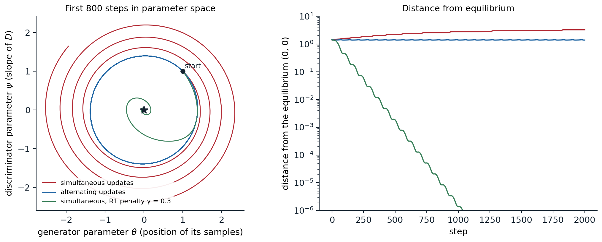
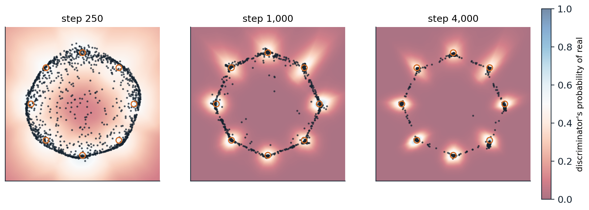

[ML Mastery Notes](../README.md) › [Generative AI](README.md)

# 5. Generative Adversarial Networks

[← 4. Normalizing Flows](04-normalizing-flows.md) · [6. Energy-Based Models and Score Matching →](06-energy-based-models-and-score-matching.md)

## <a id="the-adversarial-game"></a>The adversarial game

### <a id="a-generator-and-a-discriminator"></a>A generator and a discriminator

The families of the previous chapters all need a density to maximize, exactly or through a bound. A **generative adversarial network** (GAN; [Goodfellow et al., 2014](https://arxiv.org/abs/1406.2661)) does without one. A **generator** network $G$ maps noise $z\sim p(z)$ to samples $G(z)$, defining a distribution $p_g$ only implicitly, through its samples. A **discriminator** network $D$ outputs the probability that its input came from the data rather than from the generator. The two are trained against each other:

$$
\min_G\max_D\ V(D,G)=\mathbb E_{x\sim p_{\mathrm{data}}}\bigl[\log D(x)\bigr]+\mathbb E_{z\sim p(z)}\bigl[\log\bigl(1-D(G(z))\bigr)\bigr].
$$

The discriminator is a classifier with the logistic loss, trained to tell data from samples; the generator is trained to make its samples indistinguishable from data, using the discriminator's gradient as its training signal. This is the classifier-based comparison of distributions of chapter 1 turned into a training procedure: the discriminator estimates where the model's samples differ from the data, and the generator moves to remove the difference.

For a fixed generator, the best discriminator is $D^*(x)=p_{\mathrm{data}}(x)/\bigl(p_{\mathrm{data}}(x)+p_g(x)\bigr)$, and substituting it gives $V(D^*,G)=2\,\mathrm{JS}(p_{\mathrm{data}},p_g)-\log4$ (chapter 1, Appendix B). With an optimal discriminator at every step, the generator would minimize the Jensen–Shannon divergence, whose unique minimum is $p_g=p_{\mathrm{data}}$. The generator never evaluates a density, so it can be any network that maps noise to data: its output need not be invertible, its latent can have fewer dimensions than the data, and sampling takes one pass.

### <a id="the-non-saturating-loss"></a>The non-saturating loss

The minimax objective is poorly suited to training in one respect. Early on, the generator's samples are easy to reject, $D(G(z))\approx0$, and the generator's term $\log(1-D(G(z)))$ is flat there, so its gradient vanishes exactly when the generator most needs a signal. Goodfellow et al. therefore trained the generator to maximize $\log D(G(z))$ instead, the **non-saturating** loss, which has the same fixed point and strong gradients when the samples are poor ([Appendix A](#block-gen05-appendix-a)). With it, the game is no longer exactly zero-sum, and the generator is no longer minimizing the Jensen–Shannon divergence, but it is the version almost everyone uses.

## <a id="training-dynamics"></a>Training dynamics

### <a id="a-game-is-not-an-optimization"></a>A game is not an optimization

Training alternates gradient steps on the two networks, one descending and the other ascending. For minimization, gradient descent with a small step converges to a local minimum; for a two-player game, simultaneous gradient steps need not converge to an equilibrium at all, because the players' gradients can rotate around it. [Mescheder, Geiger, and Nowozin (2018)](https://arxiv.org/abs/1801.04406) showed this in the simplest possible GAN, the **Dirac GAN**: the data are a point mass at 0, the generator a point mass at $\theta$, and the discriminator a linear function $D(x)=\sigma(\psi x)$. The unique equilibrium is $\theta=\psi=0$. The code simulates three ways of training it.

```python
import numpy as np

# The Dirac GAN: the data are a point mass at 0, the generator a point mass at theta, and the discriminator
# D(x) = psi * x. The value V = log sigmoid(D(0)) + log sigmoid(-D(theta)) = log(1/2) + log sigmoid(-psi * theta)
# is maximized by the discriminator and minimized by the generator. The equilibrium is theta = psi = 0.
sig = lambda t: 1 / (1 + np.exp(-t))


def grads(theta, psi, gamma):
    s = sig(psi * theta)                                   # d/dt log sigmoid(-t) = -sigmoid(t)
    d_theta = -psi * s                                     # dV/dtheta
    d_psi = -theta * s - gamma * psi                       # dV/dpsi, minus the gradient of the R1 penalty
    return d_theta, d_psi                                  # (gamma/2) * |dD/dx|^2 at the data = (gamma/2) psi^2


def run(scheme, gamma=0.0, h=0.1, steps=2000):
    theta, psi = 1.0, 1.0
    dist = [np.hypot(theta, psi)]
    for _ in range(steps):
        if scheme == "simultaneous":
            g_t, g_p = grads(theta, psi, gamma)
            theta, psi = theta - h * g_t, psi + h * g_p    # generator descends, discriminator ascends
        else:                                              # alternating: the discriminator moves first
            psi = psi + h * grads(theta, psi, gamma)[1]
            theta = theta - h * grads(theta, psi, gamma)[0]
        dist.append(np.hypot(theta, psi))
    return dist


for name, scheme, gamma in [("simultaneous updates", "simultaneous", 0.0), ("alternating updates", "alternating", 0.0),
                            ("simultaneous, R1 penalty 0.3", "simultaneous", 0.3)]:
    d = run(scheme, gamma)
    print(f"{name:29s} distance from equilibrium after 0, 500, 1000, 2000 steps: "
          + ", ".join(f"{d[k]:.3f}" for k in [0, 500, 1000, 2000]))
# simultaneous updates          distance from equilibrium after 0, 500, 1000, 2000 steps: 1.414, 2.179, 2.756, 3.225
# alternating updates           distance from equilibrium after 0, 500, 1000, 2000 steps: 1.414, 1.399, 1.382, 1.376
# simultaneous, R1 penalty 0.3  distance from equilibrium after 0, 500, 1000, 2000 steps: 1.414, 0.002, 0.000, 0.000
```

With simultaneous updates, the parameters spiral away from the equilibrium, reaching a distance of 3.2 after 2,000 steps; with alternating updates, in which the discriminator moves first and the generator responds, they circle it indefinitely at nearly constant distance. The reason is visible in the linearized dynamics: near the equilibrium, the vector field of the game is a pure rotation, whose Jacobian has purely imaginary eigenvalues, and a gradient step on a rotation always moves outward ([Appendix B](#block-gen05-appendix-b)). Adding the **R1 penalty**, $\frac\gamma2\,\mathbb E_{p_{\mathrm{data}}}\|\nabla_xD(x)\|^2$, to the discriminator's loss damps the rotation, and the same simultaneous updates converge to the equilibrium within about 500 steps. The penalty says that at the data, the discriminator should be flat: once the generator matches the data, the discriminator has no reason to keep pushing.



*The Dirac GAN of the code, from $(\theta,\psi)=(1,1)$ with step size 0.1. Left: the first 800 steps in parameter space; the equilibrium is the star. Simultaneous updates (red) spiral outward, alternating updates (blue) cycle on a nearly closed orbit, and simultaneous updates with the R1 penalty $\gamma=0.3$ (green) spiral inward. Right: the distance from the equilibrium over 2,000 steps on a logarithmic scale, which grows to 3.23, stays near 1.38, and falls to $10^{-12}$ respectively.*

The Dirac GAN is a caricature, but its lesson holds for real networks: whether GAN training converges depends on the interplay of the two networks' updates, not on each loss alone, and regularizing the discriminator's gradients is the most reliable remedy. Other analyses reached similar conclusions, for example that the gradient dynamics are locally stable under suitable conditions ([Nagarajan and Kolter, 2017](https://arxiv.org/abs/1706.04156)), and practice added heuristics: separate learning rates for the two networks, the **two time-scale update rule** ([Heusel et al., 2017](https://arxiv.org/abs/1706.08500)), and Adam with a low momentum coefficient.

### <a id="learning-a-multimodal-distribution"></a>Learning a multimodal distribution

The code trains a small GAN on a standard test for multimodal distributions, eight tight Gaussians spaced around a circle ([Metz et al., 2017](https://arxiv.org/abs/1611.02163)), and counts how many modes the generator covers and how many of its samples are near a mode.

```python
import numpy as np
import torch
from torch import nn

torch.set_num_threads(1)                                 # GAN training amplifies rounding differences
torch.manual_seed(0)
# Data: eight tight Gaussians on a circle of radius 2.
angles = torch.arange(8) * (2 * np.pi / 8)
centers = torch.stack([torch.cos(angles), torch.sin(angles)], 1) * 2.0
sd = 0.05
data = lambda n: centers[torch.randint(8, (n,))] + sd * torch.randn(n, 2)

G = nn.Sequential(nn.Linear(2, 128), nn.ReLU(), nn.Linear(128, 128), nn.ReLU(), nn.Linear(128, 2))
D = nn.Sequential(nn.Linear(2, 128), nn.ReLU(), nn.Linear(128, 128), nn.ReLU(), nn.Linear(128, 1))
optG = torch.optim.Adam(G.parameters(), lr=1e-3, betas=(0.5, 0.999))
optD = torch.optim.Adam(D.parameters(), lr=1e-3, betas=(0.5, 0.999))
bce = nn.functional.binary_cross_entropy_with_logits


def quality(x):
    """Modes that receive at least 2% of samples, and the share of samples within 3 sd of some mode."""
    near, which = torch.cdist(x, centers).min(1)
    good = near < 3 * sd
    return (torch.bincount(which[good], minlength=8) >= 0.02 * len(x)).sum().item(), good.float().mean().item()


for step in range(1, 4001):
    real, fake = data(256), G(torch.randn(256, 2))
    loss_d = bce(D(real), torch.ones(256, 1)) + bce(D(fake.detach()), torch.zeros(256, 1))
    optD.zero_grad()
    loss_d.backward()
    optD.step()
    loss_g = bce(D(fake), torch.ones(256, 1))             # non-saturating: maximize log D(G(z))
    optG.zero_grad()
    loss_g.backward()
    optG.step()
    if step in (250, 1000, 4000):
        with torch.no_grad():
            m, q = quality(G(torch.randn(10000, 2)))
        print(f"step {step:4d}: {m} of 8 modes covered, {q:.1%} of samples near a mode")

with torch.no_grad():                                     # where do the other samples go?
    x = G(torch.randn(10000, 2))
    off = x[torch.cdist(x, centers).min(1).values >= 3 * sd]
    on_ring = ((off.norm(dim=1) - 2).abs() < 0.3).float().mean()
    print(f"of the samples not near a mode, {on_ring:.0%} lie within 0.3 of the circle, between neighboring modes")
# step  250: 1 of 8 modes covered, 9.7% of samples near a mode
# step 1000: 8 of 8 modes covered, 71.7% of samples near a mode
# step 4000: 8 of 8 modes covered, 88.8% of samples near a mode
# of the samples not near a mode, 98% lie within 0.3 of the circle, between neighboring modes
```

At first the generator spreads its samples around the circle without matching any mode; after 1,000 steps it covers all eight, and after 4,000 steps 89% of its samples lie within three standard deviations of a mode. The remaining samples are almost all on the circle between neighboring modes. The generator is a continuous function of a connected Gaussian latent space, so like a flow (chapter 4) it cannot produce separated modes without also producing some samples along paths between them; it can only make those paths steep, so that few samples land on them. The figure shows the discriminator's view at three stages.



*The GAN of the code at steps 250, 1,000, and 4,000: 1,500 of its samples (dark dots), the eight modes of the data (orange circles), and the discriminator's probability that a point is real (background, blue for real and red for fake). The discriminator raises its output near the modes that the generator underserves, and the generator's samples move toward them. At step 4,000, 8 of 8 modes are covered and 88.8% of samples lie near a mode; the rest trace the arcs between modes.*

### <a id="mode-collapse"></a>Mode collapse

This run covers every mode, but GANs often do not. In **mode collapse**, the generator maps most of its latent space to a few outputs, sometimes cycling from one mode to another as the discriminator learns to reject each in turn, because nothing in the generator's objective rewards diversity: it is rewarded for samples the discriminator accepts, and a single convincing sample repeated is accepted as long as the discriminator does not look at samples together. In the language of chapter 1, adversarial training behaves more like minimizing a mode-seeking divergence than maximum likelihood. Remedies give the discriminator information about the batch, such as **minibatch discrimination**, which lets it compare samples with one another ([Salimans et al., 2016](https://arxiv.org/abs/1606.03498)), or let the generator anticipate the discriminator's response by unrolling several of its updates ([Metz et al., 2017](https://arxiv.org/abs/1611.02163)). Detecting collapse in images is harder than on a circle: a test based on the birthday paradox, which counts near-duplicates in batches of samples, suggested that GANs of the time had supports much smaller than their training sets ([Arora and Zhang, 2017](https://arxiv.org/abs/1706.08224)).

## <a id="better-objectives-and-regularizers"></a>Better objectives and regularizers

### <a id="wasserstein-gans"></a>Wasserstein GANs

When the model's samples and the data lie on different thin sets, the optimal discriminator separates them perfectly, the Jensen–Shannon divergence is constant at $\log2$, and the generator receives no useful gradient (chapter 1). The **Wasserstein GAN** (WGAN; [Arjovsky, Chintala, and Bottou, 2017](https://arxiv.org/abs/1701.07875)) replaces the classifier with a **critic** $f$ that maximizes $\mathbb E_{p_{\mathrm{data}}}[f(x)]-\mathbb E_{p_g}[f(x)]$ over 1-Lipschitz functions, which by the Kantorovich–Rubinstein duality estimates the Wasserstein-1 distance, a quantity that decreases smoothly as the distributions approach each other even without overlap ([Appendix C](#block-gen05-appendix-c)). The Lipschitz constraint was first enforced by clipping the critic's weights to a small box, which its authors called a clearly terrible method; the **gradient penalty** of WGAN-GP ([Gulrajani et al., 2017](https://arxiv.org/abs/1704.00028)) instead penalizes deviations of $\|\nabla_xf\|$ from 1 at random points between real and generated samples. The critic's value became a loss that correlated with sample quality during training, which the original GAN loss did not provide.

### <a id="normalizing-and-penalizing-the-discriminator"></a>Normalizing and penalizing the discriminator

Most later improvements constrain the discriminator's smoothness in some way. **Spectral normalization** ([Miyato et al., 2018](https://arxiv.org/abs/1802.05957)) divides each layer's weight matrix by its largest singular value, estimated by one step of power iteration per update, which bounds the discriminator's Lipschitz constant cheaply and became a default. The **R1 penalty** of the Dirac GAN, applied to real data only, was used in StyleGAN and its successors. The **f-GAN** framework showed that any f-divergence can be minimized adversarially through its variational form ([Nowozin, Cseke, and Tomioka, 2016](https://arxiv.org/abs/1606.00709)), and the choice of divergence turned out to matter less than the regularization of the discriminator and the architecture. A 2024 study made the point directly: a GAN with a regularized relativistic loss and modern architecture, and none of the accumulated tricks, surpassed StyleGAN2 on standard benchmarks ([Huang et al., 2024](https://arxiv.org/abs/2501.05441)).

## <a id="architectures-and-results"></a>Architectures and results

### <a id="convolutional-generators"></a>Convolutional generators

The first GANs were fully connected and generated small, noisy images. **DCGAN** ([Radford, Metz, and Chintala, 2016](https://arxiv.org/abs/1511.06434)) established convolutional architectures that trained reliably: strided convolutions instead of pooling, transposed convolutions in the generator, batch normalization, and no fully connected hidden layers. Its latent space had meaningful directions, so that arithmetic on the latent codes of faces, such as smiling woman minus neutral woman plus neutral man, produced a smiling man. **Progressive growing** ([Karras et al., 2018](https://arxiv.org/abs/1710.10196)) trained the generator and discriminator at low resolution first and added layers for higher resolutions during training, and produced $1024\times1024$ faces.

**StyleGAN** ([Karras, Laine, and Aila, 2019](https://arxiv.org/abs/1812.04948)) redesigned the generator around control. A **mapping network** transforms the Gaussian latent into an intermediate latent $w$, which modulates the feature statistics of every layer through adaptive instance normalization, and per-pixel noise inputs add stochastic detail such as the placement of hairs. Coarse layers control pose and face shape, fine layers control color and texture, and mixing the $w$ of two faces at different layers mixes their attributes. Trained on a new dataset of 70,000 high-quality faces, it produced faces that are hard to distinguish from photographs; **StyleGAN2** ([Karras et al., 2020](https://arxiv.org/abs/1912.04958)) removed the droplet artifacts caused by its normalization and regularized the smoothness of the mapping from latent to image.

### <a id="class-conditional-and-paired-generation"></a>Class-conditional and paired generation

A **conditional GAN** gives the class label or another input to both networks ([Mirza and Osindero, 2014](https://arxiv.org/abs/1411.1784)). **BigGAN** ([Brock, Donahue, and Simonyan, 2019](https://arxiv.org/abs/1809.11096)) scaled class-conditional GANs on ImageNet to batches of 2,048 images and large networks, raising the Inception score at $128\times128$ from 52.5 to 166.5 and lowering the Fréchet inception distance from 18.6 to 7.4 (chapter 13). It introduced the **truncation trick**: sampling the latent from a truncated Gaussian, closer to its center, trades variety for fidelity, the quality–diversity trade-off of chapter 1. **pix2pix** ([Isola et al., 2017](https://arxiv.org/abs/1611.07004)) learned to translate paired images, such as edges to photographs or maps to aerial views, with a U-Net generator and a discriminator that judges local patches, combined with an $L_1$ loss to the target; **CycleGAN** ([Zhu et al., 2017](https://arxiv.org/abs/1703.10593)) learned translation between two unpaired collections, such as horses and zebras, by requiring that translating an image to the other domain and back return the original.

## <a id="gans-today"></a>GANs today

Diffusion models displaced GANs as the leading image generators around 2021 (chapter 7), because they cover the data distribution without mode collapse, train stably with a simple regression loss, and scale predictably, at the cost of slower sampling. GANs remain competitive where one-step generation matters, and scaled-up text-to-image GANs generated a $512\times512$ image in 0.13 seconds with a billion parameters ([Kang et al., 2023](https://arxiv.org/abs/2303.05511)). The adversarial loss survives above all as a component of other models. A patch discriminator makes autoencoders produce sharp reconstructions instead of blurry averages, which is how the image tokenizers of chapter 12 and the autoencoders of latent diffusion (chapter 11) are trained; super-resolution models use it to hallucinate plausible texture ([Ledig et al., 2017](https://arxiv.org/abs/1609.04802)); and adversarial losses distill slow diffusion models into generators that need one to four steps ([Sauer et al., 2023](https://arxiv.org/abs/2311.17042); chapter 8). The discriminator, a learned critic of realism, has proved more durable than the generator it was invented to train.

## <a id="appendices"></a>Appendices


<details>
<summary><a id="block-gen05-appendix-a"></a><b>A. The optimal discriminator and the non-saturating loss</b></summary>


For a fixed generator, $V(D,G)=\int\bigl[p_{\mathrm{data}}(x)\log D(x)+p_g(x)\log(1-D(x))\bigr]dx$. For each $x$, the function $a\log y+b\log(1-y)$ of $y\in(0,1)$ is maximized at $y=a/(a+b)$, so $D^*(x)=p_{\mathrm{data}}(x)/(p_{\mathrm{data}}(x)+p_g(x))$. Substituting, with $m=\frac12(p_{\mathrm{data}}+p_g)$,

$$
V(D^*,G)=\mathbb E_{p_{\mathrm{data}}}\Bigl[\log\frac{p_{\mathrm{data}}}{2m}\Bigr]+\mathbb E_{p_g}\Bigl[\log\frac{p_g}{2m}\Bigr]=\mathrm{KL}(p_{\mathrm{data}}\,\|\,m)+\mathrm{KL}(p_g\,\|\,m)-\log4=2\,\mathrm{JS}-\log4.
$$

**Saturation.** Write $D(x)=\sigma(\ell(x))$ with logit $\ell$. The generator's minimax loss $\log(1-\sigma(\ell))$ has derivative $-\sigma(\ell)$ with respect to $\ell$, which vanishes when $\ell\to-\infty$, that is, when the discriminator confidently rejects the sample. The non-saturating loss $-\log\sigma(\ell)$ has derivative $-(1-\sigma(\ell))\to-1$ in the same regime, so the gradient is largest when the samples are worst. At the optimal discriminator, the non-saturating generator's expected gradient is that of $\mathrm{KL}(p_g\,\|\,p_{\mathrm{data}})-2\,\mathrm{JS}(p_g,p_{\mathrm{data}})$, a combination dominated by the reverse KL divergence, which is one explanation for GANs' tendency to seek modes.

</details>


<details>
<summary><a id="block-gen05-appendix-b"></a><b>B. Why the Dirac GAN oscillates</b></summary>


With $D(x)=\sigma(\psi x)$, data at 0, and generator at $\theta$, the value is $V(\theta,\psi)=\log\sigma(0)+\log\sigma(-\psi\theta)$, and the gradient vector field of the game, descending in $\theta$ and ascending in $\psi$, is

$$
\dot\theta=-\partial_\theta V=\psi\,\sigma(\psi\theta),\qquad\dot\psi=\partial_\psi V=-\theta\,\sigma(\psi\theta).
$$

At the equilibrium $(0,0)$ the Jacobian of this field is $\begin{pmatrix}0&1/2\\-1/2&0\end{pmatrix}$, with eigenvalues $\pm i/2$: the continuous-time dynamics rotate around the equilibrium without approaching it, and in fact conserve $\theta^2+\psi^2$ exactly, since $\theta\dot\theta+\psi\dot\psi=0$. A simultaneous gradient step multiplies the linearized state by $I+hJ$, whose eigenvalues $1\pm ih/2$ have modulus $\sqrt{1+h^2/4}>1$, so the iterates spiral outward for every step size. Alternating updates correspond to a symplectic integrator of the rotation and stay on a bounded orbit. The R1 penalty adds $-\gamma\psi$ to $\dot\psi$, making the Jacobian $\begin{pmatrix}0&1/2\\-1/2&-\gamma\end{pmatrix}$, whose eigenvalues have real part $-\gamma/2$ when $\gamma<1$; for small enough $h$, the discrete iterates then contract to the equilibrium.

</details>


<details>
<summary><a id="block-gen05-appendix-c"></a><b>C. The Wasserstein critic and the gradient penalty</b></summary>


The Kantorovich–Rubinstein duality states $W_1(p,q)=\sup_{\|f\|_{\mathrm{Lip}}\le1}\mathbb E_p[f]-\mathbb E_q[f]$ (chapter 1, Appendix C). If $f^*$ is an optimal critic and $\pi^*$ an optimal coupling of $p$ and $q$, then for $\pi^*$-almost all pairs $(x,y)$, $f^*$ decreases linearly with slope 1 along the segment from $x$ to $y$, so $\|\nabla f^*\|=1$ on those segments. WGAN-GP therefore penalizes $\lambda\,\mathbb E_{\hat x}\bigl(\|\nabla_{\hat x}f(\hat x)\|-1\bigr)^2$ with $\hat x=\epsilon x+(1-\epsilon)G(z)$ and $\epsilon\sim U[0,1]$, a soft version of the constraint on the region where it matters, with $\lambda=10$ in all its experiments. The generator minimizes $-\mathbb E_z[f(G(z))]$, whose gradient $-\mathbb E[\nabla f(G(z))\,\partial G/\partial\theta]$ points each sample along the critic's slope toward the data, with a magnitude that does not vanish when the distributions are far apart.

</details>

---

[← 4. Normalizing Flows](04-normalizing-flows.md) · [6. Energy-Based Models and Score Matching →](06-energy-based-models-and-score-matching.md)
