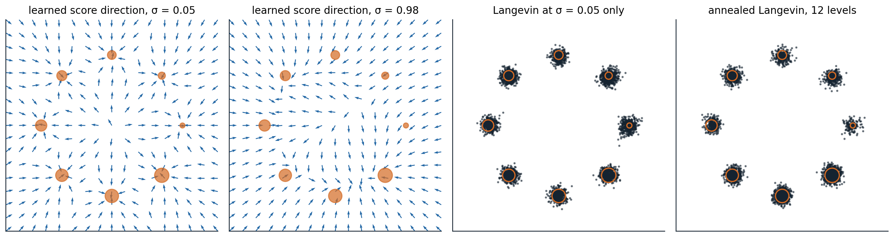

[Background Notes](../README.md) › [Generative AI](README.md)

# 6. Energy-Based Models and Score Matching

[← 5. Generative Adversarial Networks](05-generative-adversarial-networks.md) · [7. Denoising Diffusion Models →](07-denoising-diffusion-models.md)

## <a id="energy-based-models"></a>Energy-based models

### <a id="unnormalized-densities"></a>Unnormalized densities

The most flexible way to define a distribution with a network is to let the network assign a number to every input and make low numbers likely. An **energy-based model** (EBM) sets

```math
p_\theta(x)=\frac{e^{-E_\theta(x)}}{Z_\theta},\qquad Z_\theta=\int e^{-E_\theta(x)}\,dx,
```

where the **energy** $`E_\theta`$ can be any network with a scalar output ([LeCun et al., 2006](http://yann.lecun.com/exdb/publis/pdf/lecun-06.pdf)). There is no constraint of invertibility, no ordering of dimensions, and no latent variable to infer. Markov networks are energy-based models whose energy is a sum of potentials ([AI chapter 8](../ai/08-bayesian-networks-and-markov-networks.md#markov-networks)), and the Boltzmann machine of 1985 was one over binary units with pairwise interactions. The price of this flexibility is the **partition function** $`Z_\theta`$, an integral over the whole space that cannot be computed for any interesting energy. Without it, the density cannot be evaluated, samples cannot be drawn directly, and even comparing $`p_\theta(x)`$ with $`p_\theta(x')`$ requires only the energy difference, which is all one can get.

### <a id="the-maximum-likelihood-gradient"></a>The maximum-likelihood gradient

The log-likelihood is $`-E_\theta(x)-\log Z_\theta`$, and its gradient, although $`Z_\theta`$ is unknown, has a simple form:

```math
\nabla_\theta\log p_\theta(x)=-\nabla_\theta E_\theta(x)+\mathbb E_{x'\sim p_\theta}\bigl[\nabla_\theta E_\theta(x')\bigr]
```

([Appendix A](#block-gen06-appendix-a)). The first term, the **positive phase**, lowers the energy of the data; the second, the **negative phase**, raises the energy of the model's own samples. At the optimum, the two balance: the model's samples and the data have the same expected energy gradient, the moment matching of log-linear models ([AI chapter 14](../ai/14-learning-graphical-models.md#log-linear-models-and-the-moment-matching-gradient)). The difficulty has moved from the partition function to the negative phase, which needs samples from the model at every training step, and the model can only be sampled by Markov chain Monte Carlo.

### <a id="sampling-with-langevin-dynamics"></a>Sampling with Langevin dynamics

For continuous data, the natural sampler follows the gradient of the log-density with added noise. The **Langevin** update

```math
x_{k+1}=x_k+\frac\epsilon2\nabla_x\log p_\theta(x_k)+\sqrt\epsilon\,\xi_k,\qquad\xi_k\sim\mathcal N(0,I),
```

is a discretized diffusion whose stationary distribution is $`p_\theta`$ as $`\epsilon\to0`$, and it needs only $`\nabla_x\log p_\theta=-\nabla_xE_\theta`$, in which the partition function has disappeared. With a finite step size it is slightly biased, which a Metropolis–Hastings correction removes ([AI chapter 10](../ai/10-approximate-inference.md#metropolishastings); [Roberts and Tweedie, 1996](https://doi.org/10.2307/3318418)). The same update with stochastic gradients of a posterior is a method for Bayesian learning ([Welling and Teh, 2011](https://icml.cc/2011/papers/398_icmlpaper.pdf)).

Running a chain to convergence at every training step is too expensive, so EBM training uses short chains. **Contrastive divergence** starts each chain at a training example and runs a single step, or a few ([Hinton, 2002](https://doi.org/10.1162/089976602760128018)), which trained restricted Boltzmann machines well enough to pretrain the first deep networks ([Hinton, Osindero, and Teh, 2006](https://doi.org/10.1162/neco.2006.18.7.1527)); **persistent contrastive divergence** keeps the chains running across parameter updates instead of restarting them ([Tieleman, 2008](https://doi.org/10.1145/1390156.1390290)). For images, EBMs with convolutional energies trained with Langevin chains and a replay buffer of past samples ([Du and Mordatch, 2019](https://arxiv.org/abs/1903.08689)), or with short chains from noise that never converge ([Nijkamp et al., 2019](https://arxiv.org/abs/1904.09770)), generated recognizable images, but their training was unstable and their samples lagged behind those of other families.

### <a id="why-langevin-sampling-struggles"></a>Why Langevin sampling struggles

Langevin dynamics explores by following local gradients, and it inherits the weaknesses of every local sampler. Chains cross the low-density regions between modes rarely, so their samples reflect where they started rather than how much mass each mode holds. The problem is worse than slow mixing: in a region where one mode dominates, the score of a mixture is almost exactly the score of that mode alone, so the gradient carries almost no information about the relative weights of separated modes ([Song and Ermon, 2019](https://arxiv.org/abs/1907.05600); [Appendix C](#block-gen06-appendix-c)). The code samples a known mixture that puts 80% of its mass in the left mode, using its exact score.

```python
import numpy as np

rng = np.random.default_rng(0)
# Target: 0.8 N(-4, 0.5^2) + 0.2 N(4, 0.5^2). Its score is known in closed form, at any added noise level sigma:
# the noisy density is the same mixture with variance 0.5^2 + sigma^2.
w, m, s = np.array([0.8, 0.2]), np.array([-4.0, 4.0]), 0.5


def score(x, sigma=0.0):
    v = s ** 2 + sigma ** 2
    comp = w * np.exp(-(x[:, None] - m) ** 2 / (2 * v))  # unnormalized responsibilities (equal variances)
    r = comp / comp.sum(1, keepdims=True)
    return (r * (m - x[:, None]) / v).sum(1)


def langevin(x, sigma, eps, steps):
    for _ in range(steps):
        x = x + 0.5 * eps * score(x, sigma) + np.sqrt(eps) * rng.standard_normal(len(x))
    return x


x0 = rng.uniform(-8, 8, 5000)                             # chains start spread over both modes
plain = langevin(x0.copy(), 0.0, 0.01, 2000)
print(f"plain Langevin, 2,000 steps:  share of samples in the left mode {np.mean(plain < 0):.3f} (target 0.800)")

x = x0.copy()                                             # annealed: large noise first, then smaller
sigmas = np.geomspace(10, 0.01, 20)
for sigma in sigmas:                                      # step size proportional to the noisy variance
    x = langevin(x, sigma, 0.2 * (s ** 2 + sigma ** 2), 100)
print(f"annealed Langevin, 20 levels: share of samples in the left mode {np.mean(x < 0):.3f}")
print(f"annealed samples: mean {x[x < 0].mean():.2f} and sd {x[x < 0].std():.2f} in the left mode (target -4.00, 0.50)")
# plain Langevin, 2,000 steps:  share of samples in the left mode 0.505 (target 0.800)
# annealed Langevin, 20 levels: share of samples in the left mode 0.785
# annealed samples: mean -4.00 and sd 0.51 in the left mode (target -4.00, 0.50)
```

After 2,000 steps from starting points spread evenly over both modes, the chains still split evenly between the modes, 50.5% on the left instead of 80%, although every chain has settled into the correct shape of its mode. The fix, which the second half of the code applies, uses the scores of **noisy** versions of the distribution. With a large amount of added Gaussian noise, the two modes blur into one broad distribution whose score does reflect the weights; as the noise is reduced in stages, each chain is guided into the mode that the larger-noise distribution assigned it. This **annealed Langevin dynamics** puts 78.5% of samples in the left mode, with the right mean and spread. Noise is what makes the score informative, and it is the idea on which the rest of this chapter and chapters 7–9 are built.

### <a id="noise-contrastive-estimation"></a>Noise-contrastive estimation

A different way around the partition function is to avoid sampling from the model at all. **Noise-contrastive estimation** (NCE; [Gutmann and Hyvärinen, 2010](https://proceedings.mlr.press/v9/gutmann10a.html)) trains a logistic regression to distinguish data from samples of a known noise distribution $`q`$, using $`\log p_\theta(x)-\log q(x)`$ as the classifier's logit, with $`\log Z_\theta`$ treated as one more parameter. Since the optimal logit is the true log ratio ([chapter 1](01-foundations-of-generative-modeling.md#classifiers-as-density-ratio-estimators)), the fitted model is the data density, normalized. It works when the noise is close enough to the data that the classification is hard; in high dimensions a simple noise distribution is too easy to tell apart, and the classifier learns little. The negative sampling used to train word vectors is a simplified version ([NLP chapter 3](../nlp-llms/03-word-embeddings.md#negative-sampling)).

## <a id="score-matching"></a>Score matching

### <a id="the-score-function"></a>The score function

The **score** of a distribution is the gradient of its log-density with respect to the data, $`s(x)=\nabla_x\log p(x)`$, a vector field that points toward higher density. For an energy-based model it is $`-\nabla_xE_\theta(x)`$, independent of the partition function. The score determines the distribution on a connected domain, since integrating it recovers $`\log p`$ up to the constant fixed by normalization, and it is all that Langevin dynamics needs. So instead of modeling the density, one can model the score directly with a network $`s_\theta:\mathbb R^D\to\mathbb R^D`$, and fit it by minimizing the **Fisher divergence**,

```math
\frac12\,\mathbb E_{p_{\mathrm{data}}}\bigl\|s_\theta(x)-\nabla_x\log p_{\mathrm{data}}(x)\bigr\|^2 .
```

The target score is unknown, since estimating it is the whole problem, but the objective can be rewritten without it.

### <a id="hyvarinen-s-score-matching"></a>Hyvärinen's score matching

Integrating by parts, and assuming the density vanishes at infinity, the Fisher divergence equals, up to a constant,

```math
\mathbb E_{p_{\mathrm{data}}}\Bigl[\operatorname{tr}\bigl(\nabla_xs_\theta(x)\bigr)+\frac12\|s_\theta(x)\|^2\Bigr],
```

which involves only the model and the data ([Hyvärinen, 2005](https://jmlr.org/papers/v6/hyvarinen05a.html); [Appendix B](#block-gen06-appendix-b)). The estimator is consistent, but the trace of the Jacobian costs $`D`$ backward passes, as in continuous flows ([chapter 4](04-normalizing-flows.md#continuous-time-flows)). **Sliced score matching** replaces the trace with $`v^\top\nabla_xs_\theta\,v`$ for random directions $`v`$, the same random-projection trick as Hutchinson's estimator ([Song et al., 2019](https://arxiv.org/abs/1905.07088)).

### <a id="denoising-score-matching"></a>Denoising score matching

A cheaper route comes from denoising. Perturb each data point with Gaussian noise, $`\tilde x=x+\sigma\epsilon`$ with $`\epsilon\sim\mathcal N(0,I)`$. The score of the conditional distribution of $`\tilde x`$ given $`x`$ is known exactly, $`\nabla_{\tilde x}\log q_\sigma(\tilde x\mid x)=-(\tilde x-x)/\sigma^2=-\epsilon/\sigma`$, and [Vincent (2011)](https://doi.org/10.1162/NECO_a_00142) showed that regressing a network onto it,

```math
\mathbb E_{x,\epsilon}\Bigl\|s_\theta(x+\sigma\epsilon)+\frac\epsilon\sigma\Bigr\|^2,
```

has the same minimizer as matching the score of the noisy data distribution $`p_\sigma=p_{\mathrm{data}}*\mathcal N(0,\sigma^2I)`$ ([Appendix B](#block-gen06-appendix-b)). **Denoising score matching** needs one forward pass per example and no Jacobian. Its target is the noise itself, scaled: the network learns to predict which way the added noise pushed each point, which is the denoising autoencoder's task ([DL chapter 10](../dl/10-self-supervised-representation-learning.md#denoising-and-other-regularized-autoencoders)). The connection is exact in the other direction as well: **Tweedie's formula** gives the best denoiser in terms of the noisy score,

```math
\mathbb E[x\mid\tilde x]=\tilde x+\sigma^2\nabla_{\tilde x}\log p_\sigma(\tilde x)
```

([Efron, 2011](https://doi.org/10.1198/jasa.2011.tm11181)), so learning to denoise and learning the score of noisy data are the same problem. The code learns the score of eight Gaussians on a circle, blurred with noise of standard deviation 0.3, compares it with the exact score, and uses it to denoise.

```python
import numpy as np
import torch
from torch import nn

torch.manual_seed(0)
# Data: eight Gaussians (sd 0.1) on a circle of radius 2. Noise level for denoising score matching: sigma = 0.3.
angles = torch.arange(8) * (2 * np.pi / 8)
centers = torch.stack([torch.cos(angles), torch.sin(angles)], 1) * 2.0
sd, sigma = 0.1, 0.3
data = lambda n: centers[torch.randint(8, (n,))] + sd * torch.randn(n, 2)


def true_score(x, var):                                   # score of the mixture with component variance var
    logits = -((x[:, None, :] - centers) ** 2).sum(-1) / (2 * var)
    r = torch.softmax(logits, 1)
    return (r[:, :, None] * (centers - x[:, None, :])).sum(1) / var


net = nn.Sequential(nn.Linear(2, 128), nn.SiLU(), nn.Linear(128, 128), nn.SiLU(), nn.Linear(128, 2))
opt = torch.optim.Adam(net.parameters(), lr=1e-3)
for step in range(4000):
    x = data(512)
    noise = torch.randn_like(x)
    x_noisy = x + sigma * noise
    # Denoising score matching: regress the score onto -(x_noisy - x) / sigma^2 = -noise / sigma.
    loss = ((net(x_noisy) + noise / sigma) ** 2).sum(1).mean() * sigma ** 2
    opt.zero_grad()
    loss.backward()
    opt.step()

with torch.no_grad():
    var = sd ** 2 + sigma ** 2                            # the noisy data are the same mixture, wider
    box = 8 * torch.rand(20000, 2) - 4
    for name, pts in [("at noisy data points", data(5000) + sigma * torch.randn(5000, 2)),
                      ("inside the circle, radius < 1", box[box.norm(dim=1) < 1]),
                      ("outside, radius > 3.5", box[box.norm(dim=1) > 3.5])]:
        err = (net(pts) - true_score(pts, var)).norm(dim=1) / true_score(pts, var).norm(dim=1)
        print(f"relative error of the learned score {name:30s}: median {err.median():.3f}")
    x = data(5000)
    x_noisy = x + sigma * torch.randn_like(x)
    denoised = x_noisy + sigma ** 2 * net(x_noisy)       # Tweedie: E[x | x_noisy] = x_noisy + sigma^2 score
    best = x_noisy + sigma ** 2 * true_score(x_noisy, var)
    print(f"mean squared distance to the clean points: noisy {((x_noisy - x) ** 2).sum(1).mean():.4f}, "
          f"denoised with the learned score {((denoised - x) ** 2).sum(1).mean():.4f}, "
          f"with the exact score {((best - x) ** 2).sum(1).mean():.4f}")
# relative error of the learned score at noisy data points          : median 0.083
# relative error of the learned score inside the circle, radius < 1 : median 0.198
# relative error of the learned score outside, radius > 3.5         : median 0.061
# mean squared distance to the clean points: noisy 0.1798, denoised with the learned score 0.0434, with the exact score 0.0419
```

At noisy data points the learned score is within about 8% of the exact one. Inside the circle, where no data fall and the true score turns sharply between competing modes, its error is more than twice as large, about 20%; outside, where the score simply points back toward the nearest mode, the network extrapolates well. Applying Tweedie's formula with the learned score reduces the mean squared distance to the clean points from 0.180, the noise's variance times two dimensions, to 0.043, nearly the 0.042 that the exact score achieves, which is the best any denoiser can do on average.

## <a id="noise-conditional-score-networks"></a>Noise-conditional score networks

### <a id="why-one-noise-level-is-not-enough"></a>Why one noise level is not enough

A single noise level forces a compromise. Small noise gives a score close to that of the data, but the data are concentrated near a thin set ([chapter 1](01-foundations-of-generative-modeling.md#why-high-dimensions-are-hard)), so the noisy data leave most of the space empty and the score there is learned from nothing; the score of the clean data is not even defined off the data manifold. Large noise fills the space and makes the score easy to learn everywhere, but it describes a blurred distribution. And as the code showed, Langevin dynamics with the score of the nearly clean distribution cannot find the right proportions of separated modes.

**Noise-conditional score networks** (NCSN; [Song and Ermon, 2019](https://arxiv.org/abs/1907.05600)) use many noise levels at once. One network $`s_\theta(x,\sigma)`$ takes the noise level as an input and is trained by denoising score matching at every level of a geometric sequence $`\sigma_1>\sigma_2>\dots>\sigma_L`$, with the loss at level $`\sigma`$ weighted by $`\sigma^2`$ so that all levels contribute comparably. Sampling runs annealed Langevin dynamics: a few steps with the score at $`\sigma_1`$, starting from noise, then a few at $`\sigma_2`$ from where those ended, and so on down to $`\sigma_L`$, with the step size shrinking in proportion to $`\sigma^2`$. The large-noise stages move samples across the space and apportion them among the modes; the small-noise stages refine them. With ten noise levels from 1 down to 0.01, NCSN reached an Inception score of 8.87 on CIFAR-10, then the best for unconditional generation, and an improved version with a largest noise level as large as the greatest distance between training images generated faces and scenes at up to $`256\times256`$ ([Song and Ermon, 2020](https://arxiv.org/abs/2006.09011)). The figure trains a small noise-conditional score network on eight modes of unequal weight.



*A noise-conditional score network trained by denoising score matching at 12 noise levels from 3 down to 0.05 on eight Gaussians (standard deviation 0.1) whose weights grow from 1/36 at the right, counterclockwise, to 8/36 at the lower right; orange disks are sized by weight. First two panels: the direction of the learned score on a grid at σ = 0.05, where each arrow points to the nearest mode, and at σ = 0.98, where the field pulls toward the heavier modes of the lower half. Last two panels: 4,000 samples from uniform starting points, by Langevin dynamics with the smallest-noise score alone (1,200 steps) and by annealed Langevin dynamics (100 steps per level). Both put 96.5% of samples near a mode, but plain Langevin gives each mode nearly the same share, a total-variation distance of 0.223 from the true weights, while annealing reduces it to 0.074.*

### <a id="from-noise-levels-to-diffusion"></a>From noise levels to diffusion

A noise-conditional score network is a diffusion model in all but name. Chapter 7 arrives at the same model from a different direction, as a latent-variable model that learns to reverse a gradual noising process, and shows that its training objective is denoising score matching summed over noise levels with a particular weighting. Chapter 8 then takes the number of noise levels to infinity: the noising becomes a stochastic differential equation, annealed Langevin dynamics becomes the reverse-time equation, and a deterministic version of the sampler turns the score model into a continuous normalizing flow with exact likelihoods. Energy-based models themselves remain useful where an explicit, composable energy matters, for example adding the energies of several models to combine their constraints, and a trained classifier can be read as an energy-based model of its inputs ([Grathwohl et al., 2020](https://arxiv.org/abs/1912.03263)).

## <a id="appendices"></a>Appendices


<details>
<summary><a id="block-gen06-appendix-a"></a><b>A. The likelihood gradient of an energy-based model and the Langevin stationary distribution</b></summary>


**Gradient.** Differentiating $`\log Z_\theta=\log\int e^{-E_\theta(x)}dx`$ under the integral sign,

```math
\nabla_\theta\log Z_\theta=\frac{\int-\nabla_\theta E_\theta(x)\,e^{-E_\theta(x)}\,dx}{Z_\theta}=-\mathbb E_{p_\theta}\bigl[\nabla_\theta E_\theta(x)\bigr],
```

so $`\nabla_\theta\log p_\theta(x)=-\nabla_\theta E_\theta(x)+\mathbb E_{p_\theta}[\nabla_\theta E_\theta]`$. Averaged over the data, the gradient vanishes when the expected energy gradient under the data equals that under the model. A Monte Carlo estimate of the second term with samples from a chain that has not converged gives a biased gradient, which is what contrastive divergence accepts in exchange for speed.

**Langevin dynamics.** The update is the Euler–Maruyama discretization of the stochastic differential equation $`dx=\frac12\nabla\log p(x)\,dt+dW`$. Its density $`\rho_t`$ evolves by the Fokker–Planck equation $`\partial_t\rho=-\nabla\cdot\bigl(\rho\,\tfrac12\nabla\log p\bigr)+\tfrac12\Delta\rho`$. Substituting $`\rho=p`$ gives $`-\tfrac12\nabla\cdot(p\nabla\log p)+\tfrac12\Delta p=-\tfrac12\nabla\cdot\nabla p+\tfrac12\Delta p=0`$, so $`p`$ is stationary. Under mild conditions it is the unique stationary distribution and the process converges to it, at a rate governed by how easily it crosses between regions of high density.

</details>


<details>
<summary><a id="block-gen06-appendix-b"></a><b>B. Score matching, denoising score matching, and Tweedie's formula</b></summary>


**Integration by parts.** Expand $`\frac12\mathbb E_p\|s_\theta-\nabla\log p\|^2=\frac12\mathbb E_p\|s_\theta\|^2-\mathbb E_p[s_\theta^\top\nabla\log p]+C`$. The cross term is $`\int s_\theta^\top\nabla p\,dx=-\int p\,\nabla\cdot s_\theta\,dx`$ when $`p\,s_\theta\to0`$ at infinity, which gives $`\mathbb E_p\bigl[\operatorname{tr}(\nabla s_\theta)+\frac12\|s_\theta\|^2\bigr]+C`$.

**Denoising.** Let $`p_\sigma(\tilde x)=\int p(x)q(\tilde x\mid x)\,dx`$. The noisy score is $`\nabla\log p_\sigma(\tilde x)=\mathbb E\bigl[\nabla_{\tilde x}\log q(\tilde x\mid x)\,\big|\,\tilde x\bigr]`$, since $`\nabla p_\sigma=\int p(x)\,q\,\nabla\log q\,dx`$. The denoising objective $`\mathbb E_{x,\tilde x}\|s_\theta(\tilde x)-\nabla\log q(\tilde x\mid x)\|^2`$ is a regression whose minimizer is the conditional mean of the target given $`\tilde x`$, which is the noisy score; it differs from $`\mathbb E_{\tilde x}\|s_\theta(\tilde x)-\nabla\log p_\sigma(\tilde x)\|^2`$ by a constant, the variance of the target around its conditional mean.

**Tweedie.** For Gaussian noise, $`\nabla_{\tilde x}\log q=-(\tilde x-x)/\sigma^2`$, so the noisy score is $`-(\tilde x-\mathbb E[x\mid\tilde x])/\sigma^2`$, and rearranging gives $`\mathbb E[x\mid\tilde x]=\tilde x+\sigma^2\nabla\log p_\sigma(\tilde x)`$. The minimum-mean-squared-error denoiser and the score of the noisy distribution determine each other, so a network trained to predict the noise, the clean data, or the score learns the same thing in different units, a fact chapter 7 uses to move between them.

</details>


<details>
<summary><a id="block-gen06-appendix-c"></a><b>C. Why the score ignores the weights of separated modes</b></summary>


Let $`p(x)=w\,p_1(x)+(1-w)\,p_2(x)`$. Its score is

```math
\nabla\log p(x)=r_1(x)\nabla\log p_1(x)+r_2(x)\nabla\log p_2(x),\qquad r_1(x)=\frac{w\,p_1(x)}{p(x)},
```

a weighted average of the components' scores with the posterior responsibilities as weights. If $`p_1`$ and $`p_2`$ have nearly disjoint supports, then $`r_1(x)\approx1`$ wherever $`p_1`$ dominates and $`\approx0`$ wherever $`p_2`$ does, whatever $`w`$ is, so the score in each region equals that region's component score and $`w`$ affects it only in the thin region between the modes, where the density is too low for chains to visit. Langevin dynamics started in each region therefore samples that component, and the fraction of chains in each mode stays close to the fraction that started there. Adding Gaussian noise of variance $`\sigma^2`$ widens both components until they overlap; then $`r_1`$ varies smoothly with $`x`$, the score depends on $`w`$ across the space, and chains distribute themselves according to the weights before the noise is reduced.

</details>

---

[← 5. Generative Adversarial Networks](05-generative-adversarial-networks.md) · [7. Denoising Diffusion Models →](07-denoising-diffusion-models.md)
