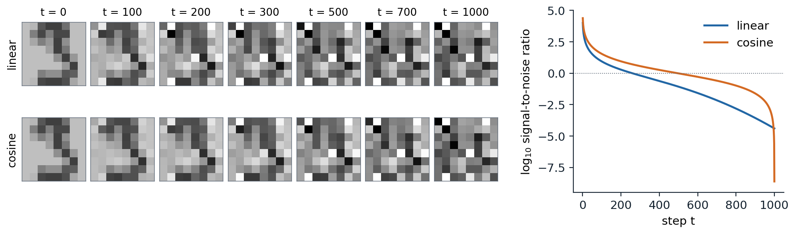
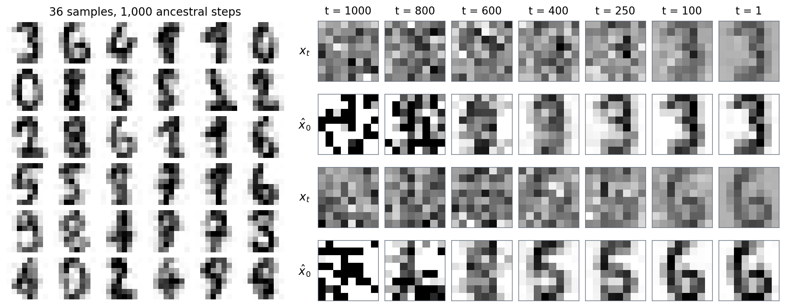

[ML Mastery Notes](../README.md) › [Generative AI](README.md)

# 7. Denoising Diffusion Models

[← 6. Energy-Based Models and Score Matching](06-energy-based-models-and-score-matching.md) · [8. Diffusion SDEs and Fast Sampling →](08-diffusion-sdes-and-fast-sampling.md)

## <a id="the-forward-process"></a>The forward process

### <a id="destroying-data-gradually"></a>Destroying data gradually

A **diffusion model** generates data by learning to undo a process that destroys it. The destruction is fixed and simple: starting from a data point $`x_0`$, a Markov chain adds a little Gaussian noise at each of $`T`$ steps,

$$
q(x_t\mid x_{t-1})=\mathcal N\bigl(x_t;\ \sqrt{1-\beta_t}\,x_{t-1},\ \beta_tI\bigr),\qquad t=1,\dots,T,
$$

with small variances $`\beta_1,\dots,\beta_T`$ called the **noise schedule**. Scaling by $`\sqrt{1-\beta_t}`$ keeps the variance from growing: if $`x_{t-1}`$ has unit variance, so does $`x_t`$. After enough steps nothing of $`x_0`$ remains, and $`x_T`$ is a standard Gaussian whatever the data were. Generation runs the chain backward: draw $`x_T`$ from the Gaussian and remove the noise one step at a time, with a network trained to predict what each step added. [Sohl-Dickstein et al. (2015)](https://arxiv.org/abs/1503.03585) proposed the idea, inspired by nonequilibrium thermodynamics, and used $`T=1000`$ steps for most image experiments; their samples were far from competitive. [Ho, Jain, and Abbeel (2020)](https://arxiv.org/abs/2006.11239) revived it as **denoising diffusion probabilistic models** (DDPM), with a reparameterization that turned training into denoising and connected it to the score models of chapter 6, and obtained the best FID then reported for unconditional generation on CIFAR-10.

Seen as a latent-variable model, a diffusion model is a hierarchical VAE with $`T`$ layers of latents $`x_1,\dots,x_T`$, each of the same dimension as the data, whose encoder is not learned: it is the noising chain (chapter 3). Fixing the encoder removes the problems that make deep VAEs hard to train, such as posterior collapse, and the price is paid in the number of steps needed to generate.

### <a id="jumping-to-any-step"></a>Jumping to any step

Because a sum of independent Gaussians is Gaussian, the noisy version at any step can be sampled from $`x_0`$ directly. With $`\alpha_t=1-\beta_t`$ and $`\bar\alpha_t=\prod_{s\le t}\alpha_s`$,

$$
q(x_t\mid x_0)=\mathcal N\bigl(x_t;\ \sqrt{\bar\alpha_t}\,x_0,\ (1-\bar\alpha_t)I\bigr),\qquad\text{that is,}\qquad x_t=\sqrt{\bar\alpha_t}\,x_0+\sqrt{1-\bar\alpha_t}\,\epsilon,\quad\epsilon\sim\mathcal N(0,I)
$$

([Appendix A](#block-gen07-appendix-a)). The data are shrunk toward zero by $`\sqrt{\bar\alpha_t}`$ and mixed with noise of variance $`1-\bar\alpha_t`$, and the two coefficients have squares summing to one. This closed form is what makes training cheap: a training example at step $`t`$ costs one draw of $`\epsilon`$, not $`t`$ steps of the chain. The code checks it against the chain itself.

```python
import numpy as np

T = 1000
schedules = {"linear": np.linspace(1e-4, 0.02, T)}                  # beta_t of Ho et al. (2020)
s = 0.008                                                            # cosine schedule of Nichol and Dhariwal (2021)
f = np.cos((np.arange(T + 1) / T + s) / (1 + s) * np.pi / 2) ** 2
schedules["cosine"] = np.clip(1 - f[1:] / f[:-1], 0, 0.999)

rng = np.random.default_rng(0)
x0 = rng.uniform(-1, 1, 64)                                          # any data vector in [-1, 1]^64
for name, beta in schedules.items():
    abar = np.cumprod(1 - beta)
    # One jump with the closed form matches running the chain step by step, in distribution:
    x, n = np.tile(x0, (2000, 1)), 400
    for t in range(n):
        x = np.sqrt(1 - beta[t]) * x + np.sqrt(beta[t]) * rng.standard_normal(x.shape)
    slope = x.mean(0) @ x0 / (x0 @ x0)                               # least-squares fit of the mean to x0
    print(f"{name:6s}: after {n} steps, mean = {slope:.3f} x0 (closed form {np.sqrt(abar[n - 1]):.3f}), "
          f"variance {x.var(0).mean():.3f} (closed form {1 - abar[n - 1]:.3f})")
    snr = abar / (1 - abar)
    print("        log10 signal-to-noise ratio at t = 1, 250, 500, 750, 1000: "
          + ", ".join(f"{np.log10(snr[t - 1]):+.1f}" for t in [1, 250, 500, 750, 1000]))
# linear: after 400 steps, mean = 0.439 x0 (closed form 0.442), variance 0.804 (closed form 0.805)
#         log10 signal-to-noise ratio at t = 1, 250, 500, 750, 1000: +4.0, +0.0, -1.1, -2.5, -4.4
# cosine: after 400 steps, mean = 0.802 x0 (closed form 0.805), variance 0.353 (closed form 0.353)
#         log10 signal-to-noise ratio at t = 1, 250, 500, 750, 1000: +4.4, +0.7, -0.0, -0.8, -8.6
```

After 400 steps of the chain, the mean of 2,000 simulated trajectories is the starting vector scaled by the predicted factor and the variance is the predicted one, for both schedules. The two schedules, however, spend their steps very differently.

### <a id="noise-schedules-and-the-signal-to-noise-ratio"></a>Noise schedules and the signal-to-noise ratio

What matters about a schedule is how fast it destroys information, which the **signal-to-noise ratio** measures,

$$
\operatorname{SNR}(t)=\frac{\bar\alpha_t}{1-\bar\alpha_t},
$$

the ratio of the variance of the signal to that of the noise in $`x_t`$, for data of unit variance. It decreases from very large at $`t=1`$ to nearly zero at $`t=T`$. DDPM used a **linear schedule**, $`\beta_t`$ rising linearly from $`10^{-4}`$ to $`0.02`$ over $`T=1000`$ steps, chosen to keep the steps small while making the final signal-to-noise ratio so small that $`x_T`$ is indistinguishable from pure noise: the gap costs about $`10^{-5}`$ bits per dimension. [Nichol and Dhariwal (2021)](https://arxiv.org/abs/2102.09672) observed that with this schedule the end of the forward process is too noisy to contribute much, and that a trained model loses little in sample quality when the last 20% of its reverse steps are skipped. Their **cosine schedule** sets

$$
\bar\alpha_t=\frac{f(t)}{f(0)},\qquad f(t)=\cos^2\Bigl(\frac{t/T+s}{1+s}\cdot\frac\pi2\Bigr),\qquad s=0.008,
$$

with each $`\beta_t`$ clipped at 0.999, so that $`\log\operatorname{SNR}`$ falls roughly linearly through the middle of the process and the steps are spread more evenly over the noise levels at which the image is still recognizable. In the code, the linear schedule reaches equal signal and noise, $`\log_{10}\operatorname{SNR}=0`$, a quarter of the way through, at $`t=250`$, and spends the remaining 750 steps below it; the cosine schedule reaches it halfway.



*Left: one $`8\times8`$ digit from the held-out set, noised to steps 100 through 1000 with the same draw of $`\epsilon`$ under each schedule; the gray scale runs from −2 to 2, so the clean digit, in $`[-1,1]`$, looks faded. With the linear schedule, the digit is barely visible at $`t=300`$; with the cosine schedule, it survives to about $`t=500`$. Right: $`\log_{10}`$ of the signal-to-noise ratio. The linear schedule falls quickly early and ends at $`10^{-4.4}`$; the cosine schedule falls slowly until the end, where its last clipped step takes it to $`10^{-8.6}`$.*

The best schedule depends on the data. Neighboring pixels of a large image are strongly correlated, so averaging them recovers the signal from noise that would destroy a small image, and the same per-pixel schedule leaves a high-resolution image recognizable much longer; the schedules of chapter 11 shift toward more noise as the resolution grows. The final signal-to-noise ratio also matters. Neither schedule reaches exactly zero, and with the scaled linear schedule used by Stable Diffusion, $`\sqrt{\bar\alpha_T}=0.068`$, enough of the mean brightness of the image survives in $`x_T`$ that a model trained with it, which always starts sampling from pure noise, cannot generate very dark or very bright images ([Lin et al., 2024](https://arxiv.org/abs/2305.08891)).

## <a id="learning-to-reverse-the-process"></a>Learning to reverse the process

### <a id="reversing-small-steps"></a>Reversing small steps

To generate, one needs the reverse conditionals $`q(x_{t-1}\mid x_t)`$. These depend on the whole data distribution and are intractable, but for small $`\beta_t`$ they are nearly Gaussian: the reversal of a diffusion with small steps has the same functional form as the diffusion itself, a classical result of William Feller from 1949 on which Sohl-Dickstein et al. built. The reason is that, as a function of $`x_{t-1}`$, the forward step $`q(x_t\mid x_{t-1})`$ is a Gaussian of width $`\sqrt{\beta_t}`$, and over so small a region the density of $`x_{t-1}`$ is nearly log-linear; multiplying a Gaussian by the exponential of a linear function gives a Gaussian shifted along the gradient. To first order in $`\beta_t`$,

$$
q(x_{t-1}\mid x_t)\approx\mathcal N\Bigl(x_{t-1};\ \frac{x_t+\beta_t\nabla\log q_t(x_t)}{\sqrt{\alpha_t}},\ \beta_tI\Bigr),
$$

where $`q_t`$ is the marginal density of $`x_t`$ ([Appendix A](#block-gen07-appendix-a)). Each reverse step rescales, moves by $`\beta_t`$ times the score of the noisy data, and adds fresh noise, a step of Langevin dynamics. The model therefore takes the reverse conditionals to be Gaussian,

$$
p_\theta(x_{t-1}\mid x_t)=\mathcal N\bigl(x_{t-1};\ \mu_\theta(x_t,t),\ \sigma_t^2I\bigr),\qquad p(x_T)=\mathcal N(0,I),
$$

with a mean computed by a network that receives the step $`t`$ as an input and a variance $`\sigma_t^2`$ fixed by the schedule.

Although $`q(x_{t-1}\mid x_t)`$ is intractable, it becomes tractable once $`x_0`$ is known. The **forward posterior** is Gaussian,

$$
q(x_{t-1}\mid x_t,x_0)=\mathcal N\bigl(x_{t-1};\ \tilde\mu_t(x_t,x_0),\ \tilde\beta_tI\bigr),\qquad\tilde\mu_t=\frac{\sqrt{\bar\alpha_{t-1}}\,\beta_t}{1-\bar\alpha_t}\,x_0+\frac{\sqrt{\alpha_t}\,(1-\bar\alpha_{t-1})}{1-\bar\alpha_t}\,x_t,\qquad\tilde\beta_t=\frac{1-\bar\alpha_{t-1}}{1-\bar\alpha_t}\,\beta_t,
$$

an interpolation between the noisy point and the clean one with a variance slightly smaller than $`\beta_t`$ ([Appendix A](#block-gen07-appendix-a)). The true reverse conditional is its average over the clean images that could have produced $`x_t`$, and the training objective compares the model with it.

### <a id="the-variational-bound"></a>The variational bound

Maximum likelihood needs $`p_\theta(x_0)=\int p_\theta(x_{0:T})\,dx_{1:T}`$, an integral over all trajectories. As for any latent-variable model, the evidence lower bound with the forward chain as the approximate posterior replaces it (chapter 3), and rewriting the forward steps with the forward posterior turns the bound into a sum of one term per step ([Appendix B](#block-gen07-appendix-b)):

$$
-\log p_\theta(x_0)\le\underbrace{D_{\mathrm{KL}}\bigl(q(x_T\mid x_0)\,\|\,p(x_T)\bigr)}_{L_T}+\sum_{t=2}^T\underbrace{\mathbb E_q\,D_{\mathrm{KL}}\bigl(q(x_{t-1}\mid x_t,x_0)\,\|\,p_\theta(x_{t-1}\mid x_t)\bigr)}_{L_{t-1}}\ \underbrace{-\ \mathbb E_q\log p_\theta(x_0\mid x_1)}_{L_0}.
$$

The first term has no parameters and is nearly zero for a good schedule. Each middle term is a KL divergence between two Gaussians, available in closed form, so the bound is estimated without simulating the chain: draw $`x_0`$, a step $`t`$, and $`x_t`$ from the closed form, and evaluate one term. The last term is the likelihood of the data under the final denoising step; for images of 8-bit pixels, DDPM made it a discrete distribution over the 256 intensities, so that the bound is a bound on a codelength in bits.

### <a id="predicting-the-noise"></a>Predicting the noise

With the variance fixed, the KL divergence at step $`t`$ is a squared distance between the means, $`L_{t-1}=\mathbb E\,\|\tilde\mu_t-\mu_\theta\|^2/2\sigma_t^2`$ up to a constant. Substituting $`x_0=(x_t-\sqrt{1-\bar\alpha_t}\,\epsilon)/\sqrt{\bar\alpha_t}`$ into the forward posterior mean gives

$$
\tilde\mu_t=\frac1{\sqrt{\alpha_t}}\Bigl(x_t-\frac{\beta_t}{\sqrt{1-\bar\alpha_t}}\,\epsilon\Bigr),
$$

so the network needs only to predict the noise $`\epsilon`$ that was added, from $`x_t`$ and $`t`$. With the same form for the model, $`\mu_\theta=\bigl(x_t-\beta_t\,\epsilon_\theta(x_t,t)/\sqrt{1-\bar\alpha_t}\bigr)/\sqrt{\alpha_t}`$, each term of the bound becomes a weighted regression on the noise,

$$
L_{t-1}=\frac{\beta_t^2}{2\sigma_t^2\,\alpha_t\,(1-\bar\alpha_t)}\,\mathbb E_{x_0,\epsilon}\bigl\|\epsilon-\epsilon_\theta\bigl(\sqrt{\bar\alpha_t}\,x_0+\sqrt{1-\bar\alpha_t}\,\epsilon,\ t\bigr)\bigr\|^2.
$$

Ho et al. found that dropping the weights gave better samples. Their **simplified loss**

$$
L_{\text{simple}}=\mathbb E_{t\sim\mathcal U\{1,\dots,T\},\ x_0,\ \epsilon}\bigl\|\epsilon-\epsilon_\theta\bigl(\sqrt{\bar\alpha_t}\,x_0+\sqrt{1-\bar\alpha_t}\,\epsilon,\ t\bigr)\bigr\|^2
$$

is a weighted variational bound that, relative to the true bound, down-weights the terms at small $`t`$, where the noise is slight and the denoising easy, so that the network can focus on the more difficult denoising at larger $`t`$. Training is a loop of four lines: sample an image, a step, and a noise vector, form $`x_t`$, and take a gradient step on the squared error of the predicted noise. There is no adversary, no sampling from the model during training, and no posterior to infer, which is the main reason diffusion models train so reliably.

The noise predictor is a score model in disguise. The noisy data at step $`t`$ are the clean data scaled by $`\sqrt{\bar\alpha_t}`$ plus Gaussian noise of variance $`1-\bar\alpha_t`$, and the target of denoising score matching at that noise level is $`-\epsilon/\sqrt{1-\bar\alpha_t}`$ (chapter 6). So

$$
\epsilon_\theta(x_t,t)=-\sqrt{1-\bar\alpha_t}\;s_\theta(x_t,t),
$$

and $`L_{\text{simple}}`$ is denoising score matching summed over noise levels with weights $`1-\bar\alpha_t`$, the same weighting by the noise variance that noise-conditional score networks used. The model mean becomes $`\mu_\theta=(x_t+\beta_t\,s_\theta(x_t,t))/\sqrt{\alpha_t}`$, the Langevin-like step of the previous section with the learned score in place of the true one. DDPM and the noise-conditional score network are the same model, reached from the likelihood side and from the score side; chapter 8 places both in one framework of stochastic differential equations.

### <a id="predicting-the-noise-the-data-or-the-velocity"></a>Predicting the noise, the data, or the velocity

Given $`x_t`$, the noise and the clean image determine each other, $`x_0=(x_t-\sqrt{1-\bar\alpha_t}\,\epsilon)/\sqrt{\bar\alpha_t}`$, so a network can equally predict $`\hat x_0`$ directly, or predict $`\epsilon`$ and convert. At the optimum of the squared loss, either prediction is a conditional mean, and the implied $`\hat x_0`$ is $`\mathbb E[x_0\mid x_t]`$, the minimum-mean-squared-error denoiser related to the score by Tweedie's formula (chapter 6, Appendix B). The choices differ in how errors behave. An error in $`\epsilon_\theta`$ becomes an error in $`\hat x_0`$ multiplied by $`\sqrt{(1-\bar\alpha_t)/\bar\alpha_t}=1/\sqrt{\operatorname{SNR}(t)}`$, which at $`t=T`$ of the linear schedule is 157, so noise prediction is unreliable where the signal is nearly gone; direct prediction of $`x_0`$ has the opposite problem at small $`t`$, where the network must copy its input almost exactly. The **velocity** $`v=\sqrt{\bar\alpha_t}\,\epsilon-\sqrt{1-\bar\alpha_t}\,x_0`$ ([Salimans and Ho, 2022](https://arxiv.org/abs/2202.00512)) interpolates between them: it is the noise at low noise and minus the data at high noise, it has unit variance at every step for data of unit variance, and it is the usual choice when the schedule reaches zero signal-to-noise ratio or when a model is distilled into few steps (chapter 8).

### <a id="weighting-the-noise-levels"></a>Weighting the noise levels

Every one of these losses can be written as a weighted squared error in $`x_0`$. Since $`\|\epsilon-\epsilon_\theta\|^2=\operatorname{SNR}(t)\,\|x_0-\hat x_0\|^2`$ and $`\|v-v_\theta\|^2=(1+\operatorname{SNR}(t))\,\|x_0-\hat x_0\|^2`$, noise prediction weights the steps by $`\operatorname{SNR}(t)`$, velocity prediction by $`1+\operatorname{SNR}(t)`$, and data prediction by one. The variational bound has its own weighting, which takes a simple form when the model variance is $`\tilde\beta_t`$:

$$
L_{t-1}=\frac12\bigl(\operatorname{SNR}(t-1)-\operatorname{SNR}(t)\bigr)\,\mathbb E\,\|x_0-\hat x_\theta(x_t,t)\|^2
$$

([Appendix B](#block-gen07-appendix-b)). **Variational diffusion models** ([Kingma et al., 2021](https://arxiv.org/abs/2107.00630)) took the number of steps to infinity. The sum becomes an integral of the error against $`d\operatorname{SNR}`$, and changing variables from $`t`$ to the signal-to-noise ratio shows that the continuous-time bound does not depend on the schedule at all, except through its values at the two endpoints. The schedule only changes the variance of the Monte Carlo estimate of the bound, so they learned it to minimize that variance, added Fourier features of the input to help the network model fine detail, and reached 2.65 bits per dimension on CIFAR-10, better than the autoregressive models that had led likelihood benchmarks for years (chapter 2).

The bound concentrates its weight on small noise levels, where $`\operatorname{SNR}`$ changes fastest, and those levels encode details too fine to see: pixel-level noise that costs many bits and does not change what an image looks like. Losses tuned for sample quality put more weight on intermediate noise levels, where the content and structure of an image are decided. [Kingma and Gao (2023)](https://arxiv.org/abs/2303.00848) showed that any weighting of the bound's terms that decreases monotonically with the log signal-to-noise ratio gives a variational bound itself, on the likelihood of the data augmented with Gaussian noise, which explains why such weightings work well; **min-SNR weighting** ([Hang et al., 2023](https://arxiv.org/abs/2303.09556)) caps the weight of the $`x_0`$ error at $`\min(\operatorname{SNR}(t),5)`$, which balances the noise levels as competing tasks and converged 3.4 times faster than earlier weightings. Chapter 8 returns to these choices as parts of one design space.

## <a id="sampling"></a>Sampling

### <a id="ancestral-sampling"></a>Ancestral sampling

The trained model generates by running its reverse chain: draw $`x_T\sim\mathcal N(0,I)`$ and, for $`t=T,\dots,1`$, set

$$
x_{t-1}=\frac1{\sqrt{\alpha_t}}\Bigl(x_t-\frac{\beta_t}{\sqrt{1-\bar\alpha_t}}\,\epsilon_\theta(x_t,t)\Bigr)+\sigma_tz,\qquad z\sim\mathcal N(0,I),
$$

with no noise added at the last step. This **ancestral sampling** takes one network evaluation per step, a thousand for DDPM, against one for an adversarial network or a VAE; [Song, Meng, and Ermon (2021)](https://arxiv.org/abs/2010.02502) noted that 50,000 samples of $`32\times32`$ images took about 20 hours from a DDPM and less than a minute from an adversarial network on the same GPU. The variance $`\sigma_t^2`$ of each step is a choice. The two natural ones are $`\beta_t`$, the variance of the reverse step when the data are themselves standard Gaussian, and $`\tilde\beta_t`$, the variance when the data are a single point; they bound the variance of the true reverse step for data of unit variance, and Ho et al. found that they gave similar samples. They differ only in the first few steps, where $`\tilde\beta_t`$ is much smaller than $`\beta_t`$, and those steps matter for the likelihood bound though not for how samples look. Nichol and Dhariwal made the variance an output of the network, an interpolation between the two in the log domain, trained with a small weight on the variational bound added to $`L_{\text{simple}}`$; the learned variances improved the bound, to 2.94 bits per dimension on CIFAR-10 with a variant trained on the bound alone, and made sampling with 100 steps nearly as good as with the full chain.

### <a id="deterministic-sampling-with-ddim"></a>Deterministic sampling with DDIM

The training loss involves only the marginals $`q(x_t\mid x_0)`$, never the joint distribution of the forward chain. [Song, Meng, and Ermon (2021)](https://arxiv.org/abs/2010.02502) used this to build a family of forward processes, most of them not Markov, that share the DDPM marginals and therefore share its trained network. Their reverse step first predicts the clean image and then re-noises it to the previous level, in a way that keeps the marginals exact for any amount of fresh noise $`\sigma_t`$:

$$
\hat x_0=\frac{x_t-\sqrt{1-\bar\alpha_t}\,\epsilon_\theta(x_t,t)}{\sqrt{\bar\alpha_t}},\qquad x_{t-1}=\sqrt{\bar\alpha_{t-1}}\,\hat x_0+\sqrt{1-\bar\alpha_{t-1}-\sigma_t^2}\;\epsilon_\theta(x_t,t)+\sigma_tz
$$

([Appendix C](#block-gen07-appendix-c)). With $`\sigma_t^2=\eta^2\,\frac{1-\bar\alpha_{t-1}}{1-\bar\alpha_t}\bigl(1-\frac{\bar\alpha_t}{\bar\alpha_{t-1}}\bigr)`$, which for consecutive steps equals $`\eta^2\tilde\beta_t`$, the choice $`\eta=1`$ recovers ancestral sampling and $`\eta=0`$ gives the **denoising diffusion implicit model** (DDIM), a deterministic map from $`x_T`$ to $`x_0`$. Two consequences follow. Since only the marginals matter, the sampler can visit any subsequence of the steps, taking large jumps from one noise level to the next. And since the map is deterministic, every sample has a latent code $`x_T`$: running the sampler backward encodes a real image into its noise, which reconstructs the image and can be interpolated. On CIFAR-10, DDIM with 50 steps reached an FID of 4.67 and with 100 steps 4.16, where ancestral sampling with $`\eta=1`$ needed 1,000 steps for 4.73 and gave 41.07 with 10 steps against 13.36 for DDIM. The code trains a small DDPM on the two moons of chapter 4 and compares its bound and its samplers.

```python
import numpy as np
import torch
from torch import nn
from sklearn.datasets import make_moons

torch.set_num_threads(1)
torch.manual_seed(0)
X, _ = make_moons(3000, noise=0.06, random_state=0)       # the two moons of the flow in chapter 4
X = torch.tensor((X - X.mean(0)) / X.std(0), dtype=torch.float32)
train, test = X[:2000], X[2000:]

T = 1000                                                  # array index t is step t + 1 in the text
beta = torch.linspace(1e-4, 0.02, T)
alpha, alpha_bar = 1 - beta, torch.cumprod(1 - beta, 0)
alpha_bar_prev = torch.cat([torch.ones(1), alpha_bar[:-1]])
beta_tilde = beta * (1 - alpha_bar_prev) / (1 - alpha_bar)    # variance of q(x_{t-1} | x_t, x_0)


def embed(t):                                             # sinusoidal embedding of the time step
    freqs = torch.exp(-np.log(1000) * torch.arange(8) / 8)
    angles = t[:, None].float() * freqs
    return torch.cat([angles.sin(), angles.cos()], 1)


net = nn.Sequential(nn.Linear(2 + 16, 128), nn.SiLU(), nn.Linear(128, 128), nn.SiLU(), nn.Linear(128, 128), nn.SiLU(),
                    nn.Linear(128, 2))
eps_model = lambda x, t: net(torch.cat([x, embed(torch.full((len(x),), t))], 1))
opt = torch.optim.Adam(net.parameters(), lr=1e-3)
for step in range(6000):                                  # the simplified loss: predict the added noise
    x0 = train[torch.randint(len(train), (512,))]
    t = torch.randint(T, (512,))
    eps = torch.randn_like(x0)
    xt = alpha_bar[t].sqrt()[:, None] * x0 + (1 - alpha_bar[t]).sqrt()[:, None] * eps
    loss = ((net(torch.cat([xt, embed(t)], 1)) - eps) ** 2).mean()
    opt.zero_grad()
    loss.backward()
    opt.step()


@torch.no_grad()
def bound(x0, var):                                       # the variational bound on log p(x0), in nats
    kl_T = 0.5 * ((1 - alpha_bar[-1]) + alpha_bar[-1] * x0 ** 2 - 1 - torch.log(1 - alpha_bar[-1])).sum(1)
    total = -kl_T
    for t in range(T):                                    # one noise draw per step and point
        eps = torch.randn_like(x0)
        xt = alpha_bar[t].sqrt() * x0 + (1 - alpha_bar[t]).sqrt() * eps
        err = ((eps_model(xt, t) - eps) ** 2).sum(1)
        if t == 0:                                        # decoder p(x0 | x1): Gaussian with variance beta_1
            total -= np.log(2 * np.pi * beta[0]) + err / (2 * alpha[0])
        else:                                             # KL from q(x_{t-1} | x_t, x0) to the model, 2 dimensions
            r = beta_tilde[t] / var[t]
            total -= beta[t] ** 2 / (2 * var[t] * alpha[t] * (1 - alpha_bar[t])) * err + (r - 1 - torch.log(r))
    return total.mean().item()


@torch.no_grad()
def ancestral(n, var):                                    # DDPM sampling: T stochastic steps
    x = torch.randn(n, 2)
    for t in reversed(range(T)):
        x = (x - beta[t] / (1 - alpha_bar[t]).sqrt() * eps_model(x, t)) / alpha[t].sqrt()
        if t > 0:
            x = x + var[t].sqrt() * torch.randn_like(x)
    return x


@torch.no_grad()
def ddim(n, steps):                                       # deterministic DDIM sampling on a subset of steps
    x = torch.randn(n, 2)
    times = torch.linspace(T - 1, 0, steps).long().tolist()
    for i, t in enumerate(times):
        e = eps_model(x, t)
        x0_hat = (x - (1 - alpha_bar[t]).sqrt() * e) / alpha_bar[t].sqrt()
        a_next = alpha_bar[times[i + 1]] if i + 1 < steps else torch.tensor(1.0)
        x = a_next.sqrt() * x0_hat + (1 - a_next).sqrt() * e
    return x


def mmd(a, b, h=0.2):                                     # maximum mean discrepancy with a Gaussian kernel
    k = lambda u, v: torch.exp(-torch.cdist(u, v) ** 2 / (2 * h ** 2)).mean()
    return (k(a, a) + k(b, b) - 2 * k(a, b)).sqrt().item()


print(f"bound on held-out log-likelihood per point: {bound(test, beta):.3f} nats with variances beta_t, "
      f"{bound(test, beta_tilde):.3f} with beta_tilde_t")
print("MMD of 2,000 points to the 1,000 held-out points:")
for name, sampler in [("training data (the floor)", lambda: train),
                      ("ancestral, 1,000 steps, beta_t", lambda: ancestral(2000, beta)),
                      ("ancestral, 1,000 steps, beta_tilde", lambda: ancestral(2000, beta_tilde)),
                      ("DDIM, 100 steps", lambda: ddim(2000, 100)), ("DDIM, 20 steps", lambda: ddim(2000, 20)),
                      ("DDIM, 5 steps", lambda: ddim(2000, 5)), ("the starting noise", lambda: torch.randn(2000, 2))]:
    print(f"  {name:35s} {mmd(sampler(), test):.3f}")
# bound on held-out log-likelihood per point: -1.758 nats with variances beta_t, -2.560 with beta_tilde_t
# MMD of 2,000 points to the 1,000 held-out points:
#   training data (the floor)           0.036
#   ancestral, 1,000 steps, beta_t      0.065
#   ancestral, 1,000 steps, beta_tilde  0.064
#   DDIM, 100 steps                     0.068
#   DDIM, 20 steps                      0.080
#   DDIM, 5 steps                       0.289
#   the starting noise                  0.172
```

The model is an MLP of 18 inputs, the point and a 16-dimensional sinusoidal embedding of the step, trained with $`L_{\text{simple}}`$ for 6,000 steps. Its variational bound on the held-out log-likelihood is −1.758 nats per point with reverse variances $`\beta_t`$, on the same data and split on which the affine coupling flow of chapter 4 reached an exact −1.430 and a single Gaussian −2.733. With variances $`\tilde\beta_t`$, the bound falls to −2.560, nearly as low as the Gaussian's, while the samples drawn with the two variances are indistinguishable by maximum mean discrepancy, 0.065 and 0.064 against a floor of 0.036 for the training data itself. Almost all of the difference in the bound comes from the first ten steps. There the noise is far smaller than the spread of the data, so the network cannot separate the two, its error in predicting the noise is as large as the noise itself, and the true reverse step has a variance close to $`\beta_t`$; the much smaller $`\tilde\beta_t`$ makes the model confident exactly where it knows least. The bounds are Monte Carlo estimates with one noise draw per step and point, and a different seed moves them by up to about 0.1 nats. How samples look is decided at larger noise levels, which is the gap between likelihood and sample quality of chapter 1 seen within a single model. The deterministic sampler with 100 steps is almost as good as the 1,000-step chain, 0.068, and with 20 steps still close, 0.080. With 5 steps it breaks down, 0.289, worse than the starting noise at 0.172: at large noise the predicted $`\hat x_0`$ is an average over many possible clean points, near the middle of the data, and a sampler that trusts it for a large jump pulls its samples inward, off the moons. Chapter 8 recognizes DDIM as Euler's method for an ordinary differential equation and reduces the number of steps with better solvers; chapter 9 makes the paths straighter so that even Euler's method needs few steps.

## <a id="denoisers-and-results"></a>Denoisers and results

### <a id="the-denoising-network"></a>The denoising network

The network maps a noisy image and a step to an image-shaped output, and for images it has been a **U-Net**, the encoder–decoder with skip connections at every resolution used for segmentation (DL chapter 14): the downsampling path gathers context, and the skip connections carry the fine detail that the output must reproduce. DDPM's U-Net, similar to the backbone of PixelCNN++, used residual blocks with group normalization (DL chapter 4), self-attention at the $`16\times16`$ resolution, and a sinusoidal embedding of the step, as for positions in a transformer (DL chapter 9), added inside every residual block; the CIFAR-10 model had 35.7 million parameters. One network serves all $`T`$ steps, which is the main difference from a hierarchical VAE with a separate decoder for each layer. [Dhariwal and Nichol (2021)](https://arxiv.org/abs/2105.05233) improved the architecture by ablation: greater depth at the same size, more attention heads, attention at the $`32\times32`$, $`16\times16`$, and $`8\times8`$ resolutions, the residual up- and downsampling blocks of BigGAN, residual connections rescaled by $`1/\sqrt2`$, and **adaptive group normalization**, in which the embedding of the step produces a scale and a shift for the normalized features of every block, as the latent does in StyleGAN (chapter 5). Training uses an exponential moving average of the weights for sampling, which smooths out the noise of the last updates. At larger scales, transformers operating on patches have replaced U-Nets (chapter 11).

### <a id="a-diffusion-model-of-digits"></a>A diffusion model of digits

The figure trains a DDPM with the linear schedule on the $`8\times8`$ digits, with an MLP of three hidden layers of 512 units in place of a U-Net.



*Left: 36 samples from a DDPM with the linear schedule and $`T=1000`$, trained on the 1,500 training digits for 15,000 steps of batch 256 with $`L_{\text{simple}}`$, sampled with the moving average of its weights. Right: two reverse trajectories, showing the noisy state $`x_t`$ (gray scale from −2.5 to 2.5) and the implied prediction $`\hat x_0`$, clipped to $`[-1,1]`$, at seven steps. At steps 1000 and 800 the prediction is saturated noise, because converting the predicted noise into an image divides by $`\sqrt{\bar\alpha_t}`$, which is 0.006 and 0.039 there. A logistic-regression classifier trained on the real digits, 97.0% accurate on held-out ones, predicts each class for between 79 and 120 of the 1,000 samples, but its mean confidence is 0.731 on samples against 0.852 on held-out digits: the samples are less clean than real digits. The median distance from a sample to its nearest training image is 2.35, against 2.04 for a held-out digit, and no sample is closer to the training set than the closest held-out digit, at 0.99: the model does not copy its training images.*

The reverse trajectory shows the order in which the model makes its decisions. The predictions of the clean image are useless at first, where the conversion from predicted noise amplifies every error, and become a blurred average by step 600 and a rough shape by step 400. The identity of the digit settles late: the second trajectory looks like a 5 at steps 400 and 250 before closing its lower loop into a 6 by step 100, and the last hundred steps only sharpen the strokes. Diffusion generates coarse structure first and fine detail last, because Gaussian noise of a given variance drowns the weak, fine-scale components of an image long before the strong, coarse ones, a view developed as spectral autoregression in chapter 15. That chapter also takes up a puzzle hidden in the nearest-neighbor check: the loss is minimized exactly by the score of the training set itself, whose samples are copies of training images, yet trained networks produce new ones.

### <a id="results-and-trade-offs"></a>Results and trade-offs

DDPM reached an FID of 3.17 and an Inception score of 9.46 on unconditional CIFAR-10, the best FID then reported for unconditional generation, and on $`256\times256`$ LSUN scenes produced samples comparable to those of ProgressiveGAN. Its likelihood bound was modest, 3.75 bits per dimension on the test set, and 3.70 when trained on the true bound at the cost of an FID of 13.51, against 2.92 for PixelCNN++; Ho et al. noted that most of the codelength of their model was spent on imperceptible details. Learned variances and schedules then closed the gap in likelihood, to 2.94 and then 2.65 bits per dimension, the latter better than any autoregressive model, although the models tuned for the bound and those tuned for samples remained different models. Dhariwal and Nichol's improved architecture reached an FID of 1.90 on LSUN bedrooms without any conditioning, and with the class-conditioning and guidance of chapter 10, 4.59 on ImageNet at $`256\times256`$, beating the best adversarial network, BigGAN-deep; their title announced that diffusion models beat GANs.

The comparison with the other families, in the terms of chapter 1, is this. Diffusion models train like regression, stably and without mode collapse, and since their loss is a weighted bound on the likelihood, they tend to cover all of the data's modes. Their samples are as sharp as those of adversarial networks, and conditioning them is easy, since the network can take any extra input alongside the noisy image. What they give up is speed: hundreds of network evaluations per sample, each on a latent the size of the data. The rest of this module removes the cost from both sides: fewer steps through better solvers, distillation, and straighter paths (chapters 8 and 9), and cheaper steps by running the diffusion in the compressed latent space of an autoencoder (chapter 11).

## <a id="appendices"></a>Appendices


<details>
<summary><a id="block-gen07-appendix-a"></a><b>A. The forward marginals, the forward posterior, and the small-step reverse</b></summary>


**Marginals.** Suppose $`x_{t-1}=\sqrt{\bar\alpha_{t-1}}\,x_0+\sqrt{1-\bar\alpha_{t-1}}\,\epsilon'`$ with $`\epsilon'\sim\mathcal N(0,I)`$, which holds at $`t=1`$ with $`\bar\alpha_0=1`$. Then $`x_t=\sqrt{\alpha_t}\,x_{t-1}+\sqrt{\beta_t}\,\epsilon''=\sqrt{\bar\alpha_t}\,x_0+\sqrt{\alpha_t(1-\bar\alpha_{t-1})}\,\epsilon'+\sqrt{\beta_t}\,\epsilon''`$. The noise is a sum of independent Gaussians with total variance $`\alpha_t-\bar\alpha_t+1-\alpha_t=1-\bar\alpha_t`$, so $`x_t=\sqrt{\bar\alpha_t}\,x_0+\sqrt{1-\bar\alpha_t}\,\epsilon`$, and the claim follows by induction.

**Posterior.** By Bayes' rule and the Markov property, $`q(x_{t-1}\mid x_t,x_0)\propto q(x_t\mid x_{t-1})\,q(x_{t-1}\mid x_0)`$, a product of two Gaussians in $`x_{t-1}`$: one with mean $`x_t/\sqrt{\alpha_t}`$ and precision $`\alpha_t/\beta_t`$, one with mean $`\sqrt{\bar\alpha_{t-1}}\,x_0`$ and precision $`1/(1-\bar\alpha_{t-1})`$. Precisions add:

$$
\frac{\alpha_t}{\beta_t}+\frac1{1-\bar\alpha_{t-1}}=\frac{\alpha_t(1-\bar\alpha_{t-1})+\beta_t}{\beta_t(1-\bar\alpha_{t-1})}=\frac{1-\bar\alpha_t}{\beta_t(1-\bar\alpha_{t-1})}=\frac1{\tilde\beta_t}.
$$

The mean is the precision-weighted average, $`\tilde\mu_t=\tilde\beta_t\bigl(\sqrt{\alpha_t}\,x_t/\beta_t+\sqrt{\bar\alpha_{t-1}}\,x_0/(1-\bar\alpha_{t-1})\bigr)`$, which simplifies to the expression in the text. Substituting $`x_0=(x_t-\sqrt{1-\bar\alpha_t}\,\epsilon)/\sqrt{\bar\alpha_t}`$ and using $`\sqrt{\bar\alpha_{t-1}/\bar\alpha_t}=1/\sqrt{\alpha_t}`$, the coefficient of $`x_t`$ is $`\bigl(\alpha_t(1-\bar\alpha_{t-1})+\beta_t\bigr)/\bigl((1-\bar\alpha_t)\sqrt{\alpha_t}\bigr)=1/\sqrt{\alpha_t}`$ and that of $`\epsilon`$ is $`-\beta_t/(\sqrt{\alpha_t}\sqrt{1-\bar\alpha_t})`$, which gives the noise form of $`\tilde\mu_t`$.

**Small steps.** Without conditioning on $`x_0`$, $`q(x_{t-1}\mid x_t)\propto q(x_t\mid x_{t-1})\,q_{t-1}(x_{t-1})`$. As a function of $`x_{t-1}`$, the first factor is proportional to $`\mathcal N(x_{t-1};\,x_t/\sqrt{\alpha_t},\,(\beta_t/\alpha_t)I)`$, so $`x_{t-1}`$ lies within about $`\sqrt{\beta_t}`$ of $`\bar x=x_t/\sqrt{\alpha_t}`$. There, $`\log q_{t-1}(x_{t-1})\approx\log q_{t-1}(\bar x)+\nabla\log q_{t-1}(\bar x)^\top(x_{t-1}-\bar x)`$, and a Gaussian times the exponential of a linear function is a Gaussian with the same covariance and its mean shifted by the covariance times the gradient: mean $`\bar x+(\beta_t/\alpha_t)\nabla\log q_{t-1}(\bar x)`$, covariance $`(\beta_t/\alpha_t)I`$. To first order in $`\beta_t`$, replacing $`q_{t-1}`$ by $`q_t`$ and $`\bar x`$ by $`x_t`$ inside the gradient, this is $`\mathcal N\bigl((x_t+\beta_t\nabla\log q_t(x_t))/\sqrt{\alpha_t},\ \beta_tI\bigr)`$. The error of the linear approximation is of higher order in $`\beta_t`$, so the Gaussian model of each reverse step is accurate when the steps are small, and it fails for large jumps, which is why fast samplers need more than a Gaussian step.

</details>


<details>
<summary><a id="block-gen07-appendix-b"></a><b>B. The variational bound and its weightings</b></summary>


**Decomposition.** With the forward chain as the approximate posterior, $`\log p_\theta(x_0)\ge\mathbb E_q\bigl[\log p(x_T)+\sum_{t\ge1}\log p_\theta(x_{t-1}\mid x_t)-\sum_{t\ge1}\log q(x_t\mid x_{t-1})\bigr]`$. For $`t\ge2`$, the Markov property and Bayes' rule give $`q(x_t\mid x_{t-1})=q(x_t\mid x_{t-1},x_0)=q(x_{t-1}\mid x_t,x_0)\,q(x_t\mid x_0)/q(x_{t-1}\mid x_0)`$. The ratios $`q(x_t\mid x_0)/q(x_{t-1}\mid x_0)`$ telescope to $`q(x_T\mid x_0)/q(x_1\mid x_0)`$, and collecting terms,

$$
\log p_\theta(x_0)\ge\mathbb E_q\log p_\theta(x_0\mid x_1)-D_{\mathrm{KL}}\bigl(q(x_T\mid x_0)\,\|\,p(x_T)\bigr)-\sum_{t=2}^T\mathbb E_q\,D_{\mathrm{KL}}\bigl(q(x_{t-1}\mid x_t,x_0)\,\|\,p_\theta(x_{t-1}\mid x_t)\bigr).
$$

**Gaussian terms.** For $`D`$-dimensional Gaussians with covariances $`\tilde\beta_tI`$ and $`\sigma_t^2I`$, $`D_{\mathrm{KL}}=\|\tilde\mu_t-\mu_\theta\|^2/2\sigma_t^2+\frac D2\bigl(\tilde\beta_t/\sigma_t^2-1-\log(\tilde\beta_t/\sigma_t^2)\bigr)`$. With both means in noise form, $`\tilde\mu_t-\mu_\theta=\beta_t(\epsilon_\theta-\epsilon)/(\sqrt{\alpha_t}\sqrt{1-\bar\alpha_t})`$, which gives the weight $`\beta_t^2/(2\sigma_t^2\alpha_t(1-\bar\alpha_t))`$ of the text. The code in the text evaluates this sum with one draw of $`\epsilon`$ per step and point, with $`L_0`$ a Gaussian of variance $`\beta_1`$ since the moons are continuous data.

**In terms of the signal-to-noise ratio.** Since $`\hat x_0-x_0=-\sqrt{1-\bar\alpha_t}\,(\epsilon_\theta-\epsilon)/\sqrt{\bar\alpha_t}`$, $`\|\epsilon-\epsilon_\theta\|^2=\operatorname{SNR}(t)\,\|x_0-\hat x_0\|^2`$. With $`\sigma_t^2=\tilde\beta_t`$, the weight on $`\|x_0-\hat x_0\|^2`$ is

$$
\frac{\beta_t^2}{2\tilde\beta_t\alpha_t(1-\bar\alpha_t)}\cdot\frac{\bar\alpha_t}{1-\bar\alpha_t}=\frac{\bar\alpha_{t-1}\beta_t}{2(1-\bar\alpha_{t-1})(1-\bar\alpha_t)}=\frac12\bigl(\operatorname{SNR}(t-1)-\operatorname{SNR}(t)\bigr),
$$

using $`\bar\alpha_t=\alpha_t\bar\alpha_{t-1}`$ and $`\bar\alpha_{t-1}-\bar\alpha_t=\bar\alpha_{t-1}\beta_t`$. As the steps become infinitesimal, the sum becomes $`-\frac12\int_0^1\operatorname{SNR}'(t)\,\mathbb E\|x_0-\hat x_\theta(x_t,t)\|^2\,dt`$. Writing $`x_t`$ as a function of the signal-to-noise ratio $`\lambda`$ instead of $`t`$, the integral is $`\frac12\int_{\lambda_{\min}}^{\lambda_{\max}}\mathbb E\|x_0-\hat x_\theta(x_\lambda,\lambda)\|^2\,d\lambda`$, which depends on the schedule only through the endpoints $`\lambda_{\min}=\operatorname{SNR}(1)`$ and $`\lambda_{\max}=\operatorname{SNR}(0)`$.

</details>


<details>
<summary><a id="block-gen07-appendix-c"></a><b>C. DDIM: forward processes with the same marginals</b></summary>


**Construction.** For any $`\sigma_t`$ with $`\sigma_t^2\le1-\bar\alpha_{t-1}`$, define, backward from $`q_\sigma(x_T\mid x_0)=\mathcal N(\sqrt{\bar\alpha_T}\,x_0,(1-\bar\alpha_T)I)`$,

$$
q_\sigma(x_{t-1}\mid x_t,x_0)=\mathcal N\Bigl(\sqrt{\bar\alpha_{t-1}}\,x_0+\sqrt{1-\bar\alpha_{t-1}-\sigma_t^2}\;\frac{x_t-\sqrt{\bar\alpha_t}\,x_0}{\sqrt{1-\bar\alpha_t}},\ \sigma_t^2I\Bigr).
$$

If $`x_t=\sqrt{\bar\alpha_t}\,x_0+\sqrt{1-\bar\alpha_t}\,\epsilon`$, the fraction is $`\epsilon`$, and $`x_{t-1}=\sqrt{\bar\alpha_{t-1}}\,x_0+\sqrt{1-\bar\alpha_{t-1}-\sigma_t^2}\,\epsilon+\sigma_tz`$ has noise variance $`1-\bar\alpha_{t-1}`$. By induction downward from $`T`$, every marginal $`q_\sigma(x_t\mid x_0)`$ equals the DDPM marginal. The forward process implied by Bayes' rule, $`q_\sigma(x_t\mid x_{t-1},x_0)`$, depends on $`x_0`$ in general, so it is not a Markov chain; for $`\sigma_t^2=\tilde\beta_t`$, the posterior above is exactly the DDPM forward posterior and the process is the DDPM chain.

**Training and sampling.** The variational bound of the model that uses $`q_\sigma(x_{t-1}\mid x_t,\hat x_0)`$ as its reverse step is, term by term, a weighted squared error of $`\epsilon_\theta`$, with weights depending on $`\sigma`$. The weights do not matter when each step has its own parameters, and with shared parameters one takes $`L_{\text{simple}}`$ anyway, so a network trained once serves every $`\sigma`$. The sampler replaces $`x_0`$ by $`\hat x_0`$. Since the construction used only the marginals at the steps involved, the same formulas apply to any decreasing subsequence of steps $`\tau_1>\tau_2>\cdots`$, with $`\bar\alpha_{\tau_i}`$ in place of $`\bar\alpha_t`$, which is how DDIM takes large jumps.

**An ordinary differential equation.** With $`\sigma_t=0`$, divide the update by $`\sqrt{\bar\alpha_{t-1}}`$: in the variables $`y=x/\sqrt{\bar\alpha}`$ and $`\gamma=\sqrt{(1-\bar\alpha)/\bar\alpha}=1/\sqrt{\operatorname{SNR}}`$, the step is $`y_{t-1}=y_t+(\gamma_{t-1}-\gamma_t)\,\epsilon_\theta(x_t,t)`$, one Euler step of $`dy/d\gamma=\epsilon_\theta`$. Chapter 8 identifies this equation as the probability-flow ODE, whose solution maps the Gaussian to the data distribution exactly when the score is exact.

</details>

---

[← 6. Energy-Based Models and Score Matching](06-energy-based-models-and-score-matching.md) · [8. Diffusion SDEs and Fast Sampling →](08-diffusion-sdes-and-fast-sampling.md)
