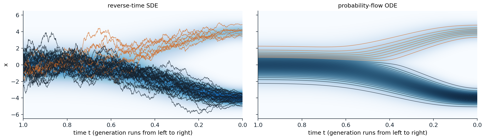
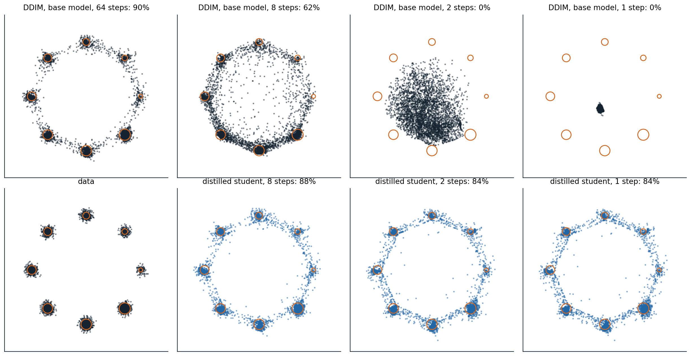

[Background Notes](../README.md) › [Generative AI](README.md)

# 8. Diffusion SDEs and Fast Sampling

> [!WARNING]
> Work in progress: this part of the notes is still being revised.

[← 7. Denoising Diffusion Models](07-denoising-diffusion-models.md) · [9. Flow Matching →](09-flow-matching.md)

## <a id="from-steps-to-continuous-time"></a>From steps to continuous time

### <a id="stochastic-differential-equations"></a>Stochastic differential equations

The chain of chapter 7 adds noise in a thousand small steps, and the noise-conditional score network of chapter 6 uses a sequence of noise levels. Both are discretizations of a process in continuous time, and treating it as one exposes structure that the discrete versions hide: a deterministic sampler, exact likelihoods, and the use of numerical methods for differential equations to sample in far fewer steps. A **stochastic differential equation** (SDE)

```math
dx=f(x,t)\,dt+g(t)\,dW
```

describes a path that moves with a deterministic **drift** $`f`$ and is shaken by a **Brownian motion** $`W`$, whose increments over a time $`h`$ are independent Gaussians of variance $`h`$, scaled by the **diffusion coefficient** $`g`$. Its simplest numerical solution, the **Euler–Maruyama** method, repeats

```math
x_{k+1}=x_k+f(x_k,t_k)\,h+g(t_k)\sqrt h\;z_k,\qquad z_k\sim\mathcal N(0,I),
```

with an error that shrinks as the step $`h`$ does: for the distribution of the result, in proportion to $`h`$ ([Kloeden and Platen, 1992](https://link.springer.com/book/10.1007/978-3-662-12616-5)). The noise term scales with $`\sqrt h`$ rather than $`h`$, which is what makes the paths continuous but nowhere smooth. Langevin dynamics is an SDE of this kind, with the score as its drift ([chapter 6, Appendix A](06-energy-based-models-and-score-matching.md#block-gen06-appendix-a)).

### <a id="variance-preserving-and-variance-exploding-processes"></a>Variance-preserving and variance-exploding processes

[Song et al. (2021)](https://arxiv.org/abs/2011.13456), in a paper that received an outstanding paper award at ICLR 2021, observed that both noising schemes are SDEs. With $`\beta_t=\beta(t)\,h`$, the DDPM step $`x_t=\sqrt{1-\beta_t}\,x_{t-1}+\sqrt{\beta_t}\,z`$ is an Euler–Maruyama step of the **variance-preserving** (VP) SDE

```math
dx=-\tfrac12\beta(t)\,x\,dt+\sqrt{\beta(t)}\,dW,
```

whose marginals are $`\mathcal N(\sqrt{\bar\alpha(t)}\,x_0,(1-\bar\alpha(t))I)`$ with $`\bar\alpha(t)=\exp(-\int_0^t\beta)`$; they used $`\beta(t)`$ rising linearly from 0.1 to 20 over $`t\in[0,1]`$. Adding noise of growing variance $`\sigma(t)^2`$ without shrinking the data, as the noise-conditional score network does, is the **variance-exploding** (VE) SDE

```math
dx=\sqrt{\frac{d\,[\sigma(t)^2]}{dt}}\;dW,
```

whose marginals are $`\mathcal N(x_0,\sigma(t)^2I)`$, with $`\sigma`$ growing to a maximum large enough to swamp the data. The two differ only by a change of coordinates: dividing the VP state by $`\sqrt{\bar\alpha(t)}`$ gives the VE state with $`\sigma(t)^2=(1-\bar\alpha(t))/\bar\alpha(t)=1/\operatorname{SNR}(t)`$. What distinguishes one noising process from another is the signal-to-noise ratio as a function of time, as in [chapter 7](07-denoising-diffusion-models.md#weighting-the-noise-levels), and how the state is scaled, which matters for the network, not for the mathematics. [Karras et al. (2022)](https://arxiv.org/abs/2206.00364) wrote every such process as $`x_t=s(t)\bigl(x_0+\sigma(t)\,\epsilon\bigr)`$ and argued for the simplest choice, $`s(t)=1`$ and $`\sigma(t)=t`$, which this chapter uses for sampling.

### <a id="how-densities-evolve"></a>How densities evolve

The density $`p_t`$ of $`x_t`$ obeys the **Fokker–Planck equation**

```math
\frac{\partial p_t}{\partial t}=-\nabla\cdot\bigl(f\,p_t\bigr)+\tfrac12g(t)^2\,\Delta p_t,
```

a conservation law in which the drift transports probability and the diffusion term spreads it. Chapter 6 used it to show that Langevin dynamics leaves its target distribution unchanged. Here it describes the data distribution being smoothed into a Gaussian, and it is the key to running the process backward, because two processes with the same Fokker–Planck equation have the same marginals at every time, whatever their individual paths look like.

## <a id="running-the-process-backward"></a>Running the process backward

### <a id="the-reverse-time-sde"></a>The reverse-time SDE

A diffusion run backward in time is again a diffusion. [Anderson (1982)](https://www.sciencedirect.com/science/article/pii/0304414982900515) showed that the paths of the forward SDE, traversed from $`t=T`$ down to $`t=0`$, follow

```math
dx=\bigl[f(x,t)-g(t)^2\,\nabla_x\log p_t(x)\bigr]\,dt+g(t)\,d\bar W,
```

where time runs backward and $`\bar W`$ is a Brownian motion in reversed time ([Appendix A](#block-gen08-appendix-a)). The only unknown is the score of the noisy marginals at every time, which is what a time-conditional network trained by denoising score matching estimates ([chapter 6](06-energy-based-models-and-score-matching.md#denoising-score-matching)). Generation draws $`x_T`$ from the Gaussian prior and integrates this SDE numerically with the learned score. DDPM's ancestral sampling is one discretization of the reverse VP SDE, and the extra drift, $`g^2`$ times the score, is the move along the score that chapter 7 found in each reverse step.

The continuous view also separates two ways of sampling that NCSN had mixed. A **predictor** takes a step of the reverse SDE, moving from one time to the next; a **corrector** then runs a few steps of Langevin dynamics at the new time, with the same score, to pull the samples toward that time's marginal and repair the predictor's error. Annealed Langevin dynamics is the corrector alone, with no predictor. With these **predictor–corrector** samplers, deeper architectures, and the VE SDE, Song et al. reached an FID of 2.20 and an Inception score of 9.89 on CIFAR-10, the best for unconditional generation at the time, and produced the first $`1024\times1024`$ images from a score-based model, of faces from CelebA-HQ.

### <a id="the-probability-flow-ode"></a>The probability-flow ODE

The Fokker–Planck equation has a second reading. Since $`\Delta p=\nabla\cdot(p\,\nabla\log p)`$, the diffusion term can be written as a transport term, and the forward SDE has the same marginals as the deterministic **probability-flow ODE**

```math
\frac{dx}{dt}=f(x,t)-\tfrac12g(t)^2\,\nabla_x\log p_t(x)
```

([Appendix A](#block-gen08-appendix-a); [Song et al., 2021](https://arxiv.org/abs/2011.13456); [Maoutsa, Reich, and Opper, 2020](https://www.mdpi.com/1099-4300/22/8/802)). Each point moves along a smooth path, and the paths move the whole distribution as the SDE's random paths do. Run backward from Gaussian samples with a learned score, the ODE generates data, and three things follow. It is a continuous normalizing flow ([chapter 4](04-normalizing-flows.md#continuous-time-flows)) whose velocity field comes from a score model, trained by denoising rather than by backpropagating through an ODE solver, so it gives **exact log-likelihoods** by the instantaneous change of variables, with the divergence estimated by the Skilling–Hutchinson trace estimator in high dimensions; Song et al. obtained 2.99 bits per dimension on CIFAR-10 this way. It is deterministic, so every image has a latent code, obtained by running the ODE forward, and with an exact score that code depends only on the data distribution and the noising process, not on the network. And it can be solved with any method for ordinary differential equations, which is the subject of the next section. The deterministic DDIM sampler of chapter 7 is the Euler method for this ODE ([chapter 7, Appendix C](07-denoising-diffusion-models.md#block-gen07-appendix-c)).

The code samples the mixture of chapter 6, where plain Langevin dynamics failed to find the weights of its modes, with its exact score under the VP SDE, both with the reverse SDE and with the ODE, and then runs the ODE forward from a few points to compute their log-densities.

```python
import numpy as np

rng = np.random.default_rng(0)
# Data: the mixture of chapter 6, 0.8 N(-4, 0.5^2) + 0.2 N(4, 0.5^2). Under the variance-preserving SDE
# dx = -beta(t) x / 2 dt + sqrt(beta(t)) dW, its marginal at time t is again a mixture, so the score is exact.
w, m, s = np.array([0.8, 0.2]), np.array([-4.0, 4.0]), 0.5
beta = lambda t: 0.1 + 19.9 * t                           # the linear schedule of Song et al. (2021)
abar = lambda t: np.exp(-(0.1 * t + 9.95 * t ** 2))       # exp(-integral of beta from 0 to t)


def score_and_curvature(x, t):                            # d/dx log p_t and d^2/dx^2 log p_t
    a = abar(t)
    v = a * s ** 2 + 1 - a
    comp = w * np.exp(-(x[:, None] - np.sqrt(a) * m) ** 2 / (2 * v))
    r = comp / comp.sum(1, keepdims=True)                 # posterior responsibilities of the components
    g = (np.sqrt(a) * m - x[:, None]) / v                 # score of each component
    score = (r * g).sum(1)
    return score, -1 / v + (r * g ** 2).sum(1) - score ** 2


def log_p0(x):
    return np.log((w * np.exp(-(x[:, None] - m) ** 2 / (2 * s ** 2)) / np.sqrt(2 * np.pi * s ** 2)).sum(1))


n, steps = 20000, 1000
ts = np.linspace(1, 1e-3, steps + 1)
x = rng.standard_normal(n)                                # reverse-time SDE, Euler-Maruyama
for t, t_next in zip(ts[:-1], ts[1:]):
    dt = t - t_next
    x = x + (0.5 * beta(t) * x + beta(t) * score_and_curvature(x, t)[0]) * dt + np.sqrt(beta(t) * dt) * rng.standard_normal(n)
sde = x


def ode_drift(x, t):                                      # probability-flow ODE: dx/dt = -beta (x + score) / 2
    return -0.5 * beta(t) * (x + score_and_curvature(x, t)[0])


x = rng.standard_normal(n)                                # probability-flow ODE, Heun's method
for t, t_next in zip(ts[:-1], ts[1:]):
    d1 = ode_drift(x, t)
    x_euler = x + (t_next - t) * d1
    x = x + (t_next - t) * 0.5 * (d1 + ode_drift(x_euler, t_next))
ode = x
for name, x in [("reverse SDE", sde), ("probability-flow ODE", ode)]:
    left = x[x < 0]
    print(f"{name:21s} share in the left mode {len(left) / n:.3f} (target 0.800); left mode mean {left.mean():.2f}, "
          f"sd {left.std():.3f} (target -4.00, 0.500)")

# Exact likelihoods: run the ODE forward from a data point to t = 1, adding up the divergence of the drift.
x0 = np.array([-4.0, -3.0, 0.0, 4.0, 5.0])
x, total = x0.copy(), np.zeros_like(x0)
ts = np.linspace(0, 1, 2001)
div = lambda x, t: -0.5 * beta(t) * (1 + score_and_curvature(x, t)[1])
for t, t_next in zip(ts[:-1], ts[1:]):                    # Heun's method for the pair (x, accumulated divergence)
    d1, g1 = ode_drift(x, t), div(x, t)
    x_euler = x + (t_next - t) * d1
    d2, g2 = ode_drift(x_euler, t_next), div(x_euler, t_next)
    x, total = x + (t_next - t) * 0.5 * (d1 + d2), total + (t_next - t) * 0.5 * (g1 + g2)
a1 = abar(1.0)                                            # the density at t = 1: nearly, but not exactly, N(0, 1)
v1 = a1 * s ** 2 + 1 - a1
log_p1 = np.log((w * np.exp(-(x[:, None] - np.sqrt(a1) * m) ** 2 / (2 * v1)) / np.sqrt(2 * np.pi * v1)).sum(1))
log_gauss = -0.5 * x ** 2 - 0.5 * np.log(2 * np.pi)
for a, b, c, d in zip(x0, log_p1 + total, log_gauss + total, log_p0(x0)):
    print(f"x = {a:+.1f}: log-density through the ODE {b:8.3f} (with N(0, 1) at t = 1: {c:8.3f}), exact {d:8.3f}")
# reverse SDE           share in the left mode 0.801 (target 0.800); left mode mean -4.00, sd 0.498 (target -4.00, 0.500)
# probability-flow ODE  share in the left mode 0.803 (target 0.800); left mode mean -4.00, sd 0.500 (target -4.00, 0.500)
# x = -4.0: log-density through the ODE   -0.449 (with N(0, 1) at t = 1:   -0.453), exact   -0.449
# x = -3.0: log-density through the ODE   -2.449 (with N(0, 1) at t = 1:   -2.437), exact   -2.449
# x = +0.0: log-density through the ODE  -32.226 (with N(0, 1) at t = 1:  -32.213), exact  -32.226
# x = +4.0: log-density through the ODE   -1.835 (with N(0, 1) at t = 1:   -1.815), exact   -1.835
# x = +5.0: log-density through the ODE   -3.835 (with N(0, 1) at t = 1:   -3.795), exact   -3.835
```

Both samplers reproduce the mixture: 80% of the mass in the left mode, with the right mean and spread. The score at large noise, where the modes have merged, carries the information about the weights that the score at the data lacks, and integrating from pure noise uses it. The ODE's log-densities match the exact ones to three decimals, even at $`x=0`$, where the density is $`e^{-32}`$. With the standard Gaussian in place of the exact density at $`t=1`$, the values are off by up to 0.04: the linear schedule leaves $`\sqrt{\bar\alpha(1)}=0.0066`$ of the signal, a small mismatch between the prior and the last marginal that every diffusion model has unless its schedule reaches zero signal.



*The same mixture under the VP SDE, with the density of $`x_t`$ shaded, from pure noise at $`t=1`$ on the left to the data at $`t=0`$ on the right. Left: 40 paths of the reverse-time SDE from random starting points. Right: 40 paths of the probability-flow ODE started at evenly spaced quantiles of the Gaussian. In both, 32 of the 40 paths, 80%, end in the left mode, dark, and 8 in the right, orange. The SDE paths wander and cross; the ODE paths never cross, stay nearly still until about $`t=0.6`$, when the signal emerges, and split at the 80th percentile of the starting distribution.*

The two samplers are related by more than their marginals. The reverse SDE is the probability-flow ODE plus a Langevin process at the current noise level, $`-\tfrac12g^2\nabla\log p_t\,dt+g\,d\bar W`$, which by itself leaves $`p_t`$ unchanged. The Langevin part corrects errors: if earlier steps have left the samples off the current marginal, it pulls them back, at the cost of noise that takes more steps to integrate accurately. The ODE has no such correction but tolerates much larger steps. [Karras et al. (2022)](https://arxiv.org/abs/2206.00364) made the amount of Langevin noise a tunable parameter and found that a little helps when the score is imperfect, but that the deterministic solver is the better choice with few steps.

## <a id="solving-fast"></a>Solving fast

### <a id="the-design-space-of-samplers"></a>The design space of samplers

Karras et al. separated the choices that had been bundled together in each paper, and their choices form the standard today. With $`s(t)=1`$ and $`\sigma(t)=t`$, the probability-flow ODE becomes

```math
\frac{dx}{d\sigma}=\frac{x-D(x;\sigma)}{\sigma},\qquad D(x;\sigma)=x+\sigma^2\,\nabla_x\log p_\sigma(x),
```

where $`D`$ is the **denoiser**, the minimum-mean-squared-error estimate of the clean data by Tweedie's formula. The velocity points from the current point toward its denoised version, and the ODE is solved from $`\sigma_{\max}=80`$, where $`x\sim\mathcal N(0,\sigma_{\max}^2I)`$, down to $`\sigma=0`$. The paths are nearly straight at large $`\sigma`$, where the denoiser returns roughly the mean of the data, and curve sharply at small $`\sigma`$, where they turn toward a particular mode, so the steps should be concentrated at low noise. Karras et al. used

```math
\sigma_i=\Bigl(\sigma_{\max}^{1/\rho}+\tfrac i{N-1}\bigl(\sigma_{\min}^{1/\rho}-\sigma_{\max}^{1/\rho}\bigr)\Bigr)^{\rho},\qquad\rho=7,\quad\sigma_{\min}=0.002,
```

followed by a final step to $`\sigma=0`$, and **Heun's method**, which follows an Euler step with a correction that averages the slopes at both ends of the step. Its error falls with the square of the step size instead of in proportion to it, for one extra network evaluation per step. With 35 network evaluations, their deterministic sampler reached an FID of 1.97 on unconditional CIFAR-10 and 1.79 on class-conditional CIFAR-10. For training, they rescaled the network's input and output so that both have unit variance at every noise level, the **preconditioning**

```math
D_\theta(x;\sigma)=c_{\text{skip}}(\sigma)\,x+c_{\text{out}}(\sigma)\,F_\theta\bigl(c_{\text{in}}(\sigma)\,x;\ c_{\text{noise}}(\sigma)\bigr),\qquad c_{\text{skip}}=\frac{\sigma_{\text{data}}^2}{\sigma^2+\sigma_{\text{data}}^2},\quad c_{\text{out}}=\frac{\sigma\,\sigma_{\text{data}}}{\sqrt{\sigma^2+\sigma_{\text{data}}^2}},\quad c_{\text{in}}=\frac1{\sqrt{\sigma^2+\sigma_{\text{data}}^2}},
```

with $`c_{\text{noise}}=\frac14\ln\sigma`$ and $`\sigma_{\text{data}}=0.5`$ for images in $`[-1,1]`$ ([Appendix B](#block-gen08-appendix-b)). The raw network $`F_\theta`$ then predicts the noise at low noise levels and the data at high ones, the same interpolation as velocity prediction ([chapter 7](07-denoising-diffusion-models.md#predicting-the-noise-the-data-or-the-velocity)). They sampled training noise levels with $`\ln\sigma`$ normal with mean −1.2 and standard deviation 1.2, concentrating training on the intermediate levels where the loss can be reduced, and weighted the loss so that every level contributes equally. With a stochastic sampler that injects and removes a controlled amount of noise at each step, the same study improved a pretrained ImageNet $`64\times64`$ model from an FID of 2.07 to 1.55 by changing only the sampler, and retrained it to 1.36. The paper received an outstanding paper award at NeurIPS 2022.

### <a id="exponential-integrators"></a>Exponential integrators

The ODE has a linear part, $`x/\sigma`$ in the form above and $`-\tfrac12\beta(t)\,x`$ in the VP form, which can be integrated exactly; only the term with the network needs approximating. Solving the linear part exactly and holding the denoiser fixed over a step gives

```math
x_{\sigma'}=\frac{\sigma'}{\sigma}\,x_\sigma+\Bigl(1-\frac{\sigma'}{\sigma}\Bigr)D(x_\sigma;\sigma),
```

which is DDIM, now seen as the first-order **exponential integrator** ([Appendix C](#block-gen08-appendix-c)). Higher orders approximate the denoiser along the step by a polynomial in the log signal-to-noise ratio instead of a constant. **DEIS** ([Zhang and Chen, 2023](https://arxiv.org/abs/2204.13902)) and **DPM-Solver** ([Lu et al., 2022](https://arxiv.org/abs/2206.00927)) developed such solvers; DPM-Solver reached an FID of 4.70 on CIFAR-10 with 10 network evaluations and 2.87 with 20, 4 to 16 times fewer than earlier training-free samplers. **DPM-Solver++** ([Lu et al., 2022](https://arxiv.org/abs/2211.01095)) applies the expansion to the predicted data rather than the predicted noise, which is more stable under the strong guidance of chapter 10, and reuses the previous step's evaluation, a **multistep** method with one evaluation per step; it needs 15 to 20 steps for guided sampling, where DDIM needs 100 to 250. The code compares Euler's method, Heun's method, and DPM-Solver++(2M) on the eight Gaussians of chapter 6 with the exact denoiser, measuring each solver against a reference solution from the same starting noise.

```python
import numpy as np

# Data: eight Gaussians (sd 0.1) on a circle of radius 2 with weights 1/36, ..., 8/36, as in chapter 6.
# With x_sigma = x_0 + sigma * eps, the ideal denoiser D(x; sigma) = E[x_0 | x_sigma] is known exactly.
angles = np.arange(8) * 2 * np.pi / 8
mu = 2 * np.stack([np.cos(angles), np.sin(angles)], 1)
w, s = np.arange(1, 9) / 36, 0.1


def denoise(x, sigma):
    v = s ** 2 + sigma ** 2
    logits = np.log(w) - ((x[:, None, :] - mu) ** 2).sum(-1) / (2 * v)
    r = np.exp(logits - logits.max(1, keepdims=True))
    r /= r.sum(1, keepdims=True)                          # posterior responsibilities
    return (r[:, :, None] * (mu + s ** 2 / v * (x[:, None, :] - mu))).sum(1)


def sigmas_edm(n, rho=7.0, smin=0.002, smax=80.0):        # time steps of Karras et al. (2022), then sigma = 0
    i = np.arange(n) / (n - 1)
    return np.append((smax ** (1 / rho) + i * (smin ** (1 / rho) - smax ** (1 / rho))) ** rho, 0.0)


def euler(x, sig):                                        # the ODE dx/dsigma = (x - D(x; sigma)) / sigma; = DDIM
    for s0, s1 in zip(sig[:-1], sig[1:]):
        x = x + (s1 - s0) * (x - denoise(x, s0)) / s0
    return x


def heun(x, sig):                                         # second order; Euler on the last step to sigma = 0
    for s0, s1 in zip(sig[:-1], sig[1:]):
        d0 = (x - denoise(x, s0)) / s0
        x_e = x + (s1 - s0) * d0
        x = x_e if s1 == 0 else x + (s1 - s0) * 0.5 * (d0 + (x_e - denoise(x_e, s1)) / s1)
    return x


def dpm_2m(x, sig):                                       # DPM-Solver++(2M): exponential integrator, multistep
    d_prev = None
    for i, (s0, s1) in enumerate(zip(sig[:-1], sig[1:])):
        d = denoise(x, s0)
        if d_prev is None or s1 == 0:
            d_hat = d
        else:
            h, h_prev = np.log(s0 / s1), np.log(sig[i - 1] / s0)
            r = h_prev / h
            d_hat = (1 + 1 / (2 * r)) * d - 1 / (2 * r) * d_prev
        x = (s1 / s0) * x + (1 - s1 / s0) * d_hat         # exact for the linear part of the ODE
        d_prev = d
    return x


rng = np.random.default_rng(0)
x_T = 80.0 * rng.standard_normal((2000, 2))
reference = heun(x_T, sigmas_edm(1000))


def near_mode(x):
    return np.mean(np.min(np.linalg.norm(x[:, None, :] - mu, axis=-1), 1) < 3 * s)


print(f"reference (Heun, 1,999 evaluations): {near_mode(reference):.1%} of samples within 0.3 of a mode")
print("evaluations   median distance to the reference endpoint      share within 0.3 of a mode")
print("              Euler (DDIM)   Heun    DPM-Solver++(2M)         Euler   Heun   DPM")
for nfe in [5, 9, 19, 39, 79]:
    xs = [euler(x_T, sigmas_edm(nfe)), heun(x_T, sigmas_edm((nfe + 1) // 2)), dpm_2m(x_T, sigmas_edm(nfe))]
    err = [np.median(np.linalg.norm(x - reference, axis=1)) for x in xs]
    print(f"{nfe:6d}        {err[0]:8.4f}   {err[1]:8.4f}   {err[2]:8.4f}            "
          + "  ".join(f"{near_mode(x):5.1%}" for x in xs))
x_uni = euler(x_T, sigmas_edm(79, rho=1.0))
print(f"Euler, 79 evaluations with steps uniform in sigma instead: median distance {np.median(np.linalg.norm(x_uni - reference, axis=1)):.4f}, "
      f"{near_mode(x_uni):.1%} near a mode")
# reference (Heun, 1,999 evaluations): 99.2% of samples within 0.3 of a mode
# evaluations   median distance to the reference endpoint      share within 0.3 of a mode
#               Euler (DDIM)   Heun    DPM-Solver++(2M)         Euler   Heun   DPM
#      5          0.2721     6.2945     0.6165            59.9%   0.5%   0.0%
#      9          0.1154     2.3655     0.2963            85.4%   0.0%  58.2%
#     19          0.0453     0.1144     0.0291            93.2%  93.0%  98.2%
#     39          0.0209     0.0147     0.0040            96.5%  98.7%  98.5%
#     79          0.0101     0.0028     0.0009            98.2%  99.1%  98.9%
# Euler, 79 evaluations with steps uniform in sigma instead: median distance 0.4406, 20.3% near a mode
```

With enough evaluations, the orders show. Doubling the evaluations halves Euler's median error, from 0.045 to 0.021 to 0.010, as a first-order method should, while the two second-order methods reduce theirs four- to eightfold, and at 79 evaluations DPM-Solver++(2M) is about ten times closer to the exact solution than Euler. The multistep method gets second-order accuracy for one evaluation per step, where Heun pays two, and is the best of the three from 19 evaluations on. With very few steps, the ordering reverses: Heun's method with three steps, five evaluations, is unstable and sends almost every sample off the modes, and DPM-Solver++(2M) is poor at five and nine, while Euler still puts 59.9% of samples near a mode with five. A second-order correction evaluates the slope at the end of a step, and when a single step spans the noise levels at which the paths turn toward their modes, that slope is not a useful guide to the path in between. The spacing of the steps matters as much as the solver: Euler with 79 steps spaced uniformly in $`\sigma`$ places almost all of them at high noise, where nothing happens, and ends with 20.3% of samples near a mode, against 98.2% with the spacing of Karras et al.

## <a id="learning-to-take-fewer-steps"></a>Learning to take fewer steps

### <a id="progressive-distillation"></a>Progressive distillation

Solvers reduce the number of steps to about ten before the approximation breaks down, because the paths of the probability-flow ODE are curved. To go further, one trains a new network to make the large steps directly. **Progressive distillation** ([Salimans and Ho, 2022](https://arxiv.org/abs/2202.00512)) trains a student to do in one DDIM step what a teacher does in two. For a noisy training example, the teacher takes two steps, and the target for the student is the prediction of the clean image that would land exactly where the teacher did in one step ([Appendix D](#block-gen08-appendix-d)). The student starts from the teacher's weights, learns the half-length schedule, and becomes the teacher of the next round. Repeating the halving took a sampler of 8,192 steps down to 4, at a total cost no greater than training the original model, with FIDs on CIFAR-10 of 2.57 with 8 steps, 3.00 with 4, 4.51 with 2, and 9.12 with 1. Distillation needs a network that predicts the data or the velocity, since a single step from pure noise must produce an image, and predicting the noise there is useless ([chapter 7](07-denoising-diffusion-models.md#predicting-the-noise-the-data-or-the-velocity)); the velocity parameterization was introduced in this paper for that reason.



*Progressive distillation on the eight Gaussians of chapter 6 (weights 1/36 to 8/36, standard deviation 0.1), with the preconditioned denoiser above computed by an MLP of three hidden layers of 256 units. Top: the base model, trained by denoising for 4,000 steps on a 64-step schedule with $`\rho=7`$, sampled by DDIM from the same 4,000 starting points with 64, 8, 2, and 1 steps. Bottom: the data, and the students distilled in six rounds of 1,500 training steps each, halving the schedule from 64 steps to 32, 16, 8, 4, 2, and 1, sampled with 8, 2, and 1 steps. Percentages are the shares of samples within 0.3 of a mode. DDIM with the base model falls from 90% with 64 steps to 62% with 8 and to 0% with 2 and 1, where a single step from $`\sigma=80`$ returns nearly the mean of the data. The students keep 87.9%, 84.4%, and 84.2%, and the shares of the eight modes stay within a total variation of 0.032 of the true weights. The samples off the modes lie on thin bridges between neighboring modes, as they do for the base model with 64 steps, and each halving adds a few.*

### <a id="consistency-models"></a>Consistency models

A **consistency model** ([Song et al., 2023](https://proceedings.mlr.press/v202/song23a.html)) learns in one stage the map that progressive distillation reaches in several: a network $`f_\theta(x_t,t)`$ that sends every point on a path of the probability-flow ODE to the path's origin. Its defining property is **self-consistency**: $`f_\theta(x_t,t)=f_\theta(x_{t'},t')`$ for any two points on the same path, with the boundary condition $`f_\theta(x,\epsilon)=x`$ at the smallest noise level, enforced by a skip connection as in the preconditioning above. In **consistency distillation**, a pretrained diffusion model takes one ODE step from $`x_{t_{n+1}}`$ to $`x_{t_n}`$, and the network is trained to give the same output at both points, with the output at $`x_{t_n}`$ computed by a slowly updated copy of the network as the target; in **consistency training**, no teacher is needed, since two noisy versions of the same image with the same noise vector lie approximately on one path. Sampling takes one evaluation, or a few, alternating denoising with re-noising to a smaller level. Distilled consistency models reached an FID on CIFAR-10 of 3.55 with one step and 2.93 with two, and on ImageNet $`64\times64`$ of 6.20 and 4.70; trained from scratch, 8.70 with one step on CIFAR-10. Replacing the learned perceptual distance in the loss by a robust Pseudo-Huber loss, and sampling noise levels log-normally, brought consistency training without a teacher to 2.83 on CIFAR-10 and 4.02 on ImageNet $`64\times64`$ in one step ([Song and Dhariwal, 2023](https://arxiv.org/abs/2310.14189)), and a continuous-time formulation scaled to 1.5 billion parameters reached 1.88 on ImageNet $`512\times512`$ with two steps, within 10% of the diffusion model it was distilled from ([Lu and Song, 2024](https://arxiv.org/abs/2410.11081)).

### <a id="distribution-matching-and-adversarial-distillation"></a>Distribution matching and adversarial distillation

Progressive distillation and consistency models make the student match the teacher's paths point by point. Other methods only ask the student's outputs to have the teacher's distribution. **Distribution matching distillation** ([Yin et al., 2024](https://arxiv.org/abs/2311.18828)) trains a one-step generator with a gradient given by the difference of two scores at the noisy versions of its samples: the teacher's score of the data and the score of the generator's own outputs, estimated by a second diffusion model trained on them; it reached an FID of 2.62 on ImageNet $`64\times64`$ with one step and generated text-conditioned images at 20 per second. **Adversarial diffusion distillation** ([Sauer et al., 2023](https://arxiv.org/abs/2311.17042)) combines a score-distillation loss from the teacher with the loss of a discriminator, and generated images from text in one to four steps; it is the method behind the SDXL Turbo model. These methods bring back parts of the adversarial machinery of [chapter 5](05-generative-adversarial-networks.md#the-adversarial-game), and with it some of the loss of diversity, in exchange for real-time generation. Chapter 9 attacks the problem at its source, by learning paths that are straight to begin with.

### <a id="choosing-a-sampler"></a>Choosing a sampler

The choices of this chapter reduce to a few rules of thumb. For the best quality from a given diffusion model, a deterministic second-order solver, Heun or a multistep exponential integrator, with steps concentrated at low noise, needs about 20 to 50 evaluations; guided text-to-image models are usually sampled with DPM-Solver++ in that range. Stochastic samplers and correctors help when evaluations are cheap relative to quality, because their noise repairs accumulated errors. Below about ten evaluations, no solver of a curved ODE works well, and the model itself has to change, by distillation into a few-step student or by training a consistency model, with some loss of diversity or quality that recent methods have made small.

## <a id="appendices"></a>Appendices


<details>
<summary><a id="block-gen08-appendix-a"></a><b>A. The probability-flow ODE and the reverse-time SDE</b></summary>


**Same marginals.** The forward SDE's density satisfies $`\partial_tp=-\nabla\cdot(fp)+\tfrac12g^2\Delta p`$. Since $`\nabla\cdot(p\nabla\log p)=\nabla\cdot\nabla p=\Delta p`$, this is

```math
\partial_tp=-\nabla\cdot\Bigl(\bigl(f-\tfrac12g^2\nabla\log p\bigr)\,p\Bigr),
```

the continuity equation of the deterministic flow $`\dot x=f-\tfrac12g^2\nabla\log p_t(x)`$ ([chapter 4, Appendix B](04-normalizing-flows.md#block-gen04-appendix-b)). Both processes start from the same $`p_0`$ and their densities obey the same equation, so they agree at every $`t`$.

**Reverse time.** Let $`\tau=T-t`$ and $`q_\tau=p_{T-\tau}`$. Then $`\partial_\tau q=-\partial_tp=\nabla\cdot\bigl((f-\tfrac12g^2\nabla\log p)\,p\bigr)`$. Write the right side as the Fokker–Planck operator of an SDE in $`\tau`$ with diffusion $`g`$: $`\nabla\cdot\bigl((f-\tfrac12g^2\nabla\log p)\,p\bigr)=-\nabla\cdot\bigl((-f+g^2\nabla\log p)\,p\bigr)+\tfrac12g^2\Delta p`$, again using $`\Delta p=\nabla\cdot(p\nabla\log p)`$. So $`q_\tau`$ is the marginal of $`dx=\bigl(-f+g^2\nabla\log p_{T-\tau}\bigr)d\tau+g\,dW_\tau`$. Written in the original time, whose increments are $`dt=-d\tau`$, the drift is $`f-g^2\nabla\log p_t`$, which is Anderson's equation. This argument matches the marginals only; Anderson showed that the reverse process has the same joint distribution of paths as well.

**Likelihood.** Along a path of the ODE, $`\frac d{dt}\log p_t(x(t))=-\nabla\cdot\bigl(f-\tfrac12g^2\nabla\log p_t\bigr)`$. Integrating from $`0`$ to $`T`$ gives $`\log p_0(x(0))=\log p_T(x(T))+\int_0^T\nabla\cdot\bigl(f-\tfrac12g^2\nabla\log p_t\bigr)\,dt`$, which the code evaluates for the VP SDE, where the divergence is $`-\tfrac12\beta(t)\bigl(D+\Delta\log p_t\bigr)`$ in $`D`$ dimensions.

</details>


<details>
<summary><a id="block-gen08-appendix-b"></a><b>B. The preconditioning of Karras et al.</b></summary>


Write the noisy input as $`x=y+n`$ with data $`y`$ of variance $`\sigma_{\text{data}}^2`$ per coordinate and noise $`n`$ of variance $`\sigma^2`$. The input to the network has unit variance if $`c_{\text{in}}=1/\sqrt{\sigma^2+\sigma_{\text{data}}^2}`$. The loss $`\lambda(\sigma)\,\|c_{\text{skip}}x+c_{\text{out}}F-y\|^2`$ equals $`\lambda\,c_{\text{out}}^2\,\|F-T\|^2`$ with the effective target $`T=(y-c_{\text{skip}}x)/c_{\text{out}}`$, whose variance is $`\bigl((1-c_{\text{skip}})^2\sigma_{\text{data}}^2+c_{\text{skip}}^2\sigma^2\bigr)/c_{\text{out}}^2`$. Requiring unit variance, and choosing $`c_{\text{skip}}`$ to make $`c_{\text{out}}`$ as small as possible, so that errors of $`F`$ are amplified as little as possible, minimizes $`(1-c)^2\sigma_{\text{data}}^2+c^2\sigma^2`$ over $`c`$:

```math
c_{\text{skip}}=\frac{\sigma_{\text{data}}^2}{\sigma^2+\sigma_{\text{data}}^2},\qquad c_{\text{out}}^2=\frac{\sigma^2\sigma_{\text{data}}^2}{\sigma^2+\sigma_{\text{data}}^2}.
```

Setting $`\lambda=1/c_{\text{out}}^2`$ makes the effective weight of every noise level one. At small $`\sigma`$, $`c_{\text{skip}}\approx1`$ and $`T\approx-n/\sigma`$, the negative of the standardized noise; at large $`\sigma`$, $`c_{\text{skip}}\approx0`$ and $`T\approx y/\sigma_{\text{data}}`$, the standardized data.

</details>


<details>
<summary><a id="block-gen08-appendix-c"></a><b>C. Exponential integrators</b></summary>


For $`dx/d\sigma=(x-D(x;\sigma))/\sigma`$, the product rule gives $`\frac d{d\sigma}\bigl(x/\sigma\bigr)=-D/\sigma^2`$, so exactly

```math
\frac{x_{\sigma'}}{\sigma'}=\frac{x_\sigma}{\sigma}-\int_\sigma^{\sigma'}\frac{D(x_u;u)}{u^2}\,du.
```

Treating $`D`$ as constant over the step, the integral is $`D\,(1/\sigma-1/\sigma')`$, which gives the DDIM update of the text. In the variable $`\lambda=-\log\sigma`$, the log signal-to-noise ratio up to a factor of 2 for this process, the weight $`du/u^2`$ becomes $`-e^{\lambda}d\lambda`$, and higher-order methods replace the constant $`D`$ by a polynomial in $`\lambda`$ fitted to recent evaluations, integrating the product with the exponential exactly. DPM-Solver++(2M), used in the code, extrapolates $`D`$ linearly in $`\lambda`$ from the current and previous evaluations, $`D_i+\frac1{2r}(D_i-D_{i-1})`$ with $`r`$ the ratio of the previous step length in $`\lambda`$ to the current one, which is the extrapolated value at the middle of the step, and uses it in place of $`D`$ in the first-order update.

</details>


<details>
<summary><a id="block-gen08-appendix-d"></a><b>D. The target of progressive distillation</b></summary>


In the form $`x_\sigma=x_0+\sigma\epsilon`$, one DDIM step from $`z`$ at level $`\sigma`$ with predicted clean image $`\hat x`$ lands at $`\hat x+(\sigma''/\sigma)(z-\hat x)`$ at level $`\sigma''`$. The teacher's two steps, through an intermediate level $`\sigma'`$, land at $`z''`$. Solving $`\hat x+(\sigma''/\sigma)(z-\hat x)=z''`$ for $`\hat x`$ gives the student's target

```math
\tilde x=\frac{z''-(\sigma''/\sigma)\,z}{1-\sigma''/\sigma}.
```

In the variance-preserving form $`z_t=\alpha_tx+\sigma_t\epsilon`$ of Salimans and Ho, the same argument gives $`\tilde x=\bigl(z_{t''}-(\sigma_{t''}/\sigma_t)z_t\bigr)/\bigl(\alpha_{t''}-(\sigma_{t''}/\sigma_t)\alpha_t\bigr)`$. At the last step, $`\sigma''=0`$ and the target is the teacher's output itself.

</details>

---

[← 7. Denoising Diffusion Models](07-denoising-diffusion-models.md) · [9. Flow Matching →](09-flow-matching.md)
