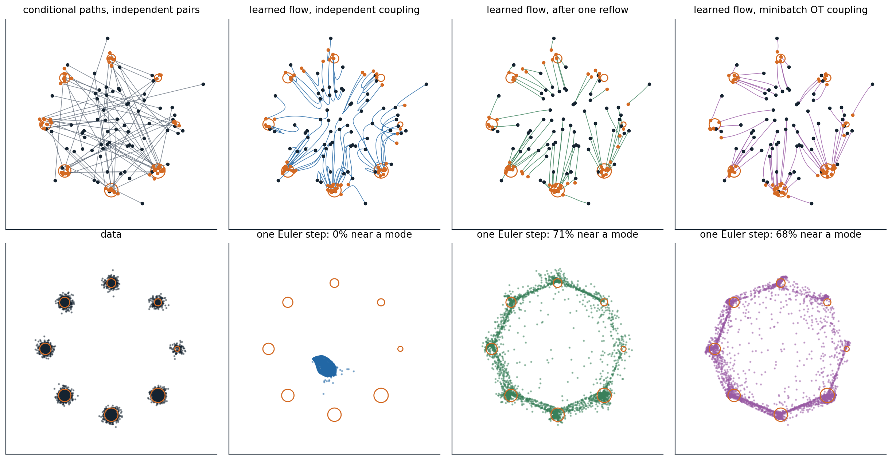

[Background Notes](../README.md) › [Generative AI](README.md)

# 9. Flow Matching

[← 8. Diffusion SDEs and Fast Sampling](08-diffusion-sdes-and-fast-sampling.md) · [10. Guidance and Conditional Generation →](10-guidance-and-conditional-generation.md)

## <a id="flows-from-velocity-fields"></a>Flows from velocity fields

### <a id="generating-by-transport"></a>Generating by transport

Chapter 8 ended with a deterministic sampler: an ordinary differential equation that carries Gaussian noise to data, whose velocity field was assembled from a score model. **Flow matching** removes the detour through the score. It chooses a path of distributions from noise to data, and trains a network to output the velocity field that moves samples along it, by a regression as simple as the denoising loss of chapter 7. The idea was published within a few months by four groups: [Lipman et al. (2023)](https://arxiv.org/abs/2210.02747) as flow matching, [Liu, Gong, and Liu (2023)](https://arxiv.org/abs/2209.03003) as **rectified flow**, [Albergo and Vanden-Eijnden (2023)](https://arxiv.org/abs/2209.15571) as **stochastic interpolants**, and [Heitz, Belcour, and Chambon (2023)](https://arxiv.org/abs/2305.03486) as iterative blending. It has since become the training objective of many of the largest image and video generators.

A time-dependent velocity field $`v_t(x)`$ defines a **flow**: the solution of $`\frac d{dt}\psi_t(x)=v_t(\psi_t(x))`$ with $`\psi_0(x)=x`$, which moves every point along a smooth path. Applied to samples from a source distribution $`p_0`$, here the standard Gaussian, it produces a distribution $`p_t`$ at each time $`t\in[0,1]`$, and the goal is a field for which $`p_1`$ is the data distribution. This is a continuous normalizing flow (chapter 4), but the continuous flows of chapter 4 were trained by maximum likelihood, which requires solving the ODE, with its divergence, at every training step. Flow matching never simulates the flow during training.

### <a id="the-continuity-equation"></a>The continuity equation

A velocity field and a path of densities are consistent when probability is conserved as it moves: the rate at which density at a point changes equals the net rate at which the velocity carries probability into it,

```math
\frac{\partial p_t}{\partial t}+\nabla\cdot\bigl(p_t\,v_t\bigr)=0.
```

When the **continuity equation** holds, the flow of $`v_t`$ applied to samples of $`p_0`$ produces samples of $`p_t`$ at every time, and one says that $`v_t`$ **generates** the path. It is the Fokker–Planck equation of chapter 8 without its diffusion term, and the probability-flow ODE was obtained by rewriting that term as a velocity. Many fields generate the same path, since adding any flow that circulates without changing the density, $`\nabla\cdot(p_tw)=0`$, leaves the equation intact, so a path can be chosen first and a field that generates it found afterwards.

## <a id="flow-matching"></a>Flow matching

### <a id="paths-built-from-conditional-paths"></a>Paths built from conditional paths

Designing a path between a Gaussian and an unknown data distribution directly is hopeless, but designing one between the Gaussian and a single data point is easy. Flow matching builds the path of distributions as a mixture of **conditional paths**, one for each data point $`x_1`$:

```math
p_t(x)=\int p_t(x\mid x_1)\,p_{\text{data}}(x_1)\,dx_1,\qquad p_0(x\mid x_1)=\mathcal N(x;0,I),\qquad p_1(x\mid x_1)\approx\delta(x-x_1).
```

Each conditional path has a simple velocity field $`u_t(x\mid x_1)`$ that generates it. The field that generates the mixture is the average of the conditional fields at each point, weighted by how likely each data point is to have produced it,

```math
u_t(x)=\mathbb E\bigl[u_t(x\mid x_1)\,\big|\,x_t=x\bigr]=\int u_t(x\mid x_1)\,\frac{p_t(x\mid x_1)\,p_{\text{data}}(x_1)}{p_t(x)}\,dx_1
```

([Appendix A](#block-gen09-appendix-a)). The **marginal velocity** $`u_t`$ is what a sampler needs, and it cannot be computed, since it averages over the whole data distribution, just as the score of the noisy data distribution could not be computed in chapter 6.

### <a id="the-conditional-flow-matching-loss"></a>The conditional flow matching loss

The flow matching loss $`\mathbb E_{t,x_t}\|v_\theta(x_t,t)-u_t(x_t)\|^2`$ would train a network toward the marginal velocity if its target were available. The **conditional flow matching** (CFM) loss replaces the unknown target by the known conditional one:

```math
\mathcal L_{\text{CFM}}(\theta)=\mathbb E_{t\sim\mathcal U[0,1],\ x_1\sim p_{\text{data}},\ x_t\sim p_t(\cdot\mid x_1)}\bigl\|v_\theta(x_t,t)-u_t(x_t\mid x_1)\bigr\|^2 .
```

Lipman et al. showed that the two losses differ by a constant that does not depend on $`\theta`$, so they have the same gradients and the same minimizer ([Appendix B](#block-gen09-appendix-b)). The argument is the one behind denoising score matching (chapter 6): a squared-error regression on a noisy target is minimized by the conditional mean of the target, and here the conditional mean of the conditional velocity given $`x_t`$ is the marginal velocity. The code checks this for a model that is linear in fixed random features of $`(x,t)`$, on the one-dimensional mixture of chapters 6 and 8, whose marginal velocity is known exactly.

```python
import numpy as np

rng = np.random.default_rng(0)
# Target: the mixture 0.8 N(-4, 0.5^2) + 0.2 N(4, 0.5^2); source: N(0, 1); path x_t = (1 - t) x0 + t x1.
w, m, s = np.array([0.8, 0.2]), np.array([-4.0, 4.0]), 0.5


def marginal_velocity(x, t):                              # E[x1 - x0 | x_t = x], exact for this mixture
    var = t ** 2 * s ** 2 + (1 - t) ** 2                  # variance of x_t within a component
    comp = w * np.exp(-(x[:, None] - t[:, None] * m) ** 2 / (2 * var[:, None])) / np.sqrt(var[:, None])
    r = comp / comp.sum(1, keepdims=True)
    gain = (t * s ** 2 - (1 - t)) / var                   # Cov(x1 - x0, x_t) / Var(x_t) within a component
    return (r * (m + gain[:, None] * (x[:, None] - t[:, None] * m))).sum(1)


n = 1_000_000
x0 = rng.standard_normal(n)
x1 = np.where(rng.random(n) < 0.8, -4.0, 4.0) + s * rng.standard_normal(n)
t = rng.random(n)
xt = (1 - t) * x0 + t * x1
u_cond, u_marg = x1 - x0, marginal_velocity(xt, t)

# A model that is linear in fixed random features of (x, t): v(x, t) = features(x, t) @ theta.
W, b = rng.standard_normal((2, 64)) * np.array([[0.3], [3.0]]), rng.uniform(0, 2 * np.pi, 64)
features = np.cos(np.stack([xt, t], 1) @ W + b)
for k in range(3):
    theta = rng.standard_normal(64)
    v = features @ theta
    loss_c, loss_m = np.mean((v - u_cond) ** 2), np.mean((v - u_marg) ** 2)
    g_c, g_m = 2 * features.T @ (v - u_cond) / n, 2 * features.T @ (v - u_marg) / n
    print(f"random parameters {k}: conditional loss {loss_c:8.3f}, marginal loss {loss_m:8.3f}, "
          f"difference {loss_c - loss_m:.3f}; gradients differ by {np.linalg.norm(g_c - g_m) / np.linalg.norm(g_m):.4f} (relative)")
theta_c = np.linalg.lstsq(features, u_cond, rcond=None)[0]   # the minimizer of the conditional loss
print(f"fitted to the conditional targets: RMS distance to the marginal velocity "
      f"{np.sqrt(np.mean((features @ theta_c - u_marg) ** 2)):.3f}, to the conditional targets "
      f"{np.sqrt(np.mean((features @ theta_c - u_cond) ** 2)):.3f}")
# random parameters 0: conditional loss   16.129, marginal loss   12.539, difference 3.589; gradients differ by 0.0010 (relative)
# random parameters 1: conditional loss   83.856, marginal loss   80.243, difference 3.613; gradients differ by 0.0003 (relative)
# random parameters 2: conditional loss   13.404, marginal loss    9.806, difference 3.598; gradients differ by 0.0013 (relative)
# fitted to the conditional targets: RMS distance to the marginal velocity 0.310, to the conditional targets 1.921
```

At three random settings of the parameters, the conditional loss exceeds the marginal loss by the same amount, 3.6 up to sampling error, the average variance of the conditional velocity around its mean, and the two gradients agree to within about 0.1%. The model fitted to the conditional targets is within 0.31 of the marginal velocity, an error that comes from the limited features rather than from the loss, and its error on the conditional targets themselves, 1.921, is the square root of the variance 3.6 plus that small error squared: the part of a conditional target that cannot be predicted from $`x_t`$ is noise that the regression averages away.

### <a id="straight-conditional-paths"></a>Straight conditional paths

For Gaussian conditional paths $`p_t(x\mid x_1)=\mathcal N(x;\mu_t(x_1),\sigma_t^2I)`$, a sample is $`x_t=\mu_t(x_1)+\sigma_t\,x_0`$ with $`x_0\sim\mathcal N(0,I)`$, and the conditional velocity is the time derivative of this expression with $`x_0`$ held fixed, $`u_t=\dot\mu_t(x_1)+\dot\sigma_t\,x_0`$. The simplest choice moves each noise sample in a straight line at constant speed to its data point:

```math
x_t=(1-t)\,x_0+t\,x_1,\qquad u_t(x_t\mid x_1)=x_1-x_0 .
```

Lipman et al. called it the **optimal-transport path**, since it moves the conditional Gaussian at one end to the one at the other by their optimal-transport map, and used a small minimum width $`\sigma_{\min}`$ at $`t=1`$; with $`\sigma_{\min}=0`$ it is the linear interpolation of rectified flow. Training is a loop of a few lines: draw a data point, a noise vector, and a time; form $`x_t`$; and regress the network's output on $`x_1-x_0`$. Sampling integrates $`dx/dt=v_\theta(x,t)`$ from a Gaussian sample at $`t=0`$ to $`t=1`$ with any ODE solver. Trained this way with a U-Net, flow matching reached an FID of 6.35 and 2.99 bits per dimension on CIFAR-10 and an FID of 14.45 on ImageNet $`64\times64`$, better than the same network trained with a diffusion path by flow matching, and its samples needed fewer steps of an adaptive solver, 138 against 187 on ImageNet $`64\times64`$.

### <a id="flow-matching-and-diffusion"></a>Flow matching and diffusion

Diffusion is a special case. The noising processes of chapters 7 and 8 are Gaussian conditional paths, with the data scaled by $`\sqrt{\bar\alpha}`$ and noise of standard deviation $`\sqrt{1-\bar\alpha}`$ in place of $`t`$ and $`1-t`$, and for every Gaussian path the marginal velocity is an affine function of the score of $`p_t`$. For the straight path,

```math
u_t(x)=\frac{x+(1-t)\,\nabla\log p_t(x)}{t},
```

the conversion formula of the 6.S184 notes ([Holderrieth and Erives, 2025](https://arxiv.org/abs/2506.02070); [Appendix C](#block-gen09-appendix-c)). A trained velocity network is therefore a score network and a denoiser in other units, and a diffusion model can be sampled as a flow and a flow as a diffusion, with noise added by the conversion. Even the samplers coincide: Euler's method for the straight path is exactly DDIM with the matching noise schedule. As [Gao et al. (2024)](https://diffusionflow.github.io/) put it, diffusion with Gaussian noise and flow matching are two sides of the same coin. What differs in practice are the choices that chapters 7 and 8 already identified: the schedule of signal-to-noise ratios along the path, the quantity the network predicts, velocity rather than noise, and the weighting of the loss over time; the straight path with uniformly sampled $`t`$ weights the noise levels as velocity prediction does under a cosine schedule. It spends more of its time near equal signal and noise than the linear schedule of DDPM, and velocity prediction is well behaved at both ends, which is much of why flow matching trains well.

**Stochastic interpolants** ([Albergo, Boffi, and Vanden-Eijnden, 2023](https://arxiv.org/abs/2303.08797)) generalize the construction in two directions: the interpolation $`x_t=\alpha(t)\,x_0+\beta(t)\,x_1+\gamma(t)\,z`$ may include extra noise $`z`$ that vanishes at both ends, and the source $`x_0`$ need not be Gaussian. With a source that is itself data, such as low-resolution images or images of one domain, the same regression learns a transport between two distributions, for super-resolution or translation, with no noise involved.

## <a id="straightening-the-paths"></a>Straightening the paths

### <a id="why-the-learned-paths-curve"></a>Why the learned paths curve

The conditional paths are straight, but they cross: independently drawn noise and data pair every noise sample with every data point, and a point $`x_t`$ lies on many conditional paths heading in different directions. The marginal velocity averages over them, and the resulting flow, whose paths cannot cross since an ODE has one velocity at each point, follows curved paths. At $`t=0`$ the average is over the whole data distribution, $`u_0(x)=\mathbb E[x_1]-x`$, so a single Euler step sends every sample to the mean of the data; only later, as $`x_t`$ begins to reveal which data point it is heading for, do the paths turn toward separate modes. Curved paths are what make few-step sampling fail, in the same way as in chapter 8. Two remedies make them straighter: changing the coupling between noise and data, and learning the large steps directly.

### <a id="reflow"></a>Reflow

A learned flow defines its own coupling between noise and data: each noise sample $`x_0`$ is paired with the point $`\psi_1(x_0)`$ where the flow sends it. The paths of the flow do not cross, so if one trains a second flow on straight conditional paths between these pairs, far fewer of the conditional paths cross, and the new flow is straighter. This is **reflow** ([Liu, Gong, and Liu, 2023](https://arxiv.org/abs/2209.03003)). Its coupling has a transport cost no higher than the original's for every convex cost, such as the squared distance ([Appendix D](#block-gen09-appendix-d)), and after $`K`$ rounds the paths are straight up to an error of order $`1/K`$. On CIFAR-10, the first rectified flow reached an FID of 2.58 with an adaptive solver using 127 evaluations, and one round of reflow followed by distillation into a single step gave 4.85. **InstaFlow** ([Liu et al., 2024](https://arxiv.org/abs/2309.06380)) applied reflow and distillation to Stable Diffusion and generated text-conditioned images in one step, 0.09 seconds per image, with an FID of 23.3 on MS COCO 2017, at a training cost of 199 A100 GPU-days, and improved training of the reflowed model brought one-step generation on CIFAR-10 to an FID of 3.07 without further distillation ([Lee, Lin, and Fanti, 2024](https://arxiv.org/abs/2405.20320)). The cost of reflow is the simulation of the first flow to produce the pairs, and each round inherits the errors of the flow before it.

### <a id="optimal-transport-couplings"></a>Optimal-transport couplings

The straightest possible flow between two distributions comes from their **optimal transport** map, which pairs noise and data so as to minimize the expected squared distance. In the dynamic formulation of [Benamou and Brenier (2000)](https://doi.org/10.1007/s002110050002), it is the velocity field of least kinetic energy among all fields that satisfy the continuity equation between the two, and its particles move in straight lines at constant speed. Computing the map for high-dimensional data is out of reach, but it can be approximated within each minibatch: draw a batch of noise and a batch of data, solve the assignment problem that pairs them with the least total squared distance, and train on straight paths between the re-paired samples ([Tong et al., 2024](https://arxiv.org/abs/2302.00482); [Pooladian et al., 2023](https://arxiv.org/abs/2304.14772)). The pairs remain a valid coupling, since every noise sample and every data point is used once, so the learned flow still maps the Gaussian to the data; as the batch grows, the coupling approaches the optimal one and the paths become straight. The code trains the same network with independent pairs and with minibatch optimal transport on the eight Gaussians of chapter 6 and samples each with a few Euler steps.

```python
import numpy as np
import torch
from torch import nn
from scipy.optimize import linear_sum_assignment

torch.set_num_threads(1)
angles = torch.arange(8) * (2 * np.pi / 8)
mu = 2 * torch.stack([torch.cos(angles), torch.sin(angles)], 1)
w = torch.arange(1, 9, dtype=torch.float32) / 36           # the eight Gaussians of chapter 6
data = lambda n: mu[torch.multinomial(w, n, replacement=True)] + 0.1 * torch.randn(n, 2)


def train(coupling, steps=3000, batch=256):
    torch.manual_seed(0)
    net = nn.Sequential(nn.Linear(3, 128), nn.SiLU(), nn.Linear(128, 128), nn.SiLU(), nn.Linear(128, 128), nn.SiLU(),
                        nn.Linear(128, 2))
    opt = torch.optim.Adam(net.parameters(), lr=1e-3)
    for _ in range(steps):
        x0, x1 = torch.randn(batch, 2), data(batch)        # noise at t = 0, data at t = 1
        if coupling == "minibatch OT":                     # re-pair noise and data to minimize total squared distance
            _, j = linear_sum_assignment(torch.cdist(x0, x1).pow(2).numpy())
            x1 = x1[j]
        t = torch.rand(batch, 1)
        xt = (1 - t) * x0 + t * x1                          # a point on the straight line from x0 to x1
        loss = ((net(torch.cat([xt, t], 1)) - (x1 - x0)) ** 2).sum(1).mean()   # conditional flow matching
        opt.zero_grad()
        loss.backward()
        opt.step()
    return net


@torch.no_grad()
def euler(net, x, n):                                      # integrate dx/dt = v(x, t) from t = 0 to 1
    for k in range(n):
        x = x + net(torch.cat([x, torch.full((len(x), 1), k / n)], 1)) / n
    return x


near = lambda x: (torch.cdist(x, mu).min(1).values < 0.3).float().mean().item()
x0 = torch.randn(4000, 2, generator=torch.Generator().manual_seed(1))
print("coupling          share within 0.3 of a mode, by Euler steps     1-step endpoint vs 100-step")
print("                    1      2      4      8     100                  (median distance)")
for coupling in ["independent", "minibatch OT"]:
    net = train(coupling)
    fine = euler(net, x0, 100)
    shares = "  ".join(f"{near(euler(net, x0, n)):5.1%}" for n in [1, 2, 4, 8, 100])
    gap = (euler(net, x0, 1) - fine).norm(dim=1).median().item()
    print(f"{coupling:14s}  {shares}               {gap:.3f}")
# coupling          share within 0.3 of a mode, by Euler steps     1-step endpoint vs 100-step
#                     1      2      4      8     100                  (median distance)
# independent      0.0%  12.3%  60.4%  74.7%  84.5%               1.835
# minibatch OT    67.8%  79.9%  85.8%  88.3%  90.7%               0.116
```

With independent pairs, one Euler step puts no samples near a mode and two steps put 12.3%, since the early velocity points every sample toward the middle; the endpoint of a single step lies a median distance of 1.835 from the endpoint of a 100-step solution, nearly the radius of the circle. With pairs re-matched within batches of 256, one step already puts 67.8% of the samples near a mode, the one-step endpoint is within 0.116 of the 100-step one, and even the fully integrated flow is better, 90.7% against 84.5%, because straighter paths are easier for the network to learn. The figure shows the paths.



*Flow matching from a standard Gaussian, dark dots, to the eight Gaussians of chapter 6, orange circles sized by weight, with the same MLP trained for 3,000 steps each time. Top left: straight conditional paths between 70 independent pairs of noise and data, which cross everywhere. Top, other panels: paths of the learned flows from 70 starting points, integrated with 100 Euler steps. With independent pairs the paths bend, first toward the middle and then outward; after one round of reflow, trained on 50,000 pairs produced by the first flow, they are nearly straight; with minibatch optimal transport they curve only slightly. Bottom: 4,000 samples from each flow with a single Euler step. The first flow sends every sample near the mean of the data, and none lands near a mode. After reflow, 71.1% do, and the one-step endpoints lie a median distance of 0.056 from the 100-step ones; with minibatch optimal transport, 67.8% and 0.116. With 100 steps the reflowed flow puts 81.2% of samples near a mode, fewer than the first flow's 84.5%, because it learns from the first flow's samples and inherits their errors.*

### <a id="learning-the-jump-directly"></a>Learning the jump directly

Straighter paths make each Euler step more accurate; another approach teaches the network the result of a large step. **Shortcut models** ([Frans et al., 2025](https://arxiv.org/abs/2410.12557)) give the velocity network the step size $`d`$ as an extra input and train it, alongside the flow matching loss at $`d\to0`$, to satisfy a self-consistency condition, that one step of size $`2d`$ equals two steps of size $`d`$, in a single training run without a separate teacher. **MeanFlow** ([Geng et al., 2025](https://arxiv.org/abs/2505.13447)) learns the average velocity over an interval, $`u(x,r,t)=\frac1{t-r}\int_r^tv_\tau(x_\tau)\,d\tau`$, which gives the exact jump from $`t`$ to $`r`$ in one evaluation. Differentiating the definition relates the average velocity to the instantaneous one, $`u=v-(t-r)\frac d{dt}u`$, which becomes a training target; trained from scratch, a MeanFlow transformer reached an FID of 3.43 on ImageNet $`256\times256`$ with one network evaluation and 2.93 with two. These methods and the consistency models of chapter 8 all learn the **flow map**, the solution operator that takes a point at one time to where the ODE carries it at another, and differ in how they enforce its consistency.

### <a id="flow-matching-in-practice"></a>Flow matching in practice

Flow matching with straight paths is the objective of many recent large image and video generators. [Esser et al. (2024)](https://arxiv.org/abs/2403.03206) compared 61 formulations of diffusion and flow objectives for text-to-image transformers and found that rectified flow with times sampled from a logit-normal distribution, which concentrates training on intermediate times, ranked best overall; their model, released as Stable Diffusion 3, is taken up with the other large systems in chapter 11. The construction extends beyond Euclidean data. **Riemannian flow matching** ([Chen and Lipman, 2024](https://arxiv.org/abs/2302.03660)) replaces straight lines by geodesics on manifolds such as spheres, tori, and rotations, which is how flows generate protein backbones and molecular conformations (chapter 14), and discrete flow matching over sequences of tokens is part of chapter 12. The [Flow Matching Guide and Code](https://arxiv.org/abs/2412.06264) of Lipman et al. (2024) gives the general theory with a reference implementation.

## <a id="appendices"></a>Appendices


<details>
<summary><a id="block-gen09-appendix-a"></a><b>A. The continuity equation and the marginal velocity</b></summary>


**Continuity.** For a smooth test function $`\varphi`$, $`\frac d{dt}\mathbb E\,\varphi(x_t)=\mathbb E\,\nabla\varphi(x_t)^\top v_t(x_t)=\int p_t\,v_t^\top\nabla\varphi\,dx=-\int\varphi\,\nabla\cdot(p_tv_t)\,dx`$ by integration by parts. Since also $`\frac d{dt}\mathbb E\,\varphi(x_t)=\int\varphi\,\partial_tp_t\,dx`$ for every $`\varphi`$, the density of a flow satisfies $`\partial_tp_t=-\nabla\cdot(p_tv_t)`$.

**Marginal velocity.** Each conditional path satisfies $`\partial_tp_t(x\mid x_1)=-\nabla\cdot\bigl(p_t(x\mid x_1)\,u_t(x\mid x_1)\bigr)`$. Integrating against $`p_{\text{data}}(x_1)`$ and exchanging the integral with the divergence,

```math
\partial_tp_t(x)=-\nabla\cdot\int p_t(x\mid x_1)\,u_t(x\mid x_1)\,p_{\text{data}}(x_1)\,dx_1=-\nabla\cdot\bigl(p_t(x)\,u_t(x)\bigr),
```

with $`u_t(x)=\int u_t(x\mid x_1)\,p_t(x\mid x_1)\,p_{\text{data}}(x_1)\,dx_1/p_t(x)`$, the posterior average of the conditional velocities. So the marginal velocity generates the marginal path, and its flow carries $`p_0`$ to $`p_1`$.

</details>


<details>
<summary><a id="block-gen09-appendix-b"></a><b>B. The conditional and marginal losses differ by a constant</b></summary>


Expand both losses at a fixed $`t`$. The terms $`\mathbb E\|v_\theta(x_t,t)\|^2`$ are identical, since $`x_t`$ has the same distribution in both. The cross terms are equal:

```math
\mathbb E_{x_1,x_t}\bigl[v_\theta(x_t,t)^\top u_t(x_t\mid x_1)\bigr]=\mathbb E_{x_t}\Bigl[v_\theta(x_t,t)^\top\,\mathbb E\bigl[u_t(x_t\mid x_1)\mid x_t\bigr]\Bigr]=\mathbb E_{x_t}\bigl[v_\theta(x_t,t)^\top u_t(x_t)\bigr].
```

The remaining terms, $`\mathbb E\|u_t(x_t\mid x_1)\|^2`$ and $`\mathbb E\|u_t(x_t)\|^2`$, do not involve $`\theta`$. The difference of the losses is $`\mathbb E\|u_t(x_t\mid x_1)\|^2-\mathbb E\|u_t(x_t)\|^2=\mathbb E\,\operatorname{tr}\operatorname{Cov}\bigl(u_t(x_t\mid x_1)\mid x_t\bigr)`$, the average conditional variance of the target, which is the constant of 3.6 that the code measures.

</details>


<details>
<summary><a id="block-gen09-appendix-c"></a><b>C. Velocity, score, and DDIM for the straight path</b></summary>


**Velocity and score.** With $`x_t=(1-t)\,x_0+t\,x_1`$, linearity gives $`x_t=(1-t)\,\hat x_0+t\,\hat x_1`$ for the conditional means $`\hat x_0=\mathbb E[x_0\mid x_t]`$ and $`\hat x_1=\mathbb E[x_1\mid x_t]`$, and the marginal velocity is $`u_t=\hat x_1-\hat x_0`$. Given $`x_1`$, $`x_t`$ is Gaussian with mean $`t\,x_1`$ and covariance $`(1-t)^2I`$, so Tweedie's formula gives $`\hat x_0=-(1-t)\,\nabla\log p_t(x_t)`$. Eliminating $`\hat x_1=(x_t-(1-t)\hat x_0)/t`$,

```math
u_t(x)=\frac{x-\hat x_0}{t}=\frac{x+(1-t)\,\nabla\log p_t(x)}{t}.
```

**DDIM.** An Euler step from $`t`$ to $`t'`$ gives $`x_t+(t'-t)(\hat x_1-\hat x_0)=(1-t')\,\hat x_0+t'\,\hat x_1`$. DDIM predicts the clean data $`\hat x_1`$ and the noise $`\hat x_0`$ at the current point and recombines them at the new noise level, which for this path is the same expression. In the variables of chapter 7, Appendix C, $`x_t/t=x_1+\frac{1-t}t\,x_0`$ is the variance-exploding state with noise level $`\sigma=(1-t)/t`$, the reciprocal square root of the signal-to-noise ratio.

</details>


<details>
<summary><a id="block-gen09-appendix-d"></a><b>D. Reflow does not increase transport costs</b></summary>


Let $`Z_t`$ follow the learned flow from $`Z_0=X_0`$, so that $`Z_1-Z_0=\int_0^1u_t(Z_t)\,dt`$, and let $`c`$ be convex. By Jensen's inequality over $`t`$, $`c(Z_1-Z_0)\le\int_0^1c\bigl(u_t(Z_t)\bigr)\,dt`$. The flow reproduces the marginals of the interpolation, so $`Z_t`$ has the distribution of $`X_t`$ and $`\mathbb E\,c(u_t(Z_t))=\mathbb E\,c(u_t(X_t))`$. Since $`u_t(X_t)=\mathbb E[X_1-X_0\mid X_t]`$, Jensen's inequality for conditional expectations gives $`\mathbb E\,c(u_t(X_t))\le\mathbb E\,c(X_1-X_0)`$. Together, $`\mathbb E\,c(Z_1-Z_0)\le\mathbb E\,c(X_1-X_0)`$: the new coupling is at least as cheap as the old one for every convex cost at once. Equality for a strictly convex cost requires $`X_1-X_0`$ to be determined by $`X_t`$, which means that the conditional paths do not cross, and then the flow is already straight.

</details>

---

[← 8. Diffusion SDEs and Fast Sampling](08-diffusion-sdes-and-fast-sampling.md) · [10. Guidance and Conditional Generation →](10-guidance-and-conditional-generation.md)
