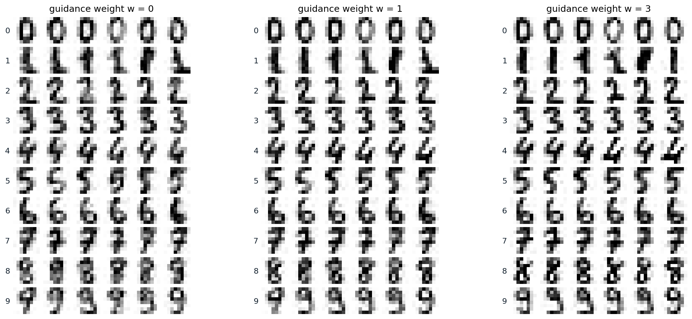
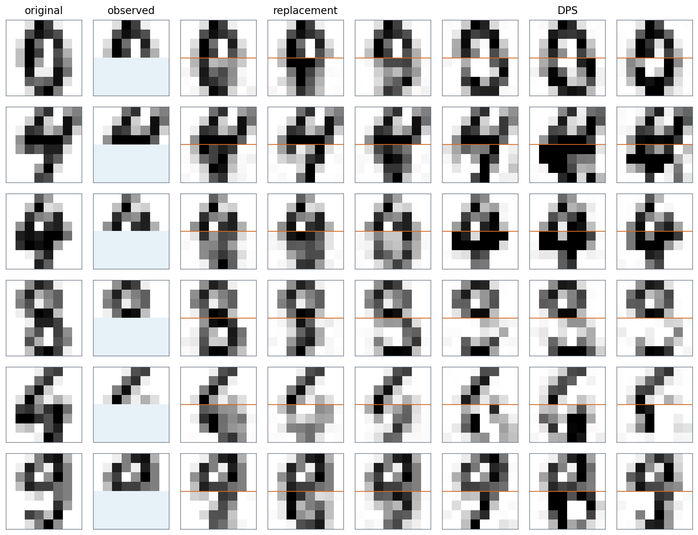

[ML Mastery Notes](../README.md) › [Generative AI](README.md)

# 10. Guidance and Conditional Generation

[← 9. Flow Matching](09-flow-matching.md) · [11. Latent Diffusion and Large-Scale Generation →](11-latent-diffusion-and-large-scale-generation.md)

## <a id="conditional-generation"></a>Conditional generation

### <a id="conditioning-a-denoiser"></a>Conditioning a denoiser

Most uses of a generative model ask for a particular kind of sample: an image of a given class, an image that matches a caption, a completion of a partial image. A diffusion or flow model becomes conditional with almost no change to its training: the denoiser receives the condition $`c`$ as an extra input, $`\epsilon_\theta(x_t,t,c)`$, and the loss is the same regression as before, now over pairs of data and conditions. A class label is embedded and added to the embedding of the time, as in the adaptive normalization of chapter 7; a caption is encoded by a text encoder and attended to by cross-attention (chapter 11); an image, for super-resolution or colorization, is concatenated with the noisy input, as in SR3 ([Saharia et al., 2022](https://arxiv.org/abs/2104.07636)) and Palette ([Saharia et al., 2022](https://arxiv.org/abs/2111.05826)). Each noise level is a separate regression, so the condition can enter anywhere in the network and nothing constrains its form, which is much easier than conditioning an adversarial network (chapter 5).

A conditional model trained this way samples $`p(x\mid c)`$ with its full diversity, including samples that match the condition only loosely. The rest of this chapter is about steering: making samples follow the condition more strongly than the model does by itself, imposing conditions the model was never trained on, and changing what the model has learned.

### <a id="bayes-rule-for-scores"></a>Bayes' rule for scores

Steering rests on one identity. Differentiating Bayes' rule, $`\log p_t(x\mid c)=\log p_t(x)+\log p_t(c\mid x)-\log p(c)`$, with respect to $`x`$ removes the normalizing constant:

$$
\nabla_x\log p_t(x\mid c)=\nabla_x\log p_t(x)+\nabla_x\log p_t(c\mid x).
$$

The conditional score at each noise level is the unconditional score plus the gradient of the log-probability that a noisy sample $`x_t`$ has the attribute $`c`$. An unconditional model can therefore sample conditionally if the second term can be computed or approximated, and scaling that term controls how strongly the condition is imposed.

## <a id="guidance"></a>Guidance

### <a id="classifier-guidance"></a>Classifier guidance

[Dhariwal and Nichol (2021)](https://arxiv.org/abs/2105.05233) trained a classifier $`p_\phi(y\mid x_t)`$ on noisy images at all noise levels and added its gradient, multiplied by a scale $`s`$, to the score of a diffusion model during sampling. Added to an unconditional model, the gradient with $`s=1`$ samples the conditional distribution, and with $`s>1`$ it samples approximately $`p(x\mid y)\,p(y\mid x)^{s-1}`$, which concentrates samples where the classifier is confident, trading diversity for fidelity; added to a class-conditional model, it sharpens the model's own conditional distribution in the same way. On ImageNet at $`256\times256`$, their class-conditional model reached an FID of 10.94 without guidance and 4.59 with $`s=1`$, the first diffusion model to beat BigGAN-deep; the guidance raised the precision of the samples from 0.69 to 0.82 while their recall, a measure of diversity, fell from 0.63 to 0.52, and at $`s=10`$ the recall fell to 0.32 and the FID rose again to 9.11. Classifier guidance has two drawbacks: it needs a separate classifier trained on noisy inputs, and the gradient of a classifier is partly adversarial, improving the classifier's score by changes that do not make the image more like the class.

### <a id="classifier-free-guidance"></a>Classifier-free guidance

[Ho and Salimans (2022)](https://arxiv.org/abs/2207.12598) removed the classifier. Train a single network both conditionally and unconditionally, by replacing the condition with a null token for a random 10% or 20% of training examples; then the difference between its two predictions is the gradient of an implicit classifier, $`\nabla\log p_t(c\mid x)=\nabla\log p_t(x\mid c)-\nabla\log p_t(x)`$, and amplifying it gives **classifier-free guidance** (CFG):

$$
\tilde\epsilon_\theta(x_t,t,c)=(1+w)\,\epsilon_\theta(x_t,t,c)-w\,\epsilon_\theta(x_t,t,\varnothing),
$$

with $`w=0`$ the plain conditional model. Guidance costs two network evaluations per step, usually batched together. On ImageNet $`64\times64`$, a little guidance improved the FID from 1.80 to 1.55 at $`w=0.1`$, and strong guidance maximized the Inception score, 260.2 at $`w=4`$, at the cost of an FID of 26.22. The text-to-image model GLIDE ([Nichol et al., 2022](https://arxiv.org/abs/2112.10741)) found that human raters preferred classifier-free guidance to guidance by the gradient of CLIP, and since then nearly every text-to-image model uses it, typically with a scale $`\gamma=1+w`$ between about 5 and 10. The figure trains a class-conditional DDPM on the digits with the label dropped 10% of the time and samples it at three guidance weights.



*Samples from a class-conditional DDPM on the $`8\times8`$ digits, the MLP of chapter 7 with a learned embedding of the label, trained with the label replaced by a null token for 10% of examples: six samples per class at guidance weights 0, 1, and 3, from the same starting noise. Over 50 samples per class, the logistic-regression classifier of chapter 7 agrees with the requested label for 99.4% of unguided samples and for all guided ones, and its mean probability for the label rises from 0.863 to 0.956 and 0.963, against 0.846 for held-out real digits. The strokes become crisper: the share of pixels within 0.1 of black or white rises from 0.501 to 0.533 and 0.567, against 0.583 for real digits. The variety within a class, the share of pixels that differ between two binarized samples of the same class, falls from 0.148 to 0.131 at $`w=1`$, against 0.174 for real digits; at $`w=3`$ it does not fall further, 0.138, and some samples, such as the heavy 8s, exaggerate their strokes.*

### <a id="what-guidance-samples"></a>What guidance samples

It is tempting to read guidance as sampling the **tilted distribution** $`p(x\mid c)\,p(c\mid x)^w`$, and at each noise level the guided score is exactly the score of $`p_t(x\mid c)\,p_t(c\mid x)^w`$. But these tilted noisy distributions are not the noisy versions of the tilted clean distribution, so the sampler, which moves from one noise level to the next assuming that they are, arrives somewhere else ([Appendix A](#block-gen10-appendix-a)). [Chidambaram et al. (2024)](https://arxiv.org/abs/2409.13074) proved for mixtures that guidance does not sample the tilted distribution and pushes samples toward the boundary of the support of the conditional distribution, away from the other classes, and [Bradley and Nakkiran (2024)](https://arxiv.org/abs/2408.09000) showed that guidance behaves differently with deterministic and stochastic samplers, and that in the limit of small steps it acts as a DDIM step for the conditional distribution followed by Langevin corrector steps for a sharpened one. The code makes the difference concrete with exact scores in one dimension: class 1 has modes at 0.5 and 3 with equal weight, and class 0 a single mode at −1, which overlaps the near mode of class 1.

```python
import numpy as np

rng = np.random.default_rng(0)
# Two classes with equal prior. Class 1: modes at 0.5 and 3 with equal weight; class 0: one mode at -1. All sd 0.5.
comps = {1: (np.array([0.5, 0.5]), np.array([0.5, 3.0])), 0: (np.array([1.0]), np.array([-1.0]))}
s = 0.5


def score(x, sigma, classes):                            # exact score of the noised mixture of the given classes
    w = np.concatenate([0.5 * comps[c][0] for c in classes])
    m = np.concatenate([comps[c][1] for c in classes])
    v = s ** 2 + sigma ** 2
    logits = np.log(w) - (x[:, None] - m) ** 2 / (2 * v)
    r = np.exp(logits - logits.max(1, keepdims=True))
    r /= r.sum(1, keepdims=True)
    return (r * (m - x[:, None])).sum(1) / v


def guided(x, sigma, w):                                  # classifier-free guidance on the scores
    return (1 + w) * score(x, sigma, [1]) - w * score(x, sigma, [0, 1])


sig = (80 ** (1 / 7) + np.linspace(0, 1, 256) * (0.002 ** (1 / 7) - 80 ** (1 / 7))) ** 7   # steps of chapter 8


def ode(w, n=10000):                                      # Heun's method on dx/dsigma = -sigma * score
    x = 80 * rng.standard_normal(n)
    for s0, s1 in zip(sig[:-1], sig[1:]):
        d0 = -s0 * guided(x, s0, w)
        x_e = x + (s1 - s0) * d0
        x = x + (s1 - s0) * 0.5 * (d0 - s1 * guided(x_e, s1, w))
    return x


def sde(w, n=10000):                                      # reverse-time SDE, Euler-Maruyama, 1,000 steps
    x = 80 * rng.standard_normal(n)
    levels = np.geomspace(80, 0.002, 1000)
    for s0, s1 in zip(levels[:-1], levels[1:]):
        x = x + (s0 ** 2 - s1 ** 2) * guided(x, s0, w) + np.sqrt(s0 ** 2 - s1 ** 2) * rng.standard_normal(n)
    return x


grid = np.linspace(-4, 7, 20001)                         # the tilted target p(x | 1) p(1 | x)^w, on a grid
dens = lambda c: sum(wk * np.exp(-(grid - mk) ** 2 / (2 * s ** 2)) for wk, mk in zip(*comps[c]))


def stats(x, weights=None):
    far = x > 1.75
    wts = np.ones_like(x) if weights is None else weights
    share = (wts * far).sum() / wts.sum()
    near = ~far
    mean = (wts * x)[near].sum() / wts[near].sum()
    sd = np.sqrt((wts * (x - mean) ** 2)[near].sum() / wts[near].sum())
    return share, mean, sd


print("               share in the far mode       near mode: mean, sd")
for w in [0.0, 1.0, 3.0]:
    p1, p0 = dens(1), dens(0)
    tilted = p1 * (p1 / (p1 + p0)) ** w
    rows = [("tilted target", stats(grid, tilted)), ("CFG, ODE", stats(ode(w))), ("CFG, SDE", stats(sde(w)))]
    for name, (share, mean, sd) in rows:
        print(f"w = {w:4.1f}  {name:14s}  {share:.3f}                 {mean:+.3f}, {sd:.3f}")
#                share in the far mode       near mode: mean, sd
# w =  0.0  tilted target   0.500                 +0.498, 0.495
# w =  0.0  CFG, ODE        0.491                 +0.492, 0.489
# w =  0.0  CFG, SDE        0.499                 +0.486, 0.501
# w =  1.0  tilted target   0.537                 +0.607, 0.426
# w =  1.0  CFG, ODE        0.773                 +0.894, 0.343
# w =  1.0  CFG, SDE        0.723                 +0.781, 0.393
# w =  3.0  tilted target   0.569                 +0.681, 0.388
# w =  3.0  CFG, ODE        0.996                 +1.309, 0.200
# w =  3.0  CFG, SDE        0.911                 +0.975, 0.373
```

Without guidance, both samplers put half of class 1 in each mode. The tilted distribution reweights the modes only mildly, since the classifier is fairly confident about both, 53.7% in the far mode at $`w=1`$ and 56.9% at $`w=3`$. Guidance moves far more mass: with the probability-flow ODE, 77.3% at $`w=1`$ and 99.6% at $`w=3`$, where the near mode has almost vanished and what remains of it has been pushed rightward and narrowed, and with the reverse SDE somewhat less, 72.3% and 91.1%. The cause is guidance at high noise. There the two classes overlap, the conditional score points toward the mean of class 1 and the unconditional score toward the mean of all data, and their amplified difference pushes every sample to the right before the modes of class 1 have separated, committing it to the far mode. At low noise the modes are separate and guidance only sharpens them.

The same analysis explains recent improvements. [Kynkäänniemi et al. (2024)](https://arxiv.org/abs/2404.07724) found that guidance is harmful at high noise levels, where it drives this loss of diversity, largely unnecessary at low ones, and beneficial only in between; applying it in a limited interval of noise levels improved the FID of the largest EDM2 model on ImageNet $`512\times512`$ from 1.81 to 1.40. **Autoguidance** ([Karras et al., 2024](https://arxiv.org/abs/2406.02507)) replaces the unconditional prediction by that of a smaller, less-trained version of the same conditional model. The difference between a good model and a worse one points away from the worse model's errors, and extrapolating along it improves quality without reducing diversity: FIDs of 1.25 on ImageNet $`512\times512`$ and 1.01 at $`64\times64`$, and an unconditional model improved from 11.67 to 3.86, which shows that much of what guidance does for image quality has little to do with the condition.

### <a id="negative-prompts-and-large-weights"></a>Negative prompts and large weights

Because guidance extrapolates away from the second prediction, the second prediction can be anything. **Negative prompts** replace the unconditional prediction with the prediction for a description of what to avoid, "blurry, extra fingers", so that samples are pushed away from it; the technique appeared in the AUTOMATIC1111 Stable Diffusion web interface in August 2022 ([documentation](https://github.com/AUTOMATIC1111/stable-diffusion-webui/wiki/Negative-prompt)) and spread to every text-to-image system. Large weights have a cost beyond diversity: the extrapolated prediction of the clean image leaves the range of real pixel values, and samples become saturated and overexposed. Imagen ([Saharia et al., 2022](https://arxiv.org/abs/2205.11487)) introduced **dynamic thresholding**: at each step, take the 99.5th percentile $`s`$ of the absolute values of the predicted clean image and, if $`s>1`$, clip the prediction to $`[-s,s]`$ and divide it by $`s`$. [Lin et al. (2024)](https://arxiv.org/abs/2305.08891) instead rescale the guided prediction to the standard deviation of the conditional one, blended with the unrescaled prediction in proportion 0.7 to 0.3.

## <a id="inverse-problems-with-a-diffusion-prior"></a>Inverse problems with a diffusion prior

### <a id="posterior-sampling"></a>Posterior sampling

Many problems in imaging observe a degraded version of an unknown image, $`y=\mathcal A(x)+\text{noise}`$: a blurred or low-resolution image, an image with missing pixels, a set of measurements in a scanner. A trained unconditional model is a prior $`p(x)`$, and solving the problem means sampling the posterior $`p(x\mid y)`$, whose score at noise level $`t`$ is $`\nabla\log p_t(x)+\nabla\log p_t(y\mid x_t)`$. The first term is the model; the second is the problem. It is intractable, because the measurement depends on the clean image, and the clean image given $`x_t`$ is uncertain:

$$
p_t(y\mid x_t)=\int p(y\mid x_0)\,p(x_0\mid x_t)\,dx_0 .
$$

Training a conditional model on pairs of degraded and clean images, as SR3 and Palette do, avoids the problem but needs a model for every task. Methods that approximate the likelihood term instead use one unconditional model for many tasks without retraining, an idea that goes back to [Kadkhodaie and Simoncelli (2021)](https://proceedings.neurips.cc/paper/2021/hash/6e28943943dbed3c7f82fc05f269947a-Abstract.html), who solved linear inverse problems with the prior implicit in a denoiser.

### <a id="replacement-and-projection"></a>Replacement and projection

For inpainting, where part of the image is observed exactly, the simplest method runs the reverse process on the whole image and, after every step, overwrites the observed pixels with the observation noised to the current level, as [Song et al. (2021)](https://arxiv.org/abs/2011.13456) did for imputation. The unobserved pixels then see the observation at every noise level, but only through the next denoising step, and they are often inconsistent with it: the two halves of the image are denoised as if they were independent at each step. **RePaint** ([Lugmayr et al., 2022](https://arxiv.org/abs/2201.09865)) harmonizes them by resampling: after a block of reverse steps it adds noise to jump back up ten steps and denoises again, repeating this ten times. For general linear measurements, DDRM ([Kawar et al., 2022](https://arxiv.org/abs/2201.11793)) works in the singular-vector basis of the measurement operator, and ΠGDM ([Song et al., 2023](https://openreview.net/forum?id=9_gsMA8MRKQ)) uses its pseudoinverse with a Gaussian approximation of $`p(x_0\mid x_t)`$.

### <a id="diffusion-posterior-sampling"></a>Diffusion posterior sampling

**Diffusion posterior sampling** (DPS; [Chung et al., 2023](https://arxiv.org/abs/2209.14687)) approximates the posterior over clean images by its mean, $`p_t(y\mid x_t)\approx p\bigl(y\mid\hat x_0(x_t)\bigr)`$, where $`\hat x_0`$ is the denoiser's prediction, and adds the gradient of the resulting log-likelihood after each reverse step, with a step size $`\zeta_t=\zeta/\|y-\mathcal A(\hat x_0)\|`$. The gradient passes back through the denoiser, and the Jacobian of the denoiser is the posterior covariance of the clean image scaled by the noise variance, so a residual in the observed pixels changes the unobserved ones in proportion to how they covary ([Appendix B](#block-gen10-appendix-b)). Because it needs only a differentiable $`\mathcal A`$ and a likelihood, DPS handles nonlinear problems such as phase retrieval and nonuniform deblurring and noise that is not Gaussian. Its approximation is crude at high noise, where $`p(x_0\mid x_t)`$ is broad, and its step size must be tuned. The code compares replacement and DPS with the exact posterior for the eight Gaussians of chapter 6 as the prior, given a noisy measurement of the first coordinate that is consistent with two modes.

```python
import numpy as np
import torch

torch.manual_seed(0)
angles = torch.arange(8) * (2 * np.pi / 8)
mu = 2 * torch.stack([torch.cos(angles), torch.sin(angles)], 1)
w, s = torch.arange(1, 9) / 36, 0.1                        # the eight Gaussians of chapter 6 as the prior
y, tau = 2 * np.cos(np.pi / 4), 0.05                        # a noisy measurement of the first coordinate


def denoise(x, sigma):                                     # E[x0 | x0 + sigma * eps = x] under the prior
    v = s ** 2 + sigma ** 2
    r = torch.softmax(torch.log(w) - ((x[:, None, :] - mu) ** 2).sum(-1) / (2 * v), 1)
    return (r[:, :, None] * (mu + s ** 2 / v * (x[:, None, :] - mu))).sum(1)


# The exact posterior is again a mixture: each component is reweighted by how well it explains y.
post = w * torch.exp(-(y - mu[:, 0]) ** 2 / (2 * (s ** 2 + tau ** 2)))
post /= post.sum()
sd1 = s * tau / np.sqrt(s ** 2 + tau ** 2)                 # posterior sd of the first coordinate
print(f"exact posterior      lower right {post[7]:.3f}, upper right {post[1]:.3f}, elsewhere {1 - post[7] - post[1]:.3f}; "
      f"first coordinate {y:.3f} +- {sd1:.3f}")
levels = torch.tensor(np.geomspace(80, 0.002, 500), dtype=torch.float32)


def sample(method, zeta=None, n=2000):                     # reverse-time SDE with the prior's exact score
    x = 80 * torch.randn(n, 2)
    for s0, s1 in zip(levels[:-1], levels[1:]):
        x = x.detach().requires_grad_(method == "dps")
        d = denoise(x, s0)
        x_new = x + (s0 ** 2 - s1 ** 2) * (d - x) / s0 ** 2 + (s0 ** 2 - s1 ** 2).sqrt() * torch.randn_like(x)
        if method == "replacement":                        # overwrite the measured coordinate, noised to level s1
            x_new[:, 0] = y + s1 * torch.randn(n)
        else:                                              # DPS: a step down the gradient of the residual of x0-hat
            grad = torch.autograd.grad((y - d[:, 0]).abs().sum(), x)[0]
            x_new = x_new - zeta * grad
        x = x_new.detach()
    return x


for method, zeta in [("replacement", None), ("dps", 0.03), ("dps", 0.1), ("dps", 0.3), ("dps", 1.0)]:
    x = sample(method, zeta)
    lower = ((x - mu[7]).norm(dim=1) < 0.3).float().mean().item()
    upper = ((x - mu[1]).norm(dim=1) < 0.3).float().mean().item()
    name = method if zeta is None else f"DPS, step {zeta}"
    print(f"{name:20s} lower right {lower:.3f}, upper right {upper:.3f}, elsewhere {1 - lower - upper:.3f}; "
          f"first coordinate {x[:, 0].mean():.3f} +- {x[:, 0].std():.3f}")
# exact posterior      lower right 0.800, upper right 0.200, elsewhere 0.000; first coordinate 1.414 +- 0.045
# replacement          lower right 0.695, upper right 0.273, elsewhere 0.032; first coordinate 1.414 +- 0.002
# DPS, step 0.03       lower right 0.553, upper right 0.220, elsewhere 0.227; first coordinate 1.414 +- 0.017
# DPS, step 0.1        lower right 0.740, upper right 0.235, elsewhere 0.024; first coordinate 1.414 +- 0.056
# DPS, step 0.3        lower right 0.782, upper right 0.194, elsewhere 0.024; first coordinate 1.414 +- 0.161
# DPS, step 1.0        lower right 0.002, upper right 0.001, elsewhere 0.997; first coordinate 1.416 +- 0.509
```

The measurement leaves two candidate modes, and the exact posterior gives them 80% and 20%, their prior weights. Replacement finds both but in the wrong proportion, 69.5% and 27.3%, puts 3.2% of samples elsewhere, and pins the first coordinate to the measurement, with a spread of 0.002 instead of 0.045, since overwriting treats a noisy measurement as exact. DPS depends on its step size. With 0.03 the correction is too weak and 22.7% of samples miss both modes; with 0.1 and 0.3 the proportions approach the exact ones, 78.2% and 19.4% at 0.3, but the first coordinate scatters too widely, 0.161; and with 1.0 the corrections overshoot and almost no sample lands near a mode. No setting reproduces both the proportions and the spread, because the method replaces a distribution over clean points by its mean. The figure applies both methods to the digits, completing the lower half of held-out digits from the upper half with the unconditional model of the previous figure.



*Completing the lower half of held-out digits from the upper half, shaded blue where missing, with the unconditional predictions of the same model: three completions each by replacement and by DPS with step size 1, with an orange line at the boundary. Replacement keeps the observed half exactly but often produces a lower half that does not continue the strokes above it, as in the blurred loops of the first row. DPS gives sharper and more coherent completions that vary more, and adjusts the observed half slightly, a mean squared error of 0.027 there. Over three completions of each of 200 held-out digits, the classifier assigns the true label to 58.3% of replacement completions and 64.0% of DPS completions. The squared error on the missing half is 0.392 for replacement and 0.456 for DPS: the upper half of a digit is often consistent with several digits, and a sharp completion of the wrong one costs more squared error than a blurred one.*

## <a id="editing-and-control"></a>Editing and control

### <a id="editing-by-noising-and-inversion"></a>Editing by noising and inversion

A diffusion model can edit an existing image by noising it partway and denoising it under a new condition. **SDEdit** ([Meng et al., 2022](https://arxiv.org/abs/2108.01073)) takes a guide, such as a rough painting, adds noise up to an intermediate time $`t_0`$, and runs the reverse process from there: small $`t_0`$ keeps the guide's details, large $`t_0`$ keeps only its layout and produces a more realistic image, and $`t_0`$ between 0.3 and 0.6 of the full process works well for reasonable guides. Precise edits of real photographs need the exact noise that would regenerate the photograph, which **DDIM inversion** provides by running the deterministic sampler forward in time ([Appendix C](#block-gen10-appendix-c)). Inversion is accurate without guidance but not with it, since guidance amplifies the small errors of each inverted step; **null-text inversion** ([Mokady et al., 2023](https://arxiv.org/abs/2211.09794)) fixes this by optimizing the embedding used for the unconditional prediction at each step so that guided sampling reproduces the photograph. Edits then change the prompt while keeping the rest of the computation, for example by reusing the cross-attention maps that tie each word of the prompt to regions of the image, so that "a cat on a bench" becomes "a dog on a bench" with the same bench (**Prompt-to-Prompt**; [Hertz et al., 2022](https://arxiv.org/abs/2208.01626)).

### <a id="adding-control-signals"></a>Adding control signals

Text is a weak way to specify a layout, a pose, or a shape. **ControlNet** ([Zhang, Rao, and Agrawala, 2023](https://arxiv.org/abs/2302.05543)) adds spatial conditions such as edge maps, depth maps, segmentations, and human poses to a pretrained text-to-image model without changing it: the model's weights are locked, a trainable copy of its encoder receives the condition, and the copy's outputs are added to the original network through convolutions initialized to zero, so that training starts from the unchanged model and cannot damage it early. Training is robust with datasets of fewer than 50,000 pairs as well as with millions, and the paper received the best paper award at ICCV 2023. Lighter adapters do the same with fewer parameters, T2I-Adapter ([Mou et al., 2023](https://arxiv.org/abs/2302.08453)) for spatial conditions and IP-Adapter ([Ye et al., 2023](https://arxiv.org/abs/2308.06721)) for image prompts through added cross-attention layers. At the other extreme, **universal guidance** ([Bansal et al., 2024](https://openreview.net/forum?id=pzpWBbnwiJ)) needs no training at all: it applies the gradients of off-the-shelf segmentation, detection, or face-recognition networks to the predicted clean image, as DPS does with a measurement.

### <a id="personalization"></a>Personalization

To generate a particular subject, a person, a pet, or a product, from a few photographs, one fine-tunes the model. **Textual inversion** ([Gal et al., 2023](https://arxiv.org/abs/2208.01618)) keeps the model frozen and learns only the embedding of a new word from 3 to 5 images, so that prompts using the word depict the subject. **DreamBooth** ([Ruiz et al., 2023](https://arxiv.org/abs/2208.12242)) fine-tunes the whole model on the images with prompts such as "a [V] dog", where [V] is a rare token, and adds a **prior-preservation loss** on images of dogs generated by the original model, so that the model does not forget what other dogs look like or come to draw every dog as the subject. Custom Diffusion ([Kumari et al., 2023](https://arxiv.org/abs/2212.04488)) updates only the key and value projections of the cross-attention layers, about 3% of the weights, and low-rank adapters (NLP chapter 10) are the most common way to share such fine-tuned subjects and styles.

### <a id="aligning-with-rewards-and-preferences"></a>Aligning with rewards and preferences

Guidance steers each sample; fine-tuning against a reward steers the model. The reward may be a learned predictor of aesthetic quality, a model of human preferences, the agreement between an image and its prompt judged by a vision–language model, or a simple property such as compressibility. **DDPO** ([Black et al., 2024](https://arxiv.org/abs/2305.13301)) treats the denoising chain as a sequence of decisions, each reverse step a stochastic action with a Gaussian likelihood, and applies policy gradients to maximize the reward of the final image; DPOK ([Fan et al., 2023](https://arxiv.org/abs/2305.16381)) adds a KL penalty that keeps the model near its original. Since most rewards are differentiable networks, one can also backpropagate the reward through the sampling chain, fully or through only its last $`K`$ steps, as DRaFT does ([Clark et al., 2024](https://arxiv.org/abs/2309.17400)), or through a single denoising step, as ReFL does with the ImageReward model trained on 137,000 expert comparisons ([Xu et al., 2023](https://arxiv.org/abs/2304.05977)). **Diffusion-DPO** ([Wallace et al., 2024](https://arxiv.org/abs/2311.12908)) adapts direct preference optimization (NLP chapter 11) to diffusion by replacing the intractable likelihoods with their variational bounds, and fine-tuned Stable Diffusion XL on 851,000 crowdsourced preference pairs. As with language models, a model optimized hard against a learned reward finds ways to exploit it, such as oversaturated colors that an aesthetic predictor likes. The policy-gradient methods, the KL-regularized objective, and reward hacking are developed in the RL module; here it suffices that fine-tuning a sampler against a reward is a reinforcement-learning problem whose policy is the reverse chain.

## <a id="appendices"></a>Appendices


<details>
<summary><a id="block-gen10-appendix-a"></a><b>A. Guidance and the tilted distribution</b></summary>


**The guided score.** With $`\epsilon_\theta=-\sigma_t\,s_\theta`$, the guided prediction corresponds to the score $`(1+w)\nabla\log p_t(x\mid c)-w\nabla\log p_t(x)`$. By Bayes' rule for scores this is $`\nabla\log p_t(x\mid c)+w\nabla\log p_t(c\mid x)`$, the score of $`q_t(x)\propto p_t(x\mid c)\,p_t(c\mid x)^w`$ at each noise level.

**Why the sampler does not produce $`q_0`$.** A sampler that follows the scores of a family of distributions $`q_t`$ from high noise to low reproduces $`q_0`$ only if $`q_t`$ is the noised version of $`q_0`$, that is, if $`q_t=q_0*\mathcal N(0,\sigma_t^2)`$ for every $`t`$ (up to scaling). For $`w=0`$ this holds, since noising the conditional distribution gives the noisy conditional. For $`w\ne0`$ it fails: the noised version of $`p_0(x\mid c)\,p_0(c\mid x)^w`$ is not $`p_t(x\mid c)\,p_t(c\mid x)^w`$, because noising, a convolution, does not commute with multiplying by a power of the classifier. At high noise, $`p_t(c\mid x)`$ varies slowly across the space, and raising it to a power tilts the whole distribution toward the regions most typical of $`c`$, which is where samples commit to; the result depends on the sampler and on how long it spends at each noise level, which is why the ODE and SDE samplers in the code differ.

</details>


<details>
<summary><a id="block-gen10-appendix-b"></a><b>B. The DPS approximation and the denoiser's Jacobian</b></summary>


**Approximation.** $`p_t(y\mid x_t)=\mathbb E\bigl[p(y\mid x_0)\mid x_t\bigr]`$, and DPS replaces the expectation of the likelihood by the likelihood of the expectation, $`p(y\mid\mathbb E[x_0\mid x_t])`$. The two agree when $`p(x_0\mid x_t)`$ is concentrated, at low noise, and can differ greatly at high noise, where the posterior over clean images is broad or multimodal and its mean may not be a plausible image at all.

**Gradient.** For Gaussian measurement noise of variance $`\tau^2`$ and a linear operator $`A`$, $`\nabla_{x_t}\log p(y\mid\hat x_0)=-\tau^{-2}J^\top A^\top(A\hat x_0-y)`$ with $`J=\partial\hat x_0/\partial x_t`$. In the form $`x_t=x_0+\sigma\epsilon`$, Tweedie's formula $`\hat x_0=x_t+\sigma^2\nabla\log p_\sigma(x_t)`$ differentiates to $`J=I+\sigma^2\nabla^2\log p_\sigma(x_t)=\operatorname{Cov}[x_0\mid x_t]/\sigma^2`$, the second-order Tweedie formula. The correction is the residual in measurement space mapped back through $`A^\top`$ and multiplied by the posterior covariance, so it moves an unobserved pixel in proportion to its posterior covariance with the observed ones. Replacement methods change only the observed pixels and rely on later denoising steps to propagate the change, which is why their completions are less coherent.

</details>


<details>
<summary><a id="block-gen10-appendix-c"></a><b>C. DDIM inversion</b></summary>


The deterministic DDIM step from $`t`$ to $`t-1`$ is $`x_{t-1}=\sqrt{\bar\alpha_{t-1}}\,\hat x_0(x_t)+\sqrt{1-\bar\alpha_{t-1}}\,\epsilon_\theta(x_t,t)`$, with $`\hat x_0(x_t)=\bigl(x_t-\sqrt{1-\bar\alpha_t}\,\epsilon_\theta(x_t,t)\bigr)/\sqrt{\bar\alpha_t}`$. To invert it, one needs $`x_t`$ from $`x_{t-1}`$, which requires $`\epsilon_\theta(x_t,t)`$ at the unknown $`x_t`$. Inversion approximates it by $`\epsilon_\theta(x_{t-1},t)`$, assuming the predicted noise changes little over one step, and sets $`x_t=\sqrt{\bar\alpha_t}\,\hat x_0+\sqrt{1-\bar\alpha_t}\,\epsilon_\theta(x_{t-1},t)`$ with $`\hat x_0`$ computed from $`x_{t-1}`$ at level $`t-1`$. The error of each step is small, of the order of the change of the predicted noise over a step, and running the sampler back from the inverted $`x_T`$ reconstructs the image closely. With guidance weight $`w`$, the predicted noise is an extrapolation whose errors are multiplied by about $`1+w`$, so the inversion drifts, which null-text inversion corrects by optimization.

</details>

---

[← 9. Flow Matching](09-flow-matching.md) · [11. Latent Diffusion and Large-Scale Generation →](11-latent-diffusion-and-large-scale-generation.md)
