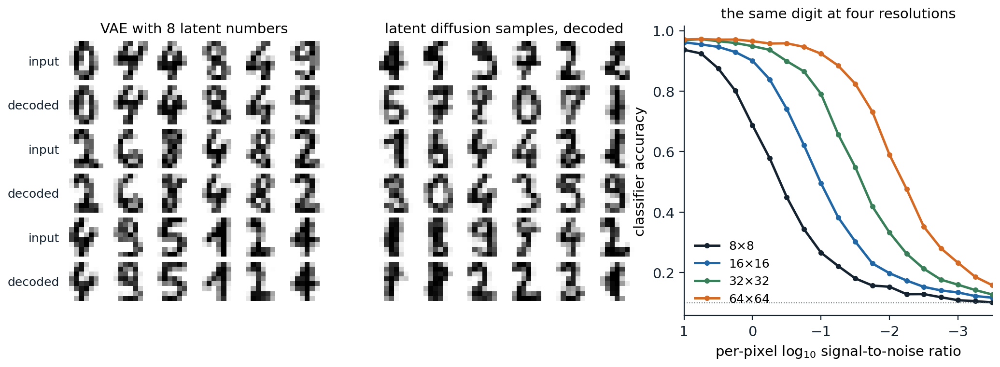

[Background Notes](../README.md) › [Generative AI](README.md)

# 11. Latent Diffusion and Large-Scale Generation

[← 10. Guidance and Conditional Generation](10-guidance-and-conditional-generation.md) · [12. Discrete Tokens and Multimodal Generation →](12-discrete-tokens-and-multimodal-generation.md)

## <a id="why-generate-in-a-latent-space"></a>Why generate in a latent space

### <a id="most-bits-are-imperceptible"></a>Most bits are imperceptible

A diffusion model in pixel space spends its capacity and its compute on every pixel at every step. Chapter 7 noted that most of the codelength of a pixel-space model describes details too fine to see (chapter 7), and the same is true of its computation: a network that denoises a $`512\times512\times3`$ image hundreds of times per sample processes 786,432 numbers at each step, most of which encode texture that a viewer would not miss if it were replaced by other plausible texture. [Rombach et al. (2022)](https://arxiv.org/abs/2112.10752) separated the two kinds of compression. An autoencoder performs **perceptual compression**, removing high-frequency detail that can be regenerated by a decoder, and a diffusion model trained on its latents performs **semantic compression**, learning the content and composition of images. The resulting **latent diffusion models** made high-resolution generation affordable, and their text-to-image version, released as Stable Diffusion, made it widely available.

### <a id="cascades-and-pixel-space"></a>Cascades and pixel space

The alternative to a latent space is a hierarchy of resolutions. **Cascaded diffusion models** ([Ho et al., 2022](https://arxiv.org/abs/2106.15282)) generate a small image and then enlarge it with a chain of super-resolution diffusion models, each conditioned on the output of the previous one. Because the upsamplers are trained on real low-resolution images but applied to generated ones, they are trained on low-resolution inputs corrupted with noise or blur, a **conditioning augmentation** that makes them robust to the artifacts of the stage before; the cascade reached an FID of 4.88 on ImageNet at $`256\times256`$ without guidance. Imagen ([Saharia et al., 2022](https://arxiv.org/abs/2205.11487)) generated at $`64\times64`$ and upsampled to 256 and then 1024 with U-Nets of 2 billion, 600 million, and 400 million parameters, and DALL·E 2 ([Ramesh et al., 2022](https://arxiv.org/abs/2204.06125)) used a diffusion **prior** that maps a caption to a CLIP image embedding and a diffusion decoder, with upsamplers, that turns the embedding into an image. Pixel-space diffusion without cascades has also been made to work at high resolution by shifting the noise schedule, as described below: **simple diffusion** ([Hoogeboom, Heek, and Salimans, 2023](https://arxiv.org/abs/2301.11093)) trained a single model end to end at $`512\times512`$, and its successor reached an FID of 1.48 on ImageNet at that resolution ([Hoogeboom et al., 2025](https://arxiv.org/abs/2410.19324)). Latent diffusion remains the standard because it is cheaper for the same quality, especially for video.

## <a id="the-autoencoder"></a>The autoencoder

### <a id="latent-diffusion"></a>Latent diffusion

The autoencoder of latent diffusion is trained once, before the diffusion model, and then frozen. Its encoder maps an image of size $`H\times W\times3`$ to a latent grid of size $`\frac Hf\times\frac Wf\times c`$, keeping a spatial layout so that convolutional and transformer denoisers apply to it as they would to an image. Pixel-wise squared error alone would make the decoder's outputs blurry, since averaging over plausible details minimizes it (chapter 3), so the autoencoder is trained as in VQGAN ([Esser, Rombach, and Ommer, 2021](https://arxiv.org/abs/2012.09841)) with a perceptual loss, a distance between the features of a pretrained network, and a patch-based adversarial loss that rewards realistic local texture (chapter 5). A slight KL penalty toward a standard Gaussian, with weight $`10^{-6}`$ in the released configurations, or a vector quantization layer keeps the latent space from spreading arbitrarily; the result is a VAE in name, but its latents carry nearly all the information of the image. Before diffusion, the latents are rescaled to unit variance, by the factor 0.18215 in Stable Diffusion.

Rombach et al. compared downsampling factors $`f`$ from 1 to 32. With $`f=1`$, pixel space, training was slow, and after 2 million steps the FID of the pixel-space model trailed that of $`f=8`$ by 38; with $`f=16`$ or 32, the autoencoder discarded too much and quality stopped improving. Factors of 4 to 8 were the best trade-off, and their class-conditional model on ImageNet at $`256\times256`$ with $`f=4`$ reached an FID of 3.60 with classifier-free guidance, with far less compute than pixel-space diffusion and sampling at least 2.7 times faster. Stable Diffusion v1 uses $`f=8`$ with $`c=4`$ channels, so a $`512\times512\times3`$ image becomes a $`64\times64\times4`$ latent, 48 times fewer numbers. The code applies the same two stages to the $`8\times8`$ digits: a VAE with a weak KL penalty compresses the 64 pixels to 8 numbers, and a DDPM is trained on the rescaled latents.

```python
import numpy as np
import torch
from torch import nn
from sklearn.datasets import load_digits
from sklearn.linear_model import LogisticRegression

torch.set_num_threads(1)
torch.manual_seed(0)
digits = load_digits()
perm = np.random.default_rng(0).permutation(len(digits.data))
X, y = digits.data[perm] / 8 - 1, digits.target[perm]
train, test = torch.tensor(X[:1500], dtype=torch.float32), torch.tensor(X[1500:], dtype=torch.float32)
clf = LogisticRegression(max_iter=5000, C=0.1).fit(X[:1500], y[:1500])

# Stage 1: a small VAE compresses 64 pixels to 8 latent numbers, with a weak KL penalty as in latent diffusion.
Z = 8
enc = nn.Sequential(nn.Linear(64, 256), nn.SiLU(), nn.Linear(256, 256), nn.SiLU(), nn.Linear(256, 2 * Z))
dec = nn.Sequential(nn.Linear(Z, 256), nn.SiLU(), nn.Linear(256, 256), nn.SiLU(), nn.Linear(256, 64), nn.Tanh())
opt = torch.optim.Adam([*enc.parameters(), *dec.parameters()], lr=1e-3)
for step in range(3000):
    x = train[torch.randint(1500, (256,))]
    mean, logvar = enc(x).chunk(2, 1)
    z = mean + (0.5 * logvar).exp() * torch.randn_like(mean)
    kl = 0.5 * (mean ** 2 + logvar.exp() - 1 - logvar).sum(1)
    loss = ((dec(z) - x) ** 2).sum(1).mean() + 0.01 * kl.mean()
    opt.zero_grad()
    loss.backward()
    opt.step()
with torch.no_grad():
    lat = enc(train).chunk(2, 1)[0]
    scale = lat.std()                                     # rescale the latents to unit variance
    lat = lat / scale
    recon = dec(enc(test).chunk(2, 1)[0]).numpy()
print(f"autoencoder: held-out reconstruction error {np.mean((recon - X[1500:]) ** 2):.4f} per pixel; classifier "
      f"agrees with the true label on {np.mean(clf.predict(recon) == y[1500:]):.3f} of reconstructions "
      f"({clf.score(X[1500:], y[1500:]):.3f} on the originals)")

# Stage 2: a DDPM on the 8-dimensional latents.
T = 1000
beta = torch.linspace(1e-4, 0.02, T)
abar = torch.cumprod(1 - beta, 0)
freqs = torch.exp(-np.log(1000) * torch.arange(16) / 16)
embed = lambda t: torch.cat([(t[:, None].float() * freqs).sin(), (t[:, None].float() * freqs).cos()], 1)
net = nn.Sequential(nn.Linear(Z + 32, 256), nn.SiLU(), nn.Linear(256, 256), nn.SiLU(), nn.Linear(256, 256), nn.SiLU(),
                    nn.Linear(256, Z))
opt = torch.optim.Adam(net.parameters(), lr=1e-3)
for step in range(6000):
    z0 = lat[torch.randint(1500, (256,))]
    t = torch.randint(T, (256,))
    e = torch.randn_like(z0)
    zt = abar[t].sqrt()[:, None] * z0 + (1 - abar[t]).sqrt()[:, None] * e
    loss = ((net(torch.cat([zt, embed(t)], 1)) - e) ** 2).mean()
    opt.zero_grad()
    loss.backward()
    opt.step()
with torch.no_grad():
    gen = torch.Generator().manual_seed(1)
    z = torch.randn(1000, Z, generator=gen)
    for t in reversed(range(T)):
        e = net(torch.cat([z, embed(torch.full((1000,), t))], 1))
        z = (z - beta[t] / (1 - abar[t]).sqrt() * e) / (1 - beta[t]).sqrt()
        if t > 0:
            z = z + beta[t].sqrt() * torch.randn(z.shape, generator=gen)
    samples = dec(z * scale).numpy()
p = clf.predict_proba(samples)
counts = np.bincount(p.argmax(1), minlength=10)
nn_dist = np.sqrt(((samples[:, None] - X[None, :1500]) ** 2).sum(-1)).min(1)
print(f"samples: mean top-class probability {p.max(1).mean():.3f} (held-out digits "
      f"{clf.predict_proba(X[1500:]).max(1).mean():.3f}); classes {counts.min()} to {counts.max()} of 1,000; "
      f"median distance to the nearest training image {np.median(nn_dist):.2f}")
# autoencoder: held-out reconstruction error 0.0417 per pixel; classifier agrees with the true label on 0.949 of reconstructions (0.970 on the originals)
# samples: mean top-class probability 0.799 (held-out digits 0.852); classes 76 to 117 of 1,000; median distance to the nearest training image 2.12
```

The autoencoder bounds what the whole system can achieve: its reconstructions of held-out digits have a squared error of 0.042 per pixel, and the classifier recognizes 94.9% of them, against 97.0% of the originals. Within that bound, the latent model does well with little computation. Its samples receive a mean top-class probability of 0.799 from the classifier, against 0.852 for real digits and 0.731 for the pixel-space DDPM of chapter 7, which used a network twice as wide on eight times as many numbers for two and a half times as many steps, and every class is represented. On the machine used for these notes, both stages trained in well under a minute, against about three minutes for the pixel-space model.



*Left: held-out digits and their reconstructions by the VAE of the code, whose 8 latent numbers keep the identity and most of the shape of each digit but smooth its strokes. Middle: 36 samples of the DDPM trained on the latents, decoded. Right: the accuracy of the classifier on held-out digits at $`8\times8`$ and upsampled to $`16\times16`$, $`32\times32`$, and $`64\times64`$, noised at the per-pixel signal-to-noise ratio on the horizontal axis, and average-pooled back to $`8\times8`$; chance is 0.1. The four curves are copies of one another, shifted by $`2\log_{10}2\approx0.6`$ for each doubling of the resolution.*

### <a id="what-the-latent-space-should-be"></a>What the latent space should be

The number of latent channels trades reconstruction against ease of generation. More channels preserve more detail, such as small text and faces, which the decoder of Stable Diffusion v1 often garbles, but give the diffusion model more to learn. Stable Diffusion 3 ([Esser et al., 2024](https://arxiv.org/abs/2403.03206)) found that 16 channels reconstruct much better than 4 and that the generation quality they allow is realized only by larger diffusion models. The structure of the latent space matters as well as its size. A diffusion model learns faster when its internal representations resemble those of good visual encoders: **REPA** ([Yu et al., 2025](https://arxiv.org/abs/2410.06940)) adds a loss that aligns the hidden states of a diffusion transformer with the features of a pretrained self-supervised encoder, DINOv2 (DL chapter 10), and reached the FID of the unaligned model more than 17 times faster, and 1.42 on ImageNet $`256\times256`$ with longer training. In the language of chapter 3, a latent diffusion model is a VAE whose prior is a diffusion model, and training the two jointly is possible ([Vahdat, Kreis, and Kautz, 2021](https://arxiv.org/abs/2106.05931)), though the two-stage recipe is simpler and dominates in practice ([Appendix C](#block-gen11-appendix-c)).

## <a id="conditioning-on-text"></a>Conditioning on text

### <a id="frozen-text-encoders"></a>Frozen text encoders

A text-to-image model needs a representation of the prompt. The original latent diffusion model trained a transformer text encoder jointly with the denoiser on 400 million image–caption pairs; Stable Diffusion v1 instead used the frozen text encoder of CLIP ViT-L/14, with 123 million parameters, beside an 860-million-parameter U-Net (CLIP is covered in DL chapter 10). Imagen used the frozen encoder of the language model T5-XXL, with 4.6 billion parameters, and found that scaling the text encoder improved alignment and image quality more than scaling the U-Net; on a benchmark of challenging compositional prompts, human raters also preferred images conditioned on T5-XXL to those conditioned on CLIP's text encoder. Later systems combine several encoders; SDXL ([Podell et al., 2023](https://arxiv.org/abs/2307.01952)) used two CLIP encoders with a 2.6-billion-parameter U-Net, and Stable Diffusion 3 two CLIP encoders and T5-XXL.

### <a id="cross-attention"></a>Cross-attention

The denoiser reads the prompt through **cross-attention**: at several layers, the image features supply the queries, and the sequence of token embeddings from the text encoder supplies the keys and values, so that each spatial position gathers information from the words relevant to it, as a decoder attends to its source sentence in translation (DL chapter 9; [Appendix B](#block-gen11-appendix-b)). The attention maps tie each word to a region of the image, which is what the editing methods of chapter 10 manipulate. The model can only follow what the captions of its training data describe, and web alt-text is short and often unrelated to the image. DALL·E 3 ([Betker et al., 2023](https://cdn.openai.com/papers/dall-e-3.pdf)) trained a captioner to write detailed descriptions and retrained the generator on a mixture of 95% synthetic captions and 5% original ones, which greatly improved how closely images followed long prompts; recaptioning has since become a standard part of the data pipeline.

## <a id="architectures"></a>Architectures

### <a id="from-u-nets-to-transformers"></a>From U-Nets to transformers

The denoisers of the first latent diffusion models were U-Nets in the style of chapter 7 with self-attention and cross-attention blocks at the lower resolutions. **Diffusion transformers** (DiT; [Peebles and Xie, 2023](https://arxiv.org/abs/2212.09748)) replaced the U-Net with a vision transformer (DL chapter 9): the latent grid is cut into patches of $`p\times p`$ positions, each patch becomes a token, and the transformer's output tokens are reshaped back into a predicted noise grid. The step and class condition the blocks through **adaLN-Zero**: they are mapped to a scale, a shift, and a gate for each block's normalization and residual branch, and the gates start at zero so that every block begins as the identity, which trained better than cross-attention to the condition or appending it as tokens. DiT found a strong negative correlation between the compute of a model, in Gflops per forward pass, and its FID, whether the compute came from more layers, wider layers, or smaller patches, which produce more tokens. The largest, DiT-XL/2 with 675 million parameters and patches of $`2\times2`$, reached an FID of 2.27 on ImageNet at $`256\times256`$ with guidance. Transformers scale more predictably than U-Nets, treat text and image tokens alike, and extend to video by adding a time axis to the patches, which is why nearly all large generators since 2024 use them.

### <a id="rectified-flow-transformers-at-scale"></a>Rectified-flow transformers at scale

Stable Diffusion 3 ([Esser et al., 2024](https://arxiv.org/abs/2403.03206)) combined the transformer with the flow matching objective of chapter 9. Its **MM-DiT** keeps separate weights for the text tokens and the image tokens but lets them attend to each other in a joint attention over the concatenated sequence, so that the text representation is refined by the image as well as the reverse. Among 61 training formulations, rectified flow with times sampled from a logit-normal distribution, which concentrates training on the intermediate noise levels, ranked best; normalizing the queries and keys before attention kept training stable at high resolution; and a model of 8 billion parameters equaled or outperformed the open and closed systems of the time, including DALL·E 3, Midjourney v6, and Ideogram v1, in human evaluations of prompt following and typography. FLUX.1 ([Black Forest Labs, 2024](https://bfl.ai/blog/24-08-01-bfl)), a 12-billion-parameter rectified-flow transformer by several of the same authors, followed the same design. [Karras et al. (2024)](https://arxiv.org/abs/2312.02696) showed how much the training dynamics matter at this scale: redesigning every layer to preserve the magnitudes of activations and weights, and choosing the averaging length of the weights after training rather than before, brought their latent model on ImageNet $`512\times512`$ to an FID of 1.81, from a previous best of 2.41.

## <a id="resolution-noise-and-data"></a>Resolution, noise, and data

### <a id="larger-images-need-more-noise"></a>Larger images need more noise

A noise schedule tuned at one resolution is wrong at another. The neighboring pixels of a large image are nearly redundant, so averaging them recovers the coarse structure from noise that would destroy a small image; a model trained with the same per-pixel schedule at high resolution sees the global layout of the image survive until late in the forward process and spends few steps learning to generate it. The code upsamples the held-out digits to four resolutions, noises every pixel at the same signal-to-noise ratio, and classifies the average-pooled images, which is the best a classifier can do with this kind of noise.

```python
import numpy as np
from sklearn.datasets import load_digits
from sklearn.linear_model import LogisticRegression

rng = np.random.default_rng(0)
digits = load_digits()
perm = rng.permutation(len(digits.data))
X, y = digits.data[perm] / 8 - 1, digits.target[perm]
clf = LogisticRegression(max_iter=5000, C=0.1).fit(X[:1500], y[:1500])
test, y_test = X[1500:], y[1500:]
imgs = test.reshape(-1, 8, 8)


def accuracy(k, log10_snr, reps=20):
    """Upsample the held-out digits k-fold, noise every pixel at the given signal-to-noise ratio as a diffusion
    model would, average-pool back to 8x8, and classify. Pooling is the best a classifier can do here."""
    abar = 1 / (1 + 10.0 ** -log10_snr)                   # SNR = abar / (1 - abar)
    big = np.repeat(np.repeat(imgs, k, 1), k, 2)
    correct = 0
    for _ in range(reps):
        noisy = np.sqrt(abar) * big + np.sqrt(1 - abar) * rng.standard_normal(big.shape)
        pooled = noisy.reshape(-1, 8, k, 8, k).mean((2, 4)).reshape(-1, 64) / np.sqrt(abar)
        correct += np.mean(clf.predict(pooled) == y_test)
    return correct / reps


levels = [0.0, -0.5, -1.0, -1.5, -2.0]
print("per-pixel log10 SNR:        " + "  ".join(f"{v:5.1f}" for v in levels))
for k in [1, 2, 4, 8]:
    print(f"{8 * k:3d} x {8 * k:<3d} image, accuracy:  " + "  ".join(f"{accuracy(k, v):.3f}" for v in levels))
print("the same, with the per-pixel log10 SNR lowered by 2 log10 k:")
for k in [2, 4, 8]:
    shift = 2 * np.log10(k)
    print(f"{8 * k:3d} x {8 * k:<3d} lowered by {shift:.2f}:     " + "  ".join(f"{accuracy(k, v - shift):.3f}" for v in levels))
# per-pixel log10 SNR:          0.0   -0.5   -1.0   -1.5   -2.0
#   8 x 8   image, accuracy:  0.699  0.444  0.271  0.185  0.145
#  16 x 16  image, accuracy:  0.890  0.745  0.503  0.304  0.204
#  32 x 32  image, accuracy:  0.951  0.909  0.787  0.555  0.336
#  64 x 64  image, accuracy:  0.966  0.956  0.924  0.819  0.611
# the same, with the per-pixel log10 SNR lowered by 2 log10 k:
#  16 x 16  lowered by 0.60:     0.701  0.444  0.261  0.189  0.141
#  32 x 32  lowered by 1.20:     0.700  0.445  0.269  0.186  0.147
#  64 x 64  lowered by 1.81:     0.690  0.448  0.255  0.181  0.132
```

At a per-pixel $`\log_{10}\operatorname{SNR}`$ of $`-1`$, the digit is recognized 27% of the time at $`8\times8`$ and 92% of the time at $`64\times64`$. Averaging a block of $`k\times k`$ pixels reduces the variance of independent noise by $`k^2`$ while leaving the signal unchanged, so the signal-to-noise ratio of the coarse structure is $`k^2`$ times the per-pixel one ([Appendix A](#block-gen11-appendix-a)), and lowering the per-pixel $`\log_{10}\operatorname{SNR}`$ by $`2\log_{10}k`$ gives every resolution the same accuracy, within sampling error. Real images are not upsampled copies, but their coarse structure is redundant in the same way, and every high-resolution recipe shifts its schedule by this rule. Simple diffusion multiplies the signal-to-noise ratio of a schedule designed at $`64\times64`$ by $`(64/d)^2`$ at resolution $`d`$; [Chen (2023)](https://arxiv.org/abs/2301.10972) scaled the input by a factor $`b`$, down to 0.1 at $`1024\times1024`$, which shifts the log signal-to-noise ratio by $`2\log b`$; and Stable Diffusion 3 maps each time $`t`$ to $`\alpha t/(1+(\alpha-1)t)`$ with $`\alpha=\sqrt{m/n}`$ for images of $`m`$ rather than $`n`$ pixels, which divides the signal-to-noise ratio by $`\alpha^2`$, the same shift, although at $`1024\times1024`$ it used $`\alpha=3`$, chosen by human preference, rather than the value 4 that the formula gives relative to $`256\times256`$. The schedule must also end at pure noise, as noted in chapter 7: at high resolution a small leftover signal carries the mean brightness of the image.

### <a id="data-and-compute"></a>Data and compute

Large generators are trained on billions of image–text pairs gathered from the web and filtered. Stable Diffusion v1 was trained on subsets of LAION-5B, first at $`256\times256`$ on its two billion English pairs and then at $`512\times512`$ on high-resolution and aesthetically filtered subsets, using 150,000 A100 GPU-hours according to its model card, about 6,250 GPU-days. Efficiency improved quickly: PixArt-α ([Chen et al., 2024](https://arxiv.org/abs/2310.00426)) trained a comparable diffusion transformer in 675 A100 GPU-days, 10.8% of that, by training class-conditional generation, text alignment, and aesthetics in separate stages and by recaptioning its data with dense descriptions. The data raise questions of consent, copyright, and the memorization of training images, which chapter 13 measures and the Safety and Frontier module takes up.

## <a id="video"></a>Video

A video is a sequence of images with strong temporal redundancy, and video generators extend image generators along a time axis. **Video diffusion models** ([Ho et al., 2022](https://arxiv.org/abs/2204.03458)) factorized a 3D U-Net into spatial layers applied to each frame and temporal attention across frames, and trained jointly on videos and still images, which are one-frame videos with more diversity. Imagen Video ([Ho et al., 2022](https://arxiv.org/abs/2210.02303)) cascaded seven video diffusion models, alternating spatial and temporal super-resolution, to produce 128 frames at $`1280\times768`$ and 24 frames per second. Stable Video Diffusion ([Blattmann et al., 2023](https://arxiv.org/abs/2311.15127)) started from an image model and found that curating the video pretraining data, from 580 million clips down to 152 million, gave gains that persisted after fine-tuning on a small high-quality set.

The current design compresses videos with an autoencoder that downsamples in time as well as space and runs a diffusion transformer on **spacetime patches**. OpenAI's Sora ([Brooks et al., 2024](https://openai.com/index/video-generation-models-as-world-simulators/)) generated videos of varied durations, resolutions, and aspect ratios, up to a minute long, from patches of such a latent, and its report argued that scaling video generation is a path toward simulators of the physical world, a claim that remains contested since the generated videos still violate physics in visible ways. Meta's Movie Gen ([Polyak et al., 2024](https://arxiv.org/abs/2410.13720)) described a 30-billion-parameter transformer trained by flow matching on latents compressed eightfold in time, height, and width, whose context of 73,000 tokens holds 16 seconds of video at 16 frames per second. The cost of attention over hundreds of thousands of spacetime tokens is the main constraint on the length and resolution of generated video.

## <a id="the-cost-of-sampling"></a>The cost of sampling

A sample from a large model costs tens of forward passes of a network with billions of parameters, doubled by classifier-free guidance. The methods of chapters 8 and 9 are what make deployment affordable. **Guidance distillation** ([Meng et al., 2023](https://arxiv.org/abs/2210.03142)) trains a student to produce the guided prediction in one pass, halving the cost, and the step count is then reduced by distillation. **Latent consistency models** ([Luo et al., 2023](https://arxiv.org/abs/2310.04378)) distilled Stable Diffusion 2.1 into a consistency model sampling in 2 to 4 steps in 32 A100 GPU-hours, and packaged as a low-rank adapter the result can be added to other fine-tuned versions of a model ([Luo et al., 2023](https://arxiv.org/abs/2311.05556)). Adversarial distillation produced SDXL Turbo (chapter 8), SDXL-Lightning ([Lin, Wang, and Yang, 2024](https://arxiv.org/abs/2402.13929)), which combines progressive and adversarial distillation in 1 to 8 steps, and FLUX.1 [schnell], which generates in 1 to 4 steps. Few-step models now generate images at interactive rates, at some cost in diversity and in the fine control that guidance weights and negative prompts give.

## <a id="appendices"></a>Appendices


<details>
<summary><a id="block-gen11-appendix-a"></a><b>A. Pooling, resolution, and the shift of the schedule</b></summary>


**Pooling.** Let an image at resolution $`k\cdot8`$ consist of blocks of $`k\times k`$ pixels, each block constant with value $`s`$ in the upsampled digit, and noise it as $`\sqrt{\bar\alpha}\,x+\sqrt{1-\bar\alpha}\,\epsilon`$ with independent $`\epsilon`$. The block average is $`\sqrt{\bar\alpha}\,s+\sqrt{1-\bar\alpha}\,\bar\epsilon`$, where $`\bar\epsilon`$ has variance $`1/k^2`$. Its signal-to-noise ratio is $`\bar\alpha/((1-\bar\alpha)/k^2)=k^2\operatorname{SNR}`$. For such images the block averages are sufficient statistics, so no classifier can do better than one that sees only them, and the accuracy at resolution $`8k`$ and per-pixel ratio $`\operatorname{SNR}`$ equals the accuracy at resolution 8 and ratio $`k^2\operatorname{SNR}`$.

**The shift of Stable Diffusion 3.** For rectified flow, $`x_t=(1-t)\,x_0+t\,\epsilon`$ and $`\operatorname{SNR}(t)=(1-t)^2/t^2`$. With $`t'=\alpha t/(1+(\alpha-1)t)`$,

```math
\frac{1-t'}{t'}=\frac{1+(\alpha-1)t-\alpha t}{\alpha t}=\frac1\alpha\cdot\frac{1-t}t,
```

so $`\operatorname{SNR}(t')=\operatorname{SNR}(t)/\alpha^2`$: the shifted schedule at $`t`$ has the signal-to-noise ratio that the base schedule has at a later time. With $`\alpha=\sqrt{m/n}`$, the pixel-count ratio, and $`m/n=k^2`$ for images $`k`$ times larger on each side, this is the division by $`k^2`$ that pooling requires.

</details>


<details>
<summary><a id="block-gen11-appendix-b"></a><b>B. Cross-attention and adaLN-Zero</b></summary>


**Cross-attention.** For image features $`H\in\mathbb R^{N\times d}`$ at $`N`$ spatial positions and text embeddings $`C\in\mathbb R^{L\times d_c}`$ for $`L`$ tokens, a cross-attention layer computes $`\operatorname{softmax}\bigl(HW_Q(CW_K)^\top/\sqrt{d_k}\bigr)\,CW_V`$ and adds it to $`H`$ through a residual connection. Row $`i`$ of the attention matrix is a distribution over the tokens for position $`i`$; averaged over heads and layers, column $`j`$ is a map of where token $`j`$ is used. The cost is $`O(NL)`$, small next to self-attention over the $`N`$ positions.

**adaLN-Zero.** A conditioning vector $`c`$, the sum of the embeddings of the time and the class, is mapped by a linear layer to six vectors $`(\gamma_1,\beta_1,g_1,\gamma_2,\beta_2,g_2)`$ per block. The block computes $`h\leftarrow h+g_1\odot\operatorname{Attn}\bigl((1+\gamma_1)\odot\operatorname{LN}(h)+\beta_1\bigr)`$ and $`h\leftarrow h+g_2\odot\operatorname{MLP}\bigl((1+\gamma_2)\odot\operatorname{LN}(h)+\beta_2\bigr)`$, with layer normalization without learned parameters of its own. The linear layer is initialized to zero, so the gates are zero and every block is the identity at initialization and the network starts as a function that ignores its hidden layers, the same idea as initializing the last layer of each residual branch to zero (DL chapter 4).

</details>


<details>
<summary><a id="block-gen11-appendix-c"></a><b>C. Latent diffusion as a VAE with a diffusion prior</b></summary>


For an encoder $`q_\phi(z\mid x)`$, a decoder $`p_\psi(x\mid z)`$, and a prior $`p_\theta(z)`$, the evidence lower bound of chapter 3 is

```math
\log p(x)\ge\mathbb E_{q_\phi}\log p_\psi(x\mid z)+\mathbb H\bigl(q_\phi(z\mid x)\bigr)+\mathbb E_{q_\phi}\log p_\theta(z),
```

writing the KL divergence as the negative entropy of the encoder minus the cross-entropy of the prior. With a diffusion model as the prior, $`\log p_\theta(z)`$ is replaced by its own variational bound, the sum of denoising losses of chapter 7, and all three parts can be trained together, as in LSGM. The two-stage recipe trains the first two terms with a nearly flat prior, a KL weight of $`10^{-6}`$, freezes them, and then fits the prior to the aggregate posterior of the encoder by maximizing the third term alone, which is exactly the diffusion loss on the encoded latents. It gives up joint optimality for simplicity: the autoencoder can be trained with perceptual and adversarial losses that are not likelihoods, and it can be reused by many diffusion models.

</details>

---

[← 10. Guidance and Conditional Generation](10-guidance-and-conditional-generation.md) · [12. Discrete Tokens and Multimodal Generation →](12-discrete-tokens-and-multimodal-generation.md)
