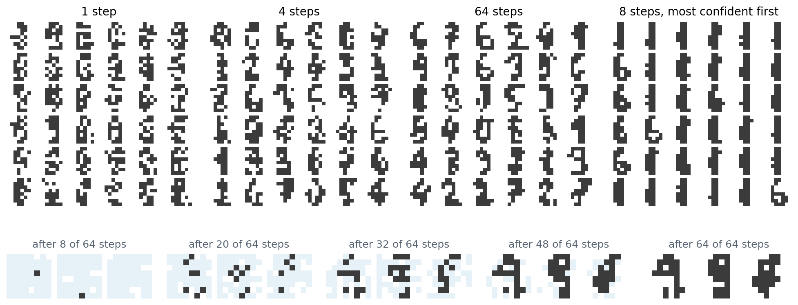

[ML Mastery Notes](../README.md) › [Generative AI](README.md)

# 12. Discrete Tokens and Multimodal Generation

[← 11. Latent Diffusion and Large-Scale Generation](11-latent-diffusion-and-large-scale-generation.md) · [13. Evaluating Generative Models →](13-evaluating-generative-models.md)

## <a id="discrete-latent-variables"></a>Discrete latent variables

### <a id="why-tokens"></a>Why tokens

Language models generate sequences of discrete tokens, and the machinery built for them, transformers trained by next-token prediction, their scaling laws, and their serving infrastructure (NLP chapter 4), is the most developed in machine learning. Turning images, audio, and video into sequences of discrete tokens lets that machinery generate them too, and lets one model read and write several modalities in a shared vocabulary. The pixels of chapter 2 were discrete tokens, but far too many and too low-level: a $`256\times256`$ image has 196,608 subpixels, and modeling them one at a time spends the model's capacity on noise. The approach of this chapter is to learn a **tokenizer**, an autoencoder with a discrete bottleneck that compresses an image to a few hundred or thousand tokens from a vocabulary of thousands, and then to generate the tokens: one at a time, several at a time, or by a diffusion process over discrete states. The last part of the chapter applies the same ideas to text itself and to models that mix modalities.

### <a id="gradients-through-a-discrete-choice"></a>Gradients through a discrete choice

A discrete bottleneck poses the problem that chapter 3 deferred: a sample from a categorical distribution cannot be reparameterized as a differentiable function of its parameters and fixed noise. The **score-function estimator** of chapter 3, $`\nabla_\theta\mathbb E_{z\sim p_\theta}f(z)=\mathbb E\bigl[f(z)\nabla_\theta\log p_\theta(z)\bigr]`$, is unbiased but multiplies a single scalar $`f(z)`$ by the score of every choice, and its variance grows with the number of choices that contribute to $`f`$. Two biased but practical alternatives exploit the **Gumbel-max trick**: adding independent Gumbel noise $`g_k=-\log(-\log u_k)`$ to the logits and taking the argmax gives an exact sample from the softmax distribution ([Appendix A](#block-gen12-appendix-a)). The **Gumbel-softmax** or **Concrete** relaxation ([Jang, Gu, and Poole, 2017](https://arxiv.org/abs/1611.01144); [Maddison, Mnih, and Teh, 2017](https://arxiv.org/abs/1611.00712)) replaces the argmax by a softmax with temperature $`\tau`$, $`y=\operatorname{softmax}((\theta+g)/\tau)`$, a point in the simplex that approaches a one-hot vector as $`\tau\to0`$ and is differentiable in $`\theta`$. The **straight-through** estimator ([Bengio, Léonard, and Courville, 2013](https://arxiv.org/abs/1308.3432), after a suggestion of Hinton's) uses the hard sample in the forward pass and pretends in the backward pass that it was the soft one, or the identity; it is the same device that trains quantized networks (DL chapter 11). The code compares these estimators for the gradient of $`\mathbb E f`$ with respect to the logits of one of $`D`$ independent four-way choices, where $`f`$ sums a cost over all choices.

```python
import numpy as np

rng = np.random.default_rng(0)
# D independent categorical choices z_d among 4 values with probabilities softmax(theta), and the objective
# f(z) = sum_d (value(z_d) - 2.2)^2. We estimate the gradient with respect to the logits of the first choice.
theta = np.array([0.5, -0.3, 0.2, 0.0])
values = np.array([0.0, 1.0, 2.0, 3.0])
pi = np.exp(theta) / np.exp(theta).sum()
cost = (values - 2.2) ** 2
exact = pi * (cost - pi @ cost)                           # d/dtheta E[f]: pi_k (f_k - E f) for one choice


def estimates(D, n=50_000):
    g = -np.log(-np.log(rng.random((n, D, 4))))           # Gumbel noise
    k = np.argmax(theta + g, -1)                          # Gumbel-max: exact samples from pi
    f = cost[k].sum(1)
    onehot = np.eye(4)[k[:, 0]]
    out = {"score function (REINFORCE)": f[:, None] * (onehot - pi),
           "score function with a baseline": (f - D * pi @ cost)[:, None] * (onehot - pi)}
    for tau in [1.0, 0.5, 0.1]:
        a = (theta + g[:, 0]) / tau
        y = np.exp(a - a.max(1, keepdims=True))
        y /= y.sum(1, keepdims=True)                      # relaxed one-hot sample of the first choice
        jac = lambda u: (y * u - y * (y * u).sum(1, keepdims=True)) / tau   # (diag(y) - y y^T) u / tau
        out[f"Gumbel-softmax, tau = {tau}"] = jac(2 * (y @ values - 2.2)[:, None] * values)
        out[f"straight-through, tau = {tau}"] = jac(2 * (values[k[:, 0]] - 2.2)[:, None] * values)
    return out


one, many = estimates(1, 200_000), estimates(32)
print("                                   relative bias    relative sd of one sample")
print("                                                    1 choice    32 choices")
for name in one:
    bias = np.linalg.norm(one[name].mean(0) - exact) / np.linalg.norm(exact)
    sd = [np.sqrt(e[name].var(0).sum()) / np.linalg.norm(exact) for e in (one, many)]
    print(f"{name:34s} {bias:6.3f}        {sd[0]:8.2f}    {sd[1]:8.2f}")
#                                    relative bias    relative sd of one sample
#                                                     1 choice    32 choices
# score function (REINFORCE)          0.002            1.64       49.91
# score function with a baseline      0.001            1.02        8.58
# Gumbel-softmax, tau = 1.0           0.465            0.56        0.56
# straight-through, tau = 1.0         0.368            1.19        1.19
# Gumbel-softmax, tau = 0.5           0.246            1.18        1.18
# straight-through, tau = 0.5         0.165            2.05        2.05
# Gumbel-softmax, tau = 0.1           0.049            3.57        3.59
# straight-through, tau = 0.1         0.025            5.37        5.37
```

The score-function estimators are unbiased. With a single choice, their standard deviation per sample is comparable to the size of the gradient, 1.64 and 1.02 times it without and with a baseline, but with 32 choices contributing to $`f`$ it grows to 49.9 and 8.6 times, because the estimator cannot tell which choice caused the cost. The relaxed estimators use the derivative of $`f`$ with respect to each choice and are unaffected by the others. They pay with bias: at $`\tau=1`$, the Gumbel-softmax gradient is off by 46.5% of its size, and lowering the temperature to 0.1 reduces the bias to 4.9% while raising the standard deviation to 3.6 times the gradient, since the soft sample becomes nearly one-hot and its gradient spiky. The straight-through variant, which evaluates $`f`$ at the hard sample, is less biased at every temperature and noisier. None is best everywhere, and the vector-quantized autoencoders that dominate practice use yet another straight-through estimator, below.

## <a id="quantized-autoencoders"></a>Quantized autoencoders

### <a id="vq-vae"></a>VQ-VAE

The **vector-quantized VAE** ([van den Oord, Vinyals, and Kavukcuoglu, 2017](https://arxiv.org/abs/1711.00937)) makes the bottleneck a lookup. The encoder outputs a grid of vectors $`z_e`$; each is replaced by the nearest of $`K`$ learned **codebook** vectors $`e_k`$; and the decoder reconstructs the image from the quantized grid $`z_q`$. The index of the nearest vector at each position is the token. Nearest-neighbor lookup has no useful gradient, so the gradient of the reconstruction loss with respect to $`z_q`$ is copied to $`z_e`$ unchanged, a straight-through estimator, and two extra terms train the codebook and keep the encoder close to it:

```math
\mathcal L=-\log p(x\mid z_q)+\bigl\|\operatorname{sg}[z_e]-e\bigr\|^2+\beta\,\bigl\|z_e-\operatorname{sg}[e]\bigr\|^2,
```

where $`\operatorname{sg}`$ stops gradients and the **commitment** weight is $`\beta=0.25`$ ([Appendix B](#block-gen12-appendix-b)). In practice the codebook term is often replaced by an exponential moving average of the encoder outputs assigned to each code, an online k-means. The prior over tokens was fitted afterward, a PixelCNN over the latent grid. A VQ-VAE compressed $`128\times128\times3`$ ImageNet images to a $`32\times32`$ grid of tokens from a codebook of 512, and on speech it learned tokens close to phonemes, so that decoding them with another speaker's embedding converted the voice. **VQ-VAE-2** ([Razavi, van den Oord, and Vinyals, 2019](https://arxiv.org/abs/1906.00446)) used a hierarchy, a $`32\times32`$ top grid for global structure and a $`64\times64`$ bottom grid for detail, and generated $`256\times256`$ images of a quality then close to that of adversarial networks.

Codebooks tend to **collapse**: codes that are never nearest to any encoder output receive no updates, so a few codes do all the work. Remedies include initializing the codebook by k-means, re-seeding dead codes with recent encoder outputs, and looking codes up in a low-dimensional, normalized space: ViT-VQGAN ([Yu et al., 2022](https://arxiv.org/abs/2110.04627)) projected encoder outputs to 32 dimensions and normalized them before the lookup, which raised the share of its 8,192 codes in use from a few percent to nearly all.

### <a id="better-tokenizers"></a>Better tokenizers

Tokens are only as useful as the images they decode to. **VQGAN** ([Esser, Rombach, and Ommer, 2021](https://arxiv.org/abs/2012.09841)) added the perceptual and adversarial losses of chapter 11 to the VQ-VAE, which let a $`16\times16`$ grid of tokens reconstruct a $`256\times256`$ image sharply, and it became the standard image tokenizer. DALL·E ([Ramesh et al., 2021](https://arxiv.org/abs/2102.12092)) instead trained a discrete VAE with the Gumbel-softmax relaxation, compressing $`256\times256`$ images to $`32\times32`$ tokens from a vocabulary of 8,192.

**Finite scalar quantization** (FSQ; [Mentzer et al., 2024](https://arxiv.org/abs/2309.15505)) removes the codebook. The encoder outputs a handful of numbers per position, typically fewer than 10; each is squashed into a bounded range and rounded to one of a few levels, with a straight-through gradient; and the implicit codebook is the grid of all combinations, for example $`8\times5\times5\times5=1000`$ codes for four numbers. Every code is reachable, usage is nearly 100% with no auxiliary losses, and the tokens were as good as those of a VQ-VAE for masked image generation. **Lookup-free quantization** in MAGVIT-v2 ([Yu et al., 2024](https://arxiv.org/abs/2310.05737)) takes the extreme of two levels per dimension, a binary code of 18 bits and a vocabulary of $`2^{18}`$, and showed that with a good enough tokenizer, a language-model-style generator could beat diffusion models on image and video benchmarks.

### <a id="residual-quantization-and-neural-audio-codecs"></a>Residual quantization and neural audio codecs

Audio needs many tokens per second, and a single codebook large enough for high fidelity would be enormous. **Residual vector quantization** (RVQ) quantizes the encoder output with one codebook, quantizes the remaining error with a second, and so on, so that $`M`$ codebooks of $`K`$ entries describe $`K^M`$ combinations with only $`MK`$ stored vectors, each stage refining the one before. SoundStream ([Zeghidour et al., 2021](https://arxiv.org/abs/2107.03312)) trained such a codec end to end with reconstruction and adversarial losses, and by randomly dropping the later stages during training, a single model served bitrates from 3 to 18 kbps; at 3 kbps it sounded better than the Opus codec at 12 kbps. EnCodec ([Défossez et al., 2022](https://arxiv.org/abs/2210.13438)) is a widely used codec of the same kind. The idea is that of product quantization in vector search (NLP chapter 13), with stages that refine rather than split the vector. The code compares one codebook with residual stages on the digits, with codebooks fitted by k-means.

```python
import numpy as np
from scipy.cluster.vq import kmeans2, vq
from sklearn.datasets import load_digits

digits = load_digits()
perm = np.random.default_rng(0).permutation(len(digits.data))
X = digits.data[perm] / 8 - 1                              # pixels in [-1, 1]
train, test = X[:1500], X[1500:]


def fit(data, k, seed):
    codebook, _ = kmeans2(data, k, minit="++", seed=seed)
    return codebook


def quantize(data, codebook):
    return codebook[vq(data, codebook)[0]]


print("method                          bits per image   vectors stored   held-out squared error per pixel")
for k in [16, 256]:
    cb = fit(train, k, 0)
    err = np.mean((quantize(test, cb) - test) ** 2)
    print(f"one codebook of {k:3d}               {np.log2(k):4.0f}            {k:5d}            {err:.4f}")

# Residual vector quantization: each stage quantizes what the previous stages left over.
books, residual_train, recon = [], train.copy(), np.zeros_like(test)
for stage in range(1, 9):
    cb = fit(residual_train, 16, stage)
    books.append(cb)
    residual_train = residual_train - quantize(residual_train, cb)
    recon = recon + quantize(test - recon, cb)
    if stage in [1, 2, 4, 6, 8]:
        err = np.mean((recon - test) ** 2)
        print(f"residual, {stage} x 16 codes             {4 * stage:4d}            {16 * stage:5d}            {err:.4f}")
print(f"(the variance of a pixel, the error of predicting every image by the mean: {np.mean((test - train.mean(0)) ** 2):.4f})")
# method                          bits per image   vectors stored   held-out squared error per pixel
# one codebook of  16                  4               16            0.1486
# one codebook of 256                  8              256            0.0818
# residual, 1 x 16 codes                4               16            0.1467
# residual, 2 x 16 codes                8               32            0.1121
# residual, 4 x 16 codes               16               64            0.0822
# residual, 6 x 16 codes               24               96            0.0655
# residual, 8 x 16 codes               32              128            0.0542
# (the variance of a pixel, the error of predicting every image by the mean: 0.2976)
```

At the same number of bits, a single codebook is more accurate: 8 bits as one codebook of 256 give a held-out error of 0.0818, against 0.1121 for two residual stages of 16. But a single codebook stores a vector for every code, and one with $`2^{16}`$ codes could not even be fitted to 1,500 images, while residual stages keep improving at a small cost, to 0.0542 with eight stages, 32 bits, and 128 stored vectors. The first stages capture the rough shape of a digit and the later ones its details, which is what lets a codec drop late stages to lower its bitrate and lets a generator produce the coarse stages first.

## <a id="generating-tokens"></a>Generating tokens

### <a id="autoregressive-transformers-over-tokens"></a>Autoregressive transformers over tokens

Given a tokenizer, a transformer can be trained to predict the next token, exactly as for text. DALL·E trained a 12-billion-parameter transformer on 250 million image–caption pairs, each a sequence of up to 256 text tokens followed by 1,024 image tokens, and generated images from captions by sampling the image tokens; Parti ([Yu et al., 2022](https://arxiv.org/abs/2206.10789)) scaled an encoder–decoder transformer over ViT-VQGAN tokens to 20 billion parameters and reached a zero-shot FID of 7.23 on MS-COCO, competitive with diffusion models of the time. Chapter 2 described later variants that predict coarse scales before fine ones. For audio, Jukebox ([Dhariwal et al., 2020](https://arxiv.org/abs/2005.00341)) generated music with transformers over a three-level VQ-VAE of raw audio; AudioLM ([Borsos et al., 2023](https://arxiv.org/abs/2209.03143)) generated coherent speech and piano continuations by predicting first semantic tokens, clusters of the features of a self-supervised speech model, then coarse and then fine SoundStream tokens; VALL-E ([Wang et al., 2023](https://arxiv.org/abs/2301.02111)) treated text-to-speech as language modeling over EnCodec tokens, trained on 60,000 hours of speech, and imitated a voice from a three-second recording; and MusicGen ([Copet et al., 2023](https://arxiv.org/abs/2306.05284)) generated all four codebook streams of EnCodec with one transformer by offsetting them by one step each, so that the tokens of a time step are predicted over several consecutive steps rather than multiplying the sequence length by four.

### <a id="masked-generative-transformers"></a>Masked generative transformers

Autoregressive generation takes one network pass per token, 256 passes for a $`16\times16`$ grid, and commits to a raster order that suits images poorly. **MaskGIT** ([Chang et al., 2022](https://arxiv.org/abs/2202.04200)) trains a bidirectional transformer, like BERT (NLP chapter 5), to predict randomly masked tokens from the rest, with the fraction masked drawn from a cosine schedule so that the model learns to fill in anything from a few tokens to the whole grid. Generation starts from an all-masked grid and, in each of about 8 steps, predicts every masked token, keeps the predictions the model is most confident of, and re-masks the rest, with the number kept growing along the schedule. It reached an FID of 6.18 on ImageNet $`256\times256`$ with 8 passes instead of 256, generating 30 to 64 times faster than autoregressive decoding, and Muse ([Chang et al., 2023](https://arxiv.org/abs/2301.00704)) applied it to text-to-image generation with a frozen T5-XXL encoder, reaching a zero-shot COCO FID of 7.88 with its 3-billion-parameter model and running more than ten times faster than Imagen or Parti. Revealing several tokens in one step samples them independently given the tokens already revealed, which ignores their dependence on each other; the next section shows that this is the discretization error of a diffusion process, and what confidence-based ordering does to it.

## <a id="discrete-diffusion"></a>Discrete diffusion

### <a id="corrupting-tokens"></a>Corrupting tokens

Diffusion does not need Gaussian noise. **D3PM** ([Austin et al., 2021](https://arxiv.org/abs/2107.03006)) defined forward processes on discrete states by transition matrices: replace a token by a uniformly random one with small probability at each step, move it to a nearby token in an embedding space, or replace it by an absorbing **[MASK]** state; a model is trained to reverse the corruption with the same variational bound as in chapter 7. With the absorbing state, the reverse process is iterative unmasking, and D3PM observed that BERT is a one-step diffusion model of this kind. **Score entropy discrete diffusion** (SEDD; [Lou, Meng, and Ermon, 2024](https://arxiv.org/abs/2310.16834)), which received a best paper award at ICML 2024, replaced the score, undefined for discrete data, by the ratios $`p_t(y)/p_t(x)`$ between neighboring states and fitted them with a loss that generalizes score matching. Its perplexity was competitive with that of an autoregressive model of the same size, GPT-2, and its samples matched the quality of GPT-2's unannealed samples with 32 times fewer network evaluations.

### <a id="masked-diffusion"></a>Masked diffusion

The absorbing process turned out to be all that is needed, and its analysis is simple. In **masked diffusion** ([Sahoo et al., 2024](https://arxiv.org/abs/2406.07524); [Shi et al., 2024](https://arxiv.org/abs/2406.04329)), each token of $`x_0`$ is independently replaced by [MASK] with probability $`t`$ at time $`t\in[0,1]`$, and the network predicts the original value of each masked token from the partly masked sequence. The negative log-likelihood is bounded by

```math
-\log p_\theta(x_0)\le\int_0^1\frac1t\,\mathbb E_{x_t}\Bigl[\sum_{i\,:\,x_t^i=\text{[MASK]}}-\log p_\theta\bigl(x_0^i\mid x_t\bigr)\Bigr]dt,
```

a weighted average of masked-language-modeling losses over masking rates ([Appendix C](#block-gen12-appendix-c)). The network needs no input for the time, since the fraction of masked tokens reveals it, and the bound turns out to equal the average log-loss of an autoregressive model over all orderings of the tokens, the order-agnostic training of NADE (chapter 2). Sampling runs the process backward: at each step, every masked token is revealed with a probability set by the schedule, with a value drawn from the network's prediction. The code trains a masked diffusion model on the binarized digits of chapter 2, compares its bound with the autoregressive MADE, and samples it with different numbers of steps.

```python
import numpy as np
import torch
from torch import nn
from sklearn.datasets import load_digits
from sklearn.linear_model import LogisticRegression

torch.set_num_threads(1)
torch.manual_seed(0)
digits = load_digits()
perm = np.random.default_rng(0).permutation(len(digits.data))
B = (digits.data[perm] > 7).astype(np.float32)             # binarized digits, as in chapter 2
y = digits.target[perm]
train, test = torch.tensor(B[:1500]), torch.tensor(B[1500:])
clf = LogisticRegression(max_iter=5000, C=0.1).fit(B[:1500], y[:1500])

# The network sees each pixel as 0, 1, or masked, and predicts every pixel; it needs no input for the time,
# since the fraction of masked pixels reveals it.
net = nn.Sequential(nn.Linear(128, 512), nn.SiLU(), nn.Linear(512, 512), nn.SiLU(), nn.Linear(512, 64))
logits = lambda x, m: net(torch.cat([x * (1 - m), m], 1))  # x: values, m: 1 where masked


def loss_bound(x0, t):                                     # -log p(x0) <= E_t [ (1/t) sum over masked of -log p ]
    m = (torch.rand_like(x0) < t[:, None]).float()
    nll = nn.functional.binary_cross_entropy_with_logits(logits(x0, m), x0, reduction="none")
    return (m * nll).sum(1) / t


opt = torch.optim.Adam(net.parameters(), lr=1e-3)
for step in range(4000):
    x0 = train[torch.randint(1500, (256,))]
    loss = loss_bound(x0, torch.rand(256).clamp(min=1e-3)).mean()
    opt.zero_grad()
    loss.backward()
    opt.step()
with torch.no_grad():
    t = (torch.arange(200) + 0.5) / 200                    # a midpoint rule over t for each held-out digit
    bound = torch.stack([loss_bound(test, torch.full((len(test),), float(tt))).mean() for tt in t]).mean()
print(f"bound on held-out negative log-likelihood: {bound / 64 / np.log(2):.3f} bits per pixel "
      f"(MADE in chapter 2: 0.400 in raster order, 0.389 in a random order; independent pixels: 0.568)")


@torch.no_grad()
def sample(n, steps, gen, order="random"):
    x, m = torch.zeros(n, 64), torch.ones(n, 64)
    for s in range(steps, 0, -1):
        t, t_next = s / steps, (s - 1) / steps
        p = torch.sigmoid(logits(x, m))
        draw = (torch.rand(n, 64, generator=gen) < p).float()
        if order == "random":                              # each masked pixel is revealed with prob. (t - t_next) / t
            reveal = (torch.rand(n, 64, generator=gen) < (t - t_next) / t).float() * m
        else:                                              # MaskGIT: keep the sampled pixels the model is surest of
            conf = torch.where(m.bool(), torch.where(draw.bool(), p, 1 - p), torch.full_like(p, -1.0))
            k = round(64 * (1 - t_next)) - round(64 * (1 - t))
            reveal = torch.zeros(n, 64).scatter_(1, conf.topk(k, 1).indices, 1.0)
        x = x * (1 - reveal) + draw * reveal
        m = m * (1 - reveal)
    return x.numpy()


def quality(x):                                            # the classifier's confidence in the class it picks,
    pairs = np.random.default_rng(0).integers(len(x), size=(2000, 2))   # and the share of pixels that differ
    return f"{clf.predict_proba(x).max(1).mean():.3f} / {np.mean(x[pairs[:, 0]] != x[pairs[:, 1]]):.3f}"   # between two


gen = torch.Generator().manual_seed(1)
print(f"classifier confidence / pixels differing between two samples: held-out digits {quality(B[1500:])}")
for steps in [1, 2, 4, 8, 64]:
    line = f"  {steps:2d} steps: revealing random pixels {quality(sample(1000, steps, gen))}"
    if steps in [4, 8]:
        line += f"; revealing the most confident (MaskGIT) {quality(sample(1000, steps, gen, 'confident'))}"
    print(line)
# bound on held-out negative log-likelihood: 0.387 bits per pixel (MADE in chapter 2: 0.400 in raster order, 0.389 in a random order; independent pixels: 0.568)
# classifier confidence / pixels differing between two samples: held-out digits 0.746 / 0.261
#    1 steps: revealing random pixels 0.400 / 0.252
#    2 steps: revealing random pixels 0.502 / 0.254
#    4 steps: revealing random pixels 0.592 / 0.257; revealing the most confident (MaskGIT) 0.546 / 0.114
#    8 steps: revealing random pixels 0.638 / 0.258; revealing the most confident (MaskGIT) 0.737 / 0.094
#   64 steps: revealing random pixels 0.678 / 0.261
```

The bound on the held-out negative log-likelihood is 0.387 bits per pixel, matching MADE with a random order, 0.389, and slightly better than MADE in raster order, 0.400, as the equivalence with order-agnostic autoregression predicts. Sampling shows the cost of parallel decoding. With 64 steps, one pixel revealed per step on average, a classifier trained on the binarized digits is 0.678 confident on average and two samples differ in 26.1% of their pixels, the same as two real digits; with one step, every pixel is drawn independently from its marginal, the confidence falls to 0.400, and the samples are speckled. Revealing the most confident predictions first, as MaskGIT does, raises the confidence with 8 steps to 0.737, nearly that of real digits, but two samples then differ in only 9.4% of their pixels: always keeping the likeliest pixels acts like sampling at a low temperature and collapses the samples toward a few typical digits. MaskGIT adds randomness to its confidence scores to counter this.



*Samples from the masked diffusion model of the code, 36 per panel, with 1, 4, and 64 steps that each reveal a random subset of the masked pixels, and with 8 steps that reveal the pixels whose sampled values the model is most confident of. With one step, every pixel is sampled independently, and the samples have the right amount of ink in the right places without being digits; with four steps, strokes appear but break; with 64, most samples are digits. The confidence-first sampler produces clean strokes but mostly 1s and 6s. Bottom: three samples during 64-step generation, with masked pixels shaded blue; the model reveals background and stroke pixels in random order, and the digits become recognizable once about half of their pixels are revealed.*

### <a id="diffusion-language-models"></a>Diffusion language models

Masked diffusion over text tokens trails autoregressive models in perplexity but not by much: on OpenWebText, MDLM reached a bound of 23.21 against 17.54 for an autoregressive transformer trained on the same data, and SEDD 24.10. Its attraction is elsewhere: it can generate many tokens per network pass, revise any position, and condition on text to the right as easily as to the left. **LLaDA** ([Nie et al., 2025](https://arxiv.org/abs/2502.09992)) trained an 8-billion-parameter masked diffusion model from scratch on 2.3 trillion tokens and found it competitive with LLaMA 3 8B on standard benchmarks. Because it has no preferred direction, it completed the previous line of a poem given the next one 45.6% of the time, against 34.3% for GPT-4o, although GPT-4o was far better in the forward direction, 82.7% against 51.8%, the **reversal curse** of left-to-right models ([Berglund et al., 2024](https://arxiv.org/abs/2309.12288)). Commercial systems followed: Mercury Coder ([Inception Labs, 2025](https://arxiv.org/abs/2506.17298)) generated code at 1,109 tokens per second on an H100 GPU with its smallest model, and Google announced an experimental Gemini Diffusion ([Google DeepMind, 2025](https://deepmind.google/models/gemini-diffusion/)). **Discrete flow matching** ([Gat et al., 2024](https://arxiv.org/abs/2407.15595)) carries the flow matching framework of chapter 9 to discrete states, with probability paths that interpolate between masks or noise and data. The open problems are those of the digits example at scale: with few steps, tokens sampled together are inconsistent; bidirectional attention prevents the key–value caching that makes autoregressive generation cheap; and the length of the output must be fixed in advance or handled in blocks.

## <a id="multimodal-models"></a>Multimodal models

### <a id="visionlanguage-models"></a>Vision–language models

Most models that read images and write text attach an image encoder to a language model. **Flamingo** ([Alayrac et al., 2022](https://arxiv.org/abs/2204.14198)) kept a 70-billion-parameter language model frozen, compressed the features of an image encoder to 64 tokens with a small attention module, and inserted new cross-attention layers between the language model's layers, each gated by a $`\tanh`$ of a parameter initialized at zero so that training starts from the unchanged language model. Given a few interleaved image–text examples in its prompt, it answered questions about new images, the in-context learning of language models extended to images. **LLaVA** ([Liu et al., 2023](https://arxiv.org/abs/2304.08485)) showed that far less is needed: CLIP image features, mapped by a trainable linear projection into the embedding space of an open language model and placed in its input sequence, trained first on 595,000 image–caption pairs and then on 158,000 instructions and answers about images written by a text-only GPT-4 from captions and object annotations. Its recipe, a vision encoder, a projector, and a language model fine-tuned on visual instructions, is the basis of most open vision–language models.

### <a id="generating-several-modalities-with-one-model"></a>Generating several modalities with one model

Models that also generate images can treat them as tokens or as continuous vectors. **Chameleon** ([Chameleon Team, 2024](https://arxiv.org/abs/2405.09818)) tokenized each $`512\times512`$ image into 1,024 tokens from a codebook of 8,192 and trained 7- and 34-billion-parameter transformers from the start on interleaved text and image tokens, about 9.2 trillion in all, a design called **early fusion**; mixing modalities made training unstable, which normalizing the queries and keys and adding a penalty on the magnitude of the logits cured. **Transfusion** ([Zhou et al., 2024](https://arxiv.org/abs/2408.11039)) kept images continuous: one transformer is trained with the next-token loss on text and a diffusion loss on patches of image latents, with causal attention across the sequence and bidirectional attention within each image, and it surpassed Chameleon's image quality with less than a third of the compute, since quantization throws away information that the diffusion loss can model. Commercial assistants have adopted native generation: OpenAI described the image generation of GPT-4o, released in March 2025, as an autoregressive model embedded in its multimodal model, without further detail ([OpenAI, 2025](https://openai.com/index/gpt-4o-image-generation-system-card-addendum/)). Speech has followed the same path; Moshi ([Défossez et al., 2024](https://arxiv.org/abs/2410.00037)) models the user's and its own speech as parallel streams of codec tokens, 12.5 frames per second, together with text, and holds spoken conversations with a latency of about 200 milliseconds.

### <a id="discrete-or-continuous"></a>Discrete or continuous

Tokens let one sequence model handle every modality with the loss, infrastructure, and scaling behavior of language models, and make it easy to interleave modalities in one context. Their costs are the information lost by quantization, the length of token sequences for high-resolution images and video, and, for autoregressive generation, one network pass per token. Continuous diffusion and flow models remain ahead in image and video quality per unit of compute, while discrete models dominate text and speech. The boundary is not fixed: masked diffusion brings iterative refinement to text, masked autoregressive models (chapter 2) and Transfusion bring continuous outputs to sequence models, and a model that can do both, in one network, is the direction most large systems are taking.

## <a id="appendices"></a>Appendices


<details>
<summary><a id="block-gen12-appendix-a"></a><b>A. The Gumbel-max trick</b></summary>


Let $`g_1,\dots,g_K`$ be independent standard Gumbel variables, with distribution function $`F(g)=\exp(-e^{-g})`$ and density $`f(g)=e^{-g}\exp(-e^{-g})`$. The probability that $`\theta_k+g_k`$ is the largest is

```math
\int f(g)\prod_{j\ne k}F(g+\theta_k-\theta_j)\,dg=\int e^{-g}\exp\Bigl(-e^{-g}\sum_je^{\theta_j-\theta_k}\Bigr)dg=\frac{1}{\sum_je^{\theta_j-\theta_k}}=\frac{e^{\theta_k}}{\sum_je^{\theta_j}},
```

substituting $`u=e^{-g}`$ in the last integral, $`\int_0^\infty\exp(-uS)\,du=1/S`$. So $`\arg\max_k(\theta_k+g_k)`$ is distributed as $`\operatorname{softmax}(\theta)`$. A Gumbel variable is obtained from a uniform $`u`$ as $`-\log(-\log u)`$. The relaxation replaces the argmax by $`\operatorname{softmax}((\theta+g)/\tau)`$, which converges to the one-hot argmax as $`\tau\to0`$ for every realization of $`g`$, but whose gradient then vanishes almost everywhere and explodes near ties, which is the rising variance of the code.

</details>


<details>
<summary><a id="block-gen12-appendix-b"></a><b>B. The VQ-VAE objective</b></summary>


With $`z_q=e_{k^*}`$ for $`k^*=\arg\min_k\|z_e-e_k\|`$, the forward pass computes $`z_q`$, and the implementation writes $`z_q=z_e+\operatorname{sg}[e_{k^*}-z_e]`$, which equals $`e_{k^*}`$ in value but has the gradient of $`z_e`$, so the decoder's gradient passes to the encoder unchanged. The reconstruction term then trains the encoder and decoder but not the codebook, which receives no gradient through the straight-through path. The codebook term $`\|\operatorname{sg}[z_e]-e_{k^*}\|^2`$ moves each selected code toward the encoder outputs assigned to it, one step of k-means; replacing it by exponential moving averages of the assigned outputs and their counts, with decay 0.99, performs online k-means directly. The commitment term $`\beta\|z_e-\operatorname{sg}[e_{k^*}]\|^2`$ pulls the encoder toward its codes, since otherwise the encoder's outputs could drift away from the codebook faster than the codebook follows. The KL term of a VAE is constant here: with a uniform prior over $`K`$ codes and a deterministic posterior, it equals $`\log K`$ per position.

</details>


<details>
<summary><a id="block-gen12-appendix-c"></a><b>C. The masked diffusion bound and order-agnostic autoregression</b></summary>


**The bound.** Take a sequence of $`L`$ tokens, each masked independently with probability $`t`$. Between times $`t`$ and $`s<t`$, a masked token is unmasked with probability $`(t-s)/t`$, and the model predicts its value from the tokens visible at time $`t`$. The variational bound of the discrete chain is a sum over steps of the expected log-loss on the tokens revealed at each step, and as the steps shrink it becomes the integral in the text: a token masked at time $`t`$ is revealed in the next interval $`dt`$ with probability $`dt/t`$.

**Order-agnostic autoregression.** Condition on the number $`k`$ of masked tokens. Given $`t`$, $`k`$ is binomial, and

```math
\int_0^1\frac1t\binom Lk t^k(1-t)^{L-k}\,dt=\binom Lk\frac{(k-1)!\,(L-k)!}{L!}=\frac1k .
```

So the bound is $`\sum_{k=1}^L\frac1k\,\mathbb E\bigl[\sum_{i\text{ masked}}-\log p_\theta(x_0^i\mid x_{\text{visible}})\bigr]`$ over uniformly random sets of $`k`$ masked tokens, which is $`\sum_{k=1}^L`$ of the expected log-loss of predicting one random masked token from $`L-k`$ random visible ones. Reading $`k=L,L-1,\dots,1`$ as the steps of a random ordering, this is the expected negative log-likelihood of an autoregressive model that generates the tokens in a uniformly random order, averaged over orders. The masked diffusion model is an order-agnostic autoregressive model, and its bound is the average over orders of their exact log-likelihoods.

**Parallel decoding.** Revealing a set $`S`$ of tokens in one step samples them from $`\prod_{i\in S}p_\theta(x^i\mid x_{\text{visible}})`$, a product of marginals, whereas the data distribution requires the joint $`p(x^S\mid x_{\text{visible}})`$. The error is the total correlation of the revealed tokens given the visible ones, which vanishes when one token is revealed per step and grows with the number revealed together.

</details>

---

[← 11. Latent Diffusion and Large-Scale Generation](11-latent-diffusion-and-large-scale-generation.md) · [13. Evaluating Generative Models →](13-evaluating-generative-models.md)
