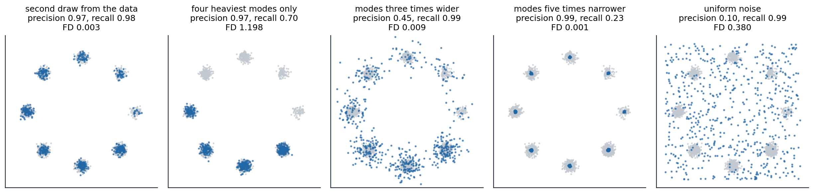

[ML Mastery Notes](../README.md) › [Generative AI](README.md)

# 13. Evaluating Generative Models

[← 12. Discrete Tokens and Multimodal Generation](12-discrete-tokens-and-multimodal-generation.md) · [14. Generative Models for Science and Control →](14-generative-models-for-science-and-control.md)

## <a id="what-to-measure"></a>What to measure

### <a id="three-questions"></a>Three questions

A classifier is evaluated by its error on held-out data, and the error means the same thing for every classifier. A generative model has no single counterpart. One can ask how much probability it assigns to held-out data, how the distribution of its samples compares with the data's, or whether its samples serve a purpose: whether they match a prompt, whether people prefer them, whether they are new rather than copied. The answers disagree, sometimes sharply, because each question weighs different failures: a model that drops half of the data's modes, one that blurs every sample, and one that copies its training set fail in different ways that no single number captures. [Theis, van den Oord, and Bethge (2016)](https://arxiv.org/abs/1511.01844) concluded that generative models must be evaluated with respect to the application they are intended for. This chapter covers the measures in use, what each one sees, and how each can mislead.

## <a id="likelihood"></a>Likelihood

### <a id="bits-per-dimension"></a>Bits per dimension

For models with a tractable likelihood or a bound on it, the held-out negative log-likelihood is the most principled measure, since it is the cross-entropy that maximum likelihood minimizes, and it measures coverage of the whole distribution (chapter 1). It is reported in **bits per dimension**, the negative log-likelihood in bits divided by the number of pixels or subpixels, so that models of images of different sizes can be compared, and it is the number of bits a lossless compressor based on the model would need per dimension. For continuous models of discrete images, the density must be converted into a probability of the discrete values, by dequantizing the data with uniform noise (chapter 4) or by discretizing the model's output. The benchmark numbers of the previous chapters, 3.00 bits per dimension on CIFAR-10 for PixelRNN, 2.92 for PixelCNN++, 3.08 for Flow++, and 2.65 for variational diffusion models, are all of this kind.

### <a id="when-likelihood-and-samples-disagree"></a>When likelihood and samples disagree

Likelihood and sample quality can be almost unrelated. Theis et al. gave the decisive example: mix a good model with weight 0.01 and a model that produces pure noise with weight 0.99. The mixture's samples are 99% noise, but its log-likelihood is lower than the good model's by at most $`\log100\approx4.61`$ nats per image, because $`\log(0.01\,p+0.99\,q)\ge\log p-\log100`$. For a $`256\times256`$ color image, that is $`3.4\times10^{-5}`$ bits per dimension, far below the differences between competing models. Conversely, a model can produce perfect samples and have a terrible likelihood: a kernel density estimate with a tiny bandwidth centered on the training images samples near-copies of them and assigns almost no probability to anything else. The code builds both cases on the digits, dequantized to continuous values, and judges samples with a classifier two-sample test (chapter 1): the cross-validated accuracy of a logistic regression that tries to tell samples from held-out digits, where 0.5 means that it cannot.

```python
import numpy as np
from scipy.special import logsumexp
from sklearn.datasets import load_digits
from sklearn.linear_model import LogisticRegression
from sklearn.mixture import GaussianMixture
from sklearn.model_selection import cross_val_score

rng = np.random.default_rng(0)
digits = load_digits()
X = digits.data[rng.permutation(len(digits.data))]
deq = lambda v: (v + rng.random(v.shape)) / 17            # dequantize the 17 intensity levels into [0, 1]
train, test = deq(X[:1500]), deq(X[1500:])
D = 64
bits = lambda logp: -logp.mean() / (D * np.log(2)) + np.log2(17)   # bits per pixel of the 17-level digits


def kde_logpdf(x, centers, h):                           # Gaussian kernel density estimate
    d2 = ((x[:, None, :] - centers[None]) ** 2).sum(-1)
    return logsumexp(-d2 / (2 * h ** 2), 1) - np.log(len(centers)) - D / 2 * np.log(2 * np.pi * h ** 2)


def two_sample(samples):                                  # can a classifier tell samples from held-out digits?
    Z = np.vstack([samples[:len(test)], test])
    labels = np.r_[np.zeros(len(test)), np.ones(len(test))]
    return cross_val_score(LogisticRegression(max_iter=5000), Z, labels, cv=5).mean()


gmm = GaussianMixture(20, covariance_type="full", reg_covar=1e-3, random_state=0).fit(train)
s_gmm = np.clip(gmm.sample(1000)[0], 0, 1)
s_mix = np.where(rng.random((1000, 1)) < 0.01, s_gmm, rng.random((1000, D)))
rows = [("Gaussian mixture, 20 components", gmm.score_samples(test), s_gmm),
        ("1% that mixture + 99% uniform noise", np.logaddexp(np.log(0.01) + gmm.score_samples(test), np.log(0.99)), s_mix)]
for h in [0.05, 0.001]:
    rows.append((f"kernel density on the training set, h = {h}", kde_logpdf(test, train, h),
                 train[rng.integers(1500, size=1000)] + h * rng.standard_normal((1000, D))))
print("model                                          held-out bits/pixel   accuracy telling samples from data")
for name, logp, samples in rows:
    print(f"{name:46s} {bits(logp):10.3f}             {two_sample(samples):.2f}")
print(f"the noise mixture can cost at most log2(100) / {D} = {np.log2(100) / D:.3f} bits/pixel; "
      f"for a 256 x 256 RGB image, {np.log2(100) / (256 * 256 * 3):.1e}")
# model                                          held-out bits/pixel   accuracy telling samples from data
# Gaussian mixture, 20 components                     2.744             0.49
# 1% that mixture + 99% uniform noise                 2.834             0.99
# kernel density on the training set, h = 0.05        5.846             0.50
# kernel density on the training set, h = 0.001   11471.132             0.46
# the noise mixture can cost at most log2(100) / 64 = 0.104 bits/pixel; for a 256 x 256 RGB image, 3.4e-05
```

The Gaussian mixture has the best likelihood, 2.744 bits per pixel, and its samples cannot be told from real digits by this linear test. Mixing it with 99% noise worsens the likelihood by only 0.090 bits per pixel, within the bound of 0.104, while the classifier now separates samples from data 99% of the time. The kernel density estimates on the training set sample what are essentially training images, which no test that compares samples with held-out data can distinguish from real ones, yet their likelihood is poor with a moderate bandwidth and absurd with a tiny one, 11,471 bits per pixel, since held-out digits are far from every kernel.

Likelihood has another blind spot: it is dominated by low-level statistics. [Nalisnick et al. (2019)](https://arxiv.org/abs/1810.09136) found that flows, PixelCNNs, and VAEs trained on CIFAR-10 assign higher likelihood to the images of house numbers in SVHN, which they never saw, than to CIFAR-10's own test images, because SVHN images are smoother and simpler; likelihood alone cannot detect out-of-distribution inputs. And most of the bits describe details that are invisible (chapter 7), so two models can differ greatly in likelihood and not at all in how their samples look. Likelihood is the right measure for compression and for density estimation, and a useful check that a model covers the data, but not a measure of perceptual quality.

## <a id="distances-between-sample-distributions"></a>Distances between sample distributions

### <a id="the-inception-score"></a>The Inception score

Models without likelihoods, above all adversarial networks, needed measures computed from samples alone. The **Inception score** ([Salimans et al., 2016](https://arxiv.org/abs/1606.03498)) passes samples through an ImageNet classifier, the Inception network, and computes

$$
\operatorname{IS}=\exp\Bigl(\mathbb E_x\,D_{\mathrm{KL}}\bigl(p(y\mid x)\,\big\|\,p(y)\bigr)\Bigr),
$$

which is large when each sample is classified confidently and the samples together cover many classes. Real CIFAR-10 images score 11.24. The score never looks at real data, so it cannot tell whether the samples resemble the training set; it ignores diversity within a class; it depends on the particular weights and implementation of the classifier; and small adversarial changes to samples can push it near its maximum without making them any more natural ([Barratt and Sharma, 2018](https://arxiv.org/abs/1801.01973)). It is still reported for class-conditional ImageNet models, usually beside the FID.

### <a id="the-frechet-inception-distance"></a>The Fréchet inception distance

The **Fréchet inception distance** (FID; [Heusel et al., 2017](https://arxiv.org/abs/1706.08500)) compares samples with real data in the feature space of the same network. It fits a Gaussian to the features, the 2,048-dimensional activations of the last pooling layer, of real images and of generated images, and computes the Fréchet or Wasserstein-2 distance between the two Gaussians,

$$
\operatorname{FID}=\|\mu_r-\mu_g\|^2+\operatorname{tr}\Bigl(\Sigma_r+\Sigma_g-2\bigl(\Sigma_r\Sigma_g\bigr)^{1/2}\Bigr)
$$

([Appendix A](#block-gen13-appendix-a)). It sees both fidelity and diversity, since missing modes and poor samples both change the mean and covariance, it agrees with human judgments better than the Inception score, and it has been the main benchmark number for image generation since 2017, computed with 50,000 samples. Its flaws are now well documented. It is **biased**: estimated from finite samples, it is positive even for two samples from the same distribution, the bias shrinks roughly as $`1/N`$, and it depends on the model being evaluated, so comparisons at a fixed sample size can rank models wrongly ([Chong and Forsyth, 2020](https://arxiv.org/abs/1911.07023)). It is sensitive to details of preprocessing, such as the filter used to resize images and whether they were compressed as JPEG ([Parmar, Zhang, and Zhu, 2022](https://arxiv.org/abs/2104.11222)). And it inherits the biases of its feature space: Inception features encode ImageNet classes, and [Kynkäänniemi et al. (2023)](https://arxiv.org/abs/2203.06026) reduced the FID of a face generator by two thirds, from 5.30 to 1.78, merely by choosing which of its samples to report, with weights optimized in the Inception feature space; no image improved, and the gain largely disappeared in feature spaces not trained to recognize ImageNet classes.

The **kernel inception distance** (KID; [Bińkowski et al., 2018](https://arxiv.org/abs/1801.01401)) replaces the Gaussian fit by the maximum mean discrepancy of chapter 1 with a cubic polynomial kernel, which has an unbiased estimator ([Appendix B](#block-gen13-appendix-b)). The code measures both in the feature space of a small digit classifier, between two halves of the real training digits and between a degraded "model", digits with their contrast reduced, and the real ones, at several sample sizes.

```python
import numpy as np
from scipy.linalg import sqrtm
from sklearn.datasets import load_digits
from sklearn.neural_network import MLPClassifier

rng = np.random.default_rng(0)
digits = load_digits()
perm = rng.permutation(len(digits.data))
X, y = digits.data[perm] / 16, digits.target[perm]
# A small classifier plays the role of the Inception network: its hidden layer is the feature space.
net = MLPClassifier((64,), max_iter=2000, random_state=0).fit(X[:1500], y[:1500])
features = lambda x: np.maximum(0, x @ net.coefs_[0] + net.intercepts_[0])


def fd(a, b):                                             # Frechet distance between Gaussians fitted to features
    mu_a, mu_b = a.mean(0), b.mean(0)
    ca, cb = np.cov(a, rowvar=False), np.cov(b, rowvar=False)
    return float(((mu_a - mu_b) ** 2).sum() + np.trace(ca + cb - 2 * np.real(sqrtm(ca @ cb))))


def kid(a, b):                                            # unbiased MMD^2 with the cubic polynomial kernel
    k = lambda u, v: (u @ v.T / u.shape[1] + 1) ** 3
    m, n = len(a), len(b)
    kaa, kbb = k(a, a), k(b, b)
    return float((kaa.sum() - np.trace(kaa)) / (m * (m - 1)) + (kbb.sum() - np.trace(kbb)) / (n * (n - 1))
                 - 2 * k(a, b).mean())


real = features(X[:1500])
halves = real[:750], real[750:]
blurred = features(np.clip(X[:750] * 0.7 + 0.3 * X[:750].mean(1, keepdims=True), 0, 1))   # a weaker "model"
print("samples   FD real vs real   FD model vs real   KID real vs real   KID model vs real")
for n in [50, 100, 200, 750]:
    rows = []
    for rep in range(20):                                 # average over random subsets
        i, j = rng.choice(750, n, replace=False), rng.choice(750, n, replace=False)
        rows.append([fd(halves[0][i], halves[1][j]), fd(blurred[i], halves[1][j]),
                     kid(halves[0][i], halves[1][j]), kid(blurred[i], halves[1][j])])
    r = np.mean(rows, 0)
    print(f"{n:5d}      {r[0]:8.2f}          {r[1]:8.2f}          {r[2]:+8.4f}          {r[3]:+8.4f}")
# samples   FD real vs real   FD model vs real   KID real vs real   KID model vs real
#    50          5.47             10.24           +0.0145           +1.0393
#   100          2.83              8.29           -0.0055           +1.0146
#   200          1.38              7.37           +0.0036           +1.0441
#   750          0.28              6.51           -0.0178           +1.0118
```

Two halves of the same data are 5.47 apart in Fréchet distance with 50 samples each and 0.28 with 750, a bias that falls roughly as $`1/N`$, while the distance of the degraded model falls from 10.24 to 6.51. A model evaluated with few samples can look worse than a worse model evaluated with many. The kernel distance of the real halves stays near zero at every sample size, positive or negative by chance, and that of the degraded model near 1.0, so it can be compared across sample sizes. In the same spirit, CMMD ([Jayasumana et al., 2024](https://arxiv.org/abs/2401.09603)) computes an unbiased maximum mean discrepancy with a Gaussian kernel on CLIP embeddings, which carry more than the ImageNet classes. [Stein et al. (2023)](https://arxiv.org/abs/2306.04675) compared 17 metrics and 9 feature spaces with the judgments of over a thousand people on 41 models, found that no metric correlated strongly with human evaluation, that FID in Inception features in particular underrated the realism of diffusion models, and recommended the features of the self-supervised DINOv2 encoder, a Fréchet distance now reported as FD$`_{\text{DINOv2}}`$. For other media the recipe is the same with a different network: the Fréchet video distance uses a video classifier ([Unterthiner et al., 2018](https://arxiv.org/abs/1812.01717)) and the Fréchet audio distance an audio one ([Kilgour et al., 2019](https://arxiv.org/abs/1812.08466)).

### <a id="precision-and-recall"></a>Precision and recall

A single distance conflates two failures that practitioners want to separate: samples that are unrealistic, and parts of the data that the model never produces. **Precision and recall for distributions** ([Sajjadi et al., 2018](https://arxiv.org/abs/1806.00035)) measure them separately, and the version of [Kynkäänniemi et al. (2019)](https://arxiv.org/abs/1904.06991) estimates each distribution's support in feature space by a union of balls, one around each point, reaching to its third-nearest neighbor. **Precision** is the fraction of generated samples that fall inside the support of the real data, and **recall** the fraction of real points that fall inside the support of the samples ([Appendix C](#block-gen13-appendix-c)). Density and coverage ([Naeem et al., 2020](https://arxiv.org/abs/2002.09797)) are variants that are less sensitive to outliers, whose large balls inflate the estimated support. The code compares five models of the eight Gaussians of chapter 6 by precision, recall, and the Fréchet distance computed directly on the points.

```python
import numpy as np
from scipy.linalg import sqrtm

rng = np.random.default_rng(0)
angles = np.arange(8) * 2 * np.pi / 8
mu = 2 * np.stack([np.cos(angles), np.sin(angles)], 1)
w = np.arange(1, 9) / 36                                   # the eight Gaussians of chapter 6


def mixture(n, modes=range(8), sd=0.1):
    p = w[list(modes)] / w[list(modes)].sum()
    k = rng.choice(list(modes), n, p=p)
    return mu[k] + sd * rng.standard_normal((n, 2))


def knn_radius(x, k=3):                                   # distance from each point to its k-th nearest neighbor
    d = np.sqrt(((x[:, None] - x[None]) ** 2).sum(-1))
    return np.sort(d, 1)[:, k]


def precision_recall(real, fake, k=3):
    """Kynkaanniemi et al. (2019): a sample is realistic if it falls inside the k-NN ball of some real point;
    a real point is covered if it falls inside the k-NN ball of some sample."""
    d = np.sqrt(((fake[:, None] - real[None]) ** 2).sum(-1))
    precision = np.mean((d <= knn_radius(real, k)[None]).any(1))
    recall = np.mean((d.T <= knn_radius(fake, k)[None]).any(1))
    return precision, recall


def fd(a, b):
    ca, cb = np.cov(a, rowvar=False), np.cov(b, rowvar=False)
    return float(((a.mean(0) - b.mean(0)) ** 2).sum() + np.trace(ca + cb - 2 * np.real(sqrtm(ca @ cb))))


real = mixture(2000)
models = {"a second draw from the data": mixture(2000),
          "four heaviest modes only": mixture(2000, modes=[4, 5, 6, 7]),
          "every mode three times wider": mixture(2000, sd=0.3),
          "every mode five times narrower": mixture(2000, sd=0.02),
          "uniform over the square [-2.5, 2.5]^2": rng.uniform(-2.5, 2.5, (2000, 2))}
print("model                                   precision   recall    Frechet distance")
for name, fake in models.items():
    p, r = precision_recall(real, fake)
    print(f"{name:38s}   {p:.3f}      {r:.3f}      {fd(real, fake):.3f}")
# model                                   precision   recall    Frechet distance
# a second draw from the data              0.971      0.985      0.003
# four heaviest modes only                 0.969      0.704      1.198
# every mode three times wider             0.454      0.990      0.009
# every mode five times narrower           0.991      0.226      0.001
# uniform over the square [-2.5, 2.5]^2    0.104      0.993      0.380
```



*The five models of the code, 600 of their samples in blue over the data in gray. Precision falls when samples leave the data, as with wider modes or uniform noise; recall falls when parts of the data are never generated, as with dropped modes or narrowed ones. The Fréchet distance ranks the model that dropped four modes as the worst of all, worse than uniform noise, and cannot see the change of width at all.*

A second draw from the data scores 0.97 and 0.98, not 1, because the balls around a finite sample miss some of the support. Dropping the four lightest modes keeps precision and lowers recall to 0.70, the share of the data in the modes that remain; widening every mode lowers precision to 0.45 and keeps recall; narrowing them lowers recall to 0.23 and keeps precision, the signature of the samples of low temperature or strong guidance (chapter 10). Uniform noise has a recall of 0.99, since it covers everything, and a precision of 0.10. The Fréchet distance, which sees only means and covariances, ranks these failures strangely. The narrowed and widened modes have nearly the mean and covariance of the data, so their distances, 0.001 and 0.009, are as small as that of a second draw, 0.003, while dropping modes shifts the mean and gives the largest distance, 1.198, worse than uniform noise, 0.380. In 2,048 dimensions of Inception features the Gaussian fit captures more than in two, but the lesson holds: a single distance mixes fidelity and coverage in proportions that depend on the geometry of the features.

## <a id="evaluating-for-a-purpose"></a>Evaluating for a purpose

### <a id="textimage-alignment"></a>Text–image alignment

For conditional models, the first question is whether a sample matches its condition. **CLIPScore** ([Hessel et al., 2021](https://arxiv.org/abs/2104.08718)) is the rescaled cosine similarity between the CLIP embeddings of an image and its prompt (DL chapter 10). It is cheap and correlates with human judgments of relevance, but CLIP represents a caption roughly as a bag of words ([Yuksekgonul et al., 2023](https://arxiv.org/abs/2210.01936)), and it misses counts, spatial relations, and which attribute belongs to which object: "a red cube on a blue sphere" and "a blue cube on a red sphere" score alike. Finer benchmarks decompose the prompt. **TIFA** ([Hu et al., 2023](https://arxiv.org/abs/2303.11897)) has a language model write questions about the prompt, "what color is the cube?", and checks the answers of a visual question-answering model on the image; **VQAScore** ([Lin et al., 2024](https://arxiv.org/abs/2404.01291)) simply asks a vision–language model whether the image shows the text and uses the probability of "yes"; and **GenEval** ([Ghosh, Hajishirzi, and Schmidt, 2023](https://arxiv.org/abs/2310.11513)) detects objects to verify counts, positions, and co-occurrences, and classifies the color of each detected object. Collections of challenging prompts, such as PartiPrompts with more than 1,600, are used for human comparisons.

### <a id="human-preference"></a>Human preference

People remain the final judges of images, video, and audio, and careful studies ask raters to compare two outputs for the same prompt on specific criteria, such as realism, alignment, and aesthetics, with enough comparisons to give confidence intervals. Because human studies are slow, **preference models** trained on human choices are used as proxies: PickScore ([Kirstain et al., 2023](https://arxiv.org/abs/2305.01569)), trained on over 500,000 choices by users of a text-to-image web application, predicted which of two images a user preferred slightly more accurately than expert human annotators, and HPS v2 ([Wu et al., 2023](https://arxiv.org/abs/2306.09341)) was trained on 798,090 choices. They are also the rewards of the fine-tuning methods of chapter 10, and a model tuned against one of them should be evaluated with another. Public **arenas** collect votes between anonymous models on users' own prompts and fit ratings with the Bradley–Terry model, as for language models (NLP chapter 14; [Jiang et al., 2024](https://arxiv.org/abs/2406.04485)); they reflect what users ask for, which is not a controlled sample of prompts, and their votes can be influenced by style.

### <a id="memorization-and-copying"></a>Memorization and copying

A model that reproduces its training data may look excellent by every measure above. Checking for copying compares samples with their nearest training images, in pixel space or better in the feature space of a copy-detection network, as in the digits of chapter 7; statistical tests can detect subtler **data copying**, samples systematically closer to training points than held-out data are ([Meehan, Chaudhuri, and Dasgupta, 2020](https://arxiv.org/abs/2004.05675)). [Somepalli et al. (2023)](https://arxiv.org/abs/2212.03860) found that 1.88% of random generations of Stable Diffusion for captions from its training data were near-copies of images in a 12-million-image subset of that data, a lower bound since the full training set is two billion images. [Carlini et al. (2023)](https://arxiv.org/abs/2301.13188) extracted training images deliberately: for each of the 350,000 most duplicated captions in Stable Diffusion's training data, they generated 500 images and flagged prompts whose generations were nearly identical to one another, which revealed 94 images reproduced almost exactly, some of them photographs of identifiable people; Imagen leaked more, and diffusion models trained on CIFAR-10 memorized about twice as much as adversarial networks of the same quality. Memorization concentrates on images duplicated many times in the training data, which is why deduplication is now part of data preparation. Why an optimal denoiser would memorize everything, and why trained networks mostly do not, is taken up in chapter 15, and the legal and privacy consequences in the Safety and Frontier module.

### <a id="a-practical-protocol"></a>A practical protocol

No metric suffices, so evaluations combine them. For a new image model, a reasonable report gives the held-out likelihood if the model has one; the Fréchet distance in a strong feature space and an unbiased kernel distance, each with a fixed and stated number of samples and preprocessing; precision and recall, to separate fidelity from coverage; alignment scores on a structured benchmark for conditional models; a human preference study on prompts chosen in advance; and a search for near-copies of training images. Numbers from different papers are comparable only if computed with the same implementation, feature network, reference set, and sample count, which is rarely true of published tables.

## <a id="appendices"></a>Appendices


<details>
<summary><a id="block-gen13-appendix-a"></a><b>A. The Fréchet distance between Gaussians and its bias</b></summary>


**The distance.** The Wasserstein-2 distance between $`\mathcal N(\mu_1,\Sigma_1)`$ and $`\mathcal N(\mu_2,\Sigma_2)`$ satisfies $`W_2^2=\|\mu_1-\mu_2\|^2+\operatorname{tr}\bigl(\Sigma_1+\Sigma_2-2(\Sigma_2^{1/2}\Sigma_1\Sigma_2^{1/2})^{1/2}\bigr)`$, and $`\operatorname{tr}(\Sigma_2^{1/2}\Sigma_1\Sigma_2^{1/2})^{1/2}=\operatorname{tr}(\Sigma_1\Sigma_2)^{1/2}`$ since the two matrices are similar, which gives the formula of the text. It is the smallest expected squared distance between coupled samples of the two Gaussians. For other distributions with the same means and covariances, it is a lower bound on nothing and an upper bound on nothing; it simply ignores everything beyond second moments.

**Bias.** With sample means and covariances, $`\mathbb E\|\hat\mu_1-\hat\mu_2\|^2=\|\mu_1-\mu_2\|^2+\operatorname{tr}(\Sigma_1)/N_1+\operatorname{tr}(\Sigma_2)/N_2`$, so even the mean term is biased upward by the noise of the sample means. The trace term is a nonlinear function of the covariance estimates, and its expectation differs from its value at the true covariances by terms of order $`1/N`$ whose size depends on the covariances, and so on the model. Extrapolating the distance measured at several sample sizes linearly in $`1/N`$ to $`1/N=0`$, as Chong and Forsyth proposed, removes the leading term.

</details>


<details>
<summary><a id="block-gen13-appendix-b"></a><b>B. An unbiased kernel distance</b></summary>


For a kernel $`k`$, the squared maximum mean discrepancy is $`\mathbb E\,k(x,x')+\mathbb E\,k(y,y')-2\,\mathbb E\,k(x,y)`$ for independent $`x,x'\sim P`$ and $`y,y'\sim Q`$. The U-statistic

$$
\widehat{\operatorname{MMD}}{}^2=\frac1{m(m-1)}\sum_{i\ne i'}k(x_i,x_{i'})+\frac1{n(n-1)}\sum_{j\ne j'}k(y_j,y_{j'})-\frac2{mn}\sum_{i,j}k(x_i,y_j)
$$

leaves out the diagonal terms $`k(x_i,x_i)`$, whose expectation differs from that of $`k(x,x')`$, and is therefore unbiased: its expectation is the population value for every $`m`$ and $`n`$, which is zero when $`P=Q`$. It can be negative for a finite sample, as in the code. KID uses $`k(x,y)=(x^\top y/d+1)^3`$ on $`d`$-dimensional features, which compares the first three moments of the two distributions.

</details>


<details>
<summary><a id="block-gen13-appendix-c"></a><b>C. Precision and recall from nearest neighbors</b></summary>


Let $`R`$ be the real features and $`G`$ the generated ones, and for a set $`S`$ and a point $`s\in S`$ let $`r_k(s)`$ be the distance from $`s`$ to its $`k`$-th nearest neighbor in $`S`$. The estimated support of $`S`$ is $`\bigcup_{s\in S}B(s,r_k(s))`$. Then

$$
\operatorname{precision}=\frac1{|G|}\sum_{g\in G}\mathbb 1\Bigl[g\in\textstyle\bigcup_{r\in R}B(r,r_k(r))\Bigr],\qquad\operatorname{recall}=\frac1{|R|}\sum_{r\in R}\mathbb 1\Bigl[r\in\textstyle\bigcup_{g\in G}B(g,r_k(g))\Bigr].
$$

With $`k=3`$ and tens of thousands of samples, the union of balls follows the support of each distribution closely where it is dense. An outlier in either set has a large $`k`$-NN ball, which can cover much of the space and inflate the other set's score; density counts how many real balls contain each sample instead of whether any does, and coverage uses only the balls around real points, which makes both more robust.

</details>

---

[← 12. Discrete Tokens and Multimodal Generation](12-discrete-tokens-and-multimodal-generation.md) · [14. Generative Models for Science and Control →](14-generative-models-for-science-and-control.md)
