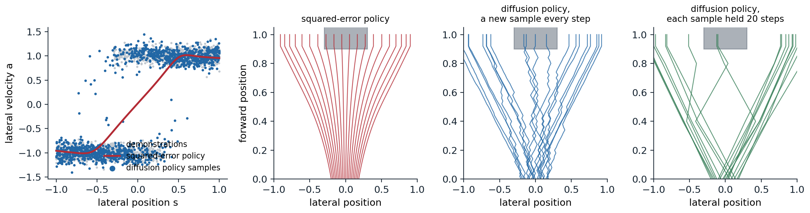

[Background Notes](../README.md) › [Generative AI](README.md)

# 14. Generative Models for Science and Control

[← 13. Evaluating Generative Models](13-evaluating-generative-models.md) · [15. The Theory of Diffusion Models →](15-the-theory-of-diffusion-models.md)

## <a id="generative-models-beyond-media"></a>Generative models beyond media

### <a id="why-science-and-control-need-samplers"></a>Why science and control need samplers

The generative models of this module were developed for images, audio, and text, but the problems they solve arise throughout science and engineering. A robot shown several ways of doing a task must choose one, not average them. A protein designer needs many candidate structures that satisfy a constraint, not the single most likely one. A weather service needs the range of possible futures, not only their mean. In each case the answer is a distribution with several modes, the tool that represents it is a generative model, and the same families serve: diffusion and flow models, trained by denoising or flow matching, conditioned and guided as in [chapter 10](10-guidance-and-conditional-generation.md). What changes is the structure of the data, with symmetries, geometry, and physical laws that the model should respect, and the way success is judged: by a robot completing its task, by an experiment in a laboratory, by the verification of a forecast against what happened. This optional chapter surveys three areas where generative models have changed practice: control, molecular design, and forecasting.

## <a id="control"></a>Control

### <a id="diffusion-policies"></a>Diffusion policies

In **behavior cloning**, a policy is trained by supervised learning to reproduce the actions of demonstrations given the observations; the reinforcement-learning view of policies is developed in the RL module. Human demonstrations are multimodal: to go around an obstacle, one demonstrator goes left and another right, and a policy trained with squared error learns their average, which goes straight into the obstacle ([Appendix C](#block-gen14-appendix-c)). **Diffusion Policy** ([Chi et al., 2023](https://arxiv.org/abs/2303.04137)) represents the policy as a conditional diffusion model over actions given the recent observations, so that it samples one of the demonstrated behaviors rather than their mean. It predicts a sequence of future actions rather than a single one, executes the first few, and then plans again from the new observation, a **receding horizon** that makes the robot commit to one mode for a while instead of switching between modes at every step. Across 12 manipulation tasks from 4 benchmarks, it improved the success rate over the previous state of the art by 46.9% on average, and on a real robot it ran with 10 denoising steps in about 0.1 seconds. Predicting chunks of actions had also made the policies of **ACT** ([Zhao et al., 2023](https://arxiv.org/abs/2304.13705)), a conditional VAE with a transformer, succeed at fine bimanual manipulation with inexpensive hardware. The code shows both effects on a one-dimensional version of the obstacle.

```python
import numpy as np
import torch
from torch import nn

torch.set_num_threads(1)
torch.manual_seed(0)
# Demonstrations: an agent at lateral offset s in [-1, 1] must steer around an obstacle straight ahead.
# Far from the center it steers away from the obstacle; near the center demonstrators pick either side.
n = 4000
s = torch.rand(n, 1) * 2 - 1
side = torch.where(s.abs() < 0.3, torch.randint(0, 2, (n, 1)) * 2 - 1.0, torch.sign(s))
a = side + 0.1 * torch.randn(n, 1)                       # lateral velocity chosen by the demonstrator


def mlp(inp):
    return nn.Sequential(nn.Linear(inp, 128), nn.SiLU(), nn.Linear(128, 128), nn.SiLU(), nn.Linear(128, 1))


# Behavior cloning with squared error: the policy learns the conditional mean of the actions.
bc = mlp(1)
opt = torch.optim.Adam(bc.parameters(), lr=1e-3)
for step in range(3000):
    i = torch.randint(n, (256,))
    loss = ((bc(s[i]) - a[i]) ** 2).mean()
    opt.zero_grad()
    loss.backward()
    opt.step()

# A diffusion policy: a conditional DDPM over the action, given the state.
T = 100
beta = torch.linspace(1e-4, 0.2, T)
abar = torch.cumprod(1 - beta, 0)
eps_net = mlp(3)
opt = torch.optim.Adam(eps_net.parameters(), lr=1e-3)
for step in range(6000):
    i = torch.randint(n, (256,))
    t = torch.randint(T, (256, 1))
    e = torch.randn(256, 1)
    at = abar[t].sqrt() * a[i] + (1 - abar[t]).sqrt() * e
    loss = ((eps_net(torch.cat([at, s[i], t / T], 1)) - e) ** 2).mean()
    opt.zero_grad()
    loss.backward()
    opt.step()


@torch.no_grad()
def diffusion_policy(states, gen):
    x = torch.randn(len(states), 1, generator=gen)
    for t in reversed(range(T)):
        e = eps_net(torch.cat([x, states, torch.full_like(x, t / T)], 1))
        x = (x - beta[t] / (1 - abar[t]).sqrt() * e) / (1 - beta[t]).sqrt()
        if t > 0:
            x = x + beta[t].sqrt() * torch.randn(x.shape, generator=gen)
    return x


gen = torch.Generator().manual_seed(1)
test = torch.linspace(-0.25, 0.25, 2000)[:, None]        # states where both sides are valid
with torch.no_grad():
    a_bc = bc(test)
a_dp = diffusion_policy(test, gen)
for name, act in [("squared-error regression", a_bc), ("diffusion policy", a_dp)]:
    print(f"{name:25s} near the center: mean |action| {act.abs().mean():.2f}; share of actions weaker than 0.5, "
          f"heading into the obstacle: {(act.abs() < 0.5).float().mean():.3f}; share steering right "
          f"{(act > 0.5).float().mean():.3f}")
far = torch.linspace(0.5, 1.0, 1000)[:, None]
print(f"diffusion policy far to the right: share steering right {(diffusion_policy(far, gen) > 0.5).float().mean():.3f}")
# squared-error regression  near the center: mean |action| 0.24; share of actions weaker than 0.5, heading into the obstacle: 1.000; share steering right 0.000
# diffusion policy          near the center: mean |action| 1.04; share of actions weaker than 0.5, heading into the obstacle: 0.008; share steering right 0.481
# diffusion policy far to the right: share steering right 0.995
```

In the region where demonstrators went either way, the squared-error policy's actions are weak, a mean magnitude of 0.24 against demonstrated speeds near 1, and every one of them is too weak to steer clear; the diffusion policy's actions have the demonstrated magnitude, and 48.1% steer right, matching the even split of the demonstrations, while far from the obstacle it steers away from it 99.5% of the time. The figure runs both policies in closed loop.



*Left: 1,500 of the demonstrations, the squared-error policy, and three samples of the diffusion policy at each of 400 states. Right: rollouts from 200 starting positions between −0.2 and 0.2, of which every tenth is drawn, for an agent that moves forward at a constant speed and steers with the policy's lateral velocity until it reaches the obstacle, shaded. The squared-error policy barely steers near the center, so the agents that start there drift too slowly and 27.5% of the rollouts hit the obstacle. The diffusion policy with a fresh sample at every step switches sides while it is in the region where the demonstrations disagree and zigzags, and 14.0% hit. Holding each sampled action for 20 steps, a crude action chunk, commits the agent to one side, and 7.0% hit.*

The per-step diffusion policy is multimodal but has no memory: where the demonstrations disagree, each fresh sample picks a side anew. Chunks of actions, or conditioning on the recent history, supply the missing commitment, and together with multimodality they are why generative policies work well for manipulation.

### <a id="planning-by-generating-trajectories"></a>Planning by generating trajectories

A diffusion model can also generate whole plans. **Diffuser** ([Janner et al., 2022](https://arxiv.org/abs/2205.09991)) trained a diffusion model on trajectories of states and actions from logged experience, arranged as a two-dimensional array with one column per time step and denoised by a temporal U-Net. It plans by sampling trajectories, guided toward high reward by the gradient of a separately trained model of the return, as in classifier guidance, and reaches a goal by fixing the last state and inpainting the rest ([chapter 10](10-guidance-and-conditional-generation.md#replacement-and-projection)). The **Decision Diffuser** ([Ajay et al., 2023](https://arxiv.org/abs/2211.15657)) generated only the states, conditioned on the return with classifier-free guidance, and recovered the actions with a model of the inverse dynamics, the action that leads from one state to the next. UniPi ([Du et al., 2023](https://arxiv.org/abs/2302.00111)) took the idea to pixels: a text-conditioned video diffusion model generates a video of the task being done, and an inverse-dynamics model reads the actions off consecutive frames.

### <a id="visionlanguageaction-models"></a>Vision–language–action models

The latest robot policies combine a pretrained vision–language model, which brings knowledge of objects and instructions from the web ([chapter 12](12-discrete-tokens-and-multimodal-generation.md#visionlanguage-models)), with a generative model of actions. **π0** ([Black et al., 2024](https://arxiv.org/abs/2410.24164)) attached an **action expert** of about 300 million parameters, trained by flow matching ([chapter 9](09-flow-matching.md)), to a 3-billion-parameter vision–language model, generating chunks of 50 continuous actions for control at up to 50 Hz in 10 integration steps. Trained on more than 10,000 hours of data from 7 robot configurations and 68 tasks, it folded laundry and bussed tables from language instructions. Continuous actions, which must be smooth and precise, are better served by a flow than by discretizing them into tokens, the same argument as for images in chapter 12.

## <a id="molecules-and-proteins"></a>Molecules and proteins

### <a id="symmetry"></a>Symmetry

A molecule is a set of atoms with positions in space, and its properties do not change when it is rotated, translated, or when its atoms are listed in a different order. A generative model of molecules should assign the same probability to all these copies, which it does if the prior is invariant and the denoiser is **equivariant**: rotating the input rotates the predicted noise or velocity in the same way ([Appendix A](#block-gen14-appendix-a)). **E(n)-equivariant graph networks** (EGNN; [Satorras, Hoogeboom, and Welling, 2021](https://arxiv.org/abs/2102.09844)) achieve this cheaply: each atom's features are updated from messages that depend on the other atoms' features and on distances only, and each atom's position moves along its differences to the other atoms, weighted by functions of those messages. The code checks the property for one such update and for an ordinary network on the flattened coordinates.

```python
import numpy as np

rng = np.random.default_rng(0)
N, H = 6, 32                                              # six points in 3D, as atoms of a small molecule
W1, W2 = rng.standard_normal((1, H)), rng.standard_normal((H, 1)) / np.sqrt(H)


def egnn_update(x):
    """One coordinate update of an E(n)-equivariant network (Satorras et al., 2021): each point moves along
    its differences to the others, weighted by a learned function of their squared distances."""
    diff = x[:, None, :] - x[None, :, :]                  # x_i - x_j
    d2 = (diff ** 2).sum(-1, keepdims=True)
    weight = np.tanh(d2 @ W1) @ W2                        # a small network of the distance alone
    return x + (diff * weight).sum(1) / (N - 1)


V1, V2 = rng.standard_normal((3 * N, 64)) / np.sqrt(3 * N), rng.standard_normal((64, 3 * N)) / 8


def mlp_update(x):                                        # an ordinary network on the flattened coordinates
    return x + (np.tanh(x.reshape(-1) @ V1) @ V2).reshape(N, 3)


x = rng.standard_normal((N, 3))
Q, _ = np.linalg.qr(rng.standard_normal((3, 3)))          # a random rotation (or reflection)
shift = rng.standard_normal(3)
perm = rng.permutation(N)
for name, f in [("equivariant update", egnn_update), ("plain MLP", mlp_update)]:
    rot = np.abs(f(x @ Q.T) - f(x) @ Q.T).max()
    tra = np.abs(f(x + shift) - (f(x) + shift)).max()
    per = np.abs(f(x[perm]) - f(x)[perm]).max()
    fmt = lambda e: "below 1e-12" if e < 1e-12 else f"{e:.2f}"
    print(f"{name:20s} largest error when the input is rotated: {fmt(rot)}, translated: {fmt(tra)}, "
          f"reordered: {fmt(per)}")
# equivariant update   largest error when the input is rotated: below 1e-12, translated: below 1e-12, reordered: below 1e-12
# plain MLP            largest error when the input is rotated: 2.14, translated: 0.87, reordered: 1.85
```

The equivariant update commutes with rotations, translations, and reorderings to rounding error, while the ordinary network changes its output by amounts comparable to the coordinates themselves. Translations are usually removed rather than handled by the network: the **equivariant diffusion model** of [Hoogeboom et al. (2022)](https://arxiv.org/abs/2203.17003), which generated all the atoms of a small molecule jointly, their positions and types together, ran the diffusion in the subspace where the center of mass is zero. Equivariance is a strong inductive bias, but not the only route: a model trained on enough data with random rotations as augmentation can learn the symmetry approximately, and AlphaFold 3 does exactly that.

### <a id="docking"></a>Docking

**Docking** predicts how a small molecule, such as a drug candidate, binds to a protein: its position, orientation, and the torsion angles of its flexible bonds. Classical docking searches this space with a hand-designed scoring function. **DiffDock** ([Corso et al., 2023](https://arxiv.org/abs/2210.01776)) instead trained a diffusion model on these degrees of freedom, translations in space, rotations in $`SO(3)`$, and torsions on circles, a diffusion on a product of manifolds rather than on coordinates, and ranked its samples with a confidence model. On structures from the PDBBind database it placed the top-ranked pose within 2 ångströms of the experimental one 38% of the time, against 23% for the best classical search and 20% for earlier deep-learning methods. Validation proved subtle: **PoseBusters** ([Buttenschoen, Morris, and Deane, 2024](https://arxiv.org/abs/2308.05777)) checked the chemical and physical plausibility of predicted poses, such as bond lengths and clashes with the protein, and found that many deep-learning poses that were close to the right answer in position were physically impossible, and that classical tools still generalized better to proteins unlike those in training.

### <a id="protein-structure-and-design"></a>Protein structure and design

Proteins are chains of amino acids that fold into three-dimensional structures, and their structures determine their functions. **AlphaFold 2** ([Jumper et al., 2021](https://doi.org/10.1038/s41586-021-03819-2)) predicted the structure of a protein from its sequence with accuracy close to that of experiments; with the design of new proteins by computation, it was recognized by the 2024 Nobel Prize in Chemistry, awarded to David Baker for computational protein design and to Demis Hassabis and John Jumper for protein structure prediction. Design runs the other way: generate a new structure with a desired property, then find a sequence that folds into it. Protein backbones are represented as a chain of **residue frames**, a position and an orientation for each amino acid, so diffusion is defined on the group of rotations and translations: Gaussian noise on the positions and Brownian motion on the rotations, as in **FrameDiff** ([Yim et al., 2023](https://arxiv.org/abs/2302.02277)).

**RFdiffusion** ([Watson et al., 2023](https://doi.org/10.1038/s41586-023-06415-8)) fine-tuned the structure-prediction network RoseTTAFold as the denoiser of such a diffusion, which transferred its knowledge of how proteins fold. Conditioned on a target protein, it generates backbones that bind the target; conditioned on a symmetry, it generates symmetric assemblies; conditioned on a functional motif, it builds a scaffold around it. Sequences for the generated backbones were designed with ProteinMPNN ([Dauparas et al., 2022](https://doi.org/10.1126/science.add2187)), and the designs were filtered by checking that AlphaFold 2 predicted the intended structure from the designed sequence. Hundreds of designs were made and tested in the laboratory: binders to several therapeutic targets, symmetric oligomers, and scaffolds for binding motifs, and the cryo-electron microscopy structure of a designed binder in complex with influenza haemagglutinin was nearly identical to the design model. **Chroma** ([Ingraham et al., 2023](https://doi.org/10.1038/s41586-023-06728-8)) added composable conditioners for symmetry, shape, and even text-like properties, in the spirit of guidance. **AlphaFold 3** ([Abramson et al., 2024](https://doi.org/10.1038/s41586-024-07487-w)) turned prediction itself into generation: its structure module is a diffusion model that denoises the raw coordinates of every atom, without frames or equivariant layers, for complexes of proteins with nucleic acids, small molecules, and ions. Being generative, it can hallucinate plausible structure in regions that are in fact disordered, which its authors reduced by training on predictions of an earlier model that represented such regions as extended loops. Generating on manifolds such as rotations and tori is also where the Riemannian flow matching of [chapter 9](09-flow-matching.md#flow-matching-in-practice) is used.

## <a id="weather-and-physical-systems"></a>Weather and physical systems

### <a id="ensemble-forecasts"></a>Ensemble forecasts

The atmosphere is chaotic: small errors in the initial state grow until, after about two weeks, a forecast carries little information about the particular weather, only about its distribution. Operational centers therefore run **ensembles**, dozens of forecasts from perturbed initial states, whose spread measures the uncertainty. Machine-learned forecasts trained to minimize squared error, such as GraphCast ([Lam et al., 2023](https://doi.org/10.1126/science.adi2336)), are deterministic and, like the squared-error policy above, predict the mean of the possible futures, which becomes smoother and less realistic at long lead times. **GenCast** ([Price et al., 2025](https://doi.org/10.1038/s41586-024-08252-9)) is a conditional diffusion model that generates the global state of the atmosphere 12 hours ahead from the two previous states, and produces ensembles by sampling each member's trajectory with independent noise. Trained on reanalysis data from 1979 to 2018, it generated 15-day ensembles of 50 members at a resolution of 0.25 degrees for more than 80 variables, and it was more skillful than the ensemble of the European Centre for Medium-Range Weather Forecasts, the leading operational system, on 97.2% of 1,320 combinations of variable, level, and lead time, with each 15-day forecast taking about 8 minutes on one TPU and the members computed in parallel.

### <a id="scoring-probabilistic-forecasts"></a>Scoring probabilistic forecasts

A forecast that is a distribution must be judged by a **proper scoring rule**, one whose expected value is best when the forecast distribution equals the true one ([ML chapter 5](../ml/05-logistic-regression-and-probabilistic-prediction.md#proper-scoring-rules) covers proper scoring for classifiers). For real-valued quantities, the standard is the **continuous ranked probability score** ([Gneiting and Raftery, 2007](https://doi.org/10.1198/016214506000001437)),

```math
\operatorname{CRPS}(F,y)=\mathbb E\,|X-y|-\tfrac12\,\mathbb E\,|X-X'|,\qquad X,X'\sim F\text{ independent},
```

in the orientation where lower is better, which reduces to the absolute error for a point forecast and rewards an ensemble for being close to the outcome but penalizes spread only as much as it is needed ([Appendix B](#block-gen14-appendix-b)). A calibrated ensemble also has a **spread–skill ratio** near one: the typical spread of its members matches the typical error of its mean. The code forecasts the chaotic system of [Lorenz (1963)](https://doi.org/10.1175/1520-0469%281963%29020%3C0130%3ADNF%3E2.0.CO%3B2) from noisy observations of its state, with a single run from the observation, with a 50-member ensemble whose perturbations match the observation error, and with an ensemble whose perturbations are ten times too small.

```python
import numpy as np

rng = np.random.default_rng(0)


def lorenz(x, steps, dt=0.01, s=10.0, r=28.0, b=8 / 3):  # RK4 integration of the Lorenz (1963) system
    f = lambda x: np.stack([s * (x[..., 1] - x[..., 0]), x[..., 0] * (r - x[..., 2]) - x[..., 1],
                            x[..., 0] * x[..., 1] - b * x[..., 2]], -1)
    for _ in range(steps):
        k1 = f(x)
        k2 = f(x + dt / 2 * k1)
        k3 = f(x + dt / 2 * k2)
        k4 = f(x + dt * k3)
        x = x + dt / 6 * (k1 + 2 * k2 + 2 * k3 + k4)
    return x


truth0 = lorenz(rng.standard_normal((500, 3)) + [0, 0, 25], 2000)   # 500 initial states on the attractor
obs = truth0 + rng.standard_normal(truth0.shape)          # observed with noise of sd 1


def crps(ens, y):                                         # CRPS of an ensemble, lower is better
    return np.mean(np.abs(ens - y[:, None]).mean(1) - 0.5 * np.abs(ens[:, :, None] - ens[:, None, :]).mean((1, 2)))


members = {"well spread (sd 1)": 1.0, "too narrow (sd 0.1)": 0.1}
ens0 = {k: obs[:, None] + v * rng.standard_normal((500, 50, 3)) for k, v in members.items()}
print("lead   control run      ensemble mean   well-spread ensemble        narrow ensemble")
print("time   RMSE   CRPS      RMSE            CRPS   spread/error         CRPS   spread/error")
x_ctrl, x_true, ens, done = obs.copy(), truth0.copy(), dict(ens0), 0
for lead in [0.5, 1.0, 2.0, 4.0]:
    steps, done = int(round(lead * 100)) - done, int(round(lead * 100))   # advance to the next lead time
    x_ctrl, x_true = lorenz(x_ctrl, steps), lorenz(x_true, steps)
    ens = {k: lorenz(e, steps) for k, e in ens.items()}
    y = x_true[:, 0]                                      # verify the forecast of the first coordinate
    row = [np.sqrt(np.mean((x_ctrl[:, 0] - y) ** 2)), np.mean(np.abs(x_ctrl[:, 0] - y)),
           np.sqrt(np.mean((ens["well spread (sd 1)"][:, :, 0].mean(1) - y) ** 2))]
    for k in members:
        e = ens[k][:, :, 0]
        ratio = np.sqrt(np.mean(e.var(1, ddof=1))) / np.sqrt(np.mean((e.mean(1) - y) ** 2))
        row += [crps(e, y), ratio]
    print(f"{lead:4.1f}   {row[0]:5.2f}  {row[1]:5.2f}     {row[2]:5.2f}           {row[3]:5.2f}  {row[4]:5.2f}"
          f"                {row[5]:5.2f}  {row[6]:5.2f}")
# lead   control run      ensemble mean   well-spread ensemble        narrow ensemble
# time   RMSE   CRPS      RMSE            CRPS   spread/error         CRPS   spread/error
#  0.5    3.98   1.97      3.49            1.35   1.06                 1.83   0.13
#  1.0    6.24   3.40      4.90            2.04   0.99                 3.01   0.28
#  2.0    9.12   5.75      6.82            3.22   0.99                 5.01   0.32
#  4.0   11.92   8.84      8.45            4.57   0.97                 5.95   0.67
```

At every lead time, the mean of the well-spread ensemble has a lower squared error than the single run, 4.90 against 6.24 at lead time 1, because averaging the members removes unpredictable detail, and the ensemble has a far lower CRPS, 2.04 against 3.40, because it describes the uncertainty. Its spread–skill ratio stays near one, from 1.06 to 0.97, the signature of a calibrated ensemble. The narrow ensemble is overconfident, with spread a third or less of its error until the members have diverged by themselves, and its CRPS is correspondingly worse. GenCast was evaluated in exactly these terms, CRPS and spread–skill ratios, against the operational ensemble. The same generative approach is used to stabilize long simulations of other physical systems, where denoising refinement recovers the small-scale structure that squared-error surrogates lose ([Lippe et al., 2023](https://arxiv.org/abs/2308.05732)).

## <a id="validation"></a>Validation

What makes these applications different from generating images is the standard of evidence. A generated image is judged by looking at it; a generated protein binder, docking pose, or forecast is judged by an experiment or by what happens. Each field has developed its own checks: in silico filters, such as whether a structure predictor recovers the designed structure, followed by laboratory assays for the designs that pass; physical plausibility tests, such as those of PoseBusters, alongside accuracy; forecasts verified over a year of held-out weather against operational systems; and trials on physical robots, where success rates vary with lighting, objects, and the placement of the camera. Benchmarks can leak: proteins in a test set may resemble those in training unless the split is made by date or by sequence similarity, and many reported gains shrank when splits were made stricter. The same capabilities raise questions of misuse, for example designing harmful biological molecules, which the Safety and Frontier module takes up.

## <a id="appendices"></a>Appendices


<details>
<summary><a id="block-gen14-appendix-a"></a><b>A. Equivariant denoisers give invariant distributions</b></summary>


Let $`G`$ be a group of orthogonal transformations $`R`$ acting on the data, and suppose the prior $`p_T`$ is invariant, $`p_T(Rx)=p_T(x)`$, as a centered isotropic Gaussian is under rotations and permutations. Suppose the learned velocity or score field is equivariant, $`v_t(Rx)=R\,v_t(x)`$ for all $`t`$. If $`x(t)`$ solves $`\dot x=v_t(x)`$, then $`Rx(t)`$ solves the same equation, since $`\frac d{dt}Rx=Rv_t(x)=v_t(Rx)`$. So the flow map commutes with $`R`$: $`\psi(Rx)=R\psi(x)`$. The generated density is $`p_0=\psi_\#p_T`$, and for any set $`A`$, $`p_0(RA)=p_T(\psi^{-1}(RA))=p_T(R\psi^{-1}(A))=p_T(\psi^{-1}(A))=p_0(A)`$. The same argument applies to stochastic samplers, whose noise is itself invariant. Translations are not orthogonal maps of a finite-variance Gaussian's support, which is why they are removed by working in the subspace of zero center of mass, where the Gaussian restricted to it is invariant under rotations.

</details>


<details>
<summary><a id="block-gen14-appendix-b"></a><b>B. The continuous ranked probability score</b></summary>


**Definition.** For a forecast distribution with distribution function $`F`$ and an outcome $`y`$, $`\operatorname{CRPS}(F,y)=\int_{-\infty}^\infty\bigl(F(z)-\mathbb 1[z\ge y]\bigr)^2dz`$, the squared distance between the forecast's distribution function and that of a point mass at the outcome. Writing both as expectations gives $`\mathbb E|X-y|-\frac12\mathbb E|X-X'|`$.

**Properness.** If the outcome is distributed as $`G`$, the expected score of forecast $`F`$ is $`\int\bigl(F(z)^2-2F(z)G(z)+G(z)\bigr)dz`$, which is minimized pointwise at $`F(z)=G(z)`$. So a forecaster minimizes the expected CRPS by reporting its true beliefs, and no hedging toward the mean or toward overconfidence helps.

**Ensembles.** For $`M`$ members, replacing expectations by averages gives the estimate used in the code; the version with $`M(M-1)`$ in place of $`M^2`$ in the spread term is unbiased for the score of the distribution the members are drawn from. For a single member the spread term vanishes and the CRPS is the absolute error, so the score compares deterministic and probabilistic forecasts on one scale.

</details>


<details>
<summary><a id="block-gen14-appendix-c"></a><b>C. Why regression averages modes and Markov samplers switch them</b></summary>


**Averaging.** For a policy $`\pi(s)`$ trained to minimize $`\mathbb E\|\pi(s)-a\|^2`$ over demonstrations, the minimizer is $`\pi(s)=\mathbb E[a\mid s]`$. Where half the demonstrations have $`a\approx1`$ and half $`a\approx-1`$, it is about 0, an action no demonstrator took.

**Switching.** A stochastic policy $`\pi(a\mid s)`$ that samples each step independently given only the current state reproduces the per-state distribution of actions, but not the correlations of actions over time. In the demonstrations, a demonstrator who chose to go right kept going right; the state, the lateral position, does not record that choice while it is still in the region where both sides are taken. A Markov sampler re-chooses at every step, and while it is in that region, it switches with probability about one half each time and drifts slowly. Predicting a chunk of $`k`$ actions at once samples from the joint distribution of the next $`k`$ actions, which in the demonstrations are consistent, so the agent commits for $`k`$ steps; conditioning on past observations lets the policy infer the choice already made.

</details>

---

[← 13. Evaluating Generative Models](13-evaluating-generative-models.md) · [15. The Theory of Diffusion Models →](15-the-theory-of-diffusion-models.md)
